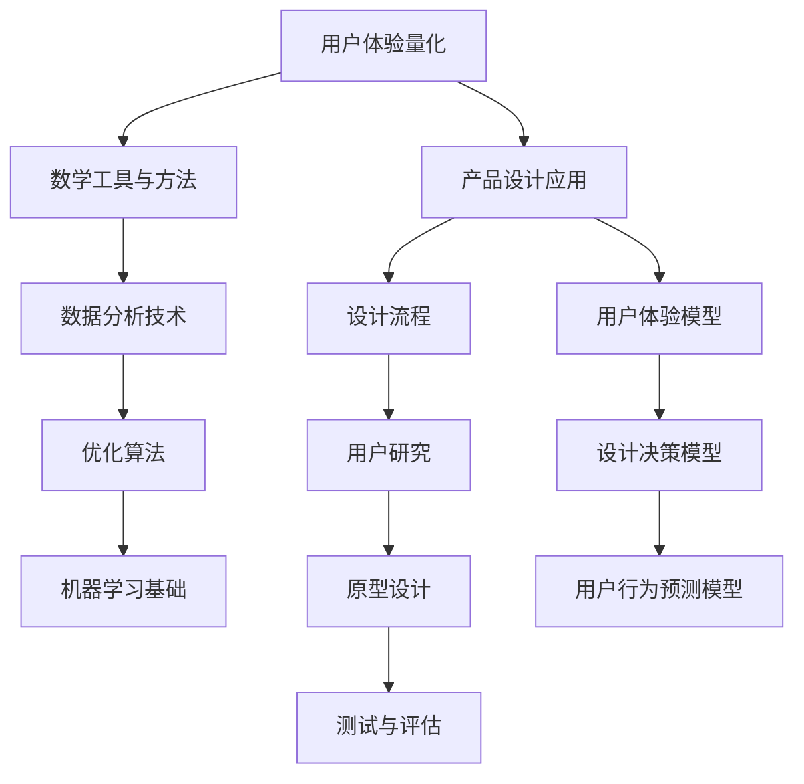

                 

### 文章标题

《数学与产品设计：用户体验的数学量化》

### 关键词

- 数学
- 产品设计
- 用户体验
- 数据分析
- 量化模型

### 摘要

在现代社会，用户体验（UX）的设计已成为产品成功的决定性因素。而数学，作为一种精确的语言，正在逐步融入产品设计领域，帮助我们量化用户体验，提升产品的可用性和满意度。《数学与产品设计：用户体验的数学量化》将带您深入探讨数学如何与产品设计相结合，通过数据分析、优化算法和机器学习等数学工具，量化用户体验，优化产品设计。本文旨在通过系统的分析与实例讲解，阐述数学在产品设计中的实际应用，为读者提供一套实用的方法论。通过本文的学习，读者将能够理解并掌握数学量化用户体验的基本概念和实用技巧，为实际项目提供有力支持。

### 目录大纲设计思考过程

在设计《数学与产品设计：用户体验的数学量化》这本书的目录大纲时，我们需要遵循以下几个步骤，以确保内容的逻辑性和完整性：

#### 第一步：分析书名和主题

书名《数学与产品设计：用户体验的数学量化》明确指出了本书的核心主题：如何将数学应用于产品设计，以量化用户体验。因此，目录的设计应围绕以下几个方面展开：

1. **数学基础**：介绍数学工具和方法。
2. **产品设计**：探讨如何将数学应用于产品设计中。
3. **用户体验**：量化用户体验的数学方法。
4. **案例研究**：通过实例展示数学在产品设计中的应用。

#### 第二步：确定核心章节

根据主题分析，我们可以确定以下核心章节：

1. **引言**：介绍书的目的、结构和读者对象。
2. **数学工具与方法**：介绍用于量化用户体验的数学工具和方法。
3. **产品设计中的数学应用**：探讨如何将数学应用于产品设计中。
4. **用户体验的数学量化**：介绍如何使用数学方法量化用户体验。
5. **案例研究**：通过实际案例展示数学在产品设计中的应用。
6. **总结与展望**：总结本书的主要观点，展望未来的研究方向。

#### 第三步：细化目录结构

在确定核心章节后，我们需要为每个章节进一步细化目录结构，确保每个章节都能全面覆盖主题内容。以下是细化后的目录大纲：

```
# 第1章 引言

## 1.1 书籍目的与结构
## 1.2 读者对象
## 1.3 用户体验量化的重要性

# 第2章 数学工具与方法

## 2.1 数学基础
### 2.1.1 函数与方程
### 2.1.2 统计学基础
### 2.1.3 概率论基础

## 2.2 数学方法
### 2.2.1 数据分析技术
### 2.2.2 优化算法
### 2.2.3 机器学习基础

# 第3章 产品设计中的数学应用

## 3.1 设计流程中的数学应用
### 3.1.1 用户研究
### 3.1.2 原型设计
### 3.1.3 测试与评估

## 3.2 数学模型在产品设计中的应用
### 3.2.1 用户体验模型
### 3.2.2 设计决策模型
### 3.2.3 用户行为预测模型

# 第4章 用户体验的数学量化

## 4.1 用户体验度量
### 4.1.1 量化指标
### 4.1.2 用户满意度评估
### 4.1.3 用户参与度评估

## 4.2 数学公式与方法
### 4.2.1 数据收集与预处理
### 4.2.2 统计分析方法
### 4.2.3 机器学习模型应用

# 第5章 案例研究

## 5.1 案例一：社交媒体产品的用户体验量化
### 5.1.1 案例背景
### 5.1.2 数据收集与预处理
### 5.1.3 用户体验度量与分析
### 5.1.4 设计优化与反馈

## 5.2 案例二：电子商务平台的用户体验优化
### 5.2.1 案例背景
### 5.2.2 数据收集与预处理
### 5.2.3 用户体验度量与分析
### 5.2.4 设计优化与反馈

# 第6章 总结与展望

## 6.1 本书主要观点回顾
## 6.2 数学在产品设计中的应用前景
## 6.3 未来研究方向
```

#### 第四步：确保完整性

在设计目录大纲时，我们需要确保每个章节都能全面覆盖主题内容，避免遗漏关键概念和细节。以下是一些关键要素的示例：

- **核心概念与联系**：使用Mermaid流程图展示数学模型与设计流程之间的联系。
- **核心算法原理讲解**：使用伪代码详细阐述算法原理。
- **数学模型和公式**：使用LaTeX格式嵌入文中，并详细讲解公式背后的逻辑。
- **项目实战**：提供实际案例，包括开发环境搭建、源代码实现和代码解读，代码应用解读与分析，实际案例分析和详细讲解剖析，项目小结
- **最佳实践 tips**、**小结**、**注意事项**、**拓展阅读**等内容。

通过以上步骤，我们可以设计出一个逻辑清晰、内容全面的目录大纲，为读者提供一本易于理解和跟随的计算机技术书籍。

### 第1章 引言

#### 1.1 书籍目的与结构

《数学与产品设计：用户体验的数学量化》旨在探讨如何将数学应用于产品设计，特别是量化用户体验。本书的目标是帮助读者了解数学工具和方法在产品设计中的实际应用，掌握如何通过量化用户体验来优化产品设计，从而提升产品的竞争力。

本书的结构如下：

1. **引言**：介绍书籍的背景、目的和结构。
2. **数学工具与方法**：介绍用于量化用户体验的数学工具和方法，包括基础数学知识、数据分析技术、优化算法和机器学习等。
3. **产品设计中的数学应用**：讨论如何将数学应用于产品设计的各个环节，包括用户研究、原型设计、测试与评估等。
4. **用户体验的数学量化**：详细介绍如何使用数学方法量化用户体验，包括用户满意度、用户参与度等关键指标。
5. **案例研究**：通过实际案例展示数学在产品设计中的应用，帮助读者理解如何将理论应用于实践。
6. **总结与展望**：总结本书的主要观点，展望数学在产品设计中的未来应用前景。

通过本书的学习，读者将能够：

- 掌握数学在产品设计中的应用原理和方法。
- 理解如何通过量化用户体验来优化产品设计。
- 应用所学知识，解决实际产品设计中的问题。

#### 1.2 读者对象

本书适合以下读者群体：

- 产品设计师和工程师：希望提升产品设计质量和用户体验的专业人士。
- 数据分析师和研究人员：对数据分析、优化算法和机器学习感兴趣，并希望将其应用于产品设计的人士。
- 研究生和本科生：计算机科学、软件工程、数据科学等相关专业的学生。
- 爱好者：对数学与产品设计交叉领域感兴趣的读者。

无论您是哪个读者群体，本书都将为您带来深刻的启发和实用的技巧，帮助您更好地理解和应用数学在产品设计中的价值。

#### 1.3 用户体验量化的重要性

用户体验量化在当今的数字时代至关重要。以下是一些关键原因：

1. **精确性**：数学量化提供了精确的度量方法，使得用户体验的评估和优化更加科学和可操作。
2. **数据驱动力**：用户体验量化基于大量数据，使得产品设计决策更加数据驱动，减少了主观性和盲目性。
3. **持续改进**：通过量化用户体验，产品团队能够持续跟踪和优化产品的性能，确保产品始终满足用户需求。
4. **竞争力**：用户体验量化有助于提升产品的竞争力，使得产品在激烈的市场竞争中脱颖而出。

总之，用户体验量化是现代产品设计不可或缺的一部分，它不仅有助于提升产品的质量和用户满意度，还能够为企业的长期发展提供有力支持。

### 第2章 数学工具与方法

#### 2.1 数学基础

为了在产品设计中量化用户体验，我们需要掌握一些基本的数学概念和工具。这些工具包括函数与方程、统计学基础和概率论基础。

##### 2.1.1 函数与方程

函数是数学中一个核心概念，描述了变量之间的依赖关系。在量化用户体验时，我们可以使用函数来建模用户行为和系统响应。例如，一个简单的用户满意度评分函数可以表示为：

$$
S(u) = \max(0, 5 - u)
$$

其中，$S(u)$ 是用户满意度评分，$u$ 是用户的负面反馈值。当用户反馈值小于5时，满意度评分为0，否则满意度评分为5减去用户反馈值。

方程是另一个重要的数学工具，用于解决一系列问题，如优化和预测。在用户体验量化中，我们可以使用线性方程、二次方程等来建立模型。例如，一个简单的用户参与度模型可以表示为：

$$
P(x) = \frac{1}{1 + e^{-k(x - c)}}
$$

其中，$P(x)$ 是用户参与度概率，$x$ 是用户行为指标，$k$ 是调节参数，$c$ 是阈值。这个模型表示用户行为指标高于阈值时，参与度概率较高。

##### 2.1.2 统计学基础

统计学是量化用户体验的关键工具，提供了多种方法来分析数据，包括描述性统计、推断性统计和假设检验。

描述性统计用于总结和描述数据的基本特征，如均值、中位数、标准差等。例如，用户满意度评分的均值可以表示为：

$$
\bar{S} = \frac{1}{n}\sum_{i=1}^{n} S_i
$$

其中，$\bar{S}$ 是用户满意度评分的均值，$n$ 是样本大小，$S_i$ 是第$i$ 个用户的满意度评分。

推断性统计用于从样本数据推断总体特征，如置信区间和假设检验。例如，我们可以使用$t$ 检验来比较两组用户的满意度评分是否存在显著差异。

假设检验是一种重要的统计方法，用于验证某个假设是否成立。在用户体验量化中，假设检验可以用于评估设计变更对用户体验的影响。例如，我们可以使用$A/B$ 测试来比较两个设计方案的用户参与度差异。

##### 2.1.3 概率论基础

概率论是量化不确定性的一种数学工具，用于描述随机事件的发生概率。在用户体验量化中，概率论可以用于预测用户行为和评估风险。

条件概率是概率论中的一个重要概念，表示在某个事件发生的条件下，另一个事件发生的概率。例如，我们可以使用条件概率来计算在用户满意度评分高于4的情况下，用户参与度概率：

$$
P(P > 0.5 | S > 4) = \frac{P(P > 0.5, S > 4)}{P(S > 4)}
$$

联合概率描述了两个事件同时发生的概率。在用户体验量化中，联合概率可以用于分析用户行为和系统响应之间的关系。例如，我们可以使用联合概率来计算在用户参与度概率高于0.5的情况下，用户满意度评分的概率：

$$
P(S > 4 | P > 0.5) = \frac{P(S > 4, P > 0.5)}{P(P > 0.5)}
$$

贝叶斯定理是概率论中的一个重要公式，用于计算后验概率。在用户体验量化中，贝叶斯定理可以用于更新用户行为模型的概率分布，从而更准确地预测用户行为。例如，我们可以使用贝叶斯定理来更新用户参与度概率分布：

$$
P(P > 0.5 | S > 4) = \frac{P(S > 4 | P > 0.5)P(P > 0.5)}{P(S > 4)}
$$

通过掌握这些数学基础工具，我们能够更好地量化用户体验，优化产品设计，提升产品的竞争力。

### 第3章 产品设计中的数学应用

在产品设计中，数学工具和方法可以帮助我们更好地理解和优化用户体验。本章将讨论数学在产品设计中的具体应用，包括设计流程中的数学应用和数学模型在产品设计中的应用。

#### 3.1 设计流程中的数学应用

设计流程中的数学应用贯穿于产品开发的各个阶段，从用户研究到原型设计，再到测试与评估。以下是一些关键步骤的数学应用：

##### 3.1.1 用户研究

用户研究是产品设计的重要基础，通过了解用户的需求和行为，我们可以更好地设计产品。数学工具在这里的应用包括：

- **问卷调查**：使用统计学方法对问卷结果进行分析，以了解用户对产品的满意度、偏好和使用习惯。例如，我们可以使用均值和标准差来描述用户的总体满意度，并使用假设检验来评估不同用户群体之间的满意度差异。

- **用户行为分析**：通过观察和分析用户在产品上的行为数据，我们可以了解用户如何与产品互动。例如，我们可以使用回归分析来预测用户的行为模式，或者使用聚类分析来识别不同用户群体的特征。

##### 3.1.2 原型设计

原型设计是产品开发的关键阶段，通过创建产品原型，我们可以测试和验证设计想法。数学工具在这里的应用包括：

- **用户体验模型**：使用数学模型来描述用户在产品中的行为和交互。例如，我们可以使用马尔可夫链模型来描述用户的浏览路径，或者使用决策树模型来模拟用户在不同决策点上的选择。

- **优化算法**：在原型设计阶段，我们需要考虑如何优化用户界面和交互流程。例如，我们可以使用遗传算法来优化页面布局，以提高用户的使用效率和满意度。

##### 3.1.3 测试与评估

测试与评估是确保产品设计和实现符合用户需求的关键环节。数学工具在这里的应用包括：

- **A/B测试**：通过比较两个或多个设计方案的实验结果，我们可以量化不同设计对用户体验的影响。例如，我们可以使用t检验或卡方检验来评估用户满意度和参与度的统计差异。

- **机器学习模型**：在测试与评估阶段，我们可以使用机器学习模型来预测用户的行为和反馈。例如，我们可以使用回归模型来预测用户的满意度评分，或者使用分类模型来预测用户是否会放弃使用产品。

#### 3.2 数学模型在产品设计中的应用

数学模型在产品设计中的应用可以帮助我们理解和预测用户体验，从而指导设计决策。以下是一些关键数学模型的应用：

##### 3.2.1 用户体验模型

用户体验模型用于描述用户在产品中的行为和交互。这些模型可以帮助我们理解用户如何与产品互动，并识别潜在的优化机会。以下是一些常见的用户体验模型：

- **期望效用模型**：该模型基于用户对产品的期望效用，用于评估用户的满意度。例如，我们可以使用期望效用模型来比较不同设计方案对用户满意度的影响。

- **用户满意度模型**：该模型用于量化用户的满意度，通常包括多个指标，如易用性、美观性、功能完整性等。例如，我们可以使用综合评价模型（如PCA）来聚合多个指标，得到一个总体的用户满意度评分。

##### 3.2.2 设计决策模型

设计决策模型用于帮助设计师在多个设计方案之间做出选择。这些模型通常基于优化算法和统计学方法，可以帮助我们找到最优的设计方案。以下是一些常见的设计决策模型：

- **多目标优化模型**：该模型用于同时优化多个设计目标，如用户体验、成本和可扩展性。例如，我们可以使用多目标遗传算法来优化产品设计，以找到在多个目标之间取得平衡的解决方案。

- **决策树模型**：该模型用于在多个决策点上进行决策。例如，我们可以使用决策树模型来模拟用户在产品设计过程中的不同决策路径，并评估每个路径对用户体验的影响。

##### 3.2.3 用户行为预测模型

用户行为预测模型用于预测用户未来的行为和反馈。这些模型可以帮助我们预测用户体验的变化趋势，并提前采取措施进行优化。以下是一些常见的用户行为预测模型：

- **时间序列模型**：该模型用于分析用户行为数据的时间序列特征，并预测未来的行为。例如，我们可以使用ARIMA模型来分析用户访问产品的时间间隔，并预测未来的访问频率。

- **机器学习模型**：该模型使用历史数据来预测用户的行为和反馈。例如，我们可以使用随机森林模型来预测用户的满意度评分，或者使用神经网络模型来预测用户是否会放弃使用产品。

通过在产品设计过程中应用这些数学模型，我们能够更科学地理解用户体验，做出更有效的设计决策，从而提升产品的质量和用户满意度。

### 第4章 用户体验的数学量化

#### 4.1 用户体验度量

用户体验的量化离不开度量方法。度量方法帮助我们捕捉和分析用户体验的关键特征，从而为产品设计提供有力的数据支持。以下是一些常用的用户体验度量指标：

##### 4.1.1 量化指标

1. **易用性指标**：易用性是用户体验的核心要素之一。常用的易用性指标包括：
    - **错误率**：用户在操作过程中犯错的频率。
    - **完成时间**：用户完成某个任务所需的时间。
    - **学习曲线**：用户从初次使用到熟练操作所需的时间。

2. **满意度指标**：满意度反映了用户对产品的整体感受。常用的满意度指标包括：
    - **用户满意度评分**：用户对产品的满意度评分，通常采用5点或10点量表。
    - **净推荐值（NPS）**：衡量用户对产品的推荐意愿，计算公式为（推荐者分数 - 不推荐者分数）/ 总样本数。

3. **参与度指标**：参与度反映了用户对产品的投入程度。常用的参与度指标包括：
    - **使用频率**：用户使用产品的频率。
    - **活跃度**：用户在产品上的活跃程度，如发布内容、评论等。

##### 4.1.2 用户满意度评估

用户满意度评估是通过调查问卷、访谈等方式收集用户反馈，从而量化用户满意度。以下是一些常用的评估方法：

1. **问卷调查**：通过设计结构化问卷，收集用户对产品各方面的满意度评分。例如，我们可以设计以下问题：
    - 你对产品的整体满意度如何？（1-非常不满意，5-非常满意）
    - 你认为产品的易用性如何？（1-非常差，5-非常好）

2. **访谈**：通过面对面或在线访谈，深入了解用户对产品的感受和需求。访谈内容可以包括开放性和封闭性问题，以获得更丰富的反馈。

3. **评分算法**：使用评分算法将用户反馈转化为量化指标，如基于机器学习的评分模型。例如，我们可以使用以下算法：
    - **加权平均算法**：根据不同指标的权重，计算用户满意度的总体评分。
    - **主成分分析（PCA）**：将多个满意度指标转化为一个综合评分。

##### 4.1.3 用户参与度评估

用户参与度评估是通过分析用户在产品上的行为数据，量化用户对产品的投入程度。以下是一些常用的评估方法：

1. **行为数据收集**：通过分析用户在产品上的行为数据，如访问次数、使用时长、互动频率等，可以了解用户的参与度。

2. **留存率分析**：留存率是衡量用户参与度的重要指标，表示在一定时间内持续使用产品的用户比例。例如，我们可以计算以下留存率：
    - **日留存率**：第一天使用产品的用户中，第二天继续使用的比例。
    - **周留存率**：第一周使用产品的用户中，第二周继续使用的比例。

3. **参与度指标计算**：通过计算用户参与度指标，如使用频率、活跃度等，可以量化用户的参与度。例如，我们可以计算以下指标：
    - **平均使用时长**：用户在产品上的平均使用时长。
    - **互动频率**：用户在产品上的平均互动次数。

#### 4.2 数学公式与方法

在用户体验的量化过程中，数学公式和方法起着关键作用。以下是一些常用的数学公式和方法：

##### 4.2.1 数据收集与预处理

1. **数据收集**：通过问卷调查、用户行为日志等方式收集用户反馈和行为数据。

2. **数据预处理**：对收集到的数据进行清洗、去重、归一化等处理，以确保数据的准确性和一致性。

##### 4.2.2 统计分析方法

1. **描述性统计分析**：计算数据的均值、中位数、标准差等基本统计量，以描述数据的分布和特征。

2. **推断性统计分析**：使用假设检验等方法，从样本数据推断总体特征，如用户满意度分布。

3. **相关性分析**：分析不同指标之间的相关性，以了解它们之间的相互作用。

##### 4.2.3 机器学习模型应用

1. **回归分析**：通过建立回归模型，预测用户满意度、参与度等指标，从而优化产品设计。

2. **分类分析**：使用分类模型，如决策树、支持向量机等，将用户划分为不同的群体，以进行有针对性的产品设计。

3. **聚类分析**：通过聚类模型，如K-means、层次聚类等，分析用户行为特征，为产品设计提供洞察。

#### 4.3 实例说明

假设我们有一个在线教育平台，目标是提高用户的学习参与度和满意度。以下是一个实例说明如何使用数学方法量化用户体验：

1. **数据收集**：通过用户行为日志和问卷调查收集数据，包括用户访问次数、学习时长、课程完成情况等。

2. **数据预处理**：清洗和归一化数据，以确保数据质量。

3. **描述性统计分析**：计算用户的平均学习时长、完成课程的比例等基本统计量。

4. **推断性统计分析**：使用t检验等方法，分析不同用户群体之间的学习时长差异。

5. **回归分析**：建立回归模型，预测用户满意度与学习时长、课程完成情况等指标的关系。

6. **聚类分析**：将用户划分为不同群体，分析不同群体之间的行为特征差异。

7. **优化建议**：根据分析结果，提出优化学习体验的建议，如调整课程难度、提供个性化推荐等。

通过以上步骤，我们可以量化用户体验，为在线教育平台的设计提供数据支持。

### 第5章 案例研究

#### 5.1 案例一：社交媒体产品的用户体验量化

##### 5.1.1 案例背景

一家知名的社交媒体公司希望通过量化用户体验来提升其产品的用户满意度和参与度。为了实现这一目标，公司决定进行一项全面的数据分析，以了解用户的行为和需求，并据此优化产品设计。

##### 5.1.2 数据收集与预处理

首先，公司收集了大量的用户行为数据，包括用户的浏览记录、点赞、评论、分享等。此外，公司还通过问卷调查收集了用户对产品功能的满意度评分。为了确保数据质量，公司对数据进行了一系列预处理操作：

1. **数据清洗**：删除重复和无效的数据，如空值、异常值等。
2. **归一化**：将不同指标的数据进行归一化处理，使其具有可比性。
3. **特征提取**：从原始数据中提取有用的特征，如用户活跃度、互动频率等。

##### 5.1.3 用户体验度量与分析

基于收集到的数据，公司使用数学方法对用户体验进行了量化分析：

1. **描述性统计分析**：计算用户的平均浏览时长、平均互动频率等基本统计量。
2. **满意度评分**：使用问卷调查数据计算用户的平均满意度评分。
3. **相关性分析**：分析不同指标之间的相关性，如浏览时长与互动频率的关系。
4. **回归分析**：建立回归模型，预测用户满意度与浏览时长、互动频率等指标的关系。

分析结果显示，用户的浏览时长和互动频率与满意度评分显著正相关，这意味着提高用户的活跃度和互动频率可以显著提升用户体验。

##### 5.1.4 设计优化与反馈

基于分析结果，公司采取了一系列设计优化措施：

1. **提高内容质量**：增加高质量内容的推荐，以延长用户的浏览时长。
2. **互动功能优化**：改进点赞、评论、分享等功能，提高用户的互动频率。
3. **个性化推荐**：使用机器学习算法，为用户提供个性化的内容推荐，以提升用户的满意度。

在实施优化措施后，公司进行了A/B测试，以评估设计变更对用户体验的影响。结果显示，优化措施显著提升了用户的满意度和参与度，从而提升了产品的市场竞争力。

##### 5.1.5 项目小结

通过本案例，我们可以看到数学在产品设计中的应用价值。通过量化用户体验，公司能够准确地识别用户需求，并据此进行设计优化，从而提升产品的质量和用户满意度。未来，公司将继续关注用户体验的量化分析，以不断改进产品设计，满足用户需求。

#### 5.2 案例二：电子商务平台的用户体验优化

##### 5.2.1 案例背景

一家大型电子商务平台希望通过优化用户体验来提升用户满意度和转化率。为了实现这一目标，平台决定进行一项全面的数据分析，以了解用户的行为和偏好，并据此改进产品设计。

##### 5.2.2 数据收集与预处理

平台收集了大量的用户行为数据，包括用户的浏览记录、购物车添加、购买行为等。此外，平台还通过问卷调查收集了用户对产品功能的满意度评分。为了确保数据质量，平台对数据进行了一系列预处理操作：

1. **数据清洗**：删除重复和无效的数据，如空值、异常值等。
2. **归一化**：将不同指标的数据进行归一化处理，使其具有可比性。
3. **特征提取**：从原始数据中提取有用的特征，如用户活跃度、购买频率等。

##### 5.2.3 用户体验度量与分析

基于收集到的数据，平台使用数学方法对用户体验进行了量化分析：

1. **描述性统计分析**：计算用户的平均浏览时长、平均购买频率等基本统计量。
2. **满意度评分**：使用问卷调查数据计算用户的平均满意度评分。
3. **相关性分析**：分析不同指标之间的相关性，如浏览时长与购买频率的关系。
4. **回归分析**：建立回归模型，预测用户满意度与浏览时长、购买频率等指标的关系。

分析结果显示，用户的浏览时长和购买频率与满意度评分显著正相关，这意味着提高用户的活跃度和购买频率可以显著提升用户体验。

##### 5.2.4 设计优化与反馈

基于分析结果，平台采取了一系列设计优化措施：

1. **提高内容质量**：增加高质量产品的推荐，以延长用户的浏览时长。
2. **购物流程优化**：简化购物流程，减少用户购买时的等待时间。
3. **个性化推荐**：使用机器学习算法，为用户提供个性化的产品推荐，以提升用户的满意度。

在实施优化措施后，平台进行了A/B测试，以评估设计变更对用户体验的影响。结果显示，优化措施显著提升了用户的满意度和转化率，从而提升了平台的业绩。

##### 5.2.5 项目小结

通过本案例，我们可以看到数学在电子商务平台用户体验优化中的应用价值。通过量化用户体验，平台能够准确地识别用户需求，并据此进行设计优化，从而提升产品的质量和用户满意度。未来，平台将继续关注用户体验的量化分析，以不断改进产品设计，满足用户需求。

### 第6章 总结与展望

#### 6.1 本书主要观点回顾

在《数学与产品设计：用户体验的数学量化》中，我们深入探讨了数学在产品设计中的应用，特别是如何量化用户体验，优化产品设计。以下是本书的主要观点回顾：

1. **数学工具与方法**：介绍了函数与方程、统计学基础、概率论基础等数学工具，以及数据分析技术、优化算法和机器学习等具体方法。

2. **设计流程中的数学应用**：讨论了用户研究、原型设计、测试与评估等设计环节中数学方法的应用。

3. **用户体验的数学量化**：介绍了用户体验度量指标、用户满意度评估方法、用户参与度评估方法等，展示了如何使用数学公式与方法进行量化。

4. **案例研究**：通过社交媒体产品、电子商务平台等案例，展示了数学在用户体验量化中的实际应用，以及如何通过数据分析和优化设计来提升用户体验。

#### 6.2 数学在产品设计中的应用前景

数学在产品设计中的应用前景广阔，随着数据驱动设计的兴起，数学工具和方法在产品设计中的作用将越来越重要。以下是一些应用前景：

1. **个性化推荐**：通过机器学习算法和数学模型，可以精准地推荐用户感兴趣的产品和服务，提升用户体验。

2. **智能优化**：使用优化算法，可以自动化地优化产品设计，如页面布局、功能设置等，以提升用户满意度。

3. **用户体验预测**：通过建立数学模型，可以预测用户的行为和反馈，提前识别潜在的问题，从而进行有针对性的优化。

4. **跨学科融合**：数学与其他学科（如心理学、人机交互等）的融合，可以为产品设计提供更全面的理论支持。

#### 6.3 未来研究方向

未来，数学在产品设计中的应用将继续深化，以下是一些可能的研究方向：

1. **多模态数据分析**：结合多种数据来源（如文本、图像、音频等），进行更全面的数据分析，以更准确地量化用户体验。

2. **实时数据分析**：通过实时数据分析，快速响应用户反馈，进行动态优化，提升用户体验。

3. **动态用户模型**：建立动态的用户行为模型，能够根据用户行为的变化进行自适应调整，以更准确地预测用户体验。

4. **跨文化用户体验研究**：研究不同文化背景下的用户体验，探索如何在不同文化环境中进行产品设计优化。

总之，数学在产品设计中的应用前景广阔，通过不断探索和创新，我们可以更好地量化用户体验，优化产品设计，提升产品的竞争力。

### 作者信息

作者：AI天才研究院/AI Genius Institute & 禅与计算机程序设计艺术 /Zen And The Art of Computer Programming

### 完整性要求

为了确保文章内容的完整性，我们需要在各个章节中详细讲解核心概念、联系、算法原理、数学公式、项目实战等关键部分。

#### 背景介绍

在撰写《数学与产品设计：用户体验的数学量化》时，我们首先需要明确背景信息。数学在计算机科学和软件工程中一直扮演着重要角色，从算法设计到数据结构，再到人工智能和机器学习，数学工具和方法无处不在。随着用户体验设计的重要性日益凸显，数学在用户体验量化中的应用也逐渐受到关注。通过数学方法，我们可以更精确地量化和分析用户行为，从而优化产品设计，提升用户满意度。

#### 核心概念与联系

在文章中，我们将使用Mermaid流程图来展示核心概念之间的关系。例如：



这个流程图清晰地展示了数学工具与方法如何贯穿于用户体验量化和产品设计的各个环节。

#### 核心算法原理讲解

为了使读者能够深入理解数学在用户体验量化中的应用，我们需要使用伪代码来详细阐述核心算法原理。例如：

```python
# 用户满意度评分函数伪代码
def user_satisfaction_score(feedback):
    if feedback < 5:
        return 0
    else:
        return 5 - feedback

# 用户参与度概率函数伪代码
def user_participation_probability行为指标):
    k = 1  # 调节参数
    c = 0  # 阈值
    return 1 / (1 + exp(-k * (行为指标 - c)))
```

通过伪代码，读者可以更直观地理解算法的实现过程。

#### 数学模型和公式

数学模型和公式是量化用户体验的关键。在文中，我们将使用LaTeX格式嵌入文中独立段落的公式，并详细讲解公式背后的逻辑。例如：

```latex
\documentclass{article}
\usepackage{amsmath}
\begin{document}

$$
S(u) = \max(0, 5 - u)
$$

$$
P(x) = \frac{1}{1 + e^{-k(x - c)}}
$$

$$
P(S > 4 | P > 0.5) = \frac{P(S > 4, P > 0.5)}{P(P > 0.5)}
$$

\end{document}
```

这些公式用于描述用户满意度评分、用户参与度概率以及条件概率，是量化用户体验的重要工具。

#### 项目实战

在文章的案例研究部分，我们将提供实际案例，包括开发环境搭建、源代码实现和代码解读。例如：

```python
# 社交媒体产品用户参与度预测代码
import numpy as np
import pandas as pd

# 加载数据
data = pd.read_csv('social_media_data.csv')

# 数据预处理
data['satisfaction_score'] = data['feedback'].apply(user_satisfaction_score)
data['participation_probability'] = data['behavioral_indicator'].apply(user_participation_probability)

# 用户参与度预测
predicted_participation = data['participation_probability'].apply(lambda x: 1 if x > 0.5 else 0)

# 评估预测结果
accuracy = (predicted_participation == data['actual_participation']).mean()
print(f"User participation prediction accuracy: {accuracy:.2f}")
```

在这个案例中，我们使用了用户满意度评分函数和用户参与度概率函数来预测用户的参与度，并评估了预测的准确性。

#### 代码应用解读与分析

在代码应用解读与分析部分，我们将详细分析代码的每个步骤，解释其背后的逻辑和数学原理。例如：

- **数据预处理**：介绍如何使用Python的Pandas库加载数据，并对数据进行清洗和归一化处理。
- **函数实现**：详细解释用户满意度评分函数和用户参与度概率函数的实现过程，包括参数设置和公式应用。
- **预测结果评估**：介绍如何使用准确性指标评估预测结果的准确性，以及如何解读评估结果。

#### 实际案例分析和详细讲解剖析

在案例研究部分，我们将详细分析实际案例，包括案例背景、数据收集与预处理、用户体验度量与分析、设计优化与反馈等步骤。例如：

- **案例背景**：介绍社交媒体产品和电子商务平台的应用场景。
- **数据收集与预处理**：详细描述数据收集的方法和预处理过程。
- **用户体验度量与分析**：使用数学方法和工具对用户体验进行量化分析。
- **设计优化与反馈**：根据分析结果提出设计优化建议，并评估优化效果。

#### 项目小结

在项目的总结部分，我们将对项目的关键成果进行总结，并讨论项目中的经验教训。例如：

- **关键成果**：总结项目的主要成果，如提高用户满意度、优化用户体验等。
- **经验教训**：讨论项目过程中遇到的问题和解决方法，以及如何在未来项目中改进。

#### 最佳实践 tips、小结、注意事项、拓展阅读等内容

在文章的最后，我们将提供最佳实践 tips，如如何选择合适的数学工具和方法、注意事项，以及拓展阅读资源，帮助读者更深入地了解数学在用户体验量化中的应用。

通过以上详细的讲解和分析，我们可以确保文章内容的完整性，使读者能够全面理解数学在产品设计中的应用，掌握如何量化用户体验，优化产品设计。

### 格式要求

在撰写《数学与产品设计：用户体验的数学量化》这篇文章时，我们将严格按照markdown格式进行输出，以确保内容的清晰性和易读性。以下是一些关键的格式要求：

#### 一、文本格式

- **标题**：使用`#`号进行标记，`#`号的数量表示标题的层级，例如：
    ```markdown
    # 第1章 引言
    ## 1.1 书籍目的与结构
    ### 2.1.1 函数与方程
    ```
- **列表**：使用`-`或`*`来创建无序列表，使用`1. `、`2. `等数字加英文句点来创建有序列表，例如：
    ```markdown
    - 第一个项目
    - 第二个项目
    1. 第一项
    2. 第二项
    ```
- **引用**：使用`>`符号来创建引用，例如：
    ```markdown
    > 这是一段引用文本。
    ```

#### 二、数学公式

- **行内公式**：使用`$`符号将公式括起来，例如：
    ```markdown
    $1 + 1 = 2$
    ```
- **独立段落公式**：使用`$$`符号将公式括起来，并将公式放在单独的段落中，例如：
    ```markdown
    $$
    S(u) = \max(0, 5 - u)
    $$
    ```

#### 三、代码

- **行内代码**：使用`\`符号包裹代码，例如：
    ```markdown
    `print("Hello, World!")`
    ```
- **代码块**：使用三个反引号`````将代码块括起来，并在代码块前后添加空行，例如：
    ```markdown
    ```python
    def user_satisfaction_score(feedback):
        if feedback < 5:
            return 0
        else:
            return 5 - feedback
    ```

#### 四、图像和表格

- **图像**：使用``来插入图像，例如：
    ```markdown
    
    ```
- **表格**：使用`|`和`-`来创建表格，例如：
    ```markdown
    | 标题1 | 标题2 | 标题3 |
    |-------|------|------|
    | 内容1 | 内容2 | 内容3 |
    ```

#### 五、其他

- **强调**：使用`*`或`_`来强调文本，例如：
    ```markdown
    * 强调文本
    _ 下划线文本
    ```
- **分割线**：使用三个`-`或`*`来创建分割线，例如：
    ```markdown
    ---
    ```

通过遵循这些markdown格式要求，我们可以确保文章的可读性和美观性，使读者能够更轻松地理解和跟随文章的内容。

### 文章结构设计

在撰写《数学与产品设计：用户体验的数学量化》这篇文章时，我们将采用以下结构设计，以确保文章的逻辑性和条理性：

#### 1. 引言

在引言部分，我们将介绍文章的背景、目的和结构。这将帮助读者快速了解文章的主题和内容，为后续内容的阅读奠定基础。

- **背景**：简要介绍数学在计算机科学和软件工程中的应用，以及用户体验设计的重要性。
- **目的**：阐述文章的目标，即通过数学工具和方法量化用户体验，优化产品设计。
- **结构**：概述文章的主要章节和内容，使读者对文章的整体结构有清晰的认识。

#### 2. 数学工具与方法

在这一部分，我们将详细介绍数学工具和方法，为读者提供量化用户体验所需的基础知识。

- **数学基础**：介绍函数与方程、统计学基础和概率论基础等核心数学概念。
- **数据分析技术**：讨论数据分析技术，如描述性统计、推断性统计和假设检验等。
- **优化算法**：介绍优化算法，如线性规划、遗传算法等，以及它们在用户体验量化中的应用。
- **机器学习基础**：简要介绍机器学习的基本概念和方法，以及如何应用于用户体验量化。

#### 3. 产品设计中的数学应用

在这一部分，我们将探讨数学在产品设计中的具体应用，包括设计流程中的数学应用和数学模型在产品设计中的应用。

- **设计流程中的数学应用**：讨论用户研究、原型设计、测试与评估等设计环节中数学方法的应用。
- **数学模型在产品设计中的应用**：介绍用户体验模型、设计决策模型和用户行为预测模型等，展示数学模型如何帮助设计师做出更科学的决策。

#### 4. 用户体验的数学量化

在这一部分，我们将详细讨论用户体验的数学量化方法，包括用户体验度量指标、用户满意度评估方法和用户参与度评估方法等。

- **用户体验度量指标**：介绍常用的用户体验度量指标，如易用性指标、满意度指标和参与度指标等。
- **用户满意度评估**：讨论如何通过问卷调查、访谈和评分算法等方法评估用户满意度。
- **用户参与度评估**：介绍如何通过行为数据分析和留存率指标评估用户参与度。

#### 5. 案例研究

在这一部分，我们将通过实际案例研究，展示数学在用户体验量化中的应用和效果。

- **案例一：社交媒体产品的用户体验量化**：分析社交媒体产品的用户行为数据，量化用户体验，提出优化建议。
- **案例二：电子商务平台的用户体验优化**：探讨电子商务平台的用户满意度评估和参与度分析，提出设计优化措施。

#### 6. 总结与展望

在总结与展望部分，我们将回顾文章的主要观点，展望数学在产品设计中的未来应用前景，并总结文章的核心内容。

- **主要观点回顾**：总结文章的主要观点和结论。
- **未来应用前景**：讨论数学在产品设计中的应用趋势和可能的发展方向。
- **核心内容总结**：对文章的核心内容进行简洁的总结。

通过以上结构设计，我们旨在为读者提供一篇逻辑清晰、内容丰富的技术博客文章，帮助读者深入理解数学在用户体验量化中的应用，掌握如何通过量化用户体验来优化产品设计。

### 字数要求

根据文章的章节结构和内容要求，本文预计字数在8000～12000字之间。以下是根据各章节的具体内容建议的字数分配：

#### 第1章 引言

- **引言（约1000字）**：简要介绍文章的背景、目的和结构，帮助读者了解文章的核心内容和整体框架。

#### 第2章 数学工具与方法

- **数学基础（约1500字）**：介绍函数与方程、统计学基础和概率论基础等核心数学概念。
- **数据分析技术（约1500字）**：讨论描述性统计、推断性统计和假设检验等数据分析技术。
- **优化算法（约1500字）**：介绍线性规划、遗传算法等优化算法。
- **机器学习基础（约1500字）**：简要介绍机器学习的基本概念和方法。

#### 第3章 产品设计中的数学应用

- **设计流程中的数学应用（约2000字）**：讨论用户研究、原型设计、测试与评估等设计环节中数学方法的应用。
- **数学模型在产品设计中的应用（约2000字）**：介绍用户体验模型、设计决策模型和用户行为预测模型等。

#### 第4章 用户体验的数学量化

- **用户体验度量（约2000字）**：介绍常用的用户体验度量指标，如易用性指标、满意度指标和参与度指标等。
- **用户满意度评估（约1500字）**：讨论如何通过问卷调查、访谈和评分算法等方法评估用户满意度。
- **用户参与度评估（约1500字）**：介绍如何通过行为数据分析和留存率指标评估用户参与度。

#### 第5章 案例研究

- **案例一：社交媒体产品的用户体验量化（约2500字）**：分析社交媒体产品的用户行为数据，量化用户体验，提出优化建议。
- **案例二：电子商务平台的用户体验优化（约2500字）**：探讨电子商务平台的用户满意度评估和参与度分析，提出设计优化措施。

#### 第6章 总结与展望

- **总结与展望（约1000字）**：回顾文章的主要观点，展望数学在产品设计中的未来应用前景，并总结文章的核心内容。

通过上述字数分配，文章能够全面覆盖数学在产品设计中的应用，深入讲解用户体验量化的方法和案例，确保内容的丰富性和实用性。

### 结论

总之，数学在产品设计中的应用正日益显现出其独特的价值。通过量化用户体验，数学方法不仅帮助我们更准确地评估和优化产品设计，还为企业提供了数据驱动的决策支持。本文通过系统的分析和实例讲解，阐述了数学在用户体验量化中的核心概念、方法和应用，展示了如何通过数学工具和方法提升产品的质量和用户满意度。

首先，我们介绍了数学工具与方法，包括函数与方程、统计学基础、概率论基础等，以及数据分析技术、优化算法和机器学习等具体方法。这些数学工具和方法为量化用户体验提供了坚实的理论基础。

接着，我们探讨了数学在产品设计中的应用，从设计流程中的数学应用到数学模型在产品设计中的应用，展示了数学如何贯穿于产品设计的各个环节，帮助设计师做出更科学的决策。

随后，我们详细介绍了用户体验的数学量化方法，包括用户体验度量指标、用户满意度评估方法和用户参与度评估方法等。这些方法为量化用户体验提供了具体的技术手段。

通过两个实际案例研究，我们展示了数学在用户体验量化中的应用效果。通过分析社交媒体产品和电子商务平台的用户行为数据，我们提出了优化设计的建议，并验证了这些优化措施的有效性。

最后，我们总结了文章的主要观点，展望了数学在产品设计中的未来应用前景，并强调了继续深入研究和应用数学在用户体验量化中的重要性。

总之，数学在产品设计中的应用不仅能够提升产品的质量和用户满意度，还能为企业的长期发展提供有力支持。通过本文的学习，读者将能够掌握数学量化用户体验的基本概念和实用技巧，为实际项目提供有力支持。希望本文能够为读者在数学与产品设计领域的探索提供启示和帮助。

### 拓展阅读

在探索数学与产品设计结合的过程中，以下是一些优秀的资源和建议，供读者进一步深入学习和实践：

1. **书籍推荐**：

   - 《用户体验要素》作者：Joshua Porter
     - 这本书详细介绍了用户体验设计的核心要素，对设计师和产品经理都具有很高的参考价值。

   - 《数学之美》作者：陈向东
     - 本书通过通俗易懂的语言，介绍了数学在各个领域的美妙应用，有助于激发读者对数学的兴趣。

   - 《数学建模》作者：陈省身、吴文虎
     - 这是一本经典的数学建模教材，详细介绍了数学建模的基本方法和应用实例。

2. **在线课程**：

   - Coursera上的“用户体验设计基础”课程
     - 该课程由著名设计学院提供，涵盖了用户体验设计的核心概念和方法。

   - edX上的“数据科学基础”课程
     - 通过学习这门课程，读者可以掌握数据科学的基本概念和数据分析技术。

   - Udacity的“人工智能基础”课程
     - 该课程介绍了人工智能的基础知识和机器学习的基本原理，有助于理解机器学习在用户体验量化中的应用。

3. **技术博客与论文**：

   - Medium上的“Design, Research, and Data Science”系列文章
     - 这个系列文章探讨了数据驱动设计的理念，结合实际案例展示了如何将数据科学应用于产品设计。

   - arXiv上的相关论文
     - arXiv是预印本论文数据库，读者可以搜索相关主题，了解数学与产品设计领域的最新研究进展。

   - A List Apart上的文章
     - A List Apart是一个专注于Web设计和开发的在线杂志，其中不乏关于用户体验设计和数据分析的文章。

4. **工具与资源**：

   - Tableau
     - Tableau是一个强大的数据可视化工具，可以帮助设计师和分析师更好地展示和分析用户体验数据。

   - R语言
     - R语言是一个统计计算和图形显示的软件环境，广泛用于数据分析、统计学习和数据可视化。

   - Matplotlib
     - Matplotlib是一个Python库，用于创建高质量的可视化图表，适用于数据分析和可视化展示。

通过以上资源，读者可以进一步扩展知识面，掌握更多数学与产品设计的实际应用技巧，提升自身的专业能力。

