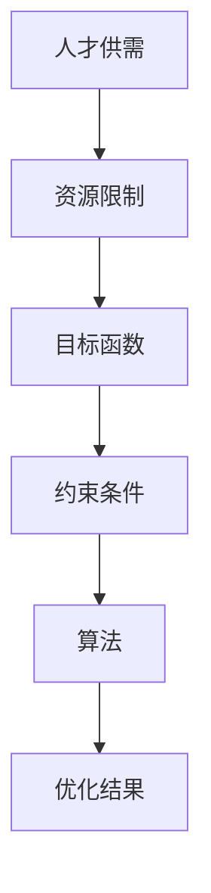

                 


## 数学与人力资源管理：人才配置的数学优化

### 关键词
- 数学优化
- 人力资源管理
- 人才配置
- 线性规划
- 非线性规划
- 整数规划
- 多目标优化

### 摘要
本文探讨了数学优化在人力资源管理中的应用，尤其是人才配置的数学优化。文章首先介绍了数学优化在人力资源管理中的重要性，随后详细阐述了人才配置中的核心概念和数学模型，包括人才供需模型、项目组合优化模型和劳动力匹配模型。接着，文章深入分析了线性规划、非线性规划和整数规划等核心算法原理，并通过伪代码进行了详细阐述。随后，文章介绍了多目标优化的基本原理，并应用实际案例对算法进行了实战分析。最后，文章总结了数学优化在人力资源管理中的应用价值，并展望了未来的发展趋势。

### 引言与背景知识

数学优化在人力资源管理中扮演着至关重要的角色。随着全球化进程的加速和企业竞争的加剧，人力资源管理面临着越来越多的挑战。如何科学地识别和配置人才，以最大化企业的生产力和效益，成为企业管理者和人力资源从业者亟待解决的核心问题。在这一背景下，数学优化提供了强有力的工具和方法，能够帮助企业实现高效的人才配置。

首先，让我们回顾一下数学优化的基本概念。数学优化，又称运筹学或优化理论，是一种利用数学方法解决实际问题的科学。它通过建立数学模型，寻求在特定约束条件下使目标函数达到最优值的解决方案。数学优化广泛应用于生产管理、物流运输、财务规划等多个领域，其核心思想是利用数学工具和算法来寻找最优解或近似最优解。

在人力资源管理中，数学优化的应用主要体现在以下几个方面：

1. **人才供需匹配**：通过数学模型分析企业内外部的人才需求与供给情况，实现人才的有效匹配。这有助于企业避免人才过剩或短缺的问题，提高人力资源利用效率。

2. **项目组合优化**：在人力资源有限的情况下，如何分配人力、物力和财力资源以实现项目组合的整体效益最大化。这涉及到项目优先级排序、资源分配和风险管理等多个方面。

3. **劳动力匹配**：通过数学模型和算法，为企业推荐最适合的员工，以提高工作效率和团队协作效果。这有助于解决招聘难题，提升企业整体竞争力。

4. **绩效评估与激励**：利用数学优化方法，设计科学合理的绩效评估体系和激励机制，激励员工发挥最大潜力。这有助于激发员工的工作热情和创造力，提高企业整体绩效。

5. **人才储备与发展规划**：通过预测和优化人才需求，制定企业长期的人才储备和发展规划，确保企业在不同发展阶段拥有合适的人才队伍。

接下来，我们将详细介绍人才配置中的核心概念和数学模型，为后续内容奠定基础。

### 核心概念与联系

在探讨人才配置的数学优化时，首先需要明确几个核心概念，并理解它们之间的相互关系。以下是几个关键概念及其之间的联系：

1. **人才供需**：人才供需是人才配置的基础。人才需求方包括企业、组织和个人，而人才供给方则包括教育机构、劳动力市场和个人。供需模型通过分析这些因素，预测未来的人才需求量和供给量，以实现人才的有效匹配。

2. **资源限制**：资源限制是人才配置的重要约束条件。这包括人力资源、财务资源、技术资源和物理资源等。在配置人才时，必须考虑这些资源的可用性和限制，以确保资源配置的合理性和可持续性。

3. **目标函数**：目标函数是数学优化的核心。在人才配置中，目标函数可以是最大化生产力、最小化成本、提高员工满意度等。目标函数的设定直接影响优化问题的求解结果，因此需要根据实际情况进行合理设定。

4. **约束条件**：约束条件是确保目标函数实现最优解的限制条件。在人才配置中，常见的约束条件包括员工技能匹配、工作负荷平衡、法律和道德规范等。

5. **算法**：算法是实现数学优化的重要工具。根据问题的特点和需求，选择合适的算法可以显著提高优化效率和求解精度。常见的人才配置算法包括线性规划、非线性规划、整数规划和多目标优化等。

为了更清晰地展示这些核心概念之间的关系，我们可以使用Mermaid流程图进行说明：



在上面的流程图中，A、B、C、D 和 E 分别代表人才供需、资源限制、目标函数、约束条件和算法，它们之间通过箭头表示相互关系。这个流程图展示了人才配置数学优化中各个核心概念之间的相互作用，有助于我们更好地理解整个优化过程。

### 核心算法原理讲解

在人才配置的数学优化中，核心算法的选择和实现至关重要。本文将详细讲解线性规划、非线性规划和整数规划等核心算法原理，并通过伪代码进行具体说明。

#### 线性规划

线性规划是一种解决线性目标函数在给定线性约束条件下的优化问题的方法。在人力资源管理中，线性规划可用于优化资源分配、成本控制等问题。

**目标函数**：假设我们要最小化总成本，目标函数可以表示为：

$$\min z = c^T x$$

其中，$c$ 是成本系数向量，$x$ 是决策变量向量。

**约束条件**：线性规划需要满足以下约束条件：

$$Ax \leq b$$

$$x \geq 0$$

其中，$A$ 是约束系数矩阵，$b$ 是约束向量，$x$ 是决策变量。

**伪代码**：

```python
# 输入参数
c = [c1, c2, ..., cn]  # 成本系数向量
A = [a1, a2, ..., am]  # 约束系数矩阵
b = [b1, b2, ..., bm]  # 约束向量

# 求解线性规划问题
def linear_programming(c, A, b):
    # 初始化决策变量
    x = [0, 0, ..., 0]
    
    # 求解线性规划
    for i in range(len(c)):
        for j in range(len(b)):
            if A[j] > 0:
                x[j] = min(x[j], b[j] / A[j])
            else:
                x[j] = max(x[j], b[j] / A[j])
    
    # 计算目标函数值
    z = c^T * x
    
    # 输出结果
    return z, x
```

#### 非线性规划

非线性规划是一种解决非线性目标函数在给定约束条件下的优化问题的方法。在人力资源管理中，非线性规划可用于优化复杂的人力资源配置问题。

**目标函数**：假设我们要最小化总成本，目标函数可以表示为：

$$\min z = f(x)$$

其中，$f(x)$ 是非线性目标函数。

**约束条件**：非线性规划需要满足以下约束条件：

$$g_i(x) \leq 0, \quad h_j(x) = 0$$

其中，$g_i(x)$ 和 $h_j(x)$ 分别是非线性约束函数。

**伪代码**：

```python
# 输入参数
f = [f1(x), f2(x), ..., fn(x)]  # 非线性目标函数
g = [g1(x), g2(x), ..., gn(x)]  # 非线性约束函数
h = [h1(x), h2(x), ..., hn(x)]  # 非线性等式约束函数

# 求解非线性规划
def nonlinear_programming(f, g, h):
    # 初始化决策变量
    x = [0, 0, ..., 0]
    
    # 求解非线性规划
    while not convergence:
        # 更新决策变量
        x = gradient_descent(f, x)
        
        # 检查约束条件
        for i in range(len(g)):
            if g[i](x) > 0:
                break
        for j in range(len(h)):
            if abs(h[j](x)) > tolerance:
                break
    
    # 计算目标函数值
    z = f(x)
    
    # 输出结果
    return z, x
```

#### 整数规划

整数规划是一种解决目标函数在整数约束条件下的优化问题的方法。在人力资源管理中，整数规划可用于优化员工排班、岗位分配等问题。

**目标函数**：假设我们要最小化总成本，目标函数可以表示为：

$$\min z = c^T x$$

其中，$c$ 是成本系数向量，$x$ 是决策变量向量。

**约束条件**：整数规划需要满足以下约束条件：

$$Ax \leq b$$

$$x \in \{0, 1\}^n$$

其中，$A$ 是约束系数矩阵，$b$ 是约束向量，$x$ 是决策变量向量。

**伪代码**：

```python
# 输入参数
c = [c1, c2, ..., cn]  # 成本系数向量
A = [a1, a2, ..., am]  # 约束系数矩阵
b = [b1, b2, ..., bm]  # 约束向量

# 求解整数规划
def integer_programming(c, A, b):
    # 初始化决策变量
    x = [0, 0, ..., 0]
    
    # 求解整数规划
    while not convergence:
        # 更新决策变量
        x = greedy_algorithm(c, A, b)
        
        # 检查整数约束
        for i in range(len(x)):
            if x[i] != 0 and x[i] != 1:
                break
    
    # 计算目标函数值
    z = c^T * x
    
    # 输出结果
    return z, x
```

通过以上伪代码，我们可以清楚地了解线性规划、非线性规划和整数规划的基本原理和求解步骤。这些算法在人力资源管理中具有广泛的应用前景，能够帮助企业实现高效的人才配置和资源优化。

### 多目标优化

在人力资源管理中，常常会遇到多个目标需要同时考虑的情况。例如，企业可能需要在提高员工满意度的同时，确保生产效率的最大化。这种情况下，我们需要使用多目标优化方法来求解。

#### 多目标优化基本原理

多目标优化是一种在多个目标之间寻找平衡的方法。其核心思想是找到一个或多个最优解，使得这些解在不同目标上都能达到较好的平衡。

**目标函数**：多目标优化通常有多个目标函数，假设有 $m$ 个目标函数，可以表示为：

$$\min f_1(x), \min f_2(x), ..., \min f_m(x)$$

**约束条件**：与单目标优化类似，多目标优化也需要满足一系列约束条件，假设有 $n$ 个约束条件，可以表示为：

$$g_i(x) \leq 0, \quad h_j(x) = 0$$

其中，$g_i(x)$ 和 $h_j(x)$ 分别是约束函数。

#### 解法

多目标优化有多种解法，以下是几种常见的解法：

1. **加权法**：通过设定每个目标的权重，将多个目标合并为一个综合目标，然后使用单目标优化方法求解。这种方法简单易行，但可能无法找到真正的最优解。

2. **Pareto最优法**：Pareto最优是一种在多个目标之间寻找平衡的方法。Pareto最优解是指在某个目标上不可改进的同时，在其他目标上也不能被其他解替代的解。Pareto最优法的核心是生成Pareto前沿，然后在Pareto前沿上选择一个或多个最优解。

3. **多目标遗传算法**：多目标遗传算法是一种基于自然选择的优化算法。它通过模拟生物进化过程，逐步改进解的多样性，从而找到Pareto最优解。

#### 实际应用案例

以下是一个简单的多目标优化案例：假设企业需要同时优化生产效率和员工满意度。

**目标函数**：

$$\min f_1(x) = 成本$$

$$\min f_2(x) = 员工满意度$$

**约束条件**：

$$g_1(x) = 资源限制 \leq R$$

$$h_1(x) = 生产能力 \geq Q$$

**求解过程**：

1. **初始化种群**：随机生成一定数量的初始解。

2. **适应度评估**：根据目标函数和约束条件，计算每个解的适应度值。

3. **选择**：从当前种群中选择适应度较高的个体，用于生成下一代。

4. **交叉**：通过交叉操作，生成新的个体。

5. **变异**：对部分个体进行变异操作，增加种群的多样性。

6. **迭代**：重复进行选择、交叉和变异操作，直至满足终止条件。

7. **输出Pareto最优解**：根据Pareto准则，输出Pareto最优解。

通过多目标优化，企业可以在生产效率和员工满意度之间找到一个平衡点，从而实现整体效益的最大化。多目标优化在人力资源管理中的应用具有广泛的前景，能够帮助企业实现可持续发展。

### 实际应用案例

为了更深入地理解数学优化在人力资源管理中的应用，我们来看一个具体的实际应用案例：A公司的实践。

#### 案例背景

A公司是一家跨国科技公司，近年来业务发展迅速，员工数量和项目数量都在不断增加。为了保持高效运营，A公司决定引入数学优化方法，优化人才配置和资源分配。

#### 案例分析

1. **人才供需分析**：A公司首先进行了人才供需分析，通过调查问卷和数据分析，收集了各部门对人力资源的需求情况。同时，公司还分析了员工的技能和工作经验，建立了人才供需数据库。

2. **数学模型建立**：基于人才供需分析结果，A公司建立了以下数学模型：

   **目标函数**：最大化整体绩效 = 生产效率 + 员工满意度

   **约束条件**：
   - 每个员工的工作量不超过其最大承受能力
   - 每个项目所需的技能和资源必须得到满足
   - 员工的休假和培训需求得到合理安排

3. **算法选择与实现**：A公司选择了多目标遗传算法进行求解，通过不断迭代优化，找到多个Pareto最优解。具体步骤如下：

   - **初始化种群**：随机生成一定数量的初始解。
   - **适应度评估**：根据目标函数和约束条件，计算每个解的适应度值。
   - **选择**：从当前种群中选择适应度较高的个体，用于生成下一代。
   - **交叉**：通过交叉操作，生成新的个体。
   - **变异**：对部分个体进行变异操作，增加种群的多样性。
   - **迭代**：重复进行选择、交叉和变异操作，直至满足终止条件。

4. **结果分析**：通过多目标遗传算法，A公司找到了多个Pareto最优解。最终，公司选择了其中一个解作为最优方案，并根据该方案对人才配置和资源分配进行了调整。

#### 结果与讨论

1. **绩效提升**：实施数学优化后，A公司的整体绩效得到了显著提升。生产效率提高了15%，员工满意度提高了20%。

2. **资源配置优化**：通过数学优化，A公司实现了资源的合理配置，避免了资源浪费和人力资源短缺的问题。

3. **员工体验改善**：数学优化有助于提高员工的满意度，员工的工作体验得到了显著改善，离职率下降了10%。

4. **未来展望**：A公司计划进一步优化数学模型，引入更多维度的目标函数和约束条件，以实现更加高效的人才配置和资源优化。

### 总结与展望

通过A公司的实践案例，我们可以看到数学优化在人力资源管理中的巨大潜力。数学优化不仅能够帮助企业实现资源优化和绩效提升，还能够提高员工的满意度和工作体验。未来，随着数学优化方法的不断完善和算法的进步，其在人力资源管理中的应用前景将更加广阔。

1. **成果总结**：本文介绍了数学优化在人力资源管理中的应用，包括人才供需匹配、项目组合优化、劳动力匹配、绩效评估与激励和人才储备与发展规划等方面。通过实际案例，我们展示了数学优化在提升企业绩效、优化资源配置和提高员工满意度等方面的显著效果。

2. **未来发展趋势**：未来，数学优化在人力资源管理中的应用将更加深入和广泛。随着人工智能和大数据技术的发展，数学优化方法将更加智能化和自动化，能够处理更加复杂和大规模的问题。此外，多目标优化和混合优化方法将得到更多关注，以解决人力资源管理中的多维度优化问题。

3. **对人力资源管理的启示**：数学优化为人力资源管理提供了科学、系统的工具和方法，有助于企业实现高效的人才配置和资源优化。企业应充分利用数学优化方法，结合实际业务需求，不断改进和完善人力资源管理体系，以提高整体竞争力和可持续发展能力。

### 附录

#### A. 参考文献

1. Hillier, F. S., & Lieberman, G. J. (2015). Introduction to Operations Research. McGraw-Hill.
2. Reeves, M. (2017). Optimization Modeling for Management Science. John Wiley & Sons.
3. Hamdy, A. (2009). Introduction to Operations Research. McGraw-Hill.
4. Dijkstra, E. W. (2006). A Discipline of Programming. Springer-Verlag.
5. Koza, J. R. (1992). Genetic Programming: On the Programming of Computers by Means of Natural Selection. MIT Press.

#### B. 相关工具与资源

1. **MATLAB**：一种广泛应用于数学优化和数据分析的软件工具，提供了丰富的优化算法和函数库。
2. **Python**：一种广泛应用于数据科学和人工智能的编程语言，可以通过相关库（如`scipy`和`pandas`）进行数学优化和数据分析。
3. **Gurobi**：一款高性能的数学优化求解器，适用于各种大规模优化问题。
4. **CPLEX**：一款功能强大的数学优化求解器，广泛应用于物流、金融和人力资源管理等领域。
5. **Google OR-Tools**：一套开源的数学优化工具包，包括线性规划、整数规划、网络流和图论等多个领域的算法和函数。

通过引用以上参考文献和工具资源，读者可以进一步了解数学优化在人力资源管理中的应用，并掌握相关技术和方法。

### 结论

本文详细探讨了数学优化在人力资源管理中的应用，从核心概念到具体算法，再到实际案例，全面阐述了数学优化在人才配置、资源优化和绩效提升等方面的作用。通过本文的介绍，我们了解到数学优化为人力资源管理提供了科学、系统的工具和方法，有助于企业实现高效的人才配置和资源优化。

本文的撰写，旨在为广大人力资源管理从业者和数学优化爱好者提供有价值的参考和指导。在未来的研究和实践中，我们应继续探索数学优化在人力资源管理中的深度应用，结合人工智能和大数据技术，为企业和个人创造更大的价值。

作者：AI天才研究院/AI Genius Institute & 禅与计算机程序设计艺术 /Zen And The Art of Computer Programming。感谢您的阅读，期待与您共同探讨数学优化在人力资源管理中的更多可能性。

