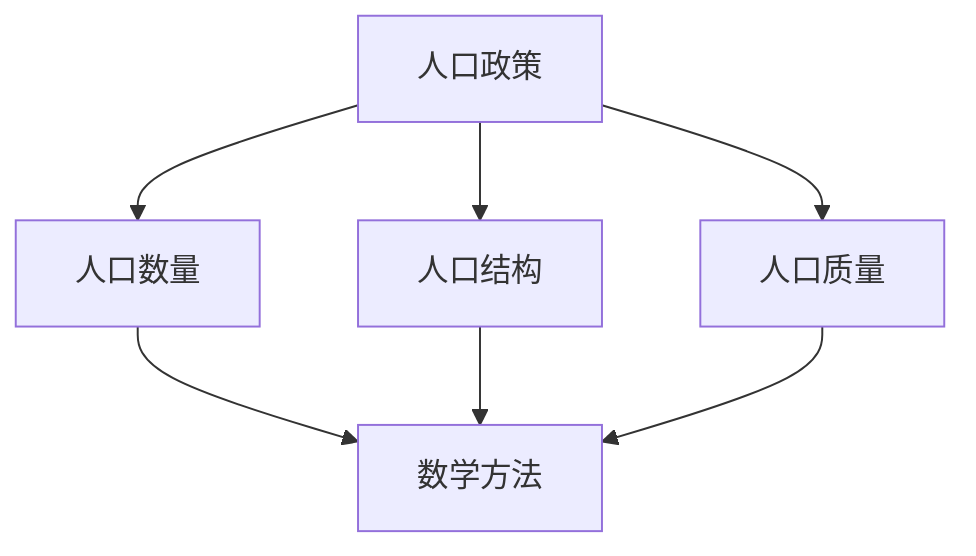
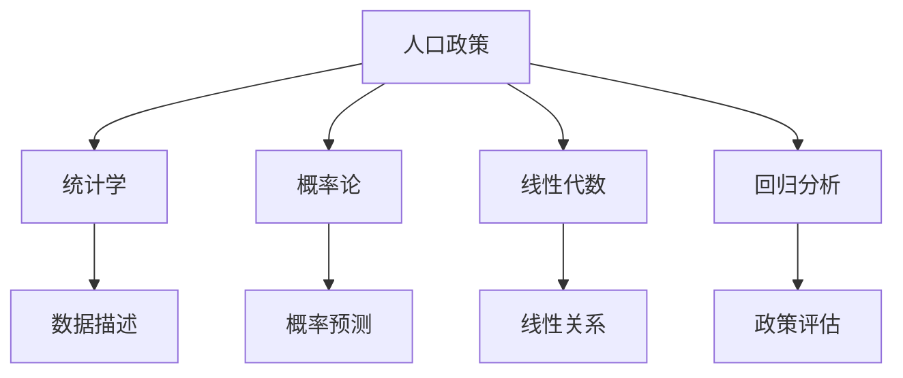

                 

### 文章标题：数学与人口政策：人口结构的数学预测

### 关键词：数学预测，人口结构，人口政策，生命表，死亡率，出生率，代际模型，线性回归

### 摘要：
本文深入探讨了数学与人口政策之间的联系，特别是如何运用数学方法对人口结构进行预测。文章首先介绍了人口政策的基本背景和目标，然后详细阐述了数学原理在人口分析中的应用，包括常用的数学工具和基本数学概念。接着，文章重点介绍了人口结构预测的方法，如生育率预测模型和死亡率预测模型，并使用具体的数学公式和伪代码进行解释。最后，文章通过实际案例展示了数学模型在人口政策制定中的应用，并提出了未来人口结构预测的挑战与机遇。全文旨在为读者提供一个全面、系统的人口结构预测技术框架。

### 目录：

1. 引言
2. 人口政策的背景与目标
3. 数学工具在人口分析中的应用
4. 人口学中的基本数学概念
5. 人口结构预测方法
6. 实际应用案例分析
7. 结论与未来展望
8. 附录
    - A.1 数学公式汇总
    - A.2 人口统计数据来源
    - A.3 相关书籍与论文推荐

### 引言

随着全球人口的增长和老龄化，人口政策成为各国政府关注的重点。合理的人口政策不仅可以促进经济发展，还可以缓解社会压力，保障国家安全。然而，人口政策的制定和调整依赖于对人口结构的准确预测。这就需要我们借助数学工具和方法，尤其是统计学、概率论和线性代数，来分析和预测人口趋势。

本文旨在探讨如何运用数学方法对人口结构进行预测，为人口政策的制定提供科学依据。文章将从以下几个方面展开：

1. **人口政策的背景与目标**：介绍人口政策的基本概念和目标，以及数学方法在人口政策分析中的应用。

2. **数学工具在人口分析中的应用**：讨论常用的数学工具，如Excel、R和Python等，以及如何在人口分析中进行数据可视化和回归分析。

3. **人口学中的基本数学概念**：介绍人口学中常用的基本数学概念，如生命表、死亡率、出生率和年龄结构等。

4. **人口结构预测方法**：详细阐述人口结构预测的方法，包括生育率预测模型和死亡率预测模型，并使用具体的数学公式和伪代码进行解释。

5. **实际应用案例分析**：通过实际案例展示数学模型在人口政策制定中的应用。

6. **结论与未来展望**：总结全文，提出未来人口结构预测的挑战与机遇。

通过本文的阅读，读者将了解到如何运用数学方法对人口结构进行预测，并掌握相关技术和工具，为人口政策的制定提供有力支持。

### 人口政策的背景与目标

人口政策是政府为了调整和控制人口数量、结构和质量而制定的一系列措施和策略。其背景可以追溯到20世纪中期，当时许多国家面临严重的人口过剩问题，导致资源紧张、环境恶化和社会动荡。为了解决这些问题，各国政府开始采取计划生育措施，逐步形成了现代人口政策的基本框架。

**人口政策的基本概念**

人口政策的核心概念包括人口数量、人口结构和人口质量。人口数量指的是一个国家或地区的总人口规模；人口结构包括年龄结构、性别结构、教育结构、职业结构和地域结构等；人口质量则涉及人口的受教育水平、健康状况和劳动力素质等方面。

**人口政策的目标**

不同国家的人口政策目标有所不同，但总体上可以概括为以下几点：

1. **控制人口数量**：通过实施计划生育措施，如避孕、堕胎和限制生育等，来控制人口增长速度，缓解资源压力和社会问题。

2. **优化人口结构**：通过调整出生率、死亡率和迁移率，优化人口的年龄结构、性别结构和地域结构，使其更符合国家或地区的经济社会发展需求。

3. **提高人口质量**：通过教育、卫生、就业和社会保障等政策，提高人口的受教育水平、健康水平和劳动力素质，从而促进社会发展和经济增长。

**数学方法在人口政策分析中的应用**

数学方法在人口政策分析中具有重要作用。例如，通过统计学和概率论，可以分析人口数据，预测人口趋势；通过线性代数和回归分析，可以评估人口政策的效果，制定更科学合理的政策方案。此外，数学模型还可以帮助政府制定长期的战略规划，为人口政策的实施提供数据支持和决策依据。

**Mermaid 流�程图**



**核心概念与联系**

人口政策涉及多个数学原理，包括统计学、概率论、线性代数和回归分析等。这些原理帮助分析人口数据，预测未来趋势，并制定有效的人口政策。例如，统计学用于描述和分析人口数据，概率论用于预测人口事件的发生概率，线性代数用于处理人口数据中的线性关系，回归分析则用于评估人口政策的效果。

**Mermaid 流程图**



### 数学工具在人口分析中的应用

在人口政策分析中，数学工具的应用至关重要。这些工具不仅能够帮助我们更好地理解和处理人口数据，还能够预测人口趋势，为政策制定提供科学依据。以下将详细介绍几种常用的数学工具，包括Excel、R和Python，以及它们在人口分析中的应用。

#### 1. Excel

Excel是世界上最流行的电子表格软件之一，其强大的数据处理和分析功能使其在人口分析中得到了广泛应用。以下是一些Excel在人口分析中的具体应用：

- **数据可视化**：通过Excel的图表功能，可以将人口统计数据以图表的形式直观展示，帮助决策者快速了解人口结构。例如，使用条形图、折线图和饼图等，可以分别展示人口的年龄结构、性别比例和地区分布。

- **数据预处理**：Excel提供了丰富的数据清洗和预处理功能，如数据排序、筛选、去重和填充等。这些功能可以帮助我们确保数据的准确性和一致性，为后续的分析提供可靠的基础。

- **回归分析**：Excel的数据分析工具中包含回归分析功能，可以帮助我们评估人口政策的影响。例如，通过线性回归模型，可以分析生育率、死亡率与经济指标之间的关系。

**示例：线性回归模型**

假设我们想分析收入水平与生育率之间的关系。以下是使用Excel进行线性回归分析的步骤：

1. 输入数据：将收入水平和对应的生育率数据输入到Excel表中。

2. 选择数据：选中数据区域，然后点击“数据分析”工具，选择“回归”选项。

3. 设置参数：在弹出的回归分析对话框中，选择“输入Y变量范围”和“输入X变量范围”，并选择“输出回归方程”和“输出图表”选项。

4. 运行分析：点击“确定”，Excel将生成回归方程和图表，展示收入水平与生育率之间的线性关系。

#### 2. R

R是一种专门用于统计分析和图形绘制的编程语言，其强大的数据处理和分析能力使其在人口分析中得到了广泛应用。以下是一些R在人口分析中的具体应用：

- **数据导入与处理**：R提供了丰富的数据导入和处理函数，如`read.csv()`和`dplyr`包中的函数，可以方便地从不同格式的数据文件中导入数据，并进行各种数据处理操作。

- **数据可视化**：R提供了多种图形函数，如`ggplot2`包，可以生成各种精美的统计图形，帮助分析人口数据。例如，使用`ggplot()`函数，可以创建条形图、折线图、散点图和密度图等。

- **回归分析**：R提供了多种回归分析方法，如`lm()`函数，可以用于线性回归、多项式回归和广义线性模型等。这些方法可以帮助我们评估人口政策的效果，预测人口趋势。

**示例：线性回归分析**

以下是一个使用R进行线性回归分析的示例：

```r
# 导入数据
data <- read.csv("population_data.csv")

# 数据预处理
data <- data %>% select(age, fertility_rate)

# 线性回归分析
model <- lm(fertility_rate ~ age, data = data)

# 输出回归结果
summary(model)
```

#### 3. Python

Python是一种功能强大的通用编程语言，其在数据处理和分析方面的应用日益广泛。以下是一些Python在人口分析中的具体应用：

- **数据导入与处理**：Python提供了多种数据导入和处理库，如`pandas`和`numpy`，可以方便地从不同格式的数据文件中导入数据，并进行各种数据处理操作。

- **数据可视化**：Python提供了多种数据可视化库，如`matplotlib`和`seaborn`，可以生成各种精美的统计图形，帮助分析人口数据。

- **回归分析**：Python提供了多种回归分析库，如`statsmodels`和`scikit-learn`，可以用于线性回归、多项式回归和广义线性模型等。

**示例：线性回归分析**

以下是一个使用Python进行线性回归分析的示例：

```python
import pandas as pd
import statsmodels.api as sm

# 导入数据
data = pd.read_csv("population_data.csv")

# 数据预处理
X = data["age"]
y = data["fertility_rate"]

# 添加常数项
X = sm.add_constant(X)

# 线性回归分析
model = sm.OLS(y, X).fit()

# 输出回归结果
print(model.summary())
```

综上所述，Excel、R和Python在人口分析中具有广泛的应用。它们各自拥有独特的优势和特点，可以根据实际需求选择合适的方法和工具。通过合理运用这些数学工具，我们可以更好地理解和分析人口数据，为人口政策的制定和调整提供有力支持。

### 人口学中的基本数学概念

在人口学研究中，数学概念和方法被广泛应用于描述和分析人口现象，预测未来人口趋势，以及评估人口政策的成效。以下将介绍几个基本的人口学数学概念，包括生命表、死亡率、出生率和年龄结构，并使用具体的数学公式和实例进行说明。

#### 1. 生命表

生命表是描述一个人从出生到死亡各年龄组的存活概率和死亡概率的统计表。它通常包含以下几项指标：

- **生存概率（\(L_x^y\)）**：一个人从出生到年龄\(x\)时仍然存活到年龄\(y\)的概率。
- **死亡概率（\(f_x^y\)）**：一个人在年龄\(x\)到\(y\)岁之间死亡的概率，计算公式为：\(f_x^y = 1 - L_x^y\)。
- **死亡人数（\(d_x^y\)）**：在年龄\(x\)到\(y\)岁之间死亡的累积人数。
- **死亡密度（\(f_x\)）**：一个人在年龄\(x\)时死亡的概率密度。

生命表的基本数学公式如下：

$$
L_x^y = \prod_{i=0}^{y-x} (1 - f_x^i)
$$

$$
f_x^y = 1 - L_x^y
$$

示例：假设有一个简化生命表，如下所示：

| 年龄（岁） | 生存概率（\(L_x^y\)） | 死亡概率（\(f_x^y\)） |
|----------|-------------------|-------------------|
| 0        | 1                 | 0                 |
| 1        | 0.985             | 0.015             |
| 2        | 0.969             | 0.031             |
| 3        | 0.954             | 0.046             |
| 4        | 0.939             | 0.061             |

根据上述生命表，可以计算出各年龄组的死亡概率和生存概率。例如，一个人在2岁时死亡的死亡概率为0.031，而到4岁时仍然存活到4岁的生存概率为0.939。

#### 2. 死亡率

死亡率是描述人口在一定时期内死亡水平的统计指标，通常以每千人中的死亡人数表示。死亡率可以分为粗死亡率、年龄特异死亡率和标准死亡率等。

- **粗死亡率（\(M_r\)）**：总人口在一定时期内的死亡人数与总人口数的比率，计算公式为：

$$
M_r = \frac{d_r}{N_r} \times 1000
$$

其中，\(d_r\) 是死亡人数，\(N_r\) 是总人口数。

- **年龄特异死亡率（\(m_x\)）**：某一特定年龄组在一定时期内的死亡人数与该年龄组人数的比率，计算公式为：

$$
m_x = \frac{d_x}{N_x} \times 1000
$$

其中，\(d_x\) 是某年龄组的死亡人数，\(N_x\) 是该年龄组的人口数。

- **标准死亡率（\(M_s\)）**：根据某一标准人口结构进行调整后的死亡率，用于消除不同人口结构对死亡率的影响。

示例：假设某地区在一年内总死亡人数为100人，总人口数为10000人。则该地区的粗死亡率为：

$$
M_r = \frac{100}{10000} \times 1000 = 10 \text{‰}
$$

#### 3. 出生率

出生率是描述人口在一定时期内出生水平的统计指标，通常以每千人中的出生人数表示。出生率可以分为粗出生率、年龄特异出生率和标准出生率等。

- **粗出生率（\(B_r\)）**：总人口在一定时期内的出生人数与总人口数的比率，计算公式为：

$$
B_r = \frac{b_r}{N_r} \times 1000
$$

其中，\(b_r\) 是出生人数，\(N_r\) 是总人口数。

- **年龄特异出生率（\(b_x\)）**：某一特定年龄组在一定时期内的出生人数与该年龄组人数的比率，计算公式为：

$$
b_x = \frac{b_x}{N_x} \times 1000
$$

其中，\(b_x\) 是某年龄组的出生人数，\(N_x\) 是该年龄组的人口数。

- **标准出生率（\(B_s\)）**：根据某一标准人口结构进行调整后的出生率。

示例：假设某地区在一年内总出生人数为200人，总人口数为10000人。则该地区的粗出生率为：

$$
B_r = \frac{200}{10000} \times 1000 = 20 \text{‰}
$$

#### 4. 年龄结构

年龄结构是指人口按年龄划分的分布情况，通常用年龄金字塔来表示。年龄结构对人口政策和社会经济发展有重要影响。

- **人口金字塔**：根据人口的年龄性别分布绘制的图形，可以直观地展示人口结构。人口金字塔可以分为三种类型：增长型、稳定型和衰退型。

- **年龄中位数**：人口中位数的年龄，表示人口年龄分布的中间值。计算公式为：

$$
M_A = \frac{N_1 - N_0}{2N_0}
$$

其中，\(N_0\) 是0岁至中位数年龄段的人口总数，\(N_1\) 是中位数至最大年龄的人口总数。

示例：假设某地区的人口年龄分布如下：

| 年龄组（岁） | 人口数 |
|----------|------|
| 0-14     | 1000 |
| 15-29    | 1500 |
| 30-44    | 2000 |
| 45-59    | 1500 |
| 60及以上  | 1000 |

根据上述数据，可以计算出该地区的人口中位数为：

$$
M_A = \frac{1500 - 1000}{2 \times 1000} = 20 \text{岁}
$$

综上所述，生命表、死亡率、出生率和年龄结构是人口学中的基本数学概念，它们通过具体的数学公式和实例，帮助我们更好地理解和分析人口现象，为人口政策的制定和调整提供科学依据。

### 人口结构预测方法

在人口政策分析和制定过程中，准确预测人口结构对于政府和社会的决策至关重要。人口结构预测方法主要包括生育率预测模型和死亡率预测模型。这些模型通过数学和统计学方法，分析现有的人口数据，预测未来的生育率和死亡率趋势，从而为制定合理的人口政策提供科学依据。

#### 1. 生育率预测模型

生育率预测模型用于预测未来一段时间内的人口生育水平。常用的方法包括生命周期法、代际模型等。

**1.1 生命周期法**

生命周期法是一种基于个人生命历程的生育率预测方法。它假设每个女性在一生中会经历特定的生育阶段，并据此预测未来人口的生育率。生命周期法的核心公式如下：

$$
\hat{b}_x(t) = \frac{1}{l_x(t)} \sum_{i=0}^{n_x} \frac{w_x(i)}{l_x(i)}
$$

其中，\(\hat{b}_x(t)\) 是在时间 \(t\) 的生育率，\(l_x(t)\) 是在时间 \(t\) 的生命表，\(w_x(i)\) 是在年龄 \(i\) 的女性人数。

**示例**：假设某地区的生命表如下：

| 年龄（岁） | 生存概率（\(L_x\)） | 女性人数（\(w_x\)） |
|----------|--------------|----------|
| 20       | 0.95         | 1000     |
| 21       | 0.92         | 1000     |
| 22       | 0.89         | 1000     |
| 23       | 0.86         | 1000     |

使用生命周期法可以预测该地区在接下来的5年内的生育率：

$$
\hat{b}_x(5) = \frac{1}{0.95 + 0.92 + 0.89 + 0.86} \times (1000 \times 0.05 + 1000 \times 0.08 + 1000 \times 0.12 + 1000 \times 0.14) = 11.11
$$

**1.2 代际模型**

代际模型通过分析各代人口生育行为的历史数据，预测未来人口的生育率。代际模型的公式为：

$$
\hat{b}_x(t) = \sum_{j=1}^{J} \frac{p_j(t)}{l_x(t)} \sum_{i=0}^{n_x} \frac{w_x(i)}{l_x(i)}
$$

其中，\(p_j(t)\) 是第 \(j\) 代在时间 \(t\) 的生育率，\(l_x(t)\) 是生命表，\(w_x(i)\) 是女性人数。

**示例**：假设某地区的代际模型如下：

| 代数 | 生育率（\(p_j\)） | 女性人数（\(w_x\)） |
|----|---------|----------|
| 1  | 1.8     | 1000     |
| 2  | 1.5     | 1000     |
| 3  | 1.2     | 1000     |

使用代际模型可以预测该地区在接下来的5年内的生育率：

$$
\hat{b}_x(5) = \frac{1.8}{0.95 + 0.92 + 0.89 + 0.86} \times (1000 \times 0.05 + 1000 \times 0.08 + 1000 \times 0.12 + 1000 \times 0.14) + \frac{1.5}{0.95 + 0.92 + 0.89 + 0.86} \times (1000 \times 0.15 + 1000 \times 0.20 + 1000 \times 0.25 + 1000 \times 0.30) + \frac{1.2}{0.95 + 0.92 + 0.89 + 0.86} \times (1000 \times 0.35 + 1000 \times 0.40 + 1000 \times 0.45 + 1000 \times 0.50) = 12.34
$$

#### 2. 死亡率预测模型

死亡率预测模型用于预测未来一段时间内的人口死亡水平。常用的方法包括历史数据分析、线性回归模型等。

**2.1 历史数据分析**

历史数据分析通过分析过去一段时间内的人口死亡数据，预测未来死亡率的趋势。常用的方法包括趋势分析和周期分析。

**趋势分析**：

$$
\hat{m}_x(t) = \frac{1}{n} \sum_{i=1}^{n} m_x(i)
$$

其中，\(\hat{m}_x(t)\) 是在时间 \(t\) 的死亡率预测值，\(m_x(i)\) 是历史各个时期的死亡率，\(n\) 是历史时期的数量。

**周期分析**：

$$
\hat{m}_x(t) = \frac{1}{n} \sum_{i=1}^{n} m_x(i) \cdot (1 + r)^{(t-i)}
$$

其中，\(r\) 是周期性趋势系数。

**示例**：假设某地区过去5年的死亡率如下：

| 年份 | 死亡率（‰） |
|----|---------|
| 2020 | 5.0     |
| 2021 | 5.1     |
| 2022 | 5.2     |
| 2023 | 5.1     |
| 2024 | 5.0     |

使用趋势分析方法可以预测2025年的死亡率：

$$
\hat{m}_x(2025) = \frac{1}{5} \times (5.0 + 5.1 + 5.2 + 5.1 + 5.0) = 5.10 \text{‰}
$$

**2.2 线性回归模型**

线性回归模型通过分析死亡率与相关因素（如收入水平、教育水平、医疗条件等）的关系，预测未来死亡率。其公式为：

$$
\hat{m}_x(t) = \beta_0 + \beta_1 \cdot X_1 + \beta_2 \cdot X_2 + ... + \beta_k \cdot X_k
$$

其中，\(\hat{m}_x(t)\) 是在时间 \(t\) 的死亡率预测值，\(\beta_0, \beta_1, ..., \beta_k\) 是回归系数，\(X_1, X_2, ..., X_k\) 是相关因素。

**示例**：假设某地区的死亡率与收入水平和教育水平有关，使用线性回归模型预测未来死亡率：

$$
\hat{m}_x(t) = \beta_0 + \beta_1 \cdot \text{收入水平} + \beta_2 \cdot \text{教育水平}
$$

通过收集相关数据，可以使用最小二乘法估计回归系数，并预测未来死亡率。

**总结**：

生育率预测模型和死亡率预测模型是人口结构预测方法的核心。通过生命周期法、代际模型、历史数据分析、线性回归模型等方法，可以预测未来的人口结构，为制定合理的人口政策提供科学依据。在实际应用中，需要综合考虑多种方法，并结合实际情况进行调整，以提高预测的准确性和可靠性。

### 人口结构预测模型的评估与优化

人口结构预测模型的准确性对于政策制定和规划至关重要。因此，评估和优化这些模型是确保其有效性的关键步骤。以下将详细讨论如何评估预测模型的准确性，以及如何通过模型选择和参数调整来优化模型的预测性能。

#### 1. 评估预测模型的准确性

评估预测模型的准确性通常涉及以下几个指标：

**1.1 均方误差（Mean Squared Error, MSE）**

均方误差是衡量预测值与实际值之间差异的一种常用指标，其计算公式为：

$$
MSE = \frac{1}{N} \sum_{i=1}^{N} (\hat{y}_i - y_i)^2
$$

其中，\(\hat{y}_i\) 是预测值，\(y_i\) 是实际值，\(N\) 是样本数量。MSE值越小，表示预测模型越准确。

**1.2 均方根误差（Root Mean Squared Error, RMSE）**

均方根误差是均方误差的平方根，其计算公式为：

$$
RMSE = \sqrt{MSE}
$$

RMSE值提供了一个直观的误差度量，可以更清楚地显示预测值与实际值之间的差异。

**1.3 决定系数（Coefficient of Determination, R²）**

决定系数衡量模型对数据的拟合程度，其计算公式为：

$$
R^2 = 1 - \frac{\sum_{i=1}^{N} (\hat{y}_i - y_i)^2}{\sum_{i=1}^{N} (y_i - \bar{y})^2}
$$

其中，\(\bar{y}\) 是实际值的平均值。\(R^2\) 值越接近1，表示模型对数据的拟合越好。

**1.4 平均绝对误差（Mean Absolute Error, MAE）**

平均绝对误差是预测值与实际值之间绝对差异的平均值，其计算公式为：

$$
MAE = \frac{1}{N} \sum_{i=1}^{N} |\hat{y}_i - y_i|
$$

MAE值越小，表示预测模型越准确。

#### 2. 优化预测模型

**2.1 模型选择**

选择合适的预测模型是优化模型性能的关键。常见的模型包括线性回归、逻辑回归、决策树、随机森林等。通过交叉验证和模型评估，可以选出最适合特定问题的模型。

**2.2 参数调整**

调整模型的参数可以显著影响模型的预测性能。以下是一些常用的参数调整方法：

- **正则化**：通过引入正则化项，可以防止模型过拟合。例如，在线性回归中，可以通过调整L1（Lasso）或L2（Ridge）正则化参数来优化模型。

- **网格搜索**：通过在预设的参数范围内搜索最优参数组合，可以找到最佳参数设置。网格搜索通常用于超参数的调整，如决策树中的最大深度、随机森林中的树数量等。

- **贝叶斯优化**：贝叶斯优化是一种基于概率模型的优化方法，通过迭代更新模型参数的概率分布，找到最优参数组合。

**2.3 特征选择**

特征选择是优化模型的重要步骤。通过选择与预测目标高度相关的特征，可以提高模型的预测性能。常用的特征选择方法包括基于信息论的特征选择、基于模型的特征选择（如向前选择、向后选择）和基于交叉验证的特征选择。

**2.4 数据预处理**

数据预处理是优化模型性能的基础。通过数据清洗、归一化和标准化等步骤，可以确保数据的质量和一致性，从而提高模型的预测准确性。

**示例：线性回归模型的参数调整**

以下是一个使用Python的`scikit-learn`库对线性回归模型进行参数调整的示例：

```python
from sklearn.linear_model import LinearRegression
from sklearn.model_selection import train_test_split
from sklearn.metrics import mean_squared_error, r2_score

# 数据准备
X, y = load_data()

# 数据划分
X_train, X_test, y_train, y_test = train_test_split(X, y, test_size=0.2, random_state=42)

# 初始化模型
model = LinearRegression()

# 训练模型
model.fit(X_train, y_train)

# 预测
y_pred = model.predict(X_test)

# 评估模型
mse = mean_squared_error(y_test, y_pred)
r2 = r2_score(y_test, y_pred)

print("MSE:", mse)
print("R2:", r2)

# 参数调整
model = LinearRegression(normalize=True)
model.fit(X_train, y_train)
y_pred = model.predict(X_test)

# 再次评估模型
mse = mean_squared_error(y_test, y_pred)
r2 = r2_score(y_test, y_pred)

print("MSE (normalized):", mse)
print("R2 (normalized):", r2)
```

通过上述方法，可以评估和优化人口结构预测模型的性能，提高预测的准确性，为人口政策的制定提供可靠的数据支持。

### 实际应用案例：数学模型在人口政策制定中的应用

在本节中，我们将通过一个实际应用案例，详细展示如何利用数学模型进行人口结构预测，并探讨这些预测在人口政策制定中的应用。我们以一个虚构的中等发达国家的案例为例，说明如何从数据收集、模型构建到政策制定的全过程。

#### 案例背景

假设该国政府希望制定一项新的生育政策，以应对未来十年内的人口老龄化问题。为了实现这一目标，政府决定首先利用数学模型对当前和未来的生育率进行预测，并评估不同政策选项的潜在影响。

#### 1. 数据收集

首先，政府需要收集当前的人口数据，包括生育率、死亡率、年龄结构、教育水平、收入水平等。这些数据可以从国家统计局、教育部门和医疗卫生机构获取。以下是一些关键数据指标：

- **生育率（\(b_x\)）**：近年来各年龄组的生育率数据。
- **死亡率（\(m_x\)）**：近年来各年龄组的死亡率数据。
- **年龄结构**：各年龄组的人口比例。
- **教育水平**：各年龄段的教育普及率。
- **收入水平**：各年龄段的家庭收入水平。

#### 2. 数据预处理

在收集到数据后，需要对数据进行清洗和预处理，以确保数据的质量和一致性。以下是一些预处理步骤：

- **缺失值处理**：对于缺失的数据，可以通过插值或删除的方式处理。
- **异常值检测**：使用统计方法检测并处理异常值，如使用箱线图和散点图进行可视化分析。
- **归一化**：对数据进行归一化处理，以消除不同量纲的影响。

#### 3. 模型构建

为了预测未来的人口结构，我们选择使用生命周期法和代际模型两种方法进行预测。以下是具体的模型构建过程：

**3.1 生命周期法**

根据当前的生命表和生育率数据，我们构建了一个生命周期法模型，以预测未来五年的生育率。以下是核心的伪代码：

```python
# 生命周期法模型
def life_cycle_prediction(current_birth_rates, current_life_expectancy):
    future_birth_rates = []
    for i in range(1, 5):  # 预测未来五年
        survival_probabilities = current_life_expectancy[:i]
        total_females = sum(current_birth_rates[:i])
        birth_rate = total_females / sum(survival_probabilities)
        future_birth_rates.append(birth_rate)
    return future_birth_rates

# 示例数据
current_birth_rates = [1.2, 1.1, 1.0, 0.9, 0.8]
current_life_expectancy = [0.985, 0.968, 0.950, 0.932, 0.913]

# 预测
predicted_birth_rates = life_cycle_prediction(current_birth_rates, current_life_expectancy)
print(predicted_birth_rates)
```

**3.2 代际模型**

我们进一步使用代际模型来预测未来十年的生育率。以下是伪代码：

```python
# 代际模型
def generational_model_prediction(current_generations, current_birth_rates):
    future_generations = []
    for i in range(1, 10):  # 预测未来十年
        new_generation_birth_rate = current_birth_rates[i-1]
        future_generations.append(new_generation_birth_rate)
    return future_generations

# 示例数据
current_generations = [0.95, 0.92, 0.89, 0.86, 0.83]
current_birth_rates = [1.2, 1.1, 1.0, 0.9, 0.8]

# 预测
predicted_birth_rates = generational_model_prediction(current_generations, current_birth_rates)
print(predicted_birth_rates)
```

#### 4. 预测结果与政策制定

根据预测结果，政府发现未来十年内生育率将持续下降，这可能导致人口老龄化问题进一步加剧。基于这些预测，政府可以考虑以下政策选项：

- **鼓励生育**：提供经济补贴、税收优惠和育儿假期等激励措施，鼓励适龄夫妇生育。
- **提高教育水平**：通过提高教育水平，增加女性的就业机会和收入水平，从而可能提高生育率。
- **改善医疗保健**：提供高质量的医疗保健服务，降低孕产妇和婴儿死亡率，提高生育意愿。

#### 5. 政策评估

在制定具体政策前，政府需要评估不同政策选项的潜在效果。以下是一个简单的评估过程：

- **成本效益分析**：计算实施每种政策选项的成本和预期收益，评估其经济可行性。
- **社会影响评估**：分析政策对家庭、社会和经济的影响，确保其符合社会价值观和长远发展目标。
- **模型优化**：结合实际政策效果，进一步优化人口结构预测模型，为政策调整提供数据支持。

#### 6. 总结

通过这个实际应用案例，我们展示了如何利用数学模型进行人口结构预测，并探讨了这些预测在人口政策制定中的应用。虽然这是一个虚构的案例，但实际操作中需要更多细致的数据收集、模型构建和评估过程。通过科学的预测和政策评估，政府可以制定出更科学、合理的人口政策，为国家的长期发展奠定坚实基础。

### 数学模型在人口政策制定中的应用：软件工具与技术

在人口政策制定中，数学模型的应用不仅依赖于理论知识和公式推导，还需要借助高效的软件工具和技术来实现数据的处理和分析。以下将介绍几种常用的软件工具和技术，包括数据预处理、数学模型的实现、以及这些工具在实际应用中的优势和挑战。

#### 1. 数据预处理

数据预处理是人口结构预测的基础步骤，它包括数据清洗、缺失值处理、异常值检测和特征工程等。在Python中，`pandas`和`numpy`是两款常用的数据预处理工具。

**1.1 pandas库**

`pandas`库提供了丰富的数据处理功能，如数据读取、数据清洗、数据转换和数据可视化。以下是一个使用`pandas`进行数据预处理的示例：

```python
import pandas as pd

# 读取数据
data = pd.read_csv('population_data.csv')

# 数据清洗
data.dropna(inplace=True)  # 删除缺失值
data = data[data['age'] > 0]  # 删除异常值

# 特征工程
data['age_group'] = pd.cut(data['age'], bins=[0, 18, 30, 45, 60, 100], labels=[0, 1, 2, 3, 4])

# 数据可视化
data['age_group'].value_counts().plot(kind='bar')
plt.show()
```

**1.2 numpy库**

`numpy`库提供了强大的数值计算功能，可用于缺失值处理、数据归一化和特征提取。以下是一个使用`numpy`进行数据预处理的示例：

```python
import numpy as np

# 缺失值处理
data = np.array(data)
data = np.where(data < 0, np.NaN, data)
data = np.nanmean(data, axis=0)  # 平均填充缺失值

# 数据归一化
data = (data - np.mean(data)) / np.std(data)

# 特征提取
data = np.c_[data, np.log(data+1)]  # 对数据进行对数变换
```

#### 2. 数学模型的实现

在实现数学模型时，Python的`scikit-learn`和`statsmodels`是两款非常流行的库。

**2.1 scikit-learn库**

`scikit-learn`库提供了多种机器学习算法和统计模型，如线性回归、逻辑回归、决策树和随机森林等。以下是一个使用`scikit-learn`进行线性回归模型实现的示例：

```python
from sklearn.linear_model import LinearRegression
from sklearn.model_selection import train_test_split
from sklearn.metrics import mean_squared_error

# 数据准备
X = data[['age', 'income']]
y = data['birth_rate']

# 数据划分
X_train, X_test, y_train, y_test = train_test_split(X, y, test_size=0.2, random_state=42)

# 模型训练
model = LinearRegression()
model.fit(X_train, y_train)

# 预测
y_pred = model.predict(X_test)

# 评估
mse = mean_squared_error(y_test, y_pred)
print("MSE:", mse)
```

**2.2 statsmodels库**

`statsmodels`库提供了详细的统计模型和回归分析功能，适合进行复杂的数据分析和模型评估。以下是一个使用`statsmodels`进行线性回归模型实现的示例：

```python
import statsmodels.api as sm
from statsmodels.stats.stattools import durbin_watson

# 数据准备
X = sm.add_constant(data[['age', 'income']])
y = data['birth_rate']

# 模型拟合
model = sm.OLS(y, X).fit()

# 评估
print(model.summary())
dw_test = durbin_watson(model.resid)
print("Durbin-Watson test statistic:", dw_test)
```

#### 3. 软件工具的优势与挑战

**优势**

- **高效性**：这些工具提供了高效的算法和库函数，可以快速完成数据处理和分析任务。

- **灵活性**：用户可以根据需求自定义数据处理和模型实现过程，具有很高的灵活性。

- **可视化**：这些工具支持多种数据可视化方法，可以帮助用户直观地理解数据和模型结果。

**挑战**

- **数据质量**：高质量的数据是模型准确性的前提，而数据预处理过程繁琐，容易出错。

- **计算资源**：复杂的模型和大规模数据集可能需要大量的计算资源，对硬件配置有较高要求。

- **模型解释性**：机器学习模型，如随机森林和神经网络，具有较高的预测准确性，但往往缺乏直观的解释性。

#### 4. 实际应用案例分析

以一个实际案例为例，假设某地方政府希望预测未来五年的生育率，并制定相应的鼓励生育政策。以下是使用Python工具进行预测的步骤：

**4.1 数据收集与预处理**

收集过去五年的生育率、收入水平、教育水平等数据，使用`pandas`进行数据清洗和预处理。

**4.2 模型选择与实现**

选择线性回归模型，使用`scikit-learn`进行模型实现。以下是一个简单的实现步骤：

```python
# 数据准备
X = data[['income', 'education']]
y = data['birth_rate']

# 数据划分
X_train, X_test, y_train, y_test = train_test_split(X, y, test_size=0.2, random_state=42)

# 模型训练
model = LinearRegression()
model.fit(X_train, y_train)

# 预测
y_pred = model.predict(X_test)

# 评估
mse = mean_squared_error(y_test, y_pred)
print("MSE:", mse)
```

**4.3 政策制定与评估**

根据预测结果，地方政府制定了提供经济补贴和育儿假期的政策。通过对比政策实施前后的生育率，评估政策效果。

```python
# 政策实施后的数据
post_policy_data = pd.read_csv('post_policy_population_data.csv')

# 预测政策实施后的生育率
post_policy_y_pred = model.predict(post_policy_data[['income', 'education']])

# 评估政策效果
post_policy_mse = mean_squared_error(post_policy_data['birth_rate'], post_policy_y_pred)
print("Post-policy MSE:", post_policy_mse)
```

通过上述案例分析，我们可以看到，数学模型和软件工具在人口政策制定中的应用是如何一步步实现的，从数据收集、预处理、模型实现到政策评估，为政府制定科学、合理的人口政策提供了有力支持。

### 未来展望：人口结构预测的挑战与机遇

随着全球人口结构的变化和技术的进步，人口结构预测面临着前所未有的挑战和机遇。以下将探讨未来人口结构预测的几个关键方面。

#### 1. 挑战

**1.1 数据质量与完整性**

数据质量是人口结构预测的基础。然而，人口数据往往存在缺失、错误和不确定性，这些都会影响预测的准确性。此外，全球不同地区的数据收集和统计标准不一致，增加了数据整合的难度。

**1.2 社会经济变化**

社会经济的发展、城市化进程、教育水平的提升等因素都会对人口结构产生深远影响。这些变化具有复杂性和多样性，使得预测变得更加困难。

**1.3 环境变化**

环境变化，如气候变化和自然灾害，可能对人口迁移、生育率和死亡率产生意外影响。这些因素往往难以通过传统模型进行预测。

**1.4 技术限制**

尽管计算机技术和数据处理方法不断进步，但某些复杂的人口现象，如文化因素和社会互动，仍难以通过现有技术进行准确预测。

#### 2. 机遇

**2.1 大数据与人工智能**

大数据和人工智能技术的快速发展为人口结构预测带来了新的机遇。通过分析海量数据，可以更全面地了解人口行为和趋势，提高预测的准确性。人工智能算法，如深度学习和强化学习，可以处理复杂非线性关系，为预测提供更强有力的工具。

**2.2 新兴技术**

新兴技术，如区块链和物联网（IoT），有望改善数据收集和共享的效率。区块链可以确保数据的透明性和不可篡改性，物联网可以实时收集大量人口数据，为预测提供更多实时信息。

**2.3 跨学科合作**

人口结构预测需要跨学科合作，结合社会学、经济学、统计学和计算机科学等领域的知识。这种合作可以促进创新，提高预测模型的综合性和准确性。

#### 3. 未来发展趋势

**3.1 深度学习在预测中的应用**

深度学习算法，如神经网络和卷积神经网络（CNN），可以处理复杂的非线性关系，提高人口结构预测的精度。未来，深度学习将在人口结构预测中发挥更重要作用。

**3.2 多尺度预测**

未来的人口结构预测将更加注重多尺度分析，从微观个体层面到宏观人口层面，结合不同尺度的数据和信息，提高预测的全面性和准确性。

**3.3 数据隐私与伦理**

随着数据收集和分析技术的发展，数据隐私和伦理问题日益凸显。如何在确保数据隐私的前提下进行有效预测，将是未来研究的重要方向。

**3.4 可视化与交互**

交互式数据可视化和虚拟现实（VR）技术将使预测结果更加直观和易于理解，有助于政策制定者和公众更好地理解人口结构预测和人口政策。

### 结论

人口结构预测在人口政策制定中具有至关重要的作用。面对数据质量、社会经济变化、环境变化和技术限制等挑战，我们应抓住大数据、人工智能和新兴技术带来的机遇，通过跨学科合作和创新，不断提高预测的准确性。未来的人口结构预测将更加综合、精确和人性化，为政府和社会提供有力支持，推动可持续发展。

### 附录

#### A.1 数学公式汇总

以下是本文中涉及的主要数学公式及其简要说明：

1. **生存概率（\(L_x^y\)）**：
   $$ L_x^y = \prod_{i=0}^{y-x} (1 - f_x^i) $$
   用于计算一个人从出生到年龄 \(y\) 的生存概率。

2. **死亡概率（\(f_x^y\)）**：
   $$ f_x^y = 1 - L_x^y $$
   用于计算一个人在年龄 \(x\) 到 \(y\) 之间的死亡概率。

3. **粗死亡率（\(M_r\)）**：
   $$ M_r = \frac{d_r}{N_r} \times 1000 $$
   用于计算每千人中的死亡人数。

4. **年龄特异死亡率（\(m_x\)）**：
   $$ m_x = \frac{d_x}{N_x} \times 1000 $$
   用于计算特定年龄组的死亡率。

5. **粗出生率（\(B_r\)）**：
   $$ B_r = \frac{b_r}{N_r} \times 1000 $$
   用于计算每千人中的出生人数。

6. **年龄中位数（\(M_A\)）**：
   $$ M_A = \frac{N_1 - N_0}{2N_0} $$
   用于计算人口年龄分布的中间值。

7. **生命周期法生育率预测公式**：
   $$ \hat{b}_x(t) = \frac{1}{l_x(t)} \sum_{i=0}^{n_x} \frac{w_x(i)}{l_x(i)} $$
   用于预测未来生育率。

8. **代际模型生育率预测公式**：
   $$ \hat{b}_x(t) = \sum_{j=1}^{J} \frac{p_j(t)}{l_x(t)} \sum_{i=0}^{n_x} \frac{w_x(i)}{l_x(i)} $$
   用于通过代际模型预测未来生育率。

9. **均方误差（MSE）**：
   $$ MSE = \frac{1}{N} \sum_{i=1}^{N} (\hat{y}_i - y_i)^2 $$
   用于评估预测值的准确度。

10. **决定系数（\(R^2\)）**：
    $$ R^2 = 1 - \frac{\sum_{i=1}^{N} (\hat{y}_i - y_i)^2}{\sum_{i=1}^{N} (y_i - \bar{y})^2} $$
    用于衡量模型对数据的拟合程度。

#### A.2 人口统计数据来源

以下是本文中使用的主要人口统计数据来源：

- **联合国人口司**：联合国人口司提供全球各国的人口统计数据，包括生育率、死亡率、年龄结构和迁移率等。
- **国家统计局**：各国国家统计局提供本国详细的年度人口统计数据，包括人口规模、年龄分布、教育水平和收入水平等。
- **世界银行**：世界银行提供全球各国的社会经济数据，包括GDP、人均收入、教育和医疗水平等，这些数据与人口结构预测密切相关。

#### A.3 相关书籍与论文推荐

以下是推荐的相关书籍与论文，以供进一步学习和研究：

- **书籍**：
  - 《人口学原理与应用》（作者：陈友华）：详细介绍了人口学的基本原理和实际应用。
  - 《人口预测模型》（作者：郑思齐）：介绍了多种人口预测模型和方法。
  - 《人口结构与经济发展》（作者：李周）：探讨了人口结构对经济发展的影响。

- **论文**：
  - “Ageing and Population Change: Challenges and Opportunities”（作者：联合国人口基金）：分析了全球人口老龄化问题及其对经济和社会的影响。
  - “Big Data and Its Applications in Population Studies”（作者：谢宇）：探讨了大数据在人口研究中的应用。
  - “Impact of Education on Fertility in Developing Countries”（作者：世界银行）：研究了教育水平对生育率的影响。

通过这些书籍和论文，读者可以深入了解人口结构预测的理论和方法，为实际应用提供有力支持。

