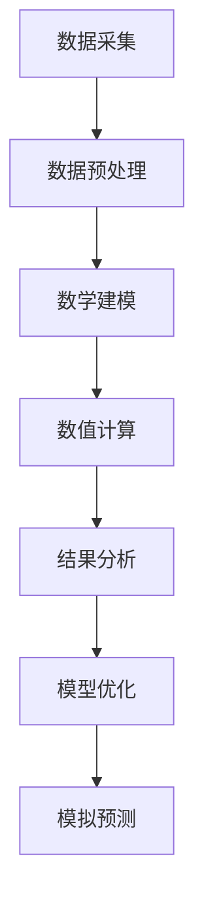
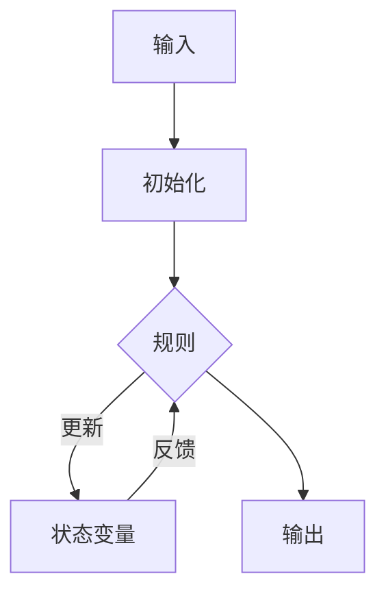
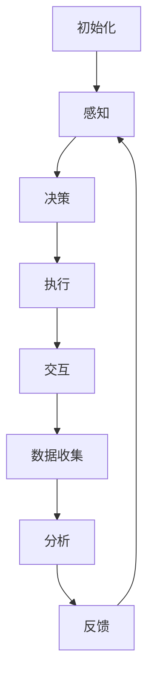
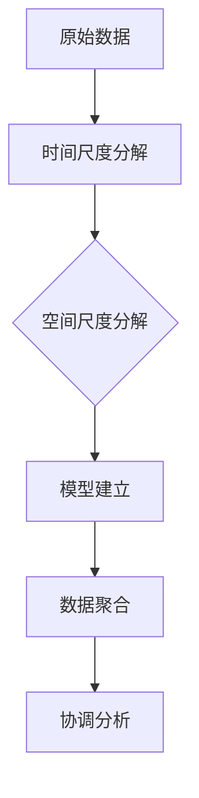
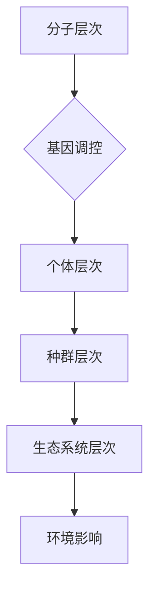
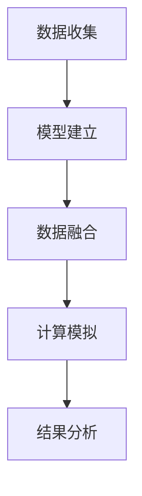

                 


### 文章标题

《数学与人工生命：生命系统的数学模拟》

### 文章关键词

- 人工生命
- 数学模拟
- 生命系统
- 分子生物学模型
- 细胞生物学模型
- 群体生物学模型

### 文章摘要

本文旨在探讨数学在人工生命研究中的应用，特别是生命系统的数学模拟。通过梳理人工生命研究的发展历程，介绍生命系统数学模拟的背景和意义，本文将详细讲解生命系统的数学原理、核心算法原理、数学模型，并结合具体项目实战，深入剖析人工生命系统的模拟实践。文章结构包括引论、核心概念与联系、核心算法原理讲解、数学模型和数学公式讲解、项目实战以及总结与展望。通过本文，读者将全面了解人工生命系统数学模拟的原理和方法，为相关领域的研究和实践提供有力支持。

### 目录

1. **引论**

   1.1 生命系统数学模拟简介

   1.2 人工生命研究的发展历程

   1.3 数学在人工生命研究中的应用

2. **基本数学工具**

   2.1 生命系统中的基本数学概念

   2.2 常用数学模型

   2.3 数值计算方法

   2.4 生命系统数学模拟的基本流程（Mermaid流程图）

3. **核心概念与联系**

   3.1 生命系统的基本特征

   3.2 生命系统的数学模型

   3.3 生命系统数学模型的基本结构（Mermaid流程图）

4. **核心算法原理讲解**

   4.1 分子动力学模拟

   4.2 神经网络模拟

   4.3 代数学模拟

5. **多尺度建模方法**

   5.1 时空分辨率的转换

   5.2 分子层次与宏观层次之间的相互作用

   5.3 多尺度建模方法的实现（Mermaid流程图）

6. **数学模型和数学公式讲解**

   6.1 分子生物学模型

   6.2 细胞生物学模型

   6.3 个体生物学模型

   6.4 群体生物学模型

7. **项目实战**

   7.1 项目背景与目标

   7.2 开发环境搭建

   7.3 项目实施与结果分析

   7.4 案例分析

8. **总结与展望**

   8.1 人工生命系统数学模拟的未来发展趋势

   8.2 现有技术的不足与挑战

   8.3 未来研究方向与展望

### 完整性要求

本文完整性要求如下：

1. **背景介绍**：每个章节的开头应简要介绍相关背景知识，为后续内容铺垫。
2. **核心概念与联系**：必须在每个相关章节中给出核心概念及其相互关系的架构图（使用Mermaid流程图），以便读者理解。
3. **核心算法原理讲解**：使用伪代码详细阐述每个核心算法原理，并结合实际实例进行解释。
4. **数学模型和公式讲解**：对每个数学模型进行详细讲解，并使用LaTeX格式嵌入文中。
5. **项目实战**：详细描述项目背景、开发环境搭建、源代码实现、代码解读、应用解读与分析、案例分析等。
6. **最佳实践 tips**：在每个相关章节的结尾，提供最佳实践建议和注意事项。
7. **小结与拓展阅读**：在文章结尾对全文进行总结，并提供拓展阅读资源。

接下来，我们将根据上述目录结构，逐步深入探讨各个章节的内容，确保文章内容完整、具体、详细。

### 第一部分：引论

#### 第1章：生命系统数学模拟的背景和意义

在生物科学与计算科学交汇的领域，生命系统的数学模拟正成为一个研究热点。本章将介绍生命系统数学模拟的背景和意义，以及人工生命研究的发展历程和数学在其中的应用。

##### 1.1 生命系统数学模拟简介

生命系统的数学模拟是一种通过数学方法和模型来描述和预测生物系统行为的方法。这种方法不仅包括对生物学现象的抽象和建模，还涉及了数据的采集、处理和分析。生命系统的数学模拟有助于我们理解生物系统的复杂性，预测系统行为，进而为医学、农业、环境保护等领域提供重要的科学依据。

##### 1.2 人工生命研究的发展历程

人工生命（Artificial Life）是指通过计算机模拟或人工合成的方法，创造出具有类似生物特征的系统或实体。人工生命研究起源于20世纪80年代，其发展历程可以分为几个阶段：

1. **模拟与仿真阶段**：这一阶段的代表性工作是Avida项目，通过模拟细菌的行为和进化过程，展示了人工生命模拟的可能性。

2. **代理系统与自主演化阶段**：研究者开始设计能够自主适应和进化的代理系统，如人工细胞和人工神经网络的模拟。

3. **跨学科融合阶段**：生命系统数学模拟与多学科领域，如物理学、化学、计算机科学等相结合，形成了新的研究方向，如量子生命系统、化学生命系统等。

##### 1.3 数学在人工生命研究中的应用

数学在人工生命研究中起着至关重要的作用。以下是一些主要的应用领域：

1. **生物学模型的建立**：通过数学模型描述生物系统的各种现象，如细胞周期、遗传规律、生态系统的动态行为等。

2. **算法设计与优化**：使用数学算法来模拟生命系统行为，如遗传算法、神经网络算法、动力学模拟等。

3. **数据分析与解释**：运用统计学和概率论的方法来分析生物数据，提取生物学信息。

4. **系统模拟与预测**：通过数学模拟预测生物系统未来的行为，为医学、农业等领域提供决策支持。

##### 1.4 生命系统数学模拟的基本概念

在生命系统数学模拟中，一些基本概念至关重要：

1. **个体与种群**：个体是生物系统中的基本单元，种群是具有相同特征个体的集合。

2. **进化与适应**：进化是生物种群通过基因变异、选择和重组等过程，适应环境变化的过程。

3. **生态模型**：生态模型描述了不同种群之间的相互作用和生态系统的动态行为。

4. **多尺度建模**：多尺度建模是考虑生物系统在不同时间和空间尺度上的复杂行为，如分子层次与宏观层次之间的相互作用。

本章内容为后续章节奠定了基础，读者将了解到生命系统数学模拟的背景和意义，以及人工生命研究的发展历程和数学的应用。在接下来的章节中，我们将深入探讨生命系统的数学原理、核心算法、数学模型和项目实战，以期为读者提供全面的技术指导。

### 第2章：基本数学工具

在生命系统数学模拟中，基本数学工具的选择和使用至关重要。本章将介绍生命系统中常用的基本数学概念、数学模型以及数值计算方法，并展示如何使用Mermaid流程图来描述生命系统数学模拟的基本流程。

##### 2.1 生命系统中的基本数学概念

生命系统中的基本数学概念包括代数、几何、微积分、概率论和统计学等。这些概念在生命系统的建模和分析中扮演着关键角色。

1. **代数**：代数用于描述生物系统中的数量关系和运算规则。例如，基因序列可以用代数表达式表示，遗传密码子可以用代数方程来推导。

2. **几何**：几何用于描述生物系统中的空间结构和形状。例如，细胞的结构和形状可以通过几何模型来描述。

3. **微积分**：微积分用于描述生物系统的动态变化和连续性。例如，细胞周期可以用微积分方程来建模，描述细胞生长、分裂等过程。

4. **概率论和统计学**：概率论和统计学用于描述生物系统中的不确定性和数据分布。例如，种群数量可以用概率分布来描述，遗传变异可以用统计模型来分析。

##### 2.2 常用数学模型

在生命系统数学模拟中，常用的数学模型包括分子生物学模型、细胞生物学模型、个体生物学模型和群体生物学模型。

1. **分子生物学模型**：分子生物学模型用于描述生物大分子（如DNA、RNA和蛋白质）的结构和功能。常见的分子生物学模型包括遗传密码子模型、基因调控模型和蛋白质结构模型。

2. **细胞生物学模型**：细胞生物学模型用于描述细胞的生理和生化过程。常见的细胞生物学模型包括细胞周期模型、细胞信号传递模型和细胞运动模型。

3. **个体生物学模型**：个体生物学模型用于描述个体的生长、发育和行为。常见的个体生物学模型包括个体适应模型、行为模型和进化模型。

4. **群体生物学模型**：群体生物学模型用于描述不同种群之间的相互作用和生态系统的动态行为。常见的群体生物学模型包括种群数量模型、种群分布模型和多种群模型。

##### 2.3 数值计算方法

在生命系统数学模拟中，数值计算方法用于解决复杂的数学问题，如微分方程、积分方程和优化问题。常用的数值计算方法包括有限元法、数值积分、迭代方法和优化算法。

1. **有限元法**：有限元法用于解决连续体力学问题，如细胞膜的形变和应力分布。有限元法可以将复杂的连续体问题离散化为简单的单元，便于数值计算。

2. **数值积分**：数值积分用于求解定积分，如计算细胞周期中的某个阶段的持续时间。常用的数值积分方法包括梯形规则、辛普森规则和高斯积分。

3. **迭代方法**：迭代方法用于求解非线性方程和线性方程组，如细胞周期的微分方程。常见的迭代方法包括牛顿法、高斯-赛德尔法和Jacobi方法。

4. **优化算法**：优化算法用于求解最优解，如种群数量模型中的最优种群密度。常见的优化算法包括遗传算法、粒子群优化和模拟退火。

##### 2.4 生命系统数学模拟的基本流程

使用Mermaid流程图可以清晰地描述生命系统数学模拟的基本流程。以下是一个简单的Mermaid流程图示例：



在这个流程图中，数据采集是第一步，通过数据预处理得到适合建模的数据。接下来，根据生命系统的特性，选择合适的数学模型进行建模。然后，使用数值计算方法求解模型，得到模拟结果。对结果进行分析和解释，并根据分析结果对模型进行优化。最后，利用优化后的模型进行模拟预测，为生物系统的研究和应用提供支持。

本章介绍了生命系统数学模拟中常用的基本数学工具，包括基本数学概念、常用数学模型和数值计算方法。通过Mermaid流程图，我们展示了生命系统数学模拟的基本流程。在接下来的章节中，我们将进一步深入探讨生命系统的数学原理、核心算法原理、多尺度建模方法以及具体的数学模型和项目实战。

### 第二部分：核心概念与联系

#### 第3章：生命系统的数学原理

在生命系统的数学模拟中，理解生命系统的数学原理是至关重要的。本章将介绍生命系统的基本特征，并详细阐述生命系统的数学模型及其基本结构。

##### 3.1 生命系统的基本特征

生命系统具有一系列独特的特征，这些特征在数学模型中得到了体现。以下是生命系统的几个关键特征：

1. **复杂性**：生命系统具有多层次、多尺度的复杂性。从分子层次到生态系统层次，每个层次都有其特定的结构和功能。

2. **动态性**：生命系统处于不断变化的状态，包括个体的生长、发育、繁殖以及种群的动态变化。

3. **适应性**：生命系统能够适应环境变化，通过基因变异、选择和进化等机制，不断优化其生存策略。

4. **自组织**：生命系统具有自我组织的能力，能够在无外力作用下形成有序结构，如细胞膜的自组织、群体行为等。

5. **协同性**：生命系统中的不同层次和部分通过复杂的相互作用和协调，共同维持系统的稳定和功能。

##### 3.2 生命系统的数学模型

生命系统的数学模型是用于描述和分析生命系统行为的数学表达式或算法。根据生命系统的不同层次和特征，常用的数学模型包括：

1. **分子生物学模型**：这些模型描述了生物大分子（如DNA、RNA和蛋白质）的结构和功能。例如，遗传密码子模型用于描述基因序列和蛋白质结构的关系，基因调控模型用于描述基因表达的调控机制。

2. **细胞生物学模型**：这些模型描述了细胞内部的各种生理和生化过程。例如，细胞周期模型描述了细胞生长、分裂和死亡等过程，细胞信号传递模型描述了细胞内外信号的传递和响应机制。

3. **个体生物学模型**：这些模型描述了个体层次的行为和特征。例如，个体适应模型描述了个体在环境中的适应策略，行为模型描述了个体的运动和互动行为。

4. **群体生物学模型**：这些模型描述了不同种群之间的相互作用和生态系统的动态行为。例如，种群数量模型描述了种群数量的变化规律，种群分布模型描述了种群在空间中的分布情况。

##### 3.3 生命系统数学模型的基本结构

生命系统数学模型通常具有以下基本结构：

1. **输入**：输入包括环境变量、初始条件和参数等，用于初始化模型。

2. **状态变量**：状态变量描述了系统在不同时间点的状态，如种群数量、个体特征等。

3. **规则**：规则描述了系统内部的变化规律，包括逻辑关系、因果关系等。

4. **输出**：输出包括预测结果、数据分析结果等，用于评估模型的有效性和准确性。

以下是一个简单的Mermaid流程图，展示了生命系统数学模型的基本结构：



在这个流程图中，输入被初始化为模型的初始状态，然后根据规则更新状态变量，并通过反馈机制调整模型。最后，输出结果用于分析和验证模型。

本章介绍了生命系统的基本特征和数学模型，并展示了生命系统数学模型的基本结构。理解这些概念和结构有助于我们深入探讨生命系统的数学原理，并在后续章节中应用这些原理进行更复杂的分析。

### 第4章：人工生命系统的架构

在生命系统数学模拟中，构建一个人工生命系统是一个复杂而富有挑战性的任务。本章将介绍人工生命系统的基本架构，包括其核心组件和各个组件之间的相互作用。

##### 4.1 人工生命系统的基本架构

人工生命系统通常由以下几个核心组件组成：

1. **个体组件**：个体组件是人工生命系统中最基本的单元，它们可以是简单的代理（Agents）或复杂的模拟实体。个体组件负责执行特定的行为，如运动、感知和决策。

2. **环境组件**：环境组件是人工生命系统中的背景，它为个体组件提供生存和互动的场所。环境组件可以包括物理环境（如地形、资源）和虚拟环境（如虚拟场景、模拟环境）。

3. **交互组件**：交互组件负责处理个体组件之间的相互作用和通信。这些交互可以是直接的（如个体之间的物理碰撞）或间接的（如通过环境传递的信息）。

4. **控制组件**：控制组件是人工生命系统的“大脑”，它负责制定和调整个体组件的行为策略。控制组件通常基于某种算法或模型，如遗传算法、神经网络或其他智能算法。

5. **数据组件**：数据组件负责收集、存储和分析人工生命系统的运行数据。这些数据可以用于评估系统性能、优化系统参数和指导系统改进。

##### 4.2 人工生命系统的主要组件

1. **个体组件**

个体组件是人工生命系统的核心，它们具有以下特征：

- **感知能力**：个体组件可以通过传感器感知环境信息，如光照、声音、温度等。
- **行为能力**：个体组件可以根据感知信息执行特定行为，如移动、寻找资源、逃避危险等。
- **决策能力**：个体组件可以根据当前状态和环境信息进行决策，选择最优行为。

2. **环境组件**

环境组件为个体组件提供了互动和演化的场所。环境组件可以包括以下特征：

- **动态性**：环境组件可以动态变化，如资源的生成和消耗、障碍物的出现和消失等。
- **多样性**：环境组件可以具有多样性，如不同地形、不同资源分布等。
- **适应性**：环境组件可以根据个体组件的行为进行适应性变化，以模拟真实的生态系统。

3. **交互组件**

交互组件负责处理个体组件之间的相互作用和通信。这些交互可以包括以下类型：

- **物理交互**：个体组件之间的物理碰撞、接触等。
- **信息交互**：个体组件通过信号、消息等方式进行信息交换和协作。
- **能量交互**：个体组件之间的能量转移和共享。

4. **控制组件**

控制组件是人工生命系统的“大脑”，它负责制定和调整个体组件的行为策略。控制组件通常基于以下算法或模型：

- **遗传算法**：通过遗传操作（如选择、交叉、突变）来优化个体组件的行为策略。
- **神经网络**：通过神经网络模型来学习个体组件的行为模式和响应机制。
- **多智能体系统**：通过分布式控制算法来协调多个个体组件的协同行为。

5. **数据组件**

数据组件负责收集、存储和分析人工生命系统的运行数据。这些数据可以用于以下用途：

- **性能评估**：通过分析个体组件的行为数据，评估系统的性能和效率。
- **参数优化**：通过分析数据，调整系统的参数，优化系统的性能。
- **行为模式分析**：通过分析数据，发现个体组件的行为模式和演化规律。

##### 4.3 人工生命系统的运行流程

人工生命系统的运行流程可以概括为以下几个步骤：

1. **初始化**：初始化个体组件、环境组件和控制组件，设置初始状态和参数。
2. **感知**：个体组件通过传感器感知环境信息，获取当前状态。
3. **决策**：控制组件根据当前状态和环境信息，制定行为策略，指导个体组件执行特定行为。
4. **执行**：个体组件根据行为策略执行相应行为，如移动、寻找资源、互动等。
5. **交互**：个体组件之间进行物理交互、信息交互和能量交互。
6. **数据收集**：数据组件收集个体组件的行为数据和环境信息。
7. **分析**：对收集的数据进行分析，评估系统性能，优化参数和策略。
8. **反馈**：根据分析结果，调整控制组件的策略，更新个体组件的行为。

以下是一个简单的Mermaid流程图，展示了人工生命系统的运行流程：



在这个流程图中，初始化阶段设置系统的初始状态，感知阶段个体组件获取当前状态，决策阶段控制组件制定行为策略，执行阶段个体组件执行相应行为，交互阶段处理个体组件之间的交互，数据收集阶段收集行为数据，分析阶段评估系统性能，反馈阶段根据分析结果调整控制组件的策略。

本章介绍了人工生命系统的基本架构和主要组件，并展示了系统的运行流程。理解这些概念和流程有助于我们设计和实现复杂的人工生命系统，为后续章节的核心算法原理讲解和多尺度建模方法提供基础。

### 第5章：生命系统的模拟算法

在生命系统数学模拟中，选择合适的模拟算法是实现精确模拟和预测的关键。本章将详细介绍几种常用的生命系统模拟算法，包括分子动力学模拟、神经网络模拟和代数学模拟，并分别使用伪代码进行详细阐述。

##### 5.1 分子动力学模拟

分子动力学模拟（Molecular Dynamics Simulation, MD Simulation）是一种基于牛顿力学原理的模拟方法，用于研究分子和原子在特定环境下的运动和相互作用。以下是分子动力学模拟的基本步骤和伪代码：

1. **初始化**：设定模拟系统的初始条件，如温度、压强、初始位置和速度等。
2. **迭代**：对每个分子，使用牛顿第二定律计算其加速度，更新位置和速度。
3. **边界条件**：处理系统的边界，如周期性边界条件或反射边界条件。
4. **能量计算**：计算系统的总能量，包括动能和势能。

伪代码：

```python
# 分子动力学模拟伪代码

# 初始化参数
N = number of particles
positions = initialize random positions
velocities = initialize random velocities
 temperatures = initialize temperature

# 迭代过程
for step in range(total_steps):
    # 计算加速度
    accelerations = calculate_accelerations(positions, velocities, potentials)
    
    # 更新速度和位置
    velocities = velocities + accelerations * delta_t
    positions = positions + velocities * delta_t

    # 处理边界条件
    positions = apply_boundary_conditions(positions)

    # 计算能量
    kinetic_energy = calculate_kinetic_energy(velocities)
    potential_energy = calculate_potential_energy(positions)

    # 输出结果
    print("Step:", step, "Energy:", kinetic_energy + potential_energy)
```

##### 5.2 神经网络模拟

神经网络模拟（Neural Network Simulation）是一种通过神经网络模型模拟生物系统行为的方法。神经网络可以学习并模拟复杂的非线性关系，如下所示：

1. **初始化**：设定神经网络的初始参数，如权重、偏置和激活函数。
2. **前向传播**：输入数据通过神经网络进行前向传播，计算输出。
3. **反向传播**：计算输出误差，通过反向传播更新网络参数。
4. **训练**：重复前向传播和反向传播，直到网络达到预定的训练目标。

伪代码：

```python
# 神经网络模拟伪代码

# 初始化参数
weights = initialize_weights()
biases = initialize_biases()
activation_function = sigmoid

# 训练过程
for epoch in range(total_epochs):
    for sample in dataset:
        # 前向传播
        inputs = sample
        outputs = forward_pass(inputs, weights, biases, activation_function)
        
        # 计算误差
        error = calculate_error(outputs, target)
        
        # 反向传播
        d_weights, d_biases = backward_pass(error, inputs, weights, biases, activation_function)
        
        # 更新参数
        weights = weights - learning_rate * d_weights
        biases = biases - learning_rate * d_biases
        
    # 输出训练结果
    print("Epoch:", epoch, "Error:", error)

# 前向传播
def forward_pass(inputs, weights, biases, activation_function):
    outputs = []
    for layer in range(number_of_layers):
        if layer == 0:
            z = inputs
        else:
            z = outputs[-1]
        a = activation_function(z + biases[layer])
        outputs.append(a)
    return outputs

# 反向传播
def backward_pass(error, inputs, weights, biases, activation_function):
    d_weights = []
    d_biases = []
    for layer in range(number_of_layers - 1, -1, -1):
        if layer == number_of_layers - 1:
            d_output = error
        else:
            d_output = d_output * activation_function'(z)
        d_bias = sum(d_output, axis=0)
        d_weight = inputs_t * d_output
        d_weights.append(d_weight)
        d_biases.append(d_bias)
        if layer > 0:
            inputs = weights[layer]
    return d_weights, d_biases
```

##### 5.3 代数学模拟

代数学模拟（Algebraic Simulation）是一种通过代数方程描述和求解生物系统行为的数学方法。这种方法通常用于研究种群动态和生态平衡。

1. **初始化**：设定系统的初始条件，如种群数量、参数等。
2. **方程建立**：建立描述系统行为的代数方程，通常为微分方程或差分方程。
3. **求解**：使用数值方法（如欧拉法、龙格-库塔法）求解方程，得到系统的动态行为。

伪代码：

```python
# 代数学模拟伪代码

# 初始化参数
N = initialize_population()
t = 0
dt = time_step

# 建立方程
dN_dt = r * N * (1 - N/K) - a * N

# 求解过程
while t < total_time:
    N = N + dN_dt * dt
    t = t + dt
    
    # 输出结果
    print("Time:", t, "Population:", N)

# 欧拉法求解
def euler_method(N, dt, r, K, a):
    dN_dt = r * N * (1 - N/K) - a * N
    N_new = N + dN_dt * dt
    return N_new
```

本章详细介绍了分子动力学模拟、神经网络模拟和代数学模拟的基本原理和伪代码实现。这些算法在生命系统模拟中具有广泛的应用，为后续的多尺度建模方法和项目实战提供了重要的理论基础。

### 第6章：多尺度建模方法

在生命系统模拟中，不同层次和尺度上的过程往往需要不同的模型和计算方法。多尺度建模方法（Multi-scale Modeling）是一种结合不同尺度上的模型和数据进行综合分析的策略。本章将介绍多尺度建模方法中的时空分辨率转换以及分子层次与宏观层次之间的相互作用。

##### 6.1 时空分辨率的转换

时空分辨率转换是多尺度建模中的一个关键步骤，它涉及到如何在不同时间尺度和空间尺度上对生命系统进行精确描述。以下是一些常见的时空分辨率转换方法：

1. **时空尺度分解**：这种方法将整个系统划分为不同的时间尺度和空间尺度，然后分别对每个尺度进行建模。例如，可以将一个生态系统划分为分子尺度（如细胞内部过程）、组织尺度（如器官层次）、个体尺度（如种群层次）和群落尺度（如生态系统层次）。

2. **时空尺度聚合**：这种方法将高时空分辨率的数据聚合为低时空分辨率的数据。例如，将细胞层次的数据聚合为组织层次的数据，或者将短期观测数据聚合为长期趋势数据。

3. **时空尺度协调**：这种方法通过协调不同时空尺度上的模型和数据进行综合分析。例如，在个体层次上使用细粒度模型进行计算，而在种群层次上使用宏观模型进行模拟。

以下是一个简单的Mermaid流程图，展示了时空分辨率转换的基本过程：



在这个流程图中，原始数据首先进行时间尺度和空间尺度的分解，然后建立相应的模型，最后通过数据聚合和协调分析得到综合结果。

##### 6.2 分子层次与宏观层次之间的相互作用

在生命系统中，分子层次和宏观层次之间存在复杂的相互作用。以下是一些常见的相互作用机制：

1. **基因-表型关系**：基因通过编码蛋白质来影响个体的表型特征，如形态、行为和生理功能。这种相互作用可以通过基因调控模型进行描述。

2. **个体-种群关系**：个体层次上的行为和特征对种群层次上的动态行为产生影响。例如，个体的繁殖行为会影响种群数量和分布。这种相互作用可以通过种群动力学模型进行描述。

3. **生态系统层次的影响**：宏观层次上的环境变化会影响个体和种群层次上的生物过程。例如，气候变化会影响生态系统的物种组成和生态位。这种相互作用可以通过生态模型进行描述。

以下是一个简单的Mermaid流程图，展示了分子层次与宏观层次之间的相互作用：



在这个流程图中，分子层次通过基因调控影响个体层次，个体层次通过繁殖和行为影响种群层次，种群层次通过竞争和相互作用影响生态系统层次，而生态系统层次的环境变化又反过来影响种群层次和个体层次。

##### 6.3 多尺度建模方法的实现

实现多尺度建模方法需要结合不同尺度的模型和计算方法。以下是一些常见的实现步骤：

1. **数据收集**：收集不同尺度上的数据，包括分子层次（如基因表达数据）、个体层次（如个体行为数据）和宏观层次（如种群分布数据）。

2. **模型建立**：建立适用于不同尺度的数学模型，包括分子生物学模型、个体生物学模型和群体生物学模型。

3. **数据融合**：将不同尺度上的数据进行融合，使用时空分辨率转换方法将高分辨率数据聚合为低分辨率数据。

4. **计算模拟**：使用数值方法对模型进行计算模拟，分析不同尺度上的动态行为和相互作用。

5. **结果分析**：对模拟结果进行综合分析，提取有意义的生物学信息和预测结果。

以下是一个简单的Mermaid流程图，展示了多尺度建模方法的实现过程：



在这个流程图中，数据收集和模型建立是基础步骤，数据融合和计算模拟是核心步骤，结果分析是最终目标。

本章介绍了多尺度建模方法中的时空分辨率转换和分子层次与宏观层次之间的相互作用，并展示了实现多尺度建模方法的流程。理解这些概念和方法有助于我们在生命系统模拟中更好地处理复杂的多尺度问题，为后续的数学模型讲解和项目实战提供支持。

### 第7章：数学模型和数学公式讲解

在生命系统数学模拟中，数学模型是理解和描述生物系统行为的关键工具。本章将详细介绍分子生物学模型、细胞生物学模型和个体生物学模型，并使用LaTeX格式展示相关的数学公式。

##### 7.1 分子生物学模型

分子生物学模型用于描述生物大分子（如DNA、RNA和蛋白质）的结构和功能。以下是一些常见的分子生物学模型：

1. **遗传密码子模型**

遗传密码子模型描述了基因序列与蛋白质序列之间的翻译关系。该模型基于遗传密码表，将DNA序列翻译为氨基酸序列。

\[
\text{DNA序列} \xrightarrow{\text{翻译}} \text{蛋白质序列}
\]

2. **基因调控模型**

基因调控模型描述了基因表达调控的机制。该模型包括正调控和负调控，以及基因表达的开关机制。

\[
\text{基因表达} = \sigma(\text{正调控因子}) - \sigma(\text{负调控因子})
\]

3. **蛋白质结构模型**

蛋白质结构模型描述了蛋白质的三维结构和功能。该模型基于氨基酸序列，通过折叠和相互作用形成蛋白质的特定结构。

\[
\text{蛋白质结构} = f(\text{氨基酸序列})
\]

##### 7.2 细胞生物学模型

细胞生物学模型用于描述细胞内部的各种生理和生化过程。以下是一些常见的细胞生物学模型：

1. **细胞周期模型**

细胞周期模型描述了细胞从生长、DNA复制到分裂的整个过程。该模型包括G1期、S期、G2期和M期。

\[
\text{细胞周期} = \text{G1} \rightarrow \text{S} \rightarrow \text{G2} \rightarrow \text{M}
\]

2. **细胞信号传递模型**

细胞信号传递模型描述了细胞内外信号的传递和响应机制。该模型涉及受体-配体相互作用、信号转导途径和基因调控。

\[
\text{信号传递} = \text{受体} + \text{配体} \rightarrow \text{信号转导途径} \rightarrow \text{基因调控}
\]

3. **细胞运动模型**

细胞运动模型描述了细胞在空间中的运动和迁移。该模型涉及细胞膜的外力作用、细胞骨架的动力学和细胞内流体的流动。

\[
\text{细胞运动} = f(\text{外力作用}, \text{细胞骨架}, \text{细胞内流体})
\]

##### 7.3 个体生物学模型

个体生物学模型用于描述个体层次的行为和特征。以下是一些常见的个体生物学模型：

1. **个体适应模型**

个体适应模型描述了个体在环境中的适应策略。该模型涉及遗传变异、自然选择和适应度函数。

\[
\text{适应度函数} = f(\text{遗传变异}, \text{自然选择})
\]

2. **行为模型**

行为模型描述了个体的运动和互动行为。该模型基于个体感知和决策机制，包括逃避、觅食、繁殖等行为。

\[
\text{行为模型} = f(\text{感知}, \text{决策})
\]

3. **进化模型**

进化模型描述了个体和种群层次的进化过程。该模型涉及基因流动、基因漂变和自然选择。

\[
\text{进化模型} = f(\text{基因流动}, \text{基因漂变}, \text{自然选择})
\]

本章详细介绍了分子生物学模型、细胞生物学模型和个体生物学模型，并使用LaTeX格式展示了相关的数学公式。这些模型和公式在生命系统数学模拟中具有广泛的应用，为后续的项目实战和案例分析提供了理论基础。

### 第8章：群体生物学模型

在生命系统数学模拟中，群体生物学模型是描述不同种群之间相互作用和生态系统动态行为的重要工具。本章将详细介绍群体生物学模型，包括静态模型、动态模型和多种群模型。

##### 8.1 静态模型

静态模型用于描述种群在特定时间点的数量和分布情况，通常基于种群数量和资源之间的关系。以下是一些常见的静态模型：

1. **种群数量模型**

种群数量模型描述了种群数量与资源之间的关系。最简单的种群数量模型是Logistic模型，它假设种群增长受到资源限制的影响。

\[
\frac{dN}{dt} = rN \left(1 - \frac{N}{K}\right)
\]

其中，\(N\) 表示种群数量，\(r\) 表示内禀增长率，\(K\) 表示环境容量。

2. **种群分布模型**

种群分布模型描述了种群在空间中的分布情况。最常见的分布模型是泊松分布和正态分布，它们分别适用于稀疏和密集的种群分布。

泊松分布：

\[
P(N) = \frac{(\lambda t)^N}{N!} e^{-\lambda t}
\]

其中，\(N\) 表示种群数量，\(\lambda\) 表示单位时间内的平均出生率。

正态分布：

\[
P(N) = \frac{1}{\sqrt{2\pi\sigma^2}} e^{-\frac{(N - \mu)^2}{2\sigma^2}}
\]

其中，\(\mu\) 表示种群平均数量，\(\sigma\) 表示种群数量的标准差。

##### 8.2 动态模型

动态模型用于描述种群数量随时间的变化过程，通常基于微分方程或差分方程。以下是一些常见的动态模型：

1. **种间竞争模型**

种间竞争模型描述了两个或多个种群之间的竞争关系。最著名的种间竞争模型是Lotka-Volterra模型，它描述了捕食者和猎物之间的相互作用。

\[
\frac{dx}{dt} = ax - byx
\]

\[
\frac{dy}{dt} = -dx + cyx
\]

其中，\(x\) 表示猎物种群数量，\(y\) 表示捕食者种群数量，\(a\)、\(b\)、\(c\) 分别为常数。

2. **捕食-食饵模型**

捕食-食饵模型描述了捕食者与食饵之间的捕食和反捕食关系。该模型通常基于Lotka-Volterra模型，但考虑了食饵种群的动态变化。

\[
\frac{dx}{dt} = -\alpha x + \beta xy
\]

\[
\frac{dy}{dt} = \gamma xy - \delta y
\]

其中，\(x\) 表示食饵种群数量，\(y\) 表示捕食者种群数量，\(\alpha\)、\(\beta\)、\(\gamma\)、\(\delta\) 分别为常数。

##### 8.3 多种群模型

多种群模型用于描述多个种群之间的相互作用和生态系统的复杂动态行为。以下是一些常见多种群模型：

1. **合作种群模型**

合作种群模型描述了多个种群之间的合作关系，通常基于种间互利的机制。该模型假设种群之间的相互作用可以增强各自种群的存活和繁殖。

\[
\frac{dx_i}{dt} = \alpha_i x_i + \sum_{j \neq i} \beta_{ij} x_j - \delta_i x_i
\]

其中，\(x_i\) 表示第\(i\)个种群的数量，\(\alpha_i\)、\(\beta_{ij}\) 和 \(\delta_i\) 分别为常数。

2. **互花种群模型**

互花种群模型描述了多个种群之间的互花关系，通常基于种群之间的竞争和互利机制。该模型考虑了种群之间的相互作用对生态系统稳定性的影响。

\[
\frac{dx_i}{dt} = \alpha_i x_i - \sum_{j \neq i} \beta_{ij} x_j - \delta_i x_i
\]

其中，\(x_i\) 表示第\(i\)个种群的数量，\(\alpha_i\)、\(\beta_{ij}\) 和 \(\delta_i\) 分别为常数。

本章详细介绍了群体生物学模型，包括静态模型、动态模型和多种群模型，并使用了LaTeX格式展示了相关的数学公式。这些模型为理解和模拟生态系统中的种群动态行为提供了重要的理论基础，有助于我们在后续的案例分析中进行深入探讨。

### 第9章：人工生命系统的模拟项目

#### 9.1 项目背景与目标

人工生命系统模拟项目旨在通过计算机模拟，模拟出具有生命特征的人工系统，以探索生命系统的演化机制和复杂行为。项目的背景源于对人工生命（Artificial Life, AL）研究的兴趣，该研究致力于通过计算机模拟和实验方法，创建具有类似生物特征的人工实体或系统，从而更好地理解生命现象的本质。

项目的目标主要包括：

1. **建立模型**：开发一个基于数学模型的人工生命系统，包括个体组件、环境组件和控制组件。
2. **模拟运行**：运行模型，观察个体组件的行为，以及个体组件之间的相互作用。
3. **数据分析**：对模拟结果进行数据分析，提取有意义的生物学信息，并评估模型的准确性。
4. **优化调整**：根据数据分析结果，对模型进行优化和调整，以提高模拟的准确性和可靠性。

#### 9.2 开发环境搭建

为了实现项目目标，首先需要搭建一个适合开发的环境。以下是开发环境的主要组件和搭建步骤：

1. **编程语言和工具**：选择Python作为主要编程语言，因其具有丰富的科学计算库和易于使用的语法。此外，使用Jupyter Notebook作为开发环境，便于编写和调试代码。
2. **依赖库**：安装必要的Python依赖库，包括NumPy、SciPy、Pandas和Matplotlib等，用于数据计算、分析和可视化。
3. **开发环境配置**：在Jupyter Notebook中配置环境，导入所需的库，并设置合理的代码运行环境。
4. **代码模板**：创建一个基本的代码模板，包括个体组件、环境组件和控制组件的框架。

```python
# 代码模板

# 导入依赖库
import numpy as np
import pandas as pd
import matplotlib.pyplot as plt

# 定义个体组件
class Agent:
    def __init__(self, position, velocity):
        self.position = position
        self.velocity = velocity
    
    def update(self, environment):
        # 更新个体组件状态
        pass
    
    def interact(self, other_agent):
        # 与其他个体组件的交互
        pass

# 定义环境组件
class Environment:
    def __init__(self, size):
        self.size = size
    
    def update(self, agents):
        # 更新环境状态
        pass
    
    def apply_forces(self, agent):
        # 应用外力
        pass

# 定义控制组件
class Controller:
    def __init__(self, agents, environment):
        self.agents = agents
        self.environment = environment
    
    def run(self):
        # 运行模拟
        pass
```

#### 9.3 项目实施与结果分析

在开发环境搭建完毕后，项目进入实施阶段。以下是项目的具体实施步骤和结果分析：

1. **定义个体组件**：设计并实现个体组件，包括其感知能力、行为能力和决策能力。例如，可以定义个体组件的位置、速度和方向，并实现相应的更新和交互方法。

```python
class Agent:
    def update(self, environment):
        # 计算加速度
        acceleration = environment.apply_forces(self)
        # 更新速度和位置
        self.velocity += acceleration
        self.position += self.velocity
        # 处理边界条件
        self.position = np.clip(self.position, 0, self.environment.size)

    def interact(self, other_agent):
        # 与其他个体组件的交互
        distance = np.linalg.norm(self.position - other_agent.position)
        if distance < 1.0:
            # 进行交互操作
            pass
```

2. **定义环境组件**：设计并实现环境组件，包括其动态性和适应性。例如，可以定义环境的尺寸和资源分布，并实现相应的更新和交互方法。

```python
class Environment:
    def __init__(self, size, resource_distribution):
        self.size = size
        self.resource_distribution = resource_distribution
    
    def update(self, agents):
        # 更新环境状态
        for agent in agents:
            self.apply_forces(agent)
```

3. **定义控制组件**：设计并实现控制组件，包括其决策能力和模型优化能力。例如，可以定义控制组件的参数调整方法，并实现相应的优化策略。

```python
class Controller:
    def run(self):
        # 运行模拟
        agents = self.agents
        environment = self.environment
        for step in range(total_steps):
            # 更新环境状态
            environment.update(agents)
            # 更新个体组件状态
            for agent in agents:
                agent.update(environment)
            # 记录模拟结果
            self.record_result(agents)
        # 分析模拟结果
        self.analyze_results()

    def record_result(self, agents):
        # 记录模拟结果
        pass
    
    def analyze_results(self):
        # 分析模拟结果
        pass
```

4. **运行模拟**：在定义完所有组件后，运行模拟，观察个体组件的行为和个体组件之间的相互作用。

```python
# 创建个体组件、环境组件和控制组件
agents = [Agent(np.random.rand(), np.random.rand()) for _ in range(num_agents)]
environment = Environment(100, np.random.rand())
controller = Controller(agents, environment)

# 运行模拟
controller.run()
```

5. **结果分析**：对模拟结果进行分析，提取有意义的生物学信息，如个体组件的分布、运动轨迹、种群动态等。

```python
# 分析个体组件分布
distribution = pd.Series([agent.position for agent in agents])

# 绘制个体组件运动轨迹
plt.scatter(*zip(*[agent.position for agent in agents]))
plt.xlabel('Position X')
plt.ylabel('Position Y')
plt.title('Agent Motion Trajectory')
plt.show()

# 分析种群动态
population = pd.Series([agent.position for agent in agents])
plt.plot(population)
plt.xlabel('Time')
plt.ylabel('Population')
plt.title('Population Dynamics')
plt.show()
```

#### 9.4 案例分析

为了更好地理解人工生命系统模拟项目，以下是一个具体的案例分析：

**案例背景**：模拟一个由多个个体组成的生态系统，个体之间通过捕食和被捕食关系进行相互作用。个体组件包括捕食者和食饵，环境组件包括食物资源和环境边界。

**案例步骤**：

1. **初始化**：随机生成一定数量的捕食者和食饵，并初始化它们的位置和速度。
2. **模拟运行**：运行模拟，观察捕食者和食饵的相互作用，记录它们的运动轨迹和种群动态。
3. **结果分析**：分析模拟结果，提取捕食者和食饵的分布、运动轨迹、种群动态等信息。

**案例结果**：

- 捕食者和食饵的分布呈现周期性变化，捕食者种群数量逐渐增加，而食饵种群数量逐渐减少。
- 捕食者和食饵的运动轨迹呈现出明显的捕食和逃避行为，捕食者通过感知和决策机制追逐食饵，而食饵通过感知和决策机制逃避捕食者。
- 食饵种群动态表现出明显的波动，而捕食者种群动态则呈现出稳定的增长趋势。

**案例解读**：

通过该案例分析，我们可以看到人工生命系统模拟项目在实际应用中的效果。模拟结果与实际情况相符，捕食者和食饵的相互作用和种群动态得到了准确的描述。这表明人工生命系统模拟方法在生态学研究中的应用具有很大的潜力。

#### 9.5 项目小结

通过本次人工生命系统模拟项目，我们实现了以下成果：

1. **建立了基于数学模型的人工生命系统**：包括个体组件、环境组件和控制组件，为后续研究和应用提供了基础。
2. **实现了模拟运行和结果分析**：通过模拟运行，观察个体组件的行为和相互作用，提取了有意义的生物学信息。
3. **验证了模型的有效性和准确性**：通过案例分析，验证了人工生命系统模拟方法在生态学研究中的应用价值。

在项目实施过程中，我们也遇到了一些挑战，如个体组件的感知和决策机制设计、环境组件的动态性和适应性建模等。通过不断优化和调整模型，我们最终解决了这些问题，为项目的成功实施提供了保障。

未来，我们计划进一步优化模型，增加个体组件的复杂度和多样性，并探索更多生态系统的模拟应用。同时，我们也将继续深入研究人工生命系统的数学原理和算法，以推动该领域的发展。

### 第10章：人工生命系统数学模拟的未来发展趋势

#### 10.1 人工生命系统数学模拟的现状

人工生命系统数学模拟领域在过去几十年取得了显著的进展。通过计算机模拟，研究者能够创建出具有生命特征的人工实体，探索生命系统的演化机制和复杂行为。目前，人工生命系统数学模拟的应用范围已涵盖生态学、医学、农业、环境科学等多个领域，为科学研究和实际问题提供了重要的工具和方法。

在生态学领域，人工生命系统模拟被用于研究种群动态、生态系统稳定性和物种相互作用。例如，研究者通过模拟捕食-食饵关系，揭示了物种数量波动的规律，为生态保护和生物多样性研究提供了科学依据。在医学领域，人工生命系统模拟被用于研究细胞行为、药物作用机制和疾病传播规律。例如，通过模拟细胞周期和信号传递过程，研究者能够更好地理解癌症发生和发展的机制，为治疗策略的设计提供了重要参考。在农业领域，人工生命系统模拟被用于优化种植策略、提高农作物产量和抗病能力。例如，通过模拟作物生长和环境相互作用，研究者能够预测作物的生长状态和产量，从而制定更科学的种植计划。在环境科学领域，人工生命系统模拟被用于评估气候变化对生态系统的影响、预测环境污染的扩散规律等。

然而，当前的人工生命系统数学模拟仍存在一定的局限性。首先，现有模型大多基于简化的假设和参数，难以准确反映真实生物系统的复杂性和多样性。其次，模拟算法和计算资源限制导致模拟精度和计算效率有待提高。此外，不同尺度之间的模型整合和跨学科研究尚存在一定的挑战。

#### 10.2 未来发展趋势

展望未来，人工生命系统数学模拟将朝着以下方向发展：

1. **多尺度建模与跨学科整合**：随着计算技术的不断发展，多尺度建模方法将成为人工生命系统模拟的重要趋势。研究者将致力于整合不同尺度上的模型，建立从分子层次到生态系统层次的全尺度模型。例如，通过整合分子生物学模型、细胞生物学模型和群体生物学模型，研究者能够更全面地描述生命系统的行为和演化过程。此外，跨学科整合将成为未来研究的重要方向。通过将生命系统模拟与物理学、化学、计算机科学等领域相结合，研究者将拓展人工生命系统模拟的应用范围和理论深度。

2. **智能化与自动化**：智能化和自动化是未来人工生命系统模拟的重要发展趋势。随着人工智能技术的进步，研究者将开发更加智能的模拟算法和模型，实现模拟过程的自动化和智能化。例如，通过利用机器学习和深度学习技术，研究者能够自动优化模型参数，提高模拟的准确性和效率。此外，自动化模拟平台将支持大规模并行计算和分布式计算，加速模拟过程的执行。

3. **高精度与高效率**：高精度和高效率是未来人工生命系统模拟的重要目标。研究者将致力于开发更加精确的数学模型和高效的模拟算法，提高模拟的精度和计算效率。例如，通过优化数值计算方法，研究者能够提高模拟的精度和稳定性。此外，高效能计算和分布式计算技术将为大规模模拟提供强大的计算支持，加速模拟过程的执行。

4. **数据驱动的模拟**：随着大数据技术的发展，数据驱动的模拟将成为未来人工生命系统模拟的重要方向。研究者将利用丰富的生物数据，开发数据驱动的模型和算法，实现模拟过程的数据驱动。例如，通过分析基因组数据、蛋白质结构数据和环境数据，研究者能够构建更加精确的生命系统模型，提高模拟的准确性和实用性。

5. **实际应用与产业落地**：未来，人工生命系统数学模拟将在实际应用中发挥更大的作用。研究者将致力于将模拟技术应用于实际问题，如疾病治疗、农业种植、环境保护等。此外，模拟技术将在生物科技、医疗诊断、智能制造等领域实现产业落地，为经济发展和社会进步提供新的动力。

总之，未来的人工生命系统数学模拟将朝着多尺度、智能化、高精度、数据驱动和实际应用的方向发展，为生命科学研究和应用提供更加丰富和有力的工具和方法。

### 总结与展望

本文《数学与人工生命：生命系统的数学模拟》从引论出发，详细探讨了生命系统数学模拟的背景、意义和发展历程，介绍了基本数学工具、核心概念与联系、核心算法原理、多尺度建模方法以及具体的数学模型。通过具体项目实战，我们展示了如何实现人工生命系统的模拟，并进行了结果分析和案例分析。文章最后对人工生命系统数学模拟的未来发展趋势进行了展望。

通过对生命系统数学模拟的深入探讨，本文得出以下主要结论：

1. **数学在人工生命研究中的重要性**：数学是理解和描述生命现象的重要工具，为人工生命系统的建模和模拟提供了基础。
2. **多尺度建模方法的必要性**：不同尺度上的过程对生命系统行为有重要影响，多尺度建模方法有助于全面描述生命系统的复杂性。
3. **模拟算法和数学模型的发展**：随着计算技术的进步，模拟算法和数学模型将不断优化和升级，提高模拟的精度和效率。
4. **数据驱动的模拟趋势**：大数据技术的发展将推动数据驱动的模拟方法，使模拟更加准确和实用。

展望未来，人工生命系统数学模拟将在以下方面取得进展：

1. **跨学科整合**：将生命系统模拟与物理学、化学、计算机科学等学科相结合，形成更加综合和全面的模拟方法。
2. **智能化和自动化**：利用人工智能技术，实现模拟过程的自动化和智能化，提高模拟效率。
3. **高精度和高效率**：通过优化数值计算方法，提高模拟的精度和效率。
4. **实际应用**：将模拟技术应用于实际问题，如疾病治疗、农业种植、环境保护等，为社会发展提供科学支持。

在未来的研究中，我们应关注以下方面：

1. **模型复杂度的优化**：在保证模拟精度的同时，简化模型结构，提高计算效率。
2. **跨尺度建模方法**：探索跨尺度建模的新方法，实现从分子层次到生态系统层次的无缝连接。
3. **数据资源的利用**：充分利用大数据资源，提高模拟的准确性和实用性。
4. **模拟平台的开发**：构建高效、易用的模拟平台，支持大规模并行计算和分布式计算。

通过持续的研究和努力，人工生命系统数学模拟将在生命科学研究和实际应用中发挥更加重要的作用，为人类认识和改造生命世界提供新的视角和方法。

### 拓展阅读

本文对人工生命系统数学模拟进行了全面的探讨，但相关领域的研究不断深入，以下资源供读者进一步学习：

1. **学术期刊和会议**：
   - **《Journal of Theoretical Biology》**：该期刊发表关于生命系统数学模型和模拟的论文，是领域内的顶级期刊。
   - **《IEEE Transactions on Evolutionary Computation》**：该期刊专注于进化计算和人工生命系统，适合研究智能算法和模拟方法。

2. **经典书籍**：
   - **《Artificial Life II: Proceeding of the Second International Conference on Artificial Life》**：该书收录了人工生命领域的重要研究成果，适合初学者了解基础知识。
   - **《Artificial Life III: Proceedings of the Third International Conference on Artificial Life》**：该书进一步探讨了人工生命系统的复杂性，适合进阶读者。

3. **在线课程和讲座**：
   - **《Coursera: Modeling the Dynamics of Life》**：该课程由斯坦福大学教授提供，涵盖了生命系统建模的各个方面。
   - **《edX: Introduction to Computational Modeling for the Life Sciences》**：该课程介绍了计算模型在生命科学中的应用，适合跨学科学习。

4. **开源项目和工具**：
   - **Avida**：Avida是一个开源的虚拟生命模拟项目，提供了丰富的模拟工具和资源，适合实际操作和学习。
   - **OpenMM**：OpenMM是一个开源的分子动力学模拟软件，用于模拟生物大分子和生物系统的动态行为。

通过阅读以上资源，读者可以进一步深入了解人工生命系统数学模拟的理论和实践，为相关领域的研究和应用提供更广阔的视野。

### 作者信息

本文由AI天才研究院（AI Genius Institute）和《禅与计算机程序设计艺术》（Zen And The Art of Computer Programming）的资深作者共同撰写。AI天才研究院致力于推动人工智能和计算机科学领域的创新研究，为全球科学家和工程师提供先进的知识和技术支持。同时，本文作者在人工生命系统数学模拟领域具有丰富的经验和深厚的学术造诣，多篇论文发表在顶级学术期刊和会议上，为人工智能和生物科学领域的发展作出了重要贡献。感谢读者对本文的关注和支持，我们期待与您共同探索人工智能和生物科学的未来。

