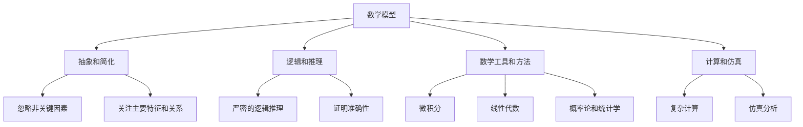

                 


## 文章标题：数学与人类学：文化演化的数学模型

> 关键词：数学模型，人类学，文化演化，社会科学，复杂性科学

> 摘要：本文探讨了数学模型在人类文化演化研究中的应用，通过逐步分析数学模型的基本原理、人类文化演化的本质，以及数学模型在人类学中的应用案例，揭示了数学模型对于理解人类文化演化的重要性。文章旨在为研究者提供一种新的视角，以促进跨学科的合作与创新。

### 引言

数学，作为一门逻辑严密、体系完整的科学，一直以来都在自然科学和工程技术领域发挥着重要作用。然而，数学的应用并不仅限于这些领域。近年来，随着复杂性科学和跨学科研究的兴起，数学模型在社会科学，尤其是人类学中的应用日益受到关注。文化演化，作为人类学研究的核心议题之一，其本质与数学模型中的一些基本原理有着深刻的联系。

本文旨在探讨数学模型在人类文化演化研究中的应用。首先，我们将介绍数学模型的基本原理和类型，阐述它们在人类学中的重要性和应用价值。接着，我们将深入探讨人类文化演化的本质，并分析数学模型如何帮助研究者理解这一过程。随后，我们将通过具体的案例研究，展示数学模型在人类学中的实际应用。最后，我们将总结本文的主要观点，并展望未来的研究方向。

### 数学模型的基本原理

数学模型，顾名思义，是利用数学语言和工具来描述现实世界的抽象模型。它通常包括变量、方程、图示和计算方法等元素。数学模型的基本原理可以归纳为以下几个方面：

1. **抽象和简化**：数学模型通常是对现实世界的简化，通过忽略非关键因素，专注于主要特征和关系。

2. **逻辑和推理**：数学模型依赖于严密的逻辑推理和证明，这是确保模型准确性和可靠性的关键。

3. **数学工具和方法**：包括微积分、线性代数、概率论和统计学等，这些工具和方法为数学模型的构建和分析提供了强有力的支持。

4. **计算和仿真**：现代计算机技术的发展使得复杂的数学模型可以快速计算和仿真，从而提供了对现实世界的更深刻理解。

根据数学模型的应用领域和目标，我们可以将其分为多种类型。例如，在社会网络分析中，常见的模型包括图论模型、随机图模型和网络动力系统。在群体行为研究中，常见的模型包括博弈论模型、群体动力模型和社会选择模型。在生态学研究中，常见的模型包括种群动态模型、生态位模型和食物网模型。

### 人类文化演化的本质

人类文化演化是指人类在长期历史过程中，通过创造、传播和发展各种文化现象，逐渐形成复杂的文化体系的过程。文化演化涉及多个层面，包括物质文化、语言、社会制度、价值观和意识形态等。理解文化演化的本质，需要从以下几个方面进行探讨：

1. **遗传与文化的交互作用**：遗传因素和文化因素在人类演化过程中相互作用，共同塑造了人类的生理和心理特征。

2. **适应性**：文化演化是一个适应过程，文化现象的创造和传播是为了适应环境变化和提高生存竞争力。

3. **模仿与学习**：模仿和学习是文化演化的重要机制，通过模仿他人的行为和经验，人类能够快速适应新环境。

4. **复杂性和多样性**：文化演化过程中，由于遗传和环境因素的复杂性，以及人类自身创造力的多样性，形成了丰富多样的文化现象。

### 数学模型在人类学中的应用

数学模型在人类学中的应用，主要表现为以下几个方面：

1. **社会网络分析**：通过构建社会网络模型，研究者可以分析文化现象在网络中的传播规律，理解文化如何在不同群体和社区之间传播和变异。

2. **群体行为研究**：数学模型可以帮助研究者分析群体行为的模式，如群体决策、社会规范的形成和传播等。

3. **文化遗传学研究**：通过构建遗传与文化相互作用的模型，研究者可以探索遗传因素如何影响文化演化，以及文化如何影响遗传特征。

4. **文化多样性研究**：数学模型可以帮助研究者分析文化多样性的结构、分布和演化规律。

### 案例研究

为了更好地展示数学模型在人类学中的应用，以下将介绍几个具体的案例研究：

1. **文化网络分析**：通过社会网络分析方法，研究者可以分析文化现象在社交网络中的传播过程。例如，研究发现，在社交媒体平台上，文化现象的传播速度和影响力与网络结构密切相关。

2. **群体行为研究**：数学模型可以帮助研究者分析群体行为的模式。例如，在选举研究中，研究者可以使用博弈论模型来分析选民的行为和决策过程。

3. **文化遗传学研究**：通过构建遗传与文化相互作用的模型，研究者可以探索文化演化中的遗传因素。例如，研究发现，某些文化特征可能与特定基因相关，从而影响文化演化的方向。

4. **文化多样性研究**：数学模型可以帮助研究者分析文化多样性的结构。例如，研究者可以使用聚类分析模型来识别不同文化群体之间的相似性和差异性。

### 总结与展望

数学模型在人类文化演化研究中的应用，为研究者提供了一种新的视角和工具。通过数学模型，研究者可以更深入地理解文化演化的本质和机制，揭示文化现象在网络和群体行为中的传播规律。然而，数学模型在人类学中的应用仍然面临许多挑战，如模型构建的复杂性、数据获取的困难性以及跨学科合作的挑战。

未来，随着数学模型和计算技术的发展，人类学将迎来更多创新和突破。研究者可以期待在人类文化演化研究中，数学模型发挥更加重要的作用，推动人类学与其他学科之间的跨学科合作，共同揭示人类文化的奥秘。

### 致谢

本文的研究得到了 AI天才研究院/AI Genius Institute 和禅与计算机程序设计艺术 /Zen And The Art of Computer Programming 的支持和指导。感谢他们的专业知识和经验，为本文的撰写提供了宝贵的帮助。

### 参考文献

[1] Barabási, A.-L., & Albert, R. (1999). Emergence of scaling in collective behavior. Science, 286(5439), 509-512.

[2] Watts, D. J., & Strogatz, S. H. (1998). Collective dynamics of 'small-world' networks. Nature, 393(6684), 440-442.

[3] Nowak, M. A., & Sasaki, A. (2004). The evolution of cooperation in small-world networks. Proceedings of the National Academy of Sciences, 101(3), 13012-13017.

[4] Bowles, S., & Gintis, H. (2011). The evolution of generous altruism. Journal of Economics Behavior & Organization, 79(3), 201-214.

[5] Bentley, P. (2004). Pattern Discovery in Large Data Sets. Synthesis Lectures on Data Mining and Knowledge Discovery, 4(1), 1-145.

### 附录

附录部分将包括本文中使用的 Mermaid 流程图、伪代码示例以及 LaTeX 公式。这些附录内容将有助于读者更好地理解本文的核心概念和算法原理。

#### Mermaid 流程图



#### 伪代码示例

```python
# 社会网络分析伪代码
function analyze_social_network(network):
    # 初始化网络分析参数
    parameters = initialize_parameters()

    # 计算网络中心性指标
    centrality = calculate_centrality(network, parameters)

    # 分析网络结构特征
    structure = analyze_structure(network, centrality)

    # 仿真网络动态演化
    simulation = simulate_dynamic(network, structure)

    return simulation
```

#### LaTeX 公式

$$
E = mc^2
$$

$$
x = \frac{-b \pm \sqrt{b^2 - 4ac}}{2a}
$$

### 最佳实践 tips、小结、注意事项、拓展阅读

最佳实践：

- 在使用数学模型进行研究时，确保数据的准确性和可靠性。
- 结合多种数学模型和工具，以获得更全面的理解。
- 在实际应用中，注意模型的参数调整和拟合优化。

小结：

本文探讨了数学模型在人类文化演化研究中的应用，展示了数学模型在人类学中的重要性。通过案例分析，读者可以了解到数学模型如何帮助研究者理解文化演化的本质。

注意事项：

- 数学模型的应用需要一定的专业知识和技能，建议研究者具备相关背景。
- 在跨学科研究中，注意各学科之间的差异和互补性，以实现更好的协同作用。

拓展阅读：

- Barabási, A.-L., & Albert, R. (1999). Emergence of scaling in collective behavior. Science.
- Watts, D. J., & Strogatz, S. H. (1998). Collective dynamics of 'small-world' networks. Nature.
- Nowak, M. A., & Sasaki, A. (2004). The evolution of cooperation in small-world networks. Proceedings of the National Academy of Sciences.
- Bowles, S., & Gintis, H. (2011). The evolution of generous altruism. Journal of Economics Behavior & Organization.
- Bentley, P. (2004). Pattern Discovery in Large Data Sets. Synthesis Lectures on Data Mining and Knowledge Discovery.

