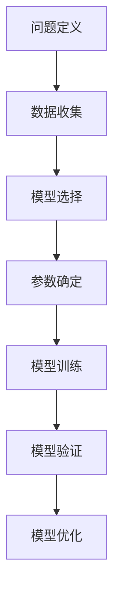

                 

当然，我会按照您的指示，采用逻辑清晰、步骤分明的模式撰写这篇文章。让我们开始吧。

---

### 文章标题
数学与伦理学：道德决策的量化模型

### 文章关键词
道德决策、量化模型、数学、伦理学、算法

### 摘要
本文探讨了数学与伦理学的交叉领域，引入了道德决策的量化模型。文章首先概述了道德决策的背景和重要性，然后介绍了相关数学理论和伦理学原理。接着，文章详细阐述了道德决策量化模型的构建方法、算法实现和应用案例。最后，文章讨论了道德决策量化模型在不同领域的应用前景，并对未来研究进行了展望。

---

### 引言

道德决策是人类行为的核心组成部分，其重要性不言而喻。然而，道德决策往往面临复杂情境和多种选择，这使得道德决策变得复杂且具有挑战性。传统上，道德决策依赖于伦理学理论和主观判断，但这种方法往往缺乏客观性和可操作性。因此，将数学方法应用于道德决策，构建量化模型成为一种新的趋势。

数学与伦理学的交叉研究可以追溯到古希腊时期，当时的哲学家们已经开始探讨数学与道德之间的联系。随着科学和技术的进步，数学方法在伦理学中的应用逐渐深入。特别是在计算机科学和人工智能领域，道德决策的量化模型得到了广泛应用。

本文旨在探讨道德决策量化模型的理论基础、构建方法、算法实现和应用案例。通过本文的阅读，读者将了解道德决策量化模型的基本概念、研究意义和应用前景。

### 第一章 基础理论

#### 1.1 道德决策理论

道德决策是指个体在面临道德困境时，根据伦理原则和价值观做出选择的过程。道德决策理论主要关注道德决策的产生过程、影响因素和决策结果。

**基本概念：**
- **道德困境（Moral Dilemma）：** 当个体面临两种或多种道德选择，每种选择都可能导致道德冲突的情况。
- **道德直觉（Moral Intuition）：** 个体基于本能和直觉做出的道德判断。
- **道德推理（Moral Reasoning）：** 个体在道德决策过程中使用的逻辑思维过程。

**模型类型：**
- **直觉模型（Intuitive Model）：** 依赖于道德直觉的决策模型。
- **理性模型（Rational Model）：** 依赖于逻辑推理和理性分析的决策模型。
- **情感模型（Emotional Model）：** 依赖于个体情感反应的决策模型。

**困境与挑战：**
道德决策困境包括价值冲突、信息不完整、情感干扰等。道德决策的挑战在于如何在复杂情境中做出公正、合理和道德的选择。

#### 1.2 数学理论基础

数学在道德决策中的应用主要体现在以下几个方面：

- **概率论（Probability Theory）：** 用于量化不确定性和风险，帮助个体做出概率上的最优决策。
- **优化理论（Optimization Theory）：** 用于求解最优解，帮助个体在有限资源下做出最大化利益或最小化损失的选择。
- **博弈论（Game Theory）：** 用于分析个体在竞争或合作情境中的策略选择。

**数学在道德决策中的应用：**
- **概率论：** 在道德决策中，概率论可以用来评估不同决策的结果和风险。
- **优化理论：** 在道德决策中，优化理论可以用来确定最佳行为方案。
- **博弈论：** 在道德决策中，博弈论可以用来分析个体之间的互动和策略选择。

#### 1.3 伦理学基本原理

伦理学是研究道德原则、价值观和道德行为的学科。伦理学的基本原理包括：

- **功利主义（Utilitarianism）：** 价值判断基于行为的后果，以最大化幸福或利益为标准。
- **义务论（Deontological Ethics）：** 价值判断基于行为的道德义务，不考虑行为的后果。
- **权利论（Rights-Based Ethics）：** 价值判断基于个体的权利和自由。

**道德价值观分析：**
不同的道德价值观对道德决策产生重要影响。例如，功利主义者更关注行为的结果，而义务论者更关注行为的道德义务。

**伦理决策框架：**
伦理决策框架提供了一种系统化的方法来分析道德决策。常见的伦理决策框架包括：

- **功利主义决策框架：** 以最大化幸福或利益为标准，分析不同决策的后果。
- **义务论决策框架：** 以道德义务为标准，分析不同决策的道德合理性。
- **权利论决策框架：** 以个体的权利和自由为标准，分析不同决策的道德正当性。

---

### 本章小结

本章介绍了道德决策的基本概念、数学理论基础和伦理学基本原理。通过本章的学习，读者将了解道德决策的类型、影响因素和道德困境。同时，读者还将了解数学和伦理学在道德决策中的应用，为后续章节的讨论奠定基础。

---

接下来的章节将详细探讨道德决策量化模型的构建方法、算法实现和应用案例。请读者继续关注下一章节的内容。在这个基础上，我们将进一步深入探讨道德决策量化模型的构建过程和实际应用。

---

### 第二章 道德决策量化模型构建

在第一章中，我们介绍了道德决策的基本概念、数学理论基础和伦理学基本原理。本章将在此基础上，深入探讨道德决策量化模型的构建方法。

#### 2.1 模型构建方法

道德决策量化模型的构建过程可以分为以下几个步骤：

1. **问题定义：** 明确道德决策的具体情境和目标。
2. **数据收集：** 收集与道德决策相关的数据，包括道德价值观、情境参数和概率分布等。
3. **模型选择：** 根据问题的性质选择合适的数学模型。
4. **参数确定：** 确定模型参数，包括权重、阈值等。
5. **模型训练：** 使用收集到的数据训练模型。
6. **模型验证：** 验证模型的准确性和可靠性。
7. **模型优化：** 根据验证结果优化模型。

下面我们将详细介绍每个步骤。

##### 2.1.1 模型选择

道德决策量化模型的选择取决于问题的性质。常见的模型包括：

- **线性模型：** 如线性回归、逻辑回归等，适用于线性关系较为明显的情境。
- **非线性模型：** 如神经网络、决策树等，适用于非线性关系较为复杂的情境。
- **概率模型：** 如贝叶斯网络、马尔可夫模型等，适用于不确定性较高的情境。

##### 2.1.2 参数确定

模型参数的确定是道德决策量化模型构建的关键步骤。参数的选取通常基于以下原则：

- **一致性（Consistency）：** 参数应保持模型的一致性，即模型在给定输入时能够给出一致的输出。
- **可解释性（Interpretability）：** 参数应具有可解释性，即参数的含义应易于理解。
- **优化性（Optimality）：** 参数应使模型在特定目标下达到最优。

参数的确定通常需要通过实验和优化来实现。以下是一种常见的参数确定方法：

1. **初始参数设置：** 根据经验或文献设定初始参数。
2. **实验验证：** 使用实验数据验证参数的有效性。
3. **参数优化：** 使用优化算法（如梯度下降、遗传算法等）调整参数，以达到最优性能。

##### 2.1.3 模型训练

模型训练是道德决策量化模型构建的另一个关键步骤。训练过程通常包括以下步骤：

1. **数据预处理：** 清洗数据，处理缺失值和异常值。
2. **特征选择：** 选择对模型性能有显著影响的特征。
3. **模型训练：** 使用训练数据对模型进行训练，调整模型参数。
4. **模型评估：** 使用验证数据评估模型性能，包括准确率、召回率等指标。

##### 2.1.4 模型验证

模型验证是确保模型准确性和可靠性的重要步骤。验证过程通常包括以下步骤：

1. **交叉验证：** 将数据集划分为训练集和验证集，使用验证集评估模型性能。
2. **独立测试：** 使用独立测试集对模型进行评估，以检验模型在未知数据上的性能。
3. **误差分析：** 分析模型预测误差，识别和解决潜在问题。

##### 2.1.5 模型优化

模型优化是提高模型性能的重要手段。优化过程通常包括以下步骤：

1. **性能评估：** 使用验证集和测试集评估模型性能。
2. **参数调整：** 调整模型参数，以减少预测误差。
3. **算法改进：** 改进模型算法，以提高模型性能。
4. **重复训练：** 重复模型训练和验证过程，直至达到满意的性能。

#### 2.2 Mermaid 流程图

为了更好地理解道德决策量化模型的构建过程，我们可以使用Mermaid流程图来展示。以下是一个简化的Mermaid流程图：



#### 2.3 伪代码讲解

下面是一个道德决策量化模型的伪代码示例，展示了模型构建的基本步骤：

```python
# 伪代码：道德决策量化模型构建

# 函数：constructEthicalDecisionModel
# 输入：无
# 输出：道德决策量化模型

function constructEthicalDecisionModel():
    // 步骤1：问题定义
    defineProblem()

    // 步骤2：数据收集
    data = collectData()

    // 步骤3：模型选择
    model = selectModel()

    // 步骤4：参数确定
    parameters = determineParameters()

    // 步骤5：模型训练
    trainedModel = trainModel(model, parameters, data)

    // 步骤6：模型验证
    isValid = validateModel(trainedModel, validationData)

    // 步骤7：模型优化
    optimizedModel = optimizeModel(trainedModel, isValid)

    return optimizedModel
```

#### 2.4 数学模型与公式讲解

道德决策量化模型通常涉及多个数学公式和模型。以下是一个简化的数学模型示例，展示了道德决策量化模型的基本结构：

$$
\text{道德决策量化模型} = f(\text{道德价值观}, \text{情境参数}, \text{概率分布})
$$

其中，$f$ 表示决策函数，$\text{道德价值观}$ 表示个体对道德的判断标准，$\text{情境参数}$ 表示决策的具体情境，$\text{概率分布}$ 表示决策结果的不确定性。

##### 模型解释：

- **道德价值观：** 个体对道德价值观的判断，通常表示为一个权重向量，如 $\text{道德价值观} = \textbf{w}$。
- **情境参数：** 决策的具体情境，如 $\text{情境参数} = \textbf{p}$。
- **概率分布：** 决策结果的不确定性，如 $\text{概率分布} = \textbf{p}_\text{r}$。

##### 模型应用：

- **企业道德决策：** 在企业决策中，道德价值观可以表示为对社会责任、员工权益、客户利益等的综合考虑。
- **社会治理：** 在社会治理中，道德价值观可以表示为对公共安全、社会公平、环境保护等的综合考虑。

#### 2.5 举例说明

为了更好地理解道德决策量化模型，我们可以通过一个简单的例子来说明。假设一个企业面临是否要生产并销售一种可能对环境有害的产品。企业需要根据道德价值观、产品特性、市场因素等来做出决策。

**例子：企业道德决策**

- **道德价值观：** 企业价值观包括社会责任、环境保护、经济利益等。
- **情境参数：** 产品特性（如污染程度、可替代性）、市场因素（如市场需求、竞争状况）。
- **概率分布：** 决策结果的不确定性，如生产该产品的利润、对环境的污染程度。

根据道德决策量化模型，企业可以通过以下步骤做出决策：

1. **问题定义：** 明确企业的道德决策问题。
2. **数据收集：** 收集与决策相关的数据，如产品特性、市场因素等。
3. **模型选择：** 选择合适的道德决策量化模型。
4. **参数确定：** 确定模型参数，如道德价值观的权重、情境参数的权重等。
5. **模型训练：** 使用收集到的数据训练模型。
6. **模型验证：** 验证模型的准确性和可靠性。
7. **模型优化：** 根据验证结果优化模型。

通过上述步骤，企业可以量化道德决策问题，从而做出更合理、更符合道德价值观的决策。

---

### 本章小结

本章介绍了道德决策量化模型的构建方法，包括问题定义、数据收集、模型选择、参数确定、模型训练、模型验证和模型优化等步骤。通过本章的学习，读者将了解道德决策量化模型的基本构建方法和应用场景。在下一章中，我们将进一步探讨道德决策量化模型的算法实现和应用案例。

---

在接下来的章节中，我们将继续探讨道德决策量化模型的算法实现和应用。请读者继续关注下一章节的内容。在这个基础上，我们将进一步深入探讨道德决策量化模型的算法实现和应用。

---

### 第三章 算法实现

在前一章中，我们介绍了道德决策量化模型的构建方法。本章将详细探讨道德决策量化模型的算法实现，包括算法原理讲解、数学模型和公式讲解以及实际应用案例。

#### 3.1 算法原理讲解

道德决策量化模型的实现通常依赖于特定的算法。这些算法可以根据问题的性质和需求进行选择。以下是一些常见的道德决策量化算法：

1. **线性回归（Linear Regression）：** 线性回归是一种简单的回归算法，适用于线性关系的建模。它通过最小化预测值与实际值之间的误差来训练模型。

2. **逻辑回归（Logistic Regression）：** 逻辑回归是一种广义的线性回归模型，常用于分类问题。它通过最大似然估计来训练模型，能够输出概率值。

3. **决策树（Decision Tree）：** 决策树是一种基于树形结构的分类算法。它通过递归划分特征空间来构建决策树，并在树节点上应用阈值来判断分类结果。

4. **随机森林（Random Forest）：** 随机森林是一种基于决策树的集成学习算法。它通过随机选择特征和样本子集来构建多棵决策树，并通过投票或平均来得出最终预测结果。

5. **神经网络（Neural Network）：** 神经网络是一种基于模拟生物神经系统的计算模型。它通过多层神经元之间的连接和激活函数来训练模型，能够处理复杂的非线性关系。

6. **支持向量机（Support Vector Machine, SVM）：** 支持向量机是一种基于间隔最大化的分类算法。它通过寻找最优超平面来分隔不同类别的数据点，并能够在高维空间中工作。

7. **贝叶斯网络（Bayesian Network）：** 贝叶斯网络是一种基于概率论的图形模型。它通过概率图结构来表示变量之间的依赖关系，并通过贝叶斯推理来计算变量之间的条件概率。

8. **马尔可夫模型（Markov Model）：** 马尔可夫模型是一种基于状态转移概率的模型。它通过分析状态序列的转移概率来预测未来状态。

#### 3.2 数学模型与公式讲解

道德决策量化模型的实现通常涉及多个数学模型和公式。以下是一些常见的数学模型和公式：

1. **线性回归模型：**
   $$
   y = \beta_0 + \beta_1 x_1 + \beta_2 x_2 + \ldots + \beta_n x_n
   $$
   其中，$y$ 是预测值，$x_1, x_2, \ldots, x_n$ 是特征值，$\beta_0, \beta_1, \beta_2, \ldots, \beta_n$ 是模型参数。

2. **逻辑回归模型：**
   $$
   \text{logit}(P) = \ln\left(\frac{P}{1-P}\right) = \beta_0 + \beta_1 x_1 + \beta_2 x_2 + \ldots + \beta_n x_n
   $$
   其中，$P$ 是概率值，$\text{logit}(P)$ 是逻辑函数，$\beta_0, \beta_1, \beta_2, \ldots, \beta_n$ 是模型参数。

3. **决策树模型：**
   $$
   \text{决策树} = \sum_{i=1}^{n} \beta_i \cdot \text{Decision}(x_i)
   $$
   其中，$x_i$ 是特征值，$\text{Decision}(x_i)$ 是决策函数，$\beta_i$ 是模型参数。

4. **神经网络模型：**
   $$
   a_i = \sigma(\sum_{j=1}^{m} \beta_{ij} \cdot x_j + \beta_{i0})
   $$
   其中，$a_i$ 是输出值，$\sigma$ 是激活函数，$x_j$ 是特征值，$\beta_{ij}$ 和 $\beta_{i0}$ 是模型参数。

5. **支持向量机模型：**
   $$
   \text{间隔} = \frac{1}{\|w\|}
   $$
   其中，$w$ 是模型参数，$\|w\|$ 是向量的范数。

6. **贝叶斯网络模型：**
   $$
   P(\text{事件}_i | \text{前提}_j) = \frac{P(\text{前提}_j | \text{事件}_i) \cdot P(\text{事件}_i)}{P(\text{前提}_j)}
   $$
   其中，$P(\text{事件}_i | \text{前提}_j)$ 是条件概率，$P(\text{前提}_j | \text{事件}_i)$ 是逆条件概率。

7. **马尔可夫模型：**
   $$
   P(\text{状态}_i | \text{状态}_j) = \frac{P(\text{状态}_j | \text{状态}_i) \cdot P(\text{状态}_i)}{P(\text{状态}_j)}
   $$
   其中，$P(\text{状态}_i | \text{状态}_j)$ 是转移概率，$P(\text{状态}_j | \text{状态}_i)$ 是逆转移概率。

#### 3.3 实际应用案例

为了更好地理解道德决策量化模型的算法实现，我们可以通过一个实际应用案例来展示。

**案例：企业道德决策**

假设一个企业面临是否要生产并销售一种可能对环境有害的产品。企业需要根据道德价值观、产品特性、市场因素等来做出决策。

**数据收集：**
- 道德价值观：社会责任、环境保护、经济利益等。
- 产品特性：污染程度、可替代性。
- 市场因素：市场需求、竞争状况。

**模型选择：**
- 选择逻辑回归模型进行道德决策量化。

**参数确定：**
- 通过实验和优化确定模型参数。

**模型训练：**
- 使用收集到的数据对逻辑回归模型进行训练。

**模型验证：**
- 使用验证数据对模型进行验证，评估模型性能。

**模型优化：**
- 根据验证结果对模型进行优化。

**决策过程：**
1. **问题定义：** 明确企业的道德决策问题。
2. **数据收集：** 收集与决策相关的数据。
3. **模型选择：** 选择合适的逻辑回归模型。
4. **参数确定：** 确定模型参数。
5. **模型训练：** 训练模型。
6. **模型验证：** 验证模型性能。
7. **模型优化：** 优化模型。

通过上述步骤，企业可以量化道德决策问题，从而做出更合理、更符合道德价值观的决策。

---

### 本章小结

本章详细介绍了道德决策量化模型的算法实现，包括算法原理讲解、数学模型和公式讲解以及实际应用案例。通过本章的学习，读者将了解道德决策量化模型的算法实现方法和应用过程。在下一章中，我们将进一步探讨道德决策量化模型在不同领域的应用。

---

在接下来的章节中，我们将继续探讨道德决策量化模型在不同领域的应用。请读者继续关注下一章节的内容。在这个基础上，我们将进一步深入探讨道德决策量化模型在不同领域的实际应用。

---

### 第四章 应用领域探讨

道德决策量化模型的应用领域广泛，涵盖了企业管理、社会治理、医疗伦理、法律实践等多个领域。本章将探讨道德决策量化模型在这些领域的应用，以及其带来的影响和挑战。

#### 4.1 道德决策在企业管理中的应用

在企业管理中，道德决策量化模型可以帮助企业在复杂的市场环境中做出更为合理和道德的决策。以下是一些具体应用案例：

1. **环境伦理：** 企业在环境保护方面面临道德决策时，可以使用道德决策量化模型评估不同决策方案的环境影响。例如，企业可以选择减少污染物排放、投资清洁能源技术或承担环境责任基金等。通过量化模型，企业可以权衡成本和效益，选择最符合道德价值观和可持续发展的方案。

2. **员工福利：** 企业在制定员工福利政策时，可以使用道德决策量化模型评估不同福利方案对员工的影响。例如，企业可以选择提高薪资、提供健康保险、增加培训机会等。通过量化模型，企业可以综合考虑员工的利益和企业的财务状况，制定既符合道德价值观又具有实际操作性的福利政策。

3. **产品责任：** 企业在产品设计和销售过程中，需要考虑产品责任问题。道德决策量化模型可以帮助企业评估不同产品设计方案和销售策略的道德风险。例如，企业可以选择采用环保材料、提供详细产品说明或设立产品召回机制等。通过量化模型，企业可以降低道德风险，提高产品声誉和市场份额。

4. **企业社会责任：** 企业在社会责任方面的道德决策量化模型可以帮助企业评估不同社会责任项目的道德影响和成本效益。例如，企业可以选择捐赠慈善基金、参与社区建设或推行可持续发展计划等。通过量化模型，企业可以更好地履行社会责任，提升企业形象和竞争力。

#### 4.2 道德决策在社会治理中的应用

在社会治理中，道德决策量化模型可以帮助政府和社会组织在复杂的公共决策中做出更为公正和合理的决策。以下是一些具体应用案例：

1. **资源分配：** 在公共资源分配中，道德决策量化模型可以帮助政府和社会组织评估不同资源分配方案的道德合理性。例如，政府可以选择投入更多资源到教育、医疗等领域，或为低收入群体提供更多补贴和福利。通过量化模型，政府可以更好地平衡公共资源的分配，提高社会公平和福祉。

2. **公共政策：** 在制定公共政策时，道德决策量化模型可以帮助政府和社会组织评估不同政策的道德影响和成本效益。例如，政府可以选择实施环境保护政策、反腐败政策或社会福利政策等。通过量化模型，政府可以更好地衡量政策的道德价值和实际效果，提高政策制定的科学性和民主性。

3. **社会治理：** 在社会治理中，道德决策量化模型可以帮助政府和社会组织评估不同社会治理方案的道德合理性。例如，政府可以选择加强公共安全、改善社会治安或推动社区治理等。通过量化模型，政府可以更好地应对社会问题，提升社会治理能力和水平。

4. **道德监管：** 在道德监管方面，道德决策量化模型可以帮助政府和社会组织评估不同监管措施的道德影响和效果。例如，政府可以选择加强对企业的环保监管、食品安全监管或劳动权益保护等。通过量化模型，政府可以更好地监管市场和社会，维护社会秩序和公共利益。

#### 4.3 道德决策在医疗伦理中的应用

在医疗伦理中，道德决策量化模型可以帮助医疗专业人员和相关机构在复杂医疗决策中做出更为合理和道德的决策。以下是一些具体应用案例：

1. **医疗资源分配：** 在医疗资源分配中，道德决策量化模型可以帮助医疗机构评估不同资源分配方案的道德合理性。例如，医疗机构可以选择将更多资源投入到急诊服务、重症监护或贫困患者救助等。通过量化模型，医疗机构可以更好地平衡医疗资源的分配，提高医疗服务的公平性和效率。

2. **医疗决策：** 在医疗决策中，道德决策量化模型可以帮助医疗专业人员评估不同治疗方案的风险和道德影响。例如，医疗专业人员可以选择采用传统治疗方法、创新治疗方法或综合治疗方案等。通过量化模型，医疗专业人员可以更好地权衡患者的利益和风险，做出更为合理和道德的决策。

3. **医疗伦理审查：** 在医疗伦理审查中，道德决策量化模型可以帮助医疗机构评估不同医疗项目的道德合理性。例如，医疗机构可以选择实施临床试验、伦理审查或患者隐私保护等。通过量化模型，医疗机构可以更好地遵守伦理规范，保障患者的权益和尊严。

4. **医患沟通：** 在医患沟通中，道德决策量化模型可以帮助医疗专业人员评估不同沟通策略的道德影响和效果。例如，医疗专业人员可以选择采用积极沟通、透明沟通或尊重患者意愿等。通过量化模型，医疗专业人员可以更好地与患者沟通，建立良好的医患关系，提高医疗服务质量。

#### 4.4 道德决策在法律实践中的应用

在法律实践

