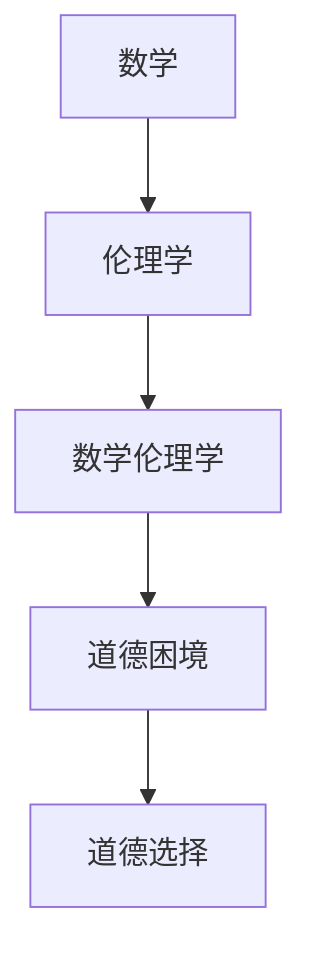

                 

### 《数学与伦理学：道德困境的数学建模》

#### 关键词：数学建模，伦理学，道德困境，博弈论，效用理论，公理法

> 摘要：道德困境是伦理学中一个重要且复杂的研究领域，涉及到个体和集体行为之间的矛盾。本文旨在探讨如何运用数学方法，特别是数学建模，来解决道德困境问题。通过梳理数学与伦理学的交叉领域，介绍数学建模的基本原理和常见方法，本文将对道德困境的数学建模进行深入剖析，并探讨其在实际应用中的挑战与未来方向。

---

## 第一部分：引言

### 1.1 数学与伦理学的基本概念

数学作为一门科学，以逻辑和严密性著称，通过抽象和推理构建了一个自洽的体系。伦理学则关注道德行为的规范和评价，探讨个体和群体之间应该如何行事。两者的结合，即数学伦理学，为我们提供了一种新的视角，将严格的数学方法应用于道德问题的研究。

#### 1.1.1 数学的定义与特性

数学是一种形式化的学科，它通过符号和逻辑推理来研究数量、结构、变化和空间。数学的基本特性包括公理性、抽象性和精确性。公理性意味着数学体系的基础是经过严格验证的公理；抽象性使得数学可以脱离具体情境，研究普遍规律；精确性则保证了数学结论的可靠性和可验证性。

#### 1.1.2 伦理学的定义与特性

伦理学是研究道德行为规范的学科，它关注的是个体和群体之间的道德关系。伦理学的核心概念包括道德原则、道德判断和道德责任。伦理学的特性包括主观性、规范性和相对性。主观性体现在不同文化和个人对道德的理解有所不同；规范性则强调道德规范对行为的指导作用；相对性则指出道德标准在不同社会和时代背景下可能发生变化。

#### 1.1.3 数学与伦理学的交叉领域

数学与伦理学的交叉领域，即数学伦理学，将数学的严密性和抽象性应用于道德问题的研究。数学伦理学主要探讨以下问题：如何使用数学方法来分析和解决道德困境？如何在决策过程中引入伦理考量？如何确保数学模型在伦理学上的公正性？

### 1.2 道德困境的定义与类型

道德困境是指在道德选择中面临的两难境地，个体必须在两种或多种互斥的道德行为之间做出选择。道德困境的类型多样，主要包括以下几种：

#### 1.2.1 自利困境

自利困境是指个体在追求自身利益时，可能损害他人的利益。例如，一个员工是否应该在工作中偷窃公司财产以改善自己的经济状况。

#### 1.2.2 公共资源困境

公共资源困境涉及到对稀缺资源的分配问题。例如，一个社区如何在有限的医疗资源下，公平地分配给需要治疗的病人。

#### 1.2.3 责任困境

责任困境是指个体在面临道德责任时，可能面临的选择。例如，一个医生是否应该在知情的情况下参与一个可能导致无辜人死亡的实验。

#### 1.2.4 操守困境

操守困境涉及到个体在道德操守和实际利益之间做出的选择。例如，一个企业高管是否应该牺牲公司的短期利益，以遵守道德规范。

#### 1.2.5 义务困境

义务困境是指个体在履行道德义务时，可能面临的选择。例如，一个士兵在战争中是否应该执行命令，即使这个命令可能会导致平民伤亡。

### 1.3 道德困境的社会影响

道德困境不仅影响个体的道德选择，也对社会产生深远的影响。道德困境可能导致以下社会问题：

#### 1.3.1 社会不公

道德困境中的不公平现象可能导致社会不公。例如，公共资源困境可能导致某些群体无法获得必要的资源，加剧社会贫富差距。

#### 1.3.2 社会冲突

道德困境中的矛盾和冲突可能导致社会冲突。例如，责任困境可能引发法律诉讼和道德争议。

#### 1.3.3 社会道德滑坡

长期存在的道德困境可能导致社会道德滑坡。例如，自利困境可能导致个体对社会规则和道德规范的漠视。

### 1.4 数学建模在道德困境研究中的重要性

数学建模作为一种工具，能够帮助我们从量化角度分析和解决道德困境。数学建模在道德困境研究中的重要性体现在以下几个方面：

#### 1.4.1 提供客观分析

数学建模能够提供客观的分析，帮助我们从量化角度理解道德困境的本质和影响。

#### 1.4.2 促进跨学科研究

数学建模促进了数学与伦理学的跨学科研究，推动了道德困境研究的深入发展。

#### 1.4.3 支持决策制定

数学建模能够为决策者提供量化依据，帮助他们在道德困境中做出更合理的决策。

### 1.5 本文结构

本文将首先介绍数学建模的基本原理和常见方法，然后探讨道德困境的数学建模方法，接着分析道德困境的数学模型实例，最后讨论道德困境数学建模的应用领域和挑战。通过本文的阅读，读者将能够理解数学建模在道德困境研究中的重要作用，并掌握基本的分析方法和应用技巧。

---

**Mermaid 流程图：数学与伦理学的核心概念联系**

---

在接下来的章节中，我们将深入探讨数学建模的基本原理，以及如何将其应用于道德困境的研究。通过详细的分析和实例讲解，我们将展示数学建模在解决道德困境中的强大能力。

