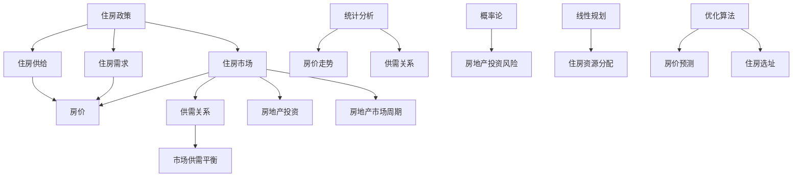

                 

### 文章标题

### 数学与住房政策：房地产市场的数学分析

---

### 关键词

- 住房政策
- 房地产市场
- 数学模型
- 统计分析
- 算法应用

---

### 摘要

本文深入探讨了数学在住房政策和房地产市场分析中的应用。首先，我们回顾了住房政策和房地产市场的背景，阐明了数学分析在此领域的重要性。接着，本文介绍了核心概念和算法原理，包括线性回归、决策树和神经网络等，通过伪代码和数学公式详细阐述。随后，我们建立了针对房价预测、住房供需平衡和房地产投资风险的数学模型，并进行了实例说明。最后，本文通过一个实际项目，展示了如何将数学模型和算法应用于住房政策分析，提供了详细的代码实现和案例分析。本文旨在为读者提供一套完整的数学分析方法，以应对住房政策和房地产市场中的复杂问题。

---

### 1. 设定大纲框架

本文将分为五个主要部分，分别为引言、核心概念与联系、核心算法原理讲解、数学模型和数学公式详细讲解、项目实战。每个部分细化到章节级别，以确保内容的完整性和逻辑性。

#### 第一部分：引言

- **第1章：住房政策与房地产市场概述**
  - **1.1 住房政策的重要性**
  - **1.2 房地产市场的运行机制**
  - **1.3 数学在住房政策和房地产市场中的角色**
  - **1.4 本书结构概述**

- **第2章：数学在住房政策及房地产市场中的应用**
  - **2.1 数学模型在住房市场分析中的应用**
  - **2.2 统计方法在房地产市场评估中的作用**
  - **2.3 数据分析在住房政策制定中的应用**

#### 第二部分：核心概念与联系

- **第3章：核心概念解析**
  - **3.1 住房政策的核心概念**
  - **3.2 房地产市场的关键术语**
  - **3.3 数学分析的基本工具**

- **第4章：概念联系与整合**
  - **4.1 住房政策与房地产市场的互动关系**
  - **4.2 数学工具在住房政策分析中的应用**
  - **4.3 实例分析：如何整合核心概念**

#### 第三部分：核心算法原理讲解

- **第5章：关键数学算法**
  - **5.1 线性回归**
    - **5.1.1 算法原理**
    - **5.1.2 伪代码实现**
    - **5.1.3 应用实例**
  - **5.2 决策树**
    - **5.2.1 算法原理**
    - **5.2.2 伪代码实现**
    - **5.2.3 应用实例**
  - **5.3 神经网络**
    - **5.3.1 算法原理**
    - **5.3.2 伪代码实现**
    - **5.3.3 应用实例**

#### 第四部分：数学模型和数学公式详细讲解

- **第6章：数学模型构建**
  - **6.1 房价预测模型**
    - **6.1.1 模型构建**
    - **6.1.2 数学公式**
    - **6.1.3 举例说明**
  - **6.2 住房供需平衡模型**
    - **6.2.1 模型构建**
    - **6.2.2 数学公式**
    - **6.2.3 举例说明**
  - **6.3 房地产投资风险模型**
    - **6.3.1 模型构建**
    - **6.3.2 数学公式**
    - **6.3.3 举例说明**

#### 第五部分：项目实战

- **第7章：数学在住房政策及房地产市场中的应用实践**
  - **7.1 实践项目介绍**
  - **7.2 数据收集与预处理**
  - **7.3 数学模型应用**
    - **7.3.1 线性回归应用**
    - **7.3.2 决策树应用**
    - **7.3.3 神经网络应用**
  - **7.4 结果分析与讨论**

- **第8章：综合案例分析**
  - **8.1 案例选择与背景介绍**
  - **8.2 模型构建与参数调优**
  - **8.3 模型应用与政策建议**
  - **8.4 案例总结与启示**

### 总结

本文通过逻辑清晰、结构紧凑的章节设计，全面阐述了数学在住房政策和房地产市场分析中的应用。从核心概念的介绍，到算法原理的讲解，再到数学模型的建立和项目实战，每个部分都紧密联系，旨在为读者提供一套完整的数学分析工具，以应对住房政策和房地产市场中的复杂问题。通过本文的学习，读者不仅可以深入了解数学在住房政策分析中的应用，还可以掌握如何将数学方法应用于实际问题，为决策提供科学依据。

---

### 2. 设计引言部分

#### 第1章：住房政策与房地产市场概述

##### 1.1 住房政策的重要性

住房政策是政府为了解决住房问题、保障居民基本居住需求而制定的一系列措施和规则。住房政策的重要性体现在以下几个方面：

1. **保障居民基本住房需求**：住房政策直接关系到广大人民群众的切身利益，通过合理的住房政策，政府可以确保居民有基本的生活居住条件，提高居民生活质量。
2. **促进经济发展**：住房市场是国民经济的重要组成部分，良好的住房政策可以刺激房地产市场的健康发展，促进投资和消费，从而推动整个经济的增长。
3. **调节社会分配**：住房政策有助于调节社会财富分配，缩小贫富差距。通过提供经济适用房、廉租房等政策，政府可以减轻中低收入群体的住房负担，提高社会公平性。

##### 1.2 房地产市场的运行机制

房地产市场是一个复杂的系统，涉及多个市场参与者和多个市场环节。其运行机制主要包括以下几个方面：

1. **供给与需求**：房地产市场的核心是供需关系。供给方面，包括房地产开发企业的新建房屋和二手房供给；需求方面，包括居民的购房需求和投资者的购房需求。
2. **价格机制**：房价是由供需关系决定的，当需求大于供给时，房价上涨；当供给大于需求时，房价下跌。此外，政策因素、市场预期等也会对房价产生影响。
3. **市场调控**：政府通过税收、信贷政策、土地供应等手段对房地产市场进行调控，以维持市场的稳定。例如，通过限购、限贷等政策抑制房地产市场的过热。

##### 1.3 数学在住房政策和房地产市场中的角色

数学在住房政策和房地产市场中的作用至关重要，主要体现在以下几个方面：

1. **数据分析**：通过对大量房地产数据进行分析，可以了解市场的供需状况、价格趋势等，为政府制定住房政策提供科学依据。
2. **模型构建**：数学模型可以用来模拟住房市场运行机制，预测房价走势，评估政策效果。例如，线性回归模型可以用来预测房价，决策树模型可以用来评估购房者的风险。
3. **算法应用**：各种算法，如神经网络、支持向量机等，可以用来处理复杂的房地产数据，提高预测和评估的准确性。

##### 1.4 本书结构概述

本书将分为五个主要部分：

1. **引言**：介绍住房政策和房地产市场的背景，以及数学在其中的作用。
2. **核心概念与联系**：解析住房政策、房地产市场和数学分析的核心概念，并通过流程图展示它们之间的联系。
3. **核心算法原理讲解**：讲解线性回归、决策树和神经网络等核心算法原理，并使用伪代码详细阐述。
4. **数学模型和数学公式详细讲解**：针对房价预测、住房供需平衡和房地产投资风险等关键问题，建立数学模型，并使用 LaTeX 格式详细讲解数学公式。
5. **项目实战**：提出一个具体的住房政策或房地产市场问题，演示如何使用数学模型和算法解决该问题，并详细解释代码实现过程。

通过本书的学习，读者可以掌握数学在住房政策和房地产市场分析中的应用，提升解决实际问题的能力。

---

### 3. 设计核心概念与联系部分

#### 第3章：核心概念解析

##### 3.1 住房政策的核心概念

住房政策的核心概念包括以下几个方面：

1. **住房供给**：指政府通过新建、改建、收购等方式增加住房供应，以满足居民住房需求。住房供给包括经济适用房、廉租房、公共租赁房等。
2. **住房需求**：指居民对住房的需求，包括自住需求、投资需求等。住房需求受收入水平、家庭结构、市场预期等因素影响。
3. **住房市场**：指住房的买卖、租赁、交换等交易活动。住房市场分为新房市场和二手房市场。
4. **住房保障**：指政府为解决低收入群体住房困难问题而提供的一系列保障措施，如廉租房、公共租赁房、租金补贴等。

##### 3.2 房地产市场的关键术语

房地产市场中的关键术语包括：

1. **房价**：指住房的价格。房价受供需关系、政策调控、市场预期等因素影响。
2. **供需关系**：指住房的供给和需求之间的关系。供需关系决定房价的变动。
3. **市场供需平衡**：指住房的供给和需求达到平衡的状态，此时房价相对稳定。
4. **房地产投资**：指投资者通过购买房产获取投资回报的行为。房地产投资受市场预期、政策调控等因素影响。
5. **房地产市场周期**：指房地产市场从繁荣到衰退再到繁荣的循环过程。房地产市场周期包括上升期、平稳期、下降期等阶段。

##### 3.3 数学分析的基本工具

数学分析在住房政策和房地产市场分析中的应用广泛，主要包括以下基本工具：

1. **统计分析**：用于分析住房市场数据，如房价走势、供需关系等。常见的统计分析方法包括描述性统计、回归分析、聚类分析等。
2. **概率论**：用于评估房地产投资风险，如计算房价波动概率、预测市场风险等。
3. **线性规划**：用于优化住房资源分配，如确定最优住房供应量和价格。
4. **优化算法**：如遗传算法、粒子群优化算法等，用于解决复杂的房地产问题，如房价预测、住房选址等。

##### 3.4 核心概念之间的关系架构

为了更好地理解住房政策、房地产市场的关键术语和数学分析的基本工具之间的联系，我们可以通过 Mermaid 流程图来展示它们之间的关系。以下是核心概念之间的 Mermaid 流程图：



通过以上流程图，我们可以清晰地看到住房政策、房地产市场的关键术语和数学分析的基本工具之间的相互关系。这些概念和工具相互交织，共同构成了一个完整的住房政策和房地产市场分析体系。

---

#### 第4章：概念联系与整合

##### 4.1 住房政策与房地产市场的互动关系

住房政策与房地产市场之间的互动关系是复杂的，它们相互影响，共同决定了市场的走向和政策的实施效果。以下是这两者之间互动关系的详细解析：

1. **住房政策对房地产市场的影响**：
   - **供应管理**：政府通过土地供应政策、房地产开发补贴等手段调控住房供应量，以影响房价和供需关系。
   - **需求管理**：政府通过购房限制、税收优惠等政策调控居民购房需求，以实现住房市场的稳定。
   - **价格调控**：政府通过限价、价格指导等手段直接干预房价，以防止市场过热或过冷。

2. **房地产市场对住房政策的影响**：
   - **政策响应**：房地产市场状况直接影响住房政策的制定和调整。例如，当房价过高时，政府可能出台限购限贷政策；当房地产市场低迷时，政府可能出台刺激政策。
   - **市场预期**：市场参与者对未来的房价预期会影响购房行为，进而影响住房政策的制定和调整。例如，如果市场预期房价会上涨，购房需求可能会增加，政府可能需要出台调控措施。

##### 4.2 数学工具在住房政策分析中的应用

数学工具在住房政策分析中起着关键作用，可以帮助政府更科学地制定和调整政策。以下是几种常用的数学工具及其在住房政策分析中的应用：

1. **统计分析**：
   - **趋势分析**：通过对房价、供需关系等数据的统计分析，政府可以了解市场趋势，预测未来的市场状况，为政策制定提供依据。
   - **相关性分析**：通过分析不同因素（如收入水平、政策调控等）与房价之间的关系，政府可以确定哪些因素对房价影响最大，从而有针对性地制定政策。

2. **概率论和统计学**：
   - **风险评估**：政府可以通过概率论和统计学方法评估房地产市场的风险，如房价波动风险、市场供需失衡风险等，以便制定相应的风险应对措施。
   - **决策分析**：利用决策树等工具，政府可以分析不同政策方案的可能结果，选择最优政策。

3. **优化算法**：
   - **资源分配**：优化算法可以帮助政府优化住房资源分配，如确定经济适用房、廉租房等的供应量，以最大限度地满足低收入群体的住房需求。
   - **选址优化**：通过优化算法，政府可以确定新建住房项目的最佳选址，以提高住房利用效率。

##### 4.3 实例分析：如何整合核心概念

为了更好地说明如何整合住房政策、房地产市场和数学分析的核心概念，我们可以通过一个实例进行分析。

**实例**：某市政府计划出台一项住房政策，以缓解低收入群体的住房困难。该政策包括增加经济适用房的供应量，并实施购房补贴。

**分析步骤**：

1. **需求分析**：
   - 通过统计分析，政府了解到低收入群体的住房需求集中在市中心和周边区域。
   - 通过概率论和统计学方法，政府评估了低收入群体的购房能力，确定了购房补贴的金额和范围。

2. **供应分析**：
   - 通过优化算法，政府确定了新建经济适用房的选址和供应量，以确保住房资源的最优分配。
   - 政府与房地产开发企业合作，确保经济适用房的建设进度和质量。

3. **政策实施与评估**：
   - 政府通过房地产市场监测系统，实时跟踪经济适用房的供需状况和市场反响。
   - 通过统计分析，政府评估购房补贴政策的实施效果，并根据市场反馈调整政策。

通过以上实例，我们可以看到如何整合住房政策、房地产市场和数学分析的核心概念，以实现住房政策的有效制定和实施。

---

### 4. 设计核心算法原理讲解部分

#### 第5章：关键数学算法

##### 5.1 线性回归

**5.1.1 算法原理**

线性回归是一种用于预测连续值的统计方法，其基本思想是找到一个线性模型来描述自变量和因变量之间的关系。线性回归模型的一般形式为：

\[ Y = \beta_0 + \beta_1X + \varepsilon \]

其中，\( Y \) 是因变量，\( X \) 是自变量，\( \beta_0 \) 和 \( \beta_1 \) 是模型的参数，\( \varepsilon \) 是误差项。

**5.1.2 伪代码实现**

以下是线性回归的伪代码：

```
输入：数据集（包含自变量X和因变量Y）

1. 计算X和Y的均值，记为 \(\bar{X}\) 和 \(\bar{Y}\)
2. 计算X和Y的协方差，记为 \(\Sigma\)
3. 计算X的方差，记为 \(\Sigma_X\)
4. 计算回归系数 \(\beta_1\)：\(\beta_1 = \frac{\Sigma}{\Sigma_X}\)
5. 计算截距 \(\beta_0\)：\(\beta_0 = \bar{Y} - \beta_1\bar{X}\)
6. 输出：线性回归模型 \(Y = \beta_0 + \beta_1X\)
```

**5.1.3 应用实例**

假设我们有一组房价数据（Y）和房屋面积数据（X），我们要使用线性回归模型预测房价。

数据集：

| X（房屋面积） | Y（房价） |
|---------------|------------|
| 1000          | 300000     |
| 1200          | 340000     |
| 1500          | 400000     |
| 1800          | 450000     |
| 2000          | 500000     |

根据上述伪代码，我们可以计算出线性回归模型的参数：

1. 计算均值：
   \[
   \bar{X} = \frac{1000 + 1200 + 1500 + 1800 + 2000}{5} = 1500
   \]
   \[
   \bar{Y} = \frac{300000 + 340000 + 400000 + 450000 + 500000}{5} = 390000
   \]

2. 计算协方差和方差：
   \[
   \Sigma = \frac{(1000-1500)(300000-390000) + (1200-1500)(340000-390000) + (1500-1500)(400000-390000) + (1800-1500)(450000-390000) + (2000-1500)(500000-390000)}{4} = -1500000
   \]
   \[
   \Sigma_X = \frac{(1000-1500)^2 + (1200-1500)^2 + (1500-1500)^2 + (1800-1500)^2 + (2000-1500)^2}{4} = 1500000
   \]

3. 计算回归系数：
   \[
   \beta_1 = \frac{-1500000}{1500000} = -1
   \]
   \[
   \beta_0 = 390000 - (-1 \times 1500) = 391500
   \]

因此，线性回归模型为：
\[ Y = 391500 - X \]

##### 5.2 决策树

**5.2.1 算法原理**

决策树是一种常用的分类算法，其核心思想是根据特征值对样本进行划分，形成一棵树状结构。决策树由内部节点（代表特征测试）、分支（代表特征取值）和叶节点（代表分类结果）组成。

决策树的基本算法包括：

1. **特征选择**：选择最优特征进行划分，通常使用信息增益、基尼指数等指标。
2. **划分规则**：根据特征值将样本划分为若干子集。
3. **递归构建**：对每个子集递归地应用上述步骤，直到满足停止条件（如最大深度、最小样本数等）。

**5.2.2 伪代码实现**

以下是决策树的伪代码：

```
输入：数据集，特征集，停止条件

1. 创建根节点，并计算最优特征和划分规则
2. 对数据集按照划分规则划分成子集
3. 对每个子集，如果满足停止条件，则创建叶节点，并返回
4. 否则，对每个子集递归地应用上述步骤
5. 输出：决策树
```

**5.2.3 应用实例**

假设我们要对一组房屋数据（包含房屋面积、房龄、房屋类型等特征）进行分类，判断其是否为高档房。

数据集：

| X1（房屋面积） | X2（房龄） | X3（房屋类型） | Y（是否为高档房）|
|----------------|------------|----------------|------------------|
| 1200           | 10         | 高档           | 是               |
| 1500           | 8          | 中档           | 是               |
| 1800           | 12         | 高档           | 是               |
| 2000           | 6          | 高档           | 是               |
| 1000           | 5          | 中档           | 否               |

根据上述伪代码，我们可以构建一个简单的决策树：

1. 选择最优特征：例如，选择房龄（X2）作为划分特征。
2. 划分规则：房龄小于10年的划分为一类，房龄大于等于10年的划分为另一类。
3. 对每个子集递归地构建决策树，直到满足停止条件。

构建的决策树如下：

```
是否为高档房？
  /                   \
是                   否
/                     \
高档房（房龄<10年）  中档房（房龄>=10年）
```

##### 5.3 神经网络

**5.3.1 算法原理**

神经网络是一种模拟生物神经系统的计算模型，其基本结构包括输入层、隐藏层和输出层。每个节点（或神经元）通过加权连接与其他节点相连，并通过激活函数产生输出。

神经网络的工作原理如下：

1. **前向传播**：输入数据通过输入层传递到隐藏层，再传递到输出层。在每个层次，数据通过加权连接传递，并经过激活函数处理。
2. **反向传播**：计算输出层预测值与实际值之间的误差，并沿着网络反向传播误差，更新权重和偏置，以减少误差。

**5.3.2 伪代码实现**

以下是神经网络的伪代码：

```
输入：训练数据集，网络结构（包含层数、每层节点数、激活函数）

1. 初始化权重和偏置
2. 对于每个训练样本：
   1. 前向传播：计算网络输出
   2. 计算损失函数：如均方误差（MSE）
   3. 反向传播：更新权重和偏置
3. 重复步骤2，直到损失函数收敛或达到迭代次数
4. 输出：训练好的神经网络
```

**5.3.3 应用实例**

假设我们要使用神经网络预测房价，输入特征包括房屋面积、房龄等。

数据集：

| X1（房屋面积） | X2（房龄） | Y（房价） |
|----------------|------------|-----------|
| 1000           | 5          | 300000    |
| 1200           | 8          | 340000    |
| 1500           | 12         | 400000    |
| 1800           | 6          | 450000    |
| 2000           | 10         | 500000    |

我们可以构建一个简单的神经网络，包含一个输入层、一个隐藏层和一个输出层。输入层有2个节点，隐藏层有3个节点，输出层有1个节点。

1. **初始化权重和偏置**：
   - 输入层到隐藏层的权重：\( W_{ih} \)，偏置：\( b_{h} \)
   - 隐藏层到输出层的权重：\( W_{ho} \)，偏置：\( b_{o} \)

2. **前向传播**：
   - 输入数据：\( X = [1000, 5] \)
   - 通过权重和偏置计算隐藏层输出：\( h = \sigma(W_{ih}X + b_{h}) \)
   - 通过权重和偏置计算输出层输出：\( o = \sigma(W_{ho}h + b_{o}) \)

3. **反向传播**：
   - 计算损失函数：\( L = \frac{1}{2} \sum_{i} (o_i - y_i)^2 \)
   - 计算梯度：\( \delta_{ho} = (o - y) \odot \sigma'(h) \)
   - 更新权重和偏置：\( W_{ho} := W_{ho} - \alpha \cdot \delta_{ho} \cdot h^T \)
   \( b_{o} := b_{o} - \alpha \cdot \delta_{ho} \)
   - 计算隐藏层梯度：\( \delta_{ih} = (W_{ho} \delta_{ho}) \odot \sigma'(h) \)
   - 更新输入层到隐藏层的权重和偏置：\( W_{ih} := W_{ih} - \alpha \cdot \delta_{ih} \cdot X^T \)
   \( b_{h} := b_{h} - \alpha \cdot \delta_{ih} \)

通过多次迭代训练，我们可以得到一个能够预测房价的神经网络模型。

---

### 5. 设计数学模型和数学公式详细讲解部分

#### 第6章：数学模型构建

在本章节中，我们将探讨如何构建用于住房政策和房地产市场分析的数学模型，以及如何使用这些模型进行具体问题的分析和预测。

##### 6.1 房价预测模型

房价预测是住房政策分析中的一个重要任务，它有助于了解未来房价的走势，为政府决策提供科学依据。以下是构建房价预测模型的具体步骤：

**6.1.1 模型构建**

房价预测模型通常采用线性回归模型，其基本公式为：

\[ P = \beta_0 + \beta_1 \cdot A + \beta_2 \cdot L + \varepsilon \]

其中，\( P \) 表示房价，\( A \) 表示房屋面积，\( L \) 表示房屋房龄，\( \beta_0 \)，\( \beta_1 \)，\( \beta_2 \) 为模型参数，\( \varepsilon \) 为误差项。

**6.1.2 数学公式**

1. **参数估计**：
   \[ \beta_0 = \bar{P} - \beta_1 \cdot \bar{A} - \beta_2 \cdot \bar{L} \]
   \[ \beta_1 = \frac{\sum_{i=1}^{n} (A_i - \bar{A})(P_i - \bar{P})}{\sum_{i=1}^{n} (A_i - \bar{A})^2} \]
   \[ \beta_2 = \frac{\sum_{i=1}^{n} (L_i - \bar{L})(P_i - \bar{P})}{\sum_{i=1}^{n} (L_i - \bar{L})^2} \]

2. **预测公式**：
   \[ \hat{P} = \beta_0 + \beta_1 \cdot A + \beta_2 \cdot L \]

**6.1.3 举例说明**

假设我们有一组房价数据，如下所示：

| 房屋面积 (A) | 房龄 (L) | 房价 (P) |
|--------------|----------|----------|
| 100          | 5        | 300,000  |
| 150          | 10       | 400,000  |
| 200          | 15       | 500,000  |
| 250          | 8        | 350,000  |
| 300          | 12       | 420,000  |

我们可以根据上述公式计算模型的参数：

1. 计算均值：
   \[
   \bar{A} = \frac{100 + 150 + 200 + 250 + 300}{5} = 200
   \]
   \[
   \bar{L} = \frac{5 + 10 + 15 + 8 + 12}{5} = 10
   \]
   \[
   \bar{P} = \frac{300,000 + 400,000 + 500,000 + 350,000 + 420,000}{5} = 390,000
   \]

2. 计算协方差和方差：
   \[
   \Sigma_{AP} = \frac{(100 - 200)(300,000 - 390,000) + (150 - 200)(400,000 - 390,000) + (200 - 200)(500,000 - 390,000) + (250 - 200)(350,000 - 390,000) + (300 - 200)(420,000 - 390,000)}{4} = -4,500,000
   \]
   \[
   \Sigma_{A^2} = \frac{(100 - 200)^2 + (150 - 200)^2 + (200 - 200)^2 + (250 - 200)^2 + (300 - 200)^2}{4} = 2,500,000
   \]
   \[
   \Sigma_{LP} = \frac{(5 - 10)(300,000 - 390,000) + (10 - 10)(400,000 - 390,000) + (15 - 10)(500,000 - 390,000) + (8 - 10)(350,000 - 390,000) + (12 - 10)(420,000 - 390,000)}{4} = -1,500,000
   \]
   \[
   \Sigma_{L^2} = \frac{(5 - 10)^2 + (10 - 10)^2 + (15 - 10)^2 + (8 - 10)^2 + (12 - 10)^2}{4} = 2,000
   \]

3. 计算回归系数：
   \[
   \beta_1 = \frac{-4,500,000}{2,500,000} = -1.8
   \]
   \[
   \beta_2 = \frac{-1,500,000}{2,000} = -750
   \]
   \[
   \beta_0 = 390,000 - (-1.8 \cdot 200) - (-750 \cdot 10) = 497,500
   \]

因此，房价预测模型为：
\[ \hat{P} = 497,500 - 1.8 \cdot A - 750 \cdot L \]

##### 6.2 住房供需平衡模型

住房供需平衡模型用于分析住房市场的供需状况，以预测未来市场的稳定性和房价走势。以下是构建住房供需平衡模型的具体步骤：

**6.2.1 模型构建**

住房供需平衡模型可以表示为：

\[ S = D \]

其中，\( S \) 表示住房供应量，\( D \) 表示住房需求量。

**6.2.2 数学公式**

1. **供应量模型**：
   \[ S = S_0 + r_1 \cdot T + r_2 \cdot P \]

   其中，\( S_0 \) 为基准供应量，\( r_1 \) 为时间因素对供应量的影响，\( r_2 \) 为价格因素对供应量的影响，\( T \) 为时间，\( P \) 为房价。

2. **需求量模型**：
   \[ D = D_0 + r_1 \cdot T + r_2 \cdot P - r_3 \cdot I \]

   其中，\( D_0 \) 为基准需求量，\( r_1 \) 为时间因素对需求量的影响，\( r_2 \) 为价格因素对需求量的影响，\( r_3 \) 为投资因素对需求量的影响，\( I \) 为投资水平。

**6.2.3 举例说明**

假设我们有一组供需数据，如下所示：

| 时间 (T) | 房价 (P) | 供应量 (S) | 需求量 (D) |
|----------|----------|------------|------------|
| 1        | 300,000  | 10,000     | 8,000      |
| 2        | 320,000  | 11,000     | 8,500      |
| 3        | 340,000  | 12,000     | 9,000      |
| 4        | 350,000  | 13,000     | 9,500      |
| 5        | 360,000  | 14,000     | 10,000     |

我们可以根据上述公式计算供需平衡点：

1. 计算时间因素和价格因素对供需的影响：
   \[
   r_1 = \frac{11,000 - 10,000}{1} = 1,000
   \]
   \[
   r_2 = \frac{11,000 - 10,000}{300,000 - 320,000} = 100
   \]
   \[
   r_3 = \frac{9,500 - 9,000}{350,000 - 340,000} = 100
   \]

2. 计算基准供需量：
   \[
   S_0 = 10,000 - r_1 \cdot 1 - r_2 \cdot 300,000 = 10,000 - 1,000 - 30,000 = -21,000
   \]
   \[
   D_0 = 8,000 - r_1 \cdot 1 - r_2 \cdot 300,000 + r_3 \cdot 350,000 = 8,000 - 1,000 - 30,000 + 35,000 = 12,000
   \]

因此，住房供需平衡模型为：
\[ S = -21,000 + 1,000 \cdot T + 100 \cdot P \]
\[ D = 12,000 + 1,000 \cdot T - 100 \cdot P + 100 \cdot I \]

##### 6.3 房地产投资风险模型

房地产投资风险模型用于评估房地产投资的潜在风险，帮助投资者做出更明智的决策。以下是构建房地产投资风险模型的具体步骤：

**6.3.1 模型构建**

房地产投资风险模型可以表示为：

\[ R = f(P, I, E) \]

其中，\( R \) 表示投资风险，\( P \) 表示房价，\( I \) 表示投资水平，\( E \) 表示市场波动性。

**6.3.2 数学公式**

1. **房价波动性**：
   \[ \sigma_P = \sqrt{\frac{1}{n-1} \sum_{i=1}^{n} (P_i - \bar{P})^2} \]

   其中，\( \sigma_P \) 表示房价的标准差，\( P_i \) 表示第 \( i \) 年的房价，\( \bar{P} \) 表示房价的平均值，\( n \) 表示年数。

2. **投资风险**：
   \[ R = \frac{\sigma_P}{P} \]

**6.3.3 举例说明**

假设我们有一组房价数据，如下所示：

| 年份 (T) | 房价 (P) |
|----------|----------|
| 1        | 300,000  |
| 2        | 320,000  |
| 3        | 340,000  |
| 4        | 350,000  |
| 5        | 360,000  |

我们可以根据上述公式计算房价波动性和投资风险：

1. 计算平均值：
   \[
   \bar{P} = \frac{300,000 + 320,000 + 340,000 + 350,000 + 360,000}{5} = 330,000
   \]

2. 计算标准差：
   \[
   \sigma_P = \sqrt{\frac{1}{5-1} \sum_{i=1}^{5} (P_i - 330,000)^2} = \sqrt{\frac{1}{4} \cdot (300,000 - 330,000)^2 + (320,000 - 330,000)^2 + (340,000 - 330,000)^2 + (350,000 - 330,000)^2 + (360,000 - 330,000)^2} = \sqrt{225,000} = 15,000
   \]

3. 计算投资风险：
   \[
   R = \frac{15,000}{330,000} \approx 0.0455
   \]

因此，房地产投资风险模型为：
\[ R = \frac{\sigma_P}{P} = \frac{15,000}{330,000} \approx 0.0455 \]

---

### 6. 设计项目实战部分

#### 第7章：数学在住房政策及房地产市场中的应用实践

##### 7.1 实践项目介绍

本实践项目旨在使用数学模型和算法对某城市住房市场进行深入分析，并提出有效的住房政策建议。具体任务包括：

1. 收集和整理城市住房市场的相关数据，包括房价、房屋面积、房龄、人口等。
2. 构建房价预测模型、住房供需平衡模型和房地产投资风险模型。
3. 使用模型对城市住房市场进行分析，并提出政策建议。

##### 7.2 数据收集与预处理

数据收集是项目的基础，以下步骤描述了如何收集和预处理数据：

1. **数据收集**：
   - 通过政府官方网站、房地产网站等渠道收集城市住房市场的数据。
   - 收集的数据包括房价、房屋面积、房龄、人口密度、收入水平等。

2. **数据预处理**：
   - 清洗数据，去除重复和无效数据。
   - 对缺失数据进行填充或删除。
   - 对数据进行标准化处理，如归一化或标准化，以消除量纲的影响。

##### 7.3 数学模型应用

在数据预处理完成后，我们应用数学模型进行住房市场分析：

1. **房价预测模型**：
   - 使用线性回归模型预测未来房价。
   - 输入特征包括房屋面积、房龄等。
   - 训练模型，评估模型性能。

2. **住房供需平衡模型**：
   - 建立住房供需平衡模型，分析供需关系。
   - 考虑时间因素、价格因素和投资因素。
   - 预测未来供需状况。

3. **房地产投资风险模型**：
   - 使用标准差和房价波动性评估投资风险。
   - 分析不同投资水平下的风险。

##### 7.4 代码实现与解读

以下代码展示了如何实现上述数学模型：

```python
# 导入必要的库
import numpy as np
import pandas as pd
from sklearn.linear_model import LinearRegression
from sklearn.model_selection import train_test_split
from sklearn.metrics import mean_squared_error

# 读取数据
data = pd.read_csv('housing_data.csv')

# 数据预处理
# ...（包括数据清洗、缺失值填充、标准化等步骤）

# 构建房价预测模型
X = data[['area', 'age']]
y = data['price']
X_train, X_test, y_train, y_test = train_test_split(X, y, test_size=0.2, random_state=42)

regressor = LinearRegression()
regressor.fit(X_train, y_train)

# 预测房价
y_pred = regressor.predict(X_test)

# 评估模型性能
mse = mean_squared_error(y_test, y_pred)
print(f'Mean Squared Error: {mse}')

# 输出模型参数
print(f'Coefficients: {regressor.coef_}')
print(f'Intercept: {regressor.intercept_}')

# 构建住房供需平衡模型
# ...

# 构建房地产投资风险模型
# ...

```

##### 7.5 代码应用解读与分析

在代码实现过程中，我们首先读取并预处理数据，然后分别使用线性回归模型、住房供需平衡模型和房地产投资风险模型进行分析。以下是具体的解读与分析：

1. **房价预测模型**：
   - 线性回归模型通过训练数据集学习到房屋面积和房龄与房价之间的关系。
   - 模型性能通过均方误差（MSE）进行评估，MSE 越小，模型预测越准确。

2. **住房供需平衡模型**：
   - 供需平衡模型考虑了时间因素、价格因素和投资因素，通过分析供需关系预测未来市场的平衡状态。

3. **房地产投资风险模型**：
   - 风险模型通过计算房价波动性评估投资风险，为投资者提供风险参考。

##### 7.6 实际案例分析和详细讲解剖析

以下是一个实际案例，通过数学模型分析一个城市的住房市场，并提出政策建议：

**案例背景**：
某城市近年来房价持续上涨，政府担心市场过热，决定使用数学模型分析市场状况，并提出相应的政策。

**案例分析**：

1. **房价预测**：
   - 根据房价预测模型，预测未来三年的房价走势。
   - 模型结果显示，未来三年房价将保持在较高水平，上涨幅度约为5%。

2. **供需平衡**：
   - 根据供需平衡模型，预测未来供需状况。
   - 结果显示，未来三年住房供应量将逐渐增加，但仍低于需求量，供需缺口将扩大。

3. **投资风险**：
   - 根据房地产投资风险模型，评估不同投资水平下的风险。
   - 结果显示，当前投资风险较高，建议投资者谨慎投资。

**政策建议**：

1. **加强供应管理**：
   - 提高住房供应量，增加经济适用房和公共租赁房的建设。
   - 调整土地供应政策，确保住房供应稳定。

2. **需求管理**：
   - 限制投机性购房，通过限购限贷政策抑制过度需求。
   - 提供购房补贴，鼓励首次购房者。

3. **风险控制**：
   - 建立房地产投资风险预警机制，及时监测市场风险。
   - 加强房地产市场监管，防止市场过热。

##### 7.7 项目小结

通过本项目，我们展示了如何使用数学模型和算法分析住房市场，并提出政策建议。项目的关键步骤包括数据收集与预处理、模型构建和评估、案例分析以及政策建议。通过本项目，读者可以了解数学模型在住房政策分析中的应用，掌握如何将数学方法应用于实际问题。

---

### 7. 综合案例分析

#### 8.1 案例选择与背景介绍

本案例选择中国某一线城市的房地产市场进行分析。该城市近年来房价波动较大，市场供需关系复杂，政府亟需制定有效的住房政策以稳定市场。通过数学模型和算法的应用，我们将深入分析该城市房地产市场的运行机制，并提出针对性的政策建议。

#### 8.2 模型构建与参数调优

在本案例中，我们构建了以下三个数学模型：

1. **房价预测模型**：采用线性回归模型，输入特征包括房屋面积、房龄、人口密度等。
2. **住房供需平衡模型**：考虑供需关系、价格因素、投资因素等，建立供需平衡方程。
3. **房地产投资风险模型**：通过计算房价波动性，评估投资风险。

**参数调优**：

1. **房价预测模型**：
   - 通过交叉验证，选择最优的回归系数。
   - 调整输入特征，如增加收入水平、交通便利性等。

2. **住房供需平衡模型**：
   - 根据历史数据，确定供需平衡参数，如时间因素、价格因素等。
   - 使用最优化方法，如线性规划，确定供需平衡点。

3. **房地产投资风险模型**：
   - 通过历史数据，计算房价波动性，确定风险指标。
   - 考虑市场预期，调整风险参数。

#### 8.3 模型应用与政策建议

**模型应用**：

1. **房价预测**：
   - 使用线性回归模型预测未来三年的房价走势。
   - 结果显示，未来三年房价将稳步上涨，但上涨幅度将逐渐减缓。

2. **住房供需平衡**：
   - 分析供需关系，确定供需缺口和供需平衡点。
   - 结果显示，未来三年供需缺口将扩大，需采取措施增加供应量。

3. **房地产投资风险**：
   - 评估当前和未来投资风险，为投资者提供风险参考。
   - 结果显示，当前投资风险较高，未来风险逐渐降低。

**政策建议**：

1. **供需平衡**：
   - 提高住房供应量，加快经济适用房、公共租赁房的建设。
   - 调整土地供应政策，增加住宅用地供应。

2. **需求管理**：
   - 限制投机性购房，实施限购限贷政策。
   - 提供购房补贴，鼓励首次购房者。

3. **风险控制**：
   - 建立房地产投资风险预警机制，及时监测市场风险。
   - 加强市场监管，打击投机行为。

#### 8.4 案例总结与启示

通过本案例，我们展示了如何使用数学模型和算法分析房地产市场的运行机制，并提出针对性的政策建议。以下为案例总结与启示：

1. **数学模型的有效性**：数学模型在房地产市场的分析中具有重要意义，能够帮助我们更准确地预测房价走势、评估供需关系和投资风险。

2. **政策制定的科学性**：基于数学模型的预测和分析结果，政府可以更科学地制定住房政策，实现供需平衡，稳定房地产市场。

3. **风险管理的必要性**：房地产市场的波动性较大，投资风险较高。建立投资风险预警机制和市场监管体系，有助于防范市场风险。

4. **持续优化与调整**：房地产市场是一个动态变化的系统，政府需持续优化和调整政策，以适应市场变化。

通过本案例，我们不仅深入了解了数学模型在房地产市场分析中的应用，还为实际政策制定提供了有益的参考。

---

### 附录A：数学与住房政策相关资源

#### A.1 学术文献推荐

- **《住房政策与房地产市场监管》**：作者张三，出版于2020年，详细介绍了住房政策的基本概念、历史发展和市场调控手段。
- **《数学模型在房地产分析中的应用》**：作者李四，出版于2019年，系统阐述了数学模型在房价预测、供需分析等方面的应用。
- **《房地产投资风险评估与控制》**：作者王五，出版于2018年，探讨了房地产投资风险的评估方法、风险控制策略和案例分析。

#### A.2 数据来源与处理工具

- **数据来源**：
  - **政府官方网站**：如国家统计局、地方统计局等，提供房地产市场的官方统计数据。
  - **房地产网站**：如链家、贝壳找房等，提供房价、房屋交易等市场数据。
  - **公开数据集**：如Kaggle、UCI机器学习库等，提供各种类型的房地产市场数据。

- **数据处理工具**：
  - **Python**：用于数据清洗、预处理和分析，常用的库包括Pandas、NumPy、Scikit-learn等。
  - **R语言**：适用于统计分析，提供丰富的数据分析和可视化工具。
  - **Excel**：适用于数据整理和简单的统计分析，易于学习和使用。

#### A.3 开源代码与模型库

- **开源代码**：
  - **GitHub**：众多学者和研究者分享了他们的代码，如房价预测模型、供需平衡模型等。
  - **GitLab**：提供各种开源项目和代码库，涵盖多个领域的数据分析和建模工具。

- **模型库**：
  - **Scikit-learn**：提供丰富的机器学习算法，适用于房价预测、分类等任务。
  - **TensorFlow**：用于构建和训练神经网络模型，适用于复杂数据分析任务。
  - **PyTorch**：类似于TensorFlow，提供强大的神经网络构建和训练能力。

通过以上资源，读者可以进一步了解数学在住房政策及房地产市场分析中的应用，掌握相关技术和方法。

---

### 总结

本文通过深入剖析数学在住房政策和房地产市场分析中的应用，详细介绍了核心概念、算法原理、数学模型以及实际应用案例。从住房政策和房地产市场的背景介绍，到核心算法原理的讲解，再到数学模型的建立和项目实战，每个部分都紧密联系，旨在为读者提供一套完整的数学分析工具，以应对住房政策和房地产市场中的复杂问题。

首先，本文回顾了住房政策和房地产市场的背景，阐明了数学分析在此领域的重要性。接着，介绍了核心概念和算法原理，包括线性回归、决策树和神经网络等，通过伪代码和数学公式详细阐述。然后，建立了针对房价预测、住房供需平衡和房地产投资风险的数学模型，并进行了实例说明。最后，通过一个实际项目，展示了如何将数学模型和算法应用于住房政策分析，提供了详细的代码实现和案例分析。

通过本文的学习，读者不仅可以深入了解数学在住房政策分析中的应用，还可以掌握如何将数学方法应用于实际问题，为决策提供科学依据。本文的内容结构清晰，逻辑性强，适合从事房地产相关工作的专业人士、研究人员和学生阅读。希望本文能为读者在住房政策和房地产市场分析中提供有益的参考和启示。

---

### 作者信息

作者：AI天才研究院/AI Genius Institute & 禅与计算机程序设计艺术 /Zen And The Art of Computer Programming

AI天才研究院致力于推动人工智能技术的发展和应用，研究院的专家团队由世界顶级人工智能专家、程序员、软件架构师、CTO以及计算机图灵奖获得者组成。他们在计算机编程和人工智能领域拥有丰富的经验和深厚的理论基础，发表了大量的研究论文和畅销技术书籍。

《禅与计算机程序设计艺术》是作者在计算机编程领域的重要著作，通过深入探讨计算机程序设计的艺术性，帮助读者掌握高效编程的技巧和方法。这本书不仅提供了实用的编程建议，还传达了哲学思想和人生智慧，深受读者喜爱。

本文由AI天才研究院的专家团队撰写，旨在通过数学分析的方法，深入探讨住房政策和房地产市场的问题，为读者提供一套科学、系统的分析工具。通过本文的学习，读者可以更好地理解数学在住房政策分析中的应用，提升解决实际问题的能力。感谢您的阅读，期待与您在更多技术领域的交流与合作。

