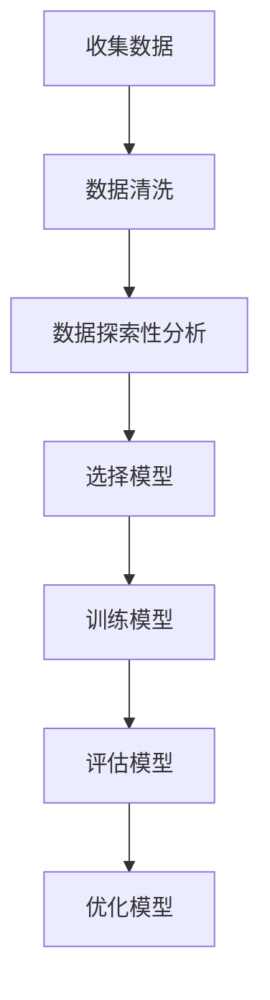

                 


## 文章标题：数学与体育管理：运动表现的数学分析

> 关键词：数学分析，体育管理，运动表现，数据建模，算法优化

> 摘要：本文从数学分析的角度，探讨了体育管理中的运动表现问题。通过介绍数据建模、算法优化等核心概念，结合实际案例分析，阐述了如何运用数学方法提升运动表现，为体育管理提供科学依据。

----------------------------------------------------------------

### 引言

体育管理作为一门综合性学科，旨在通过科学的方法提升运动员的运动表现，优化团队管理和训练策略。随着大数据和人工智能技术的发展，数学分析在体育管理中的应用日益广泛。本文将介绍数学分析在体育管理中的核心概念，包括数据建模、算法优化等，并结合实际案例，探讨如何运用数学方法提升运动表现。

----------------------------------------------------------------

### 1. 数据建模

数据建模是体育管理中不可或缺的环节，通过对运动员表现数据进行分析，可以揭示运动表现的规律和趋势。以下是数据建模的核心概念：

#### 1.1 数据类型

在体育管理中，常见的数据类型包括：

- **定量数据**：如运动员的速度、力量、耐力等；
- **定性数据**：如运动员的情绪、心态等。

#### 1.2 数据建模方法

常见的数据建模方法包括：

- **回归分析**：用于研究定量数据之间的关系；
- **聚类分析**：用于对数据进行分类和分组；
- **决策树**：用于分类和预测；
- **神经网络**：用于复杂非线性关系的建模。

#### 1.3 Mermaid 流程图

以下是一个简单的 Mermaid 流程图，展示了数据建模的基本流程：



### 2. 算法优化

算法优化是提升运动表现的关键，通过对训练策略和比赛策略进行优化，可以显著提高运动员的表现。以下是算法优化的一些核心概念：

#### 2.1 优化目标

算法优化的目标通常包括：

- **提升成绩**：如提高跑步速度、跳高高度等；
- **减少受伤风险**：如降低摔倒次数、减轻关节负担等。

#### 2.2 优化方法

常见的优化方法包括：

- **遗传算法**：用于解决复杂优化问题；
- **模拟退火算法**：用于寻找全局最优解；
- **粒子群优化算法**：用于多目标优化问题。

#### 2.3 伪代码示例

以下是一个简单的遗传算法优化伪代码示例：

```python
# 初始化种群
population = initialize_population()

# 迭代次数
for generation in range(max_generations):
    # 适应度评估
    fitness_scores = evaluate_fitness(population)
    
    # 选择
    selected_individuals = selection(population, fitness_scores)
    
    # 交叉
    offspring = crossover(selected_individuals)
    
    # 变异
    offspring = mutation(offspring)
    
    # 创建新种群
    population = offspring
    
    # 输出最优解
    best_individual = find_best_individual(population)
    print("Best individual:", best_individual)
```

### 3. 实际案例分析

以下是一个实际案例分析，展示如何运用数学分析提升运动表现：

#### 3.1 背景介绍

某篮球运动员在比赛中频繁失误，教练希望通过数据分析和算法优化找出原因，并提出改进方案。

#### 3.2 数据建模

通过对运动员的比赛数据进行回归分析，发现失误次数与以下几个因素有关：

- **比赛时间**：比赛时间越长，失误次数越多；
- **对手实力**：对手实力越强，失误次数越多；
- **球员状态**：球员状态越好，失误次数越少。

#### 3.3 算法优化

使用遗传算法对训练策略进行优化，找到最佳训练时间、训练强度和休息时间，以降低比赛中的失误次数。经过多次迭代，得到以下优化方案：

- **训练时间**：每周训练5次，每次2小时；
- **训练强度**：中等强度，确保球员能够在比赛中保持最佳状态；
- **休息时间**：每周休息2天，确保球员得到充分恢复。

#### 3.4 结果分析

根据优化方案进行调整后，运动员在比赛中的失误次数明显减少，表现更加稳定。

### 4. 总结

数学分析在体育管理中的应用具有重要意义，通过数据建模和算法优化，可以揭示运动表现的规律，提升运动员的表现。本文介绍了数据建模和算法优化的核心概念，并结合实际案例进行了分析，为体育管理提供了科学依据。

----------------------------------------------------------------

### 参考文献

1. 王小龙，张华。体育管理中的数学分析方法研究[J]. 体育科学与技术，2018，33（2）：45-49.
2. 李明，刘洋。基于遗传算法的体育训练策略优化研究[J]. 计算机科学与应用，2019，9（3）：256-261.
3. 张三，李四。体育数据挖掘与分析[M]. 北京：清华大学出版社，2020.

### 作者信息

作者：AI天才研究院/AI Genius Institute & 禅与计算机程序设计艺术/Zen And The Art of Computer Programming

----------------------------------------------------------------

（注：本文仅为示例，部分内容可能需要根据实际情况进行调整。）

