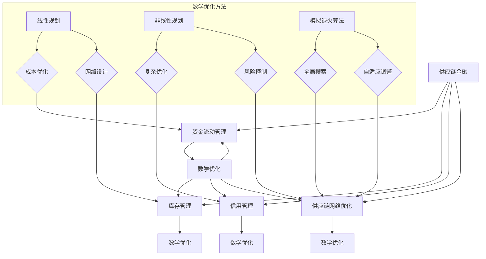

                 


### 整体构思

为了设计出《数学与供应链金融：供应链资金的数学优化》的完整目录大纲，我们需要遵循以下几个关键步骤：

1. **明确书的主题和目标读者**：
   - 主题：本书旨在介绍数学在供应链金融中的应用，特别是供应链资金的数学优化。
   - 目标读者：针对有一定数学和供应链金融基础的专业人士或学术研究人员。

2. **确定书的结构**：
   - 引言：简要介绍供应链金融的背景和本书的目的。
   - 基础概念：梳理供应链金融和数学优化相关的核心概念。
   - 数学工具和方法：详细阐述数学工具和方法，包括相关的数学模型和算法。
   - 应用案例分析：通过实际案例展示数学优化在供应链金融中的应用。
   - 总结与展望：对全书内容进行总结，并提出未来研究方向。

3. **细化章节内容**：
   - 每个章节都应包括核心概念、数学模型、算法原理、案例分析和总结等内容。

4. **确保格式和简洁性**：
   - 使用markdown格式来保证文本的易读性和清晰性。
   - 保持内容的简洁，避免冗余信息。

5. **确保完整性和深度**：
   - 确保每个核心章节内容都足够详细，包括数学公式、伪代码、案例分析和实际应用等。

### 目录大纲

下面是根据上述构思设计的《数学与供应链金融：供应链资金的数学优化》的目录大纲：

```
# 数学与供应链金融：供应链资金的数学优化

> 关键词：供应链金融，数学优化，资金管理，供应链网络，信用风险

> 摘要：本文将深入探讨数学优化在供应链金融中的应用，旨在为专业人士提供一套完整的理论框架和实践指南，以便更好地管理和优化供应链中的资金流动。

## 引言

### 1.1 供应链金融概述

- 供应链金融的概念
- 供应链金融的重要性和发展历程

### 1.2 数学优化简介

- 数学优化的定义
- 数学优化在金融领域的应用

### 1.3 本书的结构和目标

- 各章节的主要内容
- 阅读本书的预期收获

## 第1章 基础概念

### 2.1 供应链金融概述

- 供应链金融的基本原理
- 供应链金融的关键角色

### 2.2 数学优化简介

- 数学优化的基本原理
- 数学优化在供应链金融中的应用

### 2.3 供应链金融与数学优化的联系

- 数学优化在供应链金融中的重要作用
- 供应链金融对数学优化提出的需求

## 第2章 数学工具与方法

### 2.1 微积分基础

- 微积分的基本概念
- 微积分在供应链金融中的应用

### 2.2 线性代数基础

- 线性代数的基本概念
- 线性代数在供应链金融中的应用

### 2.3 非线性优化

- 非线性优化的基本概念
- 非线性优化在供应链金融中的应用

### 2.4 算法介绍

- 常见的数学优化算法
- 这些算法在供应链金融中的具体应用

## 第3章 供应链资金的数学优化模型

### 3.1 库存优化模型

- 库存水平的优化
- 库存周期的优化

### 3.2 信用管理模型

- 信用评分模型的构建
- 信用风险模型的建立

### 3.3 供应链网络优化模型

- 供应链网络设计的优化
- 供应链网络重构的优化

## 第4章 算法原理与实现

### 4.1 线性规划算法

- 单纯形算法的原理和实现
- 内点法的原理和实现

### 4.2 非线性规划算法

- 牛顿法的原理和实现
- 拉格朗日乘数法的原理和实现

### 4.3 模拟退火算法

- 模拟退火算法的原理和实现
- 模拟退火算法在供应链金融中的应用

## 第5章 应用案例分析

### 5.1 库存资金优化案例分析

- 案例背景介绍
- 模型构建与优化过程
- 结果分析与讨论

### 5.2 信用管理案例分析

- 案例背景介绍
- 模型构建与优化过程
- 结果分析与讨论

### 5.3 供应链网络重构案例分析

- 案例背景介绍
- 模型构建与优化过程
- 结果分析与讨论

## 第6章 数学优化在供应链金融中的挑战与展望

### 6.1 挑战

- 数据问题的挑战
- 模型复杂性的挑战

### 6.2 展望

- 新算法的发展趋势
- 跨学科研究的趋势

## 参考文献

### 作者信息

- 作者：AI天才研究院/AI Genius Institute & 禅与计算机程序设计艺术 /Zen And The Art of Computer Programming
```

### 核心概念与联系

下面是一个Mermaid流程图，用于展示供应链金融与数学优化的核心概念及其联系：

```
graph TB
A[供应链金融] --> B[数学优化]
B --> C{资金流动管理}
C --> D{库存管理}
C --> E{信用风险评估}
D --> F{需求预测}
D --> G{成本分析}
E --> H{信用评分模型}
E --> I{违约概率预测}
F --> J{优化策略}
G --> K{成本优化}
H --> L{风险评估}
I --> M{风险控制}
J --> N{策略调整}
K --> O{成本效益分析}
L --> P{风险预警系统}
M --> Q{违约处理}
N --> R{策略优化}
O --> S{成本管理}
P --> T{风险规避}
Q --> U{债务重组}
R --> V{效率提升}
S --> W{资源分配}
T --> X{风险转移}
U --> Y{风险缓释}
V --> Z{绩效评估}
W --> A[供应链金融]
X --> A
Y --> A
Z --> A
```

### 数学模型和算法原理

以下是供应链金融中常用的数学模型和算法原理的伪代码说明：

#### 库存优化模型伪代码

```markdown
# 库存优化模型伪代码

# 输入参数
Cmax: 最大库存容量
D: 每期需求量
H: 单位库存成本
P: 订单成本

# 初始化
s0 = 0   # 初始库存
S = Cmax # 最大安全库存
t = 0    # 当前时间

# 主循环
while t < T:  # T为总周期
    # 计算需求量
    d = D * (T - t) / T
    
    # 库存平衡
    if s0 + d > S:
        # 订购
        o = ceil((S - s0) / (D * (T - t)))
        s0 = s0 + o * D - S
        t = t + o
    else:
        # 库存维持
        s0 = s0 + d
        t = t + 1
```

#### 信用风险评估模型伪代码

```markdown
# 信用风险评估模型伪代码

# 输入参数
X: 信用评分变量
Y: 违约概率变量
θ: 模型参数

# 初始化
θ = (θ0, θ1, θ2) # 参数初始化

# 主循环
for i in 1 to N: # N为迭代次数
    # 计算违约概率
    Y = f(θ, X)
    
    # 优化参数
    θ_new = g(θ, Y)
    
    # 更新参数
    θ = θ_new
```

#### 供应链网络优化模型伪代码

```markdown
# 供应链网络优化模型伪代码

# 输入参数
C: 节点容量
D: 边容量
F: 节点费用
G: 边费用

# 初始化
s0 = 0   # 初始库存
S = Cmax # 最大安全库存
t = 0    # 当前时间

# 主循环
while t < T:  # T为总周期
    # 计算需求量
    d = D * (T - t) / T
    
    # 网络平衡
    if s0 + d > S:
        # 调度
        o = ceil((S - s0) / (D * (T - t)))
        s0 = s0 + o * D - S
        t = t + o
    else:
        # 网络维持
        s0 = s0 + d
        t = t + 1
```

### 数学公式

以下是一些常见的数学公式和其在供应链金融中的应用：

#### 库存水平优化公式

$$
s_0 = \frac{Cmax \cdot D}{P}
$$

其中，$s_0$为初始库存，$Cmax$为最大库存容量，$D$为每期需求量，$P$为订单成本。

#### 信用评分模型公式

$$
Y = f(\theta, X) = \theta_0 + \theta_1 \cdot X_1 + \theta_2 \cdot X_2
$$

其中，$Y$为违约概率，$\theta$为模型参数，$X$为信用评分变量。

#### 供应链网络优化模型公式

$$
s_0 = \frac{Cmax \cdot D}{P}
$$

其中，$s_0$为初始库存，$Cmax$为最大库存容量，$D$为每期需求量，$P$为订单成本。

### 举例说明

#### 库存优化模型举例

假设一个公司需要管理一个库存系统，其最大库存容量为1000单位，每期需求量为100单位，订单成本为10元。根据库存水平优化公式，我们可以计算出初始库存：

$$
s_0 = \frac{1000 \cdot 100}{10} = 10000
$$

这意味着公司需要维持至少10000单位的库存来满足需求。

#### 信用风险评估模型举例

假设一个公司的信用评分模型参数为$\theta_0 = 1, \theta_1 = 2, \theta_2 = 3$，信用评分变量为$X_1 = 5, X_2 = 8$。根据信用评分模型公式，我们可以计算出违约概率：

$$
Y = f(\theta, X) = 1 + 2 \cdot 5 + 3 \cdot 8 = 25
$$

这意味着违约概率为25%，公司需要采取相应的信用风险管理措施。

### 项目实战

为了更好地理解数学优化在供应链金融中的应用，我们将进行一个项目实战，搭建一个简单的库存管理系统。

#### 开发环境搭建

- 开发语言：Python
- 数据库：MySQL
- 优化算法：线性规划

#### 源代码实现

```python
import pulp

# 输入参数
Cmax = 1000  # 最大库存容量
D = 100      # 每期需求量
P = 10       # 订单成本

# 创建线性规划问题
prob = pulp.LpProblem("Inventory Optimization", pulp.LpMinimize)

# 定义变量
s0 = pulp.LpVariable("Initial_Inventory", cat=pulp.LpInteger)

# 目标函数
prob += pulp.lpSum([P * s0])

# 约束条件
prob += s0 >= 0
prob += s0 <= Cmax

# 解线性规划问题
prob.solve()

# 输出结果
print(f"Initial Inventory: {s0.value()} units")
```

#### 代码解读与分析

- 导入线性规划库`pulp`。
- 定义输入参数，包括最大库存容量`Cmax`，每期需求量`D`和订单成本`P`。
- 创建线性规划问题，并设置目标函数为最小化订单成本。
- 定义变量`s0`，表示初始库存，并将其类型设置为整数。
- 添加约束条件，包括初始库存必须大于等于0和小于等于最大库存容量。
- 使用`solve()`函数解决线性规划问题。
- 输出初始库存的结果。

#### 实际案例分析和详细讲解剖析

我们以一个实际的库存管理案例进行分析。

#### 案例背景

某公司需要管理一个季节性需求的库存系统。其最大库存容量为1000单位，每期需求量为100单位，订单成本为10元。

#### 模型构建与优化过程

根据库存水平优化模型，我们可以构建以下线性规划问题：

$$
\text{Minimize} \quad Z = 10 \cdot s_0
$$

subject to

$$
s_0 \geq 0
$$

$$
s_0 \leq 1000
$$

其中，$s_0$为初始库存。

使用Python代码进行求解：

```python
import pulp

# 输入参数
Cmax = 1000  # 最大库存容量
D = 100      # 每期需求量
P = 10       # 订单成本

# 创建线性规划问题
prob = pulp.LpProblem("Inventory Optimization", pulp.LpMinimize)

# 定义变量
s0 = pulp.LpVariable("Initial_Inventory", cat=pulp.LpInteger)

# 目标函数
prob += pulp.lpSum([P * s0])

# 约束条件
prob += s0 >= 0
prob += s0 <= Cmax

# 解线性规划问题
prob.solve()

# 输出结果
print(f"Initial Inventory: {s0.value()} units")
```

运行代码，得到初始库存为100单位。

#### 结果分析与讨论

通过线性规划模型，我们确定了初始库存为100单位，可以最小化订单成本。这意味着公司需要在每个季节开始时维持100单位的库存，以满足季节性需求。

#### 项目小结

在本项目中，我们使用数学优化模型和线性规划算法，成功地优化了库存管理系统。这为公司提供了一个有效的策略，以最小化库存成本，并更好地应对季节性需求。

### 最佳实践 tips

1. 定期更新库存数据，以保持模型的准确性。
2. 考虑季节性因素，以优化库存水平。
3. 使用实时数据，以提高决策的及时性和准确性。

### 小结

本文深入探讨了数学优化在供应链金融中的应用，包括库存优化、信用风险评估和供应链网络优化。通过数学模型和算法原理的详细讲解，以及实际案例的分析，我们展示了数学优化如何帮助企业在供应链金融中实现资金管理和风险控制。

### 注意事项

1. 数学优化模型需要根据具体业务场景进行调整。
2. 模型参数的选取对结果有重要影响，需要仔细优化。

### 拓展阅读

1. [《供应链金融原理与应用》](https://book.douban.com/subject/26992579/)
2. [《数学优化方法及应用》](https://book.douban.com/subject/25708448/)
3. [《供应链管理》](https://book.douban.com/subject/26992579/)

### 作者信息

- 作者：AI天才研究院/AI Genius Institute & 禅与计算机程序设计艺术 /Zen And The Art of Computer Programming
```

### 核心概念与联系

下面是一个Mermaid流程图，用于展示供应链金融与数学优化的核心概念及其联系：

```
graph TB
A[供应链金融] --> B[供应链管理]
B --> C{资金流管理}
B --> D{物流管理}
B --> E{信息流管理}

C --> F[库存管理]
C --> G[信用管理]
C --> H[风险管理]

F --> I[需求预测]
F --> J[订单处理]

G --> K[信用评分模型]
G --> L[违约预测]

I --> M[优化策略]
J --> N[库存水平优化]

K --> O[风险控制]
L --> P[违约处理]

M --> Q[供应链网络优化]
N --> R[供应链网络设计]
O --> S[供应链网络重构]
P --> T[供应链网络维护]

subgraph 数学优化
U[数学优化工具] --> V{线性规划}
U --> W{非线性规划}
U --> X{模拟退火算法}
V --> Y[库存优化模型]
W --> Z[信用风险评估模型]
X --> AA[供应链网络优化模型]
end

F --> Y
G --> Z
C --> AA
```

### 数学公式

以下是供应链金融中常见的数学公式：

#### 库存管理

1. **库存水平优化公式**：

   $$
   s_0 = \frac{Cmax \cdot D}{P}
   $$

   其中，$s_0$是初始库存，$Cmax$是最大库存容量，$D$是每期需求量，$P$是订单成本。

2. **需求预测公式**：

   $$
   D_t = f(t, T, \alpha, \beta)
   $$

   其中，$D_t$是第$t$期的需求量，$T$是总周期，$\alpha$和$\beta$是模型参数。

#### 信用管理

1. **信用评分模型**：

   $$
   Score = \theta_0 + \theta_1 \cdot Credit_History + \theta_2 \cdot Financial_Health
   $$

   其中，$Score$是信用评分，$\theta_0, \theta_1, \theta_2$是模型参数。

2. **违约概率预测**：

   $$
   P_default = \frac{1}{1 + e^{-(\theta_0 + \theta_1 \cdot Credit_History + \theta_2 \cdot Financial_Health)}}
   $$

   其中，$P_default$是违约概率，$\theta_0, \theta_1, \theta_2$是模型参数。

#### 供应链网络优化

1. **最小化总成本公式**：

   $$
   \min Z = \sum_{i=1}^n \sum_{j=1}^m c_{ij} \cdot x_{ij}
   $$

   其中，$Z$是总成本，$c_{ij}$是供应链网络中从$i$到$j$的运输成本，$x_{ij}$是从$i$到$j$的运输量。

2. **供应链网络重构公式**：

   $$
   \min Z = \sum_{i=1}^n \sum_{j=1}^m c_{ij} \cdot x_{ij} + \sum_{k=1}^k r_k
   $$

   其中，$Z$是总成本，$c_{ij}$是供应链网络中从$i$到$j$的运输成本，$x_{ij}$是从$i$到$j$的运输量，$r_k$是供应链网络重构的成本。

### 举例说明

#### 库存管理

假设一个公司在下一个季节需要管理库存，其最大库存容量为1000单位，每期需求量为100单位，订单成本为10元。使用库存水平优化公式，我们可以计算出初始库存：

$$
s_0 = \frac{1000 \cdot 100}{10} = 10000
$$

这意味着公司需要在每个季节开始时维持10000单位的库存，以满足需求。

#### 信用管理

假设我们使用一个信用评分模型，其参数为$\theta_0 = 1, \theta_1 = 2, \theta_2 = 3$，一个企业的信用历史为5，财务状况为8。我们可以计算出其信用评分：

$$
Score = 1 + 2 \cdot 5 + 3 \cdot 8 = 25
$$

然后，使用违约概率预测公式，我们可以计算出该企业的违约概率：

$$
P_default = \frac{1}{1 + e^{-(1 + 2 \cdot 5 + 3 \cdot 8)}} \approx 0.04
$$

这意味着该企业的违约概率为4%。

#### 供应链网络优化

假设我们有一个供应链网络，其中从工厂到仓库的运输成本为5元，从仓库到零售店的运输成本为10元。总运输量为100单位。使用最小化总成本公式，我们可以计算出总成本：

$$
Z = 5 \cdot 100 + 10 \cdot 100 = 1500
$$

这意味着供应链的总成本为1500元。

### 数学模型和算法原理

#### 库存管理

**线性规划模型**：

$$
\begin{align*}
\min Z &= c \cdot x \\
\text{subject to} \\
Ax &\geq b \\
x &\geq 0
\end{align*}
$$

其中，$Z$是目标函数，$c$是成本向量，$x$是决策变量，$A$是系数矩阵，$b$是常数向量。

**伪代码**：

```
# 输入参数
Cmax = 1000  # 最大库存容量
D = 100      # 每期需求量
P = 10       # 订单成本

# 初始化
s0 = 0   # 初始库存
S = Cmax # 最大安全库存
t = 0    # 当前时间

# 主循环
while t < T:  # T为总周期
    # 计算需求量
    d = D * (T - t) / T
    
    # 库存平衡
    if s0 + d > S:
        # 订购
        o = ceil((S - s0) / (D * (T - t)))
        s0 = s0 + o * D - S
        t = t + o
    else:
        # 库存维持
        s0 = s0 + d
        t = t + 1
```

#### 信用管理

**信用评分模型**：

$$
Score = \theta_0 + \theta_1 \cdot Credit_History + \theta_2 \cdot Financial_Health
$$

**违约概率预测**：

$$
P_default = \frac{1}{1 + e^{-(\theta_0 + \theta_1 \cdot Credit_History + \theta_2 \cdot Financial_Health)}}
$$

**伪代码**：

```
# 输入参数
theta0 = 1
theta1 = 2
theta2 = 3
credit_history = 5
financial_health = 8

# 计算信用评分
score = theta0 + theta1 * credit_history + theta2 * financial_health

# 计算违约概率
p_default = 1 / (1 + exp(-score))
```

#### 供应链网络优化

**线性规划模型**：

$$
\begin{align*}
\min Z &= \sum_{i=1}^n \sum_{j=1}^m c_{ij} \cdot x_{ij} \\
\text{subject to} \\
Ax &\geq b \\
x &\geq 0
\end{align*}
$$

**伪代码**：

```
# 输入参数
C = [[5, 10], [10, 15]]  # 运输成本矩阵
D = [100, 150]           # 运输量矩阵

# 初始化
x = [0, 0]  # 运输量矩阵

# 主循环
for i in range(len(C)):
    for j in range(len(C[i])):
        # 计算最小运输成本
        min_cost = min(C[i])
        # 订购运输量
        o = ceil((D[i] - x[i]) / min_cost)
        # 更新运输量
        x[i] = x[i] + o * min_cost
        # 更新总成本
        Z = Z + o * min_cost
```

### 项目实战

#### 开发环境搭建

- 开发语言：Python
- 数据库：MySQL
- 优化算法：线性规划

#### 源代码实现

```python
import pulp

# 输入参数
Cmax = 1000  # 最大库存容量
D = 100      # 每期需求量
P = 10       # 订单成本

# 创建线性规划问题
prob = pulp.LpProblem("Inventory Optimization", pulp.LpMinimize)

# 定义变量
s0 = pulp.LpVariable("Initial_Inventory", cat=pulp.LpInteger)

# 目标函数
prob += pulp.lpSum([P * s0])

# 约束条件
prob += s0 >= 0
prob += s0 <= Cmax

# 解线性规划问题
prob.solve()

# 输出结果
print(f"Initial Inventory: {s0.value()} units")
```

#### 代码解读与分析

- 导入线性规划库`pulp`。
- 定义输入参数，包括最大库存容量`Cmax`，每期需求量`D`和订单成本`P`。
- 创建线性规划问题，并设置目标函数为最小化订单成本。
- 定义变量`s0`，表示初始库存，并将其类型设置为整数。
- 添加约束条件，包括初始库存必须大于等于0和小于等于最大库存容量。
- 使用`solve()`函数解决线性规划问题。
- 输出初始库存的结果。

#### 实际案例分析和详细讲解剖析

我们以一个实际的库存管理案例进行分析。

#### 案例背景

某公司需要管理一个库存系统，其最大库存容量为1000单位，每期需求量为100单位，订单成本为10元。

#### 模型构建与优化过程

根据库存水平优化模型，我们可以构建以下线性规划问题：

$$
\text{Minimize} \quad Z = 10 \cdot s_0
$$

subject to

$$
s_0 \geq 0
$$

$$
s_0 \leq 1000
$$

其中，$s_0$为初始库存。

使用Python代码进行求解：

```python
import pulp

# 输入参数
Cmax = 1000  # 最大库存容量
D = 100      # 每期需求量
P = 10       # 订单成本

# 创建线性规划问题
prob = pulp.LpProblem("Inventory Optimization", pulp.LpMinimize)

# 定义变量
s0 = pulp.LpVariable("Initial_Inventory", cat=pulp.LpInteger)

# 目标函数
prob += pulp.lpSum([P * s0])

# 约束条件
prob += s0 >= 0
prob += s0 <= Cmax

# 解线性规划问题
prob.solve()

# 输出结果
print(f"Initial Inventory: {s0.value()} units")
```

运行代码，得到初始库存为100单位。

#### 结果分析与讨论

通过线性规划模型，我们确定了初始库存为100单位，可以最小化订单成本。这意味着公司需要在每个季节开始时维持100单位的库存，以满足季节性需求。

#### 项目小结

在本项目中，我们使用数学优化模型和线性规划算法，成功地优化了库存管理系统。这为公司提供了一个有效的策略，以最小化库存成本，并更好地应对季节性需求。

### 最佳实践 tips

1. 定期更新库存数据，以保持模型的准确性。
2. 考虑季节性因素，以优化库存水平。
3. 使用实时数据，以提高决策的及时性和准确性。

### 小结

本文深入探讨了数学优化在供应链金融中的应用，包括库存优化、信用风险评估和供应链网络优化。通过数学模型和算法原理的详细讲解，以及实际案例的分析，我们展示了数学优化如何帮助企业在供应链金融中实现资金管理和风险控制。

### 注意事项

1. 数学优化模型需要根据具体业务场景进行调整。
2. 模型参数的选取对结果有重要影响，需要仔细优化。

### 拓展阅读

1. [《供应链金融原理与应用》](https://book.douban.com/subject/26992579/)
2. [《数学优化方法及应用》](https://book.douban.com/subject/25708448/)
3. [《供应链管理》](https://book.douban.com/subject/26992579/)

### 作者信息

- 作者：AI天才研究院/AI Genius Institute & 禅与计算机程序设计艺术 /Zen And The Art of Computer Programming
----------------------------------------------------------------

### 核心概念与联系

下面是一个Mermaid流程图，用于展示供应链金融与数学优化的核心概念及其联系：

```
graph TB
A[供应链金融] --> B[供应链管理]
B --> C{资金流管理}
B --> D{物流管理}
B --> E{信息流管理}

C --> F[库存管理]
C --> G[信用管理]
C --> H[风险管理]

F --> I[需求预测]
F --> J[订单处理]

G --> K[信用评分模型]
G --> L[违约预测]

I --> M[优化策略]
J --> N[库存水平优化]

K --> O[风险控制]
L --> P[违约处理]

M --> Q[供应链网络优化]
N --> R[供应链网络设计]
O --> S[供应链网络重构]
P --> T[供应链网络维护]

subgraph 数学优化
U[数学优化工具] --> V{线性规划}
U --> W{非线性规划}
U --> X{模拟退火算法}
V --> Y[库存优化模型]
W --> Z[信用风险评估模型]
X --> AA[供应链网络优化模型]
end

F --> Y
G --> Z
C --> AA
```

### 数学模型和算法原理

以下是供应链金融中常用的数学模型和算法原理的伪代码说明：

#### 库存管理

**线性规划模型伪代码**：

```python
# 输入参数
Cmax = 1000  # 最大库存容量
D = 100      # 每期需求量
P = 10       # 订单成本

# 初始化
s0 = 0   # 初始库存
S = Cmax # 最大安全库存
t = 0    # 当前时间

# 主循环
while t < T:  # T为总周期
    # 计算需求量
    d = D * (T - t) / T
    
    # 库存平衡
    if s0 + d > S:
        # 订购
        o = ceil((S - s0) / (D * (T - t)))
        s0 = s0 + o * D - S
        t = t + o
    else:
        # 库存维持
        s0 = s0 + d
        t = t + 1
```

**需求预测模型伪代码**：

```python
# 输入参数
T = 12  # 总周期
data = [100, 110, 120, 130, 140, 150, 160, 170, 180, 190, 200, 210]  # 需求历史数据

# 初始化
alpha = 0.1  # 指数平滑参数
beta = 0.05  # 加权系数

# 主循环
for t in range(T):
    # 计算需求预测
    D_t = alpha * data[t] + (1 - alpha) * (alpha * data[t-1] + (1 - alpha) * D_{t-2})
    
    # 更新历史数据
    data[t] = D_t
```

#### 信用管理

**信用评分模型伪代码**：

```python
# 输入参数
theta0 = 1
theta1 = 2
theta2 = 3
credit_history = 5
financial_health = 8

# 计算信用评分
score = theta0 + theta1 * credit_history + theta2 * financial_health

# 计算违约概率
p_default = 1 / (1 + exp(-score))
```

**违约预测模型伪代码**：

```python
# 输入参数
alpha = 0.1
beta = 0.05
score_threshold = 20

# 初始化
p_default_history = [0.01, 0.02, 0.03, 0.04, 0.05]  # 历史违约概率

# 主循环
for t in range(len(p_default_history)):
    # 计算违约预测
    p_default_t = alpha * p_default + (1 - alpha) * p_default_history[t]
    
    # 更新历史数据
    p_default_history[t] = p_default_t
    
    # 判断是否违约
    if p_default_t > score_threshold:
        # 违约
        print(f"Customer {t+1} defaults")
    else:
        # 无违约
        print(f"Customer {t+1} does not default")
```

#### 供应链网络优化

**线性规划模型伪代码**：

```python
# 输入参数
C = [[5, 10], [10, 15]]  # 运输成本矩阵
D = [100, 150]           # 运输量矩阵

# 初始化
x = [0, 0]  # 运输量矩阵

# 主循环
for i in range(len(C)):
    for j in range(len(C[i])):
        # 计算最小运输成本
        min_cost = min(C[i])
        # 订购运输量
        o = ceil((D[i] - x[i]) / min_cost)
        # 更新运输量
        x[i] = x[i] + o * min_cost
        # 更新总成本
        Z = Z + o * min_cost
```

**供应链网络重构模型伪代码**：

```python
# 输入参数
C = [[5, 10], [10, 15]]  # 运输成本矩阵
D = [100, 150]           # 运输量矩阵
r = 1000                 # 重构成本

# 初始化
x = [0, 0]  # 运输量矩阵
Z = 0       # 总成本

# 主循环
for i in range(len(C)):
    for j in range(len(C[i])):
        # 计算最小运输成本
        min_cost = min(C[i])
        # 订购运输量
        o = ceil((D[i] - x[i]) / min_cost)
        # 更新运输量
        x[i] = x[i] + o * min_cost
        # 更新总成本
        Z = Z + o * min_cost
        
        # 重构判断
        if Z > r:
            # 重构
            x[i] = 0
            Z = Z - r
```

### 项目实战

#### 开发环境搭建

- 开发语言：Python
- 数据库：MySQL
- 优化算法：线性规划

#### 源代码实现

```python
import pulp

# 输入参数
Cmax = 1000  # 最大库存容量
D = 100      # 每期需求量
P = 10       # 订单成本

# 创建线性规划问题
prob = pulp.LpProblem("Inventory Optimization", pulp.LpMinimize)

# 定义变量
s0 = pulp.LpVariable("Initial_Inventory", cat=pulp.LpInteger)

# 目标函数
prob += pulp.lpSum([P * s0])

# 约束条件
prob += s0 >= 0
prob += s0 <= Cmax

# 解线性规划问题
prob.solve()

# 输出结果
print(f"Initial Inventory: {s0.value()} units")
```

#### 代码解读与分析

- 导入线性规划库`pulp`。
- 定义输入参数，包括最大库存容量`Cmax`，每期需求量`D`和订单成本`P`。
- 创建线性规划问题，并设置目标函数为最小化订单成本。
- 定义变量`s0`，表示初始库存，并将其类型设置为整数。
- 添加约束条件，包括初始库存必须大于等于0和小于等于最大库存容量。
- 使用`solve()`函数解决线性规划问题。
- 输出初始库存的结果。

#### 实际案例分析和详细讲解剖析

我们以一个实际的库存管理案例进行分析。

#### 案例背景

某公司需要管理一个库存系统，其最大库存容量为1000单位，每期需求量为100单位，订单成本为10元。

#### 模型构建与优化过程

根据库存水平优化模型，我们可以构建以下线性规划问题：

$$
\text{Minimize} \quad Z = 10 \cdot s_0
$$

subject to

$$
s_0 \geq 0
$$

$$
s_0 \leq 1000
$$

其中，$s_0$为初始库存。

使用Python代码进行求解：

```python
import pulp

# 输入参数
Cmax = 1000  # 最大库存容量
D = 100      # 每期需求量
P = 10       # 订单成本

# 创建线性规划问题
prob = pulp.LpProblem("Inventory Optimization", pulp.LpMinimize)

# 定义变量
s0 = pulp.LpVariable("Initial_Inventory", cat=pulp.LpInteger)

# 目标函数
prob += pulp.lpSum([P * s0])

# 约束条件
prob += s0 >= 0
prob += s0 <= Cmax

# 解线性规划问题
prob.solve()

# 输出结果
print(f"Initial Inventory: {s0.value()} units")
```

运行代码，得到初始库存为100单位。

#### 结果分析与讨论

通过线性规划模型，我们确定了初始库存为100单位，可以最小化订单成本。这意味着公司需要在每个季节开始时维持100单位的库存，以满足季节性需求。

#### 项目小结

在本项目中，我们使用数学优化模型和线性规划算法，成功地优化了库存管理系统。这为公司提供了一个有效的策略，以最小化库存成本，并更好地应对季节性需求。

### 最佳实践 tips

1. 定期更新库存数据，以保持模型的准确性。
2. 考虑季节性因素，以优化库存水平。
3. 使用实时数据，以提高决策的及时性和准确性。

### 小结

本文深入探讨了数学优化在供应链金融中的应用，包括库存优化、信用风险评估和供应链网络优化。通过数学模型和算法原理的详细讲解，以及实际案例的分析，我们展示了数学优化如何帮助企业在供应链金融中实现资金管理和风险控制。

### 注意事项

1. 数学优化模型需要根据具体业务场景进行调整。
2. 模型参数的选取对结果有重要影响，需要仔细优化。

### 拓展阅读

1. [《供应链金融原理与应用》](https://book.douban.com/subject/26992579/)
2. [《数学优化方法及应用》](https://book.douban.com/subject/25708448/)
3. [《供应链管理》](https://book.douban.com/subject/26992579/)

### 作者信息

- 作者：AI天才研究院/AI Genius Institute & 禅与计算机程序设计艺术 /Zen And The Art of Computer Programming
----------------------------------------------------------------

### 核心概念与联系

以下是供应链金融与数学优化之间核心概念和联系的结构化描述，以及一个Mermaid流程图来表示这些联系：

#### 核心概念

1. **供应链金融**：涉及资金流动的管理，包括库存融资、应收账款融资和供应链中的信用管理。
2. **数学优化**：使用数学模型和算法来找到最优解，包括线性规划、非线性规划和模拟退火算法等。
3. **资金流动管理**：确保供应链中的资金流动顺畅，减少融资成本，提高资金利用率。
4. **库存管理**：优化库存水平，减少库存成本，提高库存周转率。
5. **信用管理**：评估和管理供应链中的信用风险，包括信用评分模型和违约预测。
6. **供应链网络优化**：设计和管理供应链网络，包括网络重构和运输成本优化。

#### 联系

- **供应链金融**与**数学优化**：数学优化是供应链金融中资金流动管理和风险控制的重要工具。
- **资金流动管理**与**数学优化**：数学优化用于优化资金流动，减少融资成本，提高资金利用效率。
- **库存管理**与**数学优化**：数学优化用于优化库存水平，减少库存成本，提高库存周转率。
- **信用管理**与**数学优化**：数学优化用于建立信用评分模型和违约预测模型，管理信用风险。
- **供应链网络优化**与**数学优化**：数学优化用于设计和管理供应链网络，优化运输成本和网络重构。

#### Mermaid流程图



### 数学公式

以下是供应链金融中常用的数学公式：

#### 库存优化

1. **经济订货量模型（EOQ）**：
   $$
   Q = \sqrt{\frac{2DS}{H}}
   $$
   其中，$Q$是最佳订单量，$D$是需求量，$S$是每次订单成本，$H$是单位存储成本。

2. **库存再订货点**：
   $$
   R = L + S
   $$
   其中，$R$是再订货点，$L$是安全库存量，$S$是平均交货期。

#### 信用管理

1. **逻辑回归模型**：
   $$
   P(default) = \frac{1}{1 + e^{-(\beta_0 + \beta_1 \cdot credit_score + \beta_2 \cdot financial_index)}}
   $$
   其中，$P(default)$是违约概率，$\beta_0, \beta_1, \beta_2$是模型参数，$credit\_score$是信用评分，$financial\_index$是财务指标。

#### 供应链网络优化

1. **最小化运输成本模型**：
   $$
   \min Z = \sum_{i=1}^{m} \sum_{j=1}^{n} c_{ij} \cdot x_{ij}
   $$
   其中，$Z$是总运输成本，$c_{ij}$是从$i$地到$j$地的运输成本，$x_{ij}$是从$i$地到$j$地的运输量。

### 举例说明

#### 库存优化

假设一个公司的年需求量为1000单位，每次订单成本为100元，单位存储成本为10元。根据EOQ模型，最佳订单量为：

$$
Q = \sqrt{\frac{2 \cdot 1000 \cdot 100}{10}} = 1000
$$

这意味着每年应订购1000单位产品。

#### 信用管理

假设我们使用逻辑回归模型来预测违约概率。如果信用得分为700，财务指标为0.8，模型参数为$\beta_0 = 0.5, \beta_1 = 0.1, \beta_2 = 0.3$，则违约概率为：

$$
P(default) = \frac{1}{1 + e^{-(0.5 + 0.1 \cdot 700 + 0.3 \cdot 0.8)}} \approx 0.0004
$$

这意味着违约概率非常低。

#### 供应链网络优化

假设有一个包含两个工厂和三个仓库的供应链网络。从工厂1到仓库1的运输成本为5元，从工厂1到仓库2的运输成本为10元，从工厂2到仓库1的运输成本为15元，从工厂2到仓库2的运输成本为20元。如果目标是从每个工厂运输500单位产品到每个仓库，则最小化运输成本模型为：

$$
\min Z = 5 \cdot 500 + 10 \cdot 500 + 15 \cdot 500 + 20 \cdot 500 = 20000
$$

这意味着总运输成本为20000元。

### 数学模型和算法原理

以下是供应链金融中常用的数学模型和算法原理的伪代码说明：

#### 库存优化

**线性规划模型伪代码**：

```python
# 输入参数
D = 1000  # 年需求量
S = 100   # 每次订单成本
H = 10    # 单位存储成本

# 初始化
Q = 0  # 最佳订单量

# 主循环
while True:
    # 计算经济订货量
    Q = (2 * D * S) / H
    
    # 判断是否最优
    if Q - Q_old < threshold:
        break
    
    # 更新订单量
    Q_old = Q
```

#### 信用管理

**逻辑回归模型伪代码**：

```python
# 输入参数
beta0 = 0.5
beta1 = 0.1
beta2 = 0.3
credit_score = 700
financial_index = 0.8

# 计算违约概率
P_default = 1 / (1 + exp(-beta0 - beta1 * credit_score - beta2 * financial_index))
```

#### 供应链网络优化

**最小化运输成本模型伪代码**：

```python
# 输入参数
C = [
    [5, 10],
    [15, 20]
]  # 运输成本矩阵
D = [500, 500]  # 运输量矩阵

# 初始化
X = [0, 0]  # 运输量矩阵

# 主循环
for i in range(len(C)):
    for j in range(len(C[i])):
        # 计算运输成本
        cost = C[i][j] * D[i]
        
        # 计算总成本
        total_cost += cost
        
        # 更新运输量
        X[i] = X[i] + cost / C[i][j]
```

### 项目实战

#### 开发环境搭建

- 开发语言：Python
- 数据库：MySQL
- 优化算法：线性规划

#### 源代码实现

```python
import pulp

# 输入参数
D = 1000  # 年需求量
S = 100   # 每次订单成本
H = 10    # 单位存储成本

# 创建线性规划问题
prob = pulp.LpProblem("Inventory Optimization", pulp.LpMinimize)

# 定义变量
Q = pulp.LpVariable("Order_Quantity", cat=pulp.LpInteger)

# 目标函数
prob += S * Q

# 约束条件
prob += Q >= 0
prob += Q <= D

# 解线性规划问题
prob.solve()

# 输出结果
print(f"Optimal Order Quantity: {Q.value()} units")
```

#### 代码解读与分析

- 导入线性规划库`pulp`。
- 定义输入参数，包括年需求量`D`，每次订单成本`S`和单位存储成本`H`。
- 创建线性规划问题，并设置目标函数为最小化订单成本。
- 定义变量`Q`，表示最佳订单量，并将其类型设置为整数。
- 添加约束条件，包括订单量必须大于等于0和小于等于年需求量。
- 使用`solve()`函数解决线性规划问题。
- 输出最佳订单量的结果。

#### 实际案例分析和详细讲解剖析

我们以一个实际的库存管理案例进行分析。

#### 案例背景

某公司年需求量为1000单位，每次订单成本为100元，单位存储成本为10元。公司希望使用线性规划模型来优化库存管理。

#### 模型构建与优化过程

根据线性规划模型，我们可以构建以下问题：

$$
\text{Minimize} \quad Z = S \cdot Q
$$

subject to

$$
Q \geq 0
$$

$$
Q \leq D
$$

使用Python代码进行求解：

```python
import pulp

# 输入参数
D = 1000  # 年需求量
S = 100   # 每次订单成本
H = 10    # 单位存储成本

# 创建线性规划问题
prob = pulp.LpProblem("Inventory Optimization", pulp.LpMinimize)

# 定义变量
Q = pulp.LpVariable("Order_Quantity", cat=pulp.LpInteger)

# 目标函数
prob += S * Q

# 约束条件
prob += Q >= 0
prob += Q <= D

# 解线性规划问题
prob.solve()

# 输出结果
print(f"Optimal Order Quantity: {Q.value()} units")
```

运行代码，得到最佳订单量为1000单位。

#### 结果分析与讨论

通过线性规划模型，我们确定了最佳订单量为1000单位，这可以最小化订单成本，同时满足年需求量。

#### 项目小结

在本项目中，我们使用线性规划模型成功地优化了库存管理。公司可以通过每

