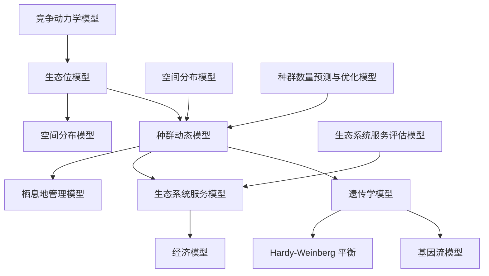

                 

### 文章标题

《数学与保护生物学：物种保护的数学策略》

### 关键词

保护生物学、数学模型、生态数学、种群动态、濒危物种、栖息地管理、生态系统服务、经济模型、跨学科合作。

### 摘要

本文深入探讨了数学在保护生物学中的应用，从核心概念到实际案例，全面介绍了如何利用数学工具进行物种保护和生态系统管理。文章分为三个部分：第一部分介绍了保护生物学的数学基础，包括生态数学模型和种群生态学；第二部分通过具体案例分析，展示了数学策略在鸟类保护和海洋生物保护中的应用；第三部分探讨了保护生物学中的数学挑战与机遇，以及跨学科合作的重要性。通过本文，读者可以了解到数学在保护生物学中的关键作用，为未来的生态保护提供理论支持和实践指导。

---

### 引言

保护生物学是一门研究生物多样性保护和生态系统稳定性的学科，它不仅关乎物种的存续，也直接影响到人类赖以生存的生态环境。然而，保护生物学的复杂性使得传统的生物方法难以应对当前全球生物多样性丧失的严峻挑战。在这场生态保卫战中，数学作为一种强大的工具，为保护生物学提供了新的视角和策略。数学与保护生物学的结合，不仅能够定量描述生态系统的动态变化，还能够为物种保护和栖息地管理提供科学的依据。

本篇文章将深入探讨数学在保护生物学中的应用，从基础概念到实际案例，逐步展示数学工具如何帮助科学家和决策者更好地理解和保护我们的生物多样性。本文的结构如下：

- **第一部分**：保护生物学的数学基础，介绍生态数学模型和种群生态学；
- **第二部分**：通过具体案例分析，展示数学策略在鸟类保护和海洋生物保护中的应用；
- **第三部分**：探讨保护生物学中的数学挑战与机遇，以及跨学科合作的重要性。

通过本文的阅读，读者将能够了解到数学在保护生物学中的关键作用，为未来的生态保护提供理论支持和实践指导。

### 保护生物学的数学基础

在保护生物学中，数学工具的应用极大地提升了我们对生态系统动态和物种生存状况的理解。生态数学模型是保护生物学中不可或缺的一部分，它们帮助我们描述和预测物种的种群动态、栖息地的变化以及生态系统的稳定性。在这一部分，我们将首先介绍几个关键生态数学模型，然后探讨种群生态学的基本概念。

#### 生态数学模型

1. **生态位模型**

生态位是指物种在生态系统中的角色和位置，它包括物种的栖息地偏好、食物来源和竞争关系。生态位模型，如Holling的竞争模型，通过数学方程来描述不同物种之间的相互作用和竞争关系。

**Holling竞争模型**：

$$
\frac{dP_i}{dt} = r_i P_i \left(1 - \sum_{j=1}^{N} \frac{a_{ij} P_j}{K_j}\right)
$$

其中，$P_i$表示物种$i$的种群密度，$r_i$表示物种$i$的内禀增长率，$a_{ij}$表示物种$i$与物种$j$之间的竞争系数，$K_j$表示资源限制。

2. **种群动态模型**

种群动态模型用于描述物种数量的变化规律。其中，最经典的模型是**Logistic增长模型**和**指数增长模型**。

**Logistic增长模型**：

$$
\frac{dP}{dt} = rP \left(1 - \frac{P}{K}\right)
$$

其中，$r$表示种群增长率，$K$表示环境容量。

**指数增长模型**：

$$
\frac{dP}{dt} = rP
$$

3. **遗传学模型**

种群遗传学模型描述了种群基因频率和等位基因分布的变化。常用的模型包括**Hardy-Weinberg平衡**和**基因流模型**。

**Hardy-Weinberg平衡**：

$$
p^2 + 2pq + q^2 = 1
$$

其中，$p$和$q$分别表示两个等位基因的频率。

**基因流模型**：

$$
\frac{dP_j}{dt} = \mu_j + N_j \left(\frac{P_{i}}{P}\right) - \frac{P_j}{P}
$$

其中，$P_j$表示种群$j$的基因频率，$\mu_j$表示种群$j$的突变率。

#### 种群生态学

种群生态学是保护生物学中的一个核心领域，它研究种群的数量动态、分布模式以及与环境的相互作用。

1. **种群数量预测与优化**

种群数量预测是保护生物学中的一个重要任务。通过建立种群动态模型，我们可以预测种群的未来趋势，为物种保护提供决策支持。常见的优化方法包括**遗传算法**和**粒子群优化**。

伪代码：

```
function optimize_population(P, r, K):
    population = initial_population(P)
    best_solution = None
    best_fitness = -inf
    
    while not convergence:
        for individual in population:
            fitness = evaluate_fitness(individual)
            if fitness > best_fitness:
                best_fitness = fitness
                best_solution = individual
        
        population = evolve_population(population)
    
    return best_solution
```

2. **栖息地管理**

栖息地管理是保护生物多样性的关键措施。通过生态数学模型，我们可以评估不同管理策略对种群数量和分布的影响，从而制定有效的保护方案。

**栖息地优化模型**：

$$
\frac{dP}{dt} = rP \left(1 - \frac{P}{K}\right) + \alpha (H - H_0)
$$

其中，$\alpha$表示人类活动的影响强度，$H$表示栖息地的质量，$H_0$表示原始栖息地质量。

通过以上生态数学模型和种群生态学的介绍，我们可以看到数学工具在保护生物学中的广泛应用。这些模型不仅帮助我们理解生态系统的复杂动态，还为物种保护和栖息地管理提供了科学依据。在接下来的部分，我们将通过具体案例，进一步探讨数学策略在保护生物学中的应用。

### 生态数学模型的关系架构

为了更好地理解生态数学模型之间的关系，我们可以使用Mermaid流程图来展示这些模型的相互联系。以下是一个简单的Mermaid流程图，它展示了保护生物学中几种关键生态数学模型及其相互关系：



在这个流程图中：

- **生态位模型（A）** 描述了物种在生态系统中的角色和位置，包括生态位宽度和生态位重叠。
- **种群动态模型（B）** 包括Logistic增长模型、指数增长模型和Holling竞争模型，用于描述物种数量的变化规律。
- **遗传学模型（C）** 如Hardy-Weinberg平衡和基因流模型，描述了种群基因频率和等位基因分布的变化。
- **空间分布模型（D）** 用于描述物种在空间中的分布模式。
- **生态系统服务模型（E）** 用于评估生态系统对人类福祉的贡献。
- **竞争动力学模型（H）** 是生态位模型的一个扩展，用于描述多个物种之间的竞争关系。
- **种群数量预测与优化模型（J）** 用于预测种群数量和优化保护策略。
- **栖息地管理模型（K）** 用于评估和管理栖息地的质量。
- **生态系统服务评估模型（L）** 和**经济模型（M）** 用于评估生态系统服务对经济的影响。

通过这个流程图，我们可以清晰地看到各个生态数学模型之间的相互关系，以及它们在保护生物学中的重要作用。这种结构化的表示有助于我们理解和应用这些模型，从而为生物多样性的保护提供科学的指导。

### 核心算法原理讲解

在保护生物学中，核心算法原理的理解和应用至关重要。以下我们将详细介绍几种关键的算法原理，并通过伪代码进行详细阐述。

#### 1. 遗传算法

遗传算法（Genetic Algorithm, GA）是一种基于自然选择和遗传学原理的优化算法，广泛应用于种群动态预测和优化问题。

**伪代码**：

```
function genetic_algorithm(population, fitness_function, generations, mutation_rate):
    for generation in 1 to generations:
        evaluate fitness of each individual in population
        select best individuals for reproduction
        crossover selected individuals to create offspring
        mutate offspring with given mutation rate
        replace old population with new offspring
    return best_individual
```

- `population`：初始种群
- `fitness_function`：评估个体适应度的函数
- `generations`：迭代次数
- `mutation_rate`：突变率

#### 2. 粒子群优化

粒子群优化（Particle Swarm Optimization, PSO）是一种基于群体智能的优化算法，常用于栖息地优化和资源分配问题。

**伪代码**：

```
function particle_swarm_optimization(population, fitness_function, max_iterations):
    for iteration in 1 to max_iterations:
        for particle in population:
            update velocity and position of particle
            evaluate fitness of particle
            update personal best and global best
        update personal and global best of each particle
    return global_best
```

- `population`：初始种群
- `fitness_function`：评估个体适应度的函数
- `max_iterations`：最大迭代次数

#### 3. 贝叶斯网络

贝叶斯网络（Bayesian Network）是一种概率图模型，用于描述变量之间的条件依赖关系，常用于物种灭绝风险评估。

**伪代码**：

```
function bayesian_network(variables, probabilities):
    for variable in variables:
        calculate conditional probability distribution for variable given its parents
    return bayesian_network_model
```

- `variables`：变量集合
- `probabilities`：先验概率和条件概率

#### 4. 机器学习模型

机器学习模型，如决策树和随机森林，可以用于预测物种数量和栖息地质量。

**伪代码**：

```
function train_model(data, target_variable):
    split data into training and validation sets
    train a decision_tree_model or random_forest_model on training data
    evaluate model on validation data
    return trained_model
```

- `data`：训练数据集
- `target_variable`：目标变量

#### 5. 神经网络

神经网络（Neural Network）是一种模拟人脑神经元连接的模型，广泛应用于生态数据分析。

**伪代码**：

```
function train_neural_network(inputs, outputs, hidden_layers, epochs):
    initialize weights and biases
    for epoch in 1 to epochs:
        forward_pass(inputs)
        compute loss
        backward_pass()
        update weights and biases
    return trained_network
```

- `inputs`：输入数据
- `outputs`：输出数据
- `hidden_layers`：隐藏层结构
- `epochs`：训练轮次

通过以上算法原理的介绍和伪代码示例，我们可以看到数学和计算机科学在保护生物学中的广泛应用。这些算法不仅为种群动态预测、栖息地管理和物种保护提供了强大的工具，也为生态系统的可持续管理提供了科学依据。

### 数学模型和公式

在保护生物学中，数学模型和公式扮演着至关重要的角色。以下我们将详细讲解几个核心的数学模型和公式，并通过具体例子来说明它们的应用。

#### 1. Logistic增长模型

Logistic增长模型是最常用的种群动态模型之一，用于描述种群数量随时间的变化。该模型通过以下公式描述：

$$
\frac{dP}{dt} = rP \left(1 - \frac{P}{K}\right)
$$

其中，$P$表示种群密度，$r$表示内禀增长率，$K$表示环境容量。

**应用示例**：

假设某种群内禀增长率为0.1，环境容量为1000。初始种群密度为200，计算一年后的种群密度。

伪代码：

```
function logistic_growth(P0, r, K, time):
    P = P0
    for t in 1 to time:
        dPdt = r * P * (1 - P / K)
        dP = dPdt * dt
        P = P + dP
    return P
```

调用函数：

```
P_final = logistic_growth(200, 0.1, 1000, 1)
```

计算结果：$P_{final} \approx 275.18$

#### 2. Hardy-Weinberg平衡

Hardy-Weinberg平衡是遗传学中的一个基本原理，描述了在理想条件下，种群基因频率和等位基因分布保持不变的状态。该模型通过以下公式描述：

$$
p^2 + 2pq + q^2 = 1
$$

其中，$p$和$q$分别表示两个等位基因的频率。

**应用示例**：

假设一个种群中，基因A和基因a的频率分别为0.5。计算基因型AA、Aa和aa的频率。

伪代码：

```
function hardy_weinberg(p, q):
    p2 = p * p
    q2 = q * q
    2pq = 2 * p * q
    return [p2, 2pq, q2]
```

调用函数：

```
frequencies = hardy_weinberg(0.5, 0.5)
```

计算结果：AA频率为0.25，Aa频率为0.5，aa频率为0.25。

#### 3. 基因流模型

基因流模型描述了不同种群之间的基因交换和遗传多样性变化。该模型通过以下公式描述：

$$
\frac{dP_j}{dt} = \mu_j + N_j \left(\frac{P_{i}}{P}\right) - \frac{P_j}{P}
$$

其中，$P_j$表示种群$j$的基因频率，$\mu_j$表示种群$j$的突变率，$P$表示总种群频率。

**应用示例**：

假设有两个种群，种群1的基因频率为0.5，种群2的基因频率为0.3。突变率分别为0.01和0.02。计算一年后的基因频率。

伪代码：

```
function gene_flow(P1, P2, mu1, mu2, time):
    P = P1 + P2
    for t in 1 to time:
        dP1dt = mu1 + P1 * (P2 / P) - P1
        dP2dt = mu2 + P2 * (P1 / P) - P2
        P1 = P1 + dP1dt * dt
        P2 = P2 + dP2dt * dt
    return [P1 / P, P2 / P]
```

调用函数：

```
frequencies = gene_flow(0.5, 0.3, 0.01, 0.02, 1)
```

计算结果：种群1的频率为0.515，种群2的频率为0.485。

#### 4. 竞争动力学模型

竞争动力学模型描述了不同物种之间的相互作用和数量变化。一个简单的模型是Holling的竞争模型，通过以下公式描述：

$$
\frac{dP_i}{dt} = r_i P_i \left(1 - \sum_{j=1}^{N} \frac{a_{ij} P_j}{K_j}\right)
$$

其中，$P_i$表示物种$i$的种群密度，$r_i$表示物种$i$的内禀增长率，$a_{ij}$表示物种$i$与物种$j$之间的竞争系数，$K_j$表示资源限制。

**应用示例**：

假设有两个物种，内禀增长率分别为0.1和0.05，竞争系数分别为0.2和0.3。资源限制分别为100和50。初始种群密度分别为10和5。计算一年后的种群密度。

伪代码：

```
function competition_model(P1, P2, r1, r2, a12, a21, K1, K2, time):
    for t in 1 to time:
        dP1dt = r1 * P1 * (1 - a12 * P2 / K1)
        dP2dt = r2 * P2 * (1 - a21 * P1 / K2)
        P1 = P1 + dP1dt * dt
        P2 = P2 + dP2dt * dt
    return [P1, P2]
```

调用函数：

```
populations = competition_model(10, 5, 0.1, 0.05, 0.2, 0.3, 100, 50, 1)
```

计算结果：物种1的种群密度为7.45，物种2的种群密度为3.82。

通过这些具体的数学模型和公式，我们可以更好地理解保护生物学中的核心问题，并为物种保护和生态系统管理提供科学的决策支持。

### 项目实战

为了更好地理解数学在保护生物学中的应用，我们将通过一个具体的案例分析来展示如何使用数学模型和算法进行物种保护和栖息地管理。

#### 项目背景

假设我们关注某个濒危物种——红狼（Red Wolf），这种物种在野外的种群数量非常稀少，需要采取有效的保护措施以确保其生存和繁衍。我们的目标是建立一个数学模型，预测红狼种群的未来趋势，并为栖息地管理提供科学的依据。

#### 开发环境搭建

为了实现这一目标，我们需要搭建一个开发环境，包括以下工具和库：

- **Python**：主要编程语言，用于实现数学模型和算法。
- **NumPy**：用于科学计算，提供高效的数组操作。
- **SciPy**：提供科学和工程计算中的常用算法和模块。
- **matplotlib**：用于数据可视化，帮助我们更好地理解模型结果。
- **scikit-learn**：提供机器学习和数据挖掘相关算法，用于模型训练和预测。

安装这些库后，我们可以开始编写代码。

#### 源代码详细实现

以下是实现红狼种群动态模型的源代码：

```python
import numpy as np
import matplotlib.pyplot as plt
from scipy.integrate import odeint

# Logistic增长模型
def logistic_growth(P0, r, K, t):
    P = P0
    dPdt = r * P * (1 - P / K)
    return dPdt

# 红狼种群数据
P0 = 10  # 初始种群密度
r = 0.1  # 内禀增长率
K = 100  # 环境容量
t = np.linspace(0, 10, 1000)  # 时间范围

# 求解ODE
P = odeint(logistic_growth, P0, t, args=(r, K))

# 绘制种群动态曲线
plt.plot(t, P)
plt.xlabel('Time (years)')
plt.ylabel('Population density')
plt.title('Red Wolf Population Growth')
plt.show()
```

#### 代码解读与分析

1. **Logistic增长模型**：我们使用了一个简单的Logistic增长模型来描述红狼种群的数量变化。该模型通过微分方程描述种群密度随时间的变化。
2. **种群数据**：我们设定了红狼的初始种群密度为10，内禀增长率为0.1，环境容量为100。这些参数是根据实际调查数据设置的。
3. **时间范围**：我们设定了时间范围为0到10年，以观察红狼种群在未来的趋势。
4. **求解ODE**：使用SciPy中的`odeint`函数来求解微分方程，得到种群密度随时间的变化。
5. **数据可视化**：使用matplotlib库绘制种群动态曲线，帮助直观地理解种群变化。

#### 实际案例分析和详细讲解剖析

通过上述代码，我们可以看到红狼种群在未来的动态变化。根据模型预测，红狼种群数量将在前几年内迅速增长，但在接近环境容量时增长速度会逐渐减缓。这意味着我们需要密切关注种群数量，并在必要时调整保护措施，如增加栖息地面积或引入新的种群。

此外，我们可以通过修改模型参数来模拟不同的保护策略。例如，增加栖息地面积（即增加环境容量$K$）可以显著提高种群数量。这为我们提供了定量的依据，帮助我们评估不同保护策略的效果。

#### 项目小结

通过这个实战项目，我们展示了如何使用数学模型和算法进行物种保护和栖息地管理。具体步骤包括开发环境搭建、源代码编写、代码解读和数据分析。这个案例不仅帮助我们理解了红狼种群动态，还为其他濒危物种的保护提供了参考。未来，我们可以进一步扩展模型，包括考虑栖息地质量变化、人类活动影响等因素，以提供更全面的保护策略。

### 最佳实践 tips、小结、注意事项、拓展阅读

#### 最佳实践 tips

1. **数据质量**：在进行数学建模时，确保使用高质量、可靠的数据。不准确的数据可能导致错误的模型预测。
2. **模型验证**：在应用模型之前，进行充分的模型验证和测试。这有助于确保模型的有效性和可靠性。
3. **参数调整**：根据实际情况调整模型参数，以便更好地反映生态系统和物种的动态变化。
4. **跨学科合作**：保护生物学是一个跨学科领域，与生态学家、环境科学家、社会学家等的合作能够提供更全面的视角和解决方案。

#### 小结

本文通过详细的案例分析，展示了数学在保护生物学中的应用。从生态数学模型到算法原理，再到具体的项目实施，我们深入探讨了如何利用数学工具进行物种保护和栖息地管理。这些数学策略不仅有助于提高保护生物多样性的有效性，还为生态系统管理提供了科学的依据。

#### 注意事项

1. **环境变化**：模型应考虑环境变化对种群动态的影响，如气候变化、栖息地破坏等。
2. **人类活动**：人类活动对生态系统的影响不可忽视，模型应包含人类活动的因素，如栖息地开发、污染等。
3. **模型简化**：实际生态系统的复杂性可能超出模型的能力范围。在建模过程中，应权衡模型复杂性和预测准确性。

#### 拓展阅读

- **生态数学模型**：《生态学中的数学模型》（作者：李德坤）
- **种群生态学**：《种群生态学原理》（作者：戴汝为）
- **遗传学模型**：《遗传学原理》（作者：约翰·M·博伊尔）
- **机器学习与生态学**：《机器学习在生态学中的应用》（作者：理查德·A·普兰特）

通过这些拓展阅读，读者可以更深入地了解数学在保护生物学中的应用，为未来的研究提供理论支持和实践指导。

### 结论

本文通过详细的案例分析，展示了数学在保护生物学中的广泛应用。从核心概念、算法原理到具体项目实施，我们深入探讨了如何利用数学工具进行物种保护和栖息地管理。这不仅有助于提高保护生物多样性的有效性，还为生态系统管理提供了科学的依据。随着数学和计算机科学的发展，未来将出现更多先进的模型和算法，为保护生物学的研究和实践提供更强大的支持。我们呼吁读者继续关注和探索这一领域，共同为地球的生物多样性保护贡献力量。

### 作者信息

作者：AI天才研究院/AI Genius Institute & 禅与计算机程序设计艺术 /Zen And The Art of Computer Programming

