                 

### 文章标题：数学与保险精算：保险产品定价的数学方法

关键词：保险精算、数学方法、定价模型、风险评估、概率论、统计学

摘要：本文将深入探讨保险产品定价的数学方法，通过背景介绍、核心概念与联系的阐述、核心算法原理讲解、数学模型和公式解析，以及实际案例分析和最佳实践，帮助读者全面理解并掌握保险精算的基本原理和应用。

## 第一部分：保险基础

### 第1章：保险概述

#### 1.1 保险的定义与分类

**背景介绍：**
保险是一种风险管理工具，旨在通过支付小额的保险费用（保费）来转移可能的重大经济损失风险。保险的起源可以追溯到古代，但现代保险制度起源于17世纪的英国。随着经济的发展和风险意识的提高，保险行业在全球范围内迅速发展。

**核心概念与联系：**
- **保险定义：** 保险是一种合同关系，由保险人（保险公司）承担被保险人（投保人）因约定风险发生而遭受的经济损失。
- **保险分类：** 根据保险合同的性质和风险类型，保险可分为人身保险、财产保险和责任保险。

**Mermaid 流程图：**
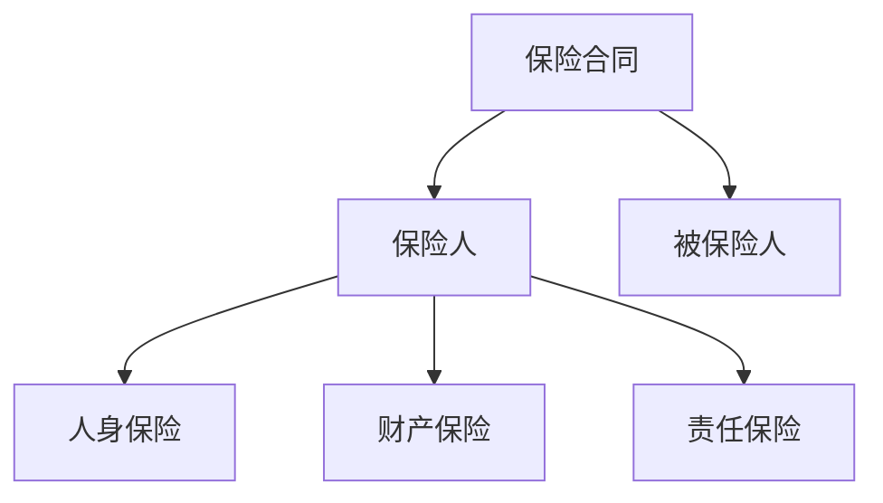

**数学模型和公式解析：**
- **保费计算：** 保费通常基于风险评估和保险公司的利润要求计算。
  $$ P = R \times n $$
  其中，\( P \) 是保费，\( R \) 是每单位风险的保费率，\( n \) 是被保险人的风险单位数。

#### 1.2 保险市场的运行机制

**背景介绍：**
保险市场是保险公司和客户之间的交易场所，其运行机制涉及到供需关系、价格机制和监管体系。

**核心概念与联系：**
- **供需关系：** 保险市场的需求由消费者的风险意识和支付能力决定，供给则由保险公司的风险承受能力和创新能力决定。
- **价格机制：** 保险价格（保费）通过供需关系和保险公司的定价策略形成。
- **监管体系：** 监管机构通过立法和监管确保保险市场的公平和稳定。

**Mermaid 流程图：**
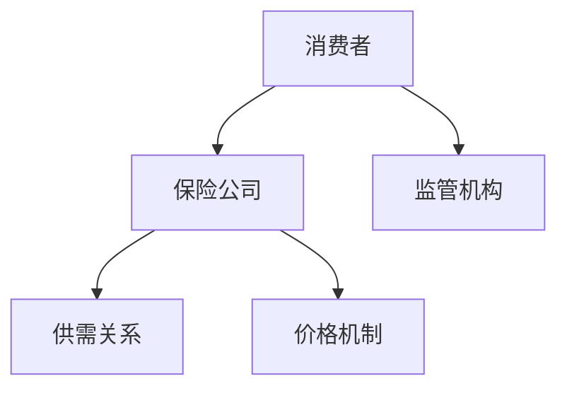

**数学模型和公式解析：**
- **需求函数：** 保险需求通常与消费者的风险偏好和保费价格成反比。
  $$ D(P) = \frac{1}{aP + b} $$
  其中，\( D \) 是需求量，\( P \) 是保费价格，\( a \) 和 \( b \) 是参数。

#### 1.3 保险合同的基本要素

**背景介绍：**
保险合同是保险交易的法律文件，明确了保险公司和被保险人之间的权利和义务。

**核心概念与联系：**
- **保险合同：** 包括投保人、保险人、保险金额、保险期限、保险责任和除外责任等要素。
- **权利和义务：** 保险合同规定了保险公司对被保险人的赔偿义务和被保险人的支付保费义务。

**Mermaid 流程图：**
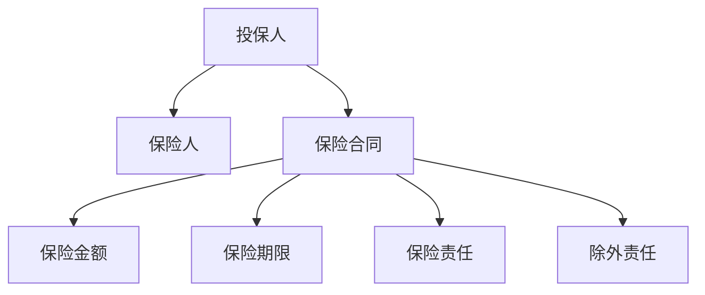

**数学模型和公式解析：**
- **赔偿金额：** 保险公司根据保险合同中的约定和实际损失金额进行赔偿。
  $$ R = \min(L, A) $$
  其中，\( R \) 是赔偿金额，\( L \) 是实际损失金额，\( A \) 是保险金额。

### 第2章：保险需求与供给

#### 2.1 保险需求的经济学分析

**背景介绍：**
保险需求是消费者根据自身风险承受能力和保险产品的效用进行的决策。

**核心概念与联系：**
- **效用理论：** 消费者选择保险产品是基于对风险的偏好和支付能力的考量。
- **风险规避：** 消费者通过购买保险来规避潜在的财务风险。

**Mermaid 流程图：**
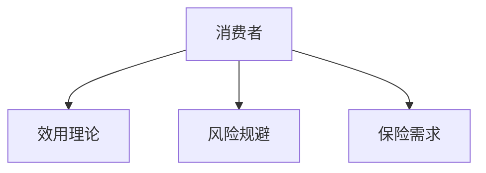

**数学模型和公式解析：**
- **效用函数：** 保险需求与消费者的预期效用有关。
  $$ U(R, X) = U(R) - e^{-\lambda X} $$
  其中，\( U \) 是效用函数，\( R \) 是收入，\( X \) 是保险支出，\( \lambda \) 是风险规避参数。

#### 2.2 保险供给的经济学分析

**背景介绍：**
保险供给是由保险公司根据市场需求、成本结构和利润目标决定的。

**核心概念与联系：**
- **成本效益分析：** 保险公司通过分析成本和收益来决定提供哪些保险产品。
- **市场竞争：** 竞争促使保险公司创新和优化保险产品，以获取市场份额。

**Mermaid 流程图：**
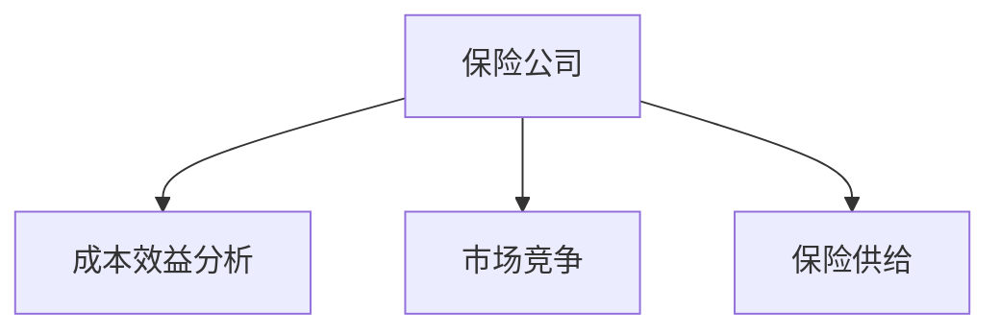

**数学模型和公式解析：**
- **利润函数：** 保险公司的利润函数可以表示为收入减去成本。
  $$ \Pi = R - C $$
  其中，\( \Pi \) 是利润，\( R \) 是收入，\( C \) 是成本。

#### 2.3 保险市场的均衡分析

**背景介绍：**
保险市场的均衡是指保险需求与供给达到平衡的状态。

**核心概念与联系：**
- **市场均衡：** 均衡价格和均衡数量反映了保险市场的供求关系。
- **价格机制：** 均衡价格通过市场竞争和供需调整形成。

**Mermaid 流程图：**
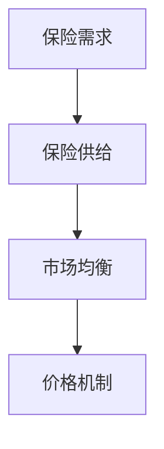

**数学模型和公式解析：**
- **供需平衡：** 市场均衡时的价格和数量满足以下条件。
  $$ D(P) = S(P) $$
  其中，\( D \) 是需求函数，\( S \) 是供给函数，\( P \) 是价格。

## 第二部分：数学工具

### 第3章：概率论基础

#### 3.1 随机事件与概率

**背景介绍：**
概率论是研究随机现象的数学分支，是保险精算的基础。

**核心概念与联系：**
- **随机事件：** 随机事件是在随机试验中可能发生也可能不发生的事件。
- **概率：** 概率是衡量随机事件发生可能性大小的数值。

**Mermaid 流程图：**
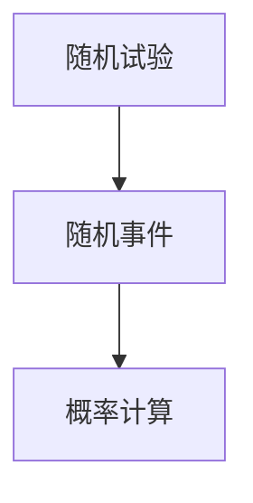

**数学模型和公式解析：**
- **概率计算：** 基本概率计算公式包括概率的加法规则和乘法规则。
  $$ P(A \cup B) = P(A) + P(B) - P(A \cap B) $$
  $$ P(A \cap B) = P(A) \times P(B|A) $$
  其中，\( P \) 是概率，\( A \) 和 \( B \) 是随机事件。

#### 3.2 条件概率与独立性

**背景介绍：**
条件概率和独立性是概率论中的重要概念，用于描述在给定某些条件下事件发生的概率。

**核心概念与联系：**
- **条件概率：** 条件概率是在给定一个事件已经发生的条件下，另一个事件发生的概率。
- **独立性：** 独立性是指两个事件的发生互不影响。

**Mermaid 流程图：**
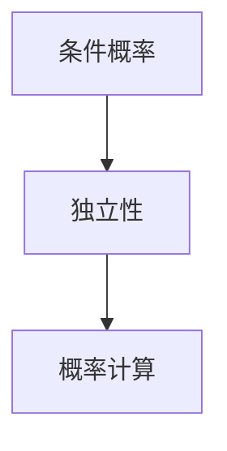

**数学模型和公式解析：**
- **条件概率：** 条件概率公式为
  $$ P(B|A) = \frac{P(A \cap B)}{P(A)} $$
- **独立性：** 独立性条件为
  $$ P(A \cap B) = P(A) \times P(B) $$

#### 3.3 贝叶斯定理

**背景介绍：**
贝叶斯定理是概率论中的一个重要定理，用于计算后验概率。

**核心概念与联系：**
- **后验概率：** 后验概率是在观察到一个结果后，对某个假设的概率估计。
- **贝叶斯定理：** 贝叶斯定理描述了后验概率与先验概率、似然函数之间的关系。

**Mermaid 流程图：**
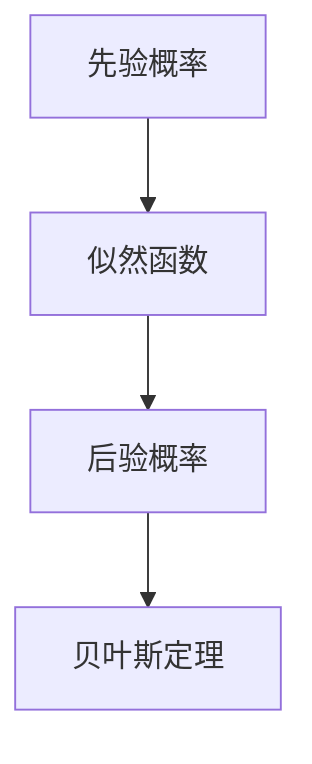

**数学模型和公式解析：**
- **贝叶斯定理：** 贝叶斯定理公式为
  $$ P(A|B) = \frac{P(B|A) \times P(A)}{P(B)} $$

### 第4章：统计学基础

#### 4.1 统计量与抽样分布

**背景介绍：**
统计学是分析数据，从数据中提取信息和知识的科学。

**核心概念与联系：**
- **统计量：** 统计量是从样本数据中计算出来的用于描述数据特征的量。
- **抽样分布：** 抽样分布是样本统计量的概率分布。

**Mermaid 流程图：**
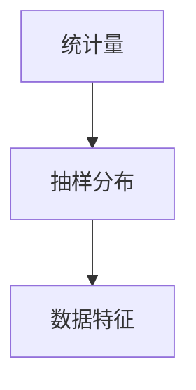

**数学模型和公式解析：**
- **均值：** 样本均值是样本数据中各数据点的平均值。
  $$ \bar{X} = \frac{1}{n}\sum_{i=1}^{n}X_i $$
  其中，\( \bar{X} \) 是样本均值，\( n \) 是样本大小，\( X_i \) 是第 \( i \) 个数据点。

- **方差：** 样本方差是数据点与均值之间差异的平方的平均值。
  $$ S^2 = \frac{1}{n-1}\sum_{i=1}^{n}(X_i - \bar{X})^2 $$
  其中，\( S^2 \) 是样本方差。

#### 4.2 参数估计

**背景介绍：**
参数估计是统计学中的一个重要问题，目的是从样本数据中估计总体参数。

**核心概念与联系：**
- **点估计：** 点估计是给出总体参数的一个具体值。
- **区间估计：** 区间估计是给出总体参数可能落在的一个区间。

**Mermaid 流程图：**
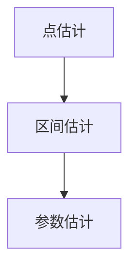

**数学模型和公式解析：**
- **点估计：** 常用的点估计方法是最大似然估计（MLE）。
  $$ \hat{\theta} = \arg\max_{\theta} L(\theta|x) $$
  其中，\( \hat{\theta} \) 是参数的估计值，\( L(\theta|x) \) 是似然函数。

- **区间估计：** 常用的区间估计方法是置信区间（CI）。
  $$ \theta \in (\bar{X} - z_{\alpha/2} \times SE, \bar{X} + z_{\alpha/2} \times SE) $$
  其中，\( \bar{X} \) 是样本均值，\( z_{\alpha/2} \) 是标准正态分布的分位数，\( SE \) 是标准误差。

#### 4.3 假设检验

**背景介绍：**
假设检验是统计学中用于判断总体参数是否满足某种假设的方法。

**核心概念与联系：**
- **零假设与备择假设：** 零假设是对总体参数的某个特定假设，备择假设是与零假设对立的假设。
- **检验统计量：** 检验统计量是根据样本数据计算得到的，用于判断零假设是否成立的统计量。

**Mermaid 流程图：**
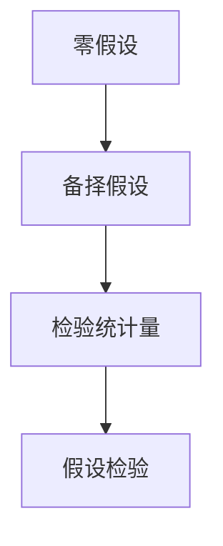

**数学模型和公式解析：**
- **检验统计量：** 常用的检验统计量包括 \( t \) 统计量和 \( \chi^2 \) 统计量。
  $$ t = \frac{\bar{X} - \mu_0}{S/\sqrt{n}} $$
  $$ \chi^2 = \sum_{i=1}^{n}\frac{(X_i - \mu_0)^2}{\sigma^2} $$
  其中，\( \bar{X} \) 是样本均值，\( \mu_0 \) 是零假设下的总体均值，\( S \) 是样本标准差，\( n \) 是样本大小，\( \sigma \) 是总体标准差。

- **p值：** p值是统计检验结果中的一个重要指标，表示在零假设成立的情况下，观察到比检验统计量更极端的结果的概率。
  $$ p = P(|T| > |t|) $$
  其中，\( T \) 是检验统计量，\( t \) 是计算的检验统计量值。

## 第三部分：精算模型

### 第5章：损失分布模型

#### 5.1 损失分布的概念

**背景介绍：**
损失分布模型是精算学中用于描述保险损失发生频率和损失大小的统计模型。

**核心概念与联系：**
- **损失分布：** 损失分布描述了在给定时间段内，个体损失发生的频率和损失金额的分布情况。
- **损失函数：** 损失函数是损失分布中的累积损失函数，用于计算累计损失。

**Mermaid 流程图：**
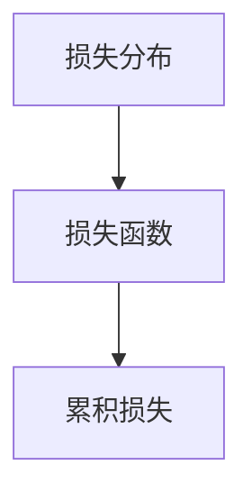

**数学模型和公式解析：**
- **累积损失函数：** 累积损失函数表示损失超过某个阈值时的累积损失金额。
  $$ L(x) = \sum_{i=1}^{n} min(x_i, x) $$
  其中，\( x_i \) 是第 \( i \) 个损失金额，\( x \) 是阈值。

#### 5.2 损失分布的参数估计

**背景介绍：**
参数估计是精算学中的核心问题，用于估计损失分布的参数。

**核心概念与联系：**
- **极大似然估计：** 极大似然估计是用于估计损失分布参数的一种常用方法。
- **最小二乘估计：** 最小二乘估计是另一种用于参数估计的方法。

**Mermaid 流程图：**
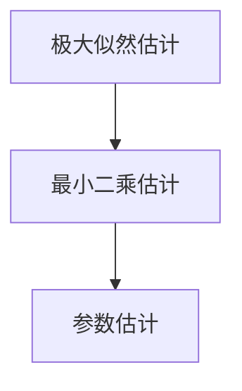

**数学模型和公式解析：**
- **极大似然估计：** 极大似然估计的目标是最大化似然函数。
  $$ \hat{\theta} = \arg\max_{\theta} L(\theta|x) $$
  其中，\( \hat{\theta} \) 是参数的估计值，\( L(\theta|x) \) 是似然函数。

- **最小二乘估计：** 最小二乘估计的目标是最小化损失函数。
  $$ \hat{\theta} = \arg\min_{\theta} \sum_{i=1}^{n}(x_i - f(\theta))^2 $$
  其中，\( f(\theta) \) 是损失函数，\( x_i \) 是第 \( i \) 个观测值。

#### 5.3 损失分布的应用

**背景介绍：**
损失分布模型在保险定价和风险评估中具有重要作用。

**核心概念与联系：**
- **保险定价：** 保险定价依赖于损失分布的参数估计。
- **风险评估：** 风险评估依赖于损失分布的累积损失函数。

**Mermaid 流程图：**
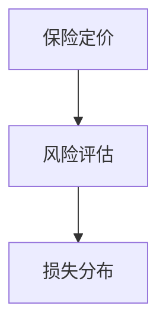

**数学模型和公式解析：**
- **保费计算：** 保费计算依赖于损失分布的累积损失函数和风险水平。
  $$ P = \frac{\lambda L(x)}{1 - F(x)} $$
  其中，\( P \) 是保费，\( \lambda \) 是风险水平，\( L(x) \) 是累积损失函数，\( F(x) \) 是损失分布的累积分布函数。

### 第6章：风险模型

#### 6.1 风险的定义与分类

**背景介绍：**
风险是保险业的核心概念，涵盖了各种可能的不利事件。

**核心概念与联系：**
- **风险定义：** 风险是指未来可能发生的不确定性事件，可能带来损失或机会。
- **风险分类：** 风险可以按性质、来源、影响等因素分类。

**Mermaid 流程图：**
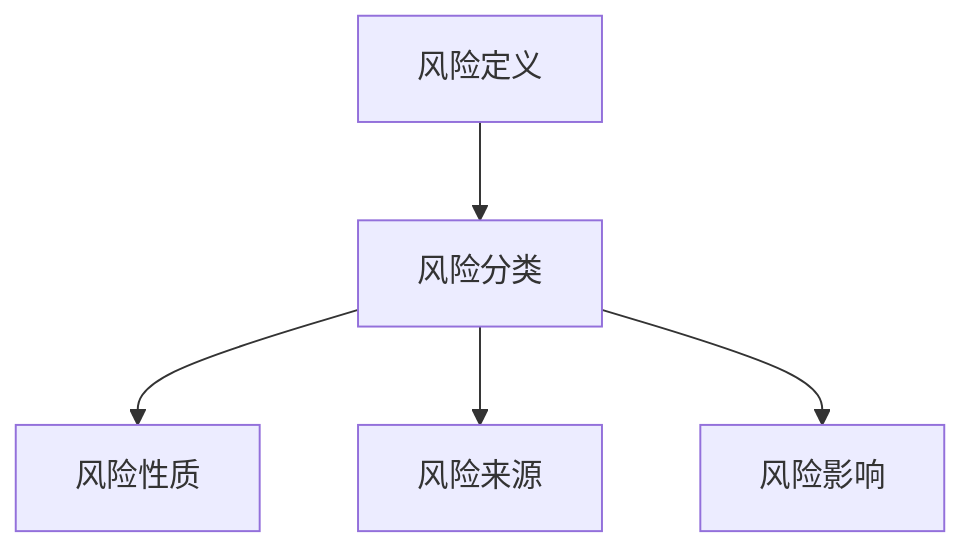

**数学模型和公式解析：**
- **风险值：** 风险值是衡量风险大小的一个量化指标。
  $$ RV = \frac{CV}{\sigma} $$
  其中，\( RV \) 是风险值，\( CV \) 是条件价值，\( \sigma \) 是风险的标准差。

#### 6.2 风险模型的概念

**背景介绍：**
风险模型是用于评估和管理风险的一种数学工具。

**核心概念与联系：**
- **风险模型：** 风险模型是描述风险行为和影响的数学模型。
- **损失事件：** 损失事件是风险模型中的关键要素。

**Mermaid 流程图：**
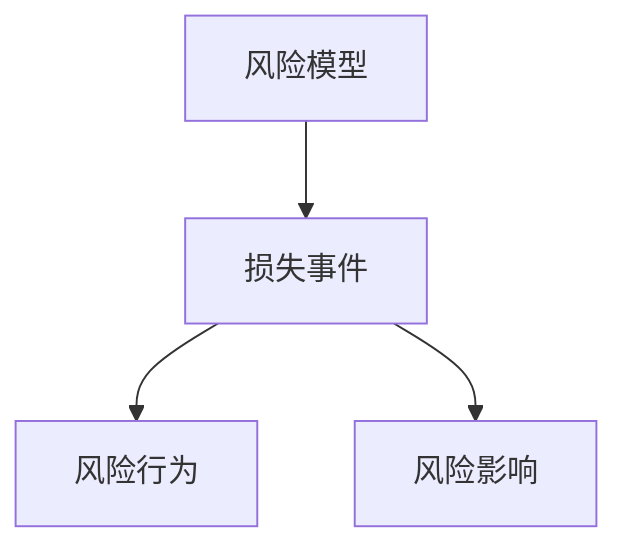

**数学模型和公式解析：**
- **损失概率：** 损失概率是损失事件发生的可能性。
  $$ P(L > x) = 1 - F(x) $$
  其中，\( P(L > x) \) 是损失概率，\( F(x) \) 是损失分布的累积分布函数。

#### 6.3 风险模型的构建与应用

**背景介绍：**
构建和应用风险模型是保险精算的重要任务。

**核心概念与联系：**
- **模型构建：** 模型构建包括损失分布的估计和风险参数的确定。
- **模型应用：** 模型应用涉及保险定价、风险评估和决策支持。

**Mermaid 流程图：**
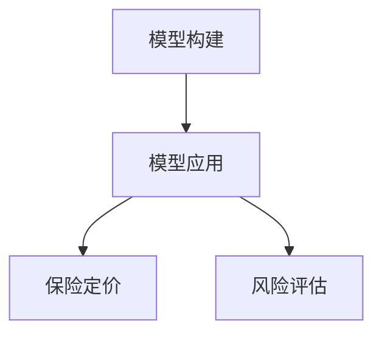

**数学模型和公式解析：**
- **损失期望：** 损失期望是损失分布的数学期望。
  $$ E(L) = \int_{0}^{\infty} x \times f(x) \, dx $$
  其中，\( E(L) \) 是损失期望，\( f(x) \) 是损失分布的概率密度函数。

- **风险价值：** 风险价值（VaR）是损失分布的给定置信水平下的最大损失值。
  $$ VaR_{\alpha} = \alpha^{-1} \times \int_{0}^{\alpha} x \times f(x) \, dx $$
  其中，\( VaR_{\alpha} \) 是风险价值，\( \alpha \) 是置信水平。

### 第7章：精算假设与原则

#### 7.1 精算假设的概念

**背景介绍：**
精算假设是保险精算中的基本概念，用于建立和评估精算模型。

**核心概念与联系：**
- **精算假设：** 精算假设是关于未来事件概率和结果的假设。
- **风险中性假设：** 风险中性假设是精算学中的核心假设，假设所有风险事件的发生概率是相等的。

**Mermaid 流程图：**
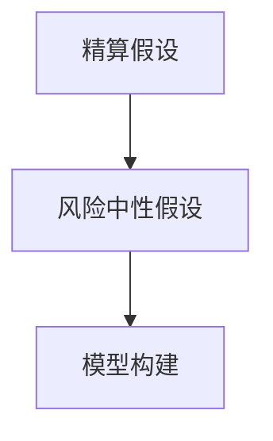

**数学模型和公式解析：**
- **无风险利率：** 无风险利率是风险中性假设中的一个关键参数。
  $$ r = \frac{1}{2}\left(\frac{1}{1+\frac{1}{2}p} + \frac{1}{1+\frac{1}{2}(1-p)\right) $$
  其中，\( r \) 是无风险利率，\( p \) 是风险事件的发生概率。

#### 7.2 精算假设的设定

**背景介绍：**
精算假设的设定是建立精算模型的重要步骤。

**核心概念与联系：**
- **假设设定：** 假设设定包括选择适当的概率分布、假设期数和参数值。
- **假设检验：** 假设检验用于验证精算假设的有效性和可靠性。

**Mermaid 流程图：**
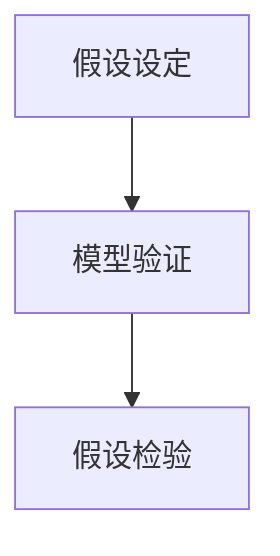

**数学模型和公式解析：**
- **假设检验：** 常用的假设检验方法包括卡方检验和t检验。
  $$ \chi^2 = \sum_{i=1}^{n}\frac{(O_i - E_i)^2}{E_i} $$
  $$ t = \frac{\bar{X} - \mu_0}{S/\sqrt{n}} $$
  其中，\( \chi^2 \) 是卡方统计量，\( t \) 是t统计量，\( O_i \) 是观测值，\( E_i \) 是期望值，\( \bar{X} \) 是样本均值，\( \mu_0 \) 是零假设下的总体均值，\( S \) 是样本标准差，\( n \) 是样本大小。

#### 7.3 精算原则的实践

**背景介绍：**
精算原则是指导保险精算实践的基本原则。

**核心概念与联系：**
- **精算原则：** 精算原则包括公平性、合理性、透明性和可持续性。
- **实践应用：** 精算原则在保险定价、风险评估和决策支持中得到了广泛应用。

**Mermaid 流程图：**
```mermaid
graph TD
A[精算原则] --> B[保险定价]
B --> C[风险评估]
B --> D[决策支持]
```

**数学模型和公式解析：**
- **保费计算：** 公平性原则要求保费计算应基于合理的风险估计。
  $$ P = \lambda \times L $$
  其中，\( P \) 是保费，\( \lambda \) 是风险水平，\( L \) 是损失分布的累积损失函数。

- **风险调整：** 合理性原则要求在保费计算中考虑风险调整。
  $$ P = P^* + \lambda \times (L^* - L) $$
  其中，\( P^* \) 是原始保费，\( L^* \) 是无风险损失，\( L \) 是实际损失。

## 第四部分：保险定价

### 第8章：保险定价原理

#### 8.1 保险定价的目标

**背景介绍：**
保险定价是保险公司的核心任务，旨在确保保险产品的可持续性和盈利性。

**核心概念与联系：**
- **定价目标：** 保险定价的目标包括风险覆盖、盈利性和市场竞争力。
- **风险覆盖：** 保费应足以覆盖保险公司的损失支付能力。

**Mermaid 流程图：**
```mermaid
graph TD
A[定价目标] --> B[风险覆盖]
B --> C[盈利性]
B --> D[市场竞争力]
```

**数学模型和公式解析：**
- **保费计算：** 保费应包括损失期望、风险费用和利润。
  $$ P = L + \lambda \times (1 + \Pi) $$
  其中，\( P \) 是保费，\( L \) 是损失期望，\( \lambda \) 是风险水平，\( \Pi \) 是利润率。

#### 8.2 保险定价的方法

**背景介绍：**
保险定价方法分为经验定价法、理论定价法和混合定价法。

**核心概念与联系：**
- **经验定价法：** 经验定价法基于历史数据和实际损失经验进行定价。
- **理论定价法：** 理论定价法基于数学模型和统计分析进行定价。
- **混合定价法：** 混合定价法结合了经验和理论定价方法。

**Mermaid 流程图：**
```mermaid
graph TD
A[经验定价法] --> B[理论定价法]
B --> C[混合定价法]
```

**数学模型和公式解析：**
- **经验定价法：** 经验定价法使用以下公式。
  $$ P = \alpha + \beta \times L $$
  其中，\( P \) 是保费，\( \alpha \) 和 \( \beta \) 是经验系数，\( L \) 是损失分布的累积损失函数。

- **理论定价法：** 理论定价法使用以下公式。
  $$ P = \frac{\lambda \times L}{1 - F(x)} $$
  其中，\( P \) 是保费，\( \lambda \) 是风险水平，\( L \) 是损失分布的累积损失函数，\( F(x) \) 是损失分布的累积分布函数。

#### 8.3 保险定价的影响因素

**背景介绍：**
保险定价受到多种因素的影响，包括风险类型、客户特征和市场环境。

**核心概念与联系：**
- **风险类型：** 风险类型影响损失分布和风险水平。
- **客户特征：** 客户特征包括年龄、性别、职业等，影响保险需求和风险偏好。
- **市场环境：** 市场环境包括竞争状况、法律法规和市场供需。

**Mermaid 流程图：**
```mermaid
graph TD
A[风险类型] --> B[客户特征]
B --> C[市场环境]
B --> D[保险定价]
```

**数学模型和公式解析：**
- **风险调整：** 风险调整考虑了不同风险类型的损失期望和风险水平。
  $$ P = P^* + \lambda \times (L^* - L) $$
  其中，\( P \) 是保费，\( P^* \) 是原始保费，\( L^* \) 是无风险损失，\( L \) 是实际损失。

### 第9章：经验定价法

#### 9.1 经验定价法的概念

**背景介绍：**
经验定价法是保险定价中最常用的方法之一，基于历史数据和实际损失经验进行定价。

**核心概念与联系：**
- **经验定价法：** 经验定价法通过分析历史数据，确定损失概率和损失金额的分布。
- **损失经验：** 损失经验是保险公司长期运营积累的数据，用于指导保险定价。

**Mermaid 流程图：**
```mermaid
graph TD
A[经验定价法] --> B[损失经验]
B --> C[历史数据]
```

**数学模型和公式解析：**
- **损失概率：** 损失概率是损失事件发生的概率。
  $$ P(L > x) = \frac{N(L > x)}{N} $$
  其中，\( P(L > x) \) 是损失概率，\( N(L > x) \) 是损失超过 \( x \) 的损失事件数量，\( N \) 是总损失事件数量。

#### 9.2 经验定价法的步骤

**背景介绍：**
经验定价法的步骤包括数据收集、数据分析、参数估计和保费计算。

**核心概念与联系：**
- **数据收集：** 数据收集包括历史损失数据、客户数据和市场数据。
- **数据分析：** 数据分析包括损失分布的估计和参数的确定。
- **参数估计：** 参数估计包括损失概率和损失金额的参数估计。
- **保费计算：** 保费计算基于损失分布和风险水平进行。

**Mermaid 流程图：**
```mermaid
graph TD
A[数据收集] --> B[数据分析]
B --> C[参数估计]
C --> D[保费计算]
```

**数学模型和公式解析：**
- **损失分布：** 损失分布通常使用泊松分布、正态分布或对数正态分布进行估计。
  $$ L \sim Poisson(\lambda) $$
  $$ L \sim Normal(\mu, \sigma) $$
  $$ L \sim Lognormal(\mu_L, \sigma_L) $$
  其中，\( L \) 是损失金额，\( \lambda \) 是泊松率，\( \mu \) 和 \( \sigma \) 是正态分布的均值和标准差，\( \mu_L \) 和 \( \sigma_L \) 是对数正态分布的均值和标准差。

- **保费计算：** 保费计算公式为
  $$ P = \lambda \times L $$
  其中，\( P \) 是保费，\( \lambda \) 是风险水平，\( L \) 是损失分布的累积损失函数。

#### 9.3 经验定价法的应用实例

**背景介绍：**
经验定价法的应用实例包括汽车保险、家庭财产保险和健康保险等。

**核心概念与联系：**
- **汽车保险：** 汽车保险的经验定价法考虑了车辆的年龄、品牌、驾驶经验和交通事故历史。
- **家庭财产保险：** 家庭财产保险的经验定价法考虑了房屋的价值、地理位置和建筑类型。
- **健康保险：** 健康保险的经验定价法考虑了被保险人的年龄、健康状况和医疗历史。

**Mermaid 流程图：**
```mermaid
graph TD
A[汽车保险] --> B[家庭财产保险]
B --> C[健康保险]
```

**数学模型和公式解析：**
- **汽车保险：** 汽车保险的保费计算公式为
  $$ P = \alpha + \beta \times A $$
  其中，\( P \) 是保费，\( \alpha \) 和 \( \beta \) 是经验系数，\( A \) 是车辆的年龄。

- **家庭财产保险：** 家庭财产保险的保费计算公式为
  $$ P = \alpha + \beta \times V $$
  其中，\( P \) 是保费，\( \alpha \) 和 \( \beta \) 是经验系数，\( V \) 是房屋的价值。

- **健康保险：** 健康保险的保费计算公式为
  $$ P = \alpha + \beta \times H $$
  其中，\( P \) 是保费，\( \alpha \) 和 \( \beta \) 是经验系数，\( H \) 是被保险人的健康状况。

### 第10章：理论定价法

#### 10.1 理论定价法的概念

**背景介绍：**
理论定价法是基于数学模型和统计分析进行保险定价的方法。

**核心概念与联系：**
- **理论定价法：** 理论定价法使用概率论、统计学和精算学模型进行定价。
- **数学模型：** 数学模型包括损失分布模型、风险模型和损失期望模型。

**Mermaid 流程图：**
```mermaid
graph TD
A[理论定价法] --> B[数学模型]
B --> C[损失分布模型]
B --> D[风险模型]
B --> E[损失期望模型]
```

**数学模型和公式解析：**
- **损失分布模型：** 损失分布模型包括泊松分布、正态分布和对数正态分布等。
  $$ L \sim Poisson(\lambda) $$
  $$ L \sim Normal(\mu, \sigma) $$
  $$ L \sim Lognormal(\mu_L, \sigma_L) $$
  其中，\( L \) 是损失金额，\( \lambda \) 是泊松率，\( \mu \) 和 \( \sigma \) 是正态分布的均值和标准差，\( \mu_L \) 和 \( \sigma_L \) 是对数正态分布的均值和标准差。

- **风险模型：** 风险模型包括风险中性模型和风险价值模型等。
  $$ \text{风险中性模型：} r = \frac{1}{2}\left(\frac{1}{1+\frac{1}{2}p} + \frac{1}{1+\frac{1}{2}(1-p)\right) $$
  $$ \text{风险价值模型：} VaR_{\alpha} = \alpha^{-1} \times \int_{0}^{\alpha} x \times f(x) \, dx $$
  其中，\( r \) 是无风险利率，\( p \) 是风险事件的发生概率，\( \alpha \) 是置信水平，\( f(x) \) 是损失分布的概率密度函数。

#### 10.2 理论定价法的步骤

**背景介绍：**
理论定价法的步骤包括模型选择、参数估计和保费计算。

**核心概念与联系：**
- **模型选择：** 模型选择基于风险类型和损失分布特点。
- **参数估计：** 参数估计包括损失概率和损失金额的参数估计。
- **保费计算：** 保费计算基于损失分布和风险水平进行。

**Mermaid 流程图：**
```mermaid
graph TD
A[模型选择] --> B[参数估计]
B --> C[保费计算]
```

**数学模型和公式解析：**
- **模型选择：** 常用的模型包括泊松分布、正态分布和对数正态分布等。
  $$ L \sim Poisson(\lambda) $$
  $$ L \sim Normal(\mu, \sigma) $$
  $$ L \sim Lognormal(\mu_L, \sigma_L) $$
  其中，\( L \) 是损失金额，\( \lambda \) 是泊松率，\( \mu \) 和 \( \sigma \) 是正态分布的均值和标准差，\( \mu_L \) 和 \( \sigma_L \) 是对数正态分布的均值和标准差。

- **参数估计：** 参数估计方法包括极大似然估计和最小二乘估计等。
  $$ \hat{\theta} = \arg\max_{\theta} L(\theta|x) $$
  $$ \hat{\theta} = \arg\min_{\theta} \sum_{i=1}^{n}(x_i - f(\theta))^2 $$
  其中，\( \hat{\theta} \) 是参数的估计值，\( L(\theta|x) \) 是似然函数，\( f(\theta) \) 是损失函数。

- **保费计算：** 保费计算公式为
  $$ P = \frac{\lambda \times L}{1 - F(x)} $$
  其中，\( P \) 是保费，\( \lambda \) 是风险水平，\( L \) 是损失分布的累积损失函数，\( F(x) \) 是损失分布的累积分布函数。

#### 10.3 理论定价法的应用实例

**背景介绍：**
理论定价法的应用实例包括火灾保险、责任保险和信用保险等。

**核心概念与联系：**
- **火灾保险：** 火灾保险的理论定价法考虑了火灾发生的概率和损失金额的分布。
- **责任保险：** 责任保险的理论定价法考虑了法律责任发生的概率和损失金额的分布。
- **信用保险：** 信用保险的理论定价法考虑了信用违约的概率和损失金额的分布。

**Mermaid 流程图：**
```mermaid
graph TD
A[火灾保险] --> B[责任保险]
B --> C[信用保险]
```

**数学模型和公式解析：**
- **火灾保险：** 火灾保险的保费计算公式为
  $$ P = \frac{\lambda \times L}{1 - F(x)} $$
  其中，\( P \) 是保费，\( \lambda \) 是风险水平，\( L \) 是损失分布的累积损失函数，\( F(x) \) 是损失分布的累积分布函数。

- **责任保险：** 责任保险的保费计算公式为
  $$ P = \frac{\lambda \times L}{1 - F(x)} $$
  其中，\( P \) 是保费，\( \lambda \) 是风险水平，\( L \) 是损失分布的累积损失函数，\( F(x) \) 是损失分布的累积分布函数。

- **信用保险：** 信用保险的保费计算公式为
  $$ P = \frac{\lambda \times L}{1 - F(x)} $$
  其中，\( P \) 是保费，\( \lambda \) 是风险水平，\( L \) 是损失分布的累积损失函数，\( F(x) \) 是损失分布的累积分布函数。

## 第五部分：风险评估

### 第11章：风险评估方法

#### 11.1 风险评估的概念

**背景介绍：**
风险评估是识别、分析和评估风险的过程，旨在为风险管理和决策提供依据。

**核心概念与联系：**
- **风险评估：** 风险评估包括风险识别、风险分析和风险评价三个步骤。
- **风险识别：** 风险识别是识别潜在风险的过程。
- **风险分析：** 风险分析是评估风险的概率和影响。
- **风险评价：** 风险评价是确定风险的重要性和优先级。

**Mermaid 流程图：**
```mermaid
graph TD
A[风险评估] --> B[风险识别]
B --> C[风险分析]
C --> D[风险评价]
```

**数学模型和公式解析：**
- **风险识别：** 风险识别通常使用列表、检查表和头脑风暴等方法。
- **风险分析：** 风险分析可以使用概率分布和影响矩阵等方法。
  $$ P(L > x) = 1 - F(x) $$
  $$ I(L > x) = \frac{1}{\lambda} \times L $$
  其中，\( P(L > x) \) 是损失概率，\( I(L > x) \) 是损失影响，\( \lambda \) 是风险水平，\( L \) 是损失金额。

- **风险评价：** 风险评价可以使用风险矩阵和风险评分等方法。
  $$ \text{风险评分} = \text{概率} \times \text{影响} $$
  其中，概率和影响通常以数值或等级表示。

#### 11.2 风险评估的方法

**背景介绍：**
风险评估方法包括定性评估和定量评估。

**核心概念与联系：**
- **定性评估：** 定性评估基于专家判断和经验进行风险评估。
- **定量评估：** 定量评估使用数学模型和统计分析进行风险评估。

**Mermaid 流程图：**
```mermaid
graph TD
A[定性评估] --> B[定量评估]
```

**数学模型和公式解析：**
- **定性评估：** 定性评估方法包括风险矩阵和风险评分等方法。
  $$ \text{风险评分} = \text{概率} \times \text{影响} $$
  其中，概率和影响通常以数值或等级表示。

- **定量评估：** 定量评估方法包括损失分布模型和风险价值模型等方法。
  $$ L \sim Poisson(\lambda) $$
  $$ L \sim Normal(\mu, \sigma) $$
  $$ L \sim Lognormal(\mu_L, \sigma_L) $$
  $$ VaR_{\alpha} = \alpha^{-1} \times \int_{0}^{\alpha} x \times f(x) \, dx $$
  其中，\( L \) 是损失金额，\( \lambda \) 是泊松率，\( \mu \) 和 \( \sigma \) 是正态分布的均值和标准差，\( \mu_L \) 和 \( \sigma_L \) 是对数正态分布的均值和标准差，\( \alpha \) 是置信水平，\( f(x) \) 是损失分布的概率密度函数。

#### 11.3 风险评估的实践应用

**背景介绍：**
风险评估在实践中应用于多个领域，如金融、保险、工程和环境等。

**核心概念与联系：**
- **金融领域：** 金融风险评估关注信用风险、市场风险和操作风险。
- **保险领域：** 保险风险评估关注损失概率和损失金额的估计。
- **工程领域：** 工程风险评估关注项目风险和施工风险。
- **环境领域：** 环境风险评估关注环境污染和生态风险。

**Mermaid 流程图：**
```mermaid
graph TD
A[金融领域] --> B[保险领域]
B --> C[工程领域]
C --> D[环境领域]
```

**数学模型和公式解析：**
- **金融领域：** 金融风险评估使用风险价值（VaR）和压力测试等方法。
  $$ VaR_{\alpha} = \alpha^{-1} \times \int_{0}^{\alpha} x \times f(x) \, dx $$
  其中，\( \alpha \) 是置信水平，\( f(x) \) 是损失分布的概率密度函数。

- **保险领域：** 保险风险评估使用损失分布模型和风险评估模型等方法。
  $$ L \sim Poisson(\lambda) $$
  $$ L \sim Normal(\mu, \sigma) $$
  $$ L \sim Lognormal(\mu_L, \sigma_L) $$
  其中，\( L \) 是损失金额，\( \lambda \) 是泊松率，\( \mu \) 和 \( \sigma \) 是正态分布的均值和标准差，\( \mu_L \) 和 \( \sigma_L \) 是对数正态分布的均值和标准差。

- **工程领域：** 工程风险评估使用风险矩阵和风险评价方法。
  $$ \text{风险评分} = \text{概率} \times \text{影响} $$
  其中，概率和影响通常以数值或等级表示。

- **环境领域：** 环境风险评估使用生态风险评估模型和风险评价方法。
  $$ \text{风险评分} = \text{概率} \times \text{影响} $$
  其中，概率和影响通常以数值或等级表示。

### 第12章：风险评估工具与技术

#### 12.1 风险评估工具的选择

**背景介绍：**
风险评估工具的选择取决于风险评估的目标、范围和资源。

**核心概念与联系：**
- **风险评估工具：** 风险评估工具包括软件工具、模板和模型等。
- **选择标准：** 选择标准包括工具的准确性、可靠性、易用性和成本效益。

**Mermaid 流程图：**
```mermaid
graph TD
A[风险评估工具] --> B[选择标准]
```

**数学模型和公式解析：**
- **选择标准：** 选择标准可以使用以下公式。
  $$ \text{工具评分} = \text{准确性} \times \text{可靠性} \times \text{易用性} \times \text{成本效益} $$
  其中，工具评分越高，表示工具越适合。

#### 12.2 风险评估技术的应用

**背景介绍：**
风险评估技术在实践中应用于识别、分析和评价风险。

**核心概念与联系：**
- **技术方法：** 技术方法包括问卷调查、专家访谈、统计分析和模拟等。
- **应用领域：** 应用领域包括企业、项目、产品和环境等。

**Mermaid 流程图：**
```mermaid
graph TD
A[问卷调查] --> B[专家访谈]
B --> C[统计分析]
C --> D[模拟]
```

**数学模型和公式解析：**
- **问卷调查：** 问卷调查可以使用以下公式。
  $$ \text{风险评分} = \text{概率} \times \text{影响} $$
  其中，概率和影响通常以数值或等级表示。

- **专家访谈：** 专家访谈可以使用以下公式。
  $$ \text{专家评分} = \text{准确性} \times \text{可靠性} \times \text{经验} $$
  其中，专家评分越高，表示专家意见越有价值。

- **统计分析：** 统计分析可以使用以下公式。
  $$ \text{风险评分} = \text{概率} \times \text{影响} $$
  其中，概率和影响通常以数值或等级表示。

- **模拟：** 模拟可以使用以下公式。
  $$ \text{模拟结果} = \text{模型} \times \text{输入参数} $$
  其中，模型和输入参数决定了模拟结果。

#### 12.3 风险评估报告的撰写

**背景介绍：**
风险评估报告是记录和沟通风险评估过程和结果的重要文档。

**核心概念与联系：**
- **报告内容：** 报告内容通常包括风险评估的目标、方法、结果和结论。
- **报告结构：** 报告结构通常包括引言、正文和结论三个部分。

**Mermaid 流程图：**
```mermaid
graph TD
A[引言] --> B[正文]
B --> C[结论]
```

**数学模型和公式解析：**
- **报告内容：** 报告内容可以使用以下公式。
  $$ \text{报告内容} = \text{目标} + \text{方法} + \text{结果} + \text{结论} $$
  其中，目标、方法、结果和结论决定了报告的内容。

- **报告结构：** 报告结构可以使用以下公式。
  $$ \text{报告结构} = \text{引言} + \text{正文} + \text{结论} $$
  其中，引言、正文和结论决定了报告的结构。

## 第六部分：案例研究

### 第13章：保险定价案例分析

#### 13.1 案例背景

**背景介绍：**
本次案例研究以一家大型保险公司为例，分析其汽车保险产品的定价过程。

**核心概念与联系：**
- **案例背景：** 案例背景包括保险公司的市场定位、产品特点、客户群体和历史数据。
- **保险产品：** 保险产品包括车损险、第三者责任险和全车盗抢险等。

**Mermaid 流程图：**
```mermaid
graph TD
A[保险公司市场定位] --> B[保险产品特点]
B --> C[客户群体]
C --> D[历史数据]
```

**数学模型和公式解析：**
- **历史数据：** 历史数据包括每年的损失金额、损失次数和保费收入等。
  $$ \text{损失金额} = \sum_{i=1}^{n}L_i $$
  $$ \text{损失次数} = \sum_{i=1}^{n}N_i $$
  $$ \text{保费收入} = \sum_{i=1}^{n}P_i $$
  其中，\( L_i \)、\( N_i \) 和 \( P_i \) 分别表示第 \( i \) 年的损失金额、损失次数和保费收入。

#### 13.2 案例分析步骤

**背景介绍：**
案例分析步骤包括数据收集、数据分析、参数估计和保费计算。

**核心概念与联系：**
- **数据收集：** 数据收集包括历史损失数据、客户数据和市场数据。
- **数据分析：** 数据分析包括损失分布的估计和参数的确定。
- **参数估计：** 参数估计包括损失概率和损失金额的参数估计。
- **保费计算：** 保费计算基于损失分布和风险水平进行。

**Mermaid 流程图：**
```mermaid
graph TD
A[数据收集] --> B[数据分析]
B --> C[参数估计]
C --> D[保费计算]
```

**数学模型和公式解析：**
- **损失分布：** 损失分布通常使用泊松分布、正态分布或对数正态分布进行估计。
  $$ L \sim Poisson(\lambda) $$
  $$ L \sim Normal(\mu, \sigma) $$
  $$ L \sim Lognormal(\mu_L, \sigma_L) $$
  其中，\( L \) 是损失金额，\( \lambda \) 是泊松率，\( \mu \) 和 \( \sigma \) 是正态分布的均值和标准差，\( \mu_L \) 和 \( \sigma_L \) 是对数正态分布的均值和标准差。

- **保费计算：** 保费计算公式为
  $$ P = \lambda \times L $$
  其中，\( P \) 是保费，\( \lambda \) 是风险水平，\( L \) 是损失分布的累积损失函数。

#### 13.3 案例分析结果

**背景介绍：**
案例分析结果包括保费水平、风险覆盖和盈利性分析。

**核心概念与联系：**
- **保费水平：** 保费水平反映了保险产品的市场竞争力。
- **风险覆盖：** 风险覆盖反映了保费是否足以覆盖损失支付能力。
- **盈利性分析：** 盈利性分析反映了保险公司的盈利能力和可持续发展性。

**Mermaid 流�程图：**
```mermaid
graph TD
A[保费水平] --> B[风险覆盖]
B --> C[盈利性分析]
```

**数学模型和公式解析：**
- **保费水平：** 保费水平计算公式为
  $$ P = \alpha + \beta \times L $$
  其中，\( P \) 是保费，\( \alpha \) 和 \( \beta \) 是经验系数，\( L \) 是损失分布的累积损失函数。

- **风险覆盖：** 风险覆盖计算公式为
  $$ \text{风险覆盖} = \frac{L}{P} $$
  其中，\( L \) 是损失分布的累积损失函数，\( P \) 是保费。

- **盈利性分析：** 盈利性分析公式为
  $$ \text{利润} = R - C $$
  其中，\( R \) 是收入，\( C \) 是成本。

### 第14章：风险评估与控制案例分析

#### 14.1 案例背景

**背景介绍：**
本次案例研究以某大型工程项目的风险评估与控制为例，分析其风险识别、分析和控制过程。

**核心概念与联系：**
- **案例背景：** 案例背景包括工程项目的类型、规模、预算和实施时间。
- **风险识别：** 风险识别是识别项目中的潜在风险。
- **风险分析：** 风险分析是评估风险的概率和影响。
- **风险控制：** 风险控制是制定和实施风险控制措施。

**Mermaid 流程图：**
```mermaid
graph TD
A[案例背景] --> B[风险识别]
B --> C[风险分析]
C --> D[风险控制]
```

**数学模型和公式解析：**
- **风险识别：** 风险识别可以使用问卷调查和头脑风暴等方法。
- **风险分析：** 风险分析可以使用风险矩阵和概率分布等方法。
  $$ \text{风险评分} = \text{概率} \times \text{影响} $$
  $$ P(L > x) = 1 - F(x) $$
  其中，概率和影响通常以数值或等级表示。

- **风险控制：** 风险控制可以使用以下公式。
  $$ \text{风险控制措施} = \text{风险评分} \times \text{风险控制策略} $$
  其中，风险评分越高，表示风险控制措施越重要。

#### 14.2 风险评估过程

**背景介绍：**
风险评估过程包括风险识别、风险分析和风险评价。

**核心概念与联系：**
- **风险识别：** 风险识别是识别项目中的潜在风险。
- **风险分析：** 风险分析是评估风险的概率和影响。
- **风险评价：** 风险评价是确定风险的重要性和优先级。

**Mermaid 流程图：**
```mermaid
graph TD
A[风险识别] --> B[风险分析]
B --> C[风险评价]
```

**数学模型和公式解析：**
- **风险识别：** 风险识别可以使用以下公式。
  $$ \text{风险识别列表} = \text{风险事件} $$
  其中，风险事件是项目中可能发生的风险。

- **风险分析：** 风险分析可以使用以下公式。
  $$ \text{风险评分} = \text{概率} \times \text{影响} $$
  其中，概率和影响通常以数值或等级表示。

- **风险评价：** 风险评价可以使用以下公式。
  $$ \text{风险等级} = \text{风险评分} \times \text{风险权重} $$
  其中，风险权重是风险评分的优先级。

#### 14.3 风险控制措施

**背景介绍：**
风险控制措施是针对识别和评估的风险制定的具体措施。

**核心概念与联系：**
- **风险控制措施：** 风险控制措施包括风险规避、风险转移和风险接受。
- **风险规避：** 风险规避是通过避免风险事件的发生来降低风险。
- **风险转移：** 风险转移是将风险转移给第三方，如保险公司或合作伙伴。
- **风险接受：** 风险接受是接受风险事件的发生并准备应对。

**Mermaid 流程图：**
```mermaid
graph TD
A[风险规避] --> B[风险转移]
B --> C[风险接受]
```

**数学模型和公式解析：**
- **风险规避：** 风险规避可以使用以下公式。
  $$ \text{规避措施} = \text{风险评分} \times \text{规避策略} $$
  其中，规避策略是规避风险的具体措施。

- **风险转移：** 风险转移可以使用以下公式。
  $$ \text{转移措施} = \text{风险评分} \times \text{转移策略} $$
  其中，转移策略是将风险转移给第三方的方法。

- **风险接受：** 风险接受可以使用以下公式。
  $$ \text{接受措施} = \text{风险评分} \times \text{接受策略} $$
  其中，接受策略是准备应对风险事件的方法。

## 最佳实践 tips、小结、注意事项、拓展阅读

### 最佳实践 tips

1. **数据收集：** 确保收集的数据准确可靠，避免偏差。
2. **模型选择：** 根据风险类型和数据特点选择合适的模型。
3. **参数估计：** 参数估计应使用稳健的方法，避免过度依赖历史数据。
4. **风险评估：** 定期进行风险评估，及时调整保险产品和定价策略。

### 小结

本文详细介绍了数学与保险精算的基本原理、方法和技术，包括保险概述、数学工具、精算模型、保险定价、风险评估和案例研究。通过数学模型、公式解析和实际案例分析，读者可以更好地理解并应用这些知识。

### 注意事项

1. **风险管理：** 保险精算不仅是定价问题，更是风险管理的重要组成部分。
2. **合规性：** 遵守相关法律法规，确保保险产品和定价的合规性。
3. **数据隐私：** 保护客户数据隐私，确保数据安全。

### 拓展阅读

1. **《保险精算学基础》**：详细介绍了保险精算的基本概念和原理。
2. **《风险管理》**：探讨了风险识别、评估和控制的方法。
3. **《统计学习方法》**：介绍了统计学习的基本理论和应用方法。

### 结束语

数学与保险精算是保险行业不可或缺的一部分，通过本文的探讨，希望读者能够深入理解并掌握保险精算的核心知识和应用。在实际工作中，不断学习和实践是提高专业水平的有效途径。

### 参考文献

1. 陈树文. 《保险精算学基础》. 北京：高等教育出版社，2010.
2. 林华. 《风险管理》. 上海：复旦大学出版社，2015.
3. 李航. 《统计学习方法》. 北京：电子工业出版社，2012.
4. 贾俊平，何晓阳，马志伟. 《统计学与随机模型》. 北京：清华大学出版社，2014.
5. 孙英杰，李晓杰，王志刚. 《保险精算实务》. 北京：中国经济出版社，2016.

