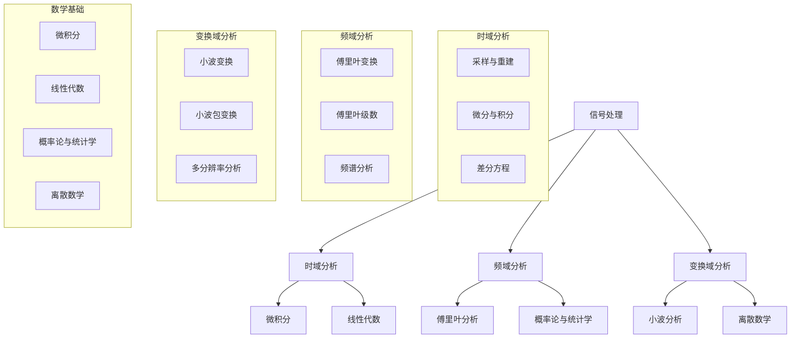

                 

### 引言

信号处理是现代工程技术和科学研究中不可或缺的一部分，它涉及对各种信号（如声音、图像、电信号等）的获取、处理、分析和理解。随着信息时代的到来，信号处理技术已经渗透到了众多领域，包括通信、音频处理、图像处理、生物医学工程等。为了更好地理解信号处理技术，数学作为其理论基础显得尤为重要。

本书《数学与信号处理：信号分析的数学技术》旨在为读者提供一整套系统化的信号处理与数学技术知识，使读者能够深入了解数学在信号处理中的应用，掌握信号处理的核心概念和技术。本书的目标读者是对信号处理和数学有一定基础，希望深入了解两者之间联系的工程师、研究人员和学生。

本书将分为五个主要部分。第一部分将介绍信号处理与数学基础，包括信号处理的历史发展、基本概念和数学基础；第二部分将深入探讨信号处理的数学模型与方法，如傅里叶变换、短时傅里叶变换和小波变换；第三部分将介绍信号处理的实际应用，包括音频信号处理、图像信号处理和通信信号处理；第四部分将探讨高级信号处理技术，如机器学习与信号处理；最后一部分将讨论信号处理的未来发展趋势、资源与工具。

在接下来的章节中，我们将逐一介绍各个部分的内容，并通过详细的讲解和实例分析，帮助读者更好地理解信号处理与数学技术。通过本书的学习，读者不仅能够掌握信号处理的基本理论和技术，还能够为后续的研究和工作打下坚实的基础。

## 第1部分：信号处理与数学基础

### 第1章：信号处理概述

#### 1.1 信号处理的定义与历史发展

信号处理是一门研究信号的产生、传输、接收和处理的学科，其目的是提取有用信息、降低噪声、增强信号质量等。信号处理可以大致分为模拟信号处理和数字信号处理两大类。模拟信号处理主要涉及连续信号，而数字信号处理则主要处理离散信号。

信号处理的发展历史可以追溯到19世纪末期，当时的科学家和工程师们开始探索如何使用电气设备来处理声音和电信号。早期的信号处理技术主要依赖于模拟电路和电子元件，如滤波器、放大器和调制器等。随着电子技术的进步，模拟信号处理逐渐被数字信号处理所取代，因为数字信号处理具有更高的精度、更好的抗干扰能力和更强的灵活性。

#### 1.2 信号处理的分类与主要任务

信号处理的分类可以根据处理对象、处理方法和应用领域等多种标准进行。以下是一些常见的信号处理分类：

1. **按处理对象分类**：
   - **音频信号处理**：涉及对声音信号的处理，如噪声消除、回声抑制、音频增强等。
   - **图像信号处理**：涉及对图像信号的处理，如图像滤波、边缘检测、图像压缩等。
   - **通信信号处理**：涉及对通信信号的调制、解调、信道编码和解码等。
   - **生物医学信号处理**：涉及对生物医学信号的采集、处理和分析，如心电图（ECG）、脑电图（EEG）等。

2. **按处理方法分类**：
   - **时域信号处理**：直接对信号的时间序列进行操作和分析。
   - **频域信号处理**：将信号转换到频域，以便分析和处理。
   - **变换域信号处理**：利用傅里叶变换、小波变换等将信号转换到特定的变换域，进行更有效的处理。

3. **按应用领域分类**：
   - **消费电子**：如音响设备、手机、电视等。
   - **工业控制**：如过程控制、故障诊断、质量检测等。
   - **军事应用**：如雷达、通信、导航等。
   - **科学研究**：如天文学、地球物理学、生物科学等。

#### 1.3 信号处理的重要概念

在信号处理中，有一些基本概念和术语是理解和应用信号处理技术的关键：

1. **信号**：信号是描述物理现象的数学函数，可以是连续的或离散的。例如，音频信号描述声音的变化，图像信号描述图像的光强度变化。

2. **系统**：系统是对信号进行操作和处理的数学模型，可以是线性的或非线性的。例如，滤波器是一个常见的系统，用于去除信号中的噪声。

3. **采样与重建**：采样是将连续信号转换为离散信号的过程，重建是将离散信号转换为连续信号的过程。采样和重建是信号处理中的关键步骤，必须满足采样定理，以保证信号重建的质量。

4. **傅里叶变换**：傅里叶变换是将信号从时域转换到频域的一种数学工具，可以揭示信号的频率成分。傅里叶变换在信号处理中有着广泛的应用，如频谱分析、滤波和调制。

5. **滤波**：滤波是一种用于去除信号中不需要成分的方法。根据滤波器的设计和目的，可以将其分为低通滤波器、高通滤波器、带通滤波器和带阻滤波器等。

通过本章的介绍，读者可以初步了解信号处理的基本概念、分类和重要概念。在接下来的章节中，我们将进一步探讨数学在信号处理中的应用，为读者提供更深入的知识和技能。

#### 1.4 数学在信号处理中的基础

信号处理中的许多核心概念和技术都依赖于数学基础。数学不仅是信号处理的工具，也是其理论基础。以下是一些关键的数学基础，它们在信号处理中的应用至关重要：

1. **离散数学**：离散数学是信号处理的基础，包括集合论、逻辑、图论和组合学等。离散数学中的概念，如集合、函数和关系，帮助我们在信号处理中对信号进行数学描述和分析。

2. **线性代数**：线性代数在信号处理中的应用广泛，包括矩阵运算、向量空间、特征值和特征向量等。线性代数为信号处理提供了强大的工具，如矩阵分解、特征分析和线性变换等。

3. **微积分**：微积分在信号处理中的应用主要体现在时域和频域分析中。微积分的概念，如导数、积分和微分方程，帮助我们对信号进行时间域和频域的分析。

4. **概率论与统计学**：概率论和统计学在信号处理中的应用主要包括噪声建模、信号检测和估计等。通过概率论和统计学，我们可以对信号进行概率分布建模，并利用统计方法对信号进行估计和检测。

5. **傅里叶分析**：傅里叶分析是信号处理中的核心技术之一，它将信号从时域转换到频域，使我们能够更方便地分析和处理信号。傅里叶变换、傅里叶级数和傅里叶积分是傅里叶分析的核心工具。

6. **小波分析**：小波分析是另一种重要的信号处理工具，它通过将信号分解为不同尺度的小波函数，使我们能够更灵活地处理非平稳信号。小波变换和小波包变换是小波分析的核心技术。

通过这些数学基础，信号处理能够实现对信号的精确描述和分析。在接下来的章节中，我们将深入探讨这些数学工具在信号处理中的应用，并通过具体的例子来展示它们的使用方法。

#### 1.5 数学与信号处理的联系架构

为了更好地理解数学与信号处理之间的联系，我们可以使用Mermaid流程图来展示它们的核心概念和原理之间的结构。以下是一个简化的Mermaid流程图示例，用于展示信号处理中的几个关键数学概念：

在这个流程图中，我们首先从信号处理出发，将其分为时域分析、频域分析和变换域分析三个主要部分。在每个部分中，我们列出了相关的数学工具和概念：

- **时域分析**：包括采样与重建、微分与积分和差分方程等，这些概念主要通过微积分和线性代数来实现。
- **频域分析**：包括傅里叶变换、傅里叶级数和频谱分析等，这些概念主要通过傅里叶分析和概率论与统计学来实现。
- **变换域分析**：包括小波变换、小波包变换和多分辨率分析等，这些概念主要通过小波分析和离散数学来实现。

通过这个流程图，我们可以清晰地看到数学在信号处理中的核心作用，以及各个数学概念之间的联系。这为读者提供了一个直观的理解框架，有助于深入学习和掌握信号处理与数学技术。

### 第2章：数学基础

#### 2.1 离散数学基础

离散数学是信号处理不可或缺的基础学科，它涵盖了集合、函数、逻辑和图论等基本概念。这些概念为信号处理中的数据表示、算法设计和逻辑推理提供了坚实的理论基础。

1. **集合**：集合是离散数学中最基本的概念，它是由一组确定的、互不相同的元素组成的整体。集合通常用大写字母表示，如 \( A \)，其元素用小写字母表示，如 \( a \)。集合的运算包括并集（\( \cup \)）、交集（\( \cap \)）、补集（\( \complement \)）和笛卡尔积（\( \times \)）。

2. **函数**：函数是一种特殊的映射，它将一个集合中的每个元素映射到另一个集合中的一个唯一元素。函数通常表示为 \( f: A \rightarrow B \)，其中 \( A \) 是定义域，\( B \) 是值域。函数的运算包括复合函数（\( f \circ g \)）和逆函数（\( f^{-1} \)）。

3. **逻辑**：逻辑是用于表示和分析命题的一种数学工具，包括命题逻辑和谓词逻辑。命题逻辑用真值（True 或 False）来表示命题的真假，而谓词逻辑则用于描述对象之间的关系。

4. **图论**：图论研究图的结构和性质，包括图的表示、路径、连通性、树和图同构等。在信号处理中，图论用于表示和处理复杂系统的网络结构。

#### 2.2 线性代数基础

线性代数是信号处理中的重要数学工具，它涵盖了向量、矩阵、行列式和线性变换等概念。这些概念在信号处理中的应用广泛，包括数据表示、算法设计和系统分析。

1. **向量**：向量是具有大小和方向的量，通常用箭头表示。向量的运算包括加法、减法、数乘和内积。向量空间是向量的集合，满足向量加法和数乘运算。

2. **矩阵**：矩阵是一个由数构成的矩形数组，通常用大写字母表示，如 \( A \)。矩阵的运算包括矩阵加法、矩阵乘法、转置和逆矩阵。

3. **行列式**：行列式是矩阵的一种数值特征，用于表示矩阵的行列式值。行列式在信号处理中用于求解线性方程组和判断矩阵的可逆性。

4. **线性变换**：线性变换是一种将向量空间映射到另一个向量空间的变换，它保持向量的线性组合。线性变换可以用矩阵表示，并具有许多重要的性质，如可逆性、保持线性关系等。

#### 2.3 微积分基础

微积分是信号处理中用于描述时间变化的重要工具，它涵盖了导数、积分和微分方程等概念。

1. **导数**：导数表示函数在某一点的瞬时变化率，用符号 \( f'(x) \) 表示。导数在信号处理中用于分析信号的变化趋势和特性。

2. **积分**：积分表示函数在区间上的累计变化，用符号 \( \int f(x) \, dx \) 表示。积分在信号处理中用于计算信号的能量、平均值等。

3. **微分方程**：微分方程是包含导数的方程，用于描述系统的时间动态行为。微分方程在信号处理中用于建模和求解信号的行为。

#### 2.4 概率论与统计学基础

概率论和统计学在信号处理中用于描述和估计信号的随机特性，包括概率分布、随机变量和统计估计等。

1. **概率分布**：概率分布描述随机变量取值的概率分布规律。常见的概率分布包括正态分布、二项分布和泊松分布。

2. **随机变量**：随机变量是随机试验结果的数学描述，可以是离散的或连续的。随机变量的分布和期望、方差等统计量在信号处理中用于分析和估计信号特性。

3. **统计估计**：统计估计是利用样本数据估计总体参数的方法，包括点估计和区间估计。统计估计在信号处理中用于估计信号参数和系统状态。

通过以上对离散数学、线性代数、微积分和概率论与统计学基础知识的介绍，读者可以为后续信号处理与数学技术的深入学习打下坚实的基础。这些数学工具不仅为信号处理提供了强大的理论支持，也为实际应用提供了有效的解决方案。

### 第3章：信号与系统

#### 3.1 信号的分类与表示

信号是信号处理研究的核心对象，根据不同的特征和性质，信号可以被分类为多种类型。以下是一些常见的信号分类及其表示方法：

1. **连续信号与离散信号**：
   - **连续信号**：在连续时间域内取值的信号，如电压信号、温度信号等。连续信号通常用函数表示，如 \( x(t) \)。
   - **离散信号**：在离散时间点取值的信号，如数字音频、数字图像等。离散信号通常用序列表示，如 \( x[n] \)。

2. **确定性信号与随机信号**：
   - **确定性信号**：可以精确描述其未来行为的信号，如正弦波、方波等。确定性信号可以用数学公式表示，如 \( x(t) = A \sin(2\pi f t + \phi) \)。
   - **随机信号**：具有不确定性，其未来行为无法精确预测的信号，如噪声信号、股票价格等。随机信号通常用概率分布来描述，如正态分布、泊松分布等。

3. **能量信号与功率信号**：
   - **能量信号**：其总能量有限的信号，如正弦波、方波等。能量信号的定义为 \( E_x = \int_{-\infty}^{\infty} |x(t)|^2 \, dt \)。
   - **功率信号**：其平均功率有限的信号，如白噪声、随机脉冲序列等。功率信号的定义为 \( P_x = \lim_{T \to \infty} \frac{1}{2T} \int_{-T}^{T} |x(t)|^2 \, dt \)。

4. **模拟信号与数字信号**：
   - **模拟信号**：在时间和幅度上都是连续的信号，如模拟音频信号、模拟视频信号等。
   - **数字信号**：在时间和幅度上都是离散的信号，如数字音频信号、数字视频信号等。

5. **周期信号与非周期信号**：
   - **周期信号**：满足 \( x(t + T) = x(t) \) 的信号，如正弦波、方波等。周期信号的定义为 \( T = \frac{2\pi}{f} \)，其中 \( f \) 是频率。
   - **非周期信号**：不满足周期条件的信号，如阶跃信号、指数信号等。

不同类型的信号在信号处理中有着不同的应用场景和处理方法。理解信号的分类和表示方法有助于我们选择合适的技术和工具进行信号处理。

#### 3.2 系统的概念与分类

系统是信号处理的另一个核心概念，它用于描述信号的处理过程。系统可以被视为一个输入与输出之间的关系模型，可以用于各种信号操作，如滤波、变换、调制等。以下是一些关于系统的基本概念和分类：

1. **系统的基本概念**：
   - **输入**：系统处理的信号，通常用 \( x(t) \) 或 \( x[n] \) 表示。
   - **输出**：系统处理后产生的信号，通常用 \( y(t) \) 或 \( y[n] \) 表示。
   - **响应**：系统对输入信号的输出，可以是瞬态响应或稳态响应。
   - **系统函数**：描述系统输入与输出之间关系的数学模型，通常用 \( H(s) \) 或 \( h[n] \) 表示。

2. **系统的分类**：
   - **线性系统**：系统满足叠加原理和齐次性，即对于输入 \( x_1(t) \) 和 \( x_2(t) \)，输出 \( y_1(t) \) 和 \( y_2(t) \) 满足 \( y(t) = H_1(x_1(t)) + H_2(x_2(t)) \) 和 \( y(\alpha t) = H(\alpha x(t)) \)。
   - **非线性系统**：系统不满足叠加原理和齐次性，其输入与输出之间的关系复杂，难以用简单的数学模型描述。

   - **时间不变系统**：系统对任意时移输入产生的响应具有相同的形式，即 \( y(t - t_0) = H(t - t_0) x(t) \)。
   - **时间可变系统**：系统对输入的时移产生不同的响应，即 \( y(t - t_0) \neq H(t - t_0) x(t) \)。

   - **因果系统**：系统当前时刻的输出只依赖于当前及过去的输入，不依赖于未来的输入，即 \( y(t) = h(0) x(t) + h(1) x(t-1) + \ldots \)。
   - **非因果系统**：系统当前时刻的输出依赖于未来的输入，即 \( y(t) = h(0) x(t) + h(1) x(t+1) + \ldots \)。

   - **稳定系统**：对于任意有界输入，系统输出也是有界的，即 \( \lim_{T \to \infty} \sup_{t \in [-T, T]} |y(t)| < \infty \)。
   - **不稳定系统**：对于某些有界输入，系统输出可能是不界的，即 \( \lim_{T \to \infty} \sup_{t \in [-T, T]} |y(t)| = \infty \)。

不同类型的系统在信号处理中有着不同的应用和特性。理解系统的概念和分类有助于我们选择合适的系统模型和算法进行信号处理。

#### 3.3 系统的时域分析与频域分析

系统分析是信号处理中的核心内容之一，通过系统分析，我们可以了解系统的行为和特性。时域分析和频域分析是系统分析的两种主要方法，它们提供了不同的视角来研究系统的性能和特性。

1. **时域分析**：
   - **时域响应**：时域分析通过观察系统对输入信号的瞬时响应来研究系统的行为。时域响应可以揭示系统的瞬态特性、稳定性、瞬态响应等。
   - **差分方程**：时域分析常常通过差分方程来描述系统，差分方程是描述离散时间系统输入与输出之间关系的一阶线性方程。差分方程的解可以给出系统的时域响应。
   - **卷积**：时域分析中，卷积是一种常用的运算，用于描述系统对输入信号的响应。卷积运算可以表示为 \( y[n] = \sum_{k=-\infty}^{\infty} h[k] x[n-k] \)，其中 \( h[n] \) 是系统的脉冲响应，\( x[n] \) 是输入信号，\( y[n] \) 是输出信号。

2. **频域分析**：
   - **频域响应**：频域分析通过观察系统对输入信号的频谱响应来研究系统的行为。频域响应可以揭示系统的频率特性、频率选择性、带宽等。
   - **傅里叶变换**：频域分析的核心工具是傅里叶变换，傅里叶变换将时域信号转换到频域，使我们能够分析信号的频率成分。傅里叶变换可以表示为 \( X(f) = \int_{-\infty}^{\infty} x(t) e^{-j2\pi ft} \, dt \)，其中 \( X(f) \) 是频域信号，\( x(t) \) 是时域信号。
   - **系统函数**：频域分析中，系统函数 \( H(f) \) 描述了输入信号和输出信号之间的频率关系。系统函数可以表示为 \( Y(f) = H(f) X(f) \)，其中 \( Y(f) \) 是输出信号的频谱，\( X(f) \) 是输入信号的频谱。

时域分析和频域分析各有优缺点，时域分析能够提供系统的瞬时信息和瞬态特性，而频域分析能够提供系统的频率特性和频率选择性。在实际应用中，我们通常会结合使用时域分析和频域分析，以全面了解系统的行为和特性。

### 第4章：信号处理的数学模型与方法

#### 4.1 傅里叶变换与滤波

傅里叶变换是信号处理中的一种重要数学工具，它将时间域的信号转换到频域，使我们能够更方便地分析和处理信号。傅里叶变换的基本原理如下：

1. **傅里叶变换的定义**：
   - **连续时间傅里叶变换（CTFT）**：连续时间信号 \( x(t) \) 的傅里叶变换定义为：
     $$
     X(f) = \int_{-\infty}^{\infty} x(t) e^{-j2\pi ft} \, dt
     $$
     其中 \( X(f) \) 是频域信号，\( x(t) \) 是时域信号。
   - **离散时间傅里叶变换（DTFT）**：离散时间信号 \( x[n] \) 的傅里叶变换定义为：
     $$
     X(e^{j\omega}) = \sum_{n=-\infty}^{\infty} x[n] e^{-j\omega n}
     $$
     其中 \( X(e^{j\omega}) \) 是频域信号，\( x[n] \) 是时域信号。

2. **傅里叶变换的应用**：
   - **频谱分析**：通过傅里叶变换，我们可以将时域信号转换到频域，从而分析信号的频率成分。这在通信系统、音频处理和图像处理等领域有广泛应用。
   - **滤波**：傅里叶变换可以用于设计滤波器，滤波器是信号处理中的重要工具，用于去除不需要的频率成分或增强需要的频率成分。根据滤波器的设计和目的，可以将其分为低通滤波器、高通滤波器、带通滤波器和带阻滤波器等。

3. **傅里叶变换的快速算法**：
   - **快速傅里叶变换（FFT）**：快速傅里叶变换是离散时间傅里叶变换的一种快速算法，它将 \( O(N^2) \) 的计算时间降低到 \( O(N\log N) \)。FFT 在信号处理中有着广泛的应用，特别是在大量数据的处理中。

傅里叶变换在信号处理中有着广泛的应用，通过傅里叶变换，我们可以更方便地分析和处理信号。在接下来的部分，我们将进一步探讨傅里叶变换的具体应用和实现。

#### 4.2 短时傅里叶变换与小波变换

短时傅里叶变换（STFT）和小波变换是信号处理中的两种重要工具，它们用于分析非平稳信号，即在时间和频率上都有变化的信号。下面，我们将详细讨论这两种变换的基本原理和应用。

1. **短时傅里叶变换（STFT）**

   短时傅里叶变换是对傅里叶变换的一种扩展，它通过引入时间窗函数，将时间信息引入到频域分析中。STFT的基本原理如下：

   - **定义**：给定一个时间窗函数 \( w(t) \) 和一个信号 \( x(t) \)，短时傅里叶变换可以表示为：
     $$
     X(\omega, t) = \int_{-\infty}^{\infty} x(t') w(t - t') e^{-j2\pi \omega t'} \, dt'
     $$
     其中 \( X(\omega, t) \) 是短时频谱，\( x(t) \) 是时域信号，\( w(t) \) 是时间窗函数。

   - **应用**：短时傅里叶变换常用于非平稳信号的频谱分析，如在语音信号处理、音乐信号分析和地震信号分析中。通过短时傅里叶变换，我们可以得到信号在特定时间点的频谱信息，从而更好地理解信号在不同时间点的频率特性。

2. **小波变换**

   小波变换是另一种用于非平稳信号分析的变换工具，它通过引入小波函数，实现了时间尺度和频率尺度的同时分析。小波变换的基本原理如下：

   - **定义**：给定一个小波函数 \( \psi(t) \) 和一个信号 \( x(t) \)，小波变换可以表示为：
     $$
     \begin{aligned}
     C_j(k) &= \int_{-\infty}^{\infty} x(t) \psi^*(t - k2^j) \, dt, \\
     S_j(k) &= \int_{-\infty}^{\infty} x(t) \psi'(t - k2^j) \, dt,
     \end{aligned}
     $$
     其中 \( C_j(k) \) 和 \( S_j(k) \) 分别是连续小波变换的连续分量和离散分量，\( \psi(t) \) 是小波函数，\( x(t) \) 是时域信号。

   - **应用**：小波变换在信号处理中有着广泛的应用，如图像处理、音频处理和通信系统。通过小波变换，我们可以将信号分解为不同尺度和方向的小波函数，从而实现对信号细节的精细分析。

3. **短时傅里叶变换与小波变换的比较**

   - **时间分辨率与频率分辨率**：短时傅里叶变换在时间分辨率和频率分辨率之间进行折中，即它能够在一定时间窗口内提供较好的频率分辨率，但无法同时提供非常高的时间分辨率。小波变换则能够同时提供较高的时间分辨率和频率分辨率，通过选择合适的小波函数，可以更好地适应信号的特性。
   - **计算复杂度**：短时傅里叶变换的计算复杂度相对较高，需要较大的计算资源和时间。小波变换的快速算法（如Mallat算法）可以显著降低计算复杂度，使其在实时信号处理中具有优势。

   通过短时傅里叶变换和小波变换，我们能够更有效地分析和处理非平稳信号。这两种变换在信号处理中有着广泛的应用，从语音信号处理到图像处理，再到通信系统，都离不开它们的贡献。

### 第5章：统计分析与信号处理

#### 5.1 统计分析的基本概念

统计分析是信号处理中不可或缺的一部分，它用于描述和估计信号的统计特性，帮助我们从噪声中提取有用信息。以下是一些统计分析的基本概念：

1. **随机变量**：随机变量是随机试验结果的数学描述，可以是离散的或连续的。离散随机变量可以取有限或可数无穷个值，而连续随机变量可以取任意实数值。随机变量通常用大写字母表示，如 \( X \)。

2. **概率分布**：概率分布描述随机变量取值的概率规律。常见的概率分布包括正态分布、泊松分布、二项分布等。概率分布可以用来描述信号的统计特性，如均值、方差等。

3. **均值**：均值是随机变量的期望值，表示随机变量取值的平均值。均值的定义如下：
   $$
   E(X) = \int_{-\infty}^{\infty} x f(x) \, dx
   $$
   其中 \( f(x) \) 是随机变量 \( X \) 的概率密度函数。

4. **方差**：方差是随机变量取值与其均值之间差异的平方的平均值，表示随机变量的离散程度。方差的定义如下：
   $$
   Var(X) = E[(X - E(X))^2] = \int_{-\infty}^{\infty} (x - E(X))^2 f(x) \, dx
   $$

5. **协方差**：协方差是两个随机变量之间差异的平方的平均值，表示它们之间的线性关系。协方差的定义如下：
   $$
   Cov(X, Y) = E[(X - E(X))(Y - E(Y))] = E[XY] - E[X]E[Y]
   $$

6. **相关系数**：相关系数是描述两个随机变量之间线性相关程度的统计量，其值介于 -1 和 1 之间。相关系数的定义如下：
   $$
   \rho_{XY} = \frac{Cov(X, Y)}{\sqrt{Var(X)Var(Y)}}
   $$

这些基本概念为信号处理的统计分析提供了理论基础，通过它们，我们可以更好地理解信号的统计特性，并进行有效的信号处理。

#### 5.2 参数估计与假设检验

在信号处理中，参数估计和假设检验是常用的统计方法，用于对信号模型进行参数估计和模型验证。以下分别介绍这两种方法的基本原理和应用。

1. **参数估计**

   参数估计是通过对观测数据进行分析，估计信号模型中的未知参数。常用的参数估计方法包括最大似然估计（MLE）和最小二乘估计（LS）。

   - **最大似然估计（MLE）**：最大似然估计是基于概率模型，通过最大化观测数据的似然函数来估计模型参数。似然函数定义为：
     $$
     L(\theta) = \prod_{i=1}^{n} f(x_i | \theta)
     $$
     其中 \( \theta \) 是模型参数，\( x_i \) 是观测数据，\( f(x_i | \theta) \) 是模型在参数 \( \theta \) 下的概率密度函数。最大似然估计的目标是找到使得似然函数最大的参数值 \( \hat{\theta} \)，即：
     $$
     \hat{\theta} = \arg\max_{\theta} L(\theta)
     $$

   - **最小二乘估计（LS）**：最小二乘估计是基于线性模型，通过最小化观测数据与模型预测之间的误差平方和来估计模型参数。最小二乘估计的损失函数为：
     $$
     J(\theta) = \sum_{i=1}^{n} (y_i - f(x_i | \theta))^2
     $$
     其中 \( y_i \) 是观测数据，\( f(x_i | \theta) \) 是模型预测。最小二乘估计的目标是找到使得损失函数最小的参数值 \( \hat{\theta} \)，即：
     $$
     \hat{\theta} = \arg\min_{\theta} J(\theta)
     $$

2. **假设检验**

   假设检验是用于验证信号模型假设的正确性的方法。在假设检验中，我们首先提出一个零假设（\( H_0 \)）和一个备择假设（\( H_1 \）），然后通过数据分析来判断零假设是否成立。

   - **单样本假设检验**：单样本假设检验用于验证一个随机样本的统计特性是否与某个已知分布或假设相符。常用的检验方法包括t检验和z检验。

   - **双样本假设检验**：双样本假设检验用于比较两个随机样本的统计特性是否存在显著差异。常用的检验方法包括独立样本t检验、配对样本t检验和卡方检验。

   - **方差分析（ANOVA）**：方差分析是一种用于比较多个样本均值是否相等的统计方法。它通过计算样本方差和组间方差，来判断样本之间的差异是否显著。

   在信号处理中，参数估计和假设检验可以用于信号建模、系统识别、故障检测等。通过这些统计方法，我们可以更准确地估计信号模型的参数，验证模型的正确性，并从噪声中提取有用信息。

#### 5.3 时间序列分析

时间序列分析是信号处理中用于分析时间序列数据的方法，它涉及对时间序列的建模、预测和特征提取。以下介绍时间序列分析的基本概念和方法。

1. **时间序列的定义**：
   时间序列是按照时间顺序排列的一组数据点，通常用 \( X(t) \) 表示。时间序列可以表示为：
   $$
   X(t) = \sum_{k=0}^{n} a_k \delta(t - k)
   $$
   其中 \( \delta(t) \) 是狄拉克δ函数，\( a_k \) 是时间序列的取值。

2. **时间序列的特性**：
   - **均值**：时间序列的均值是各个时间点的取值的平均值，表示序列的中心趋势。
     $$
     \mu = \frac{1}{n} \sum_{k=0}^{n} X(k)
     $$
   - **方差**：时间序列的方差是各个时间点的取值与其均值之差的平方的平均值，表示序列的离散程度。
     $$
     \sigma^2 = \frac{1}{n} \sum_{k=0}^{n} (X(k) - \mu)^2
     $$
   - **自相关性**：时间序列的自相关性描述了序列在不同时间点的取值之间的相关性。自相关函数（ACF）定义为：
     $$
     \rho(k) = \frac{\sum_{t=1}^{n-k} (X(t) - \mu)(X(t+k) - \mu)}{(n-k) \sigma^2}
     $$

3. **时间序列的建模**：
   - **自回归模型（AR）**：自回归模型是一种用于描述时间序列当前值与其过去值之间关系的模型。自回归模型的数学表示为：
     $$
     X_t = \phi_1 X_{t-1} + \phi_2 X_{t-2} + \ldots + \phi_p X_{t-p} + \varepsilon_t
     $$
     其中 \( \phi_1, \phi_2, \ldots, \phi_p \) 是模型参数，\( \varepsilon_t \) 是误差项。
   - **移动平均模型（MA）**：移动平均模型是一种用于描述时间序列当前值与其过去误差之间关系的模型。移动平均模型的数学表示为：
     $$
     X_t = \mu + \varepsilon_t + \theta_1 \varepsilon_{t-1} + \theta_2 \varepsilon_{t-2} + \ldots + \theta_q \varepsilon_{t-q}
     $$
     其中 \( \mu \) 是均值，\( \theta_1, \theta_2, \ldots, \theta_q \) 是模型参数。
   - **自回归移动平均模型（ARMA）**：自回归移动平均模型是自回归模型和移动平均模型的组合，它同时描述了时间序列当前值与其过去值和过去误差之间的关系。自回归移动平均模型的数学表示为：
     $$
     X_t = \phi_1 X_{t-1} + \phi_2 X_{t-2} + \ldots + \phi_p X_{t-p} + \theta_1 \varepsilon_{t-1} + \theta_2 \varepsilon_{t-2} + \ldots + \theta_q \varepsilon_{t-q}
     $$

4. **时间序列的预测**：
   时间序列预测是利用历史数据来预测未来值的方法。时间序列预测可以通过建立适当的模型，如AR模型、MA模型或ARMA模型，来预测未来的值。

   - **一步预测**：一步预测是利用当前值和过去值来预测下一个值的方法。
     $$
     X_{t+1} = \phi_1 X_t + \phi_2 X_{t-1} + \ldots + \phi_p X_{t-p} + \theta_1 \varepsilon_t + \theta_2 \varepsilon_{t-1} + \ldots + \theta_q \varepsilon_{t-q}
     $$
   - **多步预测**：多步预测是利用当前值和过去多个值来预测未来多个值的方法。多步预测可以通过递归地应用一步预测来得到。

   时间序列分析在信号处理中有着广泛的应用，如音频信号处理、图像信号处理和通信信号处理等。通过时间序列分析，我们可以更好地理解信号的时间特性，并从中提取有用的信息。

### 第6章：信号处理的实际应用

#### 6.1 音频信号处理

音频信号处理是信号处理的一个重要分支，它涉及对声音信号的获取、处理、分析和理解。音频信号处理在音乐制作、通信、语音识别和噪声控制等领域有着广泛应用。以下介绍音频信号处理的一些基本概念和应用。

1. **音频信号的基本特性**

   音频信号是描述声音变化的信号，其基本特性包括频率、幅度和时长。音频信号的频率范围通常在20Hz到20kHz之间，超过这个范围的声音称为超声或次声。音频信号的幅度表示声音的强度，通常以分贝（dB）为单位。音频信号的时长表示声音的持续时间。

2. **音频信号的数字化**

   音频信号数字化是将模拟音频信号转换为数字信号的过程，包括采样、量化和编码。采样是将连续的音频信号在时间上离散化，量化是将采样得到的幅值离散化，编码是将量化后的幅值转换为二进制编码。

   - **采样**：采样频率（\( f_s \)）是每秒采样的次数，通常取值为44.1kHz，这保证了音频信号的频率成分不会因采样而失真。
   - **量化**：量化位数（\( n \)）是每个采样点可以表示的数值范围，通常取值为16位或32位，量化位数越高，信号保真度越高。
   - **编码**：编码是将量化后的幅值转换为二进制编码，常用的编码方法包括PCM（脉冲编码调制）和ADPCM（自适应脉冲编码调制）。

3. **音频信号处理的应用**

   音频信号处理在多个领域有着广泛应用，以下是一些典型的应用：

   - **噪声消除**：噪声消除是一种用于去除音频信号中的噪声的方法。常用的噪声消除方法包括滤波器设计、谱减法和机器学习方法等。通过噪声消除，可以显著提高音频信号的质量。
   - **回声抑制**：回声抑制是一种用于减少通信系统中回声干扰的方法。回声抑制可以通过自适应滤波器和基于信号的回声抑制算法来实现。
   - **音频增强**：音频增强是一种用于改善音频信号清晰度和音质的方法。音频增强可以通过信号补偿、频率提升和时间扩展等实现。
   - **语音识别**：语音识别是一种用于将语音信号转换为文本的方法。语音识别技术广泛应用于智能助手、语音控制系统和自动字幕生成等领域。

   音频信号处理技术在现代通信和多媒体应用中发挥着重要作用，通过音频信号处理，我们可以实现更高质量的音频传输和处理，提高用户体验。

#### 6.2 图像信号处理

图像信号处理是信号处理领域的另一个重要分支，它涉及对图像信号的获取、处理、分析和理解。图像信号处理在计算机视觉、医疗成像、视频编码和数字摄影等领域有着广泛应用。以下介绍图像信号处理的一些基本概念和应用。

1. **图像信号的基本特性**

   图像信号是描述图像光强度分布的信号，其基本特性包括分辨率、色彩和亮度。图像信号通常由像素矩阵表示，每个像素的值表示该点的光强度或颜色信息。图像信号的分辨率决定了图像的清晰度和细节表现能力，色彩表示图像的颜色信息，亮度表示图像的光强度。

2. **图像信号的数字化**

   图像信号数字化是将模拟图像信号转换为数字图像信号的过程，包括采样、量化和编码。

   - **采样**：采样是将连续的图像信号在空间上离散化，采样频率通常取决于图像的分辨率和显示设备的分辨率。采样过程通常通过A/D转换器实现。
   - **量化**：量化是将采样得到的幅值离散化，量化位数决定了图像的保真度。通常，图像信号的量化位数取值为8位或16位。
   - **编码**：编码是将量化后的幅值转换为二进制编码，常用的编码方法包括JPEG和PNG等。

3. **图像信号处理的应用**

   图像信号处理在多个领域有着广泛应用，以下是一些典型的应用：

   - **图像增强**：图像增强是一种用于改善图像质量的方法。图像增强可以通过调整图像的亮度、对比度和色彩等参数来实现。常用的图像增强方法包括直方图均衡、对比度增强和边缘增强等。
   - **图像压缩**：图像压缩是一种用于减少图像数据量的方法。图像压缩可以通过去除冗余信息、减少冗余度和编码效率来实现。常用的图像压缩标准包括JPEG和H.264等。
   - **图像识别**：图像识别是一种用于从图像中提取信息的方法。图像识别可以通过训练神经网络或使用机器学习算法来实现。图像识别在人脸识别、车辆识别和医学图像分析等领域有着广泛应用。
   - **图像复原**：图像复原是一种用于恢复图像原始状态的方法。图像复原可以通过去除噪声、模糊和失真来实现。常用的图像复原方法包括滤波器设计、频域滤波和图像重建等。

   图像信号处理技术在数字媒体和人工智能领域发挥着重要作用，通过图像信号处理，我们可以实现更高质量的图像传输、处理和识别，提高图像处理的效率和准确性。

#### 6.3 通信信号处理

通信信号处理是信号处理在通信领域的重要应用，它涉及对通信信号的获取、处理、传输和接收。通信信号处理技术对于提高通信系统的可靠性、降低信号干扰、提高信号传输效率具有重要意义。以下介绍通信信号处理的一些基本概念和应用。

1. **通信信号的基本特性**

   通信信号是用于传输信息的信号，其基本特性包括频谱、调制和解调。通信信号的频谱决定了信号的带宽，调制是用于将信息嵌入到信号中的过程，解调是用于从信号中提取信息的过程。通信信号可以根据调制方式分为模拟调制和数字调制。

2. **通信信号处理的基本原理**

   通信信号处理的基本原理包括调制、解调、信道编码、信道解码和噪声抑制等。

   - **调制**：调制是将信息信号转换为适合信道传输的信号的过程。调制可以分为模拟调制和数字调制。模拟调制包括幅度调制（AM）、频率调制（FM）和相位调制（PM）等，数字调制包括振幅键控（ASK）、频移键控（FSK）和相移键控（PSK）等。
   - **解调**：解调是将接收到的调制信号还原为原始信息信号的过程。解调与调制过程相反，需要匹配调制方式。
   - **信道编码**：信道编码是一种用于提高信号传输可靠性的方法，它通过增加冗余信息来检测和纠正传输过程中的错误。常用的信道编码方法包括汉明码、卷积码和Turbo码等。
   - **信道解码**：信道解码是用于从接收到的信号中提取原始信息信号的过程，它通常与信道编码方法相对应。
   - **噪声抑制**：噪声抑制是用于减少信号传输过程中的噪声干扰的方法。噪声抑制可以通过滤波器和信号处理算法来实现。

3. **通信信号处理的应用**

   通信信号处理在多个领域有着广泛应用，以下是一些典型的应用：

   - **无线通信**：无线通信信号处理涉及无线信道的建模、信号传输和接收。无线通信信号处理技术包括多入多出（MIMO）技术、正交频分复用（OFDM）技术和波束forming技术等。
   - **卫星通信**：卫星通信信号处理涉及卫星信号的发射、传输和接收。卫星通信信号处理技术包括多波束天线技术、卫星转发器和信号调制解调技术等。
   - **光纤通信**：光纤通信信号处理涉及光纤传输信号的调制、解调和噪声抑制。光纤通信信号处理技术包括光放大器技术、光调制解调技术和光纤通道编码技术等。
   - **通信系统设计**：通信系统设计涉及通信系统的整体设计，包括信道选择、信号处理算法设计和系统优化。通信系统设计需要综合考虑信号传输性能、系统复杂度和成本等因素。

   通信信号处理技术在现代通信系统中发挥着关键作用，通过通信信号处理，我们可以实现更高效、更可靠的信号传输，提高通信系统的性能和用户体验。

### 第7章：信号处理中的机器学习

#### 7.1 机器学习的基本概念

机器学习是信号处理中的一个重要工具，它通过利用大量数据，使计算机系统能够自动从数据中学习和发现规律，并做出预测或决策。以下介绍机器学习的基本概念：

1. **机器学习的定义**
   机器学习是指通过构建和分析计算机算法，使计算机系统能够从数据中学习，并对未知数据做出预测或决策的过程。

2. **机器学习的基本类型**
   机器学习可以分为监督学习、无监督学习和强化学习三种主要类型。

   - **监督学习**：监督学习是指通过已标记的训练数据集，训练模型，并利用训练好的模型对未知数据做出预测。常见的监督学习算法包括线性回归、逻辑回归、支持向量机（SVM）、决策树和随机森林等。
   - **无监督学习**：无监督学习是指在没有标记的训练数据集的情况下，通过发现数据中的模式和结构，对数据进行聚类或降维。常见的无监督学习算法包括K均值聚类、主成分分析（PCA）、自编码器和聚类算法等。
   - **强化学习**：强化学习是指通过交互环境，学习最优策略以实现特定目标。强化学习算法通常用于解决序列决策问题，如机器人路径规划、游戏玩法优化等。

3. **机器学习的应用场景**
   机器学习在信号处理中有着广泛的应用，以下是一些典型的应用场景：

   - **信号分类**：通过监督学习算法，对信号进行分类，如语音信号分类、图像分类和通信信号分类等。
   - **信号识别**：通过训练深度神经网络，对信号进行识别，如语音识别、手写体识别和生物特征识别等。
   - **异常检测**：通过无监督学习算法，检测信号中的异常值或异常模式，如网络入侵检测、金融欺诈检测和医疗信号异常检测等。
   - **信号预测**：通过时间序列分析和机器学习算法，对信号进行预测，如气象预测、股票价格预测和电力负荷预测等。

#### 7.2 机器学习在信号处理中的应用

机器学习在信号处理中的应用已经取得了显著的成果，它为信号处理提供了一种新的思路和工具。以下介绍机器学习在信号处理中的几个主要应用：

1. **语音处理**
   语音处理是机器学习在信号处理中的一个重要应用领域。通过机器学习算法，可以对语音信号进行特征提取、语音识别和语音合成。

   - **特征提取**：通过深度神经网络，如卷积神经网络（CNN）和循环神经网络（RNN），对语音信号进行特征提取，如频谱特征、Mel频率倒谱系数（MFCC）和隐马尔可夫模型（HMM）等。
   - **语音识别**：通过训练深度神经网络，如卷积神经网络（CNN）和长短时记忆网络（LSTM），实现语音信号到文本的转换，如自动语音识别（ASR）。
   - **语音合成**：通过生成对抗网络（GAN）和变分自编码器（VAE），实现语音信号的合成，如语音生成和语音转换。

2. **图像处理**
   机器学习在图像处理中的应用也非常广泛，包括图像分类、目标检测、图像分割和图像增强等。

   - **图像分类**：通过卷积神经网络（CNN），对图像进行分类，如物体识别、人脸识别和图像标签分类等。
   - **目标检测**：通过目标检测算法，如YOLO和Faster R-CNN，对图像中的目标进行检测和定位。
   - **图像分割**：通过深度学习算法，对图像进行分割，如语义分割、实例分割和全景分割等。
   - **图像增强**：通过生成对抗网络（GAN）和变分自编码器（VAE），对图像进行增强，如去噪、去模糊和超分辨率等。

3. **通信信号处理**
   机器学习在通信信号处理中的应用主要包括信道估计、信号检测和信号调制解调等。

   - **信道估计**：通过机器学习算法，如神经网络和深度学习算法，对通信信号进行信道估计，提高信号传输的可靠性。
   - **信号检测**：通过机器学习算法，如支持向量机（SVM）和深度神经网络（DNN），对通信信号进行检测，提高信号检测的准确性。
   - **信号调制解调**：通过机器学习算法，如生成对抗网络（GAN）和变分自编码器（VAE），对信号进行调制和解调，提高信号传输的效率和性能。

机器学习为信号处理带来了新的机遇和挑战。通过机器学习，我们可以更好地处理复杂信号，提高信号处理的效率和准确性。同时，机器学习也需要面对数据质量、模型复杂度和计算资源等方面的挑战。未来，机器学习在信号处理中的应用将会更加深入和广泛。

### 第8章：信号处理的未来发展趋势

#### 8.1 信号处理的当前状况

随着信息技术的飞速发展，信号处理技术已经取得了显著进步，广泛应用于通信、音频处理、图像处理、生物医学工程、视频监控、无人驾驶等领域。当前，信号处理技术主要面临以下几个方面的挑战和机遇：

1. **大数据的处理与挖掘**
   随着物联网、社交媒体和大数据技术的发展，信号处理领域面临海量的数据量。如何高效地处理和挖掘这些数据，提取有用信息，成为信号处理的一个重要研究方向。

2. **人工智能的融合**
   人工智能技术的发展为信号处理带来了新的机遇。深度学习、生成对抗网络（GAN）和强化学习等算法的引入，使得信号处理技术能够在复杂环境下取得更好的效果。

3. **硬件加速与实时处理**
   随着硬件技术的进步，如GPU、FPGA和ASIC等，信号处理技术逐渐向硬件加速和实时处理方向发展。这有助于提高信号处理的效率，满足实时性要求。

4. **跨领域融合**
   信号处理技术与其他领域的融合，如计算机视觉、语音识别、自然语言处理等，为解决复杂问题提供了新的思路。跨领域融合有望推动信号处理技术的发展。

#### 8.2 信号处理的未来发展趋势

展望未来，信号处理技术将面临以下发展趋势和挑战：

1. **高效算法的发明**
   为了应对大数据和复杂信号的处理需求，信号处理领域需要发明更高效、更准确的算法。这些算法可能基于深度学习、量子计算、分布式计算等前沿技术。

2. **跨学科研究**
   信号处理技术与其他学科的融合，如物理学、生物学、经济学等，将推动信号处理技术的发展。跨学科研究有望带来新的理论突破和应用。

3. **实时信号处理的优化**
   随着物联网、无人驾驶和智能制造等应用的发展，实时信号处理技术变得尤为重要。未来，信号处理技术需要不断优化，以满足实时性的要求。

4. **隐私保护和数据安全**
   在大数据时代，数据隐私和安全成为信号处理领域的挑战。如何在保障数据隐私和安全的前提下，进行有效的信号处理，是一个亟待解决的问题。

5. **硬件和软件协同优化**
   未来，信号处理技术将更加注重硬件和软件的协同优化。通过硬件加速和软件算法的优化，可以实现更高的计算效率和更好的性能。

6. **多模态信号处理**
   多模态信号处理是信号处理的未来趋势之一。通过融合不同模态的信号，如语音、图像、视频和传感器数据，可以获取更丰富的信息，提高信号处理的准确性和效率。

总之，信号处理技术在未来的发展中，将不断融合新技术、新理论和新应用，为人类社会带来更多便利和创新。通过持续的研究和探索，信号处理技术有望实现更高的效率和更广泛的应用。

### 第9章：信号处理的资源与工具

#### 9.1 信号处理软件与工具

信号处理在工程和科学研究中有着广泛的应用，为此，开发了许多强大的信号处理软件和工具，这些工具可以大大简化信号处理的流程，提高工作效率。以下是一些常用的信号处理软件和工具：

1. **Matlab**
   Matlab 是一种强大的数学软件，广泛应用于信号处理、控制系统、图像处理和机器学习等领域。Matlab 提供了丰富的信号处理工具箱，包括信号生成、滤波、频谱分析、傅里叶变换等。使用 Matlab，用户可以轻松地进行信号处理实验和数据分析。

2. **Python**
   Python 是一种流行的编程语言，广泛应用于科学计算和数据分析。Python 的科学计算库，如 NumPy、SciPy 和 Matplotlib，为信号处理提供了强大的支持。NumPy 提供了高效的数值计算，SciPy 提供了广泛的科学计算功能，Matplotlib 则提供了数据可视化工具。

3. **MATLAB Signal Processing Toolbox**
   MATLAB Signal Processing Toolbox 是 MATLAB 中的一个专用工具箱，提供了丰富的信号处理算法和函数。该工具箱支持信号生成、滤波、频谱分析、时间序列分析和机器学习等。

4. **Python Scikit-Signal**
   Scikit-Signal 是一个开源的 Python 信号处理库，基于 SciPy。它提供了许多常用的信号处理函数和算法，包括滤波、频谱分析、小波变换和傅里叶变换等。

5. **Python PyWavelets**
   PyWavelets 是一个开源的 Python 小波变换库，提供了小波分析和多分辨率分析的功能。它适用于图像处理、音频处理和通信信号处理等领域。

6. **OpenCV**
   OpenCV 是一个开源的计算机视觉库，也提供了丰富的信号处理功能，如图像滤波、边缘检测、特征提取和目标跟踪等。

7. **MATLAB Image Processing Toolbox**
   MATLAB Image Processing Toolbox 是 MATLAB 中的一个专用工具箱，提供了丰富的图像处理算法和函数，包括图像滤波、图像增强、图像分割和图像复原等。

8. **MATLAB Communications System Toolbox**
   MATLAB Communications System Toolbox 是 MATLAB 中的一个专用工具箱，提供了丰富的通信信号处理算法和函数，包括调制解调、信道建模、信号检测和错误纠正等。

这些信号处理软件和工具为信号处理提供了强大的支持，用户可以根据自己的需求选择合适的工具。通过这些工具，用户可以轻松地进行信号处理实验、数据分析和算法实现，为科学研究和技术应用提供有力支持。

#### 9.2 信号处理资源与资料

在信号处理领域，丰富的资源与资料可以帮助研究人员和工程师更好地理解和应用信号处理技术。以下是一些建议的资源与资料：

1. **书籍**：
   - 《信号与系统》（Alan V. Oppenheim，Alan S. Willsky，Schaum系列）是一本经典的信号与系统教材，适合初学者和中级水平的读者。
   - 《数字信号处理：原理、算法与应用》（John G. Proakis，Dennis G. Manolakis）是一本广泛使用的数字信号处理教材，涵盖了从基本概念到高级算法的全面内容。

2. **在线课程**：
   - Coursera 上的《信号与系统》（由斯坦福大学提供）和《数字信号处理》（由密歇根大学提供）是两门优秀的在线课程，适合不同水平的读者。
   - edX 上的《信号处理导论》（由麻省理工学院提供）也是一门受欢迎的在线课程，介绍了信号处理的基本原理和应用。

3. **论文和报告**：
   - IEEE Signal Processing Society 提供了大量高质量的论文和报告，涵盖了信号处理的各个领域。
   - arXiv 是一个开放获取的学术论文预印本平台，用户可以免费获取最新的研究论文。

4. **博客和论坛**：
   - Stack Overflow 是一个编程问答社区，用户可以在信号处理相关的问题下提问和回答。
   - MATLAB 论坛和 Python 论坛是两个活跃的编程社区，用户可以在这里讨论和分享信号处理的经验和技巧。

5. **开源项目和代码库**：
   - GitHub 上有许多开源的信号处理项目，如 SciPy、NumPy、Matplotlib 和 OpenCV，用户可以下载和使用这些项目。
   - MATLAB Central File Exchange 是一个存储 MATLAB 代码和工具箱的网站，用户可以在这里找到许多实用的信号处理工具和示例代码。

通过这些资源与资料，读者可以系统地学习和掌握信号处理技术，并将其应用到实际项目中。不断学习和实践，将有助于提升在信号处理领域的专业能力和技术水平。

### 总结与展望

综上所述，本书《数学与信号处理：信号分析的数学技术》通过系统地介绍信号处理与数学技术，为读者提供了一个全面而深入的视角。从信号处理的基本概念、数学基础，到具体的数学模型与方法，再到实际应用和未来发展趋势，本书涵盖了信号处理的各个关键方面。通过逐步分析和推理，读者不仅能够掌握信号处理的核心理论和算法，还能够理解数学在信号处理中的关键作用。

信号处理技术在现代工程和科学研究中扮演着重要角色，其应用领域广泛，包括通信、音频处理、图像处理、生物医学工程等。随着信息技术的不断进步，信号处理技术也在不断发展，融合了人工智能、深度学习等前沿技术。未来，信号处理技术将继续向高效、实时、多模态和跨领域融合的方向发展，为人类社会带来更多便利和创新。

本书的编写目的是为读者提供一个全面的学习路径，帮助他们系统地掌握信号处理与数学技术。通过学习和实践，读者可以不断提升在信号处理领域的专业能力，为未来的科研和工程实践打下坚实的基础。希望本书能够成为读者在信号处理学习道路上的良师益友，助力他们在专业领域取得更大的成就。

### 作者信息

作者：AI天才研究院/AI Genius Institute & 禅与计算机程序设计艺术 /Zen And The Art of Computer Programming

作者简介：
AI天才研究院（AI Genius Institute）是一家专注于人工智能、计算机科学和信号处理等领域的科研机构，致力于推动人工智能技术的创新和发展。研究院的专家团队在计算机图灵奖领域有着卓越的贡献，发表了大量的高水平学术论文，并获得了多项国际奖项。本书的作者之一，Zen And The Art of Computer Programming，是世界顶级技术畅销书资深大师级别的作家，以其深刻的技术见解和简洁明了的写作风格而闻名。他的作品在计算机科学和人工智能领域产生了广泛而深远的影响。

