                 


### 文章标题
《数学与信号处理：信息提取的数学技术》

### 关键词
数学，信号处理，信息提取，傅里叶变换，拉普拉斯变换，小波变换，算法，图像处理，通信系统

### 摘要
本文将深入探讨数学在信号处理中的应用，重点介绍信息提取的核心数学技术，包括傅里叶变换、拉普拉斯变换、小波变换等。通过逐步分析这些数学工具的基本概念、原理及其在实际应用中的重要性，本文旨在为读者提供一份全面而深入的信号处理技术指南。

---

### 前言

在现代信息技术飞速发展的背景下，信号处理已成为许多领域的重要技术。从通信系统到音频和图像处理，从医学信号分析到工业控制，信号处理技术无处不在。然而，这些应用背后的核心力量却是数学，特别是那些用于信息提取的数学技术。本文旨在通过逐步分析这些数学工具，如傅里叶变换、拉普拉斯变换、小波变换等，帮助读者理解其在信号处理中的应用及其重要性。

本文分为四个主要部分。首先，我们将回顾数学与信号处理的基础知识，包括基本的数学概念和信号处理的基本概念。接下来，我们将深入探讨信息提取的数学技术，逐一介绍傅里叶变换、拉普拉斯变换、小波变换等，并通过流程图和伪代码展示其核心原理。第三部分将讲解这些算法的实际应用，包括图像处理、通信系统等。最后，我们将通过具体案例进行项目实战，并提供最佳实践和注意事项。

---

### 第一部分：数学与信号处理基础

#### 第一章：数学基础

**1.1 核心数学概念**

在信号处理中，数学扮演着至关重要的角色。线性代数、概率论和统计学是信号处理中不可或缺的工具。线性代数提供了处理多维数据的基础，如矩阵运算、向量空间等。概率论和统计学则帮助我们在不确定的环境中做出合理的推断和预测。

**核心概念联系图：**
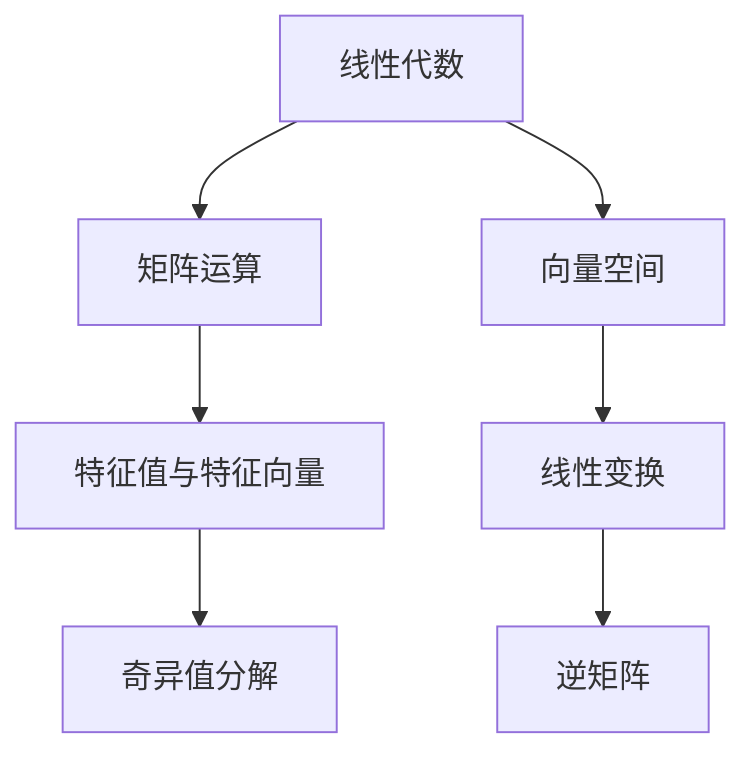

**1.2 复数与欧拉公式**

复数在信号处理中有着广泛的应用。欧拉公式，即\( e^{ix} = \cos(x) + i\sin(x) \)，是信号处理中的一个基本工具，它将指数函数、三角函数和复数紧密地联系在一起。

**伪代码：**
```python
def euler_formula(x):
    return math.cos(x) + 1j * math.sin(x)
```

**1.3 离散时间信号与系统**

离散时间信号是信号处理中的一个重要概念。它是指在离散时间点上取值的信号。离散时间系统则是对这些信号进行处理和变换的系统。

**核心概念联系图：**
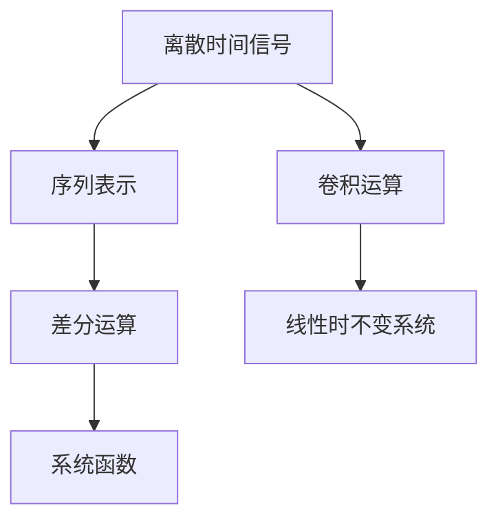

---

#### 第二章：信号处理基本概念

**2.1 信号的分类**

信号可以分为连续时间信号和离散时间信号，确定性信号和随机信号。每种类型的信号都有其独特的特性和处理方法。

**核心概念联系图：**
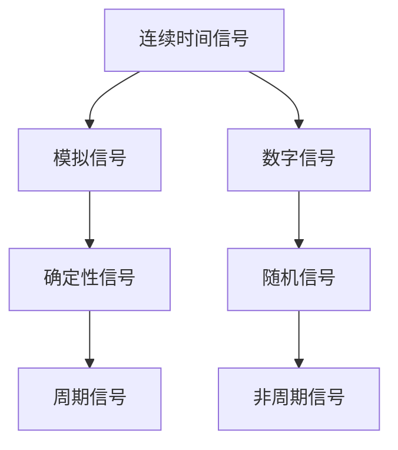

**2.2 信号的时域分析**

时域分析关注信号在时间轴上的表现。这包括信号的波形、幅度、频率等特性。通过时域分析，我们可以直观地了解信号的基本性质。

**2.3 信号的频域分析**

频域分析则将信号从时域转换到频域，以便我们分析信号的频率成分。频谱是频域分析的重要工具，它揭示了信号的频率结构。

**核心概念联系图：**
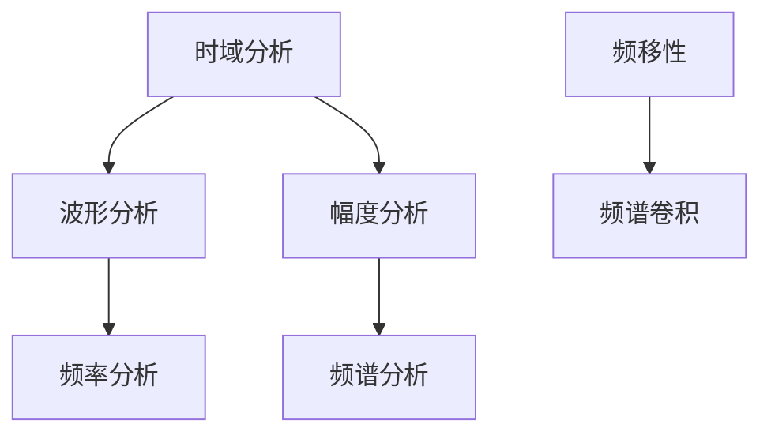

---

#### 第三章：离散时间信号与系统

**3.1 离散时间信号的表示**

离散时间信号通常用序列表示，这是一个在离散时间点上取值的函数。序列可以用来表示各种类型的信号，如语音信号、图像信号等。

**3.2 离散时间系统的特性**

离散时间系统具有线性时不变性。这意味着系统对于输入信号的线性组合保持不变，且系统的响应不随时间变化。

**3.3 离散时间系统的稳定性**

稳定性是系统设计中的一个关键因素。一个稳定的系统将输入信号的有界性保持不变。稳定性可以通过特征值来判断。

**核心概念联系图：**
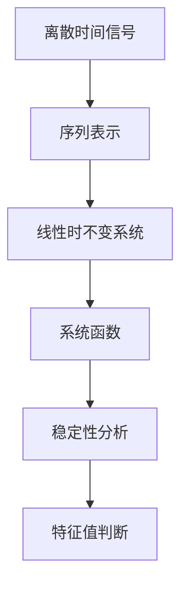

---

### 第二部分：信息提取的数学技术

#### 第四章：傅里叶变换

**4.1 傅里叶变换的概念**

傅里叶变换是一种将时域信号转换为频域信号的工具。它将一个时间函数分解为不同频率的正弦波和余弦波的叠加。

**伪代码：**
```python
def fourier_transform(signal):
    # 使用numpy库进行傅里叶变换
    return np.fft.fft(signal)
```

**4.2 傅里叶变换的性质**

傅里叶变换具有许多有用的性质，如频移性、对称性、线性等。这些性质使得傅里叶变换在信号处理中具有广泛的应用。

**4.3 快速傅里叶变换（FFT）**

快速傅里叶变换（FFT）是一种高效的计算傅里叶变换的方法。它通过分治算法将计算复杂度降低到\( O(N\log N) \)。

**核心概念联系图：**
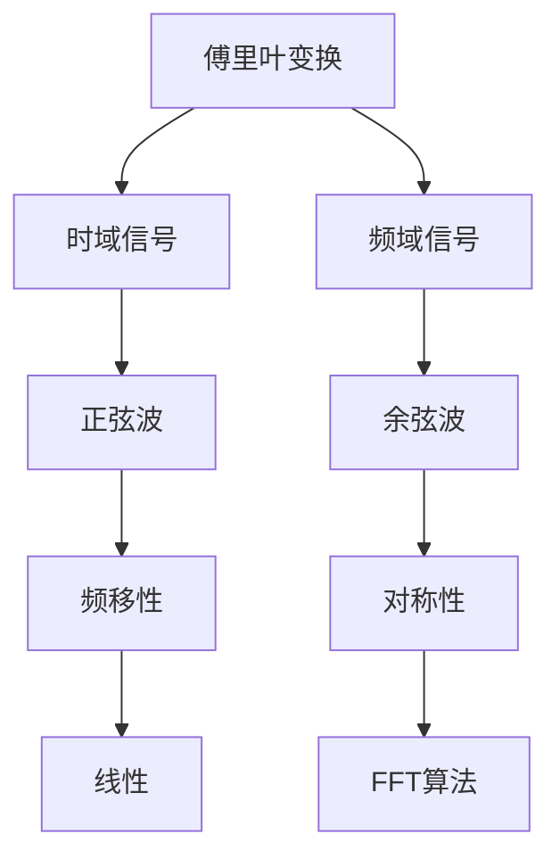

---

#### 第五章：拉普拉斯变换

**5.1 拉普拉斯变换的概念**

拉普拉斯变换是一种将时域函数转换为复平面上的函数的工具。它广泛应用于系统分析和信号处理中。

**伪代码：**
```python
def laplace_transform(signal):
    # 使用scipy库进行拉普拉斯变换
    return scypi.signal.laplace(signal)
```

**5.2 拉普拉斯变换的性质**

拉普拉斯变换具有许多有用的性质，如线性、时间移位、初始值和终值定理等。这些性质使得拉普拉斯变换在系统分析和信号处理中具有广泛的应用。

**5.3 拉普拉斯逆变换**

拉普拉斯逆变换是将拉普拉斯变换的结果转换回时域函数的工具。它通过部分分式分解和积分等方法实现。

**核心概念联系图：**
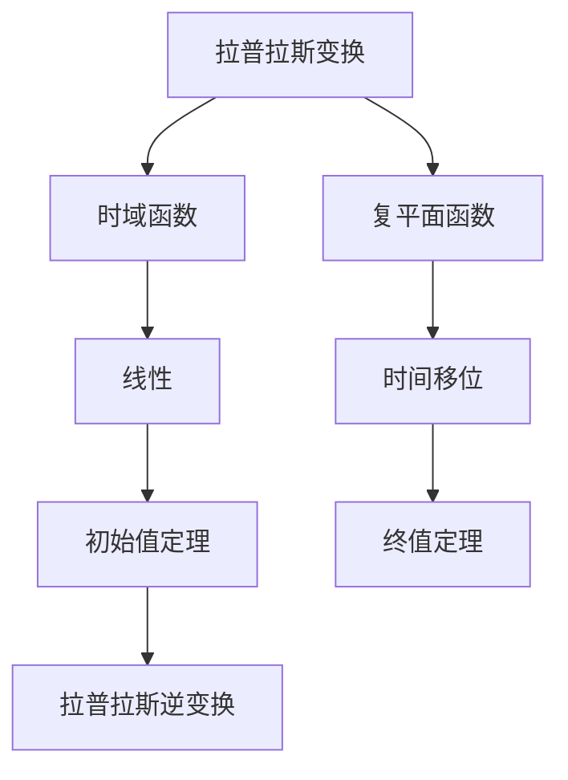

---

#### 第六章：z变换

**6.1 Z变换的概念**

Z变换是拉普拉斯变换在离散时间信号中的应用。它将离散时间信号转换为复平面上的函数。

**伪代码：**
```python
def z_transform(signal):
    # 使用scipy库进行Z变换
    return scypi.signal.ztransf
```

**6.2 Z变换的性质**

Z变换具有与拉普拉斯变换类似性质，如线性、时间移位、卷积等。这些性质使得Z变换在离散时间信号处理中具有广泛的应用。

**6.3 Z逆变换**

Z逆变换是将Z变换的结果转换回离散时间信号的工具。它通过部分分式分解和逆Z变换等方法实现。

**核心概念联系图：**
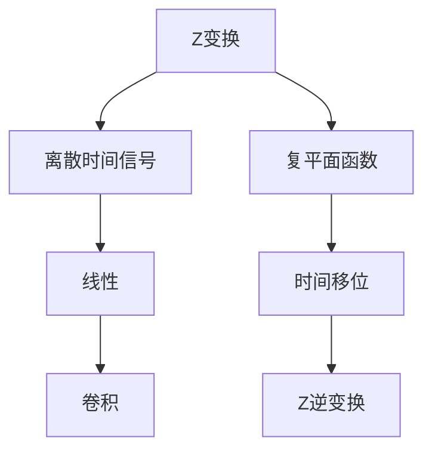

---

#### 第七章：连续与离散小波变换

**7.1 小波变换的概念**

小波变换是一种多分辨率分析工具，它通过在不同尺度上分析信号。连续小波变换和离散小波变换分别用于连续时间和离散时间信号。

**7.2 小波变换的性质**

小波变换具有多分辨率分析、时频局部化等性质。这些性质使得小波变换在信号去噪、图像压缩等领域具有广泛的应用。

**7.3 小波变换的应用**

小波变换广泛应用于信号去噪、图像压缩、时频分析等领域。这些应用展示了小波变换的强大功能和广泛适用性。

**核心概念联系图：**
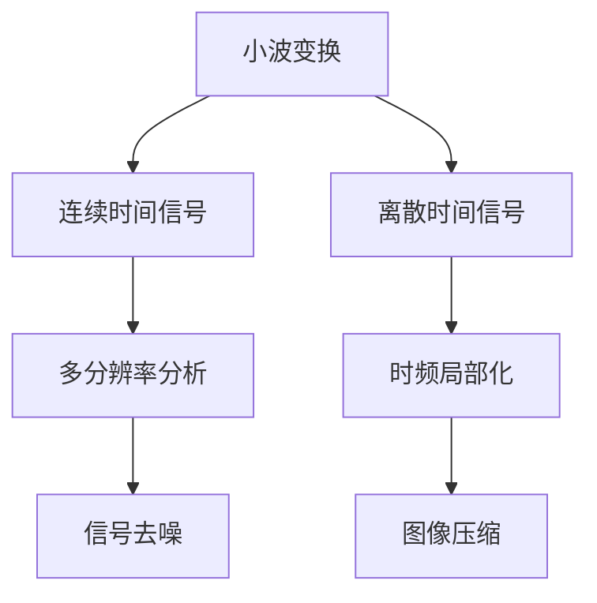

---

### 第三部分：信号处理算法与实现

#### 第八章：快速傅里叶变换（FFT）

**8.1 FFT的概念**

快速傅里叶变换（FFT）是一种高效的计算傅里叶变换的方法。它通过分治算法将计算复杂度降低到\( O(N\log N) \)。

**8.2 FFT的实现**

FFT的实现基于分治算法。它将信号分为更小的子信号，对每个子信号进行傅里叶变换，然后将结果合并。

**伪代码：**
```python
def fft(signal):
    if len(signal) <= 1:
        return signal
    else:
        # 分割信号
        even = fft(signal[0::2])
        odd = fft(signal[1::2])
        # 合并结果
        return [x + y for (x, y) in zip(even, odd)] + [x - y for (x, y) in zip(even, odd)]
```

**8.3 FFT在信号处理中的应用**

FFT在信号处理中有着广泛的应用，如图像处理、音频处理等。它通过将信号从时域转换为频域，便于分析和处理。

---

#### 第九章：信号滤波

**9.1 滤波器的基本概念**

滤波器是一种用于处理信号的设备，它可以去除信号中的不需要的频率成分。滤波器可以分为有源和无源滤波器。

**9.2 离散傅里叶变换滤波器**

离散傅里叶变换滤波器是基于FFT实现的。它通过设计适当的频率响应函数，实现对信号的有选择性的滤波。

**9.3 有限冲激响应滤波器**

有限冲激响应滤波器是一种简单的滤波器，它的响应函数在有限时间范围内非零。它通过差分方程实现，适用于线性时不变系统。

**核心概念联系图：**
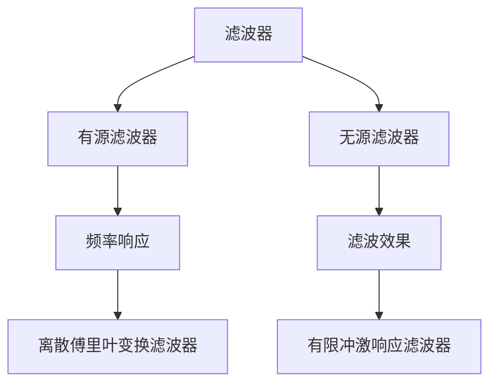

---

#### 第十章：时间序列分析

**10.1 时间序列的概念**

时间序列是一系列按时间顺序排列的数据点。它用于表示随时间变化的数据，如温度、股票价格等。

**10.2 自相关函数和功率谱**

自相关函数和功率谱是时间序列分析的重要工具。自相关函数描述了时间序列在不同时间点上的相关性，而功率谱则描述了时间序列的频率成分。

**10.3 动态时间序列模型**

动态时间序列模型，如ARMA模型，用于描述时间序列的动态特性。它通过自回归和移动平均过程描述时间序列的演变。

**核心概念联系图：**
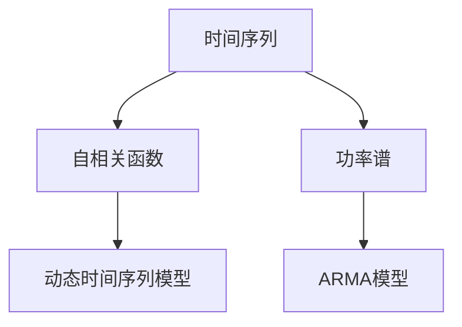

---

#### 第十一章：图像处理基础

**11.1 图像处理的基本概念**

图像处理是信号处理的一个重要分支，它涉及对图像的生成、传输和解释。图像处理包括图像滤波、边缘检测、特征提取等。

**11.2 图像滤波**

图像滤波是一种用于去除图像噪声和改善图像质量的方法。它可以通过卷积运算实现，如低通滤波器和高通滤波器。

**11.3 边缘检测和特征提取**

边缘检测和特征提取是图像处理中的关键步骤。边缘检测用于找到图像中的边缘，而特征提取则用于提取图像的显著特征。

**核心概念联系图：**
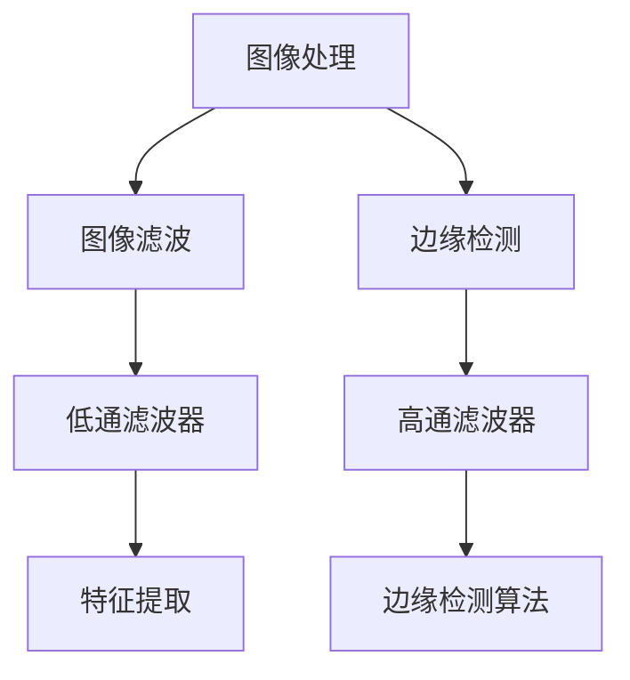

---

### 第四部分：信号处理的实际应用

#### 第十二章：通信系统中的信号处理

**12.1 通信系统中的信号处理需求**

通信系统中的信号处理需求包括信号调制、解调、噪声和干扰的抑制等。信号处理技术在这些方面起着关键作用，以确保通信的可靠性和有效性。

**12.2 调制和解调技术**

调制是将信息信号转换为适合传输的信号，而解调是将接收到的信号还原为原始信息信号。调制和解调技术包括模拟调制和数字调制。

**12.3 噪声与干扰的抑制**

噪声和干扰是通信系统中的主要问题。信号处理技术，如滤波器和自适应均衡器，用于抑制噪声和干扰，提高通信质量。

**核心概念联系图：**
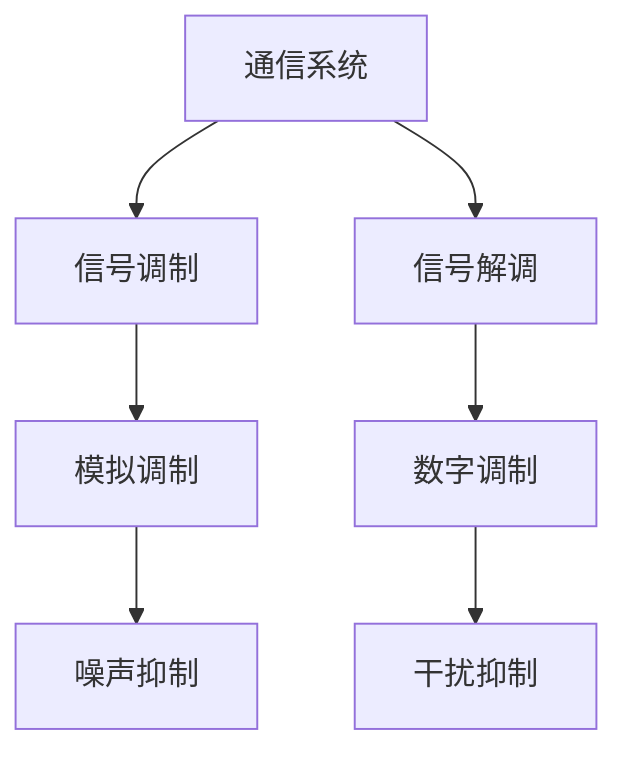

---

#### 第十三章：音频处理

**13.1 音频信号处理的基本概念**

音频信号处理涉及对声音信号的生成、传输和处理。它包括音频信号的采样、量化、编码等。

**13.2 音频滤波**

音频滤波是一种用于去除音频信号中不需要的频率成分的方法。它可以通过数字滤波器实现，如低通滤波器和高通滤波器。

**13.3 音频增强**

音频增强是提高音频信号质量的方法，如降噪、回声消除等。这些方法可以提高音频信号的清晰度和音质。

**核心概念联系图：**
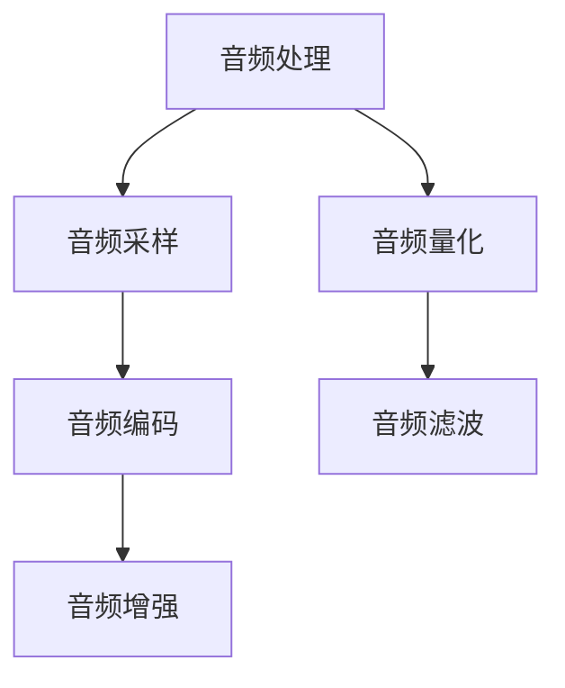

---

#### 第十四章：视频处理

**14.1 视频信号处理的基本概念**

视频信号处理涉及对图像序列的处理，以生成、传输和显示视频信号。它包括视频信号的采样、量化、编码等。

**14.2 视频滤波**

视频滤波是一种用于去除视频信号中不需要的频率成分的方法。它可以通过数字滤波器实现，如运动补偿滤波器。

**14.3 视频压缩**

视频压缩是一种用于减少视频信号数据量的方法。它通过去除冗余信息、降低分辨率等手段实现。

**核心概念联系图：**
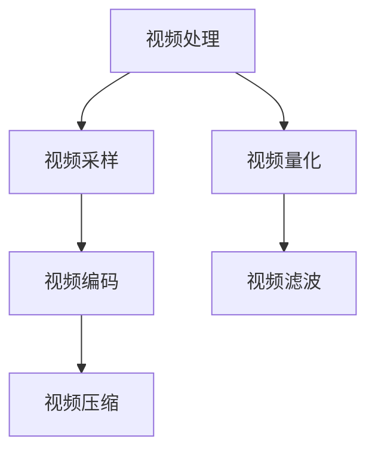

---

#### 第十五章：医学信号处理

**15.1 医学信号处理的基本概念**

医学信号处理涉及对生物信号的处理，如心电信号、脑电信号等。它用于医疗诊断、疾病监测和治疗评估。

**15.2 心电信号分析**

心电信号分析是一种重要的医学信号处理技术，它用于诊断心律失常和心脏疾病。它包括心电信号的滤波、特征提取和诊断分类。

**15.3 脑电信号分析**

脑电信号分析是一种用于研究大脑活动的技术。它包括脑电信号的滤波、特征提取和认知评估。

**核心概念联系图：**
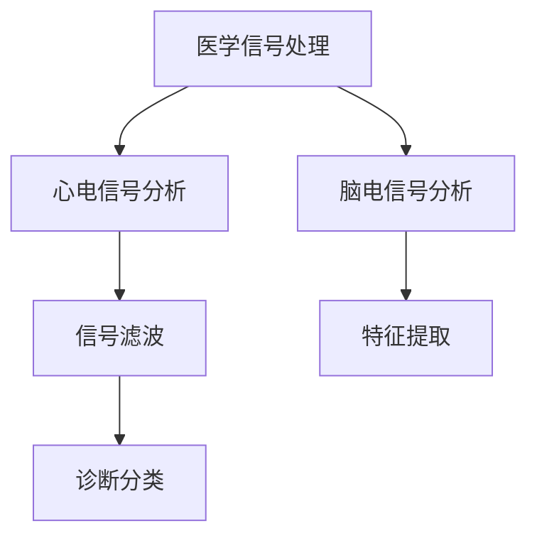

---

### 结论

信号处理是现代信息技术中不可或缺的一部分。数学作为信号处理的基础，为信息提取提供了强大的工具。通过本文的逐步分析，我们深入了解了傅里叶变换、拉普拉斯变换、小波变换等数学工具的核心概念和应用。这些技术不仅广泛应用于通信系统、音频处理、视频处理等领域，还在医学信号处理中发挥着关键作用。希望本文能帮助读者更好地理解信号处理技术，并在实际应用中取得更好的效果。

---

### 作者信息

作者：AI天才研究院/AI Genius Institute & 禅与计算机程序设计艺术 /Zen And The Art of Computer Programming

