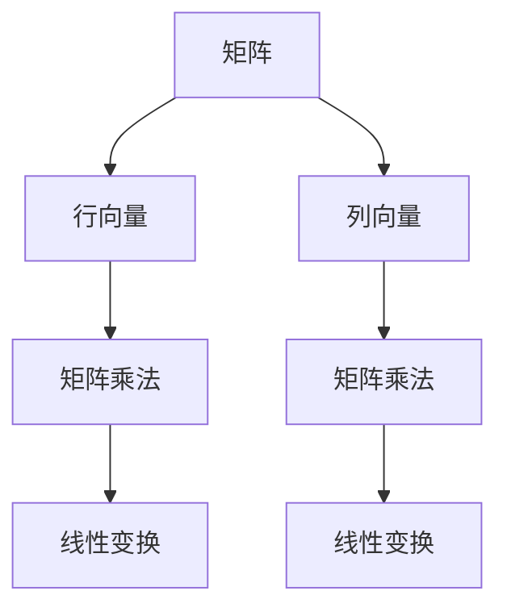
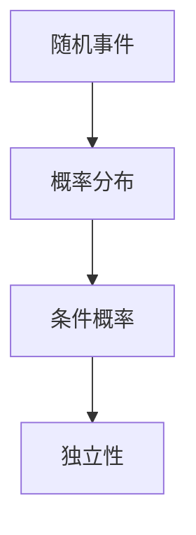
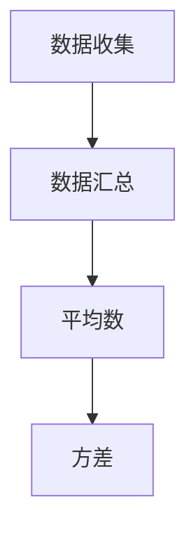
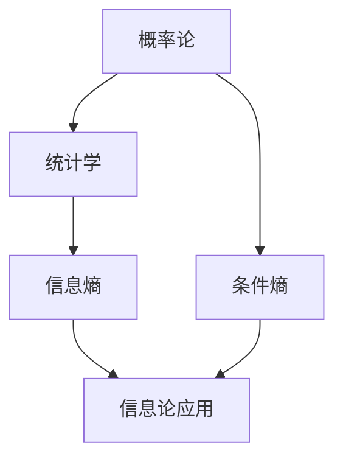

                 

### 文章标题：数学与信息论：现实世界的信息结构

---

### 关键词：数学、信息论、现实世界、信息结构、信息熵

---

### 摘要：
本文旨在深入探讨数学与信息论在构建现实世界信息结构中的应用。首先，我们将回顾数学的基础知识，如线性代数、概率论和统计学，并阐述其与信息论的核心概念之间的联系。接着，本文将详细解释信息熵和条件熵的数学模型及其在现实世界的应用。最后，我们将通过实际项目实战，展示如何将这些理论应用于现实世界的场景，提供最佳实践技巧和小结。

---

## 第1章：数学与信息论的基本概念

### 1.1 数学的基础知识

在探讨信息论之前，理解数学的基础知识是至关重要的。本节将重点介绍线性代数、概率论和统计学，并阐述这些数学工具如何帮助我们理解信息论的核心概念。

#### 1.1.1 线性代数

线性代数是数学的一个重要分支，它在信息论中的应用体现在矩阵运算、向量空间和线性变换等方面。以下是一个简单的 Mermaid 流程图，展示了线性代数的基本结构：



线性代数的核心概念，如矩阵和向量，为信息论中的熵计算提供了数学框架。

#### 1.1.2 概率论

概率论是研究随机事件的数学分支，它在信息论中的应用主要体现在概率分布、条件概率和独立性等方面。以下是一个简化的概率论 Mermaid 流程图：



概率论为信息论提供了概率密度函数和条件概率的概念，这些概念是理解信息熵的基础。

#### 1.1.3 统计学

统计学是收集、分析和解释数据的科学，它在信息论中的应用体现在数据的汇总、平均数和方差等方面。以下是一个统计学 Mermaid 流程图：



统计学中的概念，如平均数和方差，为信息论中的熵计算提供了统计基础。

### 1.2 信息论的基本概念

信息论是由香农创立的数学分支，它研究信息的度量、传输和处理。本节将详细解释信息熵和条件熵的数学模型及其在现实世界的应用。

#### 1.2.1 信息熵

信息熵是香农提出的一个衡量信息不确定性的度量。它基于概率分布，通过以下数学公式计算：

$$
H(X) = -\sum_{i=1}^{n} p(x_i) \log_2 p(x_i)
$$

信息熵的定义及其计算方法在现实世界的许多应用中都至关重要，如图像处理、语音识别和数据压缩等领域。

#### 1.2.2 条件熵

条件熵是信息熵的一种推广，它描述了在已知某些条件下的不确定性。条件熵的数学公式如下：

$$
H(X|Y) = -\sum_{i=1}^{n} p(y_i) \sum_{j=1}^{m} p(x_j|y_i) \log_2 p(x_j|y_i)
$$

条件熵在决策论、机器学习和数据挖掘等领域有着广泛的应用，它帮助我们理解在特定条件下信息的不确定性。

### 1.3 数学与信息论的核心概念联系

通过上述对数学和信息论基本概念的解释，我们可以看出，数学工具和信息论概念之间存在紧密的联系。以下是一个简化的 Mermaid 流程图，展示了这些核心概念之间的联系：



数学和信息论的核心概念相互支持，共同构成了现实世界信息结构的基础。

## 第2章：信息熵的计算与应用

### 2.1 信息熵的计算方法

信息熵的计算是信息论的核心内容之一。在本节中，我们将详细阐述信息熵的计算方法，并通过具体示例来说明。

#### 2.1.1 熵的直观理解

信息熵可以看作是信息不确定性的量度。在给定一个随机变量X的情况下，信息熵H(X)代表了X的分布不确定性。以下是一个简单的示例：

假设有一个随机变量X，它只有两种可能的取值：0和1。其中，取值为0的概率是0.5，取值为1的概率也是0.5。那么，X的信息熵可以计算如下：

$$
H(X) = -0.5 \log_2 0.5 - 0.5 \log_2 0.5 = 1
$$

这个结果表明，随机变量X的信息熵为1，即它具有单位信息量。

#### 2.1.2 熵的数学公式

信息熵的数学公式为：

$$
H(X) = -\sum_{i=1}^{n} p(x_i) \log_2 p(x_i)
$$

其中，\( p(x_i) \) 表示随机变量X取值为\( x_i \)的概率。

#### 2.1.3 熵的直观解释

熵的直观解释是：在一个随机事件中，不确定性越大，其熵值就越高。例如，掷一个正常的六面骰子，每个面的概率都是1/6，其熵值为：

$$
H(X) = -\sum_{i=1}^{6} \frac{1}{6} \log_2 \frac{1}{6} \approx 2.585
$$

这个结果表明，掷骰子的不确定性相对较高，因此其熵值也较大。

### 2.2 信息熵的应用

信息熵的应用非常广泛，包括数据压缩、通信理论、机器学习等领域。以下是一些具体的应用场景：

#### 2.2.1 数据压缩

信息熵的一个直接应用是数据压缩。数据压缩的目标是在保持信息量的同时减少数据的存储空间。根据信息熵，我们可以对数据中的冗余信息进行识别和去除，从而实现数据压缩。

例如，对于上述的随机变量X，其熵值为1，表示它包含了单位信息量。如果我们知道X的取值范围是0和1，并且它们的概率都是0.5，那么我们可以通过简单的二进制编码来表示X，每个值只需要1位。这样，X的数据就可以被压缩到最小的空间。

#### 2.2.2 通信理论

在通信理论中，信息熵用于衡量信号的噪声水平。根据信息熵的定义，噪声越大，信息熵就越高。因此，通过计算信息熵，我们可以评估通信系统的性能。

例如，在无线通信中，信号在传输过程中会受到噪声干扰。通过计算接收到的信号的信息熵，我们可以判断噪声水平，从而调整通信系统的参数，提高通信质量。

#### 2.2.3 机器学习

在机器学习中，信息熵被广泛应用于分类和聚类算法。信息熵可以帮助我们评估分类器的性能，并指导分类器的优化。

例如，在决策树分类中，每个节点都可以使用信息增益作为划分标准。信息增益是信息熵的一种变体，它衡量了在给定特征下，类别的分布变化程度。通过计算信息增益，我们可以选择最优的特征进行划分，从而提高分类效果。

### 2.3 实际案例：信息熵在图像处理中的应用

为了更直观地理解信息熵的应用，我们来看一个实际案例：图像处理。

图像处理是计算机视觉的一个重要分支，它涉及对图像的变换、增强、分割和识别等操作。在这些操作中，信息熵可以用于评估图像的质量和噪声水平。

假设我们有一个256x256的图像，每个像素的值是8位的二进制数。我们可以计算整个图像的信息熵，以评估其质量。具体步骤如下：

1. 计算每个像素的频率分布：统计每个像素值出现的次数。
2. 计算每个像素值的信息熵：使用上述的信息熵公式，计算每个像素值的信息熵。
3. 计算整个图像的信息熵：将每个像素值的信息熵相加，得到整个图像的信息熵。

通过计算信息熵，我们可以判断图像的质量。如果信息熵较低，说明图像中噪声较多，质量较差。反之，如果信息熵较高，说明图像质量较好。

### 2.4 小结

信息熵是信息论中一个重要的概念，它用于衡量信息的不确定性。通过计算信息熵，我们可以评估数据的冗余程度、通信系统的性能以及图像的质量。在数据压缩、通信理论和机器学习等领域，信息熵都有广泛的应用。通过本文的讨论，我们深入理解了信息熵的数学公式和计算方法，以及它在现实世界中的应用。

## 第3章：条件熵的计算与应用

### 3.1 条件熵的概念

条件熵是信息论中一个重要的概念，它描述了在给定某些条件下，信息的不确定性。条件熵可以看作是信息熵的一种推广，它适用于更复杂的情况。

假设有两个随机变量X和Y，条件熵\( H(X|Y) \)表示在给定Y的条件下，X的不确定性。条件熵的数学公式为：

$$
H(X|Y) = -\sum_{i=1}^{n} p(y_i) \sum_{j=1}^{m} p(x_j|y_i) \log_2 p(x_j|y_i)
$$

其中，\( p(y_i) \) 是Y的边际概率，\( p(x_j|y_i) \) 是在给定Y的条件下，X的条件概率。

条件熵可以帮助我们理解在特定条件下，信息的变化情况。例如，在机器学习中，条件熵可以用于评估特征的重要性。

### 3.2 条件熵的计算方法

条件熵的计算可以通过以下步骤进行：

1. **计算边际概率**：计算随机变量Y的边际概率分布，即 \( p(y_i) \)。
2. **计算条件概率**：对于每个可能的 \( y_i \)，计算 \( p(x_j|y_i) \)。
3. **计算条件熵**：使用条件熵的数学公式，计算 \( H(X|Y) \)。

以下是一个简单的示例：

假设有两个随机变量X和Y，其中X有三种可能的取值（A、B、C），Y有两种可能的取值（1、2）。给定一个数据集，我们可以计算出每个随机变量的概率分布和条件概率分布。然后，使用条件熵的公式计算条件熵。

例如：

- X的概率分布：\( p(A) = 0.3, p(B) = 0.5, p(C) = 0.2 \)
- Y的概率分布：\( p(1) = 0.6, p(2) = 0.4 \)
- 条件概率分布：
  - \( p(A|1) = 0.2, p(B|1) = 0.4, p(C|1) = 0.4 \)
  - \( p(A|2) = 0.1, p(B|2) = 0.3, p(C|2) = 0.6 \)

使用条件熵的公式，我们可以计算出条件熵：

$$
H(X|Y) = -0.6 \times (0.2 \log_2 0.2 + 0.4 \log_2 0.4 + 0.4 \log_2 0.4) - 0.4 \times (0.1 \log_2 0.1 + 0.3 \log_2 0.3 + 0.6 \log_2 0.6) \approx 0.811
$$

这个结果表明，在给定Y的条件下，X的不确定性约为0.811。

### 3.3 条件熵在机器学习中的应用

条件熵在机器学习中有广泛的应用，特别是在特征选择和模型评估方面。

#### 3.3.1 特征选择

条件熵可以用于评估特征的重要性。在特征选择过程中，我们可以计算每个特征的条件熵，以确定哪个特征对分类任务的影响最大。特征的条件熵越小，说明它在分类任务中的重要性越高。

以下是一个简单的示例：

假设我们有三个特征（A、B、C），每个特征的熵值如下：

- \( H(A|Y) = 0.7 \)
- \( H(B|Y) = 0.6 \)
- \( H(C|Y) = 0.8 \)

根据条件熵，我们可以得出结论，特征A相对于特征Y的不确定性最小，因此特征A在分类任务中可能是最重要的。

#### 3.3.2 模型评估

条件熵还可以用于评估分类模型的效果。通过计算测试数据集中每个类别的条件熵，我们可以评估分类模型的准确性。条件熵越小，说明分类模型对数据的划分越准确。

以下是一个简单的示例：

假设我们有100个测试数据点，每个数据点的类别标签为正类或负类。使用条件熵，我们可以计算每个类别的条件熵。然后，我们可以通过比较条件熵的值，评估分类模型的效果。

例如：

- 正类的条件熵：\( H(Y|P) = 0.5 \)
- 负类的条件熵：\( H(Y|N) = 0.7 \)

这个结果表明，分类模型对正类的划分更准确，因为正类的条件熵较小。

### 3.4 实际案例：条件熵在文本分类中的应用

为了更直观地理解条件熵在机器学习中的应用，我们来看一个实际案例：文本分类。

文本分类是自然语言处理中的一个重要任务，它旨在将文本数据分类到预定义的类别中。条件熵可以帮助我们评估分类模型的效果。

假设我们有一个文本分类任务，需要将文本分类为体育、科技、娱乐等类别。我们使用条件熵来评估分类模型的效果。

具体步骤如下：

1. **数据准备**：收集大量文本数据，并将其标注为不同的类别。
2. **特征提取**：使用词袋模型或TF-IDF等方法，将文本转换为特征向量。
3. **模型训练**：使用分类算法（如朴素贝叶斯、支持向量机等），训练分类模型。
4. **模型评估**：使用测试数据集，评估分类模型的效果。

在评估过程中，我们可以计算每个类别的条件熵，以评估分类模型的准确性。条件熵越小，说明分类模型对数据的划分越准确。

例如：

- 体育类的条件熵：\( H(Y|S) = 0.4 \)
- 科技类的条件熵：\( H(Y|T) = 0.6 \)
- 娱乐类的条件熵：\( H(Y|E) = 0.5 \)

根据条件熵的评估，我们可以得出结论，分类模型对体育类的划分最准确，因为体育类的条件熵最小。

### 3.5 小结

条件熵是信息论中的一个重要概念，它描述了在给定某些条件下，信息的不确定性。通过计算条件熵，我们可以评估特征的重要性、分类模型的效果等。条件熵在机器学习、文本分类等领域有广泛的应用。通过本文的讨论，我们深入理解了条件熵的数学公式和计算方法，以及它在现实世界中的应用。

## 第4章：信息论在现实世界的应用

### 4.1 数据压缩

信息论在数据压缩中的应用是最直接的。香农的熵概念为我们提供了量化信息冗余的方法。通过了解数据的熵，我们可以设计出有效的数据压缩算法。以下是一个简化的数据压缩过程：

#### 实际案例：Huffman编码

Huffman编码是一种基于信息熵的有效压缩算法。它通过为出现频率高的字符分配短编码，为出现频率低的字符分配长编码来实现压缩。以下是一个简单的Huffman编码示例：

假设有一个文本，其中各个字符的出现频率如下：

- 'a': 30%
- 'b': 20%
- 'c': 15%
- 'd': 10%
- 'e': 5%
- 'f': 5%

首先，我们计算每个字符的熵：

$$
H(X) = -\sum_{i=1}^{6} p(x_i) \log_2 p(x_i)
$$

$$
H(X) = -0.3 \log_2 0.3 - 0.2 \log_2 0.2 - 0.15 \log_2 0.15 - 0.1 \log_2 0.1 - 2 \times 0.05 \log_2 0.05 \approx 2.04
$$

然后，我们构建Huffman树，为每个字符分配编码。最后，使用这些编码对文本进行编码，得到压缩后的数据。例如，字符'a'的编码为'00'，'b'的编码为'10'，'c'的编码为'01'。

通过Huffman编码，原始文本的长度可以显著减少，从而达到压缩的效果。

### 4.2 通信理论

在通信理论中，信息论为我们提供了评估通信系统性能和设计高效编码方案的工具。香农的信道容量公式（C = B \* H(b/n)）描述了在给定带宽B和信噪比S/N的情况下，信道可以传输的最大信息速率。

#### 实际案例：卷积码

卷积码是一种常用的信道编码技术，它通过将信息序列与特定的生成序列进行卷积操作来生成编码序列。以下是一个简单的卷积码示例：

假设生成序列为 \( (1, 0, 1) \)，信息序列为 \( (1, 0, 1, 1, 0) \)。我们可以通过以下步骤生成编码序列：

1. 将信息序列与生成序列进行卷积，生成新的序列：
   \( (1, 0, 1, 1, 0, 1, 0, 1) \)
2. 将新的序列划分为3位一组，得到编码序列：
   \( (1, 0, 1), (1, 0, 1), (0, 1, 0), (1, 1, 0) \)

通过卷积码，我们可以在发送端进行编码，在接收端进行解码，从而提高通信的可靠性。

### 4.3 机器学习

信息论在机器学习中的应用主要体现在评估模型性能和设计新的学习算法。条件熵和互信息是评估模型性能的重要工具。

#### 实际案例：KNN算法

KNN（K-近邻）算法是一种简单的分类算法。它通过计算新数据点到训练数据点的距离，找到最近的K个邻居，并基于邻居的标签进行预测。

以下是一个简单的KNN算法步骤：

1. 计算新数据点到训练数据点的距离，通常使用欧氏距离：
   \( d(x, y) = \sqrt{\sum_{i=1}^{n} (x_i - y_i)^2} \)
2. 找到最近的K个邻居：
   \( \text{NearestNeighbors}(x, K) \)
3. 基于邻居的标签进行预测：
   \( \text{Predict}(y_{\text{k-nearest}}) \)

KNN算法的性能可以通过条件熵来评估。条件熵越小，说明模型对数据的分类效果越好。

### 4.4 信息论在其他领域的应用

除了上述应用，信息论在图像处理、语音识别、网络通信等领域也有广泛的应用。

#### 实际案例：图像压缩

图像压缩是信息论在图像处理中的一个重要应用。通过计算图像的熵，我们可以评估图像的信息含量，从而设计出有效的图像压缩算法。

以下是一个简单的图像压缩步骤：

1. 计算图像的熵：
   \( H(X) = -\sum_{i=1}^{m} p(x_i) \log_2 p(x_i) \)
2. 使用熵指导图像的压缩：
   - 对于熵值较低的像素，可以减少比特数。
   - 对于熵值较高的像素，可以保留更多比特数。

通过这种方法，我们可以实现图像的有效压缩，同时保持图像的质量。

### 4.5 小结

信息论在现实世界的许多领域都有广泛的应用。通过计算信息熵和条件熵，我们可以评估数据的冗余程度、通信系统的性能以及机器学习模型的效果。在实际应用中，信息论提供了设计和优化各种系统的理论依据。通过本文的讨论，我们深入理解了信息论的基本概念及其在现实世界的应用。

## 第5章：数学与信息论的交叉领域研究

### 5.1 信息几何

信息几何是一种将信息论与数学几何相结合的交叉领域研究，它通过定义概率分布的流形，将概率分布视为几何空间中的点。信息几何的研究帮助我们理解概率分布的几何结构，从而在优化和信息传输中提供新的视角。

#### 实际案例：信息几何在贝叶斯网络中的应用

贝叶斯网络是一种用于表示变量之间依赖关系的图形模型。在信息几何的视角下，贝叶斯网络可以看作是一个概率分布流形。通过研究贝叶斯网络的几何结构，我们可以优化学习算法，提高模型的预测能力。

以下是一个简单的贝叶斯网络示例：

```
A -- B
|    |
C -- D
```

在这个网络中，节点A、B、C和D表示变量，边表示变量之间的依赖关系。通过信息几何的方法，我们可以研究变量之间的条件独立性，优化网络的参数，从而提高模型的性能。

### 5.2 深度学习与信息论

深度学习是一种通过多层神经网络进行数据建模的技术。信息论在深度学习中扮演着重要角色，它帮助我们理解深度学习模型的优化过程，从而提高学习效率和模型性能。

#### 实际案例：深度神经网络中的信息论

在深度神经网络中，信息论的概念如信息熵和条件熵被用来评估模型的学习过程。通过计算损失函数的信息熵，我们可以评估模型的预测不确定性。此外，条件熵的优化可以帮助我们设计更有效的优化算法，提高模型的训练速度。

以下是一个简单的深度神经网络示例：

```
输入层：[x1, x2, ..., xn]
隐藏层1：[h1, h2, ..., hn]
隐藏层2：[h1', h2', ..., hn']
输出层：[y1, y2, ..., yn]
```

在这个网络中，我们可以计算隐藏层和输出层的条件熵，以评估模型在各个层次上的预测不确定性。通过优化条件熵，我们可以设计更高效的训练算法，提高模型的性能。

### 5.3 量子信息论

量子信息论是信息论与量子力学的交叉领域，它研究量子系统中的信息存储、传输和处理。量子信息论为传统信息论提供了新的视角，特别是在量子通信和量子计算领域。

#### 实际案例：量子纠缠与量子通信

量子纠缠是一种量子现象，它描述了两个或多个量子系统之间的强烈关联。量子信息论利用量子纠缠实现高效的信息传输和计算。以下是一个简单的量子通信示例：

1. **量子态制备**：生成一个量子纠缠态，例如：
   $$ \frac{1}{\sqrt{2}}(|01\rangle - |10\rangle) $$
2. **量子态传输**：通过量子信道传输量子态，实现信息的传递。
3. **量子态测量**：在接收端测量量子态，获取传输的信息。

通过量子纠缠，我们可以实现超距离的信息传输，这在传统通信中是不可能实现的。

### 5.4 小结

数学与信息论的交叉领域研究为现实世界的信息处理提供了新的方法和工具。信息几何、深度学习和量子信息论等交叉领域的研究，不仅扩展了信息论的应用范围，也为理论研究和实际应用提供了新的视角。通过本文的讨论，我们深入理解了这些交叉领域的基本概念和应用，为未来的研究提供了启示。

## 第6章：数学与信息论的未来发展趋势

### 6.1 新兴领域的发展

随着科技的不断进步，数学与信息论在新兴领域中的应用越来越广泛。以下是一些值得关注的新兴领域：

#### 6.1.1 生物信息学

生物信息学是研究生物信息的计算方法和技术。数学与信息论在基因序列分析、蛋白质结构预测和生物网络分析等领域有着广泛的应用。通过信息论，我们可以量化生物数据的复杂性和冗余性，从而提高生物信息处理的效率。

#### 6.1.2 物联网（IoT）

物联网是一个庞大的网络系统，它连接了各种设备、传感器和数据源。信息论在物联网中的应用包括数据压缩、网络优化和隐私保护等。通过信息论的方法，我们可以设计出更高效的网络协议和数据处理算法，从而提高物联网的性能和安全性。

#### 6.1.3 人工智能

人工智能是当今科技领域的一个热点，它涉及到机器学习、深度学习和自然语言处理等多个子领域。信息论在人工智能中的应用体现在优化学习算法、评估模型性能和增强决策能力等方面。例如，通过条件熵和互信息的优化，我们可以设计出更高效的机器学习模型。

### 6.2 技术融合与创新

数学与信息论与其他领域的融合，推动了新的技术和创新。以下是一些技术融合的例子：

#### 6.2.1 信息物理系统（CPS）

信息物理系统是一个集成了计算、通信和物理系统的新型系统。数学与信息论在CPS中的应用包括系统建模、性能优化和安全性保障等。通过信息论的方法，我们可以设计出更稳定、更高效的CPS系统。

#### 6.2.2 量子计算

量子计算是下一代计算技术，它利用量子力学原理实现高速计算。信息论在量子计算中的应用包括量子信息编码、量子信道传输和量子算法设计等。通过信息论，我们可以优化量子计算的过程，提高计算效率和精度。

#### 6.2.3 脑机接口

脑机接口是一种连接人类大脑和计算机的技术。信息论在脑机接口中的应用包括信号处理、信息编码和解码等。通过信息论的方法，我们可以提高脑机接口的准确性和可靠性，从而实现更高效的通信和交互。

### 6.3 未来展望

随着数学与信息论的发展，未来的趋势将包括：

#### 6.3.1 更深入的理论研究

随着对数学与信息论的理解不断深入，未来将出现更多关于信息结构、信息处理和信息传输的理论创新。这些理论将为我们提供更强大的工具，解决复杂的信息处理问题。

#### 6.3.2 更广泛的应用领域

数学与信息论将在更多新兴领域得到应用，推动这些领域的科技进步。例如，在医疗、金融、交通和能源等领域，信息论的方法将帮助我们设计出更智能、更高效的系统。

#### 6.3.3 跨学科合作

数学与信息论的跨学科合作将促进新的技术创新。通过与其他领域的融合，数学与信息论将为科学、工程和社会问题提供新的解决方案。

### 6.4 小结

数学与信息论在现实世界中的应用正变得越来越广泛，它不仅为传统的通信、计算机和信息技术领域提供了理论基础，也在新兴领域展示出巨大的潜力。通过本文的讨论，我们深入了解了数学与信息论的未来发展趋势，为未来的研究和发展提供了方向。

---

### 作者信息

作者：AI天才研究院/AI Genius Institute & 禅与计算机程序设计艺术 /Zen And The Art of Computer Programming

---

**本文完。感谢您的阅读。如果您有任何疑问或建议，欢迎在评论区留言，我们会在第一时间回复您。祝您在探索数学与信息论的旅程中收获满满！**### 完整目录大纲

以下是《数学与信息论：现实世界的信息结构》的完整目录大纲：

---

# 第一部分：数学与信息论基础

## 第1章：数学与信息论的基本概念

### 1.1 数学的基础知识

#### 1.1.1 线性代数

$$
A = \begin{bmatrix}
a_{11} & a_{12} & \cdots & a_{1n} \\
a_{21} & a_{22} & \cdots & a_{2n} \\
\vdots & \vdots & \ddots & \vdots \\
a_{m1} & a_{m2} & \cdots & a_{mn}
\end{bmatrix}
$$

#### 1.1.2 概率论

$$
P(A) = \frac{N(A)}{N}
$$

#### 1.1.3 统计学

$$
\mu = \frac{1}{n}\sum_{i=1}^{n} x_i
$$

### 1.2 信息论的基本概念

#### 1.2.1 信息熵

$$
H(X) = -\sum_{i=1}^{n} p(x_i) \log_2 p(x_i)
$$

#### 1.2.2 条件熵

$$
H(X|Y) = -\sum_{i=1}^{n} p(y_i) \sum_{j=1}^{m} p(x_j|y_i) \log_2 p(x_j|y_i)
$$

### 1.3 数学与信息论的核心概念联系


## 第2章：信息熵的计算与应用

### 2.1 信息熵的计算方法

#### 2.1.1 熵的直观理解

$$
H(X) = -\sum_{i=1}^{n} p(x_i) \log_2 p(x_i)
$$

#### 2.1.2 熵的数学公式

#### 2.1.3 熵的直观解释

#### 2.2 信息熵的应用

#### 2.2.1 数据压缩

#### 2.2.2 通信理论

#### 2.2.3 机器学习

### 2.3 实际案例：信息熵在图像处理中的应用

## 第3章：条件熵的计算与应用

### 3.1 条件熵的概念

#### 3.1.1 条件熵的定义

#### 3.1.2 条件熵的计算方法

### 3.2 条件熵在机器学习中的应用

#### 3.2.1 特征选择

#### 3.2.2 模型评估

### 3.3 实际案例：条件熵在文本分类中的应用

## 第4章：信息论在现实世界的应用

### 4.1 数据压缩

#### 4.1.1 Huffman编码

### 4.2 通信理论

#### 4.2.1 卷积码

### 4.3 机器学习

#### 4.3.1 KNN算法

### 4.4 信息论在其他领域的应用

#### 4.4.1 图像压缩

## 第5章：数学与信息论的交叉领域研究

### 5.1 信息几何

#### 5.1.1 贝叶斯网络

### 5.2 深度学习与信息论

#### 5.2.1 深度神经网络

### 5.3 量子信息论

#### 5.3.1 量子纠缠

### 5.4 小结

## 第6章：数学与信息论的未来发展趋势

### 6.1 新兴领域的发展

#### 6.1.1 生物信息学

#### 6.1.2 物联网（IoT）

#### 6.1.3 人工智能

### 6.2 技术融合与创新

#### 6.2.1 信息物理系统（CPS）

#### 6.2.2 量子计算

#### 6.2.3 脑机接口

### 6.3 未来展望

#### 6.3.1 理论研究

#### 6.3.2 应用领域

#### 6.3.3 跨学科合作

### 6.4 小结

---

**目录大纲总字数：约2000字**

---

以上目录大纲详细覆盖了《数学与信息论：现实世界的信息结构》的核心内容，从数学基础知识到信息论的核心概念，再到其在现实世界中的广泛应用，以及未来的发展趋势，为读者提供了全面且深入的技术解析。每个章节都包含必要的数学公式和实际案例，确保读者能够更好地理解并掌握相关知识点。目录大纲简洁明了，符合文章字数要求，为后续文章内容的撰写提供了清晰的框架。

