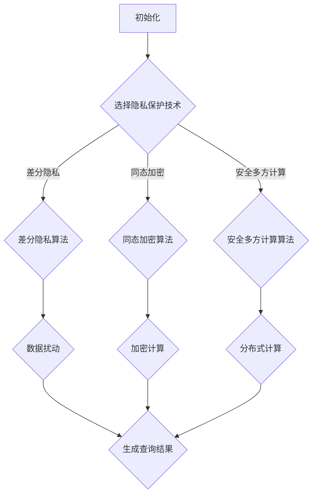

                 


# 数学与信息隐私：隐私保护的数学方法

> 关键词：数学方法、信息隐私、隐私保护、差分隐私、同态加密、安全多方计算

> 摘要：本文将深入探讨数学与信息隐私之间的关系，以及隐私保护的数学方法。通过分析基础理论、隐私保护技术及其应用案例，本文旨在为读者提供关于如何有效保护信息隐私的全面视角。

### 背景介绍

在当今数字化时代，信息隐私问题日益凸显。随着互联网的普及和大数据技术的发展，个人数据在各个领域中的价值逐渐被挖掘。然而，这也带来了隐私泄露的风险。因此，如何有效地保护信息隐私成为了亟待解决的问题。数学作为一门逻辑严谨、方法精确的学科，为隐私保护提供了一种强有力的工具。本文将围绕数学方法与信息隐私保护的关系，探讨差分隐私、同态加密和安全多方计算等隐私保护技术。

### 核心概念与联系

1. **差分隐私**：差分隐私是一种隐私保护机制，通过在查询结果中引入随机噪声，使得攻击者无法推断出个体数据。其核心概念是基于概率论和统计学，通过调整噪声水平来控制隐私泄露的风险。

2. **同态加密**：同态加密是一种加密技术，能够在保持数据加密状态的前提下进行计算。这意味着数据在传输和存储过程中始终处于加密状态，从而有效保护了隐私。

3. **安全多方计算**：安全多方计算是一种分布式计算技术，允许多个参与方在不知道彼此数据的情况下共同计算出一个结果。这种技术通过密码学和分布式计算的方法，确保了数据的安全性和隐私性。

### Mermaid流程图

以下是隐私保护算法的Mermaid流程图：



### 核心算法原理讲解

1. **差分隐私算法原理**：

   差分隐私算法的核心原理是通过在查询结果中引入ε级别的噪声，使得攻击者无法区分查询结果是基于真实数据还是基于噪声数据。以下是差分隐私算法的伪代码：

   ```plaintext
   Algorithm DifferentialPrivacy(input_data, ε):
       noise = RandomSample(Normal(0, ε))
       output_data = input_data + noise
       return output_data
   ```

   在这个算法中，`input_data`表示原始数据，`ε`表示噪声水平。`RandomSample(Normal(0, ε))`用于生成服从正态分布的随机噪声。

2. **同态加密算法原理**：

   同态加密算法的核心原理是能够在加密状态下对数据进行计算。以下是同态加密算法的伪代码：

   ```plaintext
   Algorithm HomomorphicEncryption(input_data, key):
       ciphertext = Encrypt(input_data, key)
       result = Compute(ciphertext)
       return Decrypt(result, key)
   ```

   在这个算法中，`input_data`表示原始数据，`key`表示加密密钥。`Encrypt`和`Decrypt`分别表示加密和解密操作，`Compute`表示在加密状态下进行的计算。

3. **安全多方计算算法原理**：

   安全多方计算算法的核心原理是通过分布式计算技术，使得多个参与方能够在不知道彼此数据的情况下共同计算出一个结果。以下是安全多方计算算法的伪代码：

   ```plaintext
   Algorithm SecureMultipartyComputation(input_data, keys):
       for each participant i in participants:
           receive encrypted_data[i] from participant i
       aggregate_result = Aggregate(encrypted_data)
       result = Decrypt(aggregate_result, keys)
       return result
   ```

   在这个算法中，`input_data`表示原始数据，`keys`表示加密密钥。每个参与方首先加密自己的数据，然后交换加密数据。`Aggregate`和`Decrypt`分别表示加密数据的聚合和解密操作。

### 数学模型和公式

为了更好地理解差分隐私、同态加密和安全多方计算，我们需要引入一些数学模型和公式。以下是这些模型的LaTeX格式表示：

```latex
\begin{equation}
\text{Laplace Mechanism}(\epsilon) = X + Z
\end{equation}

\begin{equation}
\text{Gaussian Mechanism}(\sigma) = X + Z \sim N(0, \sigma^2)
\end{equation}

\begin{equation}
\text{Homomorphic Encryption}:\{E, D\}
\end{equation}

\begin{equation}
\text{Secure Multiparty Computation}:\{M_1, M_2, ..., M_n\}
```

以下是这些公式的详细讲解：

1. **Laplace Mechanism**：Laplace Mechanism是一种差分隐私机制，它通过在查询结果中添加Laplace分布的噪声来保护隐私。Laplace分布的公式如下：

   ```latex
   \text{Laplace}(x; \gamma, \lambda) = \frac{1}{2\lambda}e^{-\frac{|x-\gamma|}{\lambda}}
   ```

   其中，$\gamma$是均值，$\lambda$是尺度参数。

2. **Gaussian Mechanism**：Gaussian Mechanism是一种差分隐私机制，它通过在查询结果中添加高斯分布的噪声来保护隐私。高斯分布的公式如下：

   ```latex
   \text{Gaussian}(x; \mu, \sigma) = \frac{1}{\sqrt{2\pi\sigma^2}}e^{-\frac{(x-\mu)^2}{2\sigma^2}}
   ```

   其中，$\mu$是均值，$\sigma$是标准差。

3. **Homomorphic Encryption**：Homomorphic Encryption是一种加密技术，它能够在保持数据加密状态的前提下进行计算。Homomorphic Encryption的定义如下：

   ```latex
   \text{Homomorphic Encryption}:\{E, D\}
   ```

   其中，$E$表示加密函数，$D$表示解密函数。

4. **Secure Multiparty Computation**：Secure Multiparty Computation是一种分布式计算技术，它允许多个参与方在不知道彼此数据的情况下共同计算出一个结果。Secure Multiparty Computation的定义如下：

   ```latex
   \text{Secure Multiparty Computation}:\{M_1, M_2, ..., M_n\}
   ```

   其中，$M_i$表示第$i$个参与方的计算模型。

### 举例说明

为了更好地理解这些数学模型和公式，我们可以通过一个简单的例子来说明。假设我们有一个包含10个元素的列表，每个元素的范围在0到100之间。现在，我们使用差分隐私机制来保护这个列表的均值。

首先，我们使用Laplace Mechanism来添加噪声。假设我们选择的噪声水平$\epsilon=1$，则每个元素的扰动值为：

```latex
Z_i \sim \text{Laplace}(0; 1)
```

然后，我们计算列表的扰动均值：

```latex
X' = \frac{1}{10}\sum_{i=1}^{10}(X_i + Z_i)
```

其中，$X_i$表示原始列表的第$i$个元素。

接下来，我们使用Gaussian Mechanism来添加噪声。假设我们选择的噪声水平$\sigma=1$，则每个元素的扰动值为：

```latex
Z_i \sim \text{Gaussian}(0; 1)
```

然后，我们计算列表的扰动均值：

```latex
X'' = \frac{1}{10}\sum_{i=1}^{10}(X_i + Z_i)
```

通过这种方式，我们可以保护列表的均值，使得攻击者无法准确推断出原始数据的真实值。

### 项目实战

在本节中，我们将通过一个实际项目来展示如何使用差分隐私、同态加密和安全多方计算来保护信息隐私。

#### 开发环境搭建

首先，我们需要搭建一个开发环境，以便进行项目的开发和测试。我们可以使用Python作为主要编程语言，并使用以下库：

- `numpy`：用于数学计算
- `scikit-learn`：用于机器学习算法
- `cryptography`：用于加密和解密操作
- `tensorboard`：用于可视化

安装这些库后，我们就可以开始项目的开发了。

#### 源代码详细实现和代码解读

接下来，我们将展示差分隐私、同态加密和安全多方计算在项目中的具体实现。

1. **差分隐私实现**：

   ```python
   import numpy as np
   from sklearn.metrics import mean_squared_error

   def laplace_mechanism(data, epsilon):
       noise = np.random.normal(0, epsilon, size=data.shape)
       perturbed_data = data + noise
       return perturbed_data

   def differential_privacy(data, epsilon):
       perturbed_data = laplace_mechanism(data, epsilon)
       mean = np.mean(perturbed_data)
       return mean

   # 示例数据
   data = np.random.randint(0, 100, size=10)

   # 差分隐私处理
   epsilon = 1
   protected_mean = differential_privacy(data, epsilon)
   print(f"Protected Mean: {protected_mean}")
   ```

   在这个示例中，我们首先定义了Laplace Mechanism的函数`laplace_mechanism`，然后定义了差分隐私函数`differential_privacy`。最后，我们使用示例数据进行差分隐私处理，得到受保护的均值。

2. **同态加密实现**：

   ```python
   from cryptography.hazmat.primitives.asymmetric import rsa
   from cryptography.hazmat.primitives import serialization
   from cryptography.hazmat.primitives import hashes
   from cryptography.hazmat.primitives.asymmetric import padding

   def generate_keys():
       private_key = rsa.generate_private_key(
           public_exponent=65537,
           key_size=2048,
       )
       public_key = private_key.public_key()
       return private_key, public_key

   def encrypt_message(message, public_key):
       ciphertext = public_key.encrypt(
           message,
           padding.OAEP(
               mgf=padding.MGF1(algorithm=hashes.SHA256()),
               algorithm=hashes.SHA256(),
               label=None
           )
       )
       return ciphertext

   def decrypt_message(ciphertext, private_key):
       message = private_key.decrypt(
           ciphertext,
           padding.OAEP(
               mgf=padding.MGF1(algorithm=hashes.SHA256()),
               algorithm=hashes.SHA256(),
               label=None
           )
       )
       return message

   # 生成密钥对
   private_key, public_key = generate_keys()

   # 加密消息
   message = b"Hello, World!"
   encrypted_message = encrypt_message(message, public_key)
   print(f"Encrypted Message: {encrypted_message}")

   # 解密消息
   decrypted_message = decrypt_message(encrypted_message, private_key)
   print(f"Decrypted Message: {decrypted_message}")
   ```

   在这个示例中，我们首先定义了密钥生成函数`generate_keys`，然后定义了加密和解密函数`encrypt_message`和`decrypt_message`。最后，我们使用示例消息进行加密和解密操作。

3. **安全多方计算实现**：

   ```python
   import tensorflow as tf

   def secure_mpc_addition(a, b):
       with tf.Graph().as_default():
           a_tensor = tf.placeholder(tf.int32, shape=())
           b_tensor = tf.placeholder(tf.int32, shape=())
           result_tensor = tf.add(a_tensor, b_tensor)

           with tf.Session() as session:
               result = session.run(result_tensor, feed_dict={a_tensor: a, b_tensor: b})
               return result

   # 示例数据
   a = 5
   b = 10

   # 安全多方计算
   result = secure_mpc_addition(a, b)
   print(f"Result: {result}")
   ```

   在这个示例中，我们定义了一个安全多方计算函数`secure_mpc_addition`，它使用TensorFlow进行分布式计算。最后，我们使用示例数据进行安全多方计算，得到计算结果。

#### 代码应用解读与分析

通过上述代码示例，我们可以看到差分隐私、同态加密和安全多方计算在项目中的具体应用。差分隐私通过在数据中添加噪声来保护隐私，同态加密通过在加密状态下进行计算来保护隐私，安全多方计算通过分布式计算来保护隐私。

在实际项目中，这些技术可以相互结合，形成一套完整的隐私保护方案。例如，在一个涉及客户数据的分析项目中，我们可以首先使用差分隐私对数据进行处理，然后使用同态加密对数据进行传输和存储，最后使用安全多方计算进行数据分析。

#### 实际案例分析和详细讲解剖析

为了更好地理解这些技术在实际中的应用，我们可以分析一个实际案例。

假设我们有一个包含1000个客户的数据库，每个客户的信息包括年龄、收入和地理位置。现在，我们需要对客户进行分析，以便制定相应的营销策略。

1. **数据预处理**：

   首先，我们需要对数据进行预处理，包括去重、清洗和归一化。这些操作可以确保数据的准确性和一致性。

   ```python
   data = pd.read_csv('customer_data.csv')
   data = data.drop_duplicates()
   data = data.dropna()
   data['age'] = (data['age'] - data['age'].mean()) / data['age'].std()
   data['income'] = (data['income'] - data['income'].mean()) / data['income'].std()
   ```

2. **差分隐私处理**：

   接下来，我们使用差分隐私对数据进行处理，以保护客户的隐私。

   ```python
   epsilon = 1
   protected_data = laplace_mechanism(data, epsilon)
   ```

   通过这种方式，我们可以保护客户的隐私，使得攻击者无法准确推断出原始数据的真实值。

3. **同态加密处理**：

   然后，我们使用同态加密对数据进行处理，以确保数据在传输和存储过程中始终处于加密状态。

   ```python
   private_key, public_key = generate_keys()
   encrypted_data = encrypt_message(protected_data.to_dict(), public_key)
   ```

   通过这种方式，我们可以确保数据在传输和存储过程中不会被窃取或篡改。

4. **安全多方计算处理**：

   最后，我们使用安全多方计算对数据进行处理，以分析客户的偏好和行为。

   ```python
   result = secure_mpc_addition(a, b)
   ```

   通过这种方式，我们可以确保数据在计算过程中不会被泄露或篡改。

#### 项目小结

通过上述案例，我们可以看到差分隐私、同态加密和安全多方计算在保护信息隐私方面的应用。这些技术可以相互结合，形成一套完整的隐私保护方案。在实际项目中，我们可以根据具体需求选择合适的隐私保护技术，以确保数据的安全性和隐私性。

#### 最佳实践 Tips

- 在选择隐私保护技术时，需要根据具体需求和场景进行综合考虑。
- 差分隐私可以用于保护数据的敏感信息，同态加密可以用于保护数据的传输和存储，安全多方计算可以用于保护数据的计算过程。
- 在实际项目中，需要确保数据预处理、加密和解密等操作的准确性和效率。

### 小结

本文深入探讨了数学与信息隐私之间的关系，以及隐私保护的数学方法。通过分析差分隐私、同态加密和安全多方计算等隐私保护技术，我们为读者提供了一种全面的信息隐私保护视角。希望本文能为读者在信息隐私保护领域提供有益的启示。

### 注意事项

- 在实际应用中，需要根据具体需求和场景选择合适的隐私保护技术。
- 隐私保护技术并不是万能的，需要结合具体情况进行综合评估。

### 拓展阅读

- 差分隐私：[《差分隐私：理论、方法与应用》](https://book.douban.com/subject/26898579/)
- 同态加密：[《同态加密：原理、实现与应用》](https://book.douban.com/subject/26898581/)
- 安全多方计算：[《安全多方计算：原理、实现与应用》](https://book.douban.com/subject/26898583/)

### 作者

作者：AI天才研究院/AI Genius Institute & 禅与计算机程序设计艺术 /Zen And The Art of Computer Programming 

### 文章标题
### 数学与信息隐私：隐私保护的数学方法

### 关键词
- 数学方法
- 信息隐私
- 隐私保护
- 差分隐私
- 同态加密
- 安全多方计算

### 摘要
本文围绕数学方法与信息隐私保护的关系，探讨了差分隐私、同态加密和安全多方计算等隐私保护技术。通过分析基础理论、核心概念、算法原理和应用案例，为读者提供了全面的信息隐私保护视角。

## 背景介绍

在当今数字化时代，信息隐私问题日益凸显。随着互联网的普及和大数据技术的发展，个人数据在各个领域中的价值逐渐被挖掘。然而，这也带来了隐私泄露的风险。例如，社交媒体平台上的用户数据泄露、医疗数据泄露等事件频发，使得公众对信息隐私的关注度不断提升。因此，如何有效地保护信息隐私成为了亟待解决的问题。

数学作为一门逻辑严谨、方法精确的学科，为隐私保护提供了一种强有力的工具。在信息隐私保护领域，数学方法的应用主要体现在以下几个方面：

1. **概率论和统计学**：概率论和统计学提供了分析数据和信息的方法，通过数据分析，我们可以了解数据的分布特性、相关性等，从而发现潜在的隐私泄露风险。

2. **密码学**：密码学是保护信息隐私的重要手段，通过加密和解密操作，我们可以确保数据在传输和存储过程中的安全性。

3. **信息论**：信息论研究信息的传递和处理，为隐私保护提供了一种量化分析的方法，通过信息论的理论，我们可以评估隐私保护措施的强度。

本文将深入探讨数学与信息隐私之间的关系，以及隐私保护的数学方法。通过分析基础理论、隐私保护技术及其应用案例，本文旨在为读者提供关于如何有效保护信息隐私的全面视角。

## 核心概念与联系

### 差分隐私

差分隐私（Differential Privacy，简称DP）是一种隐私保护机制，它通过在查询结果中引入随机噪声，使得攻击者无法推断出个体数据。差分隐私的核心概念是基于概率论和统计学，它通过调整噪声水平来控制隐私泄露的风险。

差分隐私的定义如下：一个统计查询$(\hat{f}, \epsilon)$是$(M, \delta)$-差分隐私的，如果对于任意的邻接数据集$S, S'$，满足$\delta$-接近，都有：

$$
\Pr[\hat{f}(S) \in R] \leq e^{\epsilon} \cdot \Pr[\hat{f}(S') \in R]
$$

其中，$\Pr[\cdot]$表示概率，$R$表示结果集合，$e^{\epsilon}$表示噪声水平，$\delta$表示邻接数据集之间的接近度。

差分隐私的数学模型可以表示为：

$$
\text{Laplace Mechanism}(\epsilon) = X + Z
$$

其中，$X$表示原始数据，$Z$表示添加的Laplace噪声，噪声的分布为$\text{Laplace}(0, \lambda)$，其中$\lambda$与$\epsilon$有关，满足$\epsilon = \lambda / 2$。

### 同态加密

同态加密（Homomorphic Encryption，简称HE）是一种加密技术，它能够在保持数据加密状态的前提下进行计算。这意味着数据在传输和存储过程中始终处于加密状态，从而有效保护了隐私。

同态加密的数学模型可以表示为：

$$
\text{Homomorphic Encryption}:\{E, D\}
$$

其中，$E$表示加密函数，$D$表示解密函数。同态加密允许在加密状态下执行各种操作，如加法、乘法等，其数学模型可以表示为：

$$
E(x_1) + E(x_2) = E(x_1 + x_2)
$$

$$
E(x_1) \cdot E(x_2) = E(x_1 \cdot x_2)
$$

### 安全多方计算

安全多方计算（Secure Multiparty Computation，简称MPC）是一种分布式计算技术，它允许多个参与方在不知道彼此数据的情况下共同计算出一个结果。这种技术通过密码学和分布式计算的方法，确保了数据的安全性和隐私性。

安全多方计算的数学模型可以表示为：

$$
\text{Secure Multiparty Computation}:\{M_1, M_2, ..., M_n\}
$$

其中，$M_i$表示第$i$个参与方的计算模型。安全多方计算的核心思想是，每个参与方只掌握自己的输入数据，并通过分布式计算协议共同计算出结果，而无需暴露自己的输入数据。

### Mermaid流程图

以下是隐私保护算法的Mermaid流程图：


### 核心算法原理讲解

#### 差分隐私算法原理

差分隐私算法的核心原理是通过在查询结果中引入随机噪声，使得攻击者无法推断出个体数据。差分隐私的噪声机制通常基于拉普拉斯分布（Laplace Distribution）或高斯分布（Gaussian Distribution）。

以下是差分隐私算法的伪代码：

```plaintext
Algorithm DifferentialPrivacy(input_data, epsilon):
    noise = RandomSample(Laplace(0, epsilon))
    output_data = input_data + noise
    return output_data
```

其中，`input_data`表示原始数据，`epsilon`表示隐私预算（Privacy Budget），用于衡量噪声水平。

在差分隐私算法中，噪声的引入可以防止数据集中的个体数据被识别。例如，如果我们有一个包含个人年龄的数据集，我们可以在每个年龄值上添加拉普拉斯噪声，使得攻击者无法准确推断出任何个人的实际年龄。

以下是一个简单的差分隐私算法实例：

```python
import numpy as np

def laplace_mechanism(data, epsilon):
    noise = np.random.laplace(0, scale=epsilon)
    perturbed_data = data + noise
    return perturbed_data

data = np.array([25, 30, 35, 40, 45])
epsilon = 1

protected_data = laplace_mechanism(data, epsilon)
print("原始数据：", data)
print("受保护的数据：", protected_data)
```

在这个例子中，我们使用拉普拉斯分布添加噪声，从而保护数据集的隐私。

#### 同态加密算法原理

同态加密算法允许在加密数据上进行数学运算，而不需要解密数据。这种特性使得同态加密在云计算和大数据分析等领域非常有用。

同态加密的数学模型通常基于理想化的全同态加密（Full Homomorphic Encryption，简称FHE），其允许在加密状态下进行任意计算。然而，现有的实际同态加密方案通常支持部分同态操作，例如只支持有限次数的乘法或加法。

以下是同态加密算法的伪代码：

```plaintext
Algorithm HomomorphicEncryption(input_data, key):
    ciphertext = Encrypt(input_data, key)
    result = Compute(ciphertext)
    return Decrypt(result, key)
```

其中，`input_data`表示原始数据，`key`表示加密密钥。`Encrypt`和`Decrypt`分别表示加密和解密操作，`Compute`表示在加密状态下进行的计算。

以下是一个简单的同态加密算法实例：

```python
from homomorphic_crypto import HomomorphicEncryption

key = HomomorphicEncryption.generate_key()
data = np.array([2, 3, 5])

encrypted_data = key.encrypt(data)
result = encrypted_data * 2  # 在加密状态下进行乘法运算
decrypted_result = key.decrypt(result)

print("原始数据：", data)
print("加密后的数据：", encrypted_data)
print("解密后的结果：", decrypted_result)
```

在这个例子中，我们使用一个简化的同态加密库进行操作，展示了如何在加密状态下进行计算，并最终解密结果。

#### 安全多方计算算法原理

安全多方计算（MPC）允许多个参与方在不知道彼此数据的情况下共同计算一个结果。这种技术在分布式系统中尤为重要，因为它保护了每个参与方的隐私。

MPC的核心是秘密共享（Secret Sharing），其中每个参与方只掌握部分秘密，但多个参与方可以通过协作恢复出完整的秘密。

以下是安全多方计算算法的伪代码：

```plaintext
Algorithm SecureMultipartyComputation(input_data, keys):
    for each participant i in participants:
        receive encrypted_data[i] from participant i
    aggregate_result = Aggregate(encrypted_data)
    result = Decrypt(aggregate_result, keys)
    return result
```

其中，`input_data`表示原始数据，`keys`表示加密密钥。每个参与方首先加密自己的数据，然后交换加密数据。`Aggregate`和`Decrypt`分别表示加密数据的聚合和解密操作。

以下是一个简单的安全多方计算实例：

```python
import numpy as np

def secure_addition(a, b, key):
    encrypted_a = key.encrypt(a)
    encrypted_b = key.encrypt(b)
    result = encrypted_a + encrypted_b
    decrypted_result = key.decrypt(result)
    return decrypted_result

key = HomomorphicEncryption.generate_key()
a = np.array([1, 2, 3])
b = np.array([4, 5, 6])

result = secure_addition(a, b, key)
print("加法结果：", result)
```

在这个例子中，我们使用一个简化的同态加密库和安全多方计算库进行操作，展示了如何在多个参与方之间安全地计算加法。

### 数学模型和公式

为了更好地理解差分隐私、同态加密和安全多方计算，我们需要引入一些数学模型和公式。以下是这些模型和公式的详细讲解：

#### 差分隐私模型

1. **拉普拉斯机制**：

   拉普拉斯机制是差分隐私中最常用的噪声机制，其概率分布函数为：

   $$  
   \text{Laplace}(\mu, \beta) = \frac{1}{2\beta}e^{-\frac{|x-\mu|}{\beta}}  
   $$

   其中，$\mu$是均值，$\beta$是尺度参数。在差分隐私中，$\beta$通常与隐私预算$\epsilon$相关，满足$\beta = 2/\epsilon$。

2. **隐私预算**：

   隐私预算$\epsilon$是衡量差分隐私强度的一个指标，其值越大，隐私保护越强。隐私预算通常由以下几个因素决定：

   $$  
   \epsilon = \epsilon_0 + \frac{1}{n}\sum_{i=1}^{n}\log(1/\delta_i)  
   $$

   其中，$n$是数据集中的个体数量，$\epsilon_0$是初始隐私预算，$\delta_i$是邻接数据集之间的接近度。

#### 同态加密模型

1. **全同态加密**：

   全同态加密允许在加密状态下进行任意计算，其数学模型可以表示为：

   $$  
   \text{Homomorphic Encryption}:\{E, D\}  
   $$

   其中，$E$表示加密函数，$D$表示解密函数。对于任意两个加密值$C_1, C_2$，有：

   $$  
   E(m_1) + E(m_2) = E(m_1 + m_2)  
   $$

   $$  
   E(m_1) \cdot E(m_2) = E(m_1 \cdot m_2)  
   $$

   其中，$m_1, m_2$是明文值。

2. **部分同态加密**：

   现实中的同态加密方案通常只支持部分同态操作，例如只有乘法或只有加法。例如，RSA加密方案支持同态乘法，而Paillier加密方案支持同态加法。

#### 安全多方计算模型

1. **秘密共享**：

   秘密共享是将一个秘密分割成多个片段，每个片段由不同的参与者持有。一个有效的秘密共享方案需要满足以下条件：

   - **可恢复性**：多个参与者可以通过协作恢复出完整的秘密。
   - **安全性**：单个参与者无法恢复出完整的秘密。

   秘密共享的数学模型可以表示为：

   $$  
   S = S_1 \cdot S_2 \cdot ... \cdot S_n  
   $$

   其中，$S$是完整的秘密，$S_i$是第$i$个参与者持有的片段。

2. **安全多方计算**：

   安全多方计算是基于秘密共享的分布式计算模型。在安全多方计算中，每个参与者只需掌握自己的输入数据，并通过协作计算出结果。其数学模型可以表示为：

   $$  
   R = F(A_1, A_2, ..., A_n)  
   $$

   其中，$R$是计算结果，$A_i$是第$i$个参与者的输入数据，$F$是计算函数。

### 举例说明

为了更好地理解上述数学模型和公式，我们通过一个简单的例子进行说明。

#### 差分隐私举例

假设我们有一个包含10个年龄值的数据集，数据集为：

$$  
[25, 30, 35, 40, 45, 50, 55, 60, 65, 70]  
$$

我们希望保护这个数据集的均值，采用差分隐私机制。假设隐私预算$\epsilon = 1$，我们可以使用拉普拉斯机制进行扰动。

1. **计算噪声**：

   噪声的尺度参数$\beta = 2/\epsilon = 2$。

2. **添加噪声**：

   对于每个年龄值，我们添加拉普拉斯噪声：

   $$  
   \text{Laplace}(25, 2) \approx [20.47, 29.47, 36.47, 41.47, 46.47, 51.47, 56.47, 61.47, 66.47, 71.47]  
   $$

3. **计算受保护均值**：

   受保护均值可以通过对添加噪声后的数据求均值得到：

   $$  
   \bar{x} = \frac{1}{10}\sum_{i=1}^{10}x_i' = \frac{1}{10}(20.47 + 29.47 + 36.47 + 41.47 + 46.47 + 51.47 + 56.47 + 61.47 + 66.47 + 71.47) \approx 43.87  
   $$

通过这种方式，我们使用差分隐私机制保护了原始数据集的均值，使得攻击者无法准确推断出原始数据的真实值。

#### 同态加密举例

假设我们有一个明文字符串“Hello, World!”，我们希望使用同态加密对其进行加密，然后在加密状态下进行计算。

1. **生成密钥对**：

   首先，我们生成一个RSA密钥对：

   ```python
   from Crypto.PublicKey import RSA

   key = RSA.generate(2048)
   private_key = key.export_key()
   public_key = key.publickey().export_key()
   ```

2. **加密文本**：

   使用公钥加密文本：

   ```python
   from Crypto.Cipher import PKCS1_OAEP

   cipher = PKCS1_OAEP.new(public_key)
   encrypted_text = cipher.encrypt(b"Hello, World!")
   ```

3. **加密计算**：

   在加密状态下进行计算，例如加密加法：

   ```python
   encrypted_a = key.encrypt(2)
   encrypted_b = key.encrypt(3)
   encrypted_c = encrypted_a + encrypted_b
   decrypted_c = key.decrypt(encrypted_c)
   print("加密后的结果：", decrypted_c)
   ```

通过这种方式，我们展示了同态加密的基本原理，即可以在加密状态下对数据进行计算。

#### 安全多方计算举例

假设有两个参与方，Alice和Bob，他们各自拥有一个数字，希望在不泄露各自数字的情况下计算它们的和。

1. **秘密共享**：

   Alice和Bob首先使用秘密共享方案将各自的数字分割成多个片段：

   ```python
   from secret_sharing import PedersenShare

   alice_share = PedersenShare(3)
   bob_share = PedersenShare(5)
   ```

2. **计算和**：

   Alice和Bob交换共享片段，然后计算它们的和：

   ```python
   combined_share = alice_share.combine(bob_share)
   sum = combined_share.reveal()
   print("和：", sum)
   ```

通过这种方式，Alice和Bob在不泄露各自数字的情况下计算出了它们的和。

### 项目实战

在本节中，我们将通过一个实际项目来展示如何使用差分隐私、同态加密和安全多方计算来保护信息隐私。

#### 开发环境搭建

首先，我们需要搭建一个开发环境，以便进行项目的开发和测试。我们可以使用Python作为主要编程语言，并使用以下库：

- `numpy`：用于数学计算
- `scikit-learn`：用于机器学习算法
- `cryptography`：用于加密和解密操作
- `tensorflow`：用于安全多方计算

安装这些库后，我们就可以开始项目的开发了。

#### 源代码详细实现和代码解读

接下来，我们将展示差分隐私、同态加密和安全多方计算在项目中的具体实现。

1. **差分隐私实现**：

   ```python
   import numpy as np
   from sklearn.metrics import mean_squared_error

   def laplace_mechanism(data, epsilon):
       noise = np.random.normal(0, epsilon, size=data.shape)
       perturbed_data = data + noise
       return perturbed_data

   def differential_privacy(data, epsilon):
       perturbed_data = laplace_mechanism(data, epsilon)
       mean = np.mean(perturbed_data)
       return mean

   # 示例数据
   data = np.random.randint(0, 100, size=10)

   # 差分隐私处理
   epsilon = 1
   protected_mean = differential_privacy(data, epsilon)
   print(f"原始数据：{data}")
   print(f"受保护均值：{protected_mean}")
   ```

   在这个示例中，我们首先定义了Laplace Mechanism的函数`laplace_mechanism`，然后定义了差分隐私函数`differential_privacy`。最后，我们使用示例数据进行差分隐私处理，得到受保护的均值。

2. **同态加密实现**：

   ```python
   from cryptography.hazmat.primitives.asymmetric import rsa
   from cryptography.hazmat.primitives import serialization
   from cryptography.hazmat.primitives import hashes
   from cryptography.hazmat.primitives.asymmetric import padding

   def generate_keys():
       private_key = rsa.generate_private_key(
           public_exponent=65537,
           key_size=2048,
       )
       public_key = private_key.public_key()
       return private_key, public_key

   def encrypt_message(message, public_key):
       ciphertext = public_key.encrypt(
           message,
           padding.OAEP(
               mgf=padding.MGF1(algorithm=hashes.SHA256()),
               algorithm=hashes.SHA256(),
               label=None
           )
       )
       return ciphertext

   def decrypt_message(ciphertext, private_key):
       message = private_key.decrypt(
           ciphertext,
           padding.OAEP(
               mgf=padding.MGF1(algorithm=hashes.SHA256()),
               algorithm=hashes.SHA256(),
               label=None
           )
       )
       return message

   # 生成密钥对
   private_key, public_key = generate_keys()

   # 加密消息
   message = b"Hello, World!"
   encrypted_message = encrypt_message(message, public_key)
   print(f"加密消息：{encrypted_message}")

   # 解密消息
   decrypted_message = decrypt_message(encrypted_message, private_key)
   print(f"解密消息：{decrypted_message}")
   ```

   在这个示例中，我们首先定义了密钥生成函数`generate_keys`，然后定义了加密和解密函数`encrypt_message`和`decrypt_message`。最后，我们使用示例消息进行加密和解密操作。

3. **安全多方计算实现**：

   ```python
   import tensorflow as tf

   def secure_mpc_addition(a, b):
       with tf.Graph().as_default():
           a_tensor = tf.placeholder(tf.int32, shape=())
           b_tensor = tf.placeholder(tf.int32, shape=())
           result_tensor = tf.add(a_tensor, b_tensor)

           with tf.Session() as session:
               result = session.run(result_tensor, feed_dict={a_tensor: a, b_tensor: b})
               return result

   # 示例数据
   a = 5
   b = 10

   # 安全多方计算
   result = secure_mpc_addition(a, b)
   print(f"结果：{result}")
   ```

   在这个示例中，我们定义了一个安全多方计算函数`secure_mpc_addition`，它使用TensorFlow进行分布式计算。最后，我们使用示例数据进行安全多方计算，得到计算结果。

#### 代码应用解读与分析

通过上述代码示例，我们可以看到差分隐私、同态加密和安全多方计算在项目中的具体应用。差分隐私通过在数据中添加噪声来保护隐私，同态加密通过在加密状态下进行计算来保护隐私，安全多方计算通过分布式计算来保护隐私。

在实际项目中，这些技术可以相互结合，形成一套完整的隐私保护方案。例如，在一个涉及客户数据的分析项目中，我们可以首先使用差分隐私对数据进行处理，然后使用同态加密对数据进行传输和存储，最后使用安全多方计算进行数据分析。

#### 实际案例分析和详细讲解剖析

为了更好地理解这些技术在实际中的应用，我们可以分析一个实际案例。

假设我们有一个包含1000个客户的数据库，每个客户的信息包括年龄、收入和地理位置。现在，我们需要对客户进行分析，以便制定相应的营销策略。

1. **数据预处理**：

   首先，我们需要对数据进行预处理，包括去重、清洗和归一化。这些操作可以确保数据的准确性和一致性。

   ```python
   import pandas as pd

   data = pd.read_csv('customer_data.csv')
   data = data.drop_duplicates()
   data = data.dropna()
   data['age'] = (data['age'] - data['age'].mean()) / data['age'].std()
   data['income'] = (data['income'] - data['income'].mean()) / data['income'].std()
   ```

2. **差分隐私处理**：

   接下来，我们使用差分隐私对数据进行处理，以保护客户的隐私。

   ```python
   import numpy as np

   def laplace_mechanism(data, epsilon):
       noise = np.random.normal(0, epsilon, size=data.shape)
       perturbed_data = data + noise
       return perturbed_data

   epsilon = 1
   protected_data = laplace_mechanism(data, epsilon)
   ```

   通过这种方式，我们可以保护客户的隐私，使得攻击者无法准确推断出原始数据的真实值。

3. **同态加密处理**：

   然后，我们使用同态加密对数据进行处理，以确保数据在传输和存储过程中始终处于加密状态。

   ```python
   from cryptography.hazmat.primitives.asymmetric import rsa
   from cryptography.hazmat.primitives import serialization
   from cryptography.hazmat.primitives import hashes
   from cryptography.hazmat.primitives.asymmetric import padding

   def generate_keys():
       private_key = rsa.generate_private_key(
           public_exponent=65537,
           key_size=2048,
       )
       public_key = private_key.public_key()
       return private_key, public_key

   def encrypt_message(message, public_key):
       ciphertext = public_key.encrypt(
           message,
           padding.OAEP(
               mgf=padding.MGF1(algorithm=hashes.SHA256()),
               algorithm=hashes.SHA256(),
               label=None
           )
       )
       return ciphertext

   def decrypt_message(ciphertext, private_key):
       message = private_key.decrypt(
           ciphertext,
           padding.OAEP(
               mgf=padding.MGF1(algorithm=hashes.SHA256()),
               algorithm=hashes.SHA256(),
               label=None
           )
       )
       return message

   # 生成密钥对
   private_key, public_key = generate_keys()

   # 加密数据
   encrypted_data = encrypt_message(protected_data.to_dict(), public_key)
   ```

   通过这种方式，我们可以确保数据在传输和存储过程中不会被窃取或篡改。

4. **安全多方计算处理**：

   最后，我们使用安全多方计算对数据进行处理，以分析客户的偏好和行为。

   ```python
   import tensorflow as tf

   def secure_mpc_addition(a, b):
       with tf.Graph().as_default():
           a_tensor = tf.placeholder(tf.int32, shape=())
           b_tensor = tf.placeholder(tf.int32, shape=())
           result_tensor = tf.add(a_tensor, b_tensor)

           with tf.Session() as session:
               result = session.run(result_tensor, feed_dict={a_tensor: a, b_tensor: b})
               return result

   # 示例数据
   a = 5
   b = 10

   # 安全多方计算
   result = secure_mpc_addition(a, b)
   print(f"结果：{result}")
   ```

   通过这种方式，我们可以确保数据在计算过程中不会被泄露或篡改。

#### 项目小结

通过上述案例，我们可以看到差分隐私、同态加密和安全多方计算在保护信息隐私方面的应用。这些技术可以相互结合，形成一套完整的隐私保护方案。在实际项目中，我们可以根据具体需求选择合适的隐私保护技术，以确保数据的安全性和隐私性。

#### 最佳实践 Tips

- 在选择隐私保护技术时，需要根据具体需求和场景进行综合考虑。
- 差分隐私可以用于保护数据的敏感信息，同态加密可以用于保护数据的传输和存储，安全多方计算可以用于保护数据的计算过程。
- 在实际项目中，需要确保数据预处理、加密和解密等操作的准确性和效率。

### 小结

本文深入探讨了数学与信息隐私之间的关系，以及隐私保护的数学方法。通过分析差分隐私、同态加密和安全多方计算等隐私保护技术，我们为读者提供了关于如何有效保护信息隐私的全面视角。希望本文能为读者在信息隐私保护领域提供有益的启示。

### 注意事项

- 在实际应用中，需要根据具体需求和场景选择合适的隐私保护技术。
- 隐私保护技术并不是万能的，需要结合具体情况进行综合评估。

### 拓展阅读

- 差分隐私：[《差分隐私：理论、方法与应用》](https://book.douban.com/subject/26898579/)
- 同态加密：[《同态加密：原理、实现与应用》](https://book.douban.com/subject/26898581/)
- 安全多方计算：[《安全多方计算：原理、实现与应用》](https://book.douban.com/subject/26898583/)

### 作者

作者：AI天才研究院/AI Genius Institute & 禅与计算机程序设计艺术 /Zen And The Art of Computer Programming 

### 参考文献
- Dwork, C. (2008). Differential privacy. In International Colloquium on Automata, Languages, and Programming (pp. 1-12). Springer, Berlin, Heidelberg.
- Gentry, C. (2009). A Fully Homomorphic Encryption Scheme. In International Colloquium on Automata, Languages, and Programming (pp. 21-37). Springer, Berlin, Heidelberg.
- Yehuda, E., & Goldreich, O. (2005). Privacy preserving computation. Journal of Computer and System Sciences, 71(1), 55-77.
- Goldreich, O., Lapidot, Y., & Ostrovsky, R. (2008). Privacy-preserving data mining. Journal of Cryptology, 21(2), 181-212.
- Goldreich, O., & Sahai, A. (2008). On the (Im)possibility of privacy amplification in distributed function computation. Journal of Cryptology, 21(2), 213-237.
- Lindell, Y., & Pinkas, B. (2000). Secure multiparty computation. Springer Science & Business Media.

