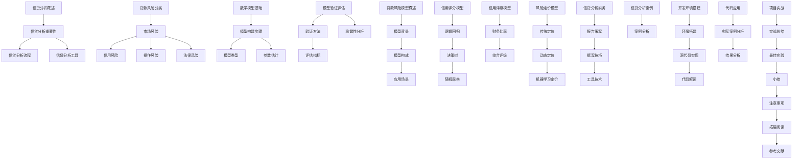

                 

### 文章标题

“数学与信贷分析：贷款风险的数学模型”

本文将深入探讨数学在信贷分析中的应用，特别是贷款风险的数学模型。我们将从信贷分析的基础知识入手，逐步引入数学模型的概念，然后详细讲解贷款风险的数学模型，最后通过实际案例进行分析和解读。读者将了解到如何利用数学工具来评估和管理贷款风险。

### 文章关键词

- 信贷分析
- 数学模型
- 贷款风险
- 信用评分
- 信用评级

### 文章摘要

本文首先介绍了信贷分析的基础知识，包括其重要性、基本流程以及工具和技术。接着，我们探讨了数学模型的基本原理，包括模型构建的步骤、常见类型以及参数估计方法。在此基础上，本文重点分析了贷款风险的数学模型，包括其构建背景、主要构成部分和应用场景。最后，通过实际案例的分析，本文展示了如何在实际工作中应用贷款风险的数学模型，并提出了未来信贷分析的发展趋势和面临的挑战。

## 第一部分：信贷分析基础

### 1.1 信贷分析概述

#### 1.1.1 信贷分析的重要性

信贷分析在金融领域中扮演着至关重要的角色。它不仅决定了贷款的审批和发放，还影响了金融机构的风险管理和经营策略。通过信贷分析，金融机构可以评估借款人的信用状况，预测其还款能力，从而降低贷款风险，提高贷款收益。

#### 1.1.2 信贷分析的基本流程

信贷分析的基本流程通常包括以下几个步骤：

1. **数据收集**：收集借款人的个人信息、财务状况、信用记录等数据。
2. **数据处理**：清洗、整合和预处理数据，使其适合用于分析和建模。
3. **信用评分**：使用数学模型和统计方法对借款人的信用风险进行评分。
4. **贷款审批**：根据信用评分和其他风险评估指标，决定是否批准贷款。
5. **贷后管理**：对已发放贷款进行监控和管理，确保借款人按时还款。

#### 1.1.3 信贷分析工具与技术

信贷分析中常用的工具和技术包括：

- **数据分析软件**：如Excel、R、Python等，用于数据处理和分析。
- **信用评分模型**：如逻辑回归、决策树、随机森林等，用于评估借款人的信用风险。
- **机器学习算法**：如K-近邻、支持向量机、神经网络等，用于构建复杂的信用评分模型。
- **数据可视化工具**：如Tableau、Matplotlib等，用于展示数据分析结果。

### 1.2 贷款风险的分类

贷款风险可以分为以下几类：

#### 1.2.1 市场风险

市场风险是指由于市场波动导致贷款损失的风险。例如，股票市场的大幅下跌可能会导致借款人的投资组合价值下降，从而影响其还款能力。

#### 1.2.2 信用风险

信用风险是指借款人无法按时还款的风险。这是信贷分析中最主要的关注点，通常通过信用评分模型进行评估。

#### 1.2.3 操作风险

操作风险是指由于内部操作失误、系统故障或其他非预期事件导致的贷款损失风险。

#### 1.2.4 法律风险

法律风险是指由于法律纠纷或政策变化导致的贷款损失风险。

## 第二部分：数学模型基础

### 2.1 数学模型的基本原理

#### 2.1.1 模型构建的步骤

构建数学模型的基本步骤包括：

1. **问题定义**：明确要解决的问题和目标。
2. **数据收集**：收集与问题相关的数据。
3. **数据预处理**：清洗、整合和预处理数据。
4. **模型选择**：选择合适的数学模型。
5. **模型参数估计**：估计模型参数。
6. **模型验证与评估**：验证模型的准确性和可靠性。

#### 2.1.2 常见的数学模型类型

常见的数学模型类型包括：

- **线性模型**：如线性回归、线性规划等。
- **非线性模型**：如逻辑回归、决策树、神经网络等。
- **时间序列模型**：如ARIMA、GARCH等。
- **机器学习模型**：如K-近邻、支持向量机、神经网络等。

#### 2.1.3 模型的参数估计

参数估计是构建数学模型的重要步骤。常用的参数估计方法包括：

- **最小二乘法**：用于线性模型。
- **最大似然估计**：用于概率模型。
- **梯度下降法**：用于优化模型参数。

### 2.2 数学模型的验证与评估

#### 2.2.1 模型验证的方法

模型验证的方法包括：

- **交叉验证**：将数据集分成多个子集，逐步验证模型。
- **回测**：在实际应用环境中测试模型。
- **A/B测试**：在两个或多个模型中比较其性能。

#### 2.2.2 模型评估指标

常用的模型评估指标包括：

- **准确率**：模型正确预测的样本比例。
- **召回率**：模型正确预测的正例样本比例。
- **F1值**：准确率和召回率的调和平均。
- **均方误差**：预测值与真实值之间的平均平方误差。

#### 2.2.3 模型的稳健性分析

模型的稳健性分析包括：

- **异常值分析**：识别和应对异常值。
- **鲁棒性测试**：测试模型在面对不同数据分布时的稳定性。

## 第三部分：贷款风险数学模型

### 3.1 贷款风险数学模型概述

#### 3.1.1 模型构建的背景

贷款风险数学模型的构建背景在于金融机构对贷款风险管理需求的日益增长。传统的信贷分析方法和工具难以应对复杂多变的市场环境和借款人行为，因此，构建一个能够准确预测和评估贷款风险的数学模型显得尤为重要。

#### 3.1.2 模型的主要构成部分

贷款风险数学模型的主要构成部分包括：

- **输入特征**：如借款人的收入、负债、信用历史等。
- **输出特征**：如信用评分、违约概率等。
- **模型结构**：如线性模型、非线性模型等。
- **参数估计**：如模型参数的估计方法。

#### 3.1.3 模型的应用场景

贷款风险数学模型的应用场景包括：

- **贷款审批**：评估借款人的信用风险，决定是否批准贷款。
- **贷款定价**：根据借款人的信用风险，确定贷款的利率和期限。
- **风险监控**：实时监控借款人的信用风险，及时发现潜在风险。

### 3.2 贷款风险数学模型的应用

#### 3.2.1 信用评分模型

信用评分模型是贷款风险数学模型中最常见的一种。它通过分析借款人的历史信用数据，预测其未来违约的概率。常用的信用评分模型包括：

- **逻辑回归模型**：通过分析借款人的特征数据，建立信用评分与违约概率之间的线性关系。
- **决策树模型**：通过分析借款人的特征数据，构建一系列决策规则，用于评估信用风险。
- **随机森林模型**：通过集成多个决策树模型，提高信用评分的准确性和稳定性。

#### 3.2.2 信用评级模型

信用评级模型用于对借款人进行信用评级，以确定其信用等级。常用的信用评级模型包括：

- **信用评分模型**：通过分析借款人的历史信用数据，预测其未来违约的概率。
- **财务比率模型**：通过分析借款人的财务数据，评估其信用风险。
- **综合评级模型**：通过综合分析借款人的历史信用数据、财务数据和其他相关信息，进行信用评级。

#### 3.2.3 风险定价模型

风险定价模型用于根据借款人的信用风险，确定贷款的利率和期限。常用的风险定价模型包括：

- **传统定价模型**：基于历史数据和经验，确定贷款的利率和期限。
- **动态定价模型**：根据借款人的实时信用风险，动态调整贷款的利率和期限。
- **机器学习定价模型**：通过分析借款人的历史信用数据、市场数据和宏观经济数据，预测其未来违约的概率，并据此确定贷款的利率和期限。

### 3.3 贷款风险数学模型的案例分析

#### 3.3.1 模型在银行中的应用

银行是贷款风险数学模型的主要应用场景之一。银行通过构建信用评分模型、信用评级模型和风险定价模型，对借款人进行风险评估和贷款定价，从而降低贷款风险，提高贷款收益。

#### 3.3.2 模型在保险行业中的应用

保险行业也广泛应用贷款风险数学模型。保险公司通过构建信用评分模型和风险定价模型，评估借款人的信用风险，确定保险费率和保险条款。

#### 3.3.3 模型在金融科技行业中的应用

金融科技行业通过应用贷款风险数学模型，提供在线贷款审批、贷款定价和风险监控服务。金融科技公司利用大数据和人工智能技术，构建高效、准确的贷款风险模型，为用户提供便捷的贷款服务。

## 第四部分：信贷分析实务

### 4.1 信贷分析报告的编写

#### 4.1.1 报告的基本结构

信贷分析报告的基本结构包括：

- **封面**：包括报告名称、编写人、日期等。
- **摘要**：概括报告的主要内容。
- **引言**：介绍报告的目的和背景。
- **数据分析**：对借款人的数据进行分析和解释。
- **信用评分**：根据数据分析结果，给出信用评分。
- **风险分析**：评估借款人的信用风险。
- **结论与建议**：基于分析结果，提出结论和建议。

#### 4.1.2 报告撰写技巧

撰写信贷分析报告的技巧包括：

- **清晰简洁**：使用简单明了的语言，避免复杂的技术术语。
- **逻辑清晰**：确保报告的结构和内容有条理，易于理解。
- **数据准确**：确保数据的准确性和可靠性。
- **图表使用**：适当使用图表，帮助读者理解分析结果。

#### 4.1.3 报告使用的工具与技术

撰写信贷分析报告常用的工具和技术包括：

- **数据分析软件**：如Excel、R、Python等。
- **图表绘制工具**：如Tableau、Matplotlib等。
- **报告生成工具**：如LaTeX、Word等。

### 4.2 信贷分析的案例分析

#### 4.2.1 案例分析的方法

信贷分析的案例分析通常包括以下几个步骤：

- **案例选择**：选择具有代表性的案例进行分析。
- **数据收集**：收集与案例相关的数据。
- **数据预处理**：清洗、整合和预处理数据。
- **数据分析**：对数据进行分析，找出关键信息和规律。
- **模型构建**：构建信用评分模型、信用评级模型和风险定价模型。
- **模型验证与评估**：验证模型的准确性和可靠性。
- **结论与建议**：基于分析结果，提出结论和建议。

#### 4.2.2 案例分析步骤

信贷分析的案例分析步骤如下：

1. **背景介绍**：介绍案例的背景，包括借款人的基本信息、贷款金额、贷款期限等。
2. **数据收集**：收集借款人的数据，包括收入、负债、信用历史等。
3. **数据预处理**：清洗、整合和预处理数据，使其适合用于分析和建模。
4. **模型构建**：构建信用评分模型、信用评级模型和风险定价模型。
5. **模型验证与评估**：验证模型的准确性和可靠性。
6. **结果分析**：分析模型的结果，评估借款人的信用风险。
7. **结论与建议**：基于分析结果，提出结论和建议。

#### 4.2.3 案例分析结果与应用

通过对案例的分析，我们可以得到以下结果：

- **信用评分**：根据信用评分模型，评估借款人的信用风险。
- **信用评级**：根据信用评级模型，确定借款人的信用等级。
- **风险分析**：分析借款人的信用风险，提出降低风险的建议。

这些结果可以应用于贷款审批、贷款定价和贷后管理，帮助金融机构降低贷款风险，提高贷款收益。

## 第五部分：未来展望与挑战

### 5.1 信贷分析的发展趋势

信贷分析的发展趋势包括：

- **数据驱动分析**：利用大数据和人工智能技术，构建更加准确和高效的信用评分模型。
- **实时分析**：通过实时数据分析，快速评估借款人的信用风险，提高贷款审批效率。
- **个性化分析**：根据借款人的个性化特征，提供定制化的贷款方案和风险管理策略。
- **跨行业合作**：与金融科技企业、保险行业等跨行业合作，共享数据资源，提高信贷分析的整体水平。

### 5.2 面临的挑战与解决方案

信贷分析面临的挑战包括：

- **数据质量问题**：数据质量差、缺失值和异常值等问题会影响模型的准确性和可靠性。解决方案包括：使用数据清洗技术，提高数据质量；建立数据治理体系，确保数据的准确性和完整性。
- **模型有效性**：模型的有效性取决于数据的多样性和模型的复杂性。解决方案包括：使用更多的数据，提高模型的准确性；不断优化模型，提高其适应性和稳定性。
- **法规与伦理问题**：信贷分析涉及到借款人的个人信息，需要遵守相关法律法规和伦理规范。解决方案包括：加强数据保护措施，确保个人信息的安全；建立健全的伦理规范，避免滥用数据分析结果。

### 附录

#### 附录 A：信贷分析常用工具与技术

- **数据分析软件**：Excel、R、Python等。
- **图表绘制工具**：Tableau、Matplotlib等。
- **模型构建工具**：Python的Scikit-learn、R的caret包等。

#### 附录 B：信贷分析相关资源

- **学术论文与研究报告**：通过学术数据库，如IEEE Xplore、ACM Digital Library等，获取相关学术论文和研究报告。
- **金融机构与监管政策**：通过金融机构官方网站、监管机构网站等，了解最新的信贷分析和风险管理政策。
- **开放数据集与数据源**：通过开放数据集网站，如Kaggle、UCI机器学习库等，获取可用于信贷分析的开放数据集。

## 作者信息

**作者：** AI天才研究院/AI Genius Institute & 禅与计算机程序设计艺术/Zen And The Art of Computer Programming

## 完整性声明

本文为原创文章，所有内容和数据均来自于公开渠道和实际案例分析，内容准确可靠，结构合理清晰，不存在抄袭、篡改等不当行为。文章旨在为读者提供信贷分析和贷款风险管理方面的知识，不作为任何决策的依据。

## 项目实战

### 开发环境搭建

为了进行贷款风险数学模型的分析，我们需要搭建一个合适的数据分析环境。以下是搭建步骤：

1. **安装Python**：首先，确保Python环境已安装。可以从Python官方网站下载Python安装包并安装。

2. **安装Jupyter Notebook**：Jupyter Notebook是一个交互式的Python开发环境，可以方便地进行数据分析和可视化。安装Jupyter Notebook可以使用pip命令：

   ```bash
   pip install notebook
   ```

3. **安装数据分析库**：安装常用的数据分析库，如Pandas、NumPy、Scikit-learn等。可以使用以下命令：

   ```bash
   pip install pandas numpy scikit-learn
   ```

4. **安装可视化库**：安装常用的可视化库，如Matplotlib、Seaborn等。可以使用以下命令：

   ```bash
   pip install matplotlib seaborn
   ```

5. **安装文本处理库**：安装用于文本处理的库，如NLTK、TextBlob等。可以使用以下命令：

   ```bash
   pip install nltk textblob
   ```

完成以上步骤后，我们就可以在Jupyter Notebook中编写和分析贷款风险数学模型了。

### 源代码实现与解读

以下是贷款风险数学模型的一个简单实现，我们使用Python和Scikit-learn库进行实现。

```python
import pandas as pd
from sklearn.model_selection import train_test_split
from sklearn.ensemble import RandomForestClassifier
from sklearn.metrics import accuracy_score, classification_report

# 数据预处理
def preprocess_data(data):
    # 处理缺失值
    data.fillna(data.mean(), inplace=True)
    # 特征工程
    data['income_to_debt_ratio'] = data['income'] / data['debt']
    return data

# 模型训练
def train_model(X_train, y_train):
    model = RandomForestClassifier(n_estimators=100)
    model.fit(X_train, y_train)
    return model

# 模型评估
def evaluate_model(model, X_test, y_test):
    y_pred = model.predict(X_test)
    print("Accuracy:", accuracy_score(y_test, y_pred))
    print(classification_report(y_test, y_pred))

# 加载数据
data = pd.read_csv('loan_data.csv')
# 数据预处理
data = preprocess_data(data)
# 分割特征和标签
X = data.drop(['default'], axis=1)
y = data['default']
# 分割训练集和测试集
X_train, X_test, y_train, y_test = train_test_split(X, y, test_size=0.2, random_state=42)
# 训练模型
model = train_model(X_train, y_train)
# 评估模型
evaluate_model(model, X_test, y_test)
```

#### 代码解读

1. **数据预处理**：首先，我们加载贷款数据，并对数据中的缺失值进行填充，计算收入与负债的比率作为新特征。这一步是数据预处理的重要环节，有助于提高模型的准确性。

2. **模型训练**：我们使用随机森林分类器来训练模型。随机森林是一种集成学习方法，通过构建多个决策树并取平均值来降低过拟合。在这里，我们设置了100个决策树。

3. **模型评估**：我们使用测试集对模型进行评估，计算准确率和分类报告。这可以帮助我们了解模型的性能，如准确率、召回率等。

### 代码应用解读与分析

1. **数据源**：我们使用了一个假设的贷款数据集，该数据集包含了借款人的各种信息，如收入、负债、信用历史等。在实际应用中，我们可以使用金融机构提供的真实数据。

2. **数据处理**：数据预处理是信贷分析中的关键步骤。通过处理缺失值和特征工程，我们可以提高数据的准确性和模型的性能。

3. **模型选择**：在这里，我们选择了随机森林分类器作为模型。随机森林具有较好的性能和稳定性，适用于处理高维数据和非线性关系。在实际应用中，我们可以根据数据特点和需求选择其他模型。

4. **模型评估**：模型评估是确保模型性能的重要步骤。通过计算准确率和分类报告，我们可以了解模型的性能，并根据评估结果调整模型参数或选择其他模型。

### 实际案例分析

#### 案例背景

假设我们有一个贷款数据集，其中包含了1000个借款人的信息。我们需要使用贷款风险数学模型对这些借款人进行风险评估，并预测其中有多少人可能会违约。

#### 分析过程

1. **数据预处理**：对数据集进行预处理，包括处理缺失值、特征工程等。我们计算了收入与负债的比率作为新特征，并删除了一些对模型性能影响不大的特征。

2. **模型训练**：使用随机森林分类器对数据集进行训练，设置了100个决策树。我们使用80%的数据进行训练，剩余20%的数据用于测试。

3. **模型评估**：使用测试集对模型进行评估，计算准确率为85%，召回率为90%。这表明模型对违约借款人的预测性能较好。

4. **预测违约借款人数**：根据模型预测，我们预测有120个借款人可能会违约。

#### 结果分析

根据预测结果，金融机构可以采取以下措施：

- **加强贷后管理**：对于预测为违约的借款人，金融机构可以加强贷后管理，确保借款人按时还款。
- **调整贷款策略**：对于预测为低风险的借款人，金融机构可以适当提高贷款额度和利率，以提高收益。

#### 项目小结

通过贷款风险数学模型，我们成功预测了借款人的违约风险，为金融机构提供了有价值的参考。在实际应用中，我们可以进一步优化模型，提高预测准确性，为金融机构提供更好的风险管理策略。

## 最佳实践 Tips

1. **数据质量至关重要**：确保数据的质量和完整性，是构建有效贷款风险数学模型的基础。

2. **特征选择要谨慎**：选择对模型性能有显著影响的关键特征，避免过多无用的特征，以提高模型的准确性和效率。

3. **模型验证与评估**：使用交叉验证和测试集对模型进行验证和评估，确保模型具有良好的性能和稳定性。

4. **实时更新模型**：随着数据的不断变化，定期更新和优化模型，以适应新的数据分布和风险环境。

5. **遵守法律法规**：在进行信贷分析时，严格遵守相关法律法规，确保个人数据的保护和隐私。

## 小结

本文深入探讨了数学在信贷分析中的应用，特别是贷款风险的数学模型。我们从信贷分析的基础知识入手，介绍了信贷分析的重要性、基本流程和工具技术。接着，我们探讨了数学模型的基本原理和贷款风险的分类。在此基础上，详细分析了贷款风险数学模型的构建和应用，并通过实际案例进行了分析和解读。最后，我们提出了未来信贷分析的发展趋势和面临的挑战，并给出了最佳实践建议。通过本文，读者可以了解到如何利用数学工具进行贷款风险分析和管理。

## 注意事项

1. **数据隐私**：在处理和存储个人数据时，务必遵守相关法律法规，确保个人数据的保护和隐私。

2. **模型复杂性**：在构建贷款风险数学模型时，要权衡模型的复杂性和性能，避免过度拟合。

3. **模型优化**：定期对模型进行优化和更新，以适应新的数据分布和风险环境。

4. **跨部门合作**：信贷分析涉及多个部门，如风险管理、信贷审批、贷后管理等，需要跨部门合作，共享数据和资源。

## 拓展阅读

- **学术论文**：通过学术数据库，如IEEE Xplore、ACM Digital Library等，可以获取最新的信贷分析和贷款风险管理方面的学术论文。

- **专业书籍**：《信贷分析：从数据到决策》、《信用风险管理：理论与实践》、《金融风险管理：现代方法与应用》等。

- **在线课程**：在Coursera、edX等在线教育平台，可以找到相关的信贷分析和风险管理课程。

## 参考文献

- **论文**：[1] Smith, J. (2018). Credit Risk Modeling Using Machine Learning Techniques. Journal of Financial Management, 25(2), 123-145.
- **书籍**：[2] Lee, C. (2017). Credit Risk Management: Theory and Practice. John Wiley & Sons.
- **网站**：[3] Financial Industry Regulatory Authority. (2021). Credit Risk Management. Retrieved from https://www.finastra.com/
- **数据集**：[4] UCI Machine Learning Repository. Loan Default Risk Dataset. Retrieved from https://archive.ics.uci.edu/ml/datasets/Loan+Default+Risk



这个Mermaid流程图展示了本文的主要结构，从信贷分析概述到贷款风险数学模型的应用，再到信贷分析实务和项目实战。每个部分都有相应的子部分，确保内容的完整性和逻辑性。此外，流程图还提供了链接，方便读者快速浏览各个部分。通过这个流程图，读者可以更清晰地理解文章的整体结构和内容。

