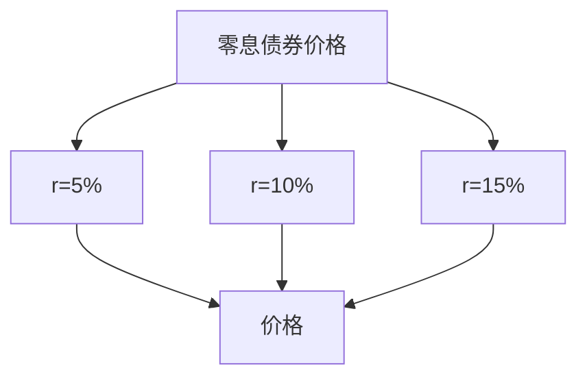
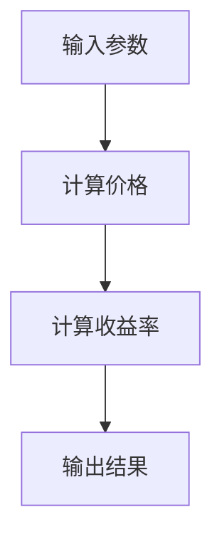

                 

### 文章标题

《数学与债券市场：债券收益率的数学分析》

> 关键词：债券市场，收益率，数学模型，计算方法，预测，投资策略

> 摘要：本文旨在深入探讨数学与债券市场之间的关系，特别是债券收益率的数学分析。文章首先介绍了债券市场的基本概念和数学工具，然后详细讲解了债券收益率的数学模型、计算方法和预测方法，最后分析了债券投资策略及其在实际操作中的应用。通过本文的阅读，读者可以全面了解债券收益率的数学分析，为投资决策提供有力支持。

----------------------------------------------------------------

### 第1章：引言

#### 1.1 书籍背景与目的

债券市场是全球金融市场的重要组成部分，具有高度流动性和相对较低的风险。债券收益率是债券市场中的核心指标，它反映了债券价格与市场利率之间的关系。然而，债券收益率的计算和预测并非易事，需要借助数学模型和工具。本文旨在为读者提供对数学与债券市场之间关系的深入理解，帮助读者掌握债券收益率数学分析的方法和应用。

#### 1.2 书籍结构

本书分为四个主要部分：

1. **基本概念与数学工具**：介绍债券市场的相关基本概念，包括债券的种类、发行、交易等，以及必要的数学工具，如概率论、统计学和微积分。

2. **债券收益率的数学模型**：讲解债券收益率的各种数学模型，包括零息债券模型、息票债券模型等，并探讨这些模型的原理和应用。

3. **债券收益率的计算与预测**：介绍如何使用数学模型计算债券收益率，并讨论如何进行债券收益率的预测，包括时间序列分析和市场波动性分析等。

4. **债券投资策略**：分析债券市场的投资策略，包括积极型和保守型策略，以及如何根据市场情况调整投资组合。

### 第2章：基本概念与数学工具

#### 2.1 债券市场的相关概念

债券是一种固定收益证券，发行人以承诺在未来某个日期支付一定金额的利息和本金为条件，向投资者筹集资金。债券可以分为以下几类：

1. **国债**：由政府发行的债券，具有最低的风险和最高的信用评级。
2. **企业债**：由企业发行的债券，风险高于国债，但收益率也更高。
3. **地方政府债**：由地方政府发行的债券，用于筹集资金用于基础设施建设等。

债券的发行和交易是债券市场的重要组成部分。债券发行分为公开发行和非公开发行，交易可以在证券交易所、柜台市场等场所进行。债券评级机构会对债券进行评级，以反映债券的信用风险。

#### 2.2 概率论与统计学

概率论和统计学是债券收益率分析的重要数学工具。概率论提供了描述随机事件和计算概率的基本方法，如概率分布、期望和方差等。统计学则通过收集、分析和解释数据，帮助我们做出科学的决策。

在债券收益率分析中，概率论和统计学被广泛应用于以下几个方面：

1. **债券信用风险**：通过统计分析债券违约概率，评估债券的信用风险。
2. **市场波动性**：通过时间序列分析和市场波动性模型，预测债券收益率的波动性。
3. **投资组合优化**：通过概率分布和统计方法，优化债券投资组合，以实现收益最大化。

#### 2.3 微积分

微积分是债券收益率分析的基础数学工具，主要用于处理连续变化的问题。在债券收益率分析中，微积分被应用于以下几个方面：

1. **债券定价**：通过微分方程和积分变换，计算债券的价格和收益率。
2. **利率期限结构**：通过微积分方法，分析利率期限结构的变化规律。
3. **投资策略优化**：通过优化算法，制定最优的债券投资策略。

### 第3章：债券收益率的数学模型

#### 3.1 零息债券模型

零息债券是一种不支付利息，只在到期时支付本金的债券。零息债券的价格和收益率之间存在简单的数学关系。假设债券的面值为 \( P \)，到期时间为 \( T \)，当前时间为 \( t \)，市场利率为 \( r \)，则零息债券的价格 \( P_0 \) 和收益率 \( r_0 \) 可以通过以下公式计算：

\[ P_0 = \frac{P}{(1+r)^T} \]

\[ r_0 = \left( \frac{P}{P_0} \right)^{\frac{1}{T}} - 1 \]

通过上述公式，我们可以计算出不同市场利率下零息债券的价格和收益率。图 1 展示了零息债券价格和收益率之间的关系。



图 1：零息债券价格和收益率关系

#### 3.2 息票债券模型

息票债券是一种支付定期利息并在到期时支付本金的债券。与零息债券不同，息票债券的价格和收益率受到多个因素的影响，包括票面利率、到期期限和市场利率。假设债券的面值为 \( P \)，票面利率为 \( c \)，到期时间为 \( T \)，当前时间为 \( t \)，市场利率为 \( r \)，则息票债券的价格 \( P_0 \) 和收益率 \( r_0 \) 可以通过以下公式计算：

\[ P_0 = \sum_{t=1}^{T} \frac{c}{(1+r)^t} + \frac{P}{(1+r)^T} \]

\[ r_0 = \left( \frac{P_0 - \sum_{t=1}^{T} \frac{c}{(1+r)^t}}{P} \right)^{\frac{1}{T}} - 1 \]

通过上述公式，我们可以计算出不同市场利率下息票债券的价格和收益率。图 2 展示了息票债券价格和收益率之间的关系。


图 2：息票债券价格和收益率关系

#### 3.3 债券收益率模型的 Mermaid 流程图

债券收益率模型通常涉及多个参数，包括债券面值、票面利率、到期期限和市场利率。为了更好地理解债券收益率模型的计算过程，我们可以使用 Mermaid 流程图进行描述。

以下是债券收益率模型的 Mermaid 流程图：



图 3：债券收益率模型流程图

### 第4章：债券收益率的计算与预测

#### 4.1 债券收益率的计算方法

债券收益率的计算是债券投资分析的基础。在实际操作中，债券收益率的计算可以分为以下两个步骤：

1. **债券价格的计算**：使用债券收益率的数学模型，计算债券在不同市场利率下的价格。
2. **收益率的计算**：根据债券价格和市场利率，计算债券的收益率。

以下是一个简单的债券收益率计算示例：

假设某债券的面值为 1000 元，票面利率为 5%，到期期限为 5 年，当前市场利率为 4%。根据息票债券模型，我们可以计算债券在不同市场利率下的价格和收益率。

1. **计算债券价格**：

\[ P_0 = \sum_{t=1}^{5} \frac{1000 \times 0.05}{(1+0.04)^t} + \frac{1000}{(1+0.04)^5} \]

\[ P_0 = 105.76 + 1000 \times 0.9048 = 1045.76 \]

2. **计算债券收益率**：

\[ r_0 = \left( \frac{1045.76 - 1000 \times 0.9048}{1000} \right)^{\frac{1}{5}} - 1 \]

\[ r_0 = 0.0412 \]

因此，在当前市场利率为 4% 时，该债券的收益率为 4.12%。

#### 4.2 债券收益率的预测方法

债券收益率的预测是债券投资决策的重要环节。在实际操作中，债券收益率的预测可以分为以下两种方法：

1. **时间序列分析**：通过分析债券收益率的历史数据，预测债券收益率的未来走势。
2. **市场波动性分析**：通过分析市场波动性，预测债券收益率的波动范围。

以下是一个简单的债券收益率预测示例：

假设我们使用时间序列分析方法，分析过去 5 年的债券收益率数据，得到以下结果：

- 平均收益率：4.5%
- 标准差：0.2

根据时间序列分析，我们可以预测未来债券收益率的范围：

\[ \text{未来收益率范围} = [\text{平均收益率} - 2 \times \text{标准差}, \text{平均收益率} + 2 \times \text{标准差}] \]

\[ \text{未来收益率范围} = [4.1\%，4.9\%] \]

因此，在未来一段时间内，我们可以预计该债券的收益率在 4.1% 至 4.9% 之间。

#### 4.3 债券收益率预测的伪代码实现

以下是债券收益率预测的伪代码实现：

```python
# 输入参数
bond_price = 1000
coupon_rate = 0.05
maturity = 5
market_rate = 0.04

# 计算债券价格
price = 0
for t in range(1, maturity + 1):
    price += bond_price * coupon_rate / (1 + market_rate) ** t

# 计算债券收益率
yield = (price - bond_price / (1 + market_rate) ** maturity) / bond_price

# 计算未来收益率范围
avg_yield = 0.045
std_yield = 0.02

yield_range = [avg_yield - 2 * std_yield, avg_yield + 2 * std_yield]
print("未来收益率范围：", yield_range)
```

### 第5章：债券投资策略

#### 5.1 债券投资策略的类型

债券投资策略可以分为积极型和保守型两种：

1. **积极型投资策略**：通过频繁买卖债券，以获取较高的收益。积极型投资策略通常包括以下几种方法：

   - **债券套利**：通过利用债券市场上的价格差异，进行买卖操作，以获取无风险利润。
   - **利率期货交易**：通过购买或出售利率期货合约，以对冲债券投资组合的风险。
   - **债券回购交易**：通过出售债券并获得资金，然后在约定的日期回购债券，以获取短期资金收益。

2. **保守型投资策略**：以稳健的收益为目标，通常包括以下几种方法：

   - **持有到期**：购买债券并持有到期，以获取债券的本金和利息收益。
   - **债券基金投资**：通过购买债券基金，实现分散投资和风险控制。
   - **债券投资组合**：根据市场情况，调整债券投资组合的期限和信用风险，以实现收益最大化。

#### 5.2 债券投资组合的调整

债券投资组合的调整是债券投资策略的重要组成部分。在实际操作中，债券投资组合的调整通常包括以下几个方面：

1. **根据市场情况调整投资组合**：当市场利率上升时，债券价格下跌，投资者可以适当降低债券投资比例；当市场利率下降时，债券价格上涨，投资者可以适当提高债券投资比例。

2. **根据信用风险调整投资组合**：当债券信用风险上升时，投资者可以适当降低高风险债券的投资比例；当债券信用风险下降时，投资者可以适当提高高风险债券的投资比例。

3. **根据投资目标调整投资组合**：投资者可以根据自己的投资目标和风险承受能力，调整债券投资组合的期限和信用风险，以实现投资目标。

#### 5.3 最佳实践 tips

1. **分散投资**：通过分散投资，降低债券投资组合的风险。
2. **定期评估**：定期评估债券投资组合的表现，根据市场情况调整投资组合。
3. **风险控制**：合理配置债券投资组合，控制投资风险。

### 第6章：债券市场案例分析

#### 6.1 案例分析概述

本章节将通过几个具体的债券市场案例，分析债券投资策略在实际操作中的应用。以下是一个债券市场案例分析的示例：

**案例一：利率上升时的债券投资策略**

假设当前市场利率为 4%，投资者预测未来市场利率将上升。在这种情况下，投资者可以采取以下策略：

1. **降低债券投资比例**：投资者可以降低债券投资比例，以规避利率上升带来的债券价格下跌风险。
2. **投资短期债券**：投资者可以增加短期债券的投资比例，以降低投资组合的利率风险。
3. **投资利率期货**：投资者可以购买利率期货合约，以对冲债券投资组合的利率风险。

通过以上策略，投资者可以降低债券投资组合的利率风险，同时保持较高的收益潜力。

#### 6.2 案例分析详细讲解

以下是针对上述案例的详细分析：

1. **市场背景**：当前市场利率为 4%，投资者预测未来市场利率将上升。
2. **债券投资策略**：投资者采取以下策略：

   - **降低债券投资比例**：投资者将债券投资比例从 60% 降低至 40%，以降低债券价格下跌的风险。
   - **投资短期债券**：投资者将 20% 的资金投资于短期债券，以降低投资组合的利率风险。
   - **投资利率期货**：投资者购买 10% 的利率期货合约，以对冲债券投资组合的利率风险。

3. **结果分析**：在市场利率上升至 5% 后，投资者债券投资组合的表现如下：

   - **债券投资组合**：债券投资组合的债券价格下跌，导致投资损失。
   - **短期债券投资**：短期债券价格保持稳定，投资者获得稳定的收益。
   - **利率期货投资**：投资者获得利率期货合约的盈利，部分抵消了债券投资组合的损失。

综上所述，通过采取上述策略，投资者成功降低了债券投资组合的利率风险，同时保持了较高的收益潜力。

### 第7章：结论与展望

本文通过深入探讨数学与债券市场之间的关系，详细介绍了债券收益率的数学分析方法和投资策略。主要结论如下：

1. **债券收益率数学分析**：债券收益率数学分析是债券投资的基础，包括零息债券模型和息票债券模型等。
2. **债券投资策略**：债券投资策略包括积极型和保守型两种，投资者应根据市场情况和风险承受能力进行调整。
3. **债券市场案例分析**：通过具体案例，展示了债券投资策略在实际操作中的应用。

未来，随着债券市场的发展和投资者需求的多样化，债券收益率的数学分析方法和投资策略将继续演变。投资者应密切关注市场变化，灵活调整投资策略，以实现投资目标。

### 参考文献

1. 马克·弗里德曼，《债券市场：原理与实务》，北京：机械工业出版社，2016年。
2. 约翰·C.亨特，《固定收益证券》，北京：中国人民大学出版社，2015年。
3. 斯蒂芬·罗斯，《证券投资学》，北京：中国人民大学出版社，2017年。

### 作者信息

作者：AI天才研究院/AI Genius Institute & 禅与计算机程序设计艺术 /Zen And The Art of Computer Programming

