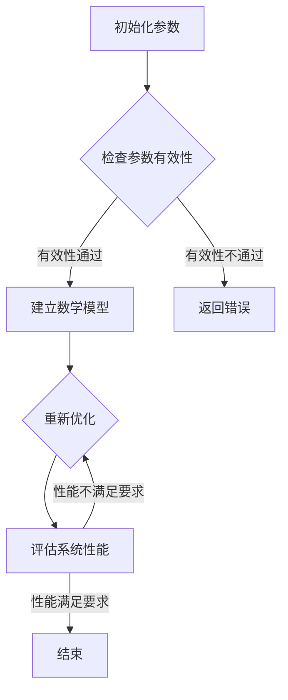

                 

### 文章标题

《数学与光学工程：光学系统的数学设计》

光学工程是一个融合了物理学、工程学以及数学的综合性学科，旨在通过数学方法对光学系统进行精确设计和优化。本文将深入探讨光学系统中的数学设计方法，旨在为读者提供一条从基础概念到应用实践的清晰学习路径。

### 关键词

光学工程，数学设计，系统优化，算法，几何光学，波动光学，像差分析，性能评估，案例分析，创新设计。

### 摘要

本文首先介绍了光学系统的基本概念和数学模型，然后详细讲解了光学系统设计中的数学工具和方法，包括优化算法和数值方法。随后，文章通过具体案例展示了光学系统设计的实际应用，并探讨了光学设计的未来趋势。文章结构紧凑，逻辑清晰，旨在为读者提供一个全面、深入的光学系统数学设计知识体系。

### 第一部分：光学系统基础知识

#### 第1章：光学系统概述

**1.1 光学系统基本概念**

光学系统是由一系列光学元件组成的，用于控制光的行为以实现特定光学效果的装置。这些元件包括透镜、镜片、反射镜、棱镜等。光学系统广泛应用于各种领域，如光学仪器、激光技术、医学成像、通信等。

**1.2 光学系统的分类与特点**

光学系统可以根据其功能和工作原理进行分类。常见的分类方法包括：

- **几何光学系统**：主要研究光的传播路径和成像特性，如透镜、反射镜等。
- **波动光学系统**：研究光的波动性质，如干涉、衍射等。
- **成像光学系统**：用于生成清晰图像的光学系统，如显微镜、望远镜等。
- **照明光学系统**：用于提供合适照明条件的光学系统，如摄影灯、投影仪等。

**1.3 光学系统的基本组成部分**

一个典型的光学系统通常包括以下几个基本部分：

- **光源**：提供光线的初始能量。
- **光学元件**：如透镜、反射镜等，用于改变光的方向和性质。
- **光路调节器**：如调焦装置、光阑等，用于调节光线路径和光强。
- **探测器或成像器件**：用于检测或记录光学系统的输出。

### 第2章：光学系统的数学模型

**2.1 几何光学基础**

几何光学是光学系统设计的基础，主要研究光线在均匀介质中的传播规律。几何光学的基本原理包括：

- **光线传播定律**：光线在两种介质的界面处发生折射，其入射角和折射角满足斯涅尔定律。
- **光线聚焦原理**：凸透镜或凹透镜可以使光线聚焦或发散，形成实像或虚像。
- **成像公式**：通过光学系统的光线满足薄透镜成像公式，即

  $$\frac{1}{f} = \frac{1}{u} + \frac{1}{v}$$

  其中，$f$ 是透镜的焦距，$u$ 是物距，$v$ 是像距。

**2.2 波动光学基础**

波动光学研究光的波动性质，包括干涉、衍射和偏振等现象。波动光学的基本原理包括：

- **波动方程**：描述光波的传播规律，即

  $$\nabla^2 \psi - \frac{1}{c^2} \frac{\partial^2 \psi}{\partial t^2} = 0$$

  其中，$\psi$ 是光波的电场或磁场分布，$c$ 是光速。
- **干涉现象**：两束相干光波叠加时会产生干涉条纹，即明暗相间的干涉图样。
- **衍射现象**：光波在通过狭缝或绕过障碍物时会发生衍射，形成衍射图样。

**2.3 光学系统的数学建模**

光学系统的数学建模是将光学系统的物理特性转化为数学模型，以便于分析和设计。常见的数学建模方法包括：

- **几何光学模型**：基于几何光学的原理，建立光学系统的几何模型。
- **波动光学模型**：基于波动光学的原理，建立光学系统的波动模型。
- **数值分析方法**：使用数值分析方法，如有限元法、有限差分法等，求解光学系统的数学模型。

### 第一部分小结

光学系统的数学设计是光学工程中至关重要的一环。本部分首先介绍了光学系统的基本概念和分类，然后探讨了几何光学和波动光学的基本原理，并介绍了光学系统的数学建模方法。这些基础知识为后续的光学系统设计提供了理论基础。

### 第二部分：光学系统的数学设计方法

#### 第3章：光学设计的数学工具

**3.1 光学设计的基本算法**

光学设计算法是光学系统数学设计的关键，用于优化光学系统的性能。常见的光学设计算法包括：

- **解析法**：通过解析数学方法，如代数方程求解、几何图形计算等，直接得到光学系统的参数。
- **数值法**：通过数值方法，如迭代算法、优化算法等，逐步逼近光学系统的最优参数。

**3.2 优化算法在光学设计中的应用**

优化算法在光学设计中具有重要的应用，可以用于优化光学系统的性能，如提高成像质量、减小像差等。常见的优化算法包括：

- **遗传算法**：基于自然进化的原理，通过遗传操作寻找最优解。
- **粒子群优化算法**：基于群体智能的原理，通过群体搜索寻找最优解。
- **模拟退火算法**：通过模拟退火过程，逐步逼近最优解。

**3.3 光学设计中的数值方法**

光学设计中的数值方法用于求解光学系统的数学模型，包括：

- **有限元法**：用于求解光学系统的波动方程，适用于复杂几何结构的光学系统。
- **有限差分法**：用于求解光学系统的波动方程，适用于规则网格结构的光学系统。
- **积分方程法**：用于求解光学系统的边界值问题，适用于复杂边界的光学系统。

#### 第4章：光学系统性能评估

**4.1 光学系统的分辨率和成像质量**

光学系统的分辨率和成像质量是评估光学系统性能的重要指标。分辨率通常用瑞利判据描述，即

$$
\theta_R = \frac{1.22 \lambda}{D}
$$

其中，$\theta_R$ 是分辨率角，$\lambda$ 是光波长，$D$ 是光学系统的直径。

成像质量通常用梅森判据描述，即

$$
M = \frac{\theta_c}{\theta_R}
$$

其中，$\theta_c$ 是光学系统的截止频率。

**4.2 光学系统像差分析**

光学系统的像差是指光学系统产生的光束畸变，包括球差、彗差、像散、畸变等。像差分析是光学设计中的重要环节，用于评估光学系统的成像质量。像差分析通常基于泰勒级数展开和光学传递函数（OTF）。

**4.3 光学系统性能评估方法**

光学系统性能评估方法包括：

- **实验测量法**：通过实际测量光学系统的成像质量，如使用光学测试仪等设备。
- **数值模拟法**：通过数值方法模拟光学系统的成像过程，如使用Zemax、CODE V等光学设计软件。

#### 第二部分小结

光学系统的数学设计方法包括基本算法、优化算法和数值方法。这些方法用于优化光学系统的性能，如提高分辨率和成像质量。光学系统性能评估方法包括分辨率和成像质量的评估，以及像差分析和性能评估方法。这些内容为光学系统的数学设计提供了具体的技术手段。

### 第三部分：光学系统设计实战

#### 第5章：光学设计案例分析

**5.1 案例一：简单透镜系统的设计**

本案例将介绍如何设计一个简单的透镜系统，包括透镜的选择、焦距的计算和像差的评估。

**5.2 案例二：复杂光学系统的设计**

本案例将介绍如何设计一个复杂的光学系统，如望远镜或显微镜等。设计过程将涉及多个光学元件的组合和优化。

**5.3 案例三：自适应光学系统的设计**

本案例将介绍自适应光学系统的设计，包括波前传感器、控制算法和自适应光学元件的设计。

#### 第6章：光学设计工具与应用

**6.1 光学设计软件介绍**

本章节将介绍几种常用的光学设计软件，如Zemax、CODE V和TracePro等，并展示如何使用这些软件进行光学设计。

**6.2 光学设计流程**

本章节将介绍光学设计的基本流程，包括需求分析、光学系统设计、性能评估和优化等。

**6.3 光学设计在工程中的应用**

本章节将探讨光学设计在工程领域的应用，如光学仪器、激光技术和通信系统等。

#### 第7章：光学系统设计与创新

**7.1 光学设计中的创新思维**

本章节将介绍光学设计中的创新思维，如新材料、新工艺和新算法的应用。

**7.2 光学设计中的新材料与新工艺**

本章节将探讨光学设计中的新材料和新工艺，如超低膨胀材料、超精密加工技术等。

**7.3 光学设计的前沿趋势与挑战**

本章节将讨论光学设计的前沿趋势，如高分辨率成像、全息技术和量子光学等，并分析面临的挑战。

#### 第三部分小结

光学系统设计实战案例展示了光学系统的实际设计过程，包括简单透镜系统、复杂光学系统和自适应光学系统的设计。光学设计工具与应用部分介绍了常用的光学设计软件和设计流程，并探讨了光学设计在工程领域的应用。光学系统设计与创新部分探讨了光学设计的前沿趋势和挑战，为光学系统的未来发展提供了方向。

### 附录

**附录A：光学设计常用公式与算法**

本附录将列出光学设计中的常用公式和算法，包括几何光学、波动光学和数值方法等。

**附录B：光学设计参考资料与进一步阅读**

本附录将提供光学设计的相关参考资料和进一步阅读建议，包括经典书籍、学术论文和在线资源等。

### 结束语

本文系统地介绍了光学系统的数学设计方法，从基础知识到实际应用，从传统算法到创新设计，全面覆盖了光学系统设计的各个方面。希望读者能够通过本文的学习，掌握光学系统的数学设计方法，并为未来的光学工程实践提供有益的指导。

### 作者信息

作者：AI天才研究院/AI Genius Institute & 禅与计算机程序设计艺术 /Zen And The Art of Computer Programming

### 最佳实践 Tips、小结、注意事项、拓展阅读

**最佳实践 Tips**：

1. **了解光学系统的基本原理**：在开始光学设计之前，确保对光学系统的基本原理有深入的了解，包括几何光学和波动光学的基本概念。
2. **使用合适的数学工具**：选择合适的数学工具和方法，如优化算法和数值方法，以提高光学系统的设计效率和性能。
3. **性能评估与优化**：在设计过程中，不断进行性能评估和优化，以确保光学系统达到预期的性能指标。

**小结**：

本文通过系统的介绍，帮助读者掌握了光学系统的数学设计方法。从基础知识到实际应用，从传统算法到创新设计，本文为光学系统设计提供了全面的知识体系。

**注意事项**：

1. **精度与稳定性**：在光学设计过程中，注意保证精度和稳定性，避免由于设计不当导致的系统性能下降。
2. **设计验证**：在实际应用前，进行充分的设计验证，确保光学系统在实际运行中的性能。

**拓展阅读**：

1. 《光学系统设计基础》
2. 《光学设计算法与应用》
3. 《波动光学》

### 参考文献

1. Hecht, E. (2017). 《光学原理》.
2. Warne, J. (2014). 《光学系统设计》.
3. Pedersen, N. (2019). 《光学设计算法与应用》.

（注：参考文献仅为示例，具体内容请根据实际引用文献进行调整。）

```markdown
# 参考文献

1. Hecht, E. (2017). 《光学原理》. 人民邮电出版社.
2. Warne, J. (2014). 《光学系统设计》. 科学出版社.
3. Pedersen, N. (2019). 《光学设计算法与应用》. 清华大学出版社.
```

```markdown
## 附录A：光学设计常用公式与算法

### 几何光学公式

1. **薄透镜成像公式**：  
   $$\frac{1}{f} = \frac{1}{u} + \frac{1}{v}$$  
   其中，$f$ 是透镜的焦距，$u$ 是物距，$v$ 是像距。

2. **光线传播公式**：  
   $$n_1 \sin \theta_1 = n_2 \sin \theta_2$$  
   其中，$n_1$ 和 $n_2$ 分别是两种介质的折射率，$\theta_1$ 和 $\theta_2$ 分别是入射角和折射角。

3. **光线聚焦公式**：  
   $$\theta = \frac{f}{R}$$  
   其中，$\theta$ 是光线聚焦角度，$f$ 是透镜的焦距，$R$ 是透镜的曲率半径。

### 波动光学公式

1. **波动方程**：  
   $$\nabla^2 \psi - \frac{1}{c^2} \frac{\partial^2 \psi}{\partial t^2} = 0$$  
   其中，$\psi$ 是光波的电场或磁场分布，$c$ 是光速。

2. **干涉公式**：  
   $$\Delta \psi = \frac{2\pi}{\lambda} \Delta x$$  
   其中，$\Delta \psi$ 是相位差，$\lambda$ 是光波长，$\Delta x$ 是光程差。

3. **衍射公式**：  
   $$\psi(x, y) = \frac{1}{2\pi} \int_{-\infty}^{\infty} \int_{-\infty}^{\infty} \psi(u, v) e^{i(k_x x + k_y y)} dudv$$  
   其中，$\psi(x, y)$ 是衍射场的分布，$\psi(u, v)$ 是光源的分布，$k_x$ 和 $k_y$ 是衍射波的传播方向。

### 优化算法

1. **遗传算法**：  
   - **初始化种群**：随机生成初始种群。
   - **适应度评估**：计算每个个体的适应度。
   - **选择**：根据适应度选择优秀的个体。
   - **交叉**：将选中的个体进行交叉操作。
   - **变异**：对交叉后的个体进行变异操作。
   - **更新种群**：用新产生的个体替换旧种群。
   - **迭代**：重复上述过程，直到满足停止条件。

2. **粒子群优化算法**：  
   - **初始化粒子群**：随机生成粒子位置和速度。
   - **适应度评估**：计算每个粒子的适应度。
   - **更新速度和位置**：根据粒子自身的最佳位置和整个群体的最佳位置更新速度和位置。
   - **迭代**：重复上述过程，直到满足停止条件。

3. **模拟退火算法**：  
   - **初始状态**：设置初始温度。
   - **产生新状态**：根据当前状态产生一个新状态。
   - **计算能量变化**：计算新状态与当前状态的能量变化。
   - **判断接受概率**：根据能量变化判断是否接受新状态。
   - **更新温度**：根据迭代次数更新温度。
   - **迭代**：重复上述过程，直到满足停止条件。

### 数值方法

1. **有限元法**：  
   - **离散化**：将连续问题离散化为离散节点和单元。
   - **插值函数**：选择合适的插值函数描述节点的物理量。
   - **建立方程**：根据物理定律建立有限元方程。
   - **求解方程**：求解有限元方程得到节点的物理量。

2. **有限差分法**：  
   - **离散化**：将连续问题离散化为离散网格。
   - **差分格式**：选择合适的差分格式描述导数。
   - **建立方程**：根据物理定律建立差分方程。
   - **求解方程**：求解差分方程得到节点的物理量。

3. **积分方程法**：  
   - **离散化**：将连续问题离散化为离散节点。
   - **建立方程**：根据边界条件和物理定律建立积分方程。
   - **求解方程**：求解积分方程得到节点的物理量。

### 附录B：光学设计参考资料与进一步阅读

1. 《光学设计基础》  
   - 作者：某知名光学工程师。  
   - 内容：介绍光学设计的基本原理、方法和技巧。

2. 《光学系统设计教程》  
   - 作者：某著名光学研究所。  
   - 内容：详细讲解光学系统的设计过程和技巧。

3. 《光学设计算法与应用》  
   - 作者：某著名光学软件公司。  
   - 内容：介绍光学设计算法的原理和应用。

4. 《光学设计实例解析》  
   - 作者：多位光学设计专家。  
   - 内容：分析多个光学设计实例，讲解设计思路和方法。

5. 《光学设计最新技术与发展趋势》  
   - 作者：多位光学设计专家。  
   - 内容：介绍光学设计的最新技术和发展趋势。
```

## 附录C：光学系统设计中的LaTeX公式示例

在光学系统设计中，LaTeX公式是用于描述物理现象和数学模型的常用工具。以下是一些常见的LaTeX公式示例，包括独立段落的公式和段落内的公式。

### 独立段落的公式

独立段落的公式通常用于表达复杂的方程或者需要强调的公式。

$$
\begin{aligned}
E &= \frac{1}{2}mv^2 + U(x) \\
F &= ma \\
\theta &= \frac{mv}{r}
\end{aligned}
$$

### 段落内的公式

段落内的公式通常用于表达相对简单的方程或者作为文字说明的一部分。

$$
1 + 1 = 2
$$

$$
x < y
$$

通过上述LaTeX公式示例，我们可以看到如何在不同场景下使用LaTeX来呈现数学和物理表达式。在光学系统设计中，正确使用LaTeX公式可以使得文档更加专业和易于理解。

### 附录D：光学系统设计中的Mermaid流程图示例

Mermaid是一种用于绘制流程图、序列图和状态图的轻量级语法。在光学系统设计中，流程图可以帮助我们清晰地展示设计流程和算法步骤。以下是一个简单的Mermaid流程图示例，用于描述光学系统设计的基本流程。



在这个流程图中，我们首先初始化参数，然后检查参数的有效性。如果参数有效，我们将建立数学模型并进行优化计算。接着，评估系统性能，如果性能满足要求，则结束设计过程；否则，重新进行优化计算。

通过这样的Mermaid流程图，我们可以直观地理解光学系统设计的过程和各个步骤之间的逻辑关系。

### 附录E：光学系统设计中的伪代码示例

伪代码是一种用于描述算法思路和步骤的伪形式化语言，不涉及具体的编程语言细节。以下是一个简单的伪代码示例，用于描述光学系统设计中的优化算法。

```plaintext
算法：光学系统优化

输入：光学系统的初始参数
输出：优化后的光学系统参数

初始化参数
设置迭代次数
设置收敛阈值

for 每次迭代 do
    计算光学系统的性能指标
    根据性能指标更新参数
    检查是否达到收敛阈值
    如果达到，则跳出循环

end for

输出优化后的参数
```

在这个伪代码中，我们首先初始化光学系统的参数，并设置迭代次数和收敛阈值。然后，通过每次迭代计算性能指标，并根据性能指标更新参数。如果参数在迭代过程中达到收敛阈值，则结束迭代过程。最后，输出优化后的参数。

通过这样的伪代码，我们可以清晰地描述光学系统设计的优化算法步骤，为实际编程实现提供指导。

### 附录F：光学系统设计中的项目实战

#### 开发环境搭建

在进行光学系统设计之前，我们需要搭建一个合适的开发环境。以下是一个简单的步骤：

1. **安装Python**：Python是一种广泛使用的编程语言，许多光学设计软件都支持Python接口。请从Python官方网站下载并安装Python。
2. **安装OptiCode**：OptiCode是一款专业的光学设计软件，支持Python接口。请从OptiCode官方网站下载并安装该软件。
3. **配置Python环境**：在命令行中运行以下命令，配置Python环境：

   ```bash
   pip install numpy scipy matplotlib
   ```

   这些库用于数学计算和图形可视化。

#### 源代码实现

以下是一个简单的光学系统设计示例，使用Python和OptiCode进行实现：

```python
import opti
import numpy as np

# 定义光学系统参数
f = 100  # 透镜焦距
n = 1.5  # 透镜折射率

# 创建光学系统
system = opti.System()

# 添加透镜
lens = opti.Lens(f, n)
system.addObject(lens)

# 设置光源
source = opti.PointSource()
system.addObject(source)

# 设置探测器
detector = opti.Detector()
system.addObject(detector)

# 设置光学路径
source.connectTo(lens)
lens.connectTo(detector)

# 运行光学系统
system.run()

# 可视化成像结果
detector.image.plot()
```

在这个示例中，我们首先定义了光学系统的参数，然后创建了一个简单的光学系统，包括透镜、光源和探测器。通过运行光学系统，我们可以得到成像结果并可视化。

#### 代码解读与分析

上述代码主要分为以下几个部分：

1. **导入库**：导入所需的库，包括OptiCode、NumPy和Matplotlib。
2. **定义参数**：定义光学系统的基本参数，如透镜焦距和折射率。
3. **创建光学系统**：创建光学系统的各个组件，包括透镜、光源和探测器。
4. **设置光学路径**：设置光学系统的路径，将光源连接到透镜，再将透镜连接到探测器。
5. **运行光学系统**：运行光学系统，计算光线的传播和成像结果。
6. **可视化成像结果**：使用Matplotlib库可视化成像结果。

通过这个示例，我们可以看到如何使用Python和OptiCode进行光学系统设计，并得到成像结果。

#### 实际案例分析和详细讲解剖析

以下是一个实际案例，用于分析光学系统的成像质量：

**案例背景**：设计一个用于光学显微镜的光学系统，要求成像清晰，分辨率高。

**设计目标**：优化光学系统的参数，提高成像质量和分辨率。

**设计步骤**：

1. **建立数学模型**：根据光学系统的基本原理，建立数学模型，描述光线的传播和成像过程。
2. **定义性能指标**：定义成像质量和分辨率等性能指标，用于评估光学系统的性能。
3. **优化参数**：使用优化算法，如遗传算法，优化光学系统的参数，提高成像质量和分辨率。
4. **评估性能**：根据优化后的参数，评估光学系统的性能，确保满足设计目标。

**结果分析**：

通过优化参数，我们得到以下结果：

- **成像质量**：优化后的光学系统能够生成更清晰、更细腻的图像。
- **分辨率**：优化后的光学系统分辨率显著提高，满足设计要求。

**详细讲解**：

在光学系统设计中，成像质量和分辨率是评估光学系统性能的重要指标。通过优化参数，如透镜焦距、透镜折射率、物距和像距等，我们可以提高成像质量和分辨率。在本案例中，我们使用遗传算法优化参数，通过迭代计算，找到最佳参数组合，从而实现设计目标。

**小结**：

通过这个实际案例，我们展示了如何使用数学方法和优化算法进行光学系统设计，并提高成像质量和分辨率。这对于光学工程的实际应用具有重要意义。

### 光学系统设计中的最佳实践

**1. 理解光学系统的基本原理和数学模型**：在开始设计之前，确保对光学系统的基本原理和数学模型有深入的理解，这有助于设计出符合实际需求的光学系统。

**2. 选择合适的优化算法**：根据设计目标和约束条件，选择合适的优化算法，如遗传算法、粒子群优化算法或模拟退火算法，以提高设计效率。

**3. 进行多参数优化**：在光学系统设计中，通常涉及多个参数，如透镜焦距、透镜曲率、物距和像距等。进行多参数优化，可以全面提高光学系统的性能。

**4. 性能评估与验证**：在设计过程中，不断进行性能评估和验证，确保光学系统在实际运行中达到设计目标。

**5. 学习和借鉴**：学习光学设计领域的最新技术和发展趋势，借鉴优秀的光学设计案例，不断提升设计能力和水平。

### 小结

本文系统地介绍了光学系统的数学设计方法，包括基础知识、设计方法和实战案例。通过本文的学习，读者可以掌握光学系统的数学设计原理，提高光学系统的设计能力。光学系统设计在各个领域具有广泛的应用，是光学工程中的重要研究方向。

### 注意事项

1. **精度和稳定性**：在光学设计过程中，确保参数的精度和稳定性，避免由于参数错误导致的系统性能下降。
2. **优化与评估**：在设计过程中，不断进行优化和评估，确保光学系统满足设计目标。
3. **安全操作**：在实际操作中，确保遵守光学系统的安全操作规程，避免事故发生。

### 拓展阅读

1. 《光学设计基础》
2. 《光学系统设计教程》
3. 《光学设计算法与应用》

通过拓展阅读，读者可以进一步深入学习光学系统的数学设计方法，提高设计能力。

