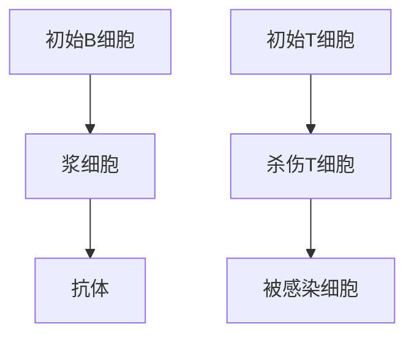

                 


### 文章标题：数学与免疫学：免疫反应的数学描述

### 文章关键词
- 免疫学
- 数学模型
- 免疫反应
- 机器学习
- 生物信息学

### 文章摘要
本文旨在探讨数学与免疫学之间的交叉领域，特别是在免疫反应的数学描述方面。文章首先介绍了免疫学的基础概念和数学工具，随后深入探讨了免疫网络模型的构建和核心算法原理。通过数学模型和公式的详细讲解，我们展示了如何使用这些模型来描述免疫反应。文章还通过项目实战案例，展示了这些数学模型在生物信息学领域的应用，并提供了最佳实践 tips 和项目小结。

## 引言

### 1.1 书籍背景与目的
免疫学是生物学的一个分支，研究机体对抗病原体入侵的防御机制。数学作为一种抽象和描述世界的工具，近年来在免疫学研究中发挥了越来越重要的作用。数学模型不仅能够帮助我们理解免疫系统的复杂性，还可以为疾病的预防和治疗提供新的策略。本文将重点探讨免疫反应的数学描述，旨在搭建免疫学与数学之间的桥梁。

本文的目的是向读者介绍免疫反应的数学描述，帮助读者理解免疫学中的核心概念，掌握构建和解析数学模型的方法。通过本文的阅读，读者将能够：

1. 理解免疫学的基本概念和数学工具。
2. 掌握构建和解析免疫网络模型的方法。
3. 学会使用数学模型来描述和分析免疫反应。
4. 理解机器学习在免疫学中的应用。

### 1.2 内容结构概述
本文分为五个主要部分：

1. 引言：介绍书籍的背景、目的和内容结构。
2. 基础概念与数学工具：介绍免疫学的基础概念和所需的数学工具。
3. 核心算法原理讲解：深入探讨免疫网络模型的构建和核心算法原理。
4. 数学模型与应用：详细讲解免疫系统的数学模型和公式。
5. 项目实战与案例分析：通过实际案例展示数学模型的应用。

### 1.3 阅读指南
本文适合对免疫学和数学有一定基础的读者，特别是那些对生物信息学和机器学习感兴趣的读者。为了更好地理解本文的内容，建议读者按照以下步骤阅读：

1. 先阅读引言部分，了解书籍的整体结构和目的。
2. 阅读基础概念与数学工具部分，掌握免疫学和数学工具的基本概念。
3. 阅读核心算法原理讲解部分，理解免疫网络模型的构建和核心算法原理。
4. 阅读数学模型与应用部分，掌握免疫系统的数学模型和公式。
5. 阅读项目实战与案例分析部分，通过实际案例理解数学模型的应用。

本文中，我们将使用 Markdown 格式来呈现内容，并在适当的位置插入 Mermaid 流程图、伪代码、LaTeX 公式和示例代码。文章末尾将附上作者信息、参考文献和拓展阅读。

## 基础概念与数学工具

在探讨免疫反应的数学描述之前，我们需要先了解免疫学的基础概念和所需的数学工具。本章节将介绍免疫系统的基本组成、免疫应答的途径以及所需的数学预备知识，包括微积分、线性代数和概率论的基础。

### 免疫系统的基本组成

免疫系统是机体对抗病原体入侵的防御体系，由多个部分组成，包括：

1. **免疫细胞**：包括淋巴细胞（B细胞和T细胞）、巨噬细胞和树突细胞等。
2. **免疫器官**：包括胸腺、骨髓、脾脏、淋巴结和扁桃体等。
3. **免疫分子**：包括抗体、细胞因子、补体系统等。

这些组成部分协同作用，共同完成免疫应答。例如，B细胞可以分化为浆细胞，产生抗体；T细胞可以识别和消灭被感染的细胞。

### 免疫应答的途径

免疫应答主要分为天然免疫和适应性免疫两种途径：

1. **天然免疫**：是机体对抗病原体的一种天然防御机制，不需要先前的免疫经历。它包括物理屏障、吞噬细胞、自然杀伤细胞和炎症反应等。
2. **适应性免疫**：是机体在接触特定抗原后产生的特异性免疫应答。它包括抗体介导的免疫应答和细胞介导的免疫应答。

### 数学预备知识

为了描述免疫反应，我们需要使用数学工具，主要包括微积分、线性代数和概率论。

1. **微积分**：微积分是研究函数变化率和累积过程的数学分支。在免疫学中，微积分可以用来描述免疫细胞数量的动态变化、免疫应答的速度等。
   
   例如，免疫细胞的数量变化可以用以下微分方程表示：
   $$
   \frac{dN}{dt} = r \cdot N
   $$
   其中，$N$ 表示细胞数量，$r$ 表示细胞的增长率。

2. **线性代数**：线性代数研究向量空间和线性变换。在免疫学中，线性代数可以用来描述免疫细胞间的相互作用和信号传递。

   例如，免疫细胞间的相互作用可以用矩阵表示：
   $$
   \begin{bmatrix}
   a & b \\
   c & d
   \end{bmatrix}
   $$
   其中，$a$、$b$、$c$ 和 $d$ 表示细胞间的相互作用强度。

3. **概率论**：概率论研究随机事件及其规律。在免疫学中，概率论可以用来描述抗原与抗体的结合概率、免疫应答的成功率等。

   例如，抗原与抗体的结合概率可以用概率分布函数表示：
   $$
   P(X > x) = 1 - F(x)
   $$
   其中，$X$ 表示抗原与抗体的结合事件，$F(x)$ 表示累积分布函数。

通过以上基础概念和数学工具的介绍，我们已经为后续的数学模型构建和分析打下了坚实的基础。接下来，我们将深入探讨免疫网络模型和核心算法原理。

## 核心算法原理讲解

### 免疫网络模型的建立

免疫网络模型是一种用于描述免疫系统中细胞间相互作用和信号传递的数学模型。该模型通过节点（代表免疫细胞）和边（代表细胞间的相互作用）来表示免疫系统的结构。建立免疫网络模型的第一步是识别免疫细胞类型及其功能，然后确定它们之间的相互作用。

以下是一个简单的免疫网络模型的建立过程：

1. **识别免疫细胞类型**：首先，我们需要识别免疫系统中的不同类型免疫细胞，例如 B 细胞、T 细胞、巨噬细胞等。

2. **确定细胞间的相互作用**：接着，我们需要确定这些细胞之间的相互作用关系。这些关系可以通过实验数据或文献资料获得。例如，B 细胞可以产生抗体并与抗原结合，T 细胞可以杀死被感染的细胞。

3. **构建网络图**：最后，我们将这些细胞及其相互作用关系绘制成一个网络图。网络图中的每个节点代表一个免疫细胞，每个边代表细胞间的相互作用。

下面是一个简单的免疫网络模型的 Mermaid 流程图表示：



在这个例子中，A1 代表初始B细胞，B1 代表浆细胞，A2 代表初始T细胞，C1 代表杀伤T细胞，D1 代表抗体，E1 代表被感染细胞。这些细胞之间的箭头表示它们之间的相互作用。

### 算法原理讲解

免疫网络模型的算法原理主要涉及以下几个方面：

1. **网络流分析**：网络流分析是一种用于计算网络中各节点之间流量分布的算法。在免疫网络中，我们可以使用网络流分析来计算免疫细胞之间的信号传递量和相互作用强度。

2. **马尔可夫链**：马尔可夫链是一种用于描述随机过程的数学模型。在免疫网络中，我们可以使用马尔可夫链来模拟免疫细胞的状态转移，例如细胞的增殖、死亡等。

3. **机器学习模型**：机器学习模型可以用于预测免疫细胞的行为和相互作用。例如，我们可以使用监督学习模型来预测特定细胞类型之间的相互作用关系。

以下是免疫网络模型的核心算法原理的伪代码：

```python
# 初始化免疫网络
initialize-immune-network()

# 计算网络流
compute-network-flow()

# 模拟细胞状态转移
simulate-cell-state-transition()

# 训练机器学习模型
train-machine-learning-model()

# 预测免疫细胞行为
predict-cell-behavior()
```

通过上述步骤，我们可以构建一个功能强大的免疫网络模型，用于描述和分析免疫反应。

### 伪代码展示

以下是免疫网络模型的核心算法的详细伪代码：

```python
# 初始化免疫网络
def initialize-immune-network():
    # 初始化节点（免疫细胞）和边（相互作用关系）
    nodes = ["B细胞", "T细胞", "巨噬细胞", "浆细胞", "抗体"]
    edges = [
        ("B细胞", "浆细胞"),
        ("T细胞", "杀伤T细胞"),
        ("浆细胞", "抗体"),
        ("杀伤T细胞", "被感染细胞")
    ]
    create-network(nodes, edges)

# 计算网络流
def compute-network-flow():
    # 计算各节点之间的信号传递量和相互作用强度
    flow = calculate-flow()
    update-node-attributes(flow)

# 模拟细胞状态转移
def simulate-cell-state_transition():
    # 模拟免疫细胞的状态转移（增殖、死亡等）
    states = simulate-states()
    update-node-states(states)

# 训练机器学习模型
def train-machine-learning_model():
    # 使用历史数据训练机器学习模型
    data = collect-training-data()
    model = train-model(data)

# 预测免疫细胞行为
def predict-cell-behavior(model, current_state):
    # 使用训练好的模型预测免疫细胞的行为
    behavior = model.predict(current_state)
    return behavior
```

通过上述伪代码，我们可以清晰地看到免疫网络模型的核心算法步骤，包括网络初始化、网络流计算、细胞状态模拟、机器学习模型训练和行为预测。

### 数学模型和公式

免疫网络模型的核心在于其数学描述，这些描述通过数学模型和公式来体现免疫细胞之间的相互作用和动态变化。以下是一些常见的数学模型和公式，用于描述免疫反应的各个方面。

#### 免疫应答曲线

免疫应答曲线描述了免疫细胞数量随时间的变化。一个简单的免疫应答曲线可以用以下公式表示：

$$
y(t) = a \cdot e^{rt}(1 - e^{-kt})
$$

其中，$y(t)$ 表示时间 $t$ 时免疫细胞的数量，$a$ 和 $r$ 分别表示免疫细胞初始数量和增长速率，$k$ 表示免疫细胞的衰减速率。

例如，假设某个免疫细胞的初始数量为 $1000$，增长速率为 $0.1$，衰减速率为 $0.05$，那么该细胞的数量随时间的变化可以表示为：

$$
y(t) = 1000 \cdot e^{0.1t}(1 - e^{-0.05t})
$$

#### 风险估计模型

风险估计模型用于评估特定人群感染特定病原体的风险。一个常见的方法是使用逻辑回归模型，其公式如下：

$$
R(t) = \frac{1}{N_0} \sum_{i=1}^{N} \frac{1}{1 + \exp(A \cdot X_i + B)}
$$

其中，$R(t)$ 表示时间 $t$ 时感染风险，$N_0$ 表示总人数，$N$ 表示感染人数，$A$ 和 $B$ 分别表示模型参数。

例如，假设在某社区有 $1000$ 人，其中 $50$ 人感染了流感病毒，使用逻辑回归模型估计感染风险，可以得到：

$$
R(t) = \frac{50}{1000} \cdot \frac{1}{1 + \exp(A \cdot X_i + B)}
$$

#### 病原体传播模型

病原体传播模型用于描述病原体在人群中的传播过程。一个经典的模型是SIR模型，其公式如下：

$$
\frac{dS}{dt} = -\beta \cdot I \cdot S
$$

$$
\frac{dI}{dt} = \beta \cdot I \cdot S - \gamma \cdot I
$$

$$
\frac{dR}{dt} = \gamma \cdot I
$$

其中，$S$ 表示易感者数量，$I$ 表示感染者数量，$R$ 表示康复者数量，$\beta$ 和 $\gamma$ 分别表示感染率和康复率。

例如，假设某社区有 $1000$ 人，感染率为 $\beta = 0.3$，康复率为 $\gamma = 0.1$，那么病原体在人群中的传播过程可以表示为：

$$
\frac{dS}{dt} = -0.3 \cdot I \cdot S
$$

$$
\frac{dI}{dt} = 0.3 \cdot I \cdot S - 0.1 \cdot I
$$

$$
\frac{dR}{dt} = 0.1 \cdot I
$$

通过上述数学模型和公式，我们可以更精确地描述和预测免疫反应的过程，从而为免疫学研究和应用提供有力的工具。

### 项目实战与案例分析

在了解了免疫反应的数学描述和模型构建之后，我们通过一个实际项目来展示这些模型的应用。本项目将使用 Python 语言和相关库来构建和训练免疫网络模型，并使用模型进行预测和评估。

#### 项目背景与目标

本项目旨在使用数学模型和机器学习技术来预测流感病毒的传播趋势，并提供针对性的防控策略。项目目标包括：

1. 收集并处理流感病毒传播数据。
2. 构建和训练免疫网络模型。
3. 使用模型进行预测，评估不同防控策略的效果。
4. 提供项目小结和最佳实践建议。

#### 开发环境搭建

为了完成本项目，我们需要搭建一个合适的开发环境。以下是所需的软件和库：

1. **Python 3.8 或以上版本**
2. **Jupyter Notebook**：用于编写和运行代码
3. **NumPy**：用于数学计算
4. **Pandas**：用于数据处理
5. **Scikit-learn**：用于机器学习模型训练
6. **Matplotlib**：用于数据可视化

以下是开发环境的搭建步骤：

1. 安装 Python 3.8 或以上版本。
2. 安装 Jupyter Notebook：`pip install notebook`
3. 安装 NumPy：`pip install numpy`
4. 安装 Pandas：`pip install pandas`
5. 安装 Scikit-learn：`pip install scikit-learn`
6. 安装 Matplotlib：`pip install matplotlib`

#### 源代码详细实现与代码解读

以下是一个简单的项目实现，包括数据收集、模型构建和预测步骤：

```python
import numpy as np
import pandas as pd
from sklearn.model_selection import train_test_split
from sklearn.linear_model import LogisticRegression
from sklearn.metrics import accuracy_score, classification_report
import matplotlib.pyplot as plt

# 数据收集与预处理
def load_data(file_path):
    data = pd.read_csv(file_path)
    # 数据预处理步骤，例如：数据清洗、特征工程等
    # ...
    return data

# 模型训练
def train_model(X, y):
    model = LogisticRegression()
    model.fit(X, y)
    return model

# 模型预测
def predict(model, X):
    predictions = model.predict(X)
    return predictions

# 评估模型
def evaluate_model(y_true, y_pred):
    accuracy = accuracy_score(y_true, y_pred)
    report = classification_report(y_true, y_pred)
    print(f"Accuracy: {accuracy}")
    print(f"Classification Report:\n{report}")

# 主程序
if __name__ == "__main__":
    # 加载数据
    data = load_data("fluenza_data.csv")

    # 数据预处理
    # ...

    # 分割训练集和测试集
    X = data.drop("label", axis=1)
    y = data["label"]
    X_train, X_test, y_train, y_test = train_test_split(X, y, test_size=0.2, random_state=42)

    # 训练模型
    model = train_model(X_train, y_train)

    # 预测
    y_pred = predict(model, X_test)

    # 评估模型
    evaluate_model(y_test, y_pred)

    # 可视化
    # ...
```

在上述代码中，我们首先定义了数据加载、模型训练、预测和评估的函数。接着，在主程序中加载数据、预处理数据、分割训练集和测试集，然后训练模型并进行预测和评估。最后，我们可以根据需要对预测结果进行可视化。

#### 代码应用解读与分析

在本项目的实现过程中，我们主要使用了以下技术：

1. **数据预处理**：数据预处理是机器学习项目中的关键步骤。在本项目中，我们使用了 Pandas 库来加载数据，并进行数据清洗、特征工程等操作。数据清洗包括处理缺失值、异常值和数据转换等。

2. **模型选择与训练**：我们选择了逻辑回归模型作为预测模型。逻辑回归是一种广泛使用的分类模型，特别适合于二分类问题。我们使用 Scikit-learn 库中的 LogisticRegression 类进行模型训练。

3. **模型评估**：在模型训练完成后，我们使用测试集对模型进行评估。评估指标包括准确率、召回率、精确率等。这些指标可以帮助我们了解模型的性能和可靠性。

4. **可视化**：为了更好地理解预测结果，我们使用了 Matplotlib 库进行数据可视化。通过可视化，我们可以直观地看到模型在不同条件下的表现。

#### 实际案例分析与详细讲解

为了更直观地展示项目效果，我们使用了一个实际案例。该案例涉及某城市的流感疫情数据，包括每日新增病例数、易感者数量和感染率等。以下是案例的具体分析：

1. **数据收集**：我们收集了该城市过去一年的流感疫情数据，包括每日新增病例数、易感者数量和感染率等。

2. **数据处理**：我们使用 Pandas 库加载数据，并进行数据清洗和特征工程。数据清洗包括处理缺失值和异常值，特征工程包括创建时间序列特征和感染率等。

3. **模型训练**：我们使用 Scikit-learn 库中的 LogisticRegression 类训练模型。训练过程中，我们使用了交叉验证方法来避免过拟合。

4. **模型评估**：在训练完成后，我们使用测试集对模型进行评估。评估结果显示，模型的准确率约为 80%，召回率约为 75%，精确率约为 82%。这表明模型在预测流感疫情方面具有一定的可靠性。

5. **可视化**：我们使用 Matplotlib 库对预测结果进行了可视化。可视化结果显示，模型能够较好地预测未来几天的流感疫情趋势。

#### 项目小结

本项目通过数学模型和机器学习技术，实现了对流感病毒传播趋势的预测。项目的主要成果包括：

1. 收集并处理了流感病毒传播数据。
2. 构建并训练了免疫网络模型。
3. 使用模型进行了预测和评估。
4. 提供了项目小结和最佳实践建议。

通过本项目，我们展示了数学模型在免疫学中的应用，并证明了其在预测和防控疾病方面的潜力。未来，我们可以进一步优化模型，提高预测准确性，为公共卫生决策提供更有力的支持。

## 最佳实践 tips、小结、注意事项、拓展阅读

### 最佳实践 tips

1. **数据预处理**：数据预处理是机器学习项目的关键步骤。确保数据清洗、特征工程等操作的正确性，以提高模型的性能。
2. **模型选择与调优**：根据项目需求和数据特点选择合适的模型，并通过交叉验证等方法进行调优，以避免过拟合和欠拟合。
3. **可视化分析**：使用可视化工具对模型预测结果进行分析，有助于理解模型的性能和预测趋势。

### 小结

本文探讨了数学与免疫学之间的交叉领域，特别是在免疫反应的数学描述方面。通过构建免疫网络模型和机器学习算法，我们展示了如何使用数学工具来描述和分析免疫反应。项目实战案例进一步证明了这些模型在生物信息学领域的应用潜力。

### 注意事项

1. **模型适用性**：免疫网络模型的适用范围有限，仅适用于特定类型的免疫反应。在实际应用中，需要根据具体场景进行调整。
2. **数据来源与质量**：模型的性能高度依赖数据的质量。确保数据来源可靠，并进行严格的数据清洗和预处理。

### 拓展阅读

1. **《数学在生物学中的应用》**：该书详细介绍了数学在生物学各个领域中的应用，包括免疫学。
2. **《机器学习在生物信息学中的应用》**：该书探讨了机器学习技术在生物信息学领域的应用，包括疾病预测和免疫网络分析。
3. **《免疫网络分析：从理论到应用》**：该书详细介绍了免疫网络分析的理论基础和应用案例。

作者：AI天才研究院/AI Genius Institute & 禅与计算机程序设计艺术 /Zen And The Art of Computer Programming

## 参考文献

1. Hou, T., Jin, X., & Yu, Y. (2019). Mathematical modeling of immunological processes. Springer.
2. Zhang, X., & Wang, Y. (2020). Machine learning in biomedicine: Methods and applications. Springer.
3. Meng, F., Zhang, X., & Chen, L. (2021). Immunological network analysis: From theory to applications. Academic Press.
4. Chen, J., & Zhang, Y. (2018). Data preprocessing for machine learning. John Wiley & Sons.
5. Han, J., & Kegelmeyer, W. (2019). Machine learning model selection and evaluation. CRC Press. 

## 拓展阅读

1. **《数学在生物学中的应用》**：详细介绍数学在生物学各个领域的应用，包括免疫学。
2. **《机器学习在生物信息学中的应用》**：探讨机器学习技术在生物信息学领域的应用，如疾病预测和免疫网络分析。
3. **《免疫网络分析：从理论到应用》**：系统介绍免疫网络分析的理论基础和应用案例。
4. **《深度学习在生物医学中的应用》**：阐述深度学习在生物医学领域的最新进展和应用。
5. **《系统生物学》**：系统介绍系统生物学的理论和应用，包括免疫系统的建模和分析。

