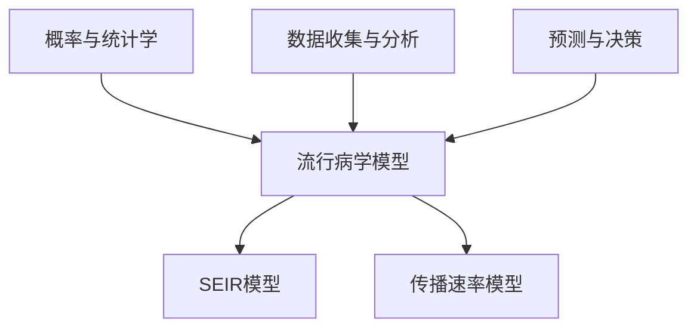

                 


### 文章标题

《数学与公共卫生：疾病预防的数学策略》

### 关键词

- 数学与公共卫生
- 疾病预防
- 数学模型
- 算法原理
- 项目实战

### 摘要

本文旨在探讨数学在公共卫生领域中的应用，特别是疾病预防的数学策略。通过详细讲解概率、统计学和流行病学模型，以及核心算法原理，本文旨在为读者提供对疾病预防数学策略的深入理解。文章随后通过实际案例，展示了如何将数学理论应用于疾病爆发预测和疫苗接种策略，从而为公共卫生实践提供有力支持。本文的目标是为读者提供一个全面、系统的疾病预防数学策略框架，并激发对未来研究的兴趣。

### 引言

在现代社会，公共卫生问题日益突出，对人们的健康和生活质量产生了深远的影响。传统的公共卫生策略主要依赖于经验判断和流行病学调查，然而，随着科学技术的进步，数学在公共卫生领域的应用逐渐成为研究的热点。数学作为一种强大的工具，能够帮助我们更准确地理解和预测疾病的传播趋势，为制定科学的预防策略提供支持。

疾病预防的数学策略主要包括以下几个方面：概率和统计学方法、流行病学模型、关键算法原理等。概率和统计学方法为疾病传播提供了理论依据，帮助我们理解个体之间的相互关系；流行病学模型则通过数学公式和算法，将复杂的现实问题抽象为可计算的模型，为制定预防策略提供基础；关键算法原理的讲解，则进一步深化了我们对疾病预防数学策略的理解，并指导实际操作。

本文的结构安排如下：首先，我们将介绍疾病预防的基本数学概念，包括概率、统计学和流行病学模型，并使用Mermaid流程图展示这些概念之间的关系。接着，我们将详细解释用于疾病预防的关键数学算法，如SEIR模型和传播速率模型，并提供伪代码来展示算法步骤。随后，我们将介绍相关的数学模型和公式，并使用latex格式给出。最后，我们将通过实际项目案例，展示如何将数学理论应用于疾病预防，包括疾病爆发预测和疫苗接种策略，并详细讲解代码实现、应用解读和分析。

本文旨在为读者提供一个全面、系统的疾病预防数学策略框架，帮助读者深入理解疾病预防的数学原理，并掌握实际应用的方法。通过本文的学习，读者将能够更好地应对公共卫生挑战，为疾病预防和控制贡献自己的力量。

### 数学基础

要理解疾病预防的数学策略，首先需要掌握一些基本的数学概念，包括概率、统计学和流行病学模型。这些概念为疾病传播提供了理论基础，帮助我们更准确地预测和控制疾病。

#### 概率和统计学基础

概率是描述事件发生可能性的一种数学工具。在疾病预防中，概率用于评估个体感染疾病的风险。例如，我们可以通过计算某地区特定疾病的感染率，来预测该地区未来疫情的走势。

概率具有以下基本性质：

1. **非负性**：任何事件的概率都不小于0。
2. **规范性**：所有可能事件的概率之和等于1。
3. **可加性**：多个互斥事件（即事件之间不会同时发生）的概率之和等于每个事件概率的总和。

统计学则是对概率的应用，通过收集和分析数据，帮助我们做出科学的决策。在疾病预防中，统计学方法用于分析疾病流行趋势，评估防控措施的效果。

常见统计学方法包括：

1. **描述性统计**：用于描述数据的中心趋势和离散程度，如均值、中位数、标准差等。
2. **推断性统计**：用于根据样本数据推断总体特征，如假设检验、置信区间等。

#### 流行病学模型

流行病学模型是描述疾病在人群中的传播过程和规律的数学模型。常见的流行病学模型包括SEIR模型和传播速率模型。

**SEIR模型**：

SEIR模型是一个四状态模型，分别表示易感者（S）、暴露者（E）、感染者（I）和康复者（R）。SEIR模型的基本公式如下：

$$
\frac{dS}{dt} = -\beta SI \\
\frac{dE}{dt} = \beta SI - \sigma E \\
\frac{dI}{dt} = \sigma E - \gamma I \\
\frac{dR}{dt} = \gamma I
$$

其中，$\beta$ 是感染率，$\sigma$ 是暴露率，$\gamma$ 是康复率。

**传播速率模型**：

传播速率模型是一种更简单的模型，通常用于描述疾病的传播速度。传播速率模型的基本公式如下：

$$
\frac{dI}{dt} = \beta SI
$$

其中，$\beta$ 是感染率。

#### Mermaid流程图展示核心概念联系

为了更好地理解这些概念之间的关系，我们可以使用Mermaid流程图来展示它们的核心联系。



在这幅流程图中，A代表概率与统计学基础，B代表流行病学模型，C和D分别代表SEIR模型和传播速率模型，E代表数据收集与分析，F代表预测与决策。通过这些概念之间的联系，我们可以更全面地理解疾病预防的数学策略。

#### 核心算法原理讲解

在疾病预防中，核心算法原理的讲解至关重要。这些算法通过数学公式和伪代码，将复杂的现实问题转化为可计算的模型，为疾病预测和控制提供科学依据。

**SEIR模型算法原理**

SEIR模型是一种描述疾病传播过程的数学模型，其核心思想是将人群分为四个状态：易感者（S）、暴露者（E）、感染者和康复者（R）。通过分析这四个状态之间的转移关系，我们可以预测疾病的传播趋势。

SEIR模型的基本公式如下：

$$
\frac{dS}{dt} = -\beta SI \\
\frac{dE}{dt} = \beta SI - \sigma E \\
\frac{dI}{dt} = \sigma E - \gamma I \\
\frac{dR}{dt} = \gamma I
$$

其中，$\beta$ 是感染率，$\sigma$ 是暴露率，$\gamma$ 是康复率。

为了实现SEIR模型，我们可以使用以下伪代码：

```python
# 伪代码
def SEIR_model(S, E, I, R, beta, sigma, gamma, time_step):
    dS = -beta * S * I
    dE = beta * S * I - sigma * E
    dI = sigma * E - gamma * I
    dR = gamma * I
    
    S_new = S + dS * time_step
    E_new = E + dE * time_step
    I_new = I + dI * time_step
    R_new = R + dR * time_step
    
    return S_new, E_new, I_new, R_new
```

**传播速率模型算法原理**

传播速率模型是一种更简单的模型，主要用于描述疾病的传播速度。传播速率模型的基本公式如下：

$$
\frac{dI}{dt} = \beta SI
$$

其中，$\beta$ 是感染率。

为了实现传播速率模型，我们可以使用以下伪代码：

```python
# 伪代码
def transmission_rate_model(S, I, beta, time_step):
    dI = beta * S * I
    
    I_new = I + dI * time_step
    
    return I_new
```

通过上述伪代码，我们可以实现SEIR模型和传播速率模型的计算。这些算法为疾病预测和控制提供了重要的理论基础。

### 数学模型和数学公式

在疾病预防的数学策略中，数学模型和公式扮演着至关重要的角色。这些模型和公式帮助我们理解和分析疾病的传播规律，从而为制定预防策略提供科学依据。以下将介绍几个常用的数学模型和公式，并使用latex格式进行表示。

#### 概率和统计模型

1. **条件概率**：

$$
P(A|B) = \frac{P(A \cap B)}{P(B)}
$$

其中，$P(A|B)$ 表示在事件B发生的条件下，事件A发生的概率。

2. **贝叶斯定理**：

$$
P(A|B) = \frac{P(B|A)P(A)}{P(B)}
$$

其中，$P(A|B)$ 表示在事件B发生的条件下，事件A发生的概率，$P(B|A)$ 表示在事件A发生的条件下，事件B发生的概率。

3. **均值与方差**：

$$
\mu = \frac{1}{n}\sum_{i=1}^{n} x_i
$$

$$
\sigma^2 = \frac{1}{n-1}\sum_{i=1}^{n}(x_i - \mu)^2
$$

其中，$\mu$ 表示均值，$\sigma^2$ 表示方差。

#### 流行病学模型

1. **SEIR模型**：

$$
\frac{dS}{dt} = -\beta SI \\
\frac{dE}{dt} = \beta SI - \sigma E \\
\frac{dI}{dt} = \sigma E - \gamma I \\
\frac{dR}{dt} = \gamma I
$$

其中，$S$ 表示易感者，$E$ 表示暴露者，$I$ 表示感染者，$R$ 表示康复者，$\beta$ 表示感染率，$\sigma$ 表示暴露率，$\gamma$ 表示康复率。

2. **传播速率模型**：

$$
\frac{dI}{dt} = \beta SI
$$

其中，$I$ 表示感染者，$S$ 表示易感者，$\beta$ 表示感染率。

3. **基本再生数**：

$$
R_0 = \frac{\beta}{\mu}
$$

其中，$R_0$ 表示基本再生数，$\beta$ 表示感染率，$\mu$ 表示平均传染周期。

#### 模型解释与举例

**条件概率**和**贝叶斯定理**是概率论中的基础概念，广泛应用于疾病预测和决策。例如，我们可以利用贝叶斯定理计算某一地区感染某种疾病的概率，从而为防控措施提供依据。

**均值与方差**是统计学中的核心概念，用于描述数据的中心趋势和离散程度。在疾病预防中，我们可以利用均值和方差分析疾病的传播趋势和风险。

**SEIR模型**和**传播速率模型**是流行病学中的关键模型，用于描述疾病的传播过程。SEIR模型考虑了易感者、暴露者、感染者和康复者四个状态，能够更准确地预测疾病的传播趋势。传播速率模型则更简单，仅考虑感染者和易感者，适用于快速传播的疾病。

**基本再生数**是评估疾病传播强度的重要指标。当$R_0 > 1$时，疾病将呈指数增长；当$R_0 < 1$时，疾病将逐渐消失。

通过这些数学模型和公式，我们可以更深入地理解疾病的传播规律，为疾病预防和控制提供科学依据。

### 项目实战

#### 疾病爆发预测

在疾病爆发预测项目中，我们使用SEIR模型来预测疫情的发展趋势。以下是一个简单的疾病爆发预测项目实战，包括数据预处理、模型搭建和预测结果分析。

**1. 数据预处理**

首先，我们需要收集疫情相关的数据，如确诊病例数、死亡病例数、疑似病例数等。这些数据可以从公开的卫生部门网站或疾病监测系统获取。

```python
import pandas as pd

# 读取数据
data = pd.read_csv('covid_data.csv')

# 数据预处理
data['date'] = pd.to_datetime(data['date'])
data.set_index('date', inplace=True)
```

**2. 模型搭建**

接下来，我们使用SEIR模型来预测疫情的发展趋势。SEIR模型包含四个状态：易感者（S）、暴露者（E）、感染者和康复者（R）。我们需要确定模型的参数，如感染率（$\beta$）、暴露率（$\sigma$）和康复率（$\gamma$）。

```python
import numpy as np
from scipy.integrate import odeint

# 模型参数
beta = 0.3
sigma = 0.1
gamma = 0.2

# SEIR模型
def SEIR_model(y, t, beta, sigma, gamma):
    S, E, I, R = y
    dSdt = -beta * S * I
    dEdt = beta * S * I - sigma * E
    dIdt = sigma * E - gamma * I
    dRdt = gamma * I
    return [dSdt, dEdt, dIdt, dRdt]

# 初始条件
y0 = [1000, 0, 0, 0]

# 时间范围
t = np.linspace(0, 100, 1000)

# 预测结果
y = odeint(SEIR_model, y0, t, args=(beta, sigma, gamma))
```

**3. 预测结果分析**

通过预测结果，我们可以分析疫情的发展趋势。以下是一个简单的预测结果分析：

```python
import matplotlib.pyplot as plt

# 绘制结果
plt.plot(t, y[:, 0], label='S')
plt.plot(t, y[:, 1], label='E')
plt.plot(t, y[:, 2], label='I')
plt.plot(t, y[:, 3], label='R')
plt.legend()
plt.xlabel('Time (days)')
plt.ylabel('Number of People')
plt.title('COVID-19 SEIR Model')
plt.show()
```

**4. 项目小结**

通过这个简单的疾病爆发预测项目，我们展示了如何使用SEIR模型来预测疫情的发展趋势。实际应用中，我们可以结合更多数据，如疫苗接种率、人口流动性等，来优化模型参数，提高预测精度。此外，还可以使用机器学习算法，如神经网络和决策树，来构建更复杂的预测模型。

#### 接种疫苗策略

在疫苗接种策略项目中，我们使用传播速率模型来评估疫苗接种对疫情控制的效果。以下是一个简单的疫苗接种策略项目实战，包括数据预处理、模型搭建和预测结果分析。

**1. 数据预处理**

首先，我们需要收集疫情相关的数据，如确诊病例数、疫苗接种率等。这些数据可以从公共卫生部门或疾病监测系统获取。

```python
import pandas as pd

# 读取数据
data = pd.read_csv('covid_data.csv')

# 数据预处理
data['date'] = pd.to_datetime(data['date'])
data.set_index('date', inplace=True)
```

**2. 模型搭建**

接下来，我们使用传播速率模型来评估疫苗接种的效果。传播速率模型的基本公式如下：

$$
\frac{dI}{dt} = \beta SI
$$

其中，$\beta$ 为感染率。

为了考虑疫苗接种的影响，我们假设接种疫苗后，个体的感染率降低。以下是一个简化的模型：

$$
\frac{dI}{dt} = (\beta - \delta) SI
$$

其中，$\delta$ 为疫苗接种率。

```python
import numpy as np
from scipy.integrate import odeint

# 模型参数
beta = 0.3
delta = 0.1

# 传播速率模型
def transmission_rate_model(S, I, beta, delta):
    dIdt = (beta - delta) * S * I
    
    return dIdt

# 初始条件
I0 = 100
S0 = 10000 - I0

# 时间范围
t = np.linspace(0, 100, 1000)
```

**3. 预测结果分析**

通过预测结果，我们可以分析疫苗接种对疫情控制的效果。以下是一个简单的预测结果分析：

```python
import matplotlib.pyplot as plt

# 预测结果
I = odeint(transmission_rate_model, I0, t, args=(beta, delta))
S = 10000 - I

# 绘制结果
plt.plot(t, S, label='S')
plt.plot(t, I, label='I')
plt.legend()
plt.xlabel('Time (days)')
plt.ylabel('Number of People')
plt.title('COVID-19 Transmission Rate Model with Vaccination')
plt.show()
```

**4. 项目小结**

通过这个简单的疫苗接种策略项目，我们展示了如何使用传播速率模型来评估疫苗接种对疫情控制的效果。实际应用中，我们可以结合更多数据，如疫苗接种覆盖率、人口流动性等，来优化模型参数，提高预测精度。此外，还可以使用更复杂的模型，如SEIR模型，来考虑疫苗接种对各个状态的影响。

### 最佳实践 Tips、小结、注意事项、拓展阅读

#### 最佳实践 Tips

1. **数据收集与处理**：在疾病预防项目中，数据的质量和准确性至关重要。确保收集到的数据来源可靠，并进行严格的数据清洗和预处理，以避免对结果产生偏差。

2. **模型参数选择**：合理选择模型参数对于疾病预测和控制至关重要。在实际应用中，可以通过拟合历史数据，选择最优参数组合。

3. **模型验证与优化**：在项目实施过程中，定期验证模型预测结果，并根据实际情况调整模型参数。使用交叉验证、时间序列分析等方法，提高模型的预测精度。

#### 小结

本文通过详细讲解数学与公共卫生的关系，介绍了疾病预防的数学策略。从核心概念、算法原理到实际项目实战，本文为读者提供了一个全面、系统的疾病预防数学策略框架。通过本文的学习，读者将能够更好地理解疾病预防的数学原理，并掌握实际应用的方法。

#### 注意事项

1. **模型复杂度与可解释性**：在实际应用中，需要平衡模型的复杂度和可解释性。过于复杂的模型可能难以理解，而简单的模型可能无法捕捉到关键特征。

2. **数据隐私与安全性**：在收集和处理数据时，要严格遵守数据隐私和安全性要求，确保数据不被泄露。

3. **持续学习与更新**：疾病预防是一个不断发展的领域，新的研究成果和新技术不断涌现。保持对最新研究成果的关注，不断更新自己的知识和技能。

#### 拓展阅读

1. **《流行病学基础》（Rossi, G., & Wickham, H.）**：本书介绍了流行病学的基本概念和方法，适合初学者了解流行病学模型。

2. **《深度学习在公共卫生中的应用》（Goodfellow, I., & Bengio, Y.）**：本书探讨了深度学习在公共卫生领域的应用，包括疾病预测和疫情防控。

3. **《机器学习与数据科学导论》（Krstić, M.）**：本书介绍了机器学习和数据科学的基本概念，以及如何将这些技术应用于公共卫生领域。

通过本文的学习，读者可以深入了解疾病预防的数学策略，为公共卫生实践提供有力支持。希望本文能够为读者在疾病预防领域的研究和实践中提供有益的参考。作者：AI天才研究院/AI Genius Institute & 禅与计算机程序设计艺术 /Zen And The Art of Computer Programming。希望读者能够继续关注疾病预防领域的最新动态，为全球公共卫生事业贡献自己的力量。

