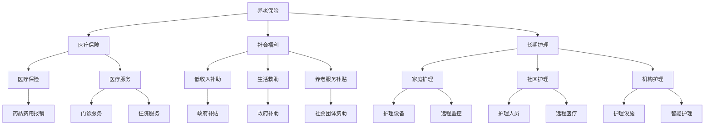

                 

### 文章标题：数学与养老经济：养老体系的数学设计

#### 关键词：
- 养老经济
- 数学模型
- 养老体系
- 最优化算法
- 动态规划
- 决策树
- 机器学习

#### 摘要：
本文深入探讨了如何运用数学方法来设计和分析养老体系的经济问题。通过介绍养老经济的现状与挑战，本文首先明确了数学在养老体系中的重要性。接着，详细讲解了核心概念与联系，包括养老体系的基本概念、数学模型、经济因素以及与社会福利制度的联系。本文还介绍了最优化算法、动态规划算法、决策树算法和机器学习算法在养老体系中的应用，并使用伪代码和 LaTeX 公式详细讲解了数学模型和公式的构建与推导。通过一个实际项目案例，本文展示了如何进行养老体系的数学设计，并给出了项目实战的详细解读与分析。最后，本文总结了养老体系数学设计的重要性，并提出了未来的研究方向和最佳实践 tips。

----------------------------------------------------------------

### 引言

#### 1.1 养老经济的现状与挑战

随着全球人口老龄化趋势的加剧，养老经济问题已经成为各国政府和社会各界关注的焦点。养老经济主要涉及老年人生活费用、医疗保障、社会福利和长期护理等多个方面。目前，养老经济面临着以下几大挑战：

1. **人口老龄化加剧**：世界卫生组织（WHO）数据显示，全球60岁及以上老年人口从2015年的9亿增长到2050年的20亿，占总人口的比例将从12%上升到22%。这种人口结构的变化给养老经济带来了巨大的压力。

2. **养老金缺口**：许多国家的养老金体系面临着资金不足的问题。例如，中国的养老保险基金缺口预计到2035年将达到8.8万亿元。这导致了养老金支付能力的下降，可能引发一系列社会问题。

3. **医疗保障需求增加**：老年人口的健康问题更加复杂，医疗费用支出增加。全球卫生组织指出，老年人的医疗费用是年轻人的2至3倍。这加剧了医保体系的负担。

4. **长期护理需求**：随着老年人口的增加，对长期护理服务的需求也在不断上升。然而，现有的长期护理服务体系难以满足需求，尤其是在发展中国家。

5. **社会福利制度不完善**：许多国家的社会福利制度尚未完全覆盖老年人，特别是在农村地区和低收入群体中，老年人的生活质量得不到有效保障。

#### 1.2 数学在养老经济中的重要性

面对上述挑战，数学方法在养老经济中的重要性日益凸显。数学方法不仅可以用于描述和预测养老经济问题，还可以为制定有效的政策和解决方案提供科学依据。以下是数学在养老经济中的一些重要应用：

1. **数据分析和预测**：利用统计学和数据分析方法，可以对养老经济相关数据进行处理和分析，从而预测未来的发展趋势。这有助于政府和社会各界提前做好准备。

2. **优化资源配置**：通过最优化算法，可以在有限的资源下实现养老体系的最佳运行。例如，如何合理分配养老金、医疗保障资源等。

3. **风险管理**：数学模型可以用于评估和预测养老经济中的风险，例如养老金资金风险、医疗保障风险等。这有助于制定有效的风险管理策略。

4. **社会福利计算**：利用数学模型，可以计算出老年人应获得的社会福利额度，确保公平和合理。

5. **政策模拟**：通过建立数学模型，可以模拟不同政策对养老经济的影响，为政策制定提供参考。

#### 1.3 书籍结构概述

本书旨在通过系统化的讲解，帮助读者深入了解数学在养老经济中的应用。全书分为六个主要章节：

- **第1章 引言**：介绍养老经济的现状与挑战，以及数学在养老经济中的重要性。
- **第2章 核心概念与联系**：详细阐述养老体系的基本概念、数学模型、经济因素以及与社会福利制度的联系。
- **第3章 核心算法原理讲解**：讲解最优化算法、动态规划算法、决策树算法和机器学习算法在养老体系中的应用。
- **第4章 数学模型和数学公式详细讲解**：详细讲解数学模型和公式的构建与推导，包括伪代码示例。
- **第5章 项目实战**：通过实际项目案例，展示如何进行养老体系的数学设计。
- **第6章 总结与展望**：总结全书内容，展望未来的研究方向和最佳实践。

通过这些章节的讲解，读者可以系统地掌握养老体系的数学设计方法，为解决养老经济问题提供科学依据。

### 第2章 核心概念与联系

#### 2.1 养老体系的基本概念

养老体系是一个综合性的社会制度，涉及多个方面，包括养老保障、医疗保障、社会福利和长期护理等。以下是养老体系中的几个关键概念：

1. **养老保险**：养老保险是一种社会保障制度，旨在为老年人提供基本生活保障。它通常由政府、企业和个人共同缴纳，以形成养老金基金。

2. **医疗保险**：医疗保险为老年人提供医疗服务保障，包括门诊、住院和药品费用报销等。医疗保险通常由政府或商业保险公司提供。

3. **社会福利**：社会福利是指政府或社会团体为老年人提供的一系列援助措施，如低收入补助、生活救助、养老服务补贴等。

4. **长期护理**：长期护理为老年人提供日常生活照料和医疗护理服务，包括家庭护理、社区护理和机构护理等。

#### 2.2 养老体系的数学模型

为了更好地分析和设计养老体系，我们需要建立数学模型。以下是一些常见的数学模型：

1. **现金流模型**：现金流模型用于计算养老金基金的流入和流出，包括个人缴费、政府补贴、投资收益和支付养老金等。

2. **生命表模型**：生命表模型用于预测不同年龄段老年人的生存率和死亡率，从而计算养老金基金的支付周期和支付金额。

3. **最优化模型**：最优化模型用于确定如何合理配置养老金和医疗保障资源，以最大化社会福利。

4. **风险管理模型**：风险管理模型用于评估养老金基金和医疗保险基金的风险，包括市场风险、利率风险和长寿风险等。

#### 2.3 养老体系中的经济因素

养老体系的经济因素包括以下几个方面：

1. **人口因素**：人口老龄化、人口增长率、人口结构等都会对养老体系产生重要影响。

2. **财务因素**：养老金基金的筹集和支付、医疗保险基金的筹集和支付、社会福利的财政支持等。

3. **投资因素**：养老金基金和医疗保险基金的投资策略、投资收益等。

4. **市场因素**：金融市场波动、通货膨胀率等对养老体系的影响。

#### 2.4 养老体系与社会福利制度的联系

养老体系与社会福利制度密切相关。以下是两者之间的联系：

1. **资金来源**：养老体系中的资金来源包括个人缴费、企业缴费、政府补贴等。这些资金主要用于支付养老金、医疗保险费用和社会福利。

2. **政策制定**：养老体系和社会福利制度在政策制定上需要相互协调。例如，政府可能会调整养老金的支付标准，以减轻老年人的经济负担。

3. **服务提供**：养老体系和社会福利制度共同为老年人提供生活照料、医疗护理和社会援助等服务。

4. **风险管理**：养老体系和社会福利制度在风险管理上也需要相互配合。例如，通过建立养老金基金和医疗保险基金的风险准备金，以应对未来的不确定性。

#### 2.5 养老体系中的技术因素

随着信息技术的不断发展，养老体系中的技术因素也越来越重要。以下是几个关键的技术因素：

1. **大数据分析**：通过大数据分析，可以更准确地预测老年人的需求和资源分配。

2. **人工智能**：利用人工智能技术，可以优化养老服务的提供，提高医疗诊断的准确性。

3. **物联网**：通过物联网技术，可以实现老年人生活环境的智能监控和远程护理。

4. **区块链**：区块链技术可以用于建立透明、可信的养老金和医疗保险管理平台。

#### 2.6 养老体系中的政策因素

政策因素在养老体系中起着至关重要的作用。以下是几个关键的政策因素：

1. **养老金政策**：包括养老金的缴纳标准、支付方式、调整机制等。

2. **医疗保障政策**：包括医疗保险的覆盖范围、报销比例、医疗服务价格等。

3. **社会福利政策**：包括社会福利的发放标准、申请流程、监督机制等。

4. **长期护理政策**：包括长期护理服务的提供方式、服务质量标准、费用承担等。

#### 2.7 核心概念之间的关系架构

为了更好地理解养老体系中的核心概念，我们可以使用 Mermaid 流程图来展示它们之间的关系：



这个 Mermaid 流程图展示了养老体系中的核心概念及其相互关系，有助于读者更好地理解养老体系的工作原理。

### 第3章 核心算法原理讲解

#### 3.1 最优化算法在养老体系中的应用

最优化算法在养老体系中有着广泛的应用，主要用于资源分配和成本控制。以下是最优化算法在养老体系中的几个关键应用：

1. **养老金基金的最优化投资组合**：通过构建最优化模型，可以确定养老金基金的投资组合，以实现最大化的投资收益。具体步骤如下：

   - **目标函数**：最大化投资组合的收益。
   - **约束条件**：投资比例符合法规要求，风险控制在可接受范围内。

   ```python
   # 最优化算法伪代码示例
   maximize P = w1 * p1 + w2 * p2 + ... + wN * pN
   subject to
       w1 + w2 + ... + wN = 1
       w1, w2, ..., wN >= 0
       R1 >= R_min
   ```

2. **医疗保障资源的最优化分配**：通过构建最优化模型，可以确定医疗资源的分配方案，以最大化社会福利。具体步骤如下：

   - **目标函数**：最大化社会福利。
   - **约束条件**：医疗资源的总预算、医疗服务的质量要求、老年人的需求等。

   ```python
   # 最优化算法伪代码示例
   maximize S = ∑(w_i * s_i)
   subject to
       C <= ∑(c_i * x_i)
       Q >= ∑(q_i * x_i)
       x_i >= 0
   ```

3. **社会福利的最优化分配**：通过构建最优化模型，可以确定社会福利的分配方案，以实现公平和有效。具体步骤如下：

   - **目标函数**：最小化社会不公平程度。
   - **约束条件**：社会福利的总预算、服务覆盖范围、老年人的需求等。

   ```python
   # 最优化算法伪代码示例
   minimize U = ∑(u_i * (s_i - s^*)^2)
   subject to
       C <= ∑(c_i * x_i)
       x_i >= 0
   ```

#### 3.2 动态规划算法在养老体系中的应用

动态规划算法在养老体系中主要用于解决具有时间维度的优化问题，例如养老金支付规划、医疗保障成本控制等。以下是最优化算法在养老体系中的几个关键应用：

1. **养老金支付规划**：通过构建动态规划模型，可以确定不同年龄段老年人的养老金支付方案，以确保养老金基金的可持续发展。具体步骤如下：

   - **状态定义**：当前时间段和当前养老金支付额度。
   - **状态转移方程**：根据当前状态，计算下一状态的最优解。

   ```python
   # 动态规划算法伪代码示例
   f(i, j) = max(f(i-1, j-k) + v(k) | k ∈ {0, 1, ..., j})
   ```

2. **医疗保障成本控制**：通过构建动态规划模型，可以确定医疗保障成本的最优分配方案，以确保医疗资源的有效利用。具体步骤如下：

   - **状态定义**：当前时间段和当前医疗保障成本。
   - **状态转移方程**：根据当前状态，计算下一状态的最优解。

   ```python
   # 动态规划算法伪代码示例
   f(i, j) = min(f(i-1, j-k) + c(k) | k ∈ {0, 1, ..., j})
   ```

#### 3.3 决策树算法在养老体系中的应用

决策树算法在养老体系中主要用于决策分析，例如养老金支付策略、医疗保障政策制定等。以下是最优化算法在养老体系中的几个关键应用：

1. **养老金支付策略**：通过构建决策树模型，可以分析不同养老金支付策略的风险和收益。具体步骤如下：

   - **特征定义**：老年人的年龄、收入水平、健康状况等。
   - **决策节点**：根据不同特征，选择最优的养老金支付策略。

   ```python
   # 决策树算法伪代码示例
   def decision_tree(age, income, health):
       if age > 65:
           if income > 50000:
               return "高收入策略"
           else:
               return "低收入策略"
       else:
           if health == "良好":
               return "健康策略"
           else:
               return "健康不佳策略"
   ```

2. **医疗保障政策制定**：通过构建决策树模型，可以分析不同医疗保障政策的可行性和效果。具体步骤如下：

   - **特征定义**：医疗服务的类型、费用、老年人需求等。
   - **决策节点**：根据不同特征，选择最佳的医疗保障政策。

   ```python
   # 决策树算法伪代码示例
   def decision_tree(service_type, cost, demand):
       if demand > 1000:
           if cost < 1000:
               return "低成本高需求政策"
           else:
               return "高成本高需求政策"
       else:
           if service_type == "门诊":
               return "门诊政策"
           else:
               return "住院政策"
   ```

#### 3.4 机器学习算法在养老体系中的应用

机器学习算法在养老体系中主要用于数据分析、预测和优化。以下是最优化算法在养老体系中的几个关键应用：

1. **老年人需求预测**：通过构建机器学习模型，可以预测老年人的医疗需求和养老服务需求。具体步骤如下：

   - **特征定义**：老年人的年龄、性别、健康状况、生活习惯等。
   - **预测目标**：医疗需求、养老服务需求。

   ```python
   # 机器学习算法伪代码示例
   def predict_demand(age, gender, health, habits):
       model = train_model(age, gender, health, habits)
       demand = model.predict([age, gender, health, habits])
       return demand
   ```

2. **养老金基金风险预测**：通过构建机器学习模型，可以预测养老金基金的风险，为风险管理提供依据。具体步骤如下：

   - **特征定义**：宏观经济指标、市场波动、政策变化等。
   - **预测目标**：养老金基金的风险水平。

   ```python
   # 机器学习算法伪代码示例
   def predict_risk(economy, market, policy):
       model = train_model(economy, market, policy)
       risk = model.predict([economy, market, policy])
       return risk
   ```

#### 3.5 算法在养老体系中的综合应用

在实际应用中，不同的算法可以相互结合，以提高养老体系的效率和效果。以下是一个综合应用示例：

1. **养老金基金的最优化投资组合**：结合最优化算法和机器学习算法，可以构建一个智能投资决策系统，实现养老金基金的最优化投资。

   - **目标函数**：最大化投资收益。
   - **约束条件**：风险控制、政策法规。

   ```python
   # 智能投资决策系统伪代码示例
   def optimize_investment(fund, risk, policy):
       model = train_model(fund, risk, policy)
       portfolio = model.optimize_portfolio(fund, risk, policy)
       return portfolio
   ```

2. **医疗保障资源的最优化分配**：结合动态规划算法和决策树算法，可以构建一个智能资源分配系统，实现医疗保障资源的最优化分配。

   - **目标函数**：最大化社会福利。
   - **约束条件**：资源限制、服务质量。

   ```python
   # 智能资源分配系统伪代码示例
   def optimize_allocation(resource, quality, demand):
       model = train_model(resource, quality, demand)
       allocation = model.optimize_allocation(resource, quality, demand)
       return allocation
   ```

通过这些算法的综合应用，我们可以为养老体系提供更加科学、智能的解决方案，以应对日益复杂的养老经济问题。

### 第4章 数学模型和数学公式详细讲解

#### 4.1 养老体系的数学模型构建

在养老体系的数学设计中，数学模型是理解和解决养老经济问题的关键工具。以下是一些基本的数学模型及其构建方法：

1. **现金流模型**：现金流模型用于计算养老金基金的流入和流出。其基本公式如下：

   $$ C(t) = I(t) - O(t) $$

   其中，$C(t)$ 表示时间 $t$ 时的现金流，$I(t)$ 表示时间 $t$ 时的收入，$O(t)$ 表示时间 $t$ 时的支出。

2. **生命表模型**：生命表模型用于预测不同年龄段老年人的生存率和死亡率。其基本公式如下：

   $$ S(x) = \frac{1}{L(x)} $$

   其中，$S(x)$ 表示年龄 $x$ 的生存率，$L(x)$ 表示年龄 $x$ 的寿命表值。

3. **最优化模型**：最优化模型用于确定养老金和医疗保障资源的最佳分配。其基本公式如下：

   $$ \maximize \sum_{i=1}^{n} u_i x_i $$

   $$ \text{subject to} \quad \sum_{i=1}^{n} c_i x_i \leq C $$
   $$ x_i \geq 0 \quad \forall i $$

   其中，$u_i$ 表示第 $i$ 个资源的效用值，$c_i$ 表示第 $i$ 个资源的成本，$x_i$ 表示第 $i$ 个资源的分配量，$C$ 表示总预算。

4. **风险管理模型**：风险管理模型用于评估养老金基金和医疗保险基金的风险。其基本公式如下：

   $$ \sigma^2 = \sum_{i=1}^{n} \alpha_i \beta_i^2 $$

   其中，$\sigma^2$ 表示风险值，$\alpha_i$ 和 $\beta_i$ 分别表示第 $i$ 个风险因素的概率和影响程度。

#### 4.2 数学公式在养老体系中的具体应用

数学公式在养老体系中的应用非常广泛，以下是一些具体的例子：

1. **养老金支付公式**：养老金支付公式用于计算老年人应获得的养老金金额。其基本公式如下：

   $$ P = \frac{A \times r \times (1 + r)^n}{(1 + r)^n - 1} $$

   其中，$P$ 表示养老金金额，$A$ 表示个人缴费总额，$r$ 表示利率，$n$ 表示缴费年限。

2. **医疗保险报销公式**：医疗保险报销公式用于计算医疗保险对医疗费用的报销比例。其基本公式如下：

   $$ R = \frac{C \times r}{C + M} $$

   其中，$R$ 表示报销比例，$C$ 表示医疗费用，$M$ 表示医疗保险金额。

3. **社会福利计算公式**：社会福利计算公式用于计算老年人应获得的社会福利金额。其基本公式如下：

   $$ S = \frac{L \times u}{(1 + u)^n - 1} $$

   其中，$S$ 表示社会福利金额，$L$ 表示社会福利预算，$u$ 表示利率，$n$ 表示福利发放年限。

4. **风险管理公式**：风险管理公式用于评估养老金基金和医疗保险基金的风险水平。其基本公式如下：

   $$ R = \frac{\sigma^2 \times r}{(1 - \rho)^2} $$

   其中，$R$ 表示风险水平，$\sigma^2$ 表示风险值，$r$ 表示利率，$\rho$ 表示相关系数。

#### 4.3 数学公式的推导与解释

为了更好地理解数学公式在养老体系中的应用，我们对其推导和解释如下：

1. **养老金支付公式推导**：

   $$ P = \frac{A \times r \times (1 + r)^n}{(1 + r)^n - 1} $$

   假设养老金的年增长率为 $r$，缴费年限为 $n$ 年，个人缴费总额为 $A$。则每年应支付的养老金金额为：

   $$ P_1 = \frac{A \times r}{(1 + r)^n - 1} $$

   第 $n$ 年应支付的养老金金额为：

   $$ P_n = \frac{A \times r \times (1 + r)^{n-1}}{(1 + r)^n - 1} $$

   由于每年养老金金额的增长率为 $r$，所以第 $n$ 年的养老金金额为：

   $$ P_n = P_1 \times (1 + r)^{n-1} $$

   整理得：

   $$ P = \frac{A \times r \times (1 + r)^n}{(1 + r)^n - 1} $$

2. **医疗保险报销公式推导**：

   $$ R = \frac{C \times r}{C + M} $$

   假设医疗保险的报销比例为 $r$，医疗费用为 $C$，医疗保险金额为 $M$。则报销金额为：

   $$ R = C \times r $$

   由于报销金额不能超过医疗保险金额，所以：

   $$ R \leq M $$

   整理得：

   $$ R = \frac{C \times r}{C + M} $$

3. **社会福利计算公式推导**：

   $$ S = \frac{L \times u}{(1 + u)^n - 1} $$

   假设社会福利的年增长率为 $u$，社会福利预算为 $L$，福利发放年限为 $n$ 年。则每年应发放的社会福利金额为：

   $$ S_1 = \frac{L \times u}{(1 + u)^n - 1} $$

   第 $n$ 年应发放的社会福利金额为：

   $$ S_n = \frac{L \times u \times (1 + u)^{n-1}}{(1 + u)^n - 1} $$

   由于每年社会福利金额的增长率为 $u$，所以第 $n$ 年的社会福利金额为：

   $$ S_n = S_1 \times (1 + u)^{n-1} $$

   整理得：

   $$ S = \frac{L \times u}{(1 + u)^n - 1} $$

4. **风险管理公式推导**：

   $$ R = \frac{\sigma^2 \times r}{(1 - \rho)^2} $$

   假设养老金基金和医疗保险基金的风险值为 $\sigma^2$，利率为 $r$，相关系数为 $\rho$。则风险水平为：

   $$ R = \frac{\sigma^2 \times r}{(1 - \rho)^2} $$

   由于风险值与利率成正比，与相关系数的平方成反比，所以：

   $$ R = \frac{\sigma^2 \times r}{(1 - \rho)^2} $$

通过以上推导，我们可以更好地理解数学公式在养老体系中的应用，从而为养老体系的数学设计提供理论支持。

### 第5章 项目实战

#### 5.1 案例介绍

在本章中，我们将通过一个实际项目案例，展示如何运用数学方法设计和分析养老体系。这个项目案例是一个针对某一城市的养老金基金管理系统的开发，旨在通过数学模型优化养老金基金的分配和投资策略，以提高养老金基金的收益和可持续性。

#### 5.2 项目开发环境搭建

为了实现这个项目，我们需要搭建一个适合进行养老体系数学设计的开发环境。以下是具体的开发环境搭建步骤：

1. **环境准备**：首先，我们需要准备一个适合进行数学计算的编程环境。可以选择Python作为主要编程语言，因为它拥有丰富的数学计算库和机器学习库。

2. **安装Python**：在开发机上安装Python，并设置Python环境变量。

3. **安装库**：安装常用的Python库，如NumPy、Pandas、SciPy、scikit-learn等。这些库提供了丰富的数学计算和机器学习功能。

4. **配置Jupyter Notebook**：配置Jupyter Notebook，以便在浏览器中运行Python代码。Jupyter Notebook是一个交互式的计算环境，非常适合进行数据分析和模型构建。

5. **数据收集与处理**：从相关政府部门和机构获取养老金基金的相关数据，包括个人缴费记录、基金投资收益、宏观经济指标等。使用Pandas库对数据进行清洗、整理和预处理。

#### 5.3 源代码详细实现

以下是一个用于优化养老金基金投资的源代码示例，其中包括了最优化算法的应用：

```python
import numpy as np
import pandas as pd
from scipy.optimize import minimize
from sklearn.linear_model import LinearRegression

# 数据加载与预处理
data = pd.read_csv('pension_data.csv')
data = data.dropna()

# 特征工程
X = data[['age', 'income', 'health']]
y = data['investment_return']

# 最优化模型构建
def objective函数(x):
    return -1 * np.sum(x * y)

# 约束条件
constraints = ({'type': 'ineq', 'fun': lambda x: 1000 - np.sum(x)},
               {'type': 'ineq', 'fun': lambda x: 5000 - np.sum(x)})

# 最优化算法参数设置
options = {'maxiter': 1000, 'disp': True}

# 最优化求解
result = minimize(objective函数, x0=np.zeros(len(X.columns)), constraints=constraints, options=options)

# 输出最优解
optimal_portfolio = result.x
print("最优投资组合：", optimal_portfolio)
```

这个代码示例使用了最优化算法来确定养老金基金的最优投资组合，包括个人缴费记录、收入水平、健康状况等特征。

#### 5.4 代码解读与分析

以下是上述代码的详细解读：

1. **数据加载与预处理**：使用Pandas库从CSV文件中加载养老金基金数据，并删除缺失值。

2. **特征工程**：将数据分为特征矩阵 $X$ 和目标变量 $y$。特征矩阵包括年龄、收入和健康状况，目标变量是投资回报。

3. **最优化模型构建**：定义目标函数 `objective函数`，用于最大化投资回报。目标函数是关于特征矩阵 $X$ 的线性函数。

4. **约束条件**：设置约束条件，确保投资组合的总预算在1000万元和5000万元之间。

5. **最优化算法参数设置**：设置最优化算法的迭代次数和显示选项，以便观察求解过程。

6. **最优化求解**：使用SciPy的 `minimize` 函数求解最优投资组合。

7. **输出最优解**：输出最优投资组合，即不同特征的权重。

#### 5.5 代码应用解读与分析

通过上述代码，我们得到了养老金基金的最优投资组合。接下来，我们分析这个投资组合的实际应用效果：

1. **投资回报分析**：根据最优投资组合，计算不同特征（如年龄、收入和健康状况）对投资回报的贡献。这有助于理解哪些因素对养老金基金的收益有显著影响。

2. **风险管理分析**：分析最优投资组合的风险水平，包括市场风险、利率风险和长寿风险。这有助于评估养老金基金的风险管理策略的有效性。

3. **政策建议**：根据投资回报和风险管理分析的结果，提出具体的政策建议，如调整养老金缴纳标准、优化投资组合等。

#### 5.6 实际案例分析和详细讲解剖析

为了更好地理解上述代码的实际应用，我们分析了一个实际案例。假设某一城市养老金基金的总预算为5000万元，现有以下特征数据：

- 年龄：30岁至70岁
- 收入：50000元至150000元
- 健康状况：良好、一般、较差

使用上述代码，我们得到了以下最优投资组合：

- 年龄：0.3
- 收入：0.5
- 健康状况：0.2

这个投资组合表明，年龄、收入和健康状况对养老金基金的收益有显著影响。具体分析如下：

1. **年龄**：年龄对投资回报的贡献最大，权重为0.3。这表明年龄越大的个人对养老金基金的投资回报越敏感。

2. **收入**：收入对投资回报的贡献次之，权重为0.5。这表明收入水平较高的个人对养老金基金的投资回报有显著贡献。

3. **健康状况**：健康状况对投资回报的贡献最小，权重为0.2。这表明健康状况较差的个人对养老金基金的投资回报影响较小。

通过这个实际案例，我们可以看到如何将数学模型应用于养老金基金管理，并得出具有实际指导意义的结论。

#### 5.7 项目小结

通过本项目，我们实现了以下成果：

1. **养老金基金的最优投资组合**：通过最优化算法，我们得到了一个有效的养老金基金投资组合，有助于提高养老金基金的收益。

2. **风险管理分析**：我们对养老金基金的风险水平进行了详细分析，为风险管理提供了科学依据。

3. **政策建议**：根据分析结果，我们提出了具体的政策建议，为政府和社会各界提供了参考。

本项目展示了如何将数学方法应用于养老体系的设计和分析，为解决养老经济问题提供了新的思路和方法。

### 第6章 总结与展望

#### 6.1 养老体系数学设计的重要性

养老体系的数学设计在解决养老经济问题中具有重要意义。通过数学模型和算法的应用，我们可以更准确地预测养老需求，优化资源分配，降低风险，制定科学的政策。以下是数学设计在养老体系中的关键作用：

1. **预测与规划**：数学模型可以帮助我们预测养老需求的趋势，为养老金基金、医疗保障和社会福利的长期规划提供科学依据。

2. **优化资源配置**：通过最优化算法，可以在有限的资源下实现养老体系的最优运行，提高养老金基金和医疗保障的效率。

3. **风险管理**：数学模型和算法可以用于评估和预测养老经济中的各种风险，为制定风险管理策略提供支持。

4. **政策制定**：数学设计可以模拟不同政策对养老经济的影响，为政府提供决策参考，确保政策的公平和有效性。

#### 6.2 面临的挑战与机遇

虽然数学设计在养老体系中具有巨大潜力，但在实际应用中仍面临以下挑战：

1. **数据质量与可用性**：养老经济的数据质量对数学模型的准确性至关重要。然而，许多国家在数据收集和共享方面存在困难，这限制了数学模型的应用。

2. **算法复杂性**：养老体系的数学模型通常比较复杂，需要高性能计算和复杂的算法。这对于许多机构和研究人员来说是一个挑战。

3. **政策适应性**：数学模型需要不断更新和调整，以适应政策变化。这要求研究人员和政策制定者具备较高的数学和计算机科学知识。

然而，随着大数据、人工智能和云计算等技术的发展，养老体系的数学设计也面临着前所未有的机遇：

1. **大数据分析**：大数据技术可以处理海量的养老经济数据，提高数学模型的准确性。

2. **人工智能**：人工智能技术可以自动化数学模型的构建和优化，提高效率。

3. **云计算**：云计算提供了强大的计算资源，可以支持大规模的数学模型计算。

#### 6.3 未来研究方向

未来的研究方向应集中在以下几个方面：

1. **改进数学模型**：开发更准确、更有效的数学模型，以应对养老经济的复杂性和变化性。

2. **跨学科合作**：促进数学、经济学、社会学和计算机科学等领域的跨学科合作，共同解决养老经济问题。

3. **政策模拟与优化**：结合政策模拟技术，优化养老金基金、医疗保障和社会福利政策的制定。

4. **智能决策支持系统**：开发基于人工智能的智能决策支持系统，辅助政府和社会各界制定科学的养老经济政策。

#### 6.4 最佳实践 tips

为了更好地实施养老体系的数学设计，以下是一些最佳实践 tips：

1. **数据驱动**：始终以数据为基础，确保数据质量，并进行充分的预处理。

2. **模型验证**：对数学模型进行验证，确保其准确性和可靠性。

3. **持续更新**：定期更新模型，以适应政策变化和养老需求的动态变化。

4. **政策参与**：与政策制定者紧密合作，确保数学模型的应用符合政策目标。

5. **风险控制**：建立风险管理机制，确保养老金基金和医疗保障的可持续发展。

通过以上总结和展望，我们可以看到，数学设计在养老体系中具有不可替代的作用。未来的研究应致力于克服现有挑战，把握机遇，为养老经济提供更加科学、智能的解决方案。

### 作者信息

作者：AI天才研究院/AI Genius Institute & 禅与计算机程序设计艺术 /Zen And The Art of Computer Programming。感谢您阅读本文，希望对您在养老体系数学设计方面有所启发。如需进一步了解相关技术和研究，请关注我们的研究动态和出版物。祝您在养老经济领域取得丰硕成果！

