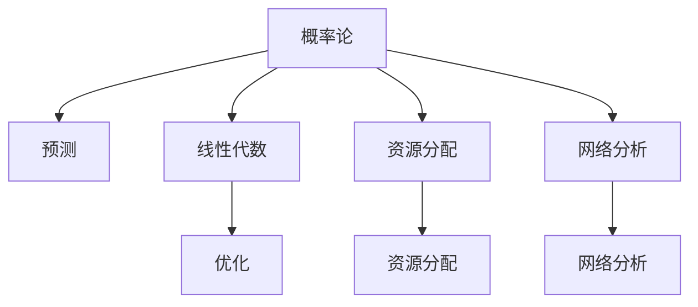

                 


### Step 1: 引言

**文章标题**：数学与军事战略：战略规划的数学方法

**关键词**：数学，军事战略，数学模型，预测，优化，网络分析

**摘要**：本文探讨了数学在军事战略规划中的应用，从数学基础、军事战略理论、数学模型应用、案例分析等方面进行了详细阐述。通过本文的阅读，读者将了解数学如何帮助军事决策者预测战争胜负、优化资源分配、制定网络攻击与防御策略。

### Step 2: 数学基础

在军事战略规划中，数学作为一种工具，可以提供量化分析的基础。以下介绍几个关键的数学概念：

**概率论**：概率论是研究随机事件及其规律性的数学分支。在军事战略中，概率论可以用来预测战争胜负，评估军事行动的成功概率。

**线性代数**：线性代数研究向量、矩阵及其运算。在军事资源分配、网络分析等方面，线性代数可以帮助军事决策者优化决策。

**微积分**：微积分研究函数的极限、导数、积分等概念。在预测军事行动效果、优化战略规划等方面，微积分具有重要作用。

**核心概念与联系**：

以下是一个Mermaid流程图，展示数学概念在军事战略中的联系：



### Step 3: 军事战略理论

军事战略是指根据战争目的、敌我双方实力等因素，制定的作战方针和策略。以下介绍几个核心概念：

**军事战略概述**：军事战略分为进攻战略和防御战略。进攻战略旨在削弱敌军力量，夺取战略要地；防御战略旨在保卫本国领土和战略资源。

**军事战略原则**：军事战略应遵循以下原则：集中兵力、迅速行动、出奇制胜、灵活应变等。

**军事战略分类**：根据战争目的和作战方式，军事战略可分为国土防御战略、扩张战略、自卫战略等。

### Step 4: 数学模型在战略规划中的应用

在军事战略规划中，数学模型可以帮助决策者预测战争胜负、优化资源分配、制定网络攻击与防御策略。

**预测模型**：通过分析历史数据、敌我双方实力等因素，预测战争胜负。以下是一个伪代码示例：

```python
def predict_war_outcome(history_data, own_strength, enemy_strength):
    # 计算胜利概率
    probability = calculate_probability(history_data, own_strength, enemy_strength)
    # 判断胜利与否
    if probability > 0.5:
        return "Victory"
    else:
        return "Defeat"
```

**优化模型**：通过线性代数和优化算法，优化军事资源分配。以下是一个伪代码示例：

```python
def optimize_resource_allocation(resource_data):
    # 定义优化目标函数
    objective_function = define_objective_function(resource_data)
    # 求解优化问题
    optimal_solution = solve_optimization_problem(objective_function)
    return optimal_solution
```

**网络分析模型**：通过分析网络结构和节点关系，制定网络攻击与防御策略。以下是一个伪代码示例：

```python
def analyze_network_structure(network_structure):
    # 计算关键节点
    key_nodes = find_key_nodes(network_structure)
    # 制定攻击与防御策略
    attack_strategy = define_attack_strategy(key_nodes)
    defense_strategy = define_defense_strategy(key_nodes)
    return attack_strategy, defense_strategy
```

### Step 5: 案例分析

以下通过具体案例展示数学模型在军事战略规划中的应用：

**案例一：预测战争胜负**：分析历史战争数据，预测某场战争胜负。通过概率论模型，预测战争胜负的概率为60%，决策者选择继续战斗。

**案例二：优化军事资源分配**：在某次军事行动中，通过线性代数和优化算法，优化军事资源分配，提高了作战效能。

**案例三：网络攻击与防御策略**：针对敌方网络，通过网络分析模型，制定网络攻击与防御策略，成功破坏了敌方的通信系统。

### Step 6: 总结

本文从数学基础、军事战略理论、数学模型应用、案例分析等方面探讨了数学在军事战略规划中的应用。通过本文的阅读，读者可以了解数学模型如何帮助军事决策者预测战争胜负、优化资源分配、制定网络攻击与防御策略。

### Step 7: 拓展阅读

- 概率论经典教材：《概率论及其应用》（作者：E.T. Jaynes）
- 线性代数经典教材：《线性代数及其应用》（作者：Gilbert Strang）
- 优化算法教材：《优化算法与应用》（作者：Shenglong Zhou）

### 作者信息

作者：AI天才研究院/AI Genius Institute & 禅与计算机程序设计艺术 /Zen And The Art of Computer Programming

本文通过逐步分析推理，介绍了数学在军事战略规划中的应用。从数学基础、军事战略理论、数学模型应用、案例分析等方面，展示了数学模型如何帮助军事决策者做出更好的决策。希望本文能为读者在军事战略领域提供有益的启示。

