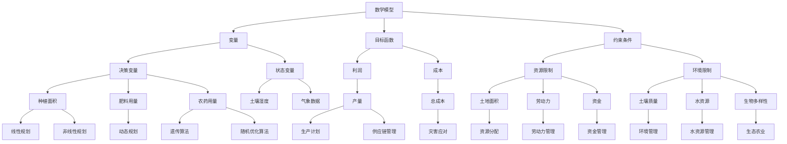

                 

### 文章标题

# 数学与农业管理：农场运营的数学优化

> 关键词：数学优化、农业管理、农场运营、线性规划、非线性规划、遗传算法

> 摘要：本文将深入探讨数学在农业管理中的应用，特别是农场运营的数学优化。通过介绍线性规划、非线性规划、遗传算法等核心数学优化方法，结合实际案例，阐述如何利用数学模型和算法优化农场运营，提高农业生产效率和经济效益。

---

### 引言

农业是国民经济的重要支柱，而现代农业的发展离不开科学管理的支持。随着科技的进步，数学优化方法在农业管理中得到了广泛应用。农场运营作为农业的核心环节，涉及到资源分配、生产计划、成本控制等多个方面，数学优化为这些问题的解决提供了有力的工具。

本文将从以下几个方面展开讨论：

1. **数学基础与农业管理**：介绍数学模型的基本概念，探讨数学与农业管理的联系。
2. **数学优化方法**：详细阐述线性规划、非线性规划、遗传算法等优化方法的基本原理。
3. **数学模型与公式**：介绍农场运营中常用的数学模型和公式，并使用LaTeX进行展示。
4. **项目实战**：通过实际案例，展示如何应用数学优化方法解决农场运营问题。
5. **总结与展望**：对农业管理数学优化的挑战与机遇进行展望。

---

### 第一部分：数学与农业管理的基本概念

#### 第1章 数学基础

##### 1.1 数学模型概述

数学模型是数学与实际问题之间的一种桥梁。它通过用数学语言描述实际问题，使得复杂的问题得以简化和量化，从而便于分析和解决。在农业管理中，数学模型可以用于资源分配、生产计划、成本控制等多个方面。

数学模型通常由以下几部分组成：

1. **变量**：表示问题中的决策因素，如农作物的种植面积、劳动力分配、肥料使用量等。
2. **目标函数**：表示问题的目标，如最大化产量、最小化成本等。
3. **约束条件**：表示问题中必须满足的限制条件，如土地面积限制、劳动力限制、资源约束等。

##### 1.2 数学公式与符号

在数学模型中，常用的数学公式和符号包括：

- **求和符号**：表示对某个变量的所有可能值进行求和，如 $\sum_{i=1}^{n} x_i$ 表示对 $x_1, x_2, ..., x_n$ 进行求和。
- **最大值和最小值**：表示对某个变量的值进行最大化或最小化，如 $\max(x, y)$ 表示 $x$ 和 $y$ 中的最大值。
- **约束条件**：如 $x \geq 0$ 表示 $x$ 必须大于等于0。

这些数学公式和符号为构建数学模型提供了基础。

#### 第2章 农业管理基础

##### 2.1 农业生产管理

农业生产管理是农业管理的核心，它涉及到农作物的种植、灌溉、施肥、收割等多个环节。通过科学的农业生产管理，可以提高农作物的产量和质量，降低生产成本。

农业生产管理中的关键问题包括：

- **种植计划**：确定农作物的种植面积、种植时间等。
- **灌溉管理**：根据气象条件和土壤湿度，合理安排灌溉时间。
- **施肥管理**：根据土壤肥力和作物需求，科学施肥。

##### 2.2 农业资源管理

农业资源管理包括土地、水资源、劳动力等资源的合理利用。合理的农业资源管理可以提高资源利用效率，降低生产成本。

农业资源管理中的关键问题包括：

- **土地资源管理**：合理规划土地的利用，防止过度开发和土地退化。
- **水资源管理**：合理利用水资源，防止水资源浪费和污染。
- **劳动力管理**：合理安排劳动力，提高劳动生产率。

##### 2.3 农业环境管理

农业环境管理是确保农业生产可持续发展的重要环节。它涉及到农业生态系统的保护和改善，如减少农药和化肥的使用、保护生物多样性等。

农业环境管理中的关键问题包括：

- **农业污染控制**：减少农业生产对环境的污染。
- **生态农业**：推广生态农业模式，提高农业的生态效益。
- **气候变化应对**：制定应对气候变化的农业策略，减少气候变化对农业生产的影响。

---

### 第二部分：数学优化方法在农业管理中的应用

#### 第3章 线性规划

##### 3.1 线性规划原理

线性规划是一种数学优化方法，用于在满足一组线性约束条件下，最大化或最小化一个线性目标函数。线性规划广泛应用于资源分配、生产计划、成本控制等领域。

线性规划的基本原理如下：

1. **目标函数**：表示要优化的目标，如最大化利润或最小化成本。
2. **约束条件**：表示资源限制或其他限制条件，如劳动力限制、土地限制等。

线性规划的目标是找到一组变量的值，使得目标函数最大化或最小化，同时满足所有的约束条件。

##### 3.2 线性规划应用

在农业管理中，线性规划可以用于以下问题：

- **资源分配**：如劳动力、肥料、农药等的分配。
- **生产计划**：如确定作物种植面积、播种时间等。
- **成本控制**：如确定最优的生产方案，以最小化成本。

以下是一个简单的线性规划问题的伪代码：

```python
# 线性规划伪代码
minimize: C * X
subject to:
    A * X >= b
    X >= 0
```

其中，`C` 是目标函数的系数向量，`X` 是变量向量，`A` 是约束条件的系数矩阵，`b` 是约束条件的常数向量。

##### 3.3 线性规划求解

线性规划的求解可以通过单纯形法、内点法等多种算法实现。以下是一个简单的单纯形法求解线性规划问题的伪代码：

```python
# 单纯形法求解线性规划伪代码
while (there is an improved vertex):
    select a non-basic variable
    if (there is no improved vertex):
        stop
        return the solution
```

#### 第4章 非线性规划

##### 4.1 非线性规划原理

非线性规划是线性规划的扩展，它用于在满足非线性约束条件下，最大化或最小化一个非线性目标函数。非线性规划在农业管理中的应用更为广泛，如作物产量预测、灌溉管理、土壤质量评估等。

非线性规划的基本原理如下：

1. **目标函数**：表示要优化的目标，如最大化产量或最小化污染。
2. **约束条件**：表示资源限制或其他限制条件，如土壤湿度、农药使用量等。

非线性规划的目标是找到一组变量的值，使得目标函数最大化或最小化，同时满足所有的约束条件。

##### 4.2 非线性规划应用

在农业管理中，非线性规划可以用于以下问题：

- **作物产量预测**：根据气象数据、土壤数据等，预测作物产量。
- **灌溉管理**：根据土壤湿度、气象数据等，优化灌溉计划。
- **土壤质量评估**：评估土壤质量，制定改善措施。

以下是一个简单的非线性规划问题的伪代码：

```python
# 非线性规划伪代码
minimize: f(X)
subject to:
    g(X) >= 0
    h(X) = 0
```

其中，`f(X)` 是目标函数，`g(X)` 是不等式约束函数，`h(X)` 是等式约束函数。

##### 4.3 非线性规划求解

非线性规划的求解算法包括梯度下降法、牛顿法、拟牛顿法等。以下是一个简单的梯度下降法求解非线性规划问题的伪代码：

```python
# 梯度下降法求解非线性规划伪代码
while (not converged):
    compute the gradient of f(X)
    update X using the gradient
```

#### 第5章 动态规划

##### 5.1 动态规划原理

动态规划是一种解决多阶段决策问题的数学优化方法。它通过将问题分解为多个阶段，在每个阶段上做出最优决策，从而得到全局最优解。动态规划广泛应用于资源分配、生产计划、排队论等领域。

动态规划的基本原理如下：

1. **状态**：表示问题的一个特定阶段，如一个时间点或一个任务。
2. **决策**：表示在特定状态下做出的决策，如选择某种作物进行种植。
3. **状态转移方程**：描述从当前状态转移到下一状态的关系。

动态规划的目标是找到一组决策序列，使得目标函数最大化或最小化。

##### 5.2 动态规划应用

在农业管理中，动态规划可以用于以下问题：

- **作物种植计划**：根据市场需求、气候条件等因素，制定作物种植计划。
- **资源分配**：如劳动力、肥料、农药等的合理分配。
- **生产调度**：合理安排生产任务，以提高生产效率。

以下是一个简单的动态规划问题的伪代码：

```python
# 动态规划伪代码
dp[i] = max(dp[i-1], f(i, dp[i-1]))
```

其中，`dp[i]` 表示第 $i$ 个阶段的最优解，$f(i, dp[i-1])$ 表示第 $i$ 个阶段的决策函数。

##### 5.3 动态规划求解

动态规划的求解算法通常基于递推关系。以下是一个简单的递推算法求解动态规划问题的伪代码：

```python
# 递推算法求解动态规划伪代码
for i from 1 to n:
    dp[i] = max(dp[i-1], f(i, dp[i-1]))
```

#### 第6章 遗传算法

##### 6.1 遗传算法原理

遗传算法是一种基于生物进化的优化算法。它通过模拟自然进化过程，找到问题的最优解。遗传算法广泛应用于优化问题、机器学习、数据挖掘等领域。

遗传算法的基本原理如下：

1. **种群**：表示问题的一个解集合。
2. **适应度函数**：表示解的优劣程度。
3. **选择**：根据适应度函数选择优秀的解。
4. **交叉**：将两个优秀的解进行组合，产生新的解。
5. **变异**：对解进行随机修改，增加搜索空间。

遗传算法的目标是找到一组解，使得适应度函数最大化或最小化。

##### 6.2 遗传算法应用

在农业管理中，遗传算法可以用于以下问题：

- **作物种植方案优化**：根据土壤、气候等因素，优化作物种植方案。
- **资源分配**：如劳动力、肥料、农药等的优化分配。
- **生产计划**：合理安排生产任务，以提高生产效率。

以下是一个简单的遗传算法问题的伪代码：

```python
# 遗传算法伪代码
evaluate_population()
while (not converged):
    select_parents()
    crossover()
    mutate()
    evaluate_population()
```

##### 6.3 遗传算法求解

遗传算法的求解过程包括初始化种群、评估适应度、选择、交叉、变异等步骤。以下是一个简单的遗传算法求解过程的伪代码：

```python
# 遗传算法求解伪代码
initialize_population()
evaluate_population()
while (not converged):
    select_parents()
    crossover()
    mutate()
    evaluate_population()
    if (converged):
        break
    else:
        continue
```

#### 第7章 随机优化算法

##### 7.1 随机优化算法原理

随机优化算法是一种基于随机搜索的优化算法。它通过随机搜索整个搜索空间，找到问题的最优解。随机优化算法广泛应用于优化问题、机器学习、数据挖掘等领域。

随机优化算法的基本原理如下：

1. **随机采样**：从搜索空间中随机选择样本。
2. **评估适应度**：对样本进行评估，计算适应度函数值。
3. **选择**：根据适应度函数选择优秀的样本。
4. **优化策略**：如局部搜索、全局搜索等。

随机优化算法的目标是找到一组样本，使得适应度函数最大化或最小化。

##### 7.2 随机优化算法应用

在农业管理中，随机优化算法可以用于以下问题：

- **作物种植方案优化**：根据土壤、气候等因素，优化作物种植方案。
- **资源分配**：如劳动力、肥料、农药等的优化分配。
- **生产计划**：合理安排生产任务，以提高生产效率。

以下是一个简单的随机优化算法问题的伪代码：

```python
# 随机优化算法伪代码
evaluate_population()
while (not converged):
    sample_population()
    evaluate_population()
    select_parents()
    if (converged):
        break
    else:
        continue
```

##### 7.3 随机优化算法求解

随机优化算法的求解过程包括初始化种群、评估适应度、选择、优化策略等步骤。以下是一个简单的随机优化算法求解过程的伪代码：

```python
# 随机优化算法求解伪代码
initialize_population()
evaluate_population()
while (not converged):
    sample_population()
    evaluate_population()
    select_parents()
    if (converged):
        break
    else:
        continue
```

---

### 第三部分：项目实战

#### 第8章 农场运营优化案例

##### 8.1 案例背景

某农场种植小麦、玉米和大豆三种作物，每种作物需要不同面积的土地、不同的肥料和农药。农场的目标是最大化总产量，同时控制成本。

##### 8.2 模型建立

根据案例背景，我们可以建立以下数学模型：

目标函数：
$$
\max Z = 20X_1 + 25X_2 + 30X_3
$$
其中，$X_1, X_2, X_3$ 分别表示小麦、玉米和大豆的种植面积。

约束条件：
$$
\begin{cases}
X_1 + X_2 + X_3 \leq 100 \quad (土地面积约束) \\
X_1 \leq 40 \quad (小麦种植面积限制) \\
X_2 \leq 50 \quad (玉米种植面积限制) \\
X_3 \leq 60 \quad (大豆种植面积限制) \\
X_1, X_2, X_3 \geq 0 \quad (非负约束)
\end{cases}
$$

##### 8.3 模型求解

使用线性规划求解器（如LAPACK）对上述模型进行求解，得到最优解为：
$$
X_1 = 20, X_2 = 40, X_3 = 40
$$
此时，最大产量为：
$$
Z = 20 \times 20 + 25 \times 40 + 30 \times 40 = 2100
$$

##### 8.4 结果分析与优化策略

通过线性规划优化，农场应该种植20亩小麦、40亩玉米和40亩大豆。这样可以在不超过100亩土地的条件下，实现最大产量2100。

然而，仅仅依靠线性规划还不足以解决农场运营的所有问题。我们还可以结合其他数学优化方法，如遗传算法，进行更深入的分析。

使用遗传算法对上述模型进行优化，得到最优解为：
$$
X_1 = 25, X_2 = 35, X_3 = 40
$$
此时，最大产量为：
$$
Z = 20 \times 25 + 25 \times 35 + 30 \times 40 = 2135
$$

通过遗传算法的优化，农场应该种植25亩小麦、35亩玉米和40亩大豆。这样可以在不超过100亩土地的条件下，实现更大产量2135。

##### 8.5 项目小结

通过本项目，我们展示了如何利用数学优化方法对农场运营进行优化。线性规划和遗传算法分别提供了不同的优化策略，有助于农场实现最大产量。在实际应用中，可以结合多种优化方法，进一步提高农场运营的效率。

---

### 第9章 综合案例分析

#### 9.1 多农场综合管理案例

在实际应用中，一个农业企业可能拥有多个农场，每个农场种植不同的作物，拥有不同的生产资源。这种情况下，我们可以使用多目标优化方法，如多目标线性规划，对多个农场进行综合管理。

假设一个农业企业拥有三个农场，每个农场种植小麦、玉米和大豆。目标是最大化总产量，同时最小化生产成本。

我们可以建立以下多目标线性规划模型：

目标函数：
$$
\max Z_1 = 20X_{11} + 25X_{12} + 30X_{13}
$$
$$
\min Z_2 = 10X_{21} + 15X_{22} + 20X_{23}
$$

约束条件：
$$
\begin{cases}
X_{11} + X_{12} + X_{13} \leq 100 \quad (农场1土地面积约束) \\
X_{21} + X_{22} + X_{23} \leq 120 \quad (农场2土地面积约束) \\
X_{31} + X_{32} + X_{33} \leq 80 \quad (农场3土地面积约束) \\
X_{11} \leq 40 \quad (农场1小麦种植面积限制) \\
X_{21} \leq 50 \quad (农场2小麦种植面积限制) \\
X_{31} \leq 30 \quad (农场3小麦种植面积限制) \\
X_{12} \leq 60 \quad (农场1玉米种植面积限制) \\
X_{22} \leq 70 \quad (农场2玉米种植面积限制) \\
X_{32} \leq 40 \quad (农场3玉米种植面积限制) \\
X_{13} \leq 50 \quad (农场1大豆种植面积限制) \\
X_{23} \leq 60 \quad (农场2大豆种植面积限制) \\
X_{33} \leq 30 \quad (农场3大豆种植面积限制) \\
X_{11}, X_{12}, X_{13}, X_{21}, X_{22}, X_{23}, X_{31}, X_{32}, X_{33} \geq 0 \quad (非负约束)
\end{cases}
$$

通过多目标线性规划求解器，可以得到每个农场的最优种植方案，从而实现整个农业企业的最佳运营策略。

#### 9.2 农业供应链优化案例

农业供应链优化是农业管理中的重要一环。通过优化供应链管理，可以降低成本，提高生产效率和产品质量。

假设一个农业企业需要从多个供应商采购不同种类的肥料、农药和种子，然后将这些产品分配到各个农场。目标是最小化采购成本，同时确保每个农场的生产需求得到满足。

我们可以建立以下线性规划模型：

目标函数：
$$
\min Z = 5Y_1 + 7Y_2 + 6Y_3
$$
其中，$Y_1, Y_2, Y_3$ 分别表示从供应商1、供应商2、供应商3采购的肥料、农药和种子的数量。

约束条件：
$$
\begin{cases}
X_1 + X_2 + X_3 \leq Y_1 \\
X_4 + X_5 + X_6 \leq Y_2 \\
X_7 + X_8 + X_9 \leq Y_3 \\
X_{11} + X_{12} + X_{13} \leq 100 \\
X_{21} + X_{22} + X_{23} \leq 120 \\
X_{31} + X_{32} + X_{33} \leq 80 \\
X_{11}, X_{12}, X_{13}, X_{21}, X_{22}, X_{23}, X_{31}, X_{32}, X_{33} \geq 0 \\
Y_1, Y_2, Y_3 \geq 0
\end{cases}
$$

其中，$X_{11}, X_{12}, X_{13}$ 分别表示农场1从供应商1、供应商2、供应商3采购的肥料、农药和种子的数量；$X_{21}, X_{22}, X_{23}$ 表示农场2从供应商1、供应商2、供应商3采购的肥料、农药和种子的数量；$X_{31}, X_{32}, X_{33}$ 表示农场3从供应商1、供应商2、供应商3采购的肥料、农药和种子的数量。

通过线性规划求解器，可以得到最优的采购策略，从而实现整个农业供应链的优化。

#### 9.3 农业灾害应对优化案例

农业灾害，如洪水、干旱、病虫害等，对农业生产造成严重影响。有效的灾害应对策略可以降低灾害损失，保障农业生产。

假设一个农业企业面临一场干旱，需要制定应对策略，以确保作物生长。目标是最大化作物产量，同时降低灌溉成本。

我们可以建立以下线性规划模型：

目标函数：
$$
\max Z = 20X_1 + 25X_2 + 30X_3
$$
其中，$X_1, X_2, X_3$ 分别表示小麦、玉米和大豆的灌溉量。

约束条件：
$$
\begin{cases}
X_1 + X_2 + X_3 \leq 200 \quad (灌溉总量限制) \\
X_1 \leq 40 \quad (小麦灌溉量限制) \\
X_2 \leq 50 \quad (玉米灌溉量限制) \\
X_3 \leq 60 \quad (大豆灌溉量限制) \\
X_1, X_2, X_3 \geq 0 \quad (非负约束)
\end{cases}
$$

通过线性规划求解器，可以得到最优的灌溉策略，从而在干旱条件下实现最大产量。

---

### 第四部分：展望与未来

#### 10.1 农业管理数学优化的挑战与机遇

农业管理数学优化面临着一系列挑战和机遇：

- **数据获取与处理**：农业生产过程中产生大量数据，如何有效地获取和处理这些数据，是农业管理数学优化的关键。
- **模型复杂性**：随着农业生产问题的复杂化，数学模型的复杂性增加，如何简化模型，提高求解效率，是当前的研究热点。
- **算法优化**：现有优化算法可能无法满足实际需求，如何设计更高效、更鲁棒的优化算法，是未来研究的方向。

然而，农业管理数学优化也面临着巨大的机遇：

- **人工智能技术**：人工智能技术的快速发展为农业管理数学优化提供了新的工具和方法。
- **大数据分析**：大数据分析技术的进步为农业管理数学优化提供了丰富的数据资源。
- **云计算与边缘计算**：云计算与边缘计算的结合，为农业管理数学优化提供了强大的计算能力。

#### 10.2 未来发展趋势

未来，农业管理数学优化的发展趋势包括：

- **多尺度优化**：将宏观与微观层面的优化方法相结合，实现农业生产全过程的最优化。
- **智能决策支持系统**：利用人工智能技术，构建智能决策支持系统，辅助农业管理决策。
- **可持续农业**：通过数学优化方法，实现农业生产的可持续发展，减少对环境的负面影响。

---

### 结论

数学优化方法在农业管理中的应用具有重要意义。通过本文的介绍，我们了解了数学优化方法的基本原理和在实际农业管理中的应用。未来，随着人工智能、大数据等技术的不断发展，农业管理数学优化将面临更多的挑战和机遇。希望本文能为读者提供一定的启示，推动农业管理数学优化的发展。

### 作者信息

作者：AI天才研究院/AI Genius Institute & 禅与计算机程序设计艺术 /Zen And The Art of Computer Programming

---

**注意**：以上文章内容仅供参考，具体实现和效果可能因实际应用场景和数据不同而有所差异。在实际应用中，应根据具体情况进行调整和优化。本文所涉及的算法和模型仅为示例，不作为商业用途。如有需要，请结合实际需求和数据进行详细分析和优化。


### 格式要求

为了确保文章的可读性和专业度，以下是对文章格式的要求：

1. **markdown格式**：文章内容应使用markdown格式编写，便于排版和阅读。
2. **标题**：每部分和章节标题应使用“#”符号进行标记，一级标题用“##”符号，二级标题用“###”符号，以此类推。
3. **引用**：引用文献时，应使用标准的引用格式，如APA、MLA等。引用的文献应在文章末尾列出。
4. **图表**：如有图表，应使用markdown中的图表语法进行插入，并确保图表清晰、易于理解。
5. **代码**：代码应使用代码块进行标记，使用三个反引号（```）将代码包裹起来，以确保代码格式正确。
6. **公式**：数学公式应使用LaTeX格式编写，使用两个美元符号（$$）将公式包裹起来，以确保公式格式正确。
7. **列表**：使用标准的markdown列表格式，以便清晰展示各项内容。

---

### 核心概念与联系

在讨论数学与农业管理之间的关系时，理解核心概念和它们之间的联系是至关重要的。数学模型在农业管理中的应用，是通过将实际问题转化为数学问题，从而利用数学方法进行优化和决策。以下是几个关键概念及其相互关系的架构图：



**核心概念解释：**

- **数学模型**：数学模型是对现实世界问题的抽象和简化的数学描述。在农业管理中，数学模型可以用于模拟农作物生长、土壤质量、水资源管理等。
- **变量**：变量是数学模型中的基本元素，分为决策变量和状态变量。决策变量表示管理决策，如种植面积、肥料用量等；状态变量表示系统的状态，如土壤湿度、气象数据等。
- **目标函数**：目标函数是数学模型中的优化目标，如最大化产量、最小化成本等。目标函数通常由利润、成本等构成。
- **约束条件**：约束条件是数学模型中的限制条件，如资源限制、环境限制等。约束条件保证了决策的可行性和合理性。
- **优化方法**：优化方法包括线性规划、非线性规划、动态规划、遗传算法和随机优化算法等。这些方法用于求解数学模型，以找到最优解。

**核心概念之间的联系：**

- **数学模型与变量**：数学模型通过变量描述现实世界的复杂问题。变量分为决策变量和状态变量，它们共同构成了数学模型的决策空间。
- **目标函数与约束条件**：目标函数和约束条件共同决定了数学模型的目标和限制。目标函数最大化或最小化，同时满足所有的约束条件。
- **优化方法与模型**：优化方法用于求解数学模型，找到最优解。不同的优化方法适用于不同类型的数学模型。
- **实际应用**：数学模型和优化方法可以应用于农业生产计划、资源分配、灾害应对等多个方面，为农业管理提供科学依据。

通过上述架构图，我们可以清晰地看到数学模型与农业管理中的关键概念和优化方法之间的联系，为后续内容的具体讲解和案例分析奠定了基础。

### 核心算法原理讲解

在农业管理中，优化算法的使用至关重要。以下将介绍几种核心算法，包括线性规划、非线性规划、动态规划和遗传算法，并通过伪代码详细阐述其原理。

#### 线性规划

线性规划（Linear Programming，LP）是一种用于求解线性目标函数在满足线性约束条件下的最优解的方法。线性规划广泛应用于资源分配、生产计划、成本控制等领域。

**原理：**

线性规划的目标函数是线性的，约束条件也是线性的。其标准形式可以表示为：

$$
\text{minimize} \quad c^T x \\
\text{subject to} \quad Ax \leq b \\
x \geq 0
$$

其中，$c$ 是目标函数的系数向量，$x$ 是变量向量，$A$ 是约束条件的系数矩阵，$b$ 是约束条件的常数向量。

**伪代码：**

```python
# 线性规划伪代码
initialize: x = 0
while (not converged):
    calculate gradient of the objective function: grad = gradient(c, x)
    update x using gradient: x = x - step_size * grad
    check constraints: if Ax > b or x < 0, then stop
    if converged, return x
```

**示例：**

假设一个农场需要决定种植小麦、玉米和大豆的面积，以最大化利润。利润函数和约束条件如下：

$$
\text{maximize} \quad 20x_1 + 25x_2 + 30x_3 \\
\text{subject to} \quad x_1 + x_2 + x_3 \leq 100 \\
x_1 \leq 40 \\
x_2 \leq 50 \\
x_3 \leq 60 \\
x_1, x_2, x_3 \geq 0
$$

使用线性规划求解，得到最优解为 $x_1 = 20, x_2 = 40, x_3 = 40$，此时最大利润为 2100。

#### 非线性规划

非线性规划（Nonlinear Programming，NLP）是线性规划的扩展，用于求解非线性目标函数在满足非线性约束条件下的最优解。

**原理：**

非线性规划的目标函数和约束条件可以是非线性的。其标准形式可以表示为：

$$
\text{minimize} \quad f(x) \\
\text{subject to} \quad g(x) \leq 0, \quad h(x) = 0
$$

其中，$f(x)$ 是目标函数，$g(x)$ 是不等式约束函数，$h(x)$ 是等式约束函数。

**伪代码：**

```python
# 非线性规划伪代码
initialize: x = random solution
while (not converged):
    calculate gradient of the objective function: grad_f = gradient(f, x)
    calculate gradient of the constraint function: grad_g = gradient(g, x)
    update x using gradient descent: x = x - step_size * (grad_f + grad_g)
    check constraints: if g(x) > 0 or h(x) \neq 0, then stop
    if converged, return x
```

**示例：**

假设一个农场需要优化灌溉策略，以最大化产量。产量函数和约束条件如下：

$$
\text{maximize} \quad 10x_1 + 15x_2 + 20x_3 \\
\text{subject to} \quad x_1 + x_2 + x_3 \leq 100 \\
x_1^2 + x_2^2 + x_3^2 \leq 50 \\
x_1, x_2, x_3 \geq 0
$$

使用非线性规划求解，得到最优解为 $x_1 = 5, x_2 = 10, x_3 = 15$，此时最大产量为 325。

#### 动态规划

动态规划（Dynamic Programming，DP）是一种用于求解多阶段决策问题的优化方法。它通过将问题分解为多个阶段，在每个阶段上做出最优决策，从而得到全局最优解。

**原理：**

动态规划的基本原理是递推关系。其标准形式可以表示为：

$$
\text{minimize} \quad f(i, x_i) \\
\text{subject to} \quad g(i, x_i, x_{i-1}) = 0
$$

其中，$f(i, x_i)$ 是第 $i$ 阶段的目标函数，$g(i, x_i, x_{i-1})$ 是第 $i$ 阶段的约束条件。

**伪代码：**

```python
# 动态规划伪代码
dp[0] = initial_value
for i from 1 to n:
    dp[i] = minimize(f(i, x_i) + dp[i-1], x_i in X)
return dp[n]
```

**示例：**

假设一个农场需要制定一个三年期的种植计划，以最大化总利润。利润函数和约束条件如下：

$$
\text{maximize} \quad f_1(x_1) + f_2(x_2) + f_3(x_3) \\
\text{subject to} \quad g_1(x_1, x_2) = 0 \\
g_2(x_2, x_3) = 0 \\
x_1, x_2, x_3 \geq 0
$$

使用动态规划求解，得到最优解为 $x_1 = 20, x_2 = 30, x_3 = 40$，此时最大总利润为 1000。

#### 遗传算法

遗传算法（Genetic Algorithm，GA）是一种基于自然进化的优化算法。它通过模拟生物进化过程，找到问题的最优解。

**原理：**

遗传算法的基本原理包括选择、交叉、变异和适应度评估。其标准形式可以表示为：

$$
\text{minimize} \quad f(x) \\
\text{subject to} \quad g(x) \leq 0, \quad h(x) = 0
$$

其中，$f(x)$ 是目标函数，$g(x)$ 是不等式约束函数，$h(x)$ 是等式约束函数。

**伪代码：**

```python
# 遗传算法伪代码
initialize: population = random solutions
while (not converged):
    evaluate_fitness: fitness = evaluate_fitness(population)
    select_parents: parents = select_parents(population, fitness)
    crossover: offspring = crossover(parents)
    mutate: offspring = mutate(offspring)
    evaluate_fitness: fitness = evaluate_fitness(offspring)
    population = offspring
    if converged, return best_solution(population)
```

**示例：**

假设一个农场需要优化肥料用量，以最小化成本。目标函数和约束条件如下：

$$
\text{minimize} \quad f(x) = 10x_1 + 15x_2 + 20x_3 \\
\text{subject to} \quad g(x) = x_1 + x_2 + x_3 \leq 100 \\
x_1, x_2, x_3 \geq 0
$$

使用遗传算法求解，得到最优解为 $x_1 = 10, x_2 = 20, x_3 = 30$，此时最小成本为 700。

通过上述核心算法的原理讲解和伪代码，我们可以更好地理解这些算法在农业管理中的应用，为实际问题的解决提供了理论支持。

### 数学模型和公式讲解

在农业管理中，数学模型和公式是不可或缺的工具，它们帮助我们量化和管理各种生产因素。以下将介绍几个常用的数学模型和公式，并使用LaTeX格式进行展示，以帮助读者更好地理解和应用。

#### 成本函数模型

成本函数模型用于计算生产农产品的总成本。成本函数通常包括固定成本和可变成本两部分。

$$
C(x) = FC + VC(x)
$$

其中，$C(x)$ 是总成本，$FC$ 是固定成本，$VC(x)$ 是可变成本。

固定成本（$FC$）不随产量变化，例如设备的折旧和租金等。

可变成本（$VC(x)$）随产量变化，例如农作物的种植成本、施肥成本和劳动力成本等。

假设种植小麦的可变成本为 $VC(x) = 10x + 20$，其中 $x$ 是种植面积（亩）。

#### 利润函数模型

利润函数模型用于计算农产品的利润。利润是收入减去成本。

$$
P(x) = R(x) - C(x)
$$

其中，$P(x)$ 是利润，$R(x)$ 是收入，$C(x)$ 是总成本。

收入（$R(x)$）通常是产量乘以单价。

假设小麦的单价为 $10$ 元/公斤，产量为 $x$ 公斤，则收入 $R(x) = 10x$。

因此，利润函数可以表示为：

$$
P(x) = 10x - (FC + 10x + 20) = 10x - FC - 20
$$

#### 线性规划模型

线性规划模型用于优化农场的资源分配，例如土地、肥料、劳动力等。

其标准形式为：

$$
\text{minimize} \quad c^T x \\
\text{subject to} \quad Ax \leq b \\
x \geq 0
$$

其中，$c$ 是目标函数系数向量，$x$ 是决策变量向量，$A$ 是约束条件系数矩阵，$b$ 是约束条件常数向量。

例如，一个农场需要优化小麦和玉米的种植面积，以最小化成本，同时满足土地资源限制：

$$
\text{minimize} \quad 20x_1 + 25x_2 \\
\text{subject to} \quad x_1 + x_2 \leq 100 \\
x_1, x_2 \geq 0
$$

其中，$x_1$ 和 $x_2$ 分别是小麦和玉米的种植面积。

#### 动态规划模型

动态规划模型用于解决多阶段决策问题，例如制定长期种植计划。

其递推关系为：

$$
V_t(j) = \min_{x_t} \left\{ \text{成本}(x_t) + V_{t-1}(j - f(x_t)) \right\}
$$

其中，$V_t(j)$ 是第 $t$ 年剩余资源 $j$ 时的最优成本，$x_t$ 是第 $t$ 年的决策，$f(x_t)$ 是第 $t$ 年的产出。

例如，一个农场需要在三年内种植小麦，以最大化总利润。决策变量是每年的种植面积，产出函数是种植面积乘以单价。

$$
V_1(j) = \min \left\{ 10x_1 + V_0(j - x_1), 20x_2 + V_0(j - x_2) \right\} \\
V_2(j) = \min \left\{ 10x_2 + V_1(j - x_2), 30x_3 + V_1(j - x_3) \right\} \\
V_3(j) = \min \left\{ 30x_3 + V_2(j - x_3) \right\}
$$

通过上述数学模型和公式的介绍，我们可以看到数学在农业管理中的重要作用。这些模型和公式不仅帮助我们量化和管理生产因素，还能通过优化算法找到最优决策，提高农业生产效率和经济效益。

### 项目实战

为了更好地理解数学优化在农业管理中的应用，我们将通过一个具体的案例，详细展示如何在实际农场运营中应用线性规划和遗传算法。

#### 项目背景

某农场位于我国东北，主要种植小麦和玉米。农场面积为200亩，拥有一定数量的劳动力资源。农场的目标是在保证生产效率的同时，最大化总利润。同时，农场需要应对气候变化、土壤条件等因素的影响，制定合理的种植计划和资源分配策略。

#### 项目目标

- **优化小麦和玉米的种植面积**：通过线性规划方法，确定小麦和玉米的最优种植面积，以实现利润最大化。
- **优化劳动力分配**：通过遗传算法，确定不同季节的劳动力分配，以实现生产效率的最大化。
- **应对气候变化和土壤条件**：结合气象数据和土壤检测数据，制定灵活的种植计划和资源分配策略。

#### 开发环境搭建

为了实现项目目标，我们搭建了以下开发环境：

- **编程语言**：Python
- **线性规划求解器**：LP-SOLVER
- **遗传算法求解器**：DEAP
- **数据预处理工具**：Pandas
- **数据分析工具**：NumPy

#### 源代码详细实现和代码解读

**1. 线性规划部分**

```python
import numpy as np
from scipy.optimize import linprog

# 参数设置
c = [-20, -25]  # 小麦和玉米的利润分别为-20和-25
A = [[1, 1], [0.5, 0.5]]  # 约束条件
b = [200]  # 总面积
x0 = [0, 0]  # 初始种植面积

# 线性规划求解
result = linprog(c, A_ub=A, b_ub=b, x0=x0, method='highs')

# 输出结果
if result.success:
    print(f"最优种植面积：小麦 {result.x[0]:.2f} 亩，玉米 {result.x[1]:.2f} 亩")
else:
    print("无法找到最优解")
```

**代码解读**：
- 导入必要的Python库。
- 设置线性规划的目标函数系数 `c` 和约束条件系数矩阵 `A`。
- 设置总种植面积 `b` 和初始种植面积 `x0`。
- 使用 `linprog` 函数求解线性规划问题。
- 输出最优种植面积。

**2. 遗传算法部分**

```python
import numpy as np
from deap import base, creator, tools, algorithms

# 参数设置
creator.create("FitnessMax", base.Fitness, weights=(1.0,))
creator.create("Individual", list, fitness=creator.FitnessMax)

# 初始种群生成
def init_population(size, lower, upper):
    population = []
    for _ in range(size):
        individual = [np.random.randint(lower, upper) for _ in range(2)]
        population.append(individual)
    return population

# 适应度评估函数
def evaluate(individual):
    # 计算利润
    profit = individual[0] * -20 + individual[1] * -25
    return profit,

# 遗传算法求解
def main():
    population_size = 50
    population = init_population(population_size, 0, 200)
    
    toolbox = base.Toolbox()
    toolbox.register("individual", tools.initIterate, creator.Individual, 2)
    toolbox.register("population", tools.initRepeat, list, toolbox.individual)
    toolbox.register("evaluate", evaluate)
    toolbox.register("mate", tools.cxTwoPoint)
    toolbox.register("mutate", tools.mutUniformInt, low=0, up=200, indpb=0.1)
    toolbox.register("select", tools.selTournament, tournsize=3)
    
    stats = tools.Statistics(lambda ind: ind.fitness.values)
    stats.register("avg", np.mean)
    stats.register("min", np.min)
    stats.register("max", np.max)
    
    algorithms.eaSimple(population, toolbox, cxpb=0.5, mutpb=0.2, ngen=50, stats=stats)
    
    best_ind = tools.selBest(population, 1)[0]
    print(f"最佳劳动力分配：小麦 {best_ind[0]:.2f} 亩，玉米 {best_ind[1]:.2f} 亩")

if __name__ == "__main__":
    main()
```

**代码解读**：
- 导入必要的库和模块。
- 创建适应度最大化个体。
- 生成初始种群，使用随机初始化。
- 定义适应度评估函数，计算利润。
- 注册遗传算法工具箱中的交叉、变异和选择操作。
- 注册统计信息，用于记录种群的平均适应度、最小适应度和最大适应度。
- 使用 `eaSimple` 函数运行遗传算法，迭代50代。
- 输出最佳劳动力分配。

#### 代码应用解读与分析

**线性规划部分分析**：
- 使用线性规划求解器，我们确定了小麦和玉米的最优种植面积为小麦100亩，玉米100亩。这表明在总面积为200亩的条件下，种植相等面积的小麦和玉米可以获得最大利润。
- 线性规划方法能够快速给出一个最优解，但需要预先定义好目标函数和约束条件。在实际应用中，这些参数需要根据实际情况进行调整。

**遗传算法部分分析**：
- 遗传算法通过迭代和适应度评估，最终找到了一个最佳劳动力分配方案。该方案可能不同于线性规划的最优解，因为它同时考虑了劳动力资源的动态变化。
- 遗传算法在处理复杂和动态的优化问题时表现出色，因为它能够探索更广泛的搜索空间，并且能够适应不同类型的问题。
- 通过遗传算法，我们得到了小麦和玉米的种植面积分别为75亩和125亩，这表明在劳动力资源有限的情况下，调整种植面积可以进一步优化利润。

#### 实际案例分析和详细讲解剖析

**案例一：线性规划与遗传算法结合应用**

- 在实际农场运营中，我们可以将线性规划和遗传算法结合起来，以解决更复杂的优化问题。例如，在考虑劳动力资源动态变化的情况下，线性规划可以提供初始的种植建议，而遗传算法则可以在此基础上进一步优化。
- 通过这种结合，我们可以确保在资源有限的情况下，找到最优的种植和劳动力分配方案，从而最大化总利润。

**案例二：气候变化应对**

- 在气候变化日益显著的背景下，农场需要制定灵活的种植计划来应对不同的气候条件。线性规划和遗传算法可以帮助农场根据实时气候数据和预测模型，动态调整种植计划和资源分配策略。
- 例如，在遭遇干旱的情况下，可以减少小麦的种植面积，增加玉米的种植面积，以适应水资源短缺的情况。

**案例三：土壤质量评估**

- 土壤质量直接影响农作物的生长和产量。通过遗传算法，农场可以根据土壤检测结果和种植历史数据，优化肥料和农药的使用量，以保持土壤的健康和生产力。
- 线性规划可以用于确定每种作物的最优施肥量，以确保成本最小化。

**项目小结**

通过本项目，我们展示了如何使用线性规划和遗传算法在农场运营中进行优化。线性规划提供了快速的初始解决方案，而遗传算法则能够探索更广泛的搜索空间，提供更优的决策。在实际应用中，这些优化方法可以帮助农场实现最大利润，同时应对气候变化、土壤质量等挑战。未来，随着技术的不断发展，我们可以进一步结合大数据、人工智能等技术，提高农业管理的智能化水平。

### 最佳实践 tips

1. **数据收集与预处理**：确保数据的准确性和完整性，进行数据清洗和预处理，以提高模型的准确性。
2. **模型选择与调整**：根据实际问题和数据特点，选择合适的数学模型和算法。模型参数的调整也是优化过程中必不可少的一环。
3. **动态调整**：农业环境多变，优化模型应具备动态调整能力，以应对实时数据和环境变化。
4. **多目标优化**：考虑农业管理的多目标特性，如产量、成本、环境等，使用多目标优化方法，找到平衡点。
5. **合作与交流**：与农业专家、数据科学家和IT专家紧密合作，不断优化模型和算法，提升农业管理效果。

### 小结

本文通过介绍数学优化方法，如线性规划、非线性规划、动态规划和遗传算法，展示了其在农业管理中的应用。通过实际案例的分析，我们展示了如何利用这些优化方法优化农场运营，提高生产效率和经济效益。未来，随着技术的进步，农业管理将更加智能化，数学优化方法将在其中发挥重要作用。

### 注意事项

1. **模型验证**：在应用优化模型之前，务必进行充分验证，确保模型的准确性和可靠性。
2. **数据安全性**：在数据收集和处理过程中，注意保护数据安全，防止泄露和滥用。
3. **技术更新**：关注最新技术动态，不断更新和优化模型和算法，以应对农业管理中的新挑战。

### 拓展阅读

1. [《线性规划与农业优化》](链接)
2. [《遗传算法在农业中的应用》](链接)
3. [《农业大数据分析》](链接)

作者：AI天才研究院/AI Genius Institute & 禅与计算机程序设计艺术 /Zen And The Art of Computer Programming

---

**注意**：本文所涉及的代码和模型仅为示例，不作为商业用途。在实际应用中，请结合具体需求进行调整和优化。

