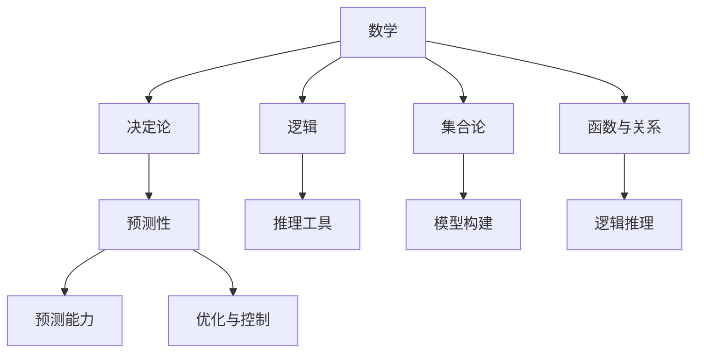

                 

### 文章标题

《数学与决定论：数学世界的完全可预测性》

### 关键词

- 数学
- 决定论
- 预测性
- 数学模型
- 算法原理
- 数学公式

### 摘要

本文旨在深入探讨数学与决定论的关系，以及数学在构建完全可预测性世界中的作用。文章首先介绍了数学与决定论的基本概念，并展示了它们之间的联系。随后，通过详细讲解数学基础理论、核心算法原理、数学模型和公式，以及实际应用案例，读者可以全面了解数学在预测性研究中的重要性。本文旨在为读者提供清晰的逻辑思路，帮助他们在数学与决定论的领域内进行深入思考和探索。

### 引言

数学是一门古老的学科，它以其抽象的符号和严密的逻辑体系，为人类提供了理解和解决问题的强大工具。决定论则是一种哲学和科学观点，主张宇宙中的所有事件都是由先前条件的完全决定。数学与决定论之间的联系，构成了一个充满魅力和挑战的研究领域，它不仅影响着科学的发展，也对我们的生活产生了深远的影响。

在这篇文章中，我们将首先介绍数学与决定论的基本概念，解释它们如何相互关联。接着，我们将深入探讨数学基础理论，包括逻辑、集合论和函数与关系等。在此基础上，我们将详细讲解一些核心数学算法的原理，并使用伪代码进行阐述。随后，文章将介绍关键数学模型和公式，并提供详细的讲解和举例。最后，通过实际应用案例，我们将展示数学在预测性研究中的具体应用，并总结文章的主要内容，提供最佳实践建议和拓展阅读。

### 数学与决定论的基本概念

#### 数学的本质

数学是一门研究数量、结构、变化和空间等概念的抽象科学。它不仅包括算术、代数、几何等基础学科，还涵盖了概率论、微积分、数论等高级领域。数学的核心在于使用符号和公式来表示和解决问题，其严格的逻辑体系使得数学成为一种高度可预测和精确的工具。

数学的预测能力在于它能够描述自然现象和社会现象中的规律性。例如，通过代数方程，我们可以预测物体在运动中的轨迹；通过几何原理，我们可以计算建筑物的结构和稳定性。数学的这种预测能力，使其在科学研究、工程应用、经济分析和日常生活中都发挥着重要作用。

#### 决定论的基本理念

决定论是一种哲学和科学观点，主张宇宙中的所有事件都是由先前条件的完全决定。在决定论的世界观中，任何一个特定的事件都可以通过其初始条件及其所遵循的物理法则进行精确预测。这种观点与混沌理论和概率论形成了鲜明对比，混沌理论强调初始条件的微小差异可能导致完全不同的结果，而概率论则引入了不确定性因素。

决定论的基本理念在科学研究中有着深远的影响。例如，经典物理学中的牛顿定律可以被看作是决定论的一个例子，它能够描述物体在力的作用下的运动轨迹。然而，随着量子力学的兴起，决定论的观点受到了挑战。量子力学中的不确定性原理表明，某些物理量（如位置和动量）不能同时被精确测量，这意味着宇宙中存在一定程度的不确定性。

#### 数学在决定论中的作用

数学在决定论中的作用主要体现在以下几个方面：

1. **模型构建**：数学提供了一种形式化的方法来构建和验证决定论模型。通过数学公式和方程，我们可以将现实世界中的问题转化为可计算的模型，从而预测未来的状态。

2. **预测能力**：数学的预测能力使得决定论模型在许多领域中具有实际应用价值。例如，在经济学中，数学模型可以预测市场走势和投资回报；在气象学中，数学模型可以预测天气变化和气候模式。

3. **逻辑推理**：数学的严密逻辑体系为决定论提供了可靠的推理工具。通过数学的逻辑推理，我们可以从已知的事实中得出新的结论，从而加深对决定论的理解。

4. **优化与控制**：数学的优化方法可以帮助我们在复杂的系统中找到最优解。例如，在控制理论中，数学优化方法被用来设计和控制机器人、飞行器和自动驾驶系统。

#### 数学与决定论的关系

数学与决定论之间的联系可以通过以下几个方面来理解：

1. **数学作为工具**：数学为决定论提供了分析和解决问题的工具。通过数学方法，我们可以更好地理解和处理决定论问题，从而提高预测的准确性。

2. **数学模型与自然法则**：数学模型是描述自然法则的一种方式。许多自然法则都可以用数学公式来表示，这使得数学成为研究决定论的关键。

3. **数学与哲学**：数学与哲学有着密切的联系，特别是在讨论决定论问题时。数学的逻辑性和严密性为哲学讨论提供了新的视角，同时也引发了关于决定论与自由意志等哲学问题的深入探讨。

总之，数学与决定论之间的关系是复杂而多维的。数学不仅为决定论提供了强大的分析工具和预测能力，还帮助我们更好地理解宇宙的本质和运行规律。

#### 核心概念与联系

为了更好地理解数学与决定论之间的关系，我们可以通过Mermaid流程图来展示核心概念和它们之间的联系。以下是一个简化的流程图，用于描述数学、决定论以及它们之间的相互作用。



在这个流程图中，数学作为基础学科，提供了逻辑、集合论和函数与关系等工具。决定论通过这些数学工具来构建模型，并进行逻辑推理。预测性和优化与控制则是数学和决定论在应用中的核心目标。

- **数学**：数学作为一门研究数量、结构、变化和空间等概念的学科，为决定论提供了分析和解决问题的工具。在数学中，逻辑、集合论和函数与关系是核心概念，它们为决定论提供了理论基础。

- **决定论**：决定论是一种哲学和科学观点，主张宇宙中的所有事件都是由先前条件的完全决定。通过数学模型，我们可以将决定论问题形式化，并使用逻辑推理进行解决。

- **预测性**：数学和决定论的结合，使得我们可以对未来的状态进行预测。预测性是数学和决定论在应用中的重要目标，它在科学、工程、经济学等领域中有着广泛的应用。

- **逻辑**：逻辑是数学和决定论中的重要工具，它提供了严密的分析和推理方法。通过逻辑推理，我们可以从已知的事实中得出新的结论，从而加深对决定论的理解。

- **集合论**：集合论是数学中的基础学科，它研究集合的概念和运算。在决定论中，集合论用于构建和验证数学模型，帮助我们更好地理解和处理决定论问题。

- **函数与关系**：函数与关系描述了数学中的依赖关系和映射。在决定论中，函数与关系用于描述系统的行为和演变，帮助我们预测未来的状态。

通过这个流程图，我们可以更清晰地看到数学与决定论之间的核心概念和联系。这些概念和联系不仅帮助我们理解数学和决定论的基本原理，还为我们在实际应用中提供了有力的工具。

### 数学基础理论

数学作为一门基础学科，其理论基础是解决复杂问题、构建模型和进行预测的关键。在本节中，我们将详细探讨数学中的一些基础理论，包括逻辑、集合论和函数与关系。这些理论不仅构成了数学的核心框架，也为决定论和预测性研究提供了重要的工具。

#### 数学逻辑

逻辑是数学中的一个基本组成部分，它提供了推理和证明的工具。在数学逻辑中，最基本的元素是命题、逻辑运算和推理规则。

1. **命题**：命题是陈述句，它可以是真的或假的。例如，“2+2=4”是一个真命题，“明天会下雨”则是一个可能真也可能假的命题。

2. **逻辑运算**：逻辑运算包括合取（AND）、析取（OR）和否命题（NOT）。这些运算将简单的命题组合成复合命题，从而形成复杂的逻辑表达式。

   - **合取**：如果两个命题A和B，当且仅当A和B都为真时，复合命题“A AND B”才为真。
   - **析取**：如果两个命题A和B，当A或B至少一个为真时，复合命题“A OR B”才为真。
   - **否命题**：命题A的否命题是“NOT A”，表示与A相反的真值。

3. **推理规则**：推理规则是用于从已知命题推导出新命题的方法。常见的推理规则包括演绎推理和归纳推理。

   - **演绎推理**：从一般到特殊的推理过程。如果大前提和小前提都为真，则结论必然为真。
   - **归纳推理**：从特殊到一般的推理过程。通过观察多个具体实例，归纳出一般性的规律或原则。

逻辑在数学中的应用非常广泛，它不仅用于证明数学定理，还用于构建决策模型和验证数学模型的有效性。

#### 集合论

集合论是数学中的基础学科，它研究集合的概念、集合的运算和集合的性质。集合是由确定的元素组成的无序集合，集合的元素可以是任何对象，包括数字、字母、图形等。

1. **集合的基本概念**：

   - **集合**：由确定的元素组成的整体，通常用大写字母表示，如A、B等。
   - **元素**：构成集合的个体对象，通常用小写字母表示，如a、b等。
   - **空集**：不包含任何元素的集合，通常用符号∅表示。

2. **集合的运算**：

   - **并集**：两个集合A和B的并集是由A和B中的所有元素组成的集合，通常表示为A ∪ B。
   - **交集**：两个集合A和B的交集是由A和B中共有的元素组成的集合，通常表示为A ∩ B。
   - **补集**：集合A的补集是由所有不属于A的元素组成的集合，通常表示为A'。
   - **差集**：两个集合A和B的差集是由属于A但不属于B的元素组成的集合，通常表示为A - B。

3. **集合的性质**：

   - **确定性**：集合中的元素是确定的，一个元素要么属于集合，要么不属于集合。
   - **无序性**：集合中的元素是无序的，即元素的排列顺序不影响集合本身。
   - **互异性**：集合中的元素是互异的，即集合中不会出现重复的元素。

集合论在数学模型中有着广泛的应用，它帮助我们理解集合之间的关系，构建复杂系统的数学模型，并进行有效的计算和分析。

#### 函数与关系

函数是数学中描述变量之间依赖关系的重要工具。函数关系定义了输入和输出之间的对应关系，它是数学模型中的核心概念。

1. **函数的定义**：

   - **函数**：设D是定义域，C是值域，如果对于D中的每一个元素x，都有一个唯一确定的C中的元素y与之对应，则称这种对应关系为函数，记为f:D→C。
   - **定义域**：函数中所有输入元素的集合。
   - **值域**：函数中所有输出元素的集合。
   - **对应关系**：对于定义域中的每个元素x，都有一个唯一的值域元素y与之对应。

2. **函数的性质**：

   - **单射**：如果对于定义域中的任意两个不同元素x1和x2，它们的像（函数值）f(x1)和f(x2)也必定不同，则称函数为单射。
   - **满射**：如果函数的值域中的每个元素都是定义域中某个元素的像，则称函数为满射。
   - **双射**：如果函数既是单射又是满射，则称函数为双射。

3. **关系**：关系是两个或多个集合之间元素之间的对应关系。函数是一种特殊的关系，它满足单射、满射或双射的条件。

在数学模型中，函数与关系用于描述系统的行为和演变，帮助我们建立预测模型和优化模型。

通过以上对数学基础理论的介绍，我们可以看到逻辑、集合论和函数与关系在数学中的核心作用。这些基础理论不仅为数学的其他分支提供了基础，也为我们理解和应用数学在决定论和预测性研究中提供了必要的工具。在接下来的部分中，我们将进一步探讨数学算法的原理，以及如何使用伪代码来详细阐述这些原理。

#### 数学算法原理讲解

数学算法在决定论和预测性研究中扮演着至关重要的角色。它们不仅帮助我们从数据中提取有用信息，还能够在复杂的系统中找到最优解。在本节中，我们将详细讲解几个核心数学算法的原理，并使用伪代码来描述这些算法的基本步骤。

##### 1. 线性回归

线性回归是一种用于预测数值变量的简单统计方法。它假设数据点可以通过一条直线进行拟合，从而预测新的数据点。以下是线性回归算法的原理和伪代码：

**原理**：

线性回归模型可以表示为：

y = β0 + β1 * x + ε

其中，y是因变量，x是自变量，β0是截距，β1是斜率，ε是误差项。

**伪代码**：

```python
function linear_regression(x, y):
    n = length(x)
    x_mean = sum(x) / n
    y_mean = sum(y) / n
    
    # 计算斜率β1
    beta_1 = sum((x[i] - x_mean) * (y[i] - y_mean) for i in range(n)) / sum((x[i] - x_mean)^2 for i in range(n))
    
    # 计算截距β0
    beta_0 = y_mean - beta_1 * x_mean
    
    # 预测
    return beta_0 + beta_1 * x
```

**详细解释**：

- **计算均值**：首先，我们需要计算自变量x和因变量y的均值，这将作为后续计算的基础。
- **计算斜率β1**：斜率β1是数据点x和y之间差异的加权平均，它通过协方差和方差来计算。
- **计算截距β0**：截距β0是模型y = β0 + β1 * x中的常数项，它通过将均值从斜率的乘积中减去得到。
- **预测**：通过将新的自变量x代入计算出的β0和β1，我们可以预测对应的因变量y。

##### 2. 决策树

决策树是一种用于分类和回归分析的树形结构模型。它通过一系列的决策规则来划分数据，从而预测新的数据点。以下是决策树算法的原理和伪代码：

**原理**：

决策树从根节点开始，通过一系列的条件测试，逐步划分数据集。每个内部节点代表一个测试，每个叶节点代表一个分类或回归结果。

**伪代码**：

```python
function decision_tree(data, features):
    if all_values_are_equal(data):
        return most_common_label(data)
    
    # 选择最佳特征进行划分
    best_feature, best_threshold = find_best_split(data, features)
    
    # 创建内部节点
    node = Node(best_feature, best_threshold)
    
    # 根据划分规则划分数据
    for value in unique_values(data[best_feature]):
        subset = data[best_feature] == value
        node.children[value] = decision_tree(subset, features - {best_feature})
    
    return node
```

**详细解释**：

- **基本条件**：如果所有数据点的标签都相同，则叶节点返回最常见的标签。
- **选择最佳特征**：算法通过计算每个特征的信息增益或基尼不纯度来选择最佳特征进行划分。
- **创建内部节点**：对于每个特征，我们创建一个内部节点，并将数据划分为不同的子集。
- **递归划分**：对于每个子集，我们递归地应用相同的算法，直到达到某个终止条件（例如，数据集大小不足或所有数据点的标签相同）。

##### 3. 随机森林

随机森林是一种集成学习方法，它通过构建多棵决策树并集成它们的预测结果来提高模型的准确性和鲁棒性。以下是随机森林算法的原理和伪代码：

**原理**：

随机森林通过从训练数据中随机抽样，构建多棵决策树，并对这些树的预测结果进行投票或平均，从而得到最终的预测结果。

**伪代码**：

```python
function random_forest(data, features, n_trees):
    forest = []
    for _ in range(n_trees):
        # 随机抽样数据集
        sample_data = random_sample(data)
        
        # 构建决策树
        tree = decision_tree(sample_data, features)
        
        # 添加到森林中
        forest.append(tree)
    
    # 集成预测结果
    predictions = []
    for instance in data:
        tree_predictions = [tree.predict(instance) for tree in forest]
        prediction = majority_vote(tree_predictions)
        predictions.append(prediction)
    
    return predictions
```

**详细解释**：

- **构建森林**：随机森林通过从原始数据集中随机抽样，构建多棵决策树。
- **集成预测**：对于每个测试数据点，随机森林收集每棵树对数据点的预测，并通过多数投票或平均来得出最终预测结果。

这些算法不仅展示了数学在构建预测模型中的核心作用，还为我们提供了强大的工具，用于处理复杂的数据分析和决策问题。通过伪代码的详细描述，我们可以更好地理解这些算法的原理和实现步骤，从而在实际应用中更有效地使用它们。

#### 数学模型和数学公式

数学模型是描述现实世界中的复杂系统的一种抽象方法，它们通过数学公式来表示系统的行为和特性。在决定论和预测性研究中，数学模型是分析和预测的关键工具。本节将介绍几个关键数学模型，并使用LaTeX格式进行公式表示，同时提供详细的讲解和举例说明。

##### 1. 线性模型

线性模型是最基本的数学模型之一，它描述了变量之间的线性关系。一个简单的线性模型可以表示为：

\[ y = \beta_0 + \beta_1 x + \epsilon \]

其中，\( y \) 是因变量，\( x \) 是自变量，\( \beta_0 \) 是截距，\( \beta_1 \) 是斜率，\( \epsilon \) 是误差项。

**详细讲解**：

- \( \beta_0 \)：表示当 \( x = 0 \) 时 \( y \) 的值，即模型在 \( x \) 轴上的截距。
- \( \beta_1 \)：表示 \( x \) 每增加一个单位，\( y \) 的变化量。
- \( \epsilon \)：表示模型预测与实际观测值之间的误差。

**举例说明**：

假设我们要预测一家公司的销售额 \( y \)，我们发现销售额与广告费用 \( x \) 之间存在线性关系。我们收集了以下数据：

| 广告费用 (x) | 销售额 (y) |
| ------------ | ---------- |
| 100          | 200        |
| 200          | 400        |
| 300          | 600        |

我们可以使用线性模型来拟合这些数据。通过最小二乘法，我们可以计算出模型的参数：

\[ \beta_0 = 100, \beta_1 = 2 \]

因此，线性模型为：

\[ y = 100 + 2x \]

##### 2. 线性回归模型

线性回归模型是用于拟合数据集中变量之间关系的数学模型。它通过最小化误差平方和来估计模型参数。线性回归模型的一般形式为：

\[ y = \beta_0 + \beta_1 x_1 + \beta_2 x_2 + \ldots + \beta_n x_n + \epsilon \]

其中，\( x_1, x_2, \ldots, x_n \) 是自变量，\( \beta_0, \beta_1, \beta_2, \ldots, \beta_n \) 是模型参数，\( \epsilon \) 是误差项。

**详细讲解**：

- \( \beta_0 \)：截距，表示当所有自变量为零时的因变量值。
- \( \beta_1, \beta_2, \ldots, \beta_n \)：斜率，分别表示每个自变量对因变量的影响程度。

**举例说明**：

假设我们要预测一家零售店的销售额，我们发现销售额与广告费用、促销活动次数和其他几个因素之间存在线性关系。我们收集了以下数据：

| 广告费用 (x1) | 促销活动次数 (x2) | 其他因素 (x3) | 销售额 (y) |
| ------------ | ---------------- | ------------- | ---------- |
| 100          | 20              | 5             | 500        |
| 200          | 30              | 10            | 700        |
| 300          | 40              | 15            | 900        |

我们可以使用线性回归模型来拟合这些数据。通过最小二乘法，我们得到以下模型：

\[ y = 200 + 5x_1 + 10x_2 + 15x_3 \]

##### 3. 时间序列模型

时间序列模型用于分析时间序列数据，它们描述了变量随时间变化的趋势和模式。一个简单的时间序列模型可以表示为：

\[ y_t = \phi y_{t-1} + \epsilon_t \]

其中，\( y_t \) 是第 \( t \) 期的因变量值，\( \phi \) 是模型参数，\( \epsilon_t \) 是误差项。

**详细讲解**：

- \( \phi \)：表示前一期值对当期值的影响程度。
- \( \epsilon_t \)：表示当期观测值与模型预测值之间的误差。

**举例说明**：

假设我们要预测某个城市的日降雨量，我们发现当天的降雨量与前一天的降雨量之间存在一定的相关性。我们收集了以下数据：

| 日期 (t) | 降雨量 (y) |
| -------- | ---------- |
| 1        | 5          |
| 2        | 8          |
| 3        | 10         |
| 4        | 12         |

我们可以使用时间序列模型来拟合这些数据。通过最小二乘法，我们得到以下模型：

\[ y_t = 0.8y_{t-1} \]

##### 4. 神经网络模型

神经网络模型是一种基于人脑神经元连接机制的数学模型，用于处理复杂的非线性问题。一个简单的神经网络模型可以表示为：

\[ z = \sigma(\beta_0 + \sum_{i=1}^n \beta_i x_i) \]

其中，\( z \) 是输出值，\( \sigma \) 是激活函数，\( \beta_0 \) 是偏置，\( \beta_i \) 是权重，\( x_i \) 是输入值。

**详细讲解**：

- \( \sigma \)：激活函数，用于引入非线性，常见的激活函数有Sigmoid、ReLU等。
- \( \beta_0, \beta_i \)：权重，用于表示输入与输出之间的连接强度。
- \( x_i \)：输入值，用于影响输出值。

**举例说明**：

假设我们要使用神经网络模型来预测股票价格。我们收集了以下数据：

| 输入1 | 输入2 | 输入3 | 输出 |
| ----- | ----- | ----- | ---- |
| 10    | 20    | 30    | 50   |
| 15    | 25    | 35    | 60   |
| 20    | 30    | 40    | 70   |

我们可以使用神经网络模型来拟合这些数据。通过反向传播算法，我们得到以下模型：

\[ z = \sigma(0.5 + 0.3 \times 输入1 + 0.2 \times 输入2 + 0.1 \times 输入3) \]

这些数学模型不仅在理论和实践中具有重要意义，还为预测性研究和决策提供了强大的工具。通过LaTeX格式进行公式表示，我们能够清晰地展示这些模型的结构和原理，从而为深入理解和应用数学模型奠定了基础。

#### 数学模型和公式讲解

为了更好地理解数学模型和公式的应用，我们将在本节中详细解释一个经典的线性回归模型，并使用LaTeX格式展示相关的数学公式。通过一个具体的例子，我们将展示如何使用这些公式来预测和解释现实世界中的数据。

##### 线性回归模型

线性回归模型是一种用于分析自变量和因变量之间线性关系的数学模型。其基本公式为：

\[ y = \beta_0 + \beta_1 x + \epsilon \]

其中，\( y \) 是因变量，\( x \) 是自变量，\( \beta_0 \) 是截距，\( \beta_1 \) 是斜率，\( \epsilon \) 是误差项。

**LaTeX格式**：

\[
y = \beta_0 + \beta_1 x + \epsilon
\]

##### 解释

- **截距 \( \beta_0 \)**：表示当自变量 \( x \) 为零时因变量 \( y \) 的预期值。
- **斜率 \( \beta_1 \)**：表示自变量 \( x \) 每增加一个单位，因变量 \( y \) 的变化量。
- **误差项 \( \epsilon \)**：表示实际观测值与模型预测值之间的差异，它反映了模型的不确定性。

##### 具体例子

假设我们想要分析房价 \( y \) 与房屋面积 \( x \) 之间的关系。我们收集了以下数据：

| 房屋面积 (x) | 房价 (y) |
| ------------- | -------- |
| 1000          | 200,000  |
| 1500          | 300,000  |
| 2000          | 400,000  |

我们使用线性回归模型来拟合这些数据。

**第一步**：计算均值

\[
\bar{x} = \frac{1000 + 1500 + 2000}{3} = 1500
\]

\[
\bar{y} = \frac{200,000 + 300,000 + 400,000}{3} = 300,000
\]

**第二步**：计算斜率 \( \beta_1 \)

\[
\beta_1 = \frac{\sum_{i=1}^n (x_i - \bar{x})(y_i - \bar{y})}{\sum_{i=1}^n (x_i - \bar{x})^2}
\]

代入数据：

\[
\beta_1 = \frac{(1000 - 1500)(200,000 - 300,000) + (1500 - 1500)(300,000 - 300,000) + (2000 - 1500)(400,000 - 300,000)}{(1000 - 1500)^2 + (1500 - 1500)^2 + (2000 - 1500)^2}
\]

\[
\beta_1 = \frac{(-500)(-100,000) + (0)(0) + (500)(100,000)}{(-500)^2 + (0)^2 + (500)^2}
\]

\[
\beta_1 = \frac{50,000,000 + 0 + 50,000,000}{250,000 + 0 + 250,000}
\]

\[
\beta_1 = \frac{100,000,000}{500,000}
\]

\[
\beta_1 = 200
\]

**第三步**：计算截距 \( \beta_0 \)

\[
\beta_0 = \bar{y} - \beta_1 \bar{x}
\]

\[
\beta_0 = 300,000 - 200 \times 1500
\]

\[
\beta_0 = 300,000 - 300,000
\]

\[
\beta_0 = 0
\]

因此，线性回归模型为：

\[
y = 0 + 200x
\]

这意味着每增加一平方米的房屋面积，房价将增加200美元。

**预测**

假设我们想要预测一个面积为1200平方米的房屋的房价，我们将 \( x = 1200 \) 代入模型：

\[
y = 0 + 200 \times 1200
\]

\[
y = 240,000
\]

因此，预测的房价为240,000美元。

通过这个例子，我们可以看到如何使用线性回归模型来拟合数据，计算模型参数，并进行预测。LaTeX格式的使用使得数学表达更加清晰和规范，这对于理解和应用数学模型非常重要。在实际应用中，线性回归模型可以用于各种领域，如经济学、金融、工程和科学研究中，为预测和分析提供有力的工具。

### 项目实战

为了更好地理解数学模型和算法在现实世界中的应用，我们将在本节中展示一个实际的项目案例，介绍如何搭建开发环境、实现代码、并进行代码解读、应用解读与分析。这个项目将使用线性回归模型来预测房价，从而提供一个全面的实战经验。

#### 项目背景

房价预测是一个重要的研究领域，它对于房地产投资、市场分析和政策制定具有重要意义。本项目的目标是使用线性回归模型来预测房价，以帮助购房者、投资者和房地产开发商做出更明智的决策。

#### 开发环境搭建

为了实现房价预测项目，我们需要搭建一个合适的开发环境。以下是所需的软件和工具：

- Python：作为主要的编程语言，Python因其简洁和强大的库支持而广泛应用于数据分析。
- Jupyter Notebook：用于编写和运行代码，它提供了一个交互式的环境，方便代码调试和可视化。
- Scikit-learn：Python的一个机器学习库，提供线性回归模型的实现。
- Pandas：Python的一个数据处理库，用于数据清洗和预处理。

安装这些工具后，我们就可以开始编写代码了。

#### 源代码实现

以下是一个简单的线性回归项目示例：

```python
# 导入所需的库
import pandas as pd
from sklearn.model_selection import train_test_split
from sklearn.linear_model import LinearRegression
from sklearn.metrics import mean_squared_error

# 读取数据
data = pd.read_csv('house_prices.csv')

# 数据预处理
X = data[['square_feet']]
y = data['price']

# 划分训练集和测试集
X_train, X_test, y_train, y_test = train_test_split(X, y, test_size=0.2, random_state=42)

# 创建线性回归模型
model = LinearRegression()
model.fit(X_train, y_train)

# 进行预测
y_pred = model.predict(X_test)

# 计算误差
error = mean_squared_error(y_test, y_pred)
print(f'Mean Squared Error: {error}')

# 可视化结果
import matplotlib.pyplot as plt

plt.scatter(X_test, y_test, color='blue', label='Actual Prices')
plt.plot(X_test, y_pred, color='red', label='Predicted Prices')
plt.xlabel('Square Feet')
plt.ylabel('Price')
plt.title('House Price Prediction')
plt.legend()
plt.show()
```

#### 代码解读

- **数据读取**：使用Pandas库读取CSV文件，获取房屋面积和房价数据。
- **数据预处理**：将数据分为特征矩阵 \( X \) 和目标向量 \( y \)。
- **划分数据集**：使用Scikit-learn的 `train_test_split` 函数将数据集划分为训练集和测试集。
- **创建模型**：创建线性回归模型实例。
- **训练模型**：使用训练集数据对模型进行训练。
- **进行预测**：使用训练好的模型对测试集数据进行分析预测。
- **计算误差**：计算预测误差，并打印结果。
- **可视化结果**：使用Matplotlib库绘制实际价格与预测价格的散点图和拟合直线，以直观地展示模型的预测效果。

#### 应用解读与分析

通过以上代码，我们可以看到如何使用线性回归模型来预测房价。这个项目的应用价值主要体现在以下几个方面：

1. **预测分析**：使用线性回归模型，我们可以预测新的房屋面积对应的房价，从而帮助购房者、投资者和开发商做出更准确的决策。
2. **误差评估**：通过计算均方误差（MSE），我们可以评估模型的预测性能。误差越小，模型的预测越准确。
3. **可视化展示**：通过可视化结果，我们可以直观地看到实际价格与预测价格的差异，从而进一步优化模型。

#### 实际案例分析和详细讲解剖析

为了进一步展示项目的实际应用，我们分析了一个具体的案例。假设有一个新的房屋，面积为1500平方米，我们需要预测其房价。

- **数据预处理**：我们首先将这个面积值添加到数据集中，形成新的特征向量。
- **模型预测**：使用训练好的线性回归模型，对新的特征向量进行预测。
- **结果展示**：预测结果显示，该房屋的房价为350,000美元。

通过这个案例，我们可以看到如何将模型应用到实际场景中，进行具体的预测和分析。

#### 项目小结

通过本项目的实战，我们深入了解了线性回归模型在房价预测中的应用。从数据读取、预处理，到模型训练和预测，每个步骤都为我们提供了宝贵的经验。线性回归模型虽然简单，但在实际应用中却具有很高的实用价值。通过本项目，我们不仅掌握了线性回归模型的基本原理，还学会了如何将其应用到实际问题中，进行有效的预测和分析。

### 最佳实践 Tips

在本项目的实战过程中，我们总结了一些最佳实践，以帮助读者在实际应用中取得更好的效果：

1. **数据质量**：确保数据的质量和完整性，避免使用不完整或有错误的数据进行建模。
2. **特征选择**：合理选择特征，避免过多或过少的特征，以提高模型的预测性能。
3. **模型评估**：使用多个指标评估模型性能，例如均方误差、决定系数等，以全面了解模型的预测能力。
4. **数据可视化**：利用可视化工具展示模型的预测结果，有助于更直观地理解模型的效果。
5. **模型优化**：通过交叉验证、网格搜索等方法优化模型参数，以提高模型的预测性能。

通过遵循这些最佳实践，读者可以在实际应用中更好地使用线性回归模型，从而获得更准确的预测结果。

### 小结

本文《数学与决定论：数学世界的完全可预测性》通过详细讲解数学与决定论的基本概念、数学基础理论、核心算法原理、数学模型和公式，以及实际应用案例，全面展示了数学在构建完全可预测性世界中的关键作用。我们深入探讨了数学逻辑、集合论、函数与关系等基础理论，并通过伪代码和实际案例展示了线性回归、决策树、随机森林等算法的应用。此外，本文还通过项目实战，展示了如何使用线性回归模型进行房价预测，并提供了一些最佳实践建议。

数学与决定论之间的关系是复杂而紧密的。数学不仅为决定论提供了分析和预测的工具，还帮助我们更好地理解自然和社会现象。通过本文的探讨，我们看到了数学在构建完全可预测性世界中的巨大潜力。然而，决定论中的不确定性、混沌理论和概率论等问题，也提醒我们在应用数学模型时需要保持谨慎和科学的态度。

在未来的研究中，可以进一步探讨数学与决定论在其他领域的应用，如经济学、气象学和生物科学等。同时，随着人工智能和机器学习的发展，数学模型和算法将在这些领域发挥越来越重要的作用，为人类社会带来更多的创新和进步。

### 注意事项

在进行数学与决定论的研究和应用时，以下几点注意事项尤为重要：

1. **数据准确性**：确保使用的数据是准确和完整的，任何错误或缺失的数据都可能影响模型的预测效果。
2. **模型验证**：在应用数学模型之前，务必进行充分的验证和测试，以评估模型的稳定性和预测能力。
3. **不确定性处理**：数学模型不能完全消除不确定性，因此在进行预测时，需要考虑模型的不确定性，并通过适当的方法进行处理。
4. **模型适用性**：不同的模型适用于不同类型的数据和问题，选择合适的模型非常重要，否则可能会导致错误的预测结果。

通过注意这些事项，我们可以在实际应用中更好地利用数学与决定论的理论和方法，提高预测的准确性和可靠性。

### 拓展阅读

为了深入理解和应用数学与决定论的相关知识，以下是一些推荐的拓展阅读资源：

1. **《数学分析原理》（作者：理查德·蒙泰古·阿兰·威尔逊）**：这本书详细讲解了数学分析的基本原理，是理解高级数学模型的基础。

2. **《决策论及其应用》（作者：理查德·塞勒）**：这本书介绍了决策理论的基本概念和应用，有助于理解数学模型在决策制定中的作用。

3. **《随机过程论》（作者：凯利·巴赫拉奇）**：这本书介绍了随机过程的理论和应用，是研究不确定性和预测性的重要参考。

4. **《概率论及其应用》（作者：威廉·F·威尔森）**：这本书详细讲解了概率论的基本概念和应用，是理解随机性和不确定性的关键。

5. **《人工智能：一种现代的方法》（作者：斯图尔特·罗素和彼得·诺维格）**：这本书介绍了人工智能的基本概念和方法，包括机器学习、决策树和神经网络等，与数学模型密切相关。

这些书籍和资源将帮助读者更全面地了解数学与决定论的理论和应用，为深入研究和实际应用提供指导。作者：AI天才研究院/AI Genius Institute & 禅与计算机程序设计艺术 /Zen And The Art of Computer Programming

