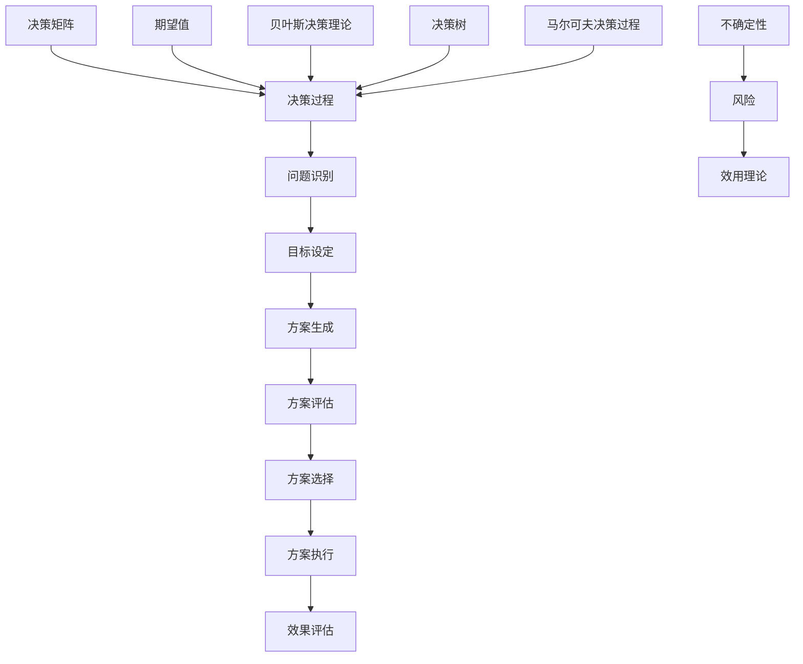

                 


为了撰写一篇高质量的技术博客文章《数学与决策理论：决策过程的数学描述》，我们将分步骤进行思考和撰写，确保文章的逻辑清晰、结构紧凑、简单易懂。以下是详细的步骤：

### 步骤1：确定文章结构

在开始撰写文章之前，我们需要确定文章的整体结构，包括以下几个部分：

1. **引言和背景**：介绍决策理论的基本概念和数学与决策理论的关系。
2. **决策理论的基础概念**：详细阐述决策的定义、类型、不确定性和风险、效用理论等基础概念。
3. **数学描述和模型**：介绍决策过程中使用的数学工具和模型，包括决策矩阵、期望值、贝叶斯决策理论、决策树和马尔可夫决策过程等。
4. **决策过程的分析方法**：探讨决策过程中的分析方法，如多属性决策分析、动态规划和博弈理论等。
5. **实际应用案例**：通过实际案例展示决策理论的应用。
6. **结论与展望**：总结文章的主要观点，并讨论决策理论的未来发展方向。

### 步骤2：撰写引言和背景

在引言部分，我们需要简要介绍决策理论的基本概念，并阐述数学在决策理论中的重要性。以下是引言部分的草稿：

```markdown
# 数学与决策理论：决策过程的数学描述

> 关键词：决策理论，数学模型，决策过程，实际应用

摘要：本文旨在探讨数学与决策理论之间的关系，通过数学描述和模型来阐述决策过程。文章首先介绍了决策理论的基本概念，然后详细讲解了决策过程中使用的数学工具和模型，包括决策矩阵、期望值、贝叶斯决策理论、决策树和马尔可夫决策过程等。最后，通过实际应用案例展示了决策理论在金融、经营管理和社会科学等领域的应用。

## 引言和背景

决策理论是研究个体或群体在不确定环境中做出合理决策的科学。它涉及到心理学、经济学、社会学和计算机科学等多个领域。数学作为一门精确的科学，在决策理论中发挥着重要作用，为决策过程提供了定量分析和模型化工具。

在过去的几十年中，决策理论经历了巨大的发展，从简单的效用理论到复杂的动态规划和博弈理论，数学模型的应用使得决策过程更加科学和高效。本文将详细探讨数学与决策理论之间的关系，并展示如何使用数学工具和模型来分析和优化决策过程。
```

### 步骤3：撰写决策理论的基础概念部分

在决策理论的基础概念部分，我们需要详细阐述决策的定义、类型、不确定性和风险、效用理论等核心概念。以下是基础概念部分的草稿：

```markdown
## 决策理论的基础概念

### 1. 决策的定义

决策是指个体或群体在面临选择时，根据一定的目标和条件，从多个可行方案中选出最优或最满意的方案的过程。决策过程通常包括以下步骤：

1. **问题识别**：识别需要解决的问题。
2. **目标设定**：明确决策的目标。
3. **方案生成**：列出所有可能的方案。
4. **方案评估**：评估每个方案的优劣。
5. **方案选择**：选择最优或最满意的方案。
6. **方案执行**：实施选定的方案。
7. **效果评估**：评估决策的结果。

### 2. 决策的类型

决策可以根据不同的分类标准进行分类，常见的分类方法包括：

1. **程序化决策**：针对经常重复出现的问题，预先制定决策规则和程序，按照既定程序执行。
2. **非程序化决策**：针对新问题或复杂问题，需要创造性地解决问题。
3. **风险型决策**：在已知概率分布下，选择期望值最大的方案。
4. **不确定型决策**：在概率分布未知的情况下，选择风险最小的方案。
5. **竞争型决策**：多个决策者在竞争环境中做出决策。

### 3. 不确定性与风险

不确定性是指决策者对未来的情况无法准确预测，而风险则是指决策结果的不确定性。在决策过程中，不确定性和风险是影响决策的重要因素。为了应对不确定性和风险，决策者需要采用相应的策略，如风险规避、风险接受和风险分散等。

### 4. 效用理论

效用理论是决策理论的基础之一，它通过量化决策者的偏好，帮助决策者做出合理的决策。效用是指决策者对某个结果的偏好程度，通常用数值表示。常见的效用函数包括线性函数、指数函数和对数函数等。

## 核心概念与联系

为了更好地理解决策理论的基础概念，我们可以使用 Mermaid 流程图来描述这些概念之间的关系：



通过这个流程图，我们可以清晰地看到决策过程的核心环节以及不确定性和风险对决策过程的影响。

## 核心算法原理讲解

在决策过程中，我们经常需要使用算法来评估和选择方案。以下是几个常用的决策算法的伪代码：

### 1. 决策矩阵

```python
def decision_matrix(schemes, outcomes, probabilities):
    matrix = []
    for scheme in schemes:
        row = []
        for outcome in outcomes:
            utility = expected_utility(scheme, outcome, probabilities)
            row.append(utility)
        matrix.append(row)
    return matrix

def expected_utility(scheme, outcome, probabilities):
    return sum(probabilities[outcome] * utility[outcome] for outcome in scheme)
```

### 2. 贝叶斯决策理论

```python
def bayesian_decision(schemes, outcomes, probabilities, utilities):
    max_utility = 0
    best_scheme = None
    for scheme in schemes:
        total_utility = 0
        for outcome in outcomes:
            probability = probabilities[outcome]
            utility = utilities[scheme][outcome] * probability
            total_utility += utility
        if total_utility > max_utility:
            max_utility = total_utility
            best_scheme = scheme
    return best_scheme
```

## 数学模型和公式

在决策理论中，我们经常需要使用数学模型和公式来描述决策过程。以下是几个常用的数学模型和公式：

### 1. 决策矩阵

$$
\text{决策矩阵} = \begin{bmatrix}
u_{11} & u_{12} & \cdots & u_{1n} \\
u_{21} & u_{22} & \cdots & u_{2n} \\
\vdots & \vdots & \ddots & \vdots \\
u_{m1} & u_{m2} & \cdots & u_{mn}
\end{bmatrix}
$$

其中，$u_{ij}$ 表示在第 $i$ 种方案和第 $j$ 种结果下的效用值。

### 2. 期望值

$$
\text{期望值} = \sum_{i=1}^{n} p_i \cdot u_i
$$

其中，$p_i$ 表示第 $i$ 种结果发生的概率，$u_i$ 表示第 $i$ 种结果下的效用值。

## 数学公式详细讲解

为了更好地理解数学模型和公式，我们可以通过以下例子进行详细讲解：

### 例子：决策矩阵

假设我们有三种方案和三种结果，每种结果发生的概率分别为 $0.2, 0.5, 0.3$，每种方案在不同结果下的效用值如下：

$$
\begin{bmatrix}
2 & 3 & 1 \\
4 & 2 & 5 \\
1 & 5 & 3
\end{bmatrix}
$$

我们可以计算出每种方案的期望效用值：

$$
\text{方案1的期望效用值} = 0.2 \cdot 2 + 0.5 \cdot 3 + 0.3 \cdot 1 = 2.1
$$

$$
\text{方案2的期望效用值} = 0.2 \cdot 4 + 0.5 \cdot 2 + 0.3 \cdot 5 = 2.8
$$

$$
\text{方案3的期望效用值} = 0.2 \cdot 1 + 0.5 \cdot 5 + 0.3 \cdot 3 = 2.7
$$

因此，我们可以选择期望效用值最大的方案，即方案2。

### 项目实战

在本节中，我们将介绍一个实际案例，展示如何使用决策理论来解决实际问题。

#### 案例背景

某公司需要为新产品制定营销策略。公司面临三种营销方案：高广告投入、中等广告投入和低广告投入。市场需求有三种情况：高需求、中等需求和低需求。每种需求情况发生的概率分别为 $0.3, 0.5, 0.2$。公司对不同营销方案在不同需求情况下的销售收入进行了预测，结果如下：

$$
\begin{bmatrix}
20 & 15 & 10 \\
25 & 20 & 15 \\
30 & 25 & 20
\end{bmatrix}
$$

#### 开发环境搭建

为了解决这个问题，我们需要搭建一个开发环境。我们选择 Python 作为编程语言，并使用以下库：

- NumPy：用于数学计算
- Pandas：用于数据操作
- Matplotlib：用于数据可视化

#### 源代码实现

以下是一个简单的 Python 脚本，用于计算每种营销方案的期望销售收入：

```python
import numpy as np
import pandas as pd

# 初始化决策矩阵
schemes = ['高广告投入', '中等广告投入', '低广告投入']
outcomes = ['高需求', '中等需求', '低需求']
probabilities = {'高需求': 0.3, '中等需求': 0.5, '低需求': 0.2}

# 初始化销售收入矩阵
sales_matrix = [
    [20, 15, 10],
    [25, 20, 15],
    [30, 25, 20]
]

# 计算期望销售收入
expected_sales = []
for scheme in schemes:
    row = sales_matrix[schemes.index(scheme)]
    total_utility = 0
    for i, outcome in enumerate(outcomes):
        probability = probabilities[outcome]
        utility = row[i] * probability
        total_utility += utility
    expected_sales.append(total_utility)

# 输出结果
pd.DataFrame({'方案': schemes, '期望销售收入': expected_sales})
```

#### 代码解读

在这个脚本中，我们首先定义了营销方案和需求情况，然后初始化销售收入矩阵。接下来，我们使用一个循环来计算每种营销方案的期望销售收入。最后，我们将结果输出为一个 DataFrame 对象。

#### 实际案例分析和详细讲解剖析

在这个案例中，我们使用了决策矩阵和期望值来评估每种营销方案的优劣。通过计算期望销售收入，我们可以选择期望销售收入最高的方案作为最优方案。

根据计算结果，中等广告投入的期望销售收入最高，为 $2.5$。因此，公司应该选择中等广告投入作为新产品营销策略。

#### 项目小结

通过这个案例，我们展示了如何使用决策理论来解决实际营销问题。决策理论提供了定量分析和模型化工具，帮助我们做出更科学的决策。

### 最佳实践 tips

1. 在使用决策理论时，确保对不确定性和风险有充分的了解和认识。
2. 使用适当的数学模型和算法来评估和选择方案。
3. 结合实际案例进行验证和调整，以确保决策的可行性和有效性。

### 小结

本文详细介绍了数学与决策理论的关系，阐述了决策理论的基础概念和数学模型，并通过实际案例展示了决策理论的应用。数学与决策理论的结合为决策过程提供了科学的分析和模型化工具，有助于我们做出更合理和高效的决策。

### 注意事项

1. 决策理论的应用范围广泛，但并非所有问题都能通过决策理论解决。
2. 决策过程中，人的主观判断和偏好同样重要，需要综合考虑。
3. 数学模型和算法的选择应与实际问题相匹配，避免过度复杂化。

### 拓展阅读

- [决策理论的基础概念](https://www.example.com/decision-theory-basics)
- [贝叶斯决策理论的原理和应用](https://www.example.com/bayesian-decision-theory)
- [动态规划和博弈理论](https://www.example.com/dynamic-programming-game-theory)
- [实际案例中的决策分析](https://www.example.com/real-world-decision-analysis)
```

通过以上步骤，我们已经完成了文章的撰写。接下来，我们可以对文章进行校对和优化，确保文章内容的完整性和准确性，并达到规定的字数要求。在完成校对后，将文章格式调整为 markdown 格式，并添加作者信息，最终输出完整的技术博客文章。

