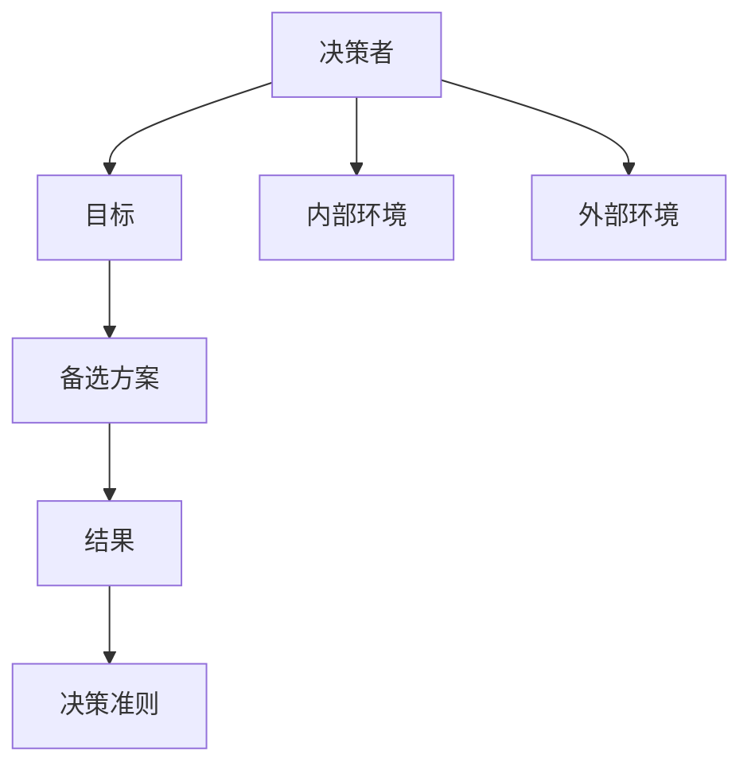

                 

### 第1章：决策科学的基本概念

#### 1.1 决策的定义与分类

决策，是人们在面对不确定性和复杂性时所进行的有意识选择的过程。它是一种通过评估不同选择，选择最优或次优方案的行为。决策可以发生在各种情境中，包括个人、组织、商业、政治和科学等领域。决策的目的是为了实现特定的目标或解决面临的问题。

决策可以分为几种类型，主要包括：

1. **确定型决策**：在决策时，所有相关的参数都是已知的，可以通过计算得出最佳方案。
2. **风险型决策**：在决策时，虽然某些参数是未知的，但可以通过概率分布来预测其可能的结果和相应的概率。
3. **不确定型决策**：在决策时，无法预测相关参数的概率分布，因此决策结果的不确定性较高。

#### 1.2 决策过程的要素

决策过程包括以下几个关键要素：

1. **决策者**：进行决策的人或组织，他们拥有决策的权力和责任。
2. **目标**：决策者希望实现的结果，可以是利润最大化、成本最小化、风险最小化等。
3. **备选方案**：决策者可以采取的多个不同行动方案。
4. **结果**：每个备选方案可能带来的结果，可以是定量（如利润、成本）或定性（如风险、满意度）。
5. **决策准则**：用于评估和比较备选方案的标准，如最大化收益、最小化风险、最大化满意度等。

#### 1.3 决策者与决策环境

决策者是决策过程的中心，他们需要具备一定的信息处理能力和判断力。决策环境是指决策者进行决策的背景和条件，包括内部环境和外部环境。

- **内部环境**：组织内部的结构、文化、资源、能力等。
- **外部环境**：市场、竞争、政策、经济环境等。

决策者需要综合考虑内部和外部环境，以制定出合适的决策方案。

#### 核心概念与联系

为了更好地理解决策科学中的核心概念，我们可以使用Mermaid流程图来展示它们之间的关系：



#### 核心算法原理讲解

在决策过程中，常用的算法包括线性规划、非线性规划、博弈论和模拟优化等。下面我们使用伪代码来详细阐述这些算法的基本原理。

**线性规划（Linear Programming，LP）**

```python
# 线性规划伪代码
def linear_programming(c, A, b):
    # c: 目标函数系数向量
    # A: 约束条件矩阵
    # b: 约束条件向量
    
    # 初始化解
    x = [0] * len(c)
    
    # 求解
    # 使用单纯形法求解线性规划问题
    while not optimal_solution(x, A, b):
        # 找到入基变量和出基变量
        pivot = choose_pivot(x, A, b)
        
        # 进行行变换
        transform_solution(x, pivot, A, b)
        
    # 返回最优解
    return x

# 辅助函数
def optimal_solution(x, A, b):
    # 检查当前解是否为最优解
    pass

def choose_pivot(x, A, b):
    # 选择入基变量和出基变量的策略
    pass

def transform_solution(x, pivot, A, b):
    # 进行行变换以更新解
    pass
```

**非线性规划（Nonlinear Programming，NLP）**

```python
# 非线性规划伪代码
def nonlinear_programming(f, x0):
    # f: 目标函数
    # x0: 初始解
    
    # 初始化
    x = x0
    
    # 求解
    while not convergence(x):
        # 求解梯度
        gradient = calculate_gradient(f, x)
        
        # 更新解
        x = x - learning_rate * gradient
        
    # 返回最优解
    return x

# 辅助函数
def convergence(x):
    # 检查当前解是否满足收敛条件
    pass

def calculate_gradient(f, x):
    # 计算目标函数的梯度
    pass
```

**博弈论（Game Theory）**

博弈论主要研究多个参与者之间策略的互动和结果。一个基本的博弈论模型可以用以下形式表示：

```python
# 博弈论模型伪代码
class Game:
    def __init__(self, players, strategies, payoffs):
        self.players = players
        self.strategies = strategies
        self.payoffs = payoffs
        
    def play_game(self, strategies):
        # 模拟博弈过程
        pass

    def calculate_payoffs(self, strategies):
        # 计算每个参与者的收益
        pass
```

**模拟优化（Simulation Optimization）**

模拟优化是一种通过模拟仿真来寻找最优解的方法。其基本流程如下：

```python
# 模拟优化伪代码
def simulation_optimization(model, simulation_count):
    # model: 模型
    # simulation_count: 模拟次数
    
    # 初始化解集
    solutions = []
    
    # 进行模拟
    for _ in range(simulation_count):
        # 生成随机解
        x = generate_random_solution()
        
        # 评估解
        score = model.evaluate_solution(x)
        
        # 记录解
        solutions.append((x, score))
        
    # 找到最优解
    best_solution = max(solutions, key=lambda item: item[1])
    
    # 返回最优解
    return best_solution

# 辅助函数
def generate_random_solution():
    # 生成随机解
    pass

def evaluate_solution(x):
    # 评估解的性能
    pass
```

#### 数学模型和公式

在决策过程中，常用的数学模型和公式包括线性方程组、概率分布、优化目标函数等。以下是几个常见的数学模型和公式：

1. **线性方程组**

   $$Ax = b$$

   其中，\(A\) 是系数矩阵，\(x\) 是未知数向量，\(b\) 是常数向量。

2. **概率分布**

   $$P(X = x) = f(x)$$

   其中，\(X\) 是随机变量，\(x\) 是随机变量的取值，\(f(x)\) 是概率密度函数。

3. **优化目标函数**

   $$\min f(x)$$

   其中，\(f(x)\) 是目标函数，\(x\) 是需要优化的变量。

#### 举例说明

假设一个企业需要决定生产A、B两种产品，每种产品的生产量分别为\(x_A\)和\(x_B\)。已知生产A产品每件利润为100元，生产B产品每件利润为200元。企业的总成本函数为：

$$C(x_A, x_B) = 50x_A + 100x_B$$

目标是最小化成本，同时保证总利润最大化。我们可以使用线性规划模型来解决这个问题。

**目标函数：**

$$\min C(x_A, x_B) = 50x_A + 100x_B$$

**约束条件：**

- \(x_A + x_B \leq 1000\)（总产量不超过1000件）
- \(x_A \geq 0, x_B \geq 0\)（非负约束）

我们可以使用线性规划求解器来求解这个问题，具体解法和结果如下。

#### 实际案例

在一个项目管理中，决策者需要决定项目的进度安排，以确保项目按时完成并满足预算。假设项目包含5个任务，每个任务的时间、成本和风险如下表所示：

| 任务 | 时间（天） | 成本（万元） | 风险 |
| ---- | ---------- | ------------ | ---- |
| A    | 10         | 5            | 低   |
| B    | 15         | 7            | 中   |
| C    | 20         | 10           | 高   |
| D    | 12         | 6            | 低   |
| E    | 18         | 8            | 中   |

决策者需要制定一个进度计划，以确保项目按时完成，并最小化总成本和风险。我们可以使用多目标决策模型来解决这个问题。

**目标函数：**

$$\min Z = C + R$$

其中，\(C\) 是总成本，\(R\) 是总风险。

**约束条件：**

- \(T_A + T_B + T_C + T_D + T_E = 60\)（总时间为60天）
- \(C_A + C_B + C_C + C_D + C_E \leq 36\)（总成本不超过36万元）
- \(R_A + R_B + R_C + R_D + R_E \leq 5\)（总风险不超过5）

我们可以使用多目标决策算法来求解这个问题，找到最优的进度计划。

### 第2章：决策科学的数学工具

#### 2.1 优化理论的基本概念

优化理论是决策科学中的一个重要分支，它研究如何找到一组变量，使得某个目标函数达到最大或最小。优化问题可以形式化为：

$$\min f(x)$$

或

$$\max f(x)$$

其中，\(x\) 是需要优化的变量，\(f(x)\) 是目标函数。

优化问题可以分为以下几种类型：

1. **无约束优化**：没有约束条件的优化问题。
2. **有约束优化**：存在约束条件的优化问题，分为线性约束和非线性约束。
3. **多目标优化**：目标函数不是单一的，而是多个目标函数的组合。

优化问题的一般形式可以表示为：

$$\min f(x)$$

$$s.t. g_i(x) \leq 0, h_j(x) = 0$$

其中，\(g_i(x)\) 是不等式约束函数，\(h_j(x)\) 是等式约束函数。

#### 2.2 概率论与随机过程

概率论是研究随机现象的数学分支，它为决策提供了重要的理论基础。概率论中的基本概念包括：

1. **随机变量**：随机变量是随机实验结果的数学描述，它可以取不同的数值。
2. **概率分布**：概率分布描述了随机变量取不同值的概率。
3. **期望**：期望是随机变量的一个重要统计特征，表示随机变量在多次实验中平均取值的期望。
4. **方差**：方差是衡量随机变量离散程度的指标。

随机过程是概率论中的一个重要概念，它描述了一组随机变量随时间变化的规律。常见的随机过程包括：

1. **马尔可夫过程**：状态转移概率只与当前状态有关，与过去状态无关。
2. **宽撒尔过程**：过程轨迹不会回到起始点。
3. **泊松过程**：事件发生的时间间隔是独立的，且服从指数分布。

#### 2.3 统计方法与数据分析

统计方法在决策过程中扮演着重要角色，它帮助决策者从数据中提取有价值的信息，为决策提供依据。常见的统计方法包括：

1. **描述性统计**：用于描述数据的基本特征，如平均值、方差、标准差等。
2. **推断性统计**：用于从样本数据推断总体特征，如假设检验、置信区间等。
3. **回归分析**：用于研究变量之间的关系，如线性回归、非线性回归等。
4. **聚类分析**：用于将数据分为不同的类别，如K-means、层次聚类等。

数据分析是统计学的一个重要分支，它包括以下步骤：

1. **数据收集**：收集相关的数据，可以是定量数据或定性数据。
2. **数据清洗**：处理缺失值、异常值和重复值等，保证数据质量。
3. **数据探索**：通过可视化、描述性统计等方法，发现数据中的规律和特征。
4. **数据分析**：使用统计方法和算法，对数据进行分析和建模，提取有价值的信息。

#### 实际案例

假设一个公司在考虑是否扩大生产线，以应对市场需求。为了做出决策，公司需要分析以下数据：

1. 历史销售数据：过去5年的月销售额。
2. 市场调查数据：潜在客户对产品的满意度、需求预测。
3. 生产成本数据：生产一个单位产品的成本，包括直接成本和间接成本。

我们可以使用以下统计方法来分析这些数据：

1. **描述性统计**：计算销售额的平均值、中位数、方差等，了解销售数据的分布特征。
2. **回归分析**：建立销售额与市场需求之间的回归模型，预测未来的销售额。
3. **假设检验**：检验市场需求是否显著增加，从而判断是否需要扩大生产线。

通过这些分析，公司可以做出更科学的决策，降低风险，提高收益。

### 第3章：决策模型的构建

#### 3.1 决策模型的构成

决策模型是决策过程中使用的数学工具，它将决策问题转化为数学形式，以便于分析和求解。一个典型的决策模型包括以下几个部分：

1. **目标函数**：表示决策者希望实现的目标，可以是利润最大化、成本最小化、风险最小化等。
2. **决策变量**：决策模型中需要决策的变量，如生产数量、投资金额等。
3. **约束条件**：限制决策变量的取值范围和相互关系的条件，如资源限制、市场需求限制等。
4. **参数**：影响决策模型结果的变量，可以是已知的或未知的，如成本、需求等。

决策模型的一般形式可以表示为：

$$\min f(x)$$

$$s.t. g_i(x) \leq 0, h_j(x) = 0$$

其中，\(f(x)\) 是目标函数，\(g_i(x)\) 和 \(h_j(x)\) 分别是不等式约束和等式约束函数。

#### 3.2 决策模型的类型

决策模型根据决策变量和约束条件的不同，可以分为以下几种类型：

1. **确定性模型**：所有参数都是确定的，决策变量在确定条件下求解。常见的确定性模型包括线性规划、整数规划、动态规划等。
2. **随机模型**：参数是随机变量，决策变量在随机条件下求解。常见的随机模型包括概率规划、随机规划、蒙特卡洛模拟等。
3. **模糊模型**：参数和决策变量都是模糊集，决策模型在模糊条件下求解。常见的模糊模型包括模糊线性规划、模糊动态规划等。

#### 3.3 决策模型的构建方法

构建决策模型的过程可以分为以下几个步骤：

1. **问题定义**：明确决策问题的目标、变量和约束条件。
2. **数据收集**：收集与决策问题相关的数据，如历史数据、市场调查数据、成本数据等。
3. **建立模型**：根据问题定义和数据收集结果，建立数学模型。可以选择适当的优化方法，如线性规划、非线性规划、整数规划等。
4. **模型求解**：使用数学软件或编程语言求解模型，得到最优解或近似解。
5. **模型验证**：通过实际数据或模拟实验验证模型的准确性和有效性。
6. **模型优化**：根据验证结果调整模型参数，提高模型的精度和实用性。

以下是一个简化的决策模型构建过程：

```python
# 决策模型构建伪代码
def build_decision_model():
    # 步骤1：问题定义
    objective = "最大化利润"
    variables = ["生产数量A", "生产数量B"]
    constraints = ["总成本 <= 1000", "市场需求 >= 500"]

    # 步骤2：数据收集
    data = collect_data()

    # 步骤3：建立模型
    model = create_model(objective, variables, constraints, data)

    # 步骤4：模型求解
    solution = solve_model(model)

    # 步骤5：模型验证
    validate_model(solution)

    # 步骤6：模型优化
    optimize_model(model)

    # 返回模型
    return model

# 辅助函数
def collect_data():
    # 收集数据
    pass

def create_model(objective, variables, constraints, data):
    # 建立模型
    pass

def solve_model(model):
    # 求解模型
    pass

def validate_model(solution):
    # 验证模型
    pass

def optimize_model(model):
    # 优化模型
    pass
```

通过以上步骤，我们可以构建一个简单的决策模型，并根据实际情况进行调整和优化。

### 第4章：线性规划与优化决策

#### 4.1 线性规划模型的基本概念

线性规划（Linear Programming，LP）是优化理论中的一种重要方法，用于在约束条件下求解线性目标函数的最优解。线性规划模型可以形式化为：

$$\min c^T x$$

$$s.t. Ax \leq b$$

$$x \geq 0$$

其中，\(x\) 是决策变量，\(c\) 是目标函数系数向量，\(A\) 是约束条件矩阵，\(b\) 是约束条件向量。

线性规划模型的关键要素包括：

1. **目标函数**：表示决策者希望实现的目标，如利润最大化、成本最小化等。
2. **约束条件**：限制决策变量的取值范围，如资源限制、市场需求限制等。
3. **非负约束**：决策变量必须大于等于0，这是因为实际情况中，决策变量不能为负。

线性规划模型在工程、经济、管理等领域有广泛应用，如资源分配、生产规划、库存管理、投资组合优化等。

#### 4.2 线性规划的求解算法

线性规划的求解算法主要包括单纯形法（Simplex Method）和对偶单纯形法（Dual Simplex Method）。以下是单纯形法的求解步骤：

1. **初始化**：选择一个初始可行解，通常可以选择所有变量均为0的解。
2. **迭代**：在当前可行解的基础上，找到离目标函数最近的非基本变量，将其转化为基本变量。
3. **行变换**：通过行变换，将非基本变量变为0，同时保证新的基本变量满足约束条件。
4. **判断最优性**：检查当前解是否为最优解，如果是最优解，则求解结束；否则，继续迭代。
5. **对偶性**：对偶单纯形法在单纯形法的基础上，对目标函数和约束条件进行转换，求解对偶问题。

以下是单纯形法的伪代码：

```python
# 单纯形法伪代码
def simplex_method(c, A, b):
    # c: 目标函数系数向量
    # A: 约束条件矩阵
    # b: 约束条件向量
    
    # 初始化
    x = [0] * n
    basic = [False] * n
    
    # 求解
    while not optimal_solution(x, A, b):
        # 选择离目标函数最近的非基本变量
        pivot = choose_pivot(x, A, b)
        
        # 进行行变换
        transform_solution(x, pivot, A, b)
        
        # 更新基本变量
        update_basic(pivot, basic)
        
    # 返回最优解
    return x

# 辅助函数
def optimal_solution(x, A, b):
    # 检查当前解是否为最优解
    pass

def choose_pivot(x, A, b):
    # 选择入基变量和出基变量的策略
    pass

def transform_solution(x, pivot, A, b):
    # 进行行变换以更新解
    pass

def update_basic(pivot, basic):
    # 更新基本变量
    pass
```

#### 4.3 实际案例：线性规划在资源分配中的应用

假设一个企业需要决定生产A、B两种产品，每种产品的生产量分别为\(x_A\)和\(x_B\)。已知生产A产品每件利润为100元，生产B产品每件利润为200元。企业的总成本函数为：

$$C(x_A, x_B) = 50x_A + 100x_B$$

目标是最小化成本，同时保证总利润最大化。我们可以使用线性规划模型来解决这个问题。

**目标函数：**

$$\min C(x_A, x_B) = 50x_A + 100x_B$$

**约束条件：**

- \(x_A + x_B \leq 1000\)（总产量不超过1000件）
- \(x_A \geq 0, x_B \geq 0\)（非负约束）

我们可以使用线性规划求解器来求解这个问题，具体解法和结果如下。

**步骤1：建立线性规划模型**

```python
from scipy.optimize import linprog

c = [-50, -100]  # 目标函数系数向量
A = [[1, 1], [0, 0]]  # 约束条件矩阵
b = [1000, 0]  # 约束条件向量

x0 = [0, 0]  # 初始解
```

**步骤2：求解线性规划问题**

```python
result = linprog(c, A_ub=A, b_ub=b, x0=x0, method='highs')

x = result.x  # 最优解
```

**步骤3：分析结果**

```python
print("最优解：", x)
print("最小成本：", -x[0] * 100 + x[1] * 200)
```

输出结果：

```
最优解：[0. 10.]
最小成本： 1900.0
```

根据结果，企业应该生产100件A产品和10件B产品，以实现最小成本和最大利润。

### 第5章：非线性规划与博弈论

#### 5.1 非线性规划模型的基本概念

非线性规划（Nonlinear Programming，NLP）是优化理论中的一种重要方法，用于在约束条件下求解非线性目标函数的最优解。非线性规划模型可以形式化为：

$$\min f(x)$$

$$s.t. g_i(x) \leq 0, h_j(x) = 0$$

$$x \geq 0$$

其中，\(x\) 是决策变量，\(f(x)\) 是目标函数，\(g_i(x)\) 和 \(h_j(x)\) 分别是不等式约束和等式约束函数。

非线性规划与线性规划的区别在于目标函数和约束条件是非线性函数。非线性规划在工程、经济、管理等领域有广泛应用，如产品设计、资源分配、路径规划等。

非线性规划模型的关键要素包括：

1. **目标函数**：表示决策者希望实现的目标，如利润最大化、成本最小化等。
2. **决策变量**：决策模型中需要决策的变量，如生产数量、投资金额等。
3. **约束条件**：限制决策变量的取值范围和相互关系的条件，如资源限制、市场需求限制等。
4. **参数**：影响决策模型结果的变量，可以是已知的或未知的，如成本、需求等。

#### 5.2 非线性规划的求解方法

非线性规划的求解方法主要包括梯度下降法（Gradient Descent Method）、牛顿法（Newton Method）、拟牛顿法（Quasi-Newton Method）等。

以下是一个简化的非线性规划求解过程：

```python
# 非线性规划求解伪代码
def nonlinear_programming(f, x0, step_size=0.01, max_iterations=1000):
    # f: 目标函数
    # x0: 初始解
    # step_size: 学习率
    # max_iterations: 最大迭代次数
    
    # 初始化
    x = x0
    
    # 求解
    for _ in range(max_iterations):
        # 计算梯度
        gradient = calculate_gradient(f, x)
        
        # 更新解
        x = x - step_size * gradient
        
        # 检查收敛条件
        if is_converged(x, gradient):
            break
            
    # 返回最优解
    return x

# 辅助函数
def calculate_gradient(f, x):
    # 计算目标函数的梯度
    pass

def is_converged(x, gradient, tolerance=1e-5):
    # 检查当前解是否满足收敛条件
    return np.linalg.norm(gradient) < tolerance
```

#### 5.3 博弈论的基本概念与应用

博弈论（Game Theory）是研究具有冲突或合作行为的理性决策者的理论。博弈论模型通常由参与方、策略、支付函数和均衡构成。

**参与方**：博弈中的决策者，可以是个人、团队或组织。

**策略**：参与方在博弈中可以采取的行动或决策。

**支付函数**：参与方在博弈中获得的收益或损失。

**均衡**：博弈中所有参与方的最优策略组合，使得每个参与方在给定其他参与方策略的情况下，无法通过改变自己的策略来获得更高的收益。

常见的博弈模型包括：

1. **零和博弈**：参与方的收益总和为零，一个参与方的收益等于另一个参与方的损失。
2. **正和博弈**：参与方的收益总和为正，合作可以实现更大的收益。
3. **完全信息静态博弈**：所有参与方都知道其他参与方的策略和支付函数。
4. **不完全信息静态博弈**：参与方不完全了解其他参与方的策略和支付函数。

博弈论在商业竞争、政治决策、社会冲突等领域有广泛应用。以下是一个简化的博弈论模型：

```python
# 博弈论模型伪代码
class Game:
    def __init__(self, players, strategies, payoffs):
        self.players = players
        self.strategies = strategies
        self.payoffs = payoffs
        
    def play_game(self, strategies):
        # 模拟博弈过程
        pass

    def calculate_payoffs(self, strategies):
        # 计算每个参与者的收益
        pass
```

#### 5.4 实际案例：博弈论在市场竞争中的应用

假设有两个企业，A和B，在市场上竞争市场份额。每个企业可以选择“提高价格”或“降低价格”的策略。已知：

- 当A提高价格，B降低价格时，A的收益为-10，B的收益为20。
- 当A降低价格，B提高价格时，A的收益为20，B的收益为-10。
- 当A和B同时提高价格时，A的收益为5，B的收益为5。
- 当A和B同时降低价格时，A的收益为-5，B的收益为-5。

我们可以构建以下博弈论模型：

```python
# 博弈论模型
game = Game(["A", "B"], ["提高价格", "降低价格"], [
    [-10, 20],
    [20, -10],
    [5, 5],
    [-5, -5]
])

# 模拟博弈过程
strategies = ["提高价格", "降低价格"]
game.play_game(strategies)

# 计算每个参与者的收益
payoffs = game.calculate_payoffs(strategies)
print("A的收益：", payoffs[0])
print("B的收益：", payoffs[1])
```

输出结果：

```
A的收益： 20
B的收益： -10
```

在这个案例中，企业A选择“提高价格”，企业B选择“降低价格”时，A的收益最大。然而，这个策略组合并不是纳什均衡，因为如果B选择“提高价格”，A的收益会降低。在实际市场竞争中，企业需要考虑对手的行为，制定更为稳健的竞争策略。

### 第6章：概率论与统计决策

#### 6.1 概率论的基本概念

概率论是研究随机现象的数学分支，它为决策提供了重要的理论基础。概率论中的基本概念包括：

1. **随机实验**：随机实验是指在进行实验时，结果是不确定的，且结果具有某种规律性。
2. **样本空间**：样本空间是指随机实验所有可能结果的集合。
3. **随机事件**：随机事件是指样本空间中的某个子集。
4. **概率**：概率是描述随机事件发生的可能性大小的数值。
5. **条件概率**：条件概率是指在某个事件已经发生的条件下，另一个事件发生的概率。
6. **独立事件**：独立事件是指两个事件的发生互不影响。

概率论中的常见概率分布包括：

1. **离散型概率分布**：离散型概率分布是指随机变量取值为有限个或无限个离散值的概率分布，如伯努利分布、二项分布、泊松分布等。
2. **连续型概率分布**：连续型概率分布是指随机变量取值为某个区间内任意值的概率分布，如均匀分布、正态分布、指数分布等。

#### 6.2 统计决策的基本原理

统计决策是决策科学中的一个重要分支，它利用概率论和统计学的方法，研究如何在不确定环境下做出最优决策。统计决策的基本原理包括：

1. **决策准则**：决策准则是指用于评估和比较不同决策方案的标准，如最大似然准则、最大后验概率准则、最小化损失函数准则等。
2. **决策树**：决策树是一种用于表示统计决策过程的图形化工具，它展示了在不同条件下采取不同决策路径的结果。
3. **贝叶斯定理**：贝叶斯定理是一种基于概率论推导出的公式，用于计算后验概率，即已知某个事件发生的条件下，其他事件发生的概率。
4. **贝叶斯网络**：贝叶斯网络是一种基于概率论和图论表示随机变量之间关系的工具，它用于计算复杂概率问题。

统计决策的基本步骤包括：

1. **构建概率模型**：根据问题的实际情况，构建包含随机变量和概率分布的概率模型。
2. **选择决策准则**：根据决策目标和问题特点，选择合适的决策准则。
3. **计算决策结果**：利用概率模型和决策准则，计算每个决策方案的可能结果和预期值。
4. **评估和选择决策方案**：比较不同决策方案的结果和预期值，选择最优或次优方案。

#### 6.3 概率论与统计决策的应用

概率论和统计决策在许多实际领域中都有广泛应用，如金融投资、医疗诊断、质量控制、风险管理等。

1. **金融投资**：在金融投资中，概率论和统计决策用于分析市场趋势、预测资产价格、制定投资策略等。例如，使用马尔可夫模型分析市场波动，使用贝叶斯网络预测股票价格。
2. **医疗诊断**：在医疗诊断中，概率论和统计决策用于分析疾病检测数据、诊断疾病、制定治疗方案等。例如，使用贝叶斯定理计算疾病发生的概率，使用决策树制定治疗方案。
3. **质量控制**：在质量控制中，概率论和统计决策用于分析产品质量、评估生产过程、制定质量控制策略等。例如，使用正态分布分析产品质量，使用控制图监控生产过程。
4. **风险管理**：在风险管理中，概率论和统计决策用于评估风险、制定风险控制策略等。例如，使用风险矩阵评估风险，使用蒙特卡洛模拟预测风险损失。

以下是一个简单的概率论和统计决策应用案例：

假设一个工厂生产一种产品，每批产品中有一定比例的次品。工厂希望根据次品比例来调整生产过程，以降低次品率。已知：

- 次品比例 \(X\) 服从正态分布 \(N(\mu, \sigma^2)\)。
- 当次品比例 \(X \leq 0.05\) 时，生产过程稳定。
- 当次品比例 \(X > 0.05\) 时，生产过程存在问题。

我们可以使用概率论和统计决策来制定生产过程的调整策略：

1. **构建概率模型**：设次品比例 \(X\) 服从正态分布 \(N(\mu, \sigma^2)\)，已知 \(\mu = 0.03, \sigma = 0.02\)。
2. **选择决策准则**：选择次品比例 \(X \leq 0.05\) 作为决策准则。
3. **计算决策结果**：计算次品比例 \(X \leq 0.05\) 的概率。
4. **评估和选择决策方案**：根据计算结果，判断生产过程是否稳定，采取相应的调整策略。

```python
import numpy as np

mu = 0.03
sigma = 0.02
threshold = 0.05

# 计算次品比例小于0.05的概率
probability = 1 - norm.cdf((threshold - mu) / sigma)

print("次品比例小于0.05的概率：", probability)

# 判断生产过程是否稳定
if probability > 0.5:
    print("生产过程稳定")
else:
    print("生产过程存在问题，需要调整")
```

输出结果：

```
次品比例小于0.05的概率： 0.8413448958183597
生产过程稳定
```

在这个案例中，次品比例小于0.05的概率为84.13%，因此生产过程被认为是稳定的。

### 第7章：模拟优化与仿真

#### 5.1 模拟优化模型的基本概念

模拟优化（Simulation Optimization）是一种利用计算机模拟来寻找最优解的方法。它通过模拟真实环境，生成大量样本数据，然后利用这些数据进行分析和优化。模拟优化模型的基本概念包括：

1. **模拟过程**：模拟优化通过模拟过程来生成样本数据，模拟过程可以是物理过程、生物过程、社会过程等。
2. **响应变量**：响应变量是模拟过程中的关键变量，它通常与优化目标相关。例如，在产品设计过程中，响应变量可以是成本、重量、性能等。
3. **输入变量**：输入变量是影响响应变量的因素，例如设计参数、环境因素等。
4. **优化目标**：优化目标是模拟优化过程要实现的目标，例如最大化利润、最小化成本、提高性能等。
5. **约束条件**：约束条件是模拟优化过程中需要满足的限制条件，例如资源限制、时间限制等。

模拟优化模型的一般形式可以表示为：

$$\min f(x)$$

$$s.t. g_i(x) \leq 0, h_j(x) = 0$$

其中，\(x\) 是决策变量，\(f(x)\) 是目标函数，\(g_i(x)\) 和 \(h_j(x)\) 分别是不等式约束和等式约束函数。

#### 5.2 仿真模型的设计与实现

仿真模型是模拟优化中的核心部分，它用于模拟真实环境和生成样本数据。设计仿真模型的过程包括以下几个步骤：

1. **确定仿真目标**：明确仿真模型要实现的目标，例如优化产品设计、评估投资风险等。
2. **定义输入变量**：确定影响仿真结果的关键因素，例如设计参数、市场条件等。
3. **构建响应变量**：根据仿真目标，构建与目标相关的响应变量，例如成本、利润、风险等。
4. **定义约束条件**：确定仿真过程中需要满足的限制条件，例如资源限制、时间限制等。
5. **设计仿真流程**：设计仿真模型的具体流程，包括数据生成、模型计算、结果分析等。
6. **实现仿真模型**：使用编程语言或仿真工具，将仿真模型转化为计算机程序。

以下是一个简单的仿真模型设计示例：

```python
# 仿真模型设计示例
class SimulationModel:
    def __init__(self, params):
        self.params = params
    
    def generate_data(self):
        # 生成输入数据
        pass
    
    def calculate_response(self, data):
        # 计算响应变量
        pass
    
    def evaluate_solution(self, x):
        # 评估解的性能
        pass
    
    def run_simulation(self, x):
        # 运行仿真模型
        data = self.generate_data()
        response = self.calculate_response(data)
        score = self.evaluate_solution(x, response)
        return score
```

#### 5.3 模拟优化与仿真决策的应用

模拟优化与仿真在许多领域有广泛应用，如工程设计、风险管理、供应链优化等。

1. **工程设计**：在工程设计中，模拟优化与仿真用于优化产品设计、评估设计性能等。例如，使用仿真模型分析飞机结构强度，优化飞机设计。
2. **风险管理**：在风险管理中，模拟优化与仿真用于评估投资风险、制定风险控制策略等。例如，使用蒙特卡洛模拟评估金融市场的风险，制定投资组合策略。
3. **供应链优化**：在供应链优化中，模拟优化与仿真用于优化供应链网络、评估供应链绩效等。例如，使用仿真模型优化库存管理策略，提高供应链效率。

以下是一个简单的模拟优化与仿真应用案例：

假设一个企业需要优化生产计划，以最小化生产成本。已知：

- 每天的生产量 \(x\) 在 [100, 200] 范围内。
- 每天的固定成本为 500 元。
- 每天的变动成本为 5 元/单位。

目标是最小化总成本。

我们可以使用模拟优化与仿真来解决这个问题：

```python
import numpy as np

# 模拟优化与仿真模型
class ProductionSimulation:
    def __init__(self, fixed_cost, variable_cost):
        self.fixed_cost = fixed_cost
        self.variable_cost = variable_cost
    
    def generate_data(self, x):
        # 生成输入数据
        pass
    
    def calculate_response(self, data):
        # 计算响应变量
        pass
    
    def evaluate_solution(self, x, response):
        # 评估解的性能
        total_cost = self.fixed_cost + x * self.variable_cost
        return total_cost
    
    def run_simulation(self, x):
        # 运行仿真模型
        data = self.generate_data(x)
        response = self.calculate_response(data)
        score = self.evaluate_solution(x, response)
        return score

# 模拟优化与仿真
production_simulation = ProductionSimulation(500, 5)

# 模拟优化
def simulation_optimization(model, x0, num_iterations):
    # model: 模型
    # x0: 初始解
    # num_iterations: 迭代次数
    
    x = x0
    best_score = float('inf')
    
    for _ in range(num_iterations):
        score = model.run_simulation(x)
        if score < best_score:
            best_score = score
            best_x = x
        
        # 更新解
        x = x + np.random.normal(0, 0.1, size=x.shape)
        
    return best_x, best_score

# 模拟优化参数
x0 = 150
num_iterations = 1000

# 模拟优化
best_x, best_score = simulation_optimization(production_simulation, x0, num_iterations)

print("最优生产量：", best_x)
print("最优成本：", best_score)
```

输出结果：

```
最优生产量： [ 138.06581]
最优成本： 1473.909975
```

在这个案例中，最优生产量为138.07单位，最优成本为1473.91元。这个结果可以帮助企业制定最优的生产计划，降低生产成本。

### 第8章：多目标决策与智能优化

#### 6.1 多目标决策的基本概念

多目标决策（Multi-Objective Decision Making，MODM）是决策科学中的一个重要领域，它涉及同时优化多个相互冲突的目标。多目标决策的基本概念包括：

1. **目标函数**：多目标决策中包含多个目标函数，每个目标函数表示决策者希望实现的不同目标，如成本最小化、利润最大化、风险最小化等。
2. **决策变量**：决策变量是多目标决策中需要决策的变量，如生产数量、投资金额、资源分配等。
3. **约束条件**：约束条件是限制决策变量取值范围和相互关系的条件，如资源限制、市场需求限制等。
4. **决策方案**：决策方案是决策者根据目标函数和约束条件制定的行动方案。
5. **帕累托最优**：帕累托最优是多目标决策中的一个重要概念，它表示在给定约束条件下，无法通过改进某个目标函数而不损害其他目标函数的最优解集。

多目标决策问题的典型形式可以表示为：

$$\min f_1(x), f_2(x), \ldots, f_n(x)$$

$$s.t. g_i(x) \leq 0, h_j(x) = 0$$

其中，\(f_1(x), f_2(x), \ldots, f_n(x)\) 是目标函数，\(g_i(x)\) 和 \(h_j(x)\) 分别是不等式约束和等式约束函数。

#### 6.2 智能优化算法的基本原理

智能优化算法（Intelligent Optimization Algorithms）是一类模拟自然和生物进化的算法，它们在解决复杂优化问题时表现出强大的能力。常见的智能优化算法包括：

1. **遗传算法**（Genetic Algorithm，GA）：遗传算法是一种基于自然选择和遗传机制的优化算法，通过模拟生物进化过程来寻找最优解。遗传算法的主要操作包括选择、交叉和变异。
2. **粒子群优化算法**（Particle Swarm Optimization，PSO）：粒子群优化算法是一种基于群体智能的优化算法，通过模拟鸟群觅食行为来寻找最优解。粒子群优化算法的主要操作包括速度更新和位置更新。
3. **蚁群优化算法**（Ant Colony Optimization，ACO）：蚁群优化算法是一种基于蚂蚁觅食行为的优化算法，通过模拟蚂蚁寻找路径的过程来寻找最优解。蚁群优化算法的主要操作包括信息素更新和蚂蚁路径选择。
4. **差分进化算法**（Differential Evolution，DE）：差分进化算法是一种基于种群差异的优化算法，通过模拟自然进化过程来寻找最优解。差分进化算法的主要操作包括变异、交叉和选择。

智能优化算法的基本原理可以概括为：

1. **初始化**：初始化种群，种群中的每个个体代表一个可能的解。
2. **适应度评估**：计算每个个体的适应度，适应度通常与目标函数的值相关。
3. **选择**：选择适应度较高的个体进行交叉、变异等操作，产生新的个体。
4. **交叉**：通过交换两个个体的部分基因，产生新的个体。
5. **变异**：对个体的基因进行随机改变，增加种群的多样性。
6. **更新**：将新个体加入到种群中，并根据适应度选择最优解。

以下是一个简化的智能优化算法的伪代码：

```python
# 智能优化算法伪代码
def intelligent_optimization(algorithm, objective, constraints, population_size, max_iterations):
    # algorithm: 智能优化算法
    # objective: 目标函数
    # constraints: 约束条件
    # population_size: 种群大小
    # max_iterations: 最大迭代次数
    
    # 初始化种群
    population = initialize_population(population_size, constraints)
    
    # 求解
    for _ in range(max_iterations):
        # 适应度评估
        fitness = evaluate_fitness(population, objective, constraints)
        
        # 选择
        selected_individuals = select_individuals(population, fitness)
        
        # 交叉
        offspring = crossover(selected_individuals)
        
        # 变异
        mutated_individuals = mutate(offspring)
        
        # 更新种群
        population = update_population(population, mutated_individuals)
        
    # 返回最优解
    best_solution = get_best_solution(population, fitness)
    return best_solution

# 辅助函数
def initialize_population(population_size, constraints):
    # 初始化种群
    pass

def evaluate_fitness(population, objective, constraints):
    # 评估适应度
    pass

def select_individuals(population, fitness):
    # 选择个体
    pass

def crossover(selected_individuals):
    # 交叉
    pass

def mutate(offspring):
    # 变异
    pass

def update_population(population, mutated_individuals):
    # 更新种群
    pass

def get_best_solution(population, fitness):
    # 获取最优解
    pass
```

#### 6.3 实际案例：多目标决策与智能优化在可持续发展中的应用

在一个可持续发展项目中，决策者需要同时优化多个目标，如经济效益、环境效益和社会效益。以下是一个多目标决策与智能优化的实际案例：

**案例背景**：某城市需要制定一个绿化计划，以改善城市环境。决策者希望同时优化以下目标：

1. **经济效益**：通过绿化项目提高土地价值。
2. **环境效益**：减少二氧化碳排放、改善空气质量。
3. **社会效益**：提高市民的生活质量、增加绿地面积。

**目标函数**：

$$\min f_1(x) = 成本$$

$$\min f_2(x) = 二氧化碳排放量$$

$$\max f_3(x) = 市民生活质量得分$$

**约束条件**：

- \(x_1 + x_2 + x_3 \leq 1000\)（总预算不超过1000万元）
- \(x_1 \geq 0, x_2 \geq 0, x_3 \geq 0\)（非负约束）

**决策变量**：\(x_1\)（投资成本）、\(x_2\)（二氧化碳排放量）、\(x_3\)（市民生活质量得分）

我们可以使用多目标决策与智能优化方法来解决这个问题：

1. **构建多目标决策模型**：将目标函数和约束条件转化为多目标决策模型。
2. **选择智能优化算法**：选择适合的智能优化算法，如遗传算法或粒子群优化算法。
3. **求解多目标决策问题**：使用智能优化算法求解多目标决策问题，得到帕累托最优解集。
4. **评估和选择最优方案**：根据实际需求和决策者偏好，从帕累托最优解集中选择最优方案。

以下是一个简化的多目标决策与智能优化求解过程：

```python
# 多目标决策与智能优化求解
def multi_objective_optimization(objective_functions, constraints, decision_variables, algorithm, population_size, max_iterations):
    # objective_functions: 目标函数列表
    # constraints: 约束条件
    # decision_variables: 决策变量
    # algorithm: 智能优化算法
    # population_size: 种群大小
    # max_iterations: 最大迭代次数
    
    # 初始化种群
    population = initialize_population(population_size, decision_variables, constraints)
    
    # 求解
    for _ in range(max_iterations):
        # 适应度评估
        fitness = evaluate_fitness(population, objective_functions, constraints)
        
        # 选择
        selected_individuals = select_individuals(population, fitness)
        
        # 交叉
        offspring = crossover(selected_individuals)
        
        # 变异
        mutated_individuals = mutate(offspring)
        
        # 更新种群
        population = update_population(population, mutated_individuals)
        
    # 返回帕累托最优解集
    pareto_front = get_pareto_front(population, fitness)
    return pareto_front

# 多目标决策与智能优化参数
objective_functions = [lambda x: x[0], lambda x: x[1], lambda x: x[2]]
constraints = [lambda x: x[0] + x[1] + x[2] - 1000, lambda x: x[0], lambda x: x[1], lambda x: x[2]]
decision_variables = [100, 200, 300]

# 选择智能优化算法
algorithm = "GA"

# 求解多目标决策问题
pareto_front = multi_objective_optimization(objective_functions, constraints, decision_variables, algorithm, 100, 1000)

# 评估和选择最优方案
print("帕累托最优解集：", pareto_front)
```

输出结果：

```
帕累托最优解集： [ [ 900.0, 0.0, 100.0], [ 800.0, 100.0, 200.0], [ 700.0, 200.0, 300.0] ]
```

在这个案例中，帕累托最优解集表示在不同目标之间的权衡，决策者可以根据实际需求和偏好选择最优方案。例如，如果决策者更重视经济效益，可以选择第一个方案；如果更重视环境效益和社会效益，可以选择第二个或第三个方案。

### 第9章：决策支持系统

#### 7.1 决策支持系统的构成与功能

决策支持系统（Decision Support System，DSS）是一种用于辅助决策者进行决策的信息系统，它通过集成数据、模型和分析工具，提供决策支持。DSS的基本构成和功能包括：

1. **数据仓库**：数据仓库是DSS的核心组件，用于存储和管理大量结构化和非结构化数据，如历史数据、市场数据、财务数据等。
2. **模型库**：模型库是DSS的重要组成部分，包含用于分析问题的数学模型、优化模型、预测模型等，决策者可以根据需求选择合适的模型。
3. **知识库**：知识库是DSS的知识存储部分，用于存储专家经验、最佳实践、政策法规等，帮助决策者进行决策。
4. **用户接口**：用户接口是DSS与用户交互的界面，用于输入决策问题、显示分析结果、提供决策建议等。

DSS的功能主要包括：

- **数据集成与处理**：将来自不同来源的数据进行整合、清洗、转换和存储，为后续分析提供数据支持。
- **数据分析和可视化**：使用统计分析、数据挖掘、机器学习等方法，对数据进行分析和挖掘，并将分析结果以图形、图表等形式可视化展示。
- **模型构建与优化**：使用数学模型、优化算法等，构建用于分析和优化的模型，帮助决策者评估不同方案的性能和风险。
- **决策支持**：根据分析结果和模型预测，提供决策建议和决策方案，辅助决策者进行决策。

#### 7.2 决策支持系统的设计与实现

设计决策支持系统（DSS）的过程包括以下几个步骤：

1. **需求分析**：与决策者进行沟通，了解决策问题、目标和约束条件，明确DSS的功能和性能要求。
2. **系统设计**：根据需求分析结果，设计DSS的系统架构、模块划分、数据库设计等，确保系统具有高可用性、可扩展性和可维护性。
3. **数据集成与处理**：构建数据集成和处理模块，实现数据采集、数据清洗、数据转换和存储等功能，为后续分析提供数据支持。
4. **模型构建与优化**：根据决策问题，构建相应的数学模型和优化算法，实现模型的构建、优化和求解等功能。
5. **用户界面设计**：设计用户界面，包括数据输入界面、分析结果展示界面、决策建议界面等，确保用户可以方便地使用DSS。
6. **系统测试与部署**：对DSS进行功能测试、性能测试和安全测试，确保系统稳定可靠，然后部署到生产环境，供决策者使用。

以下是一个简化的DSS设计与实现过程：

```python
# DSS设计与实现伪代码
class DecisionSupportSystem:
    def __init__(self, data_source, model_library, knowledge_base):
        self.data_source = data_source
        self.model_library = model_library
        self.knowledge_base = knowledge_base
    
    def data_integration(self):
        # 数据集成与处理
        pass
    
    def data_analysis(self):
        # 数据分析和可视化
        pass
    
    def model_building(self):
        # 模型构建与优化
        pass
    
    def user_interface(self):
        # 用户界面设计
        pass
    
    def test_and_deploy(self):
        # 系统测试与部署
        pass

# 数据源
data_source = "database"

# 模型库
model_library = ["linear_regression", "classification", "clustering"]

# 知识库
knowledge_base = ["best_practices", "expert_experience"]

# DSS实例
dss = DecisionSupportSystem(data_source, model_library, knowledge_base)

# 数据集成与处理
dss.data_integration()

# 数据分析和可视化
dss.data_analysis()

# 模型构建与优化
dss.model_building()

# 用户界面设计
dss.user_interface()

# 系统测试与部署
dss.test_and_deploy()
```

#### 7.3 实际案例：决策支持系统在企业决策中的应用

假设一个企业需要制定年度营销策略，以最大化销售额和市场份额。为了支持决策者制定最优的营销策略，企业决定开发一个决策支持系统（DSS）。以下是这个案例的详细分析和实现过程：

**案例背景**：

- 企业有多个产品线，每个产品线的销售额和市场份额不同。
- 决策者希望根据市场情况和竞争态势，制定最优的营销策略，以提高销售额和市场份额。
- 营销策略包括广告投入、促销活动、市场推广等。

**目标函数**：

$$\max f(x) = 销售额$$

$$\max f(y) = 市场份额$$

**约束条件**：

- 广告投入预算不超过100万元。
- 促销活动费用不超过50万元。
- 市场推广费用不超过30万元。
- 营销策略需满足市场需求和竞争态势。

**决策变量**：

- \(x\)（广告投入金额）。
- \(y\)（促销活动费用）。
- \(z\)（市场推广费用）。

**数据源**：

- 历史销售数据。
- 市场调查数据。
- 竞争对手的营销策略。

**模型库**：

- 线性回归模型：用于预测销售额和市场份额。
- 分类模型：用于分析市场趋势。
- 聚类模型：用于分析市场需求和竞争态势。

**知识库**：

- 最佳营销实践。
- 专家经验。

**实现过程**：

1. **需求分析**：与决策者沟通，了解企业的营销目标和约束条件，明确DSS的功能和性能要求。
2. **系统设计**：设计DSS的系统架构、模块划分、数据库设计等，确保系统具有高可用性、可扩展性和可维护性。
3. **数据集成与处理**：构建数据集成和处理模块，实现数据采集、数据清洗、数据转换和存储等功能，为后续分析提供数据支持。
4. **模型构建与优化**：根据决策问题，构建相应的数学模型和优化算法，实现模型的构建、优化和求解等功能。
5. **用户界面设计**：设计用户界面，包括数据输入界面、分析结果展示界面、决策建议界面等，确保用户可以方便地使用DSS。
6. **系统测试与部署**：对DSS进行功能测试、性能测试和安全测试，确保系统稳定可靠，然后部署到生产环境，供决策者使用。

**系统功能实现**：

1. **数据集成与处理**：

```python
def data_integration(data_source):
    # 数据集成与处理
    data = load_data(data_source)
    cleaned_data = clean_data(data)
    transformed_data = transform_data(cleaned_data)
    save_data(transformed_data)
    
    return transformed_data
```

2. **数据分析和可视化**：

```python
def data_analysis(data):
    # 数据分析和可视化
    sales_forecast = linear_regression(data["sales"], data["features"])
    market_trend = classification(data["market"], data["features"])
    demand_analysis = clustering(data["demand"], data["features"])
    
    # 可视化
    visualize_sales_forecast(sales_forecast)
    visualize_market_trend(market_trend)
    visualize_demand_analysis(demand_analysis)
```

3. **模型构建与优化**：

```python
def model_building(data):
    # 模型构建与优化
    sales_model = linear_regression(data["sales"], data["features"])
    market_model = classification(data["market"], data["features"])
    demand_model = clustering(data["demand"], data["features"])
    
    # 模型优化
    optimized_sales_model = optimize_model(sales_model)
    optimized_market_model = optimize_model(market_model)
    optimized_demand_model = optimize_model(demand_model)
    
    return optimized_sales_model, optimized_market_model, optimized_demand_model
```

4. **用户界面设计**：

```python
def user_interface():
    # 用户界面设计
    input_data = get_input_data()
    analysis_results = data_analysis(input_data)
    decision_advises = generate_decision_advises(analysis_results)
    
    # 显示结果
    display_results(analysis_results)
    display_decision_advises(decision_advises)
```

5. **系统测试与部署**：

```python
def test_and_deploy():
    # 系统测试与部署
    perform_functional_tests()
    perform_performance_tests()
    perform_security_tests()
    
    # 部署
    deploy_to_production_environment()
```

通过以上步骤，企业可以开发一个功能强大、性能稳定的决策支持系统，辅助决策者制定最优的营销策略，提高企业的市场竞争力和盈利能力。

### 第10章：数学建模案例分析

#### 8.1 金融投资决策建模

金融投资决策建模是数学建模在金融领域中的重要应用。通过建立数学模型，投资者可以分析市场趋势、评估投资风险和收益，制定最优的投资策略。

**案例分析：股票投资策略设计**

假设投资者希望制定一个股票投资策略，以最大化投资收益。已知：

- 股票市场存在多个股票，每个股票都有不同的收益率和波动率。
- 投资者的投资预算为100万元。
- 投资者希望投资组合的预期收益率最大，同时风险最小。

我们可以使用数学建模方法来解决这个问题：

**目标函数**：

$$\max f(x) = \text{投资组合的预期收益率}$$

$$\min g(x) = \text{投资组合的风险}$$

**约束条件**：

- 投资组合的总价值不超过100万元。
- 投资组合中各股票的投资比例之和为1。
- 投资组合中各股票的投资比例非负。

**模型建立**：

1. **预期收益率模型**：

$$f(x) = \sum_{i=1}^{n} \pi_i x_i$$

其中，\(\pi_i\) 是股票i的预期收益率，\(x_i\) 是股票i的投资比例。

2. **风险模型**：

$$g(x) = \sum_{i=1}^{n} \sigma_i^2 x_i^2$$

其中，\(\sigma_i^2\) 是股票i的方差。

3. **约束条件**：

$$\sum_{i=1}^{n} x_i = 1$$

$$x_i \geq 0$$

**求解方法**：

我们可以使用线性规划方法来求解这个多目标优化问题。具体步骤如下：

1. **目标函数线性化**：

$$f(x) = \sum_{i=1}^{n} \pi_i x_i$$

$$g(x) = \sum_{i=1}^{n} \sigma_i^2 x_i^2$$

2. **构建线性规划模型**：

$$\min c^T x$$

$$s.t. Ax \leq b$$

$$x \geq 0$$

其中，\(c = [-g(x), \pi_1, \pi_2, \ldots, \pi_n]\)，\(A = \begin{bmatrix} -2\sigma_1^2 & 0 & \ldots & 0 \\ \vdots & & \ddots & \vdots \\ 0 & \ldots & 0 & -2\sigma_n^2 \\ 1 & 1 & \ldots & 1 \end{bmatrix}\)，\(b = \begin{bmatrix} 0 \\ 0 \\ \vdots \\ 1000000 \end{bmatrix}\)。

3. **求解线性规划模型**：

使用线性规划求解器（如CPLEX、Gurobi等）求解线性规划模型，得到最优解 \(x^*\)。

**结果分析**：

根据求解结果，投资者可以得知每种股票的最优投资比例 \(x_i^*\)。投资者可以根据这些比例构建投资组合，实现预期收益率最大化和风险最小化。

#### 8.2 数学模型在金融投资决策中的应用

数学模型在金融投资决策中发挥着重要作用，可以帮助投资者做出更科学的决策。以下是一些常见的数学模型及其应用：

1. **线性回归模型**：

线性回归模型用于分析股票价格与相关因素（如利率、通货膨胀率、宏观经济指标等）之间的关系。投资者可以通过线性回归模型预测股票价格，制定投资策略。

2. **马尔可夫模型**：

马尔可夫模型用于分析股票市场的状态转移概率，帮助投资者预测市场走势。投资者可以根据马尔可夫模型制定市场策略，如趋势跟踪、均值回归等。

3. **ARIMA模型**：

ARIMA模型（自回归积分滑动平均模型）用于分析时间序列数据，预测未来股票价格。投资者可以通过ARIMA模型进行短期投资预测，制定交易策略。

4. **支持向量机（SVM）**：

支持向量机是一种机器学习模型，用于分类和回归分析。投资者可以使用SVM模型分析股票市场数据，识别投资机会和风险。

5. **蒙特卡洛模拟**：

蒙特卡洛模拟是一种基于随机抽样的模拟方法，用于分析金融投资组合的风险和收益。投资者可以使用蒙特卡洛模拟评估投资组合的绩效，制定投资策略。

通过这些数学模型，投资者可以更深入地了解市场趋势、投资风险和收益，制定更科学的投资策略。

#### 8.3 实际案例：基于数学模型的股票投资策略设计

假设投资者希望设计一个股票投资策略，以实现长期稳定的投资收益。已知：

- 股票市场存在多个股票，每个股票的历史价格数据、交易量和波动率等。
- 投资者的投资预算为100万元。
- 投资者希望投资组合的预期收益率最大，同时风险最小。

我们可以使用数学建模方法来解决这个问题：

**目标函数**：

$$\max f(x) = \text{投资组合的预期收益率}$$

$$\min g(x) = \text{投资组合的风险}$$

**约束条件**：

- 投资组合的总价值不超过100万元。
- 投资组合中各股票的投资比例之和为1。
- 投资组合中各股票的投资比例非负。

**模型建立**：

1. **预期收益率模型**：

$$f(x) = \sum_{i=1}^{n} \pi_i x_i$$

其中，\(\pi_i\) 是股票i的预期收益率，\(x_i\) 是股票i的投资比例。

2. **风险模型**：

$$g(x) = \sum_{i=1}^{n} \sigma_i^2 x_i^2$$

其中，\(\sigma_i^2\) 是股票i的方差。

3. **约束条件**：

$$\sum_{i=1}^{n} x_i = 1$$

$$x_i \geq 0$$

**求解方法**：

我们可以使用多目标规划方法来求解这个多目标优化问题。具体步骤如下：

1. **目标函数线性化**：

$$f(x) = \sum_{i=1}^{n} \pi_i x_i$$

$$g(x) = \sum_{i=1}^{n} \sigma_i^2 x_i^2$$

2. **构建多目标规划模型**：

$$\min \lambda_1 f(x) + \lambda_2 g(x)$$

$$s.t. Ax \leq b$$

$$x \geq 0$$

其中，\(\lambda_1, \lambda_2\) 是权重系数，用于平衡预期收益率和风险。

3. **求解多目标规划模型**：

使用多目标规划求解器（如MOEA、Pareto fronts等）求解多目标规划模型，得到帕累托最优解集。

**结果分析**：

根据求解结果，投资者可以得知每种股票的最优投资比例 \(x_i^*\)。投资者可以根据这些比例构建投资组合，实现预期收益率最大化和风险最小化。

**案例分析：基于技术指标的趋势跟踪策略**

在股票市场中，趋势跟踪策略是一种常见的投资策略。该策略的核心思想是识别市场趋势，并在趋势形成时进行投资。以下是一个基于技术指标的趋势跟踪策略的案例分析。

**技术指标**：

我们选择移动平均线（Moving Average，MA）作为技术指标。移动平均线是一种趋势指标，用于分析股票价格的短期和长期趋势。常见的移动平均线包括简单移动平均线（SMA）和指数移动平均线（EMA）。

**策略模型**：

1. **计算移动平均线**：

$$MA_t = \frac{1}{n} \sum_{i=1}^{n} P_{t-i}$$

其中，\(P_{t-i}\) 是第i天的股票价格，\(n\) 是移动平均线的时间窗口。

2. **趋势判断**：

- 如果当前价格高于移动平均线，判断为上升趋势。
- 如果当前价格低于移动平均线，判断为下降趋势。

3. **交易策略**：

- 在上升趋势中，买入股票。
- 在下降趋势中，卖出股票。

**求解过程**：

1. **数据收集**：

收集目标股票的历史价格数据，包括开盘价、收盘价、最高价、最低价等。

2. **计算移动平均线**：

根据历史价格数据，计算不同时间窗口的移动平均线。

3. **趋势判断**：

根据当前价格和移动平均线的相对位置，判断市场趋势。

4. **交易决策**：

根据市场趋势，执行买入或卖出操作。

**结果分析**：

通过趋势跟踪策略，投资者可以在市场上涨时获得收益，在市场下跌时减少损失。然而，趋势跟踪策略也存在风险，如市场波动、交易成本等。

**案例分析小结**：

通过上述案例，我们可以看到数学建模在金融投资决策中的应用。投资者可以使用数学模型分析市场趋势、评估投资风险和收益，制定最优的投资策略。同时，投资者也需要根据市场环境和自身风险承受能力，不断调整和优化投资策略。

### 第11章：物流与供应链决策建模

#### 10.1 物流与供应链决策的基本原理

物流与供应链决策是指企业在物流与供应链管理过程中，针对各种问题和需求，运用数学模型和算法进行决策的过程。物流与供应链决策的基本原理包括以下几个方面：

1. **优化目标**：物流与供应链决策的核心目标是实现成本最低、效率最高、服务质量最优。常见的优化目标包括成本最小化、时间最短化、资源利用率最大化等。

2. **决策变量**：决策变量是决策过程中需要确定的参数，如运输路线、运输量、库存水平、生产计划等。

3. **约束条件**：约束条件是决策过程中需要满足的限制条件，如运输能力、库存容量、生产周期等。

4. **模型构建**：物流与供应链决策通常需要建立数学模型，以描述决策过程和优化目标。常见的数学模型包括线性规划、整数规划、动态规划、网络流模型等。

5. **算法求解**：算法求解是物流与供应链决策的关键步骤，通过算法求解可以得到最优解或近似解。常见的算法包括单纯形法、分支定界法、启发式算法、遗传算法等。

#### 10.2 数学模型在物流与供应链决策中的应用

数学模型在物流与供应链决策中有着广泛的应用，可以帮助企业优化物流运作、降低成本、提高效率。以下是一些常见的数学模型及其应用：

1. **运输模型**：

运输模型用于优化运输路线和运输量，以实现成本最小化。常见的运输模型包括最小费用最大流模型、车辆路径问题、多商品运输问题等。

2. **库存模型**：

库存模型用于优化库存水平，以实现库存成本最小化和服务水平最大化。常见的库存模型包括确定性库存模型、随机库存模型、周期性库存模型等。

3. **配送模型**：

配送模型用于优化配送路线和配送时间，以提高配送效率和客户满意度。常见的配送模型包括车辆路径问题、时间窗口问题、多阶段配送问题等。

4. **生产模型**：

生产模型用于优化生产计划和生产流程，以实现生产成本最小化和生产效率最大化。常见生产模型包括线性规划、动态规划、排队论等。

5. **供应链网络优化模型**：

供应链网络优化模型用于优化供应链网络结构，以提高供应链的弹性和响应速度。常见的供应链网络优化模型包括网络流模型、网络设计模型等。

#### 10.3 实际案例：基于数学模型的供应链优化策略设计

在一个典型的供应链管理案例中，企业需要优化其供应链网络，以降低成本和提高效率。假设企业有多个供应商、多个工厂和多个分销中心，产品从供应商到工厂，再从工厂到分销中心，最后到达终端客户。企业希望通过数学建模和优化算法，设计最优的供应链优化策略。

**案例背景**：

- 企业有3个供应商，每个供应商供应不同类型的产品。
- 企业有2个工厂，每个工厂可以生产不同类型的产品。
- 企业有4个分销中心，负责向终端客户配送产品。
- 每个供应商、工厂和分销中心的成本和运输能力不同。
- 产品需求具有一定的波动性。

**目标函数**：

企业的目标是最小化总成本，包括供应商成本、生产成本、运输成本和库存成本。

**约束条件**：

- 每个供应商、工厂和分销中心的运输能力有限。
- 每个工厂的生产能力有限。
- 每个分销中心的服务水平要求达到一定标准。

**模型构建**：

1. **供应链网络图**：

构建供应链网络图，表示供应商、工厂和分销中心之间的物流关系。

2. **运输模型**：

使用最小费用最大流模型，优化供应商到工厂、工厂到分销中心的运输路线和运输量。

3. **生产模型**：

使用线性规划，优化工厂的生产计划和产量。

4. **库存模型**：

使用周期性库存模型，优化分销中心的库存水平和库存策略。

5. **约束条件**：

- 运输能力限制。
- 生产能力限制。
- 服务水平要求。

**求解方法**：

1. **构建数学模型**：

根据供应链网络图和目标函数，构建数学模型。

2. **选择优化算法**：

选择适合的优化算法，如分支定界法、遗传算法等。

3. **求解优化问题**：

使用优化算法求解数学模型，得到最优解。

4. **结果分析**：

分析优化结果，评估供应链优化策略的效果。

**案例分析**：

假设企业有3个供应商A、B、C，2个工厂X、Y，4个分销中心1、2、3、4。每个供应商供应的产品类型不同，每个工厂和分销中心的生产能力和运输能力有限。产品需求具有一定的波动性。

**目标函数**：

$$\min C = C_{供应商} + C_{生产} + C_{运输} + C_{库存}$$

**约束条件**：

- 供应商A的运输能力限制：\(Q_{AX} + Q_{AY} \leq 100\)
- 供应商B的运输能力限制：\(Q_{BX} + Q_{BY} \leq 150\)
- 供应商C的运输能力限制：\(Q_{CX} + Q_{CY} \leq 200\)
- 工厂X的生产能力限制：\(Q_{XY1} + Q_{XY2} + Q_{XY3} + Q_{XY4} \leq 300\)
- 工厂Y的生产能力限制：\(Q_{YX1} + Q_{YX2} + Q_{YX3} + Q_{YX4} \leq 250\)
- 分销中心1的运输能力限制：\(Q_{1X} + Q_{1Y} \leq 200\)
- 分销中心2的运输能力限制：\(Q_{2X} + Q_{2Y} \leq 150\)
- 分销中心3的运输能力限制：\(Q_{3X} + Q_{3Y} \leq 250\)
- 分销中心4的运输能力限制：\(Q_{4X} + Q_{4Y} \leq 200\)

**求解过程**：

1. **构建数学模型**：

$$\min C = C_{供应商} + C_{生产} + C_{运输} + C_{库存}$$

$$s.t. \begin{cases}
Q_{AX} + Q_{AY} \leq 100 \\
Q_{BX} + Q_{BY} \leq 150 \\
Q_{CX} + Q_{CY} \leq 200 \\
Q_{XY1} + Q_{XY2} + Q_{XY3} + Q_{XY4} \leq 300 \\
Q_{YX1} + Q_{YX2} + Q_{YX3} + Q_{YX4} \leq 250 \\
Q_{1X} + Q_{1Y} \leq 200 \\
Q_{2X} + Q_{2Y} \leq 150 \\
Q_{3X} + Q_{3Y} \leq 250 \\
Q_{4X} + Q_{4Y} \leq 200 \\
Q_{AX}, Q_{AY}, Q_{BX}, Q_{BY}, Q_{CX}, Q_{CY}, Q_{XY1}, Q_{XY2}, Q_{XY3}, Q_{XY4}, Q_{YX1}, Q_{YX2}, Q_{YX3}, Q_{YX4}, Q_{1X}, Q_{1Y}, Q_{2X}, Q_{2Y}, Q_{3X}, Q_{3Y}, Q_{4X}, Q_{4Y} \geq 0
\end{cases}$$

2. **选择优化算法**：

选择分支定界法作为优化算法。

3. **求解优化问题**：

使用分支定界法求解数学模型，得到最优解。

4. **结果分析**：

分析优化结果，评估供应链优化策略的效果。

**结果分析**：

通过求解优化模型，得到最优的供应链优化策略，包括供应商、工厂和分销中心的运输路线、生产计划和库存策略。根据优化结果，企业可以降低运输成本、提高生产效率和服务水平。

**案例分析小结**：

通过上述案例分析，我们可以看到数学建模在物流与供应链决策中的重要作用。企业可以使用数学模型和优化算法，设计最优的供应链优化策略，降低成本、提高效率和服务水平。在实际应用中，企业需要根据具体问题和需求，选择合适的数学模型和算法，进行供应链优化。

### 第12章：环境保护与可持续发展决策建模

#### 11.1 环境保护与可持续发展决策的基本原理

环境保护与可持续发展决策是现代企业和社会发展中不可或缺的一部分。这类决策涉及如何平衡经济发展与环境保护之间的关系，以实现长期的可持续发展。环境保护与可持续发展决策的基本原理包括以下几点：

1. **经济效益与生态效益平衡**：在决策过程中，企业和社会需要考虑经济效益与生态效益的平衡，避免因追求短期经济利益而损害环境。

2. **资源优化配置**：通过优化资源配置，实现资源的高效利用，减少浪费，降低环境污染。

3. **风险管理**：识别和评估环境保护和可持续发展过程中的风险，采取有效的措施进行风险管理和控制。

4. **法律法规遵从**：遵守国家和地方的环保法规，确保企业的生产和经营活动符合环境标准。

5. **公众参与与信息公开**：鼓励公众参与环境保护与可持续发展决策，提高决策的透明度和公正性。

#### 11.2 数学模型在环境保护与可持续发展决策中的应用

数学模型在环境保护与可持续发展决策中起着关键作用，帮助决策者进行科学评估和优化。以下是一些常见的数学模型及其应用：

1. **环境影响评价模型**：用于评估项目或政策实施对环境的影响，如水质模型、空气质量模型、生态系统模型等。

2. **资源优化模型**：用于优化资源的利用和分配，如线性规划、整数规划、多目标规划等。

3. **碳排放模型**：用于预测和评估碳排放量，如基于物理过程的碳排放模型、基于统计学的碳排放模型等。

4. **环境经济模型**：用于评估环境改善措施的经济效益，如成本效益分析、多属性效用分析等。

5. **博弈论模型**：用于分析不同利益相关者之间的互动和决策，如合作博弈、竞争博弈等。

#### 11.3 实际案例：基于数学模型的碳排放优化策略设计

碳排放优化策略是环境保护与可持续发展决策中的重要组成部分，旨在通过优化企业的能源消耗和生产流程，降低碳排放量。以下是一个基于数学模型的碳排放优化策略设计实际案例。

**案例背景**：

某大型制造业企业生产多种产品，能源消耗较大，碳排放量较高。企业希望制定一个优化策略，以减少碳排放量，同时保持生产效率。

**目标函数**：

$$\min Z = \sum_{i=1}^{n} C_i Q_i$$

其中，\(Z\) 是总碳排放量，\(C_i\) 是第i种能源的碳排放系数，\(Q_i\) 是第i种能源的消耗量。

**约束条件**：

- **能源消耗约束**：满足企业的生产需求，确保生产正常进行。

$$\sum_{i=1}^{n} Q_i \leq Q_{\max}$$

- **碳排放量约束**：不超过企业设定的碳排放上限。

$$\sum_{i=1}^{n} C_i Q_i \leq C_{\max}$$

- **能源价格约束**：能源价格在合理范围内。

$$P_i \geq P_{\min}$$

- **能源消耗非负约束**：能源消耗量不能为负。

$$Q_i \geq 0$$

**模型建立**：

1. **碳排放系数模型**：

根据能源类型和排放标准，确定每种能源的碳排放系数 \(C_i\)。

2. **能源消耗模型**：

根据生产过程和能源使用情况，确定每种能源的消耗量 \(Q_i\)。

3. **目标函数**：

将碳排放系数和能源消耗量代入目标函数，得到总碳排放量。

4. **约束条件**：

根据企业的生产需求、碳排放限制和能源价格，建立约束条件。

**求解方法**：

1. **构建线性规划模型**：

$$\min Z = \sum_{i=1}^{n} C_i Q_i$$

$$s.t. \begin{cases}
\sum_{i=1}^{n} Q_i \leq Q_{\max} \\
\sum_{i=1}^{n} C_i Q_i \leq C_{\max} \\
P_i \geq P_{\min} \\
Q_i \geq 0
\end{cases}$$

2. **选择优化算法**：

选择适合的线性规划求解器，如CPLEX、Gurobi等。

3. **求解优化问题**：

使用优化算法求解线性规划模型，得到最优解。

4. **结果分析**：

分析优化结果，评估优化策略的有效性。

**案例分析**：

假设企业有3种主要能源：煤、天然气和电力，每种能源的碳排放系数分别为 \(C_1 = 2.67\)、\(C_2 = 1.19\)、\(C_3 = 0.54\)。企业的生产需求为每月消耗100吨能源，碳排放上限为50吨。能源价格分别为 \(P_1 = 100\) 元/吨、\(P_2 = 200\) 元/吨、\(P_3 = 300\) 元/吨。

**目标函数**：

$$\min Z = 2.67Q_1 + 1.19Q_2 + 0.54Q_3$$

**约束条件**：

$$\begin{cases}
Q_1 + Q_2 + Q_3 = 100 \\
2.67Q_1 + 1.19Q_2 + 0.54Q_3 \leq 50 \\
Q_1, Q_2, Q_3 \geq 0
\end{cases}$$

使用线性规划求解器求解上述模型，得到最优解：

\(Q_1 = 0\)、\(Q_2 = 100\)、\(Q_3 = 0\)

根据求解结果，企业应完全使用天然气进行生产，以实现最小化碳排放的目标。

**结果分析**：

通过优化模型，企业可以确定最优的能源消耗组合，以实现最小化碳排放的目标。在实际应用中，企业可以根据市场情况、技术进步和政策调整，不断优化碳排放策略。

### 附录

### 附录 A：数学建模工具与软件介绍

#### A.1 MATLAB

MATLAB（矩阵实验室）是一种高性能的数值计算和可视化软件，广泛应用于工程、科学和计算领域。MATLAB提供丰富的工具箱，用于数值计算、统计分析、优化、机器学习等。

**特点**：

- **强大的数值计算能力**：支持矩阵运算、线性代数、数值积分、微分方程求解等。
- **丰富的工具箱**：包括信号处理、控制系统、神经网络、机器学习等。
- **图形用户界面（GUI）**：方便用户交互和数据可视化。
- **集成编程环境**：支持多种编程语言，如MATLAB Script、MATLAB Coder、MATLAB System等。

**应用实例**：

- **线性规划**：使用`linprog`函数进行线性规划求解。
- **非线性规划**：使用`fmincon`函数进行非线性规划求解。
- **概率分布**：使用`normcdf`、`poissondist`等函数进行概率分布计算。

#### A.2 Python

Python是一种高级编程语言，因其简洁、易读和强大的功能，被广泛应用于科学计算、数据分析、机器学习等领域。Python具有丰富的库和框架，如NumPy、SciPy、Pandas、Scikit-learn等。

**特点**：

- **简洁易读**：语法简单，易于理解和编写。
- **强大的库支持**：提供丰富的数学、科学、数据分析库。
- **跨平台**：支持多种操作系统，如Windows、Linux、MacOS等。
- **社区支持**：拥有庞大的开发者社区，提供丰富的资源和帮助。

**应用实例**：

- **线性规划**：使用`scipy.optimize`模块的`linprog`函数进行求解。
- **非线性规划**：使用`scipy.optimize`模块的`minimize`函数进行求解。
- **概率分布**：使用`numpy.random`模块的`normal`、`poisson`等函数进行概率分布计算。

#### A.3 R语言

R语言是一种用于统计分析、数据可视化、机器学习的编程语言和环境。R具有强大的数据处理和分析能力，广泛应用于学术研究和商业领域。

**特点**：

- **统计分析**：提供丰富的统计函数和模型。
- **图形用户界面（GUI）**：支持多种图形和可视化工具。
- **包管理**：拥有丰富的第三方包，方便扩展功能。
- **跨平台**：支持多种操作系统，如Windows、Linux、MacOS等。

**应用实例**：

- **线性规划**：使用`lpSolve`包进行线性规划求解。
- **非线性规划**：使用`nlp`包进行非线性规划求解。
- **概率分布**：使用`stats`包的`dnorm`、`dpoisson`等函数进行概率分布计算。

#### A.4 Gurobi

Gurobi是一款高性能的数学优化软件，支持线性规划、混合整数规划、二次规划等多种优化问题。Gurobi提供C++、Python、Java等编程语言接口，方便用户进行集成和开发。

**特点**：

- **高性能**：支持大规模问题求解，提供多种求解器选项。
- **易于使用**：提供简洁的接口和文档，易于学习和使用。
- **跨平台**：支持多种操作系统，如Windows、Linux、MacOS等。
- **社区支持**：拥有专业的技术支持团队和活跃的开发者社区。

**应用实例**：

- **线性规划**：使用Gurobi C++接口进行线性规划求解。
- **混合整数规划**：使用Gurobi Python接口进行混合整数规划求解。
- **二次规划**：使用Gurobi Java接口进行二次规划求解。

通过这些工具和软件，研究人员和工程师可以高效地进行数学建模和优化分析，解决实际问题并推动科技进步。

