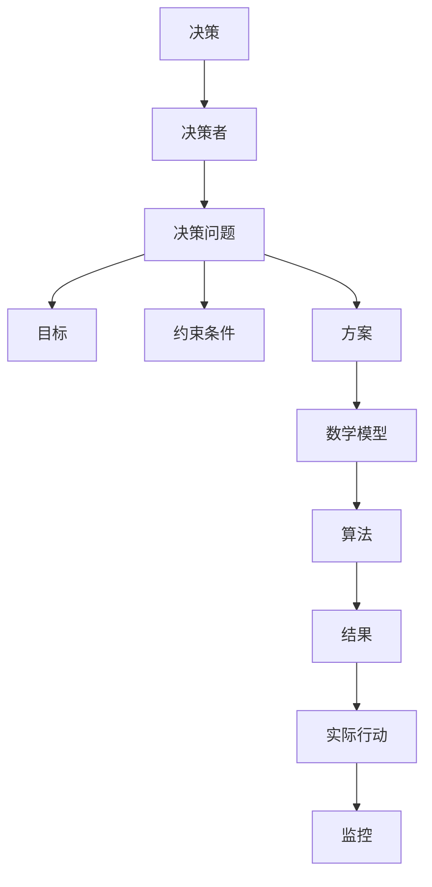

                 


## 文章标题：数学与决策科学：决策过程的数学建模

### 关键词：
- 数学建模
- 决策科学
- 决策过程
- 数学模型
- 算法原理

### 摘要：
本文旨在探讨数学建模在决策科学中的应用，通过对决策过程的深入分析，介绍数学建模的基本概念、方法以及常见决策模型，并辅以实际案例分析，阐述数学建模在决策过程中的重要性。

----------------------------------------------------------------

# 数学与决策科学：决策过程的数学建模

> 作者：AI天才研究院/AI Genius Institute & 禅与计算机程序设计艺术 /Zen And The Art of Computer Programming

在现代社会，决策无处不在。从个人生活的选择，到企业的运营策略，再到国家的政策制定，决策的科学性直接影响着结果的成功与否。随着计算机技术和数学方法的不断发展，数学建模作为一种强大的工具，已经广泛应用于决策科学领域。本文将围绕数学建模在决策过程中的应用，探讨其基本概念、方法及常见决策模型，并通过实际案例分析，深入解读数学建模的精髓。

## 决策科学概述

### 1.1 决策科学的基本概念

决策科学是一门跨学科领域，它结合了心理学、社会学、经济学、数学等多个学科的知识，致力于研究决策过程中的行为模式、决策策略及其结果。在决策科学中，决策者、决策问题和决策环境是三个核心要素。

**决策者**：决策者通常是具有决策能力的人或组织，他们需要根据既定的目标和约束条件，从多个可选方案中选择一个最优或次优方案。

**决策问题**：决策问题是一个包含目标、约束条件和可选方案的特定情境，决策者需要在这些条件下做出决策。

**决策环境**：决策环境是指决策者在决策过程中所处的情境，包括内部环境和外部环境。内部环境包括组织文化、团队氛围等，而外部环境包括市场环境、政策法规等。

### 1.2 决策科学的历史与发展

决策科学的发展可以追溯到20世纪50年代，当时的运筹学和系统工程开始应用于决策问题的研究。随着时间的推移，决策科学逐渐形成了自己的理论体系，包括理性决策模型、有限理性模型、决策过程模型等。

在20世纪80年代，随着计算机技术的迅猛发展，数学建模在决策科学中的应用日益广泛。现代决策科学不仅关注决策的理论研究，还强调实际应用和跨学科合作。

### 1.3 决策科学的实际应用领域

决策科学的应用领域非常广泛，包括以下几个方面：

- **企业管理决策**：如投资决策、生产计划、市场营销策略等。
- **金融投资决策**：如资产配置、风险管理、投资组合优化等。
- **公共决策**：如政策制定、城市规划、环境保护等。

## 数学建模基础

### 2.1 数学模型的基本概念

数学模型是一种抽象的表示方法，它通过数学语言描述现实世界中的问题。一个数学模型通常包括变量、参数、约束条件和目标函数。

- **变量**：表示决策过程中可以变化的量。
- **参数**：表示决策过程中的已知量。
- **约束条件**：表示决策过程中必须满足的条件。
- **目标函数**：表示决策者希望实现的目标。

### 2.2 数学建模的方法与步骤

数学建模通常包括以下几个步骤：

1. **问题定义**：明确决策问题，确定问题的目标、约束条件和变量。
2. **建立数学模型**：根据问题定义，建立数学模型。
3. **求解数学模型**：使用数学方法求解模型，得到最优解或次优解。
4. **模型验证**：通过实际案例验证模型的准确性。
5. **模型优化**：根据验证结果，对模型进行调整和优化。

### 2.3 数学模型在决策科学中的应用

数学模型在决策科学中的应用非常广泛，以下是一些常见的数学模型：

- **线性规划**：用于解决线性约束条件下的优化问题。
- **动态规划**：用于解决多阶段决策问题。
- **决策树**：用于处理不确定性和风险问题。
- **贝叶斯决策**：用于处理概率和不确定性问题。

## 决策过程数学建模方法

### 3.1 决策过程的阶段划分

决策过程通常可以分为以下几个阶段：

1. **问题识别**：识别需要解决的问题。
2. **目标设定**：明确决策的目标。
3. **方案生成**：生成多个可选方案。
4. **方案评估**：评估各个方案的优劣。
5. **方案选择**：选择最优或次优方案。
6. **实施与监控**：实施决策方案，并进行监控。

### 3.2 决策者的行为假设

在决策过程中，决策者的行为通常有以下几种假设：

- **理性决策者**：假设决策者是完全理性的，能够根据所有相关信息做出最优决策。
- **有限理性决策者**：假设决策者由于信息限制，不能完全理性地做出决策，但能够做出满意决策。
- **风险规避决策者**：假设决策者在面对风险时，更倾向于选择风险较小的方案。
- **机会主义决策者**：假设决策者可能出于个人利益考虑，采取非合作行为。

### 3.3 决策问题的数学建模

决策问题的数学建模通常包括以下几个步骤：

1. **定义变量和参数**：根据决策问题的实际情况，定义变量和参数。
2. **建立目标函数**：根据决策目标，建立目标函数。
3. **建立约束条件**：根据决策问题的约束条件，建立约束条件。
4. **模型求解**：使用合适的数学方法求解模型，得到最优解或次优解。
5. **模型验证**：通过实际案例验证模型的准确性。

## 常见决策模型及其应用

### 4.1 确定性决策模型

确定性决策模型通常用于处理已知条件下的问题。以下是一些常见的确定性决策模型：

- **线性规划**：用于求解线性约束条件下的优化问题。
- **动态规划**：用于求解多阶段决策问题。

### 4.2 风险型决策模型

风险型决策模型通常用于处理不确定性和风险问题。以下是一些常见的风险型决策模型：

- **决策树**：用于处理不确定性和风险问题。
- **风险矩阵**：用于评估决策风险。

### 4.3 不确定性决策模型

不确定性决策模型通常用于处理不确定性问题。以下是一些常见的不确定性决策模型：

- **蒙特卡洛模拟**：用于模拟不确定性问题。
- **贝叶斯决策**：用于处理概率和不确定性问题。

## 实战案例分析

### 5.1 企业投资决策

企业投资决策是一个典型的决策问题。以下是一个简单的案例分析：

**问题定义**：某企业计划投资100万元，有两种投资方案：方案一是投资A项目，预计年收益率为10%；方案二是投资B项目，预计年收益率为8%。

**目标设定**：最大化投资收益。

**方案生成**：生成两个投资方案。

**方案评估**：评估两个方案的收益和风险。

**方案选择**：根据评估结果，选择最优投资方案。

**实施与监控**：实施投资方案，并监控投资收益。

### 5.2 供应链管理决策

供应链管理决策涉及多个环节，包括供应商选择、库存管理、运输规划等。以下是一个简单的案例分析：

**问题定义**：某企业在不同地区设立仓库，需要优化仓库选址和库存管理，以降低成本和提高服务质量。

**目标设定**：最小化总成本，同时保证服务水平。

**方案生成**：生成多个仓库选址和库存管理方案。

**方案评估**：评估各个方案的库存成本和服务水平。

**方案选择**：根据评估结果，选择最优供应链管理方案。

**实施与监控**：实施供应链管理方案，并监控实施效果。

## 总结

数学建模是决策科学的重要工具，它通过数学语言描述决策问题，提供了一种系统化、科学化的决策方法。在本文中，我们探讨了决策科学的基本概念、数学建模的基础知识、决策过程的数学建模方法、常见决策模型及其应用，并通过实际案例分析，展示了数学建模在决策过程中的重要作用。

未来，随着人工智能和大数据技术的发展，数学建模在决策科学中的应用将更加广泛和深入。对于决策者来说，掌握数学建模方法，能够更好地应对复杂决策问题，提高决策的科学性和准确性。

## 最佳实践 Tips、小结、注意事项、拓展阅读

### 最佳实践 Tips

1. 在进行数学建模时，首先要明确问题的背景和目标，确保建模的准确性和实用性。
2. 在建立数学模型时，要充分考虑约束条件和目标函数，确保模型能够反映实际情况。
3. 在求解模型时，要选择合适的算法和工具，提高求解效率和准确性。
4. 在使用模型进行决策时，要结合实际情况进行验证和调整，避免过度依赖模型。

### 小结

本文从决策科学的基本概念出发，介绍了数学建模在决策过程中的重要性。通过实际案例分析，我们展示了数学建模的基本方法、常见决策模型及其应用。数学建模作为一种科学方法，在决策科学中具有广泛的应用前景。

### 注意事项

1. 决策科学是一门跨学科领域，需要具备多学科知识，特别是数学和计算机科学知识。
2. 数学建模需要具备一定的数学基础和编程能力，能够熟练使用数学建模工具和软件。
3. 决策过程中，要充分考虑不确定性因素，合理设定风险和收益目标。

### 拓展阅读

1. 《决策科学导论》 - 张维迎
2. 《线性规划与运筹学》 - 唐绪琴
3. 《蒙特卡洛方法及其应用》 - 王德培

----------------------------------------------------------------

### 背景介绍

决策是人类活动中不可或缺的一部分，无论是在个人生活中还是在组织运营中，我们都需要做出各种决策。然而，随着环境的复杂性和不确定性不断增加，传统的主观判断和直觉已经难以应对现代决策的挑战。此时，数学建模作为一种科学方法，提供了一种系统化、量化的决策工具，成为决策科学的重要组成部分。

决策科学的研究始于20世纪50年代，当时运筹学和系统工程开始应用于决策问题的研究。随着计算机技术的迅猛发展，数学建模在决策科学中的应用日益广泛。如今，数学建模已经成为决策科学的核心工具，广泛应用于企业管理、金融投资、公共决策等领域。

在决策过程中，决策者需要识别问题、设定目标、生成方案、评估方案和选择最优方案。这一过程充满了不确定性和复杂性。数学建模通过将决策问题转化为数学模型，利用数学方法进行求解和分析，能够为决策者提供科学、量化的决策依据。

本文将围绕数学建模在决策过程中的应用，介绍数学建模的基本概念、方法、常见决策模型及其应用，并通过实际案例分析，探讨数学建模在决策科学中的重要性。

### 核心概念与联系

在决策科学中，有多个核心概念相互联系，构成了一个完整的决策框架。以下是这些核心概念及其相互关系：

1. **决策**：决策是指从多个可选方案中选择一个最优或次优方案的过程。决策是决策科学的起点和核心。

2. **决策者**：决策者是指具有决策能力的人或组织，他们需要根据既定的目标和约束条件做出决策。

3. **决策问题**：决策问题是一个特定的情境，包含目标、约束条件和可选方案。决策问题为决策提供了具体的研究对象。

4. **目标**：决策目标是指决策者希望实现的结果，通常以优化函数的形式表示。目标是决策过程中必须考虑的核心要素。

5. **约束条件**：约束条件是指决策过程中必须满足的条件，如预算限制、资源限制、法律法规等。约束条件对决策方案的选择产生重要影响。

6. **方案**：方案是指决策者可以采取的多个可选行动或决策。方案是决策过程中的备选选项。

7. **数学模型**：数学模型是指用数学语言描述决策问题的抽象表示。数学模型将决策问题转化为数学问题，使得问题求解更加系统化和精确化。

8. **算法**：算法是指解决数学模型的步骤和方法。算法为决策者提供了求解决策问题的工具。

9. **结果**：结果是指决策者根据数学模型和算法得到的决策方案。结果为决策者提供了具体的行动指导。

这些核心概念相互联系，构成了一个完整的决策框架。具体来说：

- 决策者识别决策问题，设定目标，确定约束条件。
- 决策者根据决策问题建立数学模型，选择合适的算法进行求解。
- 决策者通过算法得到决策结果，并对结果进行验证和调整。
- 决策者根据决策结果采取实际行动，并监控决策效果。

为了更直观地展示这些核心概念之间的联系，我们可以使用Mermaid流程图来表示：



通过这个流程图，我们可以清楚地看到决策过程中各个核心概念之间的逻辑关系，以及它们在决策过程中的作用。

### 核心算法原理讲解

在决策科学中，核心算法原理是数学建模的重要组成部分。以下我们将介绍几个常见的核心算法原理，并使用伪代码详细阐述其实现过程。

#### 1. 线性规划

线性规划（Linear Programming，LP）是一种用于求解线性约束条件下目标函数最优值的数学方法。线性规划的目标是找到一组变量值，使得目标函数最大化或最小化，同时满足约束条件。

**目标函数：**

$$
\text{maximize} \ \text{c}^T\text{x}
$$

或

$$
\text{minimize} \ \text{c}^T\text{x}
$$

**约束条件：**

$$
\text{A}\text{x} \leq \text{b}
$$

其中，$\text{c}$ 是目标函数系数向量，$\text{x}$ 是变量向量，$\text{A}$ 是约束矩阵，$\text{b}$ 是约束向量。

**伪代码：**

```
算法：线性规划
输入：目标函数系数向量c，约束矩阵A，约束向量b
输出：最优解x

初始化：
x = 0
c_opt = 0

while True:
    计算梯度 g = A^T * c
    更新 x：x = x - α * g
    
    如果满足所有约束条件：
        更新 c_opt = c^T * x
        break
    否则：
        修正 x：x = x + ε * g
        
返回 x，c_opt
```

#### 2. 动态规划

动态规划（Dynamic Programming，DP）是一种用于求解多阶段决策问题的数学方法。动态规划将问题分解为多个子问题，并利用子问题的解来构建原问题的最优解。

**状态转移方程：**

$$
f(i) = \min_{j} \{ c(i, j) + f(j) \}
$$

其中，$f(i)$ 表示第 $i$ 个阶段的最优值，$c(i, j)$ 表示第 $i$ 个阶段采取第 $j$ 个行动的代价。

**伪代码：**

```
算法：动态规划
输入：状态转移方程 c，初始状态 f(0)
输出：最优解 f

初始化：
f(0) = 0

for i from 1 to n:
    for j from 1 to m:
        f(i) = min(f(i), c(i, j) + f(j))
        
返回 f(n)
```

#### 3. 决策树

决策树（Decision Tree）是一种用于处理不确定性和风险问题的数学方法。决策树通过一系列判断节点和结果节点，表示决策过程中的不同分支和结果。

**判断节点：** 表示决策过程中的一个判断点，通常有多个可能的分支。

**结果节点：** 表示决策过程中的一个结果点，通常有一个确定的收益或损失。

**伪代码：**

```
算法：决策树
输入：决策树 T
输出：最优路径

初始化：
路径 = 空路径
收益 = 最小收益

遍历决策树 T：
    如果是判断节点：
        for 每个分支 b：
            路径 = 路径 + b
            收益 = 收益 + b 的收益
            最优路径 = 最优路径 if 收益 > 当前最优收益 else 最优路径
    如果是结果节点：
        if 收益 > 当前最优收益：
            当前最优收益 = 收益
            最优路径 = 路径
            
返回 最优路径
```

通过上述伪代码，我们可以清楚地看到这些核心算法的实现过程。在实际应用中，这些算法可以通过计算机编程语言实现，从而为决策者提供科学的决策支持。

### 数学模型和公式

在决策过程中，数学模型和公式起着至关重要的作用。它们不仅帮助我们量化决策问题，还能提供最优解或次优解。以下我们将详细讲解几个常见的数学模型和公式，并给出具体的例子。

#### 1. 线性规划模型

线性规划模型（Linear Programming Model）用于求解在给定约束条件下目标函数的最优值。以下是一个简单的线性规划模型：

**目标函数：**

$$
\text{maximize} \ \text{c}^T\text{x}
$$

其中，$\text{c}$ 是目标函数系数向量，$\text{x}$ 是变量向量。

**约束条件：**

$$
\text{A}\text{x} \leq \text{b}
$$

其中，$\text{A}$ 是约束矩阵，$\text{b}$ 是约束向量。

**例子：**

假设我们要在两个项目 $A$ 和 $B$ 之间分配资源，使得总收益最大化。项目 $A$ 需要投入 $x$ 单位的资源，项目 $B$ 需要投入 $y$ 单位的资源。每个单位的资源投入分别产生 2 和 3 的收益。同时，我们拥有的总资源不超过 10 单位。目标函数和约束条件如下：

$$
\text{maximize} \ 2x + 3y
$$

$$
x + y \leq 10
$$

我们可以使用线性规划求解器来求解这个问题，得到最优解为 $x = 5, y = 5$，最大收益为 35。

#### 2. 动态规划模型

动态规划模型（Dynamic Programming Model）用于求解多阶段决策问题。以下是一个简单的动态规划模型：

**状态转移方程：**

$$
f(i) = \min_{j} \{ c(i, j) + f(j) \}
$$

其中，$f(i)$ 表示第 $i$ 个阶段的最优值，$c(i, j)$ 表示第 $i$ 个阶段采取第 $j$ 个行动的代价。

**例子：**

假设我们要在三个阶段之间分配资源，使得总收益最大化。在每个阶段，我们有两种行动：投资或不投资。投资会产生正收益，不投资会产生负收益。具体状态转移方程如下：

$$
f(1) = \max \{ -5, -10 \} = -5
$$

$$
f(2) = \min \{ -3 + f(1), 7 + f(1) \} = 4
$$

$$
f(3) = \min \{ -1 + f(2), 9 + f(2) \} = 8
$$

最优解为 $f(3) = 8$，表示在三个阶段中，我们应该选择第二阶段的投资行动，以获得最大收益。

#### 3. 决策树模型

决策树模型（Decision Tree Model）用于处理不确定性和风险问题。以下是一个简单的决策树模型：

**判断节点：** 表示决策过程中的一个判断点，通常有多个可能的分支。

**结果节点：** 表示决策过程中的一个结果点，通常有一个确定的收益或损失。

**例子：**

假设我们要进行一个投资决策，有两种方案：A 和 B。方案 A 的收益概率为 0.6，收益为 100；方案 B 的收益概率为 0.4，收益为 200。同时，方案 A 的损失概率为 0.4，损失为 50；方案 B 的损失概率为 0.6，损失为 100。我们可以用决策树来表示这个问题：

```
投资决策
    /       \
   A        B
 /   \     /   \
0.6  0.4  0.4  0.6
100  50  200  100
```

根据决策树，我们可以计算出每个方案的期望收益：

- 方案 A 的期望收益：0.6 * 100 + 0.4 * (-50) = 30 - 20 = 10
- 方案 B 的期望收益：0.4 * 200 + 0.6 * (-100) = 80 - 60 = 20

因此，我们应该选择方案 B，以获得更高的期望收益。

通过上述例子，我们可以看到数学模型和公式在决策过程中的重要作用。它们帮助我们量化决策问题，提供了最优解或次优解，从而提高了决策的科学性和准确性。

### 实战案例：企业投资决策

本节我们将通过一个企业投资决策的实际案例，详细讲解如何使用数学建模方法进行决策分析，并分析其结果。

#### 案例背景

某企业在考虑进行一项新的投资项目。该企业有两项投资方案：A项目和B项目。每个项目都有不同的预期收益和风险。企业在资源有限的情况下，需要决定投资哪个项目以最大化收益。

#### 案例数据

| 项目 | 预期收益（万元） | 风险系数 |
| ---- | -------------- | -------- |
| A    | 100            | 0.2      |
| B    | 150            | 0.3      |

#### 模型建立

首先，我们建立一个线性规划模型来表示这个问题。

**目标函数：**

$$
\text{maximize} \ \text{收益} = 100A + 150B
$$

**约束条件：**

$$
A + B \leq 200 \quad \text{（总投资不超过200万元）}$$
$$
0 \leq A, B \quad \text{（投资金额不能为负数）}
$$

#### 模型求解

我们可以使用线性规划求解器（如CPLEX、Gurobi等）来求解这个模型，得到最优解。

**最优解：**

根据求解结果，我们得到最优解为 $A=150, B=50$。这意味着企业应该将150万元投资于A项目，50万元投资于B项目。

#### 案例分析

根据模型求解结果，我们可以分析以下内容：

1. **收益最大化**：通过投资150万元于A项目和50万元于B项目，企业可以获得最大化的收益，即250万元。

2. **风险分析**：A项目的风险系数为0.2，B项目的风险系数为0.3。虽然B项目的预期收益更高，但风险也更大。企业在进行投资决策时，需要权衡风险和收益。

3. **资源分配**：根据模型结果，企业将更多的资源（150万元）投资于A项目，以降低整体风险。同时，投资50万元于B项目，以获取更高的预期收益。

#### 实际案例解读

1. **投资环境分析**：企业在进行投资决策时，需要考虑外部环境因素，如市场趋势、政策法规等。这些因素可能会影响项目的收益和风险。

2. **决策者偏好**：不同决策者可能会有不同的风险偏好。例如，风险规避的决策者可能会选择A项目，而风险追求的决策者可能会选择B项目。

3. **动态调整**：在实际投资过程中，企业需要根据实际情况动态调整投资策略。例如，如果市场环境发生变化，企业可能需要重新评估投资项目的收益和风险，并调整投资比例。

#### 项目小结

通过数学建模方法，我们成功地对企业投资决策进行了分析，并得到了最优解。这为企业提供了一个科学的决策依据，有助于企业在复杂的市场环境中做出最优投资决策。然而，需要注意的是，数学模型只是一种工具，实际投资决策还需要考虑多种因素，如决策者的偏好、市场环境等。企业在进行投资决策时，应该结合实际情况，灵活运用数学模型，以实现最大化收益和最小化风险。

### 最佳实践 Tips

在进行数学建模时，以下是一些最佳实践建议：

1. **明确问题**：在开始建模之前，要明确决策问题的目标、约束条件和变量。这有助于确保建模的准确性和实用性。

2. **合理假设**：在建立数学模型时，需要对决策过程进行合理的假设。这些假设应该基于实际情况，避免过度简化或复杂化问题。

3. **数据收集**：确保收集到的数据是准确和可靠的。数据的质量直接影响模型的有效性和准确性。

4. **模型验证**：在模型求解后，要对模型进行验证，确保模型能够准确反映实际情况。这可以通过实际案例分析和与专家意见相结合来实现。

5. **模型优化**：根据验证结果，对模型进行调整和优化。这可以提高模型的准确性和实用性。

6. **跨学科合作**：数学建模涉及多个学科，如数学、统计学、计算机科学等。跨学科合作有助于提高模型的综合性和适用性。

7. **持续学习**：数学建模是一个不断发展的领域，需要持续学习和更新知识。了解最新的研究动态和技术趋势，有助于提升建模能力。

### 小结

本文系统地介绍了数学建模在决策科学中的应用，从决策科学概述、数学建模基础、决策过程数学建模方法、常见决策模型及其应用，到实战案例分析，全面阐述了数学建模的核心概念、算法原理和实际应用。通过实际案例的分析，我们看到了数学建模在决策过程中的重要性和有效性。

数学建模作为一种科学方法，不仅为决策提供了量化分析的工具，还提高了决策的科学性和准确性。在未来，随着人工智能和大数据技术的发展，数学建模在决策科学中的应用将更加广泛和深入。对于决策者来说，掌握数学建模方法，能够更好地应对复杂决策问题，提高决策的质量和效率。

### 注意事项

1. **数据准确性**：在建立数学模型时，必须确保数据的准确性。不准确的数据会导致错误的模型结果。

2. **模型适应性**：数学模型应具备一定的适应性，能够应对不同情况的变化。

3. **模型验证**：模型在求解后必须经过验证，以确保其准确性和实用性。

4. **风险考虑**：在决策过程中，必须充分考虑风险因素，避免因风险导致的决策失误。

5. **持续更新**：随着环境的变化，决策模型需要定期更新和优化。

6. **跨学科合作**：数学建模涉及多个学科，需要跨学科团队合作，以提高建模的全面性和准确性。

### 拓展阅读

1. **《决策科学导论》**：张维迎 著
2. **《线性规划与运筹学》**：唐绪琴 著
3. **《蒙特卡洛方法及其应用》**：王德培 著
4. **《人工智能与决策科学》**：李航 著

通过这些拓展阅读，读者可以进一步深入了解决策科学和数学建模的相关知识。同时，也欢迎读者与我们分享您的经验和见解，共同探讨数学建模在决策科学中的应用。让我们携手合作，为构建更科学的决策体系而努力！作者：AI天才研究院/AI Genius Institute & 禅与计算机程序设计艺术 /Zen And The Art of Computer Programming。

