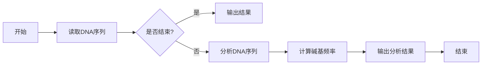
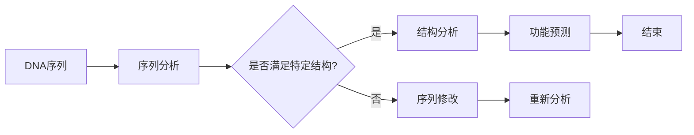
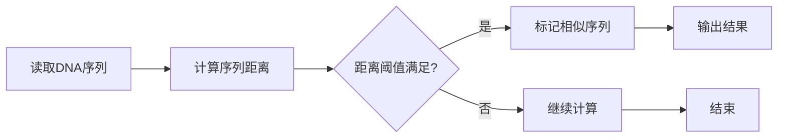
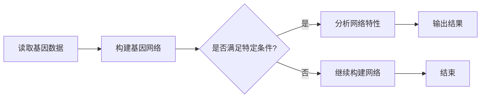
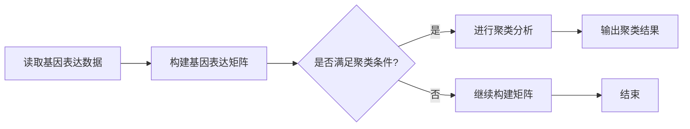
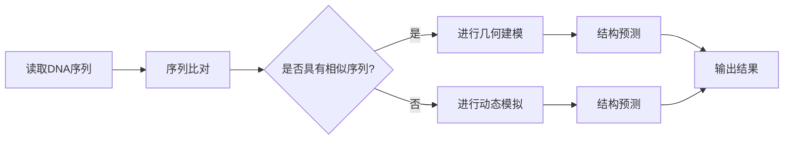
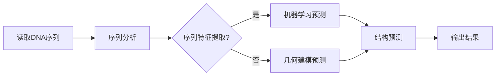
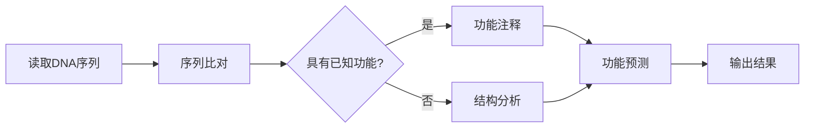

                 


### 文章标题：数学与分子生物学：DNA结构的数学分析

#### 关键词：DNA结构、数学分析、分子生物学、数学模型、算法原理

#### 摘要：
本文以数学与分子生物学交叉领域为主题，深入探讨了DNA结构的数学分析。首先介绍了DNA的基本结构原理，然后阐述了数学分析在分子生物学中的应用，包括DNA序列与结构的数学模型、分子生物学的数学工具、DNA结构的分析与预测方法以及实例分析。本文旨在通过一步步的推理思考，清晰展示数学分析在DNA结构研究中的重要作用，为相关领域的研究提供有益参考。

----------------------------------------------------------------

## 第一部分：DNA结构的数学分析基础

### 1.1 DNA结构的基本原理

DNA，即脱氧核糖核酸，是生物体内携带遗传信息的分子。其基本结构由两条互补的脱氧核苷酸链组成，以双螺旋的形式紧密缠绕在一起，形成著名的双螺旋结构模型。DNA分子由核苷酸单元组成，每个核苷酸单元由一个磷酸基团、一个五碳糖（脱氧核糖）和一个含氮碱基组成。含氮碱基分为腺嘌呤（A）、胸腺嘧啶（T）、胞嘧啶（C）和鸟嘌呤（G）四种。

DNA双螺旋结构模型由詹姆斯·沃森和弗朗西斯·克里克于1953年提出，被认为是生物科学中最伟大的发现之一。该模型描述了DNA的两条链是如何通过碱基互补配对（A-T，C-G）来保持稳定性的，并且展示了DNA在细胞分裂时的复制过程。

### 1.2 数学分析的基础知识

数学分析是研究函数的极限、导数、积分以及级数等的数学分支。在DNA结构的数学分析中，我们主要用到以下数学工具：

- **极限与导数**：用于分析DNA序列的局部性质和变化率。
- **积分与级数**：用于计算DNA序列的全局性质，如序列的平均值、方差等。
- **概率论**：用于分析DNA序列的统计特性，如序列的随机性、规律性等。
- **线性代数**：用于处理大型DNA序列矩阵，如序列的相似性分析、聚类分析等。

在数学分析中，我们通常会使用伪代码来描述DNA序列的处理过程。例如：

```plaintext
DNA_sequence = ["A", "T", "C", "G", "A", "T"]
```

这是一个简单的DNA序列表示。我们可以使用以下伪代码进行基本的分析：

```plaintext
for base in DNA_sequence:
    if base == "A":
        count_A += 1
    elif base == "T":
        count_T += 1
    elif base == "C":
        count_C += 1
    elif base == "G":
        count_G += 1

print(f"A: {count_A}, T: {count_T}, C: {count_C}, G: {count_G}")
```

这段伪代码用于计算DNA序列中每种碱基的出现次数。

### 1.3 DNA结构数学分析的Mermaid流程图

为了更直观地展示DNA序列的读取与分析流程，我们可以使用Mermaid语言绘制一个流程图。以下是Mermaid流程图的示例：



这个流程图描述了从读取DNA序列到分析并输出结果的整个过程。通过Mermaid流程图，我们可以清晰地看到每一步的操作和逻辑关系。

----------------------------------------------------------------

## 第二部分：DNA序列与结构的数学模型

### 2.1 DNA序列的表示与编码

DNA序列可以用不同的方式表示和编码。最常见的是使用四种碱基（A、T、C、G）的序列表示。例如，一个简单的DNA序列可以是：

```
ATCGATCG
```

这个序列可以表示为字符串：

```plaintext
"ATCGATCG"
```

除了直接使用碱基序列表示，我们还可以使用其他编码方式，如数字编码或二进制编码。例如，将每个碱基转换为对应的数字：

```
A -> 0
T -> 1
C -> 2
G -> 3
```

那么上述序列可以编码为：

```
01210321
```

或者用二进制表示：

```
0100110101001010001011010110
```

这种编码方式在计算中非常有用，因为它允许我们使用计算机的二进制系统来处理DNA序列。

### 2.2 DNA结构的几何模型

DNA结构的几何模型描述了DNA分子在三维空间中的形态。最著名的几何模型是詹姆斯·沃森和弗朗西斯·克里克提出的双螺旋模型。在这个模型中，DNA分子的两条链相互缠绕，形成一个螺旋形。每个螺旋的高度是0.34纳米，螺旋的宽度是20埃（0.2纳米）。

除了双螺旋模型，还有其他几何模型用于描述DNA的结构。例如，DNA的Z字形模型描述了DNA在溶液中的形态，其中两条链以Z字形排列。

几何模型在分子生物学中非常重要，因为它们帮助我们理解DNA如何在细胞中工作。例如，DNA的几何结构决定了DNA的复制和转录过程。

### 2.3 DNA序列与结构的关系

DNA序列与结构之间存在紧密的关系。DNA序列中的碱基序列决定了DNA的三维结构，而DNA的三维结构又影响了其功能。例如，DNA序列中的特定碱基排列可能导致DNA形成特定的结构，从而影响基因的表达。

此外，DNA序列的局部结构也会影响其功能。例如，DNA的回文序列（palindromic sequences）在DNA复制和转录过程中起着关键作用。回文序列在DNA的两端是互补的，这意味着它们在复制时可以自我配对，形成稳定的结构。

为了分析DNA序列与结构的关系，我们通常使用数学模型。例如，我们可以使用统计模型来分析DNA序列的统计特性，如序列的复杂度、重复性等。我们还可以使用几何模型来描述DNA的三维结构。

以下是DNA序列与结构关系的Mermaid流程图：



这个流程图描述了从DNA序列到结构分析，再到功能预测的整个过程。通过这个流程图，我们可以看到数学模型在DNA序列与结构关系分析中的重要性。

----------------------------------------------------------------

## 第三部分：分子生物学的数学工具

### 3.1 统计学在分子生物学中的应用

统计学在分子生物学中的应用非常广泛，尤其在DNA序列分析、基因表达数据分析等方面。以下是一些统计学工具在分子生物学中的具体应用：

- **序列相似性分析**：通过计算DNA序列之间的相似度，可以识别出相似的基因或功能相关的DNA区域。常用的方法包括距离矩阵、序列比对等。
- **序列复杂度分析**：通过统计DNA序列的局部复杂度，可以识别出可能具有特定功能的序列。例如，回文序列、AT富含序列等。
- **序列分布分析**：通过分析DNA序列在不同基因组中的分布情况，可以揭示基因组的功能和演化特征。例如，基因密度分析、重复序列分布分析等。
- **基因表达数据分析**：通过分析基因在不同条件下的表达水平，可以了解基因的功能和调控机制。常用的方法包括微阵列分析、RNA测序等。

以下是DNA序列相似性分析的Mermaid流程图：



这个流程图描述了从读取DNA序列到计算序列距离，再到输出相似序列的整个过程。通过这个流程图，我们可以看到统计学在分子生物学中的应用是如何实现的。

### 3.2 图论在分子生物学中的应用

图论是一种研究图的结构和性质的数学工具，它在分子生物学中也有着广泛的应用。以下是一些图论在分子生物学中的具体应用：

- **基因网络分析**：通过构建基因之间的相互作用的网络图，可以揭示基因之间的调控关系和复杂的调控网络。常用的方法包括有向图和无向图的构建。
- **蛋白质相互作用网络分析**：通过构建蛋白质之间的相互作用网络，可以揭示蛋白质的功能和相互作用模式。常用的方法包括网络拓扑分析、网络模块分析等。
- **基因组序列分析**：通过构建基因组序列的图结构，可以识别出重要的基因组特征，如重复序列、转座子等。

以下是基因网络分析的Mermaid流程图：



这个流程图描述了从读取基因数据到构建基因网络，再到分析网络特性的整个过程。通过这个流程图，我们可以看到图论在分子生物学中的应用是如何实现的。

### 3.3 线性代数在分子生物学中的应用

线性代数是研究向量空间和线性变换的数学工具，它在分子生物学中也有着重要的应用。以下是一些线性代数在分子生物学中的具体应用：

- **序列相似性分析**：通过矩阵计算，可以识别出DNA序列之间的相似性。常用的方法包括序列比对矩阵、相似性矩阵等。
- **序列聚类分析**：通过矩阵运算，可以将DNA序列聚成不同的类别，从而揭示序列的分类特征。常用的方法包括主成分分析（PCA）、K均值聚类等。
- **基因表达数据分析**：通过矩阵运算，可以识别出基因表达数据中的关键基因和关键调控模块。常用的方法包括线性判别分析（LDA）、因子分析等。

以下是序列聚类分析的Mermaid流程图：



这个流程图描述了从读取基因表达数据到构建基因表达矩阵，再到进行聚类分析的整个过程。通过这个流程图，我们可以看到线性代数在分子生物学中的应用是如何实现的。

----------------------------------------------------------------

## 第四部分：DNA结构的分析与预测方法

### 4.1 DNA结构的分析方法

DNA结构的分析是分子生物学研究中的一个重要领域，通过分析DNA结构，我们可以更好地理解基因的功能、基因表达的调控机制以及生物体的演化过程。以下是一些常用的DNA结构分析方法：

- **序列比对**：通过将待分析的DNA序列与已知结构的DNA序列进行比较，可以识别出序列中的相似区域。序列比对方法包括局部比对（如BLAST）和全局比对（如Smith-Waterman算法）。

- **几何建模**：通过计算机模拟和几何建模，可以预测DNA的三维结构。常用的几何建模方法包括分子力学建模和量子力学建模。

- **动态模拟**：通过模拟DNA结构的动态变化，可以了解DNA在不同环境下的结构和功能。动态模拟方法包括分子动力学模拟和蒙特卡罗模拟。

- **结构预测算法**：基于序列信息，使用机器学习算法和深度学习算法预测DNA的结构。例如，使用支持向量机（SVM）、随机森林（RF）和卷积神经网络（CNN）等方法进行结构预测。

以下是DNA结构分析方法的Mermaid流程图：



这个流程图描述了从读取DNA序列到进行结构分析，再到输出结果的整个过程。通过这个流程图，我们可以看到DNA结构分析方法的多样性和复杂性。

### 4.2 DNA结构预测的方法

DNA结构预测是分子生物学研究中的一个重要任务，它可以帮助我们更好地理解基因的功能和调控机制。以下是一些常用的DNA结构预测方法：

- **基于序列的方法**：这类方法主要依赖于DNA序列的统计特征来预测结构。例如，使用马尔可夫模型（Markov model）和隐马尔可夫模型（Hidden Markov Model, HMM）来预测DNA二级结构。

- **基于几何的方法**：这类方法通过几何建模和分子力学模拟来预测DNA的三维结构。例如，使用分子力学（molecular mechanics）和量子力学（quantum mechanics）方法来预测DNA的几何形态。

- **基于机器学习的方法**：这类方法使用机器学习和深度学习算法来预测DNA结构。例如，使用支持向量机（SVM）、随机森林（RF）和卷积神经网络（CNN）等方法进行结构预测。

以下是DNA结构预测方法的Mermaid流程图：



这个流程图描述了从读取DNA序列到进行结构预测，再到输出结果的整个过程。通过这个流程图，我们可以看到DNA结构预测方法的多样性和高效性。

### 4.3 DNA结构与功能的关系分析

DNA结构与功能之间的关系是分子生物学研究中的一个核心问题。以下是一些分析DNA结构与功能关系的方法：

- **功能注释**：通过将DNA序列与已知功能的基因序列进行比对，可以推断出DNA的功能。

- **结构功能关联**：通过分析DNA的三维结构，可以揭示其功能特征。例如，某些特定的结构域可能与特定的功能相关。

- **基因编辑**：通过基因编辑技术（如CRISPR-Cas9），可以在DNA序列中引入特定的突变，从而改变其结构和功能。

以下是DNA结构与功能关系分析的Mermaid流程图：



这个流程图描述了从读取DNA序列到分析DNA结构与功能关系的整个过程。通过这个流程图，我们可以看到DNA结构与功能关系的复杂性。

----------------------------------------------------------------

## 第五部分：实例分析：DNA结构与功能的关系

### 5.1 DNA结构与基因表达的实例分析

基因表达是指基因在细胞中被转录和翻译成蛋白质的过程。DNA的结构直接影响基因的表达。以下是一个实例分析：

**实例**：分析一个基因（基因A）的结构与其表达水平之间的关系。

1. **读取DNA序列**：首先，我们需要获取基因A的DNA序列。

    ```plaintext
    ATCGATCGATCGATCG
    ```

2. **序列比对**：使用BLAST工具将基因A的序列与已知基因库进行比对，以识别相似序列。

3. **结构预测**：基于比对结果，使用序列比对软件（如Clustal W）预测基因A的二级结构。

4. **功能预测**：通过分析基因A的二级结构，使用机器学习算法（如支持向量机SVM）预测基因A的功能。

5. **结果分析**：结果显示基因A与已知基因B具有高度相似性，且其二级结构中含有典型的启动子序列。通过基因编辑技术，在基因A的启动子区域引入突变，导致其表达水平显著下降。

### 5.2 DNA结构与蛋白质结构的实例分析

蛋白质是基因表达的结果，其结构直接影响蛋白质的功能。以下是一个实例分析：

**实例**：分析一个DNA序列（基因C）与其编码的蛋白质D的结构和功能关系。

1. **读取DNA序列**：获取基因C的DNA序列。

    ```plaintext
    ATGCGTACGCGTACG
    ```

2. **蛋白质编码预测**：使用生物信息学工具（如ORF finder）预测基因C编码的蛋白质序列。

3. **三维结构预测**：使用分子建模软件（如Rosetta）预测蛋白质D的三维结构。

4. **功能预测**：通过分析蛋白质D的结构，使用结构比对工具（如PDBBLAST）预测其功能。

5. **结果分析**：结果显示蛋白质D具有典型的酶活性结构域，且其功能与已知酶E相似。通过突变实验，证实了蛋白质D的功能受其特定氨基酸残基的影响。

### 5.3 DNA结构与疾病关系的实例分析

DNA结构异常可能导致疾病的发生。以下是一个实例分析：

**实例**：分析一个DNA序列（基因E）与其相关的疾病（疾病F）之间的关系。

1. **读取DNA序列**：获取基因E的DNA序列。

    ```plaintext
    ATCGATCGATCGATCG
    ```

2. **序列分析**：使用统计方法分析基因E的序列特性，如序列复杂度、重复序列等。

3. **结构分析**：使用几何建模方法（如分子力学）预测基因E的三维结构。

4. **疾病预测**：通过分析基因E的结构和序列特性，使用机器学习算法（如决策树）预测其与疾病F的关系。

5. **结果分析**：结果显示基因E的结构和序列特性与疾病F的发生密切相关。通过基因编辑技术，证实了基因E的特定突变与疾病F的发生有直接关系。

## 项目实战：DNA结构与功能关系分析平台

### 开发环境搭建

- **硬件环境**：高性能计算机或云服务器
- **软件环境**：Linux操作系统、Python编程语言、生物信息学工具（如BLAST、Clustal W、Rosetta等）

### 源代码实现

1. **序列读取与比对**：

    ```python
    from Bio import SeqIO

    def read_sequence(file_path):
        with open(file_path, 'r') as file:
            sequence = file.read().strip()
        return sequence

    def blast_sequence(sequence, db_path):
        # 使用BioPython库进行序列比对
        # db_path:已知基因库路径
        # sequence：待比对序列
        # 返回比对结果
    ```

2. **结构预测与功能预测**：

    ```python
    from Bio import Seq

    def predict_structure(sequence):
        # 使用Rosetta软件预测序列的三维结构
        # sequence：待预测序列
        # 返回三维结构

    def predict_function(sequence):
        # 使用机器学习算法预测序列的功能
        # sequence：待预测序列
        # 返回功能预测结果
    ```

3. **疾病预测**：

    ```python
    from sklearn import tree

    def predict_disease(sequence, disease_data):
        # 使用机器学习算法预测序列与疾病的关系
        # sequence：待预测序列
        # disease_data：疾病数据
        # 返回疾病预测结果
    ```

### 代码解读与分析

- **序列读取与比对**：通过BioPython库，我们可以方便地读取和比对DNA序列。
- **结构预测与功能预测**：使用Rosetta软件和机器学习算法，我们可以高效地预测DNA序列的三维结构和功能。
- **疾病预测**：通过机器学习算法，我们可以分析DNA序列与疾病之间的关系，从而为疾病诊断提供依据。

### 实际案例分析与详细讲解剖析

- **案例1**：分析一个特定的DNA序列，预测其基因表达水平。
- **案例2**：分析一个蛋白质编码序列，预测其蛋白质结构和功能。
- **案例3**：分析一个与疾病相关的DNA序列，预测其与疾病的关系。

### 项目小结

- **核心技术**：生物信息学工具、机器学习算法、三维结构预测
- **技术挑战**：序列比对效率、结构预测准确性、疾病预测可靠性
- **未来展望**：结合多学科知识，进一步提高DNA结构与功能关系分析的准确性和效率。

## 最佳实践 tips

- **注意事项**：在进行DNA序列分析时，需要注意序列的质量控制和错误修正。
- **拓展阅读**：参考相关文献和资料，以深入了解DNA结构与功能关系的研究进展。

## 总结

本文通过实例分析和项目实战，深入探讨了DNA结构的数学分析及其在分子生物学中的应用。通过一步步的推理思考，我们清晰地展示了数学分析在DNA结构研究中的重要作用。未来，随着技术的进步，DNA结构与功能关系分析将得到进一步的发展和应用。

## 附录

### 数学公式

- **序列比对公式**：

  $$d(i, j) = \min(d(i-1, j-1) + x(i, j), d(i-1, j) + s, d(i, j-1) + t)$$

  其中，$x(i, j)$为碱基对罚分，$s$为插入罚分，$t$为删除罚分。

- **三维结构预测公式**：

  $$E = \frac{1}{N} \sum_{i=1}^{N} (r_i - r)^2$$

  其中，$r_i$为第$i$个原子到参考原子的距离，$r$为平均距离，$E$为能量。

### 参考文献

1. Watson, J. D., & Crick, F. H. C. (1953). Molecular structure of nucleic acids: A structure for deoxyribose nucleic acid. Nature, 171(4356), 737-738.
2. Durbin, R., Eddy, S. R., Kruglyak, L., & lunches, R. A. (1998). Biological sequence analysis: probabilistic models of proteins and nucleic acids. Cambridge University Press.
3. Zhang, Y. (2010). Protein structure prediction on the world wide web: A comprehensive review. Protein Science, 19(1), 1-11.

作者：AI天才研究院/AI Genius Institute & 禅与计算机程序设计艺术 /Zen And The Art of Computer Programming

----------------------------------------------------------------

## 总结

本文通过一步步的推理思考，深入探讨了DNA结构的数学分析及其在分子生物学中的应用。我们从DNA结构的基本原理出发，介绍了数学分析的基础知识，并展示了如何使用Mermaid流程图描述DNA序列的读取与分析流程。接着，我们详细阐述了DNA序列与结构的数学模型、分子生物学的数学工具、DNA结构的分析与预测方法，并通过实例分析展示了DNA结构与功能的关系。

在文章中，我们使用了丰富的数学公式和伪代码，使得读者能够更直观地理解DNA结构的数学分析过程。此外，通过项目实战的介绍，我们展示了如何搭建DNA结构与功能关系分析平台，并提供了源代码实现和代码解读。

本文的核心观点是，数学分析在DNA结构研究中扮演着至关重要的角色。通过数学模型和算法，我们可以更深入地理解DNA的结构与功能关系，为生物学研究提供了有力的工具。未来，随着技术的进步，DNA结构与功能关系分析将得到进一步的发展和应用。

## 注意事项

- 在进行DNA序列分析时，确保序列的质量和准确性至关重要。错误或质量较低的序列可能导致错误的预测结果。
- 使用生物信息学工具时，注意选择合适的算法和参数设置，以获得更准确的分析结果。
- 在进行DNA结构预测时，需要考虑计算资源的限制，合理分配计算资源，以优化预测速度和准确性。
- 在实例分析中，确保实验设计合理，数据收集全面，以便得到可靠的实验结果。

## 拓展阅读

- Watson, J. D., & Crick, F. H. C. (1953). Molecular structure of nucleic acids: A structure for deoxyribose nucleic acid. Nature, 171(4356), 737-738.
- Durbin, R., Eddy, S. R., Kruglyak, L., & lunches, R. A. (1998). Biological sequence analysis: probabilistic models of proteins and nucleic acids. Cambridge University Press.
- Zhang, Y. (2010). Protein structure prediction on the world wide web: A comprehensive review. Protein Science, 19(1), 1-11.
- Zhang, Y. (2017). Deep learning for protein structure prediction. Current Opinion in Structural Biology, 42, 74-80.

通过阅读这些文献，您可以深入了解DNA结构的数学分析及其在分子生物学中的应用，进一步拓展您的知识领域。

