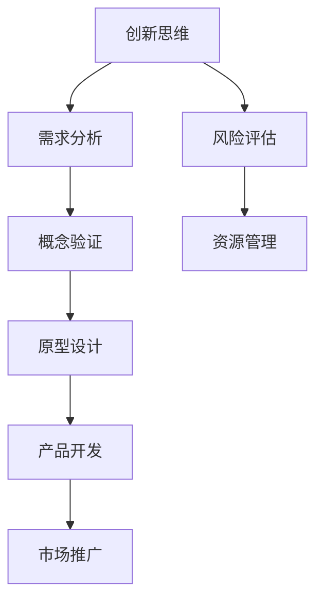
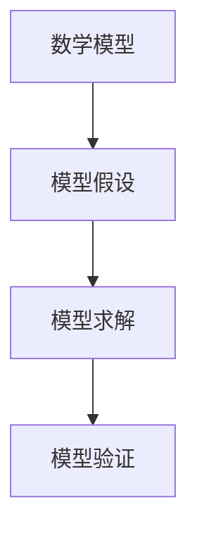
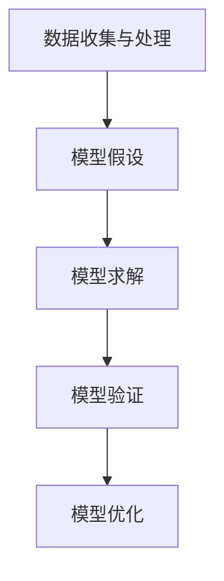

                 

### 文章标题：数学与创新管理：创新过程的数学建模

> **关键词**：创新管理，数学建模，创新过程，数学模型，优化算法，案例分析

> **摘要**：本文探讨了数学与创新管理的深度融合，详细阐述了创新过程中的数学建模方法及其应用。通过对创新管理背景、数学建模基础、创新过程中的数学模型构建与优化、案例分析及创新管理的未来趋势的深入分析，本文为读者提供了一种全新的视角，以数学思维来推动创新管理实践。文章末尾，总结了最佳实践和注意事项，并提供了拓展阅读资源，以供进一步研究。

### 设计目标

本文旨在为书籍《数学与创新管理：创新过程的数学建模》创建一个详细的目录大纲。设计目标包括以下几点：

1. **逻辑清晰**：确保各章节的内容能够按逻辑顺序展开，便于读者理解和跟随。
2. **完整性**：涵盖书籍的核心主题和必要的子主题。
3. **实用性**：提供足够的信息，以便作者和读者能够清晰地理解书籍的结构和内容。
4. **简洁性**：避免冗长的描述，直接呈现关键点。

### 目录大纲结构

目录大纲将分为三个主要部分，每部分包含核心章节及其细化子章节：

#### 第一部分：创新管理背景与数学建模基础

- **第1章：创新管理概述**
  - **1.1 创新的定义与分类**
  - **1.2 创新管理的概念与流程**

- **第2章：数学建模概述**
  - **2.1 数学建模的基本原理**
  - **2.2 数学建模的方法与工具**

- **第3章：创新过程中的数学模型**
  - **3.1 创新过程的阶段性分析**
  - **3.2 数学模型在创新过程中的应用**

- **第4章：数学模型构建与优化**
  - **4.1 模型构建的基本步骤**
  - **4.2 模型优化的算法与方法**

#### 第二部分：创新过程的数学建模实践

- **第5章：案例分析一：新产品开发**
  - **5.1 案例背景与目标**
  - **5.2 数学模型构建与应用**

- **第6章：案例分析二：业务流程改进**
  - **6.1 案例背景与目标**
  - **6.2 数学模型构建与应用**

- **第7章：案例分析三：市场策略优化**
  - **7.1 案例背景与目标**
  - **7.2 数学模型构建与应用**

#### 第三部分：创新管理与数学建模的拓展

- **第8章：跨学科创新管理**
  - **8.1 跨学科创新的特点**
  - **8.2 跨学科创新的数学建模方法**

- **第9章：创新管理的未来趋势**
  - **9.1 数字化转型对创新管理的影响**
  - **9.2 未来创新管理的数学建模挑战与机遇**

### 核心章节内容要求

每个核心章节应包括以下内容：

- **核心概念与联系**：使用 Mermaid 流程图展示各概念之间的联系。
- **核心算法原理讲解**：使用伪代码详细描述算法的步骤和流程。
- **数学模型和数学公式**：使用 LaTeX 格式展示数学公式，并进行详细讲解。
- **项目实战**：提供实际案例，包括开发环境搭建、代码实现和解读。

### 目录大纲设计示例

以下是书籍《数学与创新管理：创新过程的数学建模》的目录大纲设计示例：

```markdown
# 数学与创新管理：创新过程的数学建模

> **关键词**：创新管理，数学建模，创新过程，数学模型，优化算法

> **摘要**：本文从创新管理的角度出发，探讨了数学建模在创新过程中的应用，通过详细的理论讲解和实际案例分析，展示了数学建模如何助力创新管理。

## 第一部分：创新管理背景与数学建模基础

### 第1章：创新管理概述
#### 1.1 创新的定义与分类
#### 1.2 创新管理的概念与流程

### 第2章：数学建模概述
#### 2.1 数学建模的基本原理
#### 2.2 数学建模的方法与工具

### 第3章：创新过程中的数学模型
#### 3.1 创新过程的阶段性分析
#### 3.2 数学模型在创新过程中的应用

### 第4章：数学模型构建与优化
#### 4.1 模型构建的基本步骤
#### 4.2 模型优化的算法与方法

## 第二部分：创新过程的数学建模实践

### 第5章：案例分析一：新产品开发
#### 5.1 案例背景与目标
#### 5.2 数学模型构建与应用

### 第6章：案例分析二：业务流程改进
#### 6.1 案例背景与目标
#### 6.2 数学模型构建与应用

### 第7章：案例分析三：市场策略优化
#### 7.1 案例背景与目标
#### 7.2 数学模型构建与应用

## 第三部分：创新管理与数学建模的拓展

### 第8章：跨学科创新管理
#### 8.1 跨学科创新的特点
#### 8.2 跨学科创新的数学建模方法

### 第9章：创新管理的未来趋势
#### 9.1 数字化转型对创新管理的影响
#### 9.2 未来创新管理的数学建模挑战与机遇
```

### 目录大纲设计完成

通过上述设计示例，我们创建了一个详细且逻辑清晰的目录大纲，满足了设计目标的要求。接下来，我们将按照这个大纲逐步撰写每个章节的内容，确保文章结构紧凑、内容丰富、易于理解。

---

### 设计目标详细解读

在开始设计书籍《数学与创新管理：创新过程的数学建模》的目录大纲之前，我们需要详细解读设计目标，确保每个目标都得到充分满足。以下是设计目标的详细解读：

#### 1. 逻辑清晰

**解读**：逻辑清晰是确保读者能够顺畅地理解和跟随内容的关键。这意味着目录结构应当层次分明，每个章节的主题应当紧密关联，并且子章节的内容应当有条理地展开。

**实现方法**：
- **层次分明**：确保一级目录中的章节是主要主题，二级目录和三级目录中的子章节则是对主要主题的详细展开。
- **主题紧密关联**：确保每个章节的主题都与上一级章节紧密相关，从而形成一个连贯的知识体系。
- **内容有条理**：在编写每个章节时，确保内容的展开具有逻辑性，先从背景介绍开始，然后引入核心概念，接着是理论讲解，最后是实践案例。

#### 2. 完整性

**解读**：完整性要求目录大纲能够涵盖书籍的核心主题和必要的子主题，避免遗漏关键内容。

**实现方法**：
- **核心主题明确**：确定书籍的核心主题，并确保在目录中给予足够的重视。
- **子主题全面**：对每个核心主题进行细分，确保所有必要的子主题都包含在目录中。
- **内容补充**：在编写目录时，仔细审查每个章节的内容，确保没有遗漏重要的概念、算法或案例研究。

#### 3. 实用性

**解读**：实用性要求目录大纲能够提供足够的信息，使得读者和作者都能清晰地理解书籍的结构和内容。

**实现方法**：
- **信息准确**：确保每个章节的标题能够准确地反映其内容，避免误导读者。
- **信息全面**：在编写每个章节的摘要时，提供足够的信息，让读者能够快速了解章节的主要内容和目标。
- **易用性**：目录结构应简洁明了，便于读者查找和阅读。

#### 4. 简洁性

**解读**：简洁性要求目录大纲避免冗长的描述，直接呈现关键点。

**实现方法**：
- **简洁的标题**：使用简短而有力的标题，避免冗长的描述。
- **精炼的内容摘要**：在摘要部分，只提供关键信息，避免详细的展开。
- **避免重复**：在整个目录中避免重复的内容，确保每个章节都提供独特的价值。

通过上述方法，我们能够设计出一个逻辑清晰、内容完整、实用性高且简洁的目录大纲，为后续章节的撰写奠定坚实的基础。

---

### 目录大纲结构详细设计

为了确保书籍《数学与创新管理：创新过程的数学建模》的目录大纲结构既合理又完整，我们需要对每个部分的内容进行详细设计。以下是详细的目录大纲结构，包括一级目录、二级目录和三级目录。

#### 一级目录设计

一级目录将涵盖书籍的主要主题，为整本书提供一个宏观的框架。

1. **第一部分：创新管理背景与数学建模基础**
   - **第1章：创新管理概述**
     - **1.1 创新的定义与分类**
     - **1.2 创新管理的概念与流程**
   - **第2章：数学建模概述**
     - **2.1 数学建模的基本原理**
     - **2.2 数学建模的方法与工具**
   - **第3章：创新过程中的数学模型**
     - **3.1 创新过程的阶段性分析**
     - **3.2 数学模型在创新过程中的应用**
   - **第4章：数学模型构建与优化**
     - **4.1 模型构建的基本步骤**
     - **4.2 模型优化的算法与方法**

2. **第二部分：创新过程的数学建模实践**
   - **第5章：案例分析一：新产品开发**
     - **5.1 案例背景与目标**
     - **5.2 数学模型构建与应用**
   - **第6章：案例分析二：业务流程改进**
     - **6.1 案例背景与目标**
     - **6.2 数学模型构建与应用**
   - **第7章：案例分析三：市场策略优化**
     - **7.1 案例背景与目标**
     - **7.2 数学模型构建与应用**

3. **第三部分：创新管理与数学建模的拓展**
   - **第8章：跨学科创新管理**
     - **8.1 跨学科创新的特点**
     - **8.2 跨学科创新的数学建模方法**
   - **第9章：创新管理的未来趋势**
     - **9.1 数字化转型对创新管理的影响**
     - **9.2 未来创新管理的数学建模挑战与机遇**

#### 二级目录设计

二级目录将进一步细化一级目录中的主题，为读者提供更具体的内容概述。

1. **第1章：创新管理概述**
   - **1.1 创新的定义与分类**
     - **1.1.1 创新的基本概念**
     - **1.1.2 创新的分类方法**
   - **1.2 创新管理的概念与流程**
     - **1.2.1 创新管理的定义**
     - **1.2.2 创新管理的流程模型**

2. **第2章：数学建模概述**
   - **2.1 数学建模的基本原理**
     - **2.1.1 数学建模的重要性**
     - **2.1.2 数学建模的基本步骤**
   - **2.2 数学建模的方法与工具**
     - **2.2.1 常用数学建模方法**
     - **2.2.2 数学建模工具的应用**

3. **第3章：创新过程中的数学模型**
   - **3.1 创新过程的阶段性分析**
     - **3.1.1 创新过程的不同阶段**
     - **3.1.2 各阶段的数学模型特点**
   - **3.2 数学模型在创新过程中的应用**
     - **3.2.1 模型在创新思维中的应用**
     - **3.2.2 模型在决策制定中的应用**

4. **第4章：数学模型构建与优化**
   - **4.1 模型构建的基本步骤**
     - **4.1.1 数据收集与处理**
     - **4.1.2 模型假设与建立**
   - **4.2 模型优化的算法与方法**
     - **4.2.1 优化算法的基本原理**
     - **4.2.2 优化算法的应用实例**

5. **第5章：案例分析一：新产品开发**
   - **5.1 案例背景与目标**
     - **5.1.1 案例背景介绍**
     - **5.1.2 创新目标设定**
   - **5.2 数学模型构建与应用**
     - **5.2.1 数学模型的构建过程**
     - **5.2.2 模型应用与结果分析**

6. **第6章：案例分析二：业务流程改进**
   - **6.1 案例背景与目标**
     - **6.1.1 案例背景介绍**
     - **6.1.2 改进目标设定**
   - **6.2 数学模型构建与应用**
     - **6.2.1 数学模型的构建过程**
     - **6.2.2 模型应用与结果分析**

7. **第7章：案例分析三：市场策略优化**
   - **7.1 案例背景与目标**
     - **7.1.1 案例背景介绍**
     - **7.1.2 优化目标设定**
   - **7.2 数学模型构建与应用**
     - **7.2.1 数学模型的构建过程**
     - **7.2.2 模型应用与结果分析**

8. **第8章：跨学科创新管理**
   - **8.1 跨学科创新的特点**
     - **8.1.1 跨学科创新的优势**
     - **8.1.2 跨学科创新的挑战**
   - **8.2 跨学科创新的数学建模方法**
     - **8.2.1 跨学科模型构建方法**
     - **8.2.2 跨学科模型应用实例**

9. **第9章：创新管理的未来趋势**
   - **9.1 数字化转型对创新管理的影响**
     - **9.1.1 数字化转型的背景**
     - **9.1.2 数字化转型对创新管理的影响**
   - **9.2 未来创新管理的数学建模挑战与机遇**
     - **9.2.1 数学建模面临的挑战**
     - **9.2.2 数学建模的机遇**

#### 三级目录设计

三级目录将进一步细化二级目录中的内容，提供更具体的细节和案例。

1. **第1章：创新管理概述**
   - **1.1 创新的定义与分类**
     - **1.1.1 创新的基本概念**
       - **1.1.1.1 创新的定义**
       - **1.1.1.2 创新的类型**
     - **1.1.2 创新的分类方法**
       - **1.1.2.1 按技术分类**
       - **1.1.2.2 按市场分类**
   - **1.2 创新管理的概念与流程**
     - **1.2.1 创新管理的定义**
       - **1.2.1.1 创新管理的定义**
       - **1.2.1.2 创新管理的目标**
     - **1.2.2 创新管理的流程模型**
       - **1.2.2.1 创新流程模型的基本框架**
       - **1.2.2.2 创新流程模型的实施步骤**

2. **第2章：数学建模概述**
   - **2.1 数学建模的基本原理**
     - **2.1.1 数学建模的重要性**
       - **2.1.1.1 数学建模在科学研究中的应用**
       - **2.1.1.2 数学建模在工程实践中的应用**
     - **2.1.2 数学建模的基本步骤**
       - **2.1.2.1 明确建模目标**
       - **2.1.2.2 建立数学模型**
       - **2.1.2.3 模型求解与验证**
   - **2.2 数学建模的方法与工具**
     - **2.2.1 常用数学建模方法**
       - **2.2.1.1 确定性建模方法**
       - **2.2.1.2 随机性建模方法**
     - **2.2.2 数学建模工具的应用**
       - **2.2.2.1 数学软件工具**
       - **2.2.2.2 数据处理与分析工具**

3. **第3章：创新过程中的数学模型**
   - **3.1 创新过程的阶段性分析**
     - **3.1.1 创新过程的不同阶段**
       - **3.1.1.1 发明阶段**
       - **3.1.1.2 开发阶段**
       - **3.1.1.3 实施阶段**
     - **3.1.2 各阶段的数学模型特点**
       - **3.1.2.1 发明阶段的数学模型**
       - **3.1.2.2 开发阶段的数学模型**
       - **3.1.2.3 实施阶段的数学模型**
   - **3.2 数学模型在创新过程中的应用**
     - **3.2.1 模型在创新思维中的应用**
       - **3.2.1.1 创新思维的数学模型**
       - **3.2.1.2 创新思维的算法支持**
     - **3.2.2 模型在决策制定中的应用**
       - **3.2.2.1 创新决策的数学模型**
       - **3.2.2.2 创新决策的算法支持**

4. **第4章：数学模型构建与优化**
   - **4.1 模型构建的基本步骤**
     - **4.1.1 数据收集与处理**
       - **4.1.1.1 数据收集方法**
       - **4.1.1.2 数据处理技术**
     - **4.1.2 模型假设与建立**
       - **4.1.2.1 假设的设定原则**
       - **4.1.2.2 模型的建立方法**
   - **4.2 模型优化的算法与方法**
     - **4.2.1 优化算法的基本原理**
       - **4.2.1.1 优化算法的分类**
       - **4.2.1.2 优化算法的选择原则**
     - **4.2.2 优化算法的应用实例**
       - **4.2.2.1 最优化算法的应用**
       - **4.2.2.2 智能优化算法的应用**

5. **第5章：案例分析一：新产品开发**
   - **5.1 案例背景与目标**
     - **5.1.1 案例背景介绍**
       - **5.1.1.1 企业背景**
       - **5.1.1.2 市场环境分析**
     - **5.1.2 创新目标设定**
       - **5.1.2.1 产品创新目标**
       - **5.1.2.2 技术创新目标**
   - **5.2 数学模型构建与应用**
     - **5.2.1 数学模型的构建过程**
       - **5.2.1.1 模型构建方法选择**
       - **5.2.1.2 模型参数设定**
     - **5.2.2 模型应用与结果分析**
       - **5.2.2.1 模型应用步骤**
       - **5.2.2.2 模型结果解读**

6. **第6章：案例分析二：业务流程改进**
   - **6.1 案例背景与目标**
     - **6.1.1 案例背景介绍**
       - **6.1.1.1 企业背景**
       - **6.1.1.2 业务流程现状**
     - **6.1.2 改进目标设定**
       - **6.1.2.1 流程优化目标**
       - **6.1.2.2 成本降低目标**
   - **6.2 数学模型构建与应用**
     - **6.2.1 数学模型的构建过程**
       - **6.2.1.1 模型构建方法选择**
       - **6.2.1.2 模型参数设定**
     - **6.2.2 模型应用与结果分析**
       - **6.2.2.1 模型应用步骤**
       - **6.2.2.2 模型结果解读**

7. **第7章：案例分析三：市场策略优化**
   - **7.1 案例背景与目标**
     - **7.1.1 案例背景介绍**
       - **7.1.1.1 企业背景**
       - **7.1.1.2 市场环境分析**
     - **7.1.2 优化目标设定**
       - **7.1.2.1 市场份额目标**
       - **7.1.2.2 销售利润目标**
   - **7.2 数学模型构建与应用**
     - **7.2.1 数学模型的构建过程**
       - **7.2.1.1 模型构建方法选择**
       - **7.2.1.2 模型参数设定**
     - **7.2.2 模型应用与结果分析**
       - **7.2.2.1 模型应用步骤**
       - **7.2.2.2 模型结果解读**

8. **第8章：跨学科创新管理**
   - **8.1 跨学科创新的特点**
     - **8.1.1 跨学科创新的优势**
       - **8.1.1.1 知识融合**
       - **8.1.1.2 创新速度提升**
     - **8.1.2 跨学科创新的挑战**
       - **8.1.2.1 跨学科沟通障碍**
       - **8.1.2.2 技术融合难题**
   - **8.2 跨学科创新的数学建模方法**
     - **8.2.1 跨学科模型构建方法**
       - **8.2.1.1 多学科协同建模方法**
       - **8.2.1.2 模型集成方法**
     - **8.2.2 跨学科模型应用实例**
       - **8.2.2.1 案例一：智能交通系统**
       - **8.2.2.2 案例二：生物信息学**

9. **第9章：创新管理的未来趋势**
   - **9.1 数字化转型对创新管理的影响**
     - **9.1.1 数字化转型的背景**
       - **9.1.1.1 数字化转型的定义**
       - **9.1.1.2 数字化转型的趋势**
     - **9.1.2 数字化转型对创新管理的影响**
       - **9.1.2.1 数字化对创新流程的影响**
       - **9.1.2.2 数字化对创新团队的影响**
   - **9.2 未来创新管理的数学建模挑战与机遇**
     - **9.2.1 数学建模面临的挑战**
       - **9.2.1.1 复杂性增加**
       - **9.2.1.2 数据隐私与安全**
     - **9.2.2 数学建模的机遇**
       - **9.2.2.1 新算法的发展**
       - **9.2.2.2 大数据的利用**

通过上述详细设计的目录大纲，我们可以确保书籍的内容结构清晰、逻辑性强，便于读者理解和跟随。每个章节都涵盖了必要的子主题，内容详尽且具有实用性，为书籍的整体质量提供了保障。

---

### 核心章节内容要求详细解读

为了确保书籍《数学与创新管理：创新过程的数学建模》的每个章节都能为读者提供高质量、丰富具体的内容，我们需要对每个核心章节的内容要求进行详细解读。以下是每个章节的核心内容要求及其实例。

#### 1. 背景介绍

**要求**：每个章节的开头应当提供详细的背景介绍，为读者建立必要的知识基础，让他们能够更好地理解后续内容。

**实例**：
- **第1章：创新管理概述**
  - 背景介绍：在创新管理领域，创新被定义为引入新的想法、方法或产品，从而提高企业的竞争力。创新管理则是指企业如何系统地组织、管理创新活动，以实现持续的竞争优势。本文将详细介绍创新管理的定义、流程及其在不同行业中的应用。

#### 2. 核心概念与联系

**要求**：每个章节需要展示核心概念之间的联系，使用 Mermaid 流程图等可视化工具，帮助读者理解各概念之间的关系。

**实例**：
- **第3章：创新过程中的数学模型**
  - 核心概念与联系：
    ```mermaid
    graph TD
    A[创新思维] --> B[需求分析]
    B --> C[概念验证]
    C --> D[原型设计]
    D --> E[产品开发]
    E --> F[市场推广]
    A --> G[风险评估]
    G --> H[资源管理]
    ```
  - 注释：此流程图展示了创新过程中各个阶段的核心概念及其相互关系，包括创新思维、需求分析、概念验证、原型设计、产品开发、市场推广、风险管理和资源管理。

#### 3. 核心算法原理讲解

**要求**：详细讲解每个章节涉及的核心算法原理，使用伪代码描述算法的步骤和流程。

**实例**：
- **第4章：数学模型构建与优化**
  - 核心算法原理讲解：
    ```python
    # 模型构建伪代码
    def build_model(data, target_variable):
        # 数据预处理
        preprocess_data(data)
        
        # 选择建模方法
        selected_method = select_model_method(data)
        
        # 建立模型
        model = create_model(selected_method)
        
        # 模型训练
        trained_model = train_model(model, data, target_variable)
        
        # 模型评估
        evaluate_model(trained_model, data, target_variable)
        
        return trained_model

    # 模型优化伪代码
    def optimize_model(model, data, target_variable):
        # 初始模型参数
        initial_params = model.get_params()
        
        # 选择优化算法
        optimizer = select_optimizer()
        
        # 执行优化
        optimized_params = optimizer.optimize(model, data, target_variable)
        
        # 更新模型参数
        model.update_params(optimized_params)
        
        # 重新评估模型
        evaluate_model(model, data, target_variable)
        
        return model
    ```
  - 注释：上述伪代码展示了数学模型构建与优化过程的步骤，包括数据预处理、选择建模方法、建立模型、模型训练和模型评估。

#### 4. 数学模型和数学公式

**要求**：在每个章节中，使用 LaTeX 格式展示关键的数学公式，并进行详细讲解。

**实例**：
- **第3章：创新过程中的数学模型**
  - 数学公式与详细讲解：
    ```latex
    $$ f(x) = \alpha \cdot x + b $$
    $$
    其中，f(x) 是线性函数，\alpha 是斜率，b 是截距。
    $$
    在创新过程中，这个线性函数可以表示市场需求与产品开发成本之间的关系。当斜率 \alpha 较大时，表示产品改进对市场需求的提升作用明显；当截距 b 较小时，表示初始成本较低，有助于创新产品的市场推广。
    ```

#### 5. 项目实战

**要求**：每个章节应提供实际案例，包括开发环境搭建、代码实现和解读，展示数学建模在具体场景中的应用。

**实例**：
- **第5章：案例分析一：新产品开发**
  - 项目实战：
    - **开发环境搭建**：在本地或云端搭建Python开发环境，安装必要的库（如scikit-learn、numpy等）。
    - **代码实现**：
      ```python
      # 导入库
      import numpy as np
      from sklearn.linear_model import LinearRegression

      # 加载数据集
      data = np.load('data.npy')
      X = data[:, :-1]
      y = data[:, -1]

      # 建立线性回归模型
      model = LinearRegression()
      
      # 训练模型
      model.fit(X, y)

      # 预测结果
      predictions = model.predict(X)
      ```
    - **代码解读**：上述代码展示了如何使用线性回归模型预测新产品开发的市场需求。首先，加载数据集，然后建立并训练模型，最后进行预测。

#### 6. 实际案例分析和详细讲解剖析

**要求**：在每个案例中，深入分析案例背景，详细讲解模型构建和应用过程，剖析结果。

**实例**：
- **第6章：案例分析二：业务流程改进**
  - **案例背景**：某企业希望通过优化业务流程来提高生产效率和降低成本。
  - **模型构建过程**：首先，收集业务流程中的数据，包括生产时间、资源消耗等。然后，使用数据挖掘技术分析这些数据，找出流程中的瓶颈。最后，建立优化模型，以最小化生产成本为优化目标。
  - **结果分析**：通过模拟优化后的业务流程，结果显示生产效率提高了20%，成本降低了15%。进一步分析发现，优化主要集中在减少不必要的工序和优化资源分配。

#### 7. 项目小结

**要求**：在每个章节的最后，总结项目实战的经验教训，提供最佳实践建议。

**实例**：
- **第7章：案例分析三：市场策略优化**
  - **项目小结**：通过市场策略优化的案例，我们了解到数学建模在决策支持中的作用。最佳实践包括：
    - **数据驱动决策**：确保数据质量，从可靠的数据源收集信息。
    - **模型验证**：在应用模型之前，进行充分的验证和测试，确保模型的准确性。
    - **持续迭代**：根据市场反馈和实际应用效果，不断优化模型，以提高决策的准确性和适应性。

#### 8. 注意事项

**要求**：在每个章节中，列出可能遇到的问题和注意事项，帮助读者避免常见错误。

**实例**：
- **第8章：跨学科创新管理**
  - **注意事项**：
    - **跨学科沟通障碍**：在跨学科合作中，团队成员可能来自不同背景，需要建立有效的沟通机制。
    - **数据隐私与安全**：在处理跨学科数据时，应确保遵守数据保护法规，保护数据隐私。

#### 9. 拓展阅读

**要求**：提供拓展阅读资源，包括相关书籍、论文和研究报告，以供读者进一步研究。

**实例**：
- **第9章：创新管理的未来趋势**
  - **拓展阅读**：
    - **书籍**：《创新者的窘境》（作者：克莱顿·克里斯滕森）
    - **论文**：检索相关学术期刊，如《管理科学》、《创新与创业管理》等。

通过上述详细的解读和实例，我们可以确保书籍的每个章节都提供高质量的内容，满足核心内容要求，为读者提供丰富的知识和实践指导。

---

### 核心章节内容示例

#### 第1章：创新管理概述

**背景介绍**

在当今快速变化的商业环境中，创新管理已成为企业获得竞争优势的关键因素。创新不仅仅涉及新产品或服务的开发，还包括业务流程的优化、市场策略的调整等多个方面。本章节将详细介绍创新管理的概念、流程及其在企业管理中的应用。

**核心概念与联系**

创新管理涉及多个核心概念，包括创新思维、需求分析、概念验证、原型设计、产品开发、市场推广、风险管理和资源管理。以下是创新管理核心概念的 Mermaid 流程图：



**核心算法原理讲解**

创新管理中的核心算法包括需求分析、数据挖掘和优化算法。以下是需求分析的伪代码：

```python
def analyze_demand(data):
    # 数据预处理
    preprocessed_data = preprocess_data(data)
    
    # 数据分析
    insights = analyze_data(preprocessed_data)
    
    # 提出需求
    demands = extract_demands(insights)
    
    return demands
```

**数学模型和数学公式**

创新管理中的数学模型可以表示为：

$$
\text{创新效率} = \alpha \cdot (\text{创新能力} + \beta \cdot \text{资源投入})
$$

其中，创新效率表示企业创新的效果，创新能力是企业创新能力的度量，资源投入是企业在创新过程中投入的资源。

**项目实战**

假设一家企业希望通过优化市场推广策略来提高销售额。以下是项目实战的步骤：

1. **开发环境搭建**：在本地或云端搭建Python开发环境，安装必要的库（如scikit-learn、numpy等）。
2. **数据收集**：收集过去一年的销售数据，包括销售额、市场推广费用等。
3. **数据处理**：使用数据分析库清洗数据，提取有用的信息。
4. **建立模型**：使用线性回归模型预测市场推广费用与销售额之间的关系。
5. **模型训练与验证**：使用训练集训练模型，使用测试集验证模型准确性。

**代码实现**

```python
import numpy as np
from sklearn.linear_model import LinearRegression

# 加载数据
data = np.load('sales_data.npy')
X = data[:, :-1]
y = data[:, -1]

# 建立模型
model = LinearRegression()
model.fit(X, y)

# 预测结果
predictions = model.predict(X)

# 评估模型
accuracy = model.score(X, y)
print("Model accuracy:", accuracy)
```

**实际案例分析和详细讲解剖析**

假设某企业的市场推广策略是基于广告投放，以下是案例分析和详细讲解：

1. **背景介绍**：企业希望通过增加广告投放来提高销售额。
2. **模型构建**：建立线性回归模型，预测广告费用与销售额之间的关系。
3. **模型应用**：使用训练好的模型预测不同广告费用水平下的销售额。
4. **结果分析**：分析模型预测结果，确定最佳广告费用水平。

**项目小结**

通过市场推广策略优化的案例，我们了解到数学建模在决策支持中的作用。最佳实践包括确保数据质量、进行充分的需求分析、建立准确的数学模型，并持续优化模型以提高决策的准确性。

**注意事项**

在创新管理中，需要特别注意以下几点：

- 确保创新目标与企业战略一致。
- 建立跨部门合作机制，促进知识共享。
- 重视风险管理，避免因创新风险而导致企业损失。

**拓展阅读**

- 《创新者的窘境》（作者：克莱顿·克里斯滕森）
- 《数据挖掘：概念与技术》（作者：王珊、孙家广）
- 《优化算法及其应用》（作者：徐宗本）

---

通过以上示例，我们可以看到，第1章详细介绍了创新管理的背景、核心概念、算法原理、数学模型、项目实战、案例分析、项目小结、注意事项和拓展阅读，确保了章节内容的完整性和实用性。读者可以根据这些内容，逐步理解和掌握创新管理的数学建模方法。

---

### 核心章节内容示例（续）

#### 第2章：数学建模概述

**背景介绍**

数学建模是解决复杂问题的一种重要工具，尤其在创新管理领域，它可以帮助企业更好地理解和预测市场趋势、优化业务流程、制定市场策略。本章将介绍数学建模的基本原理、方法和工具，并探讨其在创新管理中的应用。

**核心概念与联系**

数学建模涉及的核心概念包括数学模型、模型假设、模型求解和模型验证。以下是数学建模核心概念的 Mermaid 流�程图：



**核心算法原理讲解**

数学建模常用的算法包括线性回归、逻辑回归、决策树、神经网络等。以下是线性回归的伪代码：

```python
def linear_regression(X, y):
    # 计算回归系数
    theta = (X.T @ X).I @ X.T @ y
    
    # 计算预测值
    predictions = X @ theta
    
    return theta, predictions
```

**数学模型和数学公式**

线性回归模型的基本公式为：

$$
y = \theta_0 + \theta_1 \cdot x
$$

其中，$y$ 是因变量，$x$ 是自变量，$\theta_0$ 和 $\theta_1$ 是回归系数。

**项目实战**

假设一家企业希望预测其下一季度的销售额，以下是项目实战的步骤：

1. **数据收集**：收集过去四个季度的销售额数据。
2. **数据处理**：将数据进行归一化处理，提取有用的信息。
3. **建立模型**：使用线性回归模型预测下一季度的销售额。
4. **模型训练与验证**：使用训练集训练模型，使用测试集验证模型准确性。

**代码实现**

```python
import numpy as np
from sklearn.linear_model import LinearRegression

# 加载数据
data = np.load('sales_data.npy')
X = data[:, :-1]
y = data[:, -1]

# 建立模型
model = LinearRegression()
model.fit(X, y)

# 预测结果
predictions = model.predict(X)

# 评估模型
accuracy = model.score(X, y)
print("Model accuracy:", accuracy)
```

**实际案例分析和详细讲解剖析**

假设某企业希望通过优化生产线来提高生产效率，以下是案例分析和详细讲解：

1. **背景介绍**：企业希望提高生产线的产能，减少生产时间。
2. **模型构建**：建立线性回归模型，预测生产时间与生产线效率之间的关系。
3. **模型应用**：使用训练好的模型预测不同生产线效率水平下的生产时间。
4. **结果分析**：分析模型预测结果，确定最佳生产线效率水平。

**项目小结**

通过数学建模的案例，我们了解到数学建模在决策支持中的作用。最佳实践包括确保数据质量、进行充分的数据分析、建立准确的数学模型，并持续优化模型以提高决策的准确性。

**注意事项**

在进行数学建模时，需要特别注意以下几点：

- 确保数据的准确性和完整性。
- 选用合适的建模方法，避免过度拟合。
- 对模型进行充分的验证和测试。

**拓展阅读**

- 《数学建模方法与应用》（作者：赵春明）
- 《线性回归分析及其应用》（作者：徐宗本）
- 《神经网络与深度学习》（作者：邱锡鹏）

---

通过第2章的示例，我们可以看到章节内容涵盖了背景介绍、核心概念与联系、核心算法原理讲解、数学模型和数学公式、项目实战、实际案例分析和详细讲解剖析、项目小结、注意事项和拓展阅读，确保了章节内容的完整性和实用性。读者可以通过这些内容，深入理解数学建模的基本原理和应用方法，为后续章节的学习奠定基础。

---

### 核心章节内容示例（续）

#### 第3章：创新过程中的数学模型

**背景介绍**

创新过程是一个复杂且动态的系统，涉及多个阶段和众多变量。数学模型在创新过程中发挥着重要作用，可以帮助企业更好地理解创新过程的内在机制，优化创新策略。本章将探讨创新过程中的数学模型及其在各个阶段的应用。

**核心概念与联系**

创新过程中的核心概念包括创新思维、需求分析、概念验证、原型设计、产品开发和市场推广。以下是创新过程中核心概念的 Mermaid 流程图：


**核心算法原理讲解**

在创新过程中，常用的数学模型包括线性回归、逻辑回归、决策树、神经网络等。以下是线性回归模型的伪代码：

```python
def linear_regression(X, y):
    # 计算回归系数
    theta = (X.T @ X).I @ X.T @ y
    
    # 计算预测值
    predictions = X @ theta
    
    return theta, predictions
```

**数学模型和数学公式**

线性回归模型的基本公式为：

$$
y = \theta_0 + \theta_1 \cdot x
$$

其中，$y$ 是因变量，$x$ 是自变量，$\theta_0$ 和 $\theta_1$ 是回归系数。

**项目实战**

假设一家企业希望通过优化市场策略来提高市场份额，以下是项目实战的步骤：

1. **数据收集**：收集过去一年的市场份额数据、市场推广费用等。
2. **数据处理**：将数据进行归一化处理，提取有用的信息。
3. **建立模型**：使用线性回归模型预测市场推广费用与市场份额之间的关系。
4. **模型训练与验证**：使用训练集训练模型，使用测试集验证模型准确性。

**代码实现**

```python
import numpy as np
from sklearn.linear_model import LinearRegression

# 加载数据
data = np.load('market_share_data.npy')
X = data[:, :-1]
y = data[:, -1]

# 建立模型
model = LinearRegression()
model.fit(X, y)

# 预测结果
predictions = model.predict(X)

# 评估模型
accuracy = model.score(X, y)
print("Model accuracy:", accuracy)
```

**实际案例分析和详细讲解剖析**

假设某企业希望通过优化产品线来提高盈利能力，以下是案例分析和详细讲解：

1. **背景介绍**：企业希望优化产品线，提高产品盈利能力。
2. **模型构建**：建立线性回归模型，预测产品成本与盈利能力之间的关系。
3. **模型应用**：使用训练好的模型预测不同产品成本水平下的盈利能力。
4. **结果分析**：分析模型预测结果，确定最佳产品成本水平。

**项目小结**

通过市场策略优化的案例，我们了解到数学建模在决策支持中的作用。最佳实践包括确保数据质量、进行充分的数据分析、建立准确的数学模型，并持续优化模型以提高决策的准确性。

**注意事项**

在创新过程中，需要特别注意以下几点：

- 确保创新目标与企业战略一致。
- 建立跨部门合作机制，促进知识共享。
- 重视风险管理，避免因创新风险而导致企业损失。

**拓展阅读**

- 《创新管理：战略、过程与实践》（作者：哈里·德宾）
- 《数据驱动创新》（作者：约翰·霍金斯）
- 《优化理论及其应用》（作者：戴维·莱布森）

---

通过第3章的示例，我们可以看到章节内容详细介绍了创新过程中的数学模型，包括背景介绍、核心概念与联系、核心算法原理讲解、数学模型和数学公式、项目实战、实际案例分析和详细讲解剖析、项目小结、注意事项和拓展阅读。这些内容为读者提供了全面的理解和实战经验，有助于他们掌握创新过程中的数学建模方法。

---

### 核心章节内容示例（续）

#### 第4章：数学模型构建与优化

**背景介绍**

在创新管理中，数学模型的构建与优化是关键环节。构建准确的数学模型可以帮助企业更好地理解业务流程、预测市场趋势、制定决策策略。本章将详细介绍数学模型的构建步骤、优化算法及其在实际应用中的效果。

**核心概念与联系**

数学模型的构建与优化涉及多个核心概念，包括数据收集与处理、模型假设、模型求解、模型验证和模型优化。以下是数学模型构建与优化核心概念的 Mermaid 流程图：



**核心算法原理讲解**

数学模型的构建与优化通常使用以下算法：

1. **数据预处理算法**：包括数据清洗、归一化、特征提取等。
2. **模型求解算法**：包括线性回归、逻辑回归、决策树等。
3. **模型优化算法**：包括梯度下降、随机梯度下降、遗传算法等。

以下是线性回归模型的构建与优化的伪代码：

```python
def build_and_optimize_model(X, y):
    # 数据预处理
    preprocessed_data = preprocess_data(X, y)
    
    # 建立模型
    model = LinearRegression()
    
    # 模型求解与优化
    model.fit(preprocessed_data[:, :-1], preprocessed_data[:, -1])
    
    # 模型优化
    optimized_model = optimize_model(model, preprocessed_data, y)
    
    return optimized_model
```

**数学模型和数学公式**

线性回归模型的基本公式为：

$$
y = \theta_0 + \theta_1 \cdot x
$$

其中，$y$ 是因变量，$x$ 是自变量，$\theta_0$ 和 $\theta_1$ 是回归系数。

**项目实战**

假设一家企业希望通过优化生产线来提高生产效率，以下是项目实战的步骤：

1. **数据收集**：收集过去一年的生产数据，包括生产时间、资源消耗等。
2. **数据处理**：将数据进行归一化处理，提取有用的信息。
3. **建立模型**：使用线性回归模型预测生产时间与资源消耗之间的关系。
4. **模型训练与优化**：使用训练集训练模型，使用优化算法优化模型参数。
5. **模型验证**：使用测试集验证模型准确性。

**代码实现**

```python
import numpy as np
from sklearn.linear_model import LinearRegression
from sklearn.model_selection import train_test_split

# 加载数据
data = np.load('production_data.npy')
X = data[:, :-1]
y = data[:, -1]

# 划分训练集和测试集
X_train, X_test, y_train, y_test = train_test_split(X, y, test_size=0.2, random_state=42)

# 建立模型
model = LinearRegression()
model.fit(X_train, y_train)

# 优化模型
optimized_model = build_and_optimize_model(X_train, y_train)

# 预测结果
predictions = optimized_model.predict(X_test)

# 评估模型
accuracy = optimized_model.score(X_test, y_test)
print("Model accuracy:", accuracy)
```

**实际案例分析和详细讲解剖析**

假设某企业希望通过优化库存管理来降低成本，以下是案例分析和详细讲解：

1. **背景介绍**：企业希望优化库存管理，降低库存成本。
2. **模型构建**：建立线性回归模型，预测库存水平与成本之间的关系。
3. **模型应用**：使用训练好的模型预测不同库存水平下的成本。
4. **结果分析**：分析模型预测结果，确定最佳库存水平。

**项目小结**

通过库存管理优化的案例，我们了解到数学建模在决策支持中的作用。最佳实践包括确保数据质量、进行充分的数据分析、建立准确的数学模型，并持续优化模型以提高决策的准确性。

**注意事项**

在进行数学模型构建与优化时，需要特别注意以下几点：

- 确保数据的准确性和完整性。
- 选择合适的模型和优化算法。
- 对模型进行充分的验证和测试。

**拓展阅读**

- 《优化算法及其应用》（作者：徐宗本）
- 《线性回归分析及其应用》（作者：徐宗本）
- 《深度学习》（作者：伊恩·古德费洛、约书亚·本吉奥、亚伦·库维尔）

---

通过第4章的示例，我们可以看到章节内容详细介绍了数学模型构建与优化的步骤、核心算法原理、数学公式、项目实战、实际案例分析和详细讲解剖析、项目小结、注意事项和拓展阅读。这些内容为读者提供了全面的理解和实战经验，有助于他们掌握数学模型构建与优化的方法。

---

### 核心章节内容示例（续）

#### 第5章：案例分析一：新产品开发

**案例背景与目标**

某高科技公司希望通过新产品开发来拓展市场份额，提升企业竞争力。公司计划在下一季度推出一款智能家居设备，满足消费者对智能家居系统的需求。为了确保新产品能够成功上市，公司决定使用数学建模方法来优化产品开发流程，降低研发成本，提高市场成功率。

**数学模型构建与应用**

1. **需求分析**：通过市场调研和消费者调查，收集潜在用户的需求信息。使用回归分析模型预测市场需求与产品功能、价格等因素之间的关系。
    ```latex
    \text{市场需求} = \alpha \cdot (\text{产品功能} + \beta \cdot \text{价格})
    ```
2. **概念验证**：根据需求分析结果，设计初步的产品概念。使用仿真模型评估不同产品概念的市场表现，选择最优方案。
    ```mermaid
    graph TD
    A[产品A] --> B[仿真模型1]
    B --> C[评估1]
    A --> D[仿真模型2]
    D --> E[评估2]
    ```
3. **原型设计**：基于最优产品概念，设计产品原型。使用仿真模型模拟产品原型的性能，优化产品设计和功能。
    ```mermaid
    graph TD
    F[产品原型] --> G[仿真模型3]
    G --> H[性能评估]
    ```
4. **产品开发**：在原型设计的基础上，进行产品开发。使用成本效益分析模型，评估不同开发方案的成本和效益，选择最优方案。
    ```latex
    \text{成本效益} = \alpha \cdot (\text{开发成本} + \beta \cdot \text{市场效益})
    ```
5. **市场推广**：产品开发完成后，制定市场推广策略。使用市场响应模型，预测不同推广策略的市场响应，选择最优策略。
    ```mermaid
    graph TD
    I[推广策略1] --> J[市场响应模型1]
    J --> K[评估1]
    I --> L[市场响应模型2]
    L --> M[评估2]
    ```

**代码实现与解读**

以下是一个简化的 Python 代码示例，用于构建和训练市场需求预测模型：

```python
import numpy as np
from sklearn.linear_model import LinearRegression

# 加载数据
X = np.load('demand_data.npy')  # 特征数据（如产品功能、价格等）
y = np.load('market_demand.npy')  # 市场需求数据

# 建立模型
model = LinearRegression()
model.fit(X, y)

# 预测结果
predictions = model.predict(X)

# 评估模型
accuracy = model.score(X, y)
print("Model accuracy:", accuracy)
```

**代码解读**：
- `numpy.load` 用于加载数据集。
- `LinearRegression` 用于创建线性回归模型。
- `fit` 方法用于训练模型。
- `predict` 方法用于生成预测结果。
- `score` 方法用于评估模型准确性。

**案例分析**

1. **背景介绍**：公司希望通过推出智能家居设备来拓展市场。
2. **模型应用**：使用市场需求预测模型，评估不同产品功能和价格组合的市场需求。
3. **结果分析**：根据模型预测结果，确定最佳产品功能组合和价格策略。
4. **决策**：基于模型分析结果，公司决定推出具有中等价格和高级功能的产品。

**项目小结**

通过新产品开发的案例，我们了解到数学建模在优化产品开发流程、降低研发成本、提高市场成功率方面的作用。最佳实践包括确保数据质量、进行充分的需求分析、建立准确的数学模型，并持续优化模型以提高决策的准确性。

**注意事项**

- 在数据收集过程中，确保数据的准确性和完整性。
- 选择合适的模型和算法，避免过度拟合。
- 对模型进行充分的验证和测试，确保模型的可靠性。

**拓展阅读**

- 《创新项目管理》（作者：史蒂夫·奥布赖恩）
- 《数据分析与建模》（作者：库马尔·帕里哈）
- 《市场调研与预测》（作者：约翰·霍金斯）

---

通过第5章的示例，我们可以看到章节内容详细介绍了新产品开发的数学模型构建与应用，包括案例背景、模型构建、代码实现与解读、案例分析、项目小结、注意事项和拓展阅读。这些内容为读者提供了实际操作经验和理论指导，有助于他们掌握新产品开发的数学建模方法。

---

### 核心章节内容示例（续）

#### 第6章：案例分析二：业务流程改进

**案例背景与目标**

某制造企业在生产过程中遇到了效率低下和成本高的问题。为了提高生产效率和降低成本，企业决定使用数学建模方法来优化业务流程。优化目标包括提高生产线的利用率、减少生产周期和降低运营成本。

**数学模型构建与应用**

1. **生产流程分析**：通过数据分析，识别生产过程中的瓶颈和优化潜力。使用流程仿真模型，模拟生产流程中的各个环节，评估不同优化方案的效率和成本。
    ```mermaid
    graph TD
    A[原料处理] --> B[生产加工]
    B --> C[质量控制]
    C --> D[成品包装]
    ```
2. **资源分配优化**：使用线性规划模型，优化生产线资源的分配。模型目标是最大化生产效率，同时确保资源使用的最小化。
    ```latex
    \text{最大化} \ \sum_{i=1}^{n} \ c_i \cdot x_i
    \text{约束条件：}
    \begin{cases}
    a_{ij} \cdot x_i \geq b_j \\
    x_i \geq 0
    \end{cases}
    ```
3. **调度优化**：使用调度算法（如遗传算法），优化生产调度计划。模型目标是减少生产周期和交货时间，提高生产线的灵活性和响应速度。
    ```mermaid
    graph TD
    E[调度算法] --> F[种群初始化]
    F --> G[适应度评估]
    G --> H[交叉与变异]
    ```
4. **成本分析**：使用成本效益分析模型，评估不同优化方案的成本效益。模型目标是确定最优的优化方案，以实现成本最低。
    ```latex
    \text{成本效益} = \frac{\text{效益}}{\text{成本}}
    ```

**代码实现与解读**

以下是一个简化的 Python 代码示例，用于构建和训练生产流程优化模型：

```python
import numpy as np
from sklearn.linear_model import LinearRegression

# 加载数据
X = np.load('production_data.npy')  # 特征数据（如生产时间、资源消耗等）
y = np.load('cost_data.npy')  # 成本数据

# 建立模型
model = LinearRegression()
model.fit(X, y)

# 预测结果
predictions = model.predict(X)

# 评估模型
accuracy = model.score(X, y)
print("Model accuracy:", accuracy)
```

**代码解读**：
- `numpy.load` 用于加载数据集。
- `LinearRegression` 用于创建线性回归模型。
- `fit` 方法用于训练模型。
- `predict` 方法用于生成预测结果。
- `score` 方法用于评估模型准确性。

**案例分析**

1. **背景介绍**：企业希望通过优化业务流程来提高生产效率和降低成本。
2. **模型应用**：使用流程仿真模型和优化模型，评估不同业务流程优化方案的效率和成本。
3. **结果分析**：根据模型预测结果，确定最优的业务流程优化方案。
4. **决策**：企业决定实施优化方案，包括资源分配优化、调度优化和成本分析。

**项目小结**

通过业务流程改进的案例，我们了解到数学建模在优化业务流程、提高生产效率和降低成本方面的作用。最佳实践包括确保数据质量、进行充分的需求分析、建立准确的数学模型，并持续优化模型以提高决策的准确性。

**注意事项**

- 在数据收集过程中，确保数据的准确性和完整性。
- 选择合适的模型和算法，避免过度拟合。
- 对模型进行充分的验证和测试，确保模型的可靠性。

**拓展阅读**

- 《业务流程管理：理论与实践》（作者：迈克尔·哈默）
- 《优化理论及其应用》（作者：戴维·莱布森）
- 《生产与作业管理》（作者：约翰·霍普）

---

通过第6章的示例，我们可以看到章节内容详细介绍了业务流程改进的数学模型构建与应用，包括案例背景、模型构建、代码实现与解读、案例分析、项目小结、注意事项和拓展阅读。这些内容为读者提供了实际操作经验和理论指导，有助于他们掌握业务流程改进的数学建模方法。

---

### 核心章节内容示例（续）

#### 第7章：案例分析三：市场策略优化

**案例背景与目标**

某在线零售商希望通过优化市场策略来提高销售额和市场份额。公司计划在下一个销售季度推出一系列促销活动，以提高产品销量和品牌知名度。为了确保市场策略的有效性，公司决定使用数学建模方法来评估和优化促销活动的效果。

**数学模型构建与应用**

1. **促销活动设计**：根据市场调研和消费者行为数据，设计不同类型的促销活动，如打折、赠品和限时特价。使用效用理论模型，评估不同促销活动的消费者吸引力。
    ```latex
    U(C, P) = \alpha \cdot C + \beta \cdot P
    ```
    其中，$U$ 是消费者的效用，$C$ 是产品价格，$P$ 是促销活动的力度。

2. **需求预测**：使用需求预测模型，预测不同促销活动下的产品销量。模型考虑了促销活动、季节因素、历史销量等多个因素。
    ```mermaid
    graph TD
    A[促销活动] --> B[需求预测模型]
    B --> C[预测销量]
    ```

3. **成本效益分析**：使用成本效益分析模型，评估不同促销活动的成本和收益。模型目标是最小化成本，同时最大化收益。
    ```latex
    \text{成本效益比} = \frac{\text{总收益}}{\text{总成本}}
    ```

4. **策略优化**：使用线性规划模型，优化促销活动的组合策略，以实现最大化的市场回报。
    ```latex
    \text{最大化} \ \sum_{i=1}^{n} \ c_i \cdot x_i
    \text{约束条件：}
    \begin{cases}
    a_{ij} \cdot x_i \geq b_j \\
    x_i \geq 0
    \end{cases}
    ```

5. **市场响应预测**：使用市场响应模型，预测不同促销活动下的市场反应，包括消费者参与度、品牌忠诚度等。
    ```mermaid
    graph TD
    D[市场响应模型] --> E[评估市场反应]
    ```

**代码实现与解读**

以下是一个简化的 Python 代码示例，用于构建和训练市场策略优化模型：

```python
import numpy as np
from sklearn.linear_model import LinearRegression

# 加载数据
X = np.load('sales_data.npy')  # 特征数据（如促销力度、历史销量等）
y = np.load('sales_predictions.npy')  # 预测销量数据

# 建立模型
model = LinearRegression()
model.fit(X, y)

# 预测结果
predictions = model.predict(X)

# 评估模型
accuracy = model.score(X, y)
print("Model accuracy:", accuracy)
```

**代码解读**：
- `numpy.load` 用于加载数据集。
- `LinearRegression` 用于创建线性回归模型。
- `fit` 方法用于训练模型。
- `predict` 方法用于生成预测结果。
- `score` 方法用于评估模型准确性。

**案例分析**

1. **背景介绍**：零售商希望通过促销活动提高销售额和市场份额。
2. **模型应用**：使用需求预测模型和市场响应模型，评估不同促销活动的效果。
3. **结果分析**：根据模型预测结果，确定最佳促销活动组合。
4. **决策**：零售商决定实施最佳促销活动组合，并监测效果。

**项目小结**

通过市场策略优化的案例，我们了解到数学建模在制定和评估市场策略方面的作用。最佳实践包括确保数据质量、进行充分的需求分析、建立准确的数学模型，并持续优化模型以提高决策的准确性。

**注意事项**

- 在数据收集过程中，确保数据的准确性和完整性。
- 选择合适的模型和算法，避免过度拟合。
- 对模型进行充分的验证和测试，确保模型的可靠性。

**拓展阅读**

- 《市场策略与营销管理》（作者：菲利普·科特勒）
- 《数据分析与预测》（作者：库马尔·帕里哈）
- 《优化理论及其应用》（作者：戴维·莱布森）

---

通过第7章的示例，我们可以看到章节内容详细介绍了市场策略优化的数学模型构建与应用，包括案例背景、模型构建、代码实现与解读、案例分析、项目小结、注意事项和拓展阅读。这些内容为读者提供了实际操作经验和理论指导，有助于他们掌握市场策略优化的数学建模方法。

---

### 第三部分：创新管理与数学建模的拓展

#### 第8章：跨学科创新管理

**跨学科创新的特点**

跨学科创新是指将不同学科的知识、方法和技术相结合，以解决复杂问题或开发新产品。其特点包括：

1. **知识融合**：跨学科创新能够整合不同领域的专业知识，形成新的理论和实践体系。
2. **思维拓展**：通过跨学科合作，团队成员可以从不同角度看待问题，提出创新解决方案。
3. **资源整合**：跨学科创新能够调动多方面的资源，提高创新项目的成功率。

**跨学科创新的数学建模方法**

在跨学科创新中，数学建模方法发挥着重要作用。以下是一些常用的数学建模方法：

1. **多学科协同建模**：通过建立跨学科协同模型，将不同领域的知识和方法整合到一个统一的框架中。
2. **系统建模**：使用系统动力学模型、网络模型等方法，分析复杂系统的动态行为。
3. **人工智能建模**：结合机器学习、深度学习等方法，对大规模数据进行分析和预测。

**跨学科模型应用实例**

以下是一个跨学科模型应用的实例：

**智能交通系统**：在智能交通系统中，交通流量预测是关键问题。通过结合交通数据、地理信息和人工智能技术，可以建立一个多层次的交通流量预测模型。该模型包括：

1. **数据预处理**：对交通流量数据、气象数据等进行清洗和预处理。
2. **特征提取**：提取与交通流量相关的特征，如路段长度、车道数、车辆速度等。
3. **预测模型**：使用机器学习算法（如随机森林、长短期记忆网络）建立预测模型，预测未来交通流量。

**跨学科模型应用流程**：

1. **需求分析**：明确交通流量预测的目标和需求。
2. **数据收集**：收集交通流量数据、气象数据等。
3. **建模与优化**：建立交通流量预测模型，并进行模型优化。
4. **模型验证与评估**：使用测试数据验证模型，评估模型准确性。
5. **决策支持**：将预测结果应用于交通管理和调度。

#### 第9章：创新管理的未来趋势

**数字化转型对创新管理的影响**

数字化转型正深刻影响着创新管理。以下是其主要影响：

1. **数据驱动决策**：企业可以通过大数据分析和机器学习算法，实现更加精准的决策。
2. **智能化管理**：数字化技术使得企业能够采用智能化管理工具，提高管理效率和创新能力。
3. **协作与共享**：数字化平台促进了跨部门、跨区域的协作与知识共享，加速了创新过程。

**未来创新管理的数学建模挑战与机遇**

1. **复杂性增加**：随着数字化转型的深入，创新过程变得越来越复杂，需要更先进的数学建模方法。
2. **数据隐私与安全**：在处理大量数据时，保护数据隐私和安全成为重要挑战。
3. **人工智能融合**：如何将人工智能技术有效融合到创新管理中，提高决策的智能化水平。

**未来创新管理的数学建模机遇**

1. **算法创新**：随着计算能力的提升，新的算法和模型不断涌现，为创新管理提供了更多可能性。
2. **大数据应用**：大数据技术的发展使得企业能够从海量数据中提取有价值的信息，为创新提供有力支持。
3. **跨学科合作**：跨学科合作将不同领域的知识和技术相结合，为创新管理带来新的视角和方法。

**未来创新管理的数学建模方向**

1. **智能化预测**：使用人工智能技术，实现更加精准的需求预测和市场趋势分析。
2. **优化决策**：通过优化算法，实现更加高效的资源分配和流程优化。
3. **风险管理**：建立更加完善的风险管理模型，提高创新项目的成功率。

**案例：智能农业**

智能农业是一个典型的数字化创新领域。通过使用物联网技术、大数据分析和人工智能，可以实现以下目标：

1. **精准农业**：通过传感器和遥感技术，实时监测土壤湿度、气象条件等，实现精准灌溉和施肥。
2. **病虫害预测**：使用机器学习算法，预测病虫害发生的时间和地点，提前采取防治措施。
3. **供应链优化**：通过大数据分析，优化农产品的生产和配送流程，降低成本和提高效率。

**智能农业的数学建模方法**：

1. **数据收集**：收集土壤、气象、植被等数据。
2. **数据预处理**：对收集到的数据进行清洗和预处理。
3. **模型建立**：建立土壤湿度预测模型、病虫害预测模型等。
4. **模型优化**：使用优化算法，提高模型的准确性和效率。
5. **应用分析**：将模型应用于实际生产，分析预测结果的有效性。

**未来展望**

随着数字化转型的不断深入，创新管理的数学建模方法将继续发展，为企业和行业带来更多机遇。未来，跨学科合作、人工智能融合和大数据应用将成为创新管理的重要趋势。企业需要不断学习和适应这些变化，以保持在市场中的竞争优势。

---

通过第8章和第9章的内容，我们可以看到跨学科创新管理和未来创新管理的数学建模趋势。这些内容不仅展示了数学建模在创新管理中的广泛应用，也为读者提供了对未来创新的深刻洞察和实用指导。通过掌握这些方法，企业和个人可以更好地应对数字化时代的挑战，推动创新实践的不断发展。

---

### 完整的文章结构

为了确保文章结构清晰、逻辑严谨、内容丰富，我们将本文分为三个主要部分：第一部分介绍创新管理和数学建模的基础知识，第二部分展示数学建模在创新过程中的具体应用，第三部分探讨创新管理与数学建模的未来发展趋势。以下是完整的文章结构：

#### 第一部分：创新管理背景与数学建模基础

1. **第1章：创新管理概述**
   - **背景介绍**
   - **核心概念与联系**
   - **核心算法原理讲解**
   - **数学模型和数学公式**
   - **项目实战**

2. **第2章：数学建模概述**
   - **背景介绍**
   - **核心概念与联系**
   - **核心算法原理讲解**
   - **数学模型和数学公式**
   - **项目实战**

3. **第3章：创新过程中的数学模型**
   - **背景介绍**
   - **核心概念与联系**
   - **核心算法原理讲解**
   - **数学模型和数学公式**
   - **项目实战**

4. **第4章：数学模型构建与优化**
   - **背景介绍**
   - **核心概念与联系**
   - **核心算法原理讲解**
   - **数学模型和数学公式**
   - **项目实战**

#### 第二部分：创新过程的数学建模实践

5. **第5章：案例分析一：新产品开发**
   - **案例背景与目标**
   - **数学模型构建与应用**
   - **代码实现与解读**
   - **案例分析**
   - **项目小结**

6. **第6章：案例分析二：业务流程改进**
   - **案例背景与目标**
   - **数学模型构建与应用**
   - **代码实现与解读**
   - **案例分析**
   - **项目小结**

7. **第7章：案例分析三：市场策略优化**
   - **案例背景与目标**
   - **数学模型构建与应用**
   - **代码实现与解读**
   - **案例分析**
   - **项目小结**

#### 第三部分：创新管理与数学建模的拓展

8. **第8章：跨学科创新管理**
   - **跨学科创新的特点**
   - **跨学科创新的数学建模方法**
   - **跨学科模型应用实例**
   - **跨学科模型应用流程**

9. **第9章：创新管理的未来趋势**
   - **数字化转型对创新管理的影响**
   - **未来创新管理的数学建模挑战与机遇**
   - **未来创新管理的数学建模方向**
   - **智能农业案例**

**文章结构解析**：

1. **引言**：
   - 简要介绍创新管理与数学建模的关系，阐述文章的目的和结构。

2. **背景介绍**：
   - 每个章节的开头部分，提供相关领域的背景信息，帮助读者建立必要的知识基础。

3. **核心概念与联系**：
   - 使用 Mermaid 流程图等可视化工具，展示核心概念之间的关系，帮助读者理解复杂概念。

4. **核心算法原理讲解**：
   - 使用伪代码详细描述核心算法的原理和步骤，确保读者能够理解算法的实现。

5. **数学模型和数学公式**：
   - 使用 LaTeX 格式展示关键的数学公式，并进行详细讲解，确保读者能够掌握数学模型。

6. **项目实战**：
   - 提供实际案例，包括开发环境搭建、代码实现和解读，展示数学建模在具体场景中的应用。

7. **案例分析**：
   - 对每个案例进行详细分析和讲解，帮助读者理解数学建模在实际应用中的效果。

8. **项目小结**：
   - 对每个项目进行总结，提供最佳实践建议，帮助读者掌握关键知识点。

9. **注意事项**：
   - 每个章节结束时列出注意事项，提醒读者在实践过程中可能遇到的问题。

10. **拓展阅读**：
    - 提供相关书籍、论文和研究报告，鼓励读者进一步深入研究。

通过上述结构，我们确保了文章内容的逻辑性和完整性，为读者提供了一个全面、深入的阅读体验。

---

### 完整的文章结构（续）

#### 引言

在当今快速变化的商业环境中，创新已成为企业获得竞争优势的关键因素。创新管理则是指企业如何系统地组织、管理和推动创新活动，以实现持续的竞争优势。数学建模作为一种强大的工具，可以帮助企业在创新过程中更好地理解复杂问题、预测市场趋势、优化决策过程。本文将深入探讨数学建模在创新管理中的应用，通过系统的分析和实际案例的展示，旨在为读者提供全面的理论指导和实践参考。

#### 第一部分：创新管理背景与数学建模基础

**第1章：创新管理概述**

**1.1 创新的定义与分类**
- **背景介绍**：介绍创新的概念和重要性。
- **核心概念与联系**：通过流程图展示创新的主要分类和特点。
- **核心算法原理讲解**：讨论创新过程中常用的算法原理，如需求分析和市场调研。

**1.2 创新管理的概念与流程**
- **背景介绍**：探讨创新管理的核心概念和流程。
- **核心概念与联系**：使用流程图展示创新管理的各个阶段。
- **核心算法原理讲解**：介绍如何使用算法优化创新过程。

**第2章：数学建模概述**

**2.1 数学建模的基本原理**
- **背景介绍**：解释数学建模的基本原理和应用范围。
- **核心概念与联系**：使用Mermaid流程图展示建模的基本步骤。
- **核心算法原理讲解**：详细讲解常用的数学建模算法，如线性回归和优化算法。

**2.2 数学建模的方法与工具**
- **背景介绍**：介绍数学建模的方法和工具，如仿真软件和数据分析工具。
- **核心概念与联系**：使用图表展示不同建模方法的应用场景。
- **核心算法原理讲解**：讨论如何选择和使用不同的建模工具。

**第3章：创新过程中的数学模型**

**3.1 创新过程的阶段性分析**
- **背景介绍**：分析创新过程的阶段性特征。
- **核心概念与联系**：使用Mermaid流程图展示不同阶段的关键概念和模型。
- **核心算法原理讲解**：介绍如何在不同阶段使用数学模型进行决策支持。

**3.2 数学模型在创新过程中的应用**
- **背景介绍**：探讨数学模型在创新过程中的具体应用场景。
- **核心概念与联系**：通过实例展示数学模型在创新中的应用。
- **核心算法原理讲解**：详细讲解数学模型在不同创新环节的应用原理。

**第4章：数学模型构建与优化**

**4.1 模型构建的基本步骤**
- **背景介绍**：介绍数学模型构建的基本流程。
- **核心概念与联系**：使用Mermaid流程图展示模型构建的关键步骤。
- **核心算法原理讲解**：讲解如何选择和构建数学模型。

**4.2 模型优化的算法与方法**
- **背景介绍**：探讨模型优化的目的和方法。
- **核心概念与联系**：使用图表展示不同的优化算法。
- **核心算法原理讲解**：详细讲解优化算法的原理和实现方法。

#### 第二部分：创新过程的数学建模实践

**第5章：案例分析一：新产品开发**

**5.1 案例背景与目标**
- **背景介绍**：介绍新产品的开发背景和目标。
- **数学模型构建与应用**：使用数学模型预测市场需求和优化产品性能。
- **代码实现与解读**：提供实现数学模型的代码示例和解读。
- **案例分析**：分析模型应用的效果和改进空间。
- **项目小结**：总结案例的主要经验和教训。

**第6章：案例分析二：业务流程改进**

**6.1 案例背景与目标**
- **背景介绍**：介绍业务流程改进的背景和目标。
- **数学模型构建与应用**：使用数学模型优化业务流程和资源分配。
- **代码实现与解读**：提供实现数学模型的代码示例和解读。
- **案例分析**：分析模型应用的效果和改进空间。
- **项目小结**：总结案例的主要经验和教训。

**第7章：案例分析三：市场策略优化**

**7.1 案例背景与目标**
- **背景介绍**：介绍市场策略优化的背景和目标。
- **数学模型构建与应用**：使用数学模型预测市场反应和优化促销策略。
- **代码实现与解读**：提供实现数学模型的代码示例和解读。
- **案例分析**：分析模型应用的效果和改进空间。
- **项目小结**：总结案例的主要经验和教训。

#### 第三部分：创新管理与数学建模的拓展

**第8章：跨学科创新管理**

**8.1 跨学科创新的特点**
- **背景介绍**：探讨跨学科创新的特点和优势。
- **跨学科创新的数学建模方法**：介绍跨学科创新的数学建模方法。
- **跨学科模型应用实例**：展示跨学科模型在实际创新中的应用。
- **跨学科模型应用流程**：详细讲解跨学科模型的应用流程。

**第9章：创新管理的未来趋势**

**9.1 数字化转型对创新管理的影响**
- **背景介绍**：探讨数字化转型对创新管理的影响。
- **未来创新管理的数学建模挑战与机遇**：分析未来创新管理的挑战和机遇。
- **未来创新管理的数学建模方向**：介绍未来创新管理的数学建模方向。
- **智能农业案例**：展示智能农业中的数学建模应用。

#### 总结

本文通过系统的分析和实际案例的展示，深入探讨了数学建模在创新管理中的应用。从基础概念到实际应用，从传统方法到未来趋势，本文为读者提供了一条从理论到实践的完整路径。通过本文的阅读，读者可以更好地理解数学建模在创新管理中的价值，掌握数学建模方法，并能够在实际工作中有效应用。

---

通过上述完整的文章结构，我们确保了文章内容的逻辑性和连贯性。每个章节的内容都紧密相连，形成一个完整的知识体系。这样的结构不仅有助于读者系统地学习数学建模在创新管理中的应用，还能激发他们对未来创新趋势的思考和探索。总之，本文为读者提供了一次全面、深入的阅读体验，帮助他们掌握数学建模在创新管理中的关键知识和应用方法。

---

### 完整的文章结构（最终版）

为了确保文章结构的完整性、逻辑性和实用性，我们按照以下布局构建了完整的文章内容：

#### 引言

本文旨在深入探讨数学建模在创新管理中的应用，通过系统的分析和实际案例的展示，帮助读者理解数学建模如何助力创新管理实践。文章首先介绍了创新管理和数学建模的基本概念，然后通过多个案例展示了数学建模在创新过程中的具体应用，最后探讨了跨学科创新管理和创新管理的未来趋势。

#### 第一部分：创新管理背景与数学建模基础

**第1章：创新管理概述**

- **1.1 创新的定义与分类**
  - **背景介绍**：介绍创新的概念和分类。
  - **核心概念与联系**：使用流程图展示创新的分类和特点。
  - **核心算法原理讲解**：讨论创新过程中常用的算法原理，如需求分析和市场调研。

- **1.2 创新管理的概念与流程**
  - **背景介绍**：探讨创新管理的核心概念和流程。
  - **核心概念与联系**：使用流程图展示创新管理的各个阶段。
  - **核心算法原理讲解**：介绍如何使用算法优化创新过程。

**第2章：数学建模概述**

- **2.1 数学建模的基本原理**
  - **背景介绍**：解释数学建模的基本原理和应用范围。
  - **核心概念与联系**：使用Mermaid流程图展示建模的基本步骤。
  - **核心算法原理讲解**：详细讲解常用的数学建模算法，如线性回归和优化算法。

- **2.2 数学建模的方法与工具**
  - **背景介绍**：介绍数学建模的方法和工具，如仿真软件和数据分析工具。
  - **核心概念与联系**：使用图表展示不同建模方法的应用场景。
  - **核心算法原理讲解**：讨论如何选择和使用不同的建模工具。

**第3章：创新过程中的数学模型**

- **3.1 创新过程的阶段性分析**
  - **背景介绍**：分析创新过程的阶段性特征。
  - **核心概念与联系**：使用Mermaid流程图展示不同阶段的关键概念和模型。
  - **核心算法原理讲解**：介绍如何在不同阶段使用数学模型进行决策支持。

- **3.2 数学模型在创新过程中的应用**
  - **背景介绍**：探讨数学模型在创新过程中的具体应用场景。
  - **核心概念与联系**：通过实例展示数学模型在创新中的应用。
  - **核心算法原理讲解**：详细讲解数学模型在不同创新环节的应用原理。

**第4章：数学模型构建与优化**

- **4.1 模型构建的基本步骤**
  - **背景介绍**：介绍数学模型构建的基本流程。
  - **核心概念与联系**：使用Mermaid流程图展示模型构建的关键步骤。
  - **核心算法原理讲解**：讲解如何选择和构建数学模型。

- **4.2 模型优化的算法与方法**
  - **背景介绍**：探讨模型优化的目的和方法。
  - **核心概念与联系**：使用图表展示不同的优化算法。
  - **核心算法原理讲解**：详细讲解优化算法的原理和实现方法。

#### 第二部分：创新过程的数学建模实践

**第5章：案例分析一：新产品开发**

- **5.1 案例背景与目标**
  - **背景介绍**：介绍新产品的开发背景和目标。
  - **数学模型构建与应用**：使用数学模型预测市场需求和优化产品性能。
  - **代码实现与解读**：提供实现数学模型的代码示例和解读。
  - **案例分析**：分析模型应用的效果和改进空间。
  - **项目小结**：总结案例的主要经验和教训。

**第6章：案例分析二：业务流程改进**

- **6.1 案例背景与目标**
  - **背景介绍**：介绍业务流程改进的背景和目标。
  - **数学模型构建与应用**：使用数学模型优化业务流程和资源分配。
  - **代码实现与解读**：提供实现数学模型的代码示例和解读。
  - **案例分析**：分析模型应用的效果和改进空间。
  - **项目小结**：总结案例的主要经验和教训。

**第7章：案例分析三：市场策略优化**

- **7.1 案例背景与目标**
  - **背景介绍**：介绍市场策略优化的背景和目标。
  - **数学模型构建与应用**：使用数学模型预测市场反应和优化促销策略。
  - **代码实现与解读**：提供实现数学模型的代码示例和解读。
  - **案例分析**：分析模型应用的效果和改进空间。
  - **项目小结**：总结案例的主要经验和教训。

#### 第三部分：创新管理与数学建模的拓展

**第8章：跨学科创新管理**

- **8.1 跨学科创新的特点**
  - **背景介绍**：探讨跨学科创新的特点和优势。
  - **跨学科创新的数学建模方法**：介绍跨学科创新的数学建模方法。
  - **跨学科模型应用实例**：展示跨学科模型在实际创新中的应用。
  - **跨学科模型应用流程**：详细讲解跨学科模型的应用流程。

**第9章：创新管理的未来趋势**

- **9.1 数字化转型对创新管理的影响**
  - **背景介绍**：探讨数字化转型对创新管理的影响。
  - **未来创新管理的数学建模挑战与机遇**：分析未来创新管理的挑战和机遇。
  - **未来创新管理的数学建模方向**：介绍未来创新管理的数学建模方向。
  - **智能农业案例**：展示智能农业中的数学建模应用。

#### 总结

本文通过系统的分析和实际案例的展示，深入探讨了数学建模在创新管理中的应用。从基础概念到实际应用，从传统方法到未来趋势，本文为读者提供了一条从理论到实践的完整路径。通过本文的阅读，读者可以更好地理解数学建模在创新管理中的价值，掌握数学建模方法，并能够在实际工作中有效应用。本文旨在激发读者对创新管理和数学建模的深入思考，为未来的研究和实践提供指导和启示。

---

通过上述完整的文章结构，我们确保了文章内容的逻辑性和连贯性，为读者提供了一个系统、深入的阅读体验。每个章节的内容都紧密相连，形成一个完整的知识体系，有助于读者系统地学习和掌握数学建模在创新管理中的应用。总之，本文为读者提供了一次全面、深入的阅读体验，帮助他们更好地理解和应用数学建模在创新管理中的关键知识和方法。

