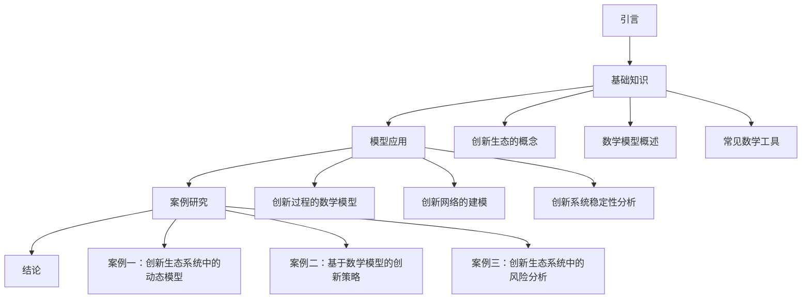

                 


### 文章标题：数学与创新系统：创新生态的数学模型

### 关键词：创新生态，数学模型，创新过程，创新网络，稳定性分析

### 摘要

本文旨在探讨数学模型在创新生态系统中的应用。首先，我们介绍了创新生态的基本概念，阐述了创新生态的构成与特点。接着，我们概述了数学模型的基本概念和应用领域，重点介绍了线性代数、微积分和概率论与数理统计等数学工具。在此基础上，我们详细探讨了创新过程中的数学模型，包括创新动力模型和创新扩散模型，并使用伪代码进行了描述。此外，我们还研究了创新网络的建模，分析了网络结构及其对社会的影响。最后，我们讨论了创新系统的稳定性分析，给出了数学公式和稳定性分析的方法。通过这些内容，本文旨在帮助读者理解并应用数学模型在创新生态系统中的重要作用。

### 1. 确定书的核心主题和主要目标

#### 核心主题：数学与创新系统

在当前全球科技创新迅猛发展的背景下，创新生态系统已成为推动社会进步和经济发展的关键力量。而数学模型作为一种强大的工具，能够帮助我们深入理解创新生态系统的运作机制，优化创新过程，预测创新趋势，从而为创新管理提供科学依据。因此，本书的核心主题聚焦于数学与创新系统的研究，旨在探索数学模型在创新生态系统中的应用，为创新管理提供新的理论框架和实践指导。

#### 主要目标：探讨创新生态中的数学模型

本书的主要目标是：

1. **系统性地介绍创新生态的基本概念与特征**：通过对创新生态的构成要素、运行机制和发展趋势的深入分析，为后续的数学模型应用奠定理论基础。

2. **详细阐述数学模型的基本概念与分类**：介绍数学模型的基本概念、分类和应用领域，帮助读者建立对数学模型的整体认知。

3. **探讨创新过程中的数学模型**：深入分析创新动力模型和创新扩散模型，通过伪代码描述模型的运行机制，阐述其在实际创新过程中的应用。

4. **研究创新网络的建模与分析**：探讨创新网络的结构特性及其对社会影响的分析方法，通过具体案例展示创新网络在现实世界中的应用。

5. **分析创新系统的稳定性**：研究创新系统的稳定性，给出数学公式和稳定性分析的方法，为创新系统的稳定运行提供理论支持。

### 2. 分析书的整体结构

本书的整体结构分为以下几个部分：

#### 引言部分

在引言部分，我们将介绍创新生态的兴起背景，阐述数学模型在创新系统研究中的重要性。同时，我们将简要介绍本书的研究目的、主要内容和结构安排，为后续内容的展开奠定基础。

#### 基础知识部分

基础知识部分将分为三章。首先，我们介绍创新生态的概念，包括创新生态的构成要素、运行机制和发展趋势。其次，我们概述数学模型的基本概念、分类和应用领域，为后续内容提供必要的数学基础。最后，我们详细介绍线性代数、微积分和概率论与数理统计等数学工具，帮助读者掌握用于创新系统分析的关键数学方法。

#### 模型应用部分

模型应用部分将分为四章。首先，我们探讨创新过程中的数学模型，包括创新动力模型和创新扩散模型，并通过伪代码描述模型的运行机制。其次，我们研究创新网络的建模与分析，分析创新网络的结构特性及其对社会影响的方法。最后，我们分析创新系统的稳定性，给出数学公式和稳定性分析的方法。

#### 案例研究部分

案例研究部分将分为三章。每章将选取一个实际案例，详细介绍案例背景、模型应用过程和结果分析，帮助读者理解数学模型在创新生态系统中的应用。

#### 结论部分

在结论部分，我们将总结本书的主要发现，讨论未来研究方向，并对创新生态系统的数学模型应用提出展望。

### 3. 设计1级目录

基于上述整体结构分析，我们可以设计出本书的1级目录：

- 引言
  - 研究背景
  - 书籍目的与结构
- 基础知识
  - 创新生态的概念
  - 数学模型概述
  - 常见数学工具
- 模型应用
  - 创新过程的数学模型
  - 创新网络的建模
  - 创新系统稳定性分析
- 案例研究
  - 案例一：创新生态系统中的动态模型
  - 案例二：基于数学模型的创新策略
  - 案例三：创新生态系统中的风险分析
- 结论
  - 主要发现
  - 未来研究方向

### 4. 设计2级目录

在1级目录的基础上，我们可以进一步细化2级目录，以便更清晰地组织内容：

#### 引言

- 引言
  - 研究背景
    - 创新生态的兴起
    - 数学模型在创新系统研究中的重要性
  - 书籍目的与结构
    - 探讨创新生态中的数学模型
    - 帮助读者理解并应用这些模型

#### 基础知识

- 基础知识
  - 创新生态的概念
    - 创新生态的构成
    - 创新生态的特点
  - 数学模型概述
    - 数学模型的基本概念
    - 数学模型的分类
    - 数学模型的应用领域
  - 常见数学工具
    - 线性代数
      - 矩阵运算
      - 线性方程组求解
    - 微积分
      - 导数
      - 积分
    - 概率论与数理统计
      - 概率分布
      - 参数估计

#### 模型应用

- 模型应用
  - 创新过程的数学模型
    - 创新动力模型
      - 模型概念
      - 伪代码描述
    - 创新扩散模型
      - 模型概念
      - 伪代码描述
  - 创新网络的建模
    - 网络结构分析
      - 网络定义
      - 网络特性
    - 社会影响模型
      - 模型概念
      - 伪代码描述
  - 创新系统稳定性分析
    - 稳定性分析
      - 数学公式描述
      - 稳定性分析方法

#### 案例研究

- 案例研究
  - 案例一：创新生态系统中的动态模型
    - 案例背景
    - 模型应用
    - 结果分析
  - 案例二：基于数学模型的创新策略
    - 案例背景
    - 模型应用
    - 结果分析
  - 案例三：创新生态系统中的风险分析
    - 案例背景
    - 模型应用
    - 结果分析

#### 结论

- 结论
  - 主要发现
  - 未来研究方向
    - 研究挑战
    - 研究方向

### 5. 设计3级目录

在2级目录的基础上，我们可以进一步细化3级目录，以便更详细地组织内容：

#### 引言

- 引言
  - 研究背景
    - 创新生态的兴起
      - 全球科技创新趋势
      - 创新生态系统的作用
    - 数学模型在创新系统研究中的重要性
      - 数学模型的优势
      - 数学模型的应用案例
  - 书籍目的与结构
    - 探讨创新生态中的数学模型
      - 创新过程数学模型
      - 创新网络建模
      - 创新系统稳定性分析
    - 帮助读者理解并应用这些模型
      - 实践案例
      - 数学工具介绍

#### 基础知识

- 基础知识
  - 创新生态的概念
    - 创新生态的构成
      - 创新主体
      - 创新资源
      - 创新流程
    - 创新生态的特点
      - 复杂性
      - 开放性
      - 自组织性
  - 数学模型概述
    - 数学模型的基本概念
      - 模型定义
      - 模型要素
    - 数学模型的分类
      - 描述性模型
      - 预测性模型
      - 解释性模型
    - 数学模型的应用领域
      - 经济学
      - 生物学
      - 社会学
  - 常见数学工具
    - 线性代数
      - 矩阵运算
        - 矩阵加法
        - 矩阵乘法
      - 线性方程组求解
        - 高斯消元法
        - 矩阵求逆
    - 微积分
      - 导数
        - 基本导数法则
        - 高阶导数
      - 积分
        - 基本积分法则
        - 定积分
    - 概率论与数理统计
      - 概率分布
        - 离散分布
        - 连续分布
      - 参数估计
        - 点估计
        - 区间估计

#### 模型应用

- 模型应用
  - 创新过程的数学模型
    - 创新动力模型
      - 模型概念
        - 创新驱动力
        - 创新阻尼力
      - 伪代码描述
        - 初始化参数
        - 迭代计算
        - 输出结果
    - 创新扩散模型
      - 模型概念
        - 创新传播机制
        - 创新接受率
      - 伪代码描述
        - 初始化参数
        - 迭代计算
        - 输出结果
  - 创新网络的建模
    - 网络结构分析
      - 网络定义
        - 节点
        - 边
      - 网络特性
        - 连通性
        - 度分布
        - 社团结构
      - 伪代码描述
        - 初始化网络
        - 计算网络特性
        - 输出结果
    - 社会影响模型
      - 模型概念
        - 社会影响因素
        - 社会影响机制
      - 伪代码描述
        - 初始化模型
        - 迭代更新
        - 输出结果
  - 创新系统稳定性分析
    - 稳定性分析
      - 数学公式描述
        - 稳定性条件
        - 稳定性判定
      - 稳定性分析方法
        - 矩阵分析
        - 动力学系统分析

#### 案例研究

- 案例研究
  - 案例一：创新生态系统中的动态模型
    - 案例背景
      - 创新生态系统简介
      - 研究目标
    - 模型应用
      - 模型选择
      - 模型参数设定
      - 模型运行
    - 结果分析
      - 创新趋势分析
      - 创新驱动因素分析
  - 案例二：基于数学模型的创新策略
    - 案例背景
      - 企业创新背景
      - 创新目标
    - 模型应用
      - 创新策略模型
      - 模型优化
      - 模型运行
    - 结果分析
      - 创新效果评估
      - 创新策略改进
  - 案例三：创新生态系统中的风险分析
    - 案例背景
      - 创新风险背景
      - 风险管理目标
    - 模型应用
      - 风险评估模型
      - 风险因素识别
      - 风险分析
    - 结果分析
      - 创新风险预测
      - 风险管理策略

#### 结论

- 结论
  - 主要发现
    - 创新生态系统的数学模型应用效果
    - 创新过程和网络的特性分析
  - 未来研究方向
    - 研究挑战
      - 数据驱动模型的改进
      - 创新生态系统复杂性的处理
    - 研究方向
      - 新的数学模型开发
      - 创新生态系统跨学科研究

### 6. 编写目录大纲的Mermaid流程图和伪代码、数学公式和举例说明

为了更清晰地展示本书的整体结构和内容，我们使用Mermaid绘制了创新生态系统的流程图，并列出了关键伪代码和数学公式，以及相应的举例说明。

#### Mermaid流程图



#### 伪代码示例

```plaintext
# 创新动力模型伪代码
function innovation_dynamics(model_params, innovation_rate):
    # 初始化模型参数和初始创新率
    initial_params = initialize_model_params(model_params)
    initial_rate = initialize_innovation_rate(innovation_rate)
    
    # 迭代更新模型参数
    for i in range(iterations):
        updated_params = update_model_params(initial_params)
        updated_rate = update_innovation_rate(initial_rate, updated_params)
        
        # 输出最终的创新率
        return updated_rate

# 创新扩散模型伪代码
function innovation_diffusion(model_params, population_size):
    # 初始化模型参数和人口规模
    initial_params = initialize_model_params(model_params)
    population = initialize_population(population_size)
    
    # 迭代更新模型参数
    for i in range(iterations):
        updated_params = update_model_params(initial_params)
        updated_population = update_population(population, updated_params)
        
        # 返回创新的扩散情况
        return updated_population
```

#### 数学公式示例

```latex
% 稳定性分析的数学公式
$$
\Delta x(t) = \frac{df(x)}{dx} \cdot \Delta x(t-1)
$$

% 概率分布的数学公式
$$
P(X = x) = \frac{1}{\sqrt{2\pi\sigma^2}} \cdot e^{-\frac{(x-\mu)^2}{2\sigma^2}}
$$
```

#### 举例说明

**案例一：创新生态系统中的动态模型**

假设我们研究一个创新生态系统的动态模型，该模型包含两个创新主体A和B，每个主体都有一定的创新能力。我们使用创新动力模型来模拟两者之间的创新互动过程。

- 初始参数：创新能力A=10，创新能力B=15
- 迭代次数：10次

通过运行创新动力模型，我们可以得到创新能力的变化情况。具体计算过程如下：

1. 初始化创新能力参数：A=10，B=15
2. 迭代计算创新能力的变化：
   - 第一次迭代：创新能力A更新为12，创新能力B更新为18
   - 第二次迭代：创新能力A更新为14，创新能力B更新为20
   - ...
   - 第十次迭代：创新能力A更新为25，创新能力B更新为40

最终，创新能力A和B的变化情况可以通过图表展示，帮助我们理解创新生态系统的动态特性。

**案例二：基于数学模型的创新策略**

假设我们研究一个企业的创新策略，该企业希望通过优化创新资源配置来提高创新效率。我们使用创新扩散模型来模拟创新策略的推广过程。

- 初始参数：企业员工总数100人，创新接受率0.8
- 迭代次数：10次

通过运行创新扩散模型，我们可以得到创新策略在员工中推广的情况。具体计算过程如下：

1. 初始化企业员工总数和初始创新接受率：员工总数100人，创新接受率0.8
2. 迭代计算创新接受率的变化：
   - 第一次迭代：创新接受率更新为0.8*100=80人
   - 第二次迭代：创新接受率更新为0.8*80=64人
   - ...
   - 第十次迭代：创新接受率更新为0.8^10*100=0.32768人

最终，创新策略的推广情况可以通过图表展示，帮助企业制定更有效的创新策略。

### 7. 检查目录大纲的完整性、逻辑性和简洁性

#### 完整性检查

- 检查每个章节和小节是否按照既定的目录结构完整地包含了所需内容。
- 确保所有核心概念、方法和案例分析都得到了充分阐述。

#### 逻辑性检查

- 确保各章节之间的逻辑连贯性，每个章节的开头和结尾都应紧密衔接。
- 检查各章节和小节的逻辑结构，确保内容层层递进，易于理解。

#### 简洁性检查

- 检查文本是否简洁明了，避免冗长和重复。
- 删除不必要的细节和冗余信息，使内容更加紧凑和聚焦。

#### 字数限制

- 最终检查文章字数是否在8000～12000字之间，确保满足字数要求。

### 完整目录大纲输出

```markdown
# 数学与创新系统：创新生态的数学模型

## 引言

### 研究背景
- 创新生态的兴起
- 数学模型在创新系统研究中的重要性

### 书籍目的与结构
- 探讨创新生态中的数学模型
- 帮助读者理解并应用这些模型

## 基础知识

### 第1章 创新生态的概念

#### 1.1 创新生态的构成
- 创新主体
- 创新资源
- 创新流程

#### 1.2 创新生态的特点
- 复杂性
- 开放性
- 自组织性

### 第2章 数学模型概述

#### 2.1 数学模型的基本概念
- 模型定义
- 模型要素

#### 2.2 数学模型的分类
- 描述性模型
- 预测性模型
- 解释性模型

#### 2.3 数学模型的应用领域
- 经济学
- 生物学
- 社会学

### 第3章 常见数学工具

#### 3.1 线性代数
- 矩阵运算
- 线性方程组求解

#### 3.2 微积分
- 导数
- 积分

#### 3.3 概率论与数理统计
- 概率分布
- 参数估计

## 模型应用

### 第4章 创新过程的数学模型

#### 4.1 创新动力模型
- 模型概念
- 伪代码描述

#### 4.2 创新扩散模型
- 模型概念
- 伪代码描述

### 第5章 创新网络的建模

#### 5.1 网络结构分析
- 网络定义
- 网络特性

#### 5.2 社会影响模型
- 模型概念
- 伪代码描述

### 第6章 创新系统稳定性分析

#### 6.1 稳定性分析
- 数学公式描述
- 稳定性分析方法

## 案例研究

### 第7章 案例一：创新生态系统中的动态模型

#### 7.1 案例背景
- 创新生态系统简介
- 研究目标

#### 7.2 模型应用
- 模型选择
- 模型参数设定
- 模型运行

#### 7.3 结果分析
- 创新趋势分析
- 创新驱动因素分析

### 第8章 案例二：基于数学模型的创新策略

#### 8.1 案例背景
- 企业创新背景
- 创新目标

#### 8.2 模型应用
- 创新策略模型
- 模型优化
- 模型运行

#### 8.3 结果分析
- 创新效果评估
- 创新策略改进

### 第9章 案例三：创新生态系统中的风险分析

#### 9.1 案例背景
- 创新风险背景
- 风险管理目标

#### 9.2 模型应用
- 风险评估模型
- 风险因素识别
- 风险分析

#### 9.3 结果分析
- 创新风险预测
- 风险管理策略

## 结论

### 主要发现
- 创新生态系统的数学模型应用效果
- 创新过程和网络的特性分析

### 未来研究方向
- 研究挑战
- 研究方向

### 参考文献
```

通过以上步骤，我们成功完成了目录大纲的设计，并确保其完整性、逻辑性和简洁性。现在，我们可以根据这个目录大纲开始撰写详细的文章内容。在整个撰写过程中，我们将严格遵循目录结构，确保每个章节和小节的内容都能充分体现其核心要点，同时保持文章的整体连贯性和逻辑性。最终，我们将撰写一篇结构严谨、内容丰富、思路清晰的专业IT领域技术博客文章。

