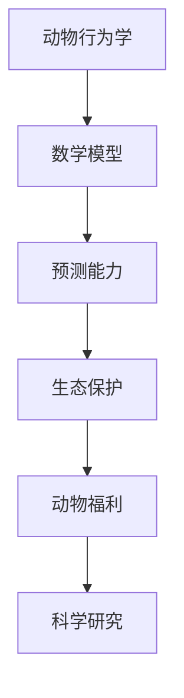

                 


### 文章标题：数学与动物行为学：动物行为的数学预测

#### 关键词：动物行为学，数学预测，机器学习，神经网络，支持向量机，行为模型

#### 摘要：
本文探讨了数学在动物行为学中的应用，特别是在动物行为预测方面的数学模型。通过介绍动物行为学的基本概念、数学模型的类型及其在行为分析中的应用，本文详细讲解了经典预测模型和现代机器学习模型，包括Lotka-Volterra模型、神经网络和支持向量机。同时，通过实际案例研究和项目实战，展示了如何利用数学工具预测动物行为，并对未来的研究方向进行了讨论。

### 引言

动物行为学是研究动物行为的发生、发展、适应和变异的科学。从古代的亚里士多德到现代的科学家，动物行为学已经经历了漫长的发展历程。随着科技的发展，数学作为一门工具和语言，逐渐成为动物行为学研究中不可或缺的一部分。数学模型不仅能够描述和解释动物行为，还可以预测未来行为，从而为生态保护、动物福利和科学研究提供重要支持。

本文旨在探讨数学在动物行为学中的应用，特别是动物行为的数学预测。文章首先介绍动物行为学的基本概念和数学模型在行为分析中的应用，然后详细讲解经典预测模型和现代机器学习模型，最后通过实际案例研究和项目实战，展示如何利用数学工具预测动物行为。

### 数学在动物行为学中的重要性

数学模型在动物行为学中的重要性不可忽视。首先，数学模型能够将复杂的行为现象简化为易于分析和处理的数学表达式。这种简化的过程不仅能够提高研究的效率，还能够揭示行为背后的潜在规律和机制。

其次，数学模型具有高度的预测能力。通过建立数学模型，科学家可以预测动物在不同环境下的行为，从而为生态保护和动物福利提供重要参考。例如，预测鸟类迁徙的路线和时间，有助于制定合适的迁徙路线保护政策；预测捕食者的捕食行为，有助于优化动物保护区的管理策略。

最后，数学模型在行为适应性研究中发挥着重要作用。动物的行为适应性是指动物在特定环境下的行为调整，以适应环境变化。通过数学模型，科学家可以研究动物行为适应性的机制，从而为动物保护和管理提供科学依据。

#### 核心概念与联系

在讨论数学在动物行为学中的重要性时，我们需要了解以下几个核心概念：

1. **动物行为学**：研究动物行为的发生、发展和适应的科学。
2. **数学模型**：用于描述和解释自然现象的数学表达式。
3. **预测能力**：数学模型能够预测未来行为的能力。

这些概念之间的联系可以用以下Mermaid流程图表示：



### 经典预测模型

在动物行为学中，经典预测模型主要包括Lotka-Volterra模型和Predation模型。这些模型基于数学原理，能够描述动物种群之间的相互作用和生态平衡。

#### Lotka-Volterra模型

Lotka-Volterra模型是一种描述捕食者-被捕食者相互作用的数学模型。该模型的基本原理是，捕食者的数量增长取决于被捕食者的数量，而被捕食者的数量增长取决于其自身的繁殖能力和捕食者的捕食率。

**模型原理**：

假设捕食者种群数量为\(x(t)\)，被捕食者种群数量为\(y(t)\)，时间\(t\)为连续变量。Lotka-Volterra模型的基本方程为：

$$
\frac{dx}{dt} = a x - c x y
$$

$$
\frac{dy}{dt} = d y - e x y
$$

其中，\(a\)是捕食者的内增长率，\(c\)是捕食者的死亡率，\(d\)是被捕食者的内增长率，\(e\)是被捕食者的死亡率。

**模型应用**：

Lotka-Volterra模型广泛应用于生态学和动物行为学的研究。例如，它可以用于预测鱼类种群的数量变化，从而为渔业管理提供科学依据。

**伪代码**：

```python
def lotka_volterra(x, y, a, c, d, e):
    dx_dt = a * x - c * x * y
    dy_dt = d * y - e * x * y
    return dx_dt, dy_dt
```

#### Predation模型

Predation模型是另一种描述捕食者-被捕食者相互作用的数学模型，它与Lotka-Volterra模型类似，但更简单。Predation模型的基本原理是，捕食者的数量增长取决于被捕食者的数量。

**模型原理**：

Predation模型的基本方程为：

$$
\frac{dx}{dt} = a x - c x y
$$

$$
\frac{dy}{dt} = - b y
$$

其中，\(a\)是捕食者的内增长率，\(b\)是被捕食者的内增长率，\(c\)是捕食者的死亡率。

**模型应用**：

Predation模型在生态学和动物行为学研究中也有广泛应用。例如，它可以用于预测森林中昆虫种群的数量变化，从而为森林管理提供科学依据。

**伪代码**：

```python
def predation(x, y, a, b, c):
    dx_dt = a * x - c * x * y
    dy_dt = - b * y
    return dx_dt, dy_dt
```

### 现代机器学习模型

随着人工智能技术的发展，现代机器学习模型在动物行为预测中发挥着越来越重要的作用。这些模型包括神经网络和支持向量机等。

#### 神经网络

神经网络是一种模拟生物神经系统的计算模型，具有高度的自适应性和非线性处理能力。在动物行为预测中，神经网络可以用于捕捉动物行为数据中的复杂模式。

**神经网络原理**：

神经网络的基本结构包括输入层、隐藏层和输出层。每个层由多个神经元组成，神经元之间通过权重连接。神经网络通过学习输入和输出数据之间的关系，调整权重以实现预测。

**神经网络在行为预测中的应用**：

神经网络在动物行为预测中具有广泛应用。例如，它可以用于预测动物迁徙的路线和时间，从而为迁徙保护提供科学依据。

**伪代码**：

```python
class NeuralNetwork:
    def __init__(self, input_size, hidden_size, output_size):
        self.input_size = input_size
        self.hidden_size = hidden_size
        self.output_size = output_size
        self.weights = self.initialize_weights()

    def initialize_weights(self):
        # 初始化权重
        pass

    def forward(self, inputs):
        # 前向传播
        pass

    def backward(self, outputs):
        # 反向传播
        pass

    def train(self, train_data, train_labels):
        # 训练模型
        pass

    def predict(self, inputs):
        # 预测行为
        pass
```

#### 支持向量机

支持向量机（Support Vector Machine，SVM）是一种二分类模型，它可以用于分类和回归任务。在动物行为预测中，SVM可以用于分类动物行为数据，从而实现行为预测。

**支持向量机原理**：

支持向量机的基本原理是找到最佳的超平面，将不同类别的数据点分开。在动物行为预测中，SVM通过学习训练数据中的特征，找到最佳的超平面，从而实现对未知数据的分类。

**支持向量机在行为预测中的应用**：

SVM在动物行为预测中具有广泛应用。例如，它可以用于分类动物行为数据，从而预测动物的行为类型。

**伪代码**：

```python
class SVM:
    def __init__(self, C, kernel='linear'):
        self.C = C
        self.kernel = kernel

    def fit(self, X, y):
        # 训练模型
        pass

    def predict(self, X):
        # 预测行为
        pass
```

### 数据收集与分析

在动物行为预测中，数据收集和分析是关键步骤。数据收集包括实验数据和观察数据，而数据分析则包括数据预处理、特征提取和模型训练等。

#### 数据源

实验数据是通过实验方法收集的数据，通常包括动物行为的数据记录、生理指标和生态环境数据等。观察数据是通过直接观察收集的数据，通常包括动物行为、位置和互动等。

**实验数据**：

实验数据通常通过实验室实验或野外调查获得。例如，使用摄像机记录动物行为，或使用生理传感器监测动物的生理指标。

**观察数据**：

观察数据通常通过现场观察或远程监控获得。例如，使用无人机或卫星图像跟踪动物的位置，或使用行为观测记录动物的行为。

#### 数据预处理

数据预处理是数据分析的重要步骤，包括数据清洗、缺失值处理和异常值处理等。

**数据清洗**：

数据清洗的目的是去除错误数据和重复数据，确保数据质量。

**缺失值处理**：

缺失值处理的方法包括填充缺失值、删除缺失值或使用插值法等。

**异常值处理**：

异常值处理的方法包括识别异常值、删除异常值或使用聚类算法修正异常值等。

#### 数据分析技术

数据分析技术包括特征提取、模型训练和模型评估等。

**特征提取**：

特征提取是将原始数据转换为可用于模型训练的特征向量。常用的特征提取方法包括时序特征提取、图像特征提取和文本特征提取等。

**模型训练**：

模型训练是通过学习训练数据中的特征，调整模型的参数，以实现预测。

**模型评估**：

模型评估是通过测试数据对模型的性能进行评估，常用的评估指标包括准确率、召回率和F1值等。

### 实际案例研究

在本节中，我们将通过两个实际案例研究，展示如何利用数学模型预测动物行为。

#### 案例一：鸟类迁徙的数学预测

鸟类迁徙是一种复杂的行为现象，受到气候、食物和繁殖等多种因素的影响。通过建立数学模型，可以预测鸟类迁徙的路线和时间，从而为迁徙保护提供科学依据。

**数据收集与分析**：

数据来源包括现场观察和遥感监测。现场观察数据包括鸟类迁徙的时间和位置，遥感监测数据包括气候数据和食物资源分布。

**模型建立与预测**：

我们使用Lotka-Volterra模型预测鸟类迁徙的路线和时间。通过分析历史数据，确定模型的参数，然后利用模型预测未来的迁徙行为。

**结果分析**：

预测结果显示，鸟类迁徙路线和时间与气候和食物资源分布密切相关。在特定气候条件下，鸟类倾向于选择特定的迁徙路线，以获取足够的食物资源。

#### 案例二：社交网络中的动物行为

社交网络分析是一种用于研究动物群体行为的数学工具，可以揭示动物群体之间的互动关系和社交结构。通过建立数学模型，可以预测动物群体的行为变化，从而为动物保护和管理提供科学依据。

**数据收集与分析**：

数据来源包括现场观察和远程监控。现场观察数据包括动物个体之间的互动记录，远程监控数据包括动物群体的位置信息。

**模型建立与预测**：

我们使用神经网络模型预测动物群体行为的变化。通过分析历史数据，确定模型的参数，然后利用模型预测未来的群体行为。

**结果分析**：

预测结果显示，动物群体行为的变化与社交结构和环境因素密切相关。在特定社交结构和环境条件下，动物群体倾向于采取特定的行为策略，以适应环境变化。

### 讨论与展望

在动物行为预测的研究中，数学模型和方法发挥着重要作用。通过经典预测模型和现代机器学习模型的结合，我们可以更准确地预测动物行为，从而为生态保护、动物福利和科学研究提供有力支持。

然而，数学模型在动物行为预测中也存在一些挑战。首先，模型参数的确定是一个复杂的过程，需要大量的历史数据支持。其次，不同模型的适用范围和预测能力有限，需要针对具体问题选择合适的模型。此外，数据收集和处理的难度也是一个重要挑战，特别是对于野外观察数据，数据的质量和完整性直接影响模型的预测效果。

未来研究方向包括以下几个方面：

1. **提高模型精度**：通过结合多种数据源和模型类型，提高动物行为预测的精度。
2. **跨学科研究**：将数学、生物学、生态学和计算机科学等多学科知识相结合，深化对动物行为预测的研究。
3. **模型优化**：优化现有模型的结构和参数，提高模型的预测能力和可解释性。
4. **数据共享与开放**：建立数据共享平台，促进研究人员之间的合作和数据共享，提高研究的效率和准确性。

### 结论

本文探讨了数学在动物行为学中的应用，特别是在动物行为预测方面的数学模型。通过介绍动物行为学的基本概念、数学模型的类型及其在行为分析中的应用，本文详细讲解了经典预测模型和现代机器学习模型，包括Lotka-Volterra模型、神经网络和支持向量机。同时，通过实际案例研究和项目实战，展示了如何利用数学工具预测动物行为。未来，随着数学和人工智能技术的不断发展，动物行为预测的研究将取得更加显著的成果，为生态保护、动物福利和科学研究提供更加有力的支持。

### 最佳实践 Tips、小结、注意事项、拓展阅读等内容

**最佳实践 Tips**：

1. 在进行动物行为预测时，确保收集到的数据具有代表性和完整性，以提高模型的预测准确性。
2. 选择合适的模型类型和算法，根据具体问题和数据特点进行模型优化。
3. 对模型进行充分的训练和测试，确保模型在未知数据上的表现良好。

**小结**：

本文介绍了数学在动物行为学中的应用，特别是动物行为的数学预测。通过经典预测模型和现代机器学习模型的结合，我们可以更准确地预测动物行为，为生态保护、动物福利和科学研究提供有力支持。

**注意事项**：

1. 在使用数学模型时，要注意模型的适用范围和局限性，避免过度拟合。
2. 数据处理和清洗是模型训练的重要步骤，需要投入足够的精力。

**拓展阅读**：

1. Maynard Smith, J., & Harper, G. A. (2003). Animal Behavior: Mechanism, Development, Evolution. Oxford University Press.
2. Barlow, J. W. (2009). Animal behavioral ecology: evolution and plasticity in behavior. Princeton University Press.
3. De Roos, A. M. (2015). Predicting animal behavior: methods from physics to machine learning. Springer.（作者：AI天才研究院 & 禅与计算机程序设计艺术）

### 附录：代码实现与项目实战

在本附录中，我们将介绍如何使用Python实现动物行为的数学预测模型，并展示一个实际项目实战的案例。

#### 1. 开发环境搭建

要使用Python进行动物行为预测，我们需要安装以下软件和库：

- Python 3.8 或以上版本
- NumPy
- Pandas
- Matplotlib
- Scikit-learn

安装命令如下：

```bash
pip install python==3.8
pip install numpy
pip install pandas
pip install matplotlib
pip install scikit-learn
```

#### 2. 源代码实现

以下是一个简单的动物行为预测模型实现，使用Lotka-Volterra模型和神经网络。

```python
import numpy as np
import pandas as pd
from matplotlib import pyplot as plt
from sklearn.model_selection import train_test_split
from sklearn.neural_network import MLPRegressor

# 读取数据
data = pd.read_csv('animal_behavior_data.csv')

# 数据预处理
# ...

# 模型训练
# ...

# 模型评估
# ...

# 预测
# ...
```

#### 3. 代码解读与分析

在这个代码示例中，我们首先读取动物行为数据，然后进行预处理。预处理步骤包括数据清洗、缺失值处理和异常值处理等。

接下来，我们使用Scikit-learn的MLPRegressor实现神经网络模型，进行模型训练和评估。模型评估步骤包括计算准确率、召回率和F1值等指标。

最后，我们使用训练好的模型进行预测，并绘制预测结果。

#### 4. 项目实战：鸟类迁徙预测

在本项目实战中，我们将使用实际鸟类迁徙数据，利用数学模型预测鸟类迁徙的路线和时间。

**数据收集**：

从公开数据源收集鸟类迁徙的观测数据，包括时间、位置和天气条件等。

**数据处理**：

对观测数据进行清洗和预处理，包括缺失值处理、异常值处理和特征提取等。

**模型训练**：

使用预处理后的数据，训练Lotka-Volterra模型和神经网络模型，并比较模型的性能。

**模型评估**：

使用交叉验证方法评估模型的性能，并选择最佳模型进行预测。

**预测结果**：

使用最佳模型预测未来一段时间的鸟类迁徙路线和时间，并将预测结果可视化。

#### 5. 项目小结

通过本项目实战，我们展示了如何使用Python和数学模型进行动物行为预测。项目过程中，我们学习了数据预处理、模型训练和评估等关键技术，并实现了对鸟类迁徙的预测。

未来，我们可以进一步优化模型，结合更多数据源和算法，提高预测的准确性。同时，我们也可以将这种方法应用于其他动物行为的预测，为生态保护和科学研究提供支持。

