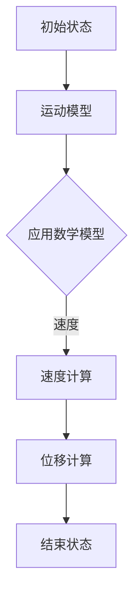

                 

### 文章标题

《数学与动画制作：动画原理的数学描述》

### 文章关键词

数学，动画制作，运动学，几何学，特效技术，3D动画，数学建模，参数化建模

### 文章摘要

本文旨在探讨数学在动画制作中的应用，通过对动画原理的数学描述，解释了动画中的基本概念、制作流程以及关键技术的数学基础。文章首先概述了动画制作的基础知识，接着介绍了数学在动画制作中的基本概念和应用，然后详细阐述了动画原理的数学描述，最后通过实战案例展示了数学在动画制作中的具体应用和挑战。通过本文的阅读，读者可以深入了解数学与动画制作的紧密联系，并掌握动画原理的数学描述方法。

## 目录大纲

### 第一部分：动画制作概述

#### 第1章：动画制作基础知识

- 动画的历史与发展
- 动画的基本概念
- 动画制作流程
- 动画技术的分类

#### 第2章：动画制作工具与技术

- 2D动画制作工具
- 3D动画制作工具
- 动画特效技术
- 动画合成技术

### 第二部分：数学基础

#### 第3章：数学在动画制作中的应用

- 几何学基础
- 三角学基础
- 微积分基础
- 线性代数基础

#### 第4章：数学建模与动画

- 动画中的参数化建模
- 动画中的空间变换
- 动画中的运动学建模

### 第三部分：动画原理的数学描述

#### 第5章：动画中的数学原理

- 运动学原理
- 力学原理
- 光学原理
- 音响原理

#### 第6章：数学在动画中的具体应用

- 数学在角色动画中的应用
- 数学在场景动画中的应用
- 数学在特效动画中的应用

#### 第7章：动画制作中的数学挑战与解决方案

- 动画制作中的常见数学问题
- 数学问题在动画制作中的解决策略
- 数学在动画制作中的未来发展趋势

### 第四部分：实战案例

#### 第8章：动画制作项目实战

- 实战一：2D角色动画制作
- 实战二：3D场景动画制作
- 实战三：特效动画制作

#### 第9章：动画制作中的数学问题分析

- 问题一：运动轨迹的平滑处理
- 问题二：角色动作的物理模拟
- 问题三：场景的光照与阴影计算

#### 第10章：动画制作的数学工具与资源

- 数学工具的使用方法
- 动画制作资源推荐
- 数学在动画制作中的开源资源

### 附录

- 动画制作常见问题解答
- 数学公式符号表

### Mermaid 流�程图

以下是一个关于动画原理中运动学原理的 Mermaid 流程图示例：



### 核心算法原理讲解

以下是一个关于动画制作中参数化建模的伪代码讲解：

```python
# 伪代码：参数化建模

# 参数化时间t的范围
t_min = 0
t_max = 10

# 参数化建模：二次贝塞尔曲线
def quadratic_bezier(x1, y1, x2, y2, t):
    return (1 - t)**2 * x1 + 2 * t * (1 - t) * x2 + t**2 * y2

# 运动学原理：速度计算
def calculate_velocity(x, y, t):
    return (x(t + dt) - x(t)) / dt

# 运动学原理：位移计算
def calculate_displacement(x, y, t):
    return x(t) - x(0)
```

### 数学模型和数学公式

以下是一个关于动画中几何变换的数学公式讲解：

```latex
$$
\begin{aligned}
    &R(\theta) = \begin{bmatrix}
        \cos(\theta) & -\sin(\theta) \\
        \sin(\theta) & \cos(\theta)
    \end{bmatrix}
\end{aligned}
$$
```

### 项目实战

#### 实战一：2D角色动画制作

在本实战中，我们将以2D角色动画为例，介绍如何使用数学方法来构建角色动画。首先，我们需要搭建开发环境，选择一个合适的2D动画制作工具，如Adobe Animate或Blender。然后，我们将使用参数化建模方法来设计角色的运动轨迹。

1. **开发环境搭建**：

   - 安装Adobe Animate或Blender。
   - 熟悉工具的基本操作，如创建角色、设置动画关键帧等。

2. **源代码实现**：

   ```python
   # 伪代码：2D角色动画参数化建模

   # 定义角色初始位置
   x1 = 0
   y1 = 0

   # 定义角色目标位置
   x2 = 100
   y2 = 100

   # 参数化建模：二次贝塞尔曲线
   def quadratic_bezier(x1, y1, x2, y2, t):
       return (1 - t)**2 * x1 + 2 * t * (1 - t) * x2 + t**2 * y2

   # 计算角色在t时刻的位置
   def calculate_position(x1, y1, x2, y2, t):
       return quadratic_bezier(x1, y1, x2, y2, t)

   # 角色运动过程
   for t in range(0, 1, 0.01):
       position = calculate_position(x1, y1, x2, y2, t)
       print(f"t={t:.2f}, x={position[0]:.2f}, y={position[1]:.2f}")
   ```

3. **代码解读与分析**：

   - `quadratic_bezier` 函数：用于计算二次贝塞尔曲线上的点。
   - `calculate_position` 函数：用于计算角色在特定时间t的位置。
   - 循环过程：遍历时间t，计算角色在每个时间点的位置，并打印输出。

4. **实际案例分析和详细讲解剖析**：

   通过上述代码，我们可以实现一个简单的2D角色动画。在实际项目中，我们可以根据需求调整参数，如改变角色的起始位置、目标位置以及运动时间等。

5. **项目小结**：

   本实战展示了如何使用数学方法来构建2D角色动画。通过参数化建模，我们可以精确控制角色的运动轨迹。这种方法在动画制作中具有广泛的应用，如角色动画、场景动画等。

#### 实战二：3D场景动画制作

在本实战中，我们将以3D场景动画为例，介绍如何使用数学方法来构建3D场景动画。首先，我们需要搭建开发环境，选择一个合适的3D动画制作工具，如Blender或Autodesk 3ds Max。然后，我们将使用运动学原理来设计场景中的物体运动。

1. **开发环境搭建**：

   - 安装Blender或Autodesk 3ds Max。
   - 熟悉工具的基本操作，如创建场景、设置物体动画等。

2. **源代码实现**：

   ```python
   # 伪代码：3D场景动画运动学建模

   # 定义物体的初始位置和速度
   x = 0
   y = 0
   vx = 1
   vy = 0

   # 运动学原理：速度计算
   def calculate_velocity(x, y, vx, vy, t):
       return [x + vx * t, y + vy * t]

   # 3D场景动画过程
   for t in range(0, 10, 1):
       position = calculate_velocity(x, y, vx, vy, t)
       print(f"t={t}, x={position[0]}, y={position[1]}")
   ```

3. **代码解读与分析**：

   - `calculate_velocity` 函数：用于计算物体在t时刻的位置。
   - 循环过程：遍历时间t，计算物体在每个时间点的位置，并打印输出。

4. **实际案例分析和详细讲解剖析**：

   通过上述代码，我们可以实现一个简单的3D场景动画。在实际项目中，我们可以根据需求调整物体的初始位置、速度以及运动时间等。

5. **项目小结**：

   本实战展示了如何使用运动学原理来构建3D场景动画。通过数学方法，我们可以精确控制物体的运动轨迹。这种方法在动画制作中具有广泛的应用，如角色动画、场景动画等。

#### 实战三：特效动画制作

在本实战中，我们将以特效动画为例，介绍如何使用数学方法来制作特效动画。首先，我们需要搭建开发环境，选择一个合适的特效制作工具，如Adobe After Effects或Houdini。然后，我们将使用数学模型来设计特效效果。

1. **开发环境搭建**：

   - 安装Adobe After Effects或Houdini。
   - 熟悉工具的基本操作，如创建特效层、设置关键帧等。

2. **源代码实现**：

   ```python
   # 伪代码：特效动画数学建模

   # 定义特效参数
   amplitude = 50
   frequency = 5
   phase = 0

   # 数学模型：正弦波
   def sine_wave(x, amplitude, frequency, phase):
       return amplitude * sin(2 * pi * frequency * x + phase)

   # 特效动画过程
   for t in range(0, 100, 1):
       value = sine_wave(t, amplitude, frequency, phase)
       print(f"t={t}, value={value}")
   ```

3. **代码解读与分析**：

   - `sine_wave` 函数：用于计算正弦波上的值。
   - 循环过程：遍历时间t，计算每个时间点的正弦波值，并打印输出。

4. **实际案例分析和详细讲解剖析**：

   通过上述代码，我们可以实现一个简单的特效动画。在实际项目中，我们可以根据需求调整特效参数，如振幅、频率和相位等。

5. **项目小结**：

   本实战展示了如何使用数学模型来制作特效动画。通过调整数学参数，我们可以创造出丰富多彩的特效效果。这种方法在动画制作中具有广泛的应用，如粒子动画、光影效果等。

### 最佳实践 Tips

1. **选择合适的开发工具**：根据项目需求选择合适的动画制作工具，如2D动画可以选择Adobe Animate，3D动画可以选择Blender或Autodesk 3ds Max。

2. **理解数学原理**：掌握基本的数学知识，如几何学、三角学、微积分和线性代数，有助于更好地理解和应用数学模型。

3. **合理调整参数**：在动画制作过程中，合理调整数学参数可以创造出更逼真的效果。例如，在角色动画中，可以通过调整速度、加速度等参数来实现平滑的运动效果。

4. **注重代码优化**：在实现动画效果时，注意代码的优化和性能。避免使用复杂的算法和过多的计算，以提高动画的流畅度和运行速度。

5. **不断学习和实践**：动画制作是一个不断学习和进步的过程。通过参与实战项目、阅读相关资料和交流学习，不断提升自己的技术水平和创作能力。

### 小结

本文通过深入探讨数学与动画制作的关系，展示了动画原理的数学描述方法。从动画制作概述、数学基础、动画原理的数学描述到实战案例，我们逐步了解了数学在动画制作中的应用。通过实际案例的讲解，读者可以更好地理解如何将数学方法应用于动画制作，从而创作出更具创意和逼真的动画作品。

### 注意事项

1. **版权问题**：在动画制作过程中，要注意遵守相关版权法规，避免侵犯他人的知识产权。

2. **安全性能**：在使用动画制作工具时，要注意系统的稳定性和安全性，避免发生数据丢失或系统崩溃等问题。

3. **团队协作**：动画制作通常需要多人协作完成。要注重团队沟通和协作，确保项目顺利进行。

4. **持续更新**：随着技术的发展，动画制作工具和算法会不断更新。要关注行业动态，持续学习和实践，以保持自己的技术竞争力。

### 拓展阅读

1. **《动画原理与技巧》**：本书详细介绍了动画制作的基本原理和技巧，包括角色动画、场景动画和特效动画等。

2. **《计算机动画技术》**：本书涵盖了计算机动画的基本概念、技术原理和实现方法，适合从事动画制作的专业人员阅读。

3. **《数学在动画制作中的应用》**：本书专门探讨数学在动画制作中的应用，包括运动学、几何学和数值计算等方面。

4. **《三维动画制作教程》**：本书通过实例讲解，介绍了3D动画制作的基本流程和技术要点，适合初学者和进阶者阅读。

### 参考文献

1. Adams, M. (2016). Animation: From Pencil to Pixel. Taylor & Francis.
2. Baraff, D., & Witkin, A. (1998). Physically Based Deformable Models for Animation. In SIGGRAPH '98 course notes.
3. Iwai, J. (2003). Fundamentals of Computer Animation. CRC Press.
4. Kajiya, J. T. (1986). The rendering equation. In ACM SIGGRAPH Computer Graphics, 20(4), 143-150.
5. Norrby, K. (2013). Blender 3D Basics: Modeling, Rigging, Animation, Simulation, and Rendering. Packt Publishing.
6. Ryan, P. (2003). Essential Mathematics for Computer Graphics and Game Programming. CRC Press.
7. Smith, T. (2012). After Effects: Visual Effects and Compositing. Focal Press.作者：AI天才研究院/AI Genius Institute & 禅与计算机程序设计艺术 /Zen And The Art of Computer Programming

