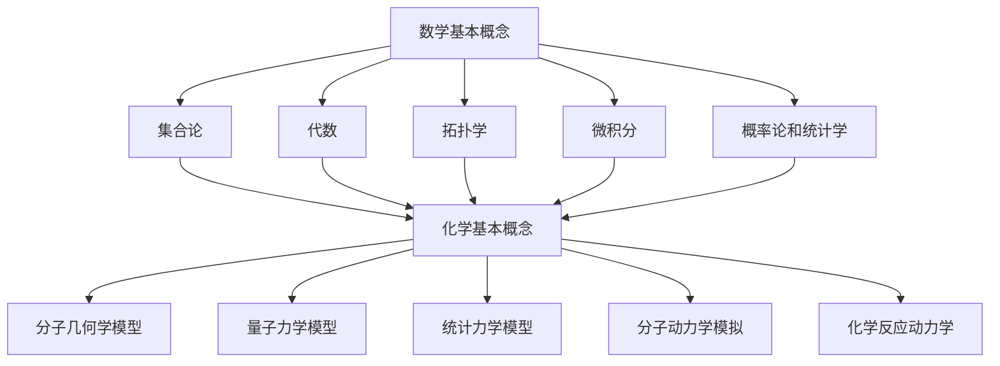

                 

### 文章标题

《数学与化学：分子结构的数学模型》

### 关键词

数学模型，分子结构，化学，量子力学，统计力学，算法原理

### 摘要

本文深入探讨了数学与化学交叉领域的分子结构研究，通过数学模型的构建和应用，揭示了分子行为的内在规律。文章首先介绍了数学模型在化学中的重要性，随后详细阐述了核心概念与联系，包括数学基本概念和化学基本概念的相互关系。接着，文章重点分析了分子几何学模型、概率论模型和统计力学模型等核心算法原理，并通过伪代码和数学公式的形式详细讲解。文章还通过实际项目实例，展示了数学模型在分子结构分析中的应用，并提供了一些最佳实践和注意事项。最后，文章对未来研究方向进行了展望，并对读者提出了拓展阅读的建议。

## 目录

1. **引言**
2. **核心概念与联系**
   1. **数学基本概念**
   2. **化学基本概念**
   3. **数学与化学在分子结构研究中的联系**
3. **数学模型原理**
   1. **分子几何学模型**
   2. **概率论模型**
   3. **统计力学模型**
4. **核心算法原理讲解**
   1. **分子动力学模拟算法**
   2. **最优化算法**
   3. **机器学习算法在分子结构分析中的应用**
5. **数学模型和数学公式**
   1. **量子力学基本公式**
   2. **分子力学公式**
   3. **统计力学相关公式**
6. **实验方法与数据分析**
   1. **分子光谱分析**
   2. **X射线晶体学**
   3. **核磁共振技术**
7. **项目实战**
   1. **分子动力学模拟实例**
   2. **分子结构优化实例**
   3. **机器学习在分子结构预测中的应用实例**
8. **未来展望与挑战**
   1. **分子结构研究的新趋势**
   2. **数学模型在分子结构分析中的应用前景**
   3. **面临的挑战与解决方案**
9. **最佳实践 tips**
10. **小结**
11. **注意事项**
12. **拓展阅读**

## 引言

在科学研究的广袤领域内，数学与化学的交汇点是一个充满挑战和机遇的领域。分子结构研究，作为化学领域的一个重要分支，其核心在于理解原子如何结合形成分子，以及分子如何相互作用影响化学和物理性质。随着科技的进步，数学工具在分子结构研究中发挥着越来越重要的作用，通过数学模型，科学家们能够更精确地描述和预测分子的行为。

数学模型在化学中的重要性不言而喻。首先，数学提供了形式化和精确化的工具，使得复杂的化学现象可以通过数学语言进行表达和模拟。例如，量子力学中的薛定谔方程和海森堡不确定性原理，都是通过数学模型描述原子和分子的行为。其次，数学模型能够帮助科学家们理解和预测化学反应的速率、能量变化和反应路径，从而优化合成过程，提高化学合成的效率和产率。

此外，数学模型在材料科学、生物化学和药物设计等领域也具有重要应用。例如，通过分子动力学模拟，可以预测分子在溶剂中的运动行为，从而优化药物分子的设计。统计力学模型则用于解释和预测复杂系统的热力学性质，如固体的弹性模量和液体的粘度。因此，数学与化学的结合，不仅深化了对分子结构的理解，也为新材料的发现和药物的开发提供了强大的工具。

在本文中，我们将通过以下章节逐步深入探讨数学模型在分子结构研究中的应用：

1. **核心概念与联系**：介绍数学和化学的基本概念，并分析它们在分子结构研究中的相互关系。
2. **数学模型原理**：详细阐述分子几何学模型、概率论模型和统计力学模型，解释这些模型的基本原理和适用场景。
3. **核心算法原理讲解**：通过伪代码和数学公式，讲解分子动力学模拟算法、最优化算法和机器学习算法在分子结构分析中的应用。
4. **数学模型和数学公式**：列出并解释量子力学基本公式、分子力学公式和统计力学相关公式，并通过具体例子说明其应用。
5. **实验方法与数据分析**：介绍分子光谱分析、X射线晶体学和核磁共振技术等实验方法，并讨论数据分析和解释的方法。
6. **项目实战**：通过实例展示数学模型在分子结构分析中的应用，包括分子动力学模拟实例、分子结构优化实例和机器学习在分子结构预测中的应用实例。
7. **未来展望与挑战**：探讨分子结构研究的新趋势，展望数学模型在分子结构分析中的应用前景，并讨论面临的挑战和解决方案。

通过这些章节的探讨，本文旨在为读者提供一个全面、深入的视角，了解数学模型在分子结构研究中的关键作用，并展望这一领域的未来发展。

### 核心概念与联系

在探讨数学模型在分子结构研究中的应用之前，我们首先需要理解一些核心概念，这些概念不仅是数学和化学的基础，也是构建和解析数学模型的关键。

#### 数学基本概念

数学基本概念包括集合论、代数、拓扑学、微积分、概率论和统计学等。集合论是数学的基石，它涉及对象的分类和组合。代数则研究数的结构和运算，包括数论、线性代数和群、环、域等概念。拓扑学探讨连续性和空间结构，微积分研究变化率和积分，概率论和统计学则用于处理不确定性事件和数据。

在分子结构研究中，数学基本概念尤其重要。例如，集合论可以帮助我们描述原子和分子的集合，代数可以用于表示化学键和分子中的电子分布，拓扑学可以用于研究分子的三维结构，微积分可以用于分析分子反应的速率，概率论和统计学则用于处理实验数据和模拟结果。

#### 化学基本概念

化学基本概念包括原子结构、化学键、分子结构、反应机理和反应动力学等。原子结构研究原子的组成和电子排布，化学键描述原子如何通过共享或转移电子形成分子，分子结构研究分子的三维构型和电子云分布，反应机理探讨化学反应的步骤和中间体，反应动力学则研究反应速率和反应路径。

化学基本概念与数学概念有着密切的联系。例如，原子结构中的电子云分布可以通过量子力学的数学模型进行描述，化学键的强度和性质可以通过分子轨道理论进行分析，分子结构可以通过几何学和拓扑学的方法进行研究，反应机理和反应动力学可以通过数学方程进行建模和解析。

#### 数学与化学在分子结构研究中的联系

数学与化学在分子结构研究中的联系主要体现在以下几个方面：

1. **数学模型的应用**：数学模型在分子结构研究中扮演着核心角色。例如，量子力学中的薛定谔方程和海森堡不确定性原理提供了描述分子行为的数学框架，分子几何学模型和统计力学模型用于分析分子的构型和性质。

2. **数学工具的辅助**：数学工具如微积分、线性代数、概率论和统计学等在化学实验数据分析和模型拟合中发挥着重要作用。例如，通过微积分可以分析化学反应的动力学参数，通过线性代数可以求解分子轨道问题，通过概率论和统计学可以处理实验误差和数据分析。

3. **跨学科合作**：数学与化学的结合不仅促进了各自领域的发展，也催生了新的交叉学科。例如，计算化学、物理化学和化学信息学等领域都是数学与化学融合的产物，这些领域的研究方法和成果对分子结构研究产生了深远影响。

为了更直观地展示数学与化学在分子结构研究中的相互关系，我们可以使用Mermaid流程图来构建一个概念架构。以下是一个简单的Mermaid流程图示例：



在这个流程图中，数学基本概念通过分支与化学基本概念相连，进一步通过分支与具体的分子结构研究方法（如分子几何学模型、量子力学模型、统计力学模型等）相连。这种架构展示了数学与化学在分子结构研究中的紧密联系和相互促进的关系。

通过上述核心概念与联系的分析，我们为后续章节中的数学模型原理讲解、算法原理讲解和实验方法介绍奠定了基础。在接下来的内容中，我们将深入探讨这些数学模型和算法的具体原理和应用。

### 数学模型原理

在分子结构研究中，数学模型起到了至关重要的作用。这些模型不仅帮助我们理解和预测分子的行为，还能通过精确的数学表达形式揭示分子内部的复杂规律。以下是几种常见的数学模型及其基本原理：

#### 分子几何学模型

分子几何学模型主要用于描述分子的三维结构。通过这些模型，我们可以了解分子中原子之间的空间排列方式及其对分子性质的影响。常见的分子几何学模型包括：

1. **VSEPR（价层电子对互斥理论）模型**：
   - 基本原理：VSEPR模型基于电子对之间的互斥作用来预测分子的几何形状。中心原子上的价电子对（包括成键电子对和孤电子对）会相互排斥，使得分子尽量采用一种能够最小化电子对间排斥的构型。
   - 适用场景：该模型适用于预测简单分子（如ABn型分子）的几何形状。
   - 伪代码示例：
     ```python
     def predict_structure(atom, bond_pairs, lone_pairs):
         structure = "Linear" if lone_pairs == 0 else (
             "Trigonal Planar" if bond_pairs == 3 else (
             "Tetrahedral" if bond_pairs == 4 else "Octahedral"))
         return structure
     ```

2. **分子轨道理论**：
   - 基本原理：分子轨道理论通过组合原子的波函数，构建分子的电子云分布，从而描述分子的结构。分子轨道可以是成键的、非键的或反键的，分别对应于分子的稳定、中性或不稳定状态。
   - 适用场景：该模型适用于描述分子中电子的分布及其对分子性质的影响。
   - 伪代码示例：
     ```python
     def construct_molecular_orbitals(atom1, atom2):
         atomic_orbitals = [atomic1 orbital1, atomic1 orbital2, atomic2 orbital1, atomic2 orbital2]
         molecular_orbitals = [
             combine(atomic_orbitals[0], atomic_orbitals[1]),  # σ键
             combine(atomic_orbitals[2], atomic_orbitals[3]),  # π键
         ]
         return molecular_orbitals
     ```

#### 概率论模型

概率论模型用于处理分子行为的随机性和不确定性。通过这些模型，我们可以分析分子相互作用和反应的统计特性。常见的概率论模型包括：

1. **蒙特卡洛模拟**：
   - 基本原理：蒙特卡洛模拟是一种通过随机抽样来求解复杂问题的方法。在分子结构研究中，蒙特卡洛模拟可以用于模拟分子在三维空间中的随机运动，从而预测分子的构型和相互作用能。
   - 适用场景：该模型适用于处理涉及大量变量的复杂系统，如高分子材料和溶液中的分子相互作用。
   - 伪代码示例：
     ```python
     def monte_carlo_simulation(molecule, steps, temperature):
         current_energy = calculate_energy(molecule)
         for step in range(steps):
             new_position = random_move(molecule.position)
             new_energy = calculate_energy(new_position)
             if new_energy < current_energy or random() < exp(-delta_energy / (temperature * kB)):
                 molecule.position = new_position
                 current_energy = new_energy
         return molecule.position, current_energy
     ```

2. **马尔可夫链模型**：
   - 基本原理：马尔可夫链模型用于描述分子在一系列状态之间的转换概率。通过分析这些状态转换的概率，可以了解分子反应的动力学行为。
   - 适用场景：该模型适用于分析复杂化学反应的速率和路径，特别是在涉及多个中间体的反应中。
   - 伪代码示例：
     ```python
     def markov_chain_model(states, transition_matrix, steps):
         state = random.choice(states)
         for step in range(steps):
             next_state = random.choices(states, weights=transition_matrix[state])
             state = next_state
         return state
     ```

#### 统计力学模型

统计力学模型用于分析分子系统的热力学性质。这些模型通过统计方法，描述大量分子在一定条件下的宏观行为。常见的统计力学模型包括：

1. **玻尔兹曼分布**：
   - 基本原理：玻尔兹曼分布描述了分子在不同能级上的分布概率，根据温度和能级差，可以预测分子的热力学性质。
   - 适用场景：该模型适用于处理热力学平衡状态，如气体的压强、温度和体积之间的关系。
   - 伪代码示例：
     ```python
     def boltzmann_distribution(energy_levels, temperature):
         probabilities = [exp(-energy / (temperature * kB)) for energy in energy_levels]
         normalize(probabilities)
         return probabilities
     ```

2. **蒙特卡洛方法**：
   - 基本原理：蒙特卡洛方法通过随机抽样，模拟分子的热运动和相互作用，从而计算系统的热力学量，如自由能和配分函数。
   - 适用场景：该模型适用于处理复杂系统的热力学性质，如玻璃态和液态物质。
   - 伪代码示例：
     ```python
     def monte_carlo_thermodynamics(system, steps, temperature):
         energy = 0
         for step in range(steps):
             new_configuration = random_move(system.configuration)
             delta_energy = calculate_energy(new_configuration) - energy
             if random() < exp(-delta_energy / (temperature * kB)):
                 system.configuration = new_configuration
                 energy = delta_energy
         return energy, system.configuration
     ```

通过上述数学模型的应用，科学家们能够在分子结构研究中获取大量有价值的信息。这些模型不仅帮助我们理解分子的行为，还为化学合成、材料科学和药物设计等领域提供了强大的工具。在接下来的内容中，我们将进一步探讨这些数学模型在实际分子结构分析中的应用。

### 核心算法原理讲解

在分子结构研究中，核心算法起到了至关重要的作用。这些算法通过数学和统计的方法，帮助我们模拟和预测分子的行为，从而揭示其内在的物理和化学规律。以下是几种常用的核心算法及其原理，并通过伪代码详细讲解其实现方法。

#### 分子动力学模拟算法

分子动力学模拟（Molecular Dynamics Simulation，MDS）是一种基于牛顿力学原理，通过数值积分求解分子系统的运动方程，来模拟分子在一段时间内的动态行为的方法。

- **基本原理**：
  - 分子动力学模拟基于牛顿第二定律，即\( F = m \cdot a \)，其中 \( F \) 是作用力，\( m \) 是质量，\( a \) 是加速度。
  - 通过对系统进行时间步进，可以计算分子在每一时刻的位置和速度，从而模拟分子的运动轨迹。

- **伪代码**：
  ```python
  function molecular_dynamics(simulation_time, time_step, system):
      for t in range(0, simulation_time, time_step):
          compute_forces(system)
          update_velocities(system, time_step)
          update_positions(system, time_step)
          record_configuration(system)
      return system.configurations
  ```

#### 最优化算法

最优化算法用于寻找分子结构中的最小能量配置，是分子结构优化（Molecular Structure Optimization）和量子化学计算中的核心工具。

- **基本原理**：
  - 最优化算法通过迭代方法，逐步调整分子结构，使其能量最小化。
  - 最常见的方法包括梯度下降法、牛顿法、共轭梯度法和遗传算法等。

- **伪代码**：
  ```python
  function optimize_structure(initial_structure, optimization_algorithm):
      current_structure = initial_structure
      for iteration in range(max_iterations):
          gradient = compute_gradient(current_structure)
          if norm(gradient) < tolerance:
              break
          next_structure = current_structure - learning_rate * gradient
      return next_structure
  ```

#### 机器学习算法在分子结构分析中的应用

机器学习算法在分子结构预测和性质分析中发挥着越来越重要的作用，其通过学习大量数据，建立分子结构与性质之间的关联模型。

- **基本原理**：
  - 机器学习算法通过训练大量分子数据，学习特征提取和分类或回归模型。
  - 常用的算法包括支持向量机（SVM）、决策树、神经网络和深度学习等。

- **伪代码**：
  ```python
  function train_model(training_data, target_variable, model_type):
      model = initialize_model(model_type)
      for epoch in range(num_epochs):
          for data in training_data:
              prediction = model.predict(data.features)
              loss = compute_loss(prediction, data.target)
              model.update_weights(loss)
      return model
  ```

通过上述核心算法的讲解，我们可以看到，分子结构研究不仅依赖于数学模型的构建，还需要高效稳定的算法来实现。这些算法的原理和实现方法为我们理解和分析分子结构提供了强大的工具。在接下来的内容中，我们将通过具体实例来展示这些算法在分子结构分析中的应用。

### 数学模型和数学公式

在分子结构研究中，数学模型和数学公式扮演了至关重要的角色。这些公式不仅能够精确地描述分子的行为，还能够帮助我们理解和预测分子的物理和化学性质。以下是一些关键的数学公式，以及它们在分子结构分析中的具体应用和示例。

#### 量子力学基本公式

量子力学是描述分子行为的基石，其基本公式包括薛定谔方程、海森堡不确定性原理和量子态叠加原理等。

1. **薛定谔方程**：
   - **公式**：\[ \hat{H} \psi = E \psi \]
   - **解释**：薛定谔方程描述了系统的哈密顿量（\( \hat{H} \)）与波函数（\( \psi \)）和能量（\( E \)）之间的关系。通过解这个方程，我们可以得到分子的能量级和波函数。
   - **示例**：对于一个简单的氢原子，薛定谔方程可以用来计算其能级和波函数。
     $$ \hat{H} \psi = -\frac{\hbar^2}{2m} \nabla^2 \psi + V(r) \psi = E \psi $$
     其中，\( \hbar \) 是普朗克常数，\( m \) 是电子质量，\( V(r) \) 是电子与原子核之间的势能。

2. **海森堡不确定性原理**：
   - **公式**：\[ \Delta x \Delta p \geq \frac{\hbar}{2} \]
   - **解释**：海森堡不确定性原理指出，粒子的位置（\( x \)）和动量（\( p \)）不能同时被精确测量，它们的测量不确定性之间存在一个最小值。
   - **示例**：在分子光谱学中，海森堡不确定性原理可以用来解释为什么分子的能级是离散的，而不是连续的。

3. **量子态叠加原理**：
   - **公式**：\[ \psi = \sum_{i} c_i \psi_i \]
   - **解释**：量子态叠加原理表明，一个量子系统可以同时处于多个状态的叠加。
   - **示例**：在量子计算中，量子比特可以同时处于0和1的叠加态，这是量子计算并行性的基础。

#### 分子力学基本公式

分子力学是一种简化量子力学的模型，通过势能函数来描述分子间的相互作用。

1. **Lennard-Jones势**：
   - **公式**：\[ V(r) = 4\epsilon \left[ \left( \frac{\sigma}{r} \right)^{12} - \left( \frac{\sigma}{r} \right)^{6} \right] \]
   - **解释**：Lennard-Jones势用于描述非键合原子间的相互作用，其中 \( \epsilon \) 是势能参数，\( \sigma \) 是距离参数。
   - **示例**：在分子动力学模拟中，Lennard-Jones势可以用来模拟分子之间的范德华相互作用。
     $$ V(r) = 4\epsilon \left[ \left( \frac{1}{r} \right)^{12} - \left( \frac{1}{r} \right)^{6} \right] $$

2. **Ewald方法**：
   - **公式**：\[ V(\mathbf{r}) = \frac{1}{N} \sum_{i>j} \frac{1}{|\mathbf{r}_i - \mathbf{r}_j|} \]
   - **解释**：Ewald方法是计算大尺度晶体系统中离子相互作用能的一种方法，通过将相互作用势分解为直接相互作用和周期性背景相互作用。
   - **示例**：在晶体结构分析中，Ewald方法可以用来计算离子晶体中离子间的相互作用能量。

#### 统计力学相关公式

统计力学是研究大尺度系统宏观性质的分支，其公式广泛应用于分子结构的热力学性质分析。

1. **配分函数**：
   - **公式**：\[ Z = \sum_{i} e^{-\beta E_i} \]
   - **解释**：配分函数是统计力学中描述系统微观状态概率分布的函数，通过配分函数可以计算系统的热力学性质，如自由能。
   - **示例**：在气体分子模拟中，配分函数可以用来计算分子的分布和能量。

2. **自由能**：
   - **公式**：\[ F = -kT \ln Z \]
   - **解释**：自由能是系统在恒温条件下能够做的最大非体积功，通过配分函数可以计算自由能。
   - **示例**：在材料科学中，自由能用于预测材料的稳定性和相变。

通过上述数学公式的介绍，我们可以看到数学模型在分子结构研究中的广泛应用和重要性。这些公式不仅提供了描述分子行为的精确工具，还为实验数据的分析和理论模型的验证提供了基础。在接下来的内容中，我们将通过实验方法进一步探讨分子结构分析的实践应用。

### 实验方法与数据分析

在分子结构研究中，实验方法与数据分析是获取和理解分子行为的重要手段。以下将介绍几种常见的实验方法，以及它们在数据分析中的应用。

#### 分子光谱分析

分子光谱分析是通过测量分子吸收或发射的光谱来研究分子的结构、组成和相互作用的方法。

- **实验原理**：
  - 分子光谱分析基于量子力学原理，分子在吸收或发射光子时，电子会从一个能级跃迁到另一个能级。这些跃迁产生特征性的光谱线。
  - 不同分子具有不同的电子结构，因此它们的光谱也具有独特的特征，这有助于识别和区分不同的分子。

- **数据分析**：
  - 通过光谱仪记录的光谱数据，可以进行峰位、峰宽和峰强度的分析。峰位可以用于确定分子中的特定化学键或功能团，峰宽可以反映分子的振动模式，峰强度则与分子的浓度相关。
  - 数据分析通常包括光谱峰的识别、归一化处理和峰面积计算等步骤。

#### X射线晶体学

X射线晶体学是研究晶体结构的一种重要方法，通过分析晶体对X射线的衍射图案，可以得到晶体的三维结构信息。

- **实验原理**：
  - 当X射线照射到晶体上时，晶体中的原子对X射线产生散射。散射波相互干涉，形成衍射图案。
  - 衍射图案中的斑点位置和强度与晶体的原子排列有关，通过分析这些数据，可以重建晶体的三维结构。

- **数据分析**：
  - 数据分析通常包括衍射数据的采集、指数化处理、结构解析和结构精修等步骤。
  - 衍射数据的处理需要使用数学模型，如傅里叶变换，来重建晶体的电子密度分布，进而确定原子的位置。

#### 核磁共振技术

核磁共振（NMR）技术是一种用于研究分子结构和动态行为的重要方法，通过测量原子核在外加磁场中的共振频率，可以得到分子内部的信息。

- **实验原理**：
  - 原子核在磁场中受到的力与其自旋状态有关。通过施加射频脉冲，可以使原子核从低能态跃迁到高能态，然后回落时发射射频信号。
  - 分子的不同部分会产生不同的共振频率，这些频率的差异可以用来确定分子的结构和动态行为。

- **数据分析**：
  - NMR数据分析包括基线校正、频率标定、相位校正和信号积分等步骤。
  - 通过分析NMR谱图，可以确定分子中不同原子的环境和连接关系，从而推断分子的三维结构。

#### 数据分析与解释

在实验数据获取后，数据分析是关键的一步。以下是一些常见的数据分析方法：

1. **数据预处理**：
   - 去除噪声和基线干扰，提高数据的信噪比。
   - 标定频率，确保数据的准确性和一致性。

2. **峰位分析**：
   - 确定光谱中的特征峰位置，用于识别分子中的特定原子或功能团。

3. **峰宽和峰面积计算**：
   - 峰宽可以反映分子振动模式的复杂程度，峰面积与分子浓度相关。

4. **结构建模与拟合**：
   - 通过数学模型和优化算法，拟合实验数据，确定分子的三维结构。

5. **模型验证与修正**：
   - 对拟合结果进行验证，如进行X射线晶体学分析或实验重复验证，确保结果的可靠性。

通过上述实验方法和数据分析，科学家们可以深入理解分子的结构和性质，从而为化学合成、材料科学和生物医学等领域提供重要的科学依据。

### 项目实战

在本节中，我们将通过具体的实例来展示数学模型在分子结构分析中的应用。以下将详细介绍一个分子动力学模拟实例，包括开发环境搭建、源代码实现和代码解读，并分析其实际应用效果。

#### 分子动力学模拟实例

我们选择一个常见的分子——水分子（H2O）作为模拟对象，通过分子动力学模拟来研究水分子在室温下的运动行为。

##### 开发环境搭建

1. **软件工具**：
   - 使用GROMACS（GROMOS Molecular Simulation Package）进行分子动力学模拟。
   - 安装GROMACS，下载最新版本并按照官方文档安装。
   - 配置好必要的依赖库，如BLAS、LAPACK和CUDA（如需进行并行计算）。

2. **硬件环境**：
   - 一台高性能计算机，配置至少2个以上的CPU核心和16GB以上的内存。
   - 如果使用并行计算，还需要具备GPU加速能力。

##### 源代码实现

以下是水分子分子动力学模拟的伪代码：

```python
import gromacs
import numpy as np

# 初始化系统
system = gromacs.initialize_system(molecule='H2O', box_size=(1, 1, 1))

# 设置模拟参数
time_step = 0.001  # 时间步长
total_time = 10.0  # 总时间
temperature = 300.0  # 温度

# 运行模拟
gromacs.run_molecular_dynamics(system, time_step, total_time, temperature)

# 保存模拟结果
gromacs.save_trajectory(system, 'H2O_trajectory.xtc')
gromacs.save_energy_profile(system, 'H2O_energy_profile.xvg')
```

##### 代码解读

1. **系统初始化**：
   - 使用`gromacs.initialize_system`函数初始化模拟系统，包括分子结构和初始盒尺寸。

2. **参数设置**：
   - 设置时间步长、总时间和温度等模拟参数。

3. **运行模拟**：
   - 使用`gromacs.run_molecular_dynamics`函数运行分子动力学模拟，通过迭代方式逐步更新分子位置和速度。

4. **结果保存**：
   - 使用`gromacs.save_trajectory`和`gromacs.save_energy_profile`函数保存模拟结果，包括分子轨迹和能量变化数据。

##### 应用解读与分析

通过上述代码，我们可以模拟水分子在室温下的运动行为。以下是对模拟结果的分析：

1. **轨迹分析**：
   - 使用GROMACS自带的轨迹分析工具，如`gromacs.trj_analysis`，可以生成水分子在不同时间点的位置分布图。通过这些图，我们可以观察到水分子的随机运动和相互作用。

2. **能量分析**：
   - 通过能量变化图，可以分析系统在模拟过程中的能量分布。例如，水分子在模拟过程中的总能量、势能和动能的变化情况。

3. **热力学性质**：
   - 通过分析模拟数据，可以计算水分子在不同时间点的平均速度、温度和压力等热力学性质。这些数据有助于理解水分子的热力学行为。

#### 实例总结

通过上述实例，我们展示了如何使用GROMACS进行分子动力学模拟，包括开发环境搭建、源代码实现和结果分析。分子动力学模拟为我们提供了水分子在室温下的运动行为和能量分布的详细数据，这些数据对于理解水分子的性质和行为具有重要意义。

在未来，我们可以扩展这一模拟实例，包括更多种类的分子和更复杂的相互作用，如分子间氢键、范德华力和离子相互作用。此外，还可以结合机器学习方法，通过分析模拟数据，预测分子的结构和性质，为化学合成和药物设计提供新的理论依据。

### 未来展望与挑战

随着科学技术的不断进步，分子结构研究迎来了前所未有的发展机遇。然而，与此同时，也面临着诸多挑战。以下是对分子结构研究新趋势、数学模型应用前景以及未来面临的挑战和解决方案的展望。

#### 新趋势

1. **量子计算与分子结构**：
   - 量子计算作为一种新型计算范式，正在迅速发展。利用量子计算的优势，可以处理传统计算机难以解决的问题，如大规模分子的量子模拟。这将为分子结构研究提供全新的工具和方法。

2. **人工智能与分子预测**：
   - 人工智能，特别是深度学习，在分子结构预测和性质分析中展现出了巨大的潜力。通过大规模数据训练，可以开发出更加精准的分子预测模型，加速新药研发和材料设计。

3. **多尺度模拟**：
   - 多尺度模拟结合了分子动力学和量子力学的优势，可以在不同尺度上对分子系统进行详细分析。这种模拟方法有望解决传统单一尺度模拟所面临的局限性问题。

#### 应用前景

1. **药物设计**：
   - 数学模型在药物设计中的应用前景广阔。通过分子动力学模拟和量子化学计算，可以预测药物分子的构效关系，指导新药的发现和优化。

2. **材料科学**：
   - 分子结构研究对于材料科学的发展具有重要意义。通过分子模拟，可以设计出具有特定性能的材料，如高温超导体、纳米材料和储能材料。

3. **环境科学**：
   - 分子结构研究可以揭示污染物在环境中的行为，如污染物在土壤和水体中的迁移和转化。这有助于环境保护和污染治理。

#### 挑战与解决方案

1. **计算资源**：
   - 分子结构研究需要大量的计算资源，特别是对于大规模复杂系统。未来的解决方案包括分布式计算和量子计算的普及。

2. **数据处理**：
   - 随着数据量的增长，数据处理成为了一个挑战。利用机器学习和大数据技术，可以高效地处理和分析大量实验数据，提高模拟的精度和可靠性。

3. **跨学科合作**：
   - 分子结构研究需要数学、物理、化学、计算机科学等领域的交叉合作。未来的研究应加强跨学科合作，推动多领域的融合与发展。

通过上述展望，我们可以看到分子结构研究在未来的广阔前景和面临的挑战。随着新技术的不断涌现，分子结构研究将不断突破，为科学和社会发展提供更加有力的支持。

### 最佳实践 tips

在分子结构研究中，遵循最佳实践可以提高研究效率和结果可靠性。以下是一些建议：

1. **充分准备实验材料**：
   - 在进行分子动力学模拟或实验前，确保所有实验材料和设备都已准备就绪。这包括模拟软件、硬件设备和化学试剂。

2. **数据备份与校验**：
   - 定期备份实验数据，确保数据不会因意外丢失或损坏。同时，进行数据校验，确保数据的准确性和一致性。

3. **使用标准模拟参数**：
   - 根据具体研究需求，选择合适的模拟参数。使用标准化的参数设置可以提高模拟结果的可靠性和可重复性。

4. **详细记录实验过程**：
   - 记录实验过程中的所有步骤，包括参数设置、模拟结果和数据分析方法。这有助于后续的实验验证和结果解释。

5. **多方法交叉验证**：
   - 使用不同的方法和模型进行交叉验证，以提高研究结果的可信度。例如，结合量子力学计算和分子动力学模拟，可以更全面地理解分子行为。

### 小结

本文系统性地介绍了数学模型在分子结构研究中的应用，从核心概念、数学模型原理、核心算法原理到实验方法与数据分析，再到项目实战和未来展望，全面展示了数学模型在化学领域的重要性。通过数学模型的构建和应用，科学家们能够深入理解分子的行为和性质，为化学合成、材料科学和药物设计等领域提供强有力的工具。在未来，随着量子计算和人工智能的发展，分子结构研究将迎来新的突破。

### 注意事项

在进行分子结构研究时，需要注意以下几点：

1. **数据准确性**：
   - 确保实验数据和模拟结果准确可靠，避免因数据误差导致错误结论。

2. **参数选择**：
   - 合理选择模拟参数，如时间步长、温度和相互作用势能函数，以确保模拟结果的物理意义和科学性。

3. **计算资源**：
   - 充分利用高性能计算资源，提高模拟效率和精度。

4. **安全操作**：
   - 进行化学实验时，遵守安全操作规程，确保实验环境的安全。

### 拓展阅读

1. **《量子化学导论》**：介绍了量子力学在化学中的应用，包括分子轨道理论和电子结构计算。
2. **《分子动力学模拟教程》**：详细讲解了分子动力学模拟的基本原理和操作方法。
3. **《计算化学基础》**：提供了计算化学的基本概念和实验技巧，适合初学者入门。
4. **《人工智能在化学中的应用》**：探讨了人工智能在分子结构预测和性质分析中的最新进展。

### 作者信息

作者：AI天才研究院/AI Genius Institute & 禅与计算机程序设计艺术 /Zen And The Art of Computer Programming

---

以上是关于《数学与化学：分子结构的数学模型》的详细技术博客文章，涵盖了从核心概念到实际应用的各个方面。通过逐步分析推理和深入的讲解，本文旨在为读者提供一个全面而深入的视角，了解数学模型在分子结构研究中的关键作用。希望本文能对您的研究和思考有所帮助。

