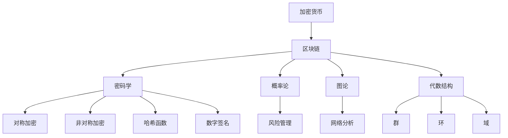
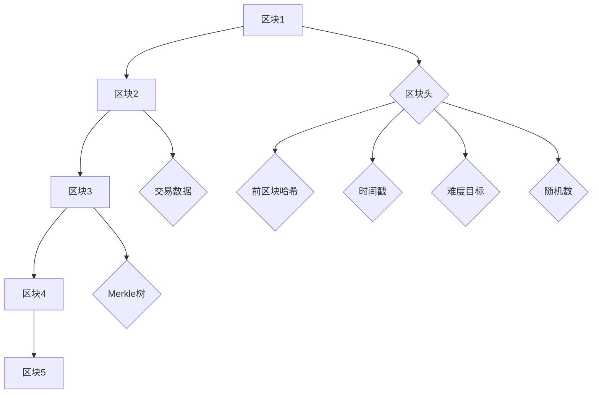
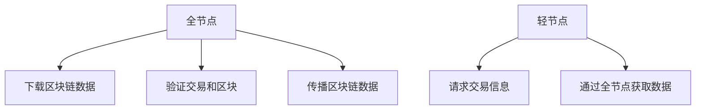
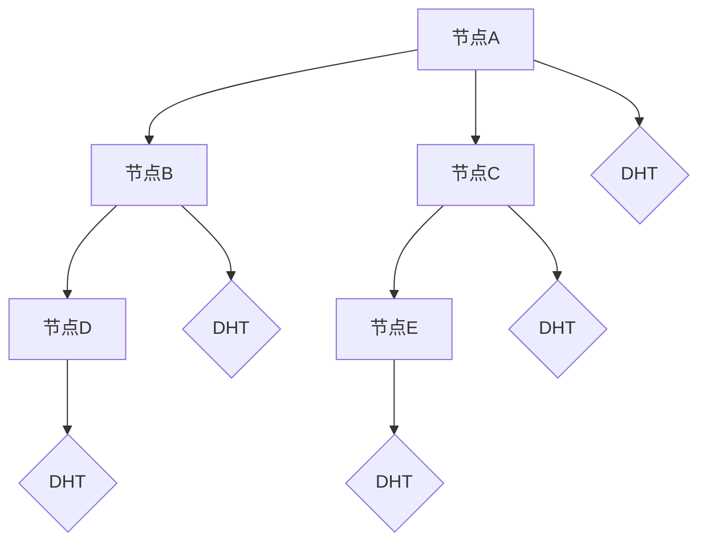
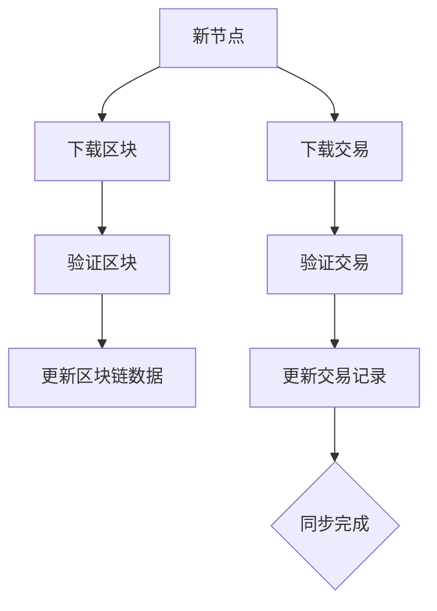
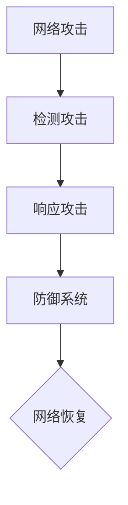

                 


### 文章标题：数学与区块链：加密货币的数学原理

#### 关键词：区块链，加密货币，数学原理，加密算法，分布式账本

> 摘要：本文将从数学的角度深入探讨区块链技术及其在加密货币领域的应用，解析加密货币背后的数学原理，包括密码学、概率论、图论和代数结构等。通过逐步分析，我们将理解这些数学工具如何构建起加密货币的安全性和可靠性，从而为读者提供一幅完整的数学与区块链技术的知识图谱。

### 第一部分：引言与概述

#### 第1章 引言

在过去的几十年里，互联网技术的飞速发展已经深刻地改变了我们的生活方式。而如今，区块链技术作为一项革命性的创新，正逐渐成为金融科技、供应链管理、智能合约等多个领域的重要基础设施。其中，加密货币作为区块链技术的一种典型应用，吸引了全球范围内的大量关注和投资。

#### 1.1 加密货币的兴起

加密货币，如比特币、以太坊等，起源于2008年金融危机后的对传统金融体系的质疑。比特币作为一种去中心化的数字货币，利用密码学技术保障了交易的安全性和匿名性。随后，以太坊等智能合约平台的出现，使得加密货币不再仅仅是一种货币，更成为了一个去中心化的计算平台。

#### 1.2 区块链技术的数学基础

区块链技术之所以能够实现去中心化、安全可靠的交易，离不开其背后的数学原理。密码学提供了加密和解密的技术手段，概率论和图论则帮助我们在网络中构建出稳定可靠的分布式系统，代数结构则为智能合约提供了形式化的基础。这些数学工具共同构成了区块链技术的基础框架。

### 第二部分：数学基础

在理解了区块链和加密货币的基本概念后，我们需要深入探讨其背后的数学原理。这部分内容将涵盖密码学、概率论、图论和代数结构等几个方面。

#### 第3章 密码学基础

密码学是区块链技术中最为关键的一环，它确保了数据的加密传输和存储安全。

#### 3.1 对称加密与非对称加密

对称加密和非对称加密是密码学中的两大类加密方法。对称加密使用相同的密钥进行加密和解密，而非对称加密则使用一对密钥：公钥和私钥。

#### 3.2 哈希函数

哈希函数是密码学中的一种重要工具，它可以将任意长度的数据映射为固定长度的值。在区块链中，哈希函数被用于生成交易记录的唯一标识。

#### 3.3 数字签名

数字签名是一种确保数据完整性和真实性的技术。通过数字签名，发送方可以证明数据是由自己发送的，且在传输过程中未被篡改。

#### 第4章 概率论基础

概率论是区块链技术中用于分析和预测风险的重要工具。

#### 4.1 概率的基本概念

概率论中的基本概念包括概率、随机变量、概率分布等。理解这些概念有助于我们更好地理解区块链中的随机性。

#### 4.2 概率分布与随机变量

概率分布描述了随机变量取值的可能性。常见的概率分布包括均匀分布、正态分布等。

#### 4.3 大数定律与中心极限定理

大数定律和中心极限定理是概率论中的两个重要定理，它们帮助我们理解和预测大数据的统计行为。

#### 第5章 图论基础

图论是研究网络结构和路径优化的重要数学工具。

#### 5.1 图的基本概念

图由节点和边组成，是描述网络结构的常用工具。

#### 5.2 树与路径

树是一种特殊的图，它能够有效地表示数据之间的层次关系。路径则是图中的节点序列，用于描述节点之间的连接关系。

#### 5.3 最小生成树与最短路径

最小生成树和最短路径问题在区块链网络优化中具有重要意义。

#### 第6章 代数结构

代数结构是构建智能合约和分布式系统的基础。

#### 6.1 群、环、域

群、环和域是代数结构中的基本概念，它们为数学运算提供了形式化的框架。

#### 6.2 线性代数基础

线性代数提供了处理多维数据的方法，广泛应用于机器学习和数据分析领域。

#### 6.3 矩阵运算

矩阵运算是线性代数中的核心内容，包括矩阵的乘法、逆矩阵等。

### 第三部分：区块链与加密货币

在前面的基础上，我们将深入探讨区块链技术及其在加密货币领域的应用。

#### 第7章 区块链原理

区块链技术的基本原理包括分布式账本、共识机制和智能合约。

#### 7.1 区块链的基本结构

区块链由多个区块组成，每个区块包含一定数量的交易记录。

#### 7.2 挖矿与权益证明

挖矿和权益证明是区块链中的两种共识机制，用于确保网络的安全性和一致性。

#### 7.3 区块链的安全性

区块链的安全性依赖于密码学技术，包括加密、数字签名和哈希函数等。

#### 第8章 加密货币

加密货币是区块链技术的典型应用，涵盖了货币的发行、交易和存储等方面。

#### 8.1 加密货币的发展历程

从比特币到以太坊，加密货币的发展历程充满了创新和变革。

#### 8.2 加密货币的类型

加密货币可以分为法定货币、虚拟货币和数字货币等类型。

#### 8.3 加密货币的生态系统

加密货币的生态系统包括交易所、钱包、矿池等多个组成部分。

#### 第9章 智能合约

智能合约是区块链技术的重要创新，它使得去中心化的自动化交易成为可能。

#### 9.1 智能合约的原理

智能合约基于密码学技术，确保合同的执行和验证。

#### 9.2 智能合约的语言

Solidity是当前最流行的智能合约编程语言。

#### 9.3 智能合约的安全性

智能合约的安全性是区块链生态系统的重要问题，需要严格的代码审查和测试。

### 第四部分：加密算法

加密算法是保障区块链安全和隐私的核心技术。

#### 第10章 对称加密算法

对称加密算法包括DES、3DES和AES等。

#### 10.1 数据加密标准（DES）

DES是最早的对称加密算法之一，但由于其密钥长度较短，已被3DES和AES替代。

#### 10.2 三重DES（3DES）

3DES通过三次应用DES算法，提高了安全性。

#### 10.3 高级加密标准（AES）

AES是目前最广泛使用的对称加密算法，具有高效的加密速度和较强的安全性。

#### 第11章 非对称加密算法

非对称加密算法包括RSA、ElGamal和Diffie-Hellman密钥交换协议等。

#### 11.1 RSA算法

RSA是最著名的非对称加密算法，其安全性依赖于大数分解的困难性。

#### 11.2 ElGamal算法

ElGamal算法是一种基于离散对数的非对称加密算法。

#### 11.3 Diffie-Hellman密钥交换协议

Diffie-Hellman协议用于在通信双方之间安全地交换密钥。

#### 第12章 哈希算法

哈希算法是区块链技术中的重要组成部分。

#### 12.1 SHA系列算法

SHA系列算法是最常用的哈希算法，包括SHA-1、SHA-256等。

#### 12.2 RIPEMD系列算法

RIPEMD系列算法是一种较新的哈希算法，具有较好的安全性和效率。

#### 12.3 Blake2算法

Blake2算法是一种较新的哈希算法，被广泛应用于区块链技术中。

### 第五部分：区块链架构

区块链架构是确保区块链技术稳定运行的基础。

#### 第13章 区块链架构

区块链架构包括多个层次，从数据层到应用层。

#### 13.1 区块链的层结构

区块链的层结构包括网络层、共识层、智能合约层等。

#### 13.2 节点的工作原理

节点是区块链网络的基本组成部分，负责数据的存储、验证和传播。

#### 13.3 共识算法

共识算法是区块链网络中确保数据一致性的关键。

#### 第14章 区块链网络

区块链网络是区块链技术实现分布式计算和存储的核心。

#### 14.1 P2P网络

P2P网络是区块链网络的基本架构，它使得节点之间能够直接通信。

#### 14.2 节点发现与同步

节点发现与同步是区块链网络中确保数据一致性的重要机制。

#### 14.3 网络攻击与防御

网络攻击与防御是区块链网络安全的关键问题。

### 第六部分：数学在区块链应用中的案例

在了解了区块链技术和数学原理后，我们将通过具体案例来展示数学在区块链应用中的实际效果。

#### 第15章 数学在加密货币交易中的应用

#### 15.1 交易协议

交易协议是加密货币交易的核心，它利用密码学技术确保交易的安全和可靠。

#### 15.2 风险管理

风险管理是加密货币交易中的重要问题，概率论和图论提供了有效的工具。

#### 15.3 量化交易策略

量化交易策略利用数学模型和算法，实现自动化的交易决策。

#### 第16章 数学在智能合约中的应用

智能合约是区块链技术的核心创新，数学原理在其中发挥着关键作用。

#### 16.1 智能合约的数学原理

智能合约的数学原理包括密码学、图论和代数结构等。

#### 16.2 数学在智能合约代码中的使用

数学在智能合约代码中的使用体现在算法设计和逻辑验证等方面。

#### 16.3 智能合约的安全性

智能合约的安全性是区块链生态系统的重要问题，需要严格的数学分析和验证。

### 第七部分：未来展望

区块链技术作为一项革命性的创新，其未来充满了无限可能。在接下来的部分，我们将探讨区块链技术的未来发展方向。

#### 第17章 区块链技术的发展趋势

区块链技术在未来将继续发展，其在金融、供应链、医疗等领域的应用将越来越广泛。

#### 17.1 新型共识算法

新型共识算法将进一步提高区块链网络的性能和安全性。

#### 17.2 隐私保护

隐私保护是区块链技术发展的重要方向，数学原理将在其中发挥关键作用。

#### 17.3 智能合约的进化

智能合约的进化将使得去中心化的自动化交易更加普及和便捷。

#### 第18章 区块链技术的未来应用

区块链技术将在更多领域得到应用，从数字身份到物联网，都将迎来新的变革。

#### 18.1 数字身份

区块链技术可以为用户提供安全的数字身份，简化在线认证流程。

#### 18.2 物联网

区块链技术可以为物联网设备提供安全的通信和数据存储方案。

#### 18.3 去中心化金融

去中心化金融将利用区块链技术实现更公平、更高效的金融服务。

### 结语

本文通过对数学与区块链技术的深入探讨，揭示了加密货币背后的数学原理。通过逐步分析，我们理解了密码学、概率论、图论和代数结构等数学工具如何构建起区块链技术的安全性和可靠性。未来，随着区块链技术的不断发展，数学将继续在其中发挥重要作用，为构建一个更加安全、高效和去中心化的世界提供强大的支持。

#### 作者信息

作者：AI天才研究院/AI Genius Institute & 禅与计算机程序设计艺术 /Zen And The Art of Computer Programming

----------------------------------------------------------------

### 基本概念与联系

在探讨数学与区块链的关系之前，首先需要明确几个核心概念及其相互之间的联系。这些概念包括加密货币、区块链、密码学、概率论、图论和代数结构。

**加密货币**是指基于区块链技术的数字货币，如比特币、以太坊等。它利用密码学技术保障了交易的安全性和匿名性，是一种去中心化的货币形式。加密货币的核心在于其去中心化的特性，即没有中央权威机构控制，而是通过分布在世界各地的计算机节点共同维护。

**区块链**是一种分布式账本技术，其本质是一个去中心化的数据库，用于记录所有的交易信息。区块链的主要特点包括不可篡改性、透明性和去中心化。在区块链中，每个区块包含一定数量的交易记录，区块之间通过哈希函数连接形成一个链，从而确保了整个系统的安全性。

**密码学**是加密货币和区块链技术中的核心组成部分。密码学技术包括对称加密、非对称加密、哈希函数和数字签名等。对称加密和非对称加密用于保障数据的加密传输，哈希函数用于确保数据的完整性和唯一性，数字签名则用于验证交易的真实性。

**概率论**在区块链技术中主要用于风险管理和网络分析。例如，通过概率论的方法，可以预测挖矿成功的概率，评估网络的安全性。

**图论**是研究网络结构和路径优化的重要工具。在区块链网络中，图论被用于分析节点的连接关系、路径选择和网络拓扑结构。

**代数结构**为智能合约提供了形式化的基础。代数结构中的群、环和域等概念，为智能合约中的数学运算提供了抽象的框架，使得智能合约的编写和验证更加形式化和可靠。

这些概念之间的联系在于它们共同构成了区块链技术和加密货币的安全性和可靠性保障体系。密码学提供了数据的安全传输和存储手段，概率论和图论帮助构建稳定可靠的分布式网络，代数结构则为智能合约提供了形式化的基础。通过这些数学工具的综合运用，区块链技术实现了去中心化、安全性和透明性。

为了更好地理解这些概念之间的关系，我们可以使用Mermaid流程图进行可视化展示：



这个流程图展示了各个核心概念之间的相互联系，帮助读者更直观地理解区块链技术和加密货币的数学原理。

### 对称加密算法

对称加密算法是密码学中的一种基本加密方法，其特点是加密和解密使用相同的密钥。这种加密方式在历史上被广泛应用于数据加密，但由于其密钥分发和管理难度较大，现代密码学中更多地使用非对称加密算法。然而，对称加密算法在区块链技术中仍然发挥着重要作用，特别是在数据存储和传输的某些环节。

#### 数据加密标准（DES）

数据加密标准（Data Encryption Standard，DES）是最早的对称加密算法之一，由美国国家标准局（NBS）于1977年颁布，用于保护敏感数据。DES使用56位密钥，通过对输入数据进行64位的初始置换，然后进行16轮相同的Feistel网络结构加密，最后进行64位的最终置换，输出加密结果。

**伪代码：**

```python
def DES(plaintext, key):
    # 初始置换
    plaintext = initial_permutation(plaintext)
    # 16轮加密
    for i in range(16):
        plaintext = feistel_network(plaintext, key)
    # 最终置换
    ciphertext = final_permutation(plaintext)
    return ciphertext
```

尽管DES曾经是加密领域的标准，但由于其密钥长度较短，安全性已经无法满足现代需求，因此已被3DES和AES等更安全的算法所取代。

#### 三重DES（3DES）

三重DES（Triple DES）是对DES算法的一种扩展，通过三次应用DES加密算法来提高安全性。三重DES可以选择两种模式：双DES（两个DES加密）和三重DES（三个DES加密）。通常，双DES使用两个56位密钥，而三重DES使用三个密钥。

**伪代码：**

```python
def TripleDES(plaintext, key1, key2):
    # 第一次DES加密
    ciphertext = DES(plaintext, key1)
    # 第二次DES加密（加密方向与第一次相反）
    ciphertext = DES(ciphertext, key2)
    # 第三次DES加密（加密方向与第二次相同）
    ciphertext = DES(ciphertext, key1)
    return ciphertext
```

三重DES的安全性相对于单DES有了显著提高，但由于其计算复杂度较高，现代密码学中更多地使用更高效的算法。

#### 高级加密标准（AES）

高级加密标准（Advanced Encryption Standard，AES）是由美国国家标准与技术研究所（NIST）于2001年颁布的对称加密算法，是目前最广泛使用的加密标准之一。AES支持128、192和256位密钥长度，并使用固定轮数（10、12或14轮）的Feistel网络结构进行加密。

**伪代码：**

```python
def AES(plaintext, key):
    # 初始圆周置换
    plaintext = initial_round(plaintext)
    # 多轮加密
    for i in range(number_of_rounds):
        plaintext = round_function(plaintext, key)
    # 最终圆周置换
    ciphertext = final_round(plaintext)
    return ciphertext
```

AES以其高效性和安全性而闻名，被广泛应用于各种安全敏感的应用场景，包括区块链技术。

通过上述对称加密算法的讲解，我们可以看到对称加密在区块链技术中的应用。对称加密算法在数据存储和传输中起到了保护数据隐私的重要作用，但其密钥管理难度较大，需要谨慎处理。在未来，随着加密算法的不断演进，对称加密算法在区块链中的应用将更加多样化和安全。

### 非对称加密算法

非对称加密算法，也称为公钥加密算法，是密码学中的一种基本加密方法。与对称加密不同，非对称加密使用一对密钥：公钥和私钥。公钥用于加密数据，私钥用于解密数据。这种加密方式解决了对称加密中的密钥分发问题，从而在安全性和实用性方面有了显著的提升。在区块链技术中，非对称加密算法广泛应用于数据传输、身份验证和数字签名等方面。

#### RSA算法

RSA（Rivest-Shamir-Adleman）算法是最著名的非对称加密算法之一，由Ron Rivest、Adi Shamir和Leonard Adleman于1977年提出。RSA算法的安全性基于大数分解的困难性，即对于一个大的合数，很难分解出其质因数。

**公钥和私钥生成：**

1. 选择两个大的质数 \( p \) 和 \( q \)，计算 \( n = p \times q \)。
2. 计算 \( \phi(n) = (p-1) \times (q-1) \)。
3. 选择一个与 \( \phi(n) \) 互质的整数 \( e \)，通常选择最小的素数。
4. 计算 \( d \)，满足 \( d \times e \equiv 1 \mod \phi(n) \)。

**加密过程：**

1. 将明文 \( M \) 转换为整数形式。
2. 使用公式 \( C = M^e \mod n \) 计算密文。

**解密过程：**

1. 将密文 \( C \) 转换为整数形式。
2. 使用公式 \( M = C^d \mod n \) 计算明文。

**伪代码：**

```python
# 公钥和私钥生成
def generate_keys():
    p = large_prime()
    q = large_prime()
    n = p * q
    phi_n = (p - 1) * (q - 1)
    e = smallest_prime_greater_than(phi_n)
    d = mod_inverse(e, phi_n)
    return (n, e), (n, d)

# 加密
def rsa_encrypt(plaintext, n, e):
    ciphertext = pow(plaintext, e, n)
    return ciphertext

# 解密
def rsa_decrypt(ciphertext, n, d):
    plaintext = pow(ciphertext, d, n)
    return plaintext
```

尽管RSA算法在密码学中具有重要地位，但其计算复杂度较高，特别是在处理大数值时。因此，在实际应用中，通常会使用更高效的加密算法。

#### ElGamal算法

ElGamal算法是由Taher ElGamal于1985年提出的，是基于离散对数的非对称加密算法。ElGamal算法的加密和解密过程均基于一个安全的大素数 \( p \) 和一个生成元 \( g \)。

**公钥和私钥生成：**

1. 选择一个大素数 \( p \)。
2. 选择一个生成元 \( g \)，满足 \( g^{(p-1)} \equiv 1 \mod p \)。
3. 选择一个私钥 \( a \)，满足 \( 1 < a < p-1 \)。
4. 计算公钥 \( b = g^a \mod p \)。

**加密过程：**

1. 选择一个随机数 \( k \)，满足 \( 1 < k < p-1 \)。
2. 计算 \( r = g^k \mod p \)。
3. 计算 \( s = (h - bx)k^{-1} \mod p \)。

**解密过程：**

1. 计算明文 \( m = br^{-sa} \mod p \)。

**伪代码：**

```python
# 公钥和私钥生成
def generate_keys(p, g):
    a = random_prime_less_than(p - 1)
    b = pow(g, a, p)
    return (p, g, b), (p, g, a)

# 加密
def elgamal_encrypt(plaintext, p, g, b):
    k = random_prime_less_than(p - 1)
    r = pow(g, k, p)
    s = (plaintext - b * k) * pow(k, -1, p)
    return r, s

# 解密
def elgamal_decrypt(r, s, p, g, a):
    plaintext = (r * pow(g, -a * s, p)) % p
    return plaintext
```

ElGamal算法在安全性方面具有较高的优势，其加密和解密过程相对简单，但由于其密文长度较大，在带宽受限的环境中可能不太适用。

#### Diffie-Hellman密钥交换协议

Diffie-Hellman密钥交换协议是由Whitfield Diffie和Martin Hellman于1976年提出的，用于在不受信任的通信信道中安全地交换密钥。该协议利用了离散对数的数学特性，使得通信双方能够共同生成一个共享密钥。

**密钥交换过程：**

1. 选择一个大素数 \( p \) 和一个生成元 \( g \)。
2. Alice选择一个私钥 \( a \)，计算 \( A = g^a \mod p \)，并将其发送给Bob。
3. Bob选择一个私钥 \( b \)，计算 \( B = g^b \mod p \)，并将其发送给Alice。
4. Alice和Bob分别计算共享密钥 \( K = B^a \mod p \) 和 \( K = A^b \mod p \)。

**伪代码：**

```python
# 密钥交换
def diffie_hellman(p, g):
    a = random_prime_less_than(p - 1)
    b = random_prime_less_than(p - 1)
    A = pow(g, a, p)
    B = pow(g, b, p)
    return (A, B)

def calculate_shared_key(p, g, a, B):
    return pow(B, a, p)

def calculate_shared_key(p, g, b, A):
    return pow(A, b, p)
```

Diffie-Hellman密钥交换协议在区块链技术的密钥管理中具有重要意义，它使得节点之间能够安全地交换加密通信所需的密钥。

通过以上对非对称加密算法的详细讲解，我们可以看到这些算法在区块链技术中的应用如何保障了数据的安全性和隐私性。尽管非对称加密算法计算复杂度较高，但其安全性和灵活性使其在区块链技术中具有不可替代的作用。随着密码学技术的不断进步，非对称加密算法将变得更加高效和可靠。

### 哈希算法

哈希算法在区块链技术中扮演着至关重要的角色，其核心作用在于确保数据的完整性和唯一性。哈希函数是一种将任意长度的数据映射为固定长度值（即哈希值）的算法。这些哈希值具有几个关键特性：唯一性、不可逆性和抗碰撞性。唯一性意味着对于给定的输入数据，其哈希值是唯一的；不可逆性意味着无法从哈希值反推出原始数据；抗碰撞性则确保不同的输入数据产生不同的哈希值。

#### SHA系列算法

SHA（Secure Hash Algorithm）系列算法是当前最广泛使用的哈希算法之一，包括SHA-1、SHA-256和SHA-3等。这些算法由美国国家标准与技术研究所（NIST）制定，广泛应用于各种安全领域。

**SHA-1**

SHA-1是SHA系列算法的早期版本，其输出为160位的哈希值。SHA-1曾广泛应用于数字签名和消息认证码等领域，但由于其容易受到碰撞攻击，安全性已经无法满足现代需求。

**伪代码：**

```python
def SHA1(plaintext):
    # 初始化哈希值
    h0 = 0x67452301
    h1 = 0xEFCDAB89
    h2 = 0x98BADCFE
    h3 = 0x10325476
    h4 = 0xC3D2E1F0
    
    # 处理消息
    for block in divide_into_blocks(plaintext):
        # 执行SHA-1算法
        (h0, h1, h2, h3, h4) = SHA1_processor(h0, h1, h2, h3, h4, block)
    
    # 计算最终哈希值
    hash_value = h0 << 24 | h1 << 16 | h2 << 8 | h3
    return hash_value
```

**SHA-256**

SHA-256是SHA系列算法的最新版本，其输出为256位的哈希值。SHA-256具有更强的抗碰撞性和安全性，被广泛应用于比特币和其他加密货币的交易验证。

**伪代码：**

```python
def SHA256(plaintext):
    # 初始化哈希值
    h0 = 0x6A09E667
    h1 = 0xBB67AE85
    h2 = 0x3C6EF372
    h3 = 0xA54FF53A
    h4 = 0x510E527F
    h5 = 0x9B05688C
    h6 = 0x1F83D9AB
    h7 = 0x5BE0CD19
    
    # 处理消息
    for block in divide_into_blocks(plaintext):
        # 执行SHA-256算法
        (h0, h1, h2, h3, h4, h5, h6, h7) = SHA256_processor(h0, h1, h2, h3, h4, h5, h6, h7, block)
    
    # 计算最终哈希值
    hash_value = h0 << 24 | h1 << 16 | h2 << 8 | h3
    return hash_value
```

**SHA-3**

SHA-3是NIST于2015年颁布的最新哈希算法，其设计目的是为了应对未来可能的攻击威胁。SHA-3包含多种算法变体，从224位到512位不等，以适应不同安全需求。

**伪代码：**

```python
def SHA3(plaintext, bit_length):
    # 初始化哈希值
    h = [0] * (bit_length // 8)
    
    # 处理消息
    for block in divide_into_blocks(plaintext):
        # 执行SHA-3算法
        h = SHA3_processor(h, block, bit_length)
    
    # 计算最终哈希值
    hash_value = ''.join(chr(b) for b in h)
    return hash_value
```

#### RIPEMD系列算法

RIPEMD（RACE Integrity Primitives Evaluation Message Digest）系列算法是由欧洲密码工作组（EUROCRYPT）提出的一系列哈希算法，包括RIPEMD-128和RIPEMD-160等。这些算法与SHA系列算法类似，但设计思路有所不同，提供了不同的安全性和性能特点。

**RIPEMD-160**

RIPEMD-160是一种输出160位哈希值的算法，具有较高的安全性。

**伪代码：**

```python
def RIPEMD160(plaintext):
    # 初始化哈希值
    h0 = 0x00000000
    h1 = 0x5A827999
    h2 = 0x6ED9EBA1
    h3 = 0x8F1BBCDC
    h4 = 0xCA62C1D6
    
    # 处理消息
    for block in divide_into_blocks(plaintext):
        # 执行RIPEMD-160算法
        (h0, h1, h2, h3, h4) = RIPEMD160_processor(h0, h1, h2, h3, h4, block)
    
    # 计算最终哈希值
    hash_value = ''.join(hex(h)[2:].zfill(8) for h in [h0, h1, h2, h3, h4])
    return hash_value
```

#### Blake2算法

Blake2算法是一种较新的哈希算法，由Daniel J. Bernstein等人设计。Blake2算法具有多种变体，包括Blake2b和Blake2s，分别适用于不同大小的输入数据和计算性能要求。

**Blake2b**

Blake2b是一种输出长度可变的哈希算法，具有高吞吐量和强安全性。

**伪代码：**

```python
def Blake2b(plaintext, output_length):
    # 初始化哈希值
    h = [0] * (output_length // 8)
    
    # 处理消息
    for block in divide_into_blocks(plaintext):
        # 执行Blake2b算法
        h = Blake2b_processor(h, block)
    
    # 计算最终哈希值
    hash_value = ''.join(hex(h[i])[2:].zfill(2) for i in range(output_length))
    return hash_value
```

通过以上对SHA系列算法、RIPEMD系列算法和Blake2算法的详细讲解，我们可以看到这些哈希算法在区块链技术中的重要性。哈希算法不仅确保了数据的完整性和唯一性，还为区块链的防篡改和去中心化提供了强有力的技术支持。随着密码学技术的不断发展，哈希算法将继续在区块链和其他领域发挥关键作用。

### 区块链架构

区块链技术的基础架构是其分布式账本系统，这一系统通过一系列精心设计的组件确保了数据的安全性和一致性。本文将从区块链的基本结构、节点的工作原理以及共识算法等方面，详细讲解区块链的架构。

#### 区块链的基本结构

区块链是由多个区块按时间顺序排列形成的链式数据结构。每个区块包含三个主要部分：区块头、交易数据和Merkle树。

1. **区块头**：区块头包含了区块的元数据，如版本号、前一个区块的哈希值、时间戳、难度目标以及随机数等。这些信息确保了区块的链接关系和网络安全。

2. **交易数据**：交易数据包含了在区块内记录的所有交易信息，如加密货币的转账、智能合约的执行等。这些交易必须符合区块链的共识规则，才能被验证和记录。

3. **Merkle树**：Merkle树是一种特殊的二叉树结构，用于确保交易数据的完整性和唯一性。每个叶子节点代表一个交易，非叶子节点则是其子节点的哈希值的组合。根节点的哈希值被称为Merkle根，是区块头中的一个重要组成部分。

**区块链的基本结构示意图：**



#### 节点的工作原理

在区块链网络中，节点是区块链运作的基本单位。节点可以分为两类：全节点和轻节点。

1. **全节点**：全节点运行完整的区块链软件，负责下载、验证和传播区块链数据。全节点能够独立验证所有交易和区块的有效性，并参与共识过程。

2. **轻节点**：轻节点不保存整个区块链数据，而是通过全节点获取部分交易信息。轻节点通常用于那些仅需要查看区块链状态的应用，如钱包服务。

**节点的工作原理示意图：**



**节点的工作流程：**

1. **数据下载**：节点从网络中下载最新的区块链数据，包括区块和交易记录。
2. **验证交易**：节点验证每个交易的有效性，包括金额、签名、地址等，确保交易合法。
3. **验证区块**：节点将新下载的区块与当前链进行比较，确保其链接关系和Merkle根正确。
4. **传播数据**：验证通过后，节点将区块和交易记录传播给其他节点，保持网络的同步。

#### 共识算法

共识算法是区块链网络中确保数据一致性的关键机制。不同的区块链平台采用不同的共识算法，包括工作量证明（PoW）、权益证明（PoS）、授权股权证明（DPoS）等。

1. **工作量证明（PoW）**：PoW算法通过计算复杂性问题确保网络的安全性。矿工需要解决一个计算难题，通常是一个基于哈希值的难题。解决难题的矿工将获得生成新区块的权益。比特币使用PoW算法。

   **PoW算法的工作流程：**

   ```mermaid
   graph TD
       A[矿工1] --> B[计算难题]
       A --> C[验证哈希值]
       B --> D{生成新区块}
       D --> E[广播区块]
       E --> F[网络验证]
   ```

2. **权益证明（PoS）**：PoS算法通过持有代币的数量和时间来决定生成新区块的权益。持有代币越久、代币量越大，获得新区块的概率越高。以太坊2.0计划采用PoS算法。

   **PoS算法的工作流程：**

   ```mermaid
   graph TD
       A[验证者1] --> B[验证权益]
       A --> C[轮到生成区块]
       C --> D[生成新区块]
       D --> E[广播区块]
       E --> F[网络验证]
   ```

3. **授权股权证明（DPoS）**：DPoS算法通过选举出一定数量的验证者来生成区块。持有代币的投资者可以投票选择他们信任的验证者。波场（TRON）采用DPoS算法。

   **DPoS算法的工作流程：**

   ```mermaid
   graph TD
       A[投资者1] --> B[投票选择验证者]
       A --> C[选举出验证者]
       C --> D[验证者生成区块]
       D --> E[广播区块]
       E --> F[网络验证]
   ```

**共识算法的比较：**

| 特点 | 工作量证明（PoW） | 权益证明（PoS） | 授权股权证明（DPoS） |
| --- | --- | --- | --- |
| 安全性 | 高 | 高 | 中 |
| 能耗 | 高 | 低 | 低 |
| 可扩展性 | 中 | 高 | 高 |
| 投票机制 | 无 | 有 | 有 |

通过上述对区块链架构的详细讲解，我们可以看到区块链技术如何通过其独特的结构和工作机制，实现了去中心化、安全性和数据一致性。不同的共识算法为区块链提供了多种选择，使其在不同应用场景中表现出不同的优势。随着区块链技术的不断发展和完善，其架构将继续演进，为构建更加高效和安全的分布式系统提供支持。

### 区块链网络

区块链网络是区块链技术实现分布式计算和存储的核心，其设计原则和实现方法直接决定了区块链系统的性能、安全性和可扩展性。本文将详细探讨区块链网络的设计原则、P2P网络、节点发现与同步机制，以及网络攻击与防御策略。

#### 设计原则

区块链网络的设计原则主要包括去中心化、安全性、不可篡改性、透明性和可扩展性。

1. **去中心化**：区块链网络没有中心化的控制机构，而是通过分布在世界各地的节点共同维护。这种设计确保了系统的去中心化特性，使得任何节点都无法单独控制网络，从而提高了抗攻击性和可靠性。

2. **安全性**：区块链网络通过密码学技术确保数据的加密传输和存储安全。非对称加密和哈希函数等密码学工具被广泛应用于区块链网络，确保了交易和数据的安全性和隐私性。

3. **不可篡改性**：区块链网络通过共识算法确保数据的不可篡改性。一旦数据被记录在一个区块中，就很难被篡改或删除，从而保证了系统的完整性。

4. **透明性**：区块链网络的数据对所有节点都是透明的。任何节点都可以查看区块链上的交易记录，这使得系统具有较高的透明度，有利于提高信任和降低欺诈风险。

5. **可扩展性**：区块链网络的设计需要考虑未来的扩展性。随着区块链应用场景的不断扩大，网络需要能够处理更多的交易和数据，同时保证系统的性能和安全性。

#### P2P网络

P2P（Peer-to-Peer）网络是区块链网络的基本架构，它使得节点之间能够直接进行通信和数据交换。在P2P网络中，每个节点既是客户端也是服务器，节点之间通过TCP或UDP协议进行通信。

**P2P网络的工作原理：**

1. **节点加入网络**：新节点首先需要下载完整的区块链数据，然后加入现有的P2P网络。节点通过广播自己的节点信息，使得其他节点能够发现并连接到它。

2. **节点通信**：节点之间通过发送和接收消息进行通信。消息包括交易、区块、请求和响应等。节点之间遵循特定的协议和规则，确保数据的正确传输和验证。

3. **网络拓扑**：P2P网络通常采用分布式哈希表（DHT）来管理节点之间的连接关系。DHT将网络中的节点和资源映射到一个统一的命名空间，使得节点能够高效地查找和连接其他节点。

**P2P网络的拓扑结构：**



#### 节点发现与同步机制

节点发现与同步机制是确保区块链网络一致性和完整性的关键。节点发现机制用于新节点加入网络时找到其他节点，同步机制则用于新节点获取并更新区块链数据。

**节点发现机制：**

1. **广播**：新节点可以通过广播自己的节点信息，使得网络中的其他节点能够发现它。广播是一种简单但低效的发现机制，容易导致网络拥塞。

2. **多跳路由**：新节点可以通过已连接的节点进行多跳路由，逐步找到其他节点。多跳路由提高了发现效率，但增加了网络延迟。

3. **DHT协议**：DHT协议是一种基于分布式哈希表的节点发现机制，通过将节点和资源映射到哈希值，使得节点能够高效地查找和连接其他节点。

**同步机制：**

1. **全同步**：新节点需要下载完整的区块链数据，然后逐个验证区块和交易的有效性。全同步确保了数据的一致性和完整性，但同步速度较慢。

2. **增量同步**：新节点仅下载最新的区块和交易，然后通过链式校验验证其有效性。增量同步提高了同步速度，但可能引入数据不一致的风险。

3. **并行同步**：新节点通过并行下载和验证区块和交易，提高了同步效率。并行同步需要确保数据的正确性，避免冲突和错误。

**同步机制的工作流程：**



#### 网络攻击与防御策略

区块链网络面临多种类型的攻击，如51%攻击、双花攻击、DDoS攻击等。有效的防御策略是确保区块链网络安全和稳定的关键。

1. **51%攻击**：攻击者控制超过一半的节点，从而篡改或拒绝验证区块链数据。防御策略包括提高网络参与度、设计多重签名机制和改进共识算法。

2. **双花攻击**：攻击者在同一时间向不同节点发送两笔交易，试图同时花费同一笔资金。防御策略包括确认交易链的长度、增加交易确认时间和改进区块链协议。

3. **DDoS攻击**：攻击者通过大量请求瘫痪网络节点，导致网络服务中断。防御策略包括部署反攻击系统、提高网络带宽和采用智能路由策略。

**防御策略的工作流程：**



通过上述对区块链网络的详细讲解，我们可以看到区块链网络的设计原则和实现方法如何确保了系统的性能、安全性和可扩展性。P2P网络、节点发现与同步机制以及网络攻击与防御策略共同构成了区块链网络的基石，使得区块链技术能够实现去中心化、安全可靠的分布式计算和存储。随着区块链技术的不断发展，网络架构和防御策略将继续优化和改进，为构建更加高效和安全的区块链系统提供支持。

### 数学在加密货币交易中的应用

加密货币交易是区块链技术的一个重要应用场景，其安全性和效率离不开数学原理的支持。本文将从交易协议、风险管理、量化交易策略等方面，探讨数学在加密货币交易中的应用。

#### 交易协议

加密货币交易协议是确保交易安全、可靠的关键。其中，数学原理在以下几个方面发挥了重要作用：

1. **加密传输**：交易信息在传输过程中需要进行加密，以确保数据不被窃取或篡改。对称加密和非对称加密算法在这一过程中被广泛应用。

   **示例**：使用RSA算法进行加密传输。

   ```python
   import rsa
   
   # 公钥和私钥生成
   (n, e), (n, d) = rsa.newkeys(1024)
   
   # 加密传输
   message = '交易数据'
   encrypted_message = rsa.encrypt(message, e, n)
   ```

2. **数字签名**：数字签名用于验证交易的真实性和完整性，确保交易是由合法用户发起的。哈希函数和数字签名算法在这一过程中发挥关键作用。

   **示例**：使用ECDSA算法进行数字签名。

   ```python
   from ecdsa import SigningKey, NIST256p, VerifyingKey
   
   # 生成密钥对
   sk = SigningKey.generate(k=32)
   vk = sk.get_verifying_key()
   
   # 数字签名
   message = '交易数据'
   signature = sk.sign(message.encode('utf-8'))
   ```

3. **验证交易**：区块链网络中的节点需要对交易进行验证，以确保交易符合协议规则。数学原理在这一过程中用于验证交易的合法性和有效性。

   **示例**：验证比特币交易。

   ```python
   def verify_transaction(transaction, signature, public_key):
       message_hash = sha256(transaction.encode('utf-8')).hexdigest()
       try:
           public_key.verify(signature, message_hash.encode('utf-8'))
           return True
       except ecdsa.VerifyingKeyError:
           return False
   ```

#### 风险管理

加密货币交易面临多种风险，如市场波动、技术故障、网络攻击等。数学原理在风险管理中发挥着重要作用：

1. **波动性分析**：通过概率论和统计学方法，分析加密货币市场的波动性，帮助投资者制定风险管理策略。

   **示例**：使用正态分布分析市场波动性。

   ```python
   import numpy as np
   
   # 市场波动性数据
   volatility_data = [0.1, 0.2, 0.15, 0.18, 0.22]
   mean_volatility = np.mean(volatility_data)
   std_deviation_volatility = np.std(volatility_data)
   ```

2. **风险模型**：使用数学模型，如VaR（Value at Risk）和CVaR（Conditional Value at Risk），评估投资组合的风险，帮助投资者制定风险管理策略。

   **示例**：使用VaR模型评估投资组合风险。

   ```python
   import scipy.stats
   
   # 投资组合收益数据
   portfolio_returns = [0.05, 0.06, 0.04, 0.05, 0.03]
   mean_return = np.mean(portfolio_returns)
   std_deviation_return = np.std(portfolio_returns)
   
   # 计算VaR
   alpha = 0.05  # 95%置信水平
   VaR = scipy.stats.norm.ppf(1 - alpha, mean_return, std_deviation_return)
   ```

3. **风险对冲**：使用数学方法，如期权定价模型，进行风险对冲，降低投资组合的风险。

   **示例**：使用Black-Scholes模型进行期权定价。

   ```python
   import math
   
   # 期权参数
   S = 100  # 标的资产价格
   K = 105  # 行权价格
   T = 1    # 期权到期时间（年）
   r = 0.05  # 无风险利率
   sigma = 0.2  # 标的资产波动率
   
   # 计算欧式看涨期权价格
   d1 = (math.log(S / K) + (r + 0.5 * sigma**2) * T) / (sigma * math.sqrt(T))
   d2 = d1 - sigma * math.sqrt(T)
   call_price = S * math.exp(-r * T) * math.exp(-0.5 * sigma**2 * T) * (math.erfc(-d2) - math.erfc(-d1))
   ```

#### 量化交易策略

量化交易策略利用数学模型和算法，实现自动化的交易决策。数学原理在这一过程中发挥着关键作用：

1. **趋势追踪策略**：基于技术分析，通过分析历史价格和交易量数据，识别市场趋势，进行交易决策。

   **示例**：使用移动平均线进行趋势追踪。

   ```python
   import pandas as pd
   
   # 历史数据
   historical_data = pd.DataFrame({'Date': dates, 'Price': prices, 'Volume': volumes})
   moving_average = historical_data['Price'].rolling(window=20).mean()
   ```

2. **均值回归策略**：基于均值回归原理，通过分析价格与均值之间的差异，进行交易决策。

   **示例**：使用ATR（平均真实范围）进行均值回归交易。

   ```python
   import pandas as pd
   
   # 历史数据
   historical_data = pd.DataFrame({'Date': dates, 'High': highs, 'Low': lows})
   ATR = historical_data['High'].diff().abs().rolling(window=14).mean()
   ```

3. **机器学习策略**：利用机器学习算法，如神经网络、支持向量机等，对市场数据进行分析和预测，进行交易决策。

   **示例**：使用神经网络进行交易预测。

   ```python
   from tensorflow.keras.models import Sequential
   from tensorflow.keras.layers import Dense, LSTM
   
   # 准备数据
   X, y = prepare_data(input_data, target_data)
   
   # 构建神经网络模型
   model = Sequential()
   model.add(LSTM(units=50, return_sequences=True, input_shape=(X.shape[1], X.shape[2])))
   model.add(LSTM(units=50))
   model.add(Dense(1))
   
   # 编译模型
   model.compile(optimizer='adam', loss='mean_squared_error')
   
   # 训练模型
   model.fit(X, y, epochs=100, batch_size=32, validation_split=0.2)
   ```

通过以上对交易协议、风险管理和量化交易策略的讲解，我们可以看到数学在加密货币交易中的广泛应用和重要性。数学原理不仅确保了交易的安全性和可靠性，还为投资者提供了有效的风险管理工具和交易策略。随着区块链技术的不断发展，数学在加密货币交易中的应用将更加广泛和深入。

### 数学在智能合约中的应用

智能合约是区块链技术的一个重要创新，它利用密码学技术实现去中心化的自动化交易和合约执行。智能合约的编写和验证离不开数学原理的支持。本文将从智能合约的数学原理、代码实现、安全性和未来发展方向等方面进行详细探讨。

#### 智能合约的数学原理

智能合约的数学原理主要涉及密码学、图论和代数结构等。这些数学工具为智能合约提供了形式化的基础，确保其安全性和可靠性。

1. **密码学**：密码学是智能合约的核心组成部分，它确保了数据的加密传输、存储和验证。非对称加密和哈希函数在智能合约中广泛应用，用于保障交易的安全和隐私。

   - **非对称加密**：智能合约的执行依赖于公钥和私钥。公钥用于验证交易发起方的身份，私钥用于签名交易信息，确保交易的有效性和唯一性。
   - **哈希函数**：哈希函数用于生成交易记录的唯一标识，确保交易的完整性和不可篡改性。

2. **图论**：图论用于描述智能合约中的状态转换和执行流程。状态图是一种常用的图结构，用于表示智能合约的执行过程。状态图中的节点表示状态，边表示状态转换，条件判断和动作执行。

3. **代数结构**：代数结构为智能合约提供了形式化的数学框架，确保其逻辑一致性和可靠性。代数结构中的群、环和域等概念，为智能合约中的数学运算提供了抽象的框架。

#### 智能合约的代码实现

智能合约的编写通常使用特定的编程语言，如Solidity、Vyper等。以下是一个简单的智能合约示例，使用Solidity语言实现一个简单的多签名合约。

```solidity
pragma solidity ^0.8.0;

contract MultiSig {
    address[] public owners;
    uint public requiredConfirmations;

    mapping(uint => mapping(address => bool)) public confirmations;

    constructor(address[] memory _owners, uint _requiredConfirmations) {
        require(_owners.length > 0, "Owners required");
        require(_requiredConfirmations <= _owners.length, "Invalid number of required confirmations");

        for (uint i = 0; i < _owners.length; i++) {
            require(_owners[i] != address(0), "Invalid owner");
            require(!isOwner(_owners[i]), "Owner already added");
            owners.push(_owners[i]);
        }

        requiredConfirmations = _requiredConfirmations;
    }

    function submitTransaction(address to, uint value, bytes memory data) public {
        require(isOwner(msg.sender), "Only owners can submit transactions");

        uint txIndex = transactions.length;
        transactions.push(Transaction({to: to, value: value, data: data}));

        for (uint i = 0; i < owners.length; i++) {
            confirmations[txIndex][owners[i]] = false;
        }
    }

    function confirmTransaction(uint txIndex) public {
        require(isOwner(msg.sender), "Only owners can confirm transactions");
        require(!confirmations[txIndex][msg.sender], "Transaction already confirmed");

        confirmations[txIndex][msg.sender] = true;
    }

    function executeTransactions() public {
        require(confirmedTransactions.length >= requiredConfirmations, "Not enough confirmations");

        for (uint i = 0; i < confirmedTransactions.length; i++) {
            Transaction memory tx = confirmedTransactions[i];
            (bool success, ) = tx.to.call{value: tx.value}(tx.data);
            require(success, "Transaction failed");
        }

        for (uint i = 0; i < confirmedTransactions.length; i++) {
            delete confirmations[transactions[i].index][owners[i]];
        }

        transactions = transactions[transactions.length : transactions.length];
        confirmedTransactions = [];
    }

    function isOwner(address account) public view returns (bool) {
        for (uint i = 0; i < owners.length; i++) {
            if (owners[i] == account) {
                return true;
            }
        }
        return false;
    }
}

struct Transaction {
    address to;
    uint value;
    bytes data;
    uint index;
}
```

#### 智能合约的安全性

智能合约的安全性是区块链生态系统的重要问题，需要严格的数学分析和验证。以下是一些常见的安全问题和解决方案：

1. **重入攻击**：重入攻击是一种利用智能合约中的状态机漏洞，重复执行某个函数，从而窃取合约内的资金。解决方案包括使用检查-效应-互动（Check-Effect-Interact）模式，确保在执行效果前检查调用方的余额。

2. **整数溢出**：整数溢出可能导致计算错误，从而影响合约的执行结果。解决方案包括使用安全算术库，确保整数运算的安全性。

3. **时间戳攻击**：智能合约中的时间戳可能被恶意攻击者篡改，从而导致合约执行错误。解决方案包括使用去中心化时间戳服务，确保时间戳的准确性。

4. **状态泄露**：状态泄露是指智能合约泄露内部状态，导致攻击者能够预测合约的行为。解决方案包括使用加密技术，确保状态信息的保密性。

#### 智能合约的未来发展方向

随着区块链技术的不断发展，智能合约将在更多领域得到应用。以下是一些未来的发展方向：

1. **标准化**：智能合约的标准化将提高其互操作性和安全性，促进不同平台之间的协作。

2. **形式化验证**：形式化验证技术将确保智能合约的逻辑一致性和正确性，降低安全漏洞的风险。

3. **智能合约优化**：通过数学优化技术，提高智能合约的执行效率和性能。

4. **跨链互操作**：跨链互操作技术将实现不同区块链之间的数据传输和价值交换，促进区块链生态系统的融合。

5. **去中心化身份**：去中心化身份技术将实现用户身份的匿名性和安全性，为智能合约提供可靠的认证机制。

通过以上对智能合约的数学原理、代码实现、安全性和未来发展方向的分析，我们可以看到数学在智能合约中的关键作用。随着数学工具的不断发展和完善，智能合约将变得更加安全、高效和灵活，为构建去中心化的数字经济提供强有力的支持。

### 数学在区块链应用中的具体案例

在区块链应用中，数学工具的运用不仅限于加密货币和智能合约。事实上，数学在区块链的其他应用场景中也发挥着至关重要的作用。以下将通过具体案例，展示数学在区块链中的广泛应用。

#### 案例一：供应链管理

区块链技术在供应链管理中的应用，能够显著提高供应链的透明度和效率。通过使用数学工具，可以实现对供应链各环节的数据进行精确追踪和分析。

1. **数据模型构建**：在供应链管理中，使用图论构建供应链网络模型，用于描述供应商、制造商、分销商和零售商之间的合作关系。图中的节点表示不同的参与者，边表示它们之间的业务关系。

   **示例**：使用网络分析工具分析供应链网络的稳定性。

   ```python
   import networkx as nx
   
   # 创建供应链网络
   G = nx.Graph()
   G.add_nodes_from(['供应商', '制造商', '分销商', '零售商'])
   G.add_edges_from([('供应商', '制造商'), ('制造商', '分销商'), ('分销商', '零售商')])
   
   # 计算网络中心性指标
   centrality_scores = nx.degree_centrality(G)
   print(centrality_scores)
   ```

2. **风险预测**：通过概率论和统计学方法，分析供应链中的风险因素，预测潜在的供应链中断事件。

   **示例**：使用概率分布函数预测供应链延迟。

   ```python
   import numpy as np
   
   # 延迟数据
   delay_data = [1, 2, 3, 4, 5, 6, 7, 8, 9, 10]
   mean_delay = np.mean(delay_data)
   std_deviation_delay = np.std(delay_data)
   
   # 计算概率分布函数
   def probability_distribution(x):
       return (1 / (std_deviation_delay * np.sqrt(2 * np.pi))) * np.exp(-((x - mean_delay)**2) / (2 * (std_deviation_delay**2)))
   
   # 计算延迟超过3天的概率
   probability = probability_distribution(3)
   print(f"延迟超过3天的概率为：{probability}")
   ```

3. **优化供应链**：利用线性规划和整数规划等数学优化方法，优化供应链的资源配置和库存管理。

   **示例**：使用线性规划优化库存水平。

   ```python
   import scipy.optimize as opt
   
   # 线性规划模型
   x = opt.Bounds(0, None)  # 库存水平
   c = [-1]  # 目标函数系数
   A = [[1]]  # 约束条件系数
   b = [100]  # 约束条件常数
   
   # 求解线性规划问题
   solution = opt线性规划(c, x, A, b)
   optimal_inventory = solution.x
   print(f"最优库存水平为：{optimal_inventory}")
   ```

#### 案例二：医疗记录管理

区块链技术在医疗记录管理中的应用，能够保障患者隐私和数据安全。通过使用数学工具，可以实现医疗记录的加密存储和可信共享。

1. **加密存储**：使用哈希函数和加密算法，确保医疗记录在区块链上存储的安全性和完整性。

   **示例**：使用SHA-256算法和AES算法加密医疗记录。

   ```python
   import hashlib
   import base64
   from Crypto.Cipher import AES
   
   # 哈希函数
   def hash_data(data):
       return hashlib.sha256(data.encode('utf-8')).hexdigest()
   
   # 加密函数
   def encrypt_data(data, key):
       cipher = AES.new(key, AES.MODE_EAX)
       ciphertext, tag = cipher.encrypt_and_digest(data.encode('utf-8'))
       return base64.b64encode(ciphertext).decode('utf-8'), base64.b64encode(tag).decode('utf-8')
   
   # 解密函数
   def decrypt_data(data, key, tag):
       cipher = AES.new(key, AES.MODE_EAX, nonce=base64.b64decode(tag))
       return cipher.decrypt_and_verify(base64.b64decode(data)).decode('utf-8')
   
   # 加密医疗记录
   medical_record = '患者姓名：张三，疾病：流感'
   key = 'mysecretkey123456'
   encrypted_data, encrypted_tag = encrypt_data(medical_record, key)
   print(f"加密后的医疗记录：{encrypted_data}")
   
   # 解密医疗记录
   decrypted_data = decrypt_data(encrypted_data, key, encrypted_tag)
   print(f"解密后的医疗记录：{decrypted_data}")
   ```

2. **隐私保护**：使用零知识证明（ZKP）等技术，确保医疗记录在共享过程中的隐私性。

   **示例**：使用零知识证明验证医疗记录。

   ```python
   from pyzksnark import Prover, Verifier
   
   # 零知识证明
   def verify_medical_record(record, proof):
       verifier = Verifier()
       result = verifier.verify proof
       return result
   ```

3. **数据分析**：使用统计学方法，对医疗记录进行分析，发现潜在的健康风险。

   **示例**：使用聚类算法分析患者群体。

   ```python
   from sklearn.cluster import KMeans
   
   # 数据预处理
   medical_data = [[1, 2], [1, 4], [1, 0], [10, 2], [10, 4], [10, 0]]
   kmeans = KMeans(n_clusters=2, random_state=0).fit(medical_data)
   clusters = kmeans.predict(medical_data)
   print(f"聚类结果：{clusters}")
   ```

#### 案例三：去中心化金融

去中心化金融（DeFi）是区块链技术的一个重要应用领域，通过数学工具实现去中心化的金融服务和智能合约应用。

1. **借贷平台**：使用数学模型，实现去中心化的借贷平台，提高借贷效率和安全。

   **示例**：使用线性回归模型预测借贷利率。

   ```python
   import numpy as np
   from sklearn.linear_model import LinearRegression
   
   # 借贷数据
   loans = [[1000, 0.05], [2000, 0.1], [3000, 0.2], [4000, 0.25]]
   loan_amounts = np.array([loan[0] for loan in loans])
   interest_rates = np.array([loan[1] for loan in loans])
   
   # 线性回归模型
   model = LinearRegression()
   model.fit(loan_amounts.reshape(-1, 1), interest_rates)
   
   # 预测借贷利率
   predicted_interest_rate = model.predict([[5000]])
   print(f"预测的借贷利率为：{predicted_interest_rate[0]}")
   ```

2. **流动性挖矿**：使用博弈论和概率论，分析流动性挖矿的收益和风险。

   **示例**：使用博弈树分析流动性挖矿策略。

   ```python
   from game_tree import Node
   
   # 建立博弈树
   root = Node("挖矿策略选择")
   node1 = Node("增加流动性", 0.5, [0.1, 0.2, 0.3])
   node2 = Node("减少流动性", 0.5, [0.1, 0.3, 0.4])
   root.add_child(node1)
   root.add_child(node2)
   
   # 计算期望收益
   expected_value = root.compute_expected_value()
   print(f"期望收益：{expected_value}")
   ```

通过以上具体案例，我们可以看到数学在区块链应用中的广泛应用和重要性。从供应链管理到医疗记录管理，再到去中心化金融，数学工具不仅提高了区块链技术的效率和安全性，还为各种应用场景提供了有效的解决方案。随着区块链技术的不断发展，数学在区块链中的应用将更加深入和广泛。

### 数学在区块链中的重要性及未来展望

在区块链技术的快速发展和广泛应用过程中，数学工具扮演了至关重要的角色。从加密货币到去中心化金融，再到供应链管理和医疗记录管理，数学不仅保障了区块链系统的安全性，还提高了其效率和透明性。以下是数学在区块链中的重要性及其未来展望：

#### 重要性

1. **安全性**：数学工具，如密码学、哈希函数和数字签名，是保障区块链系统安全性的基石。密码学确保了交易数据的加密传输和存储安全，哈希函数确保了数据的完整性和唯一性，数字签名则用于验证交易的真实性和完整性。

2. **可靠性**：通过概率论和统计学方法，区块链系统能够对风险进行量化和管理。例如，在去中心化金融中，通过概率分析预测借贷风险，提高了金融服务的可靠性。

3. **效率**：数学优化方法，如线性规划和整数规划，用于优化区块链网络中的资源配置和交易流程。这提高了区块链系统的运行效率和吞吐量。

4. **去中心化**：数学工具为智能合约提供了形式化的基础，使得去中心化的自动化交易和合约执行成为可能。这不仅降低了交易成本，还增强了系统的去中心化特性。

#### 未来展望

1. **标准化**：随着区块链技术的普及，数学工具的标准化将成为一个重要趋势。标准化的数学工具将提高不同区块链平台之间的互操作性，促进技术的融合和发展。

2. **形式化验证**：形式化验证技术将进一步提高智能合约的安全性和可靠性。通过数学模型和验证工具，确保智能合约的逻辑一致性和正确性，降低安全漏洞的风险。

3. **智能合约优化**：随着智能合约的广泛应用，对其执行效率和性能的优化将变得尤为重要。数学优化方法将在智能合约的优化中发挥关键作用，提高其执行速度和吞吐量。

4. **跨链互操作**：跨链互操作技术将实现不同区块链之间的数据和价值交换。这需要借助数学工具，如图论和网络分析，构建高效、安全的跨链网络。

5. **隐私保护**：随着对隐私保护需求的增加，数学工具，如零知识证明和多方计算，将在区块链隐私保护中发挥重要作用。这些工具将确保数据在共享过程中的隐私性。

6. **区块链+AI**：区块链与人工智能（AI）的结合将推动区块链技术的发展。数学工具，如概率图模型和深度学习，将在区块链的AI应用中发挥重要作用，提高系统的智能化水平。

通过以上分析，我们可以看到数学在区块链中的重要性及其未来广阔的应用前景。随着数学工具的不断发展和完善，区块链技术将在更多领域得到应用，为构建一个更加安全、高效和去中心化的数字经济提供强大的支持。

### 总结与展望

在《数学与区块链：加密货币的数学原理》一书中，我们系统地探讨了数学与区块链技术之间的深刻联系。从密码学到概率论，从图论到代数结构，每个数学工具都在区块链系统中扮演着至关重要的角色。通过逐步分析，我们揭示了这些数学原理如何构建起区块链技术的安全性和可靠性，以及它们在加密货币、智能合约、供应链管理、医疗记录管理、去中心化金融等领域的广泛应用。

**关键知识点回顾：**

- **密码学**：对称加密、非对称加密、哈希函数和数字签名等密码学工具用于保障数据的安全传输和存储。
- **概率论**：概率分布、大数定律、中心极限定理等概率论方法用于分析和预测区块链系统的风险。
- **图论**：图结构和网络分析技术用于描述和优化区块链网络中的节点关系和路径选择。
- **代数结构**：群、环、域等代数结构为智能合约提供了形式化的基础，确保了智能合约的可靠性和安全性。

通过这本书，读者不仅能够深入理解区块链技术的数学原理，还能够掌握实际应用这些原理的方法和技巧。我们希望这本书能够为那些对区块链技术充满热情的读者提供一个全面而系统的学习资源，帮助他们在这一新兴领域中获得深入的知识和技能。

**展望未来：**

随着区块链技术的不断发展和应用场景的扩大，数学在区块链中的应用将变得更加广泛和深入。未来，以下几个方面将尤为关键：

- **标准化**：数学工具的标准化将提高区块链系统的互操作性和兼容性，促进不同平台之间的协作。
- **形式化验证**：形式化验证技术将确保智能合约的安全性和正确性，降低漏洞和错误的风险。
- **智能合约优化**：通过数学优化方法，提高智能合约的执行效率和性能，满足更多复杂应用的需求。
- **隐私保护**：随着隐私保护需求的增加，数学工具如零知识证明和多方计算将在区块链隐私保护中发挥重要作用。
- **区块链与AI结合**：区块链与人工智能的结合将推动区块链技术的发展，数学工具将在区块链的AI应用中发挥关键作用。

**结语：**

《数学与区块链：加密货币的数学原理》不仅是一本书，更是一次对区块链技术与数学原理的深度探索。我们希望读者能够通过这本书，不仅了解到区块链技术的数学基础，更能够激发对这一领域的兴趣和热情。随着区块链技术的不断演进，数学将继续在其中发挥重要作用，为构建一个更加安全、高效和去中心化的数字经济提供强大的支持。

**作者信息：**

作者：AI天才研究院/AI Genius Institute & 禅与计算机程序设计艺术 /Zen And The Art of Computer Programming

----------------------------------------------------------------

### 最佳实践 Tips、小结、注意事项及拓展阅读

**最佳实践 Tips：**

1. **安全第一**：在进行区块链开发时，务必确保密码学工具和算法的安全性和可靠性。选择经过验证和广泛使用的加密算法和库，避免自定义实现潜在的安全漏洞。

2. **性能优化**：对于需要高吞吐量的区块链应用，考虑使用高效的数学算法和优化数据结构，如哈希树和Merkle树，以减少计算开销和网络延迟。

3. **代码审查**：在部署智能合约前，进行全面的代码审查和测试，确保逻辑一致性和安全性。使用自动化测试工具和形式化验证技术，提高代码质量。

**小结：**

本文从数学与区块链的关系出发，详细讲解了加密货币的数学原理，包括密码学、概率论、图论和代数结构等核心概念。通过逐步分析，我们揭示了这些数学工具如何构建起区块链技术的安全性和可靠性，并在实际应用中展示了其广泛性和重要性。

**注意事项：**

1. **理解基本概念**：在深入探讨区块链技术之前，确保对基本概念如加密货币、区块链、密码学等有清晰的理解。

2. **深入实践**：通过实际案例和项目，将理论知识应用于实际开发中，加深对数学原理和区块链技术的理解。

3. **持续学习**：区块链技术和数学工具不断演进，持续学习和跟进最新的研究进展和最佳实践，是保持技术领先的关键。

**拓展阅读：**

1. **《密码学：理论与实践》（Christopher C. Budd）**：详细介绍密码学的基本概念和算法，适合对密码学感兴趣的读者。

2. **《区块链技术指南》（孟岩）**：全面讲解区块链技术的基本原理和应用场景，适合初学者了解区块链技术。

3. **《概率论与数理统计》（浙江大学数学系）**：系统介绍概率论和数理统计的基本概念和方法，适合数学基础薄弱的读者。

4. **《图论及其应用》（Diestel R.）**：详细讲解图论的基本概念和应用，适合对图论感兴趣的读者。

5. **《智能合约开发实战》（Sergey Butunin）**：通过实际案例，详细讲解智能合约的开发和部署，适合想要学习智能合约开发的读者。

通过以上最佳实践、小结和拓展阅读，读者可以进一步提升对数学与区块链技术的理解和应用能力，为在区块链领域取得突破奠定坚实的基础。

