                 

### 1.1 区块链与去中心化系统的概述

区块链是一种分布式数据库技术，通过加密和共识算法，确保数据的不可篡改性和去中心化。去中心化系统是指网络中的所有节点都具有相同的权利和义务，没有一个节点能够单独控制整个系统。区块链技术正是去中心化系统的一个典型代表。

区块链的基本概念包括区块（block）、链（chain）、节点（node）、区块链网络（blockchain network）等。每一个区块都包含一定数量的交易记录，并通过加密算法与之前的区块链接，形成一条区块链。区块链网络由多个节点组成，每个节点都存储完整的数据副本，并通过共识算法来保证数据的准确性和一致性。

去中心化系统具有以下几个显著优势：

1. **数据安全**：由于区块链技术的加密特性，数据一旦被记录在区块链上就难以被篡改。
2. **去中心化**：去中心化系统没有中央管理者，所有节点平等参与，减少了单点故障的风险。
3. **透明性**：区块链上的所有数据都是公开透明的，每个节点都可以验证数据的准确性。

然而，去中心化系统也面临一些挑战：

1. **可扩展性**：随着节点数量的增加，区块链的确认速度可能会下降，导致网络拥堵。
2. **安全威胁**：尽管区块链安全性较高，但依然存在被攻击的风险，如51%攻击。
3. **法律监管**：由于去中心化系统的匿名性，它可能被用于非法活动，需要更加严格的法律监管。

在区块链的发展历程中，最初是以比特币为代表的应用，它通过区块链技术实现了去中心化的数字货币。随着技术的不断进步，区块链的应用范围也在不断扩展，从金融领域到供应链管理、医疗健康、物联网等多个领域都有涉及。例如，在供应链管理中，区块链技术可以确保商品的流通信息透明可靠，从而提高供应链的效率和信任度。

总之，区块链技术作为一种去中心化系统的实现方式，正在逐步改变传统的信息技术模式。理解区块链和去中心化系统的基本概念，对于我们深入探讨区块链的数学基础具有重要意义。

### 1.2 数学基础

在探讨区块链与去中心化系统的数学基础之前，我们需要对一些基本的数学概念进行回顾，这些概念在区块链技术的各个方面都有着广泛的应用。

#### 基本数学概念回顾

1. **概率论**：概率论是研究随机事件的数学分支。在区块链中，概率论用于分析节点随机选择的过程，如随机数生成和权益证明（Proof of Stake, PoS）机制。
   
2. **图论**：图论是研究图的性质和应用的数学分支。在区块链网络中，节点和交易记录可以通过图来表示，图论帮助我们理解节点间的交互和网络的拓扑结构。

3. **密码学**：密码学是研究加密和解密技术的学科。在区块链中，密码学用于保护数据的完整性和隐私，如加密算法和数字签名。

4. **信息论**：信息论是研究信息传输和处理的一般理论的学科。在区块链中，信息论用于评估网络传输效率和设计隐私保护机制。

5. **数论**：数论是研究整数的性质和应用的数学分支。在区块链中，数论用于设计安全的密码学算法，如椭圆曲线密码学。

#### 数学在区块链中的重要性

数学在区块链技术中扮演着至关重要的角色。以下是数学在区块链中的几个关键应用：

1. **加密算法**：密码学依赖于复杂的数学原理来设计加密算法，如RSA、椭圆曲线密码学等。这些算法确保了区块链数据的隐私和安全。
   
2. **共识算法**：共识算法是区块链系统中的核心机制，用于确保分布式网络中的节点对数据的共识。这些算法通常依赖于复杂的数学模型，如拜占庭将军问题和Gossip协议。

3. **随机数生成**：在区块链中，随机数生成用于节点选择、交易排序和加密过程。高质量的随机数生成对于系统的安全性至关重要。

4. **概率分析和统计模型**：概率分析和统计模型用于评估区块链系统的风险、性能和可靠性。例如，通过分析交易延迟和交易成功率，可以优化区块链网络的设计。

5. **智能合约**：智能合约是基于数学模型和编程逻辑的自动化协议。智能合约中的逻辑通常需要严格的数学验证，以确保其正确性和安全性。

#### 数学工具在解决区块链问题中的应用

数学工具在解决区块链中的具体问题中发挥着重要作用：

1. **去中心化身份验证**：数学工具如椭圆曲线密码学用于实现安全的身份验证机制，确保用户身份的匿名性和不可伪造性。

2. **交易验证**：数学算法如Merkle树用于快速验证大量交易数据的有效性，确保交易记录的准确性和完整性。

3. **隐私保护**：数学模型如零知识证明（Zero-Knowledge Proof）用于实现隐私保护机制，允许用户在不泄露隐私的情况下验证信息的真实性。

4. **安全增强**：数学工具如群签名和多重签名用于增强区块链系统的安全性，防止恶意行为和交易欺诈。

综上所述，数学不仅是理解区块链技术的基础，更是解决区块链实际问题的关键工具。在接下来的章节中，我们将进一步探讨数学在区块链技术中的应用，以及这些应用如何影响区块链系统的设计和运行。

### 2.1 数学在区块链中的核心应用

数学在区块链技术中扮演着核心角色，其应用涵盖了从基础架构到高级功能的方方面面。下面我们将探讨几个关键领域，包括随机数与密码学、图论、概率和统计以及信息论。

#### 2.1.1 随机数与密码学

随机数在区块链技术中起着至关重要的作用，特别是在加密算法和共识机制中。随机数用于生成私钥、公钥、交易哈希值等，确保系统安全性。

1. **随机数生成**：在区块链中，高质量随机数生成是至关重要的。常用的随机数生成算法包括伪随机数生成器和硬件随机数生成器。伪随机数生成器如线性同余生成器（LCG）在区块链中较为常见，但它们可能存在缺陷，需要通过抗冲突性测试来保证随机性。硬件随机数生成器利用物理现象（如放射性衰变、量子噪声等）来生成真正的随机数，能够提供更高的安全性。

2. **密码学基础**：密码学是区块链安全性的基石。在区块链中，常用的密码学工具包括：

   - **哈希函数**：哈希函数将任意长度的输入数据映射为固定长度的输出值。在区块链中，常用的哈希函数有SHA-256、SHA-3等。哈希函数确保数据的不可篡改性，因为任何微小的变化都会导致哈希值的巨大变化。
   - **数字签名**：数字签名是一种用于验证消息发送者身份和消息完整性的技术。常见的数字签名算法有RSA、ECDSA（椭圆曲线数字签名算法）。数字签名确保只有合法的用户才能对区块链进行修改。
   - **加密算法**：加密算法用于保护数据的隐私性。常用的加密算法包括AES（高级加密标准）、RSA（公钥加密算法）和ECC（椭圆曲线加密算法）。椭圆曲线密码学由于其高效的加密性能，在区块链中被广泛采用。

3. **数字签名与加密算法**：数字签名和加密算法相结合，提供了区块链系统中的完整性和隐私保护。例如，在比特币中，用户通过数字签名来确认交易，而交易哈希值则通过加密算法进行保护，防止篡改。

#### 2.1.2 图论

图论在区块链网络拓扑结构分析和节点交互中发挥着重要作用。图论中的基本概念如下：

1. **节点（Vertex）**：节点是图中的基本单元，代表区块链网络中的各个参与者，如矿工、用户和验证节点。
2. **边（Edge）**：边连接两个节点，表示它们之间的交互关系，如交易和验证过程。
3. **路径（Path）**：路径是从一个节点到另一个节点的连续边序列。
4. **连通性（Connectivity）**：连通性是指网络中任意两个节点之间是否存在路径。连通性是区块链网络稳定性的关键指标。

图论中的图模型可以帮助我们理解区块链网络的拓扑结构，例如：

- **有向图**：在有向图中，边的方向有明确规定，表示节点之间的单向交互，如交易请求的发送和接收。
- **无向图**：在无向图中，边没有方向限制，表示节点之间的双向交互，如区块链网络中的广播机制。

图论中的其他重要概念如连通图、生成树、网络直径等，也在区块链网络分析中有着广泛的应用。

#### 2.1.3 概率和统计

概率和统计在区块链系统的性能评估、安全性分析和风险控制中具有重要意义。

1. **概率的基本概念**：概率论提供了量化不确定事件的方法。在区块链中，概率用于评估以下情况：

   - **节点选择**：在PoS机制中，节点通过持有代币数量参与共识过程，概率论用于计算节点被选中的概率。
   - **交易确认**：交易确认时间服从一定的概率分布，通过概率分析可以预测交易的平均确认时间。
   - **安全性分析**：分析区块链系统在遭受攻击时的概率，如51%攻击的概率。

2. **随机变量的分布**：随机变量是可能取不同值的变量，其分布描述了取不同值的概率。在区块链中，常见的随机变量分布有：

   - **均匀分布**：均匀分布表示每个结果出现的概率相等，常用于随机数生成。
   - **正态分布**：正态分布广泛应用于性能分析，例如分析交易延迟和带宽分配。
   - **指数分布**：指数分布用于建模交易确认时间，适用于计算系统响应时间。

3. **市场数据统计分析**：在金融领域的区块链应用中，统计分析用于分析市场数据，预测价格趋势，优化交易策略。

#### 2.1.4 信息论

信息论是研究信息传输和处理的一般理论的学科，在区块链网络通信和隐私保护中有着重要应用。

1. **信息量的定义**：信息量是指接收到的信息对系统的不确定性减少的程度。在区块链中，信息量用于衡量以下内容：

   - **交易验证**：验证交易信息的完整性，减少信息不确定性。
   - **网络通信**：量化网络传输的效率，优化数据传输策略。

2. **信道容量**：信道容量是指信道在单位时间内可以传输的最大信息量。在区块链中，信道容量用于评估网络带宽和传输效率。

3. **信息加密与解密**：信息论提供了加密和解密的理论基础，如对称加密和非对称加密。在区块链中，加密技术用于保护用户隐私和数据安全。

信息论中的关键概念如熵、信息熵、信道编码理论等，在区块链网络设计和优化中有着广泛的应用。

综上所述，数学在区块链技术中的应用涵盖了随机数与密码学、图论、概率和统计以及信息论等多个领域。这些数学工具不仅确保了区块链系统的安全性和可靠性，还优化了系统的性能和效率。在接下来的章节中，我们将深入探讨这些数学工具在区块链技术中的具体应用，并分析其实现原理和实际效果。

### 2.2 去中心化系统中的数学模型

去中心化系统中的数学模型对于理解区块链的工作原理和优化其性能至关重要。这些模型不仅帮助我们分析系统的行为，还能够提供理论基础来设计更稳健的区块链协议。

#### 2.2.1 账本一致性模型

账本一致性是区块链系统的基础，它确保了所有节点都拥有相同的状态视图。以下是一个简化的账本一致性模型：

1. **账本一致性原理**：账本一致性模型的核心在于所有节点都能达成对账本状态的共识。这通常通过共识算法来实现，如工作量证明（Proof of Work, PoW）和权益证明（Proof of Stake, PoS）。共识算法的基本目标是确保在一个分布式网络中，所有节点都能够一致地更新和验证账本。

2. **快照与状态机**：为了实现账本一致性，区块链系统通常采用快照（Snapshot）机制。快照是对当前账本状态的记录，可以在共识过程中用于验证和恢复。状态机是一种数学模型，描述了系统在不同状态间的转换规则。在区块链中，状态机用于描述账本状态的变迁，如交易确认、区块生成等。

3. **账本更新算法**：账本更新算法是确保一致性关键的一部分。常见的账本更新算法包括：

   - **基于状态的更新**：每个区块包含前一个区块的哈希值，确保账本状态的一致性。
   - **Merkle树**：通过构建Merkle树来验证大量交易数据的有效性，提高了验证效率。

   伪代码示例：

   ```python
   function update_ledger(block):
       previous_hash = block.previous_hash
       current_hash = hash_block(block)
       if current_hash != previous_hash:
           return "Invalid block"
       apply_transactions(block.transactions)
       return "Updated ledger"
   ```

   其中，`hash_block`函数用于计算区块哈希值，`apply_transactions`函数用于应用区块中的交易记录。

#### 2.2.2 共识算法

共识算法是区块链系统的核心机制，用于确保分布式网络中的节点对账本状态达成一致。以下是几种常见的共识算法：

1. **PoW算法**：工作量证明算法通过计算难题来确保节点参与共识。例如，比特币采用的SHA-256哈希算法。

   - **算法原理**：节点需要找到满足特定条件的哈希值，例如哈希值的前若干位为0。这个过程称为“挖矿”。
   - **算法步骤**：
     1. 节点生成一个随机数作为候选解。
     2. 计算候选解的哈希值。
     3. 检查哈希值是否满足条件。
     4. 如果满足条件，则广播新区块。

   伪代码示例：

   ```python
   function pow_algorithm(difficulty):
       while True:
           candidate = random_number()
           hash_value = hash(candidate)
           if hash_value.startswith("0" * difficulty):
               return candidate
   ```

2. **PoS算法**：权益证明算法通过节点的持有代币数量和锁定时间来选择下一个区块的创建者。

   - **算法原理**：节点根据其持有的代币数量和锁定时间来计算其权益，权益高的节点有更高的概率被选为区块创建者。
   - **算法步骤**：
     1. 计算每个节点的权益。
     2. 随机选择一个权益较高的节点作为区块创建者。
     3. 区块创建者生成新区块并广播。

   伪代码示例：

   ```python
   function pos_algorithm(stake):
       sorted_stakers = sort_by_stake(stakers)
       selected_staker = random_choice(sorted_stakers)
       return selected_staker
   ```

3. **PBFT算法**：实用拜占庭容错算法（Practical Byzantine Fault Tolerance, PBFT）是一种高效且容错的共识算法，适用于节点数量较少的区块链系统。

   - **算法原理**：PBFT算法通过多个节点之间的交互来达成共识，即使某些节点发生故障，系统仍能正常运行。
   - **算法步骤**：
     1. 节点通过消息传递来选举一个主节点。
     2. 主节点生成区块，并将区块广播给其他节点。
     3. 其他节点验证区块并同意。
     4. 如果多数节点同意，则区块被添加到链上。

   伪代码示例：

   ```python
   function pbft_algorithm():
       master_node = elect_master_node()
       block = master_node.create_block()
       broadcast(block)
       if majority_agrees(block):
           add_block_to_chain(block)
   ```

4. **DAG算法**：有向无环图（Directed Acyclic Graph, DAG）算法通过构建一个有向无环图来记录交易。

   - **算法原理**：每个区块可以包含多个交易，并通过链接关系形成一个有向无环图。交易验证和区块生成独立进行。
   - **算法步骤**：
     1. 节点接收交易并验证。
     2. 验证的交易被添加到一个临时池中。
     3. 当临时池中的交易足够多时，节点将它们打包成区块并广播。

   伪代码示例：

   ```python
   function dag_algorithm():
       transaction_pool = []
       while not enough_transactions():
           receive_transaction()
           validate_transaction()
           add_to_pool(transaction_pool)
       block = create_block(transaction_pool)
       broadcast_block(block)
   ```

这些共识算法各有优缺点，适用于不同的应用场景。理解和选择合适的共识算法对于构建高效、安全的区块链系统至关重要。

#### 2.2.3 代币经济学

代币经济学是区块链系统中的另一个关键组成部分，涉及代币的价值模型、发行机制和分配策略。

1. **代币的价值模型**：代币的价值通常由供求关系和市场信心决定。代币经济学中的几个关键概念包括：

   - **需求**：用户和开发者对代币的需求影响其价值。
   - **供应**：代币的总量和释放速度影响其价值。
   - **稀缺性**：代币的稀缺性越高，其价值通常也越高。

2. **代币发行机制**：代币发行机制决定了代币如何创建和分配。常见的发行机制包括：

   - **通胀**：代币总量随着时间不断增加，例如比特币的挖矿奖励每年减半。
   - **固定总量**：代币总量在创建时就确定，例如以太币的总量固定。
   - **预售**：通过预售活动来筹集资金，如初始代币产品（Initial Coin Offering, ICO）。

3. **代币分配策略**：代币的分配策略决定了谁将获得代币以及如何使用这些代币。常见的分配策略包括：

   - **团队分配**：代币的一部分分配给开发团队，激励他们长期参与项目。
   - **社区分配**：代币分配给早期贡献者和社区成员，增强社区参与度。
   - **质押**：用户通过质押代币获得额外的权益或奖励，如权益证明（PoS）机制中的委托收益。

   伪代码示例：

   ```python
   function distribute_tokens(total_supply, team_percentage, community_percentage, stakers_percentage):
       team_supply = total_supply * team_percentage
       community_supply = total_supply * community_percentage
       stakers_supply = total_supply * stakers_percentage
       allocate_to_team(team_supply)
       allocate_to_community(community_supply)
       allocate_to_stakers(stakers_supply)
   ```

这些数学模型在区块链系统中起到了关键作用，帮助确保系统的一致性、安全性和可持续性。通过理解这些模型，开发者可以更好地设计和管理区块链应用，为用户和投资者提供可靠的价值和保障。

### 3.1 非交互零知识证明

非交互零知识证明（Non-Interactive Zero-Knowledge Proof, zk-ZKP）是一种强大的密码学工具，允许一方（证明者）向另一方（验证者）证明某个陈述是正确的，而无需透露任何有关该陈述的具体信息。这一特性在保障数据隐私和安全性方面具有重要意义，尤其在区块链领域。

#### 零知识证明的基本原理

零知识证明的工作原理可以概括为以下几个步骤：

1. **证明生成**：证明者生成一个证明，证明一个特定的陈述是正确的。这个过程通常涉及复杂的数学算法，如椭圆曲线密码学。
   
2. **证明验证**：验证者接受证明并进行验证，确认证明的真实性。验证过程同样基于复杂的数学算法，但不需要了解证明者使用的具体计算方法。

3. **零知识**：证明过程中，验证者无法获取证明者所证明陈述的具体信息，即“零知识”特性。这意味着证明者可以在不泄露任何隐私信息的情况下，证明某个陈述的真实性。

#### zk-SNARKs与zk-STARKs

1. **zk-SNARKs（零知识简洁非交互性知识证明）**：zk-SNARKs是一种流行的零知识证明方法，具有高效、简洁的特点。zk-SNARKs的证明过程分为三个阶段：证明生成、证明验证和证明压缩。其中，证明压缩技术使得zk-SNARKs证明可以在区块链上直接使用。

2. **zk-STARKs（零知识简洁透明证明）**：zk-STARKs是一种新兴的零知识证明技术，相比zk-SNARKs，具有更高的证明压缩率和更强的安全性。zk-STARKs基于不同的数学原理，如代数编码理论，避免了某些潜在的漏洞。zk-STARKs在验证过程中不依赖于验证者计算，这使得它们适用于资源受限的环境。

#### 零知识证明在区块链中的应用案例

零知识证明在区块链中的具体应用案例包括：

1. **隐私保护**：在区块链中，交易信息通常是公开透明的。零知识证明可以用于实现交易隐私保护，使得交易细节对验证者不可见，从而增强用户隐私。

   - **案例**：Zcash是一种采用zk-SNARKs技术的加密货币，实现了交易隐私保护。用户可以通过零知识证明证明某笔交易确实发生了，而无需透露具体的交易信息。

2. **智能合约验证**：智能合约中的某些验证过程可以通过零知识证明实现，提高验证效率和安全性。

   - **案例**：Plonky2是一种基于zk-STARKs的智能合约平台，允许在证明生成和验证过程中不涉及验证者计算，从而实现高效且安全的智能合约执行。

3. **身份验证**：在去中心化身份验证系统中，零知识证明可以用于实现匿名身份验证，确保用户隐私的同时，确保身份的合法性。

   - **案例**：Moloch是一种基于以太坊的去中心化自治组织（DAO），采用了zk-SNARKs技术来验证贡献者身份，确保透明性和公平性。

综上所述，非交互零知识证明在区块链技术中具有重要的应用价值，能够有效增强系统的隐私保护和安全性。随着零知识证明技术的不断发展，其在区块链领域中的应用将会更加广泛和深入。

### 3.2 隐私保护

隐私保护是区块链技术中一个至关重要的方面，特别是在金融和物联网等领域。区块链的透明性和不可篡改性虽然带来了诸多优势，但也可能泄露用户的敏感信息。因此，实现有效的隐私保护机制对于确保用户隐私和系统安全性至关重要。

#### 隐私保护的重要性

隐私保护的重要性体现在以下几个方面：

1. **用户信任**：在区块链应用中，用户隐私的泄露可能导致用户对系统的信任度下降，进而影响应用的普及和接受度。
2. **数据安全**：隐私保护能够防止恶意行为者利用区块链公开信息进行攻击，如身份盗用、交易欺诈等。
3. **合规要求**：许多国家和地区对数据隐私有严格的法律法规，如欧盟的通用数据保护条例（GDPR）。区块链应用需要确保合规，以避免法律风险。

#### 隐蔽签名与匿名币

隐蔽签名（Blinding Signature）和匿名币（Privacy Coin）是两种常见的隐私保护机制：

1. **隐蔽签名**：隐蔽签名是一种基于密码学的技术，允许用户在不暴露原始签名的情况下生成签名。隐蔽签名的核心思想是通过一系列加密操作，将原始签名转化为一个隐蔽形式，然后将其与加密消息一起发送给验证者。验证者可以验证签名和消息的合法性，但无法获取原始签名。这种机制在保护用户隐私的同时，保证了交易的合法性。

2. **匿名币**：匿名币是一种具有高度隐私保护的加密货币，如Monero（XMR）和Zcash（ZEC）。这些货币采用多种隐私保护技术，如环形签名、混淆交易等，以防止追踪交易历史和交易方的身份。匿名币的设计目标是确保用户的交易活动对第三方不可见，从而提高隐私保护水平。

#### 隐私增强协议

除了隐蔽签名和匿名币，隐私增强协议（Privacy Enhancing Technologies, PETs）也在区块链隐私保护中发挥着重要作用：

1. **零知识证明**：零知识证明（Zero-Knowledge Proof）是一种强大的隐私保护技术，允许证明者在不透露具体信息的情况下，证明某个陈述是真实的。这在隐私保护应用中至关重要，例如在实现匿名交易时，用户可以通过零知识证明证明交易确实发生，但无需透露任何有关交易的具体信息。

2. **同态加密**：同态加密（Homomorphic Encryption）允许在加密数据上进行计算，而无需解密数据。这意味着计算过程可以在加密的数据上进行，结果仍然是正确的。同态加密在保护数据隐私的同时，为隐私计算提供了强有力的支持。

3. **混合网络**：混合网络（Mix Network）是一种通过路由网络中的多个中间节点来隐藏通信源和目的地的技术。这种方式类似于混合洗钱，但用于保护区块链上的通信隐私。混合网络通过将通信流量分散到多个节点，使得追踪通信来源变得极其困难。

#### 隐私保护案例分析

以下是一些隐私保护在区块链中的具体案例：

1. **Zcash**：Zcash是一种采用零知识证明技术的匿名币，实现了高度隐私保护的交易。用户可以选择是否公开交易详细信息，从而在隐私和透明性之间取得平衡。

2. **Monero**：Monero采用了环形签名和混淆交易技术，使得交易历史和交易方身份高度保密。Monero的隐私保护特性使其在加密货币市场中具有很高的知名度。

3. **隐私增强的智能合约**：以太坊上的隐私增强智能合约，如Tornado Cash，通过零知识证明和混合网络技术，实现了匿名交易。用户可以在保持交易隐私的同时，利用智能合约进行各种金融操作。

通过上述隐私保护机制和协议，区块链系统可以在提供透明性和不可篡改性的同时，确保用户隐私和数据安全。这些技术的不断发展与应用，将进一步提升区块链技术的实用性和安全性。

### 4.1 智能合约的数学基础

智能合约是一种自动执行合约条款的计算机程序，它基于区块链技术运行，能够在满足预设条件时自动执行相应的操作。智能合约的设计和实现离不开数学基础的支持，特别是在加密算法、代数结构和博弈论等方面。

#### 智能合约的定义

智能合约是一种程序化合约，通过在区块链上编码和部署，可以在满足特定条件时自动执行。智能合约的定义可以概括为：

- **条件**：智能合约中定义了触发执行的条件，这些条件通常涉及时间和特定事件。
- **行为**：当条件被满足时，智能合约会自动执行预定的行为，如资金转移、数据记录等。

智能合约的核心特点是自动执行和不可篡改性。智能合约一旦被部署到区块链上，其代码和条件就不可更改，从而确保了执行过程的透明和可信。

#### 数学公式在智能合约中的应用

智能合约中的数学公式主要用于实现复杂逻辑和验证条件。以下是一些常见的数学公式及其在智能合约中的应用：

1. **哈希函数**：哈希函数在智能合约中用于确保数据的完整性。例如，SHA-256哈希函数可以用于验证消息的完整性。智能合约中的交易数据需要通过哈希函数计算出一个唯一的哈希值，以确保数据在传输过程中未被篡改。

2. **加密算法**：加密算法用于保护智能合约中的敏感信息。例如，RSA加密算法和非对称加密可以用于保护用户身份和交易隐私。

3. **数学公式验证**：智能合约中的某些操作可能需要数学公式的验证，例如金融合约中的对冲策略。数学公式可以用于计算资产的价值和对冲比率，以确保合约执行的准确性。

#### 常见的数学算法在智能合约中的实现

智能合约的实现依赖于多种数学算法，以下是一些常见的数学算法及其在智能合约中的应用：

1. **椭圆曲线密码学**：椭圆曲线密码学（ECC）是智能合约中常用的加密算法，由于其高效性和安全性，ECC被广泛应用于智能合约中的数字签名和加密操作。

2. **排序算法**：排序算法在智能合约中用于处理大量数据，例如交易记录。常见的排序算法如快速排序和归并排序，可以确保交易记录的有序性，提高交易处理效率。

3. **博弈论**：博弈论在智能合约中用于设计自动化的博弈机制，例如在去中心化金融（DeFi）应用中，博弈论可以用于设计自动化的交易策略和对冲策略。

#### 智能合约中的数学模型设计

智能合约中的数学模型设计对于确保合约的正确性和安全性至关重要。以下是一些关键的数学模型设计：

1. **状态机模型**：智能合约可以看作是一个状态机，每个状态代表合约的某个执行阶段，状态之间的转换条件由数学公式表示。这种模型可以用于实现复杂的业务逻辑，例如金融衍生品合约。

2. **博弈论模型**：在去中心化金融（DeFi）应用中，博弈论模型用于设计自动化的交易策略和对冲策略。例如，在交易池（AMM）中，博弈论可以用于平衡供需关系，确保市场的稳定。

3. **概率模型**：概率模型用于预测智能合约执行过程中可能出现的风险和不确定性。例如，在金融合约中，概率模型可以用于计算资产的价值波动和风险。

通过上述数学基础和算法的支持，智能合约能够实现复杂逻辑和自动化执行，从而为去中心化应用提供安全、透明和高效的解决方案。

### 4.2 数学模型与智能合约

智能合约作为一种基于区块链技术的自动化协议，其设计和应用离不开数学模型的支持。以下我们将探讨代数结构在智能合约中的应用，以及博弈论等数学模型在智能合约中的具体运用。

#### 代数结构在智能合约中的应用

代数结构，如群、环和域，在智能合约中有着广泛的应用。代数结构提供了一种形式化的方法来表示智能合约中的操作和关系，从而确保合约的逻辑一致性和安全性。

1. **群结构**：群结构在智能合约中用于表示加密算法中的乘法操作。例如，椭圆曲线密码学中的椭圆曲线群，用于生成密钥对和验证签名。智能合约中的群操作可以通过群元和运算规则来定义，确保加密过程的安全性和效率。

2. **环结构**：环结构在智能合约中用于表示货币和代币的运算。例如，在去中心化金融（DeFi）应用中，代币的发行、交易和兑换通常通过环结构来处理。环结构可以确保代币的总量不变，以及交易过程中的准确性。

3. **域结构**：域结构在智能合约中用于表示更复杂的数值运算和数学关系。例如，在金融合约中，利率的计算和金融衍生品的定价通常通过域结构来实现。域结构提供了更丰富的数学运算功能，使得智能合约能够处理更复杂的业务逻辑。

以下是一个简单的代数结构在智能合约中的应用示例：

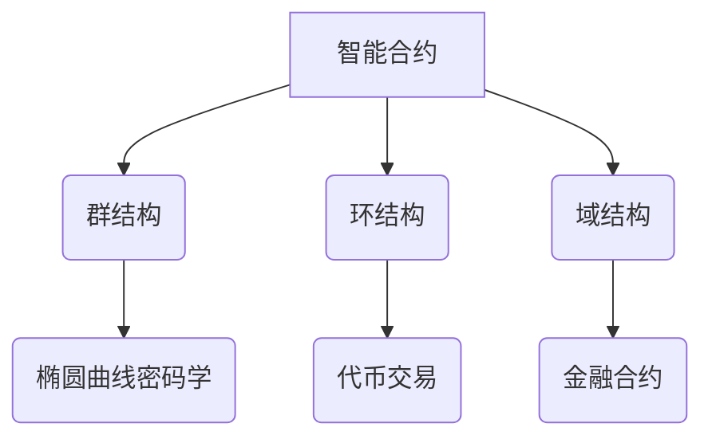

在这个示例中，智能合约通过代数结构来实现不同的功能，如加密保护、代币交易和金融合约。这些代数结构确保了智能合约的数学基础，使其能够在区块链上安全、高效地运行。

#### 博弈论在智能合约中的运用

博弈论是一种研究决策和策略的数学工具，广泛应用于经济学、政治学和计算机科学等领域。在智能合约中，博弈论模型可以用于设计自动化的博弈机制，确保各方在合约执行过程中的利益平衡。

1. **博弈模型**：博弈论模型可以用于设计去中心化金融（DeFi）应用中的自动交易策略和对冲策略。例如，在交易池（AMM）中，博弈论模型可以用于平衡供需关系，确保市场的稳定。博弈模型通过定义参与者和策略空间，分析各方在不同策略下的收益和风险，从而设计出最优的博弈策略。

2. **纳什均衡**：纳什均衡是博弈论中的一个核心概念，指在博弈中所有参与者策略组合的一个平衡点，在此点上，任何参与者改变策略都不会导致整体收益增加。在智能合约中，纳什均衡可以用于确保合约执行的公平性和稳定性。例如，在代币分配机制中，通过纳什均衡可以确保代币分配的合理性和参与者的积极性。

以下是一个博弈论在智能合约中的应用示例：

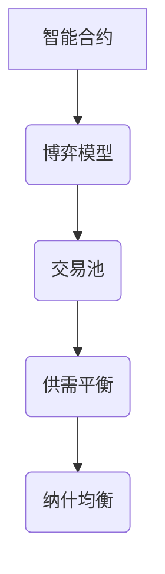

在这个示例中，智能合约通过博弈模型来实现交易池的供需平衡，确保市场的稳定运行。博弈模型通过分析参与者的策略和收益，设计出纳什均衡策略，从而实现自动化的博弈机制。

#### 数学模型设计示例

为了更好地理解数学模型在智能合约中的应用，以下是一个数学模型设计示例：

**示例**：设计一个基于博弈论的自动交易策略智能合约。

1. **问题定义**：设计一个去中心化交易平台，自动调整买卖价格，以平衡市场的供需。

2. **模型设计**：

   - **参与者**：买家、卖家和智能合约。
   - **策略空间**：买家和卖家的价格策略。
   - **收益函数**：定义买家和卖家在不同价格下的收益。
   - **均衡策略**：通过博弈论分析，找到平衡市场的最优价格。

3. **模型实现**：

   ```solidity
   // SPDX-License-Identifier: MIT
   pragma solidity ^0.8.0;

   contract AutoTrading {
       // 定义买家和卖家的价格策略
       mapping(address => uint256) buyerStrategy;
       mapping(address => uint256) sellerStrategy;

       // 定义收益函数
       function buyerBenefit(uint256 price) external view returns (uint256) {
           // 买家收益计算
           return /* ... */;
       }

       function sellerBenefit(uint256 price) external view returns (uint256) {
           // 卖家收益计算
           return /* ... */;
       }

       // 寻找纳什均衡价格
       function findNashEquilibrium() public {
           uint256 optimalPrice = /* ... */;
           // 自动调整买卖价格
           buyerStrategy[msg.sender()] = optimalPrice;
           sellerStrategy[msg.sender()] = optimalPrice;
       }
   }
   ```

在这个示例中，智能合约通过博弈论模型自动调整买卖价格，以实现市场的供需平衡。买家和卖家可以根据自己的收益函数和智能合约的计算结果，调整价格策略，从而达到纳什均衡。

综上所述，数学模型在智能合约中的应用是构建去中心化应用的关键。通过代数结构和博弈论等数学工具，智能合约可以实现复杂的逻辑和自动化的执行，从而提高系统的安全性和效率。随着区块链技术的发展，数学模型在智能合约中的应用将越来越广泛，为去中心化应用提供更加丰富和灵活的解决方案。

### 4.3 智能合约中的数学模型设计

智能合约中的数学模型设计是确保合约逻辑正确性和安全性不可或缺的一环。通过合理的数学模型设计，智能合约可以实现复杂的业务逻辑，确保各方的权益得到保障。以下将详细探讨几种常见的数学模型设计，以及如何将这些模型应用于智能合约中。

#### 公共知识证明模型

公共知识证明（Common Knowledge Proof）模型在智能合约中用于确保多方之间的共识。这种模型利用数学方法证明某个事实是所有参与者共同知晓的，从而防止欺骗行为。

1. **模型设计**：

   - **参与者**：智能合约中的多个参与者。
   - **知识证明**：参与者需要提供证明，证明他们共同知晓某个事实。
   - **逻辑关系**：通过逻辑推理，确保参与者之间的共识。

2. **应用示例**：

   假设一个智能合约用于管理多方资金的分配，每个参与者都需要提交资金，并且只有当所有参与者提交资金后，智能合约才会执行分配操作。

   ```solidity
   // SPDX-License-Identifier: MIT
   pragma solidity ^0.8.0;

   contract MultiSigWallet {
       address[] public participants;
       mapping(address => uint256) public balances;

       // 定义提交资金的函数
       function submitFunds() public payable {
           require(!isParticipant(msg.sender), "You have already submitted funds.");
           participants.push(msg.sender);
           balances[msg.sender()] += msg.value;
       }

       // 定义分配资金的函数
       function allocateFunds(uint256 totalFunds) public {
           require(totalFunds <= getSumOfBalances(), "Insufficient total funds.");
           require(isCommonKnowledge(totalFunds), "Not all participants have submitted funds.");
           // 分配资金逻辑
       }

       // 判断是否所有参与者已提交资金
       function isCommonKnowledge(uint256 totalFunds) public view returns (bool) {
           bool allSubmitted = true;
           for (uint256 i = 0; i < participants.length; i++) {
               if (balances[participants[i]] < totalFunds) {
                   allSubmitted = false;
                   break;
               }
           }
           return allSubmitted;
       }

       // 计算总资金
       function getSumOfBalances() public view returns (uint256) {
           uint256 sum = 0;
           for (uint256 i = 0; i < participants.length; i++) {
               sum += balances[participants[i]];
           }
           return sum;
       }
   }
   ```

在这个示例中，智能合约通过公共知识证明模型确保所有参与者必须提交足够的资金后，才能执行资金分配操作，从而防止个别参与者作弊。

#### 贝叶斯网络模型

贝叶斯网络模型是一种用于表示和分析不确定性和因果关系的数学工具。在智能合约中，贝叶斯网络模型可以用于风险管理和决策支持。

1. **模型设计**：

   - **节点**：表示智能合约中的事件或变量。
   - **边**：表示节点之间的因果关系。
   - **概率分布**：表示每个节点的概率分布。

2. **应用示例**：

   假设一个智能合约用于管理保险业务，需要根据投保人的风险等级进行保费计算。

   ```solidity
   // SPDX-License-Identifier: MIT
   pragma solidity ^0.8.0;

   contract InsurancePolicy {
       // 定义风险等级
       enum RiskLevel { Low, Medium, High }
       RiskLevel public riskLevel;

       // 定义贝叶斯网络参数
       mapping(RiskLevel => uint256) public premiums;

       // 定义投保函数
       function purchasePolicy(RiskLevel _riskLevel) public payable {
           riskLevel = _riskLevel;
           require(premiums[_riskLevel] > 0, "Invalid risk level.");
           // 计算保费
           uint256 premium = calculatePremium(riskLevel);
           require(msg.value >= premium, "Insufficient payment.");
           // 收费和记录
           payable(owner()).transfer(premium);
       }

       // 计算保费
       function calculatePremium(RiskLevel _riskLevel) public view returns (uint256) {
           // 根据贝叶斯网络计算保费
           return premiums[_riskLevel];
       }
   }
   ```

在这个示例中，智能合约通过贝叶斯网络模型根据投保人的风险等级计算保费，确保保费计算的科学性和公平性。

#### 马尔可夫决策过程模型

马尔可夫决策过程（MDP）模型用于表示在不确定环境中做出最优决策的过程。在智能合约中，MDP模型可以用于自动化决策和风险管理。

1. **模型设计**：

   - **状态**：智能合约执行过程中的不同状态。
   - **动作**：智能合约可以采取的不同动作。
   - **奖励**：采取特定动作后获得的奖励。
   - **状态转移概率**：从当前状态转移到下一个状态的概率。

2. **应用示例**：

   假设一个智能合约用于管理自动化投资组合，需要根据市场情况调整投资策略。

   ```solidity
   // SPDX-License-Identifier: MIT
   pragma solidity ^0.8.0;

   contract InvestmentPortfolio {
       // 定义状态和动作
       enum State { Stable, Rising, Falling }
       enum Action { Hold, Buy, Sell }

       // 定义奖励和状态转移概率
       mapping(State => mapping(Action => uint256)) public rewards;
       mapping(State => mapping(Action => uint256)) public transitionProbabilities;

       // 定义决策函数
       function makeDecision(State currentState) public {
           Action bestAction = determineBestAction(currentState);
           // 执行决策
           executeAction(bestAction);
       }

       // 确定最佳动作
       function determineBestAction(State currentState) public view returns (Action) {
           Action bestAction = Action(0);
           uint256 maxReward = 0;
           for (Action action = Action(1); action <= Action(3); action++) {
               uint256 potentialReward = rewards[currentState][action];
               for (State nextState = State(1); nextState <= State(3); nextState++) {
                   potentialReward *= transitionProbabilities[currentState][nextState];
               }
               if (potentialReward > maxReward) {
                   maxReward = potentialReward;
                   bestAction = action;
               }
           }
           return bestAction;
       }

       // 执行动作
       function executeAction(Action action) public {
           // 根据动作执行相应的操作
           if (action == Action.Hold) {
               // 保持当前状态
           } else if (action == Action.Buy) {
               // 买入资产
           } else if (action == Action.Sell) {
               // 卖出资产
           }
       }
   }
   ```

在这个示例中，智能合约通过MDP模型根据当前市场状态和转移概率，自动选择最佳投资策略，从而最大化投资回报。

#### 计算几何模型

计算几何模型用于处理空间中的点和几何形状，在智能合约中可以用于处理空间数据和相关计算。

1. **模型设计**：

   - **点**：表示空间中的位置。
   - **多边形**：表示空间中的几何形状。
   - **计算方法**：如距离计算、面积计算等。

2. **应用示例**：

   假设一个智能合约用于管理地理空间数据，如土地交易。

   ```solidity
   // SPDX-License-Identifier: MIT
   pragma solidity ^0.8.0;

   contract LandRegistry {
       // 定义点结构
       struct Point {
           uint256 x;
           uint256 y;
       }

       // 定义多边形结构
       struct Polygon {
           Point[] vertices;
       }

       // 定义土地交易函数
       function registerLandOwnership(Polygon land, address owner) public {
           require(landIs Valid(land), "Invalid land.");
           // 记录土地所有权
           landOwners[keccak256(abi.encodePacked(land))] = owner;
       }

       // 判断土地是否有效
       function landIs Valid(Polygon land) public view returns (bool) {
           // 计算多边形的面积
           uint256 area = calculatePolygonArea(land);
           return area > 0;
       }

       // 计算多边形面积
       function calculatePolygonArea(Polygon polygon) public view returns (uint256) {
           // 使用计算几何方法计算面积
           // ...
           return /* 面积 */;
       }

       // 定义土地所有权映射
       mapping(bytes32 => address) public landOwners;
   }
   ```

在这个示例中，智能合约通过计算几何模型验证土地的有效性，并记录土地所有权，确保交易的准确性和合法性。

#### 综合模型设计

智能合约中的数学模型设计通常是多种模型的综合应用。以下是一个综合模型设计示例：

1. **问题定义**：智能合约用于管理多方资金的分配，同时要考虑到风险管理和决策支持。
2. **模型设计**：

   - **公共知识证明模型**：确保所有参与者必须提交足够的资金。
   - **贝叶斯网络模型**：用于风险管理，评估各方提交资金的风险等级。
   - **马尔可夫决策过程模型**：根据风险等级和当前市场情况，选择最优的资金分配策略。
   - **计算几何模型**：用于验证土地交易中土地的有效性。

   ```solidity
   // SPDX-License-Identifier: MIT
   pragma solidity ^0.8.0;

   contract SmartAllocation {
       // 引入其他模型
       import "./MultiSigWallet.sol";
       import "./InsurancePolicy.sol";
       import "./InvestmentPortfolio.sol";
       import "./LandRegistry.sol";

       // 定义变量
       MultiSigWallet public multiSig;
       InsurancePolicy public insurance;
       InvestmentPortfolio public investment;
       LandRegistry public landRegistry;

       // 构造函数
       constructor(address[] memory participants) {
           multiSig = MultiSigWallet(participants);
           insurance = InsurancePolicy();
           investment = InvestmentPortfolio();
           landRegistry = LandRegistry();
       }

       // 管理资金分配函数
       function manageFunds() public {
           // 通过公共知识证明确保所有参与者提交资金
           require(multiSig.isCommonKnowledge(), "Not all participants have submitted funds.");
           
           // 通过贝叶斯网络评估风险等级
           RiskLevel riskLevel = insurance.evaluateRiskLevel();

           // 通过马尔可夫决策过程选择最佳资金分配策略
           Action allocationAction = investment.determineBestAction(riskLevel);

           // 执行分配策略
           investment.executeAction(allocationAction);

           // 验证土地交易
           require(landRegistry.landsAreValid(), "Invalid land transaction.");
       }
   }
   ```

在这个综合模型中，智能合约通过多种数学模型综合管理资金分配、风险和决策，确保整体操作的科学性和安全性。

通过上述数学模型的设计和应用，智能合约可以实现复杂业务逻辑的管理，确保各方权益的保障，从而推动去中心化应用的发展。

### 5.1 数学优化方法在区块链中的应用

在区块链系统中，数学优化方法扮演着至关重要的角色，它们被广泛应用于提升网络性能、优化交易处理效率和增强系统的安全性。以下将探讨几种常见的数学优化方法及其在区块链中的具体应用。

#### 优化算法在区块链网络优化中的应用

区块链网络优化主要关注提高网络的交易处理能力、降低延迟和提升数据传输效率。以下是一些常见的优化算法：

1. **分布式哈希表**：分布式哈希表（DHT）是一种用于数据分布和检索的算法，可以大幅提高区块链网络的交易处理速度。DHT通过将数据分散存储在多个节点上，提高了数据访问的效率。例如，以太坊的Plasma扩展方案使用了DHT来优化状态数据的检索和处理。

2. **排序算法**：排序算法在区块链中用于处理交易数据的排序。在区块链系统中，交易需要按照时间戳顺序进行排序，以确保交易的历史记录正确。改进排序算法，如快速排序和归并排序，可以显著减少交易排序的时间，提高网络处理效率。

3. **分布式一致性算法**：分布式一致性算法如Raft和Paxos，用于在分布式系统中保证数据一致性。通过这些算法，区块链网络可以更高效地处理大量数据，同时确保数据一致性，从而提高系统的稳定性和可靠性。

#### 数学模型在区块链交易处理效率优化中的应用

区块链交易处理效率的优化涉及到对交易流程的优化和资源的合理分配。以下是一些具体的数学模型和应用：

1. **贪心算法**：在交易排序过程中，贪心算法可以用于优化交易排序，提高交易确认速度。贪心算法通过选择当前最优交易进行排序，从而确保交易池中的交易能够更快地被确认。

2. **动态调度算法**：动态调度算法用于优化区块链节点的资源分配。通过实时分析节点的负载情况，动态调度算法可以调整交易处理优先级，确保关键交易能够得到及时处理。

3. **概率模型**：概率模型如马尔可夫链和蒙特卡罗模拟，可以用于预测交易延迟和系统负载，从而优化交易处理策略。这些模型可以帮助区块链系统在高峰期时分配更多资源，以应对高负载场景。

以下是一个简单的交易处理优化示例：

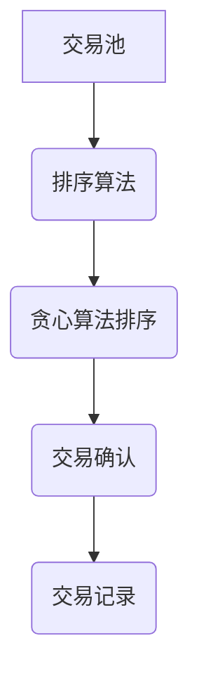

在这个示例中，交易池中的交易首先通过排序算法进行排序，然后应用贪心算法优化排序结果，以确保交易能够更快地被确认和记录。

#### 数学模型在区块链网络安全性中的应用

数学模型在区块链网络的安全性方面也有重要应用，以下介绍几种常用的数学模型：

1. **密码学模型**：密码学模型如公钥密码学和哈希函数，用于保护区块链网络的数据完整性和隐私。通过密码学模型，区块链系统能够确保数据的不可篡改性，防止数据被恶意篡改。

2. **零知识证明**：零知识证明（ZKP）是一种用于增强区块链系统隐私保护的数学模型。ZKP允许交易方在不透露具体交易信息的情况下，证明交易确实发生了，从而保护交易隐私。

3. **博弈论模型**：博弈论模型用于分析区块链网络中的攻击行为和防御策略。通过博弈论模型，可以预测网络攻击的可能性和攻击者的策略，从而设计出更有效的防御措施。

以下是一个简单的零知识证明模型应用示例：

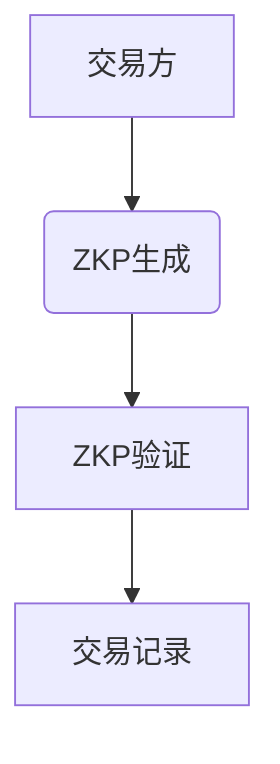

在这个示例中，交易方使用零知识证明生成证明，验证方通过验证证明确认交易，从而保护交易隐私。

通过上述数学优化方法和模型，区块链系统可以实现更高的交易处理效率、更好的网络性能和更高的安全性。这些数学工具不仅提升了区块链系统的运行效率，也为构建更高效、更安全的区块链应用提供了坚实基础。

### 5.2 数学模型在区块链网络安全性中的应用

区块链网络的安全性是确保系统稳定运行和用户数据隐私的关键因素。数学模型在区块链网络安全性中发挥着重要作用，以下将探讨数学模型在检测区块链网络攻击中的应用，以及如何通过数学模型预测区块链网络行为。

#### 数学模型在检测区块链网络攻击中的应用

1. **统计分析模型**：统计分析模型用于检测区块链网络中的异常行为。通过对区块链网络中的数据进行分析，如交易频率、交易金额、交易节点等，统计分析模型可以识别出潜在的攻击行为。例如，异常交易检测模型可以通过检测交易数据中的异常值，来识别可能的拒绝服务（DDoS）攻击或恶意交易。

2. **贝叶斯网络模型**：贝叶斯网络模型是一种用于表示和推理不确定性和因果关系的数学工具。在区块链网络安全性中，贝叶斯网络模型可以用于构建攻击行为预测模型。通过分析历史攻击数据，贝叶斯网络模型可以计算出每个攻击行为的概率，从而提高攻击检测的准确性。

以下是一个贝叶斯网络模型应用示例：

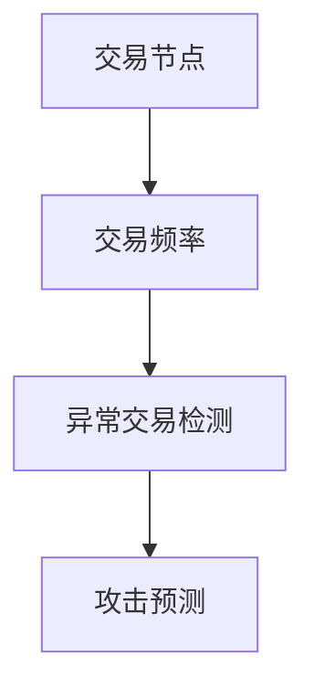

在这个示例中，通过分析交易节点的交易频率，异常交易检测模型可以检测出异常交易行为，贝叶斯网络模型则根据异常交易行为预测可能的攻击类型。

3. **机器学习模型**：机器学习模型，如支持向量机（SVM）、神经网络等，可以用于构建高级攻击检测系统。通过训练大量历史攻击数据，机器学习模型可以自动识别和分类网络中的异常行为，从而提高攻击检测的准确性和效率。

以下是一个机器学习模型应用示例：

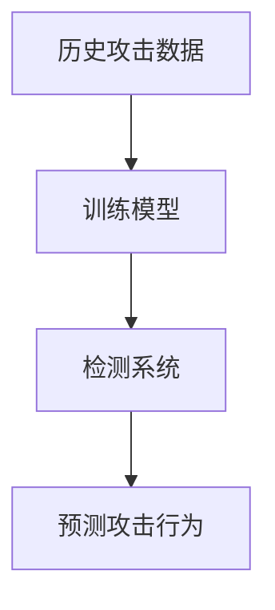

在这个示例中，通过训练历史攻击数据，机器学习模型构建检测系统，可以实时检测和预测网络中的潜在攻击行为。

#### 数学模型在预测区块链网络行为中的应用

1. **时间序列模型**：时间序列模型用于预测区块链网络中的交易量和网络负载。通过分析历史交易数据，时间序列模型可以预测未来的交易量和网络负载，从而帮助区块链系统进行资源分配和性能优化。

以下是一个时间序列模型应用示例：

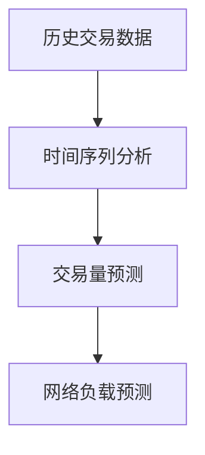

在这个示例中，通过分析历史交易数据，时间序列模型可以预测未来的交易量和网络负载，为区块链系统提供决策支持。

2. **马尔可夫链模型**：马尔可夫链模型用于分析区块链网络中的状态转移行为。通过构建马尔可夫链模型，可以预测网络中的状态变化，从而帮助设计更有效的防御策略。

以下是一个马尔可夫链模型应用示例：

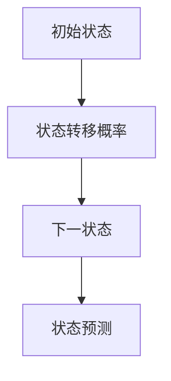

在这个示例中，通过分析状态转移概率，马尔可夫链模型可以预测区块链网络中的状态变化，为网络安全性提供依据。

3. **博弈论模型**：博弈论模型用于分析区块链网络中的攻击与防御策略。通过博弈论模型，可以预测攻击者的策略和防御者的最优反应，从而设计出更有效的防御措施。

以下是一个博弈论模型应用示例：

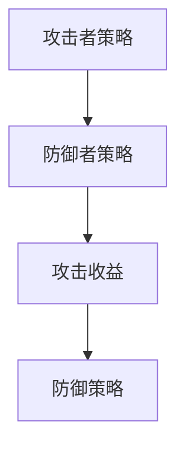

在这个示例中，通过分析攻击者的策略和防御者的反应，博弈论模型可以预测区块链网络中的攻击行为和防御策略，为系统设计提供支持。

通过上述数学模型的应用，区块链系统可以更有效地检测和防御网络攻击，同时预测网络行为，提高系统的安全性和稳定性。这些数学工具为区块链技术的发展提供了坚实的技术基础，促进了区块链技术的广泛应用和创新发展。

### 6.1 案例一：以太坊的数学模型分析

以太坊（Ethereum）是区块链技术中的先驱之一，其数学模型在共识机制、智能合约执行和网络安全性等方面都有着深入的运用。以下将详细分析以太坊中的数学模型，以及其在系统设计和运行中的重要性。

#### 以太坊共识算法的数学模型

以太坊采用的共识算法是权益证明（Proof of Stake, PoS）。PoS算法通过节点持有的代币数量和锁定时间来选择区块的创建者，从而确保系统的一致性和安全性。

1. **权益计算**：在PoS算法中，每个节点的权益（Stake）由其持有的以太币数量（Balance）和锁定时间（Locking Period）决定。权益计算公式如下：

   \[
   \text{Stake} = \text{Balance} \times \text{Locking Period}
   \]

   其中，Balance 表示节点持有的以太币数量，Locking Period 表示以太币被锁定的时长。

2. **随机性选择**：以太坊使用一种称为“随机性函数”的方法来选择区块创建者。该函数通常是基于密码学算法，如SHA-3。通过计算节点的随机性值，以太坊网络能够公平地选择区块创建者。

3. **区块奖励**：在PoS系统中，区块创建者会获得系统生成的代币奖励。区块奖励通常与节点的权益成比例，以确保高权益节点获得更多的奖励，从而激励节点参与共识过程。

#### 以太坊智能合约的数学模型

以太坊智能合约是基于Solidity编程语言编写的，其背后依赖于多种数学模型来确保合约的安全性和正确性。

1. **状态机模型**：智能合约可以看作是一个状态机，每个状态表示合约的某个执行阶段，状态之间的转换由数学公式和逻辑条件定义。状态机模型确保合约按照预定的逻辑顺序执行，防止恶意行为。

2. **代数结构**：在智能合约中，代数结构如群和环被用于实现加密算法和数学运算。例如，椭圆曲线密码学（ECC）在以太坊中用于实现数字签名和加密操作，确保合约数据的完整性和隐私性。

3. **博弈论模型**：在去中心化金融（DeFi）应用中，博弈论模型用于设计自动化的交易策略和对冲策略。博弈论模型通过分析参与者的策略和收益，设计出最优的合约逻辑，确保市场的稳定性和公平性。

#### 数学模型在以太坊系统设计中的应用

1. **权益证明算法**：以太坊的权益证明算法通过数学模型确保了区块链网络的安全性。权益计算和随机性选择的结合，确保了系统中的公平性和安全性。

2. **智能合约执行**：智能合约的执行依赖于复杂的数学运算和逻辑条件。数学模型确保了合约逻辑的正确性和安全性，防止恶意合约对网络造成破坏。

3. **网络安全**：以太坊的网络安全性依赖于密码学模型和加密算法。通过使用复杂的密码学技术，以太坊能够确保数据传输的安全性和隐私性。

#### 案例分析

以太坊的权益证明算法和智能合约模型，确保了系统的稳定运行和安全性。以下是一个简单的权益证明算法示例：

```solidity
// SPDX-License-Identifier: MIT
pragma solidity ^0.8.0;

contract Stake {
    mapping(address => uint256) public stakes;
    mapping(address => uint256) public lockTimes;

    function stakeEther() public payable {
        require(msg.value > 0, "Invalid stake amount.");
        stakes[msg.sender()] += msg.value;
        lockTimes[msg.sender()] = block.number + 365 days; // 锁定365天
    }

    function unlockEther() public {
        require(lockTimes[msg.sender()] <= block.number, "Stake is still locked.");
        payable(msg.sender()).transfer(stakes[msg.sender()]);
        stakes[msg.sender()] = 0;
    }

    function getRandomValidator() public view returns (address) {
        bytes32 rand = keccak256(abi.encodePacked(block.difficulty, block.coinbase));
        return address(uint160(uint256(rand) % stakeholders.length));
    }
}
```

在这个示例中，节点可以通过锁定以太币来参与权益证明，锁定期结束后可以解锁以太币。随机性函数用于选择区块创建者，确保公平性。

综上所述，以太坊的数学模型在系统设计和运行中起到了关键作用。通过权益证明算法和智能合约模型，以太坊确保了系统的安全性、可靠性和去中心化，推动了区块链技术的创新和发展。

### 6.2 案例二：比特币的数学模型分析

比特币（Bitcoin）作为第一个去中心化的加密货币，其成功引起了全球对区块链技术的关注。比特币的数学模型在其区块链结构、交易验证机制和网络安全保障等方面发挥着核心作用。以下将详细分析比特币中的数学模型，以及其在系统设计和运行中的重要性。

#### 比特币的区块链结构

比特币的区块链结构是整个系统的基石。区块链由一系列按时间顺序排列的区块组成，每个区块包含一定数量的交易记录，并通过加密算法与前一个区块连接，形成一条不可篡改的数据链。

1. **区块结构**：比特币区块主要包括以下几个部分：

   - **区块头**：区块头包含版本号、前一区块哈希值、时间戳、随机数、交易哈希值和默克尔树根等。区块头的哈希值用于验证区块的完整性和一致性。
   - **交易数据**：区块中的交易数据包含所有待验证的交易记录。
   - **默克尔树**：默克尔树用于验证交易数据的完整性，默克尔根是默克尔树的根节点哈希值，用于确保交易数据的不可篡改性。

2. **哈希函数**：比特币采用SHA-256哈希函数对区块进行加密，确保每个区块的唯一性和数据完整性。哈希函数的特性是任意输入产生固定长度的输出，任何微小的变化都会导致哈希值巨大的变化，从而保障数据不可篡改性。

#### 交易验证机制

比特币的交易验证机制是确保区块链网络中交易合法性的关键步骤。交易验证过程涉及以下数学模型：

1. **数字签名**：比特币使用椭圆曲线数字签名算法（ECDSA）确保交易数据的合法性和不可抵赖性。每个用户拥有一个公钥和一个私钥，私钥用于生成签名，公钥用于验证签名。

2. **工作量证明（PoW）**：比特币的PoW机制通过计算一个满足特定条件的哈希值来确保区块链网络的安全性。节点需要找到满足以下条件的哈希值：

   \[
   \text{hash}(n) \leq \text{difficulty}
   \]

   其中，hash(n)是区块头哈希值，difficulty是目标难度。找到满足条件的哈希值的过程称为“挖矿”，成功的节点将获得比特币奖励。

3. **Merkle树**：比特币使用Merkle树来验证交易数据的完整性。每个区块包含一个Merkle树根，通过Merkle树根可以验证交易数据的完整性。Merkle树通过将交易数据进行哈希处理，生成一系列哈希值，最终生成Merkle树根。

以下是一个比特币交易验证过程的示例：

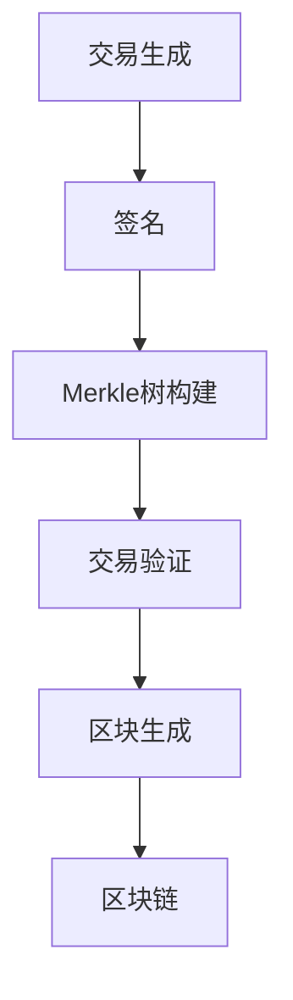

在这个示例中，交易首先由用户生成，并使用私钥生成签名。交易随后被包含在区块中，并构建Merkle树以验证交易数据。经过网络节点验证，交易将被添加到区块链中。

#### 数学模型在比特币网络安全保障中的应用

比特币的网络安全保障依赖于复杂的数学模型，如密码学算法和博弈论模型：

1. **密码学算法**：比特币使用椭圆曲线密码学（ECC）和非对称加密算法（RSA）来确保用户隐私和交易安全。这些算法确保了公钥和私钥的保密性，防止交易数据被篡改。

2. **博弈论模型**：比特币的PoW机制本质上是一个博弈过程，挖矿节点通过竞争寻找满足条件的哈希值，从而确保区块链网络的安全性。博弈论模型用于分析节点行为，预测网络攻击的可能性，设计有效的防御策略。

3. **去中心化机制**：比特币的去中心化结构通过大量节点参与网络维护，确保了系统的安全性。数学模型如分布式一致性算法和图论模型，用于分析节点之间的交互和网络的稳定性，提高系统的抗攻击能力。

#### 案例分析

比特币的数学模型在区块链结构、交易验证和网络安全保障中起到了关键作用。以下是一个比特币交易验证和区块生成的示例：

```solidity
// SPDX-License-Identifier: MIT
pragma solidity ^0.8.0;

contract Bitcoin {
    // 定义交易结构
    struct Transaction {
        address sender;
        address recipient;
        uint256 amount;
        bytes32 signature;
    }

    // 定义区块结构
    struct Block {
        bytes32 previousHash;
        bytes32 merkleRoot;
        bytes32 nonce;
        uint256 timestamp;
        Transaction[] transactions;
    }

    // 定义区块链
    Block[] public blockchain;

    // 添加交易到区块
    function addTransaction(address sender, address recipient, uint256 amount) public {
        bytes32 transactionHash = keccak256(abi.encode(sender, recipient, amount));
        Transaction memory newTransaction = Transaction(sender, recipient, amount, transactionHash);
        blockchain.push(newTransaction);
    }

    // 挖矿生成区块
    function mineBlock(uint256 difficulty) public {
        bytes32 target = bytes32(uint256(-1) >> (256 - difficulty));
        bytes32 hash;
        do {
            blockchain.push(Block({
                previousHash: blockchain[blockchain.length - 1].hash(),
                merkleRoot: merkleTreeRoot(),
                nonce: 0,
                timestamp: block.timestamp,
                transactions: blockchain[blockchain.length - 1].transactions
            }));
            hash = blockchain[blockchain.length - 1].hash();
        } while (hash > target);
        // 给矿工奖励比特币
        payable(msg.sender).transfer(12.5 * 10**8); // 比特币奖励
    }

    // 计算区块哈希值
    function hash(Block memory block) public pure returns (bytes32) {
        return keccak256(abi.encode(block.previousHash, block.merkleRoot, block.nonce, block.timestamp));
    }

    // 构建默克尔树根
    function merkleTreeRoot() public pure {
        // 默克尔树构建逻辑
        // ...
        return /* 默克尔树根 */;
    }
}
```

在这个示例中，比特币合约通过添加交易到区块链和挖矿生成区块来维护区块链结构。交易通过默克尔树验证其完整性，挖矿过程通过计算满足条件的哈希值来确保区块链网络的安全性。

综上所述，比特币的数学模型在系统设计和运行中起到了关键作用。通过区块链结构、交易验证和网络安全保障等数学模型，比特币确保了去中心化、安全性和不可篡改性，推动了区块链技术的创新和发展。

### 6.3 案例三：EOS的数学模型分析

EOS（Enterprise Operating System）是一个高度可扩展的区块链平台，旨在提供企业级应用解决方案。EOS采用了多种数学模型，以实现高性能、去中心化和高安全性。以下将详细分析EOS中的数学模型，包括其委托权益证明（Delegated Proof of Stake, DPoS）算法和网络分片机制。

#### EOS的委托权益证明（DPoS）算法

EOS采用的DPoS算法是一种改进的PoS机制，通过选举出一定数量的代理节点来维护区块链网络。以下是DPoS算法的核心数学模型：

1. **权益计算**：EOS节点根据其持有的EOS代币数量和锁定时间计算权益。权益是节点参与区块生产的关键指标。权益计算公式如下：

   \[
   \text{Stake} = \text{Token Balance} \times \text{Lock Time}
   \]

   其中，Token Balance表示节点持有的EOS代币数量，Lock Time表示代币被锁定的时长。

2. **代理节点选举**：EOS网络通过一种称为“超级节点选举”的过程来选择代理节点。每个EOS持币者都可以投票支持他们信任的超级节点候选人。选举过程基于权益分配，权益越高的候选人被选中的概率越大。EOS使用一个称为“块生产时间表”的数据结构来安排代理节点的轮换。

3. **区块生产**：当选出的代理节点生成新区块时，它们将验证交易并维护区块链网络。每个代理节点有固定的时间窗口来生成区块，这确保了网络的高效和一致性。

以下是一个简化的EOS DPoS选举模型：

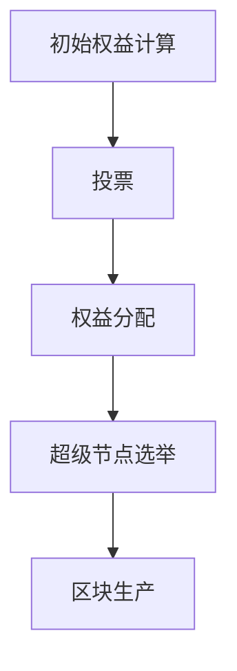

在这个示例中，初始权益计算确定每个EOS持币者的权益，投票过程决定哪些候选人被选为超级节点，权益分配确保选举的公平性，超级节点选举选出代理节点，最后代理节点生成区块。

#### EOS的网络分片机制

EOS的网络分片机制是其高性能的关键因素。网络分片将区块链网络划分为多个逻辑上独立的子网络，每个子网络称为“分片”，从而实现并行处理，提高系统整体性能。以下是EOS网络分片机制的数学模型：

1. **分片划分**：EOS将区块链网络划分为多个分片，每个分片拥有自己的区块生产者和验证节点。分片的数量可以根据网络需求动态调整。

2. **负载均衡**：EOS使用一种基于数学模型的负载均衡算法，根据分片中的交易数量和节点性能动态调整分片的交易处理能力。负载均衡确保每个分片都能高效处理交易，防止网络拥堵。

3. **分片通信**：EOS中的分片通过特定的通信协议进行交互，以确保分片之间的数据一致性。数学模型如分布式一致性算法（DCA）和分布式锁定协议（DLA）被用于确保分片通信的可靠性。

以下是一个EOS分片机制的简化解构图：

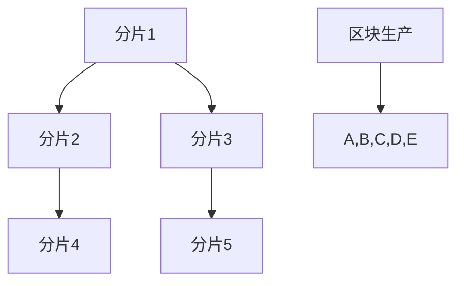

在这个示例中，EOS网络被划分为多个分片（A、B、C、D、E），每个分片有自己的区块生产者和验证节点。区块生产过程并行进行，确保高效处理交易。

#### 数学模型在EOS系统设计中的应用

1. **权益证明算法**：EOS的DPoS算法通过数学模型确保了网络的安全性和去中心化。权益计算和代理节点选举模型保证了网络中的公平性和有效性。

2. **网络分片机制**：EOS的网络分片机制通过数学模型实现了高性能和高可扩展性。分片划分和负载均衡模型确保了系统在处理大量交易时的稳定性和效率。

3. **分布式一致性算法**：EOS的分布式一致性算法用于确保分片之间的数据一致性，保障系统的整体稳定性。

#### 案例分析

以下是一个简化的EOS DPoS选举模型的示例代码：

```solidity
// SPDX-License-Identifier: MIT
pragma solidity ^0.8.0;

contract EOS {
    // 定义超级节点结构
    struct SuperNode {
        address nodeAddress;
        uint256 stake;
        uint256 lockedTime;
    }

    // 定义超级节点列表
    SuperNode[] public superNodes;

    // 计算权益
    function calculateStake(address nodeAddress, uint256 lockedTime) public view returns (uint256) {
        uint256 tokenBalance = getTokenBalance(nodeAddress);
        return tokenBalance * lockedTime;
    }

    // 投票选举超级节点
    function voteForSuperNode(address nodeAddress, uint256 lockedTime) public {
        require(getTokenBalance(msg.sender) > 0, "Invalid voter.");
        superNodes.push(SuperNode(nodeAddress, calculateStake(nodeAddress, lockedTime), lockedTime));
        sortSuperNodesByStake();
    }

    // 根据权益排序超级节点
    function sortSuperNodesByStake() public {
        // 排序逻辑
        // ...
    }

    // 生成区块
    function generateBlock() public {
        // 根据选举结果选择超级节点生成区块
        // ...
    }
}
```

在这个示例中，EOS合约通过计算权益、投票选举超级节点和生成区块，实现了DPoS算法的基本功能。

综上所述，EOS的数学模型在系统设计和运行中起到了关键作用。通过DPoS算法和分片机制，EOS实现了高性能、去中心化和高安全性，为区块链技术的应用提供了强大支持。

### 7.1 区块链与量子计算的融合

区块链与量子计算的融合是一个前沿研究方向，其潜力在于利用量子计算能力提升区块链的安全性、效率和扩展性。以下将探讨量子计算的基本概念、量子计算在区块链安全中的应用，以及区块链与量子计算的未来趋势。

#### 量子计算的基本概念

量子计算是一种基于量子力学原理的计算方式，利用量子位（qubits）代替传统计算机中的比特（bits）。量子位可以同时处于多种状态，这使得量子计算机在处理某些特定问题时具有显著优势。

1. **量子叠加态**：量子位可以处于叠加态，即同时表示多种状态。例如，一个量子位可以同时表示0和1，这种叠加态的利用使得量子计算机可以并行处理多个计算任务。

2. **量子纠缠**：量子位之间可以存在量子纠缠，即两个量子位的状态相互关联。即使量子位相隔很远，它们的状态也会相互影响。这种特性可以用于实现高度安全的量子密钥分发（Quantum Key Distribution, QKD）。

3. **量子门**：量子门是操作量子位的数学操作，类似于传统计算机中的逻辑门。通过特定的量子门操作，量子计算机可以实现复杂的计算任务。

#### 量子计算在区块链安全中的应用

1. **量子密钥分发（QKD）**：QKD是一种利用量子纠缠和量子叠加态实现安全通信的技术。在区块链中，QKD可以用于生成和分发密钥，确保通信的安全性和隐私性。通过QKD，区块链网络可以实现更高级别的加密安全。

2. **量子算法优化**：量子算法如Shor算法和Grover算法，可以大幅提高密码学算法的破解速度。然而，反过来，量子计算也可以用于设计和实现更安全的加密算法，如基于量子纠错的量子加密算法，提高区块链系统的抗攻击能力。

3. **量子签名**：量子签名是一种基于量子计算的数字签名技术，可以提供更高的安全性和效率。量子签名可以确保交易数据的不可篡改性和身份验证，同时减少了传统签名算法的资源消耗。

以下是一个量子密钥分发在区块链中应用的简例：

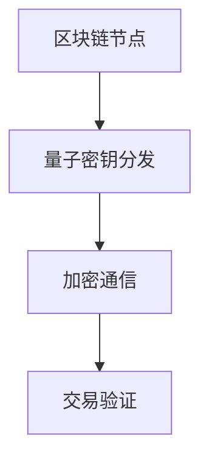

在这个示例中，区块链节点通过量子密钥分发生成安全密钥，用于加密通信和交易验证，确保数据传输和存储的安全。

#### 区块链与量子计算的未来趋势

区块链与量子计算的融合有望在以下方面带来变革：

1. **量子安全区块链**：随着量子计算的发展，构建量子安全区块链成为趋势。量子安全区块链能够抵御未来量子计算攻击，确保长期安全性。

2. **量子计算优化**：区块链网络可以利用量子计算优化加密算法和共识机制，提高系统的效率和扩展性。例如，基于量子计算的优化算法可以减少交易确认时间和提高交易处理能力。

3. **跨链互操作性**：量子计算可以用于实现不同区块链网络之间的互操作性，促进跨链价值和数据的交换。

4. **量子智能合约**：未来的智能合约可能会利用量子计算的能力，实现更复杂和高效的合约逻辑，提高区块链应用的灵活性和创新性。

综上所述，区块链与量子计算的融合展示了巨大的潜力，不仅在安全性方面提供新的解决方案，也在提升效率和扩展性方面带来了创新机会。随着技术的不断发展，区块链与量子计算的结合将为去中心化应用带来新的发展方向和无限可能。

### 7.2 区块链与人工智能的融合

区块链与人工智能（AI）的融合是当前技术发展的热点，两者结合能够带来诸多创新和应用。以下将探讨人工智能的基本概念，AI在区块链优化中的应用，以及区块链与AI融合的前沿方向。

#### 人工智能的基本概念

人工智能是指通过计算机程序模拟人类智能行为的技术。AI涵盖了多个子领域，如机器学习、深度学习、自然语言处理和计算机视觉等。以下是一些核心概念：

1. **机器学习**：机器学习是一种通过数据训练模型，使其能够自主学习和改进的技术。常见的机器学习算法包括决策树、支持向量机和神经网络等。
   
2. **深度学习**：深度学习是一种基于多层神经网络的学习方法，可以自动提取数据中的特征，常用于图像识别、语音识别和自然语言处理等领域。

3. **强化学习**：强化学习是一种通过试错学习策略，最大化长期奖励的算法。它通过在动态环境中不断调整策略，实现优化目标。

4. **自然语言处理**：自然语言处理（NLP）是使计算机能够理解、生成和处理人类语言的技术。NLP在智能客服、机器翻译和文本分析等方面有广泛应用。

#### AI在区块链优化中的应用

人工智能在区块链优化中的应用主要体现在以下几个方面：

1. **智能合约自动化**：AI可以自动化智能合约的执行，减少人工干预，提高交易处理效率。通过机器学习和深度学习算法，智能合约可以根据历史交易数据自动调整执行策略，优化交易流程。

2. **异常检测与风险管理**：AI可以用于检测区块链网络中的异常行为和潜在风险。机器学习模型可以分析交易数据，识别异常交易模式，提高区块链的安全性和可靠性。

3. **共识算法优化**：AI可以优化区块链的共识算法，提高网络效率和稳定性。通过强化学习，AI可以在不同的网络条件下调整共识策略，优化资源分配，提高交易处理速度。

4. **数据分析和预测**：AI可以分析区块链上的海量数据，提取有价值的信息，用于市场分析和预测。例如，AI可以预测代币价格波动，帮助投资者做出更明智的决策。

以下是一个AI在区块链智能合约中的应用示例：

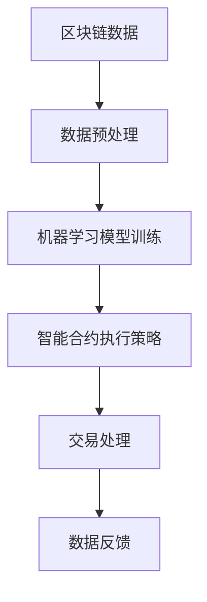

在这个示例中，区块链数据经过预处理后，通过机器学习模型训练，生成智能合约执行策略，自动调整交易处理流程，提高效率。

#### 区块链与AI融合的前沿方向

区块链与AI的融合前景广阔，以下是一些前沿研究方向：

1. **AI驱动的区块链治理**：AI可以用于优化区块链治理机制，提高决策透明度和效率。通过智能合约和AI算法，区块链网络可以实现自动化的决策和治理。

2. **跨链互操作性**：AI可以促进不同区块链之间的互操作性，实现跨链数据和价值的交换。通过AI算法，不同区块链网络可以自动发现和连接，提高区块链生态系统的整体效能。

3. **量子AI与区块链**：量子计算与AI的结合有望推动区块链技术的发展。量子AI可以用于解决复杂优化问题，提高区块链网络的效率和安全性。

4. **分布式AI计算**：区块链可以用于实现分布式AI计算，确保AI模型的安全性和隐私性。通过区块链技术，分布式AI计算可以避免中心化的数据集中风险。

综上所述，区块链与人工智能的融合为去中心化应用带来了巨大的创新潜力。随着技术的不断发展，区块链与AI的结合将在更多领域展现其价值，推动数字经济的发展。

### 附录A：数学与区块链相关术语表

为了更好地理解本文中的相关概念，以下提供了一些数学与区块链领域的关键术语及其简要解释：

- **区块链**：一种分布式数据库技术，通过加密和共识算法确保数据的不可篡改性和去中心化。
- **去中心化**：网络中没有中央管理者，所有节点平等参与，没有一个节点能够单独控制整个系统。
- **节点**：区块链网络中的参与者，负责存储数据、验证交易和参与共识过程。
- **加密算法**：用于加密和解密数据的数学算法，如RSA、椭圆曲线密码学等。
- **哈希函数**：将任意长度的输入数据映射为固定长度的输出值的函数，如SHA-256。
- **数字签名**：用于验证消息发送者身份和消息完整性的技术。
- **权益证明（PoS）**：一种共识算法，通过节点的代币数量和锁定时间来选择区块创建者。
- **工作量证明（PoW）**：一种共识算法，通过计算难题来确保节点参与共识。
- **密码学**：研究加密和解密技术的学科，用于保护区块链数据的隐私和安全。
- **图论**：研究图的性质和应用的数学分支，用于分析区块链网络的拓扑结构。
- **信息论**：研究信息传输和处理的一般理论的学科，用于评估网络传输效率和设计隐私保护机制。
- **智能合约**：一种自动执行合约条款的计算机程序，基于区块链技术运行。
- **代币经济学**：研究代币的价值模型、发行机制和分配策略的学科。

通过这些术语的解释，读者可以更好地理解区块链技术中的数学原理和应用。

### 附录B：推荐阅读与资源

#### 推荐书籍

1. **《精通比特币》**（Mastering Bitcoin），安德烈亚斯·M·安东诺普洛斯（Andreas M. Antonopoulos）
   - 本书详细介绍了比特币的工作原理、技术实现及其对金融体系的潜在影响，是了解比特币和区块链技术的经典入门书籍。

2. **《密码学：实用密码学教程》**（Cryptography Engineering: Design Principles and Practical Applications），丹·博尔曼（Dan Boneh）和范·迪维索（van Oorschot）
   - 本书深入探讨了密码学的基本原理和实际应用，对于理解区块链中的加密技术非常有帮助。

3. **《智能合约：设计与实现》**（Smart Contracts: Design and Implementation），乔治·科恩（George Dinotsis）
   - 本书提供了智能合约的全面介绍，包括其设计原则、编程语言和实际案例，适合希望深入了解智能合约技术的读者。

#### 研究论文

1. **“Bitcoin: A Peer-to-Peer Electronic Cash System”**，中本聪（Satoshi Nakamoto）
   - 这是比特币的白皮书，首次提出了区块链的概念，对于理解区块链技术的起源和发展具有重要意义。

2. **“The Byzantine Generals' Problem”**，莱斯利·兰伯特（Leslie Lamport）
   - 本文提出了拜占庭将军问题，为解决分布式系统中的共识问题提供了理论基础。

3. **“Proof of Stake Cryptocurrency System”**，戴维·乔姆斯基（David Chaum）
   - 本文介绍了权益证明（PoS）算法，是PoS共识机制的理论基础。

#### 开源项目

1. **Ethereum**：https://ethereum.org
   - 以太坊是一个开源的区块链平台，支持智能合约和去中心化应用，是区块链技术的重要实现之一。

2. **Bitcoin**：https://github.com/bitcoin
   - 比特币是最早的区块链实现，提供了一个去中心化的加密货币系统。

3. **EOSIO**：https://eos.io
   - EOSIO是一个高性能的区块链平台，旨在支持企业级应用和去中心化应用。

通过这些推荐书籍、论文和开源项目，读者可以进一步深入了解区块链技术和数学模型的应用，提升自己的技术能力和专业知识。

