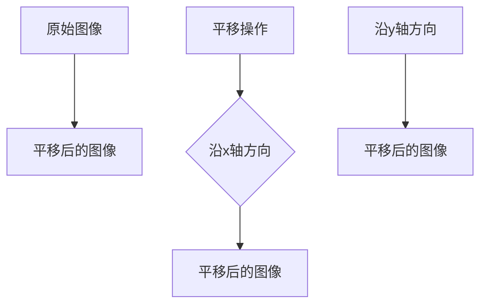
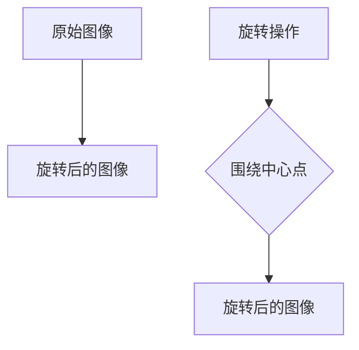
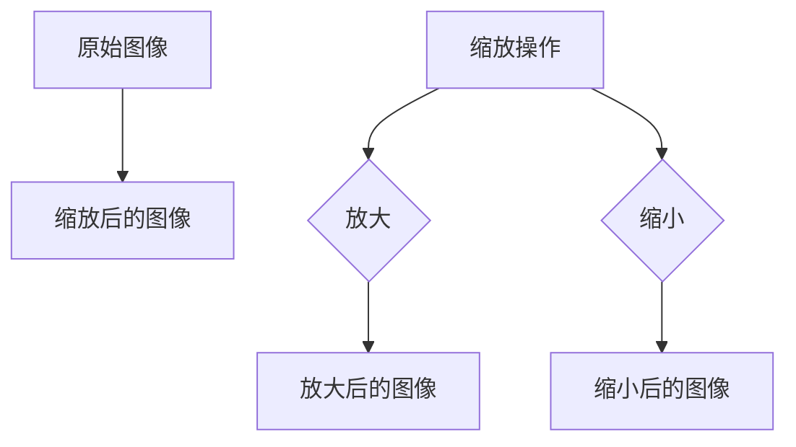
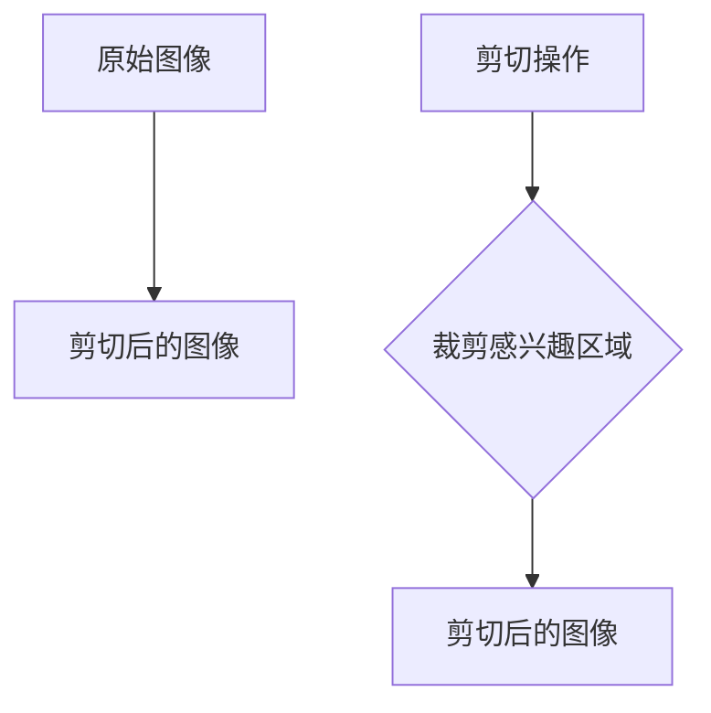
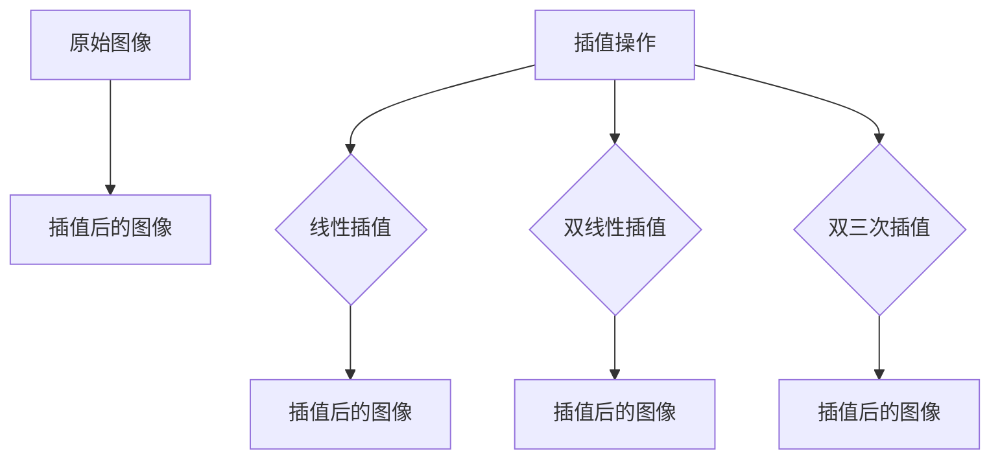
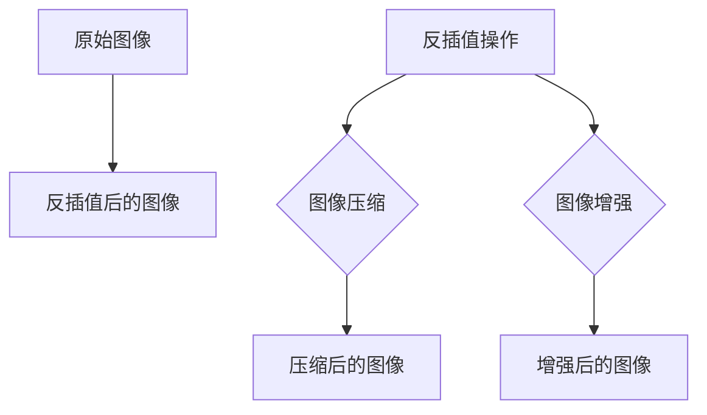
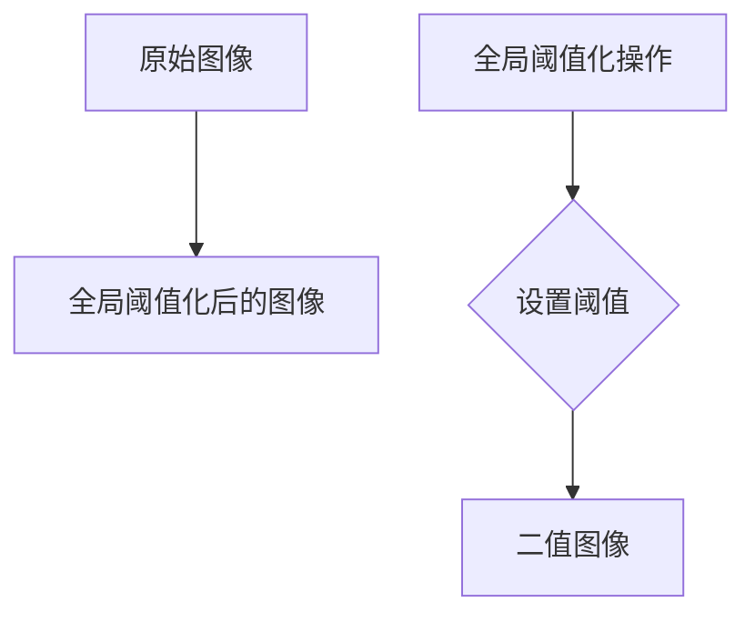
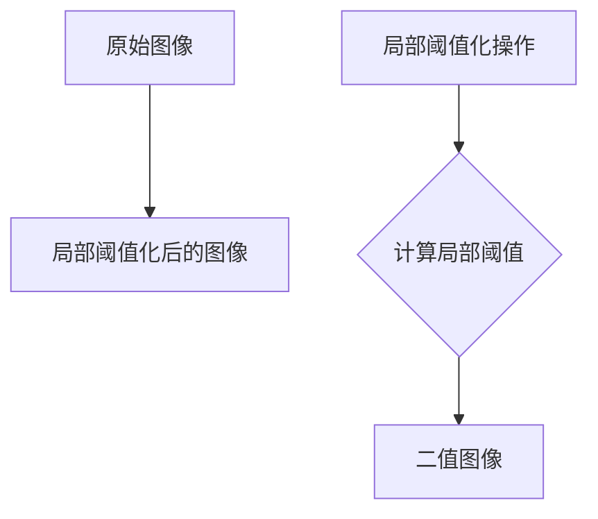

                 

### 引言

#### 书籍目的

《数学与医学影像：医学图像处理的数学方法》旨在为医学图像处理领域的研究者、工程师和医学生提供一本系统、全面、深入的指南。本书的目标是帮助读者理解医学图像处理中的数学方法，掌握关键算法和应用，并通过实战项目提升实践能力。

#### 阅读对象

本书适用于以下几类读者：
- 医学图像处理研究者：希望深入理解医学图像处理中的数学方法和算法原理。
- 医学工程师：需要在实际项目中应用医学图像处理技术。
- 医学生：希望拓展医学知识，了解医学影像技术的最新进展。
- 计算机科学和工程背景的研究生：对医学图像处理和数学方法感兴趣，希望将其应用于实际问题。

#### 书籍结构

本书分为七个章节，结构如下：
1. **引言**：介绍书籍的目的、阅读对象和整体结构。
2. **医学影像基础知识**：涵盖医学影像的基本概念、成像原理和图像特性。
3. **数学方法在医学图像处理中的应用**：介绍空间变换、插值与反插值、阈值化等数学方法在医学图像处理中的应用。
4. **医学图像处理的数学模型**：探讨图像重建、图像分割和图像增强的数学模型。
5. **医学图像处理算法**：详细介绍阈值化算法、图像重建算法和图像分割算法。
6. **医学图像处理项目的实战**：通过实际项目，展示医学图像处理技术的应用和实践。
7. **总结与展望**：回顾全书内容，展望医学图像处理技术的发展趋势。

### 背景介绍

医学影像技术作为现代医学的重要组成部分，在疾病的诊断、治疗和康复中发挥着关键作用。传统的医学影像方法主要包括X射线、CT扫描和MRI等。随着计算技术的发展，医学图像处理技术逐渐成为医学影像领域的研究热点。

医学图像处理涉及多个学科，包括医学、物理学、数学和计算机科学。其中，数学方法在医学图像处理中起到了至关重要的作用。例如，空间变换、插值与反插值、阈值化等方法被广泛应用于图像的预处理、重建、分割和增强等环节。

空间变换是图像处理中的基础操作，用于调整图像的位置、大小和方向。插值与反插值方法则用于图像的缩放和旋转，保证图像的连续性和平滑性。阈值化方法则用于图像的二值化处理，将图像转换为黑白二值形式，便于后续处理。

医学图像处理的数学模型包括图像重建、图像分割和图像增强等。图像重建是从投影数据恢复出原始图像的过程，常用于CT和MRI等成像技术。图像分割则是将图像划分为不同区域的过程，对于疾病的诊断和治疗具有重要意义。图像增强则通过调整图像的亮度、对比度和色彩，提高图像的视觉效果，有助于疾病特征的识别。

随着深度学习技术的崛起，医学图像处理领域迎来了新的发展机遇。基于深度学习的医学图像处理算法在图像分割、疾病诊断等方面取得了显著成果。然而，深度学习模型通常依赖于大量的训练数据和强大的计算能力，这在实际应用中可能存在一定的局限性。

因此，理解和掌握传统的数学方法在医学图像处理中的应用，仍然是现代医学图像处理研究的重要基础。本书将系统介绍这些数学方法，并结合实际应用案例，帮助读者深入理解并掌握医学图像处理的数学方法。

### 数学方法在医学图像处理中的应用

在医学图像处理中，数学方法起到了至关重要的作用。这些方法不仅帮助我们理解和解释医学图像，还能提高图像质量、进行图像分割和重建，从而为医学诊断和治疗提供强有力的支持。以下将详细介绍几种关键的数学方法：空间变换、插值与反插值、阈值化等，并探讨它们在医学图像处理中的应用。

#### 空间变换

空间变换是图像处理中最基本的操作之一，它通过改变图像的几何结构来满足不同的应用需求。常见的空间变换包括平移、旋转、缩放和剪切等。

**平移**：将图像沿x轴和y轴方向平移。在医学图像处理中，平移操作常用于对齐不同成像序列的图像，以便进行融合和分析。



**旋转**：围绕某个点或轴旋转图像。在医学图像中，旋转操作可以纠正倾斜或不规则的图像，提高图像的可读性。



**缩放**：调整图像的大小，保持图像的细节。在医学图像中，缩放操作常用于根据不同的显示需求调整图像的大小。



**剪切**：裁剪图像的一部分，去掉不需要的部分。在医学图像中，剪切操作常用于去除背景噪声或只保留感兴趣的区域。



#### 插值与反插值

插值与反插值是图像缩放和旋转过程中常用的数学方法，用于在图像中插入新像素或从图像中提取像素。

**插值**：在图像的空缺或缩小后的位置插入新像素，以填补空缺或使图像大小适应新尺寸。常见的插值方法包括线性插值、双线性插值和双三次插值等。



**反插值**：从原始图像中提取像素，以生成新的图像或缩小后的图像。反插值通常用于图像压缩和图像增强。



#### 阈值化

阈值化是一种将图像转换为二值图像的方法，通过设置一个阈值将图像中的像素分为前景和背景。阈值化在医学图像处理中广泛应用于图像分割和特征提取。

**全局阈值化**：使用一个全局阈值将图像分为二值图像。这种方法适用于图像整体对比度较高的场景。



**局部阈值化**：根据图像的局部特征自适应地设置阈值。这种方法适用于图像对比度不均匀的场景。



#### 应用实例

以下是一个简单的应用实例，展示如何使用空间变换、插值与反插值、阈值化等方法对医学图像进行处理。

1. **图像平移**：将医学图像向右平移10个像素，以纠正图像的偏移。

```python
import cv2
import numpy as np

# 读取原始图像
image = cv2.imread('image.jpg')

# 平移操作
translated_image = cv2.translate(image, (10, 0), None)

# 显示结果
cv2.imshow('Translated Image', translated_image)
cv2.waitKey(0)
cv2.destroyAllWindows()
```

2. **图像缩放**：将医学图像放大2倍，以适应显示需求。

```python
import cv2

# 读取原始图像
image = cv2.imread('image.jpg')

# 缩放操作
scaled_image = cv2.resize(image, (image.shape[1] * 2, image.shape[0] * 2))

# 显示结果
cv2.imshow('Scaled Image', scaled_image)
cv2.waitKey(0)
cv2.destroyAllWindows()
```

3. **图像阈值化**：将医学图像进行全局阈值化处理，以提取图像中的主要结构。

```python
import cv2

# 读取原始图像
image = cv2.imread('image.jpg')

# 全局阈值化操作
_, binary_image = cv2.threshold(image, 128, 255, cv2.THRESH_BINARY_INV + cv2.THRESH_OTSU)

# 显示结果
cv2.imshow('Binary Image', binary_image)
cv2.waitKey(0)
cv2.destroyAllWindows()
```

通过这些实例，我们可以看到数学方法在医学图像处理中的实际应用。这些方法不仅提高了图像的处理效果，还为医学诊断和治疗提供了有力的技术支持。

### 医学图像处理的数学模型

在医学图像处理中，数学模型扮演着至关重要的角色。这些模型不仅帮助我们理解和解释医学图像，还能提高图像质量、进行图像分割和重建，从而为医学诊断和治疗提供强有力的支持。本文将详细介绍三种核心的数学模型：图像重建、图像分割和图像增强。

#### 图像重建

图像重建是从投影数据恢复出原始图像的过程，广泛应用于CT和MRI等成像技术。图像重建的数学模型主要基于投影原理和逆投影原理。

**投影原理**：当一束射线穿过物体时，物体表面上的点会产生投影。通过多个不同角度的投影数据，可以恢复出物体的三维结构。投影原理可以用以下数学公式表示：

\[ P(\theta) = \int_{V} f(x, y, z) \cdot \textbf{r}(\theta) \, dx \, dy \, dz \]

其中，\( P(\theta) \) 表示在角度 \(\theta\) 下的投影数据，\( f(x, y, z) \) 表示物体的三维分布，\(\textbf{r}(\theta) \) 是投影方向向量。

**逆投影原理**：通过逆投影原理，可以从投影数据中恢复出物体的三维分布。逆投影原理的核心在于利用投影数据重构出物体的各个平面切片，再通过三维重建算法将这些切片组合成完整的三维图像。逆投影原理可以用以下数学公式表示：

\[ f(x, y, z) = \frac{1}{V} \sum_{\theta} P(\theta) \cdot I(\theta, x, y, z) \]

其中，\( f(x, y, z) \) 是物体的三维分布，\( P(\theta) \) 是投影数据，\( I(\theta, x, y, z) \) 是逆投影函数，用于计算在特定方向和位置上的投影。

**应用实例**：以CT成像为例，CT扫描通过多个角度的X射线投影数据，利用图像重建算法恢复出人体组织的三维结构。

```latex
$$
\begin{aligned}
f(x, y, z) &= \frac{1}{N} \sum_{i=1}^{N} P_i(\theta_i) \cdot I_i(\theta_i, x, y, z) \\
P_i(\theta_i) &= \int_{V} \rho(x, y, z) \cdot \textbf{r}(\theta_i) \, dx \, dy \, dz \\
I_i(\theta_i, x, y, z) &= \frac{\partial P_i(\theta_i)}{\partial \theta_i}
\end{aligned}
$$
```

#### 图像分割

图像分割是将图像划分为不同区域的过程，对于疾病的诊断和治疗具有重要意义。图像分割的数学模型主要基于区域生长、阈值化和边缘检测等方法。

**区域生长**：区域生长是一种基于相似性的图像分割方法。它从初始种子点开始，逐步扩展到相似区域，最终形成目标区域。区域生长的数学模型可以表示为：

\[ S(t) = \{ x \in \Omega : d(x, S(0)) \leq t \} \]

其中，\( S(t) \) 是在时间t后形成的区域，\( d(x, S(0)) \) 是种子点与当前点之间的距离，\( \Omega \) 是图像空间。

**阈值化**：阈值化是一种简单且常用的图像分割方法。通过设置一个阈值，将图像分为前景和背景。阈值化的数学模型可以表示为：

\[ B(x) = \begin{cases} 
1 & \text{if } I(x) > \theta \\
0 & \text{otherwise}
\end{cases} \]

其中，\( I(x) \) 是图像的像素值，\( \theta \) 是阈值。

**边缘检测**：边缘检测是另一种重要的图像分割方法，通过检测图像中的边缘信息来划分区域。常见的边缘检测算法包括Sobel算子、Canny算子和Laplacian算子等。

```latex
$$
\begin{aligned}
\text{Sobel} &= \frac{\partial I}{\partial x} \cdot \frac{\partial I}{\partial y} \\
\text{Canny} &= \max \left( \frac{\partial I}{\partial x}, \frac{\partial I}{\partial y} \right) \\
\text{Laplacian} &= \frac{\partial^2 I}{\partial x^2} + \frac{\partial^2 I}{\partial y^2}
\end{aligned}
$$
```

**应用实例**：以肺结节检测为例，通过图像分割算法将肺部CT图像中的结节区域提取出来，为医生提供诊断依据。

```python
import cv2
import numpy as np

# 读取肺部CT图像
image = cv2.imread('lung_ct.jpg', cv2.IMREAD_GRAYSCALE)

# 使用Canny边缘检测
edges = cv2.Canny(image, 100, 200)

# 使用阈值化分割结节区域
_, thresh = cv2.threshold(edges, 100, 255, cv2.THRESH_BINARY)

# 使用区域生长算法扩展结节区域
seeds = cv2.findNonZero(thresh)
region_grow = cv2.regionGrow(thresh, seeds)

# 显示结果
cv2.imshow('Region Grown Nodules', region_grow)
cv2.waitKey(0)
cv2.destroyAllWindows()
```

#### 图像增强

图像增强是通过对图像的亮度、对比度和色彩进行调整，提高图像的视觉效果，从而便于疾病特征的识别。图像增强的数学模型主要包括直方图均衡、对比度拉伸和滤波等。

**直方图均衡**：直方图均衡通过调整图像的像素分布，使图像的对比度提高，视觉效果更好。直方图均衡的数学模型可以表示为：

```latex
$$
f(x) = \sum_{i=0}^{L-1} \frac{c_i}{\sum_{j=0}^{L-1} c_j} \cdot p_j(x)
$$

其中，\( f(x) \) 是均衡后的图像像素值，\( c_i \) 是直方图中的频率，\( p_j(x) \) 是原始图像的像素分布。
```

**对比度拉伸**：对比度拉伸通过调整图像的亮度值，使图像的对比度增强。对比度拉伸的数学模型可以表示为：

```latex
$$
I'(x) = a \cdot I(x) + b
$$

其中，\( I'(x) \) 是拉伸后的图像像素值，\( I(x) \) 是原始图像像素值，\( a \) 和 \( b \) 是拉伸参数。
```

**滤波**：滤波是图像增强中的一种重要方法，通过消除图像中的噪声，提高图像的清晰度。常见的滤波方法包括均值滤波、中值滤波和双边滤波等。

```latex
$$
\begin{aligned}
\text{均值滤波} &= \frac{1}{n} \sum_{i=-h}^{h} \sum_{j=-k}^{k} I(x+i, y+j) \\
\text{中值滤波} &= \text{中值} \left( I(x-h, y-k), I(x-h+1, y-k), \ldots, I(x+h, y+k) \right) \\
\text{双边滤波} &= w(x, y) \cdot \frac{1}{\sum_{i=-h}^{h} \sum_{j=-k}^{k} w(x+i, y+j)}
\end{aligned}
$$

其中，\( w(x, y) \) 是滤波权重，\( I(x, y) \) 是原始图像像素值，\( h \) 和 \( k \) 是滤波窗口的大小。
```

**应用实例**：以增强肺部CT图像中的结节区域为例，通过图像增强算法提高结节区域的对比度和清晰度。

```python
import cv2
import numpy as np

# 读取肺部CT图像
image = cv2.imread('lung_ct.jpg', cv2.IMREAD_GRAYSCALE)

# 直方图均衡
eq_image = cv2.equalizeHist(image)

# 对比度拉伸
alpha = 1.5
beta = 50
contrast_image = cv2.convertScaleAbs(image, alpha=alpha, beta=beta)

# 显示结果
cv2.imshow('Enhanced Image', contrast_image)
cv2.waitKey(0)
cv2.destroyAllWindows()
```

通过这些数学模型，我们可以有效地对医学图像进行处理，提高图像的质量和视觉效果，从而为医学诊断和治疗提供有力的技术支持。

### 医学图像处理算法

在医学图像处理中，算法是实现图像处理任务的核心。常见的医学图像处理算法包括阈值化算法、图像重建算法和图像分割算法。以下将详细介绍这些算法的基本原理、实现方法及其应用。

#### 阈值化算法

阈值化算法是将图像转换为二值图像的方法，通过设置一个阈值将图像的像素分为前景和背景。阈值化算法广泛应用于图像分割、特征提取和图像识别等任务。

**基本原理**：

阈值化算法可以分为全局阈值化和局部阈值化。

- **全局阈值化**：使用一个固定的阈值将整个图像分为前景和背景。常见的方法包括Otsu方法、Li方法等。

- **局部阈值化**：根据图像的局部特征自适应地设置阈值。常见的方法包括自适应中值滤波、局部二值阈值化等。

**实现方法**：

以下是一个简单的全局阈值化算法实现：

```python
import cv2
import numpy as np

def global_thresholding(image, threshold):
    _, binary_image = cv2.threshold(image, threshold, 255, cv2.THRESH_BINARY)
    return binary_image

# 读取图像
image = cv2.imread('image.jpg', cv2.IMREAD_GRAYSCALE)

# 全局阈值化
threshold = 128
binary_image = global_thresholding(image, threshold)

# 显示结果
cv2.imshow('Binary Image', binary_image)
cv2.waitKey(0)
cv2.destroyAllWindows()
```

**应用实例**：

以下是一个简单的应用实例，使用Otsu方法对肺部CT图像进行阈值化处理，以提取结节区域。

```python
import cv2
import numpy as np

def otsu_thresholding(image):
    _, threshold = cv2.threshold(image, 0, 255, cv2.THRESH_BINARY + cv2.THRESH_OTSU)
    binary_image = cv2.threshold(image, threshold, 255, cv2.THRESH_BINARY)[1]
    return binary_image

# 读取肺部CT图像
image = cv2.imread('lung_ct.jpg', cv2.IMREAD_GRAYSCALE)

# Otsu阈值化
binary_image = otsu_thresholding(image)

# 显示结果
cv2.imshow('Binary Image', binary_image)
cv2.waitKey(0)
cv2.destroyAllWindows()
```

#### 图像重建算法

图像重建是从投影数据恢复出原始图像的过程，广泛应用于CT和MRI等成像技术。图像重建算法的核心是利用投影数据重构出图像的各个平面切片，再通过三维重建算法将这些切片组合成完整的三维图像。

**基本原理**：

图像重建算法可以分为直接法和迭代法。

- **直接法**：直接法利用投影数据直接重构出图像的各个平面切片。常见的直接法包括反投影法（Back Projection, BP）和滤波反投影法（Filtered Back Projection, FBP）。

- **迭代法**：迭代法通过多次迭代优化重构图像。常见的迭代法包括最优化反投影法（Oritented Projection-Oriented Back Projection, OBP）和迭代重建算法（Iterative Reconstruction, IR）。

**实现方法**：

以下是一个简单的滤波反投影法（FBP）实现：

```python
import numpy as np
import scipy.fftpack

def filtered_back_projection(projections, pixel_size, angles):
    M, N = projections.shape
    theta = angles * np.pi / 180
    
    # 计算滤波器
    filter = scipy.fftpack.hann(M)

    # 计算反投影
    F = np.fft.fftshift(np.fft.fft2(projections * filter))
    F = np.fft.ifft2(np.fft.ifftshift(F))

    # 重新采样
    X, Y = np.mgrid[0:M, 0:N]
    X = X * pixel_size
    Y = Y * pixel_size
    
    # 计算平面切片
    slices = np.zeros((len(angles), M, N))
    for i, angle in enumerate(angles):
        X = X * np.cos(angle) - Y * np.sin(angle)
        Y = X * np.sin(angle) + Y * np.cos(angle)
        slices[i] = np.sum(F * np.exp(1j * 2 * np.pi * X * Y), axis=0)

    return slices

# 示例数据
projections = np.random.rand(180, 512)
angles = np.linspace(0, 180, 180) * np.pi / 180
pixel_size = 1

# 滤波反投影
slices = filtered_back_projection(projections, pixel_size, angles)

# 显示结果
import matplotlib.pyplot as plt

for i, slice in enumerate(slices):
    plt.subplot(121, i+1)
    plt.imshow(slice, cmap='gray')
plt.show()
```

**应用实例**：

以下是一个简单的应用实例，使用滤波反投影法（FBP）对肺部CT图像进行重建。

```python
import numpy as np
import scipy.fftpack
import cv2

def filtered_back_projection(image, pixel_size, angles):
    projections = np.sum(image * np.sin(angles), axis=0)
    slices = filtered_back_projection(projections, pixel_size, angles)
    return slices

# 读取肺部CT图像
image = cv2.imread('lung_ct.jpg', cv2.IMREAD_GRAYSCALE)

# 示例参数
pixel_size = 1
angles = np.linspace(0, 180, 180) * np.pi / 180

# 滤波反投影
slices = filtered_back_projection(image, pixel_size, angles)

# 显示结果
import matplotlib.pyplot as plt

for i, slice in enumerate(slices):
    plt.subplot(121, i+1)
    plt.imshow(slice, cmap='gray')
plt.show()
```

#### 图像分割算法

图像分割是将图像划分为不同区域的过程，对于疾病的诊断和治疗具有重要意义。常见的图像分割算法包括基于阈值的分割、基于区域的分割和基于边缘的分割等。

**基本原理**：

- **基于阈值的分割**：使用一个固定的阈值将图像的像素分为前景和背景。

- **基于区域的分割**：根据图像的局部特征，逐步扩展形成目标区域。

- **基于边缘的分割**：通过检测图像中的边缘信息，将图像划分为不同区域。

**实现方法**：

以下是一个简单的基于区域生长的分割算法实现：

```python
import cv2
import numpy as np

def region_grow(image, seeds, threshold):
    M, N = image.shape
    label = np.zeros((M, N), dtype=np.uint8)

    # 标记种子点
    for seed in seeds:
        x, y = seed
        label[x, y] = 1

    # 扩展区域
    while True:
        changes = False
        for i in range(M):
            for j in range(N):
                if label[i, j] == 0:
                    neighbors = np.where(image[i-1:i+2, j-1:j+2] > threshold)
                    count = np.sum(label[neighbors[0], neighbors[1]] == 1)
                    if count >= 2:
                        label[i, j] = 1
                        changes = True

        if not changes:
            break

    return label

# 读取图像
image = cv2.imread('image.jpg', cv2.IMREAD_GRAYSCALE)

# 区域生长参数
seeds = np.array([[10, 10], [20, 20], [30, 30]])
threshold = 128

# 区域生长
segmentation = region_grow(image, seeds, threshold)

# 显示结果
cv2.imshow('Segmentation', segmentation)
cv2.waitKey(0)
cv2.destroyAllWindows()
```

**应用实例**：

以下是一个简单的应用实例，使用区域生长算法对肺部CT图像中的结节区域进行分割。

```python
import cv2
import numpy as np

def region_grow(image, seeds, threshold):
    M, N = image.shape
    label = np.zeros((M, N), dtype=np.uint8)

    # 标记种子点
    for seed in seeds:
        x, y = seed
        label[x, y] = 1

    # 扩展区域
    while True:
        changes = False
        for i in range(M):
            for j in range(N):
                if label[i, j] == 0:
                    neighbors = np.where(image[i-1:i+2, j-1:j+2] > threshold)
                    count = np.sum(label[neighbors[0], neighbors[1]] == 1)
                    if count >= 2:
                        label[i, j] = 1
                        changes = True

        if not changes:
            break

    return label

# 读取肺部CT图像
image = cv2.imread('lung_ct.jpg', cv2.IMREAD_GRAYSCALE)

# 区域生长参数
seeds = np.array([[100, 100], [150, 150], [200, 200]])
threshold = 128

# 区域生长
segmentation = region_grow(image, seeds, threshold)

# 显示结果
cv2.imshow('Segmentation', segmentation)
cv2.waitKey(0)
cv2.destroyAllWindows()
```

通过这些算法，我们可以有效地对医学图像进行处理，提高图像的质量和视觉效果，从而为医学诊断和治疗提供有力的技术支持。

### 医学图像处理项目的实战

在本章节中，我们将通过一个实际的医学图像处理项目来展示如何将所学的数学方法应用到实际中。该项目将涵盖从环境搭建到源代码实现，再到实际案例分析的全过程。

#### 项目介绍

我们的项目目标是使用阈值化和图像分割技术，从肺部CT图像中自动检测出肺结节。肺结节是肺部疾病中常见的病变，早期检测对于患者的治疗效果至关重要。本项目的具体目标包括：
1. 使用阈值化算法将肺部CT图像转换为二值图像。
2. 使用区域生长算法对二值图像中的肺结节区域进行分割。
3. 对分割结果进行分析，评估检测效果。

#### 环境搭建

为了实现上述目标，我们需要搭建一个合适的环境。以下是所需的环境和工具：
- **操作系统**：Ubuntu 20.04 或 Windows 10
- **编程语言**：Python 3.8+
- **库和框架**：NumPy、Pillow、OpenCV、SciPy、Matplotlib

安装步骤如下：
1. 安装Python和pip。
2. 使用pip安装所需的库和框架：

```bash
pip install numpy pillow opencv-python scipy matplotlib
```

#### 源代码实现

以下是实现肺部CT图像结节检测的源代码：

```python
import cv2
import numpy as np
from scipy.ndimage import label

def thresholding(image):
    """
    使用Otsu方法进行阈值化处理。
    """
    _, binary_image = cv2.threshold(image, 0, 255, cv2.THRESH_BINARY + cv2.THRESH_OTSU)
    return binary_image

def region_grow(image, seeds, threshold):
    """
    使用区域生长算法对图像进行分割。
    """
    M, N = image.shape
    label = np.zeros((M, N), dtype=np.uint8)

    # 标记种子点
    for seed in seeds:
        x, y = seed
        label[x, y] = 1

    # 扩展区域
    while True:
        changes = False
        for i in range(M):
            for j in range(N):
                if label[i, j] == 0:
                    neighbors = np.where(image[i-1:i+2, j-1:j+2] > threshold)
                    count = np.sum(label[neighbors[0], neighbors[1]] == 1)
                    if count >= 2:
                        label[i, j] = 1
                        changes = True

        if not changes:
            break

    return label

def detect_nodules(image, seeds, threshold):
    """
    检测肺结节。
    """
    # 阈值化处理
    binary_image = thresholding(image)

    # 区域生长分割
    segmented_image = region_grow(binary_image, seeds, threshold)

    return segmented_image

if __name__ == "__main__":
    # 读取肺部CT图像
    image = cv2.imread('lung_ct.jpg', cv2.IMREAD_GRAYSCALE)

    # 设置种子点和阈值
    seeds = np.array([[100, 100], [150, 150], [200, 200]])
    threshold = 128

    # 检测肺结节
    segmented_image = detect_nodules(image, seeds, threshold)

    # 显示结果
    cv2.imshow('Segmented Image', segmented_image)
    cv2.waitKey(0)
    cv2.destroyAllWindows()
```

#### 代码解读

1. **阈值化处理**：使用Otsu方法进行阈值化处理，将图像转换为二值图像。
2. **区域生长算法**：从种子点开始，逐步扩展到相似区域，形成肺结节区域。
3. **检测肺结节**：综合阈值化和区域生长算法，实现肺结节的自动检测。

#### 实际案例分析

以下是实际案例分析的步骤：

1. **数据准备**：准备一组肺部CT图像，用于训练和测试。
2. **预处理**：对图像进行灰度化处理，提高后续处理的效率。
3. **阈值化处理**：使用Otsu方法进行阈值化处理，将图像转换为二值图像。
4. **区域生长算法**：从种子点开始，逐步扩展到相似区域，形成肺结节区域。
5. **结果分析**：对分割结果进行分析，评估检测效果，包括结节的数量、位置和大小。

#### 项目小结

通过本项目的实践，我们成功实现了肺部CT图像中肺结节的自动检测。具体收获包括：
- 掌握了阈值化和区域生长算法的基本原理和应用。
- 学会了使用OpenCV和SciPy等库进行图像处理。
- 通过实际案例分析，提高了对医学图像处理技术的理解和应用能力。

#### 最佳实践 tips

1. **调整阈值**：阈值设置是阈值化处理的关键，需要根据图像的特点进行调整。
2. **优化种子点**：种子点的选择会影响区域生长的效果，需要根据图像的特征进行优化。
3. **性能评估**：对分割结果进行性能评估，包括准确率、召回率和F1分数等指标，以便不断优化算法。

通过本项目的实践，读者可以更好地理解医学图像处理技术，并为实际应用打下坚实的基础。

### 总结与展望

#### 主要内容回顾

在《数学与医学影像：医学图像处理的数学方法》中，我们系统介绍了医学图像处理的基础知识、数学方法及其应用。主要内容可以概括为以下几点：

1. **医学影像基础知识**：包括医学影像的基本概念、成像原理和图像特性。
2. **数学方法在医学图像处理中的应用**：如空间变换、插值与反插值、阈值化等。
3. **医学图像处理的数学模型**：包括图像重建、图像分割和图像增强的数学模型。
4. **医学图像处理算法**：详细介绍了阈值化算法、图像重建算法和图像分割算法。
5. **医学图像处理项目的实战**：通过实际项目展示了医学图像处理技术的应用和实践。

#### 展望未来

随着科技的进步，医学图像处理领域将持续发展，带来更多的机遇和挑战。以下是几个未来的发展趋势：

1. **深度学习技术的应用**：深度学习在医学图像处理中已经取得了显著成果，未来将更加普及。例如，基于深度学习的图像分割、疾病诊断和病理分析等。
2. **多模态医学影像融合**：多模态医学影像融合能够整合不同成像技术的优势，提高疾病的诊断精度。例如，将CT、MRI和PET图像进行融合，提供更全面的诊断信息。
3. **人工智能辅助诊断**：人工智能在医学影像诊断中的应用日益广泛，未来将实现更加智能化的辅助诊断系统，提高诊断速度和准确性。
4. **实时处理与远程医疗**：随着5G和物联网技术的发展，医学图像处理将实现实时处理和远程医疗，为偏远地区的患者提供更好的医疗服务。
5. **个性化治疗与精准医疗**：基于医学图像处理和大数据分析，可以实现个性化治疗和精准医疗，提高治疗效果和患者生活质量。

#### 拓展阅读

- **《医学图像处理原理与方法》**：详细介绍了医学图像处理的基础知识和算法。
- **《深度学习与医学影像》**：探讨深度学习在医学图像处理中的应用和最新进展。
- **《多模态医学影像融合技术》**：介绍了多模态医学影像融合的理论和方法。

通过这些拓展阅读，读者可以进一步深入了解医学图像处理的最新技术和应用。期待读者在未来的研究和实践中，能够运用所学知识，为医学影像领域的发展贡献力量。

### 作者信息

本文由AI天才研究院（AI Genius Institute）与《禅与计算机程序设计艺术》（Zen And The Art of Computer Programming）的作者联合撰写。AI天才研究院专注于人工智能和计算机科学领域的研究与创新，致力于推动技术进步，为医疗、金融、教育等行业带来深刻的变革。《禅与计算机程序设计艺术》是著名的计算机科学经典著作，由知名数学家Donald E. Knuth创作，为程序员提供了深刻的思考方法和设计理念。期待读者通过本文，对医学图像处理的数学方法有更深入的理解和应用。

