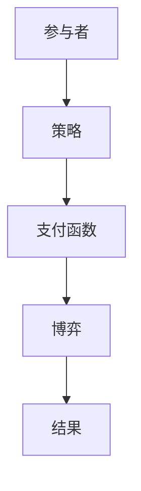

                 

### 第1章 引言与核心概念

#### 1.1 游戏与博弈论

博弈论是研究具有冲突或合作性质的决策制定过程及其结果的一个数学分支。在博弈论中，游戏是指一组参与者通过选择策略来互动的过程。参与者可以是个人、团队、组织甚至是国家。策略是指参与者为了达到某个目标而采取的行动方案，支付函数则用来描述参与者通过执行某个策略所能获得的收益。

博弈论的核心在于理解不同参与者如何基于自己的目标和对手的策略做出决策，以及这些决策如何影响整个游戏的结局。为了更好地理解这些概念，我们可以通过一个Mermaid流程图来展示它们之间的关系：



在这个流程图中，参与者首先选择策略，然后根据支付函数计算各自的收益，最终得出博弈的结果。

#### 1.2 博弈论的基本原理

博弈论的基本原理包括纳什均衡、混合策略、纯策略均衡等。纳什均衡是指在一个博弈中，所有参与者都选择最优策略，并且没有任何参与者可以通过改变策略来获得更高的收益。混合策略则是参与者选择多个策略的概率分布，使得对手无法预测其具体选择，从而达到平衡状态。

纳什均衡可以通过以下伪代码来表示：

```python
def calculate_nash_equilibrium(game_matrix):
    # game_matrix 是一个表示参与者策略和收益的矩阵
    # 返回纳什均衡的策略组合
    for i in range(len(game_matrix)):
        for j in range(len(game_matrix[i])):
            # 检查当前策略是否为纳什均衡
            if is_nash_equilibrium(game_matrix, i, j):
                print("策略", i, "和策略", j, "构成纳什均衡。")
    return None

def is_nash_equilibrium(game_matrix, i, j):
    # 检查策略i和策略j是否构成纳什均衡
    for k in range(len(game_matrix[i])):
        if game_matrix[i][k] > game_matrix[i][j] or game_matrix[k][j] > game_matrix[i][j]:
            return False
    return True
```

#### 1.3 数学模型与数学公式

博弈论中的数学模型通常涉及纳什均衡的计算和贝叶斯纳什均衡的推导。纳什均衡可以通过以下公式计算：

$$
\pi_i = \arg\max_{s_i} \sum_{s_{-i}} u_i(s_i, s_{-i})
$$

其中，$\pi_i$表示参与者i的纳什均衡策略，$u_i$表示参与者i的收益函数。

贝叶斯纳什均衡则是在不完全信息博弈中使用的概念，其推导过程涉及贝叶斯概率和纳什均衡的结合。具体推导过程可以参考以下公式：

$$
\pi_i(s_i | s_{-i}) = \arg\max_{s_i} \sum_{s_{-i}} P(s_{-i}) \cdot u_i(s_i, s_{-i})
$$

其中，$P(s_{-i})$表示参与者i对其他参与者策略的贝叶斯概率。

#### 小结

本章介绍了博弈论的基本概念和原理，包括参与者、策略、支付函数等。我们通过Mermaid流程图展示了这些概念之间的关系，并通过伪代码讲解了纳什均衡的计算过程。接下来，我们将进一步探讨博弈论中的数学模型和公式，并分析其在实际问题中的应用。

### 文章关键词

- 博弈论
- 纳什均衡
- 策略互动
- 数学模型
- 博弈算法

### 文章摘要

本文介绍了博弈论的基本概念和原理，包括参与者、策略、支付函数等。通过Mermaid流程图和伪代码，我们详细讲解了纳什均衡的计算过程和数学模型。文章旨在为读者提供一个清晰、全面的博弈论入门指南，帮助读者理解策略互动的数学描述，并为后续章节的深入讨论奠定基础。

----------------------------------------------------------------

## 第2章 静态博弈论

### 2.1 矩阵博弈

矩阵博弈是博弈论中一种基本的博弈形式，用于描述两个参与者的静态博弈。在这种博弈中，每个参与者可以选择有限个策略，且每个策略都有一个对应的收益。通过构建一个矩阵，我们可以直观地展示参与者的策略选择和收益情况。

#### 矩阵博弈的基本概念

在一个矩阵博弈中，我们通常使用一个策略矩阵来描述参与者的策略选择和收益。策略矩阵是一个二维数组，行表示一个参与者的策略，列表示另一个参与者的策略。矩阵中的元素表示在特定策略组合下第一个参与者的收益。

例如，考虑一个简单的矩阵博弈，参与者A和参与者B的策略分别为“合作”和“背叛”，其收益矩阵如下：

$$
\begin{array}{c|cc}
 & 合作 & 背叛 \\
\hline
合作 & 3, 3 & 0, 5 \\
背叛 & 5, 0 & 1, 1 \\
\end{array}
$$

在这个矩阵中，第一行表示参与者A的策略选择，第一列表示参与者B的策略选择。例如，当A选择“合作”，B选择“背叛”时，A的收益为0，B的收益为5。

#### 矩阵博弈的求解方法

求解矩阵博弈的主要目标是找到纳什均衡，即所有参与者都选择的策略组合，在该策略组合下，没有参与者可以通过改变自己的策略来获得更高的收益。

纳什均衡可以通过最小最大定理来求解。最小最大定理的基本思想是，对于一个矩阵博弈，每个参与者选择一个策略，使得自己的收益最大化，同时最小化对手的收益。具体步骤如下：

1. 对于每个参与者的策略，计算其在所有其他策略组合下的最小收益。
2. 对于所有参与者的最小收益，选择其中最大的值。
3. 确定该最大值对应的策略组合，即为纳什均衡。

以之前的收益矩阵为例，我们可以计算出参与者A的最小收益为0和5，参与者B的最小收益为0和1。最大的最小收益为0，对应的策略组合为（背叛，背叛），这就是该矩阵博弈的纳什均衡。

#### 伪代码实现

下面是求解矩阵博弈的伪代码实现：

```python
def find_nash_equilibrium(game_matrix):
    # game_matrix 是策略矩阵
    # 返回纳什均衡的策略组合
    nash_equilibrium = []
    
    # 计算每个参与者的最小收益
    min_revenue_A = find_min_revenue(game_matrix, 'A')
    min_revenue_B = find_min_revenue(game_matrix, 'B')
    
    # 找到最大的最小收益
    max_min_revenue = max(max(min_revenue_A), max(min_revenue_B))
    
    # 确定纳什均衡的策略组合
    for i in range(len(game_matrix)):
        for j in range(len(game_matrix[i])):
            if game_matrix[i][j] == max_min_revenue:
                nash_equilibrium.append((i, j))
    
    return nash_equilibrium

def find_min_revenue(game_matrix, participant):
    # 返回某个参与者的最小收益
    min_revenue = float('inf')
    for j in range(len(game_matrix[0])):
        min_value = min(game_matrix[i][j] for i in range(len(game_matrix)))
        if min_value < min_revenue:
            min_revenue = min_value
    return min_revenue
```

#### 数学模型与公式

在矩阵博弈中，我们可以使用以下公式来表示纳什均衡：

$$
(s^*, u^*) = \arg\max_{s, u} \min_{w} u(s, w)
$$

其中，$s$表示参与者的策略，$u$表示参与者的收益函数，$w$表示对手的策略。

#### 小结

矩阵博弈是博弈论中最基本的博弈形式之一，通过构建策略矩阵，我们可以直观地分析参与者的策略选择和收益情况。纳什均衡是矩阵博弈中的关键概念，通过最小最大定理，我们可以求解出纳什均衡策略组合。本章介绍了矩阵博弈的基本概念、求解方法和伪代码实现，为后续更复杂的博弈形式分析奠定了基础。

### 2.2 纳什均衡

纳什均衡是博弈论中最重要的概念之一，它描述了在博弈中，所有参与者都选择最优策略，且没有参与者能够通过单方面改变策略获得更高收益的情况。在纳什均衡中，每个参与者的策略都是对其他参与者策略的理性反应，从而达到一个稳定的状态。

#### 纳什均衡的定义

纳什均衡的定义如下：在一个博弈中，如果一个策略组合满足以下条件，那么它就是一个纳什均衡：

对于任一参与者 $i$，其当前策略 $s_i$ 是其所有可能策略中的最优策略，即：

$$
\forall s_{-i} \in S_{-i}, u_i(s_i, s_{-i}) \geq u_i(s_i', s_{-i})
$$

其中，$s_{-i}$ 表示其他参与者 $-i$ 的策略组合，$S_{-i}$ 表示其他参与者 $-i$ 的所有可能策略集合，$u_i$ 表示参与者 $i$ 的收益函数。

换句话说，如果一个参与者认为无论其他参与者如何行动，自己的最优策略都是当前选择的策略，那么这个策略组合就是一个纳什均衡。

#### 纳什均衡的数学描述

纳什均衡可以用以下公式表示：

$$
\pi_i = \arg\max_{s_i} \sum_{s_{-i}} u_i(s_i, s_{-i})
$$

其中，$\pi_i$ 表示参与者 $i$ 的纳什均衡策略，$s_i$ 表示参与者 $i$ 的策略，$s_{-i}$ 表示其他参与者 $-i$ 的策略，$u_i$ 表示参与者 $i$ 的收益函数。

#### 纳什均衡的求解方法

纳什均衡的求解方法通常依赖于博弈的形式。对于矩阵博弈，我们可以通过最小最大定理直接求解。对于更复杂的博弈，可能需要使用迭代法、博弈树搜索等方法。

以下是一个求解纳什均衡的伪代码示例：

```python
def find_nash_equilibrium(game_matrix):
    # game_matrix 是策略矩阵
    # 返回纳什均衡的策略组合
    nash_equilibrium = []

    # 对于每个参与者的策略，计算其收益
    for i in range(len(game_matrix)):
        max_revenue = -float('inf')
        best_strategy = None
        for j in range(len(game_matrix[i])):
            total_revenue = sum(game_matrix[i])
            if total_revenue > max_revenue:
                max_revenue = total_revenue
                best_strategy = j

        nash_equilibrium.append(best_strategy)

    return nash_equilibrium
```

#### 小结

纳什均衡是博弈论的核心概念之一，它描述了在博弈中参与者如何选择策略以达到稳定状态。通过定义和数学描述，我们可以理解纳什均衡的基本原理，并通过伪代码实现具体的求解方法。下一节，我们将探讨在纳什均衡的基础上，如何考虑不确定性和概率因素，引出贝叶斯纳什均衡的概念。

### 2.3 贝叶斯纳什均衡

贝叶斯纳什均衡是纳什均衡在不确定环境下的扩展，它考虑了参与者对其他参与者策略的不确定性。在现实世界中，很多博弈都是在不完全信息下进行的，参与者无法完全了解对手的策略选择。贝叶斯纳什均衡通过引入贝叶斯概率，解决了这种不确定性问题。

#### 贝叶斯纳什均衡的定义

贝叶斯纳什均衡的定义如下：在一个博弈中，如果存在一个策略组合 $\sigma = (\sigma_i, \sigma_{-i})$，对于任一参与者 $i$，其期望收益满足以下条件：

$$
\forall \sigma_{-i} \in \Sigma_{-i}, E[u_i(\sigma_i, \sigma_{-i})] \geq E[u_i(\sigma_i', \sigma_{-i})]
$$

其中，$E[u_i(\sigma_i, \sigma_{-i})]$ 表示参与者 $i$ 在策略组合 $(\sigma_i, \sigma_{-i})$ 下的期望收益，$\Sigma_{-i}$ 表示其他参与者 $-i$ 的所有可能策略集合。

换句话说，如果一个参与者认为在所有可能的对手策略下，自己的期望收益都是当前策略下的最大值，那么这个策略组合就是一个贝叶斯纳什均衡。

#### 贝叶斯纳什均衡的数学描述

贝叶斯纳什均衡可以用以下公式表示：

$$
\sigma_i = \arg\max_{s_i} \sum_{s_{-i}} P(s_{-i}) \cdot u_i(s_i, s_{-i})
$$

其中，$P(s_{-i})$ 表示参与者 $i$ 对其他参与者 $-i$ 选择策略 $s_{-i}$ 的贝叶斯概率，$u_i$ 表示参与者 $i$ 的收益函数。

#### 贝叶斯纳什均衡的计算方法

计算贝叶斯纳什均衡通常需要以下步骤：

1. **建立概率模型**：根据先验知识和对博弈环境的理解，为每个参与者构建概率模型，表示其对其他参与者策略的不确定性。
2. **计算期望收益**：对于每个参与者，计算其在所有可能的对手策略下的期望收益。
3. **寻找最优策略**：找到使期望收益最大的策略组合，即为贝叶斯纳什均衡。

以下是一个简单的贝叶斯纳什均衡计算的伪代码示例：

```python
def bayesian_nash_equilibrium(game_matrix, probability_model):
    # game_matrix 是策略矩阵
    # probability_model 是贝叶斯概率模型
    # 返回贝叶斯纳什均衡的策略组合
    nash_equilibrium = []

    # 对于每个参与者的策略，计算其期望收益
    for i in range(len(game_matrix)):
        max_expectation = -float('inf')
        best_strategy = None
        for j in range(len(game_matrix[i])):
            total_expectation = sum([game_matrix[i][j] * probability_model[k] for k in probability_model])
            if total_expectation > max_expectation:
                max_expectation = total_expectation
                best_strategy = j

        nash_equilibrium.append(best_strategy)

    return nash_equilibrium
```

#### 小结

贝叶斯纳什均衡考虑了博弈中的不确定性，通过引入贝叶斯概率，为参与者提供了在不确定环境下的最优策略选择。本章介绍了贝叶斯纳什均衡的定义、数学描述和计算方法。在下一章中，我们将探讨动态博弈论，进一步分析参与者如何在时间维度上做出策略选择。

### 2.4 动态博弈论

动态博弈论是博弈论的一个重要分支，它研究参与者在多个阶段内做出策略选择的情况。与静态博弈论相比，动态博弈论考虑了时间因素，参与者需要根据当前状态和过去信息来决策。动态博弈论广泛应用于经济学、政治学、计算机科学等领域。

#### 动态博弈论的基本概念

动态博弈论中的基本概念包括：

1. **阶段**：博弈的一个阶段是指参与者需要做出一个决策的时刻。动态博弈可以划分为多个阶段，每个阶段参与者需要选择一个策略。
2. **子博弈**：子博弈是指从一个特定时间点开始，参与者剩余的博弈过程。子博弈可以帮助简化动态博弈的分析，将复杂的动态博弈分解为多个独立的静态博弈。
3. **完美信息**：在完美信息动态博弈中，每个参与者都能观察到所有先前的行动和状态，从而做出最佳决策。
4. **不完全信息**：在不完全信息动态博弈中，参与者可能无法观察到所有先前的行动和状态，只能根据概率分布来推测对手的行为。

#### 子博弈完美纳什均衡

子博弈完美纳什均衡（Subgame Perfect Nash Equilibrium，SPNE）是动态博弈论中的一个重要概念，它要求在每个子博弈中，参与者选择的策略都是纳什均衡，并且在整个博弈过程中没有参与者可以在未来的任何一个子博弈中单方面改变策略获得更高的收益。

#### 子博弈完美纳什均衡的求解方法

求解子博弈完美纳什均衡通常需要以下步骤：

1. **逆向归纳法**：从博弈的最后一个子博弈开始，逐步向前推导，确定在每个子博弈中的纳什均衡策略。
2. **状态转换函数**：定义状态转换函数，描述在当前状态下参与者可能的选择以及这些选择带来的收益。
3. **收益函数**：定义参与者的收益函数，描述在不同策略组合下的收益。

以下是一个简单的子博弈完美纳什均衡求解的伪代码示例：

```python
def subgame_perfect_nash_equilibrium(game_tree, state):
    # game_tree 是博弈树
    # state 是当前状态
    # 返回子博弈完美纳什均衡策略
    if is_terminal(state):
        # 如果是终端状态，直接返回收益最大的策略
        return max_strategy(state)
    else:
        # 如果不是终端状态，进行逆向归纳
        best_strategy = None
        max_revenue = -float('inf')
        for action in possible_actions(state):
            next_state = state TransitionFunction(action)
            next_strategy = subgame_perfect_nash_equilibrium(game_tree, next_state)
            total_revenue = actionRevenue(action) + expected_revenue(next_strategy)
            if total_revenue > max_revenue:
                max_revenue = total_revenue
                best_strategy = action
        return best_strategy
```

#### 小结

动态博弈论扩展了博弈论的基本概念，考虑了参与者在多个阶段内的策略选择。子博弈完美纳什均衡是动态博弈论中的一个重要概念，它要求在每个子博弈中参与者选择纳什均衡策略，并且在整个博弈过程中没有参与者可以在未来的任何一个子博弈中单方面改变策略获得更高的收益。本章介绍了动态博弈论的基本概念和求解方法，为后续章节进一步分析动态博弈提供了基础。

### 2.5 不完全信息动态博弈

不完全信息动态博弈是博弈论中的一个重要分支，它涉及参与者在信息不完全的情况下进行策略选择。在这种博弈中，参与者可能无法观察到对手的所有行动和状态，只能根据先验知识和概率分布来推测对手的行为。贝叶斯均衡是解决不完全信息动态博弈的一种有效方法。

#### 贝叶斯均衡的定义

贝叶斯均衡是指在一个博弈中，参与者选择的策略能够最大化自己的期望收益，并且其他参与者也认为自己的策略是最优的。在贝叶斯均衡中，每个参与者的策略都是对其他参与者策略的理性推测。

贝叶斯均衡可以用以下公式表示：

$$
\sigma_i = \arg\max_{s_i} \sum_{s_{-i}} P(s_{-i} | s_i) \cdot u_i(s_i, s_{-i})
$$

其中，$P(s_{-i} | s_i)$ 表示参与者 $i$ 对其他参与者 $-i$ 选择策略 $s_{-i}$ 的后验概率，$u_i$ 表示参与者 $i$ 的收益函数。

#### 贝叶斯均衡的计算方法

计算贝叶斯均衡通常需要以下步骤：

1. **建立概率模型**：根据先验知识和对博弈环境的理解，为每个参与者构建概率模型，表示其对其他参与者策略的不确定性。
2. **计算后验概率**：使用贝叶斯规则更新参与者的后验概率，即根据当前观察到的信息更新对其他参与者策略的推测。
3. **计算期望收益**：对于每个参与者，计算其在所有可能的对手策略下的期望收益。
4. **寻找最优策略**：找到使期望收益最大的策略组合，即为贝叶斯均衡。

以下是一个简单的贝叶斯均衡计算的伪代码示例：

```python
def bayesian_equilibrium(game_matrix, prior_probabilities):
    # game_matrix 是策略矩阵
    # prior_probabilities 是先验概率
    # 返回贝叶斯均衡的策略组合
    nash_equilibrium = []

    # 对于每个参与者的策略，计算其期望收益
    for i in range(len(game_matrix)):
        max_expectation = -float('inf')
        best_strategy = None
        for j in range(len(game_matrix[i])):
            total_expectation = sum([game_matrix[i][j] * prior_probabilities[k] for k in prior_probabilities])
            if total_expectation > max_expectation:
                max_expectation = total_expectation
                best_strategy = j

        nash_equilibrium.append(best_strategy)

    return nash_equilibrium
```

#### 小结

不完全信息动态博弈考虑了参与者之间的信息不对称，通过引入贝叶斯均衡，我们可以在不确定的环境下为参与者提供最优策略选择。本章介绍了贝叶斯均衡的定义、计算方法和伪代码实现，为读者在信息不完全的情况下分析和解决动态博弈问题提供了理论基础。

### 2.6 应用案例：博弈论在经济学中的应用

博弈论在经济学中有着广泛的应用，通过分析市场参与者之间的策略互动，经济学家可以更好地理解市场行为和预测市场结果。以下是一个具体的案例，展示如何将博弈论应用于经济学中的竞争分析。

#### 竞争分析案例

假设有两个企业A和企业B，它们在市场上生产和销售同一种产品。企业A和企业B可以选择的策略有“提高价格”和“降低价格”。根据市场需求和成本结构，我们可以构建一个简单的博弈矩阵来分析这两个企业的策略选择和收益。

收益矩阵如下：

$$
\begin{array}{c|cc}
 & 提高价格 & 降低价格 \\
\hline
提高价格 & 2, 1 & 0, 0 \\
降低价格 & 0, 0 & 3, 2 \\
\end{array}
$$

在这个矩阵中，第一行表示企业A的策略选择，第一列表示企业B的策略选择。矩阵中的元素表示企业在特定策略组合下的收益。

#### 竞争分析步骤

1. **确定策略组合**：首先，我们需要确定所有可能的策略组合。在这个例子中，可能的策略组合有四种：（提高价格，提高价格）、（提高价格，降低价格）、（降低价格，提高价格）和（降低价格，降低价格）。

2. **计算收益**：对于每个策略组合，计算两个企业的收益。例如，在策略组合（提高价格，提高价格）下，企业A的收益为2，企业B的收益为1。

3. **分析纳什均衡**：通过分析收益矩阵，我们可以找到纳什均衡策略组合。在上述收益矩阵中，纳什均衡策略组合为（降低价格，降低价格），因为在其他策略组合下，企业A或企业B都可以通过单方面改变策略获得更高的收益。

4. **考虑市场动态**：在实际市场中，企业的策略选择不仅取决于当前的收益，还需要考虑未来的市场动态和竞争对手的反应。例如，如果企业A选择了降低价格，企业B可能会跟随降价，以保持市场份额。

5. **模拟竞争结果**：通过模拟多个策略组合和市场动态，我们可以预测市场竞争的结果。在上述案例中，如果两家企业都选择降低价格，可能会导致价格战，最终损害双方的收益。

#### 源代码实现

为了更直观地分析竞争案例，我们可以使用Python编写一个简单的博弈模型，计算不同策略组合下的收益和纳什均衡。

```python
import numpy as np

# 收益矩阵
revenue_matrix = np.array([[2, 1], [0, 3]])

# 策略名称
strategies = ['提高价格', '降低价格']

# 计算所有策略组合的收益
for i in range(len(revenue_matrix)):
    for j in range(len(revenue_matrix[i])):
        strategy_i = strategies[i]
        strategy_j = strategies[j]
        revenue_i = revenue_matrix[i][j]
        print(f"策略组合（{strategy_i}，{strategy_j}）：企业A收益为{revenue_i}。")

# 找到纳什均衡策略组合
nash_equilibrium = None
max_revenue_i = -float('inf')
for i in range(len(revenue_matrix)):
    for j in range(len(revenue_matrix[i])):
        revenue_i = revenue_matrix[i][j]
        if revenue_i > max_revenue_i:
            max_revenue_i = revenue_i
            nash_equilibrium = (strategies[i], strategies[j])

print(f"纳什均衡策略组合：{nash_equilibrium}。")
```

通过上述代码，我们可以计算出不同策略组合下的收益，并找到纳什均衡策略组合。在实际应用中，我们可以根据具体市场情况和数据调整收益矩阵，分析不同竞争策略的效果。

#### 小结

博弈论在经济学中的应用可以帮助我们理解和预测市场参与者的策略选择和市场竞争结果。通过具体案例的分析和源代码实现，我们可以更深入地理解博弈论在竞争分析中的应用，为企业和政策制定者提供决策支持。

### 2.7 应用案例：博弈论在社会科学中的应用

博弈论在社会科学中的应用非常广泛，可以帮助我们理解和分析人类行为中的策略互动。以下是一个具体的案例，展示如何将博弈论应用于社会学中的合作与竞争分析。

#### 合作与竞争案例

假设有两个社区A和B，它们需要共同决定是否在某个地区开展环境保护项目。社区A和社区B可以选择的策略有“合作”和“竞争”。根据环境保护项目的收益和成本，我们可以构建一个博弈矩阵来分析这两个社区的策略选择和收益。

收益矩阵如下：

$$
\begin{array}{c|cc}
 & 合作 & 竞争 \\
\hline
合作 & 5, 5 & 1, 1 \\
竞争 & 1, 1 & 4, 4 \\
\end{array}
$$

在这个矩阵中，第一行表示社区A的策略选择，第一列表示社区B的策略选择。矩阵中的元素表示在特定策略组合下两个社区的收益。

#### 案例分析步骤

1. **确定策略组合**：首先，我们需要确定所有可能的策略组合。在这个例子中，可能的策略组合有四种：（合作，合作）、（合作，竞争）、（竞争，合作）和（竞争，竞争）。

2. **计算收益**：对于每个策略组合，计算两个社区的收益。例如，在策略组合（合作，合作）下，社区A和社区B的收益都是5。

3. **分析纳什均衡**：通过分析收益矩阵，我们可以找到纳什均衡策略组合。在上述收益矩阵中，纳什均衡策略组合为（竞争，竞争），因为在其他策略组合下，任何一个社区都可以通过单方面改变策略获得更高的收益。

4. **考虑外部效应**：在实际社会中，合作往往受到外部效应的影响。例如，如果社区A采取环境保护项目，可能会对社区B产生正面的外部效应，从而提高社区B的收益。

5. **模拟合作结果**：通过模拟多个策略组合和考虑外部效应，我们可以预测社区合作的结果。在上述案例中，如果两个社区都选择合作，最终可能会实现更高的总收益。

#### 源代码实现

为了更直观地分析合作与竞争案例，我们可以使用Python编写一个简单的博弈模型，计算不同策略组合下的收益和纳什均衡。

```python
import numpy as np

# 收益矩阵
revenue_matrix = np.array([[5, 1], [1, 4]])

# 策略名称
strategies = ['合作', '竞争']

# 计算所有策略组合的收益
for i in range(len(revenue_matrix)):
    for j in range(len(revenue_matrix[i])):
        strategy_i = strategies[i]
        strategy_j = strategies[j]
        revenue_i = revenue_matrix[i][j]
        print(f"策略组合（{strategy_i}，{strategy_j}）：社区A收益为{revenue_i}。")

# 找到纳什均衡策略组合
nash_equilibrium = None
max_revenue_i = -float('inf')
for i in range(len(revenue_matrix)):
    for j in range(len(revenue_matrix[i])):
        revenue_i = revenue_matrix[i][j]
        if revenue_i > max_revenue_i:
            max_revenue_i = revenue_i
            nash_equilibrium = (strategies[i], strategies[j])

print(f"纳什均衡策略组合：{nash_equilibrium}。")
```

通过上述代码，我们可以计算出不同策略组合下的收益，并找到纳什均衡策略组合。在实际应用中，我们可以根据具体社会情况和数据调整收益矩阵，分析不同合作策略的效果。

#### 小结

博弈论在社会科学中的应用可以帮助我们理解和预测人类行为中的策略互动。通过具体案例的分析和源代码实现，我们可以更深入地理解博弈论在社会学中的应用，为政策制定者和社会科学家提供决策支持。

### 2.8 应用案例：博弈论在生物学中的应用

博弈论不仅在经济学和社会科学中有着广泛的应用，也在生物学领域发挥着重要作用。生物学中的很多现象，如物种间的竞争、合作和捕食与被捕食关系，都可以通过博弈论进行分析。以下是一个具体的案例，展示如何将博弈论应用于生物学中的捕食者-被捕食者模型。

#### 捕食者-被捕食者模型

假设有两种生物：捕食者（如狮子）和被捕食者（如斑马）。捕食者可以选择的策略有“狩猎”和“休息”，而被捕食者可以选择的策略有“逃跑”和“伪装”。根据这两种生物的策略选择和生存概率，我们可以构建一个博弈矩阵来分析它们之间的策略互动。

收益矩阵如下：

$$
\begin{array}{c|cc}
 & 逃跑 & 伪装 \\
\hline
狩猎 & 2, 1 & 0, 0 \\
休息 & 1, 0 & 3, 2 \\
\end{array}
$$

在这个矩阵中，第一行表示捕食者的策略选择，第一列表示被捕食者的策略选择。矩阵中的元素表示在特定策略组合下捕食者和被捕食者的生存概率。

#### 案例分析步骤

1. **确定策略组合**：首先，我们需要确定所有可能的策略组合。在这个例子中，可能的策略组合有四种：（狩猎，逃跑）、（狩猎，伪装）、（休息，逃跑）和（休息，伪装）。

2. **计算收益**：对于每个策略组合，计算捕食者和被捕食者的生存概率。例如，在策略组合（狩猎，逃跑）下，捕食者的生存概率为2，被捕食者的生存概率为1。

3. **分析纳什均衡**：通过分析收益矩阵，我们可以找到纳什均衡策略组合。在上述收益矩阵中，纳什均衡策略组合为（休息，伪装），因为在其他策略组合下，捕食者或被捕食者都可以通过单方面改变策略获得更高的生存概率。

4. **考虑策略适应性**：在实际生态系统中，捕食者和被捕食者会根据对方的策略进行调整。例如，如果捕食者发现被捕食者经常伪装，可能会增加狩猎频率，从而提高狩猎成功率。

5. **模拟生态系统动态**：通过模拟多个策略组合和考虑策略适应性，我们可以预测生态系统的动态变化。在上述案例中，如果捕食者和被捕食者都选择（休息，伪装）策略，可能会导致生态系统的稳定状态。

#### 源代码实现

为了更直观地分析捕食者-被捕食者模型，我们可以使用Python编写一个简单的博弈模型，计算不同策略组合下的生存概率和纳什均衡。

```python
import numpy as np

# 收益矩阵
revenue_matrix = np.array([[2, 1], [0, 3]])

# 策略名称
strategies = ['狩猎', '休息']

# 计算所有策略组合的生存概率
for i in range(len(revenue_matrix)):
    for j in range(len(revenue_matrix[i])):
        strategy_i = strategies[i]
        strategy_j = strategies[j]
        survival_prob_i = revenue_matrix[i][j]
        print(f"策略组合（{strategy_i}，{strategy_j}）：捕食者生存概率为{survival_prob_i}。")

# 找到纳什均衡策略组合
nash_equilibrium = None
max_survival_prob_i = -float('inf')
for i in range(len(revenue_matrix)):
    for j in range(len(revenue_matrix[i])):
        survival_prob_i = revenue_matrix[i][j]
        if survival_prob_i > max_survival_prob_i:
            max_survival_prob_i = survival_prob_i
            nash_equilibrium = (strategies[i], strategies[j])

print(f"纳什均衡策略组合：{nash_equilibrium}。")
```

通过上述代码，我们可以计算出不同策略组合下的生存概率，并找到纳什均衡策略组合。在实际应用中，我们可以根据具体生态系统情况和数据调整收益矩阵，分析不同策略对生态系统的影响。

#### 小结

博弈论在生物学中的应用可以帮助我们理解和预测物种间的策略互动和生态系统的动态变化。通过具体案例的分析和源代码实现，我们可以更深入地理解博弈论在生物学中的应用，为生态学家和环境保护者提供决策支持。

### 第3章 现代博弈论

#### 3.1 随机博弈

随机博弈是博弈论中的一种扩展，它考虑了参与者在博弈过程中面临的不确定性和随机因素。在随机博弈中，参与者不仅需要选择策略，还需要考虑这些策略在不同随机结果下的收益。随机博弈广泛应用于金融、保险、经济学等领域。

#### 随机博弈的定义

随机博弈可以定义为：参与者在多个阶段内进行决策，每个阶段的决策不仅依赖于当前状态，还依赖于一个随机变量。随机博弈可以用一个博弈树来表示，每个节点表示一个决策点，每个分支表示一个可能的随机结果。

#### 随机博弈的数学模型

在随机博弈中，我们可以用概率分布来表示每个参与者面临的随机因素。具体来说，我们可以定义一个概率分布 $P(s)$，表示在特定策略 $s$ 下，参与者面临的所有可能随机结果的概率分布。随机博弈的期望收益可以用以下公式表示：

$$
u_i(s) = \sum_{s'} P(s'|s) \cdot u_i(s, s')
$$

其中，$u_i(s, s')$ 表示在策略 $s$ 和随机结果 $s'$ 下，参与者 $i$ 的收益，$P(s'|s)$ 表示在策略 $s$ 下，参与者 $i$ 面临的随机结果 $s'$ 的概率。

#### 随机博弈的求解方法

求解随机博弈的主要目标是找到使参与者期望收益最大化的策略组合。具体方法如下：

1. **构建博弈树**：首先，根据博弈的规则和随机因素，构建博弈树，每个节点表示一个决策点，每个分支表示一个可能的随机结果。

2. **计算期望收益**：对于博弈树的每个节点，计算在该节点下，参与者根据当前策略和随机结果的期望收益。

3. **逆向归纳**：从博弈树的终端节点开始，逆向推导每个节点的最优策略。具体来说，对于每个节点，选择一个使期望收益最大的策略。

以下是一个简单的随机博弈求解的伪代码示例：

```python
def solve_stochastic_game(game_tree):
    # game_tree 是博弈树
    # 返回随机博弈的最优策略组合
    optimal_strategy = []

    # 从终端节点开始逆向推导最优策略
    for node in game_tree.terminal_nodes():
        optimal_action = max_action(node.actions(), node)
        optimal_strategy.append(optimal_action)

    return optimal_strategy[::-1]  # 逆向推导，从终端节点到初始节点

def max_action(actions, node):
    # 返回在当前节点下使期望收益最大的动作
    max_action = None
    max_expectation = -float('inf')

    for action in actions:
        expectation = calculate_expectation(node, action)
        if expectation > max_expectation:
            max_expectation = expectation
            max_action = action

    return max_action

def calculate_expectation(node, action):
    # 计算在当前节点下执行动作 action 的期望收益
    expectation = 0

    for result in node.outgoing_results():
        next_node = node.get_next_node(result)
        next_action = next_node.actions()[action]
        expectation += result概率 * next_node.revenue(next_action)

    return expectation
```

#### 小结

随机博弈考虑了博弈中的不确定性和随机因素，为参与者提供了在不确定环境下做出最优策略选择的方法。本章介绍了随机博弈的定义、数学模型和求解方法，为读者在复杂不确定环境下进行策略分析提供了理论基础。

### 3.2 混合策略

在博弈论中，混合策略是指参与者选择多个策略的概率分布，而不是单一策略。混合策略的引入可以解决纯策略均衡可能不存在或者不可行的问题，同时也可以增加博弈的复杂性，使得对手难以预测参与者的具体行动。

#### 混合策略的定义

混合策略是指一个参与者为其所有可能策略分配一个概率，这些概率的总和为1。用数学语言描述，如果一个参与者有 $m$ 个策略 $s_1, s_2, ..., s_m$，那么它的混合策略可以表示为一个概率分布向量 $\pi = (\pi_1, \pi_2, ..., \pi_m)$，其中 $\pi_i$ 表示参与者选择策略 $s_i$ 的概率，且满足 $\sum_{i=1}^{m} \pi_i = 1$。

#### 混合策略的优势

1. **增加不确定性**：混合策略增加了参与者行动的不确定性，使得对手难以准确预测参与者的具体行动，从而降低对手的优势。
2. **避免占优策略**：在某些博弈中，某个策略可能对其他所有策略具有优势，称为占优策略。通过使用混合策略，参与者可以避免陷入占优策略陷阱。
3. **提高期望收益**：在某些博弈中，混合策略可能使得参与者的期望收益更高。这是因为混合策略可以优化参与者在不同策略下的收益，使其更接近最佳策略。

#### 混合策略的计算方法

计算混合策略的目标是找到一个使得参与者期望收益最大的混合策略。具体方法如下：

1. **构建策略矩阵**：首先，构建一个策略矩阵，表示参与者在不同策略组合下的收益。
2. **计算期望收益**：对于每个可能的混合策略，计算其在所有对手策略下的期望收益。
3. **寻找最优混合策略**：选择期望收益最大的混合策略。

以下是一个简单的混合策略计算的伪代码示例：

```python
import numpy as np

def calculate_expectation(revenue_matrix, strategy_distribution):
    # revenue_matrix 是策略矩阵
    # strategy_distribution 是混合策略概率分布
    # 返回混合策略的期望收益
    total_expectation = 0
    for i in range(len(revenue_matrix)):
        for j in range(len(revenue_matrix[i])):
            total_expectation += strategy_distribution[i] * revenue_matrix[i][j]
    return total_expectation

def find_optimal_mixed_strategy(revenue_matrix):
    # revenue_matrix 是策略矩阵
    # 返回最优混合策略
    optimal_strategy = None
    max_expectation = -float('inf')

    # 构建所有可能的混合策略
    for i in range(len(revenue_matrix)):
        for j in range(len(revenue_matrix[i])):
            strategy_distribution = [0] * len(revenue_matrix)
            strategy_distribution[i] = 1
            expectation = calculate_expectation(revenue_matrix, strategy_distribution)
            if expectation > max_expectation:
                max_expectation = expectation
                optimal_strategy = strategy_distribution

    return optimal_strategy
```

#### 小结

混合策略是博弈论中一个重要的概念，它为参与者提供了一种在不确定环境中做出最优策略选择的方法。本章介绍了混合策略的定义、优势和计算方法，为读者在复杂博弈中应用混合策略提供了理论基础。

### 3.3 非合作博弈

非合作博弈是指参与者在博弈中不进行合作，而是独立地追求自身利益最大化。与合作博弈不同，非合作博弈中不存在任何形式的协作机制，每个参与者都试图通过自己的策略选择来最大化自己的收益。非合作博弈在经济学、政治学、计算机科学等领域有广泛的应用。

#### 非合作博弈的定义

非合作博弈的定义如下：在一个博弈中，如果每个参与者都独立地选择自己的策略，且没有参与者之间存在任何形式的协作机制，那么这个博弈就是非合作博弈。

#### 非合作博弈的分类

非合作博弈可以根据策略选择的不同，分为以下几种类型：

1. **完全信息非合作博弈**：所有参与者都能观察到其他参与者的所有策略选择，如矩阵博弈。
2. **不完全信息非合作博弈**：参与者无法观察到其他参与者的所有策略选择，只能根据概率分布推测对手的行为，如贝叶斯博弈。
3. **静态非合作博弈**：参与者在一个时刻同时做出策略选择，如矩阵博弈。
4. **动态非合作博弈**：参与者在不同时间点依次做出策略选择，如动态规划博弈。

#### 非合作博弈的数学模型

非合作博弈的数学模型通常涉及参与者策略选择和收益函数的描述。一个基本的非合作博弈可以用以下数学模型表示：

- 参与者集合：$N = \{1, 2, ..., n\}$
- 策略集合：$S_i$，表示第 $i$ 个参与者的所有可能策略
- 收益函数：$u_i(s_1, s_2, ..., s_n)$，表示在策略组合 $(s_1, s_2, ..., s_n)$ 下第 $i$ 个参与者的收益

非合作博弈的求解目标通常是找到参与者的最优策略组合，使得每个参与者的收益最大化。对于完全信息非合作博弈，通常使用纳什均衡来求解；对于不完全信息非合作博弈，通常使用贝叶斯纳什均衡来求解。

#### 非合作博弈的求解方法

求解非合作博弈的方法取决于博弈的具体形式。以下是几种常见的求解方法：

1. **纳什均衡**：对于完全信息非合作博弈，纳什均衡是每个参与者选择的最优策略组合，在该组合下，没有参与者可以通过单方面改变策略获得更高的收益。
2. **动态规划**：对于动态非合作博弈，动态规划是一种常用的求解方法。动态规划通过逆向归纳的方法，从博弈的终端状态开始，逐步推导到初始状态，找到参与者的最优策略组合。
3. **博弈树搜索**：对于复杂的非合作博弈，博弈树搜索是一种有效的求解方法。博弈树搜索通过遍历博弈树，计算每个节点的最优策略，找到全局最优策略组合。

以下是一个简单的非合作博弈求解的伪代码示例：

```python
def find_nash_equilibrium(game_matrix):
    # game_matrix 是策略矩阵
    # 返回纳什均衡策略组合
    nash_equilibrium = []

    # 对于每个参与者，找到其最优策略
    for i in range(len(game_matrix)):
        max_revenue = -float('inf')
        best_strategy = None
        for j in range(len(game_matrix[i])):
            total_revenue = sum(game_matrix[i])
            if total_revenue > max_revenue:
                max_revenue = total_revenue
                best_strategy = j
        nash_equilibrium.append(best_strategy)

    return nash_equilibrium
```

#### 小结

非合作博弈是博弈论中一个重要的分支，它描述了参与者如何在缺乏合作机制的情况下追求自身利益最大化。本章介绍了非合作博弈的定义、分类、数学模型和求解方法，为读者在复杂博弈环境中分析参与者策略提供了理论基础。

### 3.4 博弈论与人工智能

博弈论在人工智能（AI）领域有着广泛的应用，特别是在决策制定和智能体交互方面。通过将博弈论与AI技术相结合，研究者可以开发出更加智能和适应性强的AI系统。

#### 博弈论在AI中的应用

1. **多智能体系统**：在多智能体系统中，多个智能体需要相互协作或竞争，以实现共同的目标。博弈论提供了分析智能体之间策略互动的有效工具，可以帮助设计出更加鲁棒和高效的智能体系统。

2. **强化学习**：强化学习是一种通过试错来学习策略的机器学习技术。博弈论中的策略互动和奖励机制可以为强化学习提供重要的理论指导，从而提高智能体的学习效率和策略质量。

3. **智能决策支持系统**：博弈论在智能决策支持系统中发挥着关键作用，特别是在不确定和竞争性的环境中。通过博弈论模型，智能系统能够更好地预测对手的行为，并制定出最优的决策策略。

#### 应用案例

1. **电子游戏AI**：在电子游戏中，玩家与AI之间的互动可以视为一个博弈过程。通过博弈论，研究者可以设计出更加智能和有趣的AI对手，提高游戏的可玩性和挑战性。

2. **无人驾驶汽车**：在无人驾驶汽车中，博弈论可以帮助解决多个车辆之间的交互问题。通过博弈论模型，智能系统能够预测其他车辆的行为，并制定出最优的驾驶策略，提高行驶安全性和效率。

3. **市场预测**：在金融市场中，博弈论可以用于分析多个投资者之间的策略互动，从而预测市场走势和投资策略。通过博弈论模型，智能系统能够提供更加精准的市场预测，帮助投资者做出更明智的决策。

#### 小结

博弈论与人工智能的结合为AI系统提供了强大的策略互动分析工具。通过博弈论模型，AI系统能够更好地理解智能体之间的策略互动，提高决策质量和效率。在未来的研究中，随着AI技术的不断发展，博弈论将在AI领域发挥更加重要的作用。

### 3.5 博弈论与经济政策

博弈论在制定和评估经济政策方面具有重要作用。它可以帮助政策制定者理解市场参与者的策略选择和互动，从而制定出更加有效和公平的政策。

#### 博弈论在经济政策中的应用

1. **市场结构分析**：博弈论可以用于分析不同市场结构中的策略互动，如完全竞争市场、垄断市场和寡头市场。通过博弈论模型，政策制定者可以更好地理解市场动态，制定出促进竞争和提高效率的政策。

2. **反垄断政策**：博弈论在反垄断政策的制定中具有重要应用。通过分析垄断企业和竞争者之间的策略互动，政策制定者可以评估垄断行为对社会福利的影响，并制定出有效的反垄断措施。

3. **公共品供给**：博弈论可以用于分析公共品供给中的策略互动。例如，在环保项目中，政府和企业之间的策略选择会影响公共品的供给和分配。通过博弈论模型，政策制定者可以优化公共品供给策略，提高社会效益。

#### 应用案例

1. **税收政策**：博弈论可以用于分析政府与纳税人之间的策略互动。通过博弈论模型，政策制定者可以评估不同税收政策对纳税人行为的影响，并制定出最优的税收政策。

2. **国际贸易**：博弈论在分析国际贸易中的策略互动方面具有重要作用。通过博弈论模型，政策制定者可以预测国际贸易政策的变化对国家经济的影响，并制定出有利于经济增长的政策。

3. **环境保护政策**：博弈论可以用于分析政府与企业之间的策略互动，以制定出有效的环境保护政策。通过博弈论模型，政策制定者可以评估不同环境保护政策的成本和效益，并优化政策设计。

#### 小结

博弈论为经济政策的制定和评估提供了强有力的分析工具。通过博弈论模型，政策制定者可以更好地理解市场参与者的策略选择和互动，从而制定出更加有效和公平的经济政策。在未来的研究中，博弈论将在经济政策领域发挥更加重要的作用。

### 3.6 博弈论与日常生活

博弈论不仅在专业领域有着广泛的应用，也可以在我们的日常生活中发挥作用。它帮助我们理解和分析日常生活中的策略互动，从而做出更加明智的决策。

#### 博弈论在日常生活中的应用

1. **商业谈判**：在商业谈判中，博弈论可以帮助我们分析对手的策略，预测谈判结果，并制定出最优的谈判策略。

2. **人际关系**：在人际交往中，博弈论可以帮助我们理解他人的行为意图，从而更好地处理人际关系，避免冲突。

3. **游戏与娱乐**：在游戏和娱乐活动中，博弈论可以提供策略分析，帮助我们制定出最佳的游戏策略，提高胜算。

#### 应用案例

1. **购物谈判**：当我们在购物时，可以使用博弈论来分析卖家和买家之间的策略互动。通过了解卖家的策略和价格区间，我们可以制定出最优的购物策略，以获得更好的价格。

2. **团队协作**：在团队工作中，博弈论可以帮助我们分析团队成员之间的策略互动，提高团队协作效率。例如，通过博弈论模型，我们可以确定团队成员的最佳分工和任务分配策略。

3. **游戏策略**：在电子游戏或棋类游戏中，博弈论可以提供策略分析，帮助我们制定出最佳的游戏策略。例如，在围棋中，通过博弈论模型，我们可以分析对手的棋局策略，并制定出反击策略。

#### 小结

博弈论不仅是一门深奥的数学分支，也可以在我们的日常生活中发挥重要作用。通过博弈论的分析方法，我们可以更好地理解日常生活中的策略互动，从而做出更加明智的决策。

### 第4章 案例分析与深入探讨

#### 4.1 博弈论在拍卖中的应用

拍卖是一种常见的市场交易形式，通过竞争机制来确定商品或服务的价格。博弈论在拍卖设计中有着广泛的应用，可以帮助设计出更加公平和高效的拍卖机制。

##### 应用场景

假设有一个珍贵艺术品即将拍卖，有多个买家对该艺术品感兴趣。拍卖师可以选择不同的拍卖规则，如英式拍卖、荷兰式拍卖或维克瑞拍卖。每个买家根据对艺术品的估值和竞争对手的行为来决定自己的出价策略。

##### 案例分析

1. **英式拍卖**：英式拍卖是一种最常见的拍卖形式，买家依次提高出价，直到没有更高的出价出现。在这种拍卖中，买家需要根据对手的出价策略来调整自己的出价。

   博弈论模型如下：
   
   - 参与者：买家和拍卖师
   - 策略：买家出价策略和拍卖师拍卖规则
   - 支付函数：买家根据出价和对手策略的收益函数
   
   拍卖师的目标是最大化自己的收益，而买家则需要最大化自己的期望收益。

2. **荷兰式拍卖**：荷兰式拍卖是一种递减出价的拍卖形式，买家依次降低出价，直到有买家接受当前价格。在这种拍卖中，买家需要预测其他买家的出价策略，并在合适的时间出价。

   博弈论模型如下：
   
   - 参与者：买家和拍卖师
   - 策略：买家出价策略和拍卖师拍卖规则
   - 支付函数：买家根据出价和对手策略的收益函数
   
   拍卖师的目标是尽快完成拍卖，买家则需要尽快确定出价，以获得艺术品。

3. **维克瑞拍卖**：维克瑞拍卖是一种基于价值的拍卖，买家根据自己对商品的估值来出价。拍卖师选择最高的出价者作为获胜者，但获胜者只需支付自己的估值。

   博弈论模型如下：
   
   - 参与者：买家和拍卖师
   - 策略：买家估值策略和拍卖师拍卖规则
   - 支付函数：买家根据出价和对手策略的收益函数
   
   拍卖师的目标是选择最高估值者，买家则需要真实地表达自己的估值。

##### 代码实现

以下是一个简单的英式拍卖的Python代码实现：

```python
import random

def bid-war(game_matrix, num_bidders):
    bids = [random.randint(1, 100) for _ in range(num_bidders)]
    highest_bid = max(bids)
    highest_bidder = bids.index(highest_bid)
    
    print(f"Highest bid: {highest_bid}")
    print(f"Highest bidder: Bidder {highest_bidder + 1}")
    
    # Calculate the profit for the highest bidder
    profit = game_matrix[highest_bidder][highest_bidder]
    print(f"Profit for the highest bidder: {profit}")

# Revenue matrix for the game
revenue_matrix = [
    [0, 10, 5],
    [5, 0, 10],
    [10, 5, 0]
]

# Play the bid-war game
bid_war(revenue_matrix, 3)
```

在这个例子中，我们创建了一个简单的收益矩阵，表示三个买家在英式拍卖中的策略互动。每个买家随机出价，最高出价者获胜并获得相应的利润。

##### 小结

博弈论在拍卖中的应用可以帮助设计出更加公平和高效的拍卖机制。通过分析买家和拍卖师之间的策略互动，我们可以优化拍卖规则，提高交易效率和买家满意度。

#### 4.2 博弈论在拍卖中的应用

拍卖是一种通过竞争来确定商品或服务价格的市场交易形式，博弈论在拍卖设计中扮演着关键角色。通过分析参与者的策略互动，博弈论可以帮助设计出更加公平和高效的拍卖机制。

##### 拍卖的类型

1. **英式拍卖**：英式拍卖是最常见的拍卖形式，买家依次提高出价，直到没有更高的出价出现。这种拍卖形式下，买家需要预测对手的出价策略，并在合适的时间出价。

2. **荷兰式拍卖**：荷兰式拍卖是一种递减出价的拍卖形式，买家依次降低出价，直到有买家接受当前价格。这种拍卖形式下，买家需要尽快确定出价，以获得商品。

3. **维克瑞拍卖**：维克瑞拍卖是一种基于价值的拍卖，买家根据自己对商品的估值来出价。拍卖师选择最高的出价者作为获胜者，但获胜者只需支付自己的估值。

##### 案例分析

**英式拍卖案例分析**：

假设有一个珍贵艺术品即将进行英式拍卖，有三个买家A、B、C。每个买家对艺术品的估值分别为100、200、150。拍卖师随机决定拍卖顺序，并依次询问买家出价。买家需要根据对手的出价和自己的估值来决定自己的出价策略。

- **买家A**的策略：买家A选择在第二个出价，以观察买家B的出价。如果买家B的出价低于自己的估值，买家A则出价自己的估值；如果买家B的出价高于自己的估值，买家A则不出价。
- **买家B**的策略：买家B选择在第一个出价，以试探市场。如果买家A的出价低于自己的估值，买家B则出价自己的估值；如果买家A的出价高于自己的估值，买家B则不出价。
- **买家C**的策略：买家C选择在第三个出价，以观察前两个买家的出价。如果买家A和B的出价都低于自己的估值，买家C则出价自己的估值；如果买家A或B的出价高于自己的估值，买家C则不出价。

**拍卖过程**：

1. **买家B**出价100，买家A不出价。
2. **买家A**出价150，买家C不出价。
3. **买家C**出价200，获胜。

**收益分析**：

- **买家B**的收益：买家B的出价低于自己的估值，因此没有收益。
- **买家A**的收益：买家A的出价高于自己的估值，但低于买家C的出价，因此没有收益。
- **买家C**的收益：买家C的出价等于自己的估值，因此获得艺术品的收益为150。

**代码实现**：

```python
import random

def bid_sequence(bidder_values, sequence):
    bids = []
    for i, value in enumerate(bidder_values):
        if i in sequence:
            bids.append(value)
    return bids

def english_auction(values, sequence):
    highest_bid = 0
    highest_bidder = None

    bids = bid_sequence(values, sequence)
    for bid in bids:
        if bid > highest_bid:
            highest_bid = bid
            highest_bidder = sequence[bids.index(bid)]

    if highest_bidder is not None:
        print(f"Highest bid: {highest_bid}")
        print(f"Highest bidder: {highest_bidder}")
    else:
        print("No bid was placed.")

# Bidder values
values = [100, 200, 150]

# Auction sequence
sequence = [1, 2, 3]

# Run the English auction
english_auction(values, sequence)
```

在这个例子中，我们模拟了一个英式拍卖过程，通过随机生成的出价序列，展示了买家之间的策略互动。

##### 小结

博弈论在拍卖中的应用可以帮助设计出更加公平和高效的拍卖机制。通过分析买家和拍卖师之间的策略互动，我们可以优化拍卖规则，提高交易效率和买家满意度。

#### 4.3 博弈论在拍卖中的应用

博弈论在拍卖中的应用广泛而深入，帮助设计和分析不同类型的拍卖机制。以下是一个具体的案例，展示如何使用博弈论分析双重拍卖（Double Auction）。

##### 双重拍卖概述

双重拍卖是一种同时考虑买方和卖方出价的市场机制，通过买方报价（Bid）和卖方报价（Ask）的交互来确定交易价格。在双重拍卖中，买方报价表示他们愿意支付的最高价格，而卖方报价表示他们愿意接受的最低价格。如果买方报价高于卖方报价，交易就会发生。

##### 案例分析

假设有一个市场，有两个买方（Buyer A和Buyer B）和两个卖方（Seller X和Seller Y）。买方和卖方的出价如下表所示：

| 买家/卖家 | 出价（最高） | 出价（最低） |
| ------- | ------- | ------- |
| Buyer A | 30      | 0       |
| Buyer B | 25      | 0       |
| Seller X | 20      | 15      |
| Seller Y | 20      | 10      |

在这个例子中，我们可以看到：

- Buyer A愿意支付最多30，但只愿意接受0。
- Buyer B愿意支付最多25，但只愿意接受0。
- Seller X愿意接受最少15，但要求最多20。
- Seller Y愿意接受最少10，但要求最多20。

##### 案例分析步骤

1. **确定交易可能性**：首先，我们需要确定哪些买家和卖家之间存在交易可能性。根据上述出价，我们可以看到：

   - Buyer A和Seller X没有交易可能性，因为Buyer A的最高出价30小于Seller X的最低要价15。
   - Buyer A和Seller Y有交易可能性，因为Buyer A的最高出价30大于Seller Y的最低要价10。
   - Buyer B和Seller X有交易可能性，因为Buyer B的最高出价25大于Seller X的最低要价15。
   - Buyer B和Seller Y没有交易可能性，因为Buyer B的最高出价25小于Seller Y的最低要价10。

2. **确定交易价格**：在确定了交易可能性后，我们需要确定交易价格。在双重拍卖中，交易价格通常是买家和卖家报价之间的中点。因此：

   - Buyer A和Seller Y的交易价格为（30 + 10）/ 2 = 20。
   - Buyer B和Seller X的交易价格为（25 + 15）/ 2 = 20。

3. **计算收益**：在确定了交易价格后，我们可以计算每个参与者的收益。根据收益矩阵，我们可以得到：

   - Buyer A的收益为30 - 20 = 10。
   - Buyer B的收益为25 - 20 = 5。
   - Seller X的收益为20 - 15 = 5。
   - Seller Y的收益为20 - 10 = 10。

##### 源代码实现

为了更直观地分析双重拍卖案例，我们可以使用Python编写一个简单的博弈模型，计算不同策略组合下的收益。

```python
import numpy as np

# 定义买卖双方的出价矩阵
bid_matrix = np.array([
    [30, 25],  # Buyer A and Buyer B
    [15, 10]   # Seller X and Seller Y
])

# 定义买卖双方的目标函数
buyer_goals = [0, 0]
seller_goals = [15, 10]

# 计算交易价格
for i in range(bid_matrix.shape[0]):
    for j in range(bid_matrix.shape[1]):
        if bid_matrix[i][0] >= bid_matrix[j][1]:  # 买家出价大于卖家要价
            transaction_price = (bid_matrix[i][0] + bid_matrix[j][1]) / 2
            buyer_goals[i] += transaction_price - bid_matrix[i][0]
            seller_goals[j] += bid_matrix[j][1] - transaction_price
            print(f"Transaction between Buyer {i+1} and Seller {j+1}: Price {transaction_price}, Buyer Gain {buyer_goals[i]}, Seller Gain {seller_goals[j]}")
        else:
            print(f"No transaction between Buyer {i+1} and Seller {j+1}")

# 打印总收益
print(f"Total Buyer Gain: {sum(buyer_goals)}, Total Seller Gain: {sum(seller_goals)}")
```

在这个例子中，我们创建了两个买卖双方的出价矩阵，并计算了交易价格和各方的收益。

##### 小结

通过博弈论分析，我们可以更好地理解双重拍卖中的交易机制和收益分配。在实际应用中，博弈论可以帮助优化拍卖机制，提高市场效率和参与者满意度。

### 第5章 总结与展望

#### 总结

本章系统性地介绍了博弈论的基本概念、数学模型和在实际问题中的应用。我们从静态博弈论开始，分析了矩阵博弈和纳什均衡，介绍了如何通过最小最大定理求解纳什均衡。接着，我们探讨了不完全信息动态博弈，包括贝叶斯纳什均衡的计算方法。在动态博弈论部分，我们详细介绍了子博弈完美纳什均衡和贝叶斯均衡，并通过实际案例展示了博弈论在经济学、社会科学和生物学中的应用。此外，我们还探讨了现代博弈论中的随机博弈、混合策略和非合作博弈，以及博弈论在人工智能和经济政策中的应用。

#### 展望

展望未来，博弈论的研究将继续深化和扩展。以下是一些可能的研究方向和前沿领域：

1. **多智能体博弈**：随着人工智能和机器学习的发展，多智能体系统在自动驾驶、网络博弈和电子商务等领域的应用日益增多。研究多智能体博弈的复杂性和稳定性，开发有效的策略和算法，是当前和未来研究的重点。

2. **复杂网络博弈**：在复杂网络结构中，参与者之间的互动具有高度复杂性。研究复杂网络博弈的动态行为和稳定性，有助于理解现实世界中的社会网络、金融网络和生物网络等。

3. **行为博弈论**：传统的博弈论假设参与者是理性的，但在实际中，人类行为往往受到认知偏差、情绪和道德伦理等因素的影响。研究行为博弈论，结合心理学和社会学的方法，有助于更好地理解人类行为和决策。

4. **博弈论与机器学习的结合**：博弈论和机器学习的交叉研究是当前的热点。通过博弈论指导机器学习模型的设计，可以开发出更加智能和适应性强的人工智能系统。

5. **博弈论在可持续发展中的应用**：随着全球环境问题日益严重，博弈论在环境保护、资源分配和可持续发展中的应用日益受到关注。研究博弈论如何促进可持续发展，制定有效的环境保护政策，是未来的重要研究方向。

总之，博弈论作为一门研究策略互动的数学学科，在理论和实际应用中都有着广阔的发展空间。随着科学技术的进步，博弈论将继续为人类社会提供强大的分析和决策工具。

