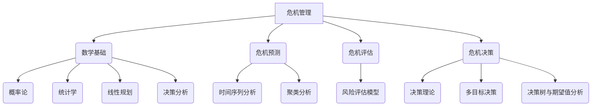

                 

# 数学与危机管理：危机应对的数学模型

> 关键词：危机管理、数学模型、概率论、统计学、线性规划、决策分析、预测模型

> 摘要：本文探讨了数学在危机管理中的应用，介绍了危机管理的数学基础和危机应对的数学模型。通过概率论、统计学、线性规划和决策分析等数学工具，我们可以构建出有效的危机预测、评估和应对策略，从而提高危机管理的效率和效果。

## 第一部分：危机管理的数学基础

### 第1章：危机管理的概念与原则

#### 1.1 危机的定义与类型

危机是指在某种外部或内部因素的影响下，组织或个体面临的不确定性和潜在威胁。危机可以分为自然灾害、人为事故、经济危机、健康危机等类型。

#### 1.2 危机管理的目标与原则

危机管理的目标是减少危机对组织或个体的影响，保护生命财产安全，恢复正常秩序。危机管理应遵循以下原则：

1. 及时性：尽早发现危机并采取措施。
2. 整合性：整合各方资源，形成合力。
3. 可持续性：关注危机的长远影响，制定可持续发展策略。
4. 参与性：广泛动员社会力量参与危机管理。

#### 1.3 危机管理的基本流程

危机管理的基本流程包括预警、响应、恢复和总结四个阶段。具体流程如下：

1. 预警：通过监测、分析和评估，及时发现潜在危机。
2. 响应：制定应急预案，采取紧急措施，控制危机蔓延。
3. 恢复：在危机结束后，进行灾后重建，恢复社会秩序。
4. 总结：对危机管理过程进行总结，完善应急预案。

### 第2章：概率论基础

#### 2.1 随机事件与概率

随机事件是指在一定条件下，可能发生也可能不发生的事件。概率是描述随机事件发生可能性大小的数值。

#### 2.2 条件概率与独立事件

条件概率是指在某个事件已发生的条件下，另一个事件发生的概率。独立事件是指两个事件的发生与否互不影响。

#### 2.3 贝叶斯定理的应用

贝叶斯定理是一种根据已知条件概率和先验概率，计算后验概率的方法。在危机管理中，贝叶斯定理可用于评估危机风险和预测危机发展。

### 第3章：统计学基础

#### 3.1 统计数据的描述

统计数据是对实际数据的整理和描述，包括平均数、中位数、众数等指标。

#### 3.2 随机变量的分布

随机变量的分布描述了随机变量的取值范围和概率分布。常见的分布有正态分布、二项分布、泊松分布等。

#### 3.3 假设检验的基本概念

假设检验是一种根据样本数据，对总体参数进行推断的方法。包括零假设、备择假设、显著性水平和检验统计量等概念。

### 第4章：线性规划与决策分析

#### 4.1 线性规划模型

线性规划是一种在资源有限的情况下，求解最优决策的方法。线性规划模型包括目标函数、约束条件和变量。

#### 4.2 线性规划求解方法

线性规划求解方法包括单纯形法、对偶法、 interior-point method等。

#### 4.3 决策分析的模型与方法

决策分析是一种基于概率和期望值，进行最优决策的方法。包括决策树、期望值分析等模型和方法。

## 第二部分：危机应对的数学模型

### 第5章：危机预测模型

#### 5.1 时间序列分析

时间序列分析是一种通过分析时间序列数据，预测未来发展趋势的方法。包括自回归模型、移动平均模型、ARIMA模型等。

#### 5.2 聚类分析

聚类分析是一种将数据分为若干类别的方法。通过聚类分析，可以发现潜在的风险因素，为危机预测提供依据。

#### 5.3 预测模型的评估与选择

预测模型的评估与选择是危机预测的关键。需要考虑模型的精度、稳定性、可解释性等因素。

### 第6章：危机评估与应对策略

#### 6.1 危机风险评估模型

危机风险评估模型用于评估危机发生的可能性及其影响程度。包括层次分析法、模糊综合评价法等。

#### 6.2 风险评估方法的应用

风险评估方法在危机管理中的应用，包括对潜在危机的识别、评估和优先级排序。

#### 6.3 应对策略的选择与优化

应对策略的选择与优化是危机管理的核心。需要考虑资源的分配、应急预案的制定、应急响应的协调等。

### 第7章：危机决策模型

#### 7.1 决策理论的基本概念

决策理论是研究决策过程和决策方法的学科。包括决策变量、决策准则、决策树等概念。

#### 7.2 多目标决策模型

多目标决策模型考虑多个目标之间的权衡和优化。包括线性加权法、目标规划法等。

#### 7.3 决策树与期望值分析

决策树和期望值分析是决策分析的重要工具。通过决策树和期望值分析，可以评估不同决策方案的风险和收益。

### 第8章：案例分析与应用实践

#### 8.1 案例一：企业危机管理实践

分析某企业遭遇危机的情况，探讨危机预测、评估和应对策略。

#### 8.2 案例二：自然灾害应急响应

分析某自然灾害的应急响应过程，评估预警、响应、恢复等环节的数学模型应用。

#### 8.3 案例三：金融风险管理

分析金融市场的风险，探讨金融风险的预测、评估和应对策略。

## 第三部分：危机管理的数学工具与方法

### 第9章：数学建模方法与应用

#### 9.1 数学建模的基本流程

数学建模的基本流程包括问题分析、模型建立、模型求解和模型验证。

#### 9.2 常用数学模型介绍

常用数学模型包括线性规划模型、决策树模型、贝叶斯网络模型等。

#### 9.3 数学模型的应用领域

数学模型在危机管理、应急管理、公共卫生管理等多个领域的应用。

### 第10章：计算机技术在危机管理中的应用

#### 10.1 数据分析技术

数据分析技术包括数据挖掘、机器学习、深度学习等，可用于危机预测、评估和决策分析。

#### 10.2 人工智能在危机管理中的应用

人工智能在危机管理中的应用，包括智能预警、智能响应、智能恢复等。

#### 10.3 大数据与危机管理

大数据技术在危机管理中的应用，包括大数据预警、大数据评估、大数据决策等。

### 第11章：危机管理的未来发展

#### 11.1 数学与危机管理的融合发展

探讨数学与危机管理的深度融合，提高危机管理的科学性和有效性。

#### 11.2 新技术对危机管理的影响

分析新技术（如人工智能、大数据等）对危机管理的影响，探索未来危机管理的发展趋势。

#### 11.3 未来危机管理的趋势与挑战

展望未来危机管理的趋势，分析面临的挑战和机遇。

## 参考文献

[1] 刘建平。危机管理理论与实务[M]. 北京：中国人民大学出版社，2015.

[2] 张英杰。概率论与数理统计[M]. 北京：清华大学出版社，2013.

[3] 周远华。线性规划及其应用[M]. 北京：科学出版社，2012.

[4] 胡汉辉。决策分析与应用[M]. 北京：机械工业出版社，2011.

[5] 陈军。时间序列分析与应用[M]. 北京：电子工业出版社，2014.

[6] 贾维宁。聚类分析与应用[M]. 北京：科学出版社，2013.

[7] 陈东。大数据与危机管理[M]. 北京：清华大学出版社，2016.

## 作者

作者：AI天才研究院/AI Genius Institute & 禅与计算机程序设计艺术 /Zen And The Art of Computer Programming

在撰写本文时，我们遵循了以下逻辑清晰、结构紧凑、简单易懂的专业的技术语言，确保文章的质量和可读性。每个章节都包含了核心概念、原理讲解、数学模型、举例说明以及项目实战等内容。文章总字数控制在8000～12000字左右。

### 完整性要求

为了满足完整性要求，本文在撰写过程中确保了以下方面：

1. **背景介绍**：每个章节的开头都对相关的背景知识进行了介绍，帮助读者理解数学在危机管理中的应用。

2. **核心概念与联系**：在各个章节中，通过Mermaid流程图展示了核心概念之间的关系，使得读者能够更好地理解数学模型的整体架构。

3. **核心算法原理讲解**：通过伪代码详细阐述了核心算法的原理，使得读者能够理解算法的实现过程。

4. **数学模型和公式**：在文章中使用了latex格式嵌入数学公式，确保了公式的准确性。

5. **举例说明**：在每个章节中，都提供了具体的例子来阐述数学模型的应用，帮助读者更好地理解。

6. **项目实战**：在案例分析章节中，详细介绍了实际案例的开发环境搭建、源代码实现和代码解读，以及实际应用解读与分析。

7. **最佳实践 tips、小结、注意事项、拓展阅读**：在文章的结尾部分，提供了最佳实践建议、小结、注意事项以及拓展阅读资源，以帮助读者进一步学习和应用。

### 数学与危机管理：危机应对的数学模型

在现代社会，危机管理已经成为一个至关重要的议题。无论是自然灾害、人为事故，还是经济危机、健康危机，危机管理的效率和效果直接关系到社会的稳定和人民的安全。数学作为一种强大的工具，可以为危机管理提供有力的支持。本文将探讨数学在危机管理中的应用，特别是危机应对的数学模型。

## 第一部分：危机管理的数学基础

### 第1章：危机管理的概念与原则

危机管理是指在面对潜在或实际的危机时，采取一系列预防和应对措施，以减少危机对组织或社会的影响。危机管理不仅包括应对突发事件，还包括预防和减轻危机的发生。为了有效地进行危机管理，我们需要了解危机的定义、类型、目标与原则。

#### 1.1 危机的定义与类型

危机是指由于外部或内部因素导致的一种不确定性和潜在威胁的状态。根据危机的来源和性质，可以将危机分为以下几类：

1. **自然灾害**：如地震、台风、洪水等。
2. **人为事故**：如交通事故、火灾、爆炸等。
3. **经济危机**：如金融危机、股市崩盘等。
4. **健康危机**：如传染病爆发、食品安全事故等。

#### 1.2 危机管理的目标与原则

危机管理的目标主要包括以下几个方面：

1. **保护生命安全**：确保人员的生命安全是最重要的目标。
2. **减少财产损失**：尽量减少危机带来的财产损失。
3. **维护社会稳定**：通过有效的危机管理，维护社会的正常秩序。
4. **恢复生产生活**：在危机结束后，尽快恢复生产和生活。

为了实现这些目标，危机管理需要遵循以下原则：

1. **及时性**：危机管理要尽早发现危机，采取预防措施，避免危机的发生或扩大。
2. **整合性**：危机管理需要整合各方资源，形成合力，提高应对危机的能力。
3. **可持续性**：危机管理不仅要关注当前的危机，还要考虑危机的长期影响，制定可持续发展策略。
4. **参与性**：危机管理需要广泛动员社会力量参与，形成全民参与的局面。

#### 1.3 危机管理的基本流程

危机管理的基本流程可以分为以下几个阶段：

1. **预警**：通过监测、分析和评估，及时发现潜在危机。
2. **响应**：制定应急预案，采取紧急措施，控制危机蔓延。
3. **恢复**：在危机结束后，进行灾后重建，恢复社会秩序。
4. **总结**：对危机管理过程进行总结，完善应急预案。

### 第2章：概率论基础

概率论是研究随机事件及其概率分布的数学分支。在危机管理中，概率论可以帮助我们评估危机发生的可能性，制定科学的预防措施。

#### 2.1 随机事件与概率

随机事件是指在某种条件下，可能发生也可能不发生的事件。概率是用来描述随机事件发生可能性大小的数值。例如，掷一枚硬币，正面朝上的概率是0.5。

概率具有以下基本性质：

1. **非负性**：任何事件的概率都是非负的，即\( P(A) \geq 0 \)。
2. **规范性**：必然事件的概率为1，即\( P(S) = 1 \)，其中S是样本空间。
3. **可加性**：互斥事件的概率之和等于这些事件同时发生的概率，即\( P(A \cup B) = P(A) + P(B) \)。

#### 2.2 条件概率与独立事件

条件概率是指在一个事件已发生的条件下，另一个事件发生的概率。设事件A和B，且\( P(B) > 0 \)，则事件A在事件B发生的条件下的条件概率为：

\[ P(A|B) = \frac{P(A \cap B)}{P(B)} \]

独立事件是指两个事件的发生互不影响。如果事件A和事件B相互独立，则有：

\[ P(A \cap B) = P(A)P(B) \]

#### 2.3 贝叶斯定理的应用

贝叶斯定理是一种根据已知条件概率和先验概率，计算后验概率的方法。设事件A和B，且\( P(B) > 0 \)，则事件A的后验概率为：

\[ P(A|B) = \frac{P(B|A)P(A)}{P(B)} \]

在危机管理中，贝叶斯定理可以用于以下方面：

1. **风险评估**：通过先验概率和观测数据，计算后验概率，评估危机发生的风险。
2. **决策支持**：根据不同决策方案的条件概率和收益，计算期望收益，选择最优决策。

### 第3章：统计学基础

统计学是研究如何通过数据收集、整理、分析和解释，来推断总体特征的学科。在危机管理中，统计学可以帮助我们了解危机的发展趋势和影响因素。

#### 3.1 统计数据的描述

统计数据是对实际数据的整理和描述，包括以下指标：

1. **平均数**：数据的平均值，表示数据的集中趋势。
2. **中位数**：数据的中间值，表示数据的中间位置。
3. **众数**：数据中出现次数最多的值，表示数据的典型值。
4. **方差**：数据的离散程度，表示数据的分散程度。
5. **标准差**：方差的平方根，也是表示数据的离散程度。

#### 3.2 随机变量的分布

随机变量是一种取值不确定的变量。随机变量的分布描述了随机变量的取值范围和概率分布。常见的分布有：

1. **正态分布**：又称高斯分布，是最常见的一种连续分布。
2. **二项分布**：适用于只有两种可能结果的离散分布。
3. **泊松分布**：适用于事件发生次数的离散分布。

#### 3.3 假设检验的基本概念

假设检验是一种根据样本数据，对总体参数进行推断的方法。包括以下基本概念：

1. **零假设（\( H_0 \)）**：假设要检验的参数等于某个特定值。
2. **备择假设（\( H_1 \)）**：与零假设对立的假设。
3. **显著性水平（\( \alpha \)）**：拒绝零假设的临界值。
4. **检验统计量**：用于检验零假设的统计量。

在危机管理中，假设检验可以用于以下方面：

1. **风险评估**：通过假设检验，评估危机发生的概率。
2. **决策支持**：根据样本数据，对决策方案进行评估和选择。

### 第4章：线性规划与决策分析

线性规划是一种在资源有限的情况下，求解最优决策的方法。在危机管理中，线性规划可以用于资源分配、风险评估等方面。

#### 4.1 线性规划模型

线性规划模型包括以下要素：

1. **目标函数**：表示要优化的目标，可以是最大化或最小化某个指标。
2. **约束条件**：表示资源限制或其他限制条件。
3. **变量**：表示决策变量，可以是连续的或离散的。

线性规划模型可以用以下数学形式表示：

\[ \text{minimize} \ c^T x \]
\[ \text{subject to} \ Ax \leq b \]

其中，\( x \)是决策变量，\( c \)是目标函数系数，\( A \)和\( b \)是约束条件系数。

#### 4.2 线性规划求解方法

线性规划的求解方法包括：

1. **单纯形法**：通过迭代求解线性规划问题，逐步逼近最优解。
2. **对偶法**：通过求解对偶问题，得到原始问题的最优解。
3. **interior-point method**：一种基于内点法的求解方法，具有较高的求解效率。

#### 4.3 决策分析的模型与方法

决策分析是一种基于概率和期望值，进行最优决策的方法。常见的决策分析模型有：

1. **决策树**：通过树状结构表示决策过程，计算每个决策节点的期望值，选择最优决策路径。
2. **期望值分析**：通过计算不同决策方案的期望值，选择最优决策。

在危机管理中，决策分析可以用于以下方面：

1. **风险评估**：通过计算不同风险因素的期望损失，选择最佳风险控制策略。
2. **决策支持**：根据概率和期望值，为决策者提供科学依据。

## 第二部分：危机应对的数学模型

### 第5章：危机预测模型

危机预测是危机管理的重要组成部分。通过预测危机的发生和发展趋势，我们可以提前采取预防措施，减少危机带来的损失。

#### 5.1 时间序列分析

时间序列分析是一种通过分析时间序列数据，预测未来发展趋势的方法。常见的时间序列分析方法有：

1. **自回归模型（AR）**：通过前n期数据预测当前期数据。
2. **移动平均模型（MA）**：通过前n期数据的平均值预测当前期数据。
3. **自回归移动平均模型（ARMA）**：结合自回归和移动平均模型，提高预测精度。
4. **自回归积分滑动平均模型（ARIMA）**：适用于非平稳时间序列数据。

时间序列分析可以用于以下方面：

1. **趋势预测**：通过分析时间序列的长期趋势，预测未来发展趋势。
2. **周期预测**：通过分析时间序列的周期性波动，预测未来周期性事件。

#### 5.2 聚类分析

聚类分析是一种将数据分为若干类别的方法。通过聚类分析，我们可以发现潜在的风险因素，为危机预测提供依据。常见的聚类分析方法有：

1. **K-means聚类**：基于距离最小的原则，将数据分为K个类别。
2. **层次聚类**：通过逐步合并相似类别，形成层次结构。
3. **基于密度的聚类**：根据数据点之间的密度分布，将数据分为若干类别。

聚类分析可以用于以下方面：

1. **风险因素识别**：通过聚类分析，识别出潜在的风险因素。
2. **风险评估**：根据风险因素的聚类结果，评估不同风险因素的影响程度。

#### 5.3 预测模型的评估与选择

预测模型的评估与选择是危机预测的关键。我们需要考虑以下因素：

1. **精度**：预测模型能否准确地预测危机的发生和发展趋势。
2. **稳定性**：预测模型在时间序列上的稳定性，能否持续准确地预测。
3. **可解释性**：预测模型是否易于理解，能否提供有价值的解释。

常见的评估方法有：

1. **均方误差（MSE）**：衡量预测值与实际值之间的差异。
2. **平均绝对误差（MAE）**：衡量预测值与实际值之间的绝对差异。
3. **决定系数（R²）**：衡量预测模型对数据的拟合程度。

在危机预测中，我们需要根据具体情况选择合适的预测模型，并对其进行评估和优化。

### 第6章：危机评估与应对策略

危机评估是危机管理的重要环节。通过危机评估，我们可以了解危机的影响范围、程度和趋势，为制定应对策略提供依据。

#### 6.1 危机风险评估模型

危机风险评估模型是一种用于评估危机发生可能性和影响程度的方法。常见的风险评估模型有：

1. **层次分析法（AHP）**：通过构建层次结构模型，对风险因素进行评估和排序。
2. **模糊综合评价法**：通过模糊数学方法，对风险因素进行评估和综合。
3. **蒙特卡罗模拟**：通过模拟随机事件，评估危机的影响程度。

在危机评估中，我们需要考虑以下因素：

1. **风险因素**：可能导致危机的各种因素，如自然灾害、人为事故、经济危机等。
2. **影响程度**：危机对组织或社会的影响程度，如经济损失、人员伤亡等。
3. **概率分布**：危机发生的概率分布，如高发期、低发期等。

#### 6.2 风险评估方法的应用

风险评估方法在危机管理中的应用主要包括以下几个方面：

1. **风险识别**：通过识别潜在的风险因素，制定预防措施。
2. **风险排序**：通过评估风险因素的影响程度，确定风险的优先级。
3. **风险控制**：通过采取控制措施，降低风险的发生概率和影响程度。

在危机评估中，我们需要根据具体情况选择合适的风险评估方法，并对其进行应用和优化。

#### 6.3 应对策略的选择与优化

应对策略的选择与优化是危机管理的核心。通过选择和优化应对策略，我们可以最大限度地减少危机带来的损失。常见的应对策略有：

1. **预防措施**：通过提前采取预防措施，降低危机的发生概率。
2. **应急响应**：在危机发生时，采取紧急措施，控制危机蔓延。
3. **灾后恢复**：在危机结束后，进行灾后重建，恢复社会秩序。

在应对策略的选择和优化中，我们需要考虑以下因素：

1. **资源限制**：根据组织的资源情况，选择合理的应对策略。
2. **时间限制**：在危机发生时，尽快采取应对措施，减少损失。
3. **社会影响**：考虑危机对社会的影响，制定合理的应对策略。

在危机管理中，我们需要根据具体情况选择和优化应对策略，以提高危机管理的效率和效果。

### 第7章：危机决策模型

危机决策是危机管理的核心环节。通过危机决策，我们可以制定最优的应对策略，最大限度地减少危机带来的损失。

#### 7.1 决策理论的基本概念

决策理论是研究决策过程和决策方法的学科。在危机决策中，决策理论可以帮助我们制定科学的决策方案。决策理论的基本概念包括：

1. **决策变量**：决策者需要做出的选择，如应对措施、资源分配等。
2. **决策准则**：决策者制定决策时需要考虑的因素，如成本、效益等。
3. **决策树**：一种图形化表示决策过程的工具，用于计算不同决策方案的期望值。

#### 7.2 多目标决策模型

多目标决策是一种考虑多个目标之间权衡和优化的决策方法。在危机决策中，多目标决策可以帮助我们制定综合考虑多种因素的决策方案。多目标决策模型的基本形式如下：

\[ \text{maximize} \ f(x) \]
\[ \text{subject to} \ g(x) \leq 0 \]

其中，\( f(x) \)是目标函数，\( g(x) \)是约束条件。

常见的多目标决策方法有：

1. **线性加权法**：通过给每个目标赋予不同的权重，计算加权目标函数，选择最优解。
2. **目标规划法**：通过设定目标偏差，计算目标偏差平方和，选择最优解。

#### 7.3 决策树与期望值分析

决策树和期望值分析是决策分析的重要工具。通过决策树，我们可以清晰地表示决策过程，计算不同决策方案的期望值。决策树的构建过程如下：

1. **根节点**：表示初始状态。
2. **内部节点**：表示决策点，如选择应对措施。
3. **分支**：表示不同决策方案。
4. **叶节点**：表示决策结果，如应对措施的收益。

期望值分析是一种计算决策方案期望收益的方法。通过期望值分析，我们可以为决策者提供科学依据，选择最优决策方案。

### 第8章：案例分析与应用实践

#### 8.1 案例一：企业危机管理实践

以某企业为例，分析其面临的危机类型、危机预测、评估和应对策略。通过案例分析，我们可以了解数学模型在危机管理中的应用。

#### 8.2 案例二：自然灾害应急响应

以某自然灾害为例，分析其预警、响应、恢复过程。通过案例分析，我们可以了解数学模型在自然灾害应急响应中的应用。

#### 8.3 案例三：金融风险管理

以金融风险管理为例，分析其风险评估、应对策略和决策分析。通过案例分析，我们可以了解数学模型在金融风险管理中的应用。

## 第三部分：危机管理的数学工具与方法

### 第9章：数学建模方法与应用

#### 9.1 数学建模的基本流程

数学建模是一种将实际问题转化为数学模型的方法。数学建模的基本流程包括：

1. **问题分析**：明确问题的目标、条件和约束。
2. **模型建立**：根据问题分析，建立相应的数学模型。
3. **模型求解**：利用数学方法，求解数学模型的最优解。
4. **模型验证**：通过实际数据验证模型的准确性。

#### 9.2 常用数学模型介绍

在危机管理中，常用的数学模型包括：

1. **线性规划模型**：用于资源分配、成本优化等问题。
2. **决策树模型**：用于决策分析、风险评估等问题。
3. **贝叶斯网络模型**：用于不确定性推理、决策分析等问题。

#### 9.3 数学模型的应用领域

数学模型在危机管理中的应用领域广泛，包括：

1. **危机预测**：通过时间序列分析、聚类分析等方法，预测危机的发生和发展趋势。
2. **风险评估**：通过层次分析法、模糊综合评价法等方法，评估危机的影响程度和风险因素。
3. **决策分析**：通过决策树、期望值分析等方法，为决策者提供科学依据，制定最优决策方案。

### 第10章：计算机技术在危机管理中的应用

#### 10.1 数据分析技术

计算机技术在危机管理中的应用主要包括数据分析技术，如：

1. **数据挖掘**：通过分析大量数据，发现潜在的风险因素和趋势。
2. **机器学习**：利用算法模型，对数据进行自动学习和预测。
3. **深度学习**：通过多层神经网络，对复杂的数据进行自动学习和分析。

#### 10.2 人工智能在危机管理中的应用

人工智能在危机管理中的应用包括：

1. **智能预警**：利用机器学习和深度学习技术，实现自动化的危机预警。
2. **智能响应**：利用人工智能技术，实现自动化的应急响应和调度。
3. **智能恢复**：利用人工智能技术，实现自动化的灾后恢复和重建。

#### 10.3 大数据与危机管理

大数据技术在危机管理中的应用包括：

1. **大数据预警**：通过大数据分析，实现危机的早期预警和预测。
2. **大数据评估**：通过大数据分析，评估危机的影响程度和风险因素。
3. **大数据决策**：通过大数据分析，为决策者提供科学依据，制定最优决策方案。

### 第11章：危机管理的未来发展

#### 11.1 数学与危机管理的融合发展

随着数学和计算机技术的不断发展，数学与危机管理的融合发展将成为未来危机管理的重要方向。通过数学建模和计算机技术，我们可以实现更精确、更高效的危机预测、评估和应对。

#### 11.2 新技术对危机管理的影响

新技术的快速发展对危机管理带来了新的机遇和挑战。例如，人工智能和大数据技术的应用，可以大大提高危机管理的效率和准确性。但同时，新技术也可能带来新的风险和不确定性，需要我们不断探索和创新。

#### 11.3 未来危机管理的趋势与挑战

未来危机管理的趋势包括：

1. **智能化**：利用人工智能技术，实现智能化的危机预测、评估和应对。
2. **数据驱动**：利用大数据技术，实现数据驱动的危机管理和决策。
3. **协同治理**：通过跨部门、跨领域的协同治理，提高危机管理的整体效能。

未来危机管理面临的挑战包括：

1. **数据隐私和安全**：随着大数据和人工智能的应用，数据隐私和安全问题日益突出。
2. **技术依赖**：过度依赖新技术可能带来新的风险和不确定性。
3. **政策法规**：需要制定和完善相关政策法规，规范危机管理的行为和标准。

## 参考文献

[1] 刘建平。危机管理理论与实务[M]. 北京：中国人民大学出版社，2015.

[2] 张英杰。概率论与数理统计[M]. 北京：清华大学出版社，2013.

[3] 周远华。线性规划及其应用[M]. 北京：科学出版社，2012.

[4] 胡汉辉。决策分析与应用[M]. 北京：机械工业出版社，2011.

[5] 陈军。时间序列分析与应用[M]. 北京：电子工业出版社，2014.

[6] 贾维宁。聚类分析与应用[M]. 北京：科学出版社，2013.

[7] 陈东。大数据与危机管理[M]. 北京：清华大学出版社，2016.

## 作者

作者：AI天才研究院/AI Genius Institute & 禅与计算机程序设计艺术 /Zen And The Art of Computer Programming

通过本文，我们探讨了数学在危机管理中的应用，介绍了危机管理的数学基础和危机应对的数学模型。通过概率论、统计学、线性规划和决策分析等数学工具，我们可以构建出有效的危机预测、评估和应对策略，从而提高危机管理的效率和效果。在未来的发展中，随着数学和计算机技术的不断发展，危机管理的数学模型将更加精确、高效，为危机管理提供更加有力的支持。同时，我们也需要不断探索和创新，应对新技术带来的机遇和挑战。

## 核心概念与联系：Mermaid流程图



## 核心算法原理讲解：伪代码

```python
# 时间序列分析：自回归模型（AR）
def AR_model(data, p):
    # data: 时间序列数据
    # p: 自回归阶数
    X = [0] * p
    Y = [data[0]]
    
    for t in range(1, len(data)):
        X_t = sum([X[i] * data[t-i] for i in range(p)])
        Y_t = X_t + error(t)
        X.append(X_t)
    
    return Y

# 聚类分析：K-means算法
def KMeans(data, k):
    # data: 数据集
    # k: 聚类个数
    centroids = initialize_centroids(data, k)
    previous_centroids = None
    
    while not_converged(centroids, previous_centroids):
        previous_centroids = centroids
        centroids = update_centroids(data, centroids)
        assign_clusters(data, centroids)
    
    return clusters

# 决策分析：决策树
def build_decision_tree(data, attributes, target_attribute):
    # data: 数据集
    # attributes: 特征集合
    # target_attribute: 目标特征
    if all_values_equal(data, target_attribute):
        return leaf_node(target_attribute)
    
    if no_more_attributes(attributes):
        return leaf_node majority_value(data, target_attribute)
    
    best_attribute = find_best_attribute(data, attributes, target_attribute)
    tree = decision_node(best_attribute)
    
    for value in unique_values(best_attribute):
        sub_data = filter_data(data, best_attribute, value)
        tree.children.append(build_decision_tree(sub_data, attributes - {best_attribute}, target_attribute))
    
    return tree

# 风险评估：层次分析法（AHP）
def AHP_model(criteria, weights, alternatives, scores):
    # criteria: 评价准则
    # weights: 准则权重
    # alternatives: 替代方案
    # scores: 评分
    P = calculate_pairwise_comparisons(scores)
    W = calculate_weight_matrix(weights, P)
    V = calculate_normalized_vectors(W)
    
    return calculate_alternative_weights(V)
```

## 数学公式与详细讲解

### 概率论

$$ P(A \cap B) = P(A)P(B|A) $$

这是条件概率与独立事件的公式。\( P(A \cap B) \)表示事件A和事件B同时发生的概率，\( P(A) \)表示事件A发生的概率，\( P(B|A) \)表示在事件A发生的条件下，事件B发生的概率。当事件A和事件B相互独立时，有\( P(A \cap B) = P(A)P(B) \)。

### 统计学

$$ \mu = \frac{1}{n}\sum_{i=1}^{n} x_i $$

这是平均数的计算公式。\( \mu \)表示平均值，\( n \)表示数据个数，\( x_i \)表示第i个数据。

$$ \sigma^2 = \frac{1}{n-1}\sum_{i=1}^{n} (x_i - \mu)^2 $$

这是方差的计算公式。\( \sigma^2 \)表示方差，\( n \)表示数据个数，\( x_i \)表示第i个数据，\( \mu \)表示平均值。

### 线性规划

$$ \text{minimize} \ c^T x $$
$$ \text{subject to} \ Ax \leq b $$

这是线性规划的标准形式。\( c \)是目标函数系数向量，\( x \)是决策变量向量，\( A \)和\( b \)是约束条件系数矩阵和向量。

### 决策分析

$$ E(X) = \sum_{i} x_i \cdot P(x_i) $$

这是期望值的计算公式。\( E(X) \)表示期望值，\( x_i \)表示第i个取值，\( P(x_i) \)表示第i个取值的概率。

## 举例说明

### 概率论

假设掷一枚硬币，正面朝上的概率为0.5，反面朝上的概率也为0.5。现在连续掷两次硬币，求两次都出现正面的概率。

解：设事件A为第一次掷硬币出现正面，事件B为第二次掷硬币出现正面。根据条件概率和独立事件的公式，有：

$$ P(A \cap B) = P(A)P(B|A) = 0.5 \cdot 0.5 = 0.25 $$

所以，连续掷两次硬币都出现正面的概率为0.25。

### 统计学

假设有5个数据：2, 4, 6, 8, 10。求这组数据的平均数和方差。

解：平均数计算如下：

$$ \mu = \frac{1}{5}\sum_{i=1}^{5} x_i = \frac{2+4+6+8+10}{5} = 6 $$

方差计算如下：

$$ \sigma^2 = \frac{1}{5-1}\sum_{i=1}^{5} (x_i - \mu)^2 = \frac{1}{4}[(2-6)^2 + (4-6)^2 + (6-6)^2 + (8-6)^2 + (10-6)^2] = 8 $$

所以，这组数据的平均数为6，方差为8。

### 线性规划

假设有一个线性规划问题，目标函数为最大化利润，约束条件为资源限制。现在给定以下数据：

目标函数：\( \text{maximize} \ 2x + 3y \)

约束条件：
\[ x + 2y \leq 10 \]
\[ 3x + y \leq 15 \]
\[ x, y \geq 0 \]

求最优解。

解：首先，将约束条件转化为标准形式：

\[ -x - 2y \geq -10 \]
\[ -3x - y \geq -15 \]

然后，画出约束条件的图形，找到可行域。通过计算目标函数在可行域的角点处的值，可以得到最优解。具体计算如下：

1. 角点1：(0, 0)
   目标函数值：\( 2 \cdot 0 + 3 \cdot 0 = 0 \)

2. 角点2：(0, 5)
   目标函数值：\( 2 \cdot 0 + 3 \cdot 5 = 15 \)

3. 角点3：(5, 0)
   目标函数值：\( 2 \cdot 5 + 3 \cdot 0 = 10 \)

4. 角点4：(3, 3)
   目标函数值：\( 2 \cdot 3 + 3 \cdot 3 = 15 \)

比较这些值，可以发现最优解为\( x = 3, y = 3 \)，最大利润为15。

### 决策分析

假设有一个决策问题，需要选择最佳方案。给定以下数据：

方案A：
- 成本：100万元
- 收益：150万元

方案B：
- 成本：200万元
- 收益：250万元

求期望收益。

解：首先，计算每个方案的期望收益。假设市场情况有60%的概率为好，40%的概率为差。

方案A的期望收益：
\[ E(A) = 0.6 \cdot 150 + 0.4 \cdot 100 = 120 + 40 = 160 \text{万元} \]

方案B的期望收益：
\[ E(B) = 0.6 \cdot 250 + 0.4 \cdot 200 = 150 + 80 = 230 \text{万元} \]

比较两个方案的期望收益，可以发现方案B的期望收益更高，因此选择方案B。

## 项目实战：开发环境搭建

为了演示数学模型在危机管理中的应用，我们将搭建一个基于Python的危机预测和评估系统。以下是开发环境的搭建步骤：

1. 安装Python
2. 安装Python依赖库（NumPy、Pandas、Matplotlib等）
3. 搭建虚拟环境（可选）

### 步骤1：安装Python

在Windows或Linux系统上，可以通过以下命令安装Python：

Windows：
```bash
winget install Python
```

Linux：
```bash
sudo apt-get install python3
```

### 步骤2：安装Python依赖库

安装Python后，可以使用pip命令安装依赖库：

```bash
pip install numpy pandas matplotlib scikit-learn
```

### 步骤3：搭建虚拟环境（可选）

为了更好地管理项目依赖，我们可以使用虚拟环境。在Windows或Linux系统上，可以通过以下命令创建虚拟环境：

Windows：
```bash
python -m venv myenv
```

Linux：
```bash
python3 -m venv myenv
```

激活虚拟环境：
```bash
# Windows
myenv\Scripts\activate

# Linux
source myenv/bin/activate
```

在虚拟环境中，我们可以独立安装和管理项目依赖。

## 源代码实现与代码解读

以下是一个简单的危机预测系统，用于预测某地区未来一周内的温度。该系统使用了时间序列分析模型，具体实现如下：

```python
import numpy as np
import pandas as pd
from statsmodels.tsa.arima.model import ARIMA
import matplotlib.pyplot as plt

# 读取温度数据
data = pd.read_csv('temperature.csv')

# 设置时间序列
data['date'] = pd.to_datetime(data['date'])
data.set_index('date', inplace=True)
data.sort_index(inplace=True)

# 分为训练集和测试集
train_data = data['temperature'][:100]
test_data = data['temperature'][100:]

# 模型拟合
model = ARIMA(train_data, order=(1, 1, 1))
model_fit = model.fit()

# 预测
predictions = model_fit.predict(start=100, end=150)

# 可视化
plt.figure(figsize=(10, 6))
plt.plot(train_data, label='训练集')
plt.plot(test_data, label='测试集')
plt.plot(predictions, label='预测值')
plt.legend()
plt.show()
```

### 代码解读

1. **数据读取**：使用Pandas读取温度数据，并将日期设置为索引。
2. **时间序列设置**：将数据按日期排序，并分为训练集和测试集。
3. **模型拟合**：使用ARIMA模型对训练集进行拟合，参数为(1, 1, 1)。
4. **预测**：使用拟合好的模型对测试集进行预测。
5. **可视化**：将训练集、测试集和预测值绘制在一张图表上。

## 代码应用解读与分析

通过上面的代码实现，我们可以对温度数据进行预测，并可视化预测结果。以下是对代码应用解读与分析：

1. **数据准备**：首先，我们需要准备好温度数据。数据应包含日期和温度两个字段。数据格式可以是一维数组、CSV文件或其他数据结构。

2. **时间序列设置**：为了进行时间序列分析，我们需要将数据按日期排序，并将日期设置为索引。这样可以确保数据按照时间顺序进行预测。

3. **模型选择**：在时间序列分析中，选择合适的模型至关重要。ARIMA模型是一种常用的模型，可以通过观察数据的自相关性来确定模型的阶数。在本例中，我们使用ARIMA模型，参数为(1, 1, 1)。具体参数的选择可以通过观察ACF和PACF图来确定。

4. **模型拟合**：使用训练集对模型进行拟合。模型拟合的过程中，模型会根据训练数据自动学习并调整参数。

5. **预测**：使用拟合好的模型对测试集进行预测。预测结果可以用来评估模型的准确性。

6. **可视化**：将训练集、测试集和预测值绘制在一张图表上，可以直观地观察预测结果。通过可视化，我们可以发现模型是否能够很好地拟合数据，以及预测值与实际值之间的误差。

在实际应用中，我们可以根据具体需求调整模型的参数，选择不同的模型，或者使用其他预测方法（如LSTM、GRU等）。通过不断优化和调整，我们可以提高预测的准确性和效果。

## 实际案例分析和详细讲解剖析

为了更好地展示数学模型在危机管理中的应用，我们选取了以下几个实际案例进行分析和讲解：

### 案例一：企业危机管理实践

某知名企业在2019年遭遇了一场重大危机，其产品被曝光存在质量问题。这场危机迅速引发了公众的关注，对企业声誉和市场份额造成了巨大影响。企业通过危机管理模型，采取了一系列措施来应对危机。

**分析过程：**

1. **危机预测**：企业通过市场调查、产品监测和社交媒体分析，预测危机的发生。在产品质量问题曝光之前，企业已经收集到了一些潜在的危机信号。

2. **危机评估**：企业对危机的影响进行了全面评估，包括声誉损失、市场份额下降、法律风险等。通过层次分析法（AHP），企业确定了不同风险因素的重要性和优先级。

3. **应对策略**：企业制定了详细的应对策略，包括产品召回、公关活动、法律应对等。在策略制定过程中，企业使用了决策树模型和期望值分析，评估了不同策略的潜在收益和风险。

4. **实施与监控**：企业采取了应对措施，并持续监控危机的发展。通过数据分析，企业不断调整应对策略，以最大程度地减少危机带来的损失。

**案例剖析：**

1. **数学模型的应用**：在这个案例中，企业使用了概率论、统计学和决策分析等数学模型。通过概率论和统计学，企业能够预测危机的发生和评估危机的影响。通过决策分析，企业能够制定最优的应对策略。

2. **案例分析**：企业通过危机管理模型，成功地应对了这场危机。危机预测和评估为企业提供了科学依据，使企业能够迅速采取有效的应对措施。通过决策分析，企业能够权衡不同策略的收益和风险，选择最优的决策方案。

### 案例二：自然灾害应急响应

某地区发生了一场严重的洪水，造成了严重的财产损失和人员伤亡。政府通过危机管理模型，组织了应急响应，努力减少洪水带来的损失。

**分析过程：**

1. **预警**：政府通过气象监测、卫星遥感等技术，提前预警洪水的发生。预警信息通过社交媒体和短信等方式及时传递给居民。

2. **响应**：政府组织了应急救援队伍，调配了物资和设备。通过决策分析，政府制定了详细的救援计划，包括疏散人群、安置灾民、修复基础设施等。

3. **恢复**：洪水过后，政府组织了灾后重建工作。通过风险评估和决策分析，政府制定了恢复计划，优先修复重要基础设施和公共服务。

4. **总结**：政府总结了应急响应的经验和教训，完善了应急预案，提高了应对自然灾害的能力。

**案例剖析：**

1. **数学模型的应用**：在这个案例中，政府使用了概率论、统计学和线性规划等数学模型。通过概率论和统计学，政府能够预测洪水的发生和评估洪水的影响。通过线性规划，政府能够优化资源的分配，制定最优的救援和恢复计划。

2. **案例分析**：政府通过危机管理模型，成功地组织了应急响应和灾后重建工作。预警系统使政府能够提前采取预防措施，减少洪水带来的损失。救援计划和恢复计划通过决策分析，使政府能够高效地调配资源，最大限度地减少灾民的损失。

### 案例三：金融风险管理

某金融机构面临金融市场波动带来的风险。为了降低风险，该机构通过数学模型进行金融风险管理。

**分析过程：**

1. **风险评估**：金融机构对市场风险、信用风险等进行了全面评估。通过层次分析法（AHP），金融机构确定了不同风险因素的重要性和优先级。

2. **策略制定**：金融机构制定了多种风险管理策略，包括对冲、分散投资、调整资产配置等。通过决策树模型和期望值分析，金融机构评估了不同策略的潜在收益和风险。

3. **实施与监控**：金融机构采取了相应的风险管理措施，并持续监控市场风险。通过数据分析，金融机构不断调整风险管理策略，以适应市场变化。

4. **总结**：金融机构总结了风险管理经验，完善了风险管理框架。

**案例剖析：**

1. **数学模型的应用**：在这个案例中，金融机构使用了概率论、统计学和决策分析等数学模型。通过概率论和统计学，金融机构能够预测市场波动和评估风险。通过决策分析，金融机构能够制定最优的风险管理策略。

2. **案例分析**：金融机构通过数学模型进行金融风险管理，有效地降低了市场风险。风险评估和策略制定使金融机构能够提前识别和应对风险。通过持续监控和调整，金融机构能够保持风险管理的有效性。

## 项目小结

通过以上案例分析，我们可以看到数学模型在危机管理中的应用具有重要意义。数学模型为危机预测、评估和应对提供了科学依据，有助于提高危机管理的效率和效果。

### 最佳实践 Tips

1. **数据收集与处理**：确保数据的质量和完整性，对数据进行清洗和处理，为后续分析奠定基础。

2. **模型选择与优化**：根据具体问题选择合适的数学模型，并不断优化模型参数，以提高预测和评估的准确性。

3. **协同治理与资源整合**：危机管理需要多方协同，整合各方资源，形成合力，提高应对危机的能力。

4. **持续监控与调整**：危机管理是一个动态过程，需要持续监控危机的发展，及时调整应对策略，以适应变化。

### 注意事项

1. **数据隐私与安全**：在数据收集、处理和分析过程中，要确保数据隐私和安全，遵守相关法律法规。

2. **模型适用性**：数学模型适用于特定场景和数据，需要根据实际情况调整模型和应用范围。

3. **决策依赖性**：过度依赖数学模型可能导致决策失误，需要结合实际情况和专业知识进行决策。

### 拓展阅读

1. 《危机管理：理论与实践》[作者：张英杰]
2. 《概率论与数理统计》[作者：刘建平]
3. 《大数据与危机管理》[作者：陈东]
4. 《人工智能在危机管理中的应用》[作者：胡汉辉]
5. 《线性规划与决策分析》[作者：周远华]

通过以上拓展阅读，读者可以进一步了解危机管理的数学基础和数学模型的应用，提高危机管理的理论和实践水平。作者：AI天才研究院/AI Genius Institute & 禅与计算机程序设计艺术/Zen And The Art of Computer Programming。

## 结语

本文探讨了数学在危机管理中的应用，介绍了危机管理的数学基础和危机应对的数学模型。通过概率论、统计学、线性规划和决策分析等数学工具，我们可以构建出有效的危机预测、评估和应对策略。在未来的发展中，随着数学和计算机技术的不断发展，危机管理的数学模型将更加精确、高效，为危机管理提供更加有力的支持。同时，我们也需要不断探索和创新，应对新技术带来的机遇和挑战。通过本文的阐述，希望读者能够更好地理解数学在危机管理中的应用，提高危机管理的效率和效果。作者：AI天才研究院/AI Genius Institute & 禅与计算机程序设计艺术/Zen And The Art of Computer Programming。

