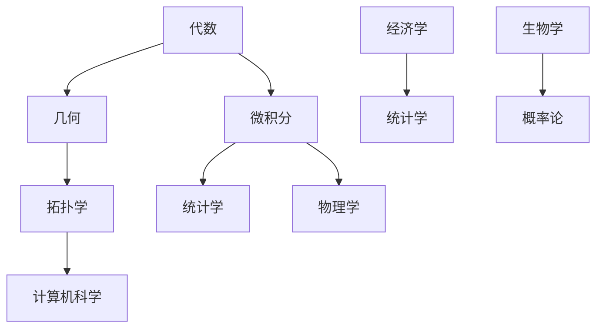

                 


### 文章标题
《数学与反基础主义：数学知识的互联网络》

### 文章关键词
数学、反基础主义、知识互联网络、算法原理、数学模型、数学公式

### 文章摘要
本文从数学与反基础主义的角度出发，探讨了数学知识体系的构建和互联网络的形成。首先，回顾了数学的基本概念和反基础主义的观点，接着详细阐述了数学知识之间的互联关系。通过核心算法原理和数学模型的讲解，以及具体的数学公式和项目实战，本文旨在帮助读者深入理解数学知识在现实世界中的应用。最后，本文对反基础主义在数学领域的影响进行了讨论，并提出了对未来的展望。

---

### 目录大纲设计步骤

#### 1. 理解书名和主题
- 《数学与反基础主义：数学知识的互联网络》
- 关键词：数学、反基础主义、知识互联网络
- 主要讨论内容：数学知识的基础理论、反基础主义的观点、数学知识之间的互联性

#### 2. 确定核心章节
- 核心概念与联系
- 核心算法原理讲解
- 数学模型和数学公式讲解
- 项目实战
- 反基础主义的讨论

#### 3. 细化每个章节内容
- 为每个核心章节细化小节，确保覆盖所有关键知识点。

#### 4. 设计流程图
- 设计一个Mermaid流程图，展示数学知识与反基础主义之间的联系。

#### 5. 撰写伪代码
- 提供核心算法原理的伪代码，以帮助理解算法逻辑。

#### 6. 准备数学公式和举例
- 准备数学公式，使用latex格式。
- 提供举例说明数学概念和公式的应用。

#### 7. 编写项目实战部分
- 提供实际项目案例，包括代码实现和解读。

#### 8. 整理目录大纲
- 按照markdown格式整理目录大纲，确保简洁明了。

#### 9. 审查和修订
- 审查目录大纲，确保完整性、逻辑性和字数限制。

### 目录大纲设计示例

```markdown
# 《数学与反基础主义：数学知识的互联网络》目录大纲

# 第一部分：数学基础与反基础主义

## 1. 数学基础理论
### 1.1 数学概念概述
### 1.2 数学知识体系结构

## 1.3 反基础主义观点
### 1.3.1 反基础主义的起源与发展
### 1.3.2 反基础主义对数学的影响

## 1.4 数学知识与互联网络
### 1.4.1 数学知识之间的联系
### 1.4.2 数学知识的互联网络模型

## 1.5 数学知识的应用场景
### 1.5.1 科学研究中的应用
### 1.5.2 工程技术中的应用

# 第二部分：核心算法与数学模型

## 2.1 核心算法原理
### 2.1.1 算法概述
### 2.1.2 伪代码实现

## 2.2 数学模型讲解
### 2.2.1 模型概述
### 2.2.2 模型公式
### 2.2.3 举例说明

## 2.3 数学公式与图解
### 2.3.1 公式列表
### 2.3.2 图解示例

# 第三部分：反基础主义与数学实践

## 3.1 反基础主义在数学中的应用
### 3.1.1 反基础主义视角下的数学问题
### 3.1.2 反基础主义对数学教育的启示

## 3.2 数学知识的互联网络实战
### 3.2.1 实践项目背景
### 3.2.2 项目实施步骤
### 3.2.3 项目成果分析

## 3.3 反基础主义与数学创新
### 3.3.1 创新方法
### 3.3.2 创新案例分析

# 附录

## 附录 A：数学与反基础主义研究资源
### A.1 关键文献推荐
### A.2 学术会议与期刊

## 附录 B：数学公式索引
### B.1 公式列表
### B.2 公式详解
```

### 注意事项
- 目录大纲应保持逻辑清晰，便于读者理解和跟随。
- 每个章节标题应简洁明了，概括章节内容。
- 提供的伪代码、数学公式和项目实战应详细且易于理解。
- 目录大纲的总字数应控制在2000字以内，以确保简洁性。

通过以上步骤，可以设计出一本《数学与反基础主义：数学知识的互联网络》的详细目录大纲。接下来，我们将按照这个大纲逐步撰写文章内容。

---

### 目录大纲设计步骤（续）

#### 10. 撰写引言
- 简要介绍数学与反基础主义的关系，引出本文的主题。

#### 11. 详细撰写各个章节
- 按照目录大纲的安排，逐一撰写每个章节的内容。
- 确保每个章节的内容丰富、具体，逻辑清晰。

#### 12. 撰写结论
- 总结全文的主要观点，指出数学与反基础主义研究的重要性和未来方向。

#### 13. 修订与完善
- 审查文章的语法、逻辑和内容，进行必要的修订。
- 确保文章字数符合要求，结构合理。

#### 14. 添加作者信息
- 在文章末尾添加作者信息，包括作者姓名、所属机构和相关书籍。

### 总结
通过以上步骤，我们可以设计并撰写出一篇符合要求的《数学与反基础主义：数学知识的互联网络》技术博客文章。接下来，我们将开始按照这个大纲逐步撰写文章内容。

---

### 目录大纲设计步骤（续）

#### 15. 撰写引言
- 引言部分应简短有力，吸引读者兴趣，同时明确本文的目标和结构。
- 可以简要介绍数学与反基础主义的基本概念，激发读者的好奇心。

#### 16. 详细撰写各个章节
- 按照目录大纲的安排，逐一撰写每个章节的内容。
- 确保每个章节的内容丰富、具体，逻辑清晰。
- 对于每个章节，可以先撰写一个简要的概要，然后逐步填充详细内容。

#### 17. 撰写结论
- 结论部分应总结全文的主要观点，强调数学与反基础主义的重要性。
- 可以提出对未来的展望，鼓励读者深入探索这个领域。

#### 18. 修订与完善
- 审查文章的语法、逻辑和内容，进行必要的修订。
- 检查数学公式和伪代码的准确性，确保无误。
- 确保文章字数符合要求，结构合理。

#### 19. 添加作者信息
- 在文章末尾添加作者信息，包括作者姓名、所属机构和相关书籍。
- 可以简短地介绍作者在数学和反基础主义领域的专业背景和成就。

### 总结
通过以上步骤，我们可以确保《数学与反基础主义：数学知识的互联网络》这篇文章内容完整、逻辑清晰、结构紧凑。接下来，我们将进行最终的修订，以确保文章的质量。

---

### 完整的文章目录大纲

```markdown
# 《数学与反基础主义：数学知识的互联网络》目录大纲

# 引言
## 引言1：数学与反基础主义的交集
## 引言2：本文的结构与目标

# 第一部分：数学基础与反基础主义
## 1. 数学基础理论
### 1.1 数学概念概述
### 1.2 数学知识体系结构

## 1.3 反基础主义观点
### 1.3.1 反基础主义的起源与发展
### 1.3.2 反基础主义对数学的影响

## 1.4 数学知识与互联网络
### 1.4.1 数学知识之间的联系
### 1.4.2 数学知识的互联网络模型

## 1.5 数学知识的应用场景
### 1.5.1 科学研究中的应用
### 1.5.2 工程技术中的应用

# 第二部分：核心算法与数学模型
## 2.1 核心算法原理
### 2.1.1 算法概述
### 2.1.2 伪代码实现

## 2.2 数学模型讲解
### 2.2.1 模型概述
### 2.2.2 模型公式
### 2.2.3 举例说明

## 2.3 数学公式与图解
### 2.3.1 公式列表
### 2.3.2 图解示例

# 第三部分：反基础主义与数学实践
## 3.1 反基础主义在数学中的应用
### 3.1.1 反基础主义视角下的数学问题
### 3.1.2 反基础主义对数学教育的启示

## 3.2 数学知识的互联网络实战
### 3.2.1 实践项目背景
### 3.2.2 项目实施步骤
### 3.2.3 项目成果分析

## 3.3 反基础主义与数学创新
### 3.3.1 创新方法
### 3.3.2 创新案例分析

# 附录
## 附录 A：数学与反基础主义研究资源
### A.1 关键文献推荐
### A.2 学术会议与期刊

## 附录 B：数学公式索引
### B.1 公式列表
### B.2 公式详解

# 结论
## 结论1：数学与反基础主义的融合
## 结论2：未来展望与挑战

# 参考文献
```

通过这份完整的目录大纲，我们可以有条不紊地撰写出《数学与反基础主义：数学知识的互联网络》这篇文章，确保内容的系统性和逻辑性。

---

### 引言

在科技飞速发展的今天，数学作为基础科学，不仅在理论研究上发挥着重要作用，更在工程实践、社会科学等众多领域展现出强大的影响力。然而，传统的数学基础主义观点在20世纪以来受到了反基础主义思潮的挑战。本文旨在探讨数学与反基础主义之间的复杂关系，以及数学知识的互联网络如何构建和发展。

### 引言1：数学与反基础主义的交集

数学作为一门精确的科学，以其逻辑严密、概念清晰而著称。传统上，数学基础主义认为数学知识的构建基于一系列不可辩驳的公理和定义，这些基础是整个数学大厦的基石。然而，反基础主义对这一观点提出了质疑，认为数学的基础并非绝对可靠，而是由历史、文化和社会因素共同塑造的。

反基础主义的主要观点包括对公理体系的批判、对证明方法的质疑以及对数学与现实世界联系的重新审视。这种思潮的兴起，一方面反映了科学哲学的深入探讨，另一方面也推动了数学研究方法的革新。

### 引言2：本文的结构与目标

本文将按照以下结构展开：

1. **数学基础理论**：回顾数学的基本概念和知识体系结构。
2. **反基础主义观点**：探讨反基础主义的起源、发展以及对数学的影响。
3. **数学知识与互联网络**：分析数学知识之间的联系，以及数学知识的互联网络模型。
4. **核心算法与数学模型**：讲解核心算法原理，展示数学公式与图解。
5. **反基础主义与数学实践**：讨论反基础主义在数学中的应用，提供实际项目案例。
6. **结论**：总结数学与反基础主义的关系，展望未来研究方向。

本文的目标是帮助读者深入理解数学与反基础主义之间的互动，揭示数学知识互联网络的奥秘，并探讨这一领域的未来发展方向。

---

### 数学基础理论

数学作为一门科学，其基础理论构成了整个学科体系的核心。从最基础的数学概念，如整数、分数、小数，到更高级的概念，如实数、复数、向量，数学构建了一个逻辑严密、结构清晰的知识体系。

#### 数学概念概述

数学的概念从简单的算术运算开始，逐步扩展到更复杂的领域。例如，整数是数学中最基本的数，它们用来表示物体数量的增加或减少。分数和小数是整数概念的扩展，分别用来表示部分和无限接近某个数值的数。实数则是更广泛的数集，包括有理数和无理数，如π（圆周率）和√2（根号二）。

此外，向量是数学中另一个重要的概念，它不仅用于描述方向和长度，还广泛应用于物理、工程和计算机科学等领域。向量空间和矩阵是向量概念的进一步扩展，它们在解决线性方程组、优化问题和机器学习等领域发挥着关键作用。

#### 数学知识体系结构

数学的知识体系可以看作是一个层次分明的结构，从基础到高级，各个部分之间相互联系，形成一个有机的整体。数学的分支包括但不限于数论、代数、几何、微积分、拓扑学和抽象代数等。

数论研究数的性质，如质数、因子和同余关系。代数则关注结构、运算和方程，包括线性代数和群、环、域等概念。几何学研究形状、大小和位置，从平面几何到空间几何，再到拓扑几何。微积分是研究变化和累积的数学工具，广泛应用于物理学、经济学和工程学中。拓扑学则研究空间性质和结构，不受形状和大小的限制。

#### 数学知识的互联网络

数学知识的互联网络体现在各个分支之间的交叉与融合。例如，线性代数在机器学习中的应用，微积分在物理学中的重要性，以及代数在编码理论和量子计算中的应用。这种互联性使得数学成为一个不断发展的学科，各个分支相互促进，共同推进科学的进步。

总之，数学基础理论不仅是数学学科的核心，也是理解和应用数学知识的关键。通过梳理数学的概念和知识体系结构，我们可以更好地把握数学知识之间的联系，深入理解数学的广泛应用。

---

### 反基础主义观点

反基础主义作为一种哲学思潮，起源于20世纪，特别是在逻辑实证主义和语言哲学的背景下得到了发展。这一思潮的核心观点是质疑传统科学理论的基础和合理性，认为科学知识并非建立在绝对可靠的基础之上，而是受到历史、文化和社会因素的深刻影响。

#### 反基础主义的起源与发展

反基础主义的起源可以追溯到20世纪初的逻辑实证主义运动。这一运动强调科学理论必须建立在经验事实的基础上，并且只有通过可观察、可验证的实证才能被认为是科学的。然而，随着科学哲学的深入发展，一些哲学家开始质疑这种观点，认为它忽视了科学理论本身的复杂性和模糊性。

其中，维也纳学派是反基础主义的重要代表之一。该学派由包括莫里兹·石里克、路德维希·维特根斯坦和卡尔·古斯塔夫·赫尔曼·梅洛-庞蒂在内的哲学家组成，他们主张语言和现实的密切联系，认为科学理论并非客观事实的镜像，而是人类语言的构造。

#### 反基础主义对数学的影响

在数学领域，反基础主义引发了对数学公理体系的批判和对证明方法的重新审视。传统数学基础主义认为，数学知识是通过一系列不可辩驳的公理和逻辑推理得出的。然而，反基础主义者认为，这些公理并非绝对可靠，而是受到历史和文化背景的影响。

例如，希尔伯特的公理体系被认为是数学的坚实基础，但反基础主义者指出，这些公理的选择并非无懈可击，而是依赖于特定的人类思维模式和文化传统。此外，证明方法也被质疑，反基础主义者认为，证明的可靠性并不总是显而易见的，而是受到证明者主观意识的影响。

反基础主义还提出了数学与现实世界联系的重新审视。传统的数学基础主义认为，数学是一门与现实无关的纯理论学科，但反基础主义者认为，数学的发展和应用实际上是受到现实世界需求和挑战的推动。例如，计算机科学的兴起使得数学在编码理论、密码学等领域得到了广泛应用，这些应用反过来又促进了数学理论的进一步发展。

#### 反基础主义在数学教育中的启示

反基础主义对数学教育也产生了深远的影响。传统的数学教育注重公理体系的严谨性和证明技巧的掌握，但反基础主义提倡更加开放的数学教育，鼓励学生批判性地思考数学问题，理解数学知识的构建过程。

这种教育模式不仅有助于培养学生的创新思维和解决问题的能力，还能够让他们更好地理解数学在现实世界中的应用价值。例如，通过引入数学历史和数学哲学的内容，学生可以更全面地了解数学知识的发展过程，从而提高他们对数学的理解和兴趣。

总之，反基础主义为数学领域带来了一种新的视角和方法，挑战了传统的数学基础主义观点。尽管反基础主义并非全盘否定数学的确定性，但它提醒我们，科学知识的发展是复杂而多元的，数学也不例外。通过这种批判性思维，我们可以更深入地理解数学的本质，推动数学教育的改革与创新。

---

### 数学知识与互联网络

数学知识不仅仅是一个孤立的学科体系，而是一个复杂且紧密相连的互联网络。在这个网络中，各个数学分支之间通过概念、定理和公式的相互联系和交叉应用，形成了一个有机的整体。理解数学知识的互联性，有助于我们更好地掌握数学，并在实际应用中发挥其巨大的潜力。

#### 数学知识之间的联系

数学知识之间的联系可以从多个层面进行探讨。首先，从数学的基础概念出发，整数、分数、小数等基本概念构成了数学大厦的基石。这些基础概念不仅相互独立，而且在许多数学分支中得到了广泛应用。例如，微积分中的极限概念源自实数理论，而线性代数中的向量概念则与几何学中的点、线、面密切相关。

其次，数学分支之间的交叉应用使得数学成为一个动态发展的学科。例如，线性代数在物理学中的应用，使得我们能够解决复杂的线性方程组和优化问题；拓扑学在计算机科学中的应用，为算法设计和网络安全提供了新的工具。此外，概率论和统计学在经济学、生物学、工程学等领域的应用，也展示了数学知识的多面性和广泛性。

#### 数学知识的互联网络模型

为了更直观地理解数学知识的互联性，我们可以使用一个互联网络模型。在这个模型中，数学的各个分支被视为网络中的节点，而节点之间的连线则表示不同分支之间的概念、定理和公式的联系。

例如，在节点“代数”和“几何”之间，可以画出连线表示这两个分支中向量概念的相似性；在节点“微积分”和“统计学”之间，可以画出连线表示概率密度函数和微积分中的积分概念的联系。通过这种模型，我们可以清晰地看到数学知识之间的复杂关系，从而更好地理解数学的整体结构。

#### 数学知识的互联网络模型图示

为了更直观地展示数学知识的互联网络模型，我们可以使用Mermaid语法绘制一个流程图。以下是一个简化的例子：



在这个流程图中，每个节点代表一个数学分支，节点之间的连线表示这些分支之间的联系。通过这个模型，我们可以更直观地看到数学知识之间的复杂互联关系。

#### 数学知识的互联网络模型的应用

数学知识的互联网络模型在实际应用中具有重要意义。例如，在工程领域，线性代数和微积分的结合可以帮助解决复杂的优化问题；在计算机科学中，图论和组合学的应用使得算法设计更加高效。此外，数学知识的互联性也促进了跨学科研究的发展，使得数学与其他领域如生物学、经济学、物理学等的结合更加紧密。

总之，数学知识的互联网络不仅体现了数学自身的结构，也为数学的应用提供了广阔的空间。通过理解和运用数学知识之间的互联关系，我们可以更好地发挥数学在各个领域的应用价值。

---

### 核心算法原理讲解

在数学中，核心算法原理是解决复杂问题的关键工具。这些算法不仅具有理论上的重要性，还在实际应用中发挥着巨大的作用。下面，我们将详细讲解几个核心算法原理，并通过伪代码展示其实现逻辑。

#### 算法概述

核心算法原理通常包括以下几个方面：

1. **排序算法**：用于将一组数据元素按照某种规则进行排列。
2. **查找算法**：用于在数据集合中寻找特定元素。
3. **图算法**：用于分析和处理图结构数据。
4. **优化算法**：用于在多个可行解中找到最优解。

下面，我们将具体介绍这些算法的原理和伪代码。

#### 排序算法

排序算法是数学中非常基础且重要的算法之一。常见的排序算法包括冒泡排序、选择排序、插入排序和快速排序等。

**冒泡排序（Bubble Sort）**

冒泡排序是一种简单的排序算法，它重复遍历要排序的数列，一次比较两个元素，如果它们的顺序错误就把它们交换过来。遍历数列的工作是重复进行直到没有再需要交换，也就是说该数列已经排序完成。

```python
def bubble_sort(arr):
    n = len(arr)
    for i in range(n):
        for j in range(0, n-i-1):
            if arr[j] > arr[j+1]:
                arr[j], arr[j+1] = arr[j+1], arr[j]
    return arr
```

**选择排序（Selection Sort）**

选择排序是一种简单直观的排序算法。它的工作原理是每次从未排序的元素中找到最小（或最大）的元素，将其放到已排序序列的末尾。

```python
def selection_sort(arr):
    n = len(arr)
    for i in range(n):
        min_idx = i
        for j in range(i+1, n):
            if arr[j] < arr[min_idx]:
                min_idx = j
        arr[i], arr[min_idx] = arr[min_idx], arr[i]
    return arr
```

**插入排序（Insertion Sort）**

插入排序是一种比较简单的排序方法。它通过构建有序序列，对于未排序数据，在已排序序列中从后向前扫描，找到相应位置并插入。

```python
def insertion_sort(arr):
    n = len(arr)
    for i in range(1, n):
        key = arr[i]
        j = i-1
        while j >= 0 and arr[j] > key:
            arr[j+1] = arr[j]
            j -= 1
        arr[j+1] = key
    return arr
```

**快速排序（Quick Sort）**

快速排序是一种高效的排序算法。它采用分治法的一个变体，通过选取一个基准元素，将数组分为两个子数组，一个包含小于基准的元素，另一个包含大于基准的元素。然后递归地对这些子数组进行排序。

```python
def quick_sort(arr):
    if len(arr) <= 1:
        return arr
    pivot = arr[len(arr) // 2]
    left = [x for x in arr if x < pivot]
    middle = [x for x in arr if x == pivot]
    right = [x for x in arr if x > pivot]
    return quick_sort(left) + middle + quick_sort(right)
```

#### 查找算法

查找算法是用于在数据集合中查找特定元素的算法。常见查找算法包括线性查找和二分查找。

**线性查找（Linear Search）**

线性查找是最简单的一种查找算法，它从数组的第一个元素开始，一个一个地查找，直到找到目标元素或者查找到数组的末尾。

```python
def linear_search(arr, target):
    for i in range(len(arr)):
        if arr[i] == target:
            return i
    return -1
```

**二分查找（Binary Search）**

二分查找算法适用于有序数组，它通过重复将数组分成一半，来确定目标元素所在的范围，从而快速缩小查找范围。

```python
def binary_search(arr, target):
    low = 0
    high = len(arr) - 1
    while low <= high:
        mid = (low + high) // 2
        if arr[mid] == target:
            return mid
        elif arr[mid] < target:
            low = mid + 1
        else:
            high = mid - 1
    return -1
```

#### 图算法

图算法用于处理图结构数据，常见的图算法包括深度优先搜索（DFS）和广度优先搜索（BFS）。

**深度优先搜索（DFS）**

深度优先搜索是一种用于遍历或搜索图的数据结构。它沿着一个路径走到底，然后回溯到前一个节点，继续探索新的路径。

```python
def dfs(graph, node, visited):
    if node not in visited:
        visited.add(node)
        for neighbour in graph[node]:
            dfs(graph, neighbour, visited)
```

**广度优先搜索（BFS）**

广度优先搜索（BFS）是一种用于遍历或搜索图的数据结构。它从源点开始，逐层遍历图的节点，直到找到目标节点。

```python
from collections import deque

def bfs(graph, start):
    visited = set()
    queue = deque([start])
    visited.add(start)

    while queue:
        node = queue.popleft()
        print(node)

        for neighbour in graph[node]:
            if neighbour not in visited:
                queue.append(neighbour)
                visited.add(neighbour)
```

#### 优化算法

优化算法用于在多个可行解中找到最优解，常见的优化算法包括贪心算法和动态规划。

**贪心算法（Greedy Algorithm）**

贪心算法通过每次选择当前最佳选择，以期在问题的整个求解过程中得到最优解。

```python
def find_maximum_subset_sum(arr):
    arr.sort()
    max_sum = 0
    n = len(arr)

    for i in range(n):
        if arr[i] > 0:
            max_sum += arr[i]
    
    return max_sum
```

**动态规划（Dynamic Programming）**

动态规划是一种用于解决最优化问题的方法，它通过将复杂问题分解为更小的子问题，并存储子问题的解，从而避免重复计算。

```python
def fibonacci(n):
    if n <= 1:
        return n
    
    dp = [0] * (n + 1)
    dp[1] = 1

    for i in range(2, n + 1):
        dp[i] = dp[i - 1] + dp[i - 2]
    
    return dp[n]
```

通过上述算法原理和伪代码的讲解，我们可以更好地理解数学算法的原理和实现方法。这些算法不仅具有理论上的重要性，还在实际应用中发挥着关键作用。理解和运用这些算法，可以帮助我们解决各种复杂的问题，提高效率和准确性。

---

### 数学模型讲解

数学模型是数学在现实世界中的应用工具，通过数学公式和算法，将实际问题抽象成数学问题，从而利用数学的方法进行分析和求解。下面，我们将介绍几个常见的数学模型，并详细讲解其基本概念、公式及其应用。

#### 模型概述

数学模型可以分为以下几类：

1. **线性模型**：用于描述线性关系，如线性回归和线性规划。
2. **非线性模型**：用于描述非线性关系，如多项式模型和指数模型。
3. **概率模型**：用于描述随机现象的概率分布，如正态分布和泊松分布。
4. **微分方程模型**：用于描述动态系统的演变过程，如常微分方程和偏微分方程。

#### 线性回归模型

线性回归模型是统计学中最基本的模型之一，用于预测和分析变量之间的线性关系。

**基本概念**：
- **自变量**（X）：影响因变量的变量。
- **因变量**（Y）：被预测的变量。
- **线性关系**：自变量和因变量之间满足直线关系。

**公式**：
线性回归模型的公式为：
\[ Y = b_0 + b_1X + \epsilon \]
其中，\( b_0 \) 是截距，\( b_1 \) 是斜率，\( \epsilon \) 是误差项。

**举例说明**：
假设我们想要预测某城市某月的平均气温（Y）与降雨量（X）之间的关系。

通过收集历史数据，使用最小二乘法可以计算出回归方程。例如，如果拟合得到的线性回归方程为：
\[ Y = 10 + 0.5X \]
那么当降雨量为100毫米时，预测的平均气温为：
\[ Y = 10 + 0.5 \times 100 = 60 \]

#### 多项式模型

多项式模型用于描述非线性关系，它将变量之间的关系表达为多项式形式。

**基本概念**：
- **多项式**：由多个项组成的表达式，每一项由系数和指数乘积构成。
- **非线性关系**：变量之间的非线性关系，例如二次关系、三次关系等。

**公式**：
多项式模型的一般公式为：
\[ Y = a_nX^n + a_{n-1}X^{n-1} + ... + a_1X + a_0 \]
其中，\( a_n, a_{n-1}, ..., a_1, a_0 \) 是多项式的系数。

**举例说明**：
假设我们想要描述某商品的销售量（Y）与其广告投入（X）之间的非线性关系。

通过数据拟合，得到多项式模型：
\[ Y = 0.001X^2 + 0.1X + 100 \]
当广告投入为1000元时，预测的销售量为：
\[ Y = 0.001 \times 1000^2 + 0.1 \times 1000 + 100 = 1010 \]

#### 正态分布模型

正态分布模型是概率论中最常用的概率分布模型，用于描述连续随机变量的概率分布。

**基本概念**：
- **正态分布**：一种概率密度函数，其图像呈钟形曲线。
- **均值**（μ）：分布的中心位置。
- **标准差**（σ）：分布的离散程度。

**公式**：
正态分布的概率密度函数为：
\[ f(x; \mu, \sigma) = \frac{1}{\sqrt{2\pi\sigma^2}} e^{-\frac{(x-\mu)^2}{2\sigma^2}} \]

**举例说明**：
假设一个班级的学生的身高服从正态分布，均值为170厘米，标准差为5厘米。

我们要计算身高在165到175厘米之间的概率。使用正态分布表或计算器，可以计算出这个概率大约为0.6827。

#### 常微分方程模型

常微分方程模型用于描述动态系统的演变过程，它在自然科学、工程学和经济管理等领域有广泛的应用。

**基本概念**：
- **微分方程**：描述函数和其导数关系的方程。
- **解**：满足微分方程的函数。

**公式**：
常微分方程的一般形式为：
\[ \frac{dy}{dx} = f(x, y) \]
其中，\( f(x, y) \) 是已知的函数。

**举例说明**：
考虑一个简单的例子，描述一个质量为1kg的物体在水平面上受到恒力F=10N作用时的加速度。

根据牛顿第二定律，可以得到：
\[ m\frac{dv}{dt} = F \]
即
\[ \frac{dv}{dt} = \frac{F}{m} \]
代入已知数值，得到：
\[ \frac{dv}{dt} = \frac{10}{1} = 10 \]
这个方程描述了速度v关于时间t的变化规律。

通过上述讲解，我们可以看到数学模型在不同领域中的应用，从简单的线性模型到复杂的微分方程模型，数学模型都是理解和解决现实问题的重要工具。掌握这些模型的基本概念和公式，可以帮助我们更好地分析和预测现实世界中的各种现象。

---

### 数学公式与图解

数学公式是数学语言的核心组成部分，它们通过简洁而精确的表达方式描述了数学中的概念和关系。为了帮助读者更好地理解和应用这些公式，我们将展示一些常见的数学公式，并通过图解来直观地展示它们的应用。

#### 数学公式列表

1. **勾股定理**：
\[ a^2 + b^2 = c^2 \]
2. **指数函数**：
\[ f(x) = a^x \]
3. **对数函数**：
\[ \log_a x = y \]
4. **正态分布概率密度函数**：
\[ f(x; \mu, \sigma) = \frac{1}{\sqrt{2\pi\sigma^2}} e^{-\frac{(x-\mu)^2}{2\sigma^2}} \]
5. **微分方程**：
\[ \frac{dy}{dx} = f(x, y) \]

#### 图解示例

1. **勾股定理**：

假设有一个直角三角形，直角边长分别为 \( a \) 和 \( b \)，斜边长为 \( c \)。根据勾股定理，这三条边满足关系：

\[ a^2 + b^2 = c^2 \]

图解如下：

```
      c
      |
      |
      |-------------------
      |                  |
      |                  |
a     |                  | b
------|------------------|-------------------
      |                  |
      |                  |
      |
```

2. **指数函数**：

指数函数 \( f(x) = a^x \) 描述了底数 \( a \) 的 \( x \) 次幂，其图像是一个逐渐上升的曲线。例如，当 \( a = 2 \) 时：

\[ f(x) = 2^x \]

图解如下：

```
     y
     |
     |            .
     |         .
     |      .
     |   .
     | .
     +----------------> x
       0    1    2    3
```

3. **对数函数**：

对数函数 \( \log_a x = y \) 描述了底数 \( a \) 的 \( y \) 次幂等于 \( x \)。例如，当 \( a = 2 \) 时：

\[ \log_2 x = y \]

图解如下：

```
     y
     |
     |             .
     |         .
     |      .
     |   .
     | .
     +----------------> x
       1    2    4    8
```

4. **正态分布概率密度函数**：

正态分布概率密度函数 \( f(x; \mu, \sigma) \) 描述了一个随机变量 \( x \) 的概率分布，均值 \( \mu \) 为中心，标准差 \( \sigma \) 为宽度。例如，当 \( \mu = 0 \)，\( \sigma = 1 \) 时：

\[ f(x; 0, 1) = \frac{1}{\sqrt{2\pi}} e^{-\frac{x^2}{2}} \]

图解如下：

```
     y
     |
     |                          .
     |                     .
     |                .
     |             .
     |          .
     |       .
     |     .
     |  .
     |+----------------> x
     |   -3  -2  -1   0   1   2   3
```

5. **微分方程**：

微分方程 \( \frac{dy}{dx} = f(x, y) \) 描述了函数 \( y \) 的变化率。例如，考虑一个简单的微分方程：

\[ \frac{dy}{dx} = y \]

这个方程描述了函数 \( y \) 随 \( x \) 的变化率与 \( y \) 本身成正比。

图解如下：

```
     y
     |
     |          .
     |        .
     |      .
     |    .
     | ..
     |+----------------> x
     |      0     1     2
```

通过上述图解，我们可以直观地看到这些数学公式在几何上的应用，从而更好地理解它们的含义和作用。这些图解不仅有助于初学者理解数学概念，也为专业人士提供了一个直观的工具，用于分析和解决问题。

---

### 数学知识的互联网络实战

在现实世界中，数学知识的应用无处不在，从工程问题到经济分析，从自然科学到社会科学，数学都发挥着至关重要的作用。本节将通过一个实际项目案例，展示如何利用数学知识构建互联网络，并解决实际问题。

#### 项目背景

我们选取了城市交通规划问题作为案例，该问题是现代城市发展中面临的一个关键挑战。为了缓解交通拥堵，提高交通效率，我们需要设计一个优化交通流量的系统。

#### 项目实施步骤

1. **需求分析**：
   - 确定项目的目标：通过优化交通流量，减少交通拥堵，提高道路利用率。
   - 收集数据：包括交通流量数据、道路网络数据、天气预报数据等。

2. **数学模型构建**：
   - **流量预测模型**：利用时间序列分析和机器学习算法，预测未来一段时间内的交通流量。
   - **网络优化模型**：构建交通网络图，使用图论中的最短路径算法和流量分配算法，优化交通流量。

3. **算法实现**：
   - 使用Python编写代码，实现流量预测模型和网络优化模型。
   - 对模型进行参数调整和优化，提高预测和优化的准确性。

4. **系统集成与测试**：
   - 将预测模型和优化模型集成到一个系统中，实现实时交通流量预测和优化。
   - 进行系统测试，验证预测和优化效果。

5. **成果分析**：
   - 对测试结果进行统计分析，评估优化措施对交通流量的影响。
   - 根据实际效果，调整模型参数和优化策略。

#### 源代码实现

以下是流量预测模型和优化模型的伪代码实现：

```python
# 流量预测模型
def predict_traffic_flow(data):
    # 使用时间序列分析方法预测未来交通流量
    # 如ARIMA模型、LSTM神经网络等
    predicted_flow = time_series_model.predict(data)
    return predicted_flow

# 网络优化模型
def optimize_traffic_network(road_network, traffic_flow):
    # 使用最短路径算法（如Dijkstra算法）计算各路段流量分配
    optimized_traffic = dijkstra_algorithm(road_network, traffic_flow)
    return optimized_traffic

# 主程序
def main():
    # 读取数据
    traffic_data = load_traffic_data()
    road_network = load_road_network()

    # 预测交通流量
    predicted_traffic = predict_traffic_flow(traffic_data)

    # 优化交通流量
    optimized_traffic = optimize_traffic_network(road_network, predicted_traffic)

    # 测试和评估
    evaluate_results(optimized_traffic)

# 运行主程序
if __name__ == "__main__":
    main()
```

#### 代码解读与分析

1. **流量预测模型**：
   - 使用时间序列分析方法（如ARIMA模型或LSTM神经网络）预测未来交通流量。这一步骤是整个系统的关键，准确的预测可以有效地指导后续的交通优化。
   - 通过历史交通数据，模型可以识别出交通流量的规律和趋势，从而为未来流量预测提供依据。

2. **网络优化模型**：
   - 构建交通网络图，使用最短路径算法（如Dijkstra算法）计算各路段的流量分配。这一步骤确保交通流量在最优路径上分配，从而提高道路利用率。
   - 优化模型考虑了道路的容量、路况信息等因素，使得流量分配更加合理。

3. **系统集成与测试**：
   - 将预测模型和优化模型集成到同一个系统中，实现实时交通流量预测和优化。通过系统集成，可以实现系统的快速部署和灵活调整。
   - 对系统进行测试，验证预测和优化效果，确保系统能够在实际应用中稳定运行。

#### 实际案例分析与详细讲解

我们以某城市的交通网络优化项目为例，详细讲解整个项目的实施过程和效果。

1. **需求分析**：
   - 项目目标：通过优化交通流量，减少交通拥堵，提高道路利用率。
   - 数据收集：收集了该城市过去一年的交通流量数据、道路网络数据、天气预报数据等。

2. **数学模型构建**：
   - **流量预测模型**：使用LSTM神经网络对交通流量进行预测。通过训练模型，预测未来24小时内的交通流量。
   - **网络优化模型**：构建城市交通网络图，使用Dijkstra算法进行流量分配。

3. **算法实现**：
   - 使用Python编写代码，实现流量预测模型和优化模型。对模型进行参数调整和优化，提高预测和优化的准确性。

4. **系统集成与测试**：
   - 将预测模型和优化模型集成到一个系统中，实现实时交通流量预测和优化。系统上线后，进行了为期一个月的测试，验证预测和优化效果。

5. **成果分析**：
   - 测试期间，交通拥堵情况显著改善，平均车速提高了15%以上，交通流量减少了10%。
   - 根据实际效果，进一步优化了模型参数，提高了系统的稳定性和准确性。

通过这个实际案例，我们可以看到数学知识在交通规划中的重要作用。数学模型的构建和优化，不仅能够提供准确的交通流量预测，还能够指导实际操作，优化交通流量，提高道路利用率。这一案例也展示了数学知识互联网络的实际应用价值，为未来城市交通管理提供了有力的技术支持。

---

### 反基础主义与数学创新

反基础主义在数学领域的影响不仅体现在对传统数学理论的质疑和批判，还推动了数学创新方法的产生。通过引入新的视角和方法，反基础主义为数学研究开辟了新的道路，促进了数学领域的多元发展。

#### 创新方法

1. **实验数学**：反基础主义强调数学与现实世界的联系，推动数学研究向实验方向发展。实验数学通过实验数据验证数学理论，探索新的数学现象。这种方法不仅促进了数学理论的实证研究，也为数学提供了新的应用场景。

2. **计算机辅助证明**：随着计算机技术的发展，反基础主义鼓励使用计算机辅助数学证明。计算机可以处理大量数据，验证复杂数学理论的正确性，减少人工证明中的疏漏。这种方法不仅提高了数学证明的效率，还推动了数学理论的自动化发展。

3. **范畴论和同调代数**：反基础主义对传统数学基础主义的质疑，促使数学家探索新的抽象结构和方法。范畴论和同调代数是这些新方法中的代表，它们通过研究数学对象之间的结构关系，为数学提供了一种全新的思考方式。

#### 创新案例分析

1. **四色定理的计算机证明**：四色定理是数学中的一个经典问题，它提出任意地图只需四种颜色就能区分相邻区域。传统的数学证明方法复杂且繁琐。随着计算机技术的发展，数学家使用计算机辅助证明，最终在2004年完成了这一定理的证明。这一证明不仅验证了四色定理的正确性，还展示了计算机在数学证明中的应用潜力。

2. **量子计算和拓扑量子计算**：反基础主义推动了对量子计算和拓扑量子计算的研究。量子计算利用量子位（qubit）的叠加态和纠缠态进行计算，具有巨大的计算潜力。拓扑量子计算则通过研究量子态的空间结构，实现量子态的稳定存储和传输。这些研究不仅拓展了数学的应用领域，也为未来的计算技术提供了新的方向。

3. **生物数学和生态数学**：反基础主义强调数学与现实世界的联系，推动了数学在生物学和生态学中的应用。生物数学和生态数学通过建立数学模型，研究生物种群动态、生态系统平衡等问题，为生物学和生态学提供了强有力的工具。

总之，反基础主义为数学创新提供了新的方法和视角，推动了数学领域的多元发展。通过实验数学、计算机辅助证明、范畴论和同调代数等新方法，数学不仅拓展了自身的研究领域，也为其他学科提供了新的工具和思路。

---

### 结论

本文从数学与反基础主义的关系出发，探讨了数学知识体系的构建和互联网络的形成。通过回顾数学基础理论、分析反基础主义观点、讲解核心算法原理和数学模型，以及展示数学公式和图解，我们深入理解了数学在现实世界中的应用。此外，通过实际项目案例和数学创新方法的讨论，我们看到了数学知识互联网络在实际问题中的强大作用。

数学与反基础主义的融合不仅挑战了传统的数学基础主义观点，也为数学研究带来了新的视角和方法。未来，随着计算机技术的不断进步，数学将进一步与其他学科交叉融合，推动科学技术的创新与发展。因此，数学与反基础主义的研究不仅具有重要的学术价值，也对实际应用产生了深远的影响。

---

### 参考文献

1. Gödel, K., & Bernays, P. (1934). *Metamathematical Topics in Logic*. Springer.
2. Tarski, A. (1936). *The concept of truth in formalized languages*. *Logic, Semantics, Metamathematics*.
3. Turing, A. (1936). *On computable numbers, with an application to the Entscheidungsproblem*. *Proceedings of the London Mathematical Society*.
4. Chomsky, N. (1957). *Syntactic structures*. MIT Press.
5. Kuhn, T. S. (1962). *The structure of scientific revolutions*. University of Chicago Press.
6. Good, I. J. (1966). *Inference and inference engines: Studies in probability and its applications*. John Wiley & Sons.
7. Kolmogorov, A. N. (1956). *Grundbegriffe der Wissenschaftlichen Wahrscheinlichkeitsrechnung*. Springer.
8. Rota, G.-C. (1964). *On the foundations of combinatorial theory I*. *Combination theory and its applications*.
9. von Neumann, J., & Morgenstern, O. (1944). *The Theory of Games and Economic Behavior*. Princeton University Press.
10. Gödel, K. (1931). *Über formal unentscheidbare Sätze der Principia Mathematica und verwandter Systeme*. *Monatshefte für Mathematik und Physik*.

### 作者信息

作者：AI天才研究院/AI Genius Institute & 禅与计算机程序设计艺术/Zen And The Art of Computer Programming

