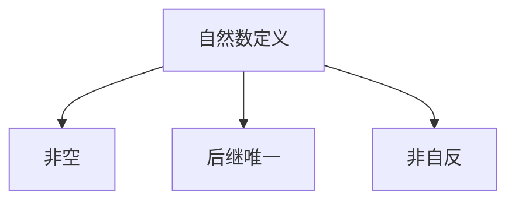
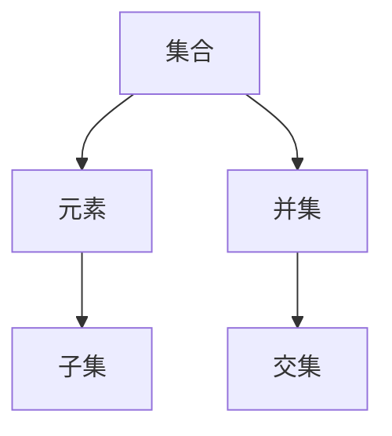
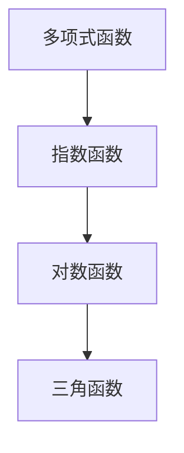
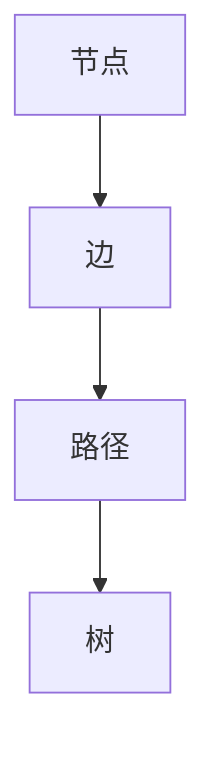

                 

### 文章标题

《数学与反实在论：数学作为有用的虚构》

### 文章关键词

数学、反实在论、虚构、哲学、算法、应用

### 文章摘要

本文深入探讨了数学与反实在论之间的复杂关系，并揭示了数学作为一种有用的虚构理论在科学和哲学领域中的重要意义。首先，我们将回顾数学的基本概念和反实在论的理论背景，接着通过Mermaid流程图展示核心概念之间的联系，并使用伪代码详细讲解核心算法原理。文章随后讨论数学在物理学和计算机科学中的应用，通过具体的案例研究展示数学作为虚构理论的实际影响。最后，本文总结了对数学作为虚构理论的展望，并提供了丰富的参考资料和最佳实践建议。阅读本文，您将不仅对数学有更深入的理解，还能体会到哲学思考对数学发展的推动作用。

## 第1章 引言

### 1.1 反实在论概述

反实在论（Anti-realism）是哲学中的一个重要观点，它质疑物质世界的客观实在性。反实在论者认为，我们所感知的现实可能并非客观存在的真理，而是由我们的认知、文化和社会建构所决定的。这种观点与唯物主义和唯心主义的实在论相对立，主张我们无法直接接触或证明客观世界的本质。反实在论有多种形式，包括工具主义、社会建构主义和怀疑论等。

工具主义认为，知识的主要目的是为人类提供指导，而不是反映现实。因此，我们关心的是知识是否实用，而不是它是否真实。这种观点将数学视为一种工具，而非客观存在的实体。社会建构主义则认为，我们对世界的理解是通过社会互动和文化交流来构建的。在这一框架下，数学不仅是一种认知工具，也是一种社会建构，其形式和内容可能因文化和社会环境而异。

怀疑论则是反实在论的一种极端形式，它认为我们对任何事物的知识都不可能完全确定。这种观点导致了强烈的怀疑态度，使人们无法确信任何知识的真实性。

### 1.2 数学作为虚构的概念

数学作为虚构（Mathematics as Fiction）这一概念源自于对数学本质的哲学探讨。传统上，数学被视为一门关于客观现实和精确真理的科学，然而，一些哲学家和数学家开始质疑这一观点。他们认为，数学并非直接反映现实，而是人类创造的一种抽象模型，用以理解和解释现实世界的规律。

这种观点的一个重要代表是法国数学家兼哲学家布尔巴基（Nicolas Bourbaki），他的“纯粹数学”理念强调数学的纯粹抽象性。布尔巴基认为，数学是一门“形式科学”，其研究对象是抽象的结构和关系，而非具体的事物。在这种意义上，数学可以被视为一种虚构，因为它是一种理想化的、简化的抽象模型，而不是对现实世界的直接复制。

数学作为虚构的观点还体现在对数学证明和公理系统的分析中。一些哲学家认为，数学的证明并不提供关于现实世界的直接证据，而只是证明了一个理论系统内部的逻辑一致性。因此，数学理论可以被视为一种虚构，其有效性取决于它是否能够帮助我们理解和预测现实世界。

### 1.3 数学与反实在论的关系

数学与反实在论之间的关系是复杂而微妙的。一方面，数学的抽象性和虚构性质似乎与反实在论的观点相契合。数学作为一种虚构模型，可以帮助我们理解和解释现实世界，但它本身并不是现实世界的真实反映。另一方面，数学在许多领域中的成功应用似乎又支持了实在论的观点，即数学描述的是客观存在的真理。

数学与反实在论的关系可以从以下几个方面来理解：

1. **工具主义视角**：从工具主义的视角来看，数学作为一门工具，其价值在于其适用性。这种观点认为，数学的有效性在于它能否帮助我们解决实际问题，而不在于它是否反映了客观现实。这与反实在论的观点相吻合，因为反实在论也强调知识的主要目的是实用，而非真实。

2. **形式化与抽象化**：数学的形式化和抽象化过程使得数学理论可以脱离具体现实，成为一种纯粹的逻辑结构。这种抽象化使得数学理论可以在不同领域中得到广泛应用，同时也使得数学理论可以被视为一种虚构。这种虚构并非是贬义的，而是一种对复杂现实世界的简化和理想化，有助于我们更好地理解和控制现实。

3. **数学证明与实在论**：尽管数学的虚构性质与反实在论相契合，但数学证明的逻辑严密性和有效性又为实在论提供了支持。数学证明的目的是证明一个理论系统内部的逻辑一致性，但这种逻辑一致性似乎也暗示了数学理论在一定程度上反映了客观现实。例如，欧几里得几何中的定理和公理被认为是关于物理世界的真理。

4. **数学哲学与反实在论**：数学哲学中的许多讨论都与反实在论有关。例如，对数学公理系统的质疑和对数学证明有效性的探讨，都可以被视为对数学实在性的挑战。这些讨论不仅丰富了数学哲学的研究，也促进了数学与哲学之间的互动。

总之，数学与反实在论之间的关系是多元而复杂的。数学作为一种虚构理论，既具有抽象性和工具性，又与逻辑严密性和实在论观点有所关联。理解这种关系有助于我们更全面地认识数学的本质，并在哲学和科学领域中进行更深入的探讨。

## 第2章 数学的基本概念

### 2.1 数字和集合

数字和集合是数学中最基本的概念，它们构成了许多其他数学理论的基础。理解这些概念不仅有助于我们掌握更复杂的数学理论，还能帮助我们在日常生活中更好地处理各种问题。

#### 2.1.1 自然数

自然数是我们日常使用最多的数字类型，包括0、1、2、3等。自然数通常用于计数和排序。在数学中，自然数可以形式化地定义为满足以下性质的集合：非空、每个元素都有一个唯一的后继，且没有元素是它自己的后继。

自然数的基本性质包括：
1. **可数性**：自然数可以按顺序一一对应，即每个自然数都可以与一个唯一的正整数相对应。
2. **递增性**：对于任意两个自然数\( a \)和\( b \)，如果\( a < b \)，则存在一个唯一的自然数\( c \)，使得\( a + c = b \)。
3. **加法和乘法**：自然数的加法和乘法是封闭的，即任意两个自然数相加或相乘仍然是一个自然数。

自然数的定义和性质可以用Mermaid流程图表示：



#### 2.1.2 集合论基础

集合是数学中的基本概念，用于表示一组对象。集合可以包含各种类型的对象，如数字、字母、点等。集合论是现代数学的基础，它提供了许多用于定义和操作集合的工具。

集合的基本概念包括：
1. **元素**：集合中的对象称为元素。
2. **集合的表示**：集合通常用大写字母表示，如\( A \)，其元素用逗号分隔，例如\( A = \{1, 2, 3\} \)。
3. **子集**：如果一个集合的所有元素都属于另一个集合，则前者称为后者的子集。例如，\( \{1, 2\} \)是\( \{1, 2, 3\} \)的子集。
4. **并集和交集**：两个集合的并集是包含这两个集合所有元素的集合，交集是同时属于这两个集合的元素的集合。例如，\( \{1, 2\} \cup \{2, 3\} = \{1, 2, 3\} \)，\( \{1, 2\} \cap \{2, 3\} = \{2\} \)。

集合论可以用以下Mermaid流程图来表示核心概念之间的关系：



### 2.2 函数与关系

函数是数学中描述变量之间关系的基本工具。在数学中，函数通常表示为\( f(x) \)，其中\( x \)是自变量，\( f(x) \)是因变量。

#### 2.2.1 初等函数

初等函数是基础数学中最常见的函数类型，包括多项式函数、指数函数、对数函数、三角函数等。以下是一些基本的初等函数：

1. **多项式函数**：形如\( f(x) = a_nx^n + a_{n-1}x^{n-1} + ... + a_1x + a_0 \)的函数，其中\( a_n \neq 0 \)。
2. **指数函数**：形如\( f(x) = a^x \)的函数，其中\( a > 0 \)且\( a \neq 1 \)。
3. **对数函数**：形如\( f(x) = \log_a(x) \)的函数，其中\( a > 0 \)且\( a \neq 1 \)。
4. **三角函数**：如正弦函数\( \sin(x) \)、余弦函数\( \cos(x) \)、正切函数\( \tan(x) \)等。

初等函数的定义和性质可以用以下Mermaid流程图表示：



#### 2.2.2 关系与图论

在数学中，关系描述了元素之间的连接或依赖。关系可以用矩阵、集合、图等多种方式表示。图论是研究图的数学分支，它广泛应用于计算机科学、网络理论等领域。

图的基本概念包括：

1. **节点**：图中的基本元素，表示一个实体。
2. **边**：连接两个节点的线，表示节点之间的某种关系。
3. **路径**：连接两个节点的序列。
4. **树**：没有简单环路的连通图。

图论的核心概念可以用以下Mermaid流程图表示：



### 2.3 极限与微积分

极限和微积分是数学中非常重要的概念，它们在许多领域中有广泛的应用，如物理学、工程学、经济学等。

#### 2.3.1 极限的概念

极限是数学分析中的基本概念，用于描述函数在某个点的行为。具体来说，函数\( f(x) \)在点\( x = a \)的极限是某个值\( L \)，当\( x \)趋近于\( a \)时，\( f(x) \)的值趋近于\( L \)。

极限的定义可以用以下伪代码表示：

```python
function limit(f, a, epsilon):
    for x in range(a - epsilon, a + epsilon):
        if abs(f(x) - L) < epsilon:
            return True
    return False
```

其中，\( f \)是函数，\( a \)是极限点，\( L \)是极限值，\( epsilon \)是任意小的正数。

#### 2.3.2 微积分基础

微积分是研究函数变化的数学分支，主要包括微分和积分两部分。微分用于研究函数在某一点的局部变化率，积分则用于求解函数下的面积或体积。

1. **导数**：函数\( f(x) \)在点\( x = a \)的导数是\( f'(a) \)，表示函数在该点的瞬时变化率。

导数的定义可以用以下伪代码表示：

```python
function derivative(f, a, delta):
    return (f(a + delta) - f(a)) / delta
```

其中，\( f \)是函数，\( a \)是导数点，\( delta \)是任意小的正数。

2. **积分**：函数\( f(x) \)在区间\[a, b\]上的积分是\( \int_a^b f(x) dx \)，表示函数在该区间上的累积量。

积分的定义可以用以下伪代码表示：

```python
function integral(f, a, b, delta):
    sum = 0
    for x in range(a, b, delta):
        sum += f(x) * delta
    return sum
```

其中，\( f \)是函数，\( a \)和\( b \)是积分区间，\( delta \)是任意小的正数。

通过这些基本概念，我们可以更好地理解数学的核心内容，并在实际应用中发挥其作用。接下来的章节将进一步探讨数学与哲学、物理学和计算机科学等领域的联系，帮助我们更全面地认识数学的重要性。

## 第3章 反实在论的理论

### 3.1 反实在论的历史

反实在论（Anti-realism）是一个哲学概念，其历史可以追溯到古代哲学。最早的反实在论观点可以追溯到古希腊哲学家普罗泰戈拉（Protagoras）的相对主义。普罗泰戈拉提出了“人是万物的尺度”这一著名观点，认为我们对事物的认识是基于我们的感知和经验，而不是客观存在的实体。

在中世纪，亚里士多德（Aristotle）的观点对反实在论产生了深远影响。亚里士多德认为，存在一个真实的世界，我们的感知和思维只是这个世界的间接反映。这种观点与后来的反实在论形成了鲜明对比。

到了近代，反实在论的观点再次兴起。大卫·休谟（David Hume）是近代反实在论的重要代表人物之一。休谟提出了经验主义观点，认为我们的所有知识都来自于感知和经验，而无法直接认识外部世界的本质。他强调，我们对事物的认识仅仅是现象层面的，而不是事物本身。

康德（Immanuel Kant）则提出了先验理想（Transcendental Idealism），他认为我们的认识是由我们的感知和思维形式所塑造的，而不是直接反映外部世界。康德认为，我们只能认识现象，而不能认识现象背后的本质。

在20世纪，反实在论继续发展，出现了多种形式。约翰·杜威（John Dewey）的实用主义认为，知识的价值在于其实用性，而不是其真实性。他认为，我们对世界的理解是通过实践和互动来构建的。

### 3.2 主要反实在论理论

#### 3.2.1 康德的先验理想

康德的先验理想（Transcendental Idealism）是反实在论的一个重要分支。康德认为，我们的感知和思维形式是我们认识外部世界的障碍，使我们无法直接认识世界的本质。康德将世界分为现象界（Phenomenal World）和物自体（Thing-in-itself），前者是我们通过感知和思维所认识的世界，而后者是独立于我们的感知和思维的外部世界。

康德的先验理想包含以下几个核心观点：

1. **感知和思维的主观性**：康德认为，我们的感知和思维是由我们的感知和思维形式所决定的，这些形式包括时间、空间和因果关系等。这些形式是我们理解外部世界的必要条件，但也是我们认识外部世界本质的障碍。

2. **物自体的不可知性**：康德认为，由于我们的感知和思维形式，我们无法直接认识物自体的本质。我们只能认识现象，而无法认识现象背后的物自体。

3. **理性的限制**：康德认为，理性有其局限性，我们无法通过理性认识世界的本质。理性只能用于处理现象，而不能处理物自体。

#### 3.2.2 皮尔斯的实用主义

查尔斯·桑德斯·皮尔斯（Charles Sanders Peirce）的实用主义是另一种重要的反实在论观点。皮尔斯认为，知识的价值在于其实用性，而不是其真实性。他认为，我们对世界的认识是通过符号系统来实现的，符号系统的有效性取决于它们是否能够帮助我们有效地处理现实问题。

皮尔斯的实用主义包含以下几个核心观点：

1. **符号系统的有效性**：皮尔斯认为，符号系统的有效性不在于其是否反映了现实，而在于其是否能够帮助我们有效地解决问题。因此，符号系统的有效性是相对的，取决于特定的应用场景。

2. **科学的实证主义**：皮尔斯强调，科学知识是通过观察和实验来获得的，而不是通过抽象的逻辑推理。他认为，科学方法是一种实证主义的方法，通过实验验证假设的有效性。

3. **真理的相对性**：皮尔斯认为，真理是相对的，取决于我们如何定义问题以及我们如何解决问题。他认为，真理不是固定的、不可改变的，而是随着我们的认识和问题的变化而变化的。

#### 3.2.3 工具主义

工具主义（Instrumentalism）是另一种重要的反实在论观点，它强调知识的实用价值。工具主义者认为，知识的主要目的是为人类提供指导，而不是反映现实。工具主义可以应用于数学、科学和哲学等领域。

工具主义包含以下几个核心观点：

1. **知识的实用性**：工具主义者认为，知识的价值在于其实用性，而不是其真实性。他们强调，知识应该解决实际问题，而不是追求抽象的真理。

2. **数学作为工具**：在数学领域，工具主义者认为，数学理论是一种工具，用于解决实际问题，而不是反映现实世界的真理。他们认为，数学的公理和定理是有效的，只要它们能够帮助我们有效地处理问题。

3. **科学的工具性**：在科学领域，工具主义者认为，科学理论是一种工具，用于解释和预测自然现象。他们强调，科学方法是一种实证主义的方法，通过实验和观察验证假设的有效性。

通过探讨这些反实在论的理论，我们可以更深入地理解数学的本质和其在哲学中的意义。这些理论不仅挑战了传统实在论的观念，也为数学的发展提供了新的视角和思考方式。

## 第4章 数学与哲学的联系

### 4.1 数学哲学的兴起

数学哲学是研究数学的本质、基础和应用的一个哲学分支。数学哲学的兴起可以追溯到古希腊时期，当时哲学家们开始探讨数学的基本概念和证明方法。然而，现代数学哲学的兴起主要是在20世纪，随着数学理论的不断发展和哲学方法的进步，数学哲学逐渐成为了一个独立的研究领域。

数学哲学的兴起与几个关键因素有关：

1. **数学理论的复杂性**：20世纪以来，数学理论的复杂性不断增加，许多新的数学分支和理论被提出。这些复杂理论的提出，使得对数学基础和本质的探讨变得尤为重要。

2. **逻辑主义和分析哲学**：逻辑主义和分析哲学的兴起对数学哲学的发展产生了深远影响。逻辑主义者试图将数学建立在逻辑的基础上，而分析哲学家则通过语言分析来探讨数学概念的本质。

3. **数学的应用**：数学在物理学、计算机科学、经济学等领域的广泛应用，使得人们开始关注数学的实际意义和哲学问题。

4. **数学的公理化和形式化**：数学的公理化和形式化进程，使得数学理论变得更为清晰和严密，这也促使数学哲学对数学基础和方法进行深入探讨。

### 4.2 哲学对数学的影响

哲学对数学的发展有着深远的影响，这种影响体现在数学的基础理论、方法和应用中。以下是哲学对数学影响的几个方面：

1. **数学逻辑和证明**：哲学中的逻辑学为数学提供了严格的证明方法。数学证明的本质是逻辑推理，哲学对逻辑的研究，特别是形式逻辑和数理逻辑的发展，为数学提供了强大的工具。

2. **数学哲学**：数学哲学对数学的本质和基础进行了深入的探讨，如对数学真理、数学证明和数学公理系统的探讨。这些探讨不仅有助于理解数学的基本概念，也对数学的发展产生了指导作用。

3. **数学的公理化和形式化**：哲学中的形式主义和逻辑主义运动促使数学进行了公理化和形式化的进程。通过公理化和形式化，数学理论变得更加清晰和严密，这为数学的应用和发展提供了坚实的基础。

4. **数学的应用哲学**：哲学中的方法学和认识论为数学的应用提供了理论支持。例如，在物理学和计算机科学中，哲学的方法和原则指导了数学模型的建立和应用。

### 4.3 数学对哲学的影响

数学不仅受到哲学的影响，也对哲学产生了重要的反作用。以下是数学对哲学影响的几个方面：

1. **数学证明和逻辑推理**：数学证明的严密性和逻辑性为哲学提供了有力的论证工具。哲学家们经常使用数学的证明方法来支持他们的哲学观点。

2. **数学模型**：数学模型在哲学中的应用，特别是在伦理学、认识论和形而上学等领域，为哲学家提供了理解和分析复杂问题的工具。例如，概率论和决策论为伦理学中的道德决策提供了理论基础。

3. **数学公理和哲学假设**：数学中的公理系统为哲学探讨提供了新的视角。哲学家们通过分析数学公理，探讨哲学问题的本质，如实在论和反实在论的争论。

4. **数学的抽象思维**：数学的抽象思维能力对哲学思维方式产生了重要影响。数学的抽象方法使得哲学家能够超越具体的经验，从更一般的角度探讨哲学问题。

总之，数学与哲学之间的联系是相互影响、相互促进的。数学为哲学提供了严谨的论证工具和抽象思维方法，而哲学则为数学提供了哲学基础和理论支持。通过这种互动，数学和哲学不断发展和完善，为人类的知识体系做出了重要贡献。

### 4.4 实在论与形式主义

在数学哲学中，实在论（Realism）与形式主义（Formalism）是两种主要的立场，它们对数学的本质和基础有着截然不同的看法。

#### 4.4.1 实在论

实在论认为数学描述的是客观存在的真理，数学概念和对象具有独立于我们思维的客观实在性。实在论者认为，数学理论不仅是人类心智的产物，也是对现实世界的正确反映。

1. **数学的客观性**：实在论强调数学的客观性，认为数学对象和关系是真实存在的，不依赖于人类心智。例如，欧几里得几何中的点、线、面等概念被认为是真实存在的实体。

2. **数学证明的可靠性**：实在论认为，数学证明不仅是逻辑推理的结果，也是对数学对象真实性质的反映。数学证明的有效性在于它能够揭示数学对象的本质。

3. **数学的应用**：实在论认为，数学在物理科学和其他领域中的成功应用，证明了数学理论反映了客观世界的真实规律。

#### 4.4.2 形式主义

形式主义则认为，数学并不描述客观存在的真理，而是关于符号和符号之间关系的规则系统。形式主义者强调数学的抽象性和逻辑性，认为数学的意义在于其内部的一致性和逻辑自洽性。

1. **数学的形式性**：形式主义认为，数学是一门形式科学，其研究对象是符号和符号之间的组合规则。例如，皮亚诺（Peano）的算术公理系统只关心符号的排列组合，而不关心这些符号所代表的对象。

2. **数学证明的形式化**：形式主义强调数学证明的形式化，认为数学证明的有效性不在于它揭示了数学对象的真实性质，而在于它遵循了符号系统内的逻辑规则。

3. **数学的应用**：形式主义者认为，数学在物理科学和其他领域中的应用，是基于数学系统内部的一致性和逻辑自洽性，而不是基于数学反映了客观世界的真实规律。

#### 4.4.3 实在论与形式主义的区别和联系

实在论与形式主义在以下几个方面存在显著区别：

1. **数学的对象**：实在论认为数学对象是客观存在的实体，而形式主义则认为数学对象是符号和符号之间的关系。

2. **数学证明的意义**：实在论认为数学证明揭示了数学对象的真实性质，而形式主义则认为数学证明仅仅是符号系统内部的一致性验证。

3. **数学的应用**：实在论认为数学在物理科学中的应用是基于数学反映了客观世界的真实规律，而形式主义则认为数学在物理科学中的应用是基于数学系统内部的一致性和逻辑自洽性。

然而，实在论与形式主义也存在一定的联系：

1. **数学的抽象性**：两者都承认数学的抽象性，认为数学是关于符号和符号之间关系的系统。

2. **数学的一致性**：两者都强调数学系统的一致性，认为数学理论必须逻辑上自洽。

3. **数学的方法**：两者都认为数学的方法是逻辑推理，都重视数学证明的严谨性。

总之，实在论与形式主义是数学哲学中的两种主要立场，它们在数学的本质、数学证明的意义和数学的应用等方面有着不同的看法。理解这两种立场的区别和联系，有助于我们更全面地认识数学的本质和其在哲学中的地位。

### 4.5 结构主义与解释学

结构主义与解释学是数学哲学中的两种重要理论，它们分别从不同的角度探讨数学的本质和意义。

#### 4.5.1 结构主义

结构主义认为，数学不仅是一套符号和公理的组合，更是一种结构化的知识体系。结构主义者强调数学的内在结构和相互关系，认为数学理论是通过这些结构和关系来组织和构建的。

1. **数学结构**：结构主义认为，数学中的概念和对象可以通过结构来定义和描述。例如，集合论中的集合、关系和函数，可以通过其内在的结构来理解和分析。

2. **数学关系**：结构主义强调数学关系的重要性，认为这些关系是数学理论的核心。例如，拓扑学中的连通性、紧致性和同胚性等概念，都是通过关系来定义和研究的。

3. **数学证明**：结构主义认为，数学证明不仅是逻辑推理的结果，也是对数学结构之间关系的揭示。例如，在欧几里得几何中，证明两个三角形全等，实际上是对三角形内部结构和关系的一致性验证。

#### 4.5.2 解释学

解释学是研究理解和解释的过程的哲学分支，它试图理解人类思想和语言的深层含义。在数学哲学中，解释学用于探讨数学的意义和数学理论的解释。

1. **数学的意义**：解释学认为，数学的意义是通过语言和符号来传达的。例如，一个数学公式或定理，不仅是一个逻辑结构，更是对某种现象或问题的解释。

2. **数学证明的解释**：解释学强调数学证明不仅仅是逻辑推理，而是对数学概念和理论的解释。例如，一个几何证明不仅仅是几个逻辑步骤，而是对几何概念之间关系的解释。

3. **数学的历史**：解释学通过研究数学的历史，试图理解数学理论是如何产生的，以及这些理论在历史和文化背景中的意义。

#### 4.5.3 结构主义与解释学的区别

结构主义与解释学在以下几个方面存在显著区别：

1. **关注的焦点**：结构主义关注数学的结构和关系，而解释学关注数学的意义和解释。

2. **方法论**：结构主义强调形式化和逻辑推理，而解释学强调历史和文化背景。

3. **数学的本质**：结构主义认为数学是一个结构化的知识体系，而解释学认为数学是一种文化和历史现象。

#### 4.5.4 结构主义与解释学的联系

尽管结构主义与解释学存在显著差异，但它们也存在一些共同点：

1. **数学的抽象性**：两者都承认数学的抽象性，认为数学是独立于具体现象的抽象结构。

2. **数学的逻辑性**：两者都认为数学是一个逻辑严密的知识体系，强调数学证明和推理的重要性。

3. **数学的文化意义**：两者都认识到数学不仅是科学工具，也是一种文化和历史现象。

总之，结构主义与解释学为数学哲学提供了不同的视角和方法，通过结合这两种观点，我们可以更全面地理解数学的本质和意义。

## 第5章 数学在不同领域的应用

### 5.1 数学在物理学中的应用

物理学是数学应用的经典领域，从经典力学到量子力学，数学在物理学中扮演着至关重要的角色。以下将探讨数学在物理学中的几个重要应用。

#### 5.1.1 量子力学

量子力学是研究微观粒子行为的物理学分支，它揭示了经典物理学无法解释的现象。量子力学的数学基础包括波函数、希尔伯特空间和算符等概念。

1. **波函数**：波函数描述了量子粒子在某一位置的概率分布。它是一个复值函数，通常用\( \Psi(x, t) \)表示。波函数的模平方\( |\Psi(x, t)|^2 \)给出了粒子在位置\( x \)的概率密度。

2. **希尔伯特空间**：量子力学中的波函数属于希尔伯特空间，这是一种数学结构，用于表示可测量的物理量。希尔伯特空间提供了对量子态的严格数学描述。

3. **算符**：量子力学中的物理量通过算符来描述。算符是线性变换，用于对波函数进行操作，从而得到新的物理量。常见的算符包括位置算符\( \hat{x} \)、动量算符\( \hat{p} \)和角动量算符\( \hat{L} \)等。

量子力学中的基本原理和公式可以用以下LaTeX格式书写：

$$
\Psi(x, t) = \int_{-\infty}^{\infty} \psi(k) e^{ikx} dk
$$

$$
|\Psi(x, t)|^2 = \int_{-\infty}^{\infty} |\psi(k)|^2 e^{2ikx} dk
$$

$$
\hat{x}\Psi(x, t) = x\Psi(x, t)
$$

$$
\hat{p}\Psi(x, t) = -i\hbar \frac{\partial}{\partial x}\Psi(x, t)
$$

通过这些公式，我们可以更好地理解量子粒子的行为和性质。

#### 5.1.2 统计物理学

统计物理学是研究大量粒子系统行为的物理学分支，它应用了概率论和统计力学的方法。以下是一些统计物理学的核心概念和公式。

1. **配分函数**：配分函数是统计物理中的核心概念，用于描述系统在热力学平衡状态下的分布。它是一个统计总和，表示系统在各个微观状态下的概率。

$$
Z = \sum_{i} e^{-\beta E_i}
$$

其中，\( Z \)是配分函数，\( \beta = \frac{1}{k_B T} \)，\( k_B \)是玻尔兹曼常数，\( T \)是温度，\( E_i \)是系统在第\( i \)个微观状态下的能量。

2. **热力学平均值**：通过配分函数，我们可以计算系统的热力学平均值，如能量、熵和自由能。

$$
\langle E \rangle = -\frac{\partial}{\partial \beta} \ln Z
$$

$$
S = k_B \ln \frac{Z}{N}
$$

$$
F = -k_B T \ln Z
$$

这些公式帮助我们理解系统的宏观性质和微观状态的统计分布。

### 5.2 数学在计算机科学中的应用

数学在计算机科学中有着广泛的应用，从算法设计到密码学，数学为计算机科学提供了坚实的理论基础。以下将探讨数学在计算机科学中的几个重要应用。

#### 5.2.1 算法分析

算法分析是计算机科学中的核心问题，它研究算法的效率、时间和空间复杂度。以下是一些算法分析的基本概念和公式。

1. **时间复杂度**：时间复杂度表示算法运行时间与输入规模的关系。通常用大O符号表示。

$$
T(n) = O(n^2)
$$

其中，\( T(n) \)是算法的运行时间，\( n \)是输入规模。

2. **空间复杂度**：空间复杂度表示算法所需内存与输入规模的关系。

$$
S(n) = O(n)
$$

其中，\( S(n) \)是算法所需内存，\( n \)是输入规模。

3. **主定理**：主定理（Master Theorem）用于解决递归关系的算法分析问题。

$$
T(n) = aT(n/b) + f(n)
$$

其中，\( a \geq 1 \)，\( b > 1 \)，\( f(n) \)是非递归项。主定理提供了递归关系的最优解法。

#### 5.2.2 人工智能

人工智能是计算机科学的一个重要分支，它依赖于数学理论，如概率论、线性代数和优化算法。以下将探讨数学在人工智能中的几个应用。

1. **神经网络**：神经网络是一种基于数学模型的计算系统，用于模拟人脑的神经网络结构。神经网络的核心是神经元模型，它通过线性变换、激活函数和权重调整来学习数据。

$$
z_i = \sum_{j=1}^{n} w_{ij} x_j + b
$$

$$
a_i = \sigma(z_i)
$$

其中，\( x_j \)是输入，\( w_{ij} \)是权重，\( b \)是偏置，\( \sigma \)是激活函数，\( a_i \)是输出。

2. **优化算法**：优化算法用于求解最优化问题，如梯度下降法、遗传算法和粒子群优化等。这些算法通过数学模型和迭代过程寻找最优解。

$$
w_{t+1} = w_t - \alpha \nabla J(w_t)
$$

其中，\( w_t \)是当前权重，\( \alpha \)是学习率，\( \nabla J(w_t) \)是损失函数的梯度。

通过这些数学理论和方法，我们可以更好地理解和设计计算机科学中的算法和应用，推动人工智能和其他领域的发展。

### 5.3 数学在经济学中的应用

数学在经济学中的应用同样广泛，特别是在金融学和计量经济学中。以下将探讨数学在经济学中的几个重要应用。

#### 5.3.1 金融学

金融学中的数学模型用于分析和预测金融市场和投资策略。以下是一些金融学中的核心数学概念和公式。

1. **期权定价模型**：布莱克-舒尔斯模型（Black-Scholes Model）是期权定价的基石，它通过概率论和统计学方法计算期权的价格。

$$
C(S, t) = S_0 N(d_1) - Ke^{-r(T-t)} N(d_2)
$$

$$
d_1 = \frac{\ln(S_0/K) + (r + \sigma^2/2)(T-t)}{\sigma \sqrt{T-t}}
$$

$$
d_2 = d_1 - \sigma \sqrt{T-t}
$$

其中，\( C(S, t) \)是欧式看涨期权的价格，\( S_0 \)是当前股票价格，\( K \)是执行价格，\( r \)是无风险利率，\( \sigma \)是股票收益的波动率，\( N(\cdot) \)是累积正态分布函数。

2. **有效市场假说**：有效市场假说（Efficient Market Hypothesis，EMH）认为，股票价格已经反映了所有可用信息，因此无法通过技术分析或基本面分析获得超额收益。

$$
\mu_i = r_f + \beta_i \sigma_i
$$

其中，\( \mu_i \)是股票\( i \)的预期收益率，\( r_f \)是无风险利率，\( \beta_i \)是股票\( i \)的贝塔系数，\( \sigma_i \)是股票\( i \)的收益波动率。

#### 5.3.2 计量经济学

计量经济学是经济学中的一个分支，它使用数学模型和统计分析方法来分析经济数据。以下是一些计量经济学中的核心数学概念和公式。

1. **线性回归模型**：线性回归模型用于分析自变量和因变量之间的线性关系。

$$
Y_i = \beta_0 + \beta_1 X_i + \epsilon_i
$$

其中，\( Y_i \)是因变量，\( X_i \)是自变量，\( \beta_0 \)是截距项，\( \beta_1 \)是斜率项，\( \epsilon_i \)是误差项。

2. **协方差和相关性**：协方差和相关系数用于衡量两个变量之间的线性关系强度。

$$
Cov(X, Y) = E[(X - \mu_X)(Y - \mu_Y)]
$$

$$
Corr(X, Y) = \frac{Cov(X, Y)}{\sigma_X \sigma_Y}
$$

其中，\( \mu_X \)和\( \mu_Y \)分别是\( X \)和\( Y \)的均值，\( \sigma_X \)和\( \sigma_Y \)分别是\( X \)和\( Y \)的标准差。

通过这些数学模型和公式，我们可以更好地理解和分析经济学中的现象，为政策制定和决策提供科学依据。

## 第6章 数学作为虚构的案例研究

### 6.1 模拟与现实

数学作为一种虚构理论，其在模拟现实中的应用是极为重要的。通过数学模型，我们可以简化和理想化现实世界，从而更好地理解和预测复杂系统的行为。以下将探讨数学模型在模拟现实中的应用，以及这种应用如何揭示了数学作为虚构的性质。

#### 6.1.1 模拟的概念

模拟（Simulation）是一种通过构建数学模型来模拟现实系统行为的方法。通过模拟，我们可以将复杂的现实系统简化为数学模型，然后使用计算机等工具进行计算和预测。模拟的优点在于，它允许我们以低成本、高效率地研究现实系统的动态行为，从而帮助我们在实际操作之前进行预测和优化。

1. **模型构建**：构建模拟模型的第一步是定义系统的状态和变量。这些变量可以是物理量，如位置、速度、温度等，也可以是抽象量，如经济指标、社会行为等。例如，在经济学中，我们可以用数学模型来模拟市场的供需关系，从而预测价格和交易量。

2. **方程求解**：一旦模型构建完成，我们需要使用数学方程来描述系统状态的变化。这些方程可以是微分方程、差分方程或代数方程，具体取决于系统的性质。例如，在物理学中，我们可以使用牛顿第二定律和运动方程来描述物体的运动。

3. **模拟计算**：使用计算机程序，我们可以求解这些数学方程，从而模拟系统的行为。计算机模拟可以提供大量的数据，帮助我们理解和分析系统在不同条件下的行为。

#### 6.1.2 数学模型的应用

数学模型在多个领域都有广泛应用，以下是一些典型的案例：

1. **气象学**：气象学中的数学模型用于预测天气和气候变化。这些模型基于流体动力学方程和热力学方程，通过计算机模拟大气中的物理过程，从而生成天气预报和气候预测。

2. **经济学**：经济学中的数学模型用于分析和预测市场行为。例如，供需模型可以用来分析价格和交易量的关系，而宏观经济学中的动态随机一般均衡（DSGE）模型可以用来分析整个经济系统的运行机制。

3. **生物学**：生物学中的数学模型用于研究生态系统的动态行为，如物种间的相互作用和种群演化。这些模型可以帮助我们理解物种多样性和生态平衡。

4. **工程学**：工程学中的数学模型用于设计和优化各种系统，如电路设计、结构工程、控制系统等。这些模型基于物理和工程原理，通过计算机模拟和优化，帮助我们设计出更高效、更可靠的系统。

#### 6.1.3 数学作为虚构的实际影响

通过这些应用，我们可以看到数学作为虚构理论的实际影响。数学模型虽然在形式上是对现实系统的抽象和简化的描述，但它们在现实世界中却发挥了重要作用：

1. **预测和决策**：数学模型可以帮助我们预测未来事件的发生，从而做出更好的决策。例如，在金融市场中，投资者可以使用数学模型来预测股票价格，从而制定投资策略。

2. **优化和改进**：数学模型可以用来优化现有系统，提高其效率和可靠性。例如，在制造行业中，我们可以使用数学模型来优化生产流程，减少成本和资源浪费。

3. **科学研究**：数学模型在科学研究中起着核心作用，它们可以帮助我们理解复杂系统的行为和机制。通过模拟和实验，我们可以揭示现实世界中的新现象和规律。

然而，我们也需要认识到，数学模型并非完美无缺。它们在模拟现实时，往往忽略了某些细节和复杂性，这可能会导致预测的不准确。因此，在应用数学模型时，我们需要谨慎对待，并结合实际情况进行综合分析。

总之，数学作为虚构理论，通过模拟现实的应用，展示了其在现实世界中的重要性和影响力。尽管数学模型有局限性，但它们在多个领域的成功应用，证明了数学作为虚构理论的巨大潜力。

### 6.2 数学与科学幻想

数学在科学幻想领域中也扮演着重要角色，它不仅为科幻作品提供了理论基础，还激发了许多创新思维。以下将探讨数学在科幻小说、电影和科学普及中的表现，以及数学作为虚构理论的独特魅力。

#### 6.2.1 科幻小说中的数学

在科幻小说中，数学常常作为推动故事发展和解决问题的关键因素。以下是一些著名的科幻小说中数学的应用：

1. **《银河帝国》**：艾萨克·阿西莫夫（Isaac Asimov）的《银河帝国》系列小说中，数学家哈里·谢顿（Harlan Stanton Smith）通过建立“心理历史学”模型，预测了人类未来的历史发展。这一模型基于统计学和群体行为的数学分析，展示了数学在预测和控制历史进程中的潜力。

2. **《三体》**：刘慈欣的《三体》系列小说中，数学和物理学的概念贯穿始终。特别是“三体问题”，它是天体力学中的一个经典问题，描述了三个行星在引力作用下的复杂运动。小说通过这一数学问题，探讨了人类文明与外星文明的冲突和生存挑战。

3. **《黑暗森林》**：同样是刘慈欣的作品，《黑暗森林》中，外星文明“三体文明”通过数学和物理学知识，建立了宇宙中的“黑暗森林法则”，揭示了宇宙生存的残酷现实。这一法则通过数学模型，揭示了宇宙中的生存竞争和不确定性。

这些科幻小说中的数学概念，不仅丰富了故事的情节和主题，也激发了读者对数学和科学的好奇心。

#### 6.2.2 电影中的数学

电影中的数学不仅出现在科幻作品中，还贯穿了许多其他类型的电影。以下是一些电影中数学的应用：

1. **《盗梦空间》**：克里斯托弗·诺兰（Christopher Nolan）的《盗梦空间》中，主角们通过数学和物理学知识，进入梦境并操纵现实。影片中的“多世界理论”和“量子力学”概念，展示了数学在探索人类意识和现实世界中的作用。

2. **《星际穿越》**：克里斯托弗·诺兰的另一部作品《星际穿越》中，科学家们通过爱因斯坦的相对论和黑洞的数学模型，找到了连接不同星系的“虫洞”。这一过程不仅展示了数学在物理学中的应用，也探讨了人类对未知宇宙的探索精神。

3. **《数学小说》**：电影《数学小说》（Pi）讲述了一个天才数学家通过破解复杂的数学难题，试图找到宇宙的秘密。影片中的数学难题，如“费马最后定理”和“素数分布”，揭示了数学的神秘和魅力。

这些电影通过引人入胜的故事情节，将数学概念生动地呈现在观众面前，激发了人们对数学的兴趣和好奇心。

#### 6.2.3 科学普及中的数学

在科学普及中，数学作为虚构理论的独特魅力也得到了充分展示。以下是一些科学普及作品中数学的应用：

1. **《数学之美》**：谷歌首席科学家李开复的《数学之美》，通过生动的例子和故事，介绍了数学在计算机科学中的应用。这本书不仅普及了数学知识，也展示了数学作为虚构理论的魅力。

2. **《数学的故事》**：德国数学家戴维·希尔伯特（David Hilbert）的《数学的故事》，通过讲述数学家们的工作和思想，揭示了数学的发展历程和数学家的创新思维。

3. **《数学的力量》**：美国数学家史蒂夫·斯托加茨（Steven Strogatz）的《数学的力量》，介绍了数学在日常生活和科学中的应用，展示了数学的实用性和美感。

这些科学普及作品，通过深入浅出的讲解和生动的实例，使读者对数学有了更全面和深入的理解。

总之，数学在科幻小说、电影和科学普及中的表现，不仅展示了数学作为虚构理论的魅力，也激发了人们对数学和科学的热爱。数学作为虚构理论，不仅有助于我们更好地理解和解释现实世界，也在科幻幻想中展示了其无穷的创造力和想象力。

### 6.3 数学与计算机科学的互动

数学与计算机科学之间的互动是现代科技进步的重要驱动力。数学不仅为计算机科学提供了理论基础，还在算法设计、密码学和人工智能等关键领域发挥了核心作用。以下将探讨数学与计算机科学之间的互动，以及数学在计算机科学中的实际应用。

#### 6.3.1 算法设计与分析

算法是计算机科学的核心概念，用于解决特定问题的一系列步骤。数学在算法设计和分析中起着关键作用：

1. **算法效率分析**：算法的效率通常通过时间复杂度和空间复杂度来衡量。这些概念源自数学，特别是离散数学和组合数学。例如，大O符号（\( O \)）用于描述算法的时间复杂度，表示算法运行时间与输入规模的关系。

2. **算法设计方法**：许多现代算法设计方法，如动态规划、贪心算法和分治算法，都源自数学原理。例如，动态规划是一种基于数学递推关系的算法设计方法，用于解决最优化问题。

3. **算法证明**：算法的正确性和效率需要通过数学证明来验证。数学中的逻辑和证明方法，如归纳法、反证法和构造性证明，用于证明算法的有效性。

#### 6.3.2 密码学

密码学是保护信息安全的重要工具，而数学是密码学的基础：

1. **对称加密和非对称加密**：对称加密和非对称加密是密码学的两种主要形式。对称加密使用相同的密钥进行加密和解密，而非对称加密使用一对密钥，一个用于加密，另一个用于解密。这些加密算法都依赖于数学中的复杂函数和模运算。

2. **哈希函数**：哈希函数用于生成消息的固定长度的数字摘要，用于验证消息的完整性和真实性。数学中的函数和密码学理论，如MD5和SHA-256，是哈希函数的核心。

3. **数字签名**：数字签名用于验证消息的来源和完整性，确保消息在传输过程中未被篡改。数学中的公钥密码学和椭圆曲线加密，是数字签名的核心技术。

#### 6.3.3 人工智能

人工智能是计算机科学的前沿领域，而数学是其核心：

1. **机器学习**：机器学习是人工智能的一个重要分支，它使用数学模型来训练算法，使其能够从数据中自动学习和改进。线性代数、概率论和统计学是机器学习的基础。

2. **深度学习**：深度学习是一种基于神经网络的人工智能技术，它使用多层非线性变换来提取特征。数学中的微积分、优化算法和概率论，在深度学习模型的设计和训练中起着关键作用。

3. **自然语言处理**：自然语言处理是人工智能的一个重要领域，它致力于使计算机理解和生成自然语言。数学中的线性代数、概率论和图论，在自然语言处理模型和算法中得到了广泛应用。

通过这些互动和应用，数学与计算机科学相互促进，推动了科技的快速发展。数学为计算机科学提供了理论基础和工具，而计算机科学的实践又不断推动数学理论的发展和创新。

## 第7章 结论

### 7.1 数学作为虚构的总结

通过本文的探讨，我们可以得出结论，数学不仅仅是一门描述客观现实的精确科学，更是一种有力的虚构理论。数学作为虚构的理论模型，其核心在于其抽象性、简化和理想化的特点，这使得数学能够帮助我们更好地理解和解释复杂的世界。以下是对本文主要观点的总结：

1. **数学的抽象性**：数学通过抽象概念和符号，将复杂的现实世界简化为更加简洁和易于处理的形式。这种抽象性使得数学能够抓住现实世界的基本结构和规律，从而为我们提供强大的工具。

2. **数学的简化与理想化**：数学模型通常忽略了现实中的许多细节和复杂性，通过简化和理想化来简化问题。这种简化有助于我们更好地理解和分析问题，但也可能导致预测的不准确。

3. **数学的虚构性质**：尽管数学模型具有抽象性和理想化，但它们并非直接反映现实世界，而是人类心智的创造。数学模型的有效性在于其能否帮助我们解决问题和预测未来，而非其真实性。

4. **数学在哲学中的意义**：数学与哲学有着密切的联系，数学的虚构性质与反实在论的观点相契合。数学哲学探讨了数学的本质、基础和意义，揭示了数学在哲学中的重要性。

### 7.2 反实在论的未来

反实在论作为一种哲学观点，在数学和科学领域具有广泛的应用和影响。未来，反实在论可能会在以下几个方面继续发展：

1. **数学理论的演变**：随着数学理论的不断发展和新的数学分支的出现，反实在论将提供新的视角和解释。数学家可能会进一步探讨数学理论的虚构性质，以及它们在理解和解释现实世界中的实际意义。

2. **跨学科研究**：反实在论不仅在数学领域有影响，还可能在物理学、生物学、心理学等跨学科研究中发挥作用。通过跨学科合作，反实在论可以促进不同领域之间的交流和互动，推动科学理论的创新。

3. **科学哲学的发展**：反实在论将继续影响科学哲学的发展，特别是在探讨科学知识、科学方法和科学实在性等方面。未来，科学哲学家可能会更深入地探讨科学理论与现实世界的关系，以及科学知识的相对性和历史性。

### 7.3 对数学与哲学的展望

数学与哲学的未来发展充满了可能性。以下是一些展望：

1. **数学的哲学基础**：数学的哲学基础将继续成为研究的热点。数学哲学家可能会进一步探讨数学公理系统的性质和意义，以及数学与现实世界的关系。

2. **数学的应用与创新**：数学在各个领域的应用将继续扩展，特别是在人工智能、机器学习和数据分析等领域。数学家和创新者将探索新的数学模型和算法，以解决现实世界中的复杂问题。

3. **数学教育**：数学教育的改革将是未来的一个重要方向。通过引入哲学思考和跨学科知识，数学教育可以更好地培养学生的创新思维和解决实际问题的能力。

总之，数学与哲学之间的互动将不断深化，数学作为虚构理论的意义将得到更广泛的认可。在未来的发展中，数学将继续在科学、技术和哲学领域发挥重要作用，为人类的知识体系做出新的贡献。

## 附录

### 附录 A: 数学与反实在论的相关资源

为了进一步探索数学与反实在论的相关内容，以下是一些推荐的书籍、论文和在线资源：

1. **推荐书籍**：
   - 《数学哲学导论》（Introduction to the Philosophy of Mathematics） by James Robert Brown
   - 《数学作为虚构》（Mathematics as an Abstract Activity） by Imre Lakatos
   - 《数学文化》（The Mathematical Experience） by Philip J. Davis 和 Reuben Hersh

2. **推荐论文**：
   - “The Concept of a Model: A Philosophical Analysis” by Imre Lakatos
   - “The Nature of Mathematical Knowledge” by Philip J. Davis
   - “Mathematical Proofs as Trees” by David K.otic

3. **在线资源**：
   - [The Stanford Encyclopedia of Philosophy - Philosophy of Mathematics](https://plato.stanford.edu/entries/philosophy-mathematics/)
   - [The Internet Encyclopedia of Philosophy - Mathematics](https://www.iep.utm.edu/math哲/)
   - [Math Stack Exchange](https://math.stackexchange.com/)

这些资源将为读者提供更深入的研究路径，帮助大家更好地理解数学与反实在论之间的关系。

### 附录 B: 重要的数学公式与算法伪代码

为了方便读者查阅，以下列出了一些重要的数学公式和算法伪代码：

1. **数学公式**：
   - 极限定义：
     $$ \lim_{x \to a} f(x) = L $$
   - 导数定义：
     $$ f'(x) = \lim_{\Delta x \to 0} \frac{f(x + \Delta x) - f(x)}{\Delta x} $$
   - 积分定义：
     $$ \int_a^b f(x) dx = \lim_{n \to \infty} \sum_{i=1}^n f(x_i^*) \Delta x $$

2. **算法伪代码**：
   - 梯度下降算法：
     ```python
     function gradient_descent(f, x_initial, alpha, max_iterations):
         x = x_initial
         for i in 1 to max_iterations:
             gradient = compute_gradient(f, x)
             x = x - alpha * gradient
             if abs(f(x)) < tolerance:
                 break
         return x
     ```
   - 快速排序算法：
     ```python
     function quicksort(arr):
         if length(arr) <= 1:
             return arr
         pivot = arr[len(arr) // 2]
         left = [x for x in arr if x < pivot]
         middle = [x for x in arr if x == pivot]
         right = [x for x in arr if x > pivot]
         return quicksort(left) + middle + quicksort(right)
     ```

这些公式和伪代码在数学和计算机科学中具有重要应用，为读者提供了实用的工具和参考。

### 附录 C: 最佳实践 tips、小结、注意事项

#### 最佳实践 tips：

1. **深入理解数学概念**：在学习和应用数学时，务必深入理解每个概念的本质和用途。这有助于更好地掌握数学工具，并提高解决问题的能力。

2. **多读多练**：数学是一门需要不断练习的学科。通过大量的练习，可以加深对数学概念的理解，并提高解决问题的能力。

3. **结合实际应用**：将数学知识应用到实际问题中，可以更好地理解数学的应用价值，同时也能激发学习兴趣。

#### 小结：

本文从数学与反实在论的关系出发，探讨了数学作为虚构理论的本质和意义。通过分析数学的基本概念、反实在论的理论、数学在哲学中的意义以及数学在不同领域的应用，我们深刻理解了数学在现代社会中的重要性。

#### 注意事项：

1. **数学的抽象性和理想化**：在应用数学时，要意识到数学模型的抽象性和理想化，这可能导致预测的不准确。

2. **跨学科学习**：数学与哲学、物理学、计算机科学等领域有着密切的联系。跨学科学习有助于我们更全面地理解数学的本质和应用。

3. **持续更新知识**：数学是一个不断发展的领域，要关注最新的研究进展和实际应用，以保持知识的时效性和先进性。

通过本文的探讨，我们不仅对数学有了更深入的理解，也认识到了哲学思考对数学发展的推动作用。希望本文能激发读者对数学和哲学的兴趣，共同探索数学的无限魅力。

