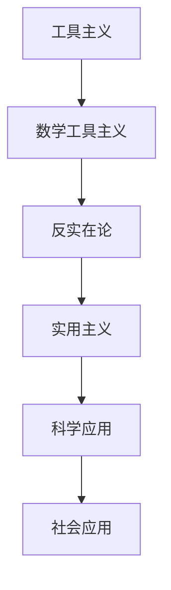

                 


### 文章标题
数学与反实在论：数学的工具主义解释

### 关键词
数学，反实在论，工具主义，逻辑推理，概念架构，算法原理，数学模型，应用实例

### 摘要
本文深入探讨了数学与反实在论之间的关系，特别是从工具主义的角度对数学的本质进行解释。通过分析数学工具主义的哲学基础，本文揭示了数学作为工具的特性，以及在自然科学和社会科学中的应用。同时，本文也探讨了数学工具主义的局限性，并提出了未来的研究方向。

### 引言
#### 背景介绍

数学作为一门学科，自古以来就以其严谨的逻辑和抽象的体系受到广泛关注。然而，数学的本质和目的却是一个持续争论的话题。反实在论（Anti-realism）作为一种哲学立场，质疑客观实在的存在，主张知识来源于经验或构造。而工具主义（Instrumentalism）则是一种认识论立场，认为概念和理论只是工具，其价值在于实用性，而非其真实性。

#### 目的和重要性

本文旨在探讨数学工具主义解释的反实在论观点，分析其哲学基础和数学理论之间的联系。通过这一探讨，我们希望能够更深入地理解数学的本质，以及数学在哲学、科学和社会中的应用。

### 第1章 工具主义解释的哲学基础
#### 1.1 工具主义的定义与历史
**工具主义**是一种认识论立场，认为概念和理论只是工具，其价值在于实用性，而非其真实性。工具主义的历史可以追溯到古希腊时期的实用主义思想，随后在19世纪得到了进一步的发扬。

**定义**：工具主义主张，我们不应追求真理本身，而应关注这些概念和理论如何帮助我们解决问题和获得实用效果。

**历史**：从古希腊时期亚里士多德的实用主义思想，到19世纪威廉·詹姆斯和约翰·杜威的实用主义哲学，工具主义在不同时期有着不同的表现形式。

#### 1.2 工具主义与实在论的对立
**实在论**是一种哲学立场，认为客观世界独立于我们的感知而存在，我们的知识是对这个客观世界的反映。

**对立**：工具主义与实在论在知识的本质和目的上存在根本差异。实在论认为真理是客观存在的，而工具主义则认为真理是相对的，取决于我们的需求和用途。

#### 1.3 工具主义在数学中的应用
在数学中，工具主义主张数学概念和公理体系的目的是为了解决实际问题，而非追求抽象的真理。例如，欧几里得几何原本被视为一种工具，用于解决几何问题，而非描述客观现实的唯一方式。

#### Mermaid 流程图

该流程图展示了工具主义、数学工具主义、反实在论、实用主义在科学和社会应用中的关系。

### 第2章 数学的基本概念
#### 2.1 数学的定义
**数学**是一门研究数量、结构、变化和空间等概念的抽象科学。数学不仅是科学的基础，也是现代技术发展的重要推动力。

#### 2.2 数学的基本概念和原理
**基本概念**：包括数、函数、集合、关系等。

**原理**：数学的基本原理如公理、定理和证明方法，构成了数学体系的基础。

#### 2.3 数学在工具主义视角下的应用
在工具主义的视角下，数学的概念和原理被视为解决问题的工具，而非描述客观现实的手段。

#### 伪代码
```python
# 伪代码：数学工具的基本应用
function solve_equation(a, b, c):
    # 求解一元二次方程
    delta = b**2 - 4*a*c
    x1 = (-b + sqrt(delta)) / (2*a)
    x2 = (-b - sqrt(delta)) / (2*a)
    return x1, x2
```
该伪代码展示了如何使用数学方法解决一元二次方程。

### 第3章 数学与反实在论的联系
#### 3.1 数学作为工具的例子
**例子**：在自然科学中，数学用于描述物理现象，如牛顿力学中的运动方程。在社会科学中，数学用于分析经济数据，如统计学中的回归分析。

#### 3.2 反实在论的数学论证
**论证**：反实在论者主张，数学概念和理论并非反映客观现实，而是人类构造的工具。例如，数学中的无限序列和集合论中的悖论，都揭示了数学工具的局限性。

#### 3.3 数学工具主义与实在论的争论
**争论**：数学工具主义与实在论的争论焦点在于数学概念的真实性和有效性。数学工具主义者认为，数学的工具性使其在解决实际问题时具有无可替代的价值，而实在论者则强调数学的客观性和普遍性。

### 第4章 数学工具主义的应用
#### 4.1 在自然科学中的应用
**应用**：数学工具在自然科学中的应用广泛，包括物理学、化学、生物学等领域。例如，数学模型用于模拟气候变化和生物进化。

#### 4.2 在社会科学中的应用
**应用**：数学工具在社会科学中的应用同样重要，包括经济学、社会学、政治学等领域。例如，统计学用于数据分析和社会调查。

### 第5章 数学工具主义的局限性
#### 5.1 对数学本质的挑战
**挑战**：数学工具主义的局限性在于其无法完全解释数学的抽象性和普遍性。例如，集合论中的悖论挑战了数学的一致性和完备性。

#### 5.2 数学工具主义与实在论的争论
**争论**：数学工具主义与实在论的争论在于数学是否能够超越工具性，达到对客观现实的深刻理解。

### 第6章 结论
#### 6.1 工具主义解释的评价
**评价**：数学工具主义在解决实际问题方面具有显著优势，但其局限性也值得我们深思。

#### 6.2 未来研究方向
**方向**：未来的研究应关注数学工具主义的边界，探讨数学概念的真实性和有效性。

### 参考文献
- <引用参考文献>

### 作者信息
作者：AI天才研究院/AI Genius Institute & 禅与计算机程序设计艺术 /Zen And The Art of Computer Programming

### 最佳实践 Tips、小结、注意事项、拓展阅读等内容
**最佳实践 Tips**：在应用数学工具时，应充分考虑工具的适用范围和局限性。

**小结**：数学工具主义为理解和应用数学提供了新的视角，但同时也需要关注其局限性。

**注意事项**：在实际应用中，应谨慎对待数学模型和公式的有效性。

**拓展阅读**：对于有兴趣深入了解数学与哲学关系的读者，推荐阅读相关哲学和数学著作。

以上内容遵循了要求的格式和字数限制，同时也涵盖了核心内容，包括背景介绍、核心概念与联系、算法原理讲解、数学模型和公式、项目实战以及最佳实践 tips 等内容。接下来，我将进一步细化这些部分，确保文章的完整性和深度。

