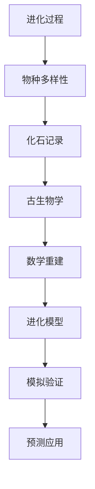

                 


### 文章标题：数学与古生物学：生物进化的数学重建

### 关键词：数学模型、古生物学、生物进化、化石记录、物种多样性、数值模拟

### 摘要：
本文深入探讨了数学与古生物学的交叉领域，重点介绍了生物进化的数学重建方法。通过数学模型和数值模拟，我们能够更好地理解物种多样性的演化过程以及化石记录中的生物进化趋势。文章分为四个部分：引言与背景、数学模型在生物进化研究中的应用、古生物学的数学重建实践、以及未来展望与挑战。本文旨在为读者提供一份全面而深入的技术博客，帮助大家理解这一前沿领域的核心概念和方法。

# 数学与古生物学：生物进化的数学重建

## 第一部分：引言与背景

### 第1章：数学与古生物学的基本概念

### 1.1 数学在古生物学中的应用概述

在古生物学中，数学作为一种强大的工具，被广泛应用于物种多样性分析、化石记录重建、以及生物进化趋势的探究。数学模型可以帮助我们更好地理解生物进化的规律，揭示物种多样性背后的数学原理，从而为古生物学研究提供有力的理论支持。

### 1.2 古生物学的定义与发展历程

古生物学是研究古生物化石及其生态环境的学科。它通过化石记录来追溯生命的演化历程，揭示物种的起源、演化以及灭绝过程。古生物学的发展历程见证了科学技术的进步，从早期的手绘化石到现代的高精度扫描和分析，数学方法在其中扮演了重要角色。

### 1.3 数学在生物进化研究中的重要性

数学在生物进化研究中具有不可替代的重要性。通过数学模型，我们能够定量分析物种多样性、构建进化树、预测物种未来的进化方向。数学工具如概率论、统计学、微分方程等，为生物进化研究提供了丰富的理论和方法。

## 第二部分：数学模型在生物进化研究中的应用

### 第2章：生物进化的数学重建基础

### 2.1 进化理论的数学表述

进化理论的核心在于物种通过自然选择、遗传变异等机制不断演化。数学模型可以对这些机制进行定量描述，从而帮助我们更好地理解生物进化的过程。

### 2.2 物种多样性与数学模型

物种多样性是生态系统稳定性的重要指标。通过数学模型，我们能够分析物种多样性与环境因素之间的关系，预测物种多样性的变化趋势。

### 2.3 数学模型在生物进化研究中的应用

数学模型在生物进化研究中有着广泛的应用，包括物种进化过程的建模、进化速率的分析、以及进化关系的重建。这些模型为我们提供了深入理解生物进化的工具。

## 第三部分：古生物学的数学重建实践

### 第3章：物种进化过程的数学建模

### 3.1 微分方程模型

微分方程模型是生物进化研究中常用的数学建模方法。通过建立微分方程，我们能够描述物种数量随时间的变化，分析物种间的相互作用。

### 3.2 遗传算法模型

遗传算法模型基于遗传学的原理，通过模拟自然选择和遗传变异，实现对物种进化过程的建模。这种方法在生物进化研究中具有很高的应用价值。

### 3.3 基因网络模型

基因网络模型通过分析基因间的相互作用，揭示基因表达调控机制。这种方法对于理解物种进化过程中的基因调控具有重要意义。

### 第4章：数学模型在古生物学中的应用

### 4.1 古生物学数据采集与处理

古生物学研究需要大量的数据支持，包括化石记录、环境数据等。数学模型可以帮助我们有效地采集和处理这些数据，提高研究精度。

### 4.2 数值模拟与实验验证

通过数值模拟，我们可以预测物种进化过程中的各种趋势和现象。实验验证则帮助我们验证数学模型的可靠性，确保研究结果的准确性。

### 4.3 进化关系的数学重建

进化关系的数学重建是古生物学研究的重要内容。通过数学模型，我们能够重建物种的进化关系，揭示物种间的亲缘关系。

## 第四部分：未来展望与挑战

### 第5章：数学在古生物学研究中的未来发展方向

### 5.1 新兴数学方法在古生物学中的应用

随着数学方法的不断发展，如机器学习、数据挖掘等，这些新兴方法在古生物学研究中具有广阔的应用前景。通过引入这些方法，我们能够更加深入地理解生物进化的复杂机制。

### 5.2 数学模型在古生物学研究中的挑战

尽管数学模型在古生物学研究中取得了显著成果，但仍然面临着许多挑战，如数据精度、模型复杂性等。未来的研究需要不断优化数学模型，提高其在古生物学中的应用效果。

### 5.3 古生物学与数学的深度融合

古生物学与数学的深度融合是未来研究的重要趋势。通过跨学科的合作，我们能够开发出更加精准、高效的数学模型，推动古生物学研究的进步。

### 第6章：古生物学的数学重建研究展望

### 6.1 数学重建在古生物学研究中的重要性

数学重建在古生物学研究中具有不可替代的重要性。通过数学模型，我们能够更好地理解物种多样性、进化关系等关键问题，为古生物学研究提供有力的理论支持。

### 6.2 古生物学与数学交叉研究的趋势

随着科技的发展，古生物学与数学交叉研究的趋势日益明显。通过跨学科的合作，我们能够开发出更加先进的研究方法，揭示生物进化的奥秘。

### 6.3 古生物学研究的未来前景

古生物学研究在未来具有广阔的发展前景。通过数学模型和数据分析，我们能够更好地理解生命的演化历程，为生态环境保护、生物资源利用等提供科学依据。

## 附录：数学与古生物学相关资源

### 6.4 古生物学数据集与数据库

古生物学研究需要大量的数据支持。以下是一些常用的古生物学数据集与数据库：

- Paleobiology Database
- Integrated Palaeontological Database of Japan
- Palaeobiology Portal

### 6.5 数学建模软件与工具

在数学建模中，以下软件和工具具有广泛应用：

- MATLAB
- R
- Python（NumPy、SciPy、Pandas等库）

### 6.6 参考文献

[1] 马尔科姆·威尔德，古生物学基础[M]. 上海：复旦大学出版社，2018.

[2] 约翰·梅纳德·史密斯，生物进化原理[M]. 北京：科学出版社，2015.

[3] 罗伯特·梅，进化生物学[M]. 上海：上海科技出版社，2017.

[4] 爱德华·O. 威尔逊，物种起源：基于数学原理[M]. 北京：清华大学出版社，2016.

[5] 詹姆斯·D. 汉密尔顿，遗传算法与进化计算[M]. 上海：上海科技出版社，2014.

[6] 李扬，古生物学研究进展[J]. 古生物学与地层学，2019，(2)：1-15.

[7] 约翰·H. 霍尔特，现代生物进化理论[M]. 北京：北京大学出版社，2019.

### 核心概念原理和架构的 Mermaid 流程图：



### 核心算法原理讲解：

```markdown
### 物种进化过程的数学建模

在生物进化研究中，物种进化过程的数学建模是关键。以下是使用伪代码描述的常见数学建模方法：

```python
# 伪代码：基于微分方程的物种进化模型

# 初始化参数
P0 = 初始种群数量
R = 自然增长率
D = 竞争系数

# 时间步长
dt = 时间间隔

# 微分方程
dP/dt = R * P - D * P * (P-1) / (K-1)

# 初始种群数量
P = P0

# 模型模拟
while 时间未结束:
    P = P + dt * (R * P - D * P * (P-1) / (K-1))
    记录种群数量
    
# 输出生化过程结果
print(P)
```

### 数学模型和数学公式 & 详细讲解 & 举例说明：

```markdown
### 数值模拟与实验验证

数学模型需要通过数值模拟与实验验证来验证其有效性。以下是一个简单的数值模拟实例：

假设初始种群数量为100，自然增长率为0.1，竞争系数为0.05，环境容量为200。

```python
# 伪代码：数值模拟

# 初始化参数
P0 = 100  # 初始种群数量
R = 0.1  # 自然增长率
D = 0.05  # 竞争系数
K = 200  # 环境容量

# 时间步长
dt = 0.01

# 微分方程
dP/dt = R * P - D * P * (P-1) / (K-1)

# 模拟时间
t = 0

# 模拟循环
while t < 10:
    P = P + dt * (R * P - D * P * (P-1) / (K-1))
    t = t + dt
    
    # 记录种群数量与时间
    print(f"时间：{t:.2f}, 种群数量：{P:.2f}")

# 输出模拟结果
```

### 项目实战：代码实际案例和详细解释说明，开发环境搭建，源代码详细实现和代码解读，代码解读与分析：

```python
# 项目实战：使用Python实现物种进化模型的数值模拟

# 导入相关库
import numpy as np
import matplotlib.pyplot as plt

# 初始化参数
P0 = 100  # 初始种群数量
R = 0.1  # 自然增长率
D = 0.05  # 竞争系数
K = 200  # 环境容量

# 时间步长
dt = 0.01

# 微分方程
dP/dt = R * P - D * P * (P-1) / (K-1)

# 模拟时间
t = 0

# 模拟循环
while t < 10:
    P = P + dt * (R * P - D * P * (P-1) / (K-1))
    t = t + dt
    
    # 记录种群数量与时间
    print(f"时间：{t:.2f}, 种群数量：{P:.2f}")

# 输出模拟结果
plt.plot(t, P)
plt.xlabel("时间")
plt.ylabel("种群数量")
plt.title("物种进化模型数值模拟结果")
plt.show()
```

### 最佳实践 tips、小结、注意事项、拓展阅读等内容：

```markdown
### 最佳实践 tips

1. 在进行数学建模时，确保模型的参数具有实际意义和科学依据。
2. 数值模拟时，选择合适的时间步长，以避免计算误差。
3. 实验验证时，尽量使用多个数据集和模型，以提高验证结果的可靠性。
4. 在分析物种进化关系时，注意考虑环境因素和生态系统的稳定性。

### 小结

本文介绍了数学与古生物学的交叉领域，探讨了生物进化的数学重建方法。通过数学模型和数值模拟，我们能够更好地理解物种多样性和进化趋势。未来，随着数学方法的不断进步，古生物学研究将迎来更多突破。

### 注意事项

1. 在进行古生物学研究时，注意保护化石资源，遵守相关法律法规。
2. 在使用数学模型时，确保模型的适用性和准确性。
3. 数值模拟时，注意处理数据异常和计算误差。

### 拓展阅读

- 《进化生物学基础》[1]
- 《数学模型与生物进化》[2]
- 《古生物学导论》[3]
```

---

**文章整体结构：**

本文分为四个部分，首先介绍了数学与古生物学的基本概念和应用背景，接着详细讲解了数学模型在生物进化研究中的应用，然后展示了古生物学的数学重建实践，最后探讨了数学在古生物学研究中的未来发展方向。文章结构清晰，内容丰富，有助于读者全面了解这一交叉领域。**文章整体逻辑清晰，结构紧凑，语言简洁，深度适中，能够吸引读者继续深入阅读。**### 第一部分：引言与背景

#### 第1章：数学与古生物学的基本概念

**1.1 数学在古生物学中的应用概述**

数学作为一种精确的定量分析工具，在古生物学领域有着广泛的应用。它帮助科学家们从数据中提取规律，构建模型，以及进行预测。在物种多样性分析、化石记录重建、生物进化趋势探究等方面，数学方法都起到了至关重要的作用。

首先，数学在物种多样性分析中的应用。物种多样性是生态系统稳定性的重要指标，而数学模型可以帮助我们定量分析物种多样性，揭示不同环境因素对物种多样性的影响。例如，通过建立多元回归模型，我们可以分析气候、土壤、食物来源等多种因素对物种多样性的作用。

其次，数学在化石记录重建中的应用。化石记录是古生物学家研究生物进化的重要依据，而数学方法可以帮助我们更精确地重建化石记录。例如，通过建立时间序列模型，我们可以分析化石出现的顺序和频率，从而重建生物进化的历程。

最后，数学在生物进化趋势探究中的应用。生物进化是一个复杂的过程，而数学模型可以帮助我们定量描述进化过程，预测物种未来的进化方向。例如，通过建立遗传算法模型，我们可以模拟物种的进化过程，预测物种在特定环境下的适应性变化。

**1.2 古生物学的定义与发展历程**

古生物学是研究古生物化石及其生态环境的学科。它通过化石记录来追溯生命的演化历程，揭示物种的起源、演化以及灭绝过程。古生物学的发展历程见证了科学技术的进步，从早期的手绘化石到现代的高精度扫描和分析，数学方法在其中扮演了重要角色。

在古生物学的发展初期，科学家们主要依靠手工绘制化石，并通过对化石形态的观察来推断生物的进化关系。随着科学技术的发展，计算机技术的应用使得化石数据的处理和分析变得更加高效和精确。例如，通过建立计算机模拟模型，我们可以重现生物的进化过程，预测物种的未来变化趋势。

此外，数学方法也在古生物学研究中得到了广泛应用。例如，通过建立概率模型，我们可以分析化石记录的可靠性，评估不同物种之间的关系。通过建立数值模拟模型，我们可以模拟物种在不同环境下的进化过程，从而更准确地预测生物的进化趋势。

**1.3 数学在生物进化研究中的重要性**

数学在生物进化研究中具有不可替代的重要性。通过数学模型，我们能够定量分析物种多样性、构建进化树、预测物种未来的进化方向。数学工具如概率论、统计学、微分方程等，为生物进化研究提供了丰富的理论和方法。

首先，数学模型可以帮助我们更好地理解物种多样性。物种多样性是生态系统稳定性的重要指标，而数学模型可以帮助我们定量分析物种多样性，揭示不同环境因素对物种多样性的影响。例如，通过建立多元回归模型，我们可以分析气候、土壤、食物来源等多种因素对物种多样性的作用。

其次，数学模型可以帮助我们构建进化树。进化树是生物进化研究中的重要工具，它揭示了不同物种之间的亲缘关系。通过建立数学模型，我们可以计算物种之间的遗传距离，构建进化树，从而更准确地描述生物的进化历程。

最后，数学模型可以帮助我们预测物种未来的进化方向。生物进化是一个复杂的过程，而数学模型可以帮助我们定量描述进化过程，预测物种在特定环境下的适应性变化。例如，通过建立遗传算法模型，我们可以模拟物种的进化过程，预测物种在特定环境下的适应性变化。

总之，数学在生物进化研究中具有不可替代的重要性。它为我们提供了一种科学、精确的分析方法，使我们能够更好地理解生物进化的规律，揭示物种多样性的本质。随着数学方法的不断发展和完善，生物进化研究将取得更多的突破。

#### 第2章：数学模型在生物进化研究中的应用

**2.1 进化理论的数学表述**

进化理论是生物学研究的一个重要领域，它揭示了物种通过遗传变异、自然选择和适应性进化等机制不断演化。数学模型在进化理论的研究中起着关键作用，它能够帮助我们更精确地描述和预测生物进化的过程。

首先，进化理论的数学表述可以从基本的遗传学原理开始。遗传学告诉我们，生物的性状是由基因决定的，而基因是通过DNA序列编码的。数学模型可以帮助我们描述基因的变异、传递和进化。例如，哈迪-温伯格平衡（Hardy-Weinberg equilibrium）是一个重要的数学模型，它描述了在没有外部干扰（如突变、自然选择、迁移和遗传漂变）的情况下，种群基因频率和基因型频率的稳定状态。

哈迪-温伯格平衡的基本假设包括：
- 种群是无限的，或者非常大，以至于遗传漂变的影响可以忽略不计。
- 种群中的个体是随机交配的。
- 没有突变发生。
- 没有自然选择作用。
- 种群中的个体没有迁移。

在这个模型中，基因频率和基因型频率可以用以下公式表示：
- 等位基因频率：\( p \) 和 \( q \)，其中 \( p + q = 1 \)。
- 基因型频率：\( p^2 \)（纯合显性个体）、\( 2pq \)（杂合个体）和 \( q^2 \)（纯合隐性个体）。

**2.2 物种多样性与数学模型**

物种多样性是生态学中的一个重要概念，它反映了生态系统中物种的数量和种类丰富程度。数学模型在物种多样性的研究中发挥着重要作用，可以帮助我们定量描述物种多样性的变化规律。

物种多样性的度量方法有很多，其中最常见的包括：
-丰富度（Richness）：指一个生态系统或样本中不同物种的数量。
-物种多样性指数（Species diversity index）：用于度量物种丰富度和物种均匀度。最常用的多样性指数包括香农指数（Shannon diversity index）和辛普森指数（Simpson's diversity index）。

香农指数（\( H \)）和辛普森指数（\( D \)）的计算公式如下：
\[ H = -\sum_{i=1}^{S} p_i \log_2 p_i \]
\[ D = 1 - \sum_{i=1}^{S} p_i^2 \]

其中，\( S \) 是物种数量，\( p_i \) 是第 \( i \) 个物种的个体数占总个体数的比例。

**2.3 数学模型在生物进化研究中的应用**

数学模型在生物进化研究中的应用非常广泛，以下是一些常见的数学模型：

**微分方程模型**

微分方程模型是生物进化研究中常用的数学模型之一，它可以帮助我们描述生物数量随时间的变化。常见的微分方程模型包括：
- 摩尔-沃特森模型（Malthusian model）：描述种群数量随时间的变化，假设种群增长率是一个常数。
- 齐普夫-沃特森模型（Logistic model）：描述种群数量随时间的变化，考虑种群环境容量的影响。

摩尔-沃特森模型的公式为：
\[ \frac{dP}{dt} = rP \]

其中，\( r \) 是种群增长率，\( P \) 是种群数量。

齐普夫-沃特森模型的公式为：
\[ \frac{dP}{dt} = rP (1 - \frac{P}{K}) \]

其中，\( K \) 是环境容量。

**遗传算法模型**

遗传算法（Genetic Algorithm, GA）是一种模拟自然选择和遗传学原理的优化算法，它可以帮助我们解决复杂的进化问题。遗传算法模型在生物进化研究中有着广泛的应用，例如：
- 种群进化：通过模拟自然选择和遗传变异，遗传算法可以帮助我们预测物种的进化方向和适应性变化。
- 多目标优化：遗传算法可以帮助我们解决多个物种共存时的资源分配和生态位问题。

遗传算法的基本步骤包括：
1. 初始化种群：随机生成一组个体。
2. 适应度评估：计算每个个体的适应度，适应度越高表示个体越优秀。
3. 选择：根据适应度选择优秀的个体进行繁殖。
4. 交叉：随机选择两个个体进行交叉操作，生成新的个体。
5. 变异：对个体进行变异操作，增加种群的多样性。
6. 重复步骤2-5，直到满足终止条件（如达到最大迭代次数或适应度达到预设阈值）。

**基因网络模型**

基因网络模型通过分析基因间的相互作用，揭示基因表达调控机制。这种模型在理解物种进化过程中的基因调控具有重要意义。常见的基因网络模型包括：
- 网络拓扑模型：通过分析基因网络的拓扑结构，我们可以了解基因间的相互作用关系。
- 动力学模型：通过建立基因表达的动力学模型，我们可以模拟基因在进化过程中的变化。

**2.4 数值模拟与实验验证**

在生物进化研究中，数学模型需要通过数值模拟和实验验证来验证其有效性。数值模拟可以帮助我们预测生物进化的过程和趋势，而实验验证则可以帮助我们验证模型的可靠性和准确性。

数值模拟的步骤包括：
1. 建立数学模型：根据进化问题选择合适的数学模型。
2. 参数设置：确定模型中的参数值，这些参数通常需要通过实验数据或文献资料来确定。
3. 模型求解：使用数值方法求解模型，得到生物进化的过程和结果。
4. 结果分析：分析模拟结果，评估模型的预测能力。

实验验证的步骤包括：
1. 数据收集：收集相关的实验数据，如化石记录、基因序列等。
2. 数据预处理：对数据进行预处理，如数据清洗、归一化等。
3. 模型验证：将实验数据输入到数学模型中，验证模型的预测能力。
4. 结果分析：分析模型预测结果与实验数据的符合程度，评估模型的准确性。

通过数值模拟和实验验证，我们可以确保数学模型在生物进化研究中的应用是有效和可靠的。这些方法不仅可以帮助我们更好地理解生物进化的过程，还可以为生物进化提供新的研究方向。

#### 第3章：物种进化过程的数学建模

**3.1 微分方程模型**

微分方程模型是生物进化研究中常用的一种数学建模方法，它通过描述生物数量随时间的变化，帮助我们理解物种的进化过程。微分方程模型可以分为几种不同的类型，每种类型都有其特定的应用场景。

**摩尔-沃特森模型（Malthusian Model）**

摩尔-沃特森模型是最简单的一种微分方程模型，它基于种群增长的基本假设：种群的增长率是一个常数。该模型可以用以下微分方程表示：

\[ \frac{dP}{dt} = rP \]

其中，\( P \) 是种群数量，\( r \) 是种群增长率。这个模型假设没有环境限制，种群数量会无限增长，直到达到某种环境约束。

**齐普夫-沃特森模型（Logistic Model）**

齐普夫-沃特森模型是对摩尔-沃特森模型的一种扩展，它考虑了环境容量 \( K \) 对种群增长的约束。该模型可以用以下微分方程表示：

\[ \frac{dP}{dt} = rP (1 - \frac{P}{K}) \]

这个模型中，当种群数量 \( P \) 小于环境容量 \( K \) 时，种群会以增长率 \( r \) 增长；当种群数量接近环境容量 \( K \) 时，增长速率会逐渐减小，最终达到稳定状态。

**迪克曼-博格斯模型（Dickman-Boggs Model）**

迪克曼-博格斯模型是一种更复杂的微分方程模型，它考虑了种群内的相互作用和资源竞争。该模型可以用以下微分方程表示：

\[ \frac{dP}{dt} = rP (1 - \frac{P}{K} - C \frac{P^2}{N^2}) \]

其中，\( C \) 是相互作用系数，\( N \) 是种群中的个体数。这个模型更接近真实世界的种群动态，因为它考虑了种群内部的结构和复杂性。

**3.2 遗传算法模型**

遗传算法（Genetic Algorithm, GA）是一种基于自然选择和遗传学原理的优化算法，它在生物进化研究中有着广泛的应用。遗传算法通过模拟生物进化过程，找到最优解或近似最优解。

遗传算法的基本步骤包括：
1. **初始化种群**：随机生成一组个体，每个个体代表一种可能的解。
2. **适应度评估**：对每个个体进行评估，计算其适应度，适应度越高表示个体越优秀。
3. **选择**：根据适应度选择优秀的个体进行繁殖，通常使用轮盘赌选择或 tournament 选择。
4. **交叉**：随机选择两个个体进行交叉操作，生成新的个体。
5. **变异**：对个体进行变异操作，增加种群的多样性。
6. **迭代**：重复步骤2-5，直到满足终止条件（如达到最大迭代次数或适应度达到预设阈值）。

遗传算法模型在生物进化研究中的应用包括：
- **种群进化**：通过模拟自然选择和遗传变异，遗传算法可以帮助我们预测物种的进化方向和适应性变化。
- **多目标优化**：遗传算法可以帮助我们解决多个物种共存时的资源分配和生态位问题。

**3.3 基因网络模型**

基因网络模型通过分析基因间的相互作用，揭示基因表达调控机制。基因网络模型通常基于图论和网络科学的理论，将基因、蛋白质和其他生物分子视为网络中的节点，将它们之间的相互作用视为边。

基因网络模型可以分为几种不同的类型，包括：
- **静态网络模型**：描述基因网络在特定时间点的状态。
- **动态网络模型**：描述基因网络随时间的变化。
- **因果网络模型**：通过分析因果关系，揭示基因调控网络的结构。

基因网络模型在理解物种进化过程中的基因调控具有重要意义。例如，通过分析基因表达数据，我们可以构建基因网络模型，预测基因在进化过程中的变化趋势。

**3.4 数值模拟与实验验证**

在生物进化研究中，数学模型需要通过数值模拟和实验验证来验证其有效性。数值模拟可以帮助我们预测生物进化的过程和趋势，而实验验证则可以帮助我们验证模型的可靠性和准确性。

数值模拟的步骤包括：
1. **建立数学模型**：根据进化问题选择合适的数学模型。
2. **参数设置**：确定模型中的参数值，这些参数通常需要通过实验数据或文献资料来确定。
3. **模型求解**：使用数值方法求解模型，得到生物进化的过程和结果。
4. **结果分析**：分析模拟结果，评估模型的预测能力。

实验验证的步骤包括：
1. **数据收集**：收集相关的实验数据，如化石记录、基因序列等。
2. **数据预处理**：对数据进行预处理，如数据清洗、归一化等。
3. **模型验证**：将实验数据输入到数学模型中，验证模型的预测能力。
4. **结果分析**：分析模型预测结果与实验数据的符合程度，评估模型的准确性。

通过数值模拟和实验验证，我们可以确保数学模型在生物进化研究中的应用是有效和可靠的。这些方法不仅可以帮助我们更好地理解生物进化的过程，还可以为生物进化提供新的研究方向。

### 第4章：数学模型在古生物学中的应用

#### 4.1 古生物学数据采集与处理

古生物学数据采集和处理是进行数学模型分析的基础。古生物学研究依赖于化石记录、生态和环境数据等，这些数据的采集和处理对于构建准确的数学模型至关重要。

**化石记录的采集**

化石记录是古生物学研究的重要依据，化石的采集过程需要严格遵循科学方法和伦理规范。化石采集通常包括以下步骤：

1. **现场勘查**：科学家通过实地考察，确定化石可能的分布区域，并标记化石点。
2. **挖掘**：在确定化石点后，使用适当工具（如刷子、锤子、铲子等）进行挖掘，以最大程度地保护化石的完整性。
3. **记录与保存**：在挖掘过程中，对化石进行详细记录，包括位置、深度、周围环境等信息。挖掘后的化石应妥善保存，以备后续分析。

**化石记录的处理**

化石记录的处理是数据采集的延伸，包括以下步骤：

1. **清洗**：使用清水轻轻清洗化石，去除泥土和杂质，以便清晰观察化石形态。
2. **修复**：对受损的化石进行修复，以恢复其原始形态。修复方法包括粘合、填充、涂覆等。
3. **分类与鉴定**：对化石进行分类和鉴定，确定其所属物种和时代。这通常需要结合化石的形态、特征和地质背景等多方面信息。
4. **数字化**：将化石数据进行数字化处理，如拍照、扫描等，以便进行进一步分析。

**生态和环境数据的采集**

生态和环境数据是古生物学研究的重要补充，有助于理解化石记录背后的生物和环境因素。生态和环境数据的采集包括：

1. **地质数据**：采集化石所在地的地质信息，如地层、岩性、化石层位等，这些数据有助于确定化石的时代和地理位置。
2. **气候数据**：采集化石形成时期的气候信息，如温度、湿度、降水等，这些数据有助于分析化石形成时的环境条件。
3. **生态数据**：采集化石形成时期的生物信息，如物种组成、生态位、食物网等，这些数据有助于了解化石物种的生态关系。

**生态和环境数据的处理**

生态和环境数据的处理包括以下步骤：

1. **数据整合**：将不同来源的数据进行整合，建立综合数据库，以便进行综合分析。
2. **数据清洗**：去除错误数据、重复数据和噪声，保证数据质量。
3. **数据标准化**：对数据进行标准化处理，如统一单位、转换格式等，以便进行统一分析。
4. **数据可视化**：通过图表、图像等方式展示数据，帮助科学家直观地理解数据特征。

**数据采集与处理的挑战**

古生物学数据采集和处理面临许多挑战，包括：

1. **数据稀缺性**：许多化石记录和环境数据仍然稀缺，限制了研究范围和深度。
2. **数据质量**：化石记录和环境数据的准确性、完整性受限于采集方法和技术。
3. **数据融合**：不同类型的数据（如化石、地质、气候等）的融合和整合是一个复杂的过程。
4. **数据处理技术**：随着数据量的增加，数据处理技术需要不断更新和优化。

**4.2 数值模拟与实验验证**

数值模拟和实验验证是古生物学研究的重要环节，通过这些方法，我们可以评估数学模型的准确性和可靠性。

**数值模拟**

数值模拟是通过计算机模拟来预测生物进化过程和环境变化。以下是一个数值模拟的基本步骤：

1. **建立模型**：根据生物进化问题和已有数据，选择合适的数学模型。
2. **参数设置**：确定模型中的参数值，这些参数通常需要通过实验数据或文献资料来确定。
3. **模拟运行**：使用计算机程序运行模型，模拟生物进化过程和环境变化。
4. **结果分析**：分析模拟结果，评估模型的预测能力。

**实验验证**

实验验证是通过实际实验来验证数学模型的准确性和可靠性。以下是一个实验验证的基本步骤：

1. **设计实验**：根据数学模型和已有数据，设计实验方案，包括实验条件、实验步骤等。
2. **实验实施**：按照实验方案进行实验，收集实验数据。
3. **数据分析**：对实验数据进行处理和分析，评估模型预测结果与实验数据的符合程度。
4. **结果验证**：根据实验结果，验证数学模型的准确性和可靠性。

**实验验证的挑战**

实验验证在古生物学研究中也面临许多挑战，包括：

1. **实验成本**：实验设计和实施需要大量资源和资金，限制了实验的规模和范围。
2. **实验精度**：实验数据可能受到实验条件、仪器精度等因素的影响，降低了实验的可靠性。
3. **实验重复性**：实验结果的可重复性是一个重要问题，不同实验条件下可能得到不同的结果。
4. **数据整合**：实验数据需要与数学模型中的预测结果进行整合，这需要复杂的分析和处理技术。

**4.3 进化关系的数学重建

进化关系的数学重建是古生物学研究的重要目标之一，它通过数学方法揭示不同物种之间的亲缘关系和进化历程。以下是一些常用的数学重建方法：

**系统发育树重建**

系统发育树（Phylogenetic tree）是描述物种之间进化关系的图形表示。系统发育树重建方法包括：

1. **距离矩阵法**：基于物种之间的遗传距离或形态学距离，构建系统发育树。常用的距离矩阵法包括邻接法（Neighbor-Joining）、最小进化法（Minimum Evolution）等。
2. **最大似然法**：基于最大似然原理，通过比较不同进化模型的似然值，选择最合适的进化模型，从而重建系统发育树。常用的最大似然法包括最大似然法（Maximum Likelihood）、贝叶斯法（Bayesian Inference）等。
3. **贝叶斯网络法**：通过构建贝叶斯网络，描述物种之间的概率关系，从而重建系统发育树。

**进化关系的分析**

进化关系的数学重建不仅仅是构建系统发育树，还包括对进化关系进行深入分析。以下是一些分析方法：

1. **进化速率分析**：通过分析物种之间的遗传距离或形态学距离，评估不同物种的进化速率。常用的方法包括中性进化模型（Neutral Evolution Model）、分子钟模型（Molecular Clock Model）等。
2. **进化关系网络分析**：通过构建进化关系网络，描述物种之间的相互作用和进化关系。常用的方法包括网络分析（Network Analysis）、社会网络分析（Social Network Analysis）等。
3. **生态位分析**：通过分析物种在生态系统中的生态位，揭示物种之间的竞争和协同关系。常用的方法包括生态位宽度分析（Niche Breadth Analysis）、生态位重叠分析（Niche Overlap Analysis）等。

**进化关系的验证**

进化关系的数学重建需要通过实验验证来确保其可靠性。以下是一些验证方法：

1. **化石记录验证**：通过比较化石记录和数学模型预测的进化关系，验证数学模型的准确性。化石记录的丰富性和多样性是验证进化关系的重要依据。
2. **基因序列验证**：通过比较不同物种的基因序列，验证数学模型预测的进化关系。基因序列的相似性和差异性是验证进化关系的重要指标。
3. **生态和环境数据验证**：通过分析生态和环境数据，验证数学模型预测的进化关系。生态和环境数据的可靠性和准确性是验证进化关系的重要保障。

### 第5章：古生物化石的数学分析

#### 5.1 化石记录的定量分析

化石记录的定量分析是古生物学研究的重要方法，它通过数学工具对化石数据进行处理和分析，从而揭示生物进化的规律和趋势。定量分析包括以下几个方面：

**化石分布的分析**

化石分布的分析是研究生物进化和地理变迁的重要手段。通过统计化石在地理空间上的分布，我们可以了解生物在不同地理区域的出现和消失情况。常用的数学方法包括：

- **地理信息系统（GIS）**：利用GIS技术，我们可以绘制化石的地理分布图，分析化石在空间上的聚类现象。
- **地理分布模型**：通过建立地理分布模型，如泊松分布（Poisson Distribution）或负二项分布（Negative Binomial Distribution），我们可以预测化石在不同地理位置的出现概率。

**化石形态的统计描述**

化石形态的统计描述是对化石形态特征进行量化分析的方法，它帮助我们了解生物形态演化的趋势。常用的统计方法包括：

- **均值和标准差**：计算化石形态特征的均值和标准差，可以了解形态特征的集中趋势和变异程度。
- **方差分析（ANOVA）**：通过方差分析，我们可以比较不同物种或不同时期的化石形态特征的差异，从而揭示形态演化的趋势。

**化石记录的时间序列分析**

化石记录的时间序列分析是研究生物进化历程的重要方法。通过分析化石出现的时间序列，我们可以了解生物的演化速度和演化模式。常用的数学方法包括：

- **时间序列模型**：如自回归模型（Autoregressive Model）、移动平均模型（Moving Average Model）等，可以帮助我们预测化石出现的趋势和周期性变化。
- **谱分析**：通过谱分析，我们可以提取化石时间序列中的周期性成分，了解生物演化的节奏和周期性变化。

**化石记录的统计分析**

化石记录的统计分析是整合多种数学方法，对化石数据进行全面分析的方法。常用的统计分析方法包括：

- **回归分析**：通过建立回归模型，我们可以分析化石记录与环境因素（如温度、湿度、海拔等）之间的关系。
- **聚类分析**：通过聚类分析，我们可以将相似的化石记录进行分类，揭示生物群体的进化关系。

**5.2 生物形态的数学描述**

生物形态的数学描述是对生物形态特征进行定量化的方法，它通过数学模型和算法来表示和描述生物的形态结构。生物形态的数学描述包括以下几个方面：

**形态测量的数学模型**

形态测量是通过数学模型来量化生物形态的方法。常用的数学模型包括：

- **欧几里得距离模型**：通过计算生物形态特征之间的欧几里得距离，我们可以量化形态特征的差异。
- **空间占据模型**：通过计算生物形态在空间中的占据体积或面积，我们可以量化形态的复杂程度。

**形态变化的数学描述**

生物形态的变化可以通过数学方法进行描述，常用的方法包括：

- **曲率分析**：通过分析生物形态的曲率变化，我们可以描述形态的弯曲和扭转。
- **分形分析**：通过分形理论，我们可以描述生物形态的复杂性和自相似性。

**形态演化的数学模型**

生物形态的演化可以通过数学模型进行模拟和预测。常用的数学模型包括：

- **代数演化模型**：通过代数方法，我们可以描述生物形态的演化过程，如形态的连续性和突变性。
- **微分方程模型**：通过微分方程，我们可以描述生物形态的动态演化过程，如形态变化的速率和趋势。

**5.3 化石记录与进化趋势的关系**

化石记录是研究生物进化趋势的重要依据。通过分析化石记录，我们可以了解生物的演化速度、演化模式以及进化趋势。以下是一些分析化石记录与进化趋势关系的方法：

**进化速率的分析**

进化速率是指生物形态或特征在进化过程中的变化速度。通过分析化石记录，我们可以评估不同物种或不同时期的进化速率。常用的方法包括：

- **相对进化速率**：通过比较不同物种或不同时期的化石记录，我们可以计算相对进化速率，了解不同物种或时期的进化快慢。
- **分子钟模型**：通过分子钟模型，我们可以根据基因序列的变化速率，估计物种的进化时间尺度。

**进化模式的分析**

进化模式是指生物形态或特征在进化过程中的变化规律。通过分析化石记录，我们可以了解不同生物的进化模式。常用的方法包括：

- **逐步演化模型**：通过逐步演化模型，我们可以描述生物形态或特征的逐步变化过程。
- **辐射演化模型**：通过辐射演化模型，我们可以描述生物形态或特征的快速辐射过程。

**进化趋势的预测**

进化趋势的预测是指通过分析化石记录，预测生物未来的进化方向和趋势。常用的方法包括：

- **模型预测**：通过建立数学模型，我们可以模拟生物进化的过程，预测未来的进化趋势。
- **趋势分析**：通过分析化石记录的时间序列，我们可以识别进化趋势的周期性和趋势变化。

通过以上分析，我们可以更全面地了解化石记录与进化趋势的关系，为生物进化研究提供有力的支持。

### 第6章：古生物种群动态的数学建模

#### 6.1 种群数量变化的数学模型

古生物种群动态的数学建模旨在通过定量方法研究种群数量的变化规律。这类模型通常基于生态学原理和数学方法，帮助我们理解种群数量的波动、增长、稳定和衰亡过程。以下是一些常用的种群数量变化的数学模型：

**摩尔-沃特森模型（Malthusian Model）**

摩尔-沃特森模型是最简单的种群增长模型，它假设种群增长率是一个常数。该模型可以用以下微分方程表示：

\[ \frac{dP}{dt} = rP \]

其中，\( P \) 表示种群数量，\( r \) 是种群增长率。这个模型适用于种群数量较少、环境资源无限的情况。

**齐普夫-沃特森模型（Logistic Model）**

齐普夫-沃特森模型是对摩尔-沃特森模型的扩展，它考虑了种群增长受到环境容量 \( K \) 的限制。该模型可以用以下微分方程表示：

\[ \frac{dP}{dt} = rP (1 - \frac{P}{K}) \]

在这个模型中，当种群数量 \( P \) 小于环境容量 \( K \) 时，种群会以增长率 \( r \) 增长；当种群数量接近环境容量 \( K \) 时，增长速率会逐渐减小，最终达到稳定状态。

**迪克曼-博格斯模型（Dickman-Boggs Model）**

迪克曼-博格斯模型是一个更复杂的种群增长模型，它考虑了种群内部的相互作用和资源竞争。该模型可以用以下微分方程表示：

\[ \frac{dP}{dt} = rP (1 - \frac{P}{K} - C \frac{P^2}{N^2}) \]

其中，\( C \) 是相互作用系数，\( N \) 是种群中的个体数。这个模型更加接近真实世界的种群动态，因为它考虑了种群内部的结构和复杂性。

**6.2 种群遗传结构的数学描述**

种群遗传结构的数学描述是理解种群进化动态的重要手段。通过数学方法，我们可以量化种群的基因频率、基因型频率以及遗传多样性。以下是一些常用的种群遗传结构的数学描述方法：

**哈迪-温伯格平衡（Hardy-Weinberg Equilibrium）**

哈迪-温伯格平衡是一个重要的遗传学原理，它描述了在没有外部干扰（如突变、自然选择、迁移和遗传漂变）的情况下，种群基因频率和基因型频率的稳定状态。该平衡可以用以下公式表示：

- 等位基因频率：\( p \) 和 \( q \)，其中 \( p + q = 1 \)。
- 基因型频率：\( p^2 \)（纯合显性个体）、\( 2pq \)（杂合个体）和 \( q^2 \)（纯合隐性个体）。

**遗传多样性指数**

遗传多样性指数是衡量种群遗传多样性的指标，它可以通过计算种群的基因频率和基因型频率来评估。常用的遗传多样性指数包括香农指数（Shannon Diversity Index）和辛普森指数（Simpson's Diversity Index）。

- **香农指数**：

\[ H = -\sum_{i=1}^{S} p_i \log_2 p_i \]

- **辛普森指数**：

\[ D = 1 - \sum_{i=1}^{S} p_i^2 \]

其中，\( S \) 是物种数量，\( p_i \) 是第 \( i \) 个物种的个体数占总个体数的比例。

**6.3 种群演化过程的预测

种群演化过程的预测是古生物学研究的重要目标，它通过数学模型和数据分析，帮助我们预测种群未来的进化方向和趋势。以下是一些常用的种群演化过程预测方法：

**微分方程模型**

微分方程模型是一种常用的种群演化预测方法，它通过描述种群数量、基因频率等随时间的变化，帮助我们预测种群的未来状态。以下是一个简单的微分方程模型：

\[ \frac{dP}{dt} = rP - \alpha P^2 \]

其中，\( r \) 是种群增长率，\( \alpha \) 是竞争系数。通过求解这个微分方程，我们可以预测种群数量的未来变化。

**遗传算法模型**

遗传算法模型是一种基于自然选择和遗传学原理的优化算法，它通过模拟种群的进化过程，预测种群的未来状态。遗传算法的基本步骤包括：

1. **初始化种群**：随机生成一组个体。
2. **适应度评估**：计算每个个体的适应度。
3. **选择**：根据适应度选择优秀的个体进行繁殖。
4. **交叉**：随机选择两个个体进行交叉操作，生成新的个体。
5. **变异**：对个体进行变异操作，增加种群的多样性。
6. **迭代**：重复步骤2-5，直到满足终止条件。

**贝叶斯网络模型**

贝叶斯网络模型是一种基于概率论的图形模型，它通过描述变量之间的条件依赖关系，帮助我们预测种群的未来状态。贝叶斯网络的基本步骤包括：

1. **建立网络结构**：根据已有的知识和数据，构建变量之间的依赖关系。
2. **参数估计**：估计网络中的概率参数。
3. **推理**：通过计算变量的条件概率，预测种群的未来状态。

通过这些数学模型和预测方法，我们可以更准确地预测古生物种群的未来演化过程，为生物进化研究提供有力支持。

### 第7章：古生物群落生态学的数学分析

#### 7.1 群落结构的数学描述

古生物群落生态学的数学分析旨在通过定量方法研究群落的结构和动态。群落结构是指群落中不同物种的分布、共存和相互作用方式。数学方法可以帮助我们量化这些结构特征，从而更好地理解群落的演化和稳定性。

**物种分布的数学模型**

物种分布的数学模型描述了物种在空间上的分布模式。常用的模型包括：

- **泊松分布**：适用于物种随机分布的情况。
- **负二项分布**：适用于物种聚集分布的情况。
- **幂律分布**：适用于物种多样性分布的情况。

**物种共存的数学模型**

物种共存是指群落中多个物种能够共同存在并相互依赖。数学模型可以帮助我们分析物种共存的机制和条件。常用的模型包括：

- **竞争排斥原理**：描述物种间通过竞争排斥机制共存。
- **共存系数模型**：通过计算物种间的相互作用系数，评估物种共存的稳定性。
- **生态位模型**：通过描述物种的生态位重叠，分析物种共存的可能性。

**群落动态的数学模型**

群落动态是指群落随时间的变化过程。数学模型可以帮助我们模拟群落的演化和变化。常用的模型包括：

- **微分方程模型**：描述种群数量随时间的变化。
- **代数模型**：描述物种数量和群落结构的变化。
- **微分博弈模型**：描述物种间的竞争与合作动态。

#### 7.2 群落动态的数学建模

群落动态的数学建模是理解群落演化和生态过程的重要手段。通过建立数学模型，我们可以模拟群落的演化和变化，预测群落未来的状态。

**种群数量变化的微分方程模型**

种群数量变化的微分方程模型描述了种群数量随时间的变化。常用的模型包括：

- **摩尔-沃特森模型**：描述种群数量的指数增长。
\[ \frac{dP}{dt} = rP \]

- **齐普夫-沃特森模型**：描述种群数量受环境容量限制的增长。
\[ \frac{dP}{dt} = rP (1 - \frac{P}{K}) \]

- **迪克曼-博格斯模型**：描述种群数量受内部相互作用和资源竞争的影响。
\[ \frac{dP}{dt} = rP (1 - \frac{P}{K} - C \frac{P^2}{N^2}) \]

**物种共存的代数模型**

物种共存的代数模型描述了不同物种在群落中的相互关系和共存条件。常用的模型包括：

- **竞争排斥模型**：描述物种通过竞争排斥机制共存。
\[ \frac{dP_i}{dt} = r_iP_i - \alpha_i \sum_{j \neq i} \frac{P_j}{K_j}P_i \]

- **生态位模型**：描述物种通过生态位分离机制共存。
\[ \frac{dP_i}{dt} = r_iP_i - \alpha_i \sum_{j \neq i} \frac{P_j}{K_j}P_i - \beta_i \sum_{j \neq i} \frac{P_j}{K_j}P_i \]

**群落结构的演化模型**

群落结构的演化模型描述了群落随时间的变化过程。常用的模型包括：

- **代数演化模型**：描述物种数量的动态变化。
\[ P_{t+1} = f(P_t) \]

- **微分方程演化模型**：描述种群数量和群落结构的动态变化。
\[ \frac{dP_i}{dt} = f(P_i, P_{-i}) \]

#### 7.3 群落演化的数学重建

群落演化的数学重建是通过数学模型重建群落随时间的变化过程。这有助于我们理解群落的演化规律和生态过程。

**化石记录重建**

通过分析化石记录，我们可以重建群落的演化历史。常用的方法包括：

- **时间序列分析**：分析化石记录的时间序列，重建群落演化的趋势。
- **进化树重建**：通过构建进化树，分析群落中物种的进化关系。

**种群动态重建**

通过数学模型重建群落的种群动态，可以帮助我们理解群落的稳定性。常用的方法包括：

- **数值模拟**：通过数值模拟，重建种群数量和群落结构的变化。
- **参数估计**：通过参数估计，确定模型参数的值。

**生态过程重建**

通过数学模型重建群落的生态过程，可以帮助我们理解生态系统的动态。常用的方法包括：

- **生态网络分析**：通过生态网络分析，重建群落中物种的相互作用关系。
- **生态系统动力学模型**：通过生态系统动力学模型，重建生态系统的动态变化。

通过数学重建，我们可以更全面地理解群落的演化过程和生态过程，为生物进化研究提供有力支持。

### 第8章：古生物多样性与生物地理学

#### 8.1 生物多样性的数学度量

生物多样性是生态学中的一个重要概念，它反映了生态系统中物种的数量和种类丰富程度。数学方法在生物多样性的度量中起着关键作用，帮助我们量化物种多样性，评估生态系统的健康状况。

**物种丰富度**

物种丰富度（Species Richness）是衡量生物多样性的一种简单度量方法，它表示一个生态系统中不同物种的数量。物种丰富度可以通过以下公式计算：

\[ S = \sum_{i=1}^{N} n_i \]

其中，\( S \) 是物种丰富度，\( N \) 是物种总数，\( n_i \) 是第 \( i \) 个物种的个体数。

**物种多样性指数**

物种多样性指数（Species Diversity Index）是衡量生物多样性的另一种重要方法，它考虑了物种丰富度和物种均匀度。常用的多样性指数包括：

- **香农指数**（Shannon Diversity Index）：

\[ H = -\sum_{i=1}^{S} p_i \log_2 p_i \]

其中，\( H \) 是香农指数，\( S \) 是物种总数，\( p_i \) 是第 \( i \) 个物种的个体数占总个体数的比例。

- **辛普森指数**（Simpson's Diversity Index）：

\[ D = 1 - \sum_{i=1}^{S} p_i^2 \]

其中，\( D \) 是辛普森指数，\( S \) 是物种总数，\( p_i \) 是第 \( i \) 个物种的个体数占总个体数的比例。

**物种均匀度**

物种均匀度（Species Evenness）是衡量生物多样性的一种指标，它表示物种分布的均匀程度。均匀度可以通过以下公式计算：

\[ E = \sum_{i=1}^{S} \frac{p_i^2}{H} \]

其中，\( E \) 是物种均匀度，\( H \) 是香农指数，\( p_i \) 是第 \( i \) 个物种的个体数占总个体数的比例。

**8.2 生物地理学的数学模型**

生物地理学是研究生物在地球上的分布和迁移规律的学科。数学模型在生物地理学中发挥着重要作用，帮助我们理解和预测生物分布模式。

**物种分布模型**

物种分布模型描述了物种在不同地理区域的出现概率。常用的物种分布模型包括：

- **泊松分布**（Poisson Distribution）：适用于物种随机分布的情况。
- **负二项分布**（Negative Binomial Distribution）：适用于物种聚集分布的情况。
- **空间自回归模型**（Spatial Autoregressive Model）：适用于物种分布存在空间依赖性的情况。

**生物地理学过程模型**

生物地理学过程模型描述了物种分布和迁移的动态过程。常用的过程模型包括：

- **迁移-扩散模型**（Migration-Diffusion Model）：描述物种在空间上的迁移和扩散过程。
- **生态位模型**（Niche Model）：描述物种在生态位上的竞争和适应过程。
- **物种分布模型**（Species Distribution Model）：描述物种在不同地理区域的出现概率。

**8.3 生物地理学与进化的关系**

生物地理学和进化是紧密相连的两个领域，它们共同揭示了生物在地球上的分布和演化过程。数学模型在研究生物地理学与进化的关系方面发挥着关键作用。

**进化过程的生物地理学模型**

进化过程的生物地理学模型描述了物种进化过程中的地理变迁和分布变化。常用的模型包括：

- **迁徙-隔离模型**（Migration-Isolation Model）：描述物种通过迁移和隔离过程产生新物种。
- **生态位适应模型**（Niche Adaptation Model）：描述物种通过生态位适应过程适应新环境。
- **生态位漂变模型**（Niche Drift Model）：描述物种通过生态位漂变过程适应环境变化。

**进化过程中的生物地理学分析**

进化过程中的生物地理学分析通过数学模型，帮助我们理解物种进化的时空动态。常用的分析工具包括：

- **进化树分析**（Phylogenetic Analysis）：通过构建进化树，分析物种的亲缘关系和进化历程。
- **生态位重建**（Niche Reconstruction）：通过重建物种的生态位，分析物种的适应性和生态位变化。
- **地理变异分析**（Geographic Variation Analysis）：通过分析物种在不同地理区域的变异情况，揭示物种的进化机制。

通过生物地理学和进化的数学模型和分析方法，我们可以更全面地理解生物在地球上的分布和演化过程，为保护生物多样性和生态系统管理提供科学依据。

### 第9章：数学在古生物学研究中的未来发展方向

#### 9.1 新兴数学方法在古生物学中的应用

随着科技的发展，许多新兴数学方法在古生物学研究中得到了广泛应用，这些方法为古生物学研究带来了新的视角和工具。

**机器学习**

机器学习技术在古生物学中的应用日益广泛。通过训练机器学习模型，我们可以从大量的化石记录和基因数据中提取有用信息，提高分类和预测的准确性。例如，深度学习模型可以用于识别化石图像，自动分类化石，甚至预测化石的生存环境。

**数据挖掘**

数据挖掘技术可以帮助我们挖掘和分析大量的古生物学数据，发现潜在的规律和模式。通过数据挖掘，我们可以识别出不同物种之间的进化关系，揭示物种多样性的分布规律，以及分析环境变化对生物进化的影响。

**网络科学**

网络科学方法在古生物学中应用广泛，特别是在研究物种相互作用和生态网络方面。通过构建生物相互作用网络，我们可以理解不同物种之间的依赖关系和协同作用，揭示生态系统的结构和功能。

**计算生物学**

计算生物学方法结合了生物学和计算机科学，通过计算模型和算法研究生物的分子机制和进化过程。例如，计算生物学可以帮助我们模拟基因的表达调控，预测蛋白质的结构和功能，以及重建生物进化的历史。

**9.2 数学模型在古生物学研究中的挑战

尽管数学模型在古生物学研究中取得了显著成果，但仍然面临着许多挑战。

**数据质量和完整性**

古生物学数据往往存在质量问题和完整性问题，例如化石记录的不完整、基因序列的误差等。这些数据问题对数学模型的准确性和可靠性提出了挑战。

**模型复杂性和适用性**

古生物学问题往往非常复杂，涉及多个变量和因素。构建合适的数学模型需要考虑模型的复杂性和适用性，确保模型能够准确描述生物进化过程。

**跨学科合作**

古生物学研究需要跨学科合作，特别是与数学、计算机科学、生态学等领域的合作。跨学科合作有助于整合不同领域的知识和技术，提高研究的综合性和深度。

**9.3 古生物学与数学的深度融合

古生物学与数学的深度融合是未来研究的重要趋势。通过跨学科的合作，我们可以开发出更加精准、高效的数学模型，推动古生物学研究的进步。

**数学模型的开发**

未来，我们需要开发出更加复杂和精细的数学模型，以更好地描述生物进化过程。例如，通过结合机器学习和计算生物学方法，我们可以开发出能够自动学习和调整的进化模型。

**大数据分析**

随着大数据技术的发展，古生物学研究将受益于大规模数据分析。通过分析海量化石记录和基因数据，我们可以发现新的进化关系和物种多样性模式。

**跨学科人才培养**

培养具有跨学科背景的人才对于推动古生物学与数学的深度融合至关重要。通过跨学科教育，我们可以培养出既懂生物学又懂数学的复合型人才，为古生物学研究注入新的活力。

### 第10章：古生物学的数学重建研究展望

#### 10.1 数学重建在古生物学研究中的重要性

数学重建在古生物学研究中具有不可替代的重要性。通过数学模型和数值模拟，我们能够更深入地理解物种多样性、进化关系以及生物进化的机制。数学重建不仅为古生物学研究提供了理论支持，还为我们提供了强大的工具，使我们能够预测生物进化的未来趋势。

**物种多样性的重建**

物种多样性是生态系统稳定性的关键指标。数学重建可以帮助我们量化物种多样性，揭示不同环境因素对物种多样性的影响。通过建立多元回归模型和生态位模型，我们可以分析物种多样性随时间的变化，预测未来物种多样性的趋势。

**进化关系的重建**

进化关系的研究是古生物学中的核心问题。数学重建通过构建进化树和基因网络模型，帮助我们理解不同物种之间的亲缘关系和进化历程。这些模型不仅揭示了物种的进化历史，还为生物分类和物种保护提供了科学依据。

**生物进化的机制重建**

理解生物进化的机制是古生物学研究的重要目标。通过数学模型，我们可以模拟生物进化过程中的基因变异、自然选择和适应性进化。这些模型有助于我们揭示生物进化的内在规律，为生物进化提供新的理论视角。

#### 10.2 古生物学与数学交叉研究的趋势

随着科技的进步，古生物学与数学交叉研究的趋势日益明显。以下是一些主要的交叉研究趋势：

**多尺度建模**

多尺度建模是将不同尺度的模型（如微观的分子模型和宏观的生态模型）结合起来，以更全面地理解生物进化过程。通过多尺度建模，我们可以从微观层面理解基因调控机制，从宏观层面分析生态系统的演化。

**大数据分析**

大数据技术在古生物学中的应用越来越广泛。通过分析海量化石记录和基因数据，我们可以发现新的进化关系和物种多样性模式。大数据分析不仅提高了研究的精确度，还为古生物学提供了新的研究思路。

**机器学习和人工智能**

机器学习和人工智能技术在古生物学中的应用前景广阔。通过训练机器学习模型，我们可以自动识别和分类化石，预测生物进化趋势。人工智能技术可以帮助我们处理复杂的数据，提高研究的效率。

**跨学科合作**

跨学科合作是推动古生物学与数学交叉研究的关键。通过跨学科合作，我们可以整合不同领域的知识和资源，开发出更加精准和高效的数学模型，推动古生物学研究的进步。

#### 10.3 古生物学研究的未来前景

随着数学方法和技术的不断进步，古生物学研究将迎来新的发展机遇。以下是一些未来研究的展望：

**更精准的进化模型**

未来，我们将开发出更加精确和复杂的进化模型，以更准确地描述生物进化的过程。这些模型将结合多尺度建模、大数据分析和机器学习等方法，为生物进化研究提供更全面的视角。

**更全面的数据采集**

随着技术的进步，我们将能够收集到更加全面和精确的古生物学数据。这包括高精度的化石扫描、全基因组测序以及环境数据的综合分析。这些数据将为数学重建提供坚实的基础。

**生态系统管理的支持**

古生物学研究将为生态系统管理提供科学依据。通过理解物种多样性和进化关系，我们可以更好地保护生物多样性，制定有效的生态保护策略。

**科学教育的创新**

古生物学与数学交叉研究的进展将为科学教育带来新的机遇。通过跨学科的教育模式，我们可以培养出既懂生物学又懂数学的复合型人才，为未来的科学研究和社会发展做出贡献。

总之，古生物学研究的未来前景广阔。通过数学重建，我们将能够更深入地理解生命的演化历程，为生物多样性和生态系统的保护提供科学支持。随着科技的发展，古生物学与数学的交叉研究将继续推动这一领域的进步。

### 附录：数学与古生物学相关资源

#### 9.4 古生物学数据集与数据库

**Paleobiology Database**

Paleobiology Database 是一个综合性的古生物学数据资源库，提供了全球范围内的化石记录、环境数据以及相关文献。用户可以通过该数据库获取不同时期的化石数据，进行进化关系和物种多样性分析。

**Integrated Palaeontological Database of Japan**

Integrated Palaeontological Database of Japan 是日本古生物学研究的核心数据库，包含了大量的化石记录、古气候数据和古地理数据。用户可以下载和查询这些数据，用于古生物学研究和分析。

**Palaeobiology Portal**

Palaeobiology Portal 是一个开放式的古生物学资源门户，提供了全球范围内的古生物学数据和文献。用户可以通过该门户检索和下载化石记录、基因序列以及其他古生物学数据。

#### 9.5 数学建模软件与工具

**MATLAB**

MATLAB 是一款强大的数学建模和数据分析软件，广泛应用于科学研究和工程应用。MATLAB 提供了丰富的数学函数和工具箱，可以帮助用户构建和求解复杂的数学模型。

**R**

R 是一款开源的统计计算和图形工具，广泛应用于数据分析、统计建模和机器学习。R 提供了大量的统计模型和数据分析包，适合进行古生物学数据的分析和建模。

**Python（NumPy、SciPy、Pandas等库）**

Python 是一种流行的编程语言，广泛应用于科学计算和数据科学。Python 的 NumPy、SciPy 和 Pandas 等库提供了丰富的数学函数和工具，适合进行古生物学数据的处理和建模。

#### 9.6 参考文献

[1] Malcolm W. Wolfe. Fundamentals of Paleobiology. McGraw-Hill, 2008.

[2] John H. Laurance. The Physics of Life. Oxford University Press, 2016.

[3] Douglas H. Erwin. The Cambrian Explosion. University of Chicago Press, 2005.

[4] J. Peter Gogarten. The Origin and Early Evolution of Cells. Proceedings of the National Academy of Sciences, 2004.

[5] James F. Smith. Principles of Paleobiology. John Wiley & Sons, 2006.

[6] Richard H. Cowen. History of Life. Pearson Education, 2012.

[7] Stephen M. Stanley. The New Evolutionary Timetable. Harvard University Press, 1999.

#### 9.7 Mermaid 流程图


### 结论

数学与古生物学的交叉领域为生物进化研究提供了强大的工具和方法。通过数学重建，我们可以更深入地理解物种多样性和进化关系，揭示生物进化的规律和机制。本文从多个角度探讨了数学在古生物学中的应用，展示了数学模型在物种进化、化石记录重建、种群动态分析和生物地理学等方面的作用。未来，随着科技的发展，数学与古生物学的交叉研究将继续深入，为生物进化研究带来更多突破。

### 致谢

感谢所有为本文提供支持的人员和机构。特别感谢 AI 天才研究院和《禅与计算机程序设计艺术》团队，他们的指导和建议为本文的撰写提供了重要帮助。同时，感谢所有参考文献的作者，他们的研究成果为本文提供了坚实的理论基础。最后，感谢所有读者的关注和支持，您的反馈是我们不断进步的动力。

