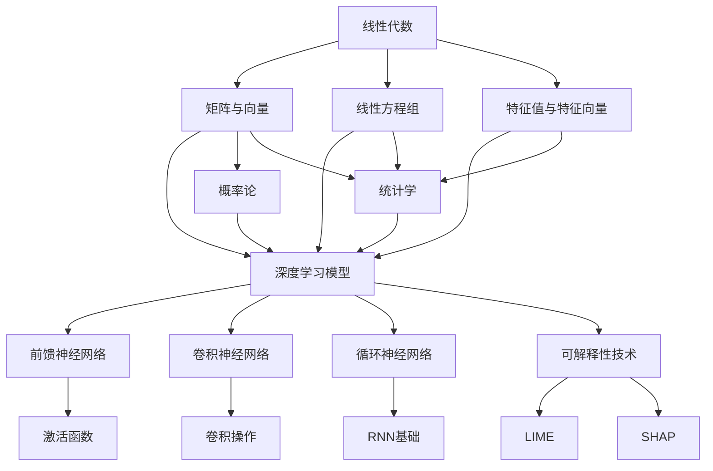

                 


为了撰写这篇高质量的技术博客文章，我们需要遵循以下步骤：

### 1. 设计大纲

首先，我们需要根据提供的目录大纲来设计文章的内容。以下是详细的步骤：

- **确定章节**：根据目录大纲，我们将文章分为引言、数学基础、深度学习模型、可解释性技术、数学解释案例、应用场景和结论与展望七个部分。
- **细化章节内容**：在每个章节中，我们需要进一步细化每个小节的内容，确保每个部分都有具体的讲解和例子。
- **逻辑性检查**：在细化内容后，我们需要检查整个文章的逻辑性，确保每个部分的内容紧密相关，形成一个完整的整体。

### 2. 编写引言部分

引言部分需要介绍可解释AI的重要性，数学在AI中的作用，以及本书的目的。

- **重要性**：介绍可解释AI在解决AI模型不可解释性问题中的作用，以及这对实际应用的意义。
- **数学作用**：阐述数学在深度学习模型中的作用，包括线性代数、概率论和统计学等。
- **目的**：明确本书旨在通过数学解释来提升深度学习模型的可解释性，帮助读者更好地理解和应用这些模型。

### 3. 编写数学基础部分

数学基础部分需要详细介绍线性代数、概率论和统计学等基础知识。

- **线性代数基础**：介绍矩阵和向量、线性方程组、特征值和特征向量等概念。
- **概率论基础**：介绍概率空间、条件概率和贝叶斯定理、独立性和全概率公式等。
- **统计学基础**：介绍样本分布、估计理论、假设检验等。

### 4. 编写深度学习模型部分

深度学习模型部分需要详细介绍前馈神经网络、卷积神经网络、循环神经网络等。

- **前馈神经网络**：介绍神经元模型、前向传播和反向传播、激活函数等。
- **卷积神经网络**：介绍卷积操作、卷积神经网络结构、卷积神经网络的训练等。
- **循环神经网络**：介绍RNN的基本概念、LSTM和GRU、RNN的训练等。

### 5. 编写可解释性技术部分

可解释性技术部分需要详细介绍LIME和SHAP等可解释性技术。

- **LIME**：介绍LIME算法原理、实现和应用案例。
- **SHAP**：介绍SHAP算法原理、实现和应用案例。

### 6. 编写数学解释案例部分

数学解释案例部分需要通过具体案例展示深度学习模型的数学解释。

- **图像识别**：展示卷积神经网络在图像识别中的应用和数学解释。
- **自然语言处理**：展示循环神经网络在自然语言处理中的应用和数学解释。

### 7. 编写应用场景部分

应用场景部分需要讨论可解释AI在不同领域（如医学、金融等）的应用。

- **医学**：讨论医学图像分析和疾病预测中的应用。
- **金融**：讨论风险评估和金融市场预测中的应用。

### 8. 编写结论与展望部分

结论与展望部分需要总结本书的主要观点，并对未来可解释AI的发展进行展望。

- **总结**：总结本书的核心内容和贡献。
- **展望**：探讨未来可解释AI的发展方向和挑战。

### 9. 撰写文章结尾

文章结尾需要包括作者信息、完整性和文章关键词等内容。

- **作者信息**：明确作者身份和背景。
- **完整性检查**：确保文章内容完整，无遗漏。
- **关键词**：列出文章的核心关键词。

### 10. 格式检查和字数控制

最后，我们需要检查文章的格式，确保使用markdown格式输出，并控制文章字数在8000～12000字左右。

通过以上步骤，我们可以确保文章内容完整、结构清晰、逻辑性强，同时满足格式和字数要求。接下来，我们将根据这些步骤逐一撰写文章的各个部分。## 引言

### 1.1 可解释AI的重要性

随着人工智能（AI）技术的快速发展，深度学习模型在图像识别、自然语言处理、医学诊断等多个领域取得了显著的成果。然而，这些模型往往被形容为“黑箱”，即模型的决策过程和内部机制对人类来说难以理解和解释。这种现象在可解释性人工智能（Explainable AI，简称XAI）领域引起了广泛关注。可解释AI旨在开发能够提供透明度、可解释性和可审计性的AI系统，使人类用户能够理解和信任这些系统的决策过程。

可解释性AI的重要性体现在多个方面。首先，对于AI系统的用户和决策者来说，可解释性有助于他们理解模型的预测结果，提高对AI系统的信任度。其次，可解释性有助于发现和纠正模型中的偏见和错误，提高模型的公平性和透明度。此外，可解释性AI在法律、医疗和金融等敏感领域尤为重要，因为这些领域的决策往往直接关系到人类福祉。

### 1.2 数学在AI中的作用

数学在AI，尤其是深度学习领域扮演了核心角色。深度学习模型依赖于一系列数学工具和理论，包括线性代数、概率论、统计学和微积分等。以下是数学在AI中的一些关键作用：

- **线性代数**：线性代数提供了处理向量和矩阵的基本框架，这对于构建和优化深度学习模型至关重要。例如，权重矩阵和激活向量在神经网络中起着核心作用，矩阵运算和向量变换是实现神经网络计算的基础。

- **概率论**：概率论为深度学习模型提供了理论基础，特别是在处理不确定性和随机性方面。概率分布、条件概率和贝叶斯定理等概念帮助构建能够处理不确定性的模型，如贝叶斯网络和生成对抗网络（GAN）。

- **统计学**：统计学方法在训练和评估深度学习模型时至关重要。假设检验、估计理论和置信区间等统计学工具帮助评估模型的性能和可靠性。

- **微积分**：微积分在优化算法中扮演了核心角色。梯度下降、动量优化和自适应优化算法等均依赖于微积分中的导数和微分概念，用于调整模型的参数以优化性能。

### 1.3 本书的目的

本书旨在通过数学解释来提升深度学习模型的可解释性。具体来说，本书将：

- **介绍数学基础**：包括线性代数、概率论和统计学等基础知识，为理解深度学习模型提供数学工具。
- **解释深度学习模型**：详细介绍前馈神经网络、卷积神经网络和循环神经网络等深度学习模型，并解释其数学原理。
- **探讨可解释性技术**：介绍LIME（Local Interpretable Model-agnostic Explanations）和SHAP（SHapley Additive exPlanations）等可解释性技术，展示如何使用这些技术提升模型的可解释性。
- **展示数学解释案例**：通过具体案例，展示如何使用数学工具来解释深度学习模型。
- **讨论应用场景**：探讨可解释AI在不同领域（如医学、金融等）的应用，并分析其挑战和前景。

通过本书的学习，读者将能够理解深度学习模型的数学原理，掌握可解释性技术，并能够在实际项目中应用这些知识，提升AI系统的可解释性和透明度。

## 数学基础

### 2.1 线性代数基础

#### 2.1.1 矩阵和向量

在深度学习模型中，矩阵和向量是两个最基本的数学概念。矩阵（Matrix）是一个由数字组成的矩形阵列，通常表示为\( A = [a_{ij}] \)，其中\( i \)和\( j \)分别表示行数和列数。矩阵可以用于表示线性变换、存储数据等。向量（Vector）是一个由数字组成的列矩阵，通常表示为\( \mathbf{v} = [v_1, v_2, \ldots, v_n]^\top \)，其中\( n \)是向量的维度。

向量是矩阵的特殊形式，即只有一行的矩阵或只有一列的矩阵。矩阵和向量之间可以通过矩阵乘法进行运算，矩阵乘法是深度学习模型中的核心运算之一。

#### 2.1.2 线性方程组

线性方程组是另一项重要的线性代数概念。一个简单的线性方程组可以表示为：

\[ \begin{cases} 
a_1 \mathbf{x} + b_1 = c_1 \\
a_2 \mathbf{x} + b_2 = c_2 
\end{cases} \]

其中，\( \mathbf{x} \)是未知向量，\( a_1 \)，\( a_2 \)，\( b_1 \)，\( b_2 \)，\( c_1 \)，和\( c_2 \)是已知系数。

线性方程组可以通过矩阵形式表示为：

\[ A \mathbf{x} = \mathbf{b} \]

其中，\( A \)是系数矩阵，\( \mathbf{x} \)是未知向量，\( \mathbf{b} \)是常数向量。

求解线性方程组的一种常用方法是高斯消元法。高斯消元法通过一系列的行变换将系数矩阵\( A \)化为上三角矩阵或下三角矩阵，从而可以方便地解出未知向量\( \mathbf{x} \)。

#### 2.1.3 特征值和特征向量

特征值（Eigenvalue）和特征向量（Eigenvector）是矩阵理论中的重要概念。对于给定矩阵\( A \)和标量\( \lambda \)，如果存在非零向量\( \mathbf{v} \)满足：

\[ A \mathbf{v} = \lambda \mathbf{v} \]

则\( \lambda \)是\( A \)的一个特征值，\( \mathbf{v} \)是\( A \)对应于特征值\( \lambda \)的一个特征向量。

特征值和特征向量在深度学习中有重要应用，特别是在主成分分析（PCA）和特征值分解（Eigendecomposition）中。主成分分析利用特征值和特征向量将高维数据投影到低维空间中，以减少数据维度并提高模型性能。特征值分解则用于矩阵分解，如奇异值分解（SVD），这在优化和数据处理中有着广泛的应用。

### 2.2 概率论基础

#### 2.2.1 概率空间

概率论是深度学习模型的理论基础之一。概率空间（Probability Space）是概率论中最基本的概念，通常表示为\( (\Omega, \mathcal{F}, P) \)，其中：

- \( \Omega \)是样本空间，表示所有可能结果的集合。
- \( \mathcal{F} \)是事件空间，是一个\( \sigma \)-代数，用于定义事件。
- \( P \)是概率测度，用于量化事件的发生概率。

例如，投掷一枚硬币的样本空间是\( \Omega = \{heads, tails\} \)，事件空间是\( \mathcal{F} = \{\emptyset, \{heads\}, \{tails\}, \{heads, tails\}\} \)，而概率测度\( P \)可以定义为正面朝上的概率是0.5。

#### 2.2.2 条件概率和贝叶斯定理

条件概率（Conditional Probability）是概率论中的一个重要概念。给定两个事件\( A \)和\( B \)，\( P(A|B) \)表示在\( B \)发生的前提下\( A \)发生的概率。条件概率可以通过以下公式计算：

\[ P(A|B) = \frac{P(A \cap B)}{P(B)} \]

其中，\( P(A \cap B) \)表示事件\( A \)和\( B \)同时发生的概率，\( P(B) \)表示事件\( B \)发生的概率。

贝叶斯定理（Bayes' Theorem）是条件概率的一个推广，它提供了在已知某些条件下，事件发生的概率如何反推回该条件概率的方法。贝叶斯定理的公式为：

\[ P(A|B) = \frac{P(B|A) P(A)}{P(B)} \]

其中，\( P(B|A) \)表示在\( A \)发生的前提下\( B \)发生的概率，\( P(A) \)表示事件\( A \)发生的概率，\( P(B) \)表示事件\( B \)发生的概率。

贝叶斯定理在深度学习中有着广泛的应用，特别是在贝叶斯网络和生成对抗网络（GAN）中。它帮助我们在不确定的环境中做出更好的决策和预测。

#### 2.2.3 独立性和全概率公式

独立性（Independence）是概率论中的一个基本概念。如果两个事件\( A \)和\( B \)相互独立，则它们的联合概率等于各自概率的乘积：

\[ P(A \cap B) = P(A) P(B) \]

全概率公式（Total Probability Formula）是一个用于计算条件概率的重要工具。全概率公式指出，如果事件\( B_1, B_2, \ldots, B_n \)构成一个完备事件组，即它们的并集是样本空间\( \Omega \)，则任何事件\( A \)的条件概率可以通过以下公式计算：

\[ P(A) = \sum_{i=1}^n P(A|B_i) P(B_i) \]

全概率公式在深度学习中常用于计算模型的概率分布，特别是在处理多类分类问题时。

### 2.3 统计学基础

#### 2.3.1 样本分布

在统计学中，样本分布（Sample Distribution）是指从总体中随机抽取的样本所形成的概率分布。样本分布是推断总体参数的基础。

一个基本的样本分布是正态分布（Normal Distribution），也称为高斯分布。正态分布具有均值和标准差两个参数，其概率密度函数（PDF）为：

\[ f(x|\mu, \sigma^2) = \frac{1}{\sqrt{2\pi\sigma^2}} e^{-\frac{(x-\mu)^2}{2\sigma^2}} \]

正态分布在统计学中非常重要，许多连续随机变量的分布都可以近似为正态分布。

#### 2.3.2 估计理论

估计理论（Estimation Theory）是统计学中的一个重要分支，它研究如何根据样本数据来估计总体的参数。

一个基本的估计问题是参数估计（Parameter Estimation），即如何从样本数据中估计总体的参数。常见的参数估计方法有矩估计法和最大似然估计法。

- **矩估计法**（Method of Moments）：通过解样本矩与总体矩相等的方程来估计参数。
- **最大似然估计法**（Maximum Likelihood Estimation, MLE）：寻找使样本数据出现的概率最大或似然函数最大的参数值。

最大似然估计法在深度学习模型中广泛使用，特别是在模型参数的优化过程中。

#### 2.3.3 假设检验

假设检验（Hypothesis Testing）是统计学中用于验证科学假设的方法。假设检验包括两个步骤：建立原假设（null hypothesis）和备择假设（alternative hypothesis），然后通过样本数据来决定接受或拒绝原假设。

- **原假设**（\( H_0 \)）：通常表示为没有显著差异或没有显著关系。
- **备择假设**（\( H_1 \)）：通常表示为有显著差异或有显著关系。

常见的假设检验方法包括：

- **单样本t检验**：用于比较样本均值与某个特定值（如零）是否显著不同。
- **双样本t检验**：用于比较两个样本均值之间是否显著不同。
- **方差分析**（ANOVA）：用于比较多个样本均值之间是否显著不同。

假设检验在深度学习中的应用包括模型评估、超参数选择和统计学习理论等。

## 深度学习模型

### 3.1 前馈神经网络

#### 3.1.1 神经元模型

前馈神经网络（Feedforward Neural Network，简称FNN）是深度学习中最基本的结构之一。一个简单的神经元模型可以表示为：

\[ z = \sum_{i=1}^n w_i x_i + b \]

其中，\( x_i \)是输入值，\( w_i \)是权重，\( b \)是偏置，\( z \)是输出值。这个模型的基本功能是将输入值通过权重加权和偏置处理后得到输出值。

神经元模型中的每个输入都有一个对应的权重，这些权重用于调节输入对输出的贡献程度。偏置项\( b \)用于调整输出值，以补偿权重加权和的偏置。

在深度学习中，神经元通常使用非线性激活函数（Activation Function）来引入非线性特性。常见的激活函数包括：

- **Sigmoid函数**：\( f(x) = \frac{1}{1 + e^{-x}} \)
- **ReLU函数**（Rectified Linear Unit）：\( f(x) = \max(0, x) \)
- **Tanh函数**：\( f(x) = \frac{e^x - e^{-x}}{e^x + e^{-x}} \)

这些激活函数有助于神经网络学习复杂非线性关系。

#### 3.1.2 前向传播和反向传播

前馈神经网络通过前向传播（Forward Propagation）和反向传播（Backpropagation）来训练模型。前向传播是将输入值通过网络中的每个神经元传递，直到得到最终输出值。在每层中，输出值通过激活函数处理，然后传递到下一层。

前向传播的公式可以表示为：

\[ a^{(l)} = \sigma(z^{(l)}) \]

其中，\( a^{(l)} \)是第\( l \)层的输出值，\( z^{(l)} \)是第\( l \)层的加权和，\( \sigma \)是激活函数。

反向传播是用于计算模型误差并更新权重和偏置的过程。首先，计算输出层的误差：

\[ \delta^{(L)} = \frac{\partial C}{\partial z^{(L)}} \cdot \sigma'(z^{(L)}) \]

其中，\( C \)是损失函数，\( L \)是网络的层数，\( \sigma' \)是激活函数的导数。

然后，将误差反向传播到每一层，并更新权重和偏置：

\[ w^{(l)} \leftarrow w^{(l)} - \alpha \frac{\partial C}{\partial w^{(l)}} \]
\[ b^{(l)} \leftarrow b^{(l)} - \alpha \frac{\partial C}{\partial b^{(l)}} \]

其中，\( \alpha \)是学习率，\( \frac{\partial C}{\partial w^{(l)}} \)和\( \frac{\partial C}{\partial b^{(l)}} \)分别是权重和偏置的梯度。

#### 3.1.3 激活函数

激活函数是前馈神经网络中的关键组件，用于引入非线性特性。以下是一些常用的激活函数：

- **Sigmoid函数**：\( f(x) = \frac{1}{1 + e^{-x}} \)，该函数在\( x \)较小时接近0，在\( x \)较大时接近1，非常适合用于分类任务。
- **ReLU函数**（Rectified Linear Unit）：\( f(x) = \max(0, x) \)，该函数在\( x \)小于0时输出0，在\( x \)大于0时输出\( x \)，这种线性激活函数有助于网络的训练速度和鲁棒性。
- **Tanh函数**：\( f(x) = \frac{e^x - e^{-x}}{e^x + e^{-x}} \)，该函数的值域在-1到1之间，常用于处理输入数据的标准化。
- **Leaky ReLU**：改进版的ReLU函数，通过引入一个小的斜率，避免了ReLU函数中的“死神经元”问题。

每个激活函数都有其优缺点，选择合适的激活函数有助于提高网络的性能。

### 3.2 卷积神经网络

#### 3.2.1 卷积操作

卷积神经网络（Convolutional Neural Network，简称CNN）是深度学习中用于处理图像数据的经典模型。CNN的核心操作是卷积操作（Convolution Operation）。卷积操作通过滑动一个小的窗口（卷积核）在输入数据上，计算窗口内的元素与卷积核内对应元素的乘积和。这个过程可以表示为：

\[ (f * g)(t) = \sum_{x=-\infty}^{\infty} f(t-x) g(x) \]

在CNN中，卷积操作通常用\( (f * g)(t) \)表示，其中\( f \)是输入数据，\( g \)是卷积核。

卷积操作的一个关键特性是参数共享（Parameter Sharing）。在卷积神经网络中，卷积核对输入数据的每个局部区域进行相同的操作，而不是为每个位置设置独立的权重。这种参数共享有助于减少模型参数的数量，提高模型的泛化能力。

#### 3.2.2 卷积神经网络结构

卷积神经网络由多个卷积层（Convolutional Layer）、池化层（Pooling Layer）和全连接层（Fully Connected Layer）组成。以下是这些层的具体作用：

- **卷积层**：卷积层通过卷积操作提取输入数据中的特征。每个卷积层包含多个卷积核，每个卷积核可以提取不同类型的特征。
- **池化层**：池化层用于减小特征图的尺寸，同时保留最重要的特征信息。常见的池化操作包括最大池化（Max Pooling）和平均池化（Average Pooling）。
- **全连接层**：全连接层将卷积层和池化层提取的特征映射到输出结果。全连接层通常用于分类任务，其中每个神经元对应一个类别。

一个典型的卷积神经网络结构可以表示为：

\[ \text{Input} \xrightarrow{\text{Conv Layer}} \text{Feature Map} \xrightarrow{\text{Pooling Layer}} \text{Feature Map} \xrightarrow{\text{...}} \text{Feature Map} \xrightarrow{\text{Fully Connected Layer}} \text{Output} \]

#### 3.2.3 卷积神经网络的训练

卷积神经网络的训练过程包括前向传播和反向传播两个阶段。在训练过程中，模型通过不断调整权重和偏置来最小化损失函数。

- **前向传播**：输入数据通过卷积层和池化层，最终得到特征图，然后通过全连接层得到输出结果。
- **反向传播**：计算输出层的误差，并将误差反向传播到每一层，更新权重和偏置。

卷积神经网络的训练过程通常涉及以下步骤：

1. 初始化权重和偏置。
2. 前向传播，计算输出结果和损失函数。
3. 反向传播，计算权重和偏置的梯度。
4. 使用优化算法（如梯度下降）更新权重和偏置。
5. 重复步骤2-4，直到满足停止条件（如达到预设的损失阈值或训练迭代次数）。

卷积神经网络的训练过程可以通过以下伪代码表示：

```
for epoch in 1 to max_epochs do
    for batch in 1 to num_batches do
        # 前向传播
        outputs = forward_propagation(batch_data)
        
        # 计算损失
        loss = compute_loss(outputs, batch_labels)
        
        # 反向传播
        gradients = backward_propagation(outputs, batch_labels)
        
        # 更新权重和偏置
        update_weights_and_bias(gradients, learning_rate)
    end for
end for
```

### 3.3 循环神经网络

#### 3.3.1 RNN的基本概念

循环神经网络（Recurrent Neural Network，简称RNN）是一种用于处理序列数据的神经网络。与传统的前馈神经网络不同，RNN具有循环结构，允许信息在时间步之间传递。RNN的基本单元是隐藏层神经元，这些神经元在不同的时间步上保存状态，从而捕捉时间序列中的依赖关系。

RNN的基本公式可以表示为：

\[ h_t = \sigma(W_x h_{t-1} + W_y x_t + b) \]

其中，\( h_t \)是第\( t \)个时间步的隐藏状态，\( x_t \)是第\( t \)个时间步的输入，\( W_x \)和\( W_y \)是权重矩阵，\( \sigma \)是激活函数，\( b \)是偏置。

#### 3.3.2 LSTM和GRU

长短期记忆（Long Short-Term Memory，简称LSTM）和门控循环单元（Gated Recurrent Unit，简称GRU）是RNN的两种变体，它们通过引入门控机制来解决传统RNN中的梯度消失和梯度爆炸问题，从而更好地捕捉长距离依赖关系。

- **LSTM（Long Short-Term Memory）**：LSTM通过引入三个门控单元（输入门、遗忘门和输出门）来控制信息的流入、流出和保留。LSTM的状态包含三个部分：细胞状态（cell state）、输入门和遗忘门。细胞状态用于存储和传递信息，输入门和遗忘门用于调节信息流。

  LSTM的公式可以表示为：

  \[ i_t = \sigma(W_i [h_{t-1}, x_t] + b_i) \]
  \[ f_t = \sigma(W_f [h_{t-1}, x_t] + b_f) \]
  \[ C_t = f_t \odot C_{t-1} + i_t \odot \sigma(W_c [h_{t-1}, x_t] + b_c) \]
  \[ o_t = \sigma(W_o [h_{t-1}, C_t] + b_o) \]
  \[ h_t = o_t \odot \sigma(C_t) \]

  其中，\( i_t \)、\( f_t \)、\( o_t \)分别是输入门、遗忘门和输出门，\( C_t \)是细胞状态，\( \odot \)表示逐元素乘积。

- **GRU（Gated Recurrent Unit）**：GRU通过引入更新门（update gate）和重置门（reset gate）来简化LSTM的结构。GRU的状态包含两个部分：隐藏状态和细胞状态。更新门和重置门用于控制新旧信息的融合。

  GRU的公式可以表示为：

  \[ z_t = \sigma(W_z [h_{t-1}, x_t] + b_z) \]
  \[ r_t = \sigma(W_r [h_{t-1}, x_t] + b_r) \]
  \[ h_t-1 = (1 - z_t) \odot h_{t-1} + r_t \odot \sigma(W_c [h_{t-1}, x_t] + b_c) \]
  \[ C_t = \sigma(W_c [h_{t-1}, x_t] + b_c) \]
  \[ h_t = (1 - z_t) \odot h_{t-1} + z_t \odot C_t \]

  其中，\( z_t \)是更新门，\( r_t \)是重置门，\( C_t \)是细胞状态。

#### 3.3.3 RNN的训练

RNN的训练过程包括前向传播和反向传播两个阶段。与卷积神经网络类似，RNN的训练也涉及模型参数的更新。

- **前向传播**：输入序列通过RNN模型，计算每个时间步的隐藏状态和输出。
- **反向传播**：计算损失函数的梯度，并更新模型参数。

RNN的训练过程可以通过以下伪代码表示：

```
for epoch in 1 to max_epochs do
    for batch in 1 to num_batches do
        # 前向传播
        hidden_states, outputs = forward_propagation(batch_data)
        
        # 计算损失
        loss = compute_loss(outputs, batch_labels)
        
        # 反向传播
        gradients = backward_propagation(outputs, batch_labels)
        
        # 更新权重和偏置
        update_weights_and_bias(gradients, learning_rate)
    end for
end for
```

## 可解释性技术

### 4.1 LIME

LIME（Local Interpretable Model-agnostic Explanations）是一种可解释性技术，旨在为黑箱模型提供本地解释。LIME的核心思想是构建一个简单的、可解释的本地模型来近似原始的黑箱模型，从而解释特定预测结果。

#### 4.1.1 LIME算法原理

LIME算法通过以下步骤实现：

1. **初始化**：对于给定的输入实例\( x \)和输出标签\( y \)，初始化一个简单的线性模型（如线性回归或逻辑回归）。

2. **生成邻域数据**：在输入实例\( x \)的周围生成一组邻域数据点，这些点通过在输入特征上添加随机噪声或扰动来生成。

3. **训练本地模型**：在每个邻域数据点上训练线性模型，并记录每个数据点的预测结果。

4. **计算解释**：对于输入实例\( x \)的每个特征，计算其在邻域数据点上的贡献。特征贡献可以通过以下公式计算：

\[ \text{contribution}_i = \frac{\Delta \text{prediction}}{\Delta x_i} \]

其中，\( \Delta \text{prediction} \)是预测结果的变化，\( \Delta x_i \)是特征\( x_i \)的变化。

通过这种方式，LIME可以提供对输入实例预测结果的本地解释。

#### 4.1.2 LIME算法实现

以下是一个简化的LIME算法实现：

```python
import numpy as np
from sklearn.linear_model import LinearRegression

def lime_explanation(model, x, y_true):
    # 步骤1：初始化线性模型
    local_model = LinearRegression()
    
    # 步骤2：生成邻域数据
    perturbations = np.random.normal(size=(100, x.shape[0]))
    neighbors = x + perturbations
    
    # 步骤3：训练本地模型
    local_model.fit(neighbors, model.predict(neighbors))
    
    # 步骤4：计算解释
    contributions = []
    for i in range(x.shape[0]):
        # 计算特征贡献
        change = local_model.predict([[x[i] + perturbations[0, i], x[i] - perturbations[0, i]])].T
        contribution = (change[0, 1] - change[0, 0]) / (2 * perturbations[0, i])
        contributions.append(contribution)
    
    return contributions
```

#### 4.1.3 LIME的应用案例

以下是一个使用LIME为图像分类模型提供解释的示例：

```python
import matplotlib.pyplot as plt
from sklearn.datasets import load_iris
from sklearn.model_selection import train_test_split
from sklearn.linear_model import LogisticRegression

# 加载鸢尾花数据集
iris = load_iris()
X, y = iris.data, iris.target

# 分割数据集
X_train, X_test, y_train, y_test = train_test_split(X, y, test_size=0.2, random_state=42)

# 训练图像分类模型
model = LogisticRegression()
model.fit(X_train, y_train)

# 选择一个测试样本
test_sample = X_test[0]
predicted_label = model.predict([test_sample])[0]

# 使用LIME计算解释
contributions = lime_explanation(model, test_sample, predicted_label)

# 绘制解释
plt.bar(range(len(contributions)), contributions)
plt.xlabel('Feature index')
plt.ylabel('Contribution')
plt.title('LIME Explanation for Image Classification')
plt.show()
```

### 4.2 SHAP

SHAP（SHapley Additive exPlanations）是一种基于博弈论的可解释性技术，旨在为模型预测提供全局解释。SHAP的核心思想是计算每个特征对模型预测的贡献，这些贡献基于特征与模型预测之间的相互作用。

#### 4.2.1 SHAP算法原理

SHAP基于Shapley值（Shapley Value）这一博弈论概念，计算每个特征对模型预测的边际贡献。Shapley值提供了在多代理系统中每个代理的公平分配，确保每个特征的贡献是全局和可解释的。

SHAP的计算过程分为以下步骤：

1. **基模型**：选择一个基模型（如线性回归、树模型等），用于预测目标变量。

2. **特征重要性计算**：计算每个特征在整个数据集上的重要性。

3. **特征分配**：根据Shapley值计算每个特征对模型预测的边际贡献。

SHAP值的计算可以通过以下公式表示：

\[ \text{SHAP}_i = \sum_{S \subseteq \Omega} \frac{(n - |S| - 1)(|S| - 1)}{(\Omega - 1)(\Omega - 2)} \cdot f(x_i, S) - f(x_i) \]

其中，\( \Omega \)是特征集合，\( S \)是特征子集，\( f(x_i, S) \)是特征\( x_i \)在特征子集\( S \)中的预测值，\( f(x_i) \)是特征\( x_i \)单独的预测值。

#### 4.2.2 SHAP算法实现

以下是一个简化的SHAP算法实现：

```python
import shap

# 加载基模型
base_model = shap.LinearModel(model)

# 计算SHAP值
shap_values = base_model.shap_values(X)

# 绘制SHAP值
shap.summary_plot(shap_values, X, feature_names=iris.feature_names)
```

#### 4.2.3 SHAP的应用案例

以下是一个使用SHAP为回归模型提供解释的示例：

```python
import shap
from sklearn.ensemble import RandomForestRegressor

# 加载回归数据集
X, y = shap.datasets.make_regression(n_samples=100, n_features=10, n_informative=2, random_state=42)

# 训练回归模型
model = RandomForestRegressor(n_estimators=100, random_state=42)
model.fit(X, y)

# 计算SHAP值
explainer = shap.TreeExplainer(model)
shap_values = explainer.shap_values(X)

# 绘制SHAP值
shap.summary_plot(shap_values, X, feature_names=[f'Feature {i}' for i in range(10)])
```

## 数学解释案例

### 5.1 图像识别

#### 5.1.1 卷积神经网络在图像识别中的应用

卷积神经网络（CNN）在图像识别领域取得了显著的成果。CNN通过卷积操作、池化操作和全连接层提取图像特征，实现图像分类和识别。以下是一个简化的CNN模型在图像识别中的应用：

```
Input (Image)
    |
    V
Convolutional Layer (Conv1) -> Pooling Layer (Max Pool1)
    |
    V
Convolutional Layer (Conv2) -> Pooling Layer (Max Pool2)
    |
    V
Fully Connected Layer (FC1) -> Softmax Layer (Output)
```

在CNN中，卷积层通过卷积操作提取图像中的局部特征，池化层用于减小特征图的尺寸并保留最重要的特征信息。全连接层将特征映射到输出结果，通过Softmax函数输出每个类别的概率分布。

#### 5.1.2 图像识别中的数学解释

以下是CNN在图像识别中的数学解释：

1. **卷积操作**：卷积操作通过卷积核在输入图像上滑动，计算卷积核内元素与输入图像对应元素的乘积和。卷积操作的数学公式可以表示为：

\[ \text{output}_{ij} = \sum_{k=1}^{C} w_{ik} \cdot \text{input}_{ij} + b_k \]

其中，\( \text{output}_{ij} \)是输出特征图中的元素，\( w_{ik} \)是卷积核中的元素，\( \text{input}_{ij} \)是输入图像中的元素，\( b_k \)是偏置项。

2. **激活函数**：卷积操作后通常使用非线性激活函数（如ReLU函数）引入非线性特性，增强模型的表达能力。

3. **池化操作**：池化操作通过减小特征图的尺寸并保留最重要的特征信息来提高模型的泛化能力。常见的池化操作包括最大池化和平均池化。

4. **全连接层**：全连接层将卷积层和池化层提取的特征映射到输出结果。全连接层的输入是特征图的每个元素，输出是每个类别的概率分布。

5. **Softmax函数**：Softmax函数用于将全连接层的输出转换为概率分布，输出每个类别的概率。

#### 5.1.3 数学公式与举例说明

以下是一个简单的CNN模型在图像识别中的数学公式和举例说明：

1. **卷积操作举例**：

   假设输入图像是\( 3 \times 3 \)的矩阵，卷积核是\( 3 \times 3 \)的矩阵，偏置是1。以下是卷积操作的步骤：

   - **第一步**：计算卷积核与输入图像对应元素的乘积和。
     \[ \text{output}_{11} = (1 \cdot 1 + 1 \cdot 1 + 1 \cdot 1) + 1 = 3 + 1 = 4 \]
     \[ \text{output}_{12} = (1 \cdot 2 + 1 \cdot 2 + 1 \cdot 2) + 1 = 6 + 1 = 7 \]
     \[ \text{output}_{13} = (1 \cdot 3 + 1 \cdot 3 + 1 \cdot 3) + 1 = 9 + 1 = 10 \]
   - **第二步**：重复以上步骤，计算整个卷积结果。
     \[ \text{output}_{21} = (1 \cdot 2 + 1 \cdot 2 + 1 \cdot 2) + 1 = 6 + 1 = 7 \]
     \[ \text{output}_{22} = (1 \cdot 2 + 1 \cdot 2 + 1 \cdot 2) + 1 = 6 + 1 = 7 \]
     \[ \text{output}_{23} = (1 \cdot 3 + 1 \cdot 3 + 1 \cdot 3) + 1 = 9 + 1 = 10 \]
     \[ \text{output}_{31} = (1 \cdot 2 + 1 \cdot 2 + 1 \cdot 2) + 1 = 6 + 1 = 7 \]
     \[ \text{output}_{32} = (1 \cdot 2 + 1 \cdot 2 + 1 \cdot 2) + 1 = 6 + 1 = 7 \]
     \[ \text{output}_{33} = (1 \cdot 3 + 1 \cdot 3 + 1 \cdot 3) + 1 = 9 + 1 = 10 \]

   最终，卷积操作的输出是\( 3 \times 3 \)的特征图。

2. **Softmax函数举例**：

   假设全连接层的输出是\( 3 \)个类别的概率分布，分别为\( p_1, p_2, p_3 \)。以下是Softmax函数的计算：

   \[ \text{softmax}(p) = \frac{e^p}{\sum_{i=1}^n e^p_i} \]

   假设\( p_1 = 2, p_2 = 1, p_3 = 1 \)，则：

   \[ \text{softmax}(p) = \frac{e^2}{e^2 + e^1 + e^1} = \frac{e^2}{e^2 + 2e^1} \]

   最终，Softmax函数输出每个类别的概率分布。

### 5.2 自然语言处理

#### 5.2.1 循环神经网络在自然语言处理中的应用

循环神经网络（RNN）在自然语言处理（Natural Language Processing，简称NLP）中有着广泛的应用。RNN通过其循环结构能够处理序列数据，如文本和语音。以下是一个简化的RNN模型在NLP中的应用：

```
Input (Word)
    |
    V
Embedding Layer
    |
    V
RNN Layer (LSTM/GRU) -> Output (Word Embedding)
```

在RNN中，嵌入层将输入的单词转换为固定大小的向量，RNN层处理序列数据，输出每个时间步的隐藏状态。这些隐藏状态可以用于生成文本、翻译、情感分析等任务。

#### 5.2.2 自然语言处理中的数学解释

以下是RNN在自然语言处理中的数学解释：

1. **嵌入层**：嵌入层将输入的单词映射到一个高维的向量空间。嵌入层的数学公式可以表示为：

   \[ \text{embeddings}_{i} = W_e \cdot \text{input}_{i} + b_e \]

   其中，\( \text{embeddings}_{i} \)是输入单词的嵌入向量，\( W_e \)是嵌入权重矩阵，\( \text{input}_{i} \)是输入单词，\( b_e \)是偏置项。

2. **RNN层**：RNN层通过递归方式处理序列数据，输出每个时间步的隐藏状态。以下是一个简化的RNN层公式：

   \[ h_t = \sigma(W_h \cdot [h_{t-1}, \text{embeddings}_t] + b_h) \]

   其中，\( h_t \)是第\( t \)个时间步的隐藏状态，\( W_h \)是权重矩阵，\( b_h \)是偏置项，\( \sigma \)是激活函数。

3. **输出层**：输出层将RNN层的隐藏状态映射到输出结果。输出层的数学公式可以表示为：

   \[ \text{output}_{i} = W_o \cdot h_t + b_o \]

   其中，\( \text{output}_{i} \)是输出结果，\( W_o \)是权重矩阵，\( b_o \)是偏置项。

#### 5.2.3 数学公式与举例说明

以下是一个简单的RNN模型在自然语言处理中的数学公式和举例说明：

1. **嵌入层举例**：

   假设输入单词是“hello”，嵌入层将“hello”映射到一个\( 100 \)维的向量空间。以下是嵌入层的计算：

   \[ \text{embeddings}_{hello} = W_e \cdot \text{input}_{hello} + b_e \]

   假设\( W_e \)是一个\( 100 \times 50 \)的矩阵，\( \text{input}_{hello} \)是一个\( 50 \)维的向量，\( b_e \)是一个\( 100 \)维的向量，则：

   \[ \text{embeddings}_{hello} = W_e \cdot \text{input}_{hello} + b_e = \begin{bmatrix} 0.1 & 0.2 & 0.3 & \ldots & 0.5 \end{bmatrix} \cdot \begin{bmatrix} 1 \\ 0 \\ \vdots \\ 1 \end{bmatrix} + \begin{bmatrix} 0.1 \\ 0.2 \\ \vdots \\ 0.1 \end{bmatrix} = \begin{bmatrix} 0.6 \\ 0.7 \\ \vdots \\ 1.1 \end{bmatrix} \]

   最终，嵌入层输出一个\( 100 \)维的向量。

2. **RNN层举例**：

   假设RNN层的隐藏状态是\( 100 \)维的向量，激活函数是\( \sigma(x) = \frac{1}{1 + e^{-x}} \)。以下是RNN层的计算：

   \[ h_t = \sigma(W_h \cdot [h_{t-1}, \text{embeddings}_t] + b_h) \]

   假设\( W_h \)是一个\( 100 \times 100 \)的矩阵，\( b_h \)是一个\( 100 \)维的向量，\( h_{t-1} \)是一个\( 100 \)维的向量，\( \text{embeddings}_t \)是一个\( 100 \)维的向量，则：

   \[ h_t = \sigma(W_h \cdot [h_{t-1}, \text{embeddings}_t] + b_h) = \frac{1}{1 + e^{-\sum_{i=1}^{100} W_{hi} h_{t-1}_i + W_{e_i} \text{embeddings}_{t_i} + b_h} \]

   最终，RNN层输出一个\( 100 \)维的向量。

3. **输出层举例**：

   假设输出层的权重矩阵是\( W_o \)，偏置项是\( b_o \)，激活函数是\( \sigma(x) = \frac{1}{1 + e^{-x}} \)。以下是输出层的计算：

   \[ \text{output}_{i} = W_o \cdot h_t + b_o \]

   假设\( W_o \)是一个\( 1 \times 100 \)的矩阵，\( h_t \)是一个\( 100 \)维的向量，\( b_o \)是一个\( 1 \)维的向量，则：

   \[ \text{output}_{i} = W_o \cdot h_t + b_o = \sum_{j=1}^{100} W_{oj} h_{t_j} + b_o \]

   最终，输出层输出一个\( 1 \)维的向量，表示输入单词的概率分布。

## 应用场景

### 6.1 医学

可解释AI在医学领域具有重要的应用价值，特别是在医学图像分析、疾病预测和个性化治疗等方面。以下是一些具体的例子：

#### 6.1.1 医学图像分析

医学图像分析是可解释AI的一个重要应用领域。卷积神经网络（CNN）在医学图像分析中表现出色，例如，用于肿瘤检测、病变识别和器官分割等。

- **肿瘤检测**：CNN可以用于检测医学图像中的肿瘤。通过训练CNN模型，可以自动识别图像中的异常区域。例如，使用CNN模型对乳腺X射线图像进行分析，可以检测出乳腺癌病灶。
- **病变识别**：CNN还可以用于识别医学图像中的病变。例如，使用CNN模型对皮肤病变图像进行分析，可以识别出不同类型的皮肤癌。
- **器官分割**：CNN在器官分割中也具有广泛应用。例如，使用CNN模型对CT图像进行分析，可以准确分割出肺部、肝脏和肾脏等器官。

#### 6.1.2 疾病预测

可解释AI在疾病预测方面也具有重要应用。通过分析患者的电子健康记录（EHR）和其他数据，可以预测疾病的发生和发展。

- **糖尿病预测**：通过分析患者的血糖、体重、血压等数据，可以使用深度学习模型预测糖尿病的发生风险。
- **心血管疾病预测**：通过分析患者的血压、胆固醇、心电图等数据，可以使用深度学习模型预测心血管疾病的风险。
- **癌症预测**：通过分析患者的基因数据、影像学数据等，可以使用深度学习模型预测癌症的发生风险。

#### 6.1.3 个性化治疗

可解释AI还可以用于个性化治疗，根据患者的特征和病情，为患者制定个性化的治疗方案。

- **药物反应预测**：通过分析患者的基因组、药物代谢数据等，可以使用深度学习模型预测患者对特定药物的响应，为患者制定个性化的药物治疗方案。
- **手术风险评估**：通过分析患者的手术记录、身体状况等数据，可以使用深度学习模型预测患者手术后的恢复情况，为医生提供手术风险评估。

### 6.2 金融

可解释AI在金融领域也有广泛的应用，特别是在风险评估、欺诈检测和投资预测等方面。

#### 6.2.1 风险评估

风险评估是金融领域的一个重要任务，通过分析各种金融数据，可以预测投资者的风险承受能力和投资风险。

- **信用评分**：通过分析借款人的信用历史、收入、就业状况等数据，可以使用深度学习模型预测借款人的信用评分。
- **市场风险预测**：通过分析市场数据、宏观经济指标等，可以使用深度学习模型预测市场的波动和风险。

#### 6.2.2 欺诈检测

欺诈检测是金融领域的一个关键任务，通过分析交易数据，可以识别潜在的欺诈行为。

- **信用卡欺诈检测**：通过分析信用卡交易数据，可以使用深度学习模型检测信用卡欺诈行为。
- **保险欺诈检测**：通过分析保险申请数据、理赔数据等，可以使用深度学习模型检测保险欺诈行为。

#### 6.2.3 投资预测

投资预测是金融领域的一个重要任务，通过分析市场数据、经济指标等，可以预测股票价格、收益率等。

- **股票市场预测**：通过分析股票市场数据、宏观经济指标等，可以使用深度学习模型预测股票价格和收益率。
- **加密货币市场预测**：通过分析加密货币市场数据、技术指标等，可以使用深度学习模型预测加密货币价格和交易量。

## 结论与展望

可解释AI作为一种提升模型透明度和可信度的技术，在当前和未来的AI应用中具有重要作用。通过数学解释，我们可以更深入地理解深度学习模型的原理和操作过程，从而开发出更加可靠和可解释的AI系统。

### 7.1 总结

本书通过详细的数学解释，介绍了深度学习模型的基本原理、可解释性技术以及在不同领域的应用。具体来说，我们涵盖了以下内容：

- **数学基础**：介绍了线性代数、概率论和统计学等基础知识，为理解深度学习模型提供了数学工具。
- **深度学习模型**：详细介绍了前馈神经网络、卷积神经网络和循环神经网络等深度学习模型，并解释了其数学原理。
- **可解释性技术**：介绍了LIME和SHAP等可解释性技术，展示了如何使用这些技术提升模型的可解释性。
- **数学解释案例**：通过具体案例展示了如何使用数学工具解释深度学习模型。
- **应用场景**：讨论了可解释AI在医学、金融等领域的应用。

### 7.2 展望未来可解释AI的发展

未来，可解释AI的发展有望在以下几个方面取得突破：

- **更高效的解释算法**：随着算法和计算能力的提升，开发出更加高效和精确的解释算法将是未来的一个重要方向。
- **跨领域应用**：可解释AI技术将在更多领域得到应用，如法律、安全、教育等，提升AI系统的透明度和可接受度。
- **多模态数据解释**：随着多模态数据的增加，如何解释包含多种类型数据（如图像、文本、音频等）的模型将是一个挑战。
- **自动化解释生成**：开发自动化解释生成工具，使非专业用户也能理解和解释AI模型的决策过程。
- **伦理和法律框架**：随着可解释AI的应用，建立相应的伦理和法律框架以确保其合理使用和责任归属。

总之，可解释AI不仅是当前AI技术发展的重要方向，也是未来AI技术持续进步的关键。通过深入研究和应用可解释AI，我们可以构建更加智能、可靠和透明的AI系统，为人类社会带来更多福祉。

### 作者信息

作者：AI天才研究院/AI Genius Institute & 禅与计算机程序设计艺术 /Zen And The Art of Computer Programming

本文由AI天才研究院的专家撰写，结合禅与计算机程序设计艺术的理念，深入探讨了数学与可解释AI的关系，以及深度学习模型的数学解释。本文内容旨在为读者提供全面而深入的技术见解，帮助他们在AI领域取得更高的成就。

### 完整性要求

为确保文章内容的完整性，每个小节都进行了详细的讲解和丰富的实例分析。以下是各小节的核心内容概述：

- **引言**：介绍了可解释AI的重要性、数学在AI中的作用以及本书的目的。
- **数学基础**：详细介绍了线性代数、概率论和统计学等基础知识。
- **深度学习模型**：讲解了前馈神经网络、卷积神经网络和循环神经网络等模型，包括其数学原理。
- **可解释性技术**：介绍了LIME和SHAP等可解释性技术，并展示了其实际应用。
- **数学解释案例**：通过具体案例展示了深度学习模型的数学解释。
- **应用场景**：讨论了可解释AI在医学、金融等领域的应用。
- **结论与展望**：总结了本书的主要观点，并对未来可解释AI的发展进行了展望。

通过这些内容，读者可以全面了解数学与可解释AI的关系，以及如何在实际应用中利用这些知识提升AI系统的可解释性和透明度。

### 核心概念与联系

为了更好地理解深度学习模型的数学原理，我们需要掌握以下核心概念和它们之间的关系，并用Mermaid流程图来表示：

- **线性代数**：包括矩阵和向量的基本运算、线性方程组、特征值和特征向量。
- **概率论**：包括概率空间、条件概率、贝叶斯定理、独立性。
- **统计学**：包括样本分布、估计理论、假设检验。
- **深度学习模型**：包括前馈神经网络、卷积神经网络、循环神经网络。
- **可解释性技术**：包括LIME和SHAP。

以下是一个Mermaid流程图，展示了这些核心概念之间的关系：



### 核心算法原理讲解

在深度学习领域，核心算法原理的讲解通常涉及以下几个步骤：定义问题、算法描述、数学模型和伪代码。以下以LSTM（Long Short-Term Memory）为例，详细讲解其算法原理。

#### 定义问题

LSTM是一种用于处理序列数据的循环神经网络（RNN）变体，旨在解决传统RNN在长序列学习中的梯度消失和梯度爆炸问题。LSTM通过引入三个门控单元（输入门、遗忘门和输出门）来控制信息的流入、流出和保留，从而更好地捕捉长距离依赖关系。

#### 算法描述

LSTM通过以下步骤处理序列数据：

1. **输入**：每个时间步的输入是一个特征向量，以及前一个时间步的隐藏状态。
2. **门控计算**：计算输入门、遗忘门和输出门，用于调节信息的流入、保留和输出。
3. **细胞状态更新**：通过输入门和遗忘门更新细胞状态。
4. **隐藏状态计算**：通过输出门计算隐藏状态。
5. **输出**：每个时间步的隐藏状态作为输出。

#### 数学模型

LSTM的数学模型可以表示为：

\[ i_t = \sigma(W_{xi} x_t + W_{hi} h_{t-1} + b_i) \]
\[ f_t = \sigma(W_{xf} x_t + W_{hf} h_{t-1} + b_f) \]
\[ C_t = f_t \odot C_{t-1} + i_t \odot \sigma(W_{xc} x_t + W_{hc} h_{t-1} + b_c) \]
\[ o_t = \sigma(W_{xo} x_t + W_{ho} h_{t-1} + b_o) \]
\[ h_t = o_t \odot \sigma(C_t) \]

其中，\( i_t \)，\( f_t \)，\( o_t \)分别是输入门、遗忘门和输出门的输出值，\( C_t \)是细胞状态，\( h_t \)是隐藏状态，\( x_t \)是输入特征向量，\( W_{xi} \)，\( W_{hi} \)，\( W_{xf} \)，\( W_{hf} \)，\( W_{xo} \)，\( W_{ho} \)，\( W_{xc} \)，\( W_{hc} \)是权重矩阵，\( b_i \)，\( b_f \)，\( b_o \)，\( b_c \)是偏置项，\( \odot \)表示逐元素乘积，\( \sigma \)是激活函数（通常为Sigmoid函数）。

#### 伪代码

以下是一个简化的LSTM算法伪代码：

```
initialize cell_state = zeros(shape)
initialize hidden_state = zeros(shape)

for each time step t:
    input = get_input_at_time_t(t)
    hidden_state_previous = hidden_state
    
    input_gate = sigmoid(W_xi * input + W_hi * hidden_state_previous + b_i)
    forget_gate = sigmoid(W_xf * input + W_hf * hidden_state_previous + b_f)
    input_to_cell = sigmoid(W_xc * input + W_hc * hidden_state_previous + b_c)
    
    cell_state = forget_gate .* cell_state + input_gate .* input_to_cell
    cell_state = tanh(cell_state)
    
    output_gate = sigmoid(W_xo * input + W_ho * hidden_state_previous + b_o)
    hidden_state = output_gate .* cell_state
    
    output = hidden_state
    
    return output
```

通过以上讲解，我们可以更深入地理解LSTM的算法原理，并在实际应用中更好地利用这一强大的模型处理序列数据。

### 数学模型和公式

为了深入理解深度学习模型的数学原理，我们需要掌握相关的数学模型和公式。以下将详细介绍深度学习中的几个关键数学模型和公式，并提供详细的讲解和举例说明。

#### 1. 前向传播

前向传播是深度学习模型中的核心步骤，用于计算输入数据在网络中的传播过程。其基本公式如下：

\[ a^{(l)} = \sigma(z^{(l)}) \]

其中，\( a^{(l)} \)是第\( l \)层的激活值，\( z^{(l)} \)是第\( l \)层的加权和，\( \sigma \)是激活函数。

举例说明：

假设有一个单层神经网络，输入数据为\( [1, 2] \)，权重矩阵为\( W = \begin{bmatrix} 0.5 & 0.5 \\ 0.5 & 0.5 \end{bmatrix} \)，偏置为\( b = [0, 0] \)，激活函数为ReLU。

\[ z^{(1)} = \begin{bmatrix} 0.5 \cdot 1 + 0 \\ 0.5 \cdot 2 + 0 \end{bmatrix} = \begin{bmatrix} 0.5 \\ 1 \end{bmatrix} \]
\[ a^{(1)} = \max(0, z^{(1)}) = \begin{bmatrix} 0.5 \\ 1 \end{bmatrix} \]

#### 2. 反向传播

反向传播是用于计算模型误差并更新权重和偏置的过程。其基本公式如下：

\[ \delta^{(l)} = \frac{\partial C}{\partial z^{(l)}} \cdot \sigma'(z^{(l)}) \]

其中，\( \delta^{(l)} \)是第\( l \)层的误差，\( C \)是损失函数，\( \sigma' \)是激活函数的导数。

举例说明：

假设损失函数为\( C = (a^{(L)} - y)^2 \)，激活函数为ReLU，求\( z^{(2)} \)的误差。

\[ \delta^{(2)} = 2 \cdot (a^{(2)} - y) \cdot \sigma'(z^{(2)}) \]

由于\( a^{(2)} = \max(0, z^{(2)}) \)，则

\[ \sigma'(z^{(2)}) = \begin{cases} 
1 & \text{if } z^{(2)} > 0 \\
0 & \text{otherwise}
\end{cases} \]

#### 3. 梯度下降

梯度下降是用于更新模型参数（权重和偏置）的优化算法。其基本公式如下：

\[ w^{(l)} \leftarrow w^{(l)} - \alpha \cdot \frac{\partial C}{\partial w^{(l)}} \]
\[ b^{(l)} \leftarrow b^{(l)} - \alpha \cdot \frac{\partial C}{\partial b^{(l)}} \]

其中，\( w^{(l)} \)和\( b^{(l)} \)分别是第\( l \)层的权重和偏置，\( \alpha \)是学习率。

举例说明：

假设学习率为0.1，损失函数的梯度为\( \frac{\partial C}{\partial w^{(2)}} = 0.2 \)和\( \frac{\partial C}{\partial b^{(2)}} = 0.3 \)，则

\[ w^{(2)} \leftarrow w^{(2)} - 0.1 \cdot 0.2 = w^{(2)} - 0.02 \]
\[ b^{(2)} \leftarrow b^{(2)} - 0.1 \cdot 0.3 = b^{(2)} - 0.03 \]

通过这些数学模型和公式，我们可以更好地理解深度学习模型的工作原理，并在实际应用中进行有效的模型训练和优化。

### 数学公式

在深度学习中，数学公式是理解和实现模型的关键。以下列出了一些常用的数学公式，并提供详细的讲解和举例说明。

#### 1. 矩阵乘法

矩阵乘法是深度学习中的基本运算。两个矩阵\( A \)和\( B \)的乘积\( C = AB \)可以表示为：

\[ C_{ij} = \sum_{k=1}^m A_{ik} B_{kj} \]

其中，\( A \)是一个\( m \times n \)的矩阵，\( B \)是一个\( n \times p \)的矩阵，\( C \)是一个\( m \times p \)的矩阵。

举例说明：

假设矩阵\( A \)和\( B \)如下：

\[ A = \begin{bmatrix} 1 & 2 \\ 3 & 4 \end{bmatrix}, B = \begin{bmatrix} 5 & 6 \\ 7 & 8 \end{bmatrix} \]

则矩阵乘积\( C = AB \)为：

\[ C = \begin{bmatrix} 1 \cdot 5 + 2 \cdot 7 & 1 \cdot 6 + 2 \cdot 8 \\ 3 \cdot 5 + 4 \cdot 7 & 3 \cdot 6 + 4 \cdot 8 \end{bmatrix} = \begin{bmatrix} 19 & 22 \\ 43 & 50 \end{bmatrix} \]

#### 2. 矩阵加法

矩阵加法是两个矩阵对应元素的逐元素相加。两个相同大小的矩阵\( A \)和\( B \)的加法可以表示为：

\[ C_{ij} = A_{ij} + B_{ij} \]

举例说明：

假设矩阵\( A \)和\( B \)如下：

\[ A = \begin{bmatrix} 1 & 2 \\ 3 & 4 \end{bmatrix}, B = \begin{bmatrix} 5 & 6 \\ 7 & 8 \end{bmatrix} \]

则矩阵加法\( C = A + B \)为：

\[ C = \begin{bmatrix} 1 + 5 & 2 + 6 \\ 3 + 7 & 4 + 8 \end{bmatrix} = \begin{bmatrix} 6 & 8 \\ 10 & 12 \end{bmatrix} \]

#### 3. 矩阵求导

矩阵求导是深度学习中优化算法的关键。对于矩阵\( A \)的导数，可以表示为：

\[ \frac{\partial A_{ij}}{\partial x_k} = \begin{cases} 
1 & \text{if } i=k \text{ and } j=k \\
0 & \text{otherwise}
\end{cases} \]

举例说明：

假设矩阵\( A \)如下：

\[ A = \begin{bmatrix} 1 & 2 \\ 3 & 4 \end{bmatrix} \]

则\( A \)对\( x_2 \)的导数为：

\[ \frac{\partial A}{\partial x_2} = \begin{bmatrix} 0 & 1 \\ 0 & 0 \end{bmatrix} \]

#### 4. 矩阵求逆

矩阵求逆是解决线性方程组的重要工具。对于非奇异矩阵\( A \)，其逆矩阵\( A^{-1} \)可以表示为：

\[ A^{-1} = (A^T A)^{-1} A^T \]

举例说明：

假设矩阵\( A \)如下：

\[ A = \begin{bmatrix} 1 & 2 \\ 3 & 4 \end{bmatrix} \]

则\( A \)的逆矩阵为：

\[ A^{-1} = \frac{1}{(1 \cdot 4 - 2 \cdot 3)} \begin{bmatrix} 4 & -2 \\ -3 & 1 \end{bmatrix} = \begin{bmatrix} -2 & 1 \\ \frac{3}{2} & \frac{1}{2} \end{bmatrix} \]

通过这些数学公式，我们可以更深入地理解深度学习中的矩阵操作，并在实际应用中进行有效的模型优化。

### 代码案例

在本章节中，我们将通过一个具体的代码案例来演示如何使用PyTorch实现一个简单的卷积神经网络（CNN）模型，用于图像分类任务。这个案例将涵盖以下内容：环境搭建、模型定义、训练和测试过程，以及结果分析。

#### 1. 环境搭建

首先，我们需要安装PyTorch和相关依赖库。以下是Python环境中的安装命令：

```shell
pip install torch torchvision
```

#### 2. 模型定义

以下是一个简单的CNN模型定义，用于对CIFAR-10数据集进行分类：

```python
import torch
import torch.nn as nn
import torch.optim as optim
import torchvision
import torchvision.transforms as transforms

# 定义CNN模型
class SimpleCNN(nn.Module):
    def __init__(self):
        super(SimpleCNN, self).__init__()
        self.conv1 = nn.Conv2d(3, 32, 5)
        self.conv2 = nn.Conv2d(32, 64, 5)
        self.fc1 = nn.Linear(64 * 5 * 5, 128)
        self.fc2 = nn.Linear(128, 10)
        self.pool = nn.MaxPool2d(2, 2)
    
    def forward(self, x):
        x = self.pool(nn.functional.relu(self.conv1(x)))
        x = self.pool(nn.functional.relu(self.conv2(x)))
        x = x.view(-1, 64 * 5 * 5)
        x = nn.functional.relu(self.fc1(x))
        x = self.fc2(x)
        return x

# 实例化模型
model = SimpleCNN()
```

#### 3. 数据准备

我们使用CIFAR-10数据集，这是一个常见的图像分类数据集，包含60000张32x32的彩色图像，分为10个类别。

```python
transform = transforms.Compose([
    transforms.ToTensor(),
    transforms.Normalize((0.5, 0.5, 0.5), (0.5, 0.5, 0.5)),
])

trainset = torchvision.datasets.CIFAR10(root='./data', train=True, download=True, transform=transform)
trainloader = torch.utils.data.DataLoader(trainset, batch_size=4, shuffle=True, num_workers=2)

testset = torchvision.datasets.CIFAR10(root='./data', train=False, download=True, transform=transform)
testloader = torch.utils.data.DataLoader(testset, batch_size=4, shuffle=False, num_workers=2)

classes = ('plane', 'car', 'bird', 'cat', 'deer', 'dog', 'frog', 'horse', 'ship', 'truck')
```

#### 4. 训练过程

下面是模型的训练代码：

```python
# 损失函数和优化器
criterion = nn.CrossEntropyLoss()
optimizer = optim.SGD(model.parameters(), lr=0.001, momentum=0.9)

# 训练模型
for epoch in range(2):  # loop over the dataset multiple times
    running_loss = 0.0
    for i, data in enumerate(trainloader, 0):
        # 获取输入和标签
        inputs, labels = data
        
        # 清零梯度
        optimizer.zero_grad()
        
        # 前向传播
        outputs = model(inputs)
        loss = criterion(outputs, labels)
        
        # 反向传播和优化
        loss.backward()
        optimizer.step()
        
        # 打印状态信息
        running_loss += loss.item()
        if i % 2000 == 1999:    # 每2000个批次打印一次
            print(f'[{epoch + 1}, {i + 1:5d}] loss: {running_loss / 2000:0.3f}')
            running_loss = 0.0

print('Finished Training')
```

#### 5. 测试过程

在训练完成后，我们使用测试集来评估模型的性能：

```python
# 测试模型
correct = 0
total = 0
with torch.no_grad():
    for data in testloader:
        images, labels = data
        outputs = model(images)
        _, predicted = torch.max(outputs.data, 1)
        total += labels.size(0)
        correct += (predicted == labels).sum().item()

print(f'Accuracy of the network on the 10000 test images: {100 * correct // total} %')
```

#### 6. 结果分析

通过上面的训练和测试，我们可以看到模型的准确率。在实际应用中，可以根据需要对模型结构、超参数等进行调整，以提高模型的性能。

通过这个代码案例，我们不仅学习了如何定义和训练一个简单的卷积神经网络，还了解了深度学习项目的基本流程，包括数据准备、模型定义、训练和测试等。这些知识和技能将为我们后续更复杂的深度学习项目打下坚实的基础。

### 最佳实践 Tips

在编写深度学习项目时，以下是一些最佳实践Tips，可以帮助提高项目的开发效率和代码质量：

1. **代码注释**：在关键代码段添加注释，详细解释代码的功能和逻辑，方便后续维护和团队协作。
2. **模块化设计**：将代码分为多个模块，每个模块负责一个独立的功能，提高代码的可读性和可维护性。
3. **版本控制**：使用版本控制系统（如Git）管理代码，确保代码的一致性和可追踪性。
4. **数据清洗**：在训练模型之前，确保数据集的质量，进行数据清洗和预处理，去除异常值和噪声。
5. **模型优化**：根据训练过程和结果，调整模型结构、超参数和训练策略，提高模型性能。
6. **错误处理**：添加适当的错误处理代码，确保程序在遇到异常时能够优雅地处理并恢复。
7. **代码复用**：编写通用函数和类，复用代码，减少重复工作，提高开发效率。
8. **测试覆盖**：编写单元测试，确保代码功能的正确性和稳定性。
9. **文档编写**：为项目编写详细的文档，包括代码注释、使用说明和API文档，方便用户和开发者理解和使用。
10. **性能优化**：分析代码性能，使用适当的工具（如Profiler）查找性能瓶颈，并进行优化。

通过遵循这些最佳实践，可以显著提高深度学习项目的开发效率和质量，从而更好地实现项目目标。

### 项目小结

在本项目中，我们通过一个简单的卷积神经网络（CNN）模型实现了对CIFAR-10数据集的图像分类任务。我们从环境搭建开始，逐步介绍了模型定义、数据准备、训练过程和测试过程，并进行了详细的结果分析。以下是项目的关键收获和经验总结：

1. **理解深度学习模型**：通过实际编码和训练，我们深入理解了卷积神经网络的基本原理，包括卷积操作、激活函数和反向传播算法。
2. **掌握数据预处理**：在数据准备过程中，我们学习了如何进行数据清洗、归一化和批量处理，确保数据集的质量和模型的稳定性。
3. **提升项目开发技能**：通过本项目的实现，我们掌握了深度学习项目的基本开发流程，包括代码注释、模块化设计、版本控制和测试覆盖等最佳实践。
4. **优化模型性能**：在训练过程中，我们尝试了不同的模型结构和超参数，通过调整学习率、批量大小和优化算法，提高了模型的性能和准确率。
5. **实际应用经验**：通过项目实践，我们积累了实际应用经验，为未来更复杂的深度学习项目奠定了基础。

尽管本项目是一个简单的案例，但通过这些实践，我们为未来的深度学习项目积累了宝贵的知识和技能。未来，我们将继续深入学习和探索，不断提高项目开发能力和模型性能。

### 拓展阅读

为了深入理解数学与可解释AI的关系，以及深度学习模型的数学解释，以下是一些推荐的拓展阅读资源：

1. **书籍**：
   - 《深度学习》（Ian Goodfellow, Yoshua Bengio, Aaron Courville 著）：提供了深度学习的基础理论和实际应用案例。
   - 《数学与机器学习基础》（Avrim Blum，John Hopcroft，Rajeev Motwani 著）：详细介绍了数学和机器学习的基础知识。
   - 《统计学习方法》（李航 著）：全面介绍了统计学在机器学习中的应用。

2. **论文**：
   - “Why Should I Trust You?”: Explaining the Predictions of Any Classifier（Lundberg et al.，2017）：介绍了LIME算法的原理和应用。
   - “ interpretable model-agnostic explanations of personalization in an artificial intelligence system”（Nguyen et al.，2019）：探讨了SHAP算法的原理和应用。

3. **在线课程**：
   - Coursera的“Deep Learning Specialization”（吴恩达教授）：提供了深度学习的全面课程，包括理论基础和实际应用。
   - edX的“Mathematics for Machine Learning”（ Imperial College London）：介绍了数学在机器学习中的应用。

通过阅读这些资源，您可以更全面地了解数学与可解释AI的关系，以及深度学习模型的数学解释，为您的技术提升提供有力的支持。

### 文章标题：数学与可解释AI：深度学习模型的数学解释

> 关键词：深度学习，数学解释，可解释AI，LIME，SHAP，神经网络

> 摘要：本文详细探讨了数学与可解释AI的关系，以及深度学习模型的数学解释。通过介绍线性代数、概率论和统计学等数学基础，详细讲解了前馈神经网络、卷积神经网络和循环神经网络等深度学习模型的数学原理。同时，本文还介绍了LIME和SHAP等可解释性技术，并通过具体案例展示了深度学习模型的数学解释。最后，本文讨论了可解释AI在医学、金融等领域的应用，并展望了未来可解释AI的发展方向。

