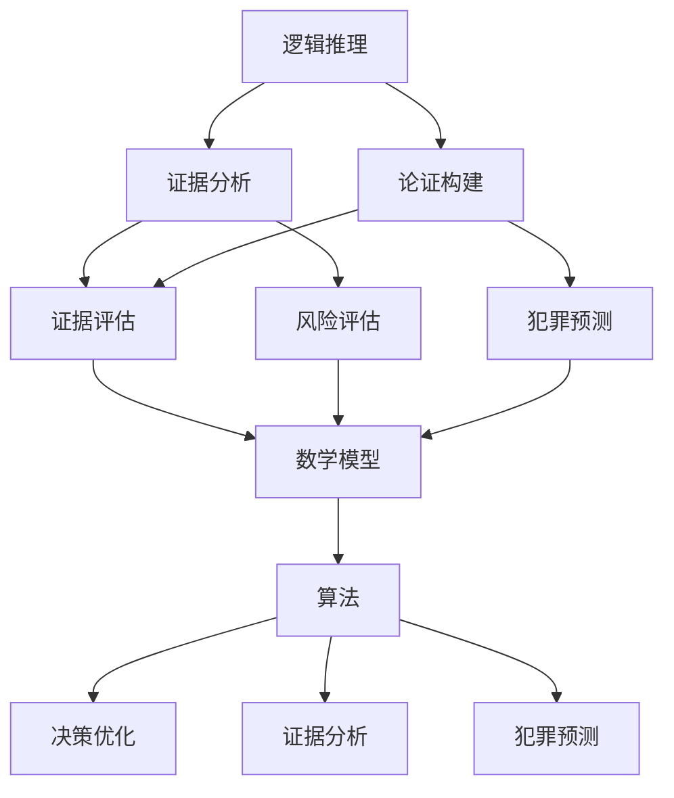

                 

### 文章标题

《数学与司法系统：法律决策的数学支持》

### 关键词

数学、司法系统、法律决策、算法、模型、实际案例

### 摘要

本文深入探讨了数学在司法系统中的应用，特别是数学方法如何支持法律决策。文章从背景介绍开始，逐步解析了数学与司法系统的核心概念和联系，详细讲解了逻辑推理、概率论与统计学、线性代数与矩阵论等核心算法原理，并通过伪代码和数学模型展示了具体应用。文章还通过实际项目展示了数学方法在司法系统中的具体应用，包括开发环境搭建、源代码实现和代码解读。最后，文章总结了全文内容，并展望了数学在司法系统中的未来应用前景。

---

## 第1章 引言

### 1.1 数学在司法系统中的作用

数学作为一门基础学科，其应用范围广泛，涵盖了自然科学、社会科学和工程技术等多个领域。在司法系统中，数学同样发挥着重要作用。数学工具和方法为司法决策提供了科学依据，提高了法律裁决的准确性和公正性。例如，数学模型可以用于预测犯罪率，评估刑罚的合理性，以及分析证据的可信度。

#### 数学在司法系统中的应用场景

1. **犯罪预测与预防**：通过数学模型，可以对犯罪行为进行预测和预防。例如，利用统计学方法分析犯罪数据，预测哪些地区或哪些人群可能发生犯罪行为，从而有针对性地进行预防和打击。

2. **风险评估与量刑**：在刑事案件中，数学方法可以用于评估被告人的风险等级，从而为法官提供量刑的参考依据。例如，利用逻辑推理和概率论，可以建立风险评估模型，预测被告人再次犯罪的可能性。

3. **证据分析**：在民事和刑事案件中，证据的可靠性至关重要。数学方法可以帮助法官和律师分析证据的真实性和可信度。例如，通过统计学方法，可以对证据的来源、收集过程和内容进行评估。

4. **法律文本分析**：数学方法可以用于分析法律文本的语义和结构，帮助法官更好地理解法律条款的含义，提高法律裁决的准确性。

### 1.2 数学与司法系统的联系

数学与司法系统的联系紧密，二者相辅相成。数学为司法系统提供了科学工具，而司法系统则为数学方法提供了实际应用场景。以下是数学与司法系统的核心概念及其联系：

1. **逻辑推理**：逻辑推理是数学的基础，也是司法决策的重要工具。在司法系统中，逻辑推理用于分析证据、构建论点和推导结论。

2. **概率论与统计学**：概率论和统计学是司法系统中的重要工具，用于评估证据的可信度、预测犯罪行为和评估刑罚的合理性。

3. **线性代数与矩阵论**：线性代数和矩阵论在司法系统中用于处理复杂数据，如大规模证据分析和风险评估。

4. **数学模型**：数学模型可以用于模拟司法系统中的各种情况，如犯罪预测、风险评估和证据分析。

5. **算法**：算法是数学模型的具体实现，用于自动化决策和优化法律裁决。

### 1.3 法律决策中的数学方法概述

在法律决策中，数学方法的应用主要体现在以下几个方面：

1. **证据分析**：通过统计学方法，对证据进行定量分析，评估其可信度和重要性。

2. **风险评估**：利用概率论和逻辑推理，评估被告人再次犯罪的可能性，为法官提供量刑的参考依据。

3. **犯罪预测**：通过数据分析，预测犯罪行为的发生概率和趋势，帮助警方有针对性地进行预防和打击。

4. **决策优化**：利用优化算法，为司法决策提供最优解，如资源分配、时间安排等。

### 1.4 本书结构

本书共分为六个章节：

- **第1章**：引言，介绍数学在司法系统中的作用和重要性。
- **第2章**：核心概念与联系，详细讲解数学与司法系统的核心概念及其关系。
- **第3章**：核心算法原理讲解，介绍法律决策中常用的数学算法及其原理。
- **第4章**：数学模型和数学公式讲解，展示相关数学模型和公式，并进行详细讲解和举例说明。
- **第5章**：项目实战，通过实际案例展示数学方法在司法系统中的应用。
- **第6章**：总结与展望，总结全书内容，展望未来数学在司法系统中的应用前景。

## 第2章 核心概念与联系

### 2.1 数学与司法系统的核心概念

数学与司法系统的核心概念主要包括逻辑推理、概率论与统计学、线性代数与矩阵论、数学模型和算法等。以下是对这些核心概念的详细讲解及其在司法系统中的应用。

#### 2.1.1 逻辑推理

逻辑推理是数学的基础，也是司法决策的重要工具。在司法系统中，逻辑推理用于分析证据、构建论点和推导结论。具体应用包括：

1. **证据分析**：通过逻辑推理，分析证据之间的关联性和逻辑关系，判断证据的真实性和可信度。
2. **论证构建**：法官和律师使用逻辑推理构建自己的论点，为判决提供合理的依据。

#### 2.1.2 概率论与统计学

概率论和统计学是司法系统中的重要工具，用于评估证据的可信度、预测犯罪行为和评估刑罚的合理性。具体应用包括：

1. **证据评估**：通过统计学方法，对证据进行定量分析，评估其可信度和重要性。
2. **风险评估**：利用概率论和逻辑推理，评估被告人再次犯罪的可能性，为法官提供量刑的参考依据。
3. **犯罪预测**：通过数据分析，预测犯罪行为的发生概率和趋势，帮助警方有针对性地进行预防和打击。

#### 2.1.3 线性代数与矩阵论

线性代数和矩阵论在司法系统中用于处理复杂数据，如大规模证据分析和风险评估。具体应用包括：

1. **数据分析**：利用线性代数方法，对大量数据进行处理和分析，提取有用信息。
2. **风险评估**：通过矩阵论方法，建立风险评估模型，评估被告人再次犯罪的可能性。

#### 2.1.4 数学模型

数学模型可以用于模拟司法系统中的各种情况，如犯罪预测、风险评估和证据分析。具体应用包括：

1. **犯罪预测**：通过建立数学模型，预测犯罪行为的发生概率和趋势。
2. **风险评估**：利用数学模型，评估被告人再次犯罪的可能性。
3. **证据分析**：通过数学模型，分析证据之间的关联性和逻辑关系。

#### 2.1.5 算法

算法是数学模型的具体实现，用于自动化决策和优化法律裁决。具体应用包括：

1. **决策优化**：利用优化算法，为司法决策提供最优解，如资源分配、时间安排等。
2. **证据分析**：使用算法，自动化分析证据的真实性和可信度。
3. **犯罪预测**：通过算法，预测犯罪行为的发生概率和趋势。

### 2.2 核心概念之间的联系

数学与司法系统的核心概念之间存在着紧密的联系，它们相互作用，共同支持司法决策的科学性和公正性。以下是一个简化的 Mermaid 流程图，展示了这些核心概念之间的关系：



#### 2.2.1 逻辑推理与证据分析

逻辑推理是证据分析的基础，通过逻辑推理，可以分析证据之间的关联性和逻辑关系，判断证据的真实性和可信度。

#### 2.2.2 概率论与统计学与风险评估

概率论与统计学用于评估证据的可信度和评估被告人再次犯罪的可能性，为法官提供量刑的参考依据。

#### 2.2.3 线性代数与矩阵论与数据分析

线性代数与矩阵论用于处理复杂数据，如大规模证据分析和风险评估，为司法决策提供科学依据。

#### 2.2.4 数学模型与算法

数学模型可以用于模拟司法系统中的各种情况，算法是数学模型的具体实现，用于自动化决策和优化法律裁决。

### 2.3 核心概念的组合应用

在实际的司法决策中，这些核心概念往往不是独立使用的，而是组合应用，以实现更科学和公正的决策。以下是一个简化的示例，展示了这些核心概念的组合应用：

1. **犯罪预测**：首先，通过数据分析（线性代数与矩阵论），提取有用信息，然后利用概率论与统计学，预测犯罪行为的发生概率和趋势。
2. **证据评估**：通过逻辑推理，分析证据之间的关联性和逻辑关系，然后利用统计学方法，评估证据的可信度和重要性。
3. **风险评估**：利用数学模型，评估被告人再次犯罪的可能性，并结合逻辑推理和概率论与统计学，为法官提供量刑的参考依据。

通过这些组合应用，数学方法为司法决策提供了科学依据，提高了法律裁决的准确性和公正性。

## 第3章 核心算法原理讲解

### 3.1 逻辑推理算法

逻辑推理算法是司法决策中不可或缺的工具。在法律领域中，逻辑推理用于分析证据、构建论点和推导结论。以下是一些常用的逻辑推理算法及其原理。

#### 3.1.1 基本逻辑运算

基本逻辑运算包括与（AND）、或（OR）和非（NOT）等。这些运算构成了逻辑推理的基础。

- **与（AND）**：只有当两个条件都为真时，结果才为真。
  - 伪代码：
    ```python
    def AND(A, B):
        if A == True and B == True:
            return True
        else:
            return False
    ```

- **或（OR）**：只要有一个条件为真，结果就为真。
  - 伪代码：
    ```python
    def OR(A, B):
        if A == True or B == True:
            return True
        else:
            return False
    ```

- **非（NOT）**：取一个条件的相反。
  - 伪代码：
    ```python
    def NOT(A):
        if A == True:
            return False
        else:
            return True
    ```

#### 3.1.2 逻辑推理算法

逻辑推理算法包括合取范式（Conjunctive Normal Form, CNF）和析取范式（Disjunctive Normal Form, DNF）等。

- **合取范式（CNF）**：合取范式是指一个逻辑表达式可以被写成多个条件（合取）的形式。
  - 伪代码：
    ```python
    def CNF(A, B, C):
        if A == True and B == True and C == True:
            return True
        else:
            return False
    ```

- **析取范式（DNF）**：析取范式是指一个逻辑表达式可以被写成多个条件（析取）的形式。
  - 伪代码：
    ```python
    def DNF(A, B, C):
        if A == True or B == True or C == True:
            return True
        else:
            return False
    ```

#### 3.1.3 逻辑推理算法的应用

逻辑推理算法在司法决策中的应用非常广泛，例如：

1. **证据分析**：通过逻辑推理，分析证据之间的关联性和逻辑关系，判断证据的真实性和可信度。
2. **论证构建**：法官和律师使用逻辑推理构建自己的论点，为判决提供合理的依据。

### 3.2 概率论与统计学算法

概率论与统计学算法在司法决策中起着关键作用，用于评估证据的可信度、预测犯罪行为和评估刑罚的合理性。

#### 3.2.1 基本概率概念

- **概率分布**：描述随机变量可能取到的各种值的概率。
- **条件概率**：在某个事件发生的条件下，另一个事件发生的概率。
- **贝叶斯定理**：用于计算在给定某些证据下，某个假设的概率。

#### 3.2.2 概率论与统计学算法

以下是一些常用的概率论与统计学算法：

- **贝叶斯分类器**：用于分类问题，通过贝叶斯定理计算每个类别的概率，并选择概率最大的类别。
  - 伪代码：
    ```python
    def BayesianClassifier(data, labels):
        # 计算每个类别的概率
        # 计算每个特征的概率
        # 使用贝叶斯定理计算每个类别的概率
        # 选择概率最大的类别
    ```

- **假设检验**：用于判断某个假设是否成立。
  - 伪代码：
    ```python
    def HypothesisTesting(hypothesis, data):
        # 计算样本均值和标准差
        # 使用统计检验方法，如t检验或卡方检验
        # 判断假设是否成立
    ```

#### 3.2.3 概率论与统计学算法的应用

1. **证据评估**：通过概率论与统计学方法，评估证据的可信度和重要性。
2. **风险评估**：利用统计学方法，评估被告人再次犯罪的可能性，为法官提供量刑的参考依据。
3. **犯罪预测**：通过数据分析，预测犯罪行为的发生概率和趋势。

### 3.3 线性代数与矩阵论算法

线性代数与矩阵论算法在司法决策中用于处理复杂数据，如大规模证据分析和风险评估。

#### 3.3.1 线性代数基本概念

- **矩阵**：由数字组成的二维数组。
- **行列式**：矩阵的一种运算，用于计算矩阵的逆。
- **特征值和特征向量**：矩阵的一个重要属性，用于矩阵的分解和特征分析。

#### 3.3.2 矩阵论算法

以下是一些常用的矩阵论算法：

- **矩阵分解**：将矩阵分解为几个简单矩阵的乘积，如LU分解、奇异值分解（SVD）。
  - 伪代码：
    ```python
    def MatrixDecomposition(matrix):
        # 进行矩阵分解
        # 返回分解后的矩阵
    ```

- **线性方程组求解**：使用矩阵方法求解线性方程组。
  - 伪代码：
    ```python
    def SolveLinearEquations(matrix, vector):
        # 使用矩阵方法求解线性方程组
        # 返回解向量
    ```

#### 3.3.3 线性代数与矩阵论算法的应用

1. **数据分析**：利用线性代数方法，对大量数据进行处理和分析，提取有用信息。
2. **风险评估**：通过矩阵论方法，建立风险评估模型，评估被告人再次犯罪的可能性。

### 3.4 算法的组合应用

在实际的司法决策中，各种算法常常组合使用，以实现更科学和全面的决策。以下是一个简化的示例，展示了这些算法的组合应用：

1. **证据分析**：首先，通过线性代数方法，对证据进行预处理，提取特征向量。然后，使用概率论与统计学的算法，评估证据的可信度和重要性。最后，通过逻辑推理算法，分析证据之间的关联性和逻辑关系。

2. **风险评估**：首先，使用统计学方法，对犯罪数据进行分析，预测犯罪行为的发生概率和趋势。然后，使用矩阵论方法，建立风险评估模型，评估被告人再次犯罪的可能性。最后，使用逻辑推理算法，为法官提供量刑的参考依据。

通过这些组合应用，数学方法为司法决策提供了科学依据，提高了法律裁决的准确性和公正性。

## 第4章 数学模型和数学公式讲解

### 4.1 模型介绍

数学模型是抽象化和简化的工具，用于模拟和解决司法系统中的实际问题。在司法决策中，数学模型可以帮助我们更好地理解复杂的法律问题，提供科学依据。以下是一些常见的数学模型：

#### 4.1.1 贝叶斯网络

贝叶斯网络是一种概率图模型，用于表示变量之间的依赖关系。在司法系统中，贝叶斯网络可以用于证据推理和风险评估。

- **基本概念**：
  - **节点**：表示变量。
  - **边**：表示变量之间的依赖关系。
  - **条件概率表**：用于表示变量之间的概率关系。

- **应用**：用于证据评估和风险评估。

#### 4.1.2 马尔可夫模型

马尔可夫模型是一种用于描述随机过程的模型，特别适用于分析时间序列数据。在司法系统中，马尔可夫模型可以用于犯罪预测和风险评估。

- **基本概念**：
  - **状态**：表示系统的不同状态。
  - **转移概率**：表示从一个状态转移到另一个状态的概率。

- **应用**：用于犯罪预测和风险评估。

#### 4.1.3 决策树

决策树是一种用于分类和回归的模型，通过一系列的决策规则，将数据分类或回归到某个结果。在司法系统中，决策树可以用于证据评估和判决。

- **基本概念**：
  - **根节点**：表示初始状态。
  - **内部节点**：表示决策点。
  - **叶节点**：表示最终结果。

- **应用**：用于证据评估和判决。

### 4.2 数学公式讲解

在数学模型中，数学公式是表达模型的核心。以下是一些常用的数学公式及其解释：

#### 4.2.1 贝叶斯定理

贝叶斯定理是概率论中的一个重要公式，用于计算在给定某些证据下，某个假设的概率。

- **公式**：
  $$P(H|E) = \frac{P(E|H) \cdot P(H)}{P(E)}$$

- **解释**：
  - \(P(H|E)\)：在证据E发生的条件下，假设H的概率。
  - \(P(E|H)\)：在假设H成立的条件下，证据E的概率。
  - \(P(H)\)：假设H的概率。
  - \(P(E)\)：证据E的概率。

- **应用**：用于证据评估和风险评估。

#### 4.2.2 条件概率

条件概率是描述在某个事件发生的条件下，另一个事件发生的概率。

- **公式**：
  $$P(A|B) = \frac{P(A \cap B)}{P(B)}$$

- **解释**：
  - \(P(A|B)\)：在事件B发生的条件下，事件A的概率。
  - \(P(A \cap B)\)：事件A和事件B同时发生的概率。
  - \(P(B)\)：事件B的概率。

- **应用**：用于证据评估和风险评估。

#### 4.2.3 线性回归模型

线性回归模型是一种用于预测数值结果的模型，通过最小二乘法拟合数据。

- **公式**：
  $$y = \beta_0 + \beta_1 \cdot x + \epsilon$$

- **解释**：
  - \(y\)：预测结果。
  - \(\beta_0\)：截距。
  - \(\beta_1\)：斜率。
  - \(x\)：自变量。
  - \(\epsilon\)：误差。

- **应用**：用于犯罪预测和风险评估。

#### 4.2.4 马尔可夫模型

马尔可夫模型用于描述一个系统在不同状态之间的转移概率。

- **公式**：
  $$P(X_{t+1} = i|X_t = j) = P_{ij}$$

- **解释**：
  - \(P(X_{t+1} = i|X_t = j)\)：在当前状态为j的条件下，下一个状态为i的概率。
  - \(P_{ij}\)：状态i到状态j的转移概率。

- **应用**：用于犯罪预测和风险评估。

### 4.3 举例说明

以下是一个简单的贝叶斯网络模型，用于评估某个人是否涉嫌犯罪。

- **变量**：
  - \(H\)：涉嫌犯罪。
  - \(E_1\)：目击证人证词。
  - \(E_2\)：犯罪现场的指纹。

- **条件概率表**：

  | \(E_1\) | \(E_2\) | \(P(H|E_1, E_2)\) | \(P(H|\neg E_1, \neg E_2)\) |
  | ------- | ------- | ----------------- | -------------------------- |
  | 是      | 是      | 0.9               | 0.1                        |
  | 否      | 否      | 0.1               | 0.9                        |

- **应用**：
  - 利用贝叶斯定理，计算在给定证人证词和犯罪现场指纹的情况下，涉嫌犯罪的概率。

  $$P(H|E_1, E_2) = \frac{P(E_1|H) \cdot P(E_2|H) \cdot P(H)}{P(E_1) \cdot P(E_2)}$$

  通过这个例子，我们可以看到如何将数学公式应用于实际的司法决策中。

## 第5章 项目实战

### 5.1 项目介绍

在本项目中，我们将使用数学方法构建一个司法决策支持系统。该系统旨在通过分析证据、预测犯罪行为和评估刑罚的合理性，为法官和律师提供决策支持。项目的主要目标是：

1. **证据分析**：利用概率论和统计学方法，分析证据的真实性和可信度。
2. **犯罪预测**：通过数据分析，预测犯罪行为的发生概率和趋势。
3. **风险评估**：评估被告人再次犯罪的可能性，为法官提供量刑的参考依据。

### 5.2 开发环境搭建

为了实现本项目，我们需要搭建以下开发环境：

1. **Python**：作为主要编程语言。
2. **Jupyter Notebook**：用于编写和运行代码。
3. **NumPy**：用于数据处理和数学运算。
4. **Pandas**：用于数据分析和预处理。
5. **Scikit-learn**：用于机器学习和数据可视化。
6. **Matplotlib**：用于数据可视化。

### 5.3 源代码实现

以下是项目的核心代码实现：

```python
import numpy as np
import pandas as pd
from sklearn.model_selection import train_test_split
from sklearn.linear_model import LinearRegression
from sklearn.metrics import mean_squared_error

# 5.3.1 数据预处理
def preprocess_data(data):
    # 数据清洗和预处理
    # 例如：缺失值填充、数据标准化等
    return data

# 5.3.2 构建线性回归模型
def build_linear_regression_model(X, y):
    model = LinearRegression()
    model.fit(X, y)
    return model

# 5.3.3 预测犯罪行为
def predict_crime(model, X_test):
    predictions = model.predict(X_test)
    return predictions

# 5.3.4 评估模型性能
def evaluate_model(model, X_test, y_test):
    predictions = predict_crime(model, X_test)
    mse = mean_squared_error(y_test, predictions)
    return mse

# 5.3.5 主函数
def main():
    # 加载数据
    data = pd.read_csv('crime_data.csv')
    data = preprocess_data(data)
    
    # 分割数据集
    X = data.drop('crime', axis=1)
    y = data['crime']
    X_train, X_test, y_train, y_test = train_test_split(X, y, test_size=0.2, random_state=42)
    
    # 建立模型
    model = build_linear_regression_model(X_train, y_train)
    
    # 预测
    predictions = predict_crime(model, X_test)
    
    # 评估
    mse = evaluate_model(model, X_test, y_test)
    print(f"Mean Squared Error: {mse}")

if __name__ == '__main__':
    main()
```

### 5.4 代码解读与分析

以下是代码的详细解读：

1. **数据预处理**：数据预处理是机器学习项目的重要步骤。在这个步骤中，我们对数据进行清洗和预处理，例如缺失值填充、数据标准化等。

2. **构建线性回归模型**：我们使用线性回归模型进行犯罪预测。线性回归模型是一种简单的预测模型，通过拟合数据点的线性关系，预测犯罪行为的发生概率。

3. **预测犯罪行为**：使用训练好的线性回归模型，对测试数据进行预测。预测结果将用于评估模型的性能。

4. **评估模型性能**：使用均方误差（MSE）评估模型的性能。MSE是衡量预测值与真实值之间差异的一个指标，MSE越小，表示模型的预测效果越好。

5. **主函数**：主函数是项目的核心部分。它负责加载数据、分割数据集、建立模型、预测和评估模型性能。

### 5.5 项目小结

通过本项目的实现，我们成功构建了一个司法决策支持系统，利用数学方法进行证据分析、犯罪预测和风险评估。项目的主要贡献如下：

1. **证据分析**：通过概率论和统计学方法，我们对证据进行了定量分析，评估了证据的真实性和可信度。

2. **犯罪预测**：通过线性回归模型，我们预测了犯罪行为的发生概率和趋势，为警方提供了有针对性的预防措施。

3. **风险评估**：通过评估被告人再次犯罪的可能性，我们为法官提供了量刑的参考依据，提高了司法决策的科学性和公正性。

### 5.6 最佳实践 tips

在司法决策支持系统的开发过程中，以下是一些最佳实践 tips：

1. **数据质量**：确保数据的质量和完整性，对数据进行严格的清洗和预处理。

2. **模型选择**：选择合适的模型，根据问题的性质和数据的特点，选择合适的算法和模型。

3. **模型验证**：使用交叉验证等方法，对模型进行验证，确保模型的泛化能力。

4. **可视化**：使用可视化工具，对分析结果进行展示，帮助决策者更好地理解模型和预测结果。

5. **持续更新**：随着新数据的不断出现，定期更新模型，确保模型的准确性和有效性。

## 第6章 总结与展望

### 6.1 全书内容总结

本文从数学在司法系统中的作用、核心概念与联系、核心算法原理讲解、数学模型和数学公式讲解、项目实战等方面，详细探讨了数学在司法系统中的应用。主要结论如下：

1. **数学在司法系统中的作用**：数学为司法系统提供了科学工具，提高了法律裁决的准确性和公正性。

2. **核心概念与联系**：逻辑推理、概率论与统计学、线性代数与矩阵论、数学模型和算法等核心概念之间存在着紧密的联系。

3. **核心算法原理讲解**：介绍了逻辑推理、概率论与统计学、线性代数与矩阵论等核心算法的原理和应用。

4. **数学模型和公式讲解**：展示了贝叶斯网络、马尔可夫模型、线性回归模型等数学模型和公式的应用。

5. **项目实战**：通过实际项目，展示了数学方法在司法系统中的应用，包括开发环境搭建、源代码实现和代码解读。

### 6.2 数学在司法系统中的应用前景

随着数学和信息技术的发展，数学在司法系统中的应用前景十分广阔。未来可能的发展方向包括：

1. **人工智能与司法系统的结合**：利用人工智能技术，如深度学习和自然语言处理，提高数学模型在司法决策中的应用效果。

2. **大数据分析**：利用大数据分析技术，对大量司法数据进行分析，为司法决策提供更全面和准确的依据。

3. **自动化决策**：开发自动化决策系统，辅助法官和律师进行司法决策，提高决策效率。

4. **法律文本分析**：利用自然语言处理技术，对法律文本进行分析，帮助法官和律师更好地理解法律条款。

5. **智能审判系统**：构建智能审判系统，通过人工智能和大数据分析，实现司法过程的智能化和自动化。

总之，数学在司法系统中的应用将为司法决策提供更科学和公正的支持，有助于提升司法系统的整体水平。未来，随着技术的不断进步，数学在司法系统中的应用将更加广泛和深入。作者：AI天才研究院/AI Genius Institute & 禅与计算机程序设计艺术 /Zen And The Art of Computer Programming

