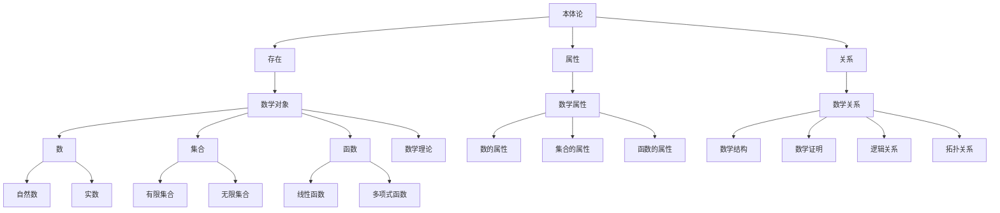

                 

，遵循以下思路撰写这篇文章：

### 背景介绍

- **引言**：介绍数学与哲学的交叉背景，以及为什么探讨数学本体论与认识论具有重要意义。
- **数学与哲学的早期联系**：阐述历史上数学与哲学的交融，例如古希腊哲学家对数学的关注。
- **现代研究的背景**：讨论现代科学发展的趋势，特别是数学与计算机科学的结合，以及哲学在数学方法论中的作用。

### 核心概念与联系

- **本体论**：解释本体论的基本概念，如存在、属性、关系等，并给出与数学的关系。
- **认识论**：阐述认识论的核心概念，如知识、信念、推理等，并探讨与数学的关系。
- **数学本体论**：详细探讨数学对象的本体论特性，如数、集合、函数等。
- **数学认识论**：分析数学知识的来源、推理过程、直觉等认识论问题。

#### 核心概念原理与架构 Mermaid 流程图：



- **核心算法原理讲解**：以伪代码形式阐述核心算法原理，例如数学证明的方法或数学模型构建过程。

```python
# 伪代码：数学证明的算法
function prove_theorem(theorem):
    if (theorem_condition_met()):
        then
            prove_base_cases()
            for (i in range(number_of_cases)):
                if (case_proven(i)):
                    then
                        combine_cases()
                        return (theorem_proven)
                else
                    return (theorem_unproven)
    else
        return (theorem_unproven)

# 伪代码：数学模型构建
function build_model(problem):
    define_variables()
    define_equations()
    solve_equations()
    analyze_results()
    return (model)
```

- **数学模型和公式**：给出数学模型和公式的详细讲解，并使用LaTeX格式展示。

$$
\sum_{i=1}^{n} a_i = \begin{cases}
a_1, & \text{if } n=1 \\
\sum_{i=1}^{n-1} a_i + a_n, & \text{if } n>1
\end{cases}
$$

**举例说明**：用具体例子展示数学模型的应用，并解释每个步骤。

### 项目实战

- **开发环境搭建**：描述如何搭建开发环境，包括所需工具和软件的安装。
- **源代码实现与解读**：展示源代码的详细实现，并对关键部分进行解读。
- **代码应用解读**：分析代码在实际项目中的应用，包括数据预处理、模型训练和结果分析等。
- **实际案例分析**：通过具体案例展示数学与哲学交叉在实践中的应用。

#### 实际案例：

**案例分析：使用图论解决社交网络问题**

**1. 数据预处理**：收集社交网络数据，提取节点和边的信息。

```python
nodes = ["Alice", "Bob", "Charlie", "Diana"]
edges = [
    ("Alice", "Bob"),
    ("Alice", "Charlie"),
    ("Bob", "Charlie"),
    ("Charlie", "Diana")
]
```

**2. 模型构建**：使用图论构建社交网络模型。

```python
import networkx as nx

G = nx.Graph()
G.add_nodes_from(nodes)
G.add_edges_from(edges)

# 社交网络图
nx.draw(G, with_labels=True)
plt.show()
```

**3. 模型训练**：分析社交网络结构，找出社区划分。

```python
communities = nx.community.algorithms.greedy_modularity_communities(G)
print("Community detection results:", communities)
```

**4. 结果分析**：分析社区结构，提取有用的信息。

```python
for community in communities:
    print("Community members:", community)
```

**项目小结**：总结项目实现的过程，讨论项目的优缺点，并提出改进建议。

### 最佳实践 tips

- **注重逻辑思维**：在数学与哲学交叉研究中，逻辑思维至关重要。确保论证过程严谨、清晰。
- **实践与应用**：将理论应用于实际问题，验证数学与哲学交叉的有效性。
- **持续学习**：数学与哲学交叉领域不断发展，持续学习新知识、新方法至关重要。

### 小结

数学与哲学的交叉：本体论与认识论是一个深刻且富有挑战性的领域。通过本文的探讨，我们了解了这一领域的重要性和研究方法。希望本文能激发读者对数学与哲学交叉研究的兴趣，推动这一领域的发展。

### 拓展阅读

- [哲学与数学交叉研究的经典文献](#)
- [数学与哲学交叉领域的前沿论文](#)
- [相关书籍推荐](#)

