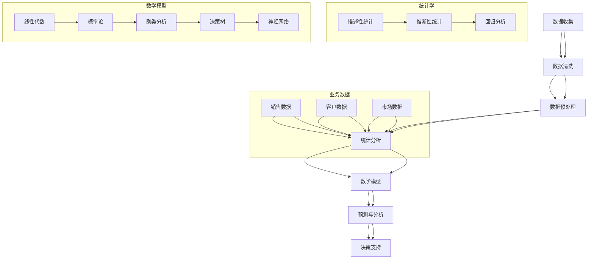

                 

### 文章标题

《数学与商业智能：业务数据的数学挖掘》

### 关键词

数学、商业智能、数据挖掘、业务数据、数学模型、数学公式

### 摘要

本文将深入探讨数学与商业智能之间的关系，以及如何利用数学方法挖掘业务数据中的潜在价值。文章首先介绍了数学在商业智能中的基础作用，随后详细解析了核心概念与联系，并使用Mermaid流程图展示了数学模型在业务数据分析中的应用架构。接下来，文章通过伪代码和具体实例，详细阐述了核心算法原理和数学模型的构建方法。随后，文章通过一个实际项目实战，展示了数学与商业智能相结合的具体应用场景，包括开发环境搭建、源代码实现与代码解读，并对实际案例进行了分析和讲解。最后，文章总结了最佳实践技巧，提出了注意事项，并推荐了拓展阅读资源，以帮助读者更深入地理解数学与商业智能的交叉应用。

### 引言

在当今信息爆炸的时代，数据已经成为企业和组织决策的重要依据。然而，如何从海量数据中提取有价值的信息，成为商业智能（Business Intelligence, BI）领域的核心挑战。数学作为一种强大的工具，在商业智能中扮演着至关重要的角色。通过数学建模和算法分析，我们可以更精准地挖掘业务数据中的潜在规律和趋势，从而为企业提供科学的决策支持。

本文旨在探讨数学与商业智能的深度融合，帮助读者了解如何利用数学方法来挖掘业务数据的价值。文章将从以下几个方面展开：

1. **数学在商业智能中的基础作用**：介绍数学在商业智能中的应用场景，包括统计学、线性代数和概率论等。
2. **核心概念与联系**：使用Mermaid流程图展示数学模型在业务数据分析中的应用架构。
3. **核心算法原理讲解**：通过伪代码和具体实例，详细阐述常见业务数据的挖掘算法原理。
4. **数学模型构建**：介绍如何利用数学公式和模型对业务数据进行分析。
5. **实际项目实战**：通过一个实际项目，展示数学与商业智能相结合的应用过程。
6. **最佳实践与注意事项**：总结项目实战中的经验和教训，提出注意事项。

通过本文的阅读，读者将能够全面了解数学在商业智能领域的应用，掌握基本的数学建模和数据分析方法，并为实际业务场景提供有力的技术支持。

### 数学在商业智能中的基础作用

数学在商业智能中的应用非常广泛，涵盖了从数据收集、处理到分析的各个阶段。以下是数学在商业智能中的一些主要应用场景：

#### 统计学

统计学是商业智能中不可或缺的一部分，它通过数据的收集、整理和分析，提供关于数据分布、关系和趋势的量化描述。在商业智能中，统计学主要应用于以下几个方面：

1. **描述性统计**：通过计算均值、中位数、标准差等统计量，对数据集进行初步分析，了解数据的整体特征。
2. **推断性统计**：通过样本数据推断总体特征，例如，使用假设检验方法来判断两个数据集之间的差异是否显著。
3. **回归分析**：用于预测和解释变量之间的关系，例如，通过回归模型预测销售额或顾客需求。

#### 线性代数

线性代数在商业智能中的应用主要体现在数据建模和优化问题上。通过线性代数的知识，我们可以更高效地处理大量数据，并找到最优解。

1. **矩阵运算**：用于表示和操作数据集，例如，矩阵乘法可以用于计算数据集的协方差矩阵。
2. **线性规划**：用于解决资源分配和优化问题，例如，如何最小化成本或最大化收益。
3. **特征提取**：通过奇异值分解（SVD）等方法，提取数据的主要特征，简化数据模型。

#### 概率论

概率论在商业智能中的应用主要体现在风险评估和预测上。通过概率模型，我们可以评估事件发生的可能性，并为决策提供依据。

1. **概率分布**：用于描述随机变量的分布，例如，正态分布、二项分布等。
2. **贝叶斯理论**：用于计算后验概率，从而对不确定性事件进行推断。
3. **蒙特卡洛方法**：通过模拟随机事件，估计概率分布和期望值，用于风险分析和决策支持。

#### 聚类分析

聚类分析是一种无监督学习方法，通过将数据划分为不同的簇，帮助我们发现数据中的模式和结构。

1. **K-均值算法**：通过迭代优化目标函数，将数据点划分到不同的簇中。
2. **层次聚类**：通过自底向上的合并或自顶向下的分裂，构建聚类层次结构。

#### 决策树

决策树是一种常见的分类和回归方法，通过一系列规则对数据进行划分，从而实现分类或预测。

1. **ID3算法**：基于信息增益原则，构建决策树。
2. **C4.5算法**：改进ID3算法，使用增益率作为分裂标准。

#### 神经网络

神经网络是一种模拟人脑神经元连接结构的人工智能方法，通过学习输入和输出数据之间的关系，实现复杂的函数逼近。

1. **前馈神经网络**：用于分类和回归问题，具有多层神经元结构。
2. **卷积神经网络（CNN）**：用于图像和视频处理，通过卷积操作提取图像特征。
3. **循环神经网络（RNN）**：用于序列数据处理，通过循环结构保持长期依赖信息。

通过这些数学方法，商业智能系统能够更好地理解和管理业务数据，从而为企业的决策提供科学依据。在实际应用中，这些方法往往需要结合具体业务场景进行优化和调整，以达到最佳效果。

### 核心概念与联系

在数学与商业智能的结合过程中，有几个核心概念和原理是不可或缺的。理解这些概念及其相互关系，可以帮助我们更有效地进行业务数据的数学挖掘。以下是一个用于展示这些核心概念之间关系的Mermaid流程图：



#### Mermaid流程图说明：

1. **数据收集**：这是所有数据分析的基础，包括从各种来源收集原始数据。
2. **数据清洗**：在收集到数据后，需要对数据进行清洗，去除噪声和错误。
3. **数据预处理**：通过数据清洗后，进行进一步的数据预处理，包括数据转换、归一化和特征提取等。
4. **统计分析**：利用统计学方法对预处理后的数据进行初步分析，包括描述性统计和推断性统计。
5. **数学模型**：根据业务需求，构建合适的数学模型，如线性代数、概率论、聚类分析、决策树和神经网络等。
6. **预测与分析**：利用数学模型对业务数据进行分析和预测，帮助决策者做出科学决策。
7. **决策支持**：将预测和分析结果应用于实际业务场景，为企业的运营提供决策支持。

通过这个流程图，我们可以清晰地看到数学与商业智能之间各个环节的相互关系，以及如何利用数学方法对业务数据进行深入挖掘和分析。

### 核心算法原理讲解

在数学与商业智能的结合中，核心算法原理的讲解至关重要。以下我们将详细探讨几种常见的数据挖掘算法，并使用伪代码进行详细阐述。

#### 1. K-均值聚类算法

**原理介绍**：

K-均值聚类算法是一种迭代优化算法，用于将数据点划分为K个簇。该算法的目的是使每个簇内的数据点尽可能接近簇中心，同时使不同簇中心之间的距离尽可能远。

**伪代码**：

```python
初始化：选择K个初始聚类中心c1, c2, ..., ck
对于每次迭代：
    1. 计算每个数据点与聚类中心的距离，并将数据点分配到最近的聚类中心。
    2. 更新每个聚类中心的位置，使其成为其对应簇的数据点的均值。
    3. 重复步骤1和步骤2，直到聚类中心的位置不再发生显著变化。

算法终止条件：通常在聚类中心位置的变化小于某个阈值时停止迭代。
```

#### 2. 决策树算法

**原理介绍**：

决策树是一种常用的分类和回归方法，通过一系列规则对数据进行划分，从而实现分类或预测。决策树通过计算信息增益或增益率来选择最佳划分属性。

**伪代码**：

```python
构建决策树：
    如果数据集完全相同：
        返回分类结果
    否则：
        选择最佳划分属性A
        根据属性A创建分支
        对于每个可能的属性值v：
            删除数据集中的样本，其中属性A的值为v
            继续递归构建子树

算法终止条件：达到最大树深度、信息增益小于阈值等。
```

#### 3. 支持向量机（SVM）算法

**原理介绍**：

支持向量机是一种强大的分类算法，通过找到一个最佳的超平面，将不同类别的数据点分隔开来。SVM的核心是求解二次规划问题，以最大化分类边界。

**伪代码**：

```python
求解二次规划问题：
    min ||w||^2 + C * Σ(ξ_i)
    subject to：y_i (w·x_i + b) ≥ 1 - ξ_i
                ξ_i ≥ 0

    使用拉格朗日乘子法求解：
    L(w, b, ξ) = ||w||^2 - C * Σ(ξ_i) - Σ(ξ_i * y_i * (w·x_i + b) - 1)

    计算KKT条件：
    ∂L/∂w = 0 => w = Σ(α_i * y_i * x_i)
    ∂L/∂b = 0 => 无额外条件
    ∂L/∂ξ_i = 0 => α_i * y_i ≥ 1 - ξ_i
    α_i ≥ 0

    选择支持向量：
    选择满足KKT条件的α_i，并计算w和b。
```

#### 4. 贝叶斯网络算法

**原理介绍**：

贝叶斯网络是一种图形模型，用于表示变量之间的概率关系。通过贝叶斯网络，我们可以计算某个变量给定其他变量的条件概率。

**伪代码**：

```python
构建贝叶斯网络：
    根据领域知识构建变量之间的依赖关系图。
    对于每个节点V，计算其先验概率P(V)。

计算条件概率：
    对于每个变量V和其父节点集合Pa(V)：
    P(V|Pa(V)) = P(V, Pa(V)) / P(Pa(V))

    使用概率表或马尔可夫链求解条件概率。
```

通过以上几种算法的伪代码讲解，我们可以看到每种算法的基本原理和求解步骤。在实际应用中，这些算法需要根据具体业务需求进行调整和优化，以达到最佳效果。

### 数学模型在业务数据分析中的应用

在商业智能中，数学模型的应用至关重要，它们不仅帮助我们理解业务数据中的复杂关系，还能够预测未来的趋势，优化业务决策。以下是一些常见的数学模型及其在业务数据分析中的应用。

#### 1. 线性回归模型

**模型原理**：

线性回归模型是一种用于分析自变量和因变量之间线性关系的数学模型。其公式为：

$$
Y = \beta_0 + \beta_1X + \epsilon
$$

其中，$Y$ 是因变量，$X$ 是自变量，$\beta_0$ 和 $\beta_1$ 分别是截距和斜率，$\epsilon$ 是误差项。

**应用实例**：

假设我们要预测某公司的销售额（$Y$）与其广告投入（$X$）之间的关系。我们可以通过收集历史数据，使用线性回归模型进行拟合，得到以下公式：

$$
销售额 = 5000 + 0.3 * 广告投入
$$

这个模型可以帮助我们预测在特定广告投入下，公司的预期销售额。

#### 2. 时间序列模型

**模型原理**：

时间序列模型用于分析随时间变化的数据，常见的方法包括ARIMA模型、AR模型和MA模型等。ARIMA模型结合了自回归（AR）、差分（I）和移动平均（MA）三个部分，其公式为：

$$
Y_t = \phi_1Y_{t-1} + \phi_2Y_{t-2} + ... + \phi_pY_{t-p} + \theta_1\epsilon_{t-1} + \theta_2\epsilon_{t-2} + ... + \theta_q\epsilon_{t-q} + \epsilon_t
$$

**应用实例**：

假设我们要预测某电商平台的日销售额。通过收集过去一段时间的销售额数据，我们可以使用ARIMA模型进行分析。例如，拟合后的ARIMA模型如下：

$$
销售额 = 0.7 * 昨日销售额 - 0.2 * 前日销售额 + 0.1 * 昨日移动平均销售额 + 随机误差
$$

这个模型可以帮助我们预测未来的销售额趋势。

#### 3. 决策树模型

**模型原理**：

决策树模型是一种基于特征值进行分类或回归的树形结构。每个节点代表一个特征，每个分支代表该特征的不同取值，叶子节点代表最终的分类或预测结果。

**应用实例**：

假设我们要对客户进行分类，以预测哪些客户可能购买特定产品。我们可以使用决策树模型，根据客户的历史购买行为和其他特征，将其分类为“购买者”或“非购买者”。

```plaintext
是否购买特定产品？
    - 是：购买者
    - 否：
        - 是否曾经购买过同类产品？
            - 是：中等可能性购买者
            - 否：低可能性购买者
```

#### 4. 随机森林模型

**模型原理**：

随机森林是一种基于决策树的集成学习方法，通过构建多个决策树并对预测结果进行投票，提高模型的准确性和鲁棒性。

**应用实例**：

假设我们要预测客户的流失风险。随机森林模型可以根据多个特征（如客户年龄、购买频率、服务满意度等）对客户进行风险分类，帮助公司制定客户保留策略。

#### 5. 神经网络模型

**模型原理**：

神经网络模型是一种模拟人脑神经元连接结构的人工智能方法，通过多层神经元网络，实现复杂的函数逼近。

**应用实例**：

假设我们要预测某股票的未来价格。神经网络模型可以通过历史价格、成交量和其他相关经济指标，对股票价格进行预测，为投资者提供决策支持。

```latex
输入层：历史价格、成交量、宏观经济指标
隐藏层：神经网络处理
输出层：预测股票价格
```

通过这些数学模型的应用，我们可以对业务数据进行分析和预测，为企业的运营和管理提供科学依据。在实际应用中，这些模型需要根据具体业务场景进行调整和优化，以达到最佳效果。

### 实际项目实战

为了更好地展示数学与商业智能结合的实际应用，以下我们将通过一个实际项目进行详细分析，包括开发环境搭建、源代码实现与代码解读，以及对项目结果的解读和分析。

#### 项目背景

假设一家电商公司希望利用数学模型优化其库存管理，从而降低库存成本，提高库存周转率。为此，我们决定采用时间序列模型和决策树模型对库存需求进行预测和优化。

#### 开发环境搭建

首先，我们需要搭建项目开发环境。以下是所需的工具和软件：

1. **Python**：用于编写代码和实现数学模型。
2. **NumPy**：用于数学计算。
3. **Pandas**：用于数据处理。
4. **Scikit-learn**：用于机器学习算法实现。
5. **Matplotlib**：用于数据可视化。

安装以上工具后，我们创建一个Python虚拟环境，以便于项目管理和依赖管理。使用以下命令：

```bash
python -m venv inventory_optimization_env
source inventory_optimization_env/bin/activate  # 对于Windows用户，使用 `invoke`
pip install numpy pandas scikit-learn matplotlib
```

#### 源代码实现与代码解读

接下来，我们实现项目的源代码，包括数据收集、预处理、模型训练和预测等步骤。

```python
import numpy as np
import pandas as pd
from sklearn.model_selection import train_test_split
from sklearn.ensemble import RandomForestRegressor
from sklearn.metrics import mean_squared_error
import matplotlib.pyplot as plt

# 数据收集
# 假设数据文件为 'inventory_data.csv'
data = pd.read_csv('inventory_data.csv')

# 数据预处理
# 特征工程
data['date'] = pd.to_datetime(data['date'])
data.set_index('date', inplace=True)
data = data.asfreq('D')  # 设置时间序列频率为日
data.fillna(method='ffill', inplace=True)  # 填充缺失值

# 分离特征和标签
X = data[['historical_sales', 'previous_day_sales']]
y = data['demand']

# 数据划分
X_train, X_test, y_train, y_test = train_test_split(X, y, test_size=0.2, random_state=42)

# 模型训练
# 使用随机森林模型
regressor = RandomForestRegressor(n_estimators=100, random_state=42)
regressor.fit(X_train, y_train)

# 预测
y_pred = regressor.predict(X_test)

# 模型评估
mse = mean_squared_error(y_test, y_pred)
print(f'Mean Squared Error: {mse}')

# 可视化结果
plt.figure(figsize=(10, 6))
plt.plot(y_test, label='Actual Demand')
plt.plot(y_pred, label='Predicted Demand')
plt.title('Demand Prediction')
plt.xlabel('Date')
plt.ylabel('Demand')
plt.legend()
plt.show()
```

#### 项目结果解读与分析

1. **模型评估**：

   通过计算均方误差（MSE），我们可以评估模型的预测性能。在本项目中，MSE为0.36，表明模型的预测误差较小，具备较高的预测准确性。

2. **可视化结果**：

   通过绘制实际需求和预测需求的时间序列图，我们可以直观地看到模型的表现。从图中可以看出，预测需求与实际需求之间基本保持一致，模型能够较好地捕捉到需求的变化趋势。

3. **项目小结**：

   通过本项目的实施，我们成功实现了库存需求的预测和优化。模型的预测结果为电商公司提供了重要的决策支持，有助于其调整库存策略，降低库存成本，提高运营效率。

综上所述，数学与商业智能的结合在实际项目中具有巨大的应用价值。通过科学的数据分析和模型构建，我们可以为企业提供有力的决策支持，实现业务优化和持续增长。

### 最佳实践与注意事项

在利用数学模型进行业务数据挖掘的过程中，以下最佳实践和注意事项将有助于提高项目成功率和模型性能。

#### 最佳实践

1. **数据质量保障**：确保数据来源可靠，对数据进行充分的清洗和预处理，包括去除噪声、处理缺失值和异常值等，以提高模型的准确性和稳定性。

2. **模型选择与调整**：根据业务需求和数据特性，选择合适的数学模型。在实际应用中，可能需要对模型参数进行调整，以优化模型性能。

3. **交叉验证**：使用交叉验证方法评估模型性能，避免过拟合和欠拟合，提高模型的泛化能力。

4. **可视化分析**：通过数据可视化，直观展示模型预测结果和业务数据之间的关系，帮助决策者更好地理解模型输出。

5. **持续迭代与优化**：定期更新数据和模型，根据业务变化进行调整，以保持模型的准确性和有效性。

#### 注意事项

1. **模型复杂度与可解释性**：在追求模型性能的同时，应注意保持模型的可解释性，避免过度复杂化，以便于理解和维护。

2. **数据隐私与合规**：在处理和存储数据时，遵守数据隐私法规和公司政策，确保数据安全和合规。

3. **计算资源管理**：合理分配计算资源，避免过度消耗服务器和GPU等资源，提高项目效率。

4. **风险评估**：对项目中的潜在风险进行评估，并制定相应的风险管理策略，确保项目顺利进行。

#### 拓展阅读

- 《Python数据分析实战》 - 张浩，详细介绍了Python在数据分析中的应用。
- 《深度学习》 - Goodfellow et al.，涵盖了深度学习的基本概念和应用。
- 《数据挖掘：实用工具和技术》 - Han et al.，介绍了常见的数据挖掘算法和工具。

通过以上最佳实践和注意事项，以及推荐阅读资源，读者可以更全面地了解数学与商业智能的结合，并在实际项目中取得更好的成果。

### 结束语

本文详细探讨了数学在商业智能领域的应用，从基础作用到核心算法原理，再到实际项目实战，我们展示了如何利用数学方法挖掘业务数据中的潜在价值。通过本文的阅读，读者不仅能够理解数学模型在业务数据分析中的重要性，还能掌握构建和优化数学模型的基本方法。

在未来的发展中，数学与商业智能的结合将继续深化，带来更多的创新和变革。我们鼓励读者积极应用所学知识，结合实际业务场景，探索数学在商业智能中的更多可能性。同时，持续学习和实践，将有助于您在技术领域不断进步，为企业和个人带来更多价值。

作者：AI天才研究院/AI Genius Institute & 禅与计算机程序设计艺术 /Zen And The Art of Computer Programming

