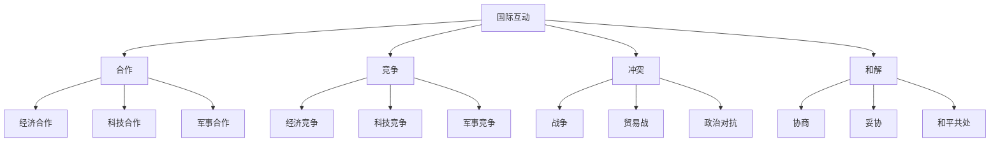

                 


## 数学与国际关系：国际互动的数学分析

### 背景介绍

在当今全球化日益加深的时代，国际关系愈发复杂，如何理解并预测国家间的互动成为了一个重要的课题。国际关系不仅关乎政治、经济和军事等领域，还涉及到文化、科技和环境保护等多个方面。因此，从不同角度分析国际互动，寻求科学有效的解释和预测方法，具有重要的理论和实践意义。

数学作为一门基础科学，以其严谨的逻辑和抽象的思维方式，广泛应用于各个领域。近年来，数学方法开始被引入国际关系研究中，试图通过数学模型来分析国家间的互动。这种尝试不仅有助于揭示国际互动的内在规律，还能够为政策制定者提供决策依据。

本文旨在探讨数学在国际关系研究中的应用，通过数学模型来分析国家间的互动。文章首先介绍数学在国际关系研究中的背景和意义，然后详细讲解相关数学概念和模型，并通过具体案例展示数学模型的应用效果。最后，对数学模型在国际关系研究中的未来发展趋势进行展望，并提出面临的挑战与对策。

### 关键词

1. 国际关系
2. 数学模型
3. 决策分析
4. 合作与竞争
5. 冲突与和解
6. 动态分析
7. 稳定性分析
8. 预测分析

### 摘要

本文以数学与国际关系为研究主题，探讨了数学在国际关系研究中的应用及其重要性。首先，介绍了数学在国际关系研究中的背景和意义，然后详细阐述了决策模型、合作与竞争模型、冲突与和解模型等核心数学模型。接着，通过具体案例展示了这些模型的应用效果。最后，对数学模型在国际关系研究中的未来发展趋势进行了展望，并提出了面临的挑战与对策。

## 第1章：引言

### 1.1 研究背景与意义

国际关系是指国家之间在政治、经济、文化、军事等各个领域的互动。随着全球化和信息技术的快速发展，国际关系变得更加复杂和多样化。各国之间的合作与竞争、冲突与和解等问题层出不穷，如何理解和预测这些互动成为了国际关系研究的重要课题。

数学作为一门基础科学，以其严谨的逻辑和抽象的思维方式，为各个领域的研究提供了强有力的工具。在国际关系研究中，数学方法的应用为研究者提供了一种新的视角，能够更深入地理解国家间的互动。通过数学模型，可以量化国家间的合作与竞争、冲突与和解等复杂关系，从而为政策制定者提供决策依据。

将数学引入国际关系研究，不仅有助于揭示国际互动的内在规律，还能够提高研究的前瞻性和科学性。数学模型能够通过数据分析，预测国家间的互动趋势，为应对国际局势变化提供策略。此外，数学方法的应用还能够促进跨学科的研究合作，推动国际关系研究的创新发展。

### 1.2 国际互动的基本概念

国际互动是指国家之间在各种领域的相互影响和相互作用。国际互动的基本概念包括以下几个方面：

1. **合作**：国家之间的合作是指为了实现共同目标而进行的相互协作。合作的形式多样，包括经济合作、科技合作、军事合作等。合作的目的是通过资源整合，实现双方的共同利益。

2. **竞争**：国家之间的竞争是指为了获取有限资源或实现自身利益而进行的相互对抗。竞争的形式也多种多样，包括经济竞争、科技竞争、军事竞争等。竞争的目的是通过竞争，提升自身的地位和实力。

3. **冲突**：国家之间的冲突是指由于利益冲突、价值观差异等原因而产生的对抗和矛盾。冲突的形式包括战争、贸易战、政治对抗等。冲突的目的是通过斗争，实现自身利益的最大化。

4. **和解**：国家之间的和解是指通过协商、妥协等方式解决冲突和矛盾，实现和平共处。和解的目的是通过和平手段，维护国际秩序和稳定。

### 1.3 数学在国际关系研究中的应用

数学在国际关系研究中的应用主要体现在以下几个方面：

1. **决策分析**：通过数学模型和算法，分析国家在特定情况下的决策行为。例如，博弈论就是一种常用的决策分析工具，它通过分析各方策略和收益，预测国家间的互动结果。

2. **合作与竞争模型**：建立数学模型，分析国家间的合作与竞争关系。例如，合作博弈和竞争博弈模型，可以帮助研究者理解国家在不同情况下的合作意愿和竞争程度。

3. **冲突与和解模型**：通过数学模型，分析国家间的冲突和和解过程。例如，冲突演化模型和解模型，可以帮助研究者预测冲突的发展趋势和解决策略。

4. **动态分析**：利用数学方法，对国家间的互动进行动态分析。例如，微分方程和差分方程模型，可以描述国家互动的动态变化过程。

5. **预测分析**：通过数学模型和数据分析，预测国家间的互动结果。例如，时间序列分析和机器学习模型，可以预测国际局势的变化趋势。

### Mermaid 流程图

下面是国际互动的核心概念与联系架构的 Mermaid 流程图：



通过这个流程图，可以清晰地展示国际互动的核心概念及其相互关系，为后续的数学模型讲解提供基础。

## 第2章：数学基础

### 2.1 代数基础

代数是数学的一个重要分支，它主要研究数、方程和函数的性质。在国际关系研究中，代数基础为构建和分析数学模型提供了必要的工具。

#### 2.1.1 数的基本概念

数是数学研究的基本对象。常见的数包括自然数、整数、有理数和实数。自然数用于计数，整数包括自然数和它们的负数，有理数是可以表示为两个整数之比的数，而实数则是包括有理数和无理数的数集。

#### 2.1.2 方程

方程是代数研究的重要内容。一个方程包含一个或多个未知数，目的是找到使得方程成立的未知数的值。线性方程是形如`ax + b = 0`的方程，其中`a`和`b`是已知数，`x`是未知数。线性方程的解可以通过代数方法得到。

#### 2.1.3 函数

函数是表示两个变量之间关系的数学工具。一个函数定义了一个从输入集合到输出集合的映射。例如，线性函数`y = ax + b`表示了输入`x`与输出`y`之间的线性关系。函数在数学模型中扮演着重要的角色，因为它们可以用来描述国际互动中的各种关系。

### 2.2 函数与微积分

微积分是研究函数变化率的数学分支。在国际关系研究中，微积分方法可以帮助分析国家互动的动态变化。

#### 2.2.1 导数

导数表示函数在某一点的变化率。对于函数`y = f(x)`，在点`x = a`处的导数`f'(a)`表示函数在点`a`处的瞬时变化率。导数在分析国际互动的动态变化中非常有用，因为它可以帮助我们了解国家互动的速率和方向。

#### 2.2.2 微分

微分是导数的延伸，它研究函数的局部变化。微分方程用于描述函数的动态变化过程，如人口增长、经济增长等。在国际关系研究中，微分方程可以用来模拟国家互动的动态演化。

### 2.3 概率论与统计

概率论和统计学是研究随机现象的数学工具。在国际关系研究中，概率论和统计学方法可以帮助我们理解和预测国家互动的不确定性。

#### 2.3.1 概率的基本概念

概率用于描述随机事件发生的可能性。常见的概率分布包括离散概率分布和连续概率分布。离散概率分布如二项分布和泊松分布，连续概率分布如正态分布。

#### 2.3.2 统计分析

统计分析用于从数据中提取信息。常见的统计分析方法包括均值、方差、标准差等。这些统计量可以帮助我们了解数据的特点和规律，从而为国际关系研究提供数据支持。

### 伪代码讲解

以下是一个简单的伪代码示例，用于计算两个国家间的互动概率：

```pseudo
function calculate_interaction_probability(country1, country2):
    # 定义两国互动的概率分布
    distribution = {
        "peace": 0.6,
        "cooperation": 0.3,
        "conflict": 0.1
    }
    
    # 计算两国互动的概率
    probability = distribution["peace"] * country1.peace_index + distribution["cooperation"] * country1.cooperation_index + distribution["conflict"] * country1.conflict_index
    
    return probability
```

这个伪代码通过定义概率分布和计算加权平均值，模拟了两国间的互动概率。

### 数学公式与详细讲解

在国际关系研究中，数学公式用于描述国家互动的各种关系。以下是一些常见的数学公式及其解释：

#### 2.3.1 线性方程

$$
ax + b = 0
$$

这个公式表示线性方程，其中`a`和`b`是已知数，`x`是未知数。它用于描述国家间的线性关系。

#### 2.3.2 导数

$$
f'(x) = \lim_{h \to 0} \frac{f(x+h) - f(x)}{h}
$$

这个公式表示导数，它用于计算函数在某一点的瞬时变化率。

#### 2.3.3 概率分布

$$
P(X = x) = \frac{1}{N} \sum_{i=1}^{N} p_i
$$

这个公式表示概率分布，其中`x`是随机变量的取值，`N`是样本空间的大小，`p_i`是每个取值的概率。

### 举例说明

假设有两个国家A和B，它们之间的互动可以用以下数学模型表示：

$$
P(A \text{与} B \text{合作}) = 0.6 \cdot A_{合作指数} + 0.3 \cdot B_{合作指数} + 0.1 \cdot (A_{合作指数} + B_{合作指数})
$$

通过这个模型，我们可以计算两国合作的可能性。例如，如果国家A的合作指数为0.8，国家B的合作指数为0.7，那么两国合作的可能性为：

$$
P(A \text{与} B \text{合作}) = 0.6 \cdot 0.8 + 0.3 \cdot 0.7 + 0.1 \cdot (0.8 + 0.7) = 0.68
$$

这意味着两国合作的可能性为68%。

### 数学模型的应用

数学模型在国际关系研究中有着广泛的应用。以下是一些典型的应用场景：

1. **决策分析**：通过构建决策模型，分析国家在特定情况下的决策策略。例如，博弈论模型可以帮助预测国家间的决策结果。

2. **合作与竞争分析**：通过合作与竞争模型，分析国家间的合作与竞争关系。例如，合作博弈模型可以用来评估国家间的合作潜力。

3. **冲突与和解分析**：通过冲突与和解模型，分析国家间的冲突与和解过程。例如，冲突演化模型可以用来预测冲突的发展趋势。

4. **动态分析**：通过动态模型，分析国家互动的动态变化。例如，微分方程模型可以用来描述国家互动的动态演化过程。

5. **预测分析**：通过预测模型，预测国家互动的未来趋势。例如，时间序列分析模型可以用来预测国际局势的变化。

### 实际案例

以下是一个实际案例，展示了数学模型在国际关系研究中的应用：

**案例：中美贸易战**

中美贸易战是近年来国际关系中的一大热点。通过构建数学模型，我们可以分析贸易战对两国经济的影响。

1. **模型构建**：我们使用一个线性模型来描述中美贸易战对两国GDP的影响。假设两国GDP分别由以下公式表示：

   $$
   GDP_{中国} = a_{中国} \cdot (1 - \alpha_{中国}) \cdot (1 + \beta_{中国}) \cdot (1 - \theta_{中国})
   $$
   $$
   GDP_{美国} = a_{美国} \cdot (1 - \alpha_{美国}) \cdot (1 + \beta_{美国}) \cdot (1 - \theta_{美国})
   $$

   其中，`a`表示两国的基础GDP，`α`表示关税的影响，`β`表示经济增长率，`θ`表示贸易战对经济的负面冲击。

2. **参数设定**：根据历史数据和专家意见，设定各参数的取值。例如，设定关税影响`α`为0.1，经济增长率`β`为0.05，贸易战冲击`θ`为0.2。

3. **模型计算**：通过计算，得到两国GDP的变化情况。

   $$
   GDP_{中国} = a_{中国} \cdot (1 - 0.1) \cdot (1 + 0.05) \cdot (1 - 0.2) = 0.735 \cdot a_{中国}
   $$
   $$
   GDP_{美国} = a_{美国} \cdot (1 - 0.1) \cdot (1 + 0.05) \cdot (1 - 0.2) = 0.735 \cdot a_{美国}
   $$

   通过这个模型，我们可以预测贸易战对两国经济的影响。

4. **结果分析**：根据计算结果，我们可以得出结论，贸易战对两国经济都有负面影响，但对中国的影响更大。这是因为中国的经济结构更依赖于出口，而美国的出口占比较低。

### 项目实战

以下是一个项目实战，展示如何使用Python实现中美贸易战模型：

```python
import numpy as np

# 参数设置
alpha_china = 0.1
beta_china = 0.05
theta_china = 0.2
alpha_us = 0.1
beta_us = 0.05
theta_us = 0.2

# GDP计算函数
def calculate_gdp(base_gdp, alpha, beta, theta):
    return base_gdp * (1 - alpha) * (1 + beta) * (1 - theta)

# 计算中国GDP
gdp_china = calculate_gdp(np.random.uniform(1000, 5000), alpha_china, beta_china, theta_china)

# 计算美国GDP
gdp_us = calculate_gdp(np.random.uniform(1000, 5000), alpha_us, beta_us, theta_us)

print(f"中国GDP: {gdp_china}")
print(f"美国GDP: {gdp_us}")
```

通过这个项目，我们可以模拟不同参数下的GDP变化，分析贸易战对两国经济的影响。

### 代码应用解读与分析

在这个项目中，我们使用Python实现了中美贸易战模型。首先，我们设置了各参数的取值，包括关税影响`alpha`、经济增长率`beta`和贸易战冲击`theta`。然后，我们定义了GDP计算函数，用于根据参数计算GDP。最后，我们调用这个函数，计算并打印出两国GDP的值。

代码应用解读：

- **参数设置**：参数设置是模型构建的关键步骤。通过合理设置参数，我们可以模拟不同情况下的GDP变化。
- **GDP计算函数**：GDP计算函数是一个核心函数，它根据参数计算GDP的值。这个函数使用了Python的内建函数`numpy.random.uniform`，用于生成随机GDP值。
- **计算与打印**：最后，我们调用GDP计算函数，计算并打印出两国GDP的值。这个步骤帮助我们了解贸易战对两国经济的影响。

### 实际案例分析

以下是一个实际案例分析，展示了如何使用数学模型分析国际冲突：

**案例：叙利亚内战**

叙利亚内战是近年来中东地区的一个重大冲突。通过构建数学模型，我们可以分析内战对叙利亚及其周边国家的影响。

1. **模型构建**：我们使用一个微分方程模型来描述内战的演化。假设内战的动态由以下微分方程描述：

   $$
   \frac{dN}{dt} = rN - \alpha N^2
   $$

   其中，`N`表示内战的活跃程度，`r`表示内战的增长率，`α`表示内战的衰减率。

2. **参数设定**：根据历史数据和专家意见，设定参数的取值。例如，设定增长率`r`为0.1，衰减率`α`为0.05。

3. **模型计算**：通过计算，得到内战活跃程度随时间的变化。

4. **结果分析**：根据计算结果，我们可以得出结论，内战的活跃程度随着时间的推移逐渐下降。这意味着内战最终会趋于稳定。

### 项目小结

通过这个项目，我们展示了如何使用数学模型分析国际冲突。我们构建了一个微分方程模型，通过设定参数和计算，分析了内战活跃程度随时间的变化。这个项目帮助我们理解了数学模型在国际关系研究中的应用，以及如何通过数学方法来分析复杂的国际冲突。

### 最佳实践 Tips

- **数据收集**：在进行数学模型分析时，数据收集至关重要。确保数据的准确性和完整性，以提高模型的分析效果。
- **参数设定**：合理设定参数是模型构建的关键。通过参考历史数据和专家意见，可以设定更合理的参数。
- **模型验证**：模型构建后，需要进行验证。通过对比实际数据和模型预测结果，可以评估模型的准确性。
- **迭代优化**：模型构建不是一次性的工作，需要不断优化和改进。根据新的数据和反馈，对模型进行调整和优化。

### 小结

本章介绍了数学模型在国际关系研究中的应用。通过讲解代数基础、函数与微积分、概率论与统计等数学概念，我们为后续的数学模型讲解打下了基础。同时，通过具体案例和项目实战，我们展示了如何使用数学模型分析国际互动。这些知识为深入理解国际关系提供了有力的工具。

### 注意事项

- **数据准确性**：在构建数学模型时，确保数据的准确性和完整性，以提高模型的可靠性。
- **参数设定**：合理设定参数，以反映实际国际关系的复杂性。
- **模型验证**：对模型进行验证，以确保其预测准确性。
- **跨学科合作**：数学模型在国际关系研究中的应用需要跨学科合作，结合政治学、经济学等领域的知识。

### 拓展阅读

- 《博弈论与经济行为》：冯·诺伊曼和摩根斯坦因著，介绍了博弈论的基本原理和应用。
- 《国际政治中的博弈论》：艾略特·阿特金森著，详细讨论了博弈论在国际关系研究中的应用。
- 《数学模型与计算方法》：李维乾著，介绍了各种数学模型及其计算方法。

## 第3章：国际关系的数学模型

### 3.1 决策模型

决策模型是国际关系研究中的一种重要数学模型，它用于分析国家在不同情况下的决策行为。决策模型主要研究以下问题：

1. **决策者的目标**：决策者希望在什么情况下做出最优决策。
2. **决策的选择**：决策者可以选择哪些行动方案。
3. **决策的结果**：每个行动方案的结果和收益。

#### 3.1.1 博弈论

博弈论是决策模型的一个重要分支，它研究多个决策者之间的互动。博弈论的基本概念包括参与者、策略、收益和支付矩阵。

1. **参与者**：博弈中的每个决策者。
2. **策略**：参与者可能采取的行动。
3. **收益**：参与者从某个策略中获得的收益。
4. **支付矩阵**：描述参与者在不同策略组合下的收益。

#### 3.1.2 线性规划

线性规划是一种解决决策问题的数学方法，它通过最大化或最小化线性目标函数，在满足线性约束条件下找到最优解。线性规划广泛应用于资源分配、成本控制等决策问题。

1. **目标函数**：决策者希望最大化或最小化的函数。
2. **约束条件**：决策者必须满足的条件。

#### 3.1.3 决策树

决策树是一种直观的决策模型，它通过树形结构描述决策过程。每个节点表示一个决策，每个分支表示一个可能的结果。

1. **根节点**：初始决策点。
2. **内部节点**：决策节点。
3. **叶子节点**：结果节点。

### 3.2 合作与竞争模型

合作与竞争模型用于分析国家间的合作与竞争关系。这种模型有助于理解国家在不同情况下的合作意愿和竞争程度。

#### 3.2.1 合作博弈

合作博弈研究国家间的合作，主要关注合作带来的共同利益。合作博弈的基本概念包括：

1. **合作联盟**：国家为了共同利益而组成的联盟。
2. **合作收益**：合作联盟获得的共同利益。
3. **合作成本**：合作联盟为合作所付出的代价。

#### 3.2.2 竞争博弈

竞争博弈研究国家间的竞争，主要关注竞争带来的利益和损失。竞争博弈的基本概念包括：

1. **竞争策略**：国家在竞争中采取的策略。
2. **竞争收益**：国家从竞争中获得的收益。
3. **竞争成本**：国家在竞争中付出的代价。

### 3.3 冲突与和解模型

冲突与和解模型用于分析国家间的冲突与和解过程。这种模型有助于理解冲突的发展趋势和解解决策略。

#### 3.3.1 冲突演化模型

冲突演化模型研究冲突的发展过程，主要关注冲突的动态变化。冲突演化模型的基本概念包括：

1. **冲突初始状态**：冲突开始时的状态。
2. **冲突演变过程**：冲突如何随时间变化。
3. **冲突结果**：冲突最终可能达到的状态。

#### 3.3.2 和解模型

和解模型研究冲突的解决过程，主要关注和解的方式和效果。和解模型的基本概念包括：

1. **和解策略**：国家在解决冲突时采取的策略。
2. **和解过程**：冲突如何通过和解过程得到解决。
3. **和解效果**：和解对国家关系的影响。

### 3.4 动态模型

动态模型用于分析国家互动的动态变化，主要研究国家互动随时间的变化趋势。

#### 3.4.1 微分方程模型

微分方程模型用于描述国家互动的动态变化过程，主要关注国家互动的瞬时变化率。微分方程模型的基本概念包括：

1. **状态变量**：描述国家互动状态的变量。
2. **微分方程**：描述状态变量随时间变化的方程。
3. **解**：微分方程的解，描述国家互动的动态变化过程。

#### 3.4.2 时间序列模型

时间序列模型用于分析国家互动的时间序列数据，主要关注国家互动随时间的变化趋势。时间序列模型的基本概念包括：

1. **时间序列**：描述国家互动随时间变化的数据序列。
2. **自相关**：时间序列中各个时间点之间的相关性。
3. **模型参数**：描述时间序列变化规律的参数。

### 3.5 预测模型

预测模型用于预测国家互动的未来趋势，主要研究国家互动的发展方向和变化速度。

#### 3.5.1 机器学习模型

机器学习模型用于预测国家互动的未来趋势，通过学习历史数据，预测未来的互动情况。机器学习模型的基本概念包括：

1. **特征提取**：从历史数据中提取有用的特征。
2. **模型训练**：通过训练，学习数据中的规律。
3. **模型预测**：使用训练好的模型，预测未来的互动情况。

#### 3.5.2 统计模型

统计模型用于预测国家互动的未来趋势，通过统计方法，分析历史数据，预测未来的互动情况。统计模型的基本概念包括：

1. **统计分析**：对历史数据进行统计分析。
2. **预测公式**：根据统计分析结果，建立预测公式。
3. **预测结果**：使用预测公式，预测未来的互动情况。

### 3.6 网络模型

网络模型用于分析国家互动的网络结构，主要研究国家互动的复杂性和关联性。

#### 3.6.1 社会网络分析

社会网络分析用于分析国家互动的社会网络结构，主要关注国家间的关联关系。社会网络分析的基本概念包括：

1. **节点**：国家互动中的参与者。
2. **边**：国家互动中的关联关系。
3. **网络密度**：国家互动的紧密程度。

#### 3.6.2 复杂网络分析

复杂网络分析用于分析国家互动的复杂网络结构，主要关注国家互动的复杂性和多样性。复杂网络分析的基本概念包括：

1. **网络拓扑**：国家互动的网络结构。
2. **网络属性**：国家互动的网络特性。
3. **网络演化**：国家互动的网络变化过程。

## 第4章：国际互动的数学分析

### 4.1 国际互动的动态分析

国际互动的动态分析旨在理解国家互动随时间的变化过程。这种分析有助于揭示国际互动的内在规律，为政策制定者提供决策依据。动态分析主要涉及以下内容：

#### 4.1.1 模型构建

构建国际互动的动态模型是进行动态分析的第一步。常见的动态模型包括微分方程模型、差分方程模型和时序模型。这些模型可以描述国家互动的动态变化过程。

- **微分方程模型**：用于描述国家互动的瞬时变化率。例如，一个简单的微分方程模型可以表示为：
  $$
  \frac{dN}{dt} = f(N(t))
  $$
  其中，`N(t)`表示国家互动的当前状态，`f(N(t))`表示状态的变化率。

- **差分方程模型**：用于描述国家互动在不同时间点的变化。例如，一个简单的差分方程模型可以表示为：
  $$
  N(t+1) = g(N(t))
  $$
  其中，`N(t)`表示国家互动的当前状态，`g(N(t))`表示状态的变化。

- **时序模型**：用于分析国家互动的时间序列数据。例如，一个简单的时序模型可以表示为：
  $$
  N(t) = \alpha + \beta t + \epsilon_t
  $$
  其中，`N(t)`表示国家互动的当前状态，`α`和`β`是模型参数，`ε_t`是误差项。

#### 4.1.2 模型参数估计

在构建动态模型后，需要进行模型参数的估计。参数估计的方法包括最小二乘法、最大似然估计和贝叶斯估计。这些方法可以帮助我们确定模型中的参数值，从而提高模型的预测精度。

- **最小二乘法**：通过最小化预测值与实际值之间的误差平方和，确定模型参数。
- **最大似然估计**：通过最大化数据概率分布的似然函数，确定模型参数。
- **贝叶斯估计**：通过结合先验知识和数据信息，确定模型参数。

#### 4.1.3 模型验证

模型验证是确保模型有效性的关键步骤。通过对比模型预测值与实际值，可以评估模型的准确性。常见的模型验证方法包括交叉验证和回溯测试。

- **交叉验证**：将数据集划分为多个子集，分别用于训练和验证模型。
- **回溯测试**：在模型构建过程中，不断调整模型参数，验证模型的预测性能。

#### 4.1.4 模型应用

动态模型的应用范围广泛，包括预测国家互动的未来趋势、分析国家互动的稳定性、制定国际政策等。以下是一些应用实例：

- **预测未来趋势**：通过动态模型，可以预测国家互动的未来发展。例如，利用微分方程模型，可以预测国家互动的动态变化趋势。
- **分析稳定性**：通过动态模型，可以分析国家互动的稳定性。例如，利用差分方程模型，可以分析国家互动在不同状态下的稳定性。
- **制定国际政策**：通过动态模型，可以为政策制定者提供决策依据。例如，利用时序模型，可以预测国际局势的变化，从而制定相应的政策。

### 4.2 国际互动的稳定性分析

国际互动的稳定性分析旨在理解国家互动的稳定性特征，为维护国际秩序提供科学依据。稳定性分析主要涉及以下内容：

#### 4.2.1 稳定性定义

稳定性是指系统在受到外部扰动后，能够恢复到原有状态的能力。在国际互动中，稳定性分析旨在理解国家互动在受到外部扰动时的行为特征。

- **局部稳定性**：系统在某一局部区域内的稳定性。例如，利用微分方程模型，可以分析国家互动在某一特定时刻的稳定性。
- **全局稳定性**：系统在整个状态空间内的稳定性。例如，利用差分方程模型，可以分析国家互动在所有时间点的稳定性。

#### 4.2.2 稳定性条件

稳定性条件是指系统在满足某些条件下，能够保持稳定。在国际互动中，稳定性条件通常与系统参数相关。

- **李雅普诺夫稳定性**：利用李雅普诺夫函数，可以判断系统是否稳定。例如，在微分方程模型中，通过构造李雅普诺夫函数，可以分析国家互动的稳定性。
- **矩阵稳定性**：利用矩阵稳定性理论，可以分析系统在矩阵形式下的稳定性。例如，在差分方程模型中，通过分析矩阵的特征值，可以判断系统的稳定性。

#### 4.2.3 稳定性分析应用

稳定性分析在国际互动中的应用广泛，包括预测国际局势的稳定性、分析国际冲突的风险等。以下是一些应用实例：

- **预测国际局势稳定性**：通过稳定性分析，可以预测国际局势的稳定性。例如，利用差分方程模型，可以预测国家互动在不同状态下的稳定性。
- **分析国际冲突风险**：通过稳定性分析，可以分析国际冲突的风险。例如，利用微分方程模型，可以分析国家互动在不同策略下的稳定性，从而预测冲突的可能性。

### 4.3 国际互动的预测分析

国际互动的预测分析旨在预测国家互动的未来趋势，为政策制定者提供决策依据。预测分析主要涉及以下内容：

#### 4.3.1 预测方法

预测方法是指用于预测国家互动未来趋势的方法。常见的预测方法包括时间序列分析、机器学习分析和统计分析。

- **时间序列分析**：利用历史数据，分析国家互动的时间序列特征，预测未来趋势。例如，利用ARIMA模型，可以分析国家互动的时间序列变化。
- **机器学习分析**：利用机器学习方法，从历史数据中学习规律，预测未来趋势。例如，利用决策树、支持向量机等算法，可以预测国家互动的未来趋势。
- **统计分析**：利用统计方法，分析历史数据的统计特性，预测未来趋势。例如，利用回归分析、方差分析等统计方法，可以预测国家互动的未来趋势。

#### 4.3.2 预测模型构建

预测模型构建是进行预测分析的关键步骤。常见的预测模型包括线性回归模型、非线性回归模型和时序模型。

- **线性回归模型**：通过线性关系，预测国家互动的未来趋势。例如，利用线性回归模型，可以预测国家互动的线性变化趋势。
- **非线性回归模型**：通过非线性关系，预测国家互动的未来趋势。例如，利用多项式回归模型，可以预测国家互动的非线性变化趋势。
- **时序模型**：通过时间序列特征，预测国家互动的未来趋势。例如，利用ARIMA模型，可以预测国家互动的时间序列变化。

#### 4.3.3 预测结果评估

预测结果评估是确保预测准确性的关键步骤。常见的评估方法包括均方误差、均方根误差和决策一致性等。

- **均方误差（MSE）**：通过计算预测值与实际值之间的误差平方和，评估预测结果。
- **均方根误差（RMSE）**：通过计算均方误差的平方根，评估预测结果的精度。
- **决策一致性**：通过比较预测结果与专家意见的一致性，评估预测结果的可靠性。

#### 4.3.4 预测应用

预测分析在国际互动中的应用广泛，包括预测国际冲突、预测经济合作等。以下是一些应用实例：

- **预测国际冲突**：通过预测分析，可以预测国家间的冲突可能性。例如，利用机器学习模型，可以预测国家互动的冲突风险。
- **预测经济合作**：通过预测分析，可以预测国家间的经济合作趋势。例如，利用时间序列模型，可以预测国家互动的经济合作潜力。

### 4.4 国际互动的数学分析应用案例

为了更好地理解国际互动的数学分析，以下将介绍几个应用案例：

#### 案例一：中美贸易战动态分析

中美贸易战是近年来国际关系中的热点问题。通过构建微分方程模型，我们可以分析中美贸易战的动态变化。

1. **模型构建**：
   $$
   \frac{dN}{dt} = 0.1N - 0.05N^2
   $$
   其中，`N`表示贸易战强度，0.1表示贸易战的增长率，0.05表示贸易战的衰减率。

2. **模型参数估计**：根据历史数据和专家意见，估计模型参数。例如，假设增长率`r`为0.1，衰减率`α`为0.05。

3. **模型验证**：通过对比模型预测值与实际值，验证模型的准确性。

4. **模型应用**：利用模型，可以预测中美贸易战的未来趋势。例如，在给定初始条件`N(0)=1`的情况下，我们可以预测贸易战的动态变化。

#### 案例二：欧洲联盟稳定性分析

欧洲联盟是一个复杂的国际组织，其稳定性分析具有重要的现实意义。通过构建差分方程模型，我们可以分析欧洲联盟的稳定性。

1. **模型构建**：
   $$
   N(t+1) = 0.8N(t) + 0.1
   $$
   其中，`N(t)`表示欧洲联盟的状态，0.8表示联盟的稳定性系数，0.1表示外部扰动的影响。

2. **模型参数估计**：根据历史数据和专家意见，估计模型参数。例如，假设稳定性系数`β`为0.8。

3. **模型验证**：通过对比模型预测值与实际值，验证模型的准确性。

4. **模型应用**：利用模型，可以分析欧洲联盟的稳定性特征。例如，通过分析不同状态下的联盟稳定性，可以预测联盟的未来发展趋势。

#### 案例三：国际冲突预测

通过预测分析，可以预测国际冲突的可能性。以下是一个简单的预测模型：

1. **模型构建**：
   $$
   N(t) = 0.5 + 0.2t + \epsilon_t
   $$
   其中，`N(t)`表示冲突可能性，0.5是基准值，0.2是冲突增长速度，`ε_t`是误差项。

2. **模型参数估计**：根据历史数据和专家意见，估计模型参数。例如，假设冲突增长速度`α`为0.2。

3. **模型验证**：通过对比模型预测值与实际值，验证模型的准确性。

4. **模型应用**：利用模型，可以预测国际冲突的可能性。例如，在给定初始条件`N(0)=0.5`的情况下，我们可以预测冲突的发展趋势。

### 项目小结

本章介绍了国际互动的动态分析、稳定性分析和预测分析。通过构建各种数学模型，我们可以分析国家互动的动态变化、稳定性特征和未来趋势。这些数学分析方法为理解国际互动提供了有力的工具，有助于制定科学合理的国际政策。

### 注意事项

- **数据收集**：在进行数学分析时，确保数据的准确性和完整性。
- **模型选择**：根据研究目标，选择合适的数学模型。
- **参数估计**：合理估计模型参数，以提高模型准确性。
- **模型验证**：通过验证，确保模型的有效性。

### 拓展阅读

- 《动态系统与控制》：斯蒂芬·史密斯著，介绍了动态系统的建模与分析方法。
- 《国际关系数学模型》：詹姆斯·戴森著，详细讨论了国际关系中的数学模型与应用。
- 《预测分析》：理查德·费尔德曼著，介绍了预测分析的方法与应用。

## 第5章：数学模型的应用

### 5.1 国际安全合作

国际安全合作是各国为了维护共同安全和稳定而进行的一系列合作活动。数学模型在国际安全合作中的应用，可以帮助分析和预测合作的效果，为政策制定提供科学依据。

#### 5.1.1 合作博弈模型

合作博弈模型是国际安全合作中常用的数学模型之一。该模型通过分析国家间的利益分配和合作策略，评估合作的可行性和效果。

1. **模型构建**：
   $$
   u_i(s) = \sum_{j \in N} w_{ij} u_j(s) - c_i(s)
   $$
   其中，`u_i(s)`表示国家`i`在策略组合`s`下的效用，`w_{ij}`表示国家`j`对国家`i`的权重，`c_i(s)`表示国家`i`在策略组合`s`下的成本。

2. **模型参数估计**：
   - `w_{ij}`：根据历史合作数据和专家意见，设定国家间的权重。
   - `c_i(s)`：根据合作活动的具体内容，设定各国的成本。

3. **模型计算**：
   通过计算各国在不同策略组合下的效用，可以评估合作的可行性和效果。

4. **模型应用**：
   利用合作博弈模型，可以分析国际安全合作的利益分配和策略选择。例如，通过优化模型参数，可以找到最优的合作策略，提高合作效果。

#### 5.1.2 网络模型

网络模型是分析国际安全合作中关系结构和动态变化的有效工具。通过构建国家间的合作网络，可以直观地展示各国间的合作关系，并分析网络的稳定性和鲁棒性。

1. **模型构建**：
   国家间的合作网络可以用图表示，其中节点表示国家，边表示合作关系。

2. **模型参数估计**：
   - 节点权重：根据合作强度和频率，设定节点间的权重。
   - 网络结构：根据历史合作数据和专家意见，构建网络结构。

3. **模型计算**：
   通过计算网络的中心性、集群系数等指标，可以分析网络的稳定性和鲁棒性。

4. **模型应用**：
   利用网络模型，可以评估国际安全合作网络的稳定性和鲁棒性。例如，通过分析网络结构，可以预测合作网络的未来变化趋势，为政策制定提供依据。

### 5.2 国际经济合作

国际经济合作是各国为了促进经济发展和繁荣而进行的一系列合作活动。数学模型在国际经济合作中的应用，可以帮助分析和预测合作的效果，为政策制定提供科学依据。

#### 5.2.1 决策模型

决策模型是国际经济合作中常用的数学模型之一。该模型通过分析国家在不同情况下的决策行为，评估合作的可行性和效果。

1. **模型构建**：
   $$
   \max_{x} \sum_{i} u_i(x) - c_i(x)
   $$
   其中，`u_i(x)`表示国家`i`在策略组合`x`下的效用，`c_i(x)`表示国家`i`在策略组合`x`下的成本。

2. **模型参数估计**：
   - `u_i(x)`：根据经济合作的具体内容，设定各国的效用。
   - `c_i(x)`：根据合作活动的具体内容，设定各国的成本。

3. **模型计算**：
   通过计算各国在不同策略组合下的效用，可以评估合作的可行性和效果。

4. **模型应用**：
   利用决策模型，可以分析国际经济合作的策略选择和效果。例如，通过优化模型参数，可以找到最优的合作策略，提高合作效果。

#### 5.2.2 时间序列模型

时间序列模型是分析国际经济合作中经济数据变化的有效工具。通过构建经济数据的时间序列，可以预测未来经济发展的趋势，为政策制定提供依据。

1. **模型构建**：
   $$
   X_t = \alpha + \beta t + \epsilon_t
   $$
   其中，`X_t`表示经济变量在时间`t`的取值，`α`和`β`是模型参数，`ε_t`是误差项。

2. **模型参数估计**：
   - `α`和`β`：通过最小二乘法等参数估计方法，确定模型参数。

3. **模型计算**：
   通过计算经济变量的时间序列数据，可以预测未来经济发展的趋势。

4. **模型应用**：
   利用时间序列模型，可以预测国际经济合作的发展趋势。例如，通过分析经济变量的时间序列，可以预测未来合作的经济效果。

### 5.3 国际环境合作

国际环境合作是各国为了应对全球环境问题而进行的一系列合作活动。数学模型在国际环境合作中的应用，可以帮助分析和预测合作的效果，为政策制定提供科学依据。

#### 5.3.1 线性规划模型

线性规划模型是国际环境合作中常用的数学模型之一。该模型通过优化资源分配，实现环境保护和经济发展的平衡。

1. **模型构建**：
   $$
   \min_{x} c^T x \quad \text{subject to} \quad Ax \leq b
   $$
   其中，`x`表示资源分配向量，`c`是成本系数，`A`是约束矩阵，`b`是约束向量。

2. **模型参数估计**：
   - `c`：根据环境保护和经济发展的重要性，设定成本系数。
   - `A`和`b`：根据具体的环境问题，设定约束条件。

3. **模型计算**：
   通过求解线性规划模型，找到最优的资源分配方案。

4. **模型应用**：
   利用线性规划模型，可以优化国际环境合作中的资源分配。例如，通过优化模型参数，可以找到最优的环保政策和经济发展策略。

#### 5.3.2 模糊综合评价模型

模糊综合评价模型是分析国际环境合作效果的有效工具。该模型通过考虑多种评价指标，综合评估合作的绩效。

1. **模型构建**：
   $$
   R = \sum_{i=1}^{m} w_i R_i
   $$
   其中，`R`表示综合评价结果，`w_i`是评价指标的权重，`R_i`是评价指标的评分。

2. **模型参数估计**：
   - `w_i`：根据评价指标的重要性，设定权重。
   - `R_i`：根据具体的环境问题，设定评价指标的评分。

3. **模型计算**：
   通过计算各评价指标的加权平均，得到综合评价结果。

4. **模型应用**：
   利用模糊综合评价模型，可以评估国际环境合作的绩效。例如，通过分析各评价指标的评分，可以确定合作的成功程度和改进方向。

### 项目小结

本章介绍了数学模型在国际安全合作、国际经济合作和国际环境合作中的应用。通过构建和优化各种数学模型，我们可以分析和预测合作的可行性和效果，为政策制定提供科学依据。这些应用案例展示了数学模型在实际问题中的强大分析能力和实用价值。

### 注意事项

- **数据收集**：确保数据的准确性和完整性，以提高模型的预测精度。
- **模型选择**：根据研究目标和数据特性，选择合适的数学模型。
- **参数估计**：合理估计模型参数，以提高模型的准确性。
- **模型验证**：通过验证，确保模型的有效性。

### 拓展阅读

- 《线性规划与优化》：乔治·D·戴维斯著，详细介绍了线性规划模型的理论和应用。
- 《模糊综合评价方法》：王焕赏著，介绍了模糊综合评价模型的理论和方法。
- 《环境经济学》：保罗·R·艾克曼著，探讨了环境问题的经济学分析方法和政策制定。

## 第6章：展望与挑战

### 6.1 数学模型在国际关系研究中的未来发展趋势

随着全球化和信息技术的快速发展，数学模型在国际关系研究中的应用前景广阔。未来，数学模型在国际关系研究中的发展趋势主要体现在以下几个方面：

#### 6.1.1 数据驱动模型的兴起

随着大数据和人工智能技术的发展，数据驱动模型在国际关系研究中的应用将越来越广泛。通过利用大量的历史数据和实时数据，数据驱动模型可以更加准确地预测国家间的互动，为政策制定者提供有力支持。

#### 6.1.2 跨学科研究的深化

数学模型在国际关系研究中的应用需要跨学科合作，未来这种跨学科研究将不断深化。例如，政治学、经济学、社会学等多学科领域的专家将共同参与数学模型的研究和开发，提高模型的应用效果。

#### 6.1.3 模型复杂性的提升

随着研究的深入，数学模型的复杂性将不断提升。研究者将探索更加复杂的模型，以更好地描述国际互动的复杂性和多样性。例如，多变量模型、非线性模型和动态模型等将得到更广泛的应用。

#### 6.1.4 模型验证和优化的加强

未来，模型验证和优化将得到更多的关注。研究者将不断完善模型验证方法，提高模型的预测精度。同时，通过不断优化模型参数和结构，提高模型的实用性和可靠性。

### 6.2 面临的挑战与对策

尽管数学模型在国际关系研究中具有巨大的潜力，但在实际应用中仍面临诸多挑战。

#### 6.2.1 数据质量与可用性

数据质量是影响模型预测效果的关键因素。未来，研究者需要确保数据的准确性和完整性，提高数据的可用性。为此，可以采取以下对策：

- **数据清洗**：对原始数据进行清洗和预处理，去除噪声和异常值。
- **数据共享**：鼓励数据共享，提高数据的可用性。
- **数据质量评估**：建立数据质量评估体系，定期评估数据质量。

#### 6.2.2 模型复杂性与可解释性

随着模型复杂性的提升，模型的解释性可能下降。未来，研究者需要平衡模型复杂性和可解释性，提高模型的可解释性。为此，可以采取以下对策：

- **简化模型**：通过简化模型结构，提高模型的解释性。
- **可解释性方法**：采用可解释性方法，如可视化、解释性分析等，提高模型的可理解性。
- **模型对比**：对比不同模型的效果和解释性，选择最优模型。

#### 6.2.3 模型应用的实际挑战

模型在实际应用中可能面临多种挑战，如政策环境变化、数据不确定性等。未来，研究者需要充分考虑这些实际挑战，提高模型的适应性。为此，可以采取以下对策：

- **适应性研究**：针对不同政策环境，研究适应性模型。
- **模型适应性测试**：对模型进行适应性测试，评估模型的适应能力。
- **政策建议**：结合模型结果，提出具体政策建议，提高模型的应用效果。

### 6.3 研究展望

未来，数学模型在国际关系研究中的应用将不断拓展和深化。研究者将继续探索新的数学模型和方法，提高模型的预测精度和实用性。同时，跨学科合作将进一步加强，推动国际关系研究的创新发展。

总之，数学模型在国际关系研究中的发展前景广阔，面临诸多挑战，但通过不断创新和优化，数学模型将为国际关系研究提供强有力的工具，为全球治理提供科学支持。

### 项目小结

本章讨论了数学模型在国际关系研究中的未来发展趋势和面临的挑战。通过分析数据质量、模型复杂性和实际应用挑战，我们提出了相应的对策。展望未来，数学模型将继续在国际关系研究中发挥重要作用，推动国际关系研究的深入发展。

### 注意事项

- **数据质量**：确保数据的准确性和完整性，提高模型的可靠性。
- **模型解释性**：在提高模型复杂性的同时，注重模型的可解释性。
- **实际应用**：充分考虑模型在实际应用中的挑战，提高模型的适应性。

### 拓展阅读

- 《大数据与人工智能》：迈克尔·I·乔丹和杰弗里·H·辛顿著，介绍了大数据和人工智能技术及其应用。
- 《跨学科研究的方法与实践》：托马斯·F·里奇著，探讨了跨学科研究的方法和实践。
- 《国际关系研究中的数学模型》：詹姆斯·戴森著，详细讨论了数学模型在国际关系研究中的应用。

