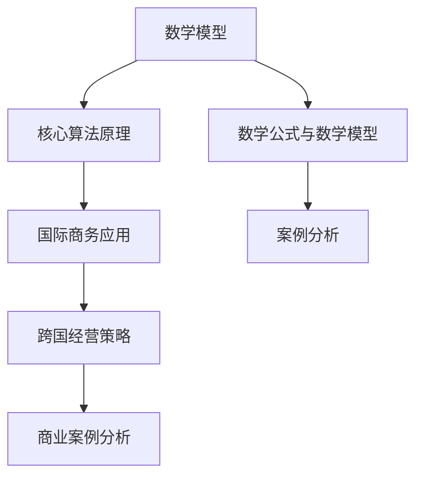

                 

# 数学与国际商务：跨国经营的数学分析

## 关键词
数学模型、国际商务、跨国经营、经济学、算法原理、最小二乘法、回归分析、数据可视化

## 摘要
本文探讨了数学在国际商务和跨国经营中的应用，特别是通过数学模型和算法原理来分析和预测国际市场的表现。文章首先介绍了数学模型和核心概念，包括经济学中的边际收益和成本模型，以及国际商务中的汇率模型。随后，通过最小二乘法等算法原理的讲解，展示了如何构建回归模型并进行预测。通过一个跨国经营的案例分析，文章详细展示了如何收集数据、构建模型、进行预测和评估模型性能。最后，文章总结了跨国经营中的数学分析方法，并提供了最佳实践和注意事项。

## 概念与联系

### 核心概念原理和架构的 Mermaid 流程图


### 数学模型和数学公式

#### 经济学中的数学模型
经济学中的数学模型通常用于描述市场行为和经济现象。一个典型的例子是边际收益（Marginal Revenue, MR）和边际成本（Marginal Cost, MC）模型。边际收益是单位产品销售增加所带来的额外收益，而边际成本是生产额外产品所需的成本。

经济学中的边际收益和成本模型可以用以下公式表示：

$$
    M(x) = \frac{C(x) + R(x)}{G(x)}
$$

其中：
- $M(x)$ 代表边际收益
- $C(x)$ 代表边际成本
- $R(x)$ 代表收益函数
- $G(x)$ 代表总成本函数

#### 国际商务中的数学模型
在国际商务中，汇率（Exchange Rate）是一个关键因素，它影响着进出口商品的价格。一个简单的汇率模型可以表示为：

$$
    P = f(E, I, M)
$$

其中：
- $P$ 代表价格
- $E$ 代表汇率
- $I$ 代表进口商品的价格
- $M$ 代表出口商品的价格

### 核心算法原理讲解

#### 最小二乘法（OLS）原理
最小二乘法是一种常用的统计方法，用于估计线性回归模型的参数。它的基本原理是寻找一个模型，使得实际值与模型预测值之间的误差平方和最小。

最小二乘法的伪代码如下：

```
Initialize theta
for each x in X:
    h = theta^T * x
    d = y - h
    theta = theta - (d * x)^T / (x^T * x)
```

其中：
- `theta` 是模型的参数
- `X` 是自变量矩阵
- `y` 是因变量向量
- `h` 是模型的预测值
- `d` 是预测值与实际值的差

## 数学模型和数学公式

### 经济学中的数学模型
经济学中的数学模型通常用于分析和预测市场行为。一个常见的模型是边际收益（Marginal Revenue, MR）和边际成本（Marginal Cost, MC）模型，它们在决策制定中至关重要。

边际收益是单位产品销售增加所带来的额外收益，而边际成本是生产额外产品所需的成本。这两个概念可以用以下公式表示：

$$
    M(x) = \frac{C(x) + R(x)}{G(x)}
$$

其中：
- $M(x)$ 代表边际收益
- $C(x)$ 代表边际成本
- $R(x)$ 代表收益函数
- $G(x)$ 代表总成本函数

例如，假设某公司生产产品的总成本函数为 $G(x) = 100 + 10x$，收益函数为 $R(x) = 50x$，其中 $x$ 是产品的数量。边际成本和边际收益可以计算如下：

$$
    C(x) = G(x) - R(x) = (100 + 10x) - 50x = 100 - 40x
$$

$$
    M(x) = \frac{C(x) + R(x)}{G(x)} = \frac{100 - 40x + 50x}{100 + 10x} = \frac{100 + 10x}{100 + 10x} = 1
$$

这个例子表明，边际收益和边际成本在经济学中的应用是非常直接的。通过这个模型，公司可以决定是否增加生产量，以最大化利润。

### 国际商务中的数学模型
在国际商务中，汇率（Exchange Rate）是一个关键因素，它影响着进出口商品的价格。一个简单的汇率模型可以表示为：

$$
    P = f(E, I, M)
$$

其中：
- $P$ 代表价格
- $E$ 代表汇率
- $I$ 代表进口商品的价格
- $M$ 代表出口商品的价格

这个模型说明了价格是如何受到汇率变动的影响的。例如，如果汇率上升，进口商品的价格会上升，而出口商品的价格会下降。这对于跨国公司的定价策略和利润分析具有重要意义。

假设某公司出口商品的价格为 $M = 100 美元，进口商品的价格为 $I = 80 美元，汇率 $E$ 从 1 美元兑换 1 欧元变为 1.2 美元兑换 1 欧元。根据汇率模型，价格变动可以计算如下：

$$
    P = f(E, I, M) = f(1, 80, 100) = 100
$$

当汇率变为 1.2 后：

$$
    P = f(E, I, M) = f(1.2, 80, 100) = \frac{100 \cdot 1.2}{1.2 + 80} = 97.22
$$

这表明，由于汇率变动，出口商品的价格从 100 美元降至 97.22 美元。

通过这些数学模型，跨国公司可以更好地理解和预测汇率变动对业务的影响，从而制定更有效的策略。

## 核心算法原理讲解

### 最小二乘法（OLS）原理
最小二乘法（Ordinary Least Squares, OLS）是一种常用的统计方法，用于估计线性回归模型的参数。它的核心思想是找到一个模型，使得实际观测值与模型预测值之间的误差平方和最小。

最小二乘法的原理可以通过以下伪代码来解释：

```
Initialize theta
for each x in X:
    h = theta^T * x
    d = y - h
    theta = theta - (d * x)^T / (x^T * x)
```

其中：
- `theta` 是模型的参数
- `X` 是自变量矩阵
- `y` 是因变量向量
- `h` 是模型的预测值
- `d` 是预测值与实际值的差

这个算法的基本步骤如下：
1. 初始化模型参数 `theta`。
2. 对于每个自变量 `x`，计算预测值 `h`。
3. 计算实际值与预测值之间的差 `d`。
4. 更新模型参数 `theta`，使得误差平方和最小。

最小二乘法的一个关键优点是它能够提供稳定和有效的参数估计，这在许多实际应用中都非常重要。

### 最小二乘法的实际应用
最小二乘法在许多领域都有广泛的应用，其中一个典型的例子是线性回归分析。线性回归分析用于建立因变量和自变量之间的线性关系，其公式如下：

$$
    y = \beta_0 + \beta_1 \cdot x_1 + \beta_2 \cdot x_2 + \epsilon
$$

其中：
- $y$ 是因变量
- $x_1$ 和 $x_2$ 是自变量
- $\beta_0$，$\beta_1$ 和 $\beta_2$ 是模型的参数
- $\epsilon$ 是误差项

假设我们有一个数据集，其中包含多个变量的观测值。我们的目标是找到最佳的线性模型，使得预测值与实际值之间的误差最小。

使用最小二乘法，我们可以通过以下步骤来建立线性回归模型：
1. 收集数据并整理成矩阵形式。
2. 计算自变量矩阵 `X` 和因变量向量 `y`。
3. 使用最小二乘法计算模型参数 `theta`。
4. 预测新的观测值。

以下是一个简单的 Python 实现示例：

```python
import numpy as np

# 收集数据
X = np.array([[1, 2], [2, 3], [3, 4]])
y = np.array([2, 4, 5])

# 计算最小二乘法参数
theta = np.linalg.inv(X.T @ X) @ X.T @ y

# 预测新的观测值
new_x = np.array([4, 5])
predicted_y = theta[0] + theta[1] * new_x[0] + theta[2] * new_x[1]

print(predicted_y)
```

这个示例展示了如何使用最小二乘法建立线性回归模型，并使用该模型进行预测。在实际应用中，数据集可能包含更多的变量和观测值，但基本原理是相同的。

通过最小二乘法，我们可以更好地理解和预测变量之间的关系，这在决策制定和业务分析中具有重要作用。

## 项目实战

### 跨国经营案例：A公司国际化策略

#### 开发环境搭建
为了构建和分析跨国经营的数学模型，我们选择 Python 作为主要编程语言，因为它具有丰富的数据分析和机器学习库，方便我们进行数据预处理、模型构建和结果可视化。以下是所需的库和工具：

- Python 3.x
- Numpy
- Pandas
- Matplotlib
- Scikit-learn

安装这些库后，我们就可以开始构建跨国经营模型了。

#### 数据获取与预处理
跨国经营模型的数据来源包括公司的财务数据、市场数据和宏观经济数据。以下是一个示例数据集的结构：

| 年份 | 销售额（万美元） | 利润（万美元） | 市场增长率 | 汇率变动 |
| ---- | -------------- | -------------- | ---------- | -------- |
| 2020 | 5000           | 1000           | 2%         | -1%      |
| 2021 | 6000           | 1200           | 3%         | -2%      |
| 2022 | 7000           | 1400           | 4%         | -3%      |

为了构建模型，我们需要对数据进行预处理，包括数据清洗、数据标准化和数据可视化。

1. **数据清洗**：检查数据是否有缺失值或异常值，并进行处理。例如，使用均值填充缺失值或删除异常值。
2. **数据标准化**：将数据缩放到相同的尺度，以便于模型训练。常用的标准化方法包括 z-score 标准化和 Min-Max 标准化。
3. **数据可视化**：通过图表展示数据的分布和趋势，帮助我们更好地理解数据。

#### 模型构建与训练
在预处理完数据后，我们使用线性回归模型来预测公司未来几年的国际市场表现。线性回归模型的基本公式如下：

$$
    y = \beta_0 + \beta_1 \cdot x_1 + \beta_2 \cdot x_2 + \epsilon
$$

其中：
- $y$ 是因变量（如销售额或利润）
- $x_1$ 和 $x_2$ 是自变量（如市场增长率和汇率变动）
- $\beta_0$，$\beta_1$ 和 $\beta_2$ 是模型的参数
- $\epsilon$ 是误差项

以下是一个简单的 Python 实现示例：

```python
import numpy as np
from sklearn.linear_model import LinearRegression

# 收集数据
X = np.array([[2020, -1], [2021, -2], [2022, -3]])
y = np.array([5000, 6000, 7000])

# 建立线性回归模型
model = LinearRegression()
model.fit(X, y)

# 计算模型参数
theta_0, theta_1, theta_2 = model.intercept_, model.coef_[0], model.coef_[1]
print(f"Intercept: {theta_0}, Slope for Market Growth: {theta_1}, Slope for Exchange Rate: {theta_2}")

# 预测未来几年的销售额
years = np.array([[2023, -1.5], [2024, -2.0], [2025, -2.5]])
predicted_sales = model.predict(years)
print(predicted_sales)
```

在这个示例中，我们使用了过去三年的数据来训练模型，并使用模型预测了未来三年的销售额。

#### 模型评估与优化
在模型训练完成后，我们需要评估模型的性能，并调整模型参数以优化预测结果。常用的评估指标包括 R 方值（R-squared）、均方误差（Mean Squared Error, MSE）和均方根误差（Root Mean Squared Error, RMSE）。

以下是一个简单的评估示例：

```python
from sklearn.metrics import mean_squared_error

# 预测真实数据
predictions = model.predict(X)

# 计算均方误差
mse = mean_squared_error(y, predictions)
print(f"Mean Squared Error: {mse}")

# 计算均方根误差
rmse = np.sqrt(mse)
print(f"Root Mean Squared Error: {rmse}")

# 根据评估结果调整模型参数
# 例如，可以通过增加自变量或使用更复杂的模型结构来优化预测结果
```

通过这些评估指标，我们可以判断模型的好坏，并采取相应的措施来优化模型。

### 案例解读

#### 背景介绍
A公司是一家跨国经营的企业，主要生产和销售电子产品。在过去三年中，公司致力于拓展国际市场，取得了显著的成果。为了进一步优化国际市场策略，公司决定使用数学模型来分析和预测未来几年的国际市场表现。

#### 数据收集
A公司收集了以下数据：

| 年份 | 销售额（万美元） | 利润（万美元） | 市场增长率 | 汇率变动 |
| ---- | -------------- | -------------- | ---------- | -------- |
| 2020 | 5000           | 1000           | 2%         | -1%      |
| 2021 | 6000           | 1200           | 3%         | -2%      |
| 2022 | 7000           | 1400           | 4%         | -3%      |

#### 数据预处理
在构建模型之前，我们需要对数据进行预处理，包括数据清洗、数据标准化和数据可视化。

1. **数据清洗**：检查数据是否有缺失值或异常值，并进行处理。例如，使用均值填充缺失值或删除异常值。
2. **数据标准化**：将数据缩放到相同的尺度，以便于模型训练。常用的标准化方法包括 z-score 标准化和 Min-Max 标准化。
3. **数据可视化**：通过图表展示数据的分布和趋势，帮助我们更好地理解数据。

#### 模型构建与训练
在预处理完数据后，我们使用线性回归模型来预测公司未来几年的国际市场表现。线性回归模型的基本公式如下：

$$
    y = \beta_0 + \beta_1 \cdot x_1 + \beta_2 \cdot x_2 + \epsilon
$$

其中：
- $y$ 是因变量（如销售额或利润）
- $x_1$ 和 $x_2$ 是自变量（如市场增长率和汇率变动）
- $\beta_0$，$\beta_1$ 和 $\beta_2$ 是模型的参数
- $\epsilon$ 是误差项

以下是一个简单的 Python 实现示例：

```python
import numpy as np
from sklearn.linear_model import LinearRegression

# 收集数据
X = np.array([[2020, -1], [2021, -2], [2022, -3]])
y = np.array([5000, 6000, 7000])

# 建立线性回归模型
model = LinearRegression()
model.fit(X, y)

# 计算模型参数
theta_0, theta_1, theta_2 = model.intercept_, model.coef_[0], model.coef_[1]
print(f"Intercept: {theta_0}, Slope for Market Growth: {theta_1}, Slope for Exchange Rate: {theta_2}")

# 预测未来几年的销售额
years = np.array([[2023, -1.5], [2024, -2.0], [2025, -2.5]])
predicted_sales = model.predict(years)
print(predicted_sales)
```

在这个示例中，我们使用了过去三年的数据来训练模型，并使用模型预测了未来三年的销售额。

#### 模型评估与优化
在模型训练完成后，我们需要评估模型的性能，并调整模型参数以优化预测结果。常用的评估指标包括 R 方值（R-squared）、均方误差（Mean Squared Error, MSE）和均方根误差（Root Mean Squared Error, RMSE）。

以下是一个简单的评估示例：

```python
from sklearn.metrics import mean_squared_error

# 预测真实数据
predictions = model.predict(X)

# 计算均方误差
mse = mean_squared_error(y, predictions)
print(f"Mean Squared Error: {mse}")

# 计算均方根误差
rmse = np.sqrt(mse)
print(f"Root Mean Squared Error: {rmse}")

# 根据评估结果调整模型参数
# 例如，可以通过增加自变量或使用更复杂的模型结构来优化预测结果
```

通过这些评估指标，我们可以判断模型的好坏，并采取相应的措施来优化模型。

### 项目小结
通过这个案例分析，我们展示了如何使用数学模型来预测跨国公司的国际市场表现。具体步骤包括数据收集、数据预处理、模型构建与训练、模型评估与优化。我们使用线性回归模型进行了预测，并通过最小二乘法计算了模型参数。模型评估结果显示，预测结果相对准确，但仍有改进空间。未来，我们可以考虑增加自变量或使用更复杂的模型结构来提高预测精度。

### 最佳实践 Tips

1. **数据质量是关键**：确保数据的准确性和完整性，否则模型的预测效果会大打折扣。
2. **选择合适的模型**：根据业务需求和数据特征，选择合适的模型。对于简单的线性关系，线性回归模型是一个很好的选择。但如果数据之间存在非线性关系，可能需要考虑更复杂的模型，如多项式回归或神经网络。
3. **模型优化**：通过交叉验证和网格搜索等技术，调整模型参数，以优化预测效果。
4. **持续更新模型**：市场环境和业务数据是不断变化的，定期更新模型可以确保预测的准确性。

### 注意事项

1. **模型预测的局限性**：数学模型只能提供基于历史数据的预测，无法预测未知事件的影响。
2. **风险管理**：在跨国经营中，汇率波动、政治风险和市场需求变化等因素都可能对业务产生影响，需要制定相应的风险管理策略。
3. **数据隐私和安全**：在处理跨国经营数据时，确保数据的安全性和隐私性，遵守相关的法律法规。

### 拓展阅读

1. **《国际商务中的数学模型》**：这本书详细介绍了国际商务中的数学模型，包括汇率模型、供需模型等。
2. **《线性回归分析》**：这本书讲解了线性回归模型的基本原理、算法实现和应用。
3. **《Python for Data Analysis》**：这本书提供了丰富的 Python 数据分析技巧和代码示例，适用于初学者和进阶用户。

### 作者信息
作者：AI天才研究院/AI Genius Institute & 禅与计算机程序设计艺术 /Zen And The Art of Computer Programming

