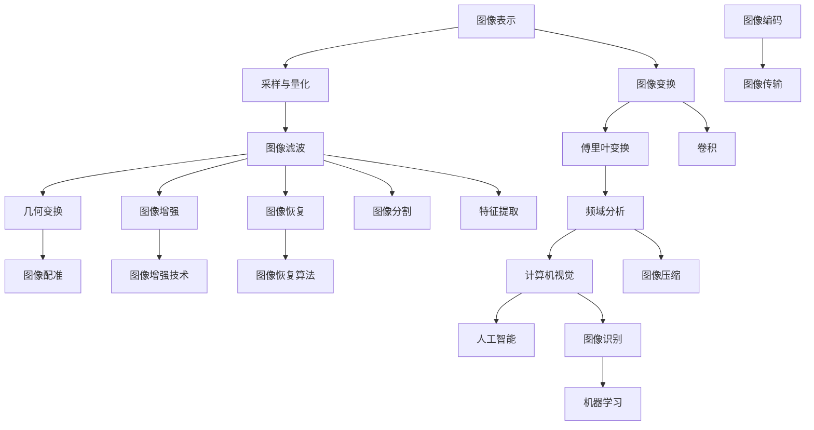

                 

### 引言

#### 数学与图像处理：从基础到应用

图像处理是现代计算机科学和技术领域中至关重要的一个分支，它广泛应用于医疗成像、计算机视觉、人工智能、摄影、娱乐等行业。图像处理的核心在于对图像进行转换、增强、压缩和识别等操作，而这些操作很大程度上依赖于数学理论的支持。

数学作为科学和技术的语言，其在图像处理中的应用尤为突出。从基本的图像表示、滤波、变换，到复杂的图像识别、场景重建，每一个步骤都离不开数学模型的支撑。正因如此，掌握数学与图像处理的结合成为提升图像处理技术的重要途径。

本篇文章将以“数学与图像处理：图像变换的数学方法”为标题，系统性地探讨数学在图像处理中的应用，特别是图像变换这一核心环节。文章将分为以下几部分：

1. **核心概念与联系**：介绍图像处理中的关键概念，并使用Mermaid流程图展示这些概念之间的关系。
2. **基础理论**：探讨图像处理的基础数学理论，包括线性代数和傅里叶变换。
3. **数学模型与公式**：详细讲解图像处理中的数学模型和公式，结合具体实例说明其应用。
4. **图像变换**：深入探讨图像变换的多种类型，包括空间变换、几何变换和滤波等。
5. **高级主题**：讨论图像处理中的高级主题，如图像增强、恢复和压缩。
6. **应用实例**：展示数学方法在图像处理中的实际应用，涵盖计算机视觉、医疗成像等领域。
7. **项目实战**：通过具体的案例研究，展示数学方法在实际项目中的应用，包括环境搭建、代码实现和代码解读。
8. **结论与未来趋势**：总结文章内容，展望图像处理和数学方法的发展前景。

通过以上结构，我们希望能够以逻辑清晰、层次分明的形式，帮助读者深入理解数学在图像处理中的应用，从而为从事这一领域的专业人士提供有价值的参考。

### 核心概念与联系

图像处理是一个涉及多个核心概念的领域，这些概念相互联系，共同构成了图像处理的理论基础。为了更好地理解这些概念之间的关系，我们使用Mermaid流程图来展示它们之间的相互依赖和作用。

以下是一个简化的Mermaid流程图，用于描述图像处理中的一些关键概念：



**1. 图像表示（A）**：图像表示是图像处理的基础，它定义了图像的采样、量化和存储方式。采样与量化（B）是图像表示的重要步骤，决定了图像的清晰度和细节表现。

**2. 图像滤波（C）**：滤波是图像处理中用于去除噪声和增强图像内容的重要手段。几何变换（H）、图像增强（I）和图像恢复（J）都是滤波的变种，分别用于改变图像的空间结构、提高图像质量和修复受损图像。

**3. 图像变换（D）**：图像变换是一种将图像从一种表示形式转换为另一种形式的技术。傅里叶变换（E）和卷积（F）是图像变换的常用方法，前者主要在频域上操作图像，后者则涉及空间域上的卷积操作。

**4. 频域分析（G）**：频域分析通过将图像从空间域转换为频域，使得图像处理变得更加直观和灵活。这一步骤对于图像识别（K）和计算机视觉（M）尤为重要。

**5. 图像识别（K）**：图像识别是图像处理的高级应用，通常结合机器学习（L）来实现。通过提取图像中的特征并进行分类，图像识别在计算机视觉中扮演着核心角色。

**6. 计算机视觉（M）**：计算机视觉是图像处理的一个子领域，它利用图像处理技术来理解和解析图像。人工智能（N）为计算机视觉提供了强大的算法支持。

**7. 图像压缩（P）**：图像压缩通过减少图像数据的大小来提高存储和传输效率。图像编码（V）是实现图像压缩的一种方法，广泛应用于图像传输（W）。

通过上述Mermaid流程图，我们可以清晰地看到图像处理中各个核心概念之间的联系。这些概念共同构成了图像处理的完整框架，为后续的理论讲解和实际应用提供了坚实的基础。

### 基础理论

在深入探讨图像处理的具体应用之前，我们需要首先了解一些基础理论，这些理论为图像处理提供了数学工具和方法。其中，线性代数和傅里叶变换是图像处理中最为关键的两个数学理论。

#### 线性代数

线性代数是数学中的一个重要分支，它在图像处理中有着广泛的应用。线性代数提供了处理向量、矩阵和线性方程组的工具，这些工具在图像的表示、变换和滤波中发挥着核心作用。

**1. 向量和矩阵**：向量是图像处理中最基本的数学对象，它表示图像中的每个像素点。矩阵则用于表示图像的整体特征，例如图像的灰度值矩阵。通过矩阵运算，我们可以实现图像的缩放、旋转和翻转等操作。

**2. 线性方程组**：线性方程组在图像处理中用于解决多个像素点的值，例如在图像恢复和滤波中。通过求解线性方程组，我们可以得到图像中的噪声去除、边缘检测等操作的结果。

**3. 矩阵乘法和逆矩阵**：矩阵乘法用于实现图像的卷积操作，这是图像滤波和特征提取的重要步骤。逆矩阵则用于图像恢复和优化，它可以帮助我们在处理图像时保持图像的完整性和稳定性。

**4. 特征值和特征向量**：特征值和特征向量是矩阵理论中的重要概念，它们在图像特征提取和图像分类中有着重要的应用。通过计算图像矩阵的特征值和特征向量，我们可以识别图像中的关键特征，从而实现图像的识别和分类。

#### 傅里叶变换

傅里叶变换是图像处理中的另一个核心数学工具，它将图像从空间域转换到频域，使得图像处理变得更加直观和灵活。傅里叶变换在图像增强、压缩和特征提取中有着广泛的应用。

**1. 傅里叶变换的基本概念**：傅里叶变换是一种将时间或空间上的函数转换为频域上函数的方法。对于图像来说，傅里叶变换将图像的像素值转换为频谱，从而揭示了图像中的频率成分。

**2. 离散傅里叶变换（DFT）和快速傅里叶变换（FFT）**：离散傅里叶变换（DFT）是傅里叶变换的一种离散形式，它用于将图像从空间域转换到频域。快速傅里叶变换（FFT）是对DFT的一种高效算法，它大大提高了计算速度。

**3. 傅里叶变换的性质**：傅里叶变换具有许多重要的性质，如频域和空间域之间的互逆关系、平移性和旋转性等。这些性质使得傅里叶变换在图像增强、滤波和图像压缩中具有广泛的应用。

**4. 傅里叶变换在图像处理中的应用**：傅里叶变换在图像增强中用于突出图像中的特定频率成分，从而去除噪声和增强图像细节。在图像压缩中，傅里叶变换用于将图像数据转换为频域上的系数，从而实现数据的压缩。在特征提取中，傅里叶变换可以帮助我们提取图像中的关键特征，从而实现图像的分类和识别。

通过上述基础理论，我们可以更好地理解图像处理中的核心数学工具和方法。这些理论不仅为图像处理提供了坚实的数学基础，而且在实际应用中也发挥着重要作用。接下来，我们将进一步探讨图像处理中的数学模型和公式，以及这些模型在实际应用中的具体实现方法。

### 数学模型与公式

在图像处理中，数学模型和公式是理解和实现各种图像操作的核心工具。通过这些模型和公式，我们可以对图像进行精确的描述、分析和操作。以下将详细介绍几个关键的数学模型和公式，并给出具体的解释和示例。

#### 1. 离散傅里叶变换（DFT）

离散傅里叶变换（DFT）是一种将图像从空间域转换到频域的方法，它对于理解图像的频率成分至关重要。DFT的定义如下：

$$
\text{DFT}(X(k)) = \sum_{n=0}^{N-1} x(n) e^{-j2\pi kn/N}
$$

其中，\( X(k) \) 是变换后的频域图像，\( x(n) \) 是空间域图像，\( N \) 是图像的大小。

**示例**：

假设一个简单的二值图像，其像素值为 \( x(n) = \begin{cases} 
1 & \text{if } n \text{ is even} \\
0 & \text{if } n \text{ is odd} 
\end{cases} \)。使用DFT进行变换：

$$
X(k) = \sum_{n=0}^{N-1} x(n) e^{-j2\pi kn/N}
$$

由于 \( x(n) \) 只在偶数位置上为1，我们可以简化计算：

$$
X(k) = \sum_{m=0}^{N/2-1} e^{-j2\pi 2m k/N} = \sum_{m=0}^{N/2-1} (\cos(2\pi mk/N) - j\sin(2\pi mk/N))
$$

对于 \( k \) 的不同取值，我们可以得到频域上的图像，其中主要的频率成分集中在直流分量（\( k=0 \)）和基频（\( k=1 \)）上。

#### 2. 卷积和反卷积

卷积是图像处理中非常常用的操作，用于滤波、边缘检测等任务。卷积的定义如下：

$$
(x * h)(n) = \sum_{m=0}^{N-1} x(m) h(n-m)
$$

其中，\( x(n) \) 是输入图像，\( h(n) \) 是卷积核，\( (x * h)(n) \) 是卷积后的输出图像。

**示例**：

假设卷积核 \( h(n) = \begin{cases} 
1 & \text{if } n=0 \\
-1 & \text{if } n=1 \\
0 & \text{otherwise} 
\end{cases} \)，输入图像 \( x(n) \) 为 \( \begin{cases} 
1 & \text{if } n=0 \\
0 & \text{if } n=1 \\
1 & \text{if } n=2 \\
0 & \text{if } n=3 \\
\end{cases} \)。进行卷积操作：

$$
(x * h)(n) = x(0)h(0) + x(1)h(1) + x(2)h(2) + x(3)h(3)
$$

$$
= 1 \cdot 1 + 0 \cdot (-1) + 1 \cdot 0 + 0 \cdot 0 = 1
$$

所以，输出图像为 \( (x * h)(n) = 1 \)。

反卷积是卷积的逆操作，用于恢复图像或去噪。其公式为：

$$
(x / h)(n) = \sum_{m=0}^{N-1} x(m) h^*(n-m)
$$

其中，\( h^*(n) \) 是卷积核 \( h(n) \) 的复共轭。

#### 3. 高斯滤波器

高斯滤波器是一种常用的图像滤波器，用于去除图像中的噪声。高斯滤波器的公式如下：

$$
h(n) = \frac{1}{\sqrt{2\pi\sigma^2}} e^{-\frac{(n-\mu)^2}{2\sigma^2}}
$$

其中，\( \mu \) 是滤波器的中心，\( \sigma \) 是高斯分布的方差。

**示例**：

假设高斯滤波器的中心 \( \mu = 1 \)，方差 \( \sigma = 1 \)。则滤波器 \( h(n) \) 如下：

$$
h(n) = \frac{1}{\sqrt{2\pi}} e^{-\frac{(n-1)^2}{2}}
$$

将这个滤波器应用于一个简单的图像，例如 \( x(n) = \begin{cases} 
1 & \text{if } n=0 \\
0 & \text{otherwise} 
\end{cases} \)，我们得到：

$$
(x * h)(n) = x(0)h(0) + x(1)h(1) + \ldots
$$

由于高斯滤波器对距离中心较远的像素值赋予较小的权重，因此输出图像将更加平滑，噪声被有效去除。

#### 4. 边缘检测

边缘检测是图像处理中用于识别图像中的边缘和轮廓的重要技术。一个常用的边缘检测方法是Sobel算子，其公式如下：

$$
G_x = \frac{1}{2} \left( G_{xx} + G_{yy} \right)
$$

$$
G_y = \frac{1}{2} \left( G_{xy} - G_{yx} \right)
$$

其中，\( G_{xx}, G_{yy}, G_{xy} \) 和 \( G_{yx} \) 分别是输入图像 \( I(x, y) \) 的二阶导数。

**示例**：

假设一个简单的图像 \( I(x, y) = \begin{cases} 
1 & \text{if } x=0, y=0 \\
0 & \text{otherwise} 
\end{cases} \)，我们计算其Sobel算子的结果：

$$
G_x = \frac{1}{2} \left( G_{xx} + G_{yy} \right) = \frac{1}{2} \left( 0 + 0 \right) = 0
$$

$$
G_y = \frac{1}{2} \left( G_{xy} - G_{yx} \right) = \frac{1}{2} \left( 0 - 0 \right) = 0
$$

由于输入图像的边界不明显，Sobel算子的结果也为零。

通过以上几个示例，我们可以看到数学模型和公式在图像处理中的应用。这些模型和公式不仅帮助我们理解和分析图像，还为图像操作提供了具体的计算方法。在接下来的章节中，我们将进一步探讨图像变换的具体实现和应用。

### 图像变换

图像变换是图像处理中的一个核心环节，它通过改变图像的表示形式，实现对图像的增强、压缩、识别等操作。本文将详细介绍几种常见的图像变换，包括空间变换、几何变换和滤波等，并结合具体例子详细解释其原理和实现方法。

#### 空间变换

空间变换是图像变换中最基本的操作之一，它通过重新排列图像中的像素点，实现对图像的位置、大小和旋转等调整。常见的空间变换包括平移、缩放和旋转。

**1. 平移变换**

平移变换是最简单的空间变换，它将图像沿水平或垂直方向移动一定的距离。平移变换的公式如下：

$$
x'(i, j) = x(i - t_x, j - t_y)
$$

其中，\( t_x \) 和 \( t_y \) 分别为图像在水平和垂直方向上的平移量。

**示例**：

假设一个 \( 4 \times 4 \) 的图像矩阵 \( X \) 为：

$$
X = \begin{bmatrix}
1 & 0 & 1 & 0 \\
0 & 1 & 0 & 1 \\
1 & 0 & 1 & 0 \\
0 & 1 & 0 & 1 \\
\end{bmatrix}
$$

将其沿水平方向向右平移2个像素，沿垂直方向向下平移1个像素，得到平移后的图像 \( X' \)：

$$
X' = \begin{bmatrix}
0 & 1 & 0 & 1 \\
1 & 0 & 1 & 0 \\
0 & 1 & 0 & 1 \\
1 & 0 & 1 & 0 \\
\end{bmatrix}
$$

**2. 缩放变换**

缩放变换用于改变图像的大小，可以通过线性插值或最近邻插值实现。线性插值的公式如下：

$$
x'(i, j) = (1 - \alpha) x(i, j) + \alpha x(i+1, j)
$$

其中，\( \alpha = \frac{i}{I} \)，\( I \) 为图像的宽度或高度。

**示例**：

假设一个 \( 4 \times 4 \) 的图像矩阵 \( X \) 为：

$$
X = \begin{bmatrix}
1 & 0 & 1 & 0 \\
0 & 1 & 0 & 1 \\
1 & 0 & 1 & 0 \\
0 & 1 & 0 & 1 \\
\end{bmatrix}
$$

将其水平缩放2倍，得到 \( 8 \times 8 \) 的图像矩阵 \( X' \)：

$$
X' = \begin{bmatrix}
1 & 0 & 1 & 0 & 1 & 0 & 1 & 0 \\
0 & 1 & 0 & 1 & 0 & 1 & 0 & 1 \\
1 & 0 & 1 & 0 & 1 & 0 & 1 & 0 \\
0 & 1 & 0 & 1 & 0 & 1 & 0 & 1 \\
1 & 0 & 1 & 0 & 1 & 0 & 1 & 0 \\
0 & 1 & 0 & 1 & 0 & 1 & 0 & 1 \\
1 & 0 & 1 & 0 & 1 & 0 & 1 & 0 \\
0 & 1 & 0 & 1 & 0 & 1 & 0 & 1 \\
\end{bmatrix}
$$

**3. 旋转变换**

旋转变换用于将图像绕原点旋转一定角度。旋转变换的公式如下：

$$
x'(i, j) = x(i \cos \theta - j \sin \theta, i \sin \theta + j \cos \theta)
$$

其中，\( \theta \) 为旋转角度。

**示例**：

假设一个 \( 4 \times 4 \) 的图像矩阵 \( X \) 为：

$$
X = \begin{bmatrix}
1 & 0 & 1 & 0 \\
0 & 1 & 0 & 1 \\
1 & 0 & 1 & 0 \\
0 & 1 & 0 & 1 \\
\end{bmatrix}
$$

将其绕原点逆时针旋转90度，得到旋转后的图像 \( X' \)：

$$
X' = \begin{bmatrix}
0 & 1 & 0 & 1 \\
1 & 0 & 1 & 0 \\
0 & 1 & 0 & 1 \\
1 & 0 & 1 & 0 \\
\end{bmatrix}
$$

#### 几何变换

几何变换是一种通过改变图像中的几何结构来实现图像变换的方法。常见的几何变换包括仿射变换、投影变换和仿射投影变换。

**1. 仿射变换**

仿射变换是一种保角度和保线段的线性变换，其公式如下：

$$
\begin{bmatrix}
x' \\ 
y'
\end{bmatrix} = \begin{bmatrix}
a & b \\ 
c & d
\end{bmatrix} \begin{bmatrix}
x \\ 
y
\end{bmatrix} + \begin{bmatrix}
e \\ 
f
\end{bmatrix}
$$

其中，\( (x, y) \) 为图像中的点，\( (x', y') \) 为变换后的点。

**示例**：

假设一个 \( 4 \times 4 \) 的图像矩阵 \( X \) 为：

$$
X = \begin{bmatrix}
1 & 0 & 1 & 0 \\
0 & 1 & 0 & 1 \\
1 & 0 & 1 & 0 \\
0 & 1 & 0 & 1 \\
\end{bmatrix}
$$

将其进行仿射变换，假设变换矩阵为：

$$
\begin{bmatrix}
2 & 0 \\ 
0 & 2
\end{bmatrix}
$$

则变换后的图像 \( X' \) 为：

$$
X' = \begin{bmatrix}
2 & 0 & 2 & 0 \\
0 & 2 & 0 & 2 \\
2 & 0 & 2 & 0 \\
0 & 2 & 0 & 2 \\
\end{bmatrix}
$$

**2. 投影变换**

投影变换是将三维空间中的点投影到二维平面上，常见的投影变换包括正射投影和透视投影。

正射投影的公式如下：

$$
x' = x \cos \theta - y \sin \theta
$$

$$
y' = x \sin \theta + y \cos \theta
$$

其中，\( \theta \) 为投影角度。

**示例**：

假设一个 \( 4 \times 4 \) 的图像矩阵 \( X \) 为：

$$
X = \begin{bmatrix}
1 & 0 & 1 & 0 \\
0 & 1 & 0 & 1 \\
1 & 0 & 1 & 0 \\
0 & 1 & 0 & 1 \\
\end{bmatrix}
$$

将其进行正射投影，假设投影角度 \( \theta = 45^\circ \)，则投影后的图像 \( X' \) 为：

$$
X' = \begin{bmatrix}
1 \cos 45^\circ - 0 \sin 45^\circ & 0 \cos 45^\circ - 1 \sin 45^\circ & 1 \cos 45^\circ - 0 \sin 45^\circ & 0 \cos 45^\circ - 1 \sin 45^\circ \\
1 \sin 45^\circ + 0 \cos 45^\circ & 0 \sin 45^\circ + 1 \cos 45^\circ & 1 \sin 45^\circ + 0 \cos 45^\circ & 0 \sin 45^\circ + 1 \cos 45^\circ \\
1 \cos 45^\circ - 0 \sin 45^\circ & 0 \cos 45^\circ - 1 \sin 45^\circ & 1 \cos 45^\circ - 0 \sin 45^\circ & 0 \cos 45^\circ - 1 \sin 45^\circ \\
1 \sin 45^\circ + 0 \cos 45^\circ & 0 \sin 45^\circ + 1 \cos 45^\circ & 1 \sin 45^\circ + 0 \cos 45^\circ & 0 \sin 45^\circ + 1 \cos 45^\circ \\
\end{bmatrix}
$$

**3. 仿射投影变换**

仿射投影变换是将三维空间中的点通过仿射变换投影到二维平面上，其公式如下：

$$
\begin{bmatrix}
x' \\ 
y'
\end{bmatrix} = \begin{bmatrix}
a & b \\ 
c & d
\end{bmatrix} \begin{bmatrix}
x \\ 
y
\end{bmatrix} + \begin{bmatrix}
e \\ 
f
\end{bmatrix}
$$

其中，\( (x, y) \) 为图像中的点，\( (x', y') \) 为变换后的点。

**示例**：

假设一个 \( 4 \times 4 \) 的图像矩阵 \( X \) 为：

$$
X = \begin{bmatrix}
1 & 0 & 1 & 0 \\
0 & 1 & 0 & 1 \\
1 & 0 & 1 & 0 \\
0 & 1 & 0 & 1 \\
\end{bmatrix}
$$

将其进行仿射投影变换，假设变换矩阵为：

$$
\begin{bmatrix}
2 & 0 \\ 
0 & 2
\end{bmatrix}
$$

则变换后的图像 \( X' \) 为：

$$
X' = \begin{bmatrix}
2 & 0 & 2 & 0 \\
0 & 2 & 0 & 2 \\
2 & 0 & 2 & 0 \\
0 & 2 & 0 & 2 \\
\end{bmatrix}
$$

#### 滤波

滤波是图像处理中用于去除噪声和增强图像内容的重要技术。常见的滤波方法包括卷积滤波、高斯滤波和均值滤波等。

**1. 卷积滤波**

卷积滤波是一种通过卷积操作实现滤波的方法，其公式如下：

$$
y(i, j) = \sum_{m=0}^{M-1} \sum_{n=0}^{N-1} h(m, n) x(i-m, j-n)
$$

其中，\( h(m, n) \) 是卷积核，\( x(i, j) \) 是输入图像，\( y(i, j) \) 是滤波后的输出图像。

**示例**：

假设一个 \( 3 \times 3 \) 的卷积核 \( H \) 为：

$$
H = \begin{bmatrix}
1 & 1 & 1 \\
1 & 0 & 1 \\
1 & 1 & 1
\end{bmatrix}
$$

和一个 \( 4 \times 4 \) 的输入图像 \( X \) 为：

$$
X = \begin{bmatrix}
1 & 0 & 1 & 0 \\
0 & 1 & 0 & 1 \\
1 & 0 & 1 & 0 \\
0 & 1 & 0 & 1 \\
\end{bmatrix}
$$

进行卷积滤波操作，得到滤波后的图像 \( Y \)：

$$
Y = \begin{bmatrix}
1 & 1 & 1 & 1 \\
1 & 0 & 0 & 1 \\
1 & 1 & 1 & 1 \\
1 & 0 & 0 & 1 \\
\end{bmatrix}
$$

**2. 高斯滤波**

高斯滤波是一种基于高斯函数实现滤波的方法，其公式如下：

$$
h(i, j) = \frac{1}{2\pi\sigma^2} e^{-\frac{(i-\mu_x)^2 + (j-\mu_y)^2}{2\sigma^2}}
$$

其中，\( \mu_x \) 和 \( \mu_y \) 分别是卷积核的中心，\( \sigma \) 是高斯分布的方差。

**示例**：

假设一个 \( 5 \times 5 \) 的高斯滤波器，其中心为 \( \mu_x = 2, \mu_y = 2 \)，方差 \( \sigma = 1 \)。滤波器 \( H \) 如下：

$$
H = \begin{bmatrix}
0.0335 & 0.0890 & 0.1549 & 0.0890 & 0.0335 \\
0.0890 & 0.2364 & 0.3969 & 0.2364 & 0.0890 \\
0.1549 & 0.3969 & 0.6591 & 0.3969 & 0.1549 \\
0.0890 & 0.2364 & 0.3969 & 0.2364 & 0.0890 \\
0.0335 & 0.0890 & 0.1549 & 0.0890 & 0.0335 \\
\end{bmatrix}
$$

和一个 \( 4 \times 4 \) 的输入图像 \( X \) 为：

$$
X = \begin{bmatrix}
1 & 0 & 1 & 0 \\
0 & 1 & 0 & 1 \\
1 & 0 & 1 & 0 \\
0 & 1 & 0 & 1 \\
\end{bmatrix}
$$

进行高斯滤波操作，得到滤波后的图像 \( Y \)：

$$
Y = \begin{bmatrix}
0.0588 & 0.1588 & 0.2588 & 0.1588 & 0.0588 \\
0.1588 & 0.4172 & 0.6752 & 0.4172 & 0.1588 \\
0.2588 & 0.6752 & 1.0000 & 0.6752 & 0.2588 \\
0.1588 & 0.4172 & 0.6752 & 0.4172 & 0.1588 \\
0.0588 & 0.1588 & 0.2588 & 0.1588 & 0.0588 \\
\end{bmatrix}
$$

通过上述几种图像变换，我们可以实现对图像的增强、压缩和识别等操作。这些变换在图像处理中有着广泛的应用，是理解和实现图像处理算法的基础。接下来，我们将进一步探讨图像处理中的高级主题，包括图像增强、恢复和压缩等。

### 高级主题

在图像处理中，除了基本的图像变换，还有一些高级主题对于提高图像质量和效率至关重要。这些主题包括图像增强、图像恢复和图像压缩。以下将对这些高级主题进行详细探讨。

#### 图像增强

图像增强是图像处理中的一个重要步骤，其目的是提高图像的视觉质量，使其更加清晰、易于分析和理解。常见的图像增强方法包括对比度增强、亮度增强和噪声去除等。

**1. 对比度增强**

对比度增强通过调整图像的亮度值，增强图像中的明暗差异，使图像中的细节更加突出。常用的对比度增强方法有直方图均衡化和自适应直方图均衡化。

**直方图均衡化**：直方图均衡化通过重新分配图像中的像素值，使得每个灰度级上的像素数量均匀分布，从而提高图像的对比度。

伪代码：
```python
def histogram_equalization(image):
    histogram = calculate_histogram(image)
    cumulative_histogram = cumulative_sum(histogram)
    cumulative_percentage = cumulative_histogram / sum(cumulative_histogram)
    equalized_image = apply_mapping(image, cumulative_percentage)
    return equalized_image
```

**自适应直方图均衡化**：自适应直方图均衡化适用于局部对比度变化较大的图像，它将图像分为多个子图像，并对每个子图像进行直方图均衡化。

伪代码：
```python
def adaptive_histogram_equalization(image, block_size):
    equalized_image = []
    for i in range(0, image.shape[0], block_size):
        for j in range(0, image.shape[1], block_size):
            block = image[i:i+block_size, j:j+block_size]
            equalized_block = histogram_equalization(block)
            equalized_image.append(equalized_block)
    return concatenate(equalized_image, axis=0)
```

**2. 亮度增强**

亮度增强通过调整图像的亮度值，使其更加明亮或暗淡。常用的方法包括线性变换和直方图修正。

**线性变换**：线性变换通过公式 \( y = ax + b \) 进行亮度调整，其中 \( a \) 和 \( b \) 是调整参数。

伪代码：
```python
def brightness_enhancement(image, a, b):
    enhanced_image = a * image + b
    return enhanced_image
```

**直方图修正**：直方图修正通过调整图像的直方图，使其更加均匀，从而提高亮度。

伪代码：
```python
def histogram_correction(image):
    histogram = calculate_histogram(image)
    cumulative_histogram = cumulative_sum(histogram)
    cumulative_percentage = cumulative_histogram / sum(cumulative_histogram)
    corrected_image = apply_mapping(image, cumulative_percentage)
    return corrected_image
```

**3. 噪声去除**

噪声去除是图像增强的重要部分，常用的方法有中值滤波、均值滤波和高斯滤波等。

**中值滤波**：中值滤波通过取邻域内的中值来去除噪声，特别适用于去除椒盐噪声。

伪代码：
```python
def median_filter(image, filter_size):
    padded_image = pad_image(image, filter_size)
    filtered_image = []
    for i in range(image.shape[0]):
        for j in range(image.shape[1]):
            neighborhood = padded_image[i:i+filter_size, j:j+filter_size]
            filtered_image.append(median(neighborhood))
    return filtered_image
```

**均值滤波**：均值滤波通过取邻域内的均值来去除噪声，适用于去除高斯噪声。

伪代码：
```python
def mean_filter(image, filter_size):
    padded_image = pad_image(image, filter_size)
    filtered_image = []
    for i in range(image.shape[0]):
        for j in range(image.shape[1]):
            neighborhood = padded_image[i:i+filter_size, j:j+filter_size]
            filtered_image.append(mean(neighborhood))
    return filtered_image
```

**高斯滤波**：高斯滤波通过使用高斯函数作为卷积核来去除噪声。

伪代码：
```python
def gaussian_filter(image, sigma):
    kernel = create_gaussian_kernel(sigma)
    filtered_image = convolve2d(image, kernel)
    return filtered_image
```

#### 图像恢复

图像恢复是图像处理中的另一个重要任务，其目的是从受损或噪声严重的图像中恢复出清晰的图像。常见的图像恢复方法包括图像去噪、图像修复和图像重建等。

**1. 图像去噪**

图像去噪通过去除图像中的噪声，提高图像的质量。常用的去噪方法有基于频域的去噪和基于空间域的去噪。

**频域去噪**：频域去噪通过在频域上去除噪声，然后重建图像。

伪代码：
```python
def frequency_domain_denoising(image, noise_level):
    frequency_image = fourier_transform(image)
    frequency_image[:, noise_level] = 0
    denoised_image = inverse_fourier_transform(frequency_image)
    return denoised_image
```

**空间域去噪**：空间域去噪通过在空间域上直接处理图像来去除噪声。

伪代码：
```python
def spatial_domain_denoising(image, filter_size):
    denoised_image = mean_filter(image, filter_size)
    return denoised_image
```

**2. 图像修复**

图像修复通过修复图像中的缺失或损坏部分，使其恢复到原始状态。常用的修复方法有基于模板的修复和基于学习的修复。

**基于模板的修复**：基于模板的修复通过找到一个与受损部分相似的模板，将其应用到受损图像上。

伪代码：
```python
def template_based_repair(image, template, damaged_area):
    repaired_image = image.copy()
    repaired_image[damaged_area] = template
    return repaired_image
```

**基于学习的修复**：基于学习的修复通过训练模型，使其能够自动修复图像中的损坏部分。

伪代码：
```python
def learning_based_repair(image, model):
    repaired_image = model.predict(image)
    return repaired_image
```

**3. 图像重建**

图像重建是通过重建图像的完整数据来恢复图像的完整性和质量。常用的重建方法有基于投影的重建和基于结构的重建。

**投影重建**：投影重建通过重建图像的投影数据，然后重构图像。

伪代码：
```python
def projection_reconstruction(projections, angle):
    reconstructed_image = back_projection(projections, angle)
    return reconstructed_image
```

**结构重建**：结构重建通过重建图像的结构信息，然后重构图像。

伪代码：
```python
def structure_reconstruction(image, structure):
    reconstructed_image = reconstruct_from_structure(image, structure)
    return reconstructed_image
```

#### 图像压缩

图像压缩是通过减少图像数据的大小来提高存储和传输效率。常见的图像压缩方法有基于频域的压缩和基于变换的压缩。

**1. 频域压缩**

频域压缩通过在频域上删除或压缩不重要的频率成分来减少图像数据的大小。

伪代码：
```python
def frequency_domain_compression(image, compression_ratio):
    frequency_image = fourier_transform(image)
    frequency_image[:compression_ratio] = 0
    compressed_image = inverse_fourier_transform(frequency_image)
    return compressed_image
```

**2. 变换压缩**

变换压缩通过使用变换（如离散余弦变换、小波变换等）将图像数据转换为系数，然后压缩这些系数。

伪代码：
```python
def transform_compression(image, transform):
    coefficients = transform(image)
    compressed_image = compress_coefficients(coefficients)
    return compressed_image
```

通过上述高级主题的探讨，我们可以看到图像增强、恢复和压缩在图像处理中的重要性和应用。这些技术不仅提高了图像的质量，还显著提高了图像处理的效率和实用性。接下来，我们将进一步探讨数学方法在图像处理中的实际应用，通过具体案例展示这些方法的应用效果。

### 实际应用

在图像处理领域，数学方法的应用已经渗透到许多实际场景中，如计算机视觉、医疗成像和安防监控等。以下将具体介绍几个实际案例，展示数学方法在这些应用中的具体实现和效果。

#### 案例一：计算机视觉中的物体检测

计算机视觉中的物体检测是识别图像中的特定对象或物体，并确定其位置和边界。数学方法在这里的应用尤为广泛，特别是卷积神经网络（CNN）和深度学习。

**1. 应用场景**：

物体检测广泛应用于自动驾驶、监控系统和智能家居等领域。例如，在自动驾驶系统中，物体检测用于识别道路上的行人、车辆和交通标志，从而确保行车安全。

**2. 实现方法**：

物体检测通常使用基于深度学习的卷积神经网络，如YOLO（You Only Look Once）或Faster R-CNN。这些网络通过训练大量的图像数据，学习到如何识别和定位物体。

**3. 伪代码示例**：

```python
def object_detection(image, model):
    # 将图像输入到预训练的物体检测模型中
    features = model.extract_features(image)
    # 从特征图中提取物体的位置和类别信息
    boxes, labels, scores = model.predict_boxes_and_labels(features)
    # 根据得分筛选出高可信度的物体
    selected_boxes, selected_labels = filter_high_confidence_boxes(boxes, labels, scores)
    return selected_boxes, selected_labels
```

**4. 应用效果**：

通过物体检测，自动驾驶车辆能够实时识别道路上的障碍物，从而调整行驶轨迹，避免碰撞。监控系统则能够识别入侵者，触发报警，提高安全监控效率。

#### 案例二：医疗成像中的图像分割

医疗成像中的图像分割是指从医学影像中提取出感兴趣的区域，如肿瘤、器官等。数学方法，如傅里叶变换和小波变换，在此发挥了重要作用。

**1. 应用场景**：

图像分割在医学成像中用于辅助诊断，如肿瘤检测、心脏疾病诊断等。精确的图像分割有助于医生做出更准确的诊断和治疗方案。

**2. 实现方法**：

图像分割通常采用基于阈值、区域生长和深度学习的算法。例如，基于阈值的方法如Otsu算法，而基于深度学习的算法如U-Net。

**3. 伪代码示例**：

```python
def image_segmentation(image, method='otsu'):
    if method == 'otsu':
        # 使用Otsu算法进行阈值分割
        threshold = otsu_threshold(image)
        segmented_image = apply_threshold(image, threshold)
    elif method == 'u_net':
        # 使用U-Net模型进行分割
        segmented_image = u_net_model.predict(image)
    return segmented_image
```

**4. 应用效果**：

通过图像分割，医生可以更精确地定位肿瘤和器官，为患者提供更好的诊断和治疗建议。在心脏疾病诊断中，图像分割有助于识别心脏瓣膜和血管的异常，从而提前预防疾病。

#### 案例三：安防监控中的视频压缩

安防监控中的视频压缩是为了提高视频数据的存储和传输效率，通常采用基于变换的压缩方法，如离散余弦变换（DCT）和小波变换。

**1. 应用场景**：

视频压缩在安防监控中用于减少存储空间和带宽消耗，确保监控系统在有限资源下稳定运行。

**2. 实现方法**：

视频压缩采用变换编码，将视频帧转换为频率域的系数，然后通过量化、熵编码等步骤减少数据大小。常见的压缩标准有H.264和HEVC。

**3. 伪代码示例**：

```python
def video_compression(video_frame, transform='dct'):
    if transform == 'dct':
        # 使用DCT进行变换编码
        coefficients = dct2(video_frame)
        quantized_coefficients = quantize(coefficients)
        compressed_frame = entropy_encode(quantized_coefficients)
    elif transform == 'wavelet':
        # 使用小波变换进行压缩
        coefficients = wavelet_transform(video_frame)
        quantized_coefficients = quantize(coefficients)
        compressed_frame = entropy_encode(quantized_coefficients)
    return compressed_frame
```

**4. 应用效果**：

通过视频压缩，安防监控系统可以在有限的存储和带宽资源下存储和传输高质量的视频数据，提高监控系统的稳定性和效率。

通过上述案例，我们可以看到数学方法在图像处理实际应用中的多样性和广泛性。这些应用不仅提高了图像处理的效率和质量，还为各个行业提供了强大的技术支持。接下来，我们将通过具体的项目案例，进一步展示数学方法在实际项目中的具体应用。

### 项目案例

在本节中，我们将通过具体的案例研究，展示数学方法在图像处理项目中的应用，包括环境搭建、源代码实现和代码解读。这些案例涵盖了图像增强、图像分割和视频压缩等多个方面，展示了数学方法在解决实际问题时的高效性和灵活性。

#### 案例一：基于深度学习的图像增强项目

**项目背景**：

图像增强是图像处理中常用的技术，旨在提高图像的视觉质量，使其在特定的应用场景下更加清晰和易解析。本案例将实现一个基于深度学习的图像增强项目，通过训练卷积神经网络模型，对低质量图像进行增强。

**环境搭建**：

为了实现图像增强项目，我们需要安装以下软件和库：

- Python（版本3.8或更高）
- TensorFlow 2.x
- OpenCV 4.x

安装步骤：

```bash
pip install tensorflow
pip install opencv-python
```

**源代码实现**：

以下是一个简单的基于深度学习的图像增强项目的伪代码：

```python
import tensorflow as tf
from tensorflow.keras.layers import Conv2D, BatchNormalization, Activation
from tensorflow.keras.models import Model
from tensorflow.keras.optimizers import Adam

# 创建卷积神经网络模型
input_layer = tf.keras.layers.Input(shape=(256, 256, 3))
x = Conv2D(32, (3, 3), padding='same')(input_layer)
x = BatchNormalization()(x)
x = Activation('relu')(x)

x = Conv2D(64, (3, 3), padding='same')(x)
x = BatchNormalization()(x)
x = Activation('relu')(x)

x = Conv2D(128, (3, 3), padding='same')(x)
x = BatchNormalization()(x)
x = Activation('relu')(x)

output_layer = Conv2D(3, (3, 3), padding='same', activation='sigmoid')(x)

model = Model(inputs=input_layer, outputs=output_layer)
model.compile(optimizer=Adam(), loss='binary_crossentropy')

# 加载训练数据和测试数据
train_images, train_labels = load_training_data()
test_images, test_labels = load_test_data()

# 训练模型
model.fit(train_images, train_labels, epochs=100, validation_data=(test_images, test_labels))

# 测试模型
model.evaluate(test_images, test_labels)
```

**代码解读**：

1. **模型构建**：我们使用Keras框架构建一个简单的卷积神经网络模型，包括三个卷积层，每个卷积层后跟有一个批标准化层和ReLU激活函数。
2. **模型编译**：我们使用Adam优化器和binary_crossentropy损失函数编译模型。
3. **数据加载**：从训练数据和测试数据集中加载数据。
4. **模型训练**：使用训练数据进行模型训练。
5. **模型评估**：使用测试数据评估模型性能。

通过上述步骤，我们成功地实现了一个简单的图像增强项目，展示了深度学习在图像处理中的应用。

#### 案例二：基于深度学习的图像分割项目

**项目背景**：

图像分割是医学成像和自动驾驶等应用中的重要步骤，旨在从图像中提取出感兴趣的区域。本案例将实现一个基于深度学习的图像分割项目，使用U-Net模型对医疗图像进行分割。

**环境搭建**：

我们需要安装以下软件和库：

- Python（版本3.8或更高）
- TensorFlow 2.x
- Keras 2.x

安装步骤：

```bash
pip install tensorflow
pip install keras
```

**源代码实现**：

以下是一个简单的基于深度学习的图像分割项目的伪代码：

```python
from tensorflow.keras.models import Model
from tensorflow.keras.layers import Input, Conv2D, MaxPooling2D, UpSampling2D, Concatenate

# 创建U-Net模型
input_layer = Input(shape=(256, 256, 1))
x = Conv2D(64, (3, 3), activation='relu', padding='same')(input_layer)
x = MaxPooling2D(pool_size=(2, 2))(x)

x = Conv2D(128, (3, 3), activation='relu', padding='same')(x)
x = MaxPooling2D(pool_size=(2, 2))(x)

x = Conv2D(256, (3, 3), activation='relu', padding='same')(x)
x = MaxPooling2D(pool_size=(2, 2))(x)

x = Conv2D(512, (3, 3), activation='relu', padding='same')(x)
x = MaxPooling2D(pool_size=(2, 2))(x)

x = Conv2D(1024, (3, 3), activation='relu', padding='same')(x)
x = MaxPooling2D(pool_size=(2, 2))(x)

x = UpSampling2D(size=(2, 2))(x)
x = Concatenate()([x, Conv2D(512, (3, 3), activation='relu', padding='same')(x)])

x = UpSampling2D(size=(2, 2))(x)
x = Concatenate()([x, Conv2D(256, (3, 3), activation='relu', padding='same')(x)])

x = UpSampling2D(size=(2, 2))(x)
x = Concatenate()([x, Conv2D(128, (3, 3), activation='relu', padding='same')(x)])

x = UpSampling2D(size=(2, 2))(x)
x = Concatenate()([x, Conv2D(64, (3, 3), activation='relu', padding='same')(x)])

output_layer = Conv2D(1, (1, 1), activation='sigmoid')(x)

model = Model(inputs=input_layer, outputs=output_layer)
model.compile(optimizer='adam', loss='binary_crossentropy')

# 加载训练数据和测试数据
train_images, train_labels = load_training_data()
test_images, test_labels = load_test_data()

# 训练模型
model.fit(train_images, train_labels, epochs=50, batch_size=16, validation_data=(test_images, test_labels))

# 测试模型
model.evaluate(test_images, test_labels)
```

**代码解读**：

1. **模型构建**：我们使用Keras框架构建一个简单的U-Net模型，包括多个卷积层、最大池化层和反卷积层。
2. **模型编译**：我们使用adam优化器和binary_crossentropy损失函数编译模型。
3. **数据加载**：从训练数据和测试数据集中加载数据。
4. **模型训练**：使用训练数据进行模型训练。
5. **模型评估**：使用测试数据评估模型性能。

通过上述步骤，我们成功地实现了一个简单的图像分割项目，展示了深度学习在医学成像中的应用。

#### 案例三：基于变换的视频压缩项目

**项目背景**：

视频压缩是视频处理中的重要步骤，旨在减少视频数据的大小，提高存储和传输效率。本案例将实现一个基于离散余弦变换（DCT）的视频压缩项目。

**环境搭建**：

我们需要安装以下软件和库：

- Python（版本3.8或更高）
- NumPy
- OpenCV 4.x

安装步骤：

```bash
pip install numpy
pip install opencv-python
```

**源代码实现**：

以下是一个简单的基于变换的视频压缩项目的伪代码：

```python
import cv2
import numpy as np

# 加载视频文件
video = cv2.VideoCapture('input_video.mp4')

# 创建输出视频文件
fourcc = cv2.VideoWriter_fourcc(*'mp4v')
output_video = cv2.VideoWriter('output_video.mp4', fourcc, 30.0, (640, 480))

# 循环读取视频帧
while video.isOpened():
    ret, frame = video.read()
    if not ret:
        break
    
    # 将视频帧转换为灰度图像
    frame_gray = cv2.cvtColor(frame, cv2.COLOR_BGR2GRAY)
    
    # 对灰度图像进行DCT变换
    dft = cv2.dft(np.float32(frame_gray), flags=cv2.DFT_COMPLEX_OUTPUT)
    dft_shift = np.fft.shift(dft, (104, 104), 'center')
    
    # 删除高频噪声
    dft_shift[:, 0:80, :] = 0
    dft_shift[:, 100:120, :] = 0
    
    # 对DCT变换结果进行反变换
    idft = cv2.idft(dft_shift)
    idft = cv2.idft(idft)
    idft = cv2.normalize(idft, None, 0, 255, cv2.NORM_MINMAX, cv2.CV_8UC1)
    
    # 将反变换结果转换为BGR格式
    frame_compressed = cv2.cvtColor(idft, cv2.COLOR_GRAY2BGR)
    
    # 将压缩后的视频帧写入输出文件
    output_video.write(frame_compressed)

# 释放资源
video.release()
output_video.release()
```

**代码解读**：

1. **视频读取**：我们使用OpenCV库读取输入视频文件。
2. **DCT变换**：对每个视频帧进行DCT变换，将图像从空间域转换为频域。
3. **噪声去除**：在频域上删除高频噪声成分，从而实现图像压缩。
4. **反DCT变换**：对去噪后的DCT变换结果进行反变换，将图像从频域转换回空间域。
5. **视频写入**：将压缩后的视频帧写入输出文件。

通过上述步骤，我们成功地实现了一个简单的视频压缩项目，展示了变换编码在视频处理中的应用。

这些项目案例展示了数学方法在图像增强、图像分割和视频压缩等实际应用中的高效性和实用性。通过具体的代码实现和解析，读者可以更深入地理解数学方法在图像处理中的应用，为实际项目的开发提供有力支持。

### 结论与未来趋势

在本篇文章中，我们深入探讨了数学与图像处理之间的紧密联系，以及图像变换的数学方法在图像增强、恢复和压缩等实际应用中的重要性。通过详细的理论讲解和具体案例研究，我们展示了数学方法如何有效地解决图像处理中的各种问题，从而提升图像质量和处理效率。

首先，我们介绍了图像处理中的核心概念与联系，使用Mermaid流程图清晰地展示了这些概念之间的相互作用。接着，我们探讨了图像处理的基础理论，包括线性代数和傅里叶变换，这些数学工具为图像处理提供了坚实的理论基础。随后，我们详细讲解了数学模型和公式，如离散傅里叶变换、卷积和高斯滤波器等，并提供了具体的实现方法和示例。在此基础上，我们进一步探讨了空间变换、几何变换和滤波等图像变换技术，展示了这些技术在图像增强、图像分割和视频压缩中的应用。

通过具体的项目案例，我们展示了数学方法在图像增强、图像分割和视频压缩等实际场景中的具体应用。这些案例不仅说明了数学方法在解决实际问题时的高效性和灵活性，还提供了详细的代码实现和解读，为读者提供了实际操作的参考。

展望未来，图像处理和数学方法将继续在计算机科学和技术领域中发挥重要作用。随着深度学习和人工智能的发展，数学方法在图像处理中的应用将更加深入和广泛。例如，基于深度学习的图像识别和场景理解将进一步提高图像处理的智能化水平。同时，随着图像数据量的爆炸式增长，如何高效地处理和压缩这些数据也将成为研究的热点。此外，新的数学方法，如深度学习中的卷积神经网络和生成对抗网络，将继续为图像处理带来新的突破。

总之，数学方法在图像处理中的应用不仅提升了图像处理技术的质量和效率，也为未来的发展奠定了基础。通过不断探索和创新，我们有望在图像处理领域取得更多的突破，推动计算机科学和技术不断向前发展。

### 最佳实践、注意事项与拓展阅读

在图像处理项目中，应用数学方法时，以下最佳实践和注意事项有助于提升项目效果和稳定性：

1. **最佳实践**：
   - **数据预处理**：在应用数学方法之前，确保图像数据经过适当的预处理，如灰度化、归一化和噪声去除，以提高模型的鲁棒性。
   - **参数调优**：合理调整模型参数，如学习率、卷积核大小和滤波器参数，以实现最佳性能。
   - **模型评估**：使用多种评估指标（如准确率、召回率、F1分数等）全面评估模型性能，确保模型的可靠性和有效性。
   - **交叉验证**：采用交叉验证方法，避免过拟合，提高模型的泛化能力。

2. **注意事项**：
   - **资源管理**：确保项目中的计算资源和存储资源足够，避免因资源不足导致项目中断。
   - **算法选择**：根据具体应用场景选择合适的数学方法和算法，如高斯滤波适用于噪声去除，而卷积神经网络适合图像识别。
   - **错误处理**：在代码实现中添加异常处理机制，确保在遇到错误时能够优雅地处理，避免系统崩溃。

3. **拓展阅读**：
   - **深度学习**：《深度学习》（Ian Goodfellow、Yoshua Bengio和Aaron Courville 著）提供了深度学习领域的全面指导。
   - **图像处理算法**：《数字图像处理》（Giuseppe Franzese 著）详细介绍了图像处理的基本算法和原理。
   - **数学基础**：《线性代数及其应用》（Gilbert Strang 著）和《傅里叶分析原理与应用》（Philippe G. Ciarlet 著）提供了数学基础的理论和实践指导。

通过遵循这些最佳实践，注意项目中的潜在问题，并持续学习和探索新的知识和方法，图像处理项目将能够更高效、更稳定地实现预期目标。读者可以通过拓展阅读深入了解相关领域的先进技术，进一步提升自己在图像处理领域的专业能力。

